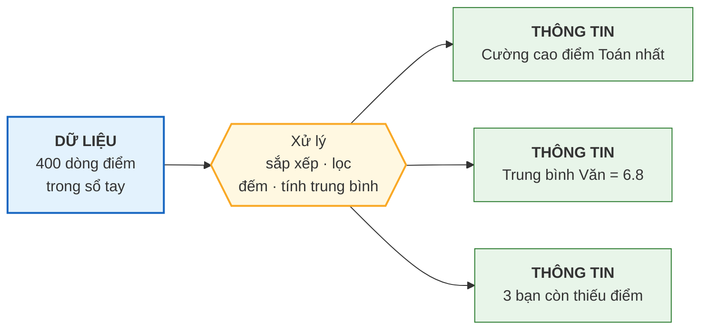
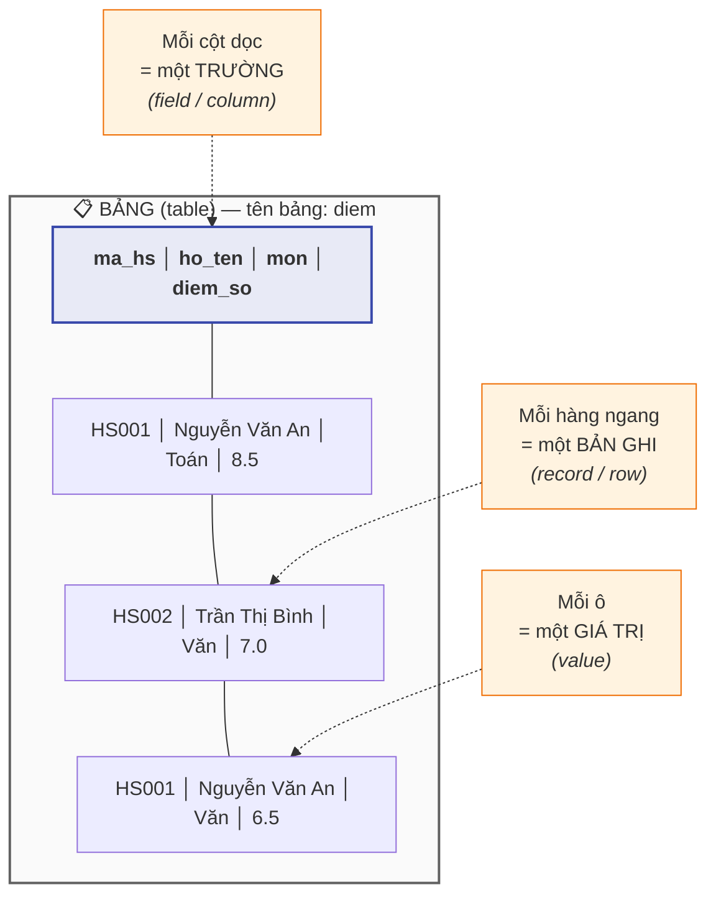

# Bài 1 — Dữ liệu, thông tin và tại sao phải lưu trữ

!!! abstract "🎯 Học xong bài này, bạn sẽ"
    - Phân biệt được **dữ liệu** và **thông tin** — hai từ mà gần như ai cũng dùng lẫn lộn
    - Gọi đúng tên các thành phần của một bảng: bản ghi, trường, giá trị
    - Hiểu vì sao người ta phải xây hẳn một loại phần mềm riêng chỉ để lưu dữ liệu
    - Đọc hiểu câu lệnh `SELECT` đầu tiên trong đời

## 🧠 Câu chuyện mở đầu

Bạn là lớp trưởng lớp 8A. Đầu năm, cô chủ nhiệm đưa bạn một quyển sổ tay và bảo: *"Em ghi hộ cô điểm kiểm tra của cả lớp nhé."*

Suốt một học kỳ, bạn ghi cần mẫn. Sổ của bạn dày đặc những dòng như thế này:

```
Nguyễn Văn An - Toán - 8.5
Trần Thị Bình - Văn - 7.0
Nguyễn Văn An - Văn - 6.5
Lê Hoàng Cường - Toán - 9.0
Trần Thị Bình - Toán - 8.0
... (còn 395 dòng nữa)
```

Cuối kỳ, cô gọi bạn lên và hỏi ba câu:

1. *"Bạn nào điểm Toán cao nhất lớp?"*
2. *"Điểm trung bình môn Văn của lớp là bao nhiêu?"*
3. *"Có bạn nào chưa có điểm môn nào không?"*

Bạn nhìn vào 400 dòng chữ trong sổ. Bạn **có đủ mọi thứ cô cần**. Nhưng để trả lời, bạn phải ngồi dò từng dòng, gạch, cộng, chia. Mất cả buổi chiều. Và tới câu thứ ba thì bạn gần như chắc chắn sẽ đếm sót.

Vấn đề ở đây rất đáng suy nghĩ: bạn đã lưu trữ đầy đủ, nhưng thứ bạn có trong tay **chưa dùng được ngay**.

Vậy thứ trong sổ của bạn và thứ cô giáo muốn — chúng khác nhau ở chỗ nào?

## 📖 Khái niệm & thuật ngữ

### Dữ liệu ≠ Thông tin

Dòng `Nguyễn Văn An - Toán - 8.5` là **dữ liệu** (*data*): một sự kiện thô, được ghi lại đúng như nó xảy ra. Nó đúng, nhưng tự nó không trả lời câu hỏi nào cả.

Câu *"An là bạn có điểm Toán cao thứ ba lớp"* là **thông tin** (*information*): kết quả sau khi đã **xử lý** dữ liệu — sắp xếp, so sánh, đếm, tính trung bình — để trả lời một câu hỏi cụ thể.

!!! tip "Cách nhớ đơn giản"
    **Dữ liệu** là nguyên liệu. **Thông tin** là món ăn.

    Trong bếp có gạo, thịt, rau — đó là dữ liệu. Bạn không ăn "gạo, thịt, rau"; bạn ăn *cơm sườn*. Nấu nướng chính là xử lý.

    Và giống hệt trong bếp: **nguyên liệu càng để riêng rẽ, gọn gàng thì càng dễ nấu ra nhiều món khác nhau**. Đây chính là lý do sâu xa của toàn bộ khóa học này.

### Mổ xẻ quyển sổ của bạn

Quyển sổ của bạn thực ra đã có cấu trúc rồi, chỉ là bạn chưa gọi tên nó. Viết lại cho ngay ngắn:

| ma_hs | ho_ten | mon | diem_so |
|---|---|---|---|
| HS001 | Nguyễn Văn An | Toán | 8.5 |
| HS002 | Trần Thị Bình | Văn | 7.0 |
| HS001 | Nguyễn Văn An | Văn | 6.5 |
| HS003 | Lê Hoàng Cường | Toán | 9.0 |

Bây giờ mỗi phần đã có tên chuyên ngành của nó:

- Cả cái khung này là một **bảng** (*table*).
- Mỗi **hàng ngang** là một **bản ghi** (*record*), hay còn gọi là **bộ** (*tuple*) hoặc **dòng** (*row*). Một bản ghi = một lần ghi điểm.
- Mỗi **cột dọc** là một **trường** (*field*), còn gọi là **thuộc tính** (*attribute*) hoặc **cột** (*column*). Trường `diem_so` mô tả một đặc điểm của bản ghi.
- Ô giao giữa hàng và cột là một **giá trị** (*value*).
- Mã `HS001` là **định danh** (*identifier*) — thứ dùng để phân biệt An với mọi bạn khác, kể cả khi lớp có hai bạn trùng tên. Ở Bài 12 bạn sẽ biết nó có một cái tên chính thức rất quan trọng: **khoá chính**.

Gom nhiều bảng có liên quan với nhau lại, ta được một **cơ sở dữ liệu** (*database*) — kho chứa dữ liệu được tổ chức sao cho tìm và dùng lại được dễ dàng.

Và hành động "hỏi cơ sở dữ liệu một câu" gọi là **truy vấn** (*query*). Ba câu hỏi của cô giáo chính là ba truy vấn — chỉ có điều bạn phải tự chạy chúng bằng tay.

### Bảng thuật ngữ

| Tiếng Việt | English | Nghĩa dễ hiểu |
|---|---|---|
| Dữ liệu | *data* | Sự kiện thô đã được ghi lại, chưa xử lý |
| Thông tin | *information* | Kết quả sau khi xử lý dữ liệu để trả lời một câu hỏi |
| Bảng | *table* | Khung lưới gồm hàng và cột để chứa dữ liệu cùng loại |
| Bản ghi / Dòng / Bộ | *record / row / tuple* | Một hàng ngang — một "sự việc" được ghi lại |
| Trường / Cột / Thuộc tính | *field / column / attribute* | Một cột dọc — một đặc điểm được ghi lại |
| Giá trị | *value* | Nội dung của một ô |
| Định danh | *identifier* | Thứ dùng để phân biệt bản ghi này với bản ghi khác |
| Cơ sở dữ liệu | *database* | Tập hợp các bảng có liên quan, được tổ chức để dễ dùng lại |
| Truy vấn | *query* | Một câu hỏi đặt ra cho cơ sở dữ liệu |

## 🖼️ Sơ đồ

Dữ liệu biến thành thông tin qua một bước xử lý — và từ **cùng một** đống dữ liệu, ta rút ra được **nhiều** thông tin khác nhau:



Sơ đồ này giải thích luôn một quy tắc vàng mà bạn sẽ gặp lại suốt khóa học:

!!! warning "Luôn lưu dữ liệu gốc, đừng chỉ lưu kết quả"
    Nếu bạn chỉ ghi vào sổ mỗi dòng *"Trung bình Văn = 6.8"* mà xoá 400 dòng điểm gốc đi, thì hôm sau cô hỏi *"bạn nào dưới 5 điểm?"* — bạn chịu. Thông tin thì rút ra từ dữ liệu được, nhưng **dữ liệu không dựng lại được từ thông tin**. Mũi tên trong sơ đồ chỉ đi một chiều.

Còn đây là tên gọi các bộ phận của một bảng:



## 💻 Thực hành

Bài này ta chưa cài gì cả — từ **Bài 5** bạn mới chạy thật. Bây giờ chỉ cần **đọc hiểu**, vì điều bất ngờ là: câu lệnh của database đọc gần như tiếng Anh thường.

Ba câu hỏi của cô giáo, viết bằng **SQL** (*Structured Query Language* — ngôn ngữ truy vấn có cấu trúc), trông như sau:

<!-- sql:khong-chay -->
```sql
-- Câu 1: Bạn nào điểm Toán cao nhất lớp?
SELECT ho_ten, diem_so
FROM diem
WHERE mon = 'Toán'
ORDER BY diem_so DESC
LIMIT 1;
```

Đọc từng dòng đúng theo nghĩa tiếng Anh của nó:

| Dòng | Đọc là |
|---|---|
| `SELECT ho_ten, diem_so` | "Lấy cho tôi cột họ tên và cột điểm số" |
| `FROM diem` | "từ bảng tên là diem" |
| `WHERE mon = 'Toán'` | "chỉ những dòng nào có môn là Toán thôi" |
| `ORDER BY diem_so DESC` | "sắp xếp theo điểm số, giảm dần" |
| `LIMIT 1` | "và chỉ đưa tôi 1 dòng đầu tiên" |

Kết quả mong đợi:

| ho_ten | diem_so |
|---|---|
| Lê Hoàng Cường | 9.0 |

<!-- sql:khong-chay -->
```sql
-- Câu 2: Điểm trung bình môn Văn của lớp?
SELECT AVG(diem_so) AS diem_trung_binh
FROM diem
WHERE mon = 'Văn';
```

`AVG` là viết tắt của *average* — trung bình. Kết quả mong đợi:

| diem_trung_binh |
|---|
| 6.75 |

Buổi chiều dò sổ bằng tay của bạn vừa được thay bằng **năm dòng chữ, chạy trong một phần nghìn giây**. Đó là toàn bộ lý do database tồn tại.

!!! note "Chưa hiểu hết cú pháp cũng không sao"
    Mục đích của phần này chỉ là cho bạn thấy đích đến. Toàn bộ Cấp 3 (12 bài) sẽ dạy lại `SELECT`, `WHERE`, `ORDER BY` một cách chậm rãi và kỹ lưỡng.

## ⚠️ Lỗi thường gặp

!!! warning "Lỗi 1: Dùng lẫn lộn hai từ 'dữ liệu' và 'thông tin'"
    Nói *"em vừa nhập thông tin học sinh vào máy"* là sai về mặt chuyên ngành — bạn vừa nhập **dữ liệu**. Thông tin chỉ xuất hiện khi máy xử lý đống dữ liệu đó để trả lời một câu hỏi.

    Nghe có vẻ bắt bẻ chữ nghĩa, nhưng phân biệt được hai từ này sẽ giúp bạn ở Cấp 2: quy tắc "chỉ lưu dữ liệu, đừng lưu thứ tính ra được" chính là cốt lõi của **chuẩn hoá**.

!!! warning "Lỗi 2: Nghĩ rằng bảng nào cũng là cơ sở dữ liệu"
    Một bảng Excel đơn lẻ chưa phải cơ sở dữ liệu. Cơ sở dữ liệu cần **nhiều bảng có quan hệ với nhau** và một phần mềm quản lý chúng, bảo đảm không ai làm hỏng dữ liệu của ai. Bài 2 và Bài 3 sẽ cho thấy khoảng cách giữa hai thứ này lớn tới mức nào.

!!! warning "Lỗi 3: Ghi dữ liệu không có định danh"
    Trong sổ, bạn ghi *"Nguyễn Văn An - Toán - 8.5"*. Nếu lớp có **hai** bạn cùng tên Nguyễn Văn An thì điểm này của bạn nào?

    Đây không phải tình huống hiếm gặp. Mọi bảng dữ liệu nghiêm túc đều cần một cột định danh (`HS001`, `HS002`...) để phân biệt chắc chắn. Bài 12 sẽ đào sâu.

## ✍️ Bài tập

1. Một máy đo nhiệt độ ghi lại: `06:00 → 24°C`, `12:00 → 33°C`, `18:00 → 28°C`. Đâu là dữ liệu, đâu là thông tin trong câu *"Hôm nay nóng nhất lúc 12 giờ trưa"*?

2. Cho bảng sau. Hãy chỉ ra: bảng này có bao nhiêu **bản ghi**, bao nhiêu **trường**, và cột nào đóng vai trò **định danh**?

    | ma_sach | ten_sach | tac_gia | nam_xb |
    |---|---|---|---|
    | S01 | Dế Mèn phiêu lưu ký | Tô Hoài | 1941 |
    | S02 | Đất rừng phương Nam | Đoàn Giỏi | 1957 |
    | S03 | Tuổi thơ dữ dội | Phùng Quán | 1988 |

3. Câu lệnh sau đọc thành tiếng Việt là gì, và kết quả trên bảng ở câu 2 là gì?

    <!-- sql:khong-chay -->
```sql
    SELECT ten_sach
    FROM sach
    WHERE nam_xb < 1960
    ORDER BY nam_xb;
    ```

4. Thư viện trường lưu *"Tổng số sách đã cho mượn trong tháng 9: 137 lượt"* nhưng không lưu từng lượt mượn. Tháng sau, cô thủ thư muốn biết *"cuốn nào được mượn nhiều nhất tháng 9"*. Có trả lời được không? Vì sao? Lẽ ra nên lưu gì?

??? success "Đáp án"
    **Câu 1.**
    Dữ liệu là ba cặp số đo thô: `06:00 → 24°C`, `12:00 → 33°C`, `18:00 → 28°C`. Chúng được ghi đúng như máy đo được, chưa xử lý.

    Thông tin là câu *"Hôm nay nóng nhất lúc 12 giờ trưa"*. Để có câu này, ta phải **so sánh** ba giá trị và **chọn ra giá trị lớn nhất** — đó chính là bước xử lý.

    **Câu 2.**
    - **3 bản ghi** (3 hàng dữ liệu; hàng tiêu đề không tính, nó chỉ đặt tên cho các cột).
    - **4 trường**: `ma_sach`, `ten_sach`, `tac_gia`, `nam_xb`.
    - Cột định danh là **`ma_sach`**. Lý do: mỗi cuốn có một mã riêng, không trùng. Không chọn `ten_sach` vì hai cuốn khác nhau hoàn toàn có thể trùng tên; cũng không chọn `tac_gia` vì một tác giả viết nhiều cuốn.

    **Câu 3.**
    Đọc là: *"Lấy cho tôi tên sách, từ bảng sach, chỉ những cuốn xuất bản trước năm 1960, sắp xếp theo năm xuất bản tăng dần."*

    (`ORDER BY` mặc định là tăng dần — muốn giảm dần phải viết thêm `DESC`.)

    Kết quả:

    | ten_sach |
    |---|
    | Dế Mèn phiêu lưu ký |
    | Đất rừng phương Nam |

    *Tuổi thơ dữ dội* (1988) bị loại vì không thoả điều kiện `nam_xb < 1960`.

    **Câu 4.**
    **Không trả lời được.** Con số 137 là **thông tin** đã qua xử lý (cộng dồn). Khi cộng xong, chi tiết từng lượt mượn đã biến mất vĩnh viễn — không có phép tính nào tách ngược 137 ra thành "cuốn nào, ai mượn, ngày nào".

    Đây đúng là mũi tên một chiều trong sơ đồ ở trên.

    Lẽ ra thư viện nên lưu **từng lượt mượn** dưới dạng dữ liệu thô, mỗi lượt một bản ghi:

    | ma_muon | ma_sach | ma_hs | ngay_muon |
    |---|---|---|---|
    | M001 | S01 | HS001 | 2026-09-03 |
    | M002 | S03 | HS007 | 2026-09-03 |
    | M003 | S01 | HS012 | 2026-09-05 |

    Từ bảng này, con số 137 tính ra lúc nào cũng được — mà câu hỏi "cuốn nào mượn nhiều nhất" cũng trả lời được, và cả những câu hỏi chưa ai nghĩ ra hôm nay nữa.

## 🔑 Tóm tắt

1. **Dữ liệu** là sự kiện thô đã ghi lại; **thông tin** là thứ rút ra được sau khi xử lý dữ liệu để trả lời một câu hỏi.
2. Chiều biến đổi chỉ đi một hướng: từ dữ liệu ra thông tin thì được, ngược lại thì không — nên **luôn lưu dữ liệu gốc**.
3. Một **bảng** gồm các **bản ghi** (hàng) và các **trường** (cột); mỗi bảng nên có một cột **định danh** để phân biệt các bản ghi.
4. Nhiều bảng có quan hệ với nhau, được một phần mềm quản lý, hợp thành một **cơ sở dữ liệu**.
5. **SQL** là ngôn ngữ để đặt câu hỏi cho cơ sở dữ liệu; `SELECT ... FROM ... WHERE ...` đọc gần như tiếng Anh thường.

---

⬅️ [Trang chủ](../index.md) · ➡️ **Bài 2 — Từ sổ giấy đến Excel** *(sắp có)*
