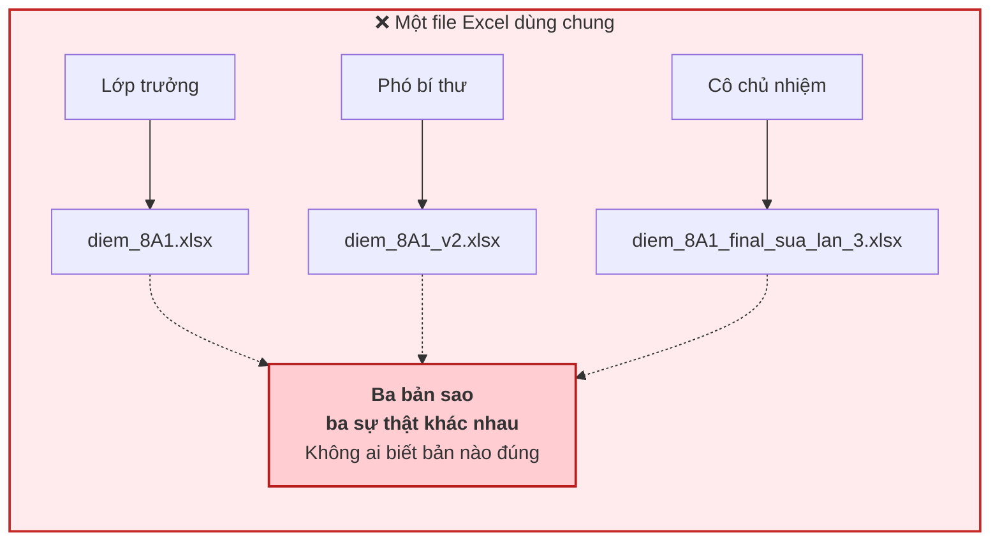
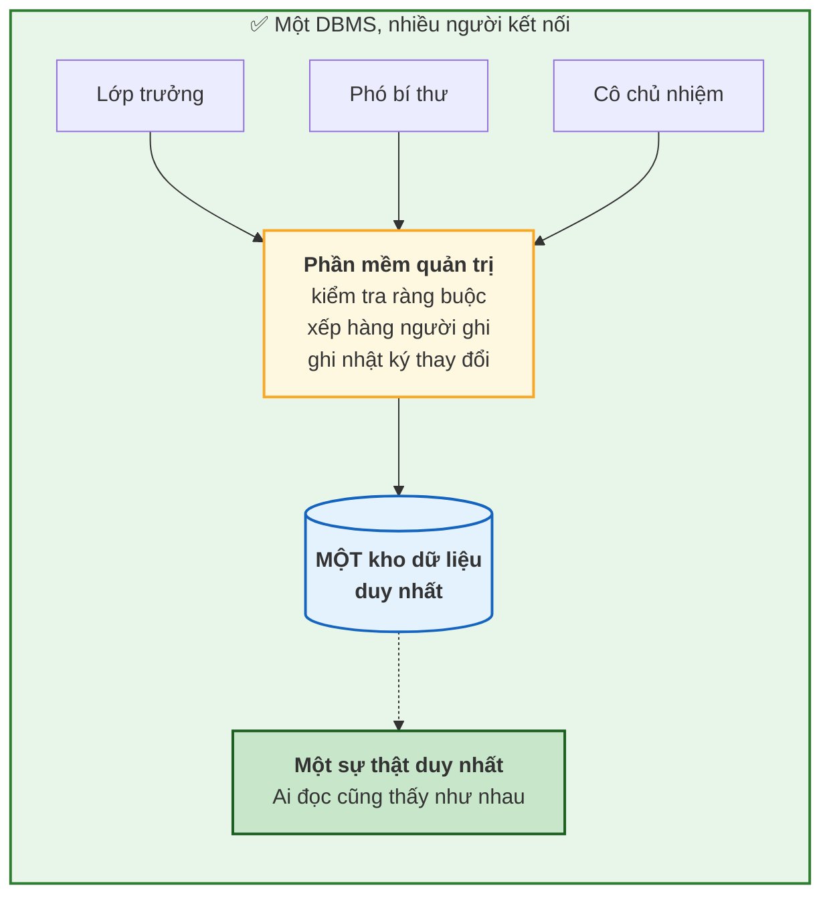
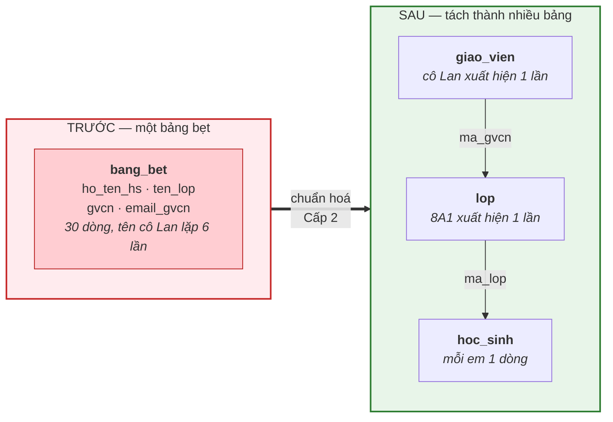

# Bài 2 — Từ sổ giấy đến Excel, và vì sao Excel vẫn chưa đủ

!!! abstract "🎯 Học xong bài này, bạn sẽ"
    - Hiểu vì sao việc **chép lặp** một thông tin ra nhiều dòng lại nguy hiểm đến thế
    - Gọi đúng tên ba "căn bệnh" kinh điển của một bảng dữ liệu tồi: bất thường khi sửa, khi thêm, khi xoá
    - Giải thích được chuyện gì xảy ra khi hai người cùng sửa một file một lúc
    - Biết khi nào Excel là đủ, và khi nào bắt buộc phải chuyển sang cơ sở dữ liệu

## 🧠 Câu chuyện mở đầu

Sau Bài 1, bạn quyết định bỏ sổ tay. Bạn mở Excel, gõ lại toàn bộ danh sách lớp 8A1 vào một file duy nhất tên `diem_8A1.xlsx`, rồi gửi lên nhóm chat của lớp.

Hai tuần đầu, mọi thứ tuyệt vời. Sắp xếp một cái là ra người điểm cao nhất, có sẵn hàm `AVERAGE`. Bạn còn được cô khen.

Rồi ba chuyện xảy ra.

**Chuyện thứ nhất.** Cô chủ nhiệm đổi email. Trong file của bạn, email của cô nằm ở cả 6 dòng — vì mỗi dòng học sinh đều có cột "email GVCN". Bạn sửa 5 dòng rồi có người gọi. Dòng thứ 6 vẫn giữ email cũ tới tận bây giờ.

**Chuyện thứ hai.** Trường mở thêm lớp 9A4, đã có cô chủ nhiệm nhưng chưa xếp học sinh nào. Bạn muốn ghi lớp này vào file. Nhưng mỗi dòng trong file là *một học sinh*. Không có học sinh thì… ghi vào đâu?

**Chuyện thứ ba.** Bốn bạn lớp 9A2 chuyển trường cùng lúc. Bạn xoá bốn dòng của họ. Xong xuôi, bạn mới nhận ra: tên cô chủ nhiệm lớp 9A2 vừa biến mất khỏi file, vì nó chỉ tồn tại trên bốn dòng đó.

Và trong lúc bạn loay hoay, bạn phó bí thư gửi lên nhóm một file tên `diem_8A1_v2_final_sua_lan_3.xlsx`. Không ai biết file nào mới nhất.

Câu hỏi của bài này: ba tai nạn trên có phải do bạn bất cẩn không — hay chúng nằm sẵn trong **cách bạn xếp dữ liệu**?

## 📖 Khái niệm & thuật ngữ

Câu trả lời: **không phải do bạn bất cẩn**. Cả ba tai nạn đều là hậu quả tất yếu của một quyết định duy nhất — nhồi mọi thứ vào **một bảng bẹt** (*flat table*).

### Gốc rễ: dư thừa dữ liệu

Hãy nhìn lại file Excel của bạn:

| ho_ten_hs | ten_lop | gvcn | email_gvcn |
|---|---|---|---|
| Nguyễn Văn An | 8A1 | Nguyễn Thị Lan | lan.nt@thcs.edu.vn |
| Trần Thị Bình | 8A1 | Nguyễn Thị Lan | lan.nt@thcs.edu.vn |
| Lê Hoàng Cường | 8A1 | Nguyễn Thị Lan | lan.nt@thcs.edu.vn |
| Phạm Thị Dung | 8A1 | Nguyễn Thị Lan | lan.nt@thcs.edu.vn |

Sự thật *"lớp 8A1 do cô Nguyễn Thị Lan chủ nhiệm, email lan.nt@thcs.edu.vn"* là **một** sự thật. Nhưng nó đang được ghi **6 lần**, một lần cho mỗi học sinh.

Hiện tượng đó gọi là **dư thừa dữ liệu** (*data redundancy*): cùng một sự thật được lưu ở nhiều chỗ.

Người mới học thường nghĩ dư thừa chỉ tốn dung lượng. Không phải. Dung lượng là chuyện nhỏ nhất. Vấn đề thật sự là: **mỗi bản sao là một cơ hội để dữ liệu tự mâu thuẫn với chính nó**.

Từ gốc rễ đó mọc ra đúng ba căn bệnh — và cả ba đều có tên chuyên ngành riêng. Chúng được gọi chung là **bất thường** (*anomaly*): những tình huống mà một thao tác hoàn toàn bình thường lại làm hỏng dữ liệu.

### Bệnh 1 — Bất thường khi cập nhật

**Bất thường khi cập nhật** (*update anomaly*): muốn sửa **một** sự thật, bạn phải sửa **nhiều** dòng; sót một dòng là dữ liệu tự mâu thuẫn.

Đây chính là chuyện thứ nhất. Sau khi bạn sửa 5 trong 6 dòng, file của bạn đang đồng thời khẳng định hai điều trái ngược: cô Lan có email mới, *và* cô Lan có email cũ. Không ai — kể cả máy tính — biết cái nào đúng.

### Bệnh 2 — Bất thường khi thêm

**Bất thường khi thêm** (*insertion anomaly*): không ghi được một sự thật vì thiếu một sự thật khác chẳng liên quan gì.

Đây là chuyện thứ hai. Lớp 9A4 có thật, cô chủ nhiệm có thật. Nhưng bảng của bạn bắt mỗi dòng phải là một học sinh, nên **bạn không được phép** ghi lớp 9A4 vào, chỉ vì lớp đó chưa có học sinh. Dữ liệu về lớp bị bắt làm con tin của dữ liệu về học sinh.

### Bệnh 3 — Bất thường khi xoá

**Bất thường khi xoá** (*deletion anomaly*): xoá một sự thật thì vô tình xoá mất một sự thật khác.

Đây là chuyện thứ ba. Bạn chỉ định xoá bốn học sinh. Nhưng vì thông tin về lớp 9A2 chỉ "đi nhờ" trên bốn dòng ấy, xoá xong là mất luôn cả lớp.

### Hai khái niệm còn lại

Phía sau cả ba căn bệnh là một mục tiêu lớn hơn: **toàn vẹn dữ liệu** (*data integrity*) — tính đúng đắn và nhất quán của dữ liệu trong suốt vòng đời của nó. Dữ liệu toàn vẹn là dữ liệu không tự mâu thuẫn, không tham chiếu tới thứ không tồn tại, và luôn thoả các quy tắc nghiệp vụ (điểm phải từ 0 đến 10, mỗi học sinh phải thuộc một lớp có thật…).

Excel **không có cách nào** ép buộc những quy tắc đó. Bạn gõ `85` vào ô điểm, Excel vui vẻ nhận. Bạn gõ tên lớp `8A9` không tồn tại, Excel cũng nhận.

Còn tai nạn `diem_8A1_v2_final_sua_lan_3.xlsx` thì thuộc về một khái niệm khác: **đồng thời** (*concurrency*) — nhiều người cùng đọc và ghi trên một tập dữ liệu tại cùng một thời điểm. Với một file, cách duy nhất để xử lý đồng thời là… mỗi người giữ một bản sao. Mà mỗi bản sao lại là một sự thật khác nhau.

### Vậy database giải quyết bằng cách nào?

Bằng ba ý tưởng, mỗi ý tưởng gỡ đúng một nút thắt:

1. **Tách bảng.** Lớp là một bảng riêng, học sinh là một bảng riêng, nối với nhau bằng mã lớp. Sự thật "8A1 do cô Lan chủ nhiệm" chỉ được ghi **một lần duy nhất**. Đây là **chuẩn hoá** (*normalization*) — toàn bộ Cấp 2 (Bài 16–20) dạy về nó.
2. **Ràng buộc.** Bạn khai báo trước các quy tắc; phần mềm từ chối mọi dữ liệu vi phạm. Cấp 1 (Bài 12–15) dạy về nó.
3. **Giao dịch.** Nhiều người kết nối cùng lúc vào **một** kho dữ liệu duy nhất, phần mềm tự xếp hàng cho họ. Không còn chuyện "file nào mới nhất". Cấp 4 (Bài 37–40) dạy về nó.

Loại phần mềm làm cả ba việc đó có tên riêng — và Bài 3 sẽ dành trọn vẹn để nói về nó.

### Bảng thuật ngữ

| Tiếng Việt | English | Nghĩa dễ hiểu |
|---|---|---|
| Bảng bẹt | *flat table* | Một bảng duy nhất nhồi mọi thứ vào, không tách |
| Dư thừa dữ liệu | *data redundancy* | Cùng một sự thật được lưu ở nhiều chỗ |
| Bất thường | *anomaly* | Thao tác bình thường nhưng lại làm hỏng dữ liệu |
| Bất thường khi cập nhật | *update anomaly* | Sửa một sự thật phải sửa nhiều dòng, sót là sai |
| Bất thường khi thêm | *insertion anomaly* | Không ghi được A vì chưa có B chẳng liên quan |
| Bất thường khi xoá | *deletion anomaly* | Xoá A thì mất luôn B ngoài ý muốn |
| Toàn vẹn dữ liệu | *data integrity* | Dữ liệu đúng đắn, nhất quán, không tự mâu thuẫn |
| Đồng thời | *concurrency* | Nhiều người cùng đọc/ghi một tập dữ liệu một lúc |
| Chuẩn hoá | *normalization* | Tách bảng để mỗi sự thật chỉ nằm ở một chỗ |

## 🖼️ Sơ đồ

Khác biệt cốt lõi không nằm ở "Excel xấu, database đẹp". Nó nằm ở chỗ **dữ liệu ở đâu và ai được chạm vào nó**:





Và đây là cách tách bảng gỡ được cả ba căn bệnh cùng một lúc:



## 💻 Thực hành

!!! note "Bạn chưa cần cài gì cả"
    Bài này vẫn là **đọc hiểu**. Từ [Bài 5](05-cai-dat-postgresql.md) bạn mới có máy để chạy thật. Khi đó, muốn tự tay thử lại đúng những câu dưới đây, hãy nạp thêm file `dataset/01-chua-chuan-hoa.sql` — file này dựng sẵn một bảng bẹt tên `bang_bet`, chính là "file Excel" trong câu chuyện, đã có đủ 30 dòng. Xem thêm ở trang [Database mẫu](../dataset.md).

### Nhìn tận mắt sự dư thừa

Câu lệnh sau gom các dòng có cùng lớp lại và đếm xem mỗi tổ hợp *(lớp, cô chủ nhiệm, email)* bị lặp bao nhiêu lần:

```sql
SELECT ten_lop, gvcn, email_gvcn, count(*) AS so_dong_lap
FROM bang_bet
GROUP BY ten_lop, gvcn, email_gvcn
ORDER BY ten_lop;
```

Kết quả:

| ten_lop | gvcn | email_gvcn | so_dong_lap |
|---|---|---|---|
| 8A1 | Nguyễn Thị Lan | lan.nt@thcs.edu.vn | 6 |
| 8A2 | Trần Văn Hùng | hung.tv@thcs.edu.vn | 6 |
| 8A3 | Lê Thị Mai | mai.lt@thcs.edu.vn | 8 |
| 9A1 | Phạm Quốc Dũng | dung.pq@thcs.edu.vn | 6 |
| 9A2 | Hoàng Thị Nhung | nhung.ht@thcs.edu.vn | 4 |

Năm sự thật, nhưng đang chiếm 30 dòng. Cột `so_dong_lap` chính là "số dòng bạn phải sửa nếu một cô đổi email".

### Dựng lại tai nạn thứ nhất

Bây giờ ta cố tình sửa sót một dòng, y hệt bạn hôm đó:

```sql
BEGIN;

UPDATE bang_bet
SET email_gvcn = 'lan.nt.moi@thcs.edu.vn'
WHERE ten_lop = '8A1' AND stt > 1;   -- "lỡ tay" bỏ sót dòng đầu tiên

SELECT DISTINCT email_gvcn
FROM bang_bet
WHERE ten_lop = '8A1';

ROLLBACK;
```

Kết quả trả về **hai** dòng: `lan.nt@thcs.edu.vn` và `lan.nt.moi@thcs.edu.vn`. Một cô giáo, hai email, cùng tồn tại trong cùng một bảng. Đó là **bất thường khi cập nhật**, nhìn tận mắt.

!!! tip "`BEGIN` … `ROLLBACK` là gì?"
    Hai lệnh này bọc phần ở giữa thành một **giao dịch** (*transaction*) rồi **huỷ bỏ** nó, nên dữ liệu gốc không hề bị thay đổi — rất tiện khi muốn thử nghiệm mà không làm bẩn database. Bài 37 sẽ dạy kỹ. Bây giờ chỉ cần nhớ: thấy `ROLLBACK` là biết "thử xong trả nguyên trạng".

### Dựng lại tai nạn thứ hai và thứ ba

Thêm lớp 9A4 chưa có học sinh nào:

```sql
BEGIN;

INSERT INTO bang_bet (ho_ten_hs, ten_lop, gvcn)
VALUES (NULL, '9A4', 'Ngô Thị Hoa');

SELECT stt, ho_ten_hs, ten_lop, gvcn
FROM bang_bet
WHERE ten_lop = '9A4';

ROLLBACK;
```

Ghi được — nhưng bằng cái giá là một dòng học sinh **rỗng**, một "học sinh ma" không có tên, không ngày sinh, không địa chỉ. Từ nay mọi câu lệnh đếm học sinh đều phải nhớ loại nó ra. Đó là **bất thường khi thêm**.

Và xoá bốn học sinh lớp 9A2:

```sql
BEGIN;

DELETE FROM bang_bet WHERE ten_lop = '9A2';

SELECT count(*) AS con_lai_biet_gi_ve_9A2
FROM bang_bet
WHERE ten_lop = '9A2';

ROLLBACK;
```

Kết quả: `0`. Cô Hoàng Thị Nhung, email của cô, sự tồn tại của lớp 9A2 — bay sạch. Đó là **bất thường khi xoá**.

### Cách làm đúng

Trong database đã chuẩn hoá của khóa học, lớp có bảng riêng:

```sql
SELECT ma_lop, ten_lop, khoi, ma_gvcn
FROM lop
ORDER BY ma_lop;
```

| ma_lop | ten_lop | khoi | ma_gvcn |
|---|---|---|---|
| L01 | 8A1 | 8 | GV01 |
| L02 | 8A2 | 8 | GV02 |
| L03 | 8A3 | 8 | GV03 |
| L04 | 9A1 | 9 | GV04 |
| L05 | 9A2 | 9 | GV05 |
| L06 | 9A3 | 9 | *(trống)* |

Ba căn bệnh biến mất cùng một lúc:

- Cô Lan đổi email? Sửa **một** dòng trong bảng `giao_vien`. Không thể sót.
- Lớp mới chưa có học sinh? Thêm một dòng vào `lop`. Xong. Dòng `L06` (lớp 9A3) trong bảng trên chính là ví dụ sống: lớp đã có thật, chỉ chưa có giáo viên chủ nhiệm.
- Học sinh chuyển trường hết? Xoá ở bảng `hoc_sinh`; bảng `lop` không suy suyển.

### Và ràng buộc thì được canh gác thật sự

Thử ghi một học sinh vào lớp `L99` không hề tồn tại:

<!-- sql:co-y-loi -->
```sql
INSERT INTO hoc_sinh (ma_hs, ho_ten, ngay_sinh, gioi_tinh, ma_lop)
VALUES ('HS999', 'Nguyễn Văn Ma', '2012-06-01', 'Nam', 'L99');
```

PostgreSQL từ chối thẳng:

```text
ERROR:  insert or update on table "hoc_sinh" violates foreign key constraint "hoc_sinh_ma_lop_fkey"
DETAIL:  Key (ma_lop)=(L99) is not present in table "lop".
```

Excel sẽ nhận dòng này không một lời phàn nàn. Đó là khác biệt lớn nhất giữa "một file bảng tính" và "một cơ sở dữ liệu": **database có quyền nói KHÔNG**.

## ⚠️ Lỗi thường gặp

!!! warning "Lỗi 1: Tưởng dư thừa chỉ là chuyện tốn dung lượng"
    Nhiều người nghe "dư thừa dữ liệu" liền nghĩ tới ổ cứng, rồi kết luận: "máy bây giờ ổ mấy TB, lặp vài nghìn dòng có sao đâu".

    Sai ở chỗ tai hại nhất. Dung lượng là hậu quả nhẹ nhất. Hậu quả nặng là **dữ liệu tự mâu thuẫn** — và một khi đã mâu thuẫn thì *không có cách nào biết dòng nào đúng*. Bạn không thể sửa cái mà bạn không biết là đang sai.

!!! warning "Lỗi 2: Nghĩ rằng cẩn thận hơn thì sẽ hết lỗi"
    Phản xạ tự nhiên là tự trách: "lần sau mình sửa kỹ hơn". Nhưng hãy thử tính: file thật của một trường có 500 học sinh, 30 lớp. Đổi email một cô là sửa khoảng 17 dòng, làm mỗi tháng vài lần, trong nhiều năm, bởi nhiều người khác nhau.

    Xác suất không sót một lần nào là gần bằng không. Thiết kế tốt không đòi hỏi con người phải hoàn hảo — nó làm cho **việc sai trở thành bất khả thi**. Ràng buộc khoá ngoại ở trên chính là tinh thần đó.

!!! warning "Lỗi 3: Nghĩ Excel là thứ tồi tệ, phải bỏ đi"
    Không hề. Excel rất tốt cho: dữ liệu nhỏ, **một người** dùng, phân tích tạm thời, cần vẽ biểu đồ nhanh. Cực kỳ nhiều công việc thật sự chỉ cần đến thế.

    Excel trở thành sai lầm khi xuất hiện một trong ba dấu hiệu: **nhiều người cùng sửa**, **dữ liệu phải sống lâu dài**, hoặc **có quy tắc bắt buộc phải tuân thủ**. Không phải "Excel dở", mà là **dùng đúng công cụ cho đúng việc**.

!!! warning "Lỗi 4: Đặt tên file kiểu `..._v2_final_sua_lan_3.xlsx`"
    Cái tên đó không phải chuyện hài — nó là **triệu chứng**. Nó nói rằng dữ liệu của bạn đang tồn tại ở nhiều bản sao và không bản nào có thẩm quyền.

    Cứ thấy mình bắt đầu đánh số phiên bản vào tên file dữ liệu, hãy coi đó là tín hiệu: đã đến lúc chuyển sang database.

## ✍️ Bài tập

1. Một câu lạc bộ bóng đá của trường quản lý thành viên bằng bảng sau:

    | ho_ten | lop | ten_hlv | sdt_hlv | vi_tri |
    |---|---|---|---|---|
    | Nguyễn Văn An | 8A1 | Thầy Tâm | 0901111222 | Tiền đạo |
    | Trần Thị Bình | 8A2 | Thầy Tâm | 0901111222 | Hậu vệ |
    | Lê Hoàng Cường | 8A1 | Thầy Tâm | 0901111222 | Thủ môn |

    Hãy chỉ ra: (a) sự thật nào đang bị lặp, (b) nếu thầy Tâm đổi số điện thoại thì đó là bất thường loại nào, (c) nếu cả ba thành viên nghỉ thì mất thông tin gì.

2. Trường muốn ghi nhận rằng câu lạc bộ Cờ vua vừa thành lập, huấn luyện viên là cô Hạnh, nhưng chưa có ai đăng ký. Với bảng ở câu 1, có ghi được không? Đây là bất thường loại nào?

3. Hãy tách bảng ở câu 1 thành hai bảng sao cho mỗi sự thật chỉ nằm ở một chỗ. Nêu rõ tên hai bảng, các cột, và cột nào dùng để nối chúng lại.

4. Hai bạn cùng mở một file Excel trên máy chủ chung lúc 8:00. Bạn A sửa điểm của An rồi lưu lúc 8:05. Bạn B sửa điểm của Bình rồi lưu lúc 8:07. Cuối cùng file chứa những thay đổi nào? Vì sao? Khái niệm nào mô tả vấn đề này?

5. Hãy nêu một trường hợp mà dùng Excel là lựa chọn **đúng**, và giải thích vì sao ba căn bệnh trong bài không gây hại ở đó.

??? success "Đáp án"
    **Câu 1.**

    (a) Sự thật bị lặp là *"huấn luyện viên là thầy Tâm, số điện thoại 0901111222"*. Đó là **một** sự thật về câu lạc bộ, nhưng đang được ghi **3 lần** — mỗi thành viên một lần. Đây là **dư thừa dữ liệu**.

    (b) **Bất thường khi cập nhật** (*update anomaly*). Một số điện thoại đổi, nhưng phải sửa 3 dòng. Sót một dòng là bảng có hai số điện thoại mâu thuẫn cho cùng một người.

    (c) Mất **toàn bộ thông tin về huấn luyện viên và về chính câu lạc bộ** — vì tên thầy Tâm và số điện thoại chỉ tồn tại nhờ "đi nhờ" trên ba dòng thành viên. Đây là **bất thường khi xoá** (*deletion anomaly*).

    **Câu 2.**

    **Không ghi được** một cách tử tế. Mỗi dòng của bảng bắt buộc phải là một thành viên; câu lạc bộ Cờ vua chưa có thành viên nào nên không có dòng nào để chứa thông tin về nó.

    Cách duy nhất là tạo một dòng "ma" với `ho_ten` và `lop` để trống — đúng như thí nghiệm với lớp 9A4 ở phần Thực hành. Nhưng dòng ma đó sẽ làm sai mọi phép đếm thành viên về sau.

    Đây là **bất thường khi thêm** (*insertion anomaly*).

    **Câu 3.**

    Tách theo đúng nguyên tắc: *mỗi loại sự vật một bảng*. Ở đây có hai loại sự vật — **câu lạc bộ** và **thành viên**.

    Bảng `cau_lac_bo`:

    | ma_clb | ten_clb | ten_hlv | sdt_hlv |
    |---|---|---|---|
    | CLB01 | Bóng đá | Thầy Tâm | 0901111222 |
    | CLB02 | Cờ vua | Cô Hạnh | 0903333444 |

    Bảng `thanh_vien`:

    | ma_tv | ho_ten | lop | vi_tri | ma_clb |
    |---|---|---|---|---|
    | TV01 | Nguyễn Văn An | 8A1 | Tiền đạo | CLB01 |
    | TV02 | Trần Thị Bình | 8A2 | Hậu vệ | CLB01 |
    | TV03 | Lê Hoàng Cường | 8A1 | Thủ môn | CLB01 |

    Cột nối hai bảng là **`ma_clb`**: nó là định danh của bảng `cau_lac_bo`, và được mang sang bảng `thanh_vien` để chỉ ra mỗi thành viên thuộc câu lạc bộ nào. Ở Bài 13 bạn sẽ biết tên chính thức của cột mang sang này: **khoá ngoại**.

    Kiểm lại cả ba căn bệnh:

    - Thầy Tâm đổi số? Sửa **1 dòng** trong `cau_lac_bo`. Hết bệnh 1.
    - Câu lạc bộ Cờ vua chưa có ai? Đã có sẵn dòng `CLB02` ở trên, không cần thành viên nào. Hết bệnh 2.
    - Ba thành viên nghỉ hết? Xoá 3 dòng ở `thanh_vien`; `cau_lac_bo` nguyên vẹn. Hết bệnh 3.

    **Câu 4.**

    File cuối cùng chỉ chứa thay đổi của **bạn B** (điểm của Bình). Thay đổi của bạn A bị mất trắng.

    Lý do: bạn B mở file lúc 8:00, tức là B đang giữ trong máy mình một **bản chụp** của file *trước khi* A sửa. Lúc 8:07 B lưu, cả bản chụp cũ đó đè lên file trên máy chủ — xoá luôn phần A vừa ghi lúc 8:05.

    Hiện tượng này có tên riêng: **mất cập nhật** (*lost update*), và nó thuộc về vấn đề **đồng thời** (*concurrency*). Một DBMS ngăn được chuyện này: nó không cho hai người giữ hai bản chụp rồi đè lên nhau, mà bắt các thao tác ghi xếp hàng trên cùng một kho dữ liệu. Bài 38 sẽ dạy chi tiết.

    **Câu 5.**

    Nhiều đáp án đúng. Một ví dụ: bạn tự ghi chép tiền tiêu vặt của riêng mình trong một năm.

    Ba căn bệnh không gây hại vì:

    - **Chỉ một người dùng** → không có vấn đề đồng thời, không bao giờ có `_v2_final`.
    - **Không có dữ liệu bị lặp** → mỗi dòng là một lần chi tiêu độc lập, không dòng nào chép lại sự thật của dòng khác, nên không có bất thường nào cả.
    - **Không có quy tắc bắt buộc** → gõ nhầm thì bạn tự sửa, không ai khác bị ảnh hưởng.

    Các ví dụ hợp lệ khác: bảng chấm công của một quán nhỏ 3 người, danh sách quà sinh nhật, bảng tính điểm thi thử của riêng bạn.

## 🔑 Tóm tắt

1. **Dư thừa dữ liệu** — cùng một sự thật lưu ở nhiều chỗ — là gốc rễ của mọi vấn đề; tác hại thật không phải tốn dung lượng mà là **dữ liệu tự mâu thuẫn**.
2. Từ dư thừa sinh ra ba **bất thường**: khi **cập nhật** (sửa sót một dòng), khi **thêm** (không ghi được lớp chưa có học sinh), khi **xoá** (xoá học sinh mất luôn lớp).
3. **Toàn vẹn dữ liệu** là tính đúng đắn và nhất quán của dữ liệu; Excel không có cách nào ép buộc nó, còn database thì có quyền từ chối dữ liệu sai.
4. **Đồng thời** — nhiều người cùng sửa một lúc — là thứ một file không giải quyết được; cái tên `..._v2_final_sua_lan_3.xlsx` chính là triệu chứng của nó.
5. Lời giải là **tách bảng** (chuẩn hoá), **khai báo ràng buộc**, và **dùng một kho dữ liệu duy nhất có phần mềm canh gác** — loại phần mềm đó tên là gì, Bài 3 sẽ trả lời.

---

⬅️ [Bài 1 — Dữ liệu, thông tin và tại sao phải lưu trữ](01-du-lieu-va-thong-tin.md) · ➡️ [Bài 3 — DBMS là gì](03-dbms-la-gi.md)
