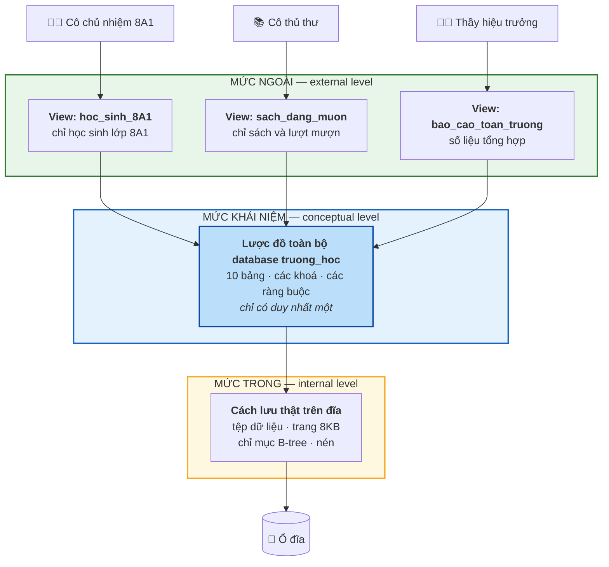
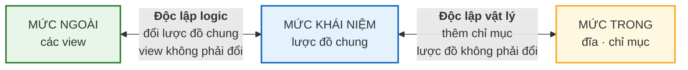
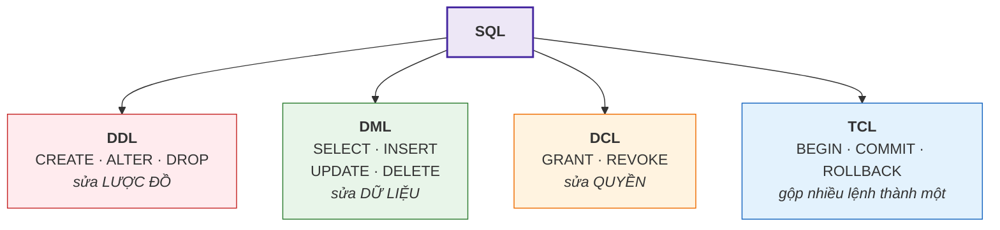

# Bài 3 — DBMS là gì và nó gánh giúp ta những việc gì

!!! abstract "🎯 Học xong bài này, bạn sẽ"
    - Nói được chính xác **hệ quản trị cơ sở dữ liệu** khác gì với **cơ sở dữ liệu**
    - Phân biệt được **lược đồ** (cái khung) và **thực thể lưu trữ** (dữ liệu đang nằm trong khung)
    - Vẽ lại được kiến trúc ba mức ANSI/SPARC và giải thích nó dùng để làm gì
    - Gọi đúng tên bốn nhóm câu lệnh SQL: DDL, DML, DCL, TCL
    - Biết database tự lưu thông tin về chính nó ở đâu

## 🧠 Câu chuyện mở đầu

Cuối Bài 2, ta kết luận: cần một phần mềm đứng giữa, canh gác dữ liệu. Nhưng "canh gác" cụ thể là làm những gì?

Hãy nghĩ về thư viện trường bạn.

Sách nằm trên giá — đó là dữ liệu. Nhưng thư viện không chỉ có giá sách. Thư viện còn có **cô thủ thư**. Và cô làm rất nhiều việc mà bạn ít khi để ý:

- Cô giữ một cuốn sổ ghi *"sách nào ở giá nào"*. Bạn hỏi cuốn *Dế Mèn phiêu lưu ký*, cô chỉ đúng chỗ trong 5 giây, không phải đi rà từng giá.
- Cô không cho bạn mượn cuốn sách mà bạn khác đang giữ.
- Cô chỉ cho học sinh mượn tối đa 3 cuốn — quy tắc của trường, cô là người thực thi.
- Thầy hiệu trưởng được xem sổ mượn của cả trường; bạn thì chỉ được xem sổ của chính mình.
- Nếu đang ghi sổ mà mất điện, hôm sau cô vẫn biết ai đang giữ cuốn nào.
- Và quan trọng nhất: hôm nào cô xếp lại giá sách cho gọn, **bạn không cần biết**. Bạn vẫn hỏi đúng câu cũ, vẫn nhận đúng cuốn sách.

Bây giờ hãy thay "sách" bằng "dữ liệu". Cái phần mềm mà Bài 2 nói tới chính là **cô thủ thư** ấy.

Câu hỏi của bài này: một "cô thủ thư phần mềm" thì gồm những bộ phận nào, và việc cuối cùng — *xếp lại giá mà người đọc không hay biết* — được làm bằng cách nào?

## 📖 Khái niệm & thuật ngữ

### DBMS ≠ Database

Hai từ này bị dùng lẫn lộn còn nhiều hơn cả "dữ liệu" và "thông tin".

- **Cơ sở dữ liệu** (*database*) là **dữ liệu** — các bảng và nội dung trong đó. Là *sách trên giá*.
- **Hệ quản trị cơ sở dữ liệu** (*database management system*, viết tắt **DBMS**) là **phần mềm** quản lý cơ sở dữ liệu ấy. Là *cô thủ thư*.

PostgreSQL, MySQL, SQL Server, Oracle, SQLite — tất cả đều là DBMS. `truong_hoc` là một database do PostgreSQL quản lý.

Nói *"em vừa cài cơ sở dữ liệu PostgreSQL"* là sai. Bạn cài **DBMS** PostgreSQL; cơ sở dữ liệu là thứ bạn tạo ra sau đó.

Gộp cả hai lại — DBMS, các database nó quản lý, người dùng và ứng dụng dùng chúng — ta có **hệ cơ sở dữ liệu** (*database system*).

### Lược đồ và thực thể lưu trữ

Khi ta nói "bảng `hoc_sinh` có 6 cột, cột `ma_hs` là định danh, cột `ngay_sinh` phải là ngày tháng", ta đang mô tả **cái khung** — thứ hầu như không đổi theo thời gian. Cái khung đó gọi là **lược đồ** (*schema*).

Còn 40 dòng dữ liệu đang thực sự nằm trong bảng ngay lúc này gọi là **thực thể lưu trữ** (*instance*), hay còn gọi là **thể hiện**: nội dung của database tại **một thời điểm cụ thể**.

!!! tip "Cách nhớ"
    Lược đồ là **tờ giấy kẻ ô trống** của bảng điểm. Thực thể lưu trữ là **bảng điểm đã ghi kín** của học kỳ này.

    Mỗi lần có học sinh mới nhập học, thực thể lưu trữ đổi — nhưng lược đồ thì không. Lược đồ chỉ đổi khi ta sửa **cấu trúc**, ví dụ thêm cột `so_dien_thoai`.

Phân biệt này quan trọng vì gần như mọi thứ khó trong ngành database đều nằm ở chỗ: **lược đồ đổi rất chậm, dữ liệu đổi rất nhanh** — và ta phải thiết kế lược đồ hôm nay sao cho chịu được dữ liệu của mười năm sau.

### Kiến trúc ba mức ANSI/SPARC

Quay lại việc cuối cùng của cô thủ thư: *xếp lại giá sách mà người đọc không hay biết*.

Năm 1975, một uỷ ban tiêu chuẩn của Mỹ tên **ANSI/SPARC** đề xuất cách tổ chức để làm được đúng điều đó với dữ liệu. Ý tưởng: đừng mô tả database ở một mức, hãy mô tả ở **ba mức** chồng lên nhau.

**Mức ngoài** (*external level*) — góc nhìn của **từng người dùng**. Mỗi người chỉ thấy phần dữ liệu liên quan tới mình, dưới hình dạng thuận tiện cho mình. Cô chủ nhiệm 8A1 thấy một "bảng" chỉ gồm học sinh lớp 8A1. Cô thủ thư thấy một "bảng" chỉ gồm sách và lượt mượn. Mỗi góc nhìn như vậy gọi là một **khung nhìn** (*view*) — và điều thú vị là view **không chứa dữ liệu thật**; nó chỉ là một câu truy vấn được đặt tên.

**Mức khái niệm** (*conceptual level*) — mô tả **toàn bộ** database: có những bảng nào, cột nào, quan hệ và ràng buộc gì. Chỉ có **một** mức khái niệm duy nhất cho cả hệ thống, dùng chung cho mọi người. Sơ đồ ER ở trang [Database mẫu](../dataset.md) chính là mức này.

**Mức trong** (*internal level*) — dữ liệu được ghi xuống đĩa **thật sự** như thế nào: sắp xếp theo thứ tự gì, nén hay không, có những **chỉ mục** (*index*) nào để tìm cho nhanh, mỗi trang dữ liệu lớn bao nhiêu byte. Đây là mức mà Cấp 4 (Bài 33–36) sẽ mổ xẻ.

### Độc lập dữ liệu — phần thưởng của ba mức

Chia ba mức không phải để cho phức tạp. Nó đổi lấy một thứ rất giá trị: **độc lập dữ liệu** (*data independence*) — khả năng sửa một mức mà không phải sửa mức phía trên.

Có hai loại, và loại nào cũng tiết kiệm được rất nhiều công sức:

- **Độc lập dữ liệu vật lý** (*physical data independence*): đổi mức trong mà mức khái niệm không đổi. Ví dụ hôm nay bạn thêm một index cho bảng `diem` để tìm nhanh gấp trăm lần. Không một câu SQL nào phải viết lại. Đây chính là "cô xếp lại giá sách".
- **Độc lập dữ liệu logic** (*logical data independence*): đổi mức khái niệm mà mức ngoài không đổi. Ví dụ bạn tách bảng `hoc_sinh` thành hai bảng. Nếu cô chủ nhiệm vẫn dùng view cũ, và bạn định nghĩa lại view đó cho khớp cấu trúc mới, thì phần mềm của cô **không cần sửa một dòng nào**.

Độc lập logic khó đạt hơn độc lập vật lý nhiều — đó là lý do vì sao thiết kế lược đồ cho tốt ngay từ đầu (Cấp 1 và Cấp 2) lại quan trọng đến thế.

### Bốn nhóm câu lệnh của SQL

SQL trông như một ngôn ngữ, nhưng thật ra là bốn **ngôn ngữ con** (*sublanguage*) ghép lại. Biết một câu lệnh thuộc nhóm nào giúp bạn đoán được nó nguy hiểm tới đâu:

| Nhóm | Tên đầy đủ | Tác động lên | Lệnh tiêu biểu |
|---|---|---|---|
| **DDL** | *Data Definition Language* — ngôn ngữ định nghĩa dữ liệu | **Lược đồ** | `CREATE`, `ALTER`, `DROP`, `TRUNCATE` |
| **DML** | *Data Manipulation Language* — ngôn ngữ thao tác dữ liệu | **Dữ liệu** | `SELECT`, `INSERT`, `UPDATE`, `DELETE` |
| **DCL** | *Data Control Language* — ngôn ngữ điều khiển dữ liệu | **Quyền truy cập** | `GRANT`, `REVOKE` |
| **TCL** | *Transaction Control Language* — ngôn ngữ điều khiển giao dịch | **Giao dịch** | `BEGIN`, `COMMIT`, `ROLLBACK`, `SAVEPOINT` |

!!! danger "DDL sửa cái khung, DML sửa nội dung"
    `DELETE FROM hoc_sinh;` xoá sạch dữ liệu nhưng **bảng vẫn còn** — và nếu bạn đang trong một giao dịch, còn `ROLLBACK` cứu được.

    `DROP TABLE hoc_sinh;` xoá luôn **cái bảng**. Lược đồ mất, dữ liệu mất.

    Nhìn thấy `DROP` hay `TRUNCATE` thì hãy dừng lại ba giây trước khi nhấn Enter.

### Từ điển dữ liệu

Câu hỏi hay: bản thân lược đồ được lưu ở đâu?

Câu trả lời đẹp: **trong chính database đó**, dưới dạng các bảng bình thường. Tập các bảng ấy gọi là **từ điển dữ liệu** (*data dictionary*), còn gọi là **danh mục hệ thống** (*catalog*) hay **siêu dữ liệu** (*metadata*) — dữ liệu nói về dữ liệu.

Nhờ vậy, muốn biết database có những bảng nào, bạn không cần công cụ đặc biệt: bạn **truy vấn** nó, bằng đúng câu `SELECT` mà bạn đã biết. Phần Thực hành sẽ làm ngay.

### Bảng thuật ngữ

| Tiếng Việt | English | Nghĩa dễ hiểu |
|---|---|---|
| Hệ quản trị cơ sở dữ liệu | *DBMS — database management system* | Phần mềm quản lý database; PostgreSQL là một cái |
| Hệ cơ sở dữ liệu | *database system* | DBMS + các database + người dùng + ứng dụng |
| Lược đồ | *schema* | Cái khung: có bảng nào, cột nào, ràng buộc gì |
| Thực thể lưu trữ | *instance* | Dữ liệu đang nằm trong khung tại một thời điểm |
| Mức ngoài | *external level* | Góc nhìn riêng của từng người dùng |
| Khung nhìn | *view* | Một góc nhìn được đặt tên; không chứa dữ liệu thật |
| Mức khái niệm | *conceptual level* | Mô tả toàn bộ database, dùng chung cho mọi người |
| Mức trong | *internal level* | Cách dữ liệu thật sự nằm trên đĩa |
| Độc lập dữ liệu | *data independence* | Sửa mức dưới mà mức trên không phải sửa theo |
| Chỉ mục | *index* | Cấu trúc phụ giúp tìm dữ liệu nhanh hơn |
| Từ điển dữ liệu | *data dictionary / catalog* | Các bảng mà database dùng để mô tả chính nó |
| Siêu dữ liệu | *metadata* | Dữ liệu nói về dữ liệu |

## 🖼️ Sơ đồ

Kiến trúc ba mức ANSI/SPARC, đọc từ trên xuống — càng xuống dưới càng gần phần cứng:



Hai mũi tên nối ba mức chính là hai loại độc lập dữ liệu:



Và đây là bốn nhóm câu lệnh, xếp theo đúng thứ bậc chúng tác động tới:



## 💻 Thực hành

!!! note "Vẫn là đọc hiểu"
    Bài này chưa cần cài gì. Nhưng khác với Bài 1 và Bài 2, những câu dưới đây bạn **chạy lại được nguyên văn** ngay sau khi làm xong [Bài 5](05-cai-dat-postgresql.md) — chúng chỉ dùng database `truong_hoc` chuẩn.

### Hỏi database xem nó có những bảng nào

Từ điển dữ liệu của PostgreSQL nằm trong một lược đồ đặc biệt tên `information_schema`. Truy vấn nó y như truy vấn bảng thường:

```sql
SELECT table_name
FROM information_schema.tables
WHERE table_schema = 'public'
  AND table_type = 'BASE TABLE'
ORDER BY table_name;
```

Nếu bạn mới chỉ nạp `dataset/02-chuan-hoa.sql`, kết quả là đúng 10 tên bảng: `diem`, `diem_danh`, `giao_vien`, `hoc_sinh`, `lop`, `mon_hoc`, `muon_sach`, `phan_cong_day`, `phu_huynh`, `sach`.

Bạn vừa đọc **mức khái niệm** — bằng chính SQL.

### Hỏi tiếp: bảng đó có những cột gì

```sql
SELECT column_name, data_type, is_nullable
FROM information_schema.columns
WHERE table_schema = 'public'
  AND table_name = 'hoc_sinh'
ORDER BY ordinal_position;
```

Kết quả mô tả đúng lược đồ của bảng `hoc_sinh`:

| column_name | data_type | is_nullable |
|---|---|---|
| ma_hs | character | NO |
| ho_ten | character varying | NO |
| ngay_sinh | date | NO |
| gioi_tinh | character varying | NO |
| dia_chi | character varying | YES |
| ma_lop | character | NO |

Cột `is_nullable` chính là một ràng buộc đang được ghi lại: chỉ `dia_chi` được phép để trống.

### Lược đồ và thực thể lưu trữ, cạnh nhau

```sql
SELECT
    (SELECT count(*) FROM information_schema.columns
     WHERE table_schema = 'public' AND table_name = 'hoc_sinh') AS so_cot_luoc_do,
    (SELECT count(*) FROM hoc_sinh) AS so_dong_thuc_the;
```

| so_cot_luoc_do | so_dong_thuc_the |
|---|---|
| 6 | 40 |

Số bên trái là **lược đồ** — nhiều năm không đổi. Số bên phải là **thực thể lưu trữ** — đổi mỗi lần có học sinh nhập học hay chuyển đi.

### Tự tay dựng một mức ngoài

Tạo view cho cô chủ nhiệm lớp 8A1 (`L01`):

```sql
DROP VIEW IF EXISTS hoc_sinh_8a1;

CREATE VIEW hoc_sinh_8a1 AS
SELECT ma_hs, ho_ten, ngay_sinh
FROM hoc_sinh
WHERE ma_lop = 'L01';

SELECT count(*) AS so_hoc_sinh_co_nhin_thay FROM hoc_sinh_8a1;
```

Kết quả: `6`. Cô nhìn vào `hoc_sinh_8a1` và thấy đúng lớp mình — không thấy 34 học sinh còn lại, cũng không thấy cột `dia_chi`.

Điểm mấu chốt: **view này không chiếm thêm một dòng dữ liệu nào**. Nó chỉ là câu `SELECT` ở trên, được đặt tên. Sửa dữ liệu ở `hoc_sinh` thì `hoc_sinh_8a1` tự đổi theo ngay lập tức.

Dọn dẹp sau khi thử:

```sql
DROP VIEW IF EXISTS hoc_sinh_8a1;
```

### Bốn nhóm câu lệnh, mỗi nhóm một ví dụ

Toàn bộ đoạn dưới nằm gọn trong một giao dịch rồi bị `ROLLBACK`, nên database trở lại nguyên trạng — bạn thử thoải mái:

```sql
BEGIN;                                       -- TCL: mở giao dịch

DROP TABLE IF EXISTS cau_lac_bo;             -- DDL: dọn trước cho chắc
CREATE TABLE cau_lac_bo (                    -- DDL: sửa lược đồ
    ma_clb   CHAR(5) PRIMARY KEY,
    ten_clb  VARCHAR(40) NOT NULL,
    ten_hlv  VARCHAR(60)
);

INSERT INTO cau_lac_bo VALUES                -- DML: sửa dữ liệu
    ('CLB01', 'Bóng đá', 'Thầy Tâm'),
    ('CLB02', 'Cờ vua',  'Cô Hạnh');

GRANT SELECT ON cau_lac_bo TO PUBLIC;        -- DCL: sửa quyền

SELECT ma_clb, ten_clb FROM cau_lac_bo       -- DML: đọc lại
ORDER BY ma_clb;

ROLLBACK;                                    -- TCL: huỷ sạch mọi thứ phía trên
```

Sau `ROLLBACK`, bảng `cau_lac_bo` **không còn tồn tại**. PostgreSQL cho phép huỷ cả lệnh DDL trong giao dịch — không phải DBMS nào cũng làm được điều này. Bài 37 sẽ nói kỹ.

### Chạm một chút vào mức trong

Mức trong thường bị giấu kín, nhưng PostgreSQL vẫn cho ta nhìn qua khe cửa:

```sql
SELECT relname AS ten_bang,
       pg_relation_size(oid)                 AS so_byte,
       pg_size_pretty(pg_relation_size(oid)) AS doc_cho_de,
       pg_relation_size(oid) / 8192          AS so_trang_8kb
FROM pg_class
WHERE relname IN ('hoc_sinh', 'lop', 'diem')
ORDER BY relname;
```

`pg_relation_size()` hỏi thẳng hệ điều hành xem tệp của bảng đó đang chiếm bao nhiêu byte, còn `pg_size_pretty()` đổi con số byte thô sang dạng dễ đọc như `48 kB`. Chia cho 8192 ta ra số **trang** — PostgreSQL không đọc/ghi từng dòng lẻ mà đọc/ghi theo từng khối 8KB, và trang chính là khối đó.

Bảng `lop` chỉ có 6 dòng nên gọn trong **một** trang duy nhất; `diem` với 480 dòng thì phải trải ra nhiều trang. Con số cụ thể có thể khác nhau chút ít giữa máy bạn và máy bạn cùng bàn, vì nó còn phụ thuộc lần dọn dẹp gần nhất; điều đó bình thường.

!!! warning "Đừng nhầm với cột `relpages`"
    Trong `pg_class` còn một cột tên `relpages` trông rất giống thứ ta vừa tính. Nhưng nó **không phải số trang thật** — nó chỉ là con số **ước lượng** mà bộ tối ưu truy vấn dùng để đoán chi phí, và chỉ được cập nhật khi chạy `VACUUM` hoặc `ANALYZE`.

    Vì vậy ngay sau khi nạp dataset xong, `relpages` của mọi bảng vẫn còn là `0` dù dữ liệu đã nằm đầy trên đĩa. Muốn nó đúng, phải `ANALYZE` trước. Bài 35 sẽ nói vì sao PostgreSQL lại chấp nhận một con số cũ như vậy.

Điều đáng nhớ: bạn vừa đổi hoàn toàn chủ đề — từ "lớp nào có mấy học sinh" sang "bảng nào chiếm bao nhiêu byte trên đĩa" — mà **không câu `SELECT` nào ở trên phải viết lại**. Đó chính là độc lập dữ liệu vật lý đang làm việc.

## ⚠️ Lỗi thường gặp

!!! warning "Lỗi 1: Nói 'cài cơ sở dữ liệu' khi ý là 'cài DBMS'"
    Bạn cài **PostgreSQL** — một DBMS. Rồi bạn **tạo** cơ sở dữ liệu `truong_hoc` bên trong nó. Một DBMS quản lý được nhiều database cùng lúc.

    Nghe thì nhỏ nhặt, nhưng ở Bài 5 nhầm lẫn này sẽ khiến bạn không hiểu vì sao phải có bước "tạo database" riêng sau khi cài xong phần mềm.

!!! warning "Lỗi 2: Lẫn lộn lược đồ với thực thể lưu trữ"
    Câu hỏi *"lược đồ của bạn có bao nhiêu học sinh?"* là một câu hỏi vô nghĩa. Lược đồ không chứa học sinh nào cả; nó chỉ nói *"có một bảng tên `hoc_sinh` gồm 6 cột"*.

    Thêm một học sinh **không** làm lược đồ thay đổi. Thêm một **cột** mới thì mới đổi lược đồ.

!!! warning "Lỗi 3: Tưởng view là một bản sao dữ liệu"
    View **không chứa dữ liệu**. Nó là một câu truy vấn được đặt tên, được chạy lại mỗi lần bạn gọi tới. Vì thế view luôn mới, và vì thế tạo view gần như không tốn dung lượng.

    (Có một loại đặc biệt gọi là **khung nhìn vật chất hoá** (*materialized view*) thì có lưu dữ liệu thật — Bài 36 sẽ nói tới. Nhưng nó phải khai báo riêng.)

!!! warning "Lỗi 4: Dùng DDL khi chỉ định xoá dữ liệu"
    Muốn xoá dữ liệu thì dùng `DELETE` (DML). `DROP TABLE` (DDL) xoá luôn cả bảng.

    Một sai lầm hay gặp nữa: `TRUNCATE` trông giống `DELETE` nhưng là DDL, chạy rất nhanh vì nó không xoá từng dòng mà vứt cả tệp dữ liệu đi. Nhanh là cái bẫy — nó bỏ qua các **bẫy sự kiện** (*trigger*), tức những đoạn lệnh mà bạn dặn database tự chạy mỗi khi có dòng bị xoá (ví dụ để ghi lại nhật ký ai xoá cái gì). Và trong nhiều DBMS thì `TRUNCATE` không thể `ROLLBACK`. Bài 32 sẽ dạy kỹ về trigger.

## ✍️ Bài tập

1. Xếp mỗi câu lệnh sau vào đúng nhóm DDL / DML / DCL / TCL:
   `UPDATE`, `CREATE INDEX`, `COMMIT`, `REVOKE`, `SELECT`, `ALTER TABLE`, `SAVEPOINT`, `TRUNCATE`.

2. Cho hai hành động: (a) thêm cột `so_dien_thoai` vào bảng `hoc_sinh`; (b) thêm 15 học sinh mới vào bảng `hoc_sinh`. Hành động nào đổi **lược đồ**, hành động nào đổi **thực thể lưu trữ**?

3. Quản trị viên thêm một chỉ mục lên cột `ho_ten` của bảng `hoc_sinh` khiến việc tìm theo tên nhanh gấp 50 lần. Phần mềm điểm danh của trường có phải sửa lại câu SQL nào không? Đây là biểu hiện của loại độc lập dữ liệu nào, và nó nằm giữa hai mức nào?

4. Cô thủ thư cần một góc nhìn chỉ gồm sách và lượt mượn, không thấy điểm số hay địa chỉ học sinh. Trong kiến trúc ba mức, thứ bạn cần tạo cho cô nằm ở mức nào, tên gọi là gì, và nó có nhân đôi dữ liệu không?

5. Vì sao PostgreSQL lại lưu thông tin về các bảng của nó *trong chính các bảng*, thay vì trong một tệp cấu hình riêng? Nêu ít nhất hai lợi ích.

??? success "Đáp án"
    **Câu 1.**

    | Câu lệnh | Nhóm | Vì sao |
    |---|---|---|
    | `UPDATE` | **DML** | Sửa nội dung các dòng |
    | `CREATE INDEX` | **DDL** | Tạo một đối tượng mới trong lược đồ |
    | `COMMIT` | **TCL** | Kết thúc và xác nhận một giao dịch |
    | `REVOKE` | **DCL** | Thu hồi quyền của người dùng |
    | `SELECT` | **DML** | Đọc dữ liệu (một số tài liệu tách riêng thành DQL — *Data Query Language*; cả hai cách gọi đều được chấp nhận) |
    | `ALTER TABLE` | **DDL** | Sửa cấu trúc bảng |
    | `SAVEPOINT` | **TCL** | Đặt mốc để quay lui một phần giao dịch |
    | `TRUNCATE` | **DDL** | Vứt cả tệp dữ liệu, không xoá từng dòng — thuộc DDL dù trông giống `DELETE` |

    **Câu 2.**

    - (a) Thêm cột `so_dien_thoai` → đổi **lược đồ**. Cái khung có thêm một ô mới; đây là lệnh DDL (`ALTER TABLE`).
    - (b) Thêm 15 học sinh → đổi **thực thể lưu trữ**. Khung không đổi, chỉ có thêm 15 dòng ghi vào khung sẵn có; đây là lệnh DML (`INSERT`).

    Cách kiểm tra nhanh: hỏi *"số cột có đổi không?"*. Đổi thì là lược đồ.

    **Câu 3.**

    **Không phải sửa một dòng SQL nào.** Chỉ mục là một cấu trúc phụ để tìm nhanh hơn; nó không thêm bảng, không thêm cột, không đổi kết quả trả về — chỉ đổi *thời gian* trả về.

    Đây là **độc lập dữ liệu vật lý** (*physical data independence*), nằm giữa **mức trong** và **mức khái niệm**.

    Đúng như cô thủ thư xếp lại giá sách: bạn vẫn hỏi đúng câu cũ, vẫn nhận đúng cuốn sách, chỉ là nhận nhanh hơn.

    **Câu 4.**

    - Nằm ở **mức ngoài** (*external level*).
    - Tên gọi: một **khung nhìn** (*view*).
    - **Không nhân đôi dữ liệu.** View chỉ là một câu truy vấn được đặt tên. Sách nào vừa được mượn xong là cô thấy ngay, vì mỗi lần cô mở view ra thì câu truy vấn được chạy lại trên dữ liệu gốc.

    Thêm một lợi ích quan trọng: view còn là công cụ **bảo mật**. Cấp quyền cho cô trên view thay vì trên bảng gốc, cô sẽ không có cách nào nhìn thấy điểm số hay địa chỉ học sinh, dù chúng nằm ngay trong cùng database.

    **Câu 5.**

    Ít nhất bốn lợi ích, nêu được hai là đạt:

    1. **Truy vấn được bằng chính SQL.** Không cần học thêm công cụ nào: muốn biết database có gì, cứ `SELECT` như mọi khi — đúng như phần Thực hành đã làm.
    2. **Được hưởng mọi bảo đảm của DBMS.** Siêu dữ liệu cũng nằm trong giao dịch, cũng được ghi nhật ký, cũng được sao lưu cùng dữ liệu. Nếu lược đồ nằm ở tệp riêng, một lần mất điện giữa chừng có thể làm lược đồ và dữ liệu lệch nhau.
    3. **Không bao giờ lệch pha.** `CREATE TABLE` cập nhật từ điển dữ liệu trong cùng một thao tác — không có khe hở nào để tệp cấu hình "quên" cập nhật.
    4. **Chính DBMS cũng cần đọc nó liên tục.** Mỗi lần bạn gõ `SELECT * FROM hoc_sinh`, DBMS phải tra xem `hoc_sinh` có những cột gì, kiểu gì. Để sẵn trong bảng thì nó dùng luôn bộ máy truy vấn có sẵn.

## 🔑 Tóm tắt

1. **Database** là dữ liệu; **DBMS** là phần mềm quản lý dữ liệu đó — PostgreSQL là một DBMS, `truong_hoc` là một database.
2. **Lược đồ** là cái khung (có bảng nào, cột nào, ràng buộc gì); **thực thể lưu trữ** là dữ liệu đang nằm trong khung tại một thời điểm.
3. Kiến trúc **ba mức ANSI/SPARC** gồm **mức ngoài** (view riêng của từng người), **mức khái niệm** (lược đồ chung duy nhất) và **mức trong** (cách lưu trên đĩa).
4. Phần thưởng của ba mức là **độc lập dữ liệu**: đổi cách lưu trên đĩa mà câu SQL không phải sửa (vật lý), đổi lược đồ mà view không phải sửa (logic).
5. SQL gồm bốn nhóm — **DDL** sửa lược đồ, **DML** sửa dữ liệu, **DCL** sửa quyền, **TCL** điều khiển giao dịch — và database mô tả chính nó trong **từ điển dữ liệu**, thứ bạn truy vấn được bằng `SELECT`.

---

⬅️ [Bài 2 — Từ sổ giấy đến Excel](02-tu-so-giay-den-excel.md) · ➡️ [Bài 4 — Các mô hình dữ liệu](04-cac-mo-hinh-du-lieu.md)
