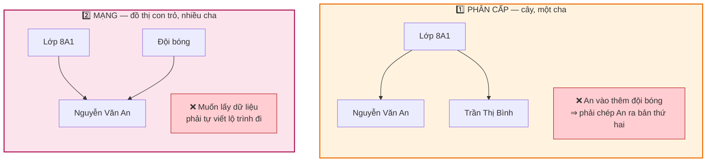
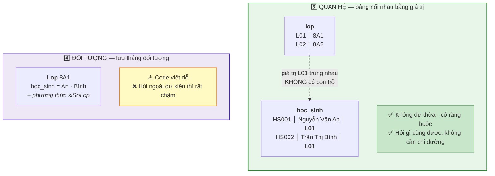
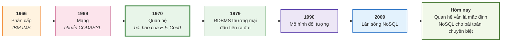

# Bài 4 — Các mô hình dữ liệu: vì sao mô hình quan hệ thắng

!!! abstract "🎯 Học xong bài này, bạn sẽ"
    - Hiểu **mô hình dữ liệu** là gì và vì sao chọn mô hình lại quan trọng hơn chọn phần mềm
    - Kể được bốn mô hình cổ điển: phân cấp, mạng, quan hệ, đối tượng — mỗi cái giải quyết gì và vấp ở đâu
    - Giải thích được vì sao mô hình quan hệ thống trị suốt 50 năm
    - Gọi tên bốn họ NoSQL và biết khi nào chúng hợp lý hơn

## 🧠 Câu chuyện mở đầu

Cô giáo giao bài tập nhóm: *"Các em vẽ sơ đồ tổ chức của trường mình."*

Nhóm bạn tranh luận cả buổi, vì hoá ra có nhiều cách vẽ, và cách nào cũng có lý.

**Bạn A** vẽ **cây**: hiệu trưởng ở trên, dưới là các tổ trưởng, dưới nữa là giáo viên, dưới cùng là học sinh. Gọn gàng, nhìn phát hiểu ngay ai thuộc về ai. Nhưng tới bạn Minh — vừa ở lớp 8A1, vừa trong đội bóng, vừa trong câu lạc bộ tiếng Anh — thì cây gãy. Minh có tận ba "cha".

**Bạn B** bảo: *"Thì cứ nối bừa, ai liên quan tới ai thì kẻ một mũi tên."* Vẽ được hết thật. Nhưng năm phút sau tờ giấy trông như một mớ dây điện, và không ai dò nổi đường từ Minh tới cô hiệu trưởng.

**Bạn C** không vẽ hình. Bạn ấy kẻ **ba bảng**: bảng học sinh, bảng lớp, bảng câu lạc bộ; ai thuộc đâu thì ghi mã vào. Nhìn thì chán, nhưng trả lời câu hỏi nào cũng được.

**Bạn D** làm mỗi lớp một **tấm bìa hồ sơ**: ngoài bìa ghi tên lớp và sĩ số, bên trong nhét phiếu của từng học sinh, và mặt sau bìa ghi sẵn cách tính sĩ số. Muốn biết gì về lớp 8A1 thì rút đúng một tấm bìa ra là có hết. Nhưng khi cô hỏi *"kể tên mọi học sinh sinh tháng 5 toàn trường"* thì bạn ấy phải mở từng tấm bìa, lật từng phiếu.

Bốn bạn không ai sai. Mỗi bạn đang dùng một **mô hình dữ liệu** khác nhau — và tình cờ, cả bốn đều là những mô hình có thật, đã từng hoặc đang thống trị ngành công nghiệp này.

Câu hỏi của bài: vì sao cách của bạn C — cách trông chán nhất — lại là cách cả thế giới dùng suốt 50 năm qua?

## 📖 Khái niệm & thuật ngữ

### Mô hình dữ liệu là gì

**Mô hình dữ liệu** (*data model*) là tập quy ước trả lời ba câu hỏi:

1. Dữ liệu được **tổ chức** theo hình dạng nào? (cây? bảng? đồ thị?)
2. Có thể đặt ra những **ràng buộc** nào?
3. Có thể **thao tác** trên nó bằng những phép gì?

Chọn mô hình là quyết định nền móng. Đổi từ PostgreSQL sang MySQL là chuyện vài ngày — cả hai đều là mô hình quan hệ. Đổi từ mô hình quan hệ sang mô hình tài liệu là viết lại gần như toàn bộ ứng dụng.

### Mô hình phân cấp — cách của bạn A

**Mô hình phân cấp** (*hierarchical model*) tổ chức dữ liệu thành **cây**: mỗi bản ghi có đúng **một** bản ghi cha, có thể có nhiều con.

Ra đời khoảng 1966 với hệ **IMS** của IBM, dùng cho chương trình Apollo đưa người lên Mặt Trăng. Ưu điểm rất thật: đi từ cha xuống con cực nhanh, vì con nằm ngay cạnh cha trên đĩa.

Nhược điểm cũng rất thật: thế giới không phải hình cây. Bạn Minh thuộc ba nhóm — mô hình phân cấp bắt bạn **chép Minh ra ba bản**, và ta quay lại đúng căn bệnh **dư thừa dữ liệu** của [Bài 2](02-tu-so-giay-den-excel.md). Hỏi ngược từ dưới lên (*"bạn Minh đang thuộc quyền tổ trưởng chuyên môn nào?"*) thì lại rất chậm, vì cây chỉ thiết kế để đi xuôi.

Mô hình này chưa chết: cấu trúc thư mục trong máy tính, tệp XML, tệp JSON đều là cây.

!!! info "JSON là gì — giải thích một lần cho cả bài"
    Từ **JSON** sẽ còn xuất hiện nhiều lần dưới đây, nên hãy làm quen ngay. Bạn không cần biết lập trình.

    JSON (*JavaScript Object Notation*) chỉ là **một quy ước viết dữ liệu ra thành chữ**, giống hệt cách bạn điền một tờ phiếu có nhãn sẵn. Mỗi ô là một cặp *tên nhãn* và *nội dung*, ngăn nhau bằng dấu hai chấm; cả tờ phiếu bọc trong một cặp ngoặc nhọn `{ }`; và khi một nhãn cần nhiều mục thì các mục xếp trong cặp ngoặc vuông `[ ]`.

    Tờ phiếu học sinh viết theo kiểu JSON trông như thế này:

    ```json
    {
        "ma_hs": "HS001",
        "ho_ten": "Nguyễn Văn An",
        "cac_cau_lac_bo": [ "Bóng đá", "Tiếng Anh" ]
    }
    ```

    Đọc là: *"mã học sinh là HS001, họ tên là Nguyễn Văn An, các câu lạc bộ gồm Bóng đá và Tiếng Anh"*. Chỉ có thế.

    Vì sao JSON là cây? Vì một tờ phiếu có thể nhét trọn nhiều tờ phiếu con vào bên trong nó, còn tờ phiếu con thì luôn nằm trong đúng **một** tờ phiếu cha.

### Mô hình mạng — cách của bạn B

**Mô hình mạng** (*network model*), được nhóm **CODASYL** đưa ra thành chuẩn chung năm 1969, sửa đúng điểm yếu trên: một bản ghi được phép có **nhiều cha**. Minh nối thẳng tới cả ba nhóm, không cần chép ra ba bản.

Cái giá phải trả nằm ở chỗ khác. Muốn lấy dữ liệu, lập trình viên phải tự viết lộ trình đi: *"tìm bản ghi Minh, đi theo con trỏ 'thuộc lớp', rồi con trỏ 'có chủ nhiệm'…"*. Người ta gọi kiểu lập trình này là **điều hướng thủ công** (*navigational programming*).

Hậu quả: chương trình **dính chặt vào cách dữ liệu được nối**. Đổi cấu trúc một chút là mọi chương trình phải viết lại. Đúng thứ mà [Bài 3](03-dbms-la-gi.md) gọi là **mất độc lập dữ liệu**.

### Mô hình quan hệ — cách của bạn C

Năm 1970, Edgar F. Codd — một nhà toán học làm ở IBM — công bố bài báo *"A Relational Model of Data for Large Shared Data Banks"*, và đề xuất một ý tưởng khi ấy nghe rất kỳ quặc:

> Hãy vứt bỏ mọi con trỏ. Dữ liệu chỉ gồm các **bảng**. Muốn nối hai bảng thì nối bằng **giá trị trùng nhau**, không phải bằng đường dẫn.

Đó là **mô hình quan hệ** (*relational model*). Trong bảng `hoc_sinh` có cột `ma_lop` ghi `'L01'`; trong bảng `lop` có dòng `ma_lop = 'L01'`. Không có mũi tên nào cả — chỉ có hai giá trị **bằng nhau**.

Từ đó nảy ra hệ quả quan trọng nhất: bạn không cần chỉ đường nữa. Bạn chỉ cần **mô tả thứ mình muốn**, phần mềm tự tìm cách lấy. Kiểu này gọi là **khai báo** (*declarative*), đối lập với **thủ tục** (*procedural*) của mô hình mạng.

Bốn lý do khiến nó thắng:

1. **Nền tảng toán học.** Bảng chính là **quan hệ** (*relation*) trong lý thuyết tập hợp. Nhờ vậy DBMS có thể *chứng minh* hai câu truy vấn viết khác nhau cho cùng kết quả, rồi tự chọn câu chạy nhanh hơn. Đây là việc **bộ tối ưu truy vấn** (*query optimizer*) làm — Bài 35 sẽ mổ xẻ.
2. **Khai báo, nên độc lập dữ liệu.** Bạn nói *cái gì*, không nói *làm thế nào*. Đổi cách lưu trên đĩa, thêm chỉ mục — câu SQL không đổi.
3. **Ràng buộc khai báo được.** Khoá chính, khoá ngoại, `CHECK` — DBMS tự canh, như bạn đã thấy ở Bài 2.
4. **Chuẩn hoá có lý thuyết đàng hoàng.** Có quy trình từng bước để loại bỏ dư thừa, không phải đoán mò. Cấp 2 sẽ dạy.

Ngày nay DBMS quan hệ còn được gọi là **RDBMS** (*relational database management system*).

### Mô hình đối tượng — cách của bạn D

Thập niên 1990, lập trình hướng đối tượng lên ngôi, và xuất hiện một khó chịu kinh niên: trong code có `class HocSinh`, trong database có `TABLE hoc_sinh`, và lập trình viên suốt ngày phải dịch qua lại. Sự lệch pha ấy có tên: **trở ngại trở kháng đối tượng–quan hệ** (*object-relational impedance mismatch*).

**Mô hình đối tượng** (*object-oriented model*) đề nghị: bỏ luôn bảng, lưu thẳng đối tượng xuống đĩa, kèm kế thừa và phương thức.

Nó không thắng nổi. Lý do: mất nền tảng toán học nên truy vấn tuỳ ý rất yếu, mỗi sản phẩm một kiểu nên không có chuẩn chung, và quan trọng nhất — RDBMS đã kịp học lấy phần hay nhất của nó. PostgreSQL hôm nay có kiểu dữ liệu tự định nghĩa, mảng, kiểu `JSONB`, kế thừa bảng. Người ta gọi đó là **quan hệ–đối tượng** (*object-relational*).

### NoSQL — làn sóng 2009

Khoảng năm 2009, các công ty Internet cỡ Google, Amazon, Facebook gặp bài toán mà RDBMS cổ điển đuối sức: hàng tỉ người dùng, dữ liệu trải trên hàng nghìn máy, và cấu trúc dữ liệu thay đổi mỗi tuần.

**NoSQL** ra đời từ đó. Tên gọi hay bị hiểu nhầm là "không dùng SQL"; cách hiểu được chấp nhận rộng rãi hơn là *"Not Only SQL"* — **không chỉ có SQL**. Đặc điểm chung: chấp nhận **hy sinh một phần tính nhất quán** để đổi lấy khả năng **mở rộng ngang** (*horizontal scaling*) — thêm máy thay vì mua máy to hơn.

Có bốn họ chính:

| Họ | Dữ liệu trông như | Hợp với | Ví dụ sản phẩm |
|---|---|---|---|
| **Khoá–giá trị** (*key-value*) | Một cuốn từ điển: tra khoá ra giá trị | Bộ nhớ đệm, phiên đăng nhập, dữ liệu tạm | Redis, DynamoDB |
| **Tài liệu** (*document*) | Một tệp JSON tự chứa mọi thứ | Nội dung cấu trúc lỏng lẻo, hay đổi | MongoDB, CouchDB |
| **Cột rộng** (*column-family*) | Bảng khổng lồ, mỗi dòng có bộ cột riêng | Ghi log cực nhiều, dữ liệu theo thời gian | Cassandra, HBase |
| **Đồ thị** (*graph*) | Các điểm nối nhau bằng cạnh có nhãn | Mạng xã hội, gợi ý, phát hiện gian lận | Neo4j, JanusGraph |

!!! info "Bài 47 sẽ đào sâu NoSQL"
    Ở đây bạn chỉ cần **nhận ra bốn cái tên và biết chúng hợp với việc gì**. **Bài 47** sẽ dạy kỹ từng họ, kèm định lý CAP, tính nhất quán cuối cùng (*eventual consistency*), và cách chọn giữa SQL với NoSQL cho một bài toán cụ thể.

    Một điều cần nói ngay để tránh hiểu lầm: NoSQL **không thay thế** mô hình quan hệ. Hai bên tồn tại song song; rất nhiều hệ thống lớn dùng cả hai. Và như phần Thực hành sẽ cho thấy, PostgreSQL còn làm được một phần việc của họ **tài liệu** ngay trong chính nó.

### Bảng thuật ngữ

| Tiếng Việt | English | Nghĩa dễ hiểu |
|---|---|---|
| Mô hình dữ liệu | *data model* | Quy ước về hình dạng, ràng buộc và phép thao tác dữ liệu |
| Mô hình phân cấp | *hierarchical model* | Dữ liệu là cây; mỗi bản ghi có đúng một cha |
| Mô hình mạng | *network model* | Dữ liệu là đồ thị con trỏ; một bản ghi có nhiều cha |
| Điều hướng thủ công | *navigational programming* | Lập trình viên tự viết lộ trình đi tìm dữ liệu |
| Mô hình quan hệ | *relational model* | Dữ liệu là bảng; nối nhau bằng giá trị trùng, không con trỏ |
| Quan hệ | *relation* | Tên toán học của "bảng" |
| Khai báo | *declarative* | Nói cái mình muốn, không nói cách làm |
| Thủ tục | *procedural* | Nói từng bước phải làm |
| Bộ tối ưu truy vấn | *query optimizer* | Bộ phận tự chọn cách chạy nhanh nhất cho câu lệnh |
| Mô hình đối tượng | *object-oriented model* | Lưu thẳng đối tượng của ngôn ngữ lập trình |
| Trở ngại trở kháng đối tượng–quan hệ | *object-relational impedance mismatch* | Sự lệch pha giữa class trong code và table trong database |
| NoSQL | *Not Only SQL* | Nhóm mô hình phi quan hệ, ưu tiên mở rộng ngang |
| Khoá–giá trị | *key-value* | Tra một khoá, nhận một giá trị |
| Tài liệu | *document* | Mỗi bản ghi là một tệp JSON tự chứa |
| Cột rộng | *column-family* | Mỗi dòng tự quyết định mình có những cột nào |
| Đồ thị | *graph* | Điểm và cạnh có nhãn; mạnh khi phải đi nhiều bước |
| Mở rộng ngang | *horizontal scaling* | Thêm máy thay vì nâng cấp máy |

## 🖼️ Sơ đồ

Cùng một sự thật — *"Nguyễn Văn An là học sinh lớp 8A1"* — bốn mô hình biểu diễn bốn kiểu khác nhau:





Và đây là dòng thời gian, để thấy các mô hình **chồng lên nhau** chứ không thay thế nhau:



## 💻 Thực hành

!!! note "Vẫn chưa cần cài gì"
    Đọc hiểu là đủ. Sau [Bài 5](05-cai-dat-postgresql.md), quay lại chạy thử toàn bộ phần này trên `truong_hoc`.

### Mô hình quan hệ: nối bằng giá trị

```sql
SELECT h.ma_hs, h.ho_ten, l.ten_lop
FROM hoc_sinh h
JOIN lop l ON h.ma_lop = l.ma_lop
ORDER BY h.ma_hs
LIMIT 5;
```

| ma_hs | ho_ten | ten_lop |
|---|---|---|
| HS001 | Nguyễn Văn An | 8A1 |
| HS002 | Trần Thị Bình | 8A1 |
| HS003 | Lê Hoàng Cường | 8A1 |
| HS004 | Phạm Thị Dung | 8A1 |
| HS005 | Hoàng Minh Đức | 8A1 |

Hãy để ý kỹ dòng `ON h.ma_lop = l.ma_lop`. Đó là toàn bộ bí mật của mô hình quan hệ: hai bảng gặp nhau **chỉ vì hai giá trị bằng nhau**. Không con trỏ, không địa chỉ, không đường dẫn. Bạn cũng không hề nói cho PostgreSQL biết *phải đọc bảng nào trước* — nó tự quyết.

(Chưa hiểu `JOIN` cũng không sao. Bài 25 và Bài 26 sẽ dạy kỹ.)

### Cũng dữ liệu đó, biểu diễn kiểu tài liệu

PostgreSQL có kiểu `JSONB`, nên ta dựng được ngay một "tài liệu" giống hệt thứ MongoDB lưu:

```sql
SELECT jsonb_pretty(
    jsonb_build_object(
        'ma_lop',   l.ma_lop,
        'ten_lop',  l.ten_lop,
        'hoc_sinh', (SELECT jsonb_agg(
                                jsonb_build_object('ma_hs', h.ma_hs, 'ho_ten', h.ho_ten)
                                ORDER BY h.ma_hs)
                     FROM hoc_sinh h
                     WHERE h.ma_lop = l.ma_lop)
    )
) AS tai_lieu_lop
FROM lop l
WHERE l.ma_lop = 'L01';
```

Kết quả là **một dòng duy nhất**, chứa cả lớp lẫn toàn bộ học sinh lồng bên trong:

```json
{
    "ma_lop": "L01",
    "ten_lop": "8A1",
    "hoc_sinh": [
        { "ma_hs": "HS001", "ho_ten": "Nguyễn Văn An" },
        { "ma_hs": "HS002", "ho_ten": "Trần Thị Bình" },
        ...
    ]
}
```

So sánh hai cách ngay tại đây:

| | Quan hệ (2 bảng) | Tài liệu (1 JSON) |
|---|---|---|
| Lấy cả lớp kèm học sinh | Phải `JOIN` | Đọc **một** bản ghi, rất nhanh |
| Đổi tên lớp | Sửa **1** dòng ở `lop` | Sửa trong tài liệu, và mọi nơi khác đã chép tên lớp vào |
| Hỏi *"mọi học sinh sinh tháng 5 toàn trường"* | `WHERE` bình thường | Phải quét và bóc mọi tài liệu |
| DBMS ép ràng buộc | Có: khoá ngoại, `CHECK` | Thường là không — ứng dụng tự lo |

Không cái nào thắng tuyệt đối. Tài liệu nhanh khi **truy cập theo đúng hình dạng đã lưu**; quan hệ mạnh khi **câu hỏi có thể là bất cứ thứ gì**.

### Mô phỏng kho khoá–giá trị

Họ khoá–giá trị đơn giản tới mức dựng thử bằng một bảng hai cột:

```sql
BEGIN;

DROP TABLE IF EXISTS kho_khoa_gia_tri;
CREATE TABLE kho_khoa_gia_tri (
    khoa      TEXT PRIMARY KEY,
    gia_tri   TEXT NOT NULL
);

INSERT INTO kho_khoa_gia_tri VALUES
    ('phien:abc123', 'HS001'),
    ('phien:xyz789', 'HS007'),
    ('dem:luot_truy_cap', '1042');

SELECT gia_tri FROM kho_khoa_gia_tri WHERE khoa = 'phien:abc123';

ROLLBACK;
```

Chỉ có đúng **một** kiểu câu hỏi trả lời được: *"khoá này ứng với giá trị gì?"*. Không `WHERE` theo nội dung, không thống kê, không nối bảng.

Đổi lại, nó nhanh kinh khủng và chia ra nghìn máy rất dễ — vì mỗi khoá độc lập hoàn toàn với mọi khoá khác. Đó là lý do Redis được dùng để giữ phiên đăng nhập, chứ không ai dùng nó để lưu bảng điểm.

### Còn đồ thị thì trông như thế nào

!!! note "Cú pháp của một DBMS khác — chỉ để đối chiếu"
    Đoạn dưới đây **không phải SQL** và không chạy trên PostgreSQL. Đó là **Cypher**, ngôn ngữ của Neo4j, đặt ở đây chỉ để bạn thấy một mô hình khác diễn đạt cùng câu hỏi *"An học lớp nào"* ra sao.

    ```cypher
    MATCH (hs:HocSinh {ho_ten: 'Nguyễn Văn An'})-[:HOC_TAI]->(l:Lop)
    RETURN l.ten_lop;
    ```

Quan hệ `HOC_TAI` là một **đối tượng hạng nhất** — nó có tên, có thuộc tính riêng. Trong mô hình quan hệ, quan hệ đó chỉ là một cột `ma_lop`.

Khác biệt lộ rõ khi câu hỏi phải đi **nhiều bước**: *"tìm bạn của bạn của bạn của An"*. Với đồ thị là ba bước đi. Với SQL là ba lần `JOIN` bảng với chính nó — viết được, nhưng dài và chậm dần theo số bước.

## ⚠️ Lỗi thường gặp

!!! warning "Lỗi 1: Hiểu NoSQL là 'không dùng SQL'"
    Cách hiểu phổ biến hơn là **Not Only SQL** — không chỉ có SQL. Bằng chứng: Cassandra có hẳn một ngôn ngữ tên CQL với cú pháp rất giống SQL, còn MongoDB thì cung cấp riêng một lớp dịch để công cụ báo cáo hỏi nó bằng SQL.

    Điểm khác biệt thật sự **không nằm ở ngôn ngữ**, mà ở **mô hình dữ liệu** và ở việc **chấp nhận đánh đổi tính nhất quán lấy khả năng mở rộng**.

!!! warning "Lỗi 2: Nghĩ NoSQL mới nên tốt hơn, quan hệ cũ nên lạc hậu"
    Mô hình quan hệ ra đời năm 1970, nhưng "cũ" ở đây nghĩa là **đã được chứng minh qua 50 năm**, có nền toán học vững, có chuẩn quốc tế, và có bộ tối ưu truy vấn được mài giũa suốt nửa thế kỷ.

    Rất nhiều dự án đã chọn NoSQL vì thời thượng, rồi phải trả giá khi cần một báo cáo tổng hợp hoặc một giao dịch chuyển tiền. Nguyên tắc lành mạnh: **mặc định dùng quan hệ; chỉ chuyển sang NoSQL khi có lý do cụ thể đo đếm được.**

!!! warning "Lỗi 3: Lẫn lộn mô hình dữ liệu với sản phẩm phần mềm"
    *"Mô hình quan hệ"* là một **ý tưởng**; PostgreSQL, MySQL, SQL Server là các **sản phẩm** hiện thực ý tưởng đó.

    Nhầm lẫn này khiến nhiều người tưởng học PostgreSQL xong là phải học lại từ đầu khi chuyển sang MySQL. Thực tế phần lớn kiến thức chuyển thẳng được, vì cả hai cùng một mô hình.

!!! warning "Lỗi 4: Tưởng mô hình phân cấp và mạng đã tuyệt chủng"
    Chúng không chết, chỉ đổi chỗ đứng. Cây thư mục trong máy bạn là mô hình phân cấp; tệp JSON và XML cũng vậy. Còn ý tưởng cốt lõi của mô hình mạng — cho một bản ghi nối thẳng tới nhiều bản ghi khác — thì sống tiếp trong họ **đồ thị** của NoSQL, thứ đang chạy sau lưng các mạng xã hội.

    Bài học thật sự: **các mô hình chồng lấn nhau**. Chọn mô hình nào phụ thuộc vào *câu hỏi bạn sẽ hỏi nhiều nhất*, chứ không phụ thuộc năm ra đời.

## ✍️ Bài tập

1. Ghép mỗi mô tả với đúng một mô hình (phân cấp / mạng / quan hệ / đối tượng / NoSQL đồ thị):
   (a) mỗi bản ghi có đúng một cha; (b) dữ liệu là bảng, nối nhau bằng giá trị bằng nhau;
   (c) lập trình viên tự đi theo con trỏ; (d) quan hệ giữa các bản ghi có tên và thuộc tính riêng;
   (e) lưu thẳng đối tượng của ngôn ngữ lập trình, kèm cả phương thức của nó.

2. Cổng thông tin học sinh của trường cần lưu **phiên đăng nhập**: mỗi lần một bạn đăng nhập, hệ thống sinh một mã phiên và ghi lại bạn đó là ai; mỗi lần bạn ấy bấm sang trang khác, hệ thống tra mã phiên để biết ai đang xem. Chỉ tra theo mã phiên, không cần thống kê, cần cực nhanh, và mất cũng không sao (bạn ấy chỉ phải đăng nhập lại). Nên chọn họ NoSQL nào? Vì sao không dùng đồ thị?

3. Vì sao mô hình quan hệ đạt được **độc lập dữ liệu** tốt hơn hẳn mô hình mạng? Trả lời bằng cách nhắc tới cặp khái niệm *khai báo* và *thủ tục*.

4. Trường muốn lưu hồ sơ sức khoẻ học sinh, trong đó mỗi em có số mục rất khác nhau (em thì dị ứng, em thì cận thị, em chẳng có gì) và danh mục bệnh thay đổi hằng năm. Nêu **một lý do** nên dùng mô hình tài liệu và **một lý do** vẫn nên dùng quan hệ.

5. Cho câu hỏi *"tìm những học sinh có cùng ít nhất hai câu lạc bộ với An"*. Mô hình nào trả lời tự nhiên hơn: quan hệ hay đồ thị? Vì sao? Điều này có nghĩa là phải vứt bỏ database quan hệ không?

??? success "Đáp án"
    **Câu 1.**

    - (a) → **Mô hình phân cấp**. Ràng buộc "đúng một cha" chính là định nghĩa của cây.
    - (b) → **Mô hình quan hệ**. Nối bằng **giá trị trùng nhau**, không phải con trỏ — đó là phát kiến của Codd.
    - (c) → **Mô hình mạng**. Đây là *điều hướng thủ công* (*navigational programming*).
    - (d) → **NoSQL đồ thị**. Cạnh là đối tượng hạng nhất, có nhãn và thuộc tính.
    - (e) → **Mô hình đối tượng**.

    **Câu 2.**

    Chọn họ **khoá–giá trị** (*key-value*), ví dụ Redis.

    Lý do khớp từng yêu cầu:

    - *Tra theo mã phiên* → đúng một kiểu truy cập: khoá → giá trị. Không cần gì hơn.
    - *Cần cực nhanh* → kho khoá–giá trị thường giữ dữ liệu trong RAM, trả lời dưới một mili giây.
    - *Mất cũng không sao* → cho phép hy sinh độ bền để đổi lấy tốc độ; phiên mất thì bạn học sinh chỉ phải đăng nhập lại.
    - *Không cần thống kê* → đúng điểm yếu duy nhất của họ này, mà ở đây lại không cần.

    Không dùng đồ thị vì đồ thị mạnh ở việc **đi nhiều bước qua các mối quan hệ**. Một phiên đăng nhập chẳng có mối quan hệ nào phải đi cả — chỉ là "mã này ứng với bạn nào". Dùng đồ thị là trả tiền cho một năng lực không xài tới, lại còn chậm hơn.

    **Câu 3.**

    Mô hình mạng là **thủ tục** (*procedural*): chương trình phải viết rõ *từng bước đi* — bắt đầu ở bản ghi nào, theo con trỏ nào, rẽ hướng nào. Nghĩa là lộ trình vật lý bị **viết cứng vào mã nguồn**. Hôm nào đổi cách nối dữ liệu, mọi chương trình đang chạy đều sai.

    Mô hình quan hệ là **khai báo** (*declarative*): câu SQL chỉ mô tả *kết quả mong muốn* (`SELECT ... WHERE ...`), tuyệt nhiên không nói cách lấy. Việc chọn đọc bảng nào trước, có dùng chỉ mục hay không, dành cho **bộ tối ưu truy vấn**.

    Vì lộ trình không nằm trong mã nguồn nữa, DBMS được tự do đổi cách lưu trữ bất cứ lúc nào mà chương trình không hay biết. Đó chính là **độc lập dữ liệu vật lý** ở [Bài 3](03-dbms-la-gi.md).

    **Câu 4.**

    *Một lý do nên dùng mô hình tài liệu:* cấu trúc mỗi hồ sơ **khác nhau và hay đổi**. Với quan hệ, mỗi loại thông tin mới thường kéo theo một lệnh `ALTER TABLE`; với tài liệu, mỗi em cứ có gì ghi nấy, không cần khai báo trước.

    *Một lý do vẫn nên dùng quan hệ:* đây là **dữ liệu y tế của trẻ em** — cần ràng buộc chặt (mỗi hồ sơ phải gắn với một học sinh có thật), cần kiểm soát quyền truy cập, cần báo cáo tổng hợp (*"bao nhiêu em cận thị theo từng khối"*), và cần sửa đúng một chỗ khi thông tin thay đổi.

    Đáng nói thêm: PostgreSQL cho phép chọn cả hai — cột `JSONB` cho phần biến động, cột thường cho phần bắt buộc. Bài 47 sẽ bàn kỹ cách phối hợp này.

    **Câu 5.**

    **Đồ thị tự nhiên hơn.** Câu hỏi này bản chất là đi qua nhiều cạnh: từ An → các câu lạc bộ của An → các thành viên khác của những câu lạc bộ đó → đếm xem ai trùng từ hai câu lạc bộ trở lên. Với ngôn ngữ đồ thị, đó gần như là một câu mô tả thẳng đường đi.

    Trong SQL vẫn làm được — nối bảng `thanh_vien` với chính nó, `GROUP BY` rồi `HAVING count(*) >= 2` — chỉ là dài hơn và khó đọc hơn. Bài 28 sẽ dạy đúng kỹ thuật này.

    **Không hề phải vứt bỏ database quan hệ.** Với dữ liệu cỡ một trường học, SQL chạy thừa nhanh. Đồ thị chỉ thật sự thắng khi số bước đi lớn (bốn, năm bước trở lên) và dữ liệu cỡ hàng triệu điểm nối. Chọn công cụ theo **quy mô và tần suất của câu hỏi**, không theo cảm giác "cái nào hợp thời".

## 🔑 Tóm tắt

1. **Mô hình dữ liệu** quy định hình dạng, ràng buộc và phép thao tác trên dữ liệu; chọn mô hình quan trọng hơn chọn sản phẩm phần mềm rất nhiều.
2. **Phân cấp** (cây, một cha) gọn nhưng gây dư thừa khi đời thực không phải hình cây; **mạng** (nhiều cha) sửa được điều đó nhưng bắt lập trình viên tự đi theo con trỏ.
3. **Mô hình quan hệ** của Codd (1970) vứt bỏ con trỏ, nối bảng bằng **giá trị bằng nhau**, và cho phép viết câu lệnh **khai báo** — nhờ đó có nền toán học, có tối ưu tự động và có độc lập dữ liệu.
4. **Mô hình đối tượng** không thắng nổi, nhưng phần hay nhất của nó đã được RDBMS hấp thụ — PostgreSQL hôm nay là một hệ **quan hệ–đối tượng**.
5. **NoSQL** gồm bốn họ — khoá–giá trị, tài liệu, cột rộng, đồ thị — đánh đổi tính nhất quán lấy khả năng mở rộng ngang; chúng bổ sung chứ không thay thế mô hình quan hệ, và **Bài 47 sẽ đào sâu**.

---

⬅️ [Bài 3 — DBMS là gì](03-dbms-la-gi.md) · ➡️ [Bài 5 — Cài đặt PostgreSQL](05-cai-dat-postgresql.md)
