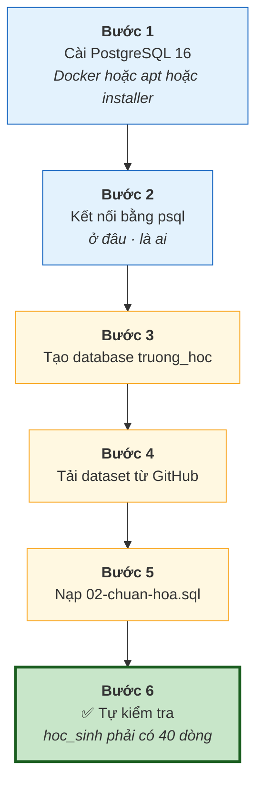

# Bài 5 — Cài đặt PostgreSQL và nạp database mẫu

!!! abstract "🎯 Học xong bài này, bạn sẽ"
    - Có một **PostgreSQL 16 đang chạy thật** trên máy của mình
    - Hiểu mô hình **máy khách – máy chủ** và vì sao phải nhớ con số 5432
    - Kết nối được bằng `psql` và dùng thành thạo các lệnh meta `\l`, `\dt`, `\d`, `\q`
    - Nạp xong database `truong_hoc` và tự kiểm tra được là đã nạp đúng
    - Tự gỡ được ba sự cố phổ biến nhất khi cài lần đầu

!!! danger "Đây là bài bản lề của cả khóa học"
    Bốn bài trước bạn chỉ **đọc**. Từ **Bài 6** trở đi, mọi bài đều giả định rằng máy bạn đã có PostgreSQL chạy được và database `truong_hoc` đã nạp xong.

    Đừng đi tiếp khi phần **Tự kiểm tra** ở cuối mục Thực hành chưa trả về đúng kết quả.

## 🧠 Câu chuyện mở đầu

Bốn bài vừa rồi giống hệt việc học luật giao thông trong lớp: bạn biết đèn đỏ là dừng, biết vạch kẻ để làm gì. Nhưng bạn chưa từng ngồi lên xe.

Hôm nay bạn ngồi lên xe.

Và cũng như lần đầu tập xe, sẽ có vài cú chết máy. Ba cú phổ biến nhất là thế này:

Bạn cài xong, gõ lệnh kết nối, màn hình trả về `could not connect to server`. Bạn tưởng mình cài hỏng — thật ra phần mềm chạy tốt, chỉ là bạn đang gõ cửa sai số nhà.

Bạn nhập mật khẩu, máy báo `password authentication failed`. Bạn chắc chắn mình gõ đúng — nhưng bạn đang gõ mật khẩu của **người dùng hệ điều hành**, còn PostgreSQL có hệ thống người dùng riêng của nó.

Bạn kết nối được, gõ `SELECT * FROM hoc_sinh;`, máy báo `relation "hoc_sinh" does not exist`. Bạn tưởng dữ liệu nạp hỏng — thật ra bạn đang đứng trong một database khác.

Cả ba đều không phải lỗi của bạn, và cả ba đều bắt nguồn từ **một** hiểu lầm duy nhất về cách PostgreSQL được tổ chức.

Câu hỏi của bài: hiểu lầm đó là gì?

## 📖 Khái niệm & thuật ngữ

### PostgreSQL không phải một ứng dụng, mà là một máy chủ

Đây chính là hiểu lầm gốc rễ.

Word hay Excel là **ứng dụng**: bạn mở nó lên, làm việc, đóng lại. PostgreSQL thì khác hẳn. Nó là một **máy chủ** (*server*) — một chương trình chạy **âm thầm và liên tục** ở nền, kể cả khi bạn không nhìn thấy cửa sổ nào. Nó nằm đó chờ, ai gõ cửa thì phục vụ.

Chương trình gõ cửa gọi là **máy khách** (*client*). `psql` là một máy khách; pgAdmin là một máy khách; ứng dụng web bạn viết sau này cũng là một máy khách.

Mô hình này gọi là **máy khách – máy chủ** (*client–server*), và nó giải thích luôn hình vẽ về DBMS ở [Bài 3](03-dbms-la-gi.md): nhiều người kết nối cùng lúc vào **một** kho dữ liệu duy nhất, được một phần mềm canh gác.

### Ba thứ bạn phải nói đúng khi gõ cửa

Vì máy chủ phục vụ nhiều người, mỗi lần kết nối bạn phải trả lời ba câu hỏi. Ba sự cố trong câu chuyện tương ứng chính xác với ba câu này:

**1. Gõ cửa ở đâu?** — máy nào, **cổng** (*port*) số mấy.

Một máy tính có thể chạy nhiều máy chủ cùng lúc (web, mail, database…). Cổng là con số để phân biệt chúng, như số phòng trong một toà nhà. PostgreSQL mặc định nằm ở cổng **5432**. Gõ nhầm cổng thì đúng toà nhà nhưng sai phòng — và bạn nhận `could not connect to server`.

**2. Bạn là ai?** — tên **vai trò** (*role*) và mật khẩu.

PostgreSQL có hệ thống người dùng **hoàn toàn riêng**, không liên quan gì tới tài khoản đăng nhập máy tính của bạn. Mỗi người dùng trong PostgreSQL gọi là một **vai trò**; vai trò quản trị mặc định tên là `postgres`. Đó là lý do mật khẩu máy tính không dùng được ở đây.

**3. Bạn muốn vào database nào?**

Một máy chủ PostgreSQL quản lý nhiều database cùng lúc — tập hợp đó gọi là một **cụm cơ sở dữ liệu** (*cluster*). Sau khi cài, cụm đã có sẵn database `postgres` dùng cho việc quản trị. Database `truong_hoc` của chúng ta là một database **khác**, phải tạo thêm.

Quên nói tên database, bạn sẽ bị đưa vào database mặc định — và ở đó tất nhiên không có bảng `hoc_sinh` nào. Đó chính là sự cố thứ ba.

!!! tip "Câu thần chú để nhớ ba thứ"
    **Ở đâu** (máy + cổng 5432) · **là ai** (vai trò + mật khẩu) · **vào đâu** (tên database).

    Gần như mọi lỗi kết nối bạn gặp trong đời đều là thiếu hoặc sai một trong ba thứ này.

### psql và các lệnh meta

**`psql`** là máy khách dòng lệnh chính thức của PostgreSQL. Trong `psql` bạn gõ được hai loại câu, và phân biệt chúng rất dễ:

- Câu **SQL** — luôn kết thúc bằng dấu **chấm phẩy** `;`. Đây là câu gửi tới máy chủ.
- **Lệnh meta** (*meta-command*) — luôn bắt đầu bằng dấu **sổ chéo ngược** `\`, **không** có dấu chấm phẩy. Đây là lệnh của riêng `psql`, máy chủ không nhìn thấy.

Bốn lệnh meta bạn sẽ dùng hằng ngày:

| Lệnh | Viết tắt của | Làm gì |
|---|---|---|
| `\l` | *list* | Liệt kê mọi database trong cụm |
| `\dt` | *describe tables* | Liệt kê các bảng trong database hiện tại |
| `\d ten_bang` | *describe* | Mô tả một bảng: cột, kiểu, khoá, ràng buộc |
| `\q` | *quit* | Thoát `psql` |

Hai lệnh hữu ích nữa: `\c ten_database` để **chuyển** sang database khác mà không cần thoát ra, và `\?` để xem toàn bộ danh sách lệnh meta.

!!! note "`\dt` và `\d` chính là từ điển dữ liệu"
    Nhớ [Bài 3](03-dbms-la-gi.md) chứ? `\dt` không có phép màu nào cả — nó chỉ là một câu `SELECT` dựng sẵn, chạy trên **từ điển dữ liệu**. Gõ `\dt` trong `psql` sau khi bật `\set ECHO_HIDDEN on` là bạn nhìn thấy câu SQL thật phía sau.

### Bảng thuật ngữ

| Tiếng Việt | English | Nghĩa dễ hiểu |
|---|---|---|
| Máy chủ | *server* | Chương trình chạy ngầm liên tục, chờ phục vụ |
| Máy khách | *client* | Chương trình kết nối tới máy chủ để nhờ việc |
| Máy khách – máy chủ | *client–server* | Mô hình nhiều máy khách dùng chung một máy chủ |
| Cổng | *port* | Con số phân biệt các máy chủ trên cùng một máy; PostgreSQL là 5432 |
| Vai trò | *role* | Người dùng của PostgreSQL; mặc định có `postgres` |
| Cụm cơ sở dữ liệu | *cluster* | Tập các database do một máy chủ PostgreSQL quản lý |
| Lệnh meta | *meta-command* | Lệnh riêng của `psql`, bắt đầu bằng `\`, không có `;` |
| Vùng chứa | *container* | Một "hộp" chạy sẵn phần mềm, độc lập với máy thật |
| Ảnh | *image* | Khuôn mẫu để tạo ra vùng chứa |

## 🖼️ Sơ đồ

Đường đi của một câu lệnh, từ ngón tay bạn tới ổ đĩa và quay về:

```mermaid
flowchart LR
    subgraph MK["💻 MÁY KHÁCH"]
        P["<b>psql</b><br/>hoặc pgAdmin<br/>hoặc ứng dụng web"]
    end

    subgraph MC["🖥️ MÁY CHỦ PostgreSQL — cổng 5432"]
        direction TB
        AUTH["<b>1. Xác thực</b><br/>vai trò + mật khẩu"]
        PARSE["<b>2. Phân tích câu lệnh</b><br/>rồi tối ưu"]
        EXEC["<b>3. Thực thi</b><br/>kiểm tra ràng buộc"]
        AUTH --> PARSE --> EXEC
    end

    subgraph CUM["🗄️ CỤM CƠ SỞ DỮ LIỆU"]
        direction TB
        DB1[("postgres<br/><i>database quản trị</i>")]
        DB2[("<b>truong_hoc</b><br/><i>10 bảng của khóa học</i>")]
    end

    P -->|"SELECT count&#42; FROM hoc_sinh;"| AUTH
    EXEC --> DB2
    DB2 -.->|"kết quả: 40"| P

    style MK fill:#e3f2fd,stroke:#1565c0,stroke-width:2px
    style MC fill:#fff8e1,stroke:#f9a825,stroke-width:2px
    style CUM fill:#e8f5e9,stroke:#2e7d32,stroke-width:2px
    style DB2 fill:#c8e6c9,stroke:#1b5e20,stroke-width:2px
```



Và đây là toàn bộ chặng đường của bài này, sáu bước:



## 💻 Thực hành

### Bước 1 — Cài PostgreSQL 16

Chọn **một** trong ba cách dưới đây. Không cần làm cả ba.

=== "Docker (khuyến nghị)"

    Cách này được khuyến nghị vì một lý do rất thực tế: nếu có gì hỏng, bạn **xoá đi làm lại trong 30 giây** mà máy tính không hề bị bẩn thêm một tệp nào.

    Trước tiên cài [Docker Desktop](https://www.docker.com/products/docker-desktop/) (Windows, macOS) hoặc Docker Engine (Linux). Kiểm tra đã cài được chưa:

    ```bash
    docker --version
    ```

    Tạo và chạy một máy chủ PostgreSQL 16:

    ```bash
    docker run -d \
      --name pg-khoahoc \
      -e POSTGRES_PASSWORD=hoc \
      -e POSTGRES_DB=truong_hoc \
      -p 5432:5432 \
      -v pg-khoahoc-data:/var/lib/postgresql/data \
      postgres:16
    ```

    Đọc từng dòng để hiểu, đừng chép suông:

    | Tham số | Nghĩa |
    |---|---|
    | `-d` | Chạy ngầm (*detached*), không chiếm cửa sổ dòng lệnh |
    | `--name pg-khoahoc` | Đặt tên cho **vùng chứa** (*container*) — cái "hộp" chạy sẵn PostgreSQL, tách biệt hẳn với máy thật của bạn — để lát nữa gọi lại cho dễ |
    | `-e POSTGRES_PASSWORD=hoc` | Mật khẩu của vai trò `postgres` là `hoc` |
    | `-e POSTGRES_DB=truong_hoc` | Tạo sẵn luôn database `truong_hoc` — **bỏ qua được Bước 3** |
    | `-p 5432:5432` | Nối cổng 5432 của máy bạn vào cổng 5432 trong vùng chứa |
    | `-v pg-khoahoc-data:/...` | Giữ dữ liệu lại kể cả khi xoá vùng chứa |
    | `postgres:16` | **Ảnh** (*image*) cần dùng — khuôn mẫu để tạo ra vùng chứa; `:16` là đúng phiên bản PostgreSQL của khóa học |

    Kiểm tra đang chạy:

    ```bash
    docker ps
    ```

    Cột `STATUS` phải hiện `Up ...`. Nếu không thấy dòng nào, xem nhật ký để biết vì sao:

    ```bash
    docker logs pg-khoahoc
    ```

    Hai lệnh dùng hằng ngày về sau — tắt máy rồi bật lại thì vùng chứa không tự chạy, bạn khởi động lại bằng:

    ```bash
    docker start pg-khoahoc
    docker stop pg-khoahoc
    ```

    !!! tip "Muốn làm lại từ đầu?"
        ```bash
        docker rm -f pg-khoahoc
        docker volume rm pg-khoahoc-data
        ```
        Rồi chạy lại lệnh `docker run` ở trên. Đây là lợi thế lớn nhất của cách này.

=== "Ubuntu / Debian (apt)"

    Cách này cài thẳng vào máy, phù hợp nếu bạn dùng Linux và không muốn đụng tới Docker.

    ```bash
    sudo apt update
    sudo apt install -y postgresql-16 postgresql-client-16
    ```

    !!! note "Nếu apt báo không tìm thấy gói `postgresql-16`"
        Kho phần mềm mặc định của bản Ubuntu bạn đang dùng có thể chứa phiên bản khác. Thêm kho chính thức của PostgreSQL rồi cài lại:

        ```bash
        sudo apt install -y curl ca-certificates
        sudo install -d /usr/share/postgresql-common/pgdg
        sudo curl -o /usr/share/postgresql-common/pgdg/apt.postgresql.org.asc \
          --fail https://www.postgresql.org/media/keys/ACCC4CF8.asc
        echo "deb [signed-by=/usr/share/postgresql-common/pgdg/apt.postgresql.org.asc] \
          https://apt.postgresql.org/pub/repos/apt $(lsb_release -cs)-pgdg main" \
          | sudo tee /etc/apt/sources.list.d/pgdg.list
        sudo apt update
        sudo apt install -y postgresql-16
        ```

    Kiểm tra máy chủ đã chạy chưa:

    ```bash
    sudo systemctl status postgresql
    ```

    Khi cài bằng `apt`, vai trò `postgres` **chưa có mật khẩu**. Đặt mật khẩu cho nó:

    ```bash
    sudo -u postgres psql -c "ALTER ROLE postgres WITH PASSWORD 'hoc';"
    ```

    Giải thích: `sudo -u postgres` nghĩa là "chạy lệnh này với tư cách người dùng hệ điều hành tên `postgres`" — người dùng này được cài đặt tự động tạo ra và được phép vào thẳng, không cần mật khẩu.

    Bật máy chủ tự chạy mỗi lần khởi động máy:

    ```bash
    sudo systemctl enable --now postgresql
    ```

=== "Windows (installer)"

    1. Tải bộ cài từ [postgresql.org/download/windows](https://www.postgresql.org/download/windows/) — chọn **PostgreSQL 16**.
    2. Chạy tệp `.exe`. Ở màn hình **Select Components**, giữ nguyên các mục được chọn sẵn; đặc biệt **phải có `Command Line Tools`** — đó chính là `psql`.
    3. Màn hình **Password**: nhập mật khẩu cho vai trò `postgres`. Khóa học này dùng `hoc`. **Ghi lại mật khẩu đó** — không có cách xem lại.
    4. Màn hình **Port**: để nguyên `5432`.
    5. Màn hình **Locale**: chọn `Vietnamese, Vietnam` hoặc để `[Default locale]`; cả hai đều chạy được.
    6. Bấm Next cho tới khi cài xong. Có thể bỏ qua **Stack Builder** ở bước cuối.

    Sau khi cài, mở **SQL Shell (psql)** từ Start Menu. Nó sẽ hỏi bốn thứ; cứ nhấn Enter để lấy giá trị mặc định trong ngoặc vuông, trừ mật khẩu:

    ```text
    Server [localhost]:
    Database [postgres]:
    Port [5432]:
    Username [postgres]:
    Password for user postgres: hoc
    ```

    !!! warning "Muốn gõ `psql` từ PowerShell thông thường"
        Phải thêm thư mục chứa `psql` vào biến môi trường `Path`, thường là:

        ```text
        C:\Program Files\PostgreSQL\16\bin
        ```

        Vào *Settings → System → About → Advanced system settings → Environment Variables*, sửa `Path`, thêm dòng trên, rồi **mở lại** PowerShell.

### Bước 2 — Kết nối bằng psql

=== "Docker (khuyến nghị)"

    ```bash
    docker exec -it pg-khoahoc psql -U postgres -d truong_hoc
    ```

    `docker exec -it pg-khoahoc` nghĩa là "chạy lệnh sau đây **bên trong** vùng chứa tên `pg-khoahoc`". Nhờ vậy bạn không cần cài `psql` lên máy thật.

=== "Ubuntu / Debian (apt)"

    ```bash
    psql -h localhost -p 5432 -U postgres -d postgres
    ```

=== "Windows (installer)"

    Mở **SQL Shell (psql)** từ Start Menu, rồi trả lời bốn câu hỏi như ở Bước 1.

    Hoặc, nếu đã thêm vào `Path`:

    ```text
    psql -h localhost -p 5432 -U postgres -d postgres
    ```

Ba chữ cái cần nhớ, chúng chính là "câu thần chú" ở trên:

| Tham số | Nghĩa | Ứng với |
|---|---|---|
| `-h` và `-p` | *host*, *port* | **Ở đâu** |
| `-U` | *user* | **Là ai** |
| `-d` | *database* | **Vào đâu** |

Kết nối thành công, dấu nhắc đổi thành tên database kèm dấu thăng:

```text
psql (16.x)
Type "help" for help.

truong_hoc=#
```

Chào hỏi máy chủ một câu:

```sql
SELECT version();
```

Rồi hỏi xem mình đang đứng ở đâu và là ai:

```sql
SELECT current_database() AS dang_o_database, current_user AS dang_la_ai;
```

Hai câu này về sau sẽ cứu bạn rất nhiều lần — mỗi khi thấy "bảng không tồn tại", hãy gõ câu thứ hai trước tiên.

### Bước 3 — Tạo database `truong_hoc`

!!! success "Dùng Docker thì bỏ qua bước này"
    Tham số `-e POSTGRES_DB=truong_hoc` ở Bước 1 đã tạo sẵn rồi.

Với cách cài `apt` hoặc Windows, bạn đang ở trong database `postgres`. Tạo database mới:

<!-- sql:khong-chay -->
```sql
CREATE DATABASE truong_hoc
    ENCODING 'UTF8'
    TEMPLATE template0;
```

`ENCODING 'UTF8'` là bắt buộc với khóa học này — dữ liệu có dấu tiếng Việt.

Rồi **chuyển** sang database vừa tạo bằng lệnh meta:

```text
\c truong_hoc
```

Dấu nhắc phải đổi thành `truong_hoc=#`. Nếu vẫn là `postgres=#` thì bạn đang đứng sai chỗ, và mọi bước sau sẽ thất bại.

### Bước 4 — Tải dataset

Ba tệp dataset nằm trong [thư mục `dataset/` trên GitHub](https://github.com/hungnguyen010518/database-tu-a-z/tree/main/dataset). Xem trang [Database mẫu](../dataset.md) để biết mỗi tệp chứa gì.

Cách gọn nhất là tải cả kho về:

```bash
git clone https://github.com/hungnguyen010518/database-tu-a-z.git
cd database-tu-a-z
```

Không có `git` thì bấm nút **Code → Download ZIP** trên GitHub rồi giải nén.

### Bước 5 — Nạp `02-chuan-hoa.sql`

Bài này chỉ nạp **một** tệp: `dataset/02-chuan-hoa.sql`. Hai tệp còn lại để dành cho Cấp 2 và Cấp 4.

=== "Docker (khuyến nghị)"

    ```bash
    docker exec -i pg-khoahoc psql -U postgres -d truong_hoc \
      -v ON_ERROR_STOP=1 < dataset/02-chuan-hoa.sql
    ```

    Lưu ý `-i` chứ không phải `-it`: ở đây ta **đẩy tệp vào** qua dấu `<`, không gõ tay.

=== "Ubuntu / Debian (apt)"

    ```bash
    psql -h localhost -U postgres -d truong_hoc \
      -v ON_ERROR_STOP=1 -f dataset/02-chuan-hoa.sql
    ```

=== "Windows (installer)"

    ```text
    psql -h localhost -U postgres -d truong_hoc -v ON_ERROR_STOP=1 -f dataset\02-chuan-hoa.sql
    ```

`-v ON_ERROR_STOP=1` rất đáng nhớ: mặc định `psql` gặp lỗi vẫn chạy tiếp những câu sau, để lại một database nạp dở mà bạn không hay biết. Có tham số này, nó **dừng ngay** ở câu lỗi đầu tiên.

Màn hình sẽ trôi qua hàng loạt dòng `DROP TABLE`, `CREATE TABLE`, `INSERT 0 40`… Đó là bình thường.

### Bước 6 — Tự kiểm tra

Đây là phần **không được bỏ qua**. Vào lại `psql` với database `truong_hoc` rồi làm ba việc sau.

**Việc 1 — Đếm bảng.** Gõ lệnh meta:

```text
\dt
```

Phải hiện đúng **10** bảng: `diem`, `diem_danh`, `giao_vien`, `hoc_sinh`, `lop`, `mon_hoc`, `muon_sach`, `phan_cong_day`, `phu_huynh`, `sach`.

**Việc 2 — Xem cấu trúc một bảng.**

```text
\d hoc_sinh
```

Bạn sẽ thấy 6 cột, khoá chính `ma_hs`, và một **khoá ngoại** (*foreign key*) trỏ tới bảng `lop` — đúng lời hứa "`ma_lop` chỉ được chứa mã lớp có thật" mà [Bài 2](02-tu-so-giay-den-excel.md) đã giới thiệu. Chính là lược đồ mà [Bài 3](03-dbms-la-gi.md) đã nói.

**Việc 3 — Đếm dữ liệu.** Câu quan trọng nhất của cả bài:

```sql
SELECT count(*) AS so_hoc_sinh FROM hoc_sinh;
```

| so_hoc_sinh |
|---|
| 40 |

Nếu ra đúng **40**, bạn đã xong. Chúc mừng — bạn vừa có một cơ sở dữ liệu thật đầu tiên trong đời.

Muốn chắc chắn hơn nữa, kiểm tra toàn bộ mười bảng một lần:

```sql
SELECT 'giao_vien'     AS bang, count(*) AS so_dong FROM giao_vien
UNION ALL SELECT 'lop',           count(*) FROM lop
UNION ALL SELECT 'hoc_sinh',      count(*) FROM hoc_sinh
UNION ALL SELECT 'phu_huynh',     count(*) FROM phu_huynh
UNION ALL SELECT 'mon_hoc',       count(*) FROM mon_hoc
UNION ALL SELECT 'phan_cong_day', count(*) FROM phan_cong_day
UNION ALL SELECT 'diem',          count(*) FROM diem
UNION ALL SELECT 'sach',          count(*) FROM sach
UNION ALL SELECT 'muon_sach',     count(*) FROM muon_sach
UNION ALL SELECT 'diem_danh',     count(*) FROM diem_danh
ORDER BY bang;
```

Kết quả phải khớp **chính xác** bảng dưới đây:

| bang | so_dong |
|---|---|
| diem | 480 |
| diem_danh | 200 |
| giao_vien | 8 |
| hoc_sinh | 40 |
| lop | 6 |
| mon_hoc | 9 |
| muon_sach | 50 |
| phan_cong_day | 64 |
| phu_huynh | 45 |
| sach | 20 |

Lệch một con số nghĩa là tệp nạp chưa hết. Chạy lại Bước 5 — tệp `02-chuan-hoa.sql` bắt đầu bằng `DROP TABLE IF EXISTS` nên nạp lại bao nhiêu lần cũng an toàn.

Cuối cùng, thoát ra:

```text
\q
```

### Chạy thử một câu có ý nghĩa

Thưởng cho công sức vừa rồi — câu này trả lời một câu hỏi thật:

```sql
SELECT l.ten_lop, count(h.ma_hs) AS si_so
FROM lop l
JOIN hoc_sinh h ON h.ma_lop = l.ma_lop
GROUP BY l.ten_lop
ORDER BY l.ten_lop;
```

| ten_lop | si_so |
|---|---|
| 8A1 | 6 |
| 8A2 | 6 |
| 8A3 | 8 |
| 9A1 | 6 |
| 9A2 | 7 |
| 9A3 | 7 |

Chưa hiểu `JOIN` và `GROUP BY` cũng không sao — Bài 25 và Bài 27 sẽ dạy. Điều đáng nói là: câu hỏi mà lớp trưởng ở [Bài 1](01-du-lieu-va-thong-tin.md) phải ngồi đếm cả buổi chiều, bây giờ bạn trả lời trong vài mili giây.

## ⚠️ Lỗi thường gặp

!!! warning "Lỗi 1: `could not connect to server` — cổng 5432 đã bị chiếm"
    Thông báo trên Linux thường là:

    ```text
    psql: error: connection to server at "localhost" (127.0.0.1), port 5432 failed:
    Connection refused
    ```

    Còn Docker thì báo ngay khi `docker run`:

    ```text
    Error response from daemon: driver failed programming external connectivity on endpoint
    pg-khoahoc: Bind for 0.0.0.0:5432 failed: port is already allocated
    ```

    **Nguyên nhân** thường là một trong hai: máy chủ PostgreSQL chưa chạy, hoặc đã có một PostgreSQL khác (cài từ trước) đang chiếm cổng 5432.

    **Cách kiểm tra** xem ai đang giữ cổng:

    ```bash
    sudo lsof -i :5432          # Linux / macOS
    netstat -ano | findstr 5432 # Windows
    ```

    **Cách sửa.** Nếu chưa chạy thì bật lên:

    ```bash
    docker start pg-khoahoc        # cách Docker
    sudo systemctl start postgresql # cách apt
    ```

    Nếu đã có cái khác chiếm cổng, đơn giản nhất là **dùng cổng khác** cho vùng chứa của khóa học:

    ```bash
    docker rm -f pg-khoahoc
    docker run -d \
      --name pg-khoahoc \
      -e POSTGRES_PASSWORD=hoc \
      -e POSTGRES_DB=truong_hoc \
      -p 5433:5432 \
      -v pg-khoahoc-data:/var/lib/postgresql/data \
      postgres:16
    ```

    Chỉ đúng **một** thứ đổi so với Bước 1: `5432:5432` thành `5433:5432` — nghĩa là máy bạn mở cổng 5433, còn bên trong vùng chứa PostgreSQL vẫn nằm ở 5432 như thường lệ. Dòng `-v pg-khoahoc-data:...` phải giữ nguyên, nếu không bạn sẽ mất phần dữ liệu bền vững mà Bước 1 đã thiết lập.

    Từ đó về sau nhớ thêm `-p 5433` vào mọi lệnh `psql` chạy từ máy thật.

!!! warning "Lỗi 2: `password authentication failed` — sai mật khẩu, hoặc nhầm hệ người dùng"
    ```text
    psql: error: connection to server at "localhost" (127.0.0.1), port 5432 failed:
    FATAL:  password authentication failed for user "postgres"
    ```

    **Nguyên nhân phổ biến nhất không phải gõ sai phím**, mà là hiểu lầm đã nói ở phần Khái niệm: bạn đang gõ mật khẩu tài khoản **máy tính**, trong khi PostgreSQL có hệ thống vai trò riêng.

    **Cách sửa với Docker:** mật khẩu là đúng cái bạn ghi ở `POSTGRES_PASSWORD`. Quên rồi thì xoá vùng chứa, tạo lại — chỉ mất 30 giây.

    **Cách sửa với apt:** vào bằng người dùng hệ điều hành `postgres` (không cần mật khẩu) rồi đặt lại:

    ```bash
    sudo -u postgres psql -c "ALTER ROLE postgres WITH PASSWORD 'hoc';"
    ```

    **Cách sửa với Windows:** không có cách xem lại mật khẩu cũ. Chạy lại bộ cài và chọn *Repair*, hoặc gỡ ra cài lại.

    Một mẹo nhỏ để khỏi phải gõ mật khẩu mỗi lần — đặt biến môi trường trước khi chạy `psql`:

    === "Linux / macOS"

        ```bash
        export PGPASSWORD=hoc
        ```

    === "Windows — PowerShell"

        ```text
        $env:PGPASSWORD = "hoc"
        ```

    === "Windows — Command Prompt"

        ```text
        set PGPASSWORD=hoc
        ```

    Biến này chỉ sống trong cửa sổ dòng lệnh hiện tại; đóng cửa sổ là mất.

!!! warning "Lỗi 3: `relation ... does not exist` — quên `-d truong_hoc`"
    ```text
    ERROR:  relation "hoc_sinh" does not exist
    LINE 1: SELECT count(*) FROM hoc_sinh;
                                 ^
    ```

    Từ `relation` ở đây chính là "bảng" — nhớ [Bài 4](04-cac-mo-hinh-du-lieu.md): trong mô hình quan hệ, bảng có tên toán học là *relation*.

    **Nguyên nhân:** bạn đang đứng trong database `postgres` (database quản trị) chứ không phải `truong_hoc`. Quên `-d truong_hoc` là `psql` đưa bạn vào database trùng tên người dùng hoặc `postgres`.

    **Cách kiểm tra** — gõ ngay câu này mỗi khi gặp lỗi trên:

    ```sql
    SELECT current_database();
    ```

    Nếu nó trả về `postgres` thì bạn đã tìm ra thủ phạm.

    **Cách sửa:** chuyển database ngay trong `psql`, không cần thoát ra:

    ```text
    \c truong_hoc
    ```

    Hoặc lần sau kết nối thì thêm `-d truong_hoc`.

!!! warning "Lỗi 4: Nạp tệp xong mà không có bảng nào"
    Triệu chứng: `psql ... -f 02-chuan-hoa.sql` chạy trôi qua, nhưng `\dt` báo `Did not find any relations.`

    Nguyên nhân gần như luôn là: tệp đã được nạp vào **database khác** với database bạn đang mở để kiểm tra. Chuyện này xảy ra khi lệnh nạp thiếu `-d truong_hoc`.

    Cách xác nhận: liệt kê mọi database rồi vào từng cái xem bảng nằm ở đâu.

    ```text
    \l
    ```

    Và hãy luôn dùng `-v ON_ERROR_STOP=1` khi nạp tệp. Không có nó, một lỗi ở dòng 20 vẫn để `psql` chạy tiếp tới dòng 900 và báo "xong" một cách rất thuyết phục.

## ✍️ Bài tập

1. Giải thích bằng lời của bạn: vì sao PostgreSQL cần một con số cổng, trong khi Word thì không cần?

2. Cho lệnh sau. Hãy chỉ ra từng tham số trả lời cho câu hỏi nào trong ba câu *"ở đâu — là ai — vào đâu"*:

    ```bash
    psql -h localhost -p 5433 -U postgres -d truong_hoc
    ```

3. Bạn gõ `SELECT count(*) FROM giao_vien;` và nhận `ERROR: relation "giao_vien" does not exist`. Hãy nêu **hai** nguyên nhân có thể, và với mỗi nguyên nhân, một câu lệnh để xác nhận đúng là nó.

4. Trong các dòng sau, dòng nào là lệnh meta của `psql`, dòng nào là câu SQL? Dựa vào dấu hiệu gì mà bạn biết?
   `\dt` · `SELECT 1;` · `\c truong_hoc` · `DROP TABLE lop;` · `\q`

5. Bạn của bạn nạp dataset xong, `\dt` hiện đủ 10 bảng, nhưng `SELECT count(*) FROM diem;` trả về `312` thay vì `480`. Chuyện gì nhiều khả năng đã xảy ra, và cách sửa an toàn nhất là gì?

??? success "Đáp án"
    **Câu 1.**

    Word là một **ứng dụng** chạy ngay trên máy bạn: bạn mở tệp, sửa, đóng. Không ai từ máy khác cần "gõ cửa" Word của bạn cả.

    PostgreSQL là một **máy chủ**: nó chạy ngầm liên tục và chờ nhiều máy khách kết nối tới — có thể từ chính máy bạn, có thể từ máy khác trong mạng. Mà một máy tính thường chạy nhiều máy chủ cùng lúc: máy chủ web, máy chủ mail, máy chủ database…

    Cổng là con số để hệ điều hành biết **gói tin gửi tới nên giao cho máy chủ nào**. Giống như địa chỉ toà nhà (địa chỉ IP) là chưa đủ, còn cần số phòng (cổng) mới tới đúng người.

    **Câu 2.**

    | Tham số | Trả lời câu hỏi | Cụ thể |
    |---|---|---|
    | `-h localhost` | **Ở đâu** | Máy chủ nằm trên chính máy này |
    | `-p 5433` | **Ở đâu** | Cổng 5433 — không phải mặc định, chắc là do đã đổi cổng vì 5432 bị chiếm |
    | `-U postgres` | **Là ai** | Đăng nhập bằng vai trò `postgres` |
    | `-d truong_hoc` | **Vào đâu** | Vào database `truong_hoc` |

    Thiếu mật khẩu trong lệnh là bình thường: `psql` sẽ hỏi riêng, hoặc lấy từ biến môi trường `PGPASSWORD`. Ghi mật khẩu thẳng vào dòng lệnh là thói quen xấu vì nó bị lưu vào lịch sử shell.

    **Câu 3.**

    *Nguyên nhân 1 — đang đứng sai database.* Bạn ở trong `postgres` chứ không phải `truong_hoc`.

    Xác nhận:

    ```sql
    SELECT current_database();
    ```

    Nếu trả về `postgres` thì đúng là nó. Sửa bằng `\c truong_hoc`.

    *Nguyên nhân 2 — dataset chưa được nạp (hoặc nạp dở).* Đúng database rồi nhưng bảng chưa tồn tại.

    Xác nhận bằng lệnh meta `\dt`: nếu hiện `Did not find any relations.` thì database rỗng. Sửa bằng cách chạy lại Bước 5.

    *(Một nguyên nhân thứ ba ít gặp hơn: gõ sai tên bảng — ví dụ `giao_vien` thành `giaovien`. `\dt` cũng giúp phát hiện ngay.)*

    **Câu 4.**

    | Dòng | Loại | Dấu hiệu |
    |---|---|---|
    | `\dt` | Lệnh meta | Bắt đầu bằng `\`, không có `;` |
    | `SELECT 1;` | SQL | Kết thúc bằng `;` |
    | `\c truong_hoc` | Lệnh meta | Bắt đầu bằng `\` |
    | `DROP TABLE lop;` | SQL | Kết thúc bằng `;` |
    | `\q` | Lệnh meta | Bắt đầu bằng `\` |

    Quy tắc nhận biết: **`\` là của `psql`, `;` là của máy chủ.** Lệnh meta được `psql` xử lý tại chỗ và máy chủ không bao giờ nhìn thấy chúng — đó cũng là lý do bạn không dùng được `\dt` trong một ứng dụng web hay một công cụ khác.

    **Câu 5.**

    Nhiều khả năng tệp nạp **bị dừng giữa chừng** mà bạn ấy không để ý: một câu `INSERT` nào đó lỗi, nhưng vì thiếu `-v ON_ERROR_STOP=1` nên `psql` vẫn chạy tiếp và kết thúc êm ru. Các bảng đã được tạo (nên `\dt` hiện đủ 10) nhưng dữ liệu chỉ vào được một phần.

    Một khả năng khác: tệp đã bị nạp **lồng vào một lần nạp trước đó bị lỗi**, hoặc bị ngắt do mất kết nối giữa chừng.

    Cách sửa an toàn nhất là **nạp lại từ đầu, có bật cờ dừng khi lỗi**:

    ```bash
    psql -h localhost -U postgres -d truong_hoc -v ON_ERROR_STOP=1 -f dataset/02-chuan-hoa.sql
    ```

    Nạp lại hoàn toàn an toàn vì tệp mở đầu bằng một loạt `DROP TABLE IF EXISTS ... CASCADE;` — nó tự dọn sạch trước khi dựng lại. Lần này, nếu có lỗi thật, `psql` sẽ dừng ngay và in ra đúng dòng gây lỗi.

    Sau đó chạy lại câu kiểm tra mười bảng ở Bước 6 để đối chiếu đủ mười con số.

## 🔑 Tóm tắt

1. PostgreSQL là một **máy chủ** chạy ngầm liên tục, không phải ứng dụng bật/tắt; `psql` chỉ là một **máy khách** gõ cửa nó.
2. Mỗi lần kết nối phải nói đủ ba thứ — **ở đâu** (`-h`, `-p`, mặc định cổng 5432), **là ai** (`-U` + mật khẩu của vai trò PostgreSQL, không phải mật khẩu máy tính), **vào đâu** (`-d truong_hoc`).
3. Trong `psql`, câu **SQL** kết thúc bằng `;` và đi tới máy chủ; **lệnh meta** bắt đầu bằng `\` và do `psql` tự xử lý — `\l`, `\dt`, `\d ten_bang`, `\c`, `\q`.
4. Nạp dataset bằng `psql ... -v ON_ERROR_STOP=1 -f dataset/02-chuan-hoa.sql`; cờ `ON_ERROR_STOP` là thứ ngăn bạn nhận một database nạp dở mà không hay biết.
5. Mốc kiểm tra bắt buộc trước khi sang Bài 6: `\dt` hiện đủ **10 bảng** và `SELECT count(*) FROM hoc_sinh;` trả về đúng **40**.

---

⬅️ [Bài 4 — Các mô hình dữ liệu](04-cac-mo-hinh-du-lieu.md) · ➡️ **Bài 6 — Mô hình hoá dữ liệu là gì** *(sắp có)*
