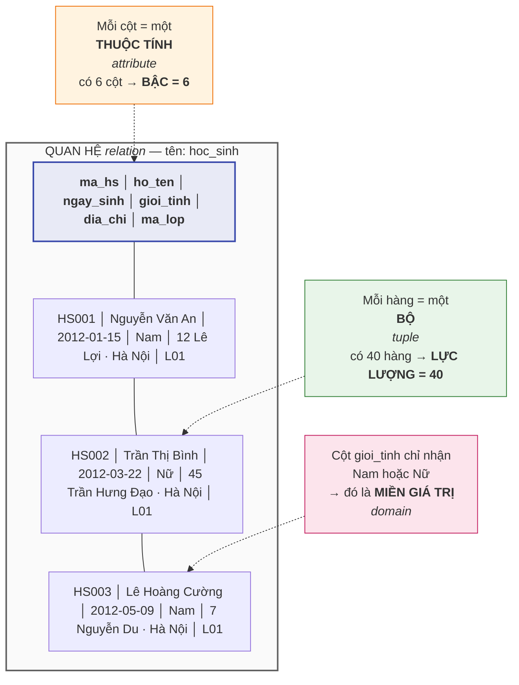
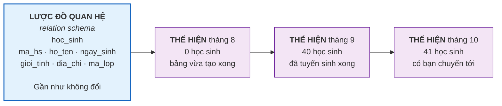

# Bài 6 — Mô hình quan hệ: bảng, dòng, cột, miền giá trị, lược đồ

!!! abstract "🎯 Học xong bài này, bạn sẽ"
    - Gọi đúng tên học thuật của mọi bộ phận một bảng: **quan hệ**, **bộ**, **thuộc tính**, **miền giá trị**
    - Phân biệt **bậc** và **lực lượng** của một quan hệ — hai con số hay bị lẫn lộn
    - Phân biệt **lược đồ quan hệ** (cái khung) với **thể hiện** (dữ liệu đang nằm trong khung)
    - Giải thích được vì sao trong lý thuyết, thứ tự các dòng trong bảng **không có ý nghĩa gì**
    - Tự đọc được cấu trúc một bảng thật trong PostgreSQL bằng `\d` và bằng SQL

## 🧠 Câu chuyện mở đầu

Cửa lớp 8A1 dán một tờ giấy A4 kẻ tay: **bảng phân công trực nhật**.

Cột dọc đầu tiên là thứ trong tuần. Các cột còn lại là đầu việc: *Quét lớp*, *Lau bảng*, *Đổ rác*. Mỗi ô ghi tên một bạn.

| Thứ | Quét lớp | Lau bảng | Đổ rác |
|---|---|---|---|
| Hai | Nguyễn Văn An | Trần Thị Bình | Lê Hoàng Cường |
| Ba | Phạm Thị Dung | Hoàng Minh Đức | Vũ Thị Giang |
| Tư | Đỗ Văn Hải | Bùi Thị Hương | Nguyễn Văn An |

Tờ giấy này bé tí, nhưng nó tuân theo một bộ quy tắc rất chặt mà cả lớp ngầm hiểu:

- Mỗi hàng nói về **đúng một** ngày. Không ai viết hai ngày vào chung một hàng.
- Cột *Quét lớp* thì chỉ được điền **tên người**. Không ai điền `7 giờ sáng` vào đó.
- Cột *Thứ* chỉ được nhận **bảy giá trị** — Hai tới Chủ nhật. Viết `Thứ Chín` là vô nghĩa.
- Không có hai hàng nào giống hệt nhau. Có thì thừa.
- Và: nếu bạn **cắt rời ba hàng ra rồi dán lại theo thứ tự khác**, tờ giấy vẫn nói đúng y như cũ.

Điều cuối cùng đáng ngạc nhiên nhất. Chúng ta quen nhìn bảng như một danh sách có trên có dưới, nhưng ở đây thứ tự lại chẳng mang thông tin gì.

Vậy nếu thứ tự không quan trọng, thì thứ gì mới thực sự làm nên một cái bảng?

## 📖 Khái niệm & thuật ngữ

Cách trả lời câu hỏi trên chính là **mô hình quan hệ** (*relational model*) — mô hình do Edgar F. Codd đề xuất năm 1970, và là nền tảng của mọi hệ quản trị cơ sở dữ liệu quan hệ mà bạn đã gặp ở [Bài 4](../cap-0-nhap-mon/04-cac-mo-hinh-du-lieu.md).

Ý tưởng của Codd: đừng nghĩ bảng là một *hình vẽ*, hãy nghĩ nó là một **tập hợp** trong toán học.

### Quan hệ, bộ, thuộc tính

Trong mô hình quan hệ, cái mà đời thường gọi là "bảng" có tên chính thức là **quan hệ** (*relation*).

!!! warning "Đừng nhầm hai chữ 'quan hệ'"
    Tiếng Việt dùng chung một từ cho hai khái niệm khác hẳn nhau:

    - **Quan hệ** (*relation*) = **một cái bảng**. Đó là nghĩa của bài này.
    - **Mối quan hệ** (*relationship*) = **sự liên kết giữa hai bảng**, ví dụ "học sinh thuộc lớp". Đó là chủ đề của Bài 8.

    Trong khóa học này, hễ nói **quan hệ** trống không là nói về *relation* — một cái bảng. Nói về *relationship* thì luôn có thêm chữ **mối**.

Từng bộ phận của quan hệ:

- Một **hàng ngang** là một **bộ** (*tuple*). Đây là tên học thuật; trong SQL người ta quen gọi là *dòng* (*row*) hoặc *bản ghi* (*record*) như bạn đã học ở [Bài 1](../cap-0-nhap-mon/01-du-lieu-va-thong-tin.md). Ba từ này chỉ cùng một thứ.
- Một **cột dọc** là một **thuộc tính** (*attribute*). Trong SQL quen gọi là *cột* (*column*) hoặc *trường* (*field*).
- Mỗi thuộc tính có một tên, và tên đó **không được trùng** với thuộc tính khác trong cùng quan hệ.

### Miền giá trị

Câu "cột *Thứ* chỉ được nhận bảy giá trị" trong câu chuyện đầu bài chính là một khái niệm chuẩn: **miền giá trị** (*domain*) — tập hợp **tất cả** các giá trị hợp lệ mà một thuộc tính được phép nhận.

Miền giá trị gồm hai tầng:

| Tầng | Ví dụ với cột `gioi_tinh` của `hoc_sinh` | Ai kiểm soát |
|---|---|---|
| **Kiểu dữ liệu** | `VARCHAR(3)` — chuỗi tối đa 3 ký tự | Hệ quản trị |
| **Ràng buộc thu hẹp thêm** | `CHECK (gioi_tinh IN ('Nam','Nữ'))` — chỉ 2 giá trị | Người thiết kế |

Miền giá trị là thứ ngăn dữ liệu rác lọt vào bảng. Nếu ai đó cố ghi `Thứ Chín` vào cột `Thứ`, hệ quản trị sẽ **từ chối** thay vì ngoan ngoãn ghi vào như Excel. Bài 15 sẽ đào sâu toàn bộ hệ thống ràng buộc này.

Một giá trị đặc biệt luôn được phép xuất hiện (trừ khi bị cấm bằng `NOT NULL`): **`NULL`** — nghĩa là *"chưa biết"* hoặc *"không áp dụng"*. `NULL` **không phải** số 0, cũng **không phải** chuỗi rỗng. Bài 24 sẽ dành trọn cho nó vì đây là cái bẫy lớn nhất của người mới.

### Bậc và lực lượng — hai con số đừng lẫn lộn

Một quan hệ được đo bằng hai con số hoàn toàn khác nhau:

| Khái niệm | English | Đếm cái gì | Với bảng `hoc_sinh` |
|---|---|---|---|
| **Bậc của quan hệ** | *degree* / *arity* | Số **cột** | 6 |
| **Lực lượng** | *cardinality of a relation* | Số **dòng** | 40 |

Cách nhớ: **bậc là chiều ngang, lực lượng là chiều dọc**.

!!! note "Vì sao phải nhớ hai chữ này?"
    Vì **bậc** hầu như không đổi — muốn đổi phải sửa thiết kế bảng. Còn **lực lượng** đổi liên tục — cứ thêm một học sinh là nó tăng. Hai con số mô tả hai thứ khác hẳn nhau về bản chất, nên chúng phải có hai cái tên.

    Cảnh báo trước: chữ **bậc** còn được dùng lần nữa ở Bài 8, nhưng cho *mối quan hệ* chứ không phải *quan hệ*. Bài 8 sẽ nhắc lại chỗ này.

### Lược đồ và thể hiện

Đây là cặp khái niệm quan trọng nhất của bài.

**Lược đồ quan hệ** (*relation schema*) là **cái khung**: tên quan hệ, danh sách thuộc tính, và miền giá trị của từng thuộc tính. Người ta viết gọn như sau:

```
hoc_sinh(ma_hs, ho_ten, ngay_sinh, gioi_tinh, dia_chi, ma_lop)
```

**Thể hiện** (*instance*) là **dữ liệu đang nằm trong khung** tại một thời điểm cụ thể — 40 dòng học sinh ngay lúc này. Bạn đã gặp cặp khái niệm này ở [Bài 3](../cap-0-nhap-mon/03-dbms-la-gi.md) ở mức toàn bộ database; ở đây ta áp dụng nó cho từng bảng một.

So sánh cho dễ nhớ:

| | Lược đồ | Thể hiện |
|---|---|---|
| Là gì | Bản thiết kế | Dữ liệu thật |
| Ví dụ đời thường | Mẫu giấy khai lý lịch in sẵn | Tờ khai đã điền của bạn An |
| Thay đổi khi nào | Hiếm — phải sửa thiết kế | Liên tục — mỗi lần thêm/sửa/xoá |
| Ai định nghĩa | Người thiết kế database | Người dùng hằng ngày |

Ghép tất cả lược đồ quan hệ của một database lại, ta được **lược đồ cơ sở dữ liệu** (*database schema*). Toàn bộ Cấp 1 này chính là học cách **thiết kế lược đồ** — trước khi biết viết SQL.

### Ba tính chất mà một quan hệ phải có

Vì quan hệ là một **tập hợp** các bộ, nó thừa hưởng đúng tính chất của tập hợp trong toán:

1. **Không có bộ trùng lặp.** Hai dòng giống hệt nhau ở mọi cột thì thực chất là một. Đây chính là lý do sâu xa vì sao mọi bảng cần một cột định danh — Bài 12 sẽ gọi tên nó là **khoá chính**.
2. **Thứ tự các bộ không có ý nghĩa.** Đảo dòng đi, quan hệ vẫn là quan hệ đó. Hệ quả thực tế rất quan trọng: nếu bạn viết `SELECT` mà không có `ORDER BY`, PostgreSQL **không hứa** trả về theo thứ tự nào cả.
3. **Thứ tự các thuộc tính cũng không có ý nghĩa** về mặt lý thuyết. Trong thực tế SQL có nhớ thứ tự cột, nhưng bạn không nên dựa vào nó — luôn gọi cột bằng tên.

Còn một tính chất thứ tư, gọi là **tính nguyên tử** (*atomicity*): mỗi ô chỉ chứa **một** giá trị đơn, không chứa danh sách. Ô ghi `0912345001, 0912345002` là vi phạm. Bài 7 sẽ gọi đó là **thuộc tính đa trị**, và Cấp 2 sẽ dùng chính tính chất này làm định nghĩa của dạng chuẩn 1.

### Bảng thuật ngữ

| Tiếng Việt | English | Nghĩa dễ hiểu |
|---|---|---|
| Quan hệ | *relation* | Một cái bảng, hiểu như một tập hợp các dòng |
| Bộ | *tuple* | Một hàng ngang của bảng |
| Thuộc tính | *attribute* | Một cột dọc của bảng |
| Miền giá trị | *domain* | Tập hợp mọi giá trị hợp lệ của một cột |
| Bậc của quan hệ | *degree / arity* | Số cột của bảng |
| Lực lượng | *cardinality of a relation* | Số dòng của bảng |
| Lược đồ quan hệ | *relation schema* | Cái khung: tên bảng + danh sách cột + miền giá trị |
| Thể hiện | *instance* | Dữ liệu đang nằm trong khung tại một thời điểm |
| Tính nguyên tử | *atomicity* | Mỗi ô chỉ chứa đúng một giá trị đơn |

## 🖼️ Sơ đồ

Sơ đồ dưới đây gắn nhãn học thuật lên đúng từng bộ phận của bảng `hoc_sinh`:



Và đây là quan hệ giữa **lược đồ** với **thể hiện** — một lược đồ, vô số thể hiện theo thời gian:



## 💻 Thực hành

Bạn đã nạp xong `dataset/02-chuan-hoa.sql` ở Bài 5. Mở `psql` và làm theo.

### Xem lược đồ bằng lệnh `\d`

`\d` là **lệnh riêng của psql**, không phải SQL. Gõ vào dấu nhắc `psql`:

```text
truong_hoc=# \d hoc_sinh
```

psql in ra một bảng mô tả gồm các phần sau — hãy đối chiếu ngay với những khái niệm vừa học:

| Phần psql in ra | Khái niệm của bài này |
|---|---|
| Danh sách tên cột | Danh sách **thuộc tính** |
| Cột `Type` (`character(5)`, `date`, ...) | **Miền giá trị**, tầng kiểu dữ liệu |
| Cột `Nullable` (`not null` hay để trống) | Cột này có được phép rỗng không |
| Cột `Default` | Giá trị mặc định khi không nhập |
| Mục `Indexes` với `hoc_sinh_pkey` | Ràng buộc định danh — **Bài 12** gọi là khoá chính |
| Mục `Check constraints` | **Miền giá trị**, tầng thu hẹp thêm |
| Mục `Foreign-key constraints` | Liên kết sang bảng khác — **Bài 12** |

Đếm số dòng trong phần danh sách cột, bạn được **6** — đó là **bậc** của quan hệ `hoc_sinh`.

Điều quan trọng nhất: **toàn bộ những gì `\d` in ra đều là lược đồ.** Không có một dòng dữ liệu học sinh nào cả.

### Xem thể hiện

Bây giờ mới là dữ liệu — tức thể hiện:

```sql
SELECT * FROM hoc_sinh ORDER BY ma_hs LIMIT 5;
```

Kết quả: 5 dòng đầu, từ `HS001` Nguyễn Văn An tới `HS005` Hoàng Minh Đức.

!!! tip "Vì sao bài này luôn viết `ORDER BY` kèm `LIMIT`?"
    Vì tính chất số 2 ở trên: **quan hệ không có thứ tự**. `SELECT ... LIMIT 5` mà không `ORDER BY` thì PostgreSQL được quyền đưa bạn 5 dòng bất kỳ, và lần chạy sau có thể ra 5 dòng khác. Muốn kết quả ổn định thì phải nói rõ trật tự mình muốn.

### Đo bậc của quan hệ

Bậc là số cột. PostgreSQL lưu chính thông tin lược đồ này trong `information_schema` — một bộ bảng đặc biệt chứa "lược đồ của các lược đồ":

```sql
SELECT count(*) AS bac_cua_quan_he
FROM information_schema.columns
WHERE table_schema = 'public' AND table_name = 'hoc_sinh';
```

Kết quả: `6`.

### Đo lực lượng

Lực lượng là số dòng:

```sql
SELECT count(*) AS luc_luong FROM hoc_sinh;
```

Kết quả: `40`.

Hai câu lệnh trên trông giống nhau nhưng đọc hai thứ khác hẳn: câu đầu đếm trong **lược đồ**, câu sau đếm trong **thể hiện**.

### Đọc miền giá trị của từng thuộc tính

```sql
SELECT column_name, data_type, character_maximum_length, is_nullable
FROM information_schema.columns
WHERE table_schema = 'public' AND table_name = 'hoc_sinh'
ORDER BY ordinal_position;
```

Kết quả gồm 6 dòng, mỗi dòng là miền giá trị ở tầng kiểu dữ liệu của một cột. Chú ý cột `is_nullable`: chỉ `dia_chi` là `YES` — nghĩa là chỉ địa chỉ mới được phép để trống.

Còn tầng thu hẹp thêm bằng `CHECK` thì nhìn thấy rõ nhất qua dữ liệu thật:

```sql
SELECT DISTINCT gioi_tinh FROM hoc_sinh ORDER BY gioi_tinh;
```

Đúng 2 dòng: `Nam` và `Nữ`. Không phải vì may mắn, mà vì ràng buộc `CHECK` **không cho phép** giá trị thứ ba tồn tại.

### Kiểm chứng "không có bộ trùng lặp"

```sql
SELECT count(*) AS tong_so_dong,
       count(DISTINCT ma_hs) AS so_ma_hs_khac_nhau
FROM hoc_sinh;
```

Kết quả: `40` và `40`. Hai số bằng nhau nghĩa là không có mã nào bị lặp — mỗi bộ được phân biệt chắc chắn với mọi bộ còn lại.

## ⚠️ Lỗi thường gặp

!!! warning "Lỗi 1: Lẫn lộn 'bậc' với 'lực lượng'"
    Rất nhiều người mới nói *"bảng này có bậc 40"* khi ý là 40 dòng. Sai. 40 dòng là **lực lượng**; **bậc** là 6 vì bảng có 6 cột.

    Mẹo nhớ: *degree* trong tiếng Anh cũng dùng cho "bậc của đa thức" — đếm số biến, tức chiều ngang. Còn *cardinality* trong toán là "số phần tử của tập hợp" — mà phần tử của quan hệ chính là các bộ, tức chiều dọc.

!!! warning "Lỗi 2: Tin rằng `SELECT` trả về dữ liệu theo thứ tự đã `INSERT`"
    Thoạt nhìn thì đúng thật — PostgreSQL hay trả về theo thứ tự lưu trên đĩa, mà lúc đầu nó trùng với thứ tự nhập. Nhưng chỉ cần một lệnh `UPDATE`, một lần dọn dẹp nội bộ, hay một kế hoạch chạy song song là trật tự đảo lộn.

    Đây là lỗi kinh điển vì nó **không sai ngay**. Nó sai sau ba tháng, trên máy chủ thật, khi dữ liệu đã nhiều. Quy tắc: **cần thứ tự thì phải viết `ORDER BY`.**

!!! warning "Lỗi 3: Nhét nhiều giá trị vào một ô"
    Thấy học sinh có hai số điện thoại nên ghi `0912345001, 0912345002` vào cùng một ô — vi phạm tính nguyên tử.

    Hậu quả cụ thể: câu hỏi *"số nào bắt đầu bằng 091?"* trở thành bài toán cắt chuỗi thay vì một phép so sánh đơn giản; và bạn không bao giờ ràng buộc nổi "mỗi số phải đủ 10 chữ số". Bài 7 sẽ chỉ cách xử lý đúng, Cấp 2 sẽ biến quy tắc này thành **dạng chuẩn 1**.

!!! warning "Lỗi 4: Nghĩ 'lược đồ' và 'thể hiện' là chuyện chữ nghĩa"
    Không. Đây là ranh giới giữa hai loại lệnh SQL khác hẳn nhau: `CREATE TABLE` / `ALTER TABLE` sửa **lược đồ**; `INSERT` / `UPDATE` / `DELETE` sửa **thể hiện**. Nhầm nhóm là hỏng việc — xoá nhầm một cột thì mất dữ liệu của cả 40 dòng, chứ không chỉ một dòng.

## ✍️ Bài tập

1. Cho bảng phân công trực nhật ở đầu bài (3 hàng, 4 cột). Hãy nêu: **bậc**, **lực lượng**, và **miền giá trị** hợp lý của thuộc tính `Thứ`.

2. Viết lược đồ quan hệ của bảng `mon_hoc` theo dạng gọn `ten_bang(cot1, cot2, ...)`. Bậc của nó là bao nhiêu? Lực lượng là bao nhiêu?

3. Bạn của bạn nói: *"Bảng `lop` có 6 dòng, còn bảng `diem` có 480 dòng, vậy `diem` có bậc lớn hơn `lop`."* Câu này sai ở đâu? Thực tế bậc của hai bảng là bao nhiêu?

4. Một bạn thiết kế bảng điểm như sau:

    | ma_hs | ho_ten | cac_diem_toan |
    |---|---|---|
    | HS001 | Nguyễn Văn An | 8.5; 7.0; 9.0 |
    | HS002 | Trần Thị Bình | 6.5; 8.0 |

    Bảng này vi phạm tính chất nào của quan hệ? Nêu **một** câu hỏi mà thiết kế này khiến bạn gần như không trả lời nổi.

5. Viết một câu SQL đếm bậc của bảng `diem` bằng `information_schema`, rồi tự kiểm tra kết quả bằng `\d diem`.

??? success "Đáp án"
    **Câu 1.**
    - **Bậc = 4** — bốn thuộc tính: `Thứ`, `Quét lớp`, `Lau bảng`, `Đổ rác`.
    - **Lực lượng = 3** — ba bộ, ứng với thứ Hai, thứ Ba, thứ Tư.
    - **Miền giá trị của `Thứ`**: tập 7 giá trị `{Hai, Ba, Tư, Năm, Sáu, Bảy, Chủ nhật}`. Trong PostgreSQL có thể diễn đạt bằng `VARCHAR(10) CHECK (thu IN ('Hai','Ba','Tư','Năm','Sáu','Bảy','Chủ nhật'))`.

        (Miền giá trị của ba cột còn lại là "tên học sinh trong lớp" — chặt chẽ hơn nữa thì đó phải là một **khoá ngoại** trỏ về bảng `hoc_sinh`, thứ bạn sẽ học ở **Bài 12**.)

    **Câu 2.**
    Lược đồ: `mon_hoc(ma_mon, ten_mon, so_tiet_tuan)`

    - **Bậc = 3** — ba cột.
    - **Lực lượng = 9** — chín môn học trong dữ liệu mẫu.

    Kiểm chứng bằng `SELECT count(*) FROM mon_hoc;`.

    **Câu 3.**
    Sai vì bạn ấy lấy **số dòng** ra để so sánh **bậc**. Số dòng là **lực lượng**, không phải bậc.

    - `lop` có 5 cột → **bậc 5**, lực lượng 6.
    - `diem` có 7 cột → **bậc 7**, lực lượng 480.

    Tình cờ lần này kết luận "diem có bậc lớn hơn" vẫn đúng — nhưng đúng vì may, không phải vì lập luận đúng. Nếu so `lop` (bậc 5, 6 dòng) với `mon_hoc` (bậc 3, 9 dòng) thì lập luận kiểu đó cho ra kết quả ngược hoàn toàn.

    **Câu 4.**
    Vi phạm **tính nguyên tử**: ô `cac_diem_toan` chứa một danh sách chứ không phải một giá trị đơn.

    Câu hỏi khó trả lời — chọn bất kỳ ví dụ nào dưới đây:

    - *"Điểm trung bình môn Toán của An là bao nhiêu?"* → phải cắt chuỗi `8.5; 7.0; 9.0` theo dấu `;`, đổi từng mảnh sang số, rồi mới tính được. Với `NUMERIC` thì chỉ là một lời gọi `AVG`.
    - *"Bạn nào có ít nhất một điểm dưới 5?"* → không có phép so sánh nào chạy trực tiếp trên chuỗi.
    - *"Điểm 9.0 đó vào ngày nào, thuộc loại kiểm tra gì?"* → thông tin ấy không có chỗ để lưu.

    Cách làm đúng là mỗi con điểm một dòng riêng — đúng như bảng `diem` thật trong database mẫu.

    **Câu 5.**

    ```sql
    SELECT count(*) AS bac_cua_diem
    FROM information_schema.columns
    WHERE table_schema = 'public' AND table_name = 'diem';
    ```

    Kết quả: `7`, ứng với `ma_diem`, `ma_hs`, `ma_mon`, `hoc_ky`, `loai_diem`, `diem_so`, `ngay_nhap`.

## 🔑 Tóm tắt

1. **Quan hệ** là tên học thuật của "bảng"; mỗi hàng là một **bộ**, mỗi cột là một **thuộc tính**.
2. **Miền giá trị** là tập mọi giá trị hợp lệ của một cột, gồm hai tầng: kiểu dữ liệu và ràng buộc thu hẹp thêm.
3. **Bậc** là số cột, **lực lượng** là số dòng — bậc gần như không đổi, lực lượng đổi liên tục.
4. **Lược đồ** là cái khung, **thể hiện** là dữ liệu đang nằm trong khung; một lược đồ ứng với vô số thể hiện theo thời gian.
5. Quan hệ là một tập hợp nên: không có bộ trùng lặp, thứ tự bộ không mang ý nghĩa, và mỗi ô chỉ chứa **một** giá trị đơn.

---

⬅️ [Bài 5 — Cài đặt PostgreSQL](../cap-0-nhap-mon/05-cai-dat-postgresql.md) · ➡️ [Bài 7 — Thực thể và các loại thuộc tính](07-thuc-the-va-thuoc-tinh.md)
