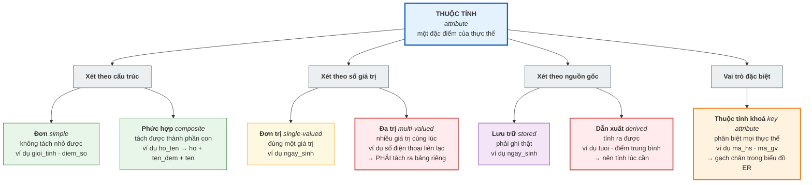
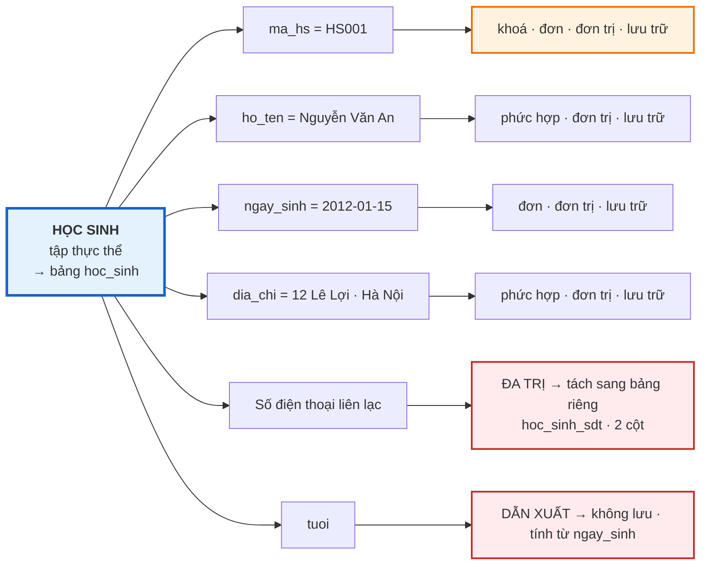

# Bài 7 — Thực thể và các loại thuộc tính

!!! abstract "🎯 Học xong bài này, bạn sẽ"
    - Phân biệt **thực thể** với **tập thực thể** — và biết cái nào mới thành bảng
    - Gọi đúng tên 3 cặp phân loại thuộc tính: đơn/phức hợp, đơn trị/đa trị, lưu trữ/dẫn xuất
    - Nhận ra **thuộc tính khoá** và hiểu vì sao "dữ liệu không trùng" chưa đủ để thành khoá
    - Biết cách xử lý đúng thuộc tính đa trị và thuộc tính dẫn xuất khi chuyển sang bảng
    - Đọc được cây phân loại thuộc tính và áp dụng lên bất kỳ tờ khai nào ngoài đời

## 🧠 Câu chuyện mở đầu

Đầu năm học, cô chủ nhiệm phát cho mỗi bạn một tờ **sơ yếu lý lịch học sinh**. Bạn cầm bút, và gần như ngay lập tức gặp rắc rối.

Ô đầu tiên: **Họ và tên**. Ô này in liền một dải. Nhưng phần mềm của trường lại đòi *"nhập Họ, Tên đệm, Tên vào ba ô riêng"*. Vậy "Họ và tên" là **một** thông tin hay **ba** thông tin?

Ô thứ hai: **Số điện thoại liên lạc**. Nhà bạn có số của mẹ, số của bố, và số bàn của bà nội. Tờ giấy chỉ chừa **một** dòng. Bạn ghi cả ba, ngăn bằng dấu phẩy, và thấy hơi sai sai.

Ô thứ ba: **Tuổi**. Bạn định điền 14, thì bạn ngồi cạnh nói: *"Ô Ngày sinh ở ngay trên rồi, ghi tuổi làm gì cho thừa. Sang năm lại phải sửa."*

Ba ô, ba rắc rối, và chúng khác hẳn nhau về bản chất:

- Ô 1: một thông tin **tách nhỏ ra được**.
- Ô 2: một thông tin có thể có **nhiều giá trị cùng lúc**.
- Ô 3: một thông tin **tính ra được từ thông tin khác**.

Người thiết kế database gặp đúng ba rắc rối này mỗi ngày. Và họ đã đặt tên cho từng loại. Ba cái tên đó là gì?

## 📖 Khái niệm & thuật ngữ

### Thực thể và tập thực thể

**Thực thể** (*entity*) là **một đối tượng cụ thể** trong thế giới thực mà ta muốn lưu dữ liệu về nó, và **phân biệt được** với các đối tượng khác.

Bạn An lớp 8A1 là một thực thể. Cô Lan dạy Toán là một thực thể. Cuốn *Dế Mèn phiêu lưu ký* mã `S001` là một thực thể. Cả lượt mượn sách hôm 03/09 cũng là một thực thể — thực thể không nhất thiết phải sờ được, miễn là phân biệt được.

**Tập thực thể** (*entity set*) là **tập hợp tất cả các thực thể cùng loại**, tức là cùng được mô tả bằng một bộ thuộc tính giống nhau.

| | Thực thể | Tập thực thể |
|---|---|---|
| Là gì | Một đối tượng cụ thể | Toàn bộ các đối tượng cùng loại |
| Ví dụ | Bạn An, mã `HS001` | HỌC SINH — cả 40 bạn |
| Khi lên database | Một **dòng** | Một **bảng** |
| Gọi tên | Danh từ số ít | Danh từ, viết in trong biểu đồ ER |

!!! tip "Nối lại với Bài 6"
    Cặp *thực thể / tập thực thể* chính là cặp *bộ / quan hệ* nhìn từ phía **thế giới thực** thay vì nhìn từ phía **cái bảng**.

    - Ngoài đời có bạn An → trong database có bộ `HS001`.
    - Ngoài đời có nhóm "học sinh" → trong database có quan hệ `hoc_sinh`.

    Mô hình ER mô tả thế giới thực **trước khi** nghĩ tới bảng. Đó là điểm mạnh của nó: bạn bàn thiết kế được với cô hiệu trưởng mà không cần cô biết SQL.

Trong lời nói hằng ngày, người ta hay nói tắt "thực thể HỌC SINH" khi thực ra đang nói tới *tập thực thể*. Khóa học này cũng nói tắt như vậy khi ngữ cảnh đã rõ.

### Thuộc tính — và ba cặp phân loại

**Thuộc tính** là một đặc điểm mô tả thực thể. Bạn đã gặp từ này ở [Bài 6](06-mo-hinh-quan-he.md) với nghĩa "một cột của bảng"; ở đây là cùng một khái niệm, nhìn từ phía thế giới thực.

Ba rắc rối trong câu chuyện đầu bài tương ứng đúng ba cặp phân loại sau.

#### Cặp 1 — Đơn ↔ Phức hợp

**Thuộc tính đơn** (*simple attribute*, còn gọi *atomic*) là thuộc tính **không tách nhỏ thêm được** mà vẫn giữ nghĩa. Ví dụ: `gioi_tinh`, `so_tiet_tuan`, `diem_so`.

**Thuộc tính phức hợp** (*composite attribute*) là thuộc tính **tách được thành nhiều thuộc tính con có ý nghĩa riêng**.

- `ho_ten` tách thành `ho` + `ten_dem` + `ten`.
- `dia_chi` tách thành `so_nha` + `duong` + `phuong` + `quan` + `thanh_pho`.

Tách hay không tách là **một quyết định thiết kế**, và câu trả lời phụ thuộc vào **câu hỏi mà hệ thống sẽ phải trả lời**:

| Nếu hệ thống cần... | Thì nên |
|---|---|
| In giấy khen với đầy đủ họ tên | Để `ho_ten` nguyên khối — đơn giản hơn |
| Sắp xếp danh sách theo **tên** kiểu Việt Nam | Tách ra, vì `ORDER BY ho_ten` cho ra thứ tự theo họ |
| Thống kê học sinh theo **quận** | Tách `dia_chi` — nếu không thì phải cắt chuỗi |

Database mẫu `truong_hoc` cố ý **không tách** `ho_ten` và `dia_chi`, vì khóa học này không có bài nào cần thống kê theo quận. Đó là lựa chọn có chủ đích, không phải sơ suất.

#### Cặp 2 — Đơn trị ↔ Đa trị

**Thuộc tính đơn trị** (*single-valued attribute*): với mỗi thực thể, thuộc tính chỉ có **đúng một** giá trị. `ngay_sinh` là đơn trị — không ai có hai ngày sinh.

**Thuộc tính đa trị** (*multi-valued attribute*): một thực thể có thể có **nhiều giá trị cùng lúc**. Ô "Số điện thoại" trong câu chuyện là ví dụ kinh điển. Một học sinh cũng có thể có nhiều địa chỉ email, nhiều năng khiếu, nhiều giải thưởng.

!!! danger "Thuộc tính đa trị KHÔNG được nhét chung một ô"
    Ghi `0912345001, 0912345002` vào một ô là vi phạm **tính nguyên tử** đã học ở [Bài 6](06-mo-hinh-quan-he.md).

    Mô hình quan hệ chỉ có **một** cách xử lý đúng: **tách ra bảng riêng**, mỗi giá trị một dòng.

    Ví dụ: thuộc tính đa trị `so_dien_thoai` của HỌC SINH phải thành một bảng riêng `hoc_sinh_sdt(ma_hs, so_dien_thoai)` — đúng **hai** cột, mỗi số một dòng. Bài 14 sẽ biến quy tắc này thành **Bước 6** của thuật toán chuyển ER sang bảng.

!!! danger "Bảng `phu_huynh` KHÔNG phải kết quả của quy tắc này"
    Rất dễ nhìn `phu_huynh` rồi nghĩ *"à, đây chính là thuộc tính đa trị số điện thoại đã được tách ra"*. **Không phải**, và nhầm chỗ này sẽ làm bạn trả lời sai ở Bài 9 lẫn Bài 14.

    Nếu chỉ là tách thuộc tính đa trị, bảng sinh ra sẽ đúng hai cột `(ma_hs, so_dien_thoai)`. Nhưng `phu_huynh` còn có `ho_ten` và `quan_he` — tức bản thân người liên lạc là một **đối tượng có đặc điểm riêng**, chứ không phải một dãy số trơ.

    | | Thuộc tính đa trị | Thực thể |
    |---|---|---|
    | Thứ lặp lại là | một **giá trị** trơ | một **đối tượng** có đặc điểm riêng |
    | Ví dụ | `so_dien_thoai`, `the_loai` của sách | người phụ huynh |
    | Chuyển sang bảng thành | bảng 2 cột `(khoá chủ, giá trị)` | bảng đầy đủ, có thuộc tính riêng |
    | Bước trong thuật toán Bài 14 | Bước 6 | Bước 1 hoặc Bước 2 |

    [Bài 9](09-participation-va-thuc-the-yeu.md) sẽ gọi đúng tên `phu_huynh`: **thực thể yếu**. Phép thử nhanh để khỏi nhầm: *"thứ lặp lại này có cần mô tả gì thêm ngoài chính nó không?"* — cần thì đó là thực thể, không cần thì đó là thuộc tính đa trị.

#### Cặp 3 — Lưu trữ ↔ Dẫn xuất

**Thuộc tính lưu trữ** (*stored attribute*) là thuộc tính phải ghi thật vào database, vì không có cách nào tính ra nó. `ngay_sinh` là lưu trữ.

**Thuộc tính dẫn xuất** (*derived attribute*) là thuộc tính **tính ra được từ thuộc tính khác** hoặc từ dữ liệu bảng khác. `tuoi` là dẫn xuất — nó bằng hôm nay trừ đi `ngay_sinh`.

Bạn ngồi cạnh trong câu chuyện đã nói đúng. Lưu `tuoi` gây ra hai vấn đề:

1. **Nó hỏng theo thời gian.** Hôm nay ghi 14, sang sinh nhật là sai, mà không có ai nhắc bạn đi sửa.
2. **Nó tạo ra hai nguồn chân lý.** Nếu `ngay_sinh` là 2012 mà `tuoi` là 20, tin cái nào?

Quy tắc: **thuộc tính dẫn xuất thì tính lúc cần, đừng lưu**. Cấp 2 sẽ dùng đúng nguyên tắc này làm một trụ cột của chuẩn hoá; Cấp 4 sẽ nói về ngoại lệ — khi nào chấp nhận lưu sẵn để chạy nhanh hơn.

Vài thuộc tính dẫn xuất khác trong `truong_hoc`: *điểm trung bình học kỳ* của một học sinh (tính từ bảng `diem`), *số học sinh của lớp* (đếm trong bảng `hoc_sinh`), *sách đã quá hạn hay chưa* (so `ngay_tra_du_kien` với hôm nay).

### Thuộc tính khoá

**Thuộc tính khoá** (*key attribute*) là thuộc tính — hoặc nhóm thuộc tính — mà **giá trị của nó phân biệt được mọi thực thể trong tập thực thể**.

`ma_hs` là thuộc tính khoá của HỌC SINH: không bao giờ có hai bạn cùng mã. `ma_gv` là thuộc tính khoá của GIÁO VIÊN.

!!! warning "Dữ liệu hiện tại không trùng ≠ là khoá"
    Trong 40 học sinh mẫu, không có hai bạn nào trùng `ho_ten`. Vậy `ho_ten` có phải thuộc tính khoá không?

    **Không.** Khoá là một **lời hứa về mọi thể hiện tương lai**, không phải nhận xét về thể hiện hiện tại. Ngày mai trường tuyển thêm một bạn cũng tên Nguyễn Văn An — và không có luật nào cấm điều đó. Còn hai học sinh trùng `ma_hs` thì hệ quản trị sẽ **từ chối** ngay lập tức.

    Đây là ranh giới lược đồ / thể hiện của Bài 6, áp dụng vào chuyện khoá.

Trong biểu đồ ER, thuộc tính khoá được **gạch chân**. Bài 10 sẽ vẽ nó. Còn **bảy loại khoá** khác nhau — siêu khoá, khoá dự tuyển, khoá chính, khoá thay thế, khoá phức hợp, khoá nhân tạo, khoá ngoại — là chủ đề riêng của **Bài 12**.

### Thuộc tính có thể rỗng

Khi một thuộc tính **không áp dụng** cho một số thực thể, hoặc **chưa biết** tại thời điểm nhập, giá trị của nó là `NULL`.

Trong `truong_hoc`: `sach.tac_gia` cho phép `NULL` (có sách không rõ tác giả), `diem_danh.ly_do` cho phép `NULL` (có mặt thì không cần lý do). Ngược lại `hoc_sinh.ngay_sinh` là `NOT NULL` — trường không nhận hồ sơ thiếu ngày sinh.

### Bảng thuật ngữ

| Tiếng Việt | English | Nghĩa dễ hiểu |
|---|---|---|
| Thực thể | *entity* | Một đối tượng cụ thể, phân biệt được với đối tượng khác |
| Tập thực thể | *entity set* | Tập hợp mọi thực thể cùng loại — sẽ thành một bảng |
| Thuộc tính đơn | *simple attribute* | Không tách nhỏ thêm được |
| Thuộc tính phức hợp | *composite attribute* | Tách được thành nhiều thuộc tính con có nghĩa |
| Thuộc tính đơn trị | *single-valued attribute* | Mỗi thực thể chỉ có đúng một giá trị |
| Thuộc tính đa trị | *multi-valued attribute* | Một thực thể có thể có nhiều giá trị cùng lúc |
| Thuộc tính lưu trữ | *stored attribute* | Phải ghi thật vào database |
| Thuộc tính dẫn xuất | *derived attribute* | Tính ra được từ thuộc tính khác — không nên lưu |
| Thuộc tính khoá | *key attribute* | Giá trị phân biệt được mọi thực thể trong tập |

## 🖼️ Sơ đồ

Cây phân loại thuộc tính — ba nhánh tương ứng ba rắc rối trong câu chuyện đầu bài:



Và đây là tờ sơ yếu lý lịch của bạn An, gắn nhãn phân loại lên từng ô:



## 💻 Thực hành

### Thuộc tính phức hợp — tách `ho_ten` lúc cần

`ho_ten` được lưu nguyên khối, nhưng vẫn tách ra được lúc truy vấn:

```sql
SELECT ho_ten,
       split_part(ho_ten, ' ',  1) AS ho,
       split_part(ho_ten, ' ', -1) AS ten
FROM hoc_sinh
ORDER BY ma_hs
LIMIT 5;
```

`split_part(chuoi, ' ', 1)` lấy mảnh thứ nhất khi cắt theo dấu cách; số `-1` nghĩa là mảnh **cuối cùng**. Kết quả 5 dòng đầu:

| ho_ten | ho | ten |
|---|---|---|
| Nguyễn Văn An | Nguyễn | An |
| Trần Thị Bình | Trần | Bình |
| Lê Hoàng Cường | Lê | Cường |
| Phạm Thị Dung | Phạm | Dung |
| Hoàng Minh Đức | Hoàng | Đức |

!!! warning "Vì sao cách này không thay thế được việc tách cột thật"
    Nó chỉ chạy được vì dữ liệu mẫu bạn nào cũng đúng ba tiếng. Gặp *Nguyễn Thị Thu Hà* thì `ten` ra `Hà` — may mà đúng; nhưng gặp một tên nước ngoài hay một tên chỉ có hai tiếng thì sai ngay.

    Bài học: nếu hệ thống **thường xuyên** cần phần `ten` riêng, hãy tách thành cột thật ngay từ lúc thiết kế. Cắt chuỗi lúc chạy chỉ là giải pháp chữa cháy.

### Thuộc tính dẫn xuất — tính `tuoi` chứ không lưu

```sql
SELECT ho_ten,
       ngay_sinh,
       EXTRACT(YEAR FROM age(ngay_sinh)) AS tuoi
FROM hoc_sinh
ORDER BY ma_hs
LIMIT 5;
```

`age(ngay_sinh)` cho khoảng thời gian từ ngày sinh tới hôm nay; `EXTRACT(YEAR FROM ...)` lấy phần năm. Cột `tuoi` **không tồn tại** trong bảng — nó được tính ngay lúc bạn hỏi, nên không bao giờ lỗi thời.

Bảng `hoc_sinh` xác nhận điều đó:

```sql
SELECT count(*) AS co_cot_tuoi_khong
FROM information_schema.columns
WHERE table_schema = 'public' AND table_name = 'hoc_sinh' AND column_name = 'tuoi';
```

Kết quả: `0`. Không có cột `tuoi` nào cả — đúng như thiết kế.

### Nhiều giá trị thì nhiều dòng — không bao giờ nhét chung một ô

`truong_hoc` không có bảng `hoc_sinh_sdt`: nó mô hình hoá người liên lạc thành một **thực thể riêng** (`phu_huynh`) chứ không phải một thuộc tính đa trị — đúng như hộp cảnh báo ở trên. Nhưng nguyên tắc *mỗi giá trị một dòng* thì giống hệt nhau, và bảng `phu_huynh` minh hoạ được nguyên tắc đó:

```sql
SELECT ma_ph, ho_ten, quan_he, so_dien_thoai
FROM phu_huynh
WHERE ma_hs = 'HS001'
ORDER BY ma_ph;
```

Kết quả 2 dòng: `PH001` Nguyễn Văn Thành (Bố) và `PH002` Lê Thị Hạnh (Mẹ) — hai số điện thoại của cùng một học sinh, nằm ở **hai bộ riêng biệt** chứ không nhét chung một ô.

Xem những học sinh có nhiều hơn một người liên lạc:

```sql
SELECT ma_hs, count(*) AS so_nguoi_lien_lac
FROM phu_huynh
GROUP BY ma_hs
HAVING count(*) > 1
ORDER BY ma_hs;
```

Kết quả đúng 6 dòng — `HS001`, `HS003`, `HS007`, `HS013`, `HS021`, `HS029` — mỗi bạn có 2 người liên lạc.

!!! note "Chưa hiểu `GROUP BY` / `HAVING` cũng không sao"
    Đọc tạm là *"gom các dòng theo `ma_hs`, rồi chỉ giữ những nhóm có nhiều hơn 1 dòng"*. **Bài 28** sẽ dạy kỹ nhóm lệnh này.

### Thuộc tính khoá — khoá là lời hứa, không phải may mắn

```sql
SELECT count(*)                  AS tong_so_hoc_sinh,
       count(DISTINCT ma_hs)     AS so_ma_hs_khac_nhau,
       count(DISTINCT ho_ten)    AS so_ho_ten_khac_nhau
FROM hoc_sinh;
```

Cả ba cột đều ra `40`. Nhìn thoáng thì `ho_ten` cũng "không trùng" y như `ma_hs`. Nhưng hai cái đó khác nhau về bản chất:

| | `ma_hs` | `ho_ten` |
|---|---|---|
| Hiện tại có trùng không | Không | Không |
| Có ràng buộc cấm trùng không | **Có** — `PRIMARY KEY` | **Không** |
| Ngày mai thêm một bạn trùng | Bị **từ chối** | Được ghi bình thường |
| Là thuộc tính khoá? | **Đúng** | **Sai** |

Sự khác biệt nằm ở **lược đồ**, chứ không nằm ở **thể hiện**:

```sql
SELECT conname, contype
FROM pg_constraint
WHERE conrelid = 'hoc_sinh'::regclass
ORDER BY conname;
```

Trong kết quả có `hoc_sinh_pkey` với `contype = 'p'` — đó là ràng buộc khoá chính trên `ma_hs`. Không có ràng buộc nào đặt trên `ho_ten`.

## ⚠️ Lỗi thường gặp

!!! warning "Lỗi 1: Nhét thuộc tính đa trị vào một ô"
    Thêm cột `sdt_phu_huynh` vào `hoc_sinh` rồi ghi `0912345001, 0912345002`.

    Ba hậu quả cụ thể: không tìm được ai theo số điện thoại bằng phép so sánh thường; không ràng buộc nổi "mỗi số phải đủ 10 chữ số"; và bạn thứ ba trong nhà thì hết chỗ ghi.

    Cách sửa duy nhất đúng: **một bảng riêng, mỗi giá trị một dòng** — ở đây là `hoc_sinh_sdt(ma_hs, so_dien_thoai)`. Nếu người liên lạc còn cần lưu cả tên và quan hệ thì đó không còn là thuộc tính đa trị nữa, mà là một thực thể — và bảng đúng chính là `phu_huynh`.

!!! warning "Lỗi 2: Thêm cột `so_hoc_sinh` vào bảng `lop`"
    Nghe rất hợp lý và rất tiện. Nhưng `so_hoc_sinh` là **thuộc tính dẫn xuất** — đếm trong bảng `hoc_sinh` là ra.

    Vấn đề: mỗi lần một bạn chuyển lớp, bạn phải nhớ sửa **hai** chỗ. Quên một lần là database mâu thuẫn vĩnh viễn, và không có cách nào biết con số nào mới đúng.

!!! warning "Lỗi 3: Nghĩ rằng cột nào hiện không trùng thì là khoá"
    Đã phân tích kỹ ở phần thực hành. Thêm một ví dụ nữa để thấy rõ: trong `giao_vien`, cột `mon_chuyen_mon` hiện cũng không trùng — 8 giáo viên, 8 môn khác nhau. Nhưng trường chỉ cần tuyển thêm một cô dạy Toán nữa là hỏng ngay.

    Câu hỏi đúng phải là: *"Có luật nào cấm nó trùng không?"* chứ không phải *"Nó đã trùng chưa?"*

!!! warning "Lỗi 4: Tách phức hợp quá đà"
    Ngược lại với lỗi 1. Có người tách `ngay_sinh` thành ba cột `ngay`, `thang`, `nam`.

    Hậu quả: mọi phép so sánh ngày tháng trở thành ba phép so sánh lồng nhau, hàm `age()` không dùng được, và không gì ngăn ai đó nhập ngày 31 tháng 2.

    Nguyên tắc: chỉ tách khi **phần con có ý nghĩa riêng và sẽ được dùng riêng**. `DATE` vốn đã là một kiểu dữ liệu nguyên tử hoàn chỉnh — đừng đụng vào.

## ✍️ Bài tập

1. Phân biệt **thực thể** và **tập thực thể** bằng ví dụ về sách trong thư viện trường.

2. Xếp mỗi thuộc tính sau của một cuốn **SÁCH** vào ba cặp phân loại (đơn/phức hợp, đơn trị/đa trị, lưu trữ/dẫn xuất), và chỉ ra đâu là thuộc tính khoá:

    `ma_sach`, `ten_sach`, `tac_gia`, `nam_xuat_ban`, `so_luong`, `so_cuon_dang_duoc_muon`, `the_loai` (một cuốn có thể thuộc nhiều thể loại).

3. Trường muốn thống kê *"bao nhiêu học sinh sống ở quận Hoàn Kiếm"*. Với thiết kế hiện tại (`dia_chi` là một cột `VARCHAR(120)` nguyên khối), việc này khó ở chỗ nào? Bạn đề xuất sửa lược đồ thế nào?

4. Viết câu SQL liệt kê mã học sinh và số lượt mượn sách của những bạn đã mượn **từ 3 cuốn trở lên**. Vì sao *số lượt mượn* là thuộc tính dẫn xuất chứ không phải thuộc tính lưu trữ của HỌC SINH?

5. Một bạn đề xuất: *"Thêm cột `diem_trung_binh` vào bảng `hoc_sinh` cho nhanh, khỏi phải tính lại mỗi lần."* Hãy nêu hai rủi ro cụ thể, và một tình huống hiếm hoi mà đề xuất này lại hợp lý.

??? success "Đáp án"
    **Câu 1.**
    - **Thực thể**: cuốn *Dế Mèn phiêu lưu ký* mang mã `S001` — một đối tượng cụ thể, phân biệt được với mọi cuốn khác trong thư viện.
    - **Tập thực thể**: SÁCH — toàn bộ 20 đầu sách của thư viện, tất cả đều được mô tả bằng cùng bộ thuộc tính `ma_sach`, `ten_sach`, `tac_gia`, `nam_xuat_ban`, `so_luong`.

    Khi lên database: tập thực thể thành **bảng** `sach`, mỗi thực thể thành một **dòng**.

    **Câu 2.**

    | Thuộc tính | Cấu trúc | Số giá trị | Nguồn gốc | Ghi chú |
    |---|---|---|---|---|
    | `ma_sach` | đơn | đơn trị | lưu trữ | **Thuộc tính khoá** |
    | `ten_sach` | đơn | đơn trị | lưu trữ | |
    | `tac_gia` | phức hợp nếu muốn tách họ/tên | đơn trị trong thiết kế hiện tại | lưu trữ | Thực tế sách nhiều tác giả thì nó **đa trị** |
    | `nam_xuat_ban` | đơn | đơn trị | lưu trữ | |
    | `so_luong` | đơn | đơn trị | lưu trữ | Tổng số bản trong kho |
    | `so_cuon_dang_duoc_muon` | đơn | đơn trị | **dẫn xuất** | Đếm trong `muon_sach` với `ngay_tra_thuc_te IS NULL` |
    | `the_loai` | đơn | **đa trị** | lưu trữ | Phải tách ra bảng riêng, ví dụ `sach_the_loai` |

    Chỉ `ma_sach` là thuộc tính khoá. `ten_sach` thì không: thư viện hoàn toàn có thể có hai đầu sách trùng tên của hai tác giả khác nhau.

    **Câu 3.**
    Khó vì `dia_chi` là **thuộc tính phức hợp bị để nguyên khối**. Muốn lọc theo quận, ta buộc phải dò chuỗi kiểu `WHERE dia_chi LIKE '%Hoàn Kiếm%'`, và cách đó có ba điểm yếu:

    - Sai nếu người nhập viết `Hoan Kiem` không dấu, hay viết tắt `Q. Hoàn Kiếm`.
    - Không có gì bảo đảm tên quận được viết thống nhất giữa 40 dòng.
    - Chậm, vì không tận dụng được index thông thường — Cấp 4 sẽ giải thích vì sao.

    Đề xuất sửa: tách thành các cột riêng, ví dụ

    ```
    hoc_sinh(ma_hs, ho_ten, ngay_sinh, gioi_tinh, so_nha, duong, phuong, quan, thanh_pho, ma_lop)
    ```

    Chặt chẽ hơn nữa là tạo bảng `quan(ma_quan, ten_quan)` rồi cho `hoc_sinh.ma_quan` trỏ sang — khi đó tên quận chỉ tồn tại ở **một** chỗ duy nhất, không thể viết lệch nhau được. Cấp 2 sẽ gọi đây là chuẩn hoá.

    **Câu 4.**

    ```sql
    SELECT ma_hs, count(*) AS so_luot_muon
    FROM muon_sach
    GROUP BY ma_hs
    HAVING count(*) >= 3
    ORDER BY so_luot_muon DESC, ma_hs;
    ```

    *Số lượt mượn* là **dẫn xuất** vì nó hoàn toàn suy ra được bằng cách đếm các dòng trong `muon_sach`. Nếu lưu nó thành một cột của `hoc_sinh`, thì mỗi lần thêm hay xoá một lượt mượn đều phải nhớ cập nhật cột đó — và chỉ cần quên một lần là con số sai vĩnh viễn, trong khi dữ liệu để tính lại vẫn nằm sẵn đó.

    **Câu 5.**
    Hai rủi ro:

    1. **Mâu thuẫn dữ liệu.** Nhập thêm một con điểm vào bảng `diem` mà quên cập nhật `diem_trung_binh` là hai chỗ nói hai điều khác nhau, và không ai biết chỗ nào đúng.
    2. **Không rõ nghĩa.** Trung bình của học kỳ nào, loại điểm nào, có nhân hệ số không? Một con số duy nhất không trả lời nổi, trong khi tính từ bảng `diem` thì muốn cắt theo tiêu chí nào cũng được.

    Tình huống hợp lý: khi bảng `diem` đã cực lớn (hàng trăm triệu dòng) và màn hình chính của phần mềm phải hiện điểm trung bình cho hàng nghìn học sinh cùng lúc. Lúc đó người ta chấp nhận lưu sẵn để đổi lấy tốc độ — kỹ thuật này gọi là **phi chuẩn hoá** (*denormalization*), và bắt buộc phải kèm cơ chế tự cập nhật lại. [Bài 20](../cap-2-chuan-hoa/20-denormalization.md) sẽ bàn kỹ.

## 🔑 Tóm tắt

1. **Thực thể** là một đối tượng cụ thể; **tập thực thể** là nhóm các đối tượng cùng loại — tập thực thể mới là thứ trở thành một bảng.
2. Thuộc tính **đơn** không tách nhỏ được; thuộc tính **phức hợp** tách được — tách hay không là quyết định thiết kế, tuỳ vào câu hỏi hệ thống phải trả lời.
3. Thuộc tính **đa trị** không bao giờ được nhét chung một ô; cách xử lý đúng duy nhất là tách ra một bảng riêng.
4. Thuộc tính **dẫn xuất** thì tính lúc cần, đừng lưu — lưu sẵn là tự tạo ra hai nguồn chân lý có thể mâu thuẫn.
5. **Thuộc tính khoá** là lời hứa của lược đồ về mọi thể hiện tương lai, không phải nhận xét về dữ liệu hiện có.

---

⬅️ [Bài 6 — Mô hình quan hệ](06-mo-hinh-quan-he.md) · ➡️ [Bài 8 — Mối quan hệ, bậc và bản số](08-moi-quan-he-va-cardinality.md)
