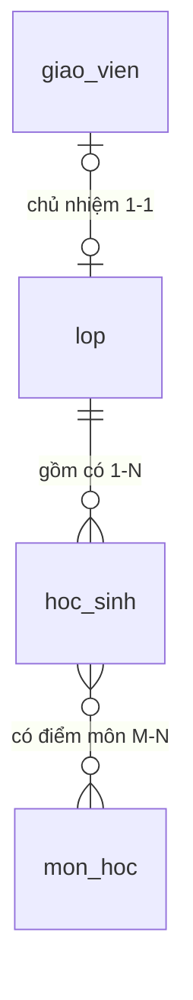
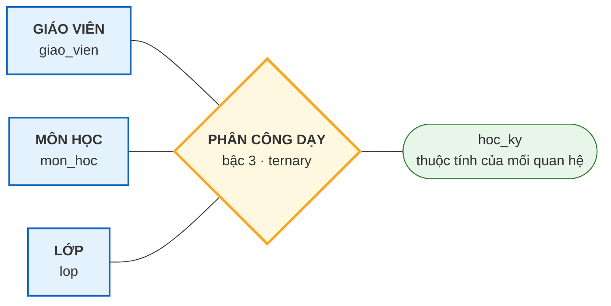
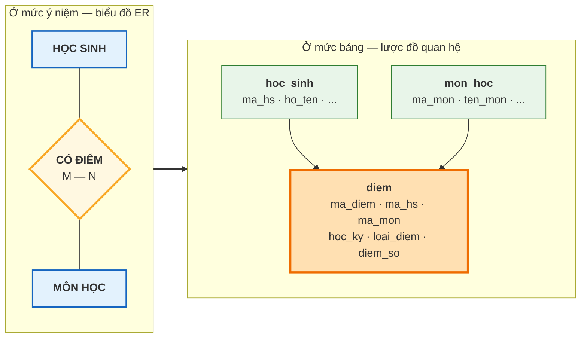

# Bài 8 — Mối quan hệ, bậc và bản số (Cardinality)

!!! abstract "🎯 Học xong bài này, bạn sẽ"
    - Phân biệt **mối quan hệ** với **tập mối quan hệ**, và với **quan hệ** của Bài 6
    - Đếm được **bậc của mối quan hệ**: một ngôi, hai ngôi, ba ngôi
    - Đọc và viết được ba **tỉ lệ bản số**: 1:1, 1:N, M:N
    - Chỉ ra từng loại bản số bằng dữ liệu thật trong `truong_hoc`
    - Biết trước rằng M:N luôn phải sinh ra một bảng thứ ba khi lên database

## 🧠 Câu chuyện mở đầu

Bảng tin phòng giáo vụ dán ba tờ thông báo.

**Tờ thứ nhất — Danh sách chủ nhiệm.** Lớp 8A1: cô Lan. Lớp 8A2: thầy Hùng. Lớp 8A3: cô Mai. Mỗi lớp **một** chủ nhiệm, và mỗi thầy cô chỉ chủ nhiệm **một** lớp. Danh sách này ghép đôi một-một, gọn gàng.

**Tờ thứ hai — Danh sách lớp.** Lớp 8A1 có 6 bạn, lớp 8A3 có 8 bạn. Một lớp **nhiều** học sinh, nhưng mỗi học sinh chỉ thuộc **một** lớp. Không ai vừa học 8A1 vừa học 8A3.

**Tờ thứ ba — Lịch kiểm tra.** Bạn An kiểm tra cả 9 môn. Môn Toán thì cả 40 bạn đều kiểm tra. Ở đây cả hai phía đều "nhiều": một học sinh nhiều môn, một môn nhiều học sinh.

Ba tờ giấy, ba kiểu ghép đôi khác hẳn nhau. Và có một tờ thứ tư rắc rối hơn nữa, dán riêng một góc — **Bảng phân công giảng dạy**:

> *Cô Lan dạy môn Toán cho lớp 8A1, học kỳ 1.*

Câu này ghép **ba** thứ cùng lúc: giáo viên, môn, lớp. Bỏ bất kỳ thứ nào cũng mất nghĩa.

Vậy làm sao mô tả chính xác từng kiểu ghép đôi này, bằng ngôn ngữ mà người thiết kế database nào cũng hiểu như nhau?

## 📖 Khái niệm & thuật ngữ

### Mối quan hệ và tập mối quan hệ

**Mối quan hệ** (*relationship*) là một **sự liên kết cụ thể** giữa các thực thể.

> *Bạn An (HS001) học ở lớp 8A1 (L01)* — đó là **một** mối quan hệ.

**Tập mối quan hệ** (*relationship set*) là **tập hợp mọi mối quan hệ cùng loại** giữa cùng các tập thực thể.

> *HỌC SINH — học tại — LỚP* — đó là **tập** mối quan hệ, gồm cả 40 liên kết.

Đây đúng là cặp khái niệm quen thuộc: *cái cụ thể* và *tập hợp các cái cụ thể cùng loại*, giống hệt cặp thực thể / tập thực thể ở [Bài 7](07-thuc-the-va-thuoc-tinh.md). Trong biểu đồ ER, tập mối quan hệ được vẽ bằng một **hình thoi** và đặt tên bằng một **động từ** — Bài 10 sẽ vẽ.

!!! danger "Nhắc lại cảnh báo của Bài 6 — ba chữ dễ lẫn"
    | Thuật ngữ | Là gì | Bài nào |
    |---|---|---|
    | **quan hệ** (*relation*) | một cái **bảng** | Bài 6 |
    | **mối quan hệ** (*relationship*) | sự **liên kết** giữa các thực thể | bài này |
    | **cơ sở dữ liệu quan hệ** (*relational database*) | database xây trên mô hình quan hệ | Bài 4 |

    Hễ thấy chữ **mối** thì đó là *relationship*.

### Bậc của mối quan hệ

**Bậc của mối quan hệ** (*degree of a relationship*) là **số tập thực thể tham gia** vào mối quan hệ đó.

| Bậc | English | Nghĩa | Ví dụ |
|---|---|---|---|
| 1 | **unary** / *recursive* | Một tập thực thể tự liên kết với chính nó | HỌC SINH — *làm lớp phó của* — HỌC SINH |
| 2 | **binary** | Hai tập thực thể | HỌC SINH — *học tại* — LỚP |
| 3 | **ternary** | Ba tập thực thể | GIÁO VIÊN — *dạy* — MÔN HỌC — *cho* — LỚP |

!!! warning "Lại là chữ 'bậc' — nhưng đếm thứ khác"
    Bài 6 nói **bậc của quan hệ** = số **cột** của bảng. Bài này nói **bậc của mối quan hệ** = số **tập thực thể** tham gia.

    Cùng một từ *degree*, hai nghĩa. Muốn khỏi nhầm thì luôn nói đủ: *"bậc của quan hệ `hoc_sinh` là 6"* và *"bậc của mối quan hệ PHÂN CÔNG DẠY là 3"*.

Trong thực tế, **mối quan hệ bậc hai chiếm khoảng 95%** số trường hợp. Bậc ba có thật nhưng hiếm, và bậc từ 4 trở lên gần như luôn là dấu hiệu bạn nên tách nhỏ thiết kế.

Mối quan hệ bậc một nghe lạ nhưng rất hay gặp ngoài đời: nhân viên *quản lý* nhân viên, bài viết *trả lời* bài viết, danh mục *nằm trong* danh mục. Database mẫu `truong_hoc` không có mối quan hệ bậc một nào — nếu trường muốn lưu "bạn nào làm lớp trưởng của lớp nào", ta sẽ thêm một cột `ma_hs_lop_truong` trong bảng `lop`, chứ đó vẫn là mối quan hệ hai ngôi giữa LỚP và HỌC SINH.

### Bản số — trái tim của bài này

**Bản số** (*cardinality*), nói đầy đủ là **tỉ lệ bản số** (*cardinality ratio*), trả lời câu hỏi:

> *Một thực thể ở phía này liên kết được với **tối đa bao nhiêu** thực thể ở phía kia?*

Với mối quan hệ bậc hai, chỉ có ba câu trả lời:

| Ký hiệu | Đọc là | Nghĩa | Ví dụ trong `truong_hoc` |
|---|---|---|---|
| **1:1** | một–một | Mỗi bên tối đa một | LỚP — *có chủ nhiệm là* — GIÁO VIÊN |
| **1:N** | một–nhiều | Một bên nhiều, bên kia một | LỚP — *gồm có* — HỌC SINH |
| **M:N** | nhiều–nhiều | Cả hai bên đều nhiều | HỌC SINH — *có điểm môn* — MÔN HỌC |

Ba tờ thông báo trên bảng tin chính là ba trường hợp này.

!!! danger "Lại một chữ 'bản số' nữa — đừng lẫn với Bài 6"
    Bài 6 có **lực lượng** (*cardinality of a relation*) = số **dòng** của bảng.

    Bài này có **bản số** (*cardinality ratio*) = tỉ lệ ghép đôi giữa hai tập thực thể.

    Tiếng Anh dùng chung chữ *cardinality*, nên khóa học này cố ý dịch thành **hai từ tiếng Việt khác nhau**: *lực lượng* cho số dòng, *bản số* cho tỉ lệ ghép đôi.

#### 1:1 — một–một

Mỗi lớp có tối đa một giáo viên chủ nhiệm, và mỗi giáo viên chủ nhiệm tối đa một lớp.

Chữ **tối đa** rất quan trọng: lớp 9A3 hiện **chưa có** chủ nhiệm, và ba thầy cô hiện **chưa** chủ nhiệm lớp nào. Bản số chỉ nói về **giới hạn trên**. Còn chuyện "có bắt buộc phải có ít nhất một hay không" là một ràng buộc **khác hẳn**, tên là **ràng buộc tham gia** — toàn bộ [Bài 9](09-participation-va-thuc-the-yeu.md) dành cho nó.

Khi lên database, 1:1 được hiện thực bằng **khoá ngoại cộng với ràng buộc `UNIQUE`** đặt lên chính cột khoá ngoại đó. Trong `truong_hoc` là cột `lop.ma_gvcn` (`dataset/02-chuan-hoa.sql`, dòng 48):

```
ma_gvcn   CHAR(4)     UNIQUE REFERENCES giao_vien(ma_gv) ON DELETE SET NULL
```

Hai nửa của dòng này làm hai việc khác nhau, và **thiếu nửa nào cũng hỏng**:

| Phần | Ép được điều gì |
|---|---|
| `REFERENCES giao_vien(ma_gv)` | Mỗi lớp trỏ tới **tối đa một** giáo viên — vì một ô chỉ chứa một giá trị |
| `UNIQUE` | Mỗi giáo viên xuất hiện ở **tối đa một** lớp — không ai ôm hai lớp |

Bỏ chữ `UNIQUE` đi thì cột này trở thành hiện thực của **1:N**, chứ không còn là 1:1. Đây chính là điểm khác nhau duy nhất giữa hai cách hiện thực ở mức bảng, nên đừng bỏ sót. Bài 14 sẽ đưa nó vào **Bước 3** của thuật toán chuyển ER sang bảng.

#### 1:N — một–nhiều

Một lớp có nhiều học sinh; một học sinh chỉ thuộc một lớp. Đây là loại phổ biến nhất trong mọi database.

Quy tắc hiện thực rất dễ nhớ: **khoá ngoại luôn đặt ở phía "nhiều"**. Cột `hoc_sinh.ma_lop` nằm trong bảng `hoc_sinh`, chứ không có cột `danh_sach_hoc_sinh` nào trong bảng `lop` cả — vì một ô không chứa nổi danh sách, đúng như tính nguyên tử của Bài 6.

#### M:N — nhiều–nhiều

Một học sinh có điểm ở nhiều môn; một môn có điểm của nhiều học sinh.

Đây là loại **không thể** hiện thực bằng một khoá ngoại. Thử xem: đặt `ma_mon` vào bảng `hoc_sinh` thì mỗi bạn chỉ có một môn — sai. Đặt `ma_hs` vào `mon_hoc` thì mỗi môn chỉ có một học sinh — cũng sai.

Cách duy nhất đúng: **sinh ra một bảng thứ ba**, gọi là **bảng trung gian** (*junction table* / *associative table*), mỗi dòng là một cặp ghép. Trong `truong_hoc`, bảng đó là `diem`.

!!! tip "Bảng trung gian thường có thêm thuộc tính riêng"
    Bảng `diem` không chỉ chứa cặp `(ma_hs, ma_mon)`. Nó còn có `hoc_ky`, `loai_diem`, `diem_so`, `ngay_nhap`.

    Những cột này là **thuộc tính của chính mối quan hệ**, không thuộc về HỌC SINH cũng không thuộc về MÔN HỌC. Con điểm 8.5 chỉ có nghĩa khi nói *"của bạn An, môn Toán"* — tách ra khỏi cặp đó là vô nghĩa.

    Mối quan hệ có thuộc tính riêng là chuyện hoàn toàn bình thường, và Bài 10 sẽ vẽ nó bằng elip gắn vào hình thoi.

### Mối quan hệ bậc ba — tờ giấy rắc rối

> *Cô Lan dạy môn Toán cho lớp 8A1, học kỳ 1.*

Ba tập thực thể tham gia cùng lúc: GIÁO VIÊN, MÔN HỌC, LỚP. Đây là **mối quan hệ bậc ba** (*ternary relationship*), và trong `truong_hoc` nó chính là bảng `phan_cong_day`.

Vì sao không tách thành ba mối quan hệ bậc hai? Thử tách xem:

- *Cô Lan dạy môn Toán* ✓
- *Cô Lan dạy lớp 8A1* ✓
- *Môn Toán được dạy ở lớp 8A1* ✓

Ba câu trên đều đúng, nhưng ghép lại **không khôi phục được sự thật ban đầu**. Nếu cô Lan dạy Toán và Tin, và dạy cả 8A1 lẫn 8A2, thì từ ba câu rời rạc ta không thể biết cô dạy **Toán cho 8A1** hay **Tin cho 8A1**. Thông tin đã mất.

Đó là dấu hiệu nhận biết mối quan hệ bậc ba thật sự: **tách ra là mất thông tin**.

Khi lên database, mối quan hệ bậc ba luôn thành **một bảng riêng**, khoá chính là tổ hợp khoá của cả ba phía (cộng thêm thuộc tính phân biệt nếu cần). Bảng `phan_cong_day` có khoá chính gồm **4 cột**: `(ma_gv, ma_mon, ma_lop, hoc_ky)`. Bài 12 sẽ gọi đó là **khoá phức hợp**, Bài 14 sẽ dạy thuật toán chuyển đổi.

### Bảng thuật ngữ

| Tiếng Việt | English | Nghĩa dễ hiểu |
|---|---|---|
| Mối quan hệ | *relationship* | Một liên kết cụ thể giữa các thực thể |
| Tập mối quan hệ | *relationship set* | Tập hợp mọi liên kết cùng loại — vẽ bằng hình thoi |
| Bậc của mối quan hệ | *degree of a relationship* | Số tập thực thể tham gia |
| Một ngôi | *unary / recursive* | Một tập thực thể tự liên kết với chính nó |
| Hai ngôi | *binary* | Hai tập thực thể — loại phổ biến nhất |
| Ba ngôi | *ternary* | Ba tập thực thể, tách ra là mất thông tin |
| Bản số | *cardinality* | Một thực thể ghép được tối đa bao nhiêu thực thể phía kia |
| Tỉ lệ bản số | *cardinality ratio* | Cách viết gọn bản số: 1:1, 1:N, M:N |
| Bảng trung gian | *junction / associative table* | Bảng thứ ba sinh ra để hiện thực M:N |

## 🖼️ Sơ đồ

Ba tỉ lệ bản số, vẽ bằng `erDiagram` của Mermaid. Ký hiệu ở **đầu nào** thì mô tả phía **đó**:



Cách đọc từng ký hiệu (Bài 11 sẽ dạy đầy đủ bộ ký hiệu này, gọi là **Crow's Foot**):

| Ký hiệu | Đọc là |
|---|---|
| `\|\|` | đúng một |
| `o\|` | không hoặc một |
| `}o` | không hoặc nhiều |
| `}\|` | một hoặc nhiều |

Còn đây là mối quan hệ **bậc ba** — thứ mà `erDiagram` không vẽ nổi, nên phải mô phỏng bằng `flowchart` với hình thoi ở giữa:



Và đây là điều xảy ra khi M:N lên database — nó **luôn** đẻ ra một bảng thứ ba:



## 💻 Thực hành

### 1:N — một lớp, nhiều học sinh

```sql
SELECT ma_lop, count(*) AS so_hoc_sinh
FROM hoc_sinh
GROUP BY ma_lop
ORDER BY ma_lop;
```

Kết quả đúng 6 dòng:

| ma_lop | so_hoc_sinh |
|---|---|
| L01 | 6 |
| L02 | 6 |
| L03 | 8 |
| L04 | 6 |
| L05 | 7 |
| L06 | 7 |

Tổng lại đúng 40. Đây là phía "nhiều". Còn phía "một" thì kiểm chứng như sau:

```sql
SELECT count(*)                AS so_hoc_sinh,
       count(DISTINCT ma_hs)   AS so_ma_hs_khac_nhau
FROM hoc_sinh;
```

Cả hai đều ra `40`. Mỗi `ma_hs` xuất hiện **đúng một lần** trong bảng, mà mỗi dòng chỉ có **một** `ma_lop` — nên không có cách nào để một học sinh thuộc hai lớp. Bản số 1:N được lược đồ bảo đảm, không phải nhờ người nhập liệu cẩn thận.

### 1:1 — một lớp, một chủ nhiệm

```sql
SELECT ma_lop, ten_lop, ma_gvcn
FROM lop
ORDER BY ma_lop;
```

Sáu dòng: `L01`→`GV01`, `L02`→`GV02`, `L03`→`GV03`, `L04`→`GV04`, `L05`→`GV05`, và `L06` (lớp 9A3) có `ma_gvcn` là **rỗng**.

Đếm cho rõ:

```sql
SELECT count(*)                  AS so_lop,
       count(ma_gvcn)            AS so_lop_da_co_gvcn,
       count(DISTINCT ma_gvcn)   AS so_giao_vien_lam_gvcn
FROM lop;
```

Kết quả: `6`, `5`, `5`.

!!! note "`count(*)` và `count(ma_gvcn)` khác nhau chỗ nào?"
    `count(*)` đếm **mọi dòng**. `count(ten_cot)` chỉ đếm những dòng mà cột đó **khác `NULL`**. Chênh lệch `6 − 5 = 1` chính là lớp 9A3 chưa có chủ nhiệm. **Bài 24** sẽ đào sâu hành vi này của `NULL`.

!!! danger "Ba con số này KHÔNG chứng minh bản số là 1:1"
    Rất dễ lập luận: *"5 lớp có chủ nhiệm, mà đúng 5 giáo viên khác nhau làm chủ nhiệm — vậy là 1:1"*. **Sai lầm y hệt** lỗi mà [Bài 7](07-thuc-the-va-thuoc-tinh.md) đã cảnh báo với `ho_ten`: dữ liệu hiện tại không trùng thì chưa nói lên điều gì về **mọi thể hiện tương lai**.

    Bản số là một tuyên bố của **lược đồ**, nên bằng chứng phải lấy từ lược đồ.

Bằng chứng thật nằm ở đây:

```sql
SELECT conname, contype
FROM pg_constraint
WHERE conrelid = 'lop'::regclass AND contype = 'u'
ORDER BY conname;
```

Hai dòng, trong đó có `lop_ma_gvcn_key` — ràng buộc `UNIQUE` trên cột `ma_gvcn` (dòng còn lại, `lop_ten_lop_key`, là `UNIQUE` trên `ten_lop`). Chính ràng buộc này, chứ không phải con số `5`, là thứ **cấm** hai lớp cùng ghi một `ma_gvcn`.

Muốn thấy rõ hơn nữa thì thử đặt cô Lan (`GV01`) làm chủ nhiệm thêm lớp 9A3:

<!-- sql:co-y-loi -->
```sql
UPDATE lop SET ma_gvcn = 'GV01' WHERE ma_lop = 'L06';
```

PostgreSQL sẽ từ chối vì vi phạm ràng buộc duy nhất `lop_ma_gvcn_key`. Không phải người nhập liệu cẩn thận, mà là database **không cho phép** làm sai.

### M:N — học sinh và môn học

Nhìn từ phía học sinh:

```sql
SELECT count(DISTINCT ma_mon) AS so_mon_hs001_co_diem
FROM diem
WHERE ma_hs = 'HS001';
```

Kết quả: `9`. Bạn An có điểm ở cả 9 môn.

Nhìn từ phía môn học:

```sql
SELECT count(DISTINCT ma_hs) AS so_hoc_sinh_co_diem_toan
FROM diem
WHERE ma_mon = 'MH01';
```

Kết quả: `40`. Môn Toán có điểm của cả 40 bạn.

**Cả hai phía đều "nhiều" → đúng là M:N.** Và đây là lý do bảng `diem` phải tồn tại:

```sql
SELECT count(*) AS so_dong_diem FROM diem;
```

Kết quả: `480` — bằng 40 học sinh × 9 môn (điểm Học kỳ) cộng 40 × 3 môn chính (điểm 1 tiết). Mỗi dòng là **một cặp ghép**, kèm theo các thuộc tính riêng của mối quan hệ.

### Bậc ba — bảng phân công dạy

```sql
SELECT ma_gv, ma_mon, ma_lop, hoc_ky
FROM phan_cong_day
ORDER BY ma_gv, ma_lop, hoc_ky
LIMIT 6;
```

Sáu dòng đầu đều là `GV01` (cô Lan) dạy `MH01` (Toán): cho `L01` học kỳ 1 và 2, `L02` học kỳ 1 và 2, `L03` học kỳ 1 và 2.

Đọc một dòng thành câu tiếng Việt: *"Cô Lan dạy môn Toán cho lớp 8A1 trong học kỳ 1."* Bỏ bất cứ cột nào đi, câu đó mất nghĩa — đó là dấu hiệu của mối quan hệ bậc ba.

```sql
SELECT count(*)                 AS so_dong,
       count(DISTINCT ma_gv)    AS so_giao_vien,
       count(DISTINCT ma_mon)   AS so_mon,
       count(DISTINCT ma_lop)   AS so_lop
FROM phan_cong_day;
```

Kết quả: `64`, `8`, `8`, `4`.

Giải thích: 8 giáo viên, mỗi người dạy đúng môn chuyên môn của mình, cho 4 lớp (`L01`–`L04`), trong 2 học kỳ → 8 × 4 × 2 = **64** dòng. Hai chi tiết đáng chú ý: chỉ có **8** môn được phân công dù `mon_hoc` có 9 môn — môn Địa lý chưa có giáo viên; và chỉ **4** lớp có lịch dạy. Bài 9 sẽ dùng đúng hai chi tiết này.

## ⚠️ Lỗi thường gặp

!!! warning "Lỗi 1: Đọc ngược đầu ký hiệu bản số"
    Nhìn `lop ||--o{ hoc_sinh` rồi kết luận *"mỗi lớp có đúng một học sinh"*. Sai.

    Quy tắc đọc: ký hiệu nằm **sát tên nào** thì mô tả **số lượng của bên đó**. Ký hiệu `||` nằm sát `lop` nghĩa là *"mỗi học sinh thuộc đúng một lớp"*; ký hiệu `o{` nằm sát `hoc_sinh` nghĩa là *"mỗi lớp có không hoặc nhiều học sinh"*.

    Mẹo: luôn đọc thành **hai câu**, mỗi câu xuất phát từ một phía.

!!! warning "Lỗi 2: Cố nhét M:N vào một khoá ngoại"
    Thêm cột `ma_mon` vào bảng `hoc_sinh` để ghi *"bạn này học môn nào"*. Kết quả là mỗi bạn chỉ lưu được đúng một môn.

    Sửa bằng cách thêm `ma_mon_2`, `ma_mon_3` thì còn tệ hơn: số cột cố định trong khi số môn thì không, và câu hỏi *"môn Toán có bao nhiêu bạn học?"* phải quét cả chín cột.

    **Quy tắc không có ngoại lệ: M:N luôn cần một bảng thứ ba.**

!!! warning "Lỗi 3: Lẫn 'bản số' với 'ràng buộc tham gia'"
    Thấy lớp 9A3 chưa có chủ nhiệm rồi kết luận *"vậy đây không phải 1:1"*. Sai.

    **Bản số** nói về **giới hạn trên** — tối đa bao nhiêu. **Ràng buộc tham gia** nói về **giới hạn dưới** — có bắt buộc ít nhất một hay không. Đó là hai câu hỏi độc lập, và [Bài 9](09-participation-va-thuc-the-yeu.md) sẽ trả lời câu thứ hai.

!!! warning "Lỗi 4: Dựng mối quan hệ bậc ba khi thực ra chỉ cần ba mối quan hệ bậc hai"
    Không phải hễ có ba tập thực thể là có mối quan hệ bậc ba.

    Phép thử: **tách ra rồi ghép lại có mất thông tin không?** Nếu ghép lại vẫn đủ thì đó chỉ là ba mối quan hệ bậc hai, và gộp chúng thành bậc ba chỉ làm thiết kế rối thêm.

    `phan_cong_day` là bậc ba thật, vì tách ra thì không còn biết cô Lan dạy *môn nào* cho *lớp nào*.

## ✍️ Bài tập

1. Xác định **bậc** và **bản số** của các mối quan hệ sau trong `truong_hoc`, và nói rõ cột nào hiện thực chúng:

    a. HỌC SINH — *mượn* — SÁCH
    b. HỌC SINH — *có* — PHỤ HUYNH
    c. HỌC SINH — *có* — BUỔI ĐIỂM DANH

2. Nhà trường ra quy định mới: *"Từ năm sau, mỗi lớp có thêm một giáo viên chủ nhiệm phụ."* Bản số của mối quan hệ LỚP — GIÁO VIÊN CHỦ NHIỆM đổi thành gì? Lược đồ phải sửa thế nào?

3. Viết câu SQL kiểm chứng rằng mối quan hệ HỌC SINH — SÁCH là M:N: tìm một học sinh đã mượn từ 2 cuốn khác nhau trở lên, và tìm một cuốn sách được từ 2 học sinh khác nhau trở lên mượn.

4. Câu nào dưới đây là mối quan hệ **bậc ba** thật sự? Giải thích bằng phép thử "tách ra có mất thông tin không".

    a. *Học sinh mượn sách vào ngày nào đó.*
    b. *Học sinh học lớp nào, và lớp đó thuộc khối nào.*

5. Trường mở câu lạc bộ. Một học sinh tham gia được nhiều câu lạc bộ, một câu lạc bộ có nhiều học sinh, và ta cần lưu **ngày tham gia** của từng người. Hãy viết lược đồ quan hệ cho tình huống này.

??? success "Đáp án"
    **Câu 1.**

    | Mối quan hệ | Bậc | Bản số | Hiện thực bằng |
    |---|---|---|---|
    | a. HỌC SINH — mượn — SÁCH | 2 | **M:N** | Bảng trung gian `muon_sach`, mang thêm `ngay_muon`, `ngay_tra_du_kien`, `ngay_tra_thuc_te` |
    | b. HỌC SINH — có — PHỤ HUYNH | 2 | **1:N** | Khoá ngoại `phu_huynh.ma_hs` — đặt ở phía "nhiều" |
    | c. HỌC SINH — có — BUỔI ĐIỂM DANH | 2 | **1:N** | Khoá ngoại `diem_danh.ma_hs` — đặt ở phía "nhiều" |

    Lưu ý c: **NGÀY không phải một tập thực thể**. Trường không lưu dữ liệu gì về bản thân ngày 15/09/2026 cả; `ngay` chỉ là một **thuộc tính** của buổi điểm danh. Còn ràng buộc `UNIQUE (ma_hs, ngay)` nói rằng trong phạm vi một học sinh, `ngay` phân biệt được các buổi điểm danh với nhau — [Bài 9](09-participation-va-thuc-the-yeu.md) sẽ gọi BUỔI ĐIỂM DANH là một **thực thể yếu** và gọi `ngay` là **khoá bộ phận** của nó.

    Lưu ý b: một học sinh có nhiều phụ huynh, nhưng ở đây mỗi dòng phụ huynh chỉ gắn với **một** học sinh — nên là 1:N chứ không phải M:N. Thiết kế này không mô tả được trường hợp hai anh em ruột học cùng trường dùng chung một người bố; muốn vậy phải chuyển sang M:N với một bảng trung gian.

    **Câu 2.**
    Bản số đổi từ **1:1** thành **1:N** (một giáo viên vẫn chỉ chủ nhiệm một lớp, nhưng một lớp có tới hai chủ nhiệm).

    Cách sửa **không nên** dùng: thêm cột `ma_gvcn_phu` vào `lop`. Nó chạy được, nhưng nếu sang năm nữa có chủ nhiệm thứ ba thì lại phải sửa lược đồ.

    Cách sửa nên dùng: tách ra một bảng riêng

    ```
    chu_nhiem(ma_lop, ma_gv, vai_tro)   -- vai_tro: 'Chính' hoặc 'Phụ'
    ```

    với khoá chính `(ma_lop, ma_gv)`. Thêm bao nhiêu chủ nhiệm cũng không phải đụng vào lược đồ nữa.

    **Câu 3.**

    ```sql
    SELECT ma_hs, count(DISTINCT ma_sach) AS so_dau_sach_da_muon
    FROM muon_sach
    GROUP BY ma_hs
    HAVING count(DISTINCT ma_sach) >= 2
    ORDER BY ma_hs
    LIMIT 5;
    ```

    ```sql
    SELECT ma_sach, count(DISTINCT ma_hs) AS so_hoc_sinh_da_muon
    FROM muon_sach
    GROUP BY ma_sach
    HAVING count(DISTINCT ma_hs) >= 2
    ORDER BY ma_sach
    LIMIT 5;
    ```

    Cả hai câu đều trả về ít nhất một dòng. Một phía nhiều **và** phía kia cũng nhiều → đúng là M:N.

    **Câu 4.**
    - **a là bậc ba thật.** Tách ra thành *"An mượn Dế Mèn"* + *"An mượn vào 03/09"* + *"Dế Mèn được mượn vào 03/09"* thì mất thông tin ngay: nếu An mượn hai cuốn vào hai ngày khác nhau, ta không còn biết cuốn nào ứng với ngày nào. (Thực tế người ta thường mô hình hoá NGÀY thành **thuộc tính của mối quan hệ** thay vì một tập thực thể riêng — và đó chính xác là cột `muon_sach.ngay_muon`.)
    - **b không phải bậc ba.** *"Học sinh học lớp nào"* và *"lớp thuộc khối nào"* là hai mối quan hệ bậc hai nối tiếp nhau. Ghép lại không mất gì cả: biết An ở 8A1 và 8A1 thuộc khối 8 là suy ra được An học khối 8. Trong `truong_hoc`, khối thậm chí chỉ là một thuộc tính `lop.khoi`.

    **Câu 5.**
    M:N giữa HỌC SINH và CÂU LẠC BỘ, có thuộc tính riêng của mối quan hệ → bắt buộc sinh bảng trung gian:

    ```
    cau_lac_bo(ma_clb, ten_clb, giao_vien_phu_trach)
    tham_gia(ma_hs, ma_clb, ngay_tham_gia)
    ```

    Bảng `tham_gia` có khoá chính phức hợp `(ma_hs, ma_clb)` — một bạn chỉ vào một câu lạc bộ một lần. `ma_hs` là khoá ngoại trỏ về `hoc_sinh`, `ma_clb` trỏ về `cau_lac_bo`.

    `ngay_tham_gia` là **thuộc tính của mối quan hệ**: nó không mô tả học sinh, cũng không mô tả câu lạc bộ, mà mô tả *việc bạn ấy vào câu lạc bộ ấy*.

## 🔑 Tóm tắt

1. **Mối quan hệ** là liên kết giữa các thực thể — khác hẳn **quan hệ** của Bài 6, vốn nghĩa là cái bảng.
2. **Bậc của mối quan hệ** là số tập thực thể tham gia: một ngôi, hai ngôi, ba ngôi; bậc hai chiếm đại đa số.
3. **Bản số** trả lời *"tối đa bao nhiêu"* và chỉ có ba giá trị: **1:1**, **1:N**, **M:N**.
4. Hiện thực: 1:1 là khoá ngoại **cộng `UNIQUE`**, 1:N là khoá ngoại đặt ở phía "nhiều" (không `UNIQUE`), còn **M:N luôn phải sinh ra một bảng thứ ba**.
5. Mối quan hệ bậc ba là thật khi **tách ra thì mất thông tin** — `phan_cong_day` là ví dụ, với khoá chính gồm 4 cột.

---

⬅️ [Bài 7 — Thực thể và các loại thuộc tính](07-thuc-the-va-thuoc-tinh.md) · ➡️ [Bài 9 — Ràng buộc tham gia và Thực thể yếu](09-participation-va-thuc-the-yeu.md)
