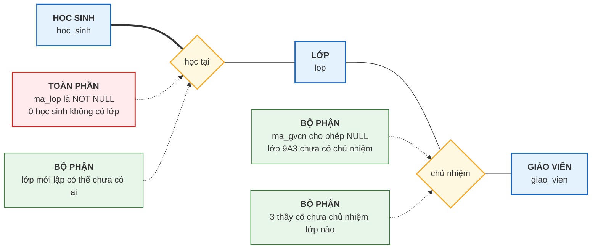
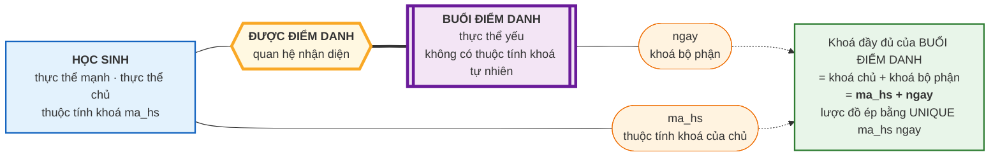

# Bài 9 — Ràng buộc tham gia và Thực thể yếu

!!! abstract "🎯 Học xong bài này, bạn sẽ"
    - Phân biệt **ràng buộc tham gia** với **bản số** — giới hạn dưới và giới hạn trên
    - Đọc được **tham gia toàn phần** và **tham gia bộ phận** từ lược đồ, chỉ bằng cách nhìn `NOT NULL`
    - Nhận ra **thực thể yếu**, **thực thể chủ**, **quan hệ nhận diện** và **khoá bộ phận** — và kiểm tra được một khoá bộ phận có hợp lệ hay không
    - Chứng minh từng khái niệm trên bằng dữ liệu thật của `truong_hoc`
    - Biết vì sao phụ huynh phải "biến mất" khi học sinh bị xoá

## 🧠 Câu chuyện mở đầu

Cô văn thư đưa bạn hai tập hồ sơ và nhờ kiểm tra hộ.

**Tập thứ nhất — danh sách học sinh.** Cô dặn: *"Em soát xem có bạn nào chưa ghi lớp không. Trường mình không có học sinh nào đứng ngoài lớp cả — nhập học là phải vào một lớp."* Bạn soát cả 40 hồ sơ. Không thiếu bạn nào.

**Tập thứ hai — danh sách giáo viên.** Cô dặn ngược lại: *"Cái này thì em đừng lo. Trường có 8 thầy cô mà chỉ có 6 lớp, nên đương nhiên vài người không chủ nhiệm lớp nào. Bình thường thôi."* Bạn mở ra: đúng thật, có ba thầy cô để trống ô chủ nhiệm. Mà lớp 9A3 thì chưa có ai đứng tên.

Hai tập hồ sơ, hai luật khác nhau. Tập một: **bắt buộc mọi người phải có**. Tập hai: **có cũng được, không có cũng được**.

Rồi cô đưa nốt tập thứ ba — **danh sách phụ huynh**. Bạn để ý một điều lạ: mỗi tờ khai phụ huynh đều ghi kèm mã học sinh, và cô nói: *"Bạn nào chuyển trường thì em rút luôn tờ phụ huynh của bạn ấy ra. Giữ lại làm gì, nhà trường đâu có liên hệ với phụ huynh của học sinh trường khác."*

Ba tình huống, hai câu hỏi. Thứ nhất: làm sao ghi lại được cái luật *"bắt buộc phải có"* so với *"có cũng được"*? Thứ hai: một loại hồ sơ mà **không tự đứng một mình được** thì gọi là gì?

## 📖 Khái niệm & thuật ngữ

### Ràng buộc tham gia

[Bài 8](08-moi-quan-he-va-cardinality.md) đã trả lời câu hỏi *"tối đa bao nhiêu"*. Bài này trả lời câu còn lại: **"tối thiểu bao nhiêu"**.

**Ràng buộc tham gia** (*participation constraint*) quy định: một thực thể ở phía này **có bắt buộc** phải tham gia vào mối quan hệ hay không.

Chỉ có hai câu trả lời:

| Loại | English | Nghĩa | Ký hiệu Chen |
|---|---|---|---|
| **Tham gia toàn phần** | *total participation* | **Mọi** thực thể đều phải tham gia — tối thiểu 1 | Đường **đôi** |
| **Tham gia bộ phận** | *partial participation* | Có thể có thực thể không tham gia — tối thiểu 0 | Đường **đơn** |

Tham gia toàn phần còn được gọi là **ràng buộc tồn tại** (*existence dependency*), vì nó nói rằng thực thể không được phép tồn tại nếu thiếu liên kết đó.

!!! tip "Hai câu hỏi độc lập nhau"
    Với **mỗi phía** của **mỗi** mối quan hệ, luôn phải hỏi đủ hai câu:

    1. *Tối đa bao nhiêu?* → **bản số** (Bài 8)
    2. *Tối thiểu bao nhiêu?* → **ràng buộc tham gia** (bài này)

    Hai câu này độc lập, nên có 4 tổ hợp. Ví dụ với mối quan hệ HỌC SINH — *học tại* — LỚP:

    | Phía | Tối đa | Tối thiểu | Kết luận |
    |---|---|---|---|
    | HỌC SINH | 1 lớp | 1 lớp | **Toàn phần** — ai cũng phải có lớp |
    | LỚP | nhiều học sinh | 0 học sinh | **Bộ phận** — lớp mới lập có thể rỗng |

### Nhìn ra ràng buộc tham gia trong lược đồ SQL

Đây là chỗ lý thuyết ER chạm vào SQL thật, và quy tắc cực kỳ gọn:

> **Tham gia toàn phần ⇔ cột khoá ngoại được khai `NOT NULL`.**

Đối chiếu với `dataset/02-chuan-hoa.sql`:

| Cột | Khai báo | Ràng buộc tham gia |
|---|---|---|
| `hoc_sinh.ma_lop` | `NOT NULL REFERENCES lop` | HỌC SINH tham gia **toàn phần** — không thể có học sinh không lớp |
| `lop.ma_gvcn` | `UNIQUE REFERENCES giao_vien` — cho phép `NULL` | LỚP tham gia **bộ phận** — lớp có thể chưa có chủ nhiệm |
| `phu_huynh.ma_hs` | `NOT NULL REFERENCES hoc_sinh` | PHỤ HUYNH tham gia **toàn phần** — không có phụ huynh "mồ côi" |

Hai lời dặn của cô văn thư ở đầu bài đã được ghi thẳng vào lược đồ, bằng đúng hai từ `NOT NULL`.

!!! note "`UNIQUE` trên `lop.ma_gvcn` nói chuyện khác"
    Trong dòng thứ hai của bảng, `UNIQUE` **không** liên quan gì tới ràng buộc tham gia — nó là thứ ép **bản số 1:1** mà [Bài 8](08-moi-quan-he-va-cardinality.md) đã phân tích. Nhắc lại cho khỏi lẫn: `UNIQUE` lo **giới hạn trên**, `NOT NULL` lo **giới hạn dưới**. Cùng nằm trên một dòng khai báo, nhưng trả lời hai câu hỏi khác nhau.

!!! warning "Phía 'nhiều' thì SQL không ép được"
    Câu *"mỗi lớp phải có ít nhất một học sinh"* **không** diễn đạt nổi bằng `NOT NULL`, vì nó là ràng buộc trên phía *nhiều*. Trong `truong_hoc` cả 6 lớp đều có học sinh, nhưng đó là do dữ liệu, không do lược đồ cưỡng chế.

    Muốn ép thật thì cần trigger hoặc kiểm tra ở tầng ứng dụng. Đây là một **giới hạn cố hữu** của mô hình quan hệ so với mô hình ER: ER diễn tả được nhiều ràng buộc hơn số ràng buộc mà bảng cưỡng chế nổi. Bài 14 và Bài 15 sẽ quay lại đúng khoảng cách này.

### Thực thể yếu

**Thực thể yếu** (*weak entity*) là thực thể **không có thuộc tính khoá của riêng nó**, nên phải mượn khoá của một thực thể khác mới định danh được.

Thực thể mà nó mượn khoá gọi là **thực thể chủ** (*owner entity*, hay *identifying entity*, *parent entity*).

Mối quan hệ nối hai bên gọi là **quan hệ nhận diện** (*identifying relationship*).

Và cái phần "còn lại" mà bản thân thực thể yếu tự có để phân biệt các anh em cùng chủ, gọi là **khoá bộ phận** (*partial key*, hay *discriminator*).

Trong `truong_hoc`, PHỤ HUYNH chính là thực thể yếu điển hình:

| Thành phần | Trong `truong_hoc` |
|---|---|
| Thực thể yếu | PHỤ HUYNH |
| Thực thể chủ | HỌC SINH |
| Quan hệ nhận diện | *"là phụ huynh của"* |
| Ứng viên khoá bộ phận | `quan_he` — Bố / Mẹ / Ông / Bà / Khác |
| Khoá đầy đủ nếu ứng viên đó hợp lệ | `(ma_hs, quan_he)` |

Đọc theo lời của cô văn thư: *"tờ khai phụ huynh không tự đứng một mình được"*. Nói *"Bố"* thì chẳng ai biết bố của ai. Phải nói *"Bố của HS001"* mới định danh được.

!!! warning "Chữ 'ứng viên' trong bảng trên là có chủ ý"
    `quan_he` **trông** giống khoá bộ phận, nhưng ở phần Thực hành bạn sẽ tự chạy một câu SQL và thấy nó **không** phân biệt được: học sinh `HS029` có **hai** người cùng ghi `Bố`.

    Một khoá bộ phận phải phân biệt được **mọi** thực thể yếu cùng chủ. Không làm được điều đó thì nó **không phải** khoá bộ phận hợp lệ — chứ không phải chỉ là "hơi bất tiện". Mục *"Một điều trung thực về `phu_huynh`"* ở dưới sẽ nói cái gì mới đúng.

!!! note "Ba dấu hiệu nhận ra thực thể yếu"
    1. **Không có thuộc tính khoá tự nhiên** — tức là ở mức ý niệm, không có đặc điểm nào của bản thân nó đủ sức định danh nó khi thiếu thực thể chủ.
    2. **Luôn tham gia toàn phần** vào quan hệ nhận diện — đây là hệ quả tất yếu, không phải lựa chọn.
    3. **Chết theo chủ**: xoá thực thể chủ thì thực thể yếu cũng phải biến mất, vì nó không còn ý nghĩa gì. Trong SQL, điều này được viết là `ON DELETE CASCADE`.

Đúng là lược đồ mẫu làm như vậy:

```
ma_hs CHAR(5) NOT NULL REFERENCES hoc_sinh(ma_hs) ON DELETE CASCADE
```

`NOT NULL` ⇒ tham gia toàn phần. `ON DELETE CASCADE` ⇒ chết theo chủ. Hai đặc trưng của thực thể yếu, viết trên đúng một dòng SQL. Bài 15 sẽ so sánh `CASCADE` với `RESTRICT` và `SET NULL`.

### Thực thể yếu khác thực thể mạnh thế nào

**Thực thể mạnh** (*strong entity*, hay *regular entity*) là thực thể có **thuộc tính khoá tự nhiên**, tự đứng được. HỌC SINH, GIÁO VIÊN, LỚP, MÔN HỌC, SÁCH đều là thực thể mạnh.

| | Thực thể mạnh | Thực thể yếu |
|---|---|---|
| Có thuộc tính khoá tự nhiên (mức ý niệm) | Có | Không — phải mượn khoá chủ |
| Ký hiệu Chen | Hình chữ nhật đơn | Hình chữ nhật **đôi** |
| Quan hệ nhận diện | Không cần | Bắt buộc, vẽ hình thoi **đôi** |
| Tham gia vào quan hệ nhận diện | — | Luôn **toàn phần** |
| Khi chủ bị xoá | Không ảnh hưởng | Bị xoá theo |

### Một khoá bộ phận HỢP LỆ trông như thế nào

Trước khi bàn chỗ trục trặc của `phu_huynh`, hãy xem một thực thể yếu thứ hai trong `truong_hoc` mà mọi thứ khớp hoàn hảo: **BUỔI ĐIỂM DANH**.

Một buổi điểm danh là *"ngày 15/09, bạn An có mặt"*. Nói trống không *"ngày 15/09"* thì chưa định danh được buổi nào — phải kèm học sinh. Vậy nó là thực thể yếu.

| Thành phần | Trong `truong_hoc` |
|---|---|
| Thực thể yếu | BUỔI ĐIỂM DANH |
| Thực thể chủ | HỌC SINH |
| Quan hệ nhận diện | *"được điểm danh"* |
| Khoá bộ phận | `ngay` |
| Khoá đầy đủ | `(ma_hs, ngay)` |

Và lần này khoá bộ phận **được lược đồ cưỡng chế thật**, bằng ràng buộc `UNIQUE (ma_hs, ngay)` trong `dataset/02-chuan-hoa.sql`. Đúng nghĩa *"trong phạm vi một học sinh, ngày phân biệt được mọi buổi điểm danh"*.

!!! danger "Nhưng bảng `diem_danh` vẫn có `ma_dd SERIAL` — đọc kỹ chỗ này"
    Chạy `\d diem_danh` thì bạn sẽ thấy khoá chính của bảng **không phải** `(ma_hs, ngay)` mà là một cột `ma_dd SERIAL`. Đúng như `phu_huynh` có `ma_ph`.

    `ma_dd` cũng là một **khoá nhân tạo ở mức bảng**, được người thiết kế thêm vào lúc chuyển biểu đồ ER sang bảng (Bài 14) cho gọn — nó **không** phải một thuộc tính trong biểu đồ ER, y hệt `ma_ph`.

    Nhưng hai trường hợp khác nhau ở một điểm quyết định:

    | | `diem_danh` | `phu_huynh` |
    |---|---|---|
    | Khoá bộ phận có hợp lệ không | **Có** — `ngay` | **Không** — `quan_he` |
    | Khoá tự nhiên `(khoá chủ + khoá bộ phận)` | `(ma_hs, ngay)` — **hợp lệ** | `(ma_hs, quan_he)` — **không hợp lệ** |
    | Lược đồ có giữ khoá tự nhiên lại không | **Có** — `UNIQUE (ma_hs, ngay)` | Không có gì để giữ |

    Nói cách khác: `diem_danh` dùng khoá nhân tạo **cho tiện**, nhưng **vẫn cưỡng chế** khoá bộ phận bằng `UNIQUE`. Còn `phu_huynh` dùng khoá nhân tạo vì **bắt buộc** — nó không có khoá tự nhiên nào để cưỡng chế.

    Vì thế BUỔI ĐIỂM DANH vẫn là ví dụ *"thực thể yếu chuẩn"* của bài này: khoá bộ phận của nó tồn tại, hợp lệ, và được lược đồ bảo vệ thật. **Bài 12** sẽ gọi tên hai cột `ma_dd`, `ma_ph` là **khoá nhân tạo**, còn **Bài 14** sẽ chỉ rõ chúng sinh ra ở bước nào.

!!! note "NGÀY không phải một tập thực thể"
    Đừng vẽ một hình chữ nhật `NGÀY` rồi nối `HỌC SINH` với nó. Trường không lưu dữ liệu gì về bản thân ngày 15/09/2026 cả — không tên, không mô tả, không gì hết. `ngay` chỉ là một **thuộc tính**. Bài 10 sẽ vẽ BUỔI ĐIỂM DANH đúng cách.

### Một điều trung thực về `phu_huynh`

Bây giờ quay lại `phu_huynh`, nơi mọi thứ **không** khớp đẹp như vậy.

Nếu `quan_he` là khoá bộ phận hợp lệ thì khoá của PHỤ HUYNH sẽ là `(ma_hs, quan_he)`, và lược đồ sẽ phải có `UNIQUE (ma_hs, quan_he)` — đúng như `diem_danh` có `UNIQUE (ma_hs, ngay)`. Nhưng bảng thật **không** có ràng buộc đó, mà lại có một cột `ma_ph` làm khoá chính.

Vì sao? Vì thực tế không sạch như lý thuyết: một học sinh hoàn toàn có thể có **hai người đều ghi quan hệ là "Bố"** — bố đẻ và bố dượng chẳng hạn. Bạn sẽ **tự kiểm chứng bằng dữ liệu thật** ở phần Thực hành.

Kết luận thẳng thắn: **`quan_he` KHÔNG phải khoá bộ phận hợp lệ của PHỤ HUYNH.** Có hai cách chữa đúng:

| Cách | Khoá bộ phận | Khoá đầy đủ |
|---|---|---|
| **1. Thêm một số thứ tự** trong phạm vi từng học sinh | `so_thu_tu` — 1, 2, 3... | `(ma_hs, so_thu_tu)` |
| **2. Dùng khoá nhân tạo** cho cả bảng | không còn khoá bộ phận | `ma_ph` |

Lược đồ mẫu chọn **cách 2**. Bài 12 sẽ gọi `ma_ph` là **khoá nhân tạo** (*surrogate key*).

!!! danger "`ma_ph` KHÔNG phải một thuộc tính trong biểu đồ ER"
    Đây là chỗ rất dễ nhầm, và nó quyết định cách bạn trả lời câu *"PHỤ HUYNH mạnh hay yếu?"*.

    `ma_ph` là một cột được **thêm vào ở bước chuyển ER sang bảng** (Bài 14), không phải một đặc điểm có thật ngoài đời của người phụ huynh. Ngoài đời, bố mẹ học sinh không mang theo mã số nào cả. Vì vậy ở **mức ý niệm**, PHỤ HUYNH vẫn **không có thuộc tính khoá tự nhiên** — nó vẫn là **thực thể yếu**.

    Cái thay đổi chỉ là ở **mức bảng**: thay vì ghép khoá chủ với khoá bộ phận, người thiết kế phát sinh một mã mới. Sự phụ thuộc tồn tại thì vẫn còn nguyên trong `NOT NULL` và `ON DELETE CASCADE`.

### Bảng thuật ngữ

| Tiếng Việt | English | Nghĩa dễ hiểu |
|---|---|---|
| Ràng buộc tham gia | *participation constraint* | Có bắt buộc tham gia mối quan hệ hay không |
| Tham gia toàn phần | *total participation* | Mọi thực thể đều phải tham gia — vẽ đường đôi |
| Tham gia bộ phận | *partial participation* | Được phép không tham gia — vẽ đường đơn |
| Thực thể mạnh | *strong entity* | Có thuộc tính khoá tự nhiên, tự đứng được |
| Thực thể yếu | *weak entity* | Không có thuộc tính khoá tự nhiên, phải mượn khoá của chủ |
| Thực thể chủ | *owner entity* | Thực thể cho mượn khoá |
| Quan hệ nhận diện | *identifying relationship* | Mối quan hệ nối thực thể yếu với chủ của nó |
| Khoá bộ phận | *partial key / discriminator* | Phần riêng của thực thể yếu, ghép với khoá chủ mới đủ |

## 🖼️ Sơ đồ

Mermaid không vẽ được đường đôi kiểu Chen, nên sơ đồ dưới đây **mô phỏng**: đường **nét đậm** `===` là tham gia **toàn phần**, đường **nét thường** `---` là tham gia **bộ phận**. Bài 10 sẽ có bảng chú giải đầy đủ.



Còn đây là thực thể yếu. Hình chữ nhật đôi được mô phỏng bằng `[[ ]]`, hình thoi đôi bằng hình lục giác `{{ }}`.

Ví dụ được chọn là **BUỔI ĐIỂM DANH** chứ không phải PHỤ HUYNH, vì đây là thực thể yếu duy nhất trong `truong_hoc` có khoá bộ phận **hợp lệ và được lược đồ cưỡng chế**:



!!! warning "Vẽ PHỤ HUYNH theo đúng khuôn này thì sẽ SAI ở một chỗ"
    Hình dạng thì giống hệt: chữ nhật đôi `PHỤ HUYNH`, thoi đôi `LÀ PHỤ HUYNH CỦA`, đường đôi, thực thể chủ `HỌC SINH`.

    Chỗ khác duy nhất nằm ở ô khoá bộ phận. Nếu bạn điền `quan_he` vào đó thì ô "khoá đầy đủ" sẽ ghi `(ma_hs, quan_he)` — và điều đó **không đúng**, vì cặp ấy không phân biệt được (phần Thực hành sẽ chứng minh). Khoá bộ phận hợp lệ phải là một **số thứ tự trong phạm vi từng học sinh**, hoặc bảng phải chuyển sang dùng khoá nhân tạo như `ma_ph`.

## 💻 Thực hành

### Tham gia toàn phần — soát tập hồ sơ thứ nhất

Đúng việc cô văn thư nhờ bạn làm:

```sql
SELECT count(*) AS so_hoc_sinh_khong_co_lop
FROM hoc_sinh
WHERE ma_lop IS NULL;
```

Kết quả: `0`.

Nhưng con số 0 này **không phải may mắn**. Nó là điều duy nhất có thể xảy ra, vì lược đồ khai `ma_lop CHAR(3) NOT NULL`. Bạn kiểm chứng ngay trong `information_schema`:

```sql
SELECT column_name, is_nullable
FROM information_schema.columns
WHERE table_schema = 'public' AND table_name = 'hoc_sinh' AND column_name = 'ma_lop';
```

Kết quả: `ma_lop` | `NO`. Chữ `NO` ở cột `is_nullable` chính là **tham gia toàn phần** viết bằng ngôn ngữ của PostgreSQL.

### Tham gia bộ phận — soát tập hồ sơ thứ hai

```sql
SELECT ma_lop, ten_lop, khoi, ma_gvcn
FROM lop
WHERE ma_gvcn IS NULL;
```

Kết quả đúng **1 dòng**: `L06` | `9A3` | `9` | rỗng.

Lớp 9A3 tồn tại hợp lệ dù chưa có chủ nhiệm. Đó là **tham gia bộ phận** — và lược đồ cho phép điều đó bằng cách **không** viết `NOT NULL` lên `ma_gvcn`.

Nhìn từ phía giáo viên cũng vậy:

```sql
SELECT count(*) AS so_giao_vien FROM giao_vien;
```

Kết quả: `8`.

```sql
SELECT count(DISTINCT ma_gvcn) AS so_giao_vien_dang_lam_gvcn FROM lop;
```

Kết quả: `5`. Tám thầy cô nhưng chỉ năm người đang chủ nhiệm — ba người còn lại **không tham gia** mối quan hệ này, mà vẫn là giáo viên hợp lệ. Lại là tham gia bộ phận, lần này ở phía GIÁO VIÊN.

Bài 8 đã gặp thêm hai trường hợp bộ phận nữa trong `phan_cong_day`:

```sql
SELECT count(DISTINCT ma_lop) AS so_lop_co_lich_day,
       count(DISTINCT ma_mon) AS so_mon_co_giao_vien
FROM phan_cong_day;
```

Kết quả: `4` và `8`. Trong khi bảng `lop` có 6 lớp và `mon_hoc` có 9 môn. Nghĩa là hai lớp chưa có lịch dạy, và môn Địa lý chưa có ai dạy — cả hai phía đều tham gia **bộ phận**.

### Thực thể yếu — phụ huynh không tự đứng được

```sql
SELECT ma_ph, ho_ten, quan_he, ma_hs
FROM phu_huynh
WHERE ma_hs IN ('HS001', 'HS003')
ORDER BY ma_ph;
```

Bốn dòng: `PH001` Nguyễn Văn Thành (Bố, HS001), `PH002` Lê Thị Hạnh (Mẹ, HS001), `PH004` Lê Hoàng Sáu (Bố, HS003), `PH005` Nguyễn Thị Tám (Mẹ, HS003).

Thử che cột `ma_hs` đi rồi hỏi *"'Bố' là ai?"* — có hai dòng cùng ghi `Bố`. Không phân biệt nổi. Phải ghép `ma_hs` với `quan_he` mới ra được một định danh: *"Bố của HS001"*. Đó chính là **khoá bộ phận cộng khoá chủ**.

Và mối quan hệ này **toàn phần** ở phía phụ huynh:

```sql
SELECT count(*) AS so_phu_huynh_khong_gan_hoc_sinh
FROM phu_huynh
WHERE ma_hs IS NULL;
```

Kết quả: `0`, và lại là điều duy nhất có thể, vì `ma_hs` được khai `NOT NULL`.

### Nhưng phía học sinh lại là bộ phận — trường hợp HS040

```sql
SELECT count(*) AS so_phu_huynh_cua_hs040
FROM phu_huynh
WHERE ma_hs = 'HS040';
```

Kết quả: `0`.

Bạn Đinh Thị Vân (`HS040`) là học sinh hợp lệ, có lớp, có điểm, có điểm danh — nhưng **không có phụ huynh nào** trong hệ thống. Điều này hoàn toàn được phép, vì HỌC SINH tham gia **bộ phận** vào mối quan hệ *"có phụ huynh"*.

Đối chiếu hai chiều cho thật rõ:

| Phía | Ràng buộc tham gia | Vì sao | Bằng chứng |
|---|---|---|---|
| PHỤ HUYNH | **Toàn phần** | `phu_huynh.ma_hs` là `NOT NULL` | 0 phụ huynh không gắn học sinh |
| HỌC SINH | **Bộ phận** | Không có gì bắt học sinh phải có phụ huynh | `HS040` có 0 phụ huynh |

Đây chính là cặp ví dụ đẹp nhất của bài: **cùng một mối quan hệ, hai phía hai luật khác nhau**.

### Khoá bộ phận hợp lệ — kiểm chứng trên `diem_danh`

Với BUỔI ĐIỂM DANH, khoá bộ phận `ngay` được lược đồ cưỡng chế thật:

```sql
SELECT conname, contype
FROM pg_constraint
WHERE conrelid = 'diem_danh'::regclass AND contype = 'u';
```

Một dòng: `diem_danh_ma_hs_ngay_key` với `contype = 'u'` — đó là `UNIQUE (ma_hs, ngay)`. Nhờ nó, cặp `(ma_hs, ngay)` **không thể** trùng, dù dữ liệu tương lai có thế nào đi nữa.

### Còn `quan_he` thì KHÔNG hợp lệ — và đây là bằng chứng

Nếu `quan_he` là khoá bộ phận đúng, câu lệnh sau phải trả về **0 dòng**:

```sql
SELECT ma_hs, quan_he, count(*) AS so_dong
FROM phu_huynh
GROUP BY ma_hs, quan_he
HAVING count(*) > 1
ORDER BY ma_hs;
```

Kết quả: đúng **1 dòng** — `HS029` | `Bố` | `2`.

Học sinh `HS029` có **hai** người cùng ghi quan hệ là *Bố*. Vậy cặp `(ma_hs, quan_he)` **không phân biệt được** mọi phụ huynh của cùng một học sinh.

Kết luận theo đúng định nghĩa: **`quan_he` không phải khoá bộ phận hợp lệ của PHỤ HUYNH.** Đây không phải chuyện "hơi bất tiện" mà là sai định nghĩa — một khoá bộ phận bắt buộc phải phân biệt được **mọi** thực thể yếu cùng chủ.

So sánh hai thực thể yếu của bài để thấy rõ:

| | BUỔI ĐIỂM DANH | PHỤ HUYNH |
|---|---|---|
| Ứng viên khoá bộ phận | `ngay` | `quan_he` |
| Lược đồ có ép duy nhất không | **Có** — `UNIQUE (ma_hs, ngay)` | **Không** |
| Dữ liệu thật có trùng không | Không | **Có** — `HS029` hai lần `Bố` |
| Kết luận | Khoá bộ phận **hợp lệ** | **Không hợp lệ** |

Vì không có khoá bộ phận hợp lệ, bảng `phu_huynh` chuyển sang dùng khoá nhân tạo:

```sql
SELECT count(*) AS tong_so_dong, count(DISTINCT ma_ph) AS so_ma_ph_khac_nhau
FROM phu_huynh;
```

Kết quả: `45` và `45` — mã nhân tạo thì không bao giờ trùng.

!!! tip "Bài học thiết kế rút ra"
    Khi khoá bộ phận **không chắc chắn** đủ sức phân biệt trong mọi tình huống tương lai, hãy dùng khoá nhân tạo. Nhưng đừng vì thế mà quên bản chất: PHỤ HUYNH **vẫn** là thực thể yếu, và lược đồ vẫn phải giữ `NOT NULL` cùng `ON DELETE CASCADE` để phản ánh sự phụ thuộc tồn tại đó. **Bài 12** sẽ bàn kỹ khi nào nên chọn khoá nhân tạo.

### Chết theo chủ — kiểm chứng `ON DELETE CASCADE` mà không xoá gì

Bạn có thể đọc chính sách xoá này ra từ hệ thống, không cần xoá thật:

```sql
SELECT conname, confdeltype
FROM pg_constraint
WHERE conrelid = 'phu_huynh'::regclass AND contype = 'f';
```

Kết quả có `phu_huynh_ma_hs_fkey` với `confdeltype = 'c'` — chữ `c` là viết tắt của **cascade**. Xoá một học sinh thì mọi phụ huynh của bạn ấy tự động bị xoá theo, đúng như lời cô văn thư: *"bạn nào chuyển trường thì rút luôn tờ phụ huynh của bạn ấy ra"*.

So sánh với bảng `hoc_sinh`:

```sql
SELECT conname, confdeltype
FROM pg_constraint
WHERE conrelid = 'hoc_sinh'::regclass AND contype = 'f';
```

Ở đây `hoc_sinh_ma_lop_fkey` có `confdeltype = 'r'` — **restrict**, nghĩa là **cấm** xoá một lớp đang có học sinh. Khác hẳn. Lý do: HỌC SINH **không phải** thực thể yếu của LỚP; bạn ấy vẫn là một con người có thật kể cả khi lớp bị giải thể, nên hệ thống bắt bạn xử lý tay thay vì xoá ngầm. **Bài 15** sẽ dạy đủ cả năm hành vi `ON DELETE`.

## ⚠️ Lỗi thường gặp

!!! warning "Lỗi 1: Nhầm ràng buộc tham gia với bản số"
    Nói *"mối quan hệ này là toàn phần nên nó là 1:1"* là trộn hai khái niệm.

    - **Bản số** = giới hạn **trên** = *tối đa bao nhiêu*.
    - **Ràng buộc tham gia** = giới hạn **dưới** = *tối thiểu 0 hay tối thiểu 1*.

    Một mối quan hệ 1:N hoàn toàn có thể toàn phần ở phía "nhiều" và bộ phận ở phía "một" — đúng như LỚP và HỌC SINH.

!!! warning "Lỗi 2: Quên `NOT NULL` trên khoá ngoại bắt buộc"
    Thiết kế đúng trên giấy là *"mọi học sinh phải có lớp"*, nhưng khi `CREATE TABLE` lại viết `ma_lop CHAR(3) REFERENCES lop(ma_lop)` mà quên `NOT NULL`.

    Lúc đó khoá ngoại vẫn hoạt động — mã lớp ghi vào phải có thật. Nhưng để **trống** thì được phép, và một hôm nào đó bạn sẽ có học sinh không thuộc lớp nào mà không hiểu vì sao.

    **Tham gia toàn phần trên giấy phải thành `NOT NULL` trong SQL.** Không có ngoại lệ.

!!! warning "Lỗi 3: Cho thực thể yếu một khoá nhân tạo rồi quên mất nó là thực thể yếu"
    Thêm `ma_ph` làm khoá chính là hợp lý. Nhưng nhiều người làm xong thì bỏ luôn `NOT NULL` và `ON DELETE CASCADE`, nghĩ rằng "đã có khoá chính rồi thì nó mạnh rồi".

    Hậu quả: xoá một học sinh xong, hồ sơ phụ huynh vẫn nằm lại trong bảng, trỏ vào một mã học sinh không còn tồn tại — hoặc tệ hơn, `ma_hs` bị để `NULL` và không ai biết đó là phụ huynh của ai nữa. Dữ liệu rác kiểu này gần như không dọn được về sau.

!!! warning "Lỗi 4: Coi mọi bảng có khoá ngoại đều là thực thể yếu"
    `hoc_sinh` có khoá ngoại `ma_lop`, `NOT NULL` hẳn hoi. Vậy HỌC SINH có phải thực thể yếu của LỚP không? **Không.**

    Phép thử đúng — và hãy đọc kỹ từng chữ:

    > *Ở **mức ý niệm**, thực thể này có **thuộc tính khoá tự nhiên** không? Tức là ngoài đời, bản thân nó có sẵn đặc điểm nào đủ sức định danh nó mà không cần nhắc tới thực thể khác?*

    - **HỌC SINH**: có. Nhà trường cấp cho mỗi bạn một mã học sinh, và mã đó tồn tại độc lập với việc bạn ấy học lớp nào — chuyển lớp thì mã vẫn thế. → **mạnh**.
    - **PHỤ HUYNH**: không. Ngoài đời người phụ huynh không mang theo mã số nào cả; nói *"Bố"* thì không định danh nổi ai. → **yếu**.
    - **BUỔI ĐIỂM DANH**: không. *"Ngày 15/09"* trống không thì chưa là buổi điểm danh của ai. → **yếu**.

!!! warning "Lỗi 5: Dùng 'bảng này có khoá chính riêng không' làm phép thử"
    Đây là biến thể tinh vi hơn của Lỗi 4, và nó **phá đúng ví dụ trung tâm của bài**.

    Bảng `phu_huynh` có khoá chính `ma_ph` của riêng nó. Áp phép thử sai này thì ra kết luận *"PHỤ HUYNH là thực thể mạnh"* — trái ngược hoàn toàn với mọi thứ bài vừa dạy.

    Sai ở đâu? Ở chỗ trộn **hai mức** vào nhau:

    | Mức | Câu hỏi | Trả lời cho PHỤ HUYNH |
    |---|---|---|
    | **Ý niệm** (biểu đồ ER) | Có thuộc tính khoá tự nhiên không? | **Không** → thực thể **yếu** |
    | **Bảng** (sau Bài 14) | Bảng có cột khoá chính không? | Có — `ma_ph`, một mã **được thêm vào lúc chuyển đổi** |

    `ma_ph` không phải một thuộc tính trong biểu đồ ER. Nó là sản phẩm của bước chuyển ER sang bảng, chọn ra vì `quan_he` không làm nổi khoá bộ phận.

    Dấu hiệu nhận ra sự phụ thuộc vẫn còn nguyên trong lược đồ: `ma_hs NOT NULL` và `ON DELETE CASCADE`.

## ✍️ Bài tập

1. Với mỗi mối quan hệ dưới đây trong `truong_hoc`, hãy nói ràng buộc tham gia ở **cả hai phía** và chỉ ra bằng chứng trong lược đồ hoặc dữ liệu:

    a. HỌC SINH — *mượn* — SÁCH
    b. HỌC SINH — *được điểm danh* — BUỔI ĐIỂM DANH

2. Trường mở thêm hệ thống quản lý **phòng học**, và ghi lại **thiết bị** trong từng phòng: *"máy chiếu số 1 của phòng A101"*, *"máy chiếu số 1 của phòng A102"*. Thiết bị chỉ được đánh số trong phạm vi từng phòng. Hãy xác định: thực thể yếu, thực thể chủ, quan hệ nhận diện, khoá bộ phận, và khoá đầy đủ.

3. Viết câu SQL tìm những học sinh **chưa từng mượn quyển sách nào**. Kết quả này chứng minh điều gì về ràng buộc tham gia của HỌC SINH trong mối quan hệ *mượn sách*?

4. Cô hiệu trưởng ra quy định: *"Từ nay mọi lớp đều phải có giáo viên chủ nhiệm, không được để trống."* Cần sửa lược đồ thế nào? Việc sửa này có chạy được ngay trên dữ liệu hiện tại không? Vì sao?

5. Giải thích vì sao **thực thể yếu luôn luôn tham gia toàn phần** vào quan hệ nhận diện. Có ngoại lệ nào không?

??? success "Đáp án"
    **Câu 1a. HỌC SINH — mượn — SÁCH**

    | Phía | Tham gia | Bằng chứng |
    |---|---|---|
    | HỌC SINH | **Bộ phận** | Dữ liệu mẫu chỉ có `HS001`–`HS025` từng mượn; 15 bạn còn lại chưa mượn cuốn nào mà vẫn là học sinh hợp lệ |
    | SÁCH | **Bộ phận** | Một cuốn mới nhập kho chưa ai mượn vẫn nằm hợp lệ trong bảng `sach` |

    Ngược lại, xét từ phía **bảng trung gian** `muon_sach`: cả `ma_hs` lẫn `ma_sach` đều `NOT NULL`, nên mỗi **lượt mượn** bắt buộc phải gắn với một học sinh và một cuốn sách. Đây lại là tham gia toàn phần — nhưng của LƯỢT MƯỢN, không phải của HỌC SINH.

    **Câu 1b. HỌC SINH — được điểm danh**

    | Phía | Tham gia | Bằng chứng |
    |---|---|---|
    | HỌC SINH | **Bộ phận** về mặt lược đồ | Không có gì ép mỗi học sinh phải có ít nhất một buổi điểm danh. Dữ liệu mẫu tình cờ đủ cả 40 bạn × 5 ngày = 200 dòng, nhưng đó là do dữ liệu, không do ràng buộc |
    | BUỔI ĐIỂM DANH | **Toàn phần** | `diem_danh.ma_hs` là `NOT NULL` — và bắt buộc phải vậy, vì đây là **thực thể yếu**, tham gia toàn phần vào quan hệ nhận diện là hệ quả tất yếu |

    **Câu 2.**

    | Thành phần | Trả lời |
    |---|---|
    | Thực thể yếu | THIẾT BỊ |
    | Thực thể chủ | PHÒNG HỌC |
    | Quan hệ nhận diện | *"được lắp trong"* |
    | Khoá bộ phận | `so_thu_tu` — số thứ tự thiết bị trong phòng |
    | Khoá đầy đủ | `(ma_phong, so_thu_tu)` |

    Lược đồ tương ứng:

    ```
    phong_hoc(ma_phong, ten_phong, suc_chua)
    thiet_bi(ma_phong, so_thu_tu, ten_thiet_bi, tinh_trang)
        PRIMARY KEY (ma_phong, so_thu_tu)
        FOREIGN KEY (ma_phong) REFERENCES phong_hoc ON DELETE CASCADE
    ```

    Dấu hiệu nhận ra đây là thực thể yếu: *"máy chiếu số 1"* nói trống không thì vô nghĩa — phải hỏi *"số 1 của phòng nào?"*.

    **Câu 3.**

    ```sql
    SELECT ma_hs, ho_ten
    FROM hoc_sinh h
    WHERE NOT EXISTS (
        SELECT 1 FROM muon_sach m WHERE m.ma_hs = h.ma_hs
    )
    ORDER BY ma_hs;
    ```

    Kết quả là 15 bạn từ `HS026` tới `HS040`. (`NOT EXISTS` sẽ được dạy kỹ ở **Bài 27**; tạm đọc là *"giữ những học sinh mà không tồn tại dòng mượn sách nào của họ"*.)

    Kết quả khác rỗng chứng minh HỌC SINH tham gia **bộ phận** vào mối quan hệ *mượn sách*: có học sinh thật, hợp lệ, nhưng chưa từng tham gia mối quan hệ đó. Nếu tham gia là toàn phần thì câu truy vấn này bắt buộc phải trả về 0 dòng.

    **Câu 4.**
    Cần đổi ràng buộc tham gia của LỚP từ bộ phận sang toàn phần, tức thêm `NOT NULL`:

    <!-- sql:khong-chay -->
    ```sql
    ALTER TABLE lop ALTER COLUMN ma_gvcn SET NOT NULL;
    ```

    **Chạy ngay thì thất bại**, vì lớp `L06` (9A3) đang có `ma_gvcn` là `NULL`. PostgreSQL sẽ từ chối với lỗi cho biết cột chứa giá trị null.

    Muốn thành công phải xử lý dữ liệu cũ trước — phân công một giáo viên cho lớp 9A3 — rồi mới `ALTER`. Đây là bài học rất thật: **đổi ràng buộc trên một database đang chạy luôn phải dọn dữ liệu cũ trước.**

    **Câu 5.**
    Vì định nghĩa của thực thể yếu là *"không có thuộc tính khoá tự nhiên, phải mượn khoá của thực thể chủ"*.

    Giả sử có một thực thể yếu **không** tham gia quan hệ nhận diện — tức là không có chủ. Khi đó nó không mượn được khoá của ai, mà bản thân nó lại không có thuộc tính khoá nào. Kết quả: **không cách nào định danh nó**, nên nó không thể là một thực thể hợp lệ.

    Suy ra tham gia toàn phần không phải là một lựa chọn thiết kế, mà là **hệ quả logic bắt buộc**. Không có ngoại lệ.

    Cũng chính vì thế mà `ON DELETE CASCADE` là lựa chọn tự nhiên: xoá chủ đi thì thực thể yếu mất luôn khả năng định danh, giữ lại cũng vô nghĩa.

## 🔑 Tóm tắt

1. **Ràng buộc tham gia** trả lời *"tối thiểu bao nhiêu"*, còn **bản số** trả lời *"tối đa bao nhiêu"* — hai câu hỏi độc lập, phải hỏi cho cả hai phía.
2. **Tham gia toàn phần** nghĩa là mọi thực thể đều phải tham gia; trong SQL nó chính là `NOT NULL` trên cột khoá ngoại.
3. **Tham gia bộ phận** cho phép đứng ngoài — lớp 9A3 chưa có chủ nhiệm và học sinh `HS040` chưa có phụ huynh đều hợp lệ.
4. **Thực thể yếu** không có thuộc tính khoá tự nhiên, phải ghép **khoá chủ + khoá bộ phận**; nó luôn tham gia toàn phần vào **quan hệ nhận diện** và bị xoá theo chủ bằng `ON DELETE CASCADE`.
5. Khoá bộ phận phải phân biệt được **mọi** thực thể yếu cùng chủ: `ngay` của BUỔI ĐIỂM DANH đạt (có `UNIQUE`), `quan_he` của PHỤ HUYNH **không** đạt — nên bảng phải dùng **khoá nhân tạo** `ma_ph`, một cột chỉ tồn tại ở mức bảng chứ không có trong biểu đồ ER.

---

⬅️ [Bài 8 — Mối quan hệ, bậc và bản số](08-moi-quan-he-va-cardinality.md) · ➡️ [Bài 10 — Biểu đồ ER ký hiệu Chen](10-bieu-do-er-ky-hieu-chen.md)
