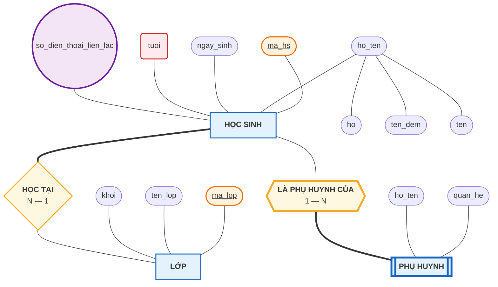
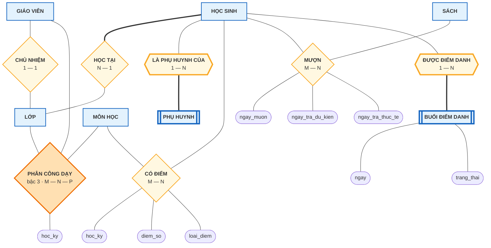

# Bài 10 — Biểu đồ ER — ký hiệu Chen

!!! abstract "🎯 Học xong bài này, bạn sẽ"
    - Đọc được **bảng tra ký hiệu Chen** đầy đủ: 9 hình vẽ và ý nghĩa từng hình
    - Tự vẽ được một biểu đồ ER cho một tình huống đời thường
    - Đọc được biểu đồ ER đầy đủ của database `truong_hoc`
    - Hiểu rõ Mermaid **mô phỏng** hình dạng Chen chứ không vẽ đúng chuẩn, và đâu là chỗ khác
    - Biết biểu đồ ER dùng để làm gì trong một dự án thật

## 🧠 Câu chuyện mở đầu

Trường bạn sắp làm phần mềm quản lý học sinh. Cô hiệu trưởng ngồi họp với một anh lập trình viên.

Cô nói: *"Trường có học sinh, có lớp. Mỗi bạn học một lớp. Mỗi lớp có cô chủ nhiệm, nhưng lớp 9A3 thì chưa có. Phụ huynh thì gắn với học sinh, bạn nào chuyển trường là bỏ luôn. À, còn thư viện nữa, học sinh mượn sách..."*

Anh lập trình viên ghi chép, rồi hỏi lại: *"Một cuốn sách có thể được nhiều bạn mượn đúng không ạ? Thế còn một bạn mượn nhiều cuốn?"* Cô gật. Anh ghi tiếp.

Nửa tiếng sau, hai người đã nói tới hơn hai chục câu như thế. Và đây là vấn đề: **không ai chắc mình còn nhớ đủ**. Cô thì không biết SQL. Anh thì không thể bắt cô đọc `CREATE TABLE`.

Rồi anh lật sang trang giấy trắng, vẽ mấy hình chữ nhật, nối chúng bằng những hình thoi, ghi số `1` và chữ `N` lên các đường nối. Anh xoay tờ giấy về phía cô: *"Cô xem em hiểu đúng chưa ạ?"*

Cô nhìn khoảng mười giây, rồi chỉ vào một chỗ: *"Chỗ này sai rồi. Một bạn có thể có cả bố lẫn mẹ, không phải một người đâu."*

Tờ giấy đó là một **biểu đồ ER**. Nó vừa làm được điều mà nửa tiếng nói chuyện không làm nổi: biến một mớ quy tắc rời rạc thành một bức tranh mà **cả hai bên cùng kiểm tra được**.

Vậy bộ hình vẽ đó gồm những gì, và quy tắc vẽ ra sao?

## 📖 Khái niệm & thuật ngữ

### Biểu đồ ER và ký hiệu Chen

**Biểu đồ ER** (*Entity–Relationship Diagram*, viết tắt **ERD**) là bản vẽ mô tả **các tập thực thể, thuộc tính của chúng, và các mối quan hệ giữa chúng**.

**Ký hiệu Chen** (*Chen notation*) là bộ ký hiệu gốc, do Peter Chen công bố năm 1976 trong bài báo khai sinh ra mô hình ER. Đặc điểm nhận dạng: **mọi thứ đều có hình riêng** — thực thể là hình chữ nhật, mối quan hệ là hình thoi, và **từng thuộc tính được vẽ thành một hình elip treo ra ngoài**.

Có nhiều bộ ký hiệu khác, phổ biến nhất là **Crow's Foot** — gọn hơn, hay dùng trong công cụ phần mềm, và là chủ đề của **Bài 11**. Bài này chỉ học Chen.

!!! question "Học Chen làm gì nếu thực tế hay dùng Crow's Foot?"
    Vì Chen là bộ ký hiệu **đầy đủ nhất**. Nó phân biệt được thuộc tính đa trị, thuộc tính dẫn xuất, thuộc tính phức hợp, quan hệ nhận diện — những thứ Crow's Foot gộp lại hoặc bỏ qua.

    Học Chen trước rồi mới học Crow's Foot thì bạn hiểu **mình đang đánh đổi cái gì để lấy sự gọn gàng**. Học ngược lại thì rất dễ tưởng rằng những khái niệm đó không tồn tại.

    Ngoài ra, Chen là ký hiệu chuẩn trong hầu hết giáo trình đại học và đề thi ở Việt Nam.

### Bảng tra ký hiệu Chen

Đây là bảng bạn sẽ quay lại tra nhiều lần. Chín ký hiệu, chia ba nhóm:

| Nhóm | Hình vẽ chuẩn Chen | Nghĩa | Ví dụ trong `truong_hoc` |
|---|---|---|---|
| **Thực thể** | Hình chữ nhật | Tập thực thể mạnh | `HỌC SINH`, `LỚP`, `SÁCH` |
| | Hình chữ nhật **đôi** | Tập thực thể yếu | `PHỤ HUYNH` |
| **Thuộc tính** | Hình elip | Thuộc tính thường | `ho_ten`, `ngay_sinh` |
| | Elip có nội dung **gạch chân** | Thuộc tính khoá | `ma_hs`, `ma_gv` |
| | Elip **đôi** | Thuộc tính đa trị | số điện thoại liên lạc |
| | Elip **nét đứt** | Thuộc tính dẫn xuất | `tuoi`, điểm trung bình |
| | Elip nối vào elip khác | Thuộc tính phức hợp và các thành phần con | `ho_ten` → `ho` + `ten_dem` + `ten` |
| **Mối quan hệ** | Hình thoi | Tập mối quan hệ | `HỌC TẠI`, `CHỦ NHIỆM` |
| | Hình thoi **đôi** | Quan hệ nhận diện | `LÀ PHỤ HUYNH CỦA` |

Và ba quy ước trên **đường nối**:

| Trên đường nối | Nghĩa | Bài đã học |
|---|---|---|
| Ghi `1`, `N` hoặc `M` ở đầu đường | Bản số của phía đó | Bài 8 |
| Đường **đơn** | Tham gia bộ phận | Bài 9 |
| Đường **đôi** | Tham gia toàn phần | Bài 9 |

Mẹo nhớ nhanh: **cái gì "đôi" thì đều mạnh hơn, chặt hơn**. Chữ nhật đôi = phụ thuộc chặt vào chủ. Thoi đôi = quan hệ nhận diện. Đường đôi = bắt buộc tham gia. Elip đôi là ngoại lệ duy nhất — nó nghĩa là "nhiều giá trị".

### Bốn quy tắc đặt tên

1. **Tập thực thể**: danh từ, **số ít**, viết in hoa. `HỌC SINH`, không phải `CÁC HỌC SINH`.
2. **Mối quan hệ**: **động từ**, đọc từ trái sang phải phải thành câu. `HỌC SINH` — *HỌC TẠI* — `LỚP`.
3. **Thuộc tính**: danh từ, viết thường, nên trùng với tên cột sẽ đặt sau này.
4. **Thuộc tính khoá**: gạch chân. Với thực thể yếu, **khoá bộ phận gạch chân nét đứt**.

### Mermaid chỉ mô phỏng Chen — đọc kỹ chỗ này

Mermaid **không có** kiểu sơ đồ Chen. Nó có `erDiagram`, nhưng đó là Crow's Foot (Bài 11). Vì vậy các sơ đồ dưới đây được vẽ bằng `flowchart` và **mô phỏng** hình dạng Chen bằng những hình gần giống nhất mà Mermaid có.

Bảng ánh xạ — hãy đọc trước khi xem sơ đồ:

| Ký hiệu Chen chuẩn | Mermaid mô phỏng bằng | Cú pháp | Khác biệt cần lưu ý |
|---|---|---|---|
| Hình chữ nhật | Hình chữ nhật | `A["HỌC SINH"]` | Giống hệt |
| Hình chữ nhật đôi | Hình chữ nhật có hai vạch dọc | `A[["PHỤ HUYNH"]]` | Chen vẽ viền đôi bao quanh, Mermaid vẽ hai vạch ở hai bên |
| Hình elip | Hình bo tròn hai đầu | `A(["ho_ten"])` | Gần giống, không phải elip toán học |
| Elip gạch chân | Bo tròn + thẻ `<u>` | `A(["<u>ma_hs</u>"])` | Giống |
| Elip đôi | Hình tròn | `A(("số điện thoại"))` | **Khác rõ** — hình tròn, không phải elip đôi |
| Elip nét đứt | Bo góc, tô **màu đỏ nhạt** | `A("tuoi")` | **Khác rõ** — Mermaid không vẽ nét đứt ổn định, nên ở đây dùng màu |
| Hình thoi | Hình thoi | `A{"HỌC TẠI"}` | Giống hệt |
| Hình thoi đôi | Hình lục giác | `A{{"LÀ PHỤ HUYNH CỦA"}}` | **Khác rõ** — lục giác thay cho thoi đôi |
| Đường đôi | Đường **nét đậm** | `A === B` | Đậm thay cho đôi |
| Đường đơn | Đường thường | `A --- B` | Giống |
| `1` / `N` / `M` trên đường nối | Ghi **bên trong hình thoi** | `A{"HỌC TẠI<br/>1 — N"}` | Chen ghi trên đường, ở đây ghi trong thoi cho gọn |

!!! warning "Khi làm bài thi hay bài tập trên giấy, hãy vẽ đúng chuẩn Chen"
    Bảng trên chỉ là cách xoay xở để hiển thị được trên website. Ba chỗ khác biệt lớn cần nhớ: **elip đôi** (đa trị) thành hình tròn, **elip nét đứt** (dẫn xuất) thành hình tô màu, và **hình thoi đôi** (quan hệ nhận diện) thành lục giác.

    Trên giấy thì cứ vẽ đúng hình dạng thật — vẽ tay dễ hơn nhiều so với ép một thư viện sơ đồ làm chuyện nó không được thiết kế để làm.

### Bảng thuật ngữ

| Tiếng Việt | English | Nghĩa dễ hiểu |
|---|---|---|
| Biểu đồ ER | *Entity–Relationship Diagram / ERD* | Bản vẽ mô tả thực thể, thuộc tính và mối quan hệ |
| Ký hiệu Chen | *Chen notation* | Bộ ký hiệu gốc năm 1976 — mỗi thứ một hình riêng |
| Ký hiệu Crow's Foot | *Crow's Foot notation* | Bộ ký hiệu gọn hơn, học ở Bài 11 |
| Mức ý niệm | *conceptual level* | Mức mô tả thế giới thực, chưa nói tới bảng hay kiểu dữ liệu |

## 🖼️ Sơ đồ

### Sơ đồ 1 — Đủ chín ký hiệu trên một hình

Sơ đồ này cố ý gom **mọi ký hiệu Chen** vào một chỗ, quanh ba tập thực thể `HỌC SINH`, `LỚP`, `PHỤ HUYNH`. Đọc kèm bảng ánh xạ ở trên.



Đọc sơ đồ theo bảng tra:

| Thấy gì | Hiểu là |
|---|---|
| `HỌC SINH` hình chữ nhật đơn | Thực thể mạnh |
| `PHỤ HUYNH` hình chữ nhật có hai vạch dọc | Thực thể **yếu** |
| `ma_hs` và `ma_lop` được gạch chân, tô cam | Thuộc tính **khoá** |
| `ho_ten` có ba elip con treo bên dưới | Thuộc tính **phức hợp** |
| `tuoi` tô đỏ nhạt | Thuộc tính **dẫn xuất** — không lưu vào bảng |
| `so_dien_thoai_lien_lac` là hình tròn tím | Thuộc tính **đa trị** — khi chuyển sang bảng phải tách ra bảng 2 cột |
| `HỌC TẠI` hình thoi đơn | Mối quan hệ thường |
| `LÀ PHỤ HUYNH CỦA` hình lục giác | Quan hệ **nhận diện** |
| Đường từ `HỌC SINH` tới `HỌC TẠI` **đậm** | HỌC SINH tham gia **toàn phần** |
| Đường từ `LỚP` tới `HỌC TẠI` **mảnh** | LỚP tham gia **bộ phận** |
| Đường từ `LÀ PHỤ HUYNH CỦA` tới `PHỤ HUYNH` **đậm** | PHỤ HUYNH tham gia **toàn phần** — bắt buộc, vì nó yếu |

Trước hết, chú ý một điều chung: sơ đồ ER **được phép** có thuộc tính đa trị và thuộc tính dẫn xuất, vì nó mô tả thế giới thực chứ không mô tả bảng. Chỉ tới bước chuyển sang bảng thì chúng mới buộc phải xử lý — **Bài 14** dạy phép chuyển đổi đó.

!!! danger "Sơ đồ 1 cố ý vẽ HAI cách mô hình hoá cho CÙNG một nhu cầu"
    Nhu cầu đời thực chỉ có một: *"trường phải liên lạc được với gia đình học sinh"*. Sơ đồ trên cố ý vẽ đồng thời **hai cách giải quyết khác nhau** để bạn thấy chúng khác nhau chỗ nào:

    | | Cách 1 — thuộc tính đa trị | Cách 2 — thực thể yếu |
    |---|---|---|
    | Vẽ ra sao | elip đôi `so_dien_thoai_lien_lac` treo thẳng vào `HỌC SINH` | chữ nhật đôi `PHỤ HUYNH` + thoi đôi |
    | Lưu được gì | chỉ dãy số | dãy số **và** `ho_ten`, `quan_he` |
    | Chuyển sang bảng thành | `hoc_sinh_sdt(ma_hs, so_dien_thoai)` — đúng 2 cột | `phu_huynh(ma_ph, ho_ten, so_dien_thoai, quan_he, ma_hs)` |
    | Bước trong thuật toán Bài 14 | Bước 6 | Bước 2 |

    Database mẫu `truong_hoc` chọn **cách 2** — nên nó có bảng `phu_huynh` chứ **không** có bảng `hoc_sinh_sdt`. Lý do: trường cần biết cả tên lẫn quan hệ của người liên lạc, chứ không chỉ một dãy số trơ.

    Quy tắc chọn, đã nêu ở [Bài 7](07-thuc-the-va-thuoc-tinh.md): thứ lặp lại mà **chỉ là một giá trị trơ** thì dùng thuộc tính đa trị; thứ lặp lại mà **có đặc điểm riêng cần mô tả** thì đó là một thực thể.

### Sơ đồ 2 — Toàn bộ `truong_hoc` theo ký hiệu Chen

Vẽ đủ cả thuộc tính của 10 bảng thì sơ đồ sẽ không đọc nổi. Nên ở đây chỉ vẽ **thực thể và mối quan hệ**; thuộc tính tra ở trang [Database mẫu](../dataset.md).



Vài điểm đáng chú ý khi đọc sơ đồ này:

- **`PHÂN CÔNG DẠY` nối vào ba hình chữ nhật** — đó là mối quan hệ **bậc ba** của Bài 8. Ký hiệu Chen vẽ được điều này rất tự nhiên; Crow's Foot ở Bài 11 thì không.
- **`hoc_ky`, `diem_so`, `ngay_muon`... treo vào hình thoi chứ không treo vào hình chữ nhật.** Đó là **thuộc tính của mối quan hệ** — chúng chỉ có nghĩa khi cả hai (hoặc ba) phía đã được xác định.
- **Có hai hình chữ nhật đôi, không phải một**: `PHỤ HUYNH` và `BUỔI ĐIỂM DANH`. Cả hai đều là **thực thể yếu** của `HỌC SINH`, và cả hai đều nối bằng **hình thoi đôi** với **đường đôi** ở phía thực thể yếu. [Bài 9](09-participation-va-thuc-the-yeu.md) đã phân tích kỹ cặp này.
- **`BUỔI ĐIỂM DANH` là hình chữ nhật chứ không phải hình thoi** — đây là chỗ dễ vẽ sai nhất của sơ đồ này. Xem hộp cảnh báo ngay dưới đây.
- Sơ đồ có **7 hình chữ nhật** (5 đơn + 2 đôi) và **3 hình thoi sẽ hoá thành bảng** (`PHÂN CÔNG DẠY`, `CÓ ĐIỂM`, `MƯỢN`). Cộng lại vừa đúng **10 bảng** của database. Đây là điều quan trọng nhất của toàn bộ Cấp 1, và Bài 14 sẽ biến nó thành thuật toán 7 bước.

!!! warning "Vì sao `ĐIỂM DANH` là thực thể yếu chứ không phải một mối quan hệ"
    Cách vẽ sai mà nhiều người mắc: một hình thoi `ĐIỂM DANH` nối `HỌC SINH` với một hình chữ nhật `NGÀY`.

    Sai vì **NGÀY không phải một tập thực thể**. Trường không lưu dữ liệu gì về bản thân ngày 15/09/2026 — không tên, không mô tả, không gì cả. Vẽ nó thành hình chữ nhật là bịa ra một thực thể không tồn tại.

    Cách vẽ sai thứ hai: bỏ `NGÀY` đi, để hình thoi `ĐIỂM DANH` chỉ nối vào **một** hình chữ nhật `HỌC SINH`. Trong ký hiệu Chen, hình thoi nối đúng một tập thực thể là **mối quan hệ một ngôi** — mà Bài 8 đã nói rõ `truong_hoc` không có mối quan hệ một ngôi nào.

    Cách đúng: *"ngày 15/09, bạn An có mặt"* là một **sự việc** có đặc điểm riêng (`trang_thai`, `ly_do`) nhưng **không tự định danh được** nếu thiếu học sinh. Đó đúng là định nghĩa **thực thể yếu**, với `HỌC SINH` là thực thể chủ và `ngay` là **khoá bộ phận**. Ràng buộc `UNIQUE (ma_hs, ngay)` trong lược đồ chính là khoá bộ phận đó được cưỡng chế.

### Biểu đồ ER dùng để làm gì

Biểu đồ ER là bản vẽ ở **mức ý niệm** (*conceptual level*) — mức mà bạn đã gặp trong kiến trúc ba mức ở [Bài 3](../cap-0-nhap-mon/03-dbms-la-gi.md). Nó cố tình **không** nói tới kiểu dữ liệu, chỉ mục hay hệ quản trị nào.

Trong một dự án thật, nó phục vụ ba việc:

1. **Xác nhận với người dùng.** Đúng như cô hiệu trưởng ở đầu bài — cô không đọc được SQL, nhưng nhìn hình là thấy ngay chỗ sai.
2. **Làm bản thiết kế để sinh ra bảng.** Có ER rồi thì việc viết `CREATE TABLE` gần như máy móc (Bài 14).
3. **Làm tài liệu sống.** Sáu tháng sau, người mới vào dự án nhìn một trang ER hiểu nhanh hơn đọc 500 dòng SQL.

## 💻 Thực hành

Biểu đồ ER là bản vẽ, không phải SQL. Nhưng ta **đối chiếu** được nó với database thật để xem bản vẽ và hiện thực có khớp không.

### Sáu thực thể và bốn hình thoi đã hoá bảng

```sql
SELECT table_name
FROM information_schema.tables
WHERE table_schema = 'public'
  AND table_name IN ('giao_vien', 'lop', 'hoc_sinh', 'phu_huynh', 'mon_hoc',
                     'sach', 'phan_cong_day', 'diem', 'muon_sach', 'diem_danh')
ORDER BY table_name;
```

Kết quả đúng **10 dòng**. Đối chiếu với sơ đồ 2:

| Trong sơ đồ ER | Thành bảng | Loại |
|---|---|---|
| `GIÁO VIÊN` (chữ nhật) | `giao_vien` | Thực thể mạnh |
| `LỚP` (chữ nhật) | `lop` | Thực thể mạnh |
| `HỌC SINH` (chữ nhật) | `hoc_sinh` | Thực thể mạnh |
| `MÔN HỌC` (chữ nhật) | `mon_hoc` | Thực thể mạnh |
| `SÁCH` (chữ nhật) | `sach` | Thực thể mạnh |
| `PHỤ HUYNH` (chữ nhật đôi) | `phu_huynh` | Thực thể **yếu** |
| `BUỔI ĐIỂM DANH` (chữ nhật đôi) | `diem_danh` | Thực thể **yếu** |
| `PHÂN CÔNG DẠY` (thoi, bậc 3) | `phan_cong_day` | Mối quan hệ hoá bảng |
| `CÓ ĐIỂM` (thoi, M:N) | `diem` | Mối quan hệ hoá bảng |
| `MƯỢN` (thoi, M:N) | `muon_sach` | Mối quan hệ hoá bảng |

Bảy hình chữ nhật cộng ba hình thoi hoá bảng — vừa đúng 10.

Còn `CHỦ NHIỆM`, `HỌC TẠI`, `LÀ PHỤ HUYNH CỦA` và `ĐƯỢC ĐIỂM DANH` thì **không** sinh ra bảng nào cả. Chúng chỉ để lại dấu vết là **một cột khoá ngoại**:

| Mối quan hệ | Bản số | Dấu vết trong bảng |
|---|---|---|
| `CHỦ NHIỆM` | 1:1 | `lop.ma_gvcn`, có thêm `UNIQUE` |
| `HỌC TẠI` | 1:N | `hoc_sinh.ma_lop`, `NOT NULL` |
| `LÀ PHỤ HUYNH CỦA` | nhận diện | `phu_huynh.ma_hs`, `NOT NULL` + `ON DELETE CASCADE` |
| `ĐƯỢC ĐIỂM DANH` | nhận diện | `diem_danh.ma_hs`, `NOT NULL` + `ON DELETE CASCADE` |

### Chữ nhật đôi hiện ra trong lược đồ như thế nào

```sql
SELECT column_name, is_nullable, data_type
FROM information_schema.columns
WHERE table_schema = 'public' AND table_name = 'phu_huynh'
ORDER BY ordinal_position;
```

Năm dòng. Chú ý `ma_hs` có `is_nullable = NO` — đường đôi nối `LÀ PHỤ HUYNH CỦA` với `PHỤ HUYNH` trong sơ đồ chính là dòng này.

### Thuộc tính của mối quan hệ hiện ra ở đâu

Các elip treo vào hình thoi `CÓ ĐIỂM` nằm trong chính bảng `diem`:

```sql
SELECT column_name
FROM information_schema.columns
WHERE table_schema = 'public' AND table_name = 'diem'
ORDER BY ordinal_position;
```

Bảy cột. Trong đó `ma_hs` và `ma_mon` là **hai phía của mối quan hệ**, còn `hoc_ky`, `loai_diem`, `diem_so`, `ngay_nhap` là **thuộc tính của chính mối quan hệ** — đúng các elip đã vẽ. Cột `ma_diem` không có trong sơ đồ ER: nó là khoá nhân tạo do người thiết kế thêm vào lúc chuyển sang bảng (Bài 12).

### Bậc ba hiện ra bằng khoá chính bốn cột

```sql
SELECT a.attname AS cot_trong_khoa_chinh
FROM pg_constraint c
JOIN pg_attribute a
  ON a.attrelid = c.conrelid AND a.attnum = ANY (c.conkey)
WHERE c.conrelid = 'phan_cong_day'::regclass AND c.contype = 'p'
ORDER BY a.attnum;
```

Bốn dòng: `ma_gv`, `ma_mon`, `ma_lop`, `hoc_ky`. Ba cột đầu là ba phía của hình thoi bậc ba, cột thứ tư là thuộc tính `hoc_ky` treo trên hình thoi. Bản vẽ và hiện thực khớp nhau hoàn toàn.

### Thuộc tính dẫn xuất thì không có trong bảng

```sql
SELECT count(*) AS so_cot_ten_tuoi
FROM information_schema.columns
WHERE table_schema = 'public' AND table_name = 'hoc_sinh' AND column_name = 'tuoi';
```

Kết quả `0`, đúng như sơ đồ đã báo trước bằng elip nét đứt: **dẫn xuất thì không lưu**.

## ⚠️ Lỗi thường gặp

!!! warning "Lỗi 1: Đặt tên mối quan hệ bằng danh từ"
    Vẽ hình thoi rồi ghi `ĐIỂM` hoặc `DANH SÁCH LỚP`. Người đọc không biết nên đọc câu đó theo chiều nào.

    Mối quan hệ phải là **động từ**, và ghép với hai đầu phải thành câu tiếng Việt xuôi: `HỌC SINH — HỌC TẠI — LỚP`, `HỌC SINH — MƯỢN — SÁCH`.

    Phép thử nhanh: đọc to biểu đồ từ trái sang phải. Nếu nghe không ra câu thì tên đặt sai.

!!! warning "Lỗi 2: Vẽ khoá ngoại thành một elip"
    Đây là lỗi phổ biến nhất của người vừa biết SQL rồi mới học ER: vẽ `HỌC SINH` với một elip `ma_lop` treo bên cạnh.

    Sai, vì `ma_lop` **không phải thuộc tính của HỌC SINH** — nó là dấu vết của mối quan hệ *HỌC TẠI*. Ở mức ý niệm, mối quan hệ được vẽ bằng **hình thoi nối sang `LỚP`**, không phải bằng một elip.

    Khoá ngoại chỉ xuất hiện khi bạn **chuyển** ER sang bảng, tức ở Bài 14. Trong biểu đồ ER thì không có khái niệm khoá ngoại.

!!! warning "Lỗi 3: Vẽ bảng trung gian thành một hình chữ nhật"
    Vẽ `HỌC SINH` — `ĐIỂM` — `MÔN HỌC` với `ĐIỂM` là hình chữ nhật.

    Ở mức ý niệm, `CÓ ĐIỂM` là một **mối quan hệ M:N**, nên phải là **hình thoi**. Việc nó biến thành bảng `diem` là chuyện xảy ra ở bước chuyển đổi, không phải ở bản vẽ ER.

    Vẽ sẵn thành hình chữ nhật là bạn đã nhảy cóc sang mức bảng và làm mất thông tin *"đây vốn là một mối quan hệ"*.

!!! warning "Lỗi 4: Quên ghi bản số, hoặc ghi mà không ghi ràng buộc tham gia"
    Một đường nối không có `1`/`N`/`M` thì biểu đồ mất gần hết giá trị — người đọc không biết một lớp có một hay nhiều học sinh.

    Ghi bản số rồi mà quên đường đơn/đường đôi cũng mất một nửa thông tin. Nhớ lại Bài 9: bản số là **giới hạn trên**, ràng buộc tham gia là **giới hạn dưới**. Thiếu một trong hai là mô tả chưa đủ.

!!! warning "Lỗi 5: Nhét kiểu dữ liệu vào biểu đồ ER"
    Ghi `ma_hs: CHAR(5)` vào elip. Không sai chết người, nhưng lệch mục đích.

    Biểu đồ ER ở **mức ý niệm** — nó tồn tại để nói chuyện được với cô hiệu trưởng. Cô không cần biết `CHAR(5)` hay `VARCHAR(10)`. Kiểu dữ liệu thuộc về mức logic và mức vật lý, và là chuyện của Bài 14 trở đi.

## ✍️ Bài tập

1. Với mỗi mô tả sau, cho biết ký hiệu Chen nào được dùng:

    a. Một học sinh có thể có nhiều địa chỉ email.
    b. Mọi lượt mượn sách đều phải gắn với một học sinh.
    c. Điểm trung bình học kỳ của một học sinh.
    d. Một tiết học chỉ định danh được khi biết nó thuộc thời khoá biểu của lớp nào.

2. Vẽ (mô tả bằng lời cũng được) biểu đồ ER theo ký hiệu Chen cho tình huống **thư viện** trong `truong_hoc`: `HỌC SINH`, `SÁCH`, mối quan hệ `MƯỢN` với các thuộc tính `ngay_muon`, `ngay_tra_du_kien`, `ngay_tra_thuc_te`. Ghi rõ bản số và ràng buộc tham gia cả hai phía.

3. Nhìn Sơ đồ 2 và trả lời: vì sao `CHỦ NHIỆM` không trở thành một bảng riêng, trong khi `CÓ ĐIỂM` thì có? Quy tắc chung ở đây là gì?

4. Một bạn vẽ biểu đồ ER cho hệ thống căng tin như sau:

    > Hình chữ nhật `HỌC SINH` với các elip `ma_hs`, `ho_ten`, `ma_mon_an`, `ngay_mua`.

    Hãy chỉ ra **hai** lỗi và vẽ lại cho đúng.

5. Viết câu SQL liệt kê **mọi cột khoá ngoại** của 10 bảng trong `truong_hoc` kèm thông tin cột đó có `NOT NULL` hay không. Đọc kết quả đó ra thành ràng buộc tham gia trên Sơ đồ 2.

??? success "Đáp án"
    **Câu 1.**

    | | Mô tả | Ký hiệu Chen |
    |---|---|---|
    | a | Nhiều địa chỉ email | **Elip đôi** — thuộc tính đa trị |
    | b | Lượt mượn phải gắn học sinh | **Đường đôi** — tham gia toàn phần |
    | c | Điểm trung bình học kỳ | **Elip nét đứt** — thuộc tính dẫn xuất |
    | d | Tiết học cần thời khoá biểu của lớp | **Hình chữ nhật đôi** cho TIẾT HỌC, nối bằng **hình thoi đôi** tới THỜI KHOÁ BIỂU — thực thể yếu và quan hệ nhận diện |

    **Câu 2.**

    Cần vẽ đúng 9 hình:

    | Hình | Nội dung | Nối vào |
    |---|---|---|
    | Chữ nhật | `HỌC SINH` | hình thoi `MƯỢN` |
    | Chữ nhật | `SÁCH` | hình thoi `MƯỢN` |
    | Thoi | `MƯỢN` | hai hình chữ nhật trên |
    | Elip gạch chân | `ma_hs` | `HỌC SINH` |
    | Elip | `ho_ten` | `HỌC SINH` |
    | Elip gạch chân | `ma_sach` | `SÁCH` |
    | Elip | `ten_sach` | `SÁCH` |
    | Elip | `ngay_muon`, `ngay_tra_du_kien`, `ngay_tra_thuc_te` | **hình thoi** `MƯỢN` |

    - **Bản số**: `M — N`. Một học sinh mượn nhiều cuốn, một cuốn được nhiều bạn mượn.
    - **Ràng buộc tham gia**: **bộ phận ở cả hai phía**, nên vẽ **đường đơn** hai bên. Có học sinh chưa mượn cuốn nào (`HS026`–`HS040`), và có sách chưa ai mượn.
    - Ba thuộc tính ngày tháng treo vào **hình thoi**, không treo vào hình chữ nhật nào — vì chúng mô tả *lượt mượn*, không mô tả học sinh cũng không mô tả sách.

    **Câu 3.**
    Quy tắc chung: **chỉ mối quan hệ M:N (và mọi mối quan hệ bậc từ 3 trở lên) mới bắt buộc thành bảng riêng.** Mối quan hệ 1:1 và 1:N thì một cột khoá ngoại là đủ — khác nhau ở chỗ 1:1 phải kèm `UNIQUE`, còn 1:N thì không.

    - `CHỦ NHIỆM` là **1:1** → nhúng khoá ngoại `ma_gvcn` vào bảng `lop`, **kèm ràng buộc `UNIQUE`** trên chính cột đó. Thiếu `UNIQUE` thì cột này chỉ hiện thực được 1:N chứ không phải 1:1 — xem [Bài 8](08-moi-quan-he-va-cardinality.md).
    - `CÓ ĐIỂM` là **M:N** → không có chỗ nào nhét nổi khoá ngoại (Bài 8 đã phân tích), nên buộc phải sinh bảng `diem`.

    `HỌC TẠI` là 1:N cũng vậy — chỉ cần cột `hoc_sinh.ma_lop`, và lần này **không** có `UNIQUE`, vì nhiều học sinh được phép chung một lớp. Đúng một chữ `UNIQUE` là toàn bộ khác biệt giữa hai cách hiện thực. Bài 14 sẽ viết quy tắc này thành các bước 3, 4, 5, 7 của thuật toán chuyển đổi.

    **Câu 4.**
    Hai lỗi:

    1. **`ma_mon_an` là khoá ngoại bị vẽ thành elip.** Ở mức ý niệm phải có một tập thực thể `MÓN ĂN` riêng, nối với `HỌC SINH` bằng một hình thoi.
    2. **`ngay_mua` bị treo nhầm vào `HỌC SINH`.** Nó không mô tả học sinh — bạn An không có "ngày mua"; chỉ có *lần mua của bạn An* mới có ngày. Nó là **thuộc tính của mối quan hệ**, phải treo vào hình thoi.

    (Còn một điểm đáng bàn thứ ba: với thiết kế này, một học sinh chỉ mua được một món một lần. Nếu cần lưu nhiều lần mua thì phải đưa `ngay_mua` vào khoá của mối quan hệ, hoặc dựng hẳn một thực thể `LẦN MUA`.)

    Vẽ lại:

    | Hình | Nội dung |
    |---|---|
    | Chữ nhật `HỌC SINH` | elip gạch chân `ma_hs`, elip `ho_ten` |
    | Chữ nhật `MÓN ĂN` | elip gạch chân `ma_mon_an`, elip `ten_mon_an`, elip `gia` |
    | Thoi `MUA` bản số `M — N` | nối `HỌC SINH` với `MÓN ĂN`, mang elip `ngay_mua` và `so_luong` |

    **Câu 5.**

    ```sql
    SELECT c.conrelid::regclass AS bang,
           a.attname            AS cot_khoa_ngoai,
           a.attnotnull         AS la_not_null
    FROM pg_constraint c
    JOIN pg_attribute a
      ON a.attrelid = c.conrelid AND a.attnum = ANY (c.conkey)
    WHERE c.contype = 'f'
      AND c.conrelid::regclass::text IN
          ('lop', 'hoc_sinh', 'phu_huynh', 'phan_cong_day',
           'diem', 'muon_sach', 'diem_danh')
    ORDER BY 1, 2;
    ```

    Trong kết quả, **đúng một** dòng có `la_not_null` bằng `f`: đó là `lop` / `ma_gvcn`.

    Đọc ra Sơ đồ 2:

    - `lop.ma_gvcn` cho phép `NULL` → `LỚP` nối với `CHỦ NHIỆM` bằng **đường đơn**, tham gia **bộ phận**. Đúng là lớp 9A3 chưa có chủ nhiệm.
    - Mọi khoá ngoại còn lại đều `NOT NULL` → các đường tương ứng là **đường đôi**, tham gia **toàn phần**. Không có dòng học sinh nào không lớp, không dòng phụ huynh nào không gắn học sinh, không dòng điểm nào không gắn môn.

    Đây là cách nhanh nhất để kiểm tra một biểu đồ ER có khớp với database thật hay không: **soi cột khoá ngoại nào cho phép `NULL`**.

## 🔑 Tóm tắt

1. **Biểu đồ ER** mô tả thực thể, thuộc tính và mối quan hệ ở **mức ý niệm** — không nói tới bảng, kiểu dữ liệu hay hệ quản trị.
2. **Ký hiệu Chen** cho mỗi thứ một hình riêng: chữ nhật = thực thể, elip = thuộc tính, thoi = mối quan hệ; cái gì **đôi** thì chặt hơn.
3. Mermaid **mô phỏng** Chen chứ không vẽ đúng chuẩn — ba chỗ khác rõ nhất là elip đôi, elip nét đứt và thoi đôi.
4. Trong biểu đồ ER **không có khoá ngoại**; mối quan hệ luôn được vẽ bằng hình thoi, và thuộc tính của mối quan hệ treo vào hình thoi đó.
5. Sơ đồ `truong_hoc` có 7 hình chữ nhật (2 trong đó là thực thể yếu) cộng 3 hình thoi hoá thành bảng — vừa đúng 10 bảng của database.

---

⬅️ [Bài 9 — Ràng buộc tham gia và Thực thể yếu](09-participation-va-thuc-the-yeu.md) · ➡️ **Bài 11 — Crow's Foot và Mermaid** *(sắp có)*
