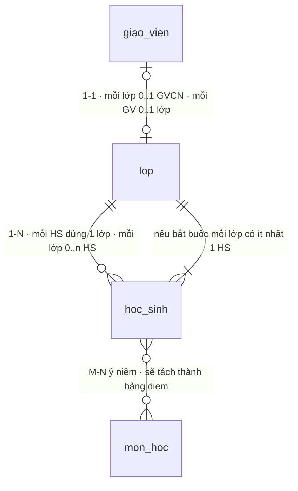
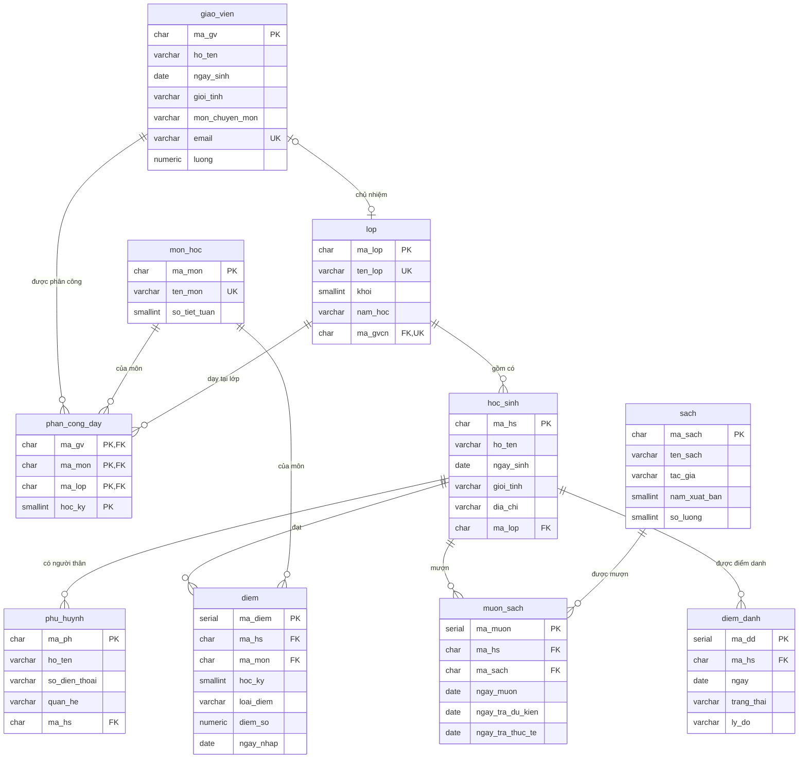

# Bài 11 — Biểu đồ ER — ký hiệu Crow's Foot và vẽ bằng Mermaid

!!! abstract "🎯 Học xong bài này, bạn sẽ"
    - Đọc được **ký hiệu Crow's Foot** — bốn ký hiệu đầu đường và ý nghĩa của **từng nửa**
    - Đối chiếu được Chen ↔ Crow's Foot, và biết Crow's Foot **bỏ mất** những gì
    - Tự viết được một sơ đồ `erDiagram` bằng Mermaid, kể cả phần khai báo cột
    - Đọc được **biểu đồ ER hoàn chỉnh của `truong_hoc`** — sơ đồ tham chiếu cho mọi bài sau
    - Suy ra được ký hiệu đúng của một đường nối chỉ bằng cách soi `NOT NULL` và `UNIQUE`

## 🧠 Câu chuyện mở đầu

Anh lập trình viên ở [Bài 10](10-bieu-do-er-ky-hieu-chen.md) về nhà, mở máy tính lên và định gõ lại tờ giấy vừa vẽ với cô hiệu trưởng.

Rồi anh khựng lại.

Trên giấy, mỗi tập thực thể là một hình chữ nhật với **cả chục elip** treo lủng lẳng xung quanh. `HỌC SINH` có sáu elip, `GIÁO VIÊN` có bảy, `ĐIỂM` có bảy nữa. Cộng lại hơn năm mươi hình. Vẽ tay trên giấy A3 thì còn được, chứ nhét vừa một màn hình thì không.

Mà anh còn cần thứ khác nữa. Sang tuần anh phải viết `CREATE TABLE`. Lúc đó anh cần biết **mỗi bảng có cột gì, cột nào là khoá** — chứ không cần biết `ho_ten` có tách được thành họ và tên hay không.

Anh mở một công cụ vẽ sơ đồ database. Giao diện hiện ra khác hẳn: mỗi bảng là **một hình chữ nhật có danh sách cột bên trong**, không còn elip nào. Và ở hai đầu mỗi đường nối là những ký hiệu lạ — một cái trông đúng như **bàn chân con quạ**.

Cùng một database, hai cách vẽ hoàn toàn khác nhau. Vậy cách vẽ thứ hai này là gì, và nó đánh đổi cái gì để lấy sự gọn gàng đó?

## 📖 Khái niệm & thuật ngữ

### Crow's Foot là gì

**Ký hiệu Crow's Foot** (*Crow's Foot notation*, còn gọi là *IE notation* — Information Engineering) là bộ ký hiệu vẽ biểu đồ ER do Gordon Everest đề xuất năm 1976, được đặt tên theo hình **bàn chân quạ** — ba nhánh toẽ ra — dùng để chỉ phía "nhiều".

Hai khác biệt lớn nhất so với [ký hiệu Chen](10-bieu-do-er-ky-hieu-chen.md):

| | Chen | Crow's Foot |
|---|---|---|
| Thuộc tính vẽ ở đâu | Mỗi thuộc tính một **elip treo ra ngoài** | **Liệt kê bên trong** hình chữ nhật |
| Bản số và tham gia ghi ở đâu | Chữ `1`/`N` trên đường, đường đơn/đôi | **Một ký hiệu ghép** ở mỗi đầu đường |

Đổi lại sự gọn gàng, Crow's Foot **mất** ba thứ mà Chen diễn tả được. Chúng ta sẽ quay lại chỗ mất mát này ở cuối phần khái niệm — đó là lý do khoá học dạy Chen trước.

### Ký hiệu Crow's Foot gồm hai nửa

Đây là ý quan trọng nhất của cả bài, và cũng là chỗ người học hay đọc sai.

Mỗi đầu đường nối là **hai ký tự ghép lại**, và **mỗi ký tự trả lời một câu hỏi khác nhau**:

| Nửa | Nằm ở đâu | Trả lời câu hỏi | Bài đã học |
|---|---|---|---|
| Nửa **trong** | ký tự **sát thực thể** | **Tối đa bao nhiêu?** → bản số | [Bài 8](08-moi-quan-he-va-cardinality.md) |
| Nửa **ngoài** | ký tự **xa thực thể hơn**, phía đường nối | **Tối thiểu bao nhiêu?** → ràng buộc tham gia | [Bài 9](09-participation-va-thuc-the-yeu.md) |

Đúng hai câu hỏi mà [Bài 9](09-participation-va-thuc-the-yeu.md) đã dạy: *giới hạn trên* và *giới hạn dưới*. Crow's Foot chỉ làm một việc: gói cả hai vào một ký hiệu duy nhất.

Xem tận mắt trên một ví dụ. Lấy `giao_vien |o--o| lop` và tách từng ký tự ra:

```
giao_vien  |  o  --  o  |  lop
           │  │      │  │
           │  │      │  └── sát lop     → nửa TRONG  → tối đa 1 lớp
           │  │      └───── xa lop hơn  → nửa NGOÀI  → tối thiểu 0
           │  └──────────── xa GV hơn   → nửa NGOÀI  → tối thiểu 0
           └─────────────── sát GV      → nửa TRONG  → tối đa 1 giáo viên
```

Nhìn theo hình: **ký tự chạm vào hình chữ nhật cho biết "nhiều nhất bao nhiêu"**, ký tự lùi vào trong đường nối cho biết **"ít nhất bao nhiêu"**.

Bảng tra bốn ký hiệu, viết theo cú pháp Mermaid:

Mermaid viết cùng một ký hiệu theo **hai chiều**, tuỳ nó nằm bên trái hay bên phải dấu `--`. Hai cột đầu của bảng dưới đây là **cùng một hình vẽ**, chỉ lật gương:

| Viết ở **bên trái** | Viết ở **bên phải** | Nửa **trong** (sát thực thể) → tối đa | Nửa **ngoài** (phía đường) → tối thiểu | Đọc là |
|---|---|---|---|---|
| <code>&#124;&#124;</code> | <code>&#124;&#124;</code> | vạch <code>&#124;</code> = **tối đa 1** | vạch <code>&#124;</code> = **tối thiểu 1** | **đúng một** |
| <code>&#124;o</code> | <code>o&#124;</code> | vạch <code>&#124;</code> = **tối đa 1** | vòng tròn `o` = **tối thiểu 0** | **không hoặc một** |
| <code>}&#124;</code> | <code>&#124;{</code> | chân quạ `}` `{` = **tối đa nhiều** | vạch <code>&#124;</code> = **tối thiểu 1** | **một hoặc nhiều** |
| `}o` | `o{` | chân quạ `}` `{` = **tối đa nhiều** | vòng tròn `o` = **tối thiểu 0** | **không hoặc nhiều** |

Mẹo gõ cho khỏi sai: **chân quạ luôn toẽ về phía hình chữ nhật**, nên nó là `}` khi nằm bên trái và `{` khi nằm bên phải.

Mẹo nhớ gọn trong hai dòng:

> **Vòng tròn `o` = con số 0.** Thấy vòng tròn là "được phép không có".
>
> **Chân quạ `}` = nhiều.** Thấy chân quạ toẽ ra là "được phép có nhiều".

!!! warning "Ký hiệu ở đầu nào thì mô tả thực thể ở đầu ĐÓ"
    Viết `lop ||--o{ hoc_sinh` thì:

    - Ký hiệu `||` nằm sát `lop` → nói về **`lop`**: *mỗi học sinh thuộc **đúng một** lớp*.
    - Ký hiệu `o{` nằm sát `hoc_sinh` → nói về **`hoc_sinh`**: *mỗi lớp có **không hoặc nhiều** học sinh*.

    Rất nhiều người đọc ngược, rồi kết luận sai hoàn toàn về lược đồ. Cách đọc đúng luôn là: **"mỗi thực thể ở đầu kia ứng với bao nhiêu thực thể ở đầu này?"**

    Trong Mermaid, chân quạ được gõ là `{` khi nằm bên phải và `}` khi nằm bên trái — chỉ là chuyện quay hình cho đúng chiều, ý nghĩa y hệt.

### Bốn tổ hợp cần thuộc lòng

Ghép hai đầu lại thì ra một quan hệ hoàn chỉnh. Bốn tổ hợp hay gặp nhất:

| Cú pháp Mermaid | Tỉ lệ bản số | Đọc thành lời | Có trong `truong_hoc` không |
|---|---|---|---|
| <code>a &#124;&#124;--o{ b</code> | **1:N** | Mỗi `b` có đúng một `a`; mỗi `a` có 0..n `b` | **Có** — `lop ||--o{ hoc_sinh` |
| <code>a &#124;o--o&#124; b</code> | **1:1**, hai phía đều tuỳ chọn | Mỗi `b` có 0..1 `a`; mỗi `a` có 0..1 `b` | **Có** — <code>giao_vien &#124;o--o&#124; lop</code> |
| <code>a &#124;&#124;--&#124;&#124; b</code> | **1:1**, hai phía đều bắt buộc | Mỗi `b` có **đúng một** `a`, và ngược lại | **Không** — xem hộp dưới |
| `a }o--o{ b` | **M:N** | Mỗi `b` có 0..n `a`; mỗi `a` có 0..n `b` | Có ở **mức ý niệm** — `hoc_sinh }o--o{ mon_hoc` |

!!! note "Vì sao `truong_hoc` không có `||--||` nào"
    `||--||` nghĩa là *"không bao giờ được phép tồn tại một bên mà thiếu bên kia"*. Áp vào cặp GIÁO VIÊN — LỚP thì thành: *mọi lớp phải có chủ nhiệm, **và** mọi giáo viên phải chủ nhiệm một lớp*. Trường có 8 giáo viên nhưng chỉ 6 lớp, nên điều đó bất khả thi.

    Thực tế, `||--||` rất hiếm gặp và khó hiện thực: nếu cả hai phía đều bắt buộc thì bạn không chèn nổi dòng đầu tiên vào bảng nào cả — chèn `lop` trước thì thiếu `giao_vien`, chèn `giao_vien` trước thì thiếu `lop`. Muốn làm thật phải dùng ràng buộc hoãn (*deferrable constraint*) mà [Bài 15](15-rang-buoc-toan-ven.md) sẽ nhắc tới.

### Đối chiếu Chen ↔ Crow's Foot

Bảng này để bạn dịch qua lại giữa hai bộ ký hiệu:

| Ý nghĩa | Chen | Crow's Foot |
|---|---|---|
| Tập thực thể mạnh | Hình chữ nhật, thuộc tính treo elip ra ngoài | Hình chữ nhật có danh sách cột bên trong |
| Tập thực thể yếu | Hình chữ nhật **đôi** | **Không có ký hiệu riêng** — vẽ như bảng thường |
| Mối quan hệ | Hình **thoi** giữa hai thực thể | Một **đường nối**, tên ghi trên đường |
| Quan hệ nhận diện | Hình thoi **đôi** | **Không có ký hiệu riêng** |
| Bản số 1 | Chữ `1` trên đường | Nửa trong là vạch <code>&#124;</code> |
| Bản số N / M | Chữ `N` hoặc `M` | Nửa trong là chân quạ `}` |
| Tham gia toàn phần | Đường **đôi** | Nửa ngoài là vạch <code>&#124;</code> |
| Tham gia bộ phận | Đường **đơn** | Nửa ngoài là vòng tròn `o` |
| Thuộc tính khoá | Elip **gạch chân** | Ghi `PK` sau tên cột |
| Thuộc tính đa trị | Elip **đôi** | **Không vẽ được** |
| Thuộc tính dẫn xuất | Elip **nét đứt** | **Không vẽ được** |
| Quan hệ bậc ba | Một hình thoi nối **ba** hình chữ nhật | **Không vẽ được** — phải tách thành bảng trung gian |

### Ba thứ Crow's Foot làm mất

Nhìn ba dòng **"Không vẽ được"** ở cuối bảng trên. Đó chính là cái giá của sự gọn gàng:

1. **Thuộc tính đa trị và dẫn xuất biến mất.** Crow's Foot chỉ liệt kê được những cột **sẽ có thật** trong bảng. Mà `tuoi` (dẫn xuất) thì không lưu, còn số điện thoại đa trị thì đã bị tách sang bảng riêng.
2. **Quan hệ bậc ba biến mất.** `PHÂN CÔNG DẠY` nối ba thực thể; Crow's Foot chỉ vẽ được đường nối **hai** đầu. Nên nó buộc phải xuất hiện dưới dạng một **hình chữ nhật `phan_cong_day`** nối ba đường riêng — tức là đã bị chuyển thành bảng trước khi vẽ.
3. **Thực thể yếu trông y hệt thực thể mạnh.** `phu_huynh` và `diem_danh` trong sơ đồ dưới đây không có dấu hiệu nào cho biết chúng là thực thể yếu; thông tin đó chỉ còn sót lại ở `ON DELETE CASCADE` trong lược đồ.

!!! tip "Rút ra: hai bộ ký hiệu phục vụ hai mục đích khác nhau"
    | | Chen | Crow's Foot |
    |---|---|---|
    | Mức mô tả | **Ý niệm** — thế giới thực | **Logic** — gần với bảng |
    | Dùng để | Nói chuyện với người dùng, ra đề thi | Thiết kế lược đồ, sinh `CREATE TABLE` |
    | Vẽ trước hay sau | **Trước** | **Sau**, khi đã biết sẽ có những bảng nào |

    Vì thế thứ tự học của khoá này là: Chen (Bài 10) → Crow's Foot (bài này) → thuật toán chuyển đổi nối hai thứ đó lại ([Bài 14](14-chuyen-er-sang-bang.md)).

### Cú pháp `erDiagram` của Mermaid

Một sơ đồ Crow's Foot trong Mermaid gồm **hai phần**, viết trong cùng một khối:

**Phần 1 — các đường nối.** Mỗi dòng một quan hệ:

```
<bảng trái> <ký hiệu trái>--<ký hiệu phải> <bảng phải> : "nhãn"
```

Nhãn **bắt buộc** phải có và nên đặt trong ngoặc kép — nhãn tiếng Việt có dấu mà quên ngoặc kép là lỗi cú pháp.

**Phần 2 — cột của từng bảng.** Mỗi bảng một khối `{ }`, mỗi dòng một cột theo thứ tự `kiểu tên khoá`:

```
hoc_sinh {
    char ma_hs PK
    varchar ho_ten
    char ma_lop FK
}
```

Ba nhãn khoá mà Mermaid hiểu:

| Nhãn | Nghĩa | Tiếng Anh |
|---|---|---|
| `PK` | Khoá chính | *primary key* |
| `FK` | Khoá ngoại | *foreign key* |
| `UK` | Khoá duy nhất | *unique key* |

!!! danger "Một cột mang hai vai thì viết `PK, FK` — có dấu phẩy"
    Trong `phan_cong_day`, cột `ma_gv` vừa nằm trong khoá chính vừa là khoá ngoại. Viết đúng là:

    ```
    char ma_gv PK, FK
    ```

    Viết `PK_FK` hoặc `PK FK` (thiếu dấu phẩy) đều làm sơ đồ **không render được**. Đây là lỗi cú pháp hay gặp nhất khi gõ `erDiagram` bằng tay.

### Bảng thuật ngữ

| Tiếng Việt | English | Nghĩa dễ hiểu |
|---|---|---|
| Ký hiệu Crow's Foot | *Crow's Foot notation* | Bộ ký hiệu vẽ ER gọn, bảng có cột bên trong, bản số ghi bằng ký hiệu đầu đường |
| Chân quạ | *crow's foot* | Ba nhánh toẽ ra ở đầu đường, nghĩa là "nhiều" |
| Ký hiệu IE | *Information Engineering notation* | Tên gọi học thuật khác của Crow's Foot |
| Mức logic | *logical level* | Mức đã biết sẽ có bảng nào, cột nào — nhưng chưa chọn hệ quản trị |

## 🖼️ Sơ đồ

### Sơ đồ 1 — Bốn ký hiệu, đọc thành lời

Sơ đồ nhỏ này chỉ để bạn nhìn thấy **hình dạng thật** của bốn ký hiệu trong bảng tra:



Đọc từng đường, đi từ ký hiệu về phía thực thể mà nó chạm vào:

| Đường | Ký hiệu sát `lop` | Ký hiệu sát đầu kia | Đọc thành lời |
|---|---|---|---|
| 1 | <code>&#124;&#124;</code> đúng một | `o{` không hoặc nhiều | Mỗi học sinh có **đúng một** lớp; mỗi lớp có **0 hoặc nhiều** học sinh |
| 2 | <code>o&#124;</code> không hoặc một | <code>&#124;o</code> không hoặc một | Mỗi lớp có **0 hoặc 1** GVCN; mỗi giáo viên chủ nhiệm **0 hoặc 1** lớp |
| 3 | `}o` / `o{` | hai đầu đều "nhiều" | Mỗi học sinh nhiều môn; mỗi môn nhiều học sinh |
| 4 | <code>&#124;&#124;</code> đúng một | <code>&#124;{</code> **một hoặc nhiều** | Giống đường 1, nhưng thêm điều kiện mỗi lớp phải có ít nhất một học sinh |

Đường thứ tư chỉ có ở đây để bạn thấy ký hiệu `|{`. Lược đồ thật **không** ép điều kiện đó — [Bài 9](09-participation-va-thuc-the-yeu.md) đã giải thích: ràng buộc ở phía "nhiều" thì SQL không cưỡng chế được bằng `NOT NULL`.

### Sơ đồ 2 — Biểu đồ ER hoàn chỉnh của `truong_hoc`

Đây là **sơ đồ tham chiếu** của cả khoá học. [Bài 14](14-chuyen-er-sang-bang.md) sẽ chứng minh nó sinh ra từ sơ đồ Chen của Bài 10, và Cấp 2 sẽ còn quay lại nó nhiều lần.



Năm điều đáng chú ý khi đọc sơ đồ này:

1. **Chỉ có duy nhất một đường `|o--o|`** — đường `giao_vien` ↔ `lop`. Đó là **quan hệ 1:1** duy nhất của database, và nó được hiện thực bằng `ma_gvcn FK, UK`. Chính chữ `UK` đó là cái làm nên 1:1.
2. **Mười đường còn lại đều là `||--o{`** — tức 1:N. Đây là loại quan hệ áp đảo trong mọi database thật.
3. **`phan_cong_day` có ba đường chạm vào nó.** Ở sơ đồ Chen (Bài 10) nó là **một hình thoi bậc ba**; ở đây nó đã hoá thành một hình chữ nhật. Crow's Foot không vẽ nổi hình thoi ba nhánh, nên buộc phải làm vậy.
4. **`diem` cũng là một hình chữ nhật, dù ở mức ý niệm nó là quan hệ M:N.** Đường `hoc_sinh }o--o{ mon_hoc` trong Sơ đồ 1 chính là nó **trước khi** bị tách. So hai sơ đồ với nhau là thấy ngay M:N được hiện thực thế nào.
5. **`phu_huynh` và `diem_danh` trông y hệt các bảng khác.** Chúng là **thực thể yếu** (Bài 9), nhưng Crow's Foot không có ký hiệu cho điều đó. Muốn biết, phải mở lược đồ ra xem `ON DELETE CASCADE`.

!!! question "Vì sao `diem` không nối thẳng `hoc_sinh` với `mon_hoc` bằng `}o--o{`?"
    Vẽ như vậy **cũng đúng**, nhưng ở một mức khác. `}o--o{` là cách vẽ ở **mức ý niệm**: nó nói *"có quan hệ nhiều–nhiều"* mà chưa nói hiện thực ra sao.

    Sơ đồ 2 vẽ ở **mức logic** — mức đã quyết định sẽ có những bảng nào. Ở mức đó, M:N **luôn** đã được tách thành bảng trung gian, nên không còn đường `}o--o{` nào cả.

    Mẹo kiểm tra nhanh: một sơ đồ Crow's Foot có kèm danh sách cột mà **vẫn còn** đường `}o--o{` thì sơ đồ đó chưa xong việc — còn ít nhất một bảng chưa được vẽ ra.

## 💻 Thực hành

### Suy ra ký hiệu Crow's Foot từ chính lược đồ

Điều hay nhất của Crow's Foot: **mọi ký hiệu đều đọc được ra từ database**, không cần đoán. Quy tắc gọn trong hai dòng:

| Muốn biết | Nhìn vào | Kết quả |
|---|---|---|
| Nửa **tối thiểu** ở phía cha | cột khoá ngoại có `NOT NULL` không | có → <code>&#124;</code> · không → `o` |
| Nửa **tối đa** ở phía con | cột khoá ngoại có `UNIQUE` không | có → <code>&#124;</code> (1:1) · không → `{` (1:N) |

Câu lệnh sau tự sinh ra bảng đó cho **mọi** khoá ngoại trong database:

```sql
SELECT c.conrelid::regclass AS bang_con,
       a.attname            AS cot_khoa_ngoai,
       c.confrelid::regclass AS bang_cha,
       a.attnotnull         AS bat_buoc,
       EXISTS (SELECT 1
               FROM pg_constraint u
               WHERE u.conrelid = c.conrelid
                 AND u.contype IN ('p', 'u')
                 AND u.conkey = ARRAY[a.attnum]) AS duy_nhat
FROM pg_constraint c
JOIN pg_attribute a
  ON a.attrelid = c.conrelid AND a.attnum = ANY (c.conkey)
WHERE c.contype = 'f'
  AND c.connamespace = 'public'::regnamespace
ORDER BY c.conrelid::regclass::text, a.attname;
```

Kết quả **11 dòng** — đúng bằng số cột khoá ngoại của 10 bảng. Đọc chúng thành ký hiệu:

| Dòng trong kết quả | `bat_buoc` | `duy_nhat` | Ký hiệu Crow's Foot |
|---|---|---|---|
| `diem` / `ma_hs`, `diem` / `ma_mon` | `t` | `f` | <code>&#124;&#124;--o{</code> về phía `diem` |
| `diem_danh` / `ma_hs` | `t` | `f` | <code>hoc_sinh &#124;&#124;--o{ diem_danh</code> |
| `hoc_sinh` / `ma_lop` | `t` | `f` | <code>lop &#124;&#124;--o{ hoc_sinh</code> |
| `lop` / `ma_gvcn` | `f` | **`t`** | <code>giao_vien &#124;o--o&#124; lop</code> |
| `muon_sach` / `ma_hs`, `ma_sach` | `t` | `f` | <code>&#124;&#124;--o{</code> về phía `muon_sach` |
| `phan_cong_day` / ba cột | `t` | `f` | <code>&#124;&#124;--o{</code> về phía `phan_cong_day` |
| `phu_huynh` / `ma_hs` | `t` | `f` | <code>hoc_sinh &#124;&#124;--o{ phu_huynh</code> |

**Đúng một dòng** có `duy_nhat = t`, và đó chính là đường `|o--o|` duy nhất của Sơ đồ 2.

### Xem tận mắt ràng buộc làm nên quan hệ 1:1

```sql
SELECT conname, contype, pg_get_constraintdef(oid) AS dinh_nghia
FROM pg_constraint
WHERE conrelid = 'lop'::regclass
  AND contype IN ('p', 'u', 'f')
ORDER BY contype, conname;
```

Trong kết quả có ba dòng đáng chú ý:

- `lop_pkey` — `PRIMARY KEY (ma_lop)`
- `lop_ma_gvcn_key` — `UNIQUE (ma_gvcn)` ← **đây là chữ `UK` trong sơ đồ**
- `lop_ma_gvcn_fkey` — `FOREIGN KEY (ma_gvcn) REFERENCES giao_vien(ma_gv) ON DELETE SET NULL` ← **đây là chữ `FK`**

Hai ràng buộc riêng biệt, đặt trên **cùng một cột**, và phải có **cả hai** thì mới ra `|o--o|`. Bỏ `lop_ma_gvcn_key` đi thì sơ đồ tụt xuống thành `|o--o{` — mỗi giáo viên chủ nhiệm được nhiều lớp.

### Kiểm chứng bằng dữ liệu: `UNIQUE` đang làm gì

```sql
SELECT count(*)                  AS so_lop,
       count(ma_gvcn)            AS so_lop_co_gvcn,
       count(DISTINCT ma_gvcn)   AS so_gvcn_khac_nhau
FROM lop;
```

Kết quả: `6`, `5`, `5`.

Đọc ra ký hiệu:

- `6` lớp nhưng chỉ `5` lớp có chủ nhiệm → phía `lop` được phép trống → nửa ngoài là **vòng tròn**: `o|`.
- `5` lớp có chủ nhiệm ứng với đúng `5` giáo viên khác nhau → không ai ôm hai lớp → nửa trong là **vạch**: `|`.

Ghép lại: `|o--o|`. Sơ đồ và dữ liệu khớp nhau.

### So sánh với một quan hệ 1:N

```sql
SELECT count(*)                AS so_hoc_sinh,
       count(DISTINCT ma_lop)  AS so_lop_khac_nhau
FROM hoc_sinh;
```

Kết quả: `40` và `6`.

Bốn mươi dòng dồn vào sáu giá trị — nghĩa là có lớp chứa nhiều học sinh. Đó là **chân quạ**. Và vì `ma_lop` là `NOT NULL` nên phía `lop` là vạch. Ghép lại: `lop ||--o{ hoc_sinh`.

### Bảng nào là bảng trung gian

Bảng trung gian có một dấu hiệu rất dễ nhận: **có từ hai khoá ngoại trở lên**.

```sql
SELECT conrelid::regclass AS bang,
       count(*)           AS so_khoa_ngoai
FROM pg_constraint
WHERE contype = 'f'
  AND connamespace = 'public'::regnamespace
GROUP BY 1
HAVING count(*) >= 2
ORDER BY 2 DESC, conrelid::regclass::text;
```

Ba bảng hiện ra: `phan_cong_day` (3 khoá ngoại), `diem` (2) và `muon_sach` (2).

Đúng ba hình chữ nhật mà [Bài 10](10-bieu-do-er-ky-hieu-chen.md) đã nói là **vốn là hình thoi** trong ký hiệu Chen. Crow's Foot buộc chúng phải hiện ra thành bảng — và câu SQL trên tìm lại được chúng chỉ bằng cách đếm khoá ngoại.

## ⚠️ Lỗi thường gặp

!!! warning "Lỗi 1: Đọc ký hiệu ngược đầu"
    Nhìn `lop ||--o{ hoc_sinh` rồi đọc thành *"một lớp có đúng một học sinh"*. Sai hoàn toàn.

    Ký hiệu `||` nằm sát `lop`, nên nó nói về **`lop`**: *mỗi học sinh có đúng một lớp*. Ký hiệu chân quạ nằm sát `hoc_sinh`, nên nó nói về **`hoc_sinh`**: *mỗi lớp có nhiều học sinh*.

    Cách đọc chống sai: đặt ngón tay lên một ký hiệu, rồi hỏi *"ứng với **một** thực thể ở đầu kia, có bao nhiêu thực thể ở đầu **này**?"*

!!! warning "Lỗi 2: Quên nửa 'tối thiểu'"
    Vẽ `lop }|--o{ hoc_sinh` rồi bảo *"xong, 1:N đấy"*. Nhưng `}|` nghĩa là *"một hoặc nhiều lớp cho mỗi học sinh"* — tức là một học sinh học **nhiều lớp cùng lúc**. Chân quạ `}` sát `lop` đã nói "tối đa nhiều" rồi.

    Mỗi ký hiệu có **hai** ký tự và cả hai đều mang nghĩa. Bỏ qua một nửa là mô tả sai lược đồ.

!!! warning "Lỗi 3: Vẽ `}o--o{` rồi vẫn liệt kê cột"
    Một sơ đồ Crow's Foot **có khai báo cột** là sơ đồ ở mức logic, tức là mức đã biết database sẽ có những bảng nào. Ở mức đó, quan hệ M:N phải đã được tách thành bảng trung gian rồi.

    Còn đường `}o--o{` nghĩa là *"tôi chưa quyết định hiện thực ra sao"*. Hai thứ đó không đi cùng nhau được. Cứ để `}o--o{` mà vẫn liệt kê cột thì người đọc sẽ hỏi: *"vậy `diem_so` lưu ở bảng nào?"*

!!! warning "Lỗi 4: Viết `PK_FK` trong `erDiagram`"
    ```
    char ma_gv PK_FK
    ```
    Mermaid không hiểu `PK_FK`, và cả sơ đồ sẽ không hiện ra — chỉ còn một khung báo lỗi đỏ.

    Viết đúng là `PK, FK` — **hai nhãn, ngăn bằng dấu phẩy**.

!!! warning "Lỗi 5: Tưởng Crow's Foot thay thế được Chen"
    Vì Crow's Foot gọn hơn và các công cụ đều dùng nó, rất dễ kết luận *"học Chen làm gì cho mệt"*.

    Nhưng thử vẽ tình huống này bằng Crow's Foot: *"một học sinh có nhiều số điện thoại"*. Bạn sẽ buộc phải tạo ngay một bảng `hoc_sinh_sdt` — tức là đã **quyết định xong cách hiện thực** trước cả khi kịp hỏi cô hiệu trưởng xem có cần lưu gì thêm về số điện thoại đó không.

    Chen cho phép bạn ghi *"đây là thuộc tính đa trị"* rồi **hoãn quyết định** lại. Đó là giá trị của nó, và là lý do [Bài 14](14-chuyen-er-sang-bang.md) tồn tại.

## ✍️ Bài tập

1. Đọc thành lời (theo mẫu *"mỗi ... có ... ; mỗi ... có ..."*) từng đường dưới đây:

    a. `sach ||--o{ muon_sach`
    b. `giao_vien |o--o| lop`
    c. `phong_hoc ||--|{ thiet_bi`
    d. `mon_hoc }o--o{ giao_vien`

2. Trường mở thêm câu lạc bộ. Luật: mỗi học sinh tham gia **tối đa một** câu lạc bộ, có thể không tham gia câu lạc bộ nào; mỗi câu lạc bộ phải có **ít nhất một** thành viên. Viết dòng `erDiagram` đúng cho quan hệ này, và nói xem lược đồ SQL cần những ràng buộc gì.

3. Nhìn Sơ đồ 2 và trả lời: nếu xoá ràng buộc `UNIQUE` trên `lop.ma_gvcn`, ký hiệu của đường `giao_vien` ↔ `lop` đổi thành gì? Câu chuyện đời thực tương ứng là gì?

4. Viết câu SQL đếm xem mỗi bảng trong `truong_hoc` có bao nhiêu **đường nối chạm vào nó** trong Sơ đồ 2 — tức tổng số khoá ngoại **đi ra** cộng số khoá ngoại **trỏ tới**. Bảng nào nhiều nhất?

5. Một bạn vẽ sơ đồ sau cho hệ thống thư viện và nói *"em vẽ theo Crow's Foot"*:

    ```
    hoc_sinh }o--o{ sach : "mượn"
    muon_sach {
        serial ma_muon PK
        date ngay_muon
    }
    ```

    Chỉ ra **hai** lỗi và viết lại cho đúng.

??? success "Đáp án"
    **Câu 1.**

    | | Đọc thành lời |
    |---|---|
    | a | Mỗi lượt mượn ứng với **đúng một** cuốn sách; mỗi cuốn sách có **0 hoặc nhiều** lượt mượn |
    | b | Mỗi lớp có **0 hoặc 1** giáo viên chủ nhiệm; mỗi giáo viên chủ nhiệm **0 hoặc 1** lớp |
    | c | Mỗi thiết bị thuộc **đúng một** phòng học; mỗi phòng học có **ít nhất một** thiết bị |
    | d | Mỗi giáo viên dạy **0 hoặc nhiều** môn; mỗi môn do **0 hoặc nhiều** giáo viên dạy |

    Lưu ý câu c: ký hiệu `|{` (một hoặc nhiều) là chỗ duy nhất trong bốn câu có ràng buộc tham gia **toàn phần ở phía nhiều** — và đó cũng là ràng buộc mà SQL không cưỡng chế nổi bằng `NOT NULL` ([Bài 9](09-participation-va-thuc-the-yeu.md)).

    **Câu 2.**

    ```
    cau_lac_bo ||--|{ hoc_sinh : "có thành viên"
    ```

    Sai! Đọc lại: `||` sát `cau_lac_bo` nghĩa là *mỗi học sinh phải có đúng một câu lạc bộ* — trái với đề bài (được phép không tham gia). Viết đúng là:

    ```
    cau_lac_bo |o--|{ hoc_sinh : "có thành viên"
    ```

    - `|o` sát `cau_lac_bo`: mỗi học sinh có **0 hoặc 1** câu lạc bộ.
    - `|{` sát `hoc_sinh`: mỗi câu lạc bộ có **ít nhất một** học sinh.

    Về lược đồ SQL: thêm cột `hoc_sinh.ma_clb` là khoá ngoại **cho phép `NULL`** (vì `|o`) và **không** có `UNIQUE` (vì nhiều thành viên chung một câu lạc bộ). Còn điều kiện *"mỗi câu lạc bộ ít nhất một thành viên"* thì **không** ép được bằng ràng buộc cột — cần trigger hoặc kiểm tra ở tầng ứng dụng.

    **Câu 3.**
    Đổi từ `giao_vien |o--o| lop` thành `giao_vien |o--o{ lop`.

    Câu chuyện đời thực: **một giáo viên được phép chủ nhiệm nhiều lớp cùng lúc**. Quan hệ tụt từ 1:1 xuống 1:N. Nửa ngoài vẫn là vòng tròn (lớp vẫn được phép chưa có chủ nhiệm), chỉ nửa trong đổi từ vạch sang chân quạ.

    Đây đúng là điều [Bài 8](08-moi-quan-he-va-cardinality.md) đã cảnh báo: **`UNIQUE` là toàn bộ khác biệt giữa 1:1 và 1:N ở mức bảng.**

    **Câu 4.**

    ```sql
    SELECT bang, sum(so_duong) AS so_duong_cham_vao
    FROM (
        SELECT conrelid::regclass::text AS bang, count(*) AS so_duong
        FROM pg_constraint
        WHERE contype = 'f' AND connamespace = 'public'::regnamespace
        GROUP BY 1
        UNION ALL
        SELECT confrelid::regclass::text, count(*)
        FROM pg_constraint
        WHERE contype = 'f' AND connamespace = 'public'::regnamespace
        GROUP BY 1
    ) t
    GROUP BY bang
    ORDER BY 2 DESC, 1;
    ```

    `hoc_sinh` đứng đầu: nó có 1 khoá ngoại đi ra (`ma_lop`) và 4 khoá ngoại trỏ tới (`phu_huynh`, `diem`, `muon_sach`, `diem_danh`) — tổng 5 đường.

    Điều này khớp đúng với Sơ đồ 2: `hoc_sinh` là **trung tâm** của cả biểu đồ. Trong một database thật, bảng có nhiều đường chạm vào nhất thường là bảng quan trọng nhất — và cũng là bảng nguy hiểm nhất khi xoá dòng, điều [Bài 15](15-rang-buoc-toan-ven.md) sẽ bàn.

    **Câu 5.**
    Hai lỗi:

    1. **Trộn hai mức.** Đường `}o--o{` là mức ý niệm (chưa tách M:N), nhưng khối khai báo cột lại là mức logic. Đã vẽ `muon_sach` ra thì phải bỏ đường `}o--o{` đi.
    2. **`muon_sach` không nối vào đâu cả, và thiếu hai khoá ngoại.** Một bảng trung gian mà không có `ma_hs`, `ma_sach` thì không trung gian được gì.

    Viết lại:

    ```
    hoc_sinh ||--o{ muon_sach : "mượn"
    sach ||--o{ muon_sach : "được mượn"
    muon_sach {
        serial ma_muon PK
        char ma_hs FK
        char ma_sach FK
        date ngay_muon
        date ngay_tra_du_kien
        date ngay_tra_thuc_te
    }
    ```

## 🔑 Tóm tắt

1. **Ký hiệu Crow's Foot** vẽ mỗi bảng thành một hình chữ nhật **có danh sách cột bên trong**, và gói bản số cùng ràng buộc tham gia vào **một ký hiệu hai nửa** ở mỗi đầu đường.
2. Nửa **ngoài** trả lời *tối thiểu bao nhiêu* (`o` = 0, `|` = 1); nửa **trong** trả lời *tối đa bao nhiêu* (`|` = 1, `}` = nhiều). Ký hiệu ở đầu nào thì mô tả thực thể ở đầu **đó**.
3. Bốn tổ hợp cần thuộc: `||--o{` là 1:N, `|o--o|` là 1:1 tuỳ chọn, `||--||` là 1:1 bắt buộc (rất hiếm), `}o--o{` là M:N chưa tách.
4. Crow's Foot **mất** ba thứ so với Chen: thuộc tính đa trị, thuộc tính dẫn xuất, và quan hệ bậc từ ba trở lên — nên nó là ký hiệu ở **mức logic**, vẽ **sau** khi đã biết sẽ có bảng nào.
5. Mọi ký hiệu trong Sơ đồ 2 đều đọc ngược lại được từ lược đồ: `NOT NULL` quyết định nửa ngoài, `UNIQUE` quyết định nửa trong — và `truong_hoc` chỉ có **đúng một** đường `|o--o|`, ở cột `lop.ma_gvcn`.

---

⬅️ [Bài 10 — Biểu đồ ER ký hiệu Chen](10-bieu-do-er-ky-hieu-chen.md) · ➡️ [Bài 12 — Bảy loại khoá trong cơ sở dữ liệu](12-bay-loai-khoa.md)
