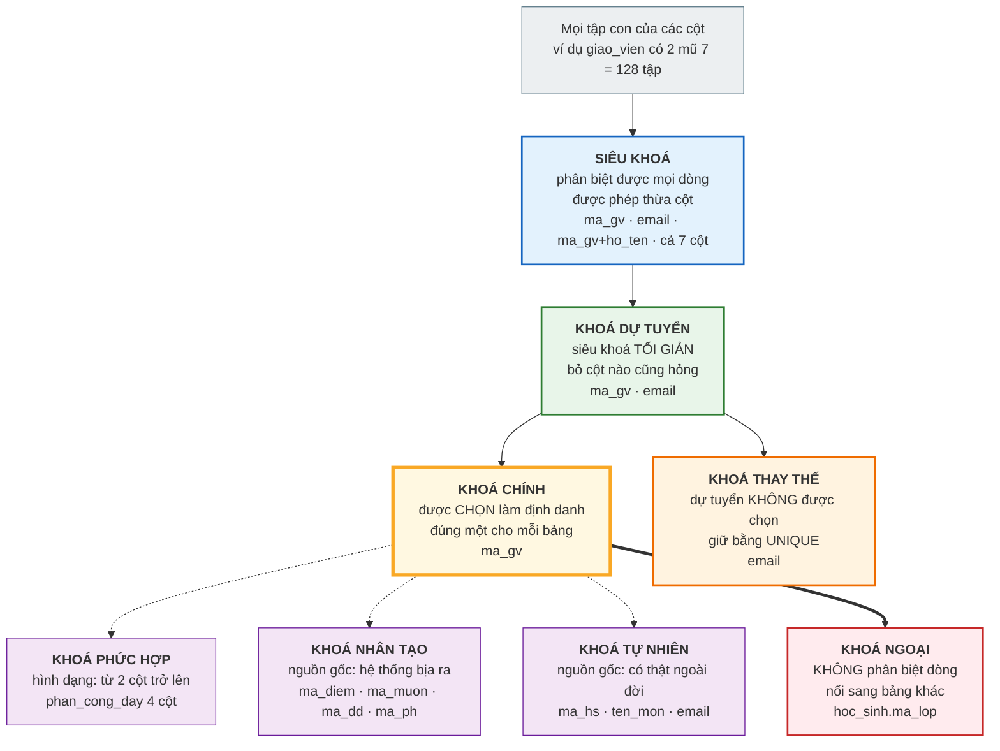
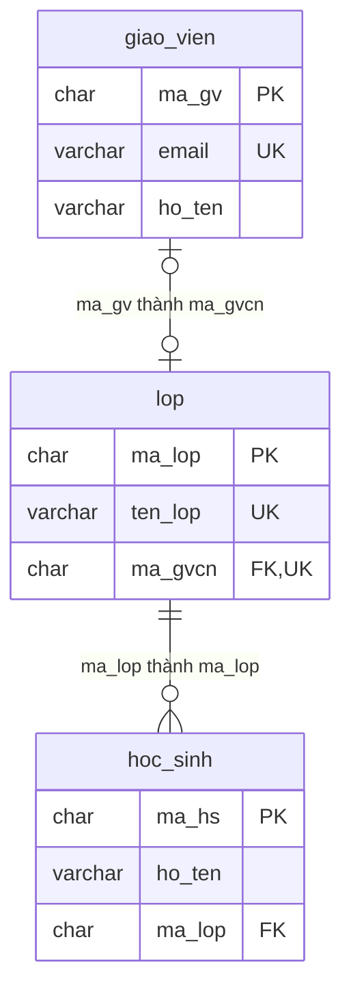

# Bài 12 — Bảy loại khoá trong cơ sở dữ liệu

!!! abstract "🎯 Học xong bài này, bạn sẽ"
    - Gọi đúng tên **bảy loại khoá**: siêu khoá, khoá dự tuyển, khoá chính, khoá thay thế, khoá phức hợp, khoá nhân tạo, khoá ngoại
    - Hiểu quan hệ bao hàm giữa chúng — cái nào là tập con của cái nào
    - Phân biệt **khoá tự nhiên** với **khoá nhân tạo**, và biết khi nào nên chọn cái nào
    - Chứng minh được từng loại khoá bằng một câu SQL chạy trên `truong_hoc`
    - Biết vì sao *"dữ liệu hiện không trùng"* **không** đủ để kết luận một cột là khoá

## 🧠 Câu chuyện mở đầu

Lớp 8A1 có hai bạn cùng tên **Nguyễn Văn An**.

Đầu năm chưa ai để ý. Đến khi cô giáo vào điểm kiểm tra giữa kỳ thì rắc rối nổ ra: cô gọi *"An được 9 điểm"*, và cả hai bạn cùng giơ tay.

Cô thử thêm chi tiết: *"An ngồi bàn ba"*. Vẫn hai bạn — hai bàn ba, hai dãy khác nhau. Cô thử *"An sinh tháng Một"*. Trùng nốt.

Cuối cùng cô mở sổ điểm ra và đọc: *"HS001"*. Chỉ một bạn đứng dậy.

Chiều hôm đó, cô văn thư nói thêm một chuyện thú vị: *"Thật ra mỗi bạn còn một thứ nữa cũng không bao giờ trùng — địa chỉ email nhà trường cấp. Nhưng cô vẫn quen gọi mã học sinh hơn, vì nó ngắn."*

Vậy là có **hai** thứ đều phân biệt được học sinh, nhưng nhà trường chỉ **chọn một** để dùng chính thức. Thứ được chọn gọi là gì, thứ bị bỏ lại gọi là gì? Và nếu gộp *"tên + ngày sinh + địa chỉ"* lại cho chắc ăn thì có gọi là khoá không?

## 📖 Khái niệm & thuật ngữ

### Một định nghĩa gốc, bảy cái tên

Mọi loại khoá đều xoay quanh đúng một ý: **một tập cột đủ sức phân biệt mọi dòng trong bảng**. Bảy cái tên chỉ là bảy góc nhìn khác nhau lên ý đó.

Hai câu hỏi sinh ra toàn bộ bảy loại:

1. *Tập cột này có **đủ** để phân biệt không?* → siêu khoá
2. *Nó có **thừa** cột nào không?* → khoá dự tuyển
3. *Ta **chọn** cái nào làm chính?* → khoá chính, khoá thay thế
4. Ba loại còn lại mô tả **hình dạng** hoặc **nguồn gốc** của khoá: phức hợp (nhiều cột), nhân tạo (do ta tự bịa ra), ngoại (mượn của bảng khác).

### 1. Siêu khoá

**Siêu khoá** (*super key*) là **một tập cột mà không có hai dòng nào trùng nhau trên toàn bộ tập đó**.

Chú ý: định nghĩa **không** yêu cầu tối giản. Thừa cột vẫn là siêu khoá.

Trong `giao_vien`, tất cả những tập sau đều là siêu khoá:

- `{ma_gv}`
- `{email}`
- `{ma_gv, ho_ten}`
- `{ma_gv, ho_ten, email, luong}`
- toàn bộ 7 cột

Lý do rất đơn giản: đã phân biệt được bằng `ma_gv` rồi thì thêm bao nhiêu cột nữa cũng vẫn phân biệt được. **Thêm cột thì khả năng phân biệt chỉ có tăng chứ không giảm.**

### 2. Khoá dự tuyển

**Khoá dự tuyển** (*candidate key*) là **siêu khoá tối giản** — bỏ đi bất kỳ cột nào thì nó mất luôn khả năng phân biệt.

Đây là chỗ chữ *"tối giản"* làm nên tất cả:

| Tập cột | Siêu khoá? | Tối giản? | Kết luận |
|---|---|---|---|
| `{ma_gv}` | Có | Có — bỏ `ma_gv` thì còn tập rỗng | **Khoá dự tuyển** |
| `{email}` | Có | Có | **Khoá dự tuyển** |
| `{ma_gv, ho_ten}` | Có | **Không** — bỏ `ho_ten` vẫn phân biệt được | Chỉ là siêu khoá |
| `{ho_ten}` | **Không** — hai người có thể trùng tên | — | Không phải khoá gì cả |

Một bảng có **ít nhất một** khoá dự tuyển (trường hợp xấu nhất: toàn bộ các cột), và có thể có **nhiều** khoá dự tuyển. Bảng `giao_vien` có hai: `{ma_gv}` và `{email}`.

!!! danger "Dữ liệu không trùng KHÔNG chứng minh được đó là khoá dự tuyển"
    Đây là hiểu lầm nguy hiểm nhất của cả bài.

    Hiện tại 8 giáo viên có 8 cái `ho_ten` khác nhau. Chạy `count(DISTINCT ho_ten)` ra đúng `8`. Vậy `{ho_ten}` có phải khoá dự tuyển không? **Không.**

    Khoá là một **luật về mọi dữ liệu có thể có trong tương lai**, không phải một quan sát về dữ liệu hôm nay. Ngày mai tuyển thêm một cô cũng tên *Lê Thị Mai* là luật vỡ ngay.

    Phép thử đúng gồm hai bước:

    1. **Hỏi nghiệp vụ**: *"Có khi nào hai dòng trùng nhau ở cột này không?"* Nếu câu trả lời là *"về nguyên tắc thì có"* → không phải khoá.
    2. **Xem lược đồ**: có ràng buộc `PRIMARY KEY` hoặc `UNIQUE` trên tập cột đó không? Nếu không có, database **không hề** bảo vệ điều bạn đang tin.

    Phần Thực hành sẽ chạy đúng hai bước này.

### 3. Khoá chính

**Khoá chính** (*primary key*) là **khoá dự tuyển được người thiết kế chọn** làm định danh chính thức của bảng.

Mỗi bảng có **đúng một** khoá chính. Nó có hai đặc quyền mà các khoá dự tuyển khác không có:

1. **Không bao giờ được `NULL`** — đây là **toàn vẹn thực thể**, và [Bài 15](15-rang-buoc-toan-ven.md) sẽ nói kỹ.
2. **Là thứ mà khoá ngoại của bảng khác trỏ vào** — nên đổi nó là đụng tới cả database.

Tiêu chí chọn, theo thứ tự quan trọng:

| Tiêu chí | Vì sao |
|---|---|
| **Không bao giờ đổi** | Đổi khoá chính là phải đổi theo mọi khoá ngoại đang trỏ vào |
| **Không bao giờ `NULL`** | Bắt buộc theo định nghĩa |
| **Ngắn gọn** | Nó bị nhân bản sang mọi bảng con, và được lập chỉ mục |
| **Vô nghĩa càng tốt** | Thứ mang ý nghĩa đời thực thì đời thực đổi lúc nào không hay |

`giao_vien` chọn `ma_gv` chứ không chọn `email`: `CHAR(4)` ngắn hơn `VARCHAR(80)` rất nhiều, và email thì đổi được (cô đổi tên, đổi nhà cung cấp mail), còn mã giáo viên thì không.

### 4. Khoá thay thế

**Khoá thay thế** (*alternate key*) là **khoá dự tuyển không được chọn làm khoá chính**.

Công thức dễ nhớ:

> khoá dự tuyển − khoá chính = khoá thay thế

Nó **không** bị vứt đi. Trong SQL, khoá thay thế được giữ bằng ràng buộc `UNIQUE`. Trong `truong_hoc` có ba khoá thay thế:

| Bảng | Khoá chính | Khoá thay thế | Ràng buộc giữ nó |
|---|---|---|---|
| `giao_vien` | `ma_gv` | `email` | `giao_vien_email_key` |
| `lop` | `ma_lop` | `ten_lop` | `lop_ten_lop_key` |
| `mon_hoc` | `ma_mon` | `ten_mon` | `mon_hoc_ten_mon_key` |

!!! warning "Bỏ `UNIQUE` là vứt mất khoá thay thế"
    Nhiều người nghĩ *"đã có khoá chính rồi, `UNIQUE` kia thừa"*. Không thừa chút nào.

    Không có `giao_vien_email_key` thì hai giáo viên hoàn toàn có thể dùng chung một email — và hệ thống gửi thông báo sẽ gửi nhầm người. Khoá chính chỉ bảo vệ **một** cách phân biệt; những cách phân biệt còn lại phải tự khai báo lấy.

    Lưu ý cột `lop.ma_gvcn` cũng có `UNIQUE` (`lop_ma_gvcn_key`) nhưng **không phải** khoá thay thế — nó cho phép `NULL`, và mục đích của nó là ép quan hệ **1:1** ([Bài 8](08-moi-quan-he-va-cardinality.md)), chứ không phải để định danh dòng.

### 5. Khoá phức hợp

**Khoá phức hợp** (*composite key*) là khoá gồm **từ hai cột trở lên**.

Nó không phải một loại riêng biệt nằm ngoài bốn loại trên — nó mô tả **hình dạng**. Một khoá chính có thể đồng thời là khoá phức hợp.

Ví dụ trung tâm: bảng `phan_cong_day` có khoá chính gồm **bốn** cột `(ma_gv, ma_mon, ma_lop, hoc_ky)`, đúng như [Bài 8](08-moi-quan-he-va-cardinality.md) đã báo trước khi phân tích mối quan hệ bậc ba.

Vì sao phải cả bốn? Thử bỏ từng cột:

| Bỏ cột nào | Hậu quả |
|---|---|
| Bỏ `hoc_ky` | Cô Lan dạy Toán cho 8A1 **cả hai học kỳ** → hai dòng trùng nhau |
| Bỏ `ma_lop` | Cô Lan dạy Toán cho **nhiều lớp** → trùng |
| Bỏ `ma_mon` | Thầy Khoa dạy nhiều môn thì trùng |
| Bỏ `ma_gv` | Một lớp học một môn do nhiều giáo viên dạy thì trùng |

Bỏ cột nào cũng hỏng → khoá này **tối giản** → nó là một khoá dự tuyển, và được chọn làm khoá chính.

!!! tip "Khoá phức hợp khác 'nhiều ràng buộc UNIQUE'"
    `UNIQUE (ma_hs, ngay)` của `diem_danh` nghĩa là **cặp** không được trùng. Một học sinh xuất hiện nhiều lần được, một ngày xuất hiện nhiều lần được — chỉ cặp là không.

    Còn viết `UNIQUE (ma_hs)` và `UNIQUE (ngay)` riêng lẻ thì nghĩa hoàn toàn khác: mỗi học sinh chỉ được điểm danh **một lần duy nhất trong đời**. Sai hẳn.

### 6. Khoá nhân tạo — và khoá tự nhiên

Hai khái niệm này luôn đi thành cặp:

**Khoá tự nhiên** (*natural key*) là khoá được làm từ **dữ liệu có thật ngoài đời**, thứ tồn tại độc lập với database: số căn cước, mã học sinh nhà trường cấp, tên môn học, mã ISBN của sách.

**Khoá nhân tạo** (*surrogate key*) là khoá **không mang ý nghĩa nghiệp vụ nào** — nó chỉ tồn tại để định danh dòng, và người dùng cuối không bao giờ cần đọc tới nó: cột `SERIAL`, `UUID`, hay một dãy mã do người thiết kế tự đặt.

Chú ý: thuộc tính định nghĩa là **không mang ý nghĩa**, chứ không phải *"ai sinh ra nó"*. Một mã do database tự tăng và một mã do người nhập gõ tay đều là khoá nhân tạo, miễn là chúng không mô tả gì về thực thể ngoài đời.

| | Khoá tự nhiên | Khoá nhân tạo |
|---|---|---|
| Nguồn gốc | Có sẵn ngoài đời | Do hệ thống hoặc người thiết kế bịa ra |
| Ví dụ trong `truong_hoc` | `ma_hs`, `ma_gv`, `ten_mon`, `email` | `ma_diem`, `ma_muon`, `ma_dd`, `ma_ph` |
| Người dùng có đọc được không | Có — *"HS001"* có nghĩa với cô văn thư | Không — *"điểm số 137"* chẳng nói lên gì |
| Có nguy cơ phải đổi không | **Có** — đời thực thay đổi | Không bao giờ |
| Khi nào nên dùng | Khi có sẵn một định danh ổn định, ngắn | Khi không có, hoặc khoá tự nhiên quá dài / hay đổi |

Bốn khoá nhân tạo của `truong_hoc`, và lý do từng cái:

| Cột | Bảng | Vì sao phải nhân tạo |
|---|---|---|
| `ma_diem` | `diem` | Một con điểm ngoài đời không có "mã" nào cả |
| `ma_muon` | `muon_sach` | Một lượt mượn cũng vậy |
| `ma_dd` | `diem_danh` | Một buổi điểm danh cũng vậy |
| `ma_ph` | `phu_huynh` | Khoá bộ phận `quan_he` **không hợp lệ** — [Bài 9](09-participation-va-thuc-the-yeu.md) đã chứng minh bằng dữ liệu |

Chú ý `ma_ph`: nó **không** phải cột `SERIAL`, mà là dãy `PH001`–`PH045` do người thiết kế tự đặt. Nó vẫn là khoá nhân tạo, vì `PH001` không mô tả gì về con người ấy cả.

!!! danger "Khoá nhân tạo KHÔNG phải thuộc tính trong biểu đồ ER"
    `ma_ph` và `ma_dd` là hai cột **được sinh ra ở bước chuyển ER sang bảng** ([Bài 14](14-chuyen-er-sang-bang.md) Bước 2), không phải đặc điểm có thật của người phụ huynh hay của một buổi điểm danh.

    Đây là lý do [Bài 9](09-participation-va-thuc-the-yeu.md) vẫn gọi PHỤ HUYNH và BUỔI ĐIỂM DANH là **thực thể yếu**, dù bảng của chúng có khoá chính riêng. Hai mức khác nhau:

    | Mức | Câu hỏi | PHỤ HUYNH |
    |---|---|---|
    | **Ý niệm** (biểu đồ ER) | Có thuộc tính khoá **tự nhiên** không? | Không → **thực thể yếu** |
    | **Bảng** (sau chuyển đổi) | Bảng có cột khoá chính không? | Có — `ma_ph`, một khoá **nhân tạo** |

    Ngược lại, `ma_hs` và `ma_gv` **là** thuộc tính trong biểu đồ ER, vì nhà trường cấp mã đó cho từng người ở ngoài đời — chúng là **khoá tự nhiên**.

!!! question "Bốn khoá nhân tạo, nhưng chỉ MỘT bảng có khoá thay thế"
    Cả bốn cột trên đều là khoá nhân tạo. Nhưng chỉ `diem_danh` **còn có thêm** một khoá tự nhiên hợp lệ song song — cặp `(ma_hs, ngay)` — và lược đồ giữ nó bằng `UNIQUE (ma_hs, ngay)`.

    Ba bảng kia **không có** khoá tự nhiên nào hợp lệ, nên không có ràng buộc `UNIQUE` nào tương ứng, và đó là điều **đúng** chứ không phải thiếu sót.

    Nói theo ngôn ngữ của bài này: `(ma_hs, ngay)` là một **khoá thay thế** của `diem_danh`; còn `phu_huynh`, `muon_sach`, `diem` không có khoá thay thế nào cả.

    Phần Thực hành mục 6 sẽ dựng bảng so sánh đầy đủ bốn trường hợp, và chỉ ra vì sao `diem` rất dễ bị xếp nhầm.

### 7. Khoá ngoại

**Khoá ngoại** — thuật ngữ đã gặp lần đầu ở [Bài 2](../cap-0-nhap-mon/02-tu-so-giay-den-excel.md) — là **một hoặc nhiều cột trong bảng này, mang giá trị của khoá chính bảng kia**, để nối hai bảng lại với nhau.

Nó khác hẳn sáu loại trên ở một điểm căn bản: **sáu loại kia nói về việc phân biệt các dòng trong CÙNG một bảng; khoá ngoại nói về mối liên hệ GIỮA hai bảng.**

Cột `hoc_sinh.ma_lop` là khoá ngoại trỏ về `lop.ma_lop`. Nó **không** phân biệt các học sinh — bốn mươi học sinh chỉ có sáu giá trị `ma_lop`.

Ba điều database bảo đảm nhờ khoá ngoại:

1. Mọi giá trị ghi vào `hoc_sinh.ma_lop` **phải có thật** trong `lop`.
2. Không xoá được một dòng `lop` khi còn học sinh trỏ vào (trừ khi khai `CASCADE`).
3. Đây chính là **toàn vẹn tham chiếu** — chủ đề chính của [Bài 15](15-rang-buoc-toan-ven.md).

### Bảng thuật ngữ

| Tiếng Việt | English | Nghĩa dễ hiểu |
|---|---|---|
| Siêu khoá | *super key* | Tập cột phân biệt được mọi dòng, được phép thừa cột |
| Khoá dự tuyển | *candidate key* | Siêu khoá tối giản — bỏ cột nào cũng hỏng |
| Khoá chính | *primary key* | Khoá dự tuyển được chọn làm định danh chính thức |
| Khoá thay thế | *alternate key* | Khoá dự tuyển không được chọn, giữ bằng `UNIQUE` |
| Khoá phức hợp | *composite key* | Khoá gồm từ hai cột trở lên |
| Khoá tự nhiên | *natural key* | Khoá làm từ dữ liệu có thật ngoài đời, **mang ý nghĩa nghiệp vụ** |
| Khoá nhân tạo | *surrogate key* | Khoá **không mang ý nghĩa nghiệp vụ**, chỉ tồn tại để định danh dòng |
| Khoá ngoại | *foreign key* | Cột mang giá trị khoá chính của bảng khác |

## 🖼️ Sơ đồ

### Sơ đồ 1 — Quan hệ bao hàm giữa các loại khoá

Bốn loại đầu tiên **lồng vào nhau** như những vòng tròn đồng tâm. Ba loại còn lại mô tả hình dạng hoặc nguồn gốc, nên nằm bên cạnh:



Đọc sơ đồ theo ba tầng:

| Tầng | Câu hỏi | Kết quả |
|---|---|---|
| Xám → xanh | *Có phân biệt được mọi dòng không?* | Lọc ra **siêu khoá** |
| Xanh → lục | *Có thừa cột nào không?* | Lọc ra **khoá dự tuyển** |
| Lục → vàng/cam | *Ta chọn cái nào?* | Chia thành **khoá chính** và **khoá thay thế** |

Ba ô tím không nằm trong chuỗi lọc — chúng chỉ mô tả *"khoá này gồm mấy cột"* và *"khoá này từ đâu ra"*. Ô đỏ `KHOÁ NGOẠI` thì thuộc một câu chuyện khác hẳn: mũi tên đậm nghĩa là *"khoá chính của bảng này được đem sang bảng khác làm khoá ngoại"*.

### Sơ đồ 2 — Khoá chính đi vào bảng khác thành khoá ngoại



Ba điều đọc ra từ sơ đồ này:

- `ma_gv` là **khoá chính** ở `giao_vien`, nhưng khi sang `lop` nó đổi tên thành `ma_gvcn` và đóng vai **khoá ngoại**. Cùng một giá trị, hai vai trò khác nhau.
- `email` và `ten_lop` đeo nhãn `UK` — đó là **khoá thay thế**.
- `ma_gvcn` đeo **cả hai** nhãn `FK, UK`. Chữ `FK` là khoá ngoại; chữ `UK` ở đây **không** phải khoá thay thế mà là thứ ép quan hệ 1:1.

## 💻 Thực hành

### 1. Siêu khoá — thừa cột vẫn là khoá

```sql
SELECT count(*)                                        AS so_dong,
       count(DISTINCT ma_gv)                           AS chi_ma_gv,
       count(DISTINCT (ma_gv, ho_ten))                 AS ma_gv_va_ho_ten,
       count(DISTINCT (ma_gv, ho_ten, email, luong))   AS bon_cot
FROM giao_vien;
```

Kết quả: `8`, `8`, `8`, `8`.

Cả bốn con số bằng nhau và bằng số dòng. Đó chính là **định nghĩa siêu khoá** viết bằng SQL: *số tổ hợp khác nhau = số dòng*.

Thêm cột vào một siêu khoá thì nó vẫn là siêu khoá. Nên số lượng siêu khoá của `giao_vien` rất lớn — mọi tập cột có chứa `ma_gv` đều là siêu khoá, tức là `2⁶ = 64` tập, cộng thêm các tập chứa `email`.

### 2. Khoá dự tuyển — tối giản mới được tính

`{ma_gv}` là khoá dự tuyển vì bỏ đi thì chỉ còn tập rỗng. `{email}` cũng vậy:

```sql
SELECT count(*)              AS so_dong,
       count(DISTINCT email) AS so_email_khac_nhau
FROM giao_vien;
```

Kết quả: `8` và `8`. Một siêu khoá một cột thì đương nhiên tối giản → **khoá dự tuyển**.

Còn `{ma_gv, ho_ten}` thì **không** tối giản, vì bỏ `ho_ten` đi vẫn phân biệt được (thí nghiệm 1 đã chứng minh: `chi_ma_gv = 8`). Nó chỉ là siêu khoá.

Bây giờ tới phần quan trọng nhất — `{ho_ten}` thì sao?

```sql
SELECT count(*)               AS so_dong,
       count(DISTINCT ho_ten) AS so_ho_ten_khac_nhau
FROM giao_vien;
```

Kết quả: `8` và `8`. Dữ liệu **hiện tại** không trùng!

Nhưng `{ho_ten}` **không phải** khoá dự tuyển. Bằng chứng nằm ở lược đồ, không nằm ở dữ liệu:

```sql
SELECT conname, contype, pg_get_constraintdef(oid) AS dinh_nghia
FROM pg_constraint
WHERE conrelid = 'giao_vien'::regclass
  AND contype IN ('p', 'u')
ORDER BY contype;
```

Đúng **hai** dòng: `giao_vien_pkey` (`PRIMARY KEY (ma_gv)`) và `giao_vien_email_key` (`UNIQUE (email)`).

Không có dòng nào cho `ho_ten`. Nghĩa là database **không hề hứa** rằng `ho_ten` không trùng — và câu chuyện hai bạn Nguyễn Văn An ở đầu bài cho thấy nó trùng thật.

!!! tip "Quy tắc vàng"
    **Khoá dự tuyển được xác định bằng luật nghiệp vụ, rồi được database cưỡng chế bằng ràng buộc.** Truy vấn `count(DISTINCT ...)` chỉ dùng để **phát hiện** một khoá đã bị vi phạm, chứ không bao giờ dùng để **chứng minh** một khoá là đúng.

### 3. Khoá chính — cái được chọn

```sql
SELECT c.conrelid::regclass AS bang,
       c.conname            AS ten_rang_buoc,
       string_agg(a.attname, ', ' ORDER BY a.attnum) AS cac_cot
FROM pg_constraint c
JOIN pg_attribute a
  ON a.attrelid = c.conrelid AND a.attnum = ANY (c.conkey)
WHERE c.contype = 'p'
  AND c.conrelid::regclass::text IN
      ('giao_vien', 'lop', 'hoc_sinh', 'phu_huynh', 'mon_hoc',
       'phan_cong_day', 'diem', 'sach', 'muon_sach', 'diem_danh')
GROUP BY 1, 2
ORDER BY c.conrelid::regclass::text;
```

Đúng **10 dòng** — mỗi bảng đúng một khoá chính, không hơn không kém. Chín bảng có khoá chính một cột; riêng `phan_cong_day` có bốn cột.

Và khoá chính không bao giờ `NULL` được, kể cả khi bạn không viết `NOT NULL`:

```sql
SELECT column_name, is_nullable
FROM information_schema.columns
WHERE table_schema = 'public' AND table_name = 'giao_vien' AND column_name = 'ma_gv';
```

Kết quả: `ma_gv` | `NO`. Lược đồ `dataset/02-chuan-hoa.sql` chỉ viết `ma_gv CHAR(4) PRIMARY KEY` — chữ `NOT NULL` là do PostgreSQL tự thêm, vì đó là **toàn vẹn thực thể** ([Bài 15](15-rang-buoc-toan-ven.md)).

### 4. Khoá thay thế — cái không được chọn

```sql
SELECT conrelid::regclass AS bang,
       conname            AS ten_rang_buoc,
       pg_get_constraintdef(oid) AS dinh_nghia
FROM pg_constraint
WHERE contype = 'u'
  AND connamespace = 'public'::regnamespace
ORDER BY conrelid::regclass::text, conname;
```

Đúng **năm** dòng:

| Bảng | Ràng buộc | Định nghĩa | Có phải khoá thay thế không |
|---|---|---|---|
| `diem_danh` | `diem_danh_ma_hs_ngay_key` | `UNIQUE (ma_hs, ngay)` | **Có** — và là khoá thay thế **phức hợp** |
| `giao_vien` | `giao_vien_email_key` | `UNIQUE (email)` | **Có** |
| `lop` | `lop_ma_gvcn_key` | `UNIQUE (ma_gvcn)` | **Không** — ép quan hệ 1:1, và cho phép `NULL` |
| `lop` | `lop_ten_lop_key` | `UNIQUE (ten_lop)` | **Có** |
| `mon_hoc` | `mon_hoc_ten_mon_key` | `UNIQUE (ten_mon)` | **Có** |

Bây giờ thử vi phạm khoá thay thế `email`:

<!-- sql:co-y-loi -->
```sql
INSERT INTO giao_vien (ma_gv, ho_ten, ngay_sinh, gioi_tinh, mon_chuyen_mon, email, luong)
VALUES ('GV99', 'Người Trùng Email', '1990-01-01', 'Nam', 'Toán',
        'lan.nt@thcs.edu.vn', 10000000);
```

PostgreSQL 16 từ chối:

```
ERROR:  duplicate key value violates unique constraint "giao_vien_email_key"
DETAIL:  Key (email)=(lan.nt@thcs.edu.vn) already exists.
```

Đọc kỹ thông báo: nó gọi đích danh **tên ràng buộc** và **giá trị gây trùng**. Đây là cách nhanh nhất để biết mình vừa vi phạm khoá nào.

### 5. Khoá phức hợp — bốn cột của `phan_cong_day`

```sql
SELECT a.attname AS cot, a.attnum AS thu_tu
FROM pg_constraint c
JOIN pg_attribute a
  ON a.attrelid = c.conrelid AND a.attnum = ANY (c.conkey)
WHERE c.conrelid = 'phan_cong_day'::regclass AND c.contype = 'p'
ORDER BY a.attnum;
```

Bốn dòng: `ma_gv`, `ma_mon`, `ma_lop`, `hoc_ky`.

Thử bỏ từng cột ra xem dữ liệu có sinh trùng lặp không:

```sql
SELECT 'bỏ hoc_ky' AS bo_cot, count(*) AS so_to_hop_bi_trung
FROM (SELECT ma_gv, ma_mon, ma_lop FROM phan_cong_day
      GROUP BY 1, 2, 3 HAVING count(*) > 1) t
UNION ALL
SELECT 'bỏ ma_lop', count(*)
FROM (SELECT ma_gv, ma_mon, hoc_ky FROM phan_cong_day
      GROUP BY 1, 2, 3 HAVING count(*) > 1) t
UNION ALL
SELECT 'bỏ ma_mon', count(*)
FROM (SELECT ma_gv, ma_lop, hoc_ky FROM phan_cong_day
      GROUP BY 1, 2, 3 HAVING count(*) > 1) t
UNION ALL
SELECT 'bỏ ma_gv', count(*)
FROM (SELECT ma_mon, ma_lop, hoc_ky FROM phan_cong_day
      GROUP BY 1, 2, 3 HAVING count(*) > 1) t;
```

Kết quả rất đáng suy nghĩ:

| Bỏ cột | Số tổ hợp bị trùng | Đọc ra |
|---|---|---|
| `hoc_ky` | `32` | Bỏ là trùng ngay → cột này **chắc chắn** cần |
| `ma_lop` | `16` | Bỏ là trùng ngay → cột này **chắc chắn** cần |
| `ma_mon` | **`0`** | Dữ liệu hiện tại **không** chứng minh được gì |
| `ma_gv` | **`0`** | Dữ liệu hiện tại **không** chứng minh được gì |

!!! danger "Hai dòng bằng 0 là bài học quan trọng nhất của mục này"
    Vì sao bỏ `ma_mon` mà không trùng? Vì trong dữ liệu mẫu, **mỗi giáo viên chỉ dạy đúng môn chuyên môn của mình** — biết `ma_gv` là suy ra được `ma_mon`. Tương tự ở chiều ngược lại.

    Nhưng đó là **sự trùng hợp của dữ liệu hôm nay**, không phải luật. Ngày mai thầy Khoa (Tin học) được phân dạy thêm Toán cho 8A1 học kỳ 1, thì hai dòng `(GV08, MH09, L01, 1)` và `(GV08, MH01, L01, 1)` sẽ trùng nhau ngay nếu thiếu `ma_mon`.

    Đúng như **Quy tắc vàng** ở mục 2: dữ liệu chỉ **phát hiện** được vi phạm, chứ không **chứng minh** được khoá. Kết luận *"bốn cột này tối giản"* đến từ **luật nghiệp vụ** — *một giáo viên có thể dạy nhiều môn, một môn có thể do nhiều giáo viên dạy* — chứ không đến từ con số `0` ở trên.

Với luật nghiệp vụ đó, bỏ cột nào cũng hỏng → khoá này tối giản → nó là **khoá dự tuyển**, và đã được chọn làm **khoá chính phức hợp**.

### 6. Khoá nhân tạo — cột `SERIAL`

Cách nhận ra khoá nhân tạo kiểu `SERIAL` trong PostgreSQL: cột đó có giá trị mặc định gọi `nextval`.

```sql
SELECT table_name, column_name, data_type, column_default
FROM information_schema.columns
WHERE table_schema = 'public'
  AND column_default LIKE 'nextval%'
  AND table_name IN ('diem', 'muon_sach', 'diem_danh')
ORDER BY table_name;
```

Ba dòng: `diem.ma_diem`, `diem_danh.ma_dd`, `muon_sach.ma_muon`. Cả ba đều là `integer` với mặc định `nextval('...')` — nghĩa là **giá trị do database sinh ra**, không do người nhập.

Còn `ma_ph` thì khác: nó là khoá nhân tạo nhưng được sinh bằng tay theo mẫu `PH001`, nên không có `nextval`:

```sql
SELECT count(*) AS so_dong, count(DISTINCT ma_ph) AS so_ma_khac_nhau
FROM phu_huynh;
```

Kết quả `45` và `45`.

Bây giờ tới một **câu hỏi bẫy**. Bảng `diem` dùng khoá nhân tạo `ma_diem`. Vậy nó còn khoá tự nhiên nào nữa không?

```sql
SELECT count(*)                                             AS so_dong,
       count(DISTINCT ma_diem)                              AS theo_ma_diem,
       count(DISTINCT (ma_hs, ma_mon, hoc_ky, loai_diem))   AS theo_bon_cot
FROM diem;
```

Kết quả: `480`, `480`, `480`.

Nhìn con số thì bốn cột kia cũng phân biệt được mọi dòng. Rất dễ kết luận: *"vậy `(ma_hs, ma_mon, hoc_ky, loai_diem)` là khoá tự nhiên của `diem`, và lược đồ đã quên đặt `UNIQUE` lên nó."*

**Kết luận đó sai** — và nó sai vì đúng cái lỗi mà Quy tắc vàng ở mục 2 vừa cảnh báo.

!!! danger "Đây là bẫy Quy tắc vàng, lần này giăng trên một bảng thật"
    Hãy hỏi câu hỏi **nghiệp vụ** thay vì nhìn con số: *"Một học sinh có thể có hai con điểm cùng môn, cùng học kỳ, cùng loại không?"*

    Mở lược đồ ra xem miền giá trị của `loai_diem`:

    ```
    loai_diem VARCHAR(10) NOT NULL CHECK (loai_diem IN ('15 phút', '1 tiết', 'Học kỳ'))
    ```

    Có `'15 phút'`. Mà ở trường Việt Nam, một học sinh có **nhiều** bài kiểm tra 15 phút môn Toán trong một học kỳ là chuyện hoàn toàn bình thường. Vậy câu trả lời là **CÓ** — và tổ hợp bốn cột kia **không phải** khoá.

    Thế tại sao `count(DISTINCT ...)` lại ra đúng `480`?

Chạy câu này là rõ:

```sql
SELECT loai_diem, count(*) AS so_dong
FROM diem
GROUP BY loai_diem
ORDER BY loai_diem;
```

Chỉ **hai** dòng: `1 tiết` (`120`) và `Học kỳ` (`360`). Dữ liệu mẫu **không có con điểm 15 phút nào**.

Con số `480 = 480` chỉ là sự trùng hợp của bộ dữ liệu mẫu, không phải một luật. Đúng như Quy tắc vàng nói: **dữ liệu không chứng minh được khoá.**

### Câu hỏi đúng: bảng này CÓ khoá tự nhiên hợp lệ không?

Với mỗi bảng dùng khoá nhân tạo, câu hỏi cần đặt **không** phải *"ai đó có quên `UNIQUE` không?"* mà là:

> **Ở mức nghiệp vụ, có tồn tại một tổ hợp cột nào KHÔNG BAO GIỜ được phép trùng không?**

Nếu **có** thì phải giữ nó bằng `UNIQUE`. Nếu **không** thì khoá nhân tạo đứng một mình là đúng, và việc thiếu `UNIQUE` **không** phải thiếu sót.

Bốn bảng dùng khoá nhân tạo của `truong_hoc`, bốn câu trả lời khác nhau:

| Bảng | Có khoá tự nhiên hợp lệ? | Lý do **nghiệp vụ** | Lược đồ làm gì | Đánh giá |
|---|---|---|---|---|
| `diem_danh` | **Có** — `(ma_hs, ngay)` | Một học sinh mỗi ngày chỉ điểm danh một lần | `ma_dd` + **giữ** `UNIQUE (ma_hs, ngay)` | Đúng |
| `phu_huynh` | **Không** | `HS029` có hai người cùng ghi `Bố` — [Bài 9](09-participation-va-thuc-the-yeu.md) đã chứng minh | `ma_ph`, không có `UNIQUE` | Đúng |
| `muon_sach` | **Không** | Mượn lại cùng một cuốn sách nhiều lần là bình thường | `ma_muon`, không có `UNIQUE` | Đúng |
| `diem` | **Không** | Nhiều bài 15 phút cùng môn cùng học kỳ là bình thường | `ma_diem`, không có `UNIQUE` | Đúng |

Ba bảng dưới cùng **không** thiếu sót gì cả — chúng đúng, vì đơn giản là **không có gì để giữ**. Chỉ `diem_danh` có khoá tự nhiên hợp lệ, và lược đồ giữ nó thật.

!!! danger "ĐỪNG thêm `UNIQUE (ma_hs, ma_mon, hoc_ky, loai_diem)` vào bảng `diem`"
    Đây là cái bẫy nguy hiểm nhất của cả bài, vì câu lệnh sau **sẽ chạy thành công** trên dữ liệu hiện tại:

    <!-- sql:khong-chay -->
    ```sql
    ALTER TABLE diem ADD CONSTRAINT diem_khoa_tu_nhien
        UNIQUE (ma_hs, ma_mon, hoc_ky, loai_diem);
    ```

    Chạy được, không báo lỗi gì — vì dữ liệu mẫu chưa có điểm 15 phút. Nhưng từ giây phút đó, database **vĩnh viễn từ chối** con điểm 15 phút thứ hai của một học sinh, trong khi ràng buộc `CHECK` vẫn cho phép giá trị `'15 phút'` tồn tại. Lược đồ tự mâu thuẫn với chính nó.

    Bài học: **một ràng buộc chạy được không có nghĩa là nó đúng.** Trước khi thêm bất kỳ `UNIQUE` nào, hãy hỏi câu hỏi nghiệp vụ, đừng hỏi dữ liệu.

### 7. Khoá ngoại — nối sang bảng khác

```sql
SELECT conname AS ten_rang_buoc,
       pg_get_constraintdef(oid) AS dinh_nghia
FROM pg_constraint
WHERE conrelid = 'hoc_sinh'::regclass AND contype = 'f';
```

Một dòng: `hoc_sinh_ma_lop_fkey` — `FOREIGN KEY (ma_lop) REFERENCES lop(ma_lop) ON DELETE RESTRICT`.

Và khoá ngoại **không** phân biệt được các dòng — đây là điểm khác biệt căn bản so với sáu loại trên:

```sql
SELECT count(*)               AS so_hoc_sinh,
       count(DISTINCT ma_lop) AS so_gia_tri_khoa_ngoai
FROM hoc_sinh;
```

Kết quả: `40` và `6`. Số tổ hợp **nhỏ hơn hẳn** số dòng → `ma_lop` không phải siêu khoá của `hoc_sinh`, và không bao giờ có ý định làm điều đó.

Cái nó bảo đảm là **mọi giá trị đều có thật ở bảng cha**:

```sql
SELECT count(*) AS so_hoc_sinh_tro_vao_lop_khong_ton_tai
FROM hoc_sinh h
WHERE NOT EXISTS (SELECT 1 FROM lop l WHERE l.ma_lop = h.ma_lop);
```

Kết quả `0` — và đó là điều **duy nhất** có thể xảy ra, vì ràng buộc khoá ngoại chặn từ lúc `INSERT`. [Bài 15](15-rang-buoc-toan-ven.md) gọi tên hiện tượng này là **toàn vẹn tham chiếu**.

## ⚠️ Lỗi thường gặp

!!! warning "Lỗi 1: Kết luận 'khoá' từ dữ liệu hiện có"
    Chạy `count(DISTINCT ho_ten)` thấy bằng số dòng rồi tuyên bố *"`ho_ten` là khoá"*.

    Khoá là **luật về mọi dữ liệu tương lai**. Dữ liệu hôm nay không trùng chỉ có nghĩa là luật **chưa** bị vi phạm. Muốn chắc chắn thì phải có ràng buộc `PRIMARY KEY` hoặc `UNIQUE` — và nếu chưa có thì hãy thêm vào, đừng chỉ hy vọng.

!!! warning "Lỗi 2: Nhầm siêu khoá với khoá dự tuyển"
    Trả lời *"`{ma_gv, ho_ten}` là khoá dự tuyển của `giao_vien`"*. Sai — nó là siêu khoá **không tối giản**.

    Phép thử đúng một câu: **bỏ từng cột ra, nếu vẫn phân biệt được thì cột đó thừa.** Còn thừa cột thì còn chưa phải khoá dự tuyển.

!!! warning "Lỗi 3: Nghĩ khoá chính phải là một cột"
    Thấy `phan_cong_day` không có cột `ma_pc` nào nên tưởng bảng này *"quên khoá chính"*.

    Khoá chính của nó là **phức hợp bốn cột**. Thêm một cột `SERIAL` vào cho "gọn" nghe thì hay, nhưng nếu thêm mà **không** giữ `UNIQUE (ma_gv, ma_mon, ma_lop, hoc_ky)` thì bạn vừa mở cửa cho dữ liệu trùng. Ở đây tổ hợp bốn cột **là** khoá tự nhiên hợp lệ — một giáo viên không thể được phân công cùng một môn, cùng một lớp, cùng một học kỳ hai lần — nên nó bắt buộc phải được giữ.

!!! warning "Lỗi 4: Dùng dữ liệu cá nhân hay đổi làm khoá chính"
    Chọn `email` hoặc `so_dien_thoai` làm khoá chính vì *"chắc chắn không trùng"*.

    Không trùng thì đúng, nhưng **hay đổi**. Cô Mai đổi email, và thế là mọi bảng con đang trỏ vào email cũ hỏng hết. Khoá chính cần **bất biến** hơn là cần độc nhất.

    Cách làm đúng: `ma_gv` làm khoá chính (bất biến), `email` làm khoá thay thế với ràng buộc `UNIQUE` (vẫn được bảo vệ, mà đổi được tự do).

!!! warning "Lỗi 5: Tưởng khoá ngoại phải trùng tên với khoá chính"
    Nhìn cột `lop.ma_gvcn` rồi thắc mắc *"sao không tên là `ma_gv`?"*.

    Khoá ngoại chỉ cần **trùng kiểu dữ liệu và trỏ đúng bảng**, tên thì đặt sao cho dễ hiểu. `ma_gvcn` nói rõ *"giáo viên chủ nhiệm"* — tốt hơn hẳn `ma_gv` chung chung. Và nếu một bảng có **hai** khoá ngoại cùng trỏ về một bảng cha thì bắt buộc phải đặt tên khác nhau.

!!! warning "Lỗi 6: Thêm khoá nhân tạo rồi vứt bỏ khoá tự nhiên ĐANG CÓ"
    Bảng `diem_danh` là ví dụ về cách làm **đúng**: có `ma_dd SERIAL PRIMARY KEY`, **và vẫn giữ** `UNIQUE (ma_hs, ngay)`.

    Thử tưởng tượng ai đó bỏ ràng buộc `UNIQUE` kia đi vì nghĩ *"đã có khoá chính rồi thì thừa"*. Hậu quả: một học sinh có thể bị điểm danh hai lần trong cùng một ngày, một lần `Có mặt` một lần `Vắng`, và không ai biết dòng nào đúng.

    **Khoá nhân tạo bổ sung cho khoá tự nhiên, chứ không thay thế nó.** Mỗi khi thêm một cột `SERIAL`, hãy tự hỏi ngay: *"bảng này có khoá tự nhiên hợp lệ không?"*

!!! warning "Lỗi 7: Thêm `UNIQUE` cho một khoá tự nhiên KHÔNG tồn tại"
    Đây là lỗi ngược lại của Lỗi 6, và nó tinh vi hơn hẳn, vì câu `ALTER TABLE` sẽ **chạy thành công**.

    Thấy `diem` có khoá nhân tạo mà không có `UNIQUE` nào, người học vội kết luận *"thiếu rồi"* và thêm `UNIQUE (ma_hs, ma_mon, hoc_ky, loai_diem)`. Dữ liệu hiện tại chấp nhận, nên không có cảnh báo gì. Nhưng lược đồ vừa cấm vĩnh viễn con điểm 15 phút thứ hai — một chuyện hoàn toàn bình thường ở trường.

    Phép thử trước khi thêm bất kỳ `UNIQUE` nào: **hỏi nghiệp vụ, đừng hỏi dữ liệu.** Câu hỏi đúng là *"tổ hợp này có bao giờ được phép trùng không?"*, không phải *"tổ hợp này hiện có trùng không?"*

## ✍️ Bài tập

1. Với bảng `lop(ma_lop, ten_lop, khoi, nam_hoc, ma_gvcn)`, hãy liệt kê:

    a. Hai khoá dự tuyển.
    b. Một siêu khoá **không phải** khoá dự tuyển.
    c. Khoá chính và khoá thay thế.
    d. `ma_gvcn` thuộc loại khoá nào?

2. Bảng `muon_sach` có `ma_muon SERIAL PRIMARY KEY`. Hỏi: tổ hợp `(ma_hs, ma_sach, ngay_muon)` có phải khoá dự tuyển không? Hãy viết câu SQL kiểm tra, rồi trả lời cả về mặt **dữ liệu** lẫn về mặt **lược đồ**.

3. Trường mở hệ thống căng tin, lưu mỗi lượt mua: *ai mua, món gì, lúc nào, số lượng bao nhiêu*. Hãy đề xuất khoá chính và giải thích lựa chọn giữa khoá tự nhiên và khoá nhân tạo.

4. Viết một câu SQL liệt kê **mọi ràng buộc kiểu khoá** (`PRIMARY KEY`, `UNIQUE`, `FOREIGN KEY`) của cả 10 bảng, kèm cột nào và loại gì.

5. Một bạn thiết kế bảng danh bạ học sinh như sau và nói *"`so_dien_thoai` chắc chắn không trùng nên em cho nó làm khoá chính"*:

    ```
    danh_ba(so_dien_thoai, ho_ten, ma_lop, dia_chi)
    ```

    Nêu **ba** vấn đề với thiết kế này.

??? success "Đáp án"
    **Câu 1.**

    | | Trả lời |
    |---|---|
    | a | `{ma_lop}` và `{ten_lop}` — cả hai đều có ràng buộc trong lược đồ (`lop_pkey`, `lop_ten_lop_key`) |
    | b | `{ma_lop, khoi}` hoặc `{ten_lop, nam_hoc}` — phân biệt được nhưng **thừa cột** |
    | c | Khoá chính `ma_lop`; khoá thay thế `ten_lop` |
    | d | `ma_gvcn` là **khoá ngoại** trỏ về `giao_vien(ma_gv)`. Nó có `UNIQUE` nhưng **không** phải khoá thay thế, vì nó cho phép `NULL` — lớp 9A3 để trống. Một khoá dự tuyển không bao giờ được phép `NULL`. Vai trò của `UNIQUE` ở đây là ép quan hệ **1:1** |

    Chỗ d là câu phân biệt hay nhất của bài: **không phải cứ `UNIQUE` là khoá thay thế.**

    **Câu 2.**

    ```sql
    SELECT count(*)                                      AS so_dong,
           count(DISTINCT (ma_hs, ma_sach, ngay_muon))   AS so_to_hop
    FROM muon_sach;
    ```

    Về **dữ liệu**: hai con số bằng nhau (`50` và `50`) — tổ hợp này hiện không trùng.

    Về **lược đồ**: không có ràng buộc `UNIQUE` nào trên tổ hợp đó. Chạy lại truy vấn liệt kê `contype = 'u'` ở phần Thực hành mục 4 là thấy — chỉ có năm ràng buộc, không cái nào thuộc `muon_sach`.

    Kết luận: về **nghiệp vụ** nó **không** phải khoá dự tuyển, vì một bạn hoàn toàn có thể mượn cùng một cuốn hai lần trong cùng ngày (mượn sáng, trả trưa, mượn lại chiều). Nên ở đây khoá nhân tạo `ma_muon` là lựa chọn đúng, và việc không có `UNIQUE` là **cố ý** — **giống hệt** trường hợp bảng `diem` ở phần Thực hành mục 6.

    **Câu 3.**

    Các cột: `ma_hs`, `ma_mon_an`, `thoi_diem`, `so_luong`.

    | Phương án | Khoá chính | Đánh giá |
    |---|---|---|
    | Khoá tự nhiên phức hợp | `(ma_hs, ma_mon_an, thoi_diem)` | Chỉ đúng nếu `thoi_diem` chính xác tới giây. Nếu chỉ lưu tới ngày thì hỏng — mua hai lần trong ngày là trùng |
    | **Khoá nhân tạo** | `ma_luot_mua SERIAL` | **Nên chọn** |

    Lý do: một lượt mua ngoài đời **không có định danh tự nhiên** nào cả — giống hệt `diem` và `muon_sach` trong `truong_hoc`.

    Bước tiếp theo là câu hỏi nghiệp vụ của Lỗi 6 và Lỗi 7: *"có tổ hợp cột nào không bao giờ được phép trùng không?"* Nếu căng tin khẳng định *"một học sinh không thể mua cùng một món hai lần trong cùng một giây"* thì thêm `UNIQUE (ma_hs, ma_mon_an, thoi_diem)`. Còn nếu không chắc — ví dụ `thoi_diem` chỉ chính xác tới phút — thì **đừng thêm**, y như bảng `diem`.

    **Câu 4.**

    ```sql
    SELECT c.conrelid::regclass AS bang,
           CASE c.contype WHEN 'p' THEN 'PRIMARY KEY'
                          WHEN 'u' THEN 'UNIQUE'
                          WHEN 'f' THEN 'FOREIGN KEY' END AS loai,
           c.conname AS ten_rang_buoc,
           pg_get_constraintdef(c.oid) AS dinh_nghia
    FROM pg_constraint c
    WHERE c.contype IN ('p', 'u', 'f')
      AND c.conrelid::regclass::text IN
          ('giao_vien', 'lop', 'hoc_sinh', 'phu_huynh', 'mon_hoc',
           'phan_cong_day', 'diem', 'sach', 'muon_sach', 'diem_danh')
    ORDER BY 1, 2, 3;
    ```

    Kết quả gồm 10 khoá chính, 5 ràng buộc `UNIQUE` và 11 khoá ngoại — tổng **26 dòng**. Đây là bản kiểm kê đầy đủ mọi khoá của database.

    **Câu 5.**
    Ba vấn đề:

    1. **Số điện thoại đổi được.** Đổi số là phải cập nhật mọi bảng đang trỏ vào. Nó không đủ **bất biến** để làm khoá chính.
    2. **Số điện thoại có thể thiếu hoặc dùng chung.** Học sinh chưa có điện thoại thì cột này phải `NULL` — mà khoá chính không được `NULL`. Hai anh em ruột dùng chung một số cũng hỏng.
    3. **Bảng này trùng lặp với `hoc_sinh`.** `ho_ten`, `ma_lop`, `dia_chi` đã có sẵn trong `hoc_sinh` rồi. Đây là dấu hiệu chưa chuẩn hoá — Cấp 2 sẽ dạy cách phát hiện và sửa.

    Thiết kế đúng: bỏ hẳn bảng `danh_ba`, thêm cột `so_dien_thoai` vào `hoc_sinh` (hoặc bảng riêng `hoc_sinh_sdt` nếu là **thuộc tính đa trị**, xem [Bài 14](14-chuyen-er-sang-bang.md) Bước 6), giữ `ma_hs` làm khoá chính và đặt `UNIQUE` lên số điện thoại **chỉ khi** nghiệp vụ thật sự yêu cầu.

## 🔑 Tóm tắt

1. **Siêu khoá** phân biệt được mọi dòng và **được phép thừa cột**; **khoá dự tuyển** là siêu khoá **tối giản** — bỏ cột nào cũng hỏng.
2. **Khoá chính** là khoá dự tuyển được chọn (đúng một cho mỗi bảng, không bao giờ `NULL`); những khoá dự tuyển còn lại là **khoá thay thế**, giữ bằng `UNIQUE`.
3. **Khoá phức hợp** mô tả hình dạng (từ hai cột trở lên) — `phan_cong_day` có khoá chính bốn cột; **khoá tự nhiên** và **khoá nhân tạo** mô tả nguồn gốc.
4. **Khoá ngoại** không phân biệt dòng trong bảng của nó, mà nối sang bảng khác — `hoc_sinh.ma_lop` chỉ có 6 giá trị cho 40 dòng.
5. Khoá là **luật về dữ liệu tương lai**, nên chỉ **nghiệp vụ** mới xác định được nó còn `count(DISTINCT ...)` chỉ dùng để phát hiện vi phạm — bảng `diem` là ví dụ sống: bốn cột của nó **trông** như khoá trên dữ liệu mẫu, nhưng vì trường được phép có nhiều bài 15 phút nên nó **không** phải khoá, và việc lược đồ không đặt `UNIQUE` là **đúng**.

---

⬅️ [Bài 11 — Biểu đồ ER ký hiệu Crow's Foot](11-bieu-do-er-crows-foot.md) · ➡️ [Bài 13 — Mô hình EER](13-mo-hinh-eer.md)
