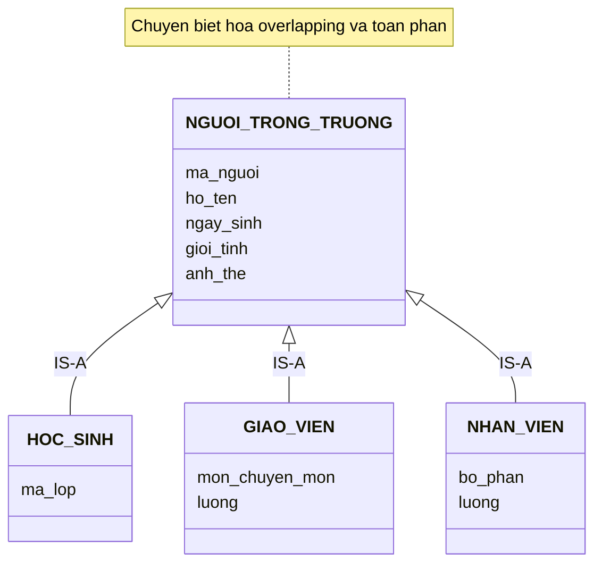
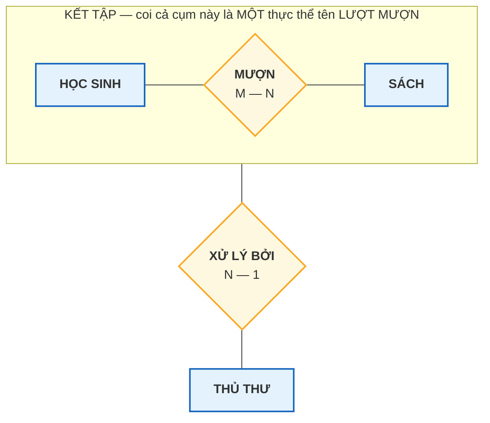

# Bài 13 — Mô hình EER: Generalization, Specialization, Aggregation

!!! abstract "🎯 Học xong bài này, bạn sẽ"
    - Biết **EER** bổ sung những gì so với mô hình ER cơ bản
    - Phân biệt **tổng quát hoá** với **chuyên biệt hoá** — hai hướng đi của cùng một cấu trúc
    - Đọc được bốn ràng buộc **disjoint / overlapping** và **toàn phần / bộ phận**
    - Hiểu **kết tập** và biết khi nào cần tới nó
    - Chọn được một trong **ba cách hiện thực kế thừa** trong bảng quan hệ, và nói được lý do

## 🧠 Câu chuyện mở đầu

Trường làm thẻ ra vào mới. Bác bảo vệ cần một danh sách **mọi người có mặt trong trường**, kèm ảnh và ngày sinh.

Cô văn thư mở máy tính, và khựng lại. Trường có ba danh sách riêng: học sinh, giáo viên, và nhân viên (bác bảo vệ, cô lao công, chú kế toán, cô thủ thư). Ba file Excel, ba cấu trúc cột khác nhau.

Nhưng nhìn kỹ thì cả ba đều có **họ tên, ngày sinh, giới tính, ảnh thẻ**. Chỉ phần đuôi là khác: học sinh có **lớp**, giáo viên có **môn chuyên môn** và **lương**, nhân viên có **bộ phận** và **lương**.

Cô nghĩ: *"Hay là gộp thành một danh sách 'Người trong trường', rồi mỗi loại ghi thêm phần riêng?"*

Rồi cô gặp ngay hai câu hỏi khó.

Thứ nhất: **cô thủ thư vừa là nhân viên, vừa dạy hai tiết Tin học mỗi tuần.** Cô ấy đứng ở danh sách nào?

Thứ hai: **có ai chỉ là "người trong trường" mà không thuộc loại nào trong ba loại đó không?** Nếu không thì danh sách gộp kia có ý nghĩa gì ngoài việc gom lại?

Hai câu hỏi ấy chính là hai ràng buộc mà bài này sẽ dạy gọi tên.

## 📖 Khái niệm & thuật ngữ

### EER là gì

**EER** (*Enhanced ER* hoặc *Extended ER* — mô hình ER **mở rộng**) là mô hình ER cơ bản cộng thêm ba nhóm khái niệm, xuất hiện từ giữa thập niên 1980 khi người ta thấy ER gốc không mô tả nổi các hệ thống lớn:

| Bổ sung | Trả lời câu hỏi |
|---|---|
| **Lớp cha / lớp con** (chuyên biệt hoá và tổng quát hoá) | *"Loại A là một dạng đặc biệt của loại B"* thì vẽ thế nào |
| **Ràng buộc disjoint / overlapping / toàn phần / bộ phận** | Một thực thể được thuộc mấy lớp con, và có bắt buộc thuộc lớp con nào không |
| **Kết tập** | Làm sao để một **mối quan hệ** tham gia vào một mối quan hệ khác |

Mọi thứ ở [Bài 7](07-thuc-the-va-thuoc-tinh.md) đến [Bài 12](12-bay-loai-khoa.md) vẫn giữ nguyên. EER chỉ **thêm vào**, không thay thế.

### Lớp cha và lớp con

**Lớp cha** (*superclass*) là tập thực thể tổng quát. **Lớp con** (*subclass*) là tập thực thể chuyên biệt hơn, mà **mọi thành viên của nó cũng là thành viên của lớp cha**.

Trong câu chuyện đầu bài:

- Lớp cha: `NGƯỜI TRONG TRƯỜNG`
- Ba lớp con: `HỌC SINH`, `GIÁO VIÊN`, `NHÂN VIÊN`

Quan hệ giữa chúng gọi là **quan hệ IS-A** (*IS-A relationship*): *"Một HỌC SINH **là một** NGƯỜI TRONG TRƯỜNG."* Câu này đọc xuôi được thì mối quan hệ đúng.

Tính chất quan trọng nhất: **kế thừa thuộc tính** (*attribute inheritance*). Lớp con **tự động** có mọi thuộc tính của lớp cha, không cần vẽ lại. `HỌC SINH` có `ho_ten`, `ngay_sinh`, `gioi_tinh` mà chẳng cần khai — vì `NGƯỜI TRONG TRƯỜNG` đã có.

Lớp con cũng kế thừa luôn việc **tham gia các mối quan hệ** của lớp cha.

### Chuyên biệt hoá và tổng quát hoá — một cấu trúc, hai hướng đi

Đây là cặp khái niệm hay bị nhầm nhất, nhưng phân biệt thì cực kỳ đơn giản: **chúng chỉ khác nhau ở chỗ bạn bắt đầu từ đâu.**

**Chuyên biệt hoá** (*specialization*) đi từ **trên xuống**: đã có lớp cha, nhận ra bên trong nó có những nhóm khác nhau, rồi tách ra thành các lớp con.

> *"Trường có 'người trong trường'. À, nhưng người trong trường chia thành ba nhóm khác nhau hẳn..."*

**Tổng quát hoá** (*generalization*) đi từ **dưới lên**: đã có nhiều tập thực thể riêng, nhận ra chúng có phần chung, rồi gom phần chung lên thành lớp cha.

> *"Trường có ba danh sách. Ơ, cả ba đều có họ tên, ngày sinh, giới tính..."*

| | Chuyên biệt hoá | Tổng quát hoá |
|---|---|---|
| English | *specialization* | *generalization* |
| Hướng | Trên → dưới | Dưới → trên |
| Điểm xuất phát | Một lớp cha | Nhiều tập thực thể rời rạc |
| Câu hỏi dẫn đường | *"Cái này chia thành mấy loại?"* | *"Mấy cái này có gì chung?"* |
| Câu chuyện đầu bài | — | **Đây** — cô văn thư gom ba danh sách |

!!! tip "Kết quả vẽ ra thì giống hệt nhau"
    Dù đi từ trên xuống hay dưới lên, **hình vẽ cuối cùng y hệt**: một lớp cha, các lớp con, và ký hiệu IS-A nối chúng.

    Hai cái tên chỉ mô tả **quá trình phân tích**, không mô tả kết quả. Nên khi đọc một biểu đồ EER đã vẽ xong, bạn **không thể** biết người ta đã đi theo hướng nào — và cũng không cần biết.

### Bốn ràng buộc trên một chuyên biệt hoá

Đây chính là hai câu hỏi khó của cô văn thư, nay được gọi tên.

**Câu hỏi 1: một thực thể được thuộc mấy lớp con?**

| Ràng buộc | English | Nghĩa | Ký hiệu EER chuẩn |
|---|---|---|---|
| **Ràng buộc disjoint** | *disjoint* | Mỗi thực thể thuộc **tối đa một** lớp con | Hình tròn chứa chữ **`d`** |
| **Ràng buộc overlapping** | *overlapping* | Một thực thể được thuộc **nhiều** lớp con cùng lúc | Hình tròn chứa chữ **`o`** |

Cô thủ thư vừa là nhân viên vừa dạy Tin học ⇒ chuyên biệt hoá này là **overlapping**. Nếu trường ra quy định *"đã là nhân viên thì không được đứng lớp"* thì nó thành **disjoint**.

**Câu hỏi 2: có bắt buộc thuộc một lớp con nào không?**

| Ràng buộc | English | Nghĩa | Ký hiệu EER chuẩn |
|---|---|---|---|
| **Chuyên biệt hoá toàn phần** | *total specialization* | **Mọi** thực thể lớp cha phải thuộc ít nhất một lớp con | Đường **gạch đôi** nối lớp cha với hình tròn |
| **Chuyên biệt hoá bộ phận** | *partial specialization* | Được phép có thực thể chỉ thuộc lớp cha | Đường **đơn** |

Nếu trường khẳng định *"ai vào trường cũng phải là một trong ba loại"* thì đây là **toàn phần**. Nếu có thêm loại "khách tham quan" chưa được xếp loại thì là **bộ phận**.

!!! note "Hai câu hỏi độc lập → bốn tổ hợp"
    Giống hệt cặp *bản số / ràng buộc tham gia* ở [Bài 9](09-participation-va-thuc-the-yeu.md), hai ràng buộc này độc lập nhau:

    | Tổ hợp | Đọc là | Ví dụ ở trường |
    |---|---|---|
    | **Disjoint + toàn phần** | Ai cũng thuộc **đúng một** loại | Học sinh chia thành Khối 6/7/8/9 |
    | **Disjoint + bộ phận** | Thuộc tối đa một loại, được phép không loại nào | Học sinh chia thành Lớp trưởng / Lớp phó |
    | **Overlapping + toàn phần** | Ai cũng thuộc ít nhất một loại, có thể nhiều loại | **Câu chuyện đầu bài** nếu mọi người đều được xếp loại |
    | **Overlapping + bộ phận** | Tự do nhất | Học sinh tham gia các câu lạc bộ |

    Khi vẽ EER mà quên ghi hai ràng buộc này thì biểu đồ mất gần hết giá trị — người đọc không biết cô thủ thư đứng ở đâu.

### Kết tập

**Kết tập** (*aggregation*) là kỹ thuật **coi cả một mối quan hệ như một thực thể duy nhất**, để mối quan hệ đó có thể tham gia vào một mối quan hệ khác.

Nghe trừu tượng, nhưng nhu cầu thì rất cụ thể. Xét thư viện:

- `HỌC SINH` — *MƯỢN* — `SÁCH` là một mối quan hệ M:N ([Bài 8](08-moi-quan-he-va-cardinality.md)).
- Bây giờ trường muốn ghi thêm: **thủ thư nào đã làm thủ tục cho lượt mượn đó**.

Vấn đề: trong ER cơ bản, **hình thoi không nối được vào hình thoi**. Bạn không thể vẽ một mối quan hệ *XỬ LÝ BỞI* nối `THỦ THƯ` với hình thoi *MƯỢN*.

Kết tập giải quyết bằng cách vẽ **một khung bao quanh** cụm `HỌC SINH — MƯỢN — SÁCH`, rồi coi cả khung đó là một thực thể tên `LƯỢT MƯỢN`. Bây giờ `THỦ THƯ` nối vào khung ấy được bình thường.

!!! question "Khi nào cần kết tập, khi nào chỉ cần quan hệ bậc ba?"
    Hai thứ này rất dễ nhầm. Phép thử:

    | | Quan hệ bậc ba | Kết tập |
    |---|---|---|
    | Hình dạng | Một hình thoi nối **ba** thực thể ngang hàng | Một khung bao quanh **quan hệ đã có**, rồi nối tiếp |
    | Ba phía có ngang hàng không | **Có** — *Cô Lan dạy Toán cho 8A1* là một sự thật ba chiều | **Không** — *"mượn"* có ý nghĩa trọn vẹn trước khi nhắc tới thủ thư |
    | Bỏ một phía đi | Mất thông tin, câu trở nên vô nghĩa | Vẫn còn ý nghĩa |
    | Ví dụ | `PHÂN CÔNG DẠY` trong `truong_hoc` | `LƯỢT MƯỢN` — *XỬ LÝ BỞI* — `THỦ THƯ` |

    Câu hỏi quyết định: **"Mối quan hệ gốc có đứng vững một mình không?"** *"Bạn An mượn cuốn Dế Mèn"* là một sự thật hoàn chỉnh; thủ thư chỉ là thông tin gắn thêm ⇒ **kết tập**. Còn *"Cô Lan dạy Toán"* mà thiếu lớp thì chưa nói lên điều gì ⇒ **bậc ba**.

!!! info "Ở mức bảng, kết tập gần như biến mất"
    Khi chuyển sang bảng ([Bài 14](14-chuyen-er-sang-bang.md)), mối quan hệ M:N đã thành bảng `muon_sach` với khoá chính `ma_muon`. Lúc đó `muon_sach` **đã là một bảng thật**, nên chỉ cần thêm cột `ma_thu_thu` là xong.

    Nói cách khác: kết tập là một khái niệm của **mức ý niệm**, sinh ra để bù cho hạn chế *"thoi không nối được vào thoi"* của bản vẽ ER. Ở mức bảng, hạn chế đó không tồn tại.

### Ba cách hiện thực kế thừa trong bảng quan hệ

Mô hình quan hệ **không có** khái niệm kế thừa. Nên khi chuyển một cây EER sang bảng, bạn phải chọn một trong ba cách. Đây là quyết định thiết kế thật, và cả ba đều được dùng trong thực tế.

**Cách 1 — Gộp một bảng** (*single table* / *single table inheritance*)

Một bảng duy nhất chứa **mọi cột của cha lẫn của mọi con**, cộng một cột `vai_tro` cho biết dòng đó là loại gì.

```
nguoi_trong_truong(ma_nguoi, ho_ten, ngay_sinh, gioi_tinh, vai_tro,
                   ma_lop, mon_chuyen_mon, luong, bo_phan)
```

Với một dòng học sinh thì `mon_chuyen_mon`, `luong`, `bo_phan` đều để `NULL`.

**Cách 2 — Bảng cho mỗi lớp con** (*table per subclass* / *class table inheritance*)

Một bảng cho lớp cha (chứa cột chung), cộng mỗi lớp con một bảng chứa **phần riêng**, dùng chung khoá chính và trỏ về bảng cha bằng khoá ngoại.

```
nguoi(ma_nguoi, ho_ten, ngay_sinh, gioi_tinh)
hoc_sinh(ma_nguoi → nguoi, ma_lop)
giao_vien(ma_nguoi → nguoi, mon_chuyen_mon, luong)
nhan_vien(ma_nguoi → nguoi, bo_phan, luong)
```

**Cách 3 — Bảng cho mỗi lớp con cụ thể** (*table per concrete class*)

Không có bảng cha. Mỗi lớp con một bảng **đầy đủ**, tự lặp lại các cột chung.

```
hoc_sinh(ma_hs, ho_ten, ngay_sinh, gioi_tinh, ma_lop)
giao_vien(ma_gv, ho_ten, ngay_sinh, gioi_tinh, mon_chuyen_mon, luong)
nhan_vien(ma_nv, ho_ten, ngay_sinh, gioi_tinh, bo_phan)
```

!!! success "`truong_hoc` đang dùng Cách 3"
    Nhìn kỹ lược đồ mẫu: `hoc_sinh` và `giao_vien` là hai bảng độc lập, mỗi bảng tự có `ho_ten`, `ngay_sinh`, `gioi_tinh`. Không có bảng `nguoi_trong_truong` nào cả.

    Đó chính là **Cách 3**. Và nó có đúng những nhược điểm mà bảng đánh đổi dưới đây liệt kê — phần Thực hành sẽ cho bạn thấy tận mắt.

### Bảng đánh đổi ba cách

| Tiêu chí | Cách 1 — Gộp một bảng | Cách 2 — Bảng mỗi lớp con | Cách 3 — Bảng mỗi lớp cụ thể |
|---|---|---|---|
| Số bảng | **1** | 1 + số lớp con | Số lớp con |
| Lấy danh sách **mọi người** | **Dễ nhất** — một `SELECT` | Dễ — `SELECT` bảng cha | **Khó** — phải `UNION ALL` |
| Lấy đầy đủ thông tin một giáo viên | **Dễ nhất** — một dòng | Cần `JOIN` 2 bảng | **Dễ** — một dòng |
| Số cột `NULL` | **Rất nhiều** | Không có | Không có |
| Ép `NOT NULL` cho thuộc tính riêng | **Không làm được** | **Làm được** | **Làm được** |
| Hỗ trợ overlapping | Không — một dòng một `vai_tro` | **Tốt** — thêm dòng ở hai bảng con | Rất tệ — phải lưu trùng |
| Khoá chính không trùng giữa các loại | Bảo đảm | Bảo đảm | **Không** — `HS001` và `GV01` độc lập |
| Thêm một lớp con mới | Thêm cột vào bảng đang chạy | Thêm một bảng mới | Thêm một bảng mới |
| Nên dùng khi | Lớp con ít, khác nhau vài cột | Lớp con nhiều thuộc tính riêng, cần overlapping | Các lớp con **gần như không dùng chung** gì |

!!! warning "Không có cách nào 'đúng' tuyệt đối"
    Câu hỏi quyết định là: **bạn truy vấn theo lớp cha hay theo lớp con nhiều hơn?**

    - Hay hỏi *"mọi người trong trường"* → Cách 1 hoặc 2.
    - Hầu như chỉ hỏi *"danh sách học sinh"*, *"danh sách giáo viên"* riêng rẽ → Cách 3.

    `truong_hoc` chọn Cách 3 vì đúng như vậy: gần như mọi bài học đều hỏi riêng học sinh hoặc riêng giáo viên. Cái giá phải trả chỉ hiện ra khi bác bảo vệ cần danh sách gộp.

### Bảng thuật ngữ

| Tiếng Việt | English | Nghĩa dễ hiểu |
|---|---|---|
| Mô hình ER mở rộng | *EER — Enhanced / Extended ER* | ER cơ bản cộng kế thừa, ràng buộc lớp con và kết tập |
| Lớp cha | *superclass* | Tập thực thể tổng quát |
| Lớp con | *subclass* | Tập thực thể chuyên biệt, mọi thành viên cũng thuộc lớp cha |
| Quan hệ IS-A | *IS-A relationship* | *"X là một Y"* — nối lớp con với lớp cha |
| Kế thừa thuộc tính | *attribute inheritance* | Lớp con tự động có mọi thuộc tính của lớp cha |
| Chuyên biệt hoá | *specialization* | Đi từ lớp cha xuống, tách ra các lớp con |
| Tổng quát hoá | *generalization* | Đi từ nhiều tập thực thể lên, gom phần chung |
| Ràng buộc disjoint | *disjoint* | Mỗi thực thể thuộc tối đa một lớp con — ký hiệu `d` |
| Ràng buộc overlapping | *overlapping* | Được thuộc nhiều lớp con cùng lúc — ký hiệu `o` |
| Chuyên biệt hoá toàn phần | *total specialization* | Mọi thực thể cha phải thuộc ít nhất một lớp con — gạch đôi |
| Chuyên biệt hoá bộ phận | *partial specialization* | Được phép chỉ thuộc lớp cha — gạch đơn |
| Kết tập | *aggregation* | Coi cả một mối quan hệ như một thực thể để nối tiếp |

## 🖼️ Sơ đồ

### Sơ đồ 1 — Cây kế thừa, vẽ bằng `classDiagram`

Mermaid **không có** kiểu sơ đồ EER. Sơ đồ dưới đây dùng `classDiagram` để **mô phỏng**: mũi tên tam giác rỗng `<|--` vốn là ký hiệu kế thừa của UML, ở đây đọc là **quan hệ IS-A**.



Ba lớp con chỉ liệt kê **phần riêng** của mình. `HOC_SINH` không ghi `ho_ten` vì nó **kế thừa** từ lớp cha — đúng nguyên tắc *attribute inheritance*. Thuộc tính khoá của lớp cha là `ma_nguoi`, và cả ba lớp con **dùng chung** khoá đó.

Dòng `note` ở cuối sơ đồ ghi hai ràng buộc bằng chữ, vì Mermaid không có hình cho chúng — bảng ngay dưới đây giải thích vì sao.

### Bảng ánh xạ sang ký hiệu EER chuẩn

Đây là bảng bạn cần khi làm bài trên giấy hoặc đọc giáo trình:

| Ý nghĩa | Ký hiệu EER chuẩn | Mermaid mô phỏng bằng | Khác biệt cần nhớ |
|---|---|---|---|
| Quan hệ IS-A | Hình tròn nối lớp cha xuống các lớp con, kèm ký hiệu tập con **⊂** trên từng nhánh | Mũi tên tam giác rỗng <code><&#124;--</code> | EER dùng hình tròn làm nút chia, UML dùng mũi tên |
| Disjoint | Hình tròn chứa chữ **`d`** | Ghi bằng chữ trong `note` | **Không có hình tương đương** |
| Overlapping | Hình tròn chứa chữ **`o`** | Ghi bằng chữ trong `note` | **Không có hình tương đương** |
| Chuyên biệt hoá toàn phần | Đường **gạch đôi** từ lớp cha tới hình tròn | Ghi bằng chữ trong `note` | **Không có hình tương đương** |
| Chuyên biệt hoá bộ phận | Đường **đơn** từ lớp cha tới hình tròn | Ghi bằng chữ trong `note` | **Không có hình tương đương** |
| Thuộc tính riêng của lớp con | Elip treo vào hình chữ nhật lớp con | Dòng trong khối `{ }` | Gọn hơn, nhưng mất phân biệt đa trị / dẫn xuất |

!!! warning "Khi làm bài thi, hãy vẽ đúng ký hiệu EER chuẩn"
    Bốn dòng *"không có hình tương đương"* trong bảng trên là bốn chỗ Mermaid chịu thua. Trên giấy thì rất dễ: vẽ một **hình tròn** giữa lớp cha và các lớp con, viết `d` hoặc `o` vào trong, rồi nối lớp cha bằng **một gạch** (bộ phận) hoặc **hai gạch** (toàn phần).

    Nhớ hai chữ cái: **`d` = disjoint = tách rời**, **`o` = overlapping = chồng lấn**.

### Sơ đồ 2 — Kết tập

Khung nét đứt bao quanh cụm `HỌC SINH — MƯỢN — SÁCH` chính là **kết tập**. Trong ký hiệu EER chuẩn, khung này là một hình chữ nhật nét liền bao trọn cả ba hình bên trong.



Đọc sơ đồ: *"Một **lượt mượn** — tức là một bộ ba (học sinh, sách, thời điểm) — được **xử lý bởi** một thủ thư."*

Không có kết tập thì bạn buộc phải vẽ một quan hệ **bậc ba** `HỌC SINH — SÁCH — THỦ THƯ`, và như vậy là nói sai: nó ngụ ý rằng *"mượn"* chỉ có nghĩa khi đã biết thủ thư, điều không đúng.

## 💻 Thực hành

### Cách 3 đang chạy ngay trong `truong_hoc`

Lược đồ mẫu không có bảng `nguoi_trong_truong`. Muốn làm danh sách cho bác bảo vệ, bạn phải tự ghép:

```sql
SELECT ho_ten, ngay_sinh, gioi_tinh, 'Học sinh' AS vai_tro
FROM hoc_sinh
UNION ALL
SELECT ho_ten, ngay_sinh, gioi_tinh, 'Giáo viên'
FROM giao_vien
ORDER BY ngay_sinh
LIMIT 5;
```

Năm dòng đầu tiên là năm người **già nhất** trường — và tất cả đều là giáo viên, vì thầy cô sinh từ 1975 tới 1992 còn học sinh sinh 2011–2012.

Tổng số người trong trường:

```sql
SELECT (SELECT count(*) FROM hoc_sinh)  AS so_hoc_sinh,
       (SELECT count(*) FROM giao_vien) AS so_giao_vien,
       (SELECT count(*) FROM hoc_sinh) + (SELECT count(*) FROM giao_vien) AS tong_so_nguoi;
```

Kết quả: `40`, `8`, `48`.

Chú ý cái giá của Cách 3: để trả lời một câu hỏi rất tự nhiên (*"có bao nhiêu người trong trường?"*) bạn phải **biết trước danh sách mọi bảng lớp con**. Thêm bảng `nhan_vien` vào ngày mai là phải đi sửa lại mọi truy vấn kiểu này.

Và khoá chính thì không thống nhất:

```sql
SELECT 'hoc_sinh'  AS bang, min(ma_hs) AS ma_nho_nhat, max(ma_hs) AS ma_lon_nhat FROM hoc_sinh
UNION ALL
SELECT 'giao_vien', min(ma_gv), max(ma_gv) FROM giao_vien;
```

`HS001`–`HS040` và `GV01`–`GV08`. Hai hệ mã **độc lập**, do người thiết kế tự đặt cho không đụng nhau. Nếu vô ý đặt trùng thì không gì ngăn được — đúng dòng *"Khoá chính không trùng giữa các loại: **Không**"* trong bảng đánh đổi.

### Dựng thử Cách 2 để so sánh

Bây giờ ta dựng một bộ bảng nháp theo **Cách 2** và nhìn tận mắt sự khác biệt. Mọi bảng đều có tiền tố `b13_` và sẽ được xoá ở cuối bài.

```sql
DROP TABLE IF EXISTS b13_hoc_sinh CASCADE;
DROP TABLE IF EXISTS b13_giao_vien CASCADE;
DROP TABLE IF EXISTS b13_nhan_vien CASCADE;
DROP TABLE IF EXISTS b13_nguoi CASCADE;

CREATE TABLE b13_nguoi (
    ma_nguoi  CHAR(6)     PRIMARY KEY,
    ho_ten    VARCHAR(60) NOT NULL,
    ngay_sinh DATE        NOT NULL,
    gioi_tinh VARCHAR(3)  NOT NULL CHECK (gioi_tinh IN ('Nam', 'Nữ'))
);

CREATE TABLE b13_hoc_sinh (
    ma_nguoi CHAR(6) PRIMARY KEY REFERENCES b13_nguoi(ma_nguoi) ON DELETE CASCADE,
    ma_lop   CHAR(3) NOT NULL
);

CREATE TABLE b13_giao_vien (
    ma_nguoi       CHAR(6)       PRIMARY KEY REFERENCES b13_nguoi(ma_nguoi) ON DELETE CASCADE,
    mon_chuyen_mon VARCHAR(30)   NOT NULL,
    luong          NUMERIC(12,2) NOT NULL CHECK (luong > 0)
);

CREATE TABLE b13_nhan_vien (
    ma_nguoi CHAR(6)       PRIMARY KEY REFERENCES b13_nguoi(ma_nguoi) ON DELETE CASCADE,
    bo_phan  VARCHAR(30)   NOT NULL,
    luong    NUMERIC(12,2) NOT NULL CHECK (luong > 0)
);
```

Hai chi tiết đáng chú ý trong đoạn `CREATE TABLE` trên:

1. **Khoá chính của bảng con đồng thời là khoá ngoại** trỏ về bảng cha. Đó chính là cách mô hình quan hệ diễn tả *"mỗi học sinh là một người, và dùng chung định danh"*.
2. **`ON DELETE CASCADE`**: xoá một người thì phần chuyên biệt của họ biến mất theo. Giống hệt thực thể yếu ở [Bài 9](09-participation-va-thuc-the-yeu.md) — vì bản chất cũng là phụ thuộc tồn tại.

Nạp dữ liệu, trong đó **`NG0004` là cô thủ thư vừa dạy Tin học** — trường hợp *overlapping* của câu chuyện đầu bài:

```sql
INSERT INTO b13_nguoi (ma_nguoi, ho_ten, ngay_sinh, gioi_tinh) VALUES
('NG0001', 'Nguyễn Văn An',    '2012-01-15', 'Nam'),
('NG0002', 'Nguyễn Thị Lan',   '1985-03-12', 'Nữ'),
('NG0003', 'Trần Văn Bảo Vệ',  '1970-06-01', 'Nam'),
('NG0004', 'Lê Thị Thư',       '1983-02-20', 'Nữ');

INSERT INTO b13_hoc_sinh  VALUES ('NG0001', 'L01');
INSERT INTO b13_giao_vien VALUES ('NG0002', 'Toán',     14500000);
INSERT INTO b13_nhan_vien VALUES ('NG0003', 'Bảo vệ',    8000000);
INSERT INTO b13_nhan_vien VALUES ('NG0004', 'Thư viện',  9000000);
INSERT INTO b13_giao_vien VALUES ('NG0004', 'Tin học',   3000000);
```

Danh sách mọi người — bây giờ chỉ cần **một** câu, không cần `UNION ALL`:

```sql
SELECT n.ma_nguoi, n.ho_ten,
       (hs.ma_nguoi IS NOT NULL) AS la_hoc_sinh,
       (gv.ma_nguoi IS NOT NULL) AS la_giao_vien,
       (nv.ma_nguoi IS NOT NULL) AS la_nhan_vien
FROM b13_nguoi n
LEFT JOIN b13_hoc_sinh  hs ON hs.ma_nguoi = n.ma_nguoi
LEFT JOIN b13_giao_vien gv ON gv.ma_nguoi = n.ma_nguoi
LEFT JOIN b13_nhan_vien nv ON nv.ma_nguoi = n.ma_nguoi
ORDER BY n.ma_nguoi;
```

Bốn dòng. Dòng `NG0004` có **cả hai** cột `la_giao_vien` và `la_nhan_vien` bằng `t` — đó là **overlapping** hiện ra bằng dữ liệu.

Tìm thẳng những người thuộc từ hai lớp con trở lên:

```sql
SELECT n.ma_nguoi, n.ho_ten,
       (hs.ma_nguoi IS NOT NULL)::int
     + (gv.ma_nguoi IS NOT NULL)::int
     + (nv.ma_nguoi IS NOT NULL)::int AS so_lop_con
FROM b13_nguoi n
LEFT JOIN b13_hoc_sinh  hs ON hs.ma_nguoi = n.ma_nguoi
LEFT JOIN b13_giao_vien gv ON gv.ma_nguoi = n.ma_nguoi
LEFT JOIN b13_nhan_vien nv ON nv.ma_nguoi = n.ma_nguoi
WHERE (hs.ma_nguoi IS NOT NULL)::int
    + (gv.ma_nguoi IS NOT NULL)::int
    + (nv.ma_nguoi IS NOT NULL)::int > 1;
```

Đúng **một dòng**: `NG0004` | Lê Thị Thư | `2`.

Nếu chuyên biệt hoá này là **disjoint**, câu lệnh trên **bắt buộc** phải trả về 0 dòng. Đây chính là cách kiểm tra ràng buộc disjoint bằng SQL.

!!! tip "Cách 2 không tự ép disjoint — phải tự làm"
    Mô hình quan hệ mặc định cho phép overlapping: không gì ngăn một `ma_nguoi` xuất hiện ở cả ba bảng con.

    Muốn ép **disjoint**, bạn phải thêm cơ chế riêng — thường là một cột `vai_tro` trong bảng cha, đưa nó vào khoá của bảng con, và dùng `CHECK` để khoá cứng giá trị. Hoặc dùng trigger. Không có cú pháp sẵn nào cho việc này.

Kiểm tra **chuyên biệt hoá toàn phần** — tức là có ai chỉ nằm ở bảng cha mà không thuộc lớp con nào không:

```sql
SELECT count(*) AS so_nguoi_khong_thuoc_lop_con_nao
FROM b13_nguoi n
WHERE NOT EXISTS (SELECT 1 FROM b13_hoc_sinh  x WHERE x.ma_nguoi = n.ma_nguoi)
  AND NOT EXISTS (SELECT 1 FROM b13_giao_vien x WHERE x.ma_nguoi = n.ma_nguoi)
  AND NOT EXISTS (SELECT 1 FROM b13_nhan_vien x WHERE x.ma_nguoi = n.ma_nguoi);
```

Kết quả `0` — dữ liệu hiện thoả mãn **toàn phần**. Nhưng như [Bài 12](12-bay-loai-khoa.md) đã dạy: dữ liệu thoả mãn **không** có nghĩa là lược đồ cưỡng chế. Thêm một dòng vào `b13_nguoi` mà không thêm vào bảng con nào thì database vẫn nhận — chuyên biệt hoá toàn phần cũng là thứ SQL không ép được bằng ràng buộc cột.

### So sánh Cách 1 — đếm số ô `NULL`

Dựng nhanh bảng gộp để thấy vấn đề của Cách 1:

```sql
DROP TABLE IF EXISTS b13_nguoi_gop CASCADE;

CREATE TABLE b13_nguoi_gop (
    ma_nguoi       CHAR(6)     PRIMARY KEY,
    ho_ten         VARCHAR(60) NOT NULL,
    ngay_sinh      DATE        NOT NULL,
    vai_tro        VARCHAR(10) NOT NULL CHECK (vai_tro IN ('Học sinh', 'Giáo viên', 'Nhân viên')),
    ma_lop         CHAR(3),
    mon_chuyen_mon VARCHAR(30),
    bo_phan        VARCHAR(30),
    luong          NUMERIC(12,2)
);

INSERT INTO b13_nguoi_gop VALUES
('NG0001', 'Nguyễn Văn An',   '2012-01-15', 'Học sinh',  'L01', NULL,      NULL,       NULL),
('NG0002', 'Nguyễn Thị Lan',  '1985-03-12', 'Giáo viên', NULL,  'Toán',    NULL,       14500000),
('NG0003', 'Trần Văn Bảo Vệ', '1970-06-01', 'Nhân viên', NULL,  NULL,      'Bảo vệ',    8000000);
```

Đếm số ô trống trên bốn cột chuyên biệt:

```sql
SELECT count(*) * 4                                        AS tong_so_o,
       count(*) * 4
     - count(ma_lop) - count(mon_chuyen_mon)
     - count(bo_phan) - count(luong)                       AS so_o_null
FROM b13_nguoi_gop;
```

Kết quả: `12` ô, trong đó `7` ô là `NULL` — gần **60%** bỏ trống, và mới chỉ có ba lớp con với bốn cột riêng.

Đó là nhược điểm lớn nhất của Cách 1. Kèm theo một nhược điểm còn tệ hơn: **không thể khai `NOT NULL` cho `ma_lop`**, dù về nghiệp vụ mọi học sinh đều bắt buộc có lớp — vì cột đó phải để trống cho giáo viên và nhân viên.

Ngược lại, ở Cách 2 thì `b13_hoc_sinh.ma_lop` được khai `NOT NULL` đàng hoàng, đúng ràng buộc tham gia toàn phần của [Bài 9](09-participation-va-thuc-the-yeu.md).

Và Cách 1 **không** diễn tả nổi trường hợp cô thủ thư: một dòng chỉ có một `vai_tro`.

### Dọn dẹp

```sql
DROP TABLE IF EXISTS b13_nguoi_gop CASCADE;
DROP TABLE IF EXISTS b13_hoc_sinh CASCADE;
DROP TABLE IF EXISTS b13_giao_vien CASCADE;
DROP TABLE IF EXISTS b13_nhan_vien CASCADE;
DROP TABLE IF EXISTS b13_nguoi CASCADE;
```

Luôn dọn bảng nháp sau khi thử nghiệm — nếu không, bài học sau chạy `\dt` sẽ thấy một đống bảng lạ không biết của ai.

## ⚠️ Lỗi thường gặp

!!! warning "Lỗi 1: Nhầm chuyên biệt hoá với tổng quát hoá"
    Nói *"tôi vừa tổng quát hoá HỌC SINH thành LỚP TRƯỞNG và HỌC SINH THƯỜNG"*. Sai chiều.

    Đi **từ một lớp cha xuống nhiều lớp con** là **chuyên biệt hoá**. Đi **từ nhiều tập thực thể lên một lớp cha** mới là **tổng quát hoá**.

    Mẹo nhớ: *chuyên biệt* = làm cho **hẹp** hơn, đi **xuống**. *Tổng quát* = làm cho **rộng** hơn, đi **lên**.

!!! warning "Lỗi 2: Vẽ IS-A thành một mối quan hệ bình thường"
    Vẽ hình thoi `LÀ MỘT` nối `HỌC SINH` với `NGƯỜI TRONG TRƯỜNG`, ghi bản số `1 — 1`.

    Sai về bản chất. Mối quan hệ nối **hai thực thể khác nhau**; IS-A nói rằng chúng là **cùng một thực thể nhìn ở hai mức tổng quát**. Bạn An và "người trong trường tên An" không phải hai người rồi ghép lại — đó là một người.

    Dấu hiệu nhận ra sự khác biệt: qua IS-A thì **khoá chính được dùng chung**. Qua một mối quan hệ thường thì mỗi bên có khoá riêng.

!!! warning "Lỗi 3: Quên ghi hai ràng buộc"
    Vẽ cây kế thừa xong là thấy đẹp rồi nộp. Nhưng thiếu chữ `d`/`o` và thiếu gạch đơn/gạch đôi thì người đọc **không trả lời nổi** hai câu hỏi của cô văn thư.

    Cũng giống [Bài 9](09-participation-va-thuc-the-yeu.md): vẽ bản số mà quên ràng buộc tham gia là mô tả chưa xong việc.

!!! warning "Lỗi 4: Dùng kế thừa cho quan hệ 'có một' thay vì 'là một'"
    Vẽ `LỚP` là lớp con của `TRƯỜNG`, vì *"lớp nằm trong trường"*.

    Phép thử một câu: đọc to **"X là một Y"**. *"Lớp 8A1 **là một** trường"* — nghe sai ngay. Vậy đây không phải IS-A mà là **HAS-A**, tức một mối quan hệ 1:N thông thường.

    Cùng phép thử: *"Học sinh **là một** người trong trường"* — nghe xuôi ⇒ IS-A đúng.

!!! warning "Lỗi 5: Chọn Cách 1 vì 'ít bảng cho gọn'"
    Gộp một bảng nghe hấp dẫn khi mới có hai lớp con. Nhưng mỗi lớp con thêm vào là thêm vài cột luôn `NULL`, và bạn **vĩnh viễn** mất khả năng khai `NOT NULL` cho chúng.

    Sau vài năm, bảng phình lên 60 cột mà mỗi dòng chỉ dùng 10 cột. Lúc đó tách ra thì phải sửa mọi truy vấn đang chạy.

    Hỏi trước khi chọn: *"số lớp con có khả năng tăng không, và các lớp con có nhiều thuộc tính riêng không?"* Nếu cả hai là **có** thì đừng chọn Cách 1.

!!! warning "Lỗi 6: Dùng kết tập ở chỗ đáng lẽ là quan hệ bậc ba"
    Vẽ khung kết tập quanh `GIÁO VIÊN — DẠY — MÔN HỌC` rồi nối sang `LỚP`.

    Sai, vì *"cô Lan dạy Toán"* **không đứng vững một mình** — thiếu lớp thì câu đó chưa phải một sự thật hoàn chỉnh về phân công. Ba phía ngang hàng nhau ⇒ **quan hệ bậc ba**, đúng như `phan_cong_day`.

    So sánh: *"bạn An mượn cuốn Dế Mèn"* thì đứng vững, thủ thư chỉ là thông tin thêm ⇒ kết tập.

## ✍️ Bài tập

1. Với mỗi cặp dưới đây, cho biết đó là **IS-A** hay **HAS-A**:

    a. `SÁCH` và `SÁCH GIÁO KHOA`
    b. `LỚP` và `HỌC SINH`
    c. `NGƯỜI TRONG TRƯỜNG` và `GIÁO VIÊN`
    d. `THƯ VIỆN` và `SÁCH`

2. Trường chia học sinh thành `HỌC SINH GIỎI`, `HỌC SINH KHÁ`, `HỌC SINH TRUNG BÌNH` theo điểm trung bình cuối năm. Hãy xác định **hai** ràng buộc của chuyên biệt hoá này và giải thích.

3. Trường mở thêm câu lạc bộ: mỗi học sinh có thể tham gia `CLB BÓNG ĐÁ`, `CLB CỜ VUA`, `CLB VĂN NGHỆ`, hoặc không tham gia gì. Xác định hai ràng buộc, rồi nói cách hiện thực nào trong ba cách là phù hợp nhất.

4. Cho cây EER: `PHƯƠNG TIỆN` (biển số, chủ sở hữu) chuyên biệt hoá thành `XE MÁY` (dung tích) và `Ô TÔ` (số chỗ, hạng xe), disjoint + toàn phần. Hãy viết lược đồ bảng theo **cả ba cách**, và nói cách nào bạn chọn.

5. Trường muốn ghi lại: **giáo viên nào đã nhập con điểm nào**. Hiện tại `HỌC SINH — CÓ ĐIỂM — MÔN HỌC` đã là quan hệ M:N. Hỏi: đây là kết tập hay quan hệ bậc ba? Ở mức bảng thì làm thế nào?

??? success "Đáp án"
    **Câu 1.**

    | | Cặp | Loại | Lý do |
    |---|---|---|---|
    | a | `SÁCH` — `SÁCH GIÁO KHOA` | **IS-A** | *"Sách giáo khoa là một cuốn sách"* — nghe xuôi |
    | b | `LỚP` — `HỌC SINH` | **HAS-A** | *"Học sinh là một lớp"* — nghe sai. Đây là quan hệ 1:N |
    | c | `NGƯỜI TRONG TRƯỜNG` — `GIÁO VIÊN` | **IS-A** | *"Giáo viên là một người trong trường"* |
    | d | `THƯ VIỆN` — `SÁCH` | **HAS-A** | Thư viện **chứa** sách, không phải là sách |

    **Câu 2.**

    - **Disjoint.** Một học sinh chỉ có **một** điểm trung bình, nên chỉ rơi vào **một** xếp loại. Không ai vừa giỏi vừa khá.
    - **Toàn phần** (với điều kiện có đủ hạng cho mọi khoảng điểm). Mọi học sinh đều có điểm trung bình nên đều được xếp loại.

    Chú ý một điều thú vị: chuyên biệt hoá này dựa hoàn toàn vào **giá trị của một thuộc tính dẫn xuất** (điểm trung bình, tính từ bảng `diem`). Giáo trình gọi đó là *attribute-defined specialization*. Với loại này, **không nên** tạo bảng con — chỉ cần tính lại khi cần, vì xếp loại đổi mỗi kỳ.

    **Câu 3.**

    - **Overlapping** — một bạn tham gia được nhiều câu lạc bộ.
    - **Bộ phận** — được phép không tham gia câu lạc bộ nào.

    Cách hiện thực: **không dùng kế thừa gì cả**. Đây thật ra không phải chuyên biệt hoá mà là một **quan hệ M:N** giữa `HỌC SINH` và `CÂU LẠC BỘ`, hiện thực bằng bảng trung gian `thanh_vien_clb(ma_hs, ma_clb, ngay_tham_gia)`.

    Đây là bẫy hay gặp: overlapping + bộ phận thường là dấu hiệu bạn đang nhìn nhầm một **quan hệ M:N** thành chuyên biệt hoá. Phép thử: các "lớp con" có **thuộc tính riêng** không? Ở đây không — `CLB BÓNG ĐÁ` chẳng thêm cột nào cho học sinh cả.

    **Câu 4.**

    Cách 1 — gộp một bảng:

    ```
    phuong_tien(bien_so PK, chu_so_huu, loai, dung_tich, so_cho, hang_xe)
        CHECK (loai IN ('Xe máy', 'Ô tô'))
    ```

    Cách 2 — bảng mỗi lớp con:

    ```
    phuong_tien(bien_so PK, chu_so_huu)
    xe_may(bien_so PK → phuong_tien, dung_tich NOT NULL)
    o_to(bien_so PK → phuong_tien, so_cho NOT NULL, hang_xe NOT NULL)
    ```

    Cách 3 — bảng mỗi lớp cụ thể:

    ```
    xe_may(bien_so PK, chu_so_huu, dung_tich)
    o_to(bien_so PK, chu_so_huu, so_cho, hang_xe)
    ```

    **Chọn Cách 1.** Lý do: chuyên biệt hoá này là **disjoint + toàn phần**, chỉ có hai lớp con, mỗi lớp con thêm 1–2 cột. Số ô `NULL` rất ít, và đổi lại bạn được: một khoá chính duy nhất (biển số không trùng giữa hai loại), và truy vấn *"mọi phương tiện"* chỉ cần một `SELECT`.

    Cách 3 là lựa chọn **tệ nhất** ở đây, vì biển số phải là duy nhất trên toàn bộ phương tiện mà hai bảng rời thì không ép được điều đó.

    **Câu 5.**
    Đây là **kết tập**. *"Bạn An được 8.5 môn Toán"* là một sự thật hoàn chỉnh; *"ai nhập con điểm đó"* là thông tin gắn thêm vào cả cụm.

    Ở mức bảng thì rất đơn giản, vì `diem` **đã là một bảng thật** với khoá chính `ma_diem`:

    <!-- sql:khong-chay -->
    ```sql
    ALTER TABLE diem ADD COLUMN ma_gv_nhap CHAR(4) REFERENCES giao_vien(ma_gv);
    ```

    (Câu lệnh này chỉ để minh hoạ — khoá học **không** chạy nó, vì `dataset/02-chuan-hoa.sql` là lược đồ đã chốt.)

    Đúng như phần khái niệm đã nói: ở mức bảng, kết tập gần như biến mất — nó chỉ là một cột khoá ngoại thêm vào bảng trung gian.

## 🔑 Tóm tắt

1. **EER** bổ sung cho ER ba thứ: **lớp cha / lớp con** với kế thừa thuộc tính, bốn **ràng buộc** trên chuyên biệt hoá, và **kết tập**.
2. **Chuyên biệt hoá** đi từ trên xuống, **tổng quát hoá** đi từ dưới lên — hai quá trình khác nhau nhưng cho ra **cùng một hình vẽ**.
3. Mỗi chuyên biệt hoá cần **hai** ràng buộc: **disjoint `d`** hay **overlapping `o`**, và **toàn phần** (gạch đôi) hay **bộ phận** (gạch đơn).
4. **Kết tập** coi cả một mối quan hệ như một thực thể, dùng khi mối quan hệ gốc **đứng vững một mình** — khác với quan hệ bậc ba, nơi ba phía ngang hàng nhau.
5. Mô hình quan hệ không có kế thừa, nên phải chọn một trong **ba cách**: gộp một bảng (nhiều `NULL`, không ép được `NOT NULL`), bảng mỗi lớp con (sạch nhất, hỗ trợ overlapping, phải `JOIN`), bảng mỗi lớp cụ thể (`truong_hoc` đang dùng, khó gộp danh sách).

---

⬅️ [Bài 12 — Bảy loại khoá trong cơ sở dữ liệu](12-bay-loai-khoa.md) · ➡️ [Bài 14 — Chuyển biểu đồ ER thành lược đồ quan hệ](14-chuyen-er-sang-bang.md)
