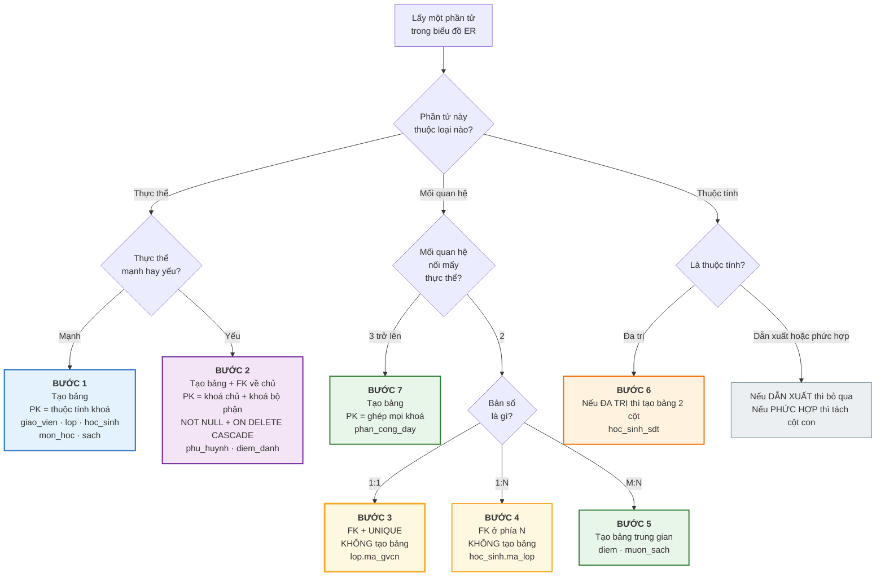
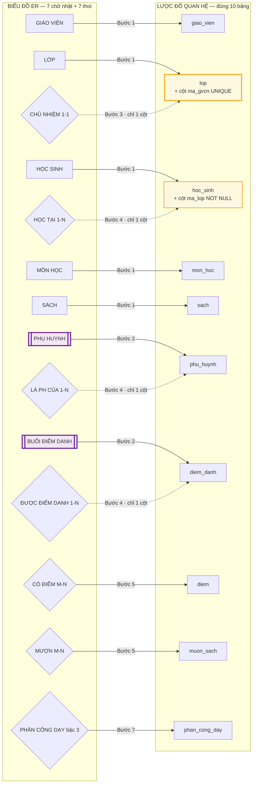

# Bài 14 — Chuyển biểu đồ ER thành lược đồ quan hệ

!!! abstract "🎯 Học xong bài này, bạn sẽ"
    - Thuộc **thuật toán 7 bước** chuyển biểu đồ ER thành các bảng
    - Áp được từng bước lên biểu đồ ER của `truong_hoc` và ra đúng **10 bảng**
    - Biết vì sao 1:1 cần **khoá ngoại + `UNIQUE`**, còn 1:N chỉ cần khoá ngoại
    - Biết chuyện gì xảy ra với thuộc tính đa trị, dẫn xuất, phức hợp khi lên bảng
    - Chỉ ra được những ràng buộc mà ER diễn tả được nhưng bảng **không** giữ nổi

## 🧠 Câu chuyện mở đầu

Anh lập trình viên đã có tờ giấy vẽ biểu đồ ER, đã có cả bản Crow's Foot gọn gàng trên máy. Cô hiệu trưởng đã gật đầu: *"Đúng rồi đấy."*

Sáng thứ Hai, anh mở trình soạn thảo lên, gõ `CREATE TABLE` — rồi dừng lại.

Tờ giấy có **bảy hình chữ nhật** và **bảy hình thoi**. Vậy phải tạo bao nhiêu bảng? Bảy? Mười bốn?

Hình thoi `CHỦ NHIỆM` thì làm sao thành bảng được — nó có đúng hai đầu và chẳng có thuộc tính nào. Còn hình thoi `PHÂN CÔNG DẠY` nối vào **ba** hình chữ nhật thì nhét vào đâu?

Rồi cái elip đôi `số điện thoại` — một ô trong bảng chỉ chứa được một giá trị, mà học sinh thì có mấy số. Và elip nét đứt `tuổi` nữa, có cần cột `tuoi` không?

Anh nhận ra mình đang thiếu đúng một thứ: **một bộ quy tắc máy móc**, áp vào là ra kết quả, không phải đoán.

May thay, bộ quy tắc đó tồn tại, và nó chỉ có **bảy bước**.

## 📖 Khái niệm & thuật ngữ

### Đây là bước chuyển giữa hai mức

Nhắc lại kiến trúc ba mức đã gặp ở [Bài 3](../cap-0-nhap-mon/03-dbms-la-gi.md):

| Mức | Bản vẽ | Bài |
|---|---|---|
| **Ý niệm** | Biểu đồ ER / EER — thực thể, thuộc tính, mối quan hệ | Bài 7–10, 13 |
| **Logic** | **Lược đồ quan hệ** — bảng, cột, khoá chính, khoá ngoại | **Bài này** |
| **Vật lý** | File trên đĩa, chỉ mục, phân vùng | Cấp 4 |

**Lược đồ quan hệ** (*relational schema*) là danh sách các bảng kèm cột và ràng buộc của chúng — đúng thứ mà [Bài 6](06-mo-hinh-quan-he.md) đã định nghĩa.

Thuật toán của bài này gọi là **ánh xạ ER sang quan hệ** (*ER-to-relational mapping*). Nó máy móc tới mức nhiều công cụ thiết kế database chạy tự động được.

!!! info "Vì sao vẫn phải học tay nếu công cụ làm được?"
    Vì hai lẽ.

    Thứ nhất, **ba bước trong bảy bước có chỗ để bạn lựa chọn** — và công cụ chọn hộ bạn thì thường chọn không tối ưu. Bước 3 (đặt khoá ngoại ở phía nào) và Bước 2 (khoá bộ phận hay khoá nhân tạo) là hai ví dụ mà bài này sẽ chỉ rõ.

    Thứ hai, đọc ngược lại được — **từ bảng suy ra biểu đồ ER** — là kỹ năng dùng hằng ngày khi bạn nhận bàn giao một database lạ. Mà muốn đọc ngược thì phải thuộc chiều xuôi.

### Thuật toán 7 bước

Đây là bảng tra để bạn quay lại nhiều lần. Từng bước sẽ có một mục riêng ở dưới.

| Bước | Trong biểu đồ ER | Thành gì trong lược đồ | Khoá chính của kết quả |
|---|---|---|---|
| **1** | Tập thực thể **mạnh** | Một **bảng mới** | Thuộc tính khoá của thực thể |
| **2** | Tập thực thể **yếu** | Một **bảng mới** + khoá ngoại về chủ | Khoá chủ **+** khoá bộ phận |
| **3** | Mối quan hệ **1:1** | **Một cột khoá ngoại + `UNIQUE`**, không tạo bảng | Không đổi |
| **4** | Mối quan hệ **1:N** | **Một cột khoá ngoại** ở phía **N**, không tạo bảng | Không đổi |
| **5** | Mối quan hệ **M:N** | Một **bảng trung gian** | Ghép khoá của cả hai phía |
| **6** | Thuộc tính **đa trị** | Một **bảng riêng** hai cột | Ghép khoá chủ + chính giá trị đó |
| **7** | Mối quan hệ **bậc ≥ 3** | Một **bảng riêng** | Ghép khoá của mọi phía tham gia |

Hai quy tắc phụ, không cần bước riêng:

| Loại thuộc tính | Xử lý |
|---|---|
| **Dẫn xuất** | **Không** tạo cột. Tính lúc truy vấn |
| **Phức hợp** | Tạo cột cho **từng thành phần con**, hoặc gộp thành một cột nếu không bao giờ cần tra riêng |

!!! tip "Hai câu hỏi phân loại mọi mối quan hệ"
    Bốn bước 3, 4, 5, 7 chỉ là bốn nhánh của cùng một cây quyết định:

    1. **Mối quan hệ này nối mấy thực thể?** Từ ba trở lên → **Bước 7**, luôn luôn thành bảng.
    2. Nếu nối hai: **bản số là gì?** 1:1 → Bước 3 · 1:N → Bước 4 · M:N → Bước 5.

    Và quy tắc bao trùm dễ nhớ nhất:

    > **Chỉ M:N và bậc ≥ 3 mới sinh ra bảng mới. 1:1 và 1:N chỉ để lại một cột khoá ngoại.**

### Bước 1 — Thực thể mạnh thành bảng

Với mỗi tập thực thể mạnh, tạo một bảng. Lấy mọi **thuộc tính đơn, đơn trị** làm cột. Lấy **thuộc tính khoá** làm khoá chính.

Áp vào `truong_hoc` — có **năm** thực thể mạnh:

| Thực thể ER | Bảng | Khoá chính |
|---|---|---|
| `GIÁO VIÊN` | `giao_vien` | `ma_gv` |
| `LỚP` | `lop` | `ma_lop` |
| `HỌC SINH` | `hoc_sinh` | `ma_hs` |
| `MÔN HỌC` | `mon_hoc` | `ma_mon` |
| `SÁCH` | `sach` | `ma_sach` |

Sau bước 1, `hoc_sinh` mới chỉ có `(ma_hs, ho_ten, ngay_sinh, gioi_tinh, dia_chi)`. **Chưa có `ma_lop`** — cột đó là sản phẩm của Bước 4, không phải của Bước 1.

!!! warning "Đây là chỗ sai phổ biến nhất khi mới học"
    Nhìn bảng `hoc_sinh` trong `dataset/02-chuan-hoa.sql` thấy có `ma_lop` rồi tưởng nó là thuộc tính của HỌC SINH. Không phải.

    Trong biểu đồ ER **không tồn tại khoá ngoại** ([Bài 10](10-bieu-do-er-ky-hieu-chen.md) Lỗi 2). Mọi cột khoá ngoại bạn thấy trong lược đồ đều **sinh ra ở bước 3, 4 hoặc 5** của thuật toán này.

### Bước 2 — Thực thể yếu thành bảng

Với mỗi tập thực thể yếu, tạo một bảng gồm: thuộc tính riêng của nó, **cộng** khoá chính của thực thể chủ làm khoá ngoại.

Ba việc bắt buộc:

1. **Khoá chính** = khoá chủ **+** khoá bộ phận.
2. Cột khoá ngoại phải `NOT NULL` — vì thực thể yếu luôn tham gia **toàn phần** ([Bài 9](09-participation-va-thuc-the-yeu.md)).
3. Khai `ON DELETE CASCADE` — vì thực thể yếu **chết theo chủ**.

`truong_hoc` có **hai** thực thể yếu, và chúng cho ra hai kết quả khác nhau một cách rất đáng học:

| | `BUỔI ĐIỂM DANH` | `PHỤ HUYNH` |
|---|---|---|
| Thực thể chủ | `HỌC SINH` | `HỌC SINH` |
| Khoá bộ phận theo lý thuyết | `ngay` | `quan_he` |
| Khoá bộ phận có hợp lệ không | **Có** | **Không** — `HS029` có hai dòng `Bố` |
| Khoá chính lý thuyết | `(ma_hs, ngay)` | `(ma_hs, quan_he)` — **không dùng được** |
| Lược đồ thật làm gì | `ma_dd SERIAL` là khoá chính, **giữ** `UNIQUE (ma_hs, ngay)` | `ma_ph` là khoá chính, **không có** ràng buộc thay thế |

!!! danger "`ma_dd` và `ma_ph` sinh ra ở ĐÂY, không có trong biểu đồ ER"
    Hai cột này là sản phẩm của **Bước 2**, đúng như [Bài 9](09-participation-va-thuc-the-yeu.md) và [Bài 12](12-bay-loai-khoa.md) đã nói trước. Chúng là **khoá nhân tạo** ([Bài 12](12-bay-loai-khoa.md)), không phải thuộc tính của thực thể.

    Người thiết kế được phép làm vậy, nhưng có một **luật đi kèm**:

    > Thay khoá tự nhiên bằng khoá nhân tạo thì **phải giữ khoá tự nhiên lại bằng `UNIQUE`** — nếu khoá tự nhiên đó hợp lệ.

    `diem_danh` tuân thủ: có `UNIQUE (ma_hs, ngay)`. `phu_huynh` thì không cần, vì nó **không có** khoá tự nhiên hợp lệ nào để giữ. Hai trường hợp khác nhau, và phân biệt được chúng là dấu hiệu bạn đã hiểu bài.

### Bước 3 — Quan hệ 1:1

Đây là bước mà [Bài 8](08-moi-quan-he-va-cardinality.md) và [Bài 10](10-bieu-do-er-ky-hieu-chen.md) đã hẹn bạn tới.

**Không tạo bảng mới.** Chọn **một** trong hai bảng, thêm vào đó một cột khoá ngoại trỏ sang bảng kia, và đặt lên cột đó **ràng buộc `UNIQUE`**.

Công thức cần thuộc lòng:

> **1:1 = khoá ngoại + `UNIQUE`**
>
> **1:N = khoá ngoại, KHÔNG có `UNIQUE`**

Đúng một chữ `UNIQUE` là toàn bộ khác biệt. Vì sao?

| Phần | Ép được điều gì |
|---|---|
| Cột khoá ngoại | Mỗi **lớp** trỏ tới **tối đa một** giáo viên — vì một ô chỉ chứa một giá trị |
| `UNIQUE` trên cột đó | Mỗi **giáo viên** xuất hiện ở **tối đa một** lớp — không ai ôm hai lớp |

Thiếu `UNIQUE` thì vế thứ hai mất, và quan hệ tụt xuống thành 1:N. Phần Thực hành sẽ chứng minh bằng một bảng nháp.

**Đặt khoá ngoại ở phía nào?** Đây là chỗ bạn thật sự phải chọn:

| Tình huống | Đặt ở đâu | Lý do |
|---|---|---|
| Một phía tham gia **toàn phần** | Phía **toàn phần** | Cột đó không bao giờ `NULL` |
| Cả hai phía **bộ phận** | Phía có **ít `NULL` hơn** | Tiết kiệm chỗ, đọc dễ hơn |
| Cả hai phía toàn phần | Cân nhắc **gộp làm một bảng** | Hai thực thể luôn đi cùng nhau |

Trong `truong_hoc`, quan hệ `GIÁO VIÊN — CHỦ NHIỆM — LỚP` có **cả hai phía đều bộ phận** (lớp 9A3 chưa có chủ nhiệm; 3 thầy cô chưa chủ nhiệm lớp nào). Nên áp dòng thứ hai:

- Đặt ở `lop` → cột `ma_gvcn` có **1** ô `NULL` (lớp 9A3).
- Đặt ở `giao_vien` → cột `ma_lop_chu_nhiem` sẽ có **3** ô `NULL`.

Chọn `lop`. Kết quả chính là dòng 48 của `dataset/02-chuan-hoa.sql`:

```
ma_gvcn   CHAR(4)     UNIQUE REFERENCES giao_vien(ma_gv) ON DELETE SET NULL
```

Ba mảnh, ba nhiệm vụ: `REFERENCES` ép "tối đa một giáo viên mỗi lớp", `UNIQUE` ép "tối đa một lớp mỗi giáo viên", và **không có** `NOT NULL` vì tham gia là bộ phận.

!!! question "Vì sao `ON DELETE SET NULL` chứ không phải `CASCADE`?"
    Vì lớp học **không phải** thực thể yếu của giáo viên. Cô chủ nhiệm nghỉ hưu thì lớp 8A1 vẫn còn nguyên với 6 học sinh — chỉ là tạm thời chưa có chủ nhiệm.

    `SET NULL` diễn đạt đúng điều đó: xoá giáo viên thì ô `ma_gvcn` trở về trống, lớp vẫn sống. [Bài 15](15-rang-buoc-toan-ven.md) sẽ so sánh đủ năm hành vi `ON DELETE`.

### Bước 4 — Quan hệ 1:N

**Không tạo bảng mới.** Thêm một cột khoá ngoại vào bảng ở phía **"nhiều"**, trỏ về khoá chính của phía **"một"**. **Không** đặt `UNIQUE`.

Quy tắc ghi nhớ: **khoá ngoại luôn nằm ở phía N.**

Vì sao không làm ngược lại? Vì một ô chỉ chứa được **một** giá trị ([Bài 6](06-mo-hinh-quan-he.md) — tính nguyên tử). Bảng `lop` không thể có cột `danh_sach_hoc_sinh` chứa cả một danh sách.

Áp vào `truong_hoc`:

| Mối quan hệ | Phía N | Cột sinh ra | `NOT NULL`? |
|---|---|---|---|
| `LỚP` — *HỌC TẠI* — `HỌC SINH` | `hoc_sinh` | `hoc_sinh.ma_lop` | **Có** — tham gia toàn phần |
| `HỌC SINH` — *LÀ PHỤ HUYNH CỦA* — `PHỤ HUYNH` | `phu_huynh` | `phu_huynh.ma_hs` | **Có** — quan hệ nhận diện |
| `HỌC SINH` — *ĐƯỢC ĐIỂM DANH* — `BUỔI ĐIỂM DANH` | `diem_danh` | `diem_danh.ma_hs` | **Có** — quan hệ nhận diện |

Hai dòng cuối trùng với Bước 2 — đúng vậy, vì quan hệ nhận diện của một thực thể yếu **luôn là 1:N** với phía N là thực thể yếu. Bước 2 và Bước 4 gặp nhau ở đó, và cho ra cùng một cột.

Còn `NOT NULL` thì lấy từ đâu? Từ **ràng buộc tham gia** đã ghi trong biểu đồ ER:

> **Tham gia toàn phần (đường đôi trong Chen, nửa `|` trong Crow's Foot) ⇒ khoá ngoại khai `NOT NULL`.**

### Bước 5 — Quan hệ M:N

**Bắt buộc tạo bảng mới.** Bảng trung gian gồm:

- Khoá chính của **cả hai** thực thể, làm hai cột khoá ngoại.
- **Mọi thuộc tính của chính mối quan hệ** (các elip treo vào hình thoi).
- Khoá chính = ghép hai cột khoá ngoại đó — trừ khi có lý do đổi.

Vì sao **bắt buộc**? [Bài 8](08-moi-quan-he-va-cardinality.md) đã chứng minh: đặt `ma_mon` vào `hoc_sinh` thì mỗi bạn chỉ có một môn; đặt `ma_hs` vào `mon_hoc` thì mỗi môn chỉ có một học sinh. Không có chỗ nào nhét nổi khoá ngoại.

`truong_hoc` có **hai** quan hệ M:N:

| Mối quan hệ | Bảng sinh ra | Hai khoá ngoại | Thuộc tính của mối quan hệ |
|---|---|---|---|
| `HỌC SINH` — *CÓ ĐIỂM* — `MÔN HỌC` | `diem` | `ma_hs`, `ma_mon` | `hoc_ky`, `loai_diem`, `diem_so`, `ngay_nhap` |
| `HỌC SINH` — *MƯỢN* — `SÁCH` | `muon_sach` | `ma_hs`, `ma_sach` | `ngay_muon`, `ngay_tra_du_kien`, `ngay_tra_thuc_te` |

!!! warning "Cả hai bảng này đều ĐỔI khoá chính so với quy tắc"
    Theo quy tắc, `diem` phải có khoá chính `(ma_hs, ma_mon)`. Nhưng lược đồ thật dùng `ma_diem SERIAL`.

    Lý do: cặp `(ma_hs, ma_mon)` **không đủ** — một học sinh có nhiều con điểm cùng môn (15 phút, 1 tiết, học kỳ). Thêm `hoc_ky` và `loai_diem` vào cũng **vẫn chưa đủ**, vì một học kỳ có thể có **nhiều bài 15 phút** cùng môn.

    Đi tiếp theo hướng đó thì không bao giờ tới đích: không tồn tại tổ hợp cột nào của `diem` mà nghiệp vụ bảo đảm không trùng. Nói cách khác, **`diem` không có khoá tự nhiên hợp lệ**, nên khoá nhân tạo `ma_diem` là lựa chọn đúng, và việc lược đồ **không** có ràng buộc `UNIQUE` nào cũng là đúng.

    Luật của Bước 2 có vế điều kiện *"nếu khoá tự nhiên đó hợp lệ"* — `diem` rơi vào vế **không hợp lệ**, y như `muon_sach` (một bạn được phép mượn lại cùng cuốn sách nhiều lần) và y như `phu_huynh`.

    [Bài 12](12-bay-loai-khoa.md) phân tích kỹ cả bốn trường hợp, và chỉ ra vì sao `count(DISTINCT (ma_hs, ma_mon, hoc_ky, loai_diem)) = 480` trên dữ liệu mẫu **không** chứng minh được điều ngược lại.

### Bước 6 — Thuộc tính đa trị

**Bắt buộc tạo bảng mới**, gồm đúng hai phần: khoá chính của thực thể chủ, và **chính thuộc tính đa trị đó**. Khoá chính của bảng mới là **cả hai cột ghép lại**.

Vì sao phải tách? Vì [Bài 6](06-mo-hinh-quan-he.md) đã đặt luật: **một ô chỉ chứa một giá trị**. Ghi `"0912345001, 0987000111"` vào một ô là vi phạm tính nguyên tử, và mọi truy vấn về sau sẽ khổ sở.

Ví dụ chuẩn — thuộc tính đa trị `so_dien_thoai` của HỌC SINH ([Bài 7](07-thuc-the-va-thuoc-tinh.md) đã vẽ nó bằng elip đôi):

```
hoc_sinh_sdt(ma_hs, so_dien_thoai)
    PRIMARY KEY (ma_hs, so_dien_thoai)
    FOREIGN KEY (ma_hs) REFERENCES hoc_sinh ON DELETE CASCADE
```

Đúng **hai** cột, không hơn.

!!! danger "Bảng `phu_huynh` KHÔNG phải kết quả của Bước 6"
    Đây là nhầm lẫn nguy hiểm nhất của cả bài, và [Bài 7](07-thuc-the-va-thuoc-tinh.md) đã cảnh báo trước.

    Rất dễ nhìn `phu_huynh(ma_ph, ho_ten, so_dien_thoai, quan_he, ma_hs)` rồi nghĩ *"à, đây là số điện thoại đa trị đã được tách ra"*. **Không phải.**

    | | Bước 6 — thuộc tính đa trị | Bước 2 — thực thể yếu |
    |---|---|---|
    | Bắt nguồn từ | Elip **đôi** treo vào `HỌC SINH` | Hình chữ nhật **đôi** `PHỤ HUYNH` |
    | Bảng sinh ra | `hoc_sinh_sdt(ma_hs, so_dien_thoai)` | `phu_huynh(ma_ph, ho_ten, so_dien_thoai, quan_he, ma_hs)` |
    | Số cột | Đúng **2** | **5** |
    | Lưu được gì | Chỉ dãy số trơ | Số **và** tên, **và** quan hệ |

    Phép thử để phân biệt, đã nêu ở [Bài 7](07-thuc-the-va-thuoc-tinh.md): thứ lặp lại mà **chỉ là một giá trị trơ** → thuộc tính đa trị (Bước 6). Thứ lặp lại mà **có đặc điểm riêng cần mô tả** → đó là một thực thể (Bước 1 hoặc Bước 2).

    `truong_hoc` chọn hướng thực thể yếu, nên nó **có** bảng `phu_huynh` và **không có** bảng `hoc_sinh_sdt`. Phần Thực hành sẽ dựng thử `hoc_sinh_sdt` để bạn thấy nó khác thế nào.

### Bước 7 — Quan hệ bậc từ ba trở lên

**Bắt buộc tạo bảng mới**, gồm khoá chính của **mọi** thực thể tham gia, cộng mọi thuộc tính của mối quan hệ. Khoá chính = ghép tất cả các khoá ngoại đó (thêm thuộc tính phân biệt nếu cần).

`truong_hoc` có **một** quan hệ bậc ba: `PHÂN CÔNG DẠY` nối `GIÁO VIÊN`, `MÔN HỌC`, `LỚP`, mang thuộc tính `hoc_ky`.

Kết quả:

```
phan_cong_day(ma_gv, ma_mon, ma_lop, hoc_ky)
    PRIMARY KEY (ma_gv, ma_mon, ma_lop, hoc_ky)
```

Ba cột đầu là ba phía của hình thoi; cột thứ tư là thuộc tính treo trên hình thoi, và nó **phải** nằm trong khoá — nếu không, cô Lan dạy Toán cho 8A1 cả hai học kỳ sẽ thành hai dòng trùng nhau ([Bài 12](12-bay-loai-khoa.md) đã phân tích).

Đây chính là **khoá phức hợp** bốn cột.

### Hai quy tắc phụ: thuộc tính dẫn xuất và phức hợp

**Thuộc tính dẫn xuất** (elip nét đứt): **không tạo cột**. `tuoi` suy ra từ `ngay_sinh`, điểm trung bình suy ra từ bảng `diem`. Lưu lại chỉ tạo rủi ro lệch dữ liệu.

**Thuộc tính phức hợp** (elip nối elip con): có hai lựa chọn, và bạn phải quyết định dựa trên nghiệp vụ.

| Cách | Kết quả | Nên chọn khi |
|---|---|---|
| **Tách** thành các cột con | `ho`, `ten_dem`, `ten` | Cần sắp xếp hoặc tìm kiếm theo từng phần |
| **Gộp** thành một cột | `ho_ten` | Không bao giờ cần tra riêng |

`truong_hoc` chọn **gộp** — chỉ có một cột `ho_ten VARCHAR(60)`. Đánh đổi: không sắp xếp được theo tên riêng, thứ mà danh bạ tiếng Việt hay cần. Đó là một quyết định thiết kế thật, không phải chuyện đúng sai.

### Điều thuật toán KHÔNG làm được

Đây là phần thành thật mà [Bài 9](09-participation-va-thuc-the-yeu.md) đã hẹn. Biểu đồ ER diễn tả được **nhiều** ràng buộc hơn số ràng buộc mà bảng cưỡng chế nổi:

| Ràng buộc vẽ được trong ER | Bảng có giữ được không |
|---|---|
| Tham gia toàn phần ở phía **1** (mỗi học sinh một lớp) | **Có** — `NOT NULL` |
| Bản số 1:1 | **Có** — `UNIQUE` |
| Bản số 1 trên một nhánh của quan hệ bậc ba | **Có** — nhưng phải thêm `UNIQUE` bằng tay, xem hộp dưới |
| Tham gia toàn phần ở phía **N** (mỗi lớp ít nhất một học sinh) | **Không** — cần trigger |
| **Ràng buộc giới hạn tổng** (*aggregate constraint*) — ví dụ *"một giáo viên không dạy quá 20 tiết mỗi tuần"* | **Không** — cần cộng qua nhiều dòng, nhiều bảng |
| Chuyên biệt hoá toàn phần / disjoint ([Bài 13](13-mo-hinh-eer.md)) | **Không** — cần trigger hoặc mẹo khoá |

Khoảng cách này là **cố hữu**, không phải lỗi của ai. Cách xử lý đúng trong dự án thật: ghi rõ những ràng buộc không cưỡng chế được vào **tài liệu** và kiểm tra ở tầng ứng dụng, chứ đừng giả vờ là database đang lo hộ.

!!! tip "Dòng thứ ba là bài học đắt giá nhất của mục này"
    Giả sử trường ra quy định: *"Mỗi lớp, mỗi môn, mỗi học kỳ chỉ do **một** giáo viên dạy."* Trong biểu đồ ER, đó là **bản số 1** trên nhánh `GIÁO VIÊN` của hình thoi bậc ba.

    Nhìn vào khoá chính `(ma_gv, ma_mon, ma_lop, hoc_ky)` thì thấy nó **không** ép được điều đó: hai dòng `(GV01, MH01, L01, 1)` và `(GV08, MH01, L01, 1)` khác nhau ở `ma_gv`, nên khoá chính vui vẻ nhận cả hai.

    Nhưng đừng vội kết luận *"phải dùng trigger"*. SQL thuần làm được, chỉ cần thêm **một ràng buộc nữa**:

    <!-- sql:khong-chay -->
    ```sql
    ALTER TABLE phan_cong_day ADD CONSTRAINT phan_cong_day_mot_gv
        UNIQUE (ma_mon, ma_lop, hoc_ky);
    ```

    Đây là quy tắc sách vở: **quan hệ bậc ba có bản số 1 ở một phía thì khoá chính là tập CÁC PHÍA CÒN LẠI.** Phía `GIÁO VIÊN` có bản số 1, nên `(ma_mon, ma_lop, hoc_ky)` phải là khoá.

    Điểm đắt giá: **Bước 7 không tự sinh ra ràng buộc này.** Thuật toán chỉ biết ghép mọi khoá lại thành khoá chính; nó không đọc bản số trên từng nhánh của hình thoi bậc ba. Người thiết kế phải quay lại biểu đồ ER và thêm tay.

    (Lược đồ `truong_hoc` **không** khai ràng buộc này, vì quy định trên không nằm trong đặc tả của database mẫu. **Đừng chạy câu `ALTER` ở trên** trên database của khoá học — nó sẽ thành công và làm lệch lược đồ so với các bài sau.)

### Bảng thuật ngữ

| Tiếng Việt | English | Nghĩa dễ hiểu |
|---|---|---|
| Lược đồ quan hệ | *relational schema* | Danh sách bảng, cột và ràng buộc |
| Ánh xạ ER sang quan hệ | *ER-to-relational mapping* | Thuật toán 7 bước của bài này |
| Bảng trung gian | *junction / associative table* | Bảng sinh ra để hiện thực M:N |
| Mức logic | *logical level* | Mức đã có bảng và cột, chưa nói tới lưu trữ vật lý |

## 🖼️ Sơ đồ

### Sơ đồ 1 — Cây quyết định 7 bước



Năm bước **sinh ra bảng mới**: Bước 1, 2, 5, 6, 7. Hai ô vàng — Bước 3 và Bước 4 — chỉ sinh ra **một cột khoá ngoại**. Ô xám cuối cùng thì không sinh ra gì cả. Đó là toàn bộ thuật toán gói trong một hình.

### Sơ đồ 2 — Từ biểu đồ ER tới đúng 10 bảng

Sơ đồ này ghép sơ đồ Chen của [Bài 10](10-bieu-do-er-ky-hieu-chen.md) với kết quả sau chuyển đổi:



Đọc sơ đồ theo loại mũi tên:

| Mũi tên | Nghĩa | Số lượng |
|---|---|---|
| **Nét liền** | Phần tử ER này **sinh ra một bảng** | 10 |
| **Nét đứt** | Phần tử ER này chỉ **thêm một cột** vào bảng đã có | 4 |

Bảy hình chữ nhật + ba hình thoi (M:N và bậc ba) = **10 bảng**. Bốn hình thoi còn lại (1:1 và 1:N) = **4 cột khoá ngoại**. Đó là toàn bộ `dataset/02-chuan-hoa.sql`.

## 💻 Thực hành

### Kiểm chứng kết quả: đúng 10 bảng

```sql
SELECT table_name,
       (SELECT count(*) FROM information_schema.columns c
        WHERE c.table_schema = 'public' AND c.table_name = t.table_name) AS so_cot
FROM information_schema.tables t
WHERE table_schema = 'public'
  AND table_name IN ('giao_vien', 'lop', 'hoc_sinh', 'phu_huynh', 'mon_hoc',
                     'phan_cong_day', 'diem', 'sach', 'muon_sach', 'diem_danh')
ORDER BY table_name;
```

Mười dòng, đúng bằng con số mà Sơ đồ 2 dự đoán.

Và bốn cột khoá ngoại sinh ra từ Bước 3 và Bước 4:

```sql
SELECT c.conrelid::regclass AS bang, a.attname AS cot_sinh_ra,
       c.confrelid::regclass AS tro_ve_bang
FROM pg_constraint c
JOIN pg_attribute a ON a.attrelid = c.conrelid AND a.attnum = ANY (c.conkey)
WHERE c.contype = 'f'
  AND c.conrelid::regclass::text IN ('lop', 'hoc_sinh', 'phu_huynh', 'diem_danh')
ORDER BY c.conrelid::regclass::text;
```

Bốn dòng: `diem_danh.ma_hs`, `hoc_sinh.ma_lop`, `lop.ma_gvcn`, `phu_huynh.ma_hs`. Bốn hình thoi nét đứt trong Sơ đồ 2, không thêm không bớt.

### Bước 3 — chứng minh `UNIQUE` là thứ làm nên 1:1

Dựng một bảng nháp **cố ý thiếu `UNIQUE`**, để thấy quan hệ tụt xuống 1:N:

```sql
DROP TABLE IF EXISTS b14_lop_thieu_unique CASCADE;

CREATE TABLE b14_lop_thieu_unique (
    ma_lop  CHAR(3)     PRIMARY KEY,
    ten_lop VARCHAR(10) NOT NULL,
    ma_gvcn CHAR(4)     REFERENCES giao_vien(ma_gv)
);

INSERT INTO b14_lop_thieu_unique VALUES
('X01', 'Thử 1', 'GV01'),
('X02', 'Thử 2', 'GV01');
```

Hai dòng **chèn thành công**. Cô Lan (`GV01`) giờ chủ nhiệm hai lớp:

```sql
SELECT ma_gvcn, count(*) AS so_lop_dang_chu_nhiem
FROM b14_lop_thieu_unique
GROUP BY ma_gvcn;
```

Kết quả: `GV01` | `2`.

Thiếu một chữ `UNIQUE`, quan hệ 1:1 đã im lặng biến thành 1:N. Không có lỗi nào, không có cảnh báo nào — đó mới là chỗ nguy hiểm.

Bây giờ thử đúng việc đó trên bảng **thật**, nơi có `lop_ma_gvcn_key`:

<!-- sql:co-y-loi -->
```sql
UPDATE lop SET ma_gvcn = 'GV01' WHERE ma_lop = 'L06';
```

PostgreSQL 16 từ chối:

```
ERROR:  duplicate key value violates unique constraint "lop_ma_gvcn_key"
DETAIL:  Key (ma_gvcn)=(GV01) already exists.
```

Hai bảng, cùng một câu lệnh, hai kết quả khác hẳn nhau. Toàn bộ khác biệt nằm ở **một chữ `UNIQUE`** — đúng như Bước 3 đã nói.

```sql
DROP TABLE IF EXISTS b14_lop_thieu_unique CASCADE;
```

### Bước 6 — dựng thử bảng thuộc tính đa trị

`truong_hoc` **không có** bảng `hoc_sinh_sdt`, vì nó chọn hướng thực thể yếu. Nhưng ta dựng thử để thấy Bước 6 cho ra cái gì. Bảng nháp mang tiền tố `b14_` và sẽ được xoá ở cuối mục — lược đồ thật không có bảng này:

```sql
DROP TABLE IF EXISTS b14_hoc_sinh_sdt CASCADE;

CREATE TABLE b14_hoc_sinh_sdt (
    ma_hs         CHAR(5)     NOT NULL REFERENCES hoc_sinh(ma_hs) ON DELETE CASCADE,
    so_dien_thoai VARCHAR(15) NOT NULL,
    PRIMARY KEY (ma_hs, so_dien_thoai)
);

INSERT INTO b14_hoc_sinh_sdt VALUES
('HS001', '0912345001'),
('HS001', '0987000111'),
('HS002', '0912345003');
```

Đúng **hai** cột (ngoài tiền tố `b14_` chỉ dùng cho bảng nháp), khoá chính là **cả hai cột ghép lại** — đúng công thức *"khoá chủ + chính giá trị đó"*.

```sql
SELECT ma_hs, count(*) AS so_dien_thoai_da_khai
FROM b14_hoc_sinh_sdt
GROUP BY ma_hs
ORDER BY ma_hs;
```

`HS001` có `2` số, `HS002` có `1` số. Một học sinh nhiều số điện thoại — đúng nghĩa **đa trị**, mà vẫn giữ được **một ô một giá trị**.

Bây giờ so sánh với bảng `phu_huynh` thật:

```sql
SELECT ma_hs, count(*) AS so_phu_huynh,
       string_agg(quan_he, ', ' ORDER BY ma_ph) AS cac_quan_he
FROM phu_huynh
WHERE ma_hs IN ('HS001', 'HS029')
GROUP BY ma_hs
ORDER BY ma_hs;
```

`HS001` có 2 phụ huynh (`Bố, Mẹ`), `HS029` cũng có 2 (`Bố, Bố`). Bảng này lưu được **tên và quan hệ**, thứ mà `hoc_sinh_sdt` hai cột không lưu nổi.

Đó chính là ranh giới giữa **Bước 6** và **Bước 2**: cùng là "nhiều giá trị cho một học sinh", nhưng một bên là giá trị trơ, một bên là thực thể có đặc điểm riêng.

Một điều nữa đáng để ý: `b14_hoc_sinh_sdt` **không** có cột khoá nhân tạo nào, vì tổ hợp `(ma_hs, so_dien_thoai)` là **khoá tự nhiên hợp lệ** — một học sinh không thể khai cùng một số điện thoại hai lần. Đây là trường hợp ngược với bảng `diem` mà [Bài 12](12-bay-loai-khoa.md) phân tích.

```sql
DROP TABLE IF EXISTS b14_hoc_sinh_sdt CASCADE;
```

### Bước 2 — hai thực thể yếu, hai kết quả khác nhau

```sql
SELECT conrelid::regclass AS bang, conname, pg_get_constraintdef(oid) AS dinh_nghia
FROM pg_constraint
WHERE conrelid IN ('phu_huynh'::regclass, 'diem_danh'::regclass)
  AND contype IN ('p', 'u', 'f')
ORDER BY conrelid::regclass::text, conname;
```

Đọc kết quả:

| Bảng | Có gì | Ý nghĩa theo Bước 2 |
|---|---|---|
| `diem_danh` | `diem_danh_pkey` trên `ma_dd` **và** `diem_danh_ma_hs_ngay_key` | Khoá nhân tạo, **nhưng khoá tự nhiên được giữ** |
| `phu_huynh` | Chỉ `phu_huynh_pkey` trên `ma_ph` | Khoá nhân tạo, **không có khoá tự nhiên hợp lệ để giữ** |
| Cả hai | Khoá ngoại `ma_hs` với `ON DELETE CASCADE` | Chết theo chủ — đặc trưng của thực thể yếu |

Kiểm chứng rằng cả hai khoá ngoại đều `NOT NULL` và đều `CASCADE`:

```sql
SELECT c.conrelid::regclass AS bang, a.attname AS cot,
       a.attnotnull AS bat_buoc, c.confdeltype AS hanh_vi_xoa
FROM pg_constraint c
JOIN pg_attribute a ON a.attrelid = c.conrelid AND a.attnum = ANY (c.conkey)
WHERE c.contype = 'f'
  AND c.conrelid IN ('phu_huynh'::regclass, 'diem_danh'::regclass)
ORDER BY c.conrelid::regclass::text;
```

Cả hai dòng: `bat_buoc = t`, `hanh_vi_xoa = c` (viết tắt của *cascade*). Đúng hai điều mà Bước 2 bắt buộc.

### Bước 7 — khoá chính bốn cột

```sql
SELECT a.attname AS cot, a.attnum AS thu_tu
FROM pg_constraint c
JOIN pg_attribute a ON a.attrelid = c.conrelid AND a.attnum = ANY (c.conkey)
WHERE c.conrelid = 'phan_cong_day'::regclass AND c.contype = 'p'
ORDER BY a.attnum;
```

Bốn dòng: `ma_gv`, `ma_mon`, `ma_lop`, `hoc_ky`. Ba khoá ngoại của ba phía, cộng một thuộc tính của mối quan hệ.

Và bảng này thật sự chứa các bộ ba khác nhau:

```sql
SELECT count(*)                                AS tong_so_dong,
       count(DISTINCT ma_gv)                   AS so_giao_vien,
       count(DISTINCT ma_mon)                  AS so_mon,
       count(DISTINCT ma_lop)                  AS so_lop,
       count(DISTINCT (ma_gv, ma_mon, ma_lop)) AS so_bo_ba
FROM phan_cong_day;
```

Kết quả: `64`, `8`, `8`, `4`, `32`. Ba mươi hai bộ ba khác nhau, mỗi bộ xuất hiện ở hai học kỳ → `64` dòng. Đúng cấu trúc mà Bước 7 dự đoán.

### Quy tắc phụ — thuộc tính dẫn xuất không có cột

```sql
SELECT count(*) AS so_cot_ten_tuoi
FROM information_schema.columns
WHERE table_schema = 'public' AND column_name IN ('tuoi', 'diem_trung_binh');
```

Kết quả `0`. Cả `tuoi` lẫn `diem_trung_binh` đều không tồn tại — đúng như quy tắc.

Và chúng được **tính** khi cần:

```sql
SELECT ho_ten,
       date_part('year', age(CURRENT_DATE, ngay_sinh))::int AS tuoi
FROM hoc_sinh
ORDER BY ma_hs
LIMIT 3;
```

Ba dòng đầu của bảng `hoc_sinh` kèm tuổi tính tại thời điểm chạy. Không lưu, nên không bao giờ sai.

## ⚠️ Lỗi thường gặp

!!! warning "Lỗi 1: Tạo bảng cho mối quan hệ 1:N"
    Thấy hình thoi `HỌC TẠI` nên tạo bảng `hoc_tai(ma_hs, ma_lop)`.

    Thừa hoàn toàn. Vì mỗi học sinh chỉ có **một** lớp, bảng đó sẽ có đúng 40 dòng — bằng số học sinh — và mọi truy vấn phải `JOIN` thêm một lần vô ích.

    **Chỉ M:N và bậc ≥ 3 mới sinh bảng.** 1:1 và 1:N chỉ để lại một cột.

!!! warning "Lỗi 2: Quên `UNIQUE` khi chuyển quan hệ 1:1"
    Đây là lỗi tinh vi nhất, vì **không có thông báo lỗi nào cả**. Bảng vẫn tạo được, dữ liệu vẫn chèn được, mọi thứ trông bình thường.

    Chỉ tới một ngày nào đó bạn chạy truy vấn thống kê và thấy cô Lan đang chủ nhiệm ba lớp. Phần Thực hành đã dựng đúng tình huống đó bằng bảng `b14_lop_thieu_unique`.

    **Chuyển 1:1 mà không gõ chữ `UNIQUE` thì bạn vừa chuyển thành 1:N.**

!!! warning "Lỗi 3: Đặt khoá ngoại nhầm phía trong quan hệ 1:N"
    Thêm cột `lop.ma_hs` để ghi "lớp này có học sinh nào".

    Một ô chỉ chứa một giá trị, nên cột đó chỉ ghi được **một** học sinh mỗi lớp. Sai hoàn toàn về bản số.

    **Khoá ngoại luôn nằm ở phía N** — nơi có nhiều dòng, mỗi dòng trỏ về một dòng phía 1.

!!! warning "Lỗi 4: Nhầm bảng thực thể yếu với bảng thuộc tính đa trị"
    Nhìn `phu_huynh` rồi gọi nó là *"bảng tách ra từ thuộc tính đa trị số điện thoại"*.

    Sai, và nhầm này kéo theo hàng loạt câu trả lời sai về sau. Phép thử nhanh: **bảng của Bước 6 có đúng hai cột.** `phu_huynh` có năm cột, trong đó `ho_ten` và `quan_he` là đặc điểm riêng của một **thực thể** — nên nó là kết quả của Bước 2.

!!! warning "Lỗi 5: Tạo cột cho thuộc tính dẫn xuất"
    Thêm cột `tuoi INTEGER` vào `hoc_sinh` cho tiện.

    Sang năm, mọi học sinh già đi một tuổi mà cột đó vẫn giữ nguyên. Bạn phải nhớ chạy một câu `UPDATE` mỗi năm, và chỉ cần quên một lần là dữ liệu sai vĩnh viễn.

    **Thứ tính được thì tính, đừng lưu.** (Có một ngoại lệ hợp lệ: khi tính quá chậm, người ta cố ý lưu lại để tăng tốc — Cấp 4 sẽ bàn, và khi đó phải có cơ chế cập nhật tự động.)

!!! warning "Lỗi 6: Tin rằng lược đồ đã giữ mọi ràng buộc của biểu đồ ER"
    Chuyển xong 7 bước rồi kết luận *"xong, database đảm bảo mọi thứ rồi"*.

    Không đúng. Ba loại ràng buộc **không** đi qua nổi bước chuyển đổi: tham gia toàn phần ở phía N, ràng buộc giới hạn tổng, và ràng buộc chuyên biệt hoá.

    Và có một loại thứ tư còn nguy hiểm hơn, vì nó **giữ được** mà thuật toán lại **không tự sinh ra**: bản số 1 trên một nhánh của quan hệ bậc ba, cần một `UNIQUE` thêm tay.

    Việc cần làm là **ghi lại** chúng vào tài liệu thiết kế và kiểm tra ở tầng ứng dụng — chứ không phải giả vờ chúng không tồn tại.

## ✍️ Bài tập

1. Với mỗi phần tử ER sau, cho biết áp **bước nào** và kết quả là gì:

    a. Tập thực thể `SÁCH` với thuộc tính khoá `ma_sach`.
    b. Mối quan hệ `HỌC SINH — MƯỢN — SÁCH`, bản số M:N, có thuộc tính `ngay_muon`.
    c. Thuộc tính đa trị `email_lien_he` của `GIÁO VIÊN`.
    d. Mối quan hệ `TRƯỜNG — CÓ — HIỆU TRƯỞNG`, bản số 1:1, cả hai phía toàn phần.
    e. Thuộc tính dẫn xuất `so_sach_dang_muon` của `HỌC SINH`.

2. Trường mở hệ thống **phòng học** và **thiết bị** (đã gặp ở [Bài 9](09-participation-va-thuc-the-yeu.md) Bài tập 2): thiết bị chỉ được đánh số trong phạm vi từng phòng. Hãy áp thuật toán và viết ra lược đồ đầy đủ, kèm mọi ràng buộc.

3. Một quan hệ bậc ba `BÁC SĨ — KHÁM — BỆNH NHÂN — tại — PHÒNG KHÁM` với thuộc tính `thoi_diem`. Hãy viết bảng kết quả. Khoá chính gồm những cột nào và vì sao?

4. Viết một câu SQL chứng minh rằng mọi bảng trong `truong_hoc` đều có **đúng một** khoá chính, và cho biết bảng nào có khoá chính nhiều hơn một cột.

5. Một bạn chuyển biểu đồ ER sau sang bảng:

    > `CÂU LẠC BỘ` (ma_clb, ten_clb) — *THAM GIA* (M:N, thuộc tính `ngay_vao`) — `HỌC SINH` (ma_hs, ho_ten)

    Bạn ấy viết:

    ```
    cau_lac_bo(ma_clb, ten_clb, ma_hs, ngay_vao)
    hoc_sinh(ma_hs, ho_ten)
    ```

    Chỉ ra lỗi và viết lại cho đúng.

??? success "Đáp án"
    **Câu 1.**

    | | Bước | Kết quả |
    |---|---|---|
    | a | **Bước 1** | `sach(ma_sach PK, ten_sach, tac_gia, ...)` |
    | b | **Bước 5** | `muon_sach(ma_hs FK, ma_sach FK, ngay_muon, ...)` — bảng trung gian mới |
    | c | **Bước 6** | `giao_vien_email(ma_gv, email_lien_he)` — đúng 2 cột, `PRIMARY KEY (ma_gv, email_lien_he)` |
    | d | **Bước 3** | Một cột khoá ngoại + `UNIQUE`. Vì **cả hai phía toàn phần**, cột đó cũng phải `NOT NULL`. Thậm chí nên cân nhắc **gộp hai thực thể làm một bảng** — chúng luôn đi cùng nhau |
    | e | **Quy tắc phụ** | **Không** tạo cột. Tính bằng `count(*)` trên `muon_sach` với `ngay_tra_thuc_te IS NULL` |

    **Câu 2.**

    `THIẾT BỊ` là **thực thể yếu**, chủ là `PHÒNG HỌC`, khoá bộ phận là `so_thu_tu`. Áp Bước 1 rồi Bước 2:

    ```
    phong_hoc(ma_phong, ten_phong, suc_chua)
        PRIMARY KEY (ma_phong)

    thiet_bi(ma_phong, so_thu_tu, ten_thiet_bi, tinh_trang)
        PRIMARY KEY (ma_phong, so_thu_tu)
        FOREIGN KEY (ma_phong) REFERENCES phong_hoc(ma_phong) ON DELETE CASCADE
        ma_phong NOT NULL
    ```

    Ba điều bắt buộc của Bước 2 đều có mặt: khoá chính ghép **khoá chủ + khoá bộ phận**, khoá ngoại `NOT NULL`, và `ON DELETE CASCADE`.

    Ở đây khoá bộ phận `so_thu_tu` **hợp lệ** (giống `diem_danh`, khác `phu_huynh`), nên **không cần** khoá nhân tạo.

    **Câu 3.**
    Áp **Bước 7**:

    ```
    kham_benh(ma_bac_si, ma_benh_nhan, ma_phong_kham, thoi_diem)
        PRIMARY KEY (ma_bac_si, ma_benh_nhan, ma_phong_kham, thoi_diem)
    ```

    Khoá chính gồm **cả bốn** cột. Ba cột đầu là ba phía của quan hệ bậc ba. Cột `thoi_diem` **phải** nằm trong khoá, vì cùng một bác sĩ có thể khám cùng một bệnh nhân tại cùng phòng khám **nhiều lần** — thiếu `thoi_diem` thì các lần khám đó trùng nhau.

    Đây đúng vai trò mà `hoc_ky` đóng trong `phan_cong_day`.

    Lưu ý thực tế: nếu `thoi_diem` chỉ chính xác tới ngày thì vẫn hỏng (khám hai lần trong ngày). Lúc đó nên chuyển sang **khoá nhân tạo** `ma_lan_kham`, và nhớ luật của Bước 2: giữ khoá tự nhiên bằng `UNIQUE` nếu nó hợp lệ.

    **Câu 4.**

    ```sql
    SELECT c.conrelid::regclass AS bang,
           count(*) AS so_cot_trong_khoa_chinh
    FROM pg_constraint c
    JOIN pg_attribute a ON a.attrelid = c.conrelid AND a.attnum = ANY (c.conkey)
    WHERE c.contype = 'p'
      AND c.conrelid::regclass::text IN
          ('giao_vien', 'lop', 'hoc_sinh', 'phu_huynh', 'mon_hoc',
           'phan_cong_day', 'diem', 'sach', 'muon_sach', 'diem_danh')
    GROUP BY 1
    ORDER BY 2 DESC, 1;
    ```

    Kết quả 10 dòng — mỗi bảng đúng một khoá chính (nếu có bảng nào hai khoá chính thì nó sẽ xuất hiện hai lần, mà PostgreSQL không cho phép điều đó).

    Chỉ **một** bảng có khoá chính nhiều hơn một cột: `phan_cong_day` với **4** cột. Chín bảng còn lại đều một cột. Đó là dấu hiệu rõ nhất cho thấy `phan_cong_day` là sản phẩm của **Bước 7**.

    **Câu 5.**
    Lỗi: bạn ấy **nhét khoá ngoại vào phía 1 của một quan hệ M:N**, tức là áp nhầm Bước 4 cho một trường hợp phải dùng Bước 5.

    Hậu quả cụ thể: bảng `cau_lac_bo` chỉ ghi được **một** học sinh cho mỗi câu lạc bộ. Mà nếu muốn ghi nhiều học sinh thì phải lặp lại `ten_clb` ở nhiều dòng, làm hỏng luôn khoá chính `ma_clb`.

    Viết lại theo **Bước 5**:

    ```
    cau_lac_bo(ma_clb, ten_clb)
        PRIMARY KEY (ma_clb)

    hoc_sinh(ma_hs, ho_ten)
        PRIMARY KEY (ma_hs)

    tham_gia(ma_clb, ma_hs, ngay_vao)
        PRIMARY KEY (ma_clb, ma_hs)
        FOREIGN KEY (ma_clb) REFERENCES cau_lac_bo(ma_clb)
        FOREIGN KEY (ma_hs)  REFERENCES hoc_sinh(ma_hs)
    ```

    Chú ý `ngay_vao` nằm trong bảng trung gian, **không** nằm ở `cau_lac_bo` cũng không ở `hoc_sinh` — vì nó là **thuộc tính của mối quan hệ**.

## 🔑 Tóm tắt

1. Thuật toán **7 bước** chuyển biểu đồ ER thành lược đồ quan hệ, và quy tắc bao trùm là: **chỉ M:N (Bước 5) và bậc ≥ 3 (Bước 7) mới sinh ra bảng mới**; 1:1 (Bước 3) và 1:N (Bước 4) chỉ để lại một cột khoá ngoại.
2. **1:1 = khoá ngoại + `UNIQUE`**; **1:N = khoá ngoại, không `UNIQUE`**. Đúng một chữ đó là toàn bộ khác biệt, và quên nó thì không có lỗi nào báo cho bạn biết.
3. **Thực thể yếu** (Bước 2) cho ra bảng với khoá chính *khoá chủ + khoá bộ phận*, khoá ngoại `NOT NULL` và `ON DELETE CASCADE`; khi khoá bộ phận không hợp lệ thì dùng **khoá nhân tạo** — `ma_ph` và `ma_dd` sinh ra đúng ở bước này.
4. **Thuộc tính đa trị** (Bước 6) thành một bảng **hai cột**, khác hẳn bảng của thực thể yếu; **dẫn xuất** thì không tạo cột; **phức hợp** thì tách hoặc gộp tuỳ nghiệp vụ.
5. Áp bảy bước lên biểu đồ ER của `truong_hoc` cho ra **đúng 10 bảng và 4 cột khoá ngoại nhúng** của `dataset/02-chuan-hoa.sql` — nhưng vẫn còn ba loại ràng buộc mà bảng **không** giữ nổi, phải ghi vào tài liệu.

---

⬅️ [Bài 13 — Mô hình EER](13-mo-hinh-eer.md) · ➡️ [Bài 15 — Ràng buộc toàn vẹn](15-rang-buoc-toan-ven.md)
