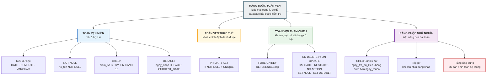
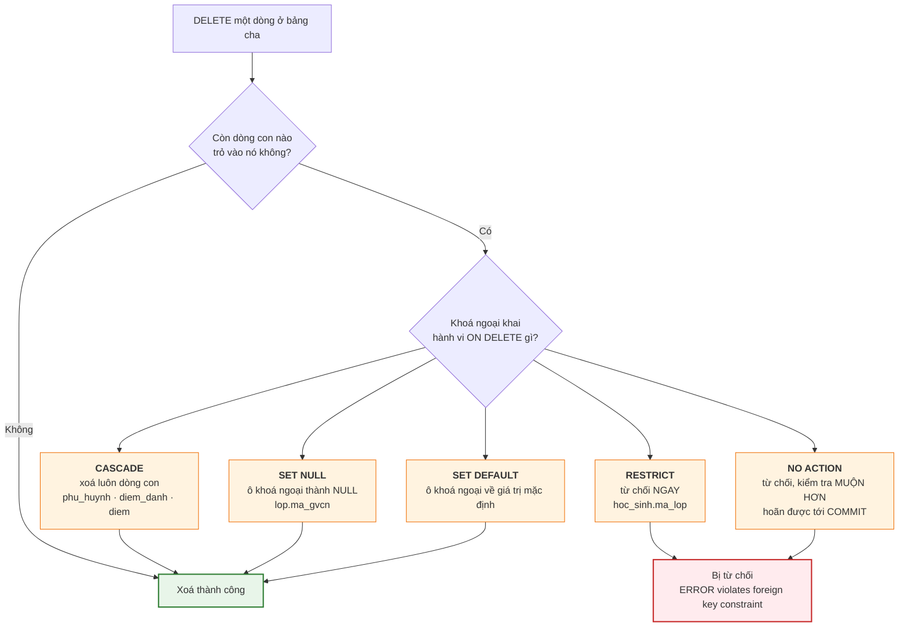

# Bài 15 — Ràng buộc toàn vẹn (Integrity Constraints)

!!! abstract "🎯 Học xong bài này, bạn sẽ"
    - Phân biệt **toàn vẹn miền**, **toàn vẹn thực thể**, **toàn vẹn tham chiếu** và **ràng buộc ngữ nghĩa**
    - Biết mỗi loại được cưỡng chế bằng cơ chế SQL nào: `NOT NULL`, `UNIQUE`, `CHECK`, `PRIMARY KEY`, `FOREIGN KEY`
    - Đọc được thông báo lỗi của PostgreSQL và biết mình vừa vi phạm ràng buộc nào
    - Chọn đúng một trong **năm** hành vi `ON DELETE` / `ON UPDATE` cho từng tình huống
    - Biết ràng buộc nào SQL **không** cưỡng chế được, và phải xử lý ở đâu

## 🧠 Câu chuyện mở đầu

Chiều thứ Sáu, cô văn thư nhập điểm kiểm tra học kỳ.

Bàn phím số bị kẹt, và thay vì `8.5` cô gõ thành `85`. Cô không để ý, bấm Lưu.

Tuần sau, phần mềm in phiếu tổng kết từng học sinh. Phiếu của bạn Nguyễn Văn An ghi điểm trung bình **13.4** — cao hơn cả điểm tối đa của thang điểm 10. Cô hiệu trưởng nhìn tờ giấy, ngẩng lên: *"Thang điểm 10 mà trung bình 13 à?"*

Cả buổi chiều hôm ấy trôi qua trong việc dò lại 480 con điểm để tìm con số sai.

Hôm sau, cô văn thư kể chuyện với anh lập trình viên. Anh hỏi lại một câu: *"Sao lúc cô bấm Lưu, phần mềm không chặn ngay?"*

Rồi anh kể tiếp một chuyện suýt còn tệ hơn. Tháng trước, có người định xoá lớp `8A1` khỏi hệ thống vì tưởng lớp đó đã giải thể. Nếu xoá thành công, **sáu học sinh** trong lớp sẽ trỏ về một mã lớp không còn tồn tại — và không ai biết các bạn ấy thuộc lớp nào nữa. May mà database **từ chối**.

Hai câu chuyện, một câu hỏi chung: **làm sao để database tự từ chối dữ liệu sai, thay vì ngoan ngoãn ghi vào rồi để con người đi dò?**

## 📖 Khái niệm & thuật ngữ

### Ràng buộc toàn vẹn là gì

**Ràng buộc toàn vẹn** (*integrity constraint*) là một **luật khai báo trong lược đồ**, mà database bắt buộc phải kiểm tra trước khi chấp nhận bất kỳ thay đổi dữ liệu nào.

Ba đặc điểm khiến nó khác hẳn việc kiểm tra trong phần mềm:

| | Kiểm tra ở phần mềm | Ràng buộc trong database |
|---|---|---|
| Ai kiểm | Từng ứng dụng tự lo | Database, **một lần cho mọi ứng dụng** |
| Bỏ sót được không | Có — viết app mới là quên | **Không** — kể cả chạy lệnh tay cũng bị chặn |
| Dữ liệu cũ sai thì sao | Vẫn nằm đó | Không thêm ràng buộc được cho tới khi dọn xong |

Đây chính là điều mà [Bài 2](../cap-0-nhap-mon/02-tu-so-giay-den-excel.md) đã nêu là lợi thế lớn nhất của database so với Excel, và [Bài 6](06-mo-hinh-quan-he.md) đã hẹn sẽ đào sâu ở bài này.

### Bốn loại toàn vẹn

Đây là bảng xương sống của cả bài:

| Loại | English | Luật | Cơ chế SQL |
|---|---|---|---|
| **Toàn vẹn miền** | *domain integrity* | Mỗi ô phải nằm trong **miền giá trị** hợp lệ của cột | Kiểu dữ liệu · `CHECK` · `NOT NULL` · `DEFAULT` |
| **Toàn vẹn thực thể** | *entity integrity* | Khoá chính **không được `NULL`** và không được trùng | `PRIMARY KEY` |
| **Toàn vẹn tham chiếu** | *referential integrity* | Khoá ngoại phải trỏ tới một dòng **có thật**, hoặc để `NULL` | `FOREIGN KEY` |
| **Ràng buộc ngữ nghĩa** | *semantic constraint* | Mọi luật nghiệp vụ khác của riêng bài toán | `CHECK` nhiều cột · trigger · tầng ứng dụng |

Ba loại đầu là **ràng buộc chung của mô hình quan hệ** — bất kỳ database nào cũng cần. Loại thứ tư thì tuỳ từng bài toán.

### Toàn vẹn miền

**Miền giá trị** đã được [Bài 6](06-mo-hinh-quan-he.md) định nghĩa: tập hợp mọi giá trị hợp lệ của một cột.

Toàn vẹn miền được cưỡng chế bằng bốn tầng, từ thô tới tinh:

| Tầng | Cơ chế | Ví dụ trong `truong_hoc` | Chặn được gì |
|---|---|---|---|
| 1 | **Kiểu dữ liệu** | `ngay_sinh DATE` | Ghi `"hôm qua"` vào — từ chối ngay |
| 2 | **`NOT NULL`** | `ho_ten VARCHAR(60) NOT NULL` | Để trống họ tên |
| 3 | **`CHECK`** | `CHECK (diem_so BETWEEN 0 AND 10)` | **Đúng con số 85 của cô văn thư** |
| 4 | **`DEFAULT`** | `ngay_nhap DATE DEFAULT CURRENT_DATE` | Quên điền thì có giá trị hợp lý thay vì `NULL` |

Ba ràng buộc `CHECK` đáng chú ý nhất của lược đồ mẫu:

```
gioi_tinh  CHECK (gioi_tinh IN ('Nam', 'Nữ'))
diem_so    CHECK (diem_so BETWEEN 0 AND 10)
khoi       CHECK (khoi BETWEEN 6 AND 9)
```

Nếu ràng buộc thứ hai đã có từ đầu — mà nó có thật — thì cô văn thư đã bị chặn ngay lúc bấm Lưu, và cả buổi chiều thứ Sáu ấy đã không mất.

!!! tip "`UNIQUE` thuộc loại nào?"
    `UNIQUE` không nằm gọn trong bốn loại trên, vì nó là luật về **quan hệ giữa các dòng** chứ không phải về một ô.

    Giáo trình thường xếp nó vào nhóm *ràng buộc khoá* (*key constraint*) cùng với `PRIMARY KEY`. Vai trò của nó đã học kỹ ở [Bài 12](12-bay-loai-khoa.md): giữ các **khoá thay thế**, và ở [Bài 14](14-chuyen-er-sang-bang.md): ép quan hệ **1:1**.

### Toàn vẹn thực thể

**Toàn vẹn thực thể** (*entity integrity*) là luật: **khoá chính không bao giờ được `NULL`**, và không bao giờ được trùng.

Lý do rất thẳng: khoá chính tồn tại để **định danh**. Một dòng mà khoá chính là `NULL` thì không định danh được — nó không thể là một thực thể hợp lệ.

Hệ quả thực tế: khai `PRIMARY KEY` là bạn nhận **hai** ràng buộc cùng lúc, kể cả khi chỉ gõ một từ:

```
ma_gv CHAR(4) PRIMARY KEY
```

tương đương với

```
ma_gv CHAR(4) NOT NULL UNIQUE
```

Phần Thực hành sẽ chứng minh điều đó bằng `information_schema`.

!!! note "Vì sao `NULL` không thể làm khoá"
    `NULL` trong SQL nghĩa là *"không biết"*, và **hai giá trị không biết thì không so sánh được với nhau**. `NULL = NULL` không trả về `true` mà trả về `NULL`.

    Vậy nếu hai dòng cùng có khoá chính `NULL`, database không có cách nào khẳng định chúng là hai dòng khác nhau hay cùng một dòng. Logic ba giá trị này sẽ được học kỹ ở **Bài 24**.

### Toàn vẹn tham chiếu

**Toàn vẹn tham chiếu** (*referential integrity*) là luật: mọi giá trị trong cột khoá ngoại phải **tồn tại thật** ở bảng cha, hoặc phải là `NULL`.

Nó chặn hai tình huống:

| Tình huống | Ví dụ | Kết quả |
|---|---|---|
| **Chèn/sửa** giá trị không có thật | Ghi `ma_lop = 'L99'` vào `hoc_sinh` | Từ chối ngay |
| **Xoá** dòng cha đang được trỏ tới | `DELETE FROM lop WHERE ma_lop = 'L01'` | Tuỳ hành vi `ON DELETE` |

Dòng thứ hai chính là chuyện suýt xảy ra ở đầu bài — và là lý do mục tiếp theo tồn tại.

Thuật ngữ cho dòng con trỏ vào một dòng cha đã biến mất: **dòng mồ côi** (*orphan row*). Toàn vẹn tham chiếu là cơ chế chống lại chúng.

### Năm hành vi `ON DELETE` và `ON UPDATE`

Khi một dòng cha bị xoá (hoặc khoá chính của nó bị đổi) mà vẫn còn dòng con trỏ vào, database phải làm **một** trong năm việc. Bạn chọn từ lúc `CREATE TABLE`.

| Hành vi | Làm gì với dòng con | Chọn khi |
|---|---|---|
| **`CASCADE`** | **Xoá luôn** dòng con (hoặc sửa theo) | Dòng con **không có ý nghĩa** khi thiếu cha — thực thể yếu |
| **`RESTRICT`** | **Từ chối** ngay lập tức | Mất dữ liệu con là chuyện nghiêm trọng, bắt người dùng xử lý tay |
| **`NO ACTION`** | Từ chối, nhưng **kiểm tra muộn hơn** (cuối câu lệnh, hoặc cuối giao dịch nếu hoãn) | Giống `RESTRICT`, nhưng cần dọn dẹp trong cùng một giao dịch |
| **`SET NULL`** | Đặt cột khoá ngoại về `NULL` | Liên kết là **tuỳ chọn** — mất cha thì con vẫn sống |
| **`SET DEFAULT`** | Đặt về **giá trị mặc định** của cột | Có một giá trị "chưa xếp" hợp lý sẵn |

`ON UPDATE` hoạt động y hệt, chỉ khác là kích hoạt khi **khoá chính bảng cha đổi giá trị** thay vì bị xoá.

!!! question "`RESTRICT` và `NO ACTION` khác nhau chỗ nào?"
    Kết quả cuối cùng giống nhau: cả hai đều **từ chối**. Khác nhau ở **thời điểm kiểm tra**.

    - `RESTRICT` kiểm **ngay lập tức**, không hoãn được trong bất kỳ hoàn cảnh nào.
    - `NO ACTION` kiểm **muộn hơn**, và nếu ràng buộc được khai `DEFERRABLE INITIALLY DEFERRED` thì việc kiểm dời hẳn tới lúc `COMMIT`.

    Sự khác biệt này rất thật. Với `NO ACTION` hoãn, bạn được phép xoá dòng cha **trước**, rồi sửa các dòng con **sau**, miễn là mọi thứ ổn thoả trước khi `COMMIT`. Với `RESTRICT` thì câu `DELETE` hỏng ngay tại chỗ, không có cơ hội sửa.

    Đây gọi là **ràng buộc hoãn** — thuật ngữ [Bài 11](11-bieu-do-er-crows-foot.md) đã nhắc tới — và phần Thực hành sẽ chạy thật cả hai để bạn thấy khác biệt.

    Nếu bạn không viết gì cả, chuẩn SQL quy định mặc định là **`NO ACTION`**.

Năm hành vi này trong `truong_hoc` được dùng như sau:

| Khoá ngoại | Hành vi | Lý do |
|---|---|---|
| `phu_huynh.ma_hs` | `CASCADE` | PHỤ HUYNH là **thực thể yếu** — chết theo chủ |
| `diem_danh.ma_hs` | `CASCADE` | Thực thể yếu |
| `diem.ma_hs`, `muon_sach.ma_hs` | `CASCADE` | Điểm và lượt mượn vô nghĩa khi học sinh không còn |
| `hoc_sinh.ma_lop` | `RESTRICT` | Học sinh **vẫn là con người có thật** khi lớp giải thể — bắt xử lý tay |
| `diem.ma_mon`, `muon_sach.ma_sach` | `RESTRICT` | Không được xoá môn học / cuốn sách còn để lại dấu vết |
| `lop.ma_gvcn` | `SET NULL` | Lớp vẫn sống khi giáo viên nghỉ — chỉ tạm thời chưa có chủ nhiệm |
| `phan_cong_day.*` | `CASCADE` | Dòng phân công vô nghĩa khi thiếu bất kỳ phía nào |

Đọc bảng này là đọc được **ý đồ thiết kế** của cả database. Đây là lý do [Bài 9](09-participation-va-thuc-the-yeu.md) nói *"đọc `confdeltype` là biết bảng nào phụ thuộc bảng nào"*.

### Ràng buộc ngữ nghĩa

**Ràng buộc ngữ nghĩa** (*semantic constraint*, còn gọi là *business rule* hay *ràng buộc do người dùng định nghĩa*) là mọi luật riêng của bài toán, không suy ra được từ cấu trúc bảng.

Ba mức độ, tuỳ luật khó tới đâu:

| Mức | Cơ chế | Ví dụ trong `truong_hoc` |
|---|---|---|
| Trong **một dòng** | `CHECK` nhiều cột | `CHECK (ngay_tra_du_kien >= ngay_muon)` trong `muon_sach` |
| Trong **nhiều dòng / nhiều bảng** | Trigger | *"Một học sinh không mượn quá 3 cuốn cùng lúc"* |
| Cần nhìn **toàn hệ thống** | Tầng ứng dụng | *"Tổng số tiết dạy của một giáo viên không quá 20/tuần"* |

!!! warning "Có ràng buộc SQL KHÔNG cưỡng chế được"
    [Bài 14](14-chuyen-er-sang-bang.md) đã liệt kê ba loại, và đây là chỗ nói cho hết:

    | Luật | Vì sao `CHECK` không làm được |
    |---|---|
    | *"Mỗi lớp phải có ít nhất một học sinh"* | Cần đếm dòng ở **bảng khác** |
    | *"Một học sinh không mượn quá 3 cuốn cùng lúc"* | Cần đếm **các dòng khác** cùng bảng |
    | *"Tổng số tiết dạy của một giáo viên không quá 20 mỗi tuần"* | Cần cộng qua **nhiều dòng, nhiều bảng** |
    | *"Mọi người trong trường phải thuộc một lớp con"* | Cần nhìn nhiều bảng cùng lúc |

    Lý do chung: `CHECK` trong PostgreSQL chỉ được nhìn **đúng dòng đang xét**. Muốn vượt ra ngoài phải dùng trigger.

    Điều cần làm ngay bây giờ: **ghi những luật này vào tài liệu thiết kế**. Ràng buộc không được ghi lại là ràng buộc sẽ bị vi phạm.

!!! tip "Đừng vội xếp mọi luật nghiệp vụ vào nhóm 'phải dùng trigger'"
    Luật *"mỗi lớp, mỗi môn, mỗi học kỳ chỉ một giáo viên dạy"* **không** nằm trong bảng trên, dù trông rất giống. Nó cưỡng chế được trọn vẹn bằng SQL thuần — chỉ cần `UNIQUE (ma_mon, ma_lop, hoc_ky)` trên `phan_cong_day`, như [Bài 14](14-chuyen-er-sang-bang.md) đã phân tích.

    Phép thử: **luật này có diễn đạt được thành 'tổ hợp cột X không bao giờ trùng' không?** Nếu có, `UNIQUE` là đủ. Chỉ khi luật cần **đếm** hoặc **cộng** qua nhiều dòng thì mới phải dùng trigger.

### Bảng thuật ngữ

| Tiếng Việt | English | Nghĩa dễ hiểu |
|---|---|---|
| Ràng buộc toàn vẹn | *integrity constraint* | Luật khai trong lược đồ, database bắt buộc kiểm tra |
| Toàn vẹn miền | *domain integrity* | Mỗi ô nằm trong miền giá trị hợp lệ |
| Toàn vẹn thực thể | *entity integrity* | Khoá chính không `NULL`, không trùng |
| Toàn vẹn tham chiếu | *referential integrity* | Khoá ngoại luôn trỏ tới dòng có thật |
| Ràng buộc ngữ nghĩa | *semantic constraint* | Luật nghiệp vụ riêng của bài toán |
| Dòng mồ côi | *orphan row* | Dòng con trỏ tới dòng cha đã biến mất |
| Ràng buộc hoãn | *deferrable constraint* | Ràng buộc chỉ kiểm tra lúc `COMMIT` |

## 🖼️ Sơ đồ

### Sơ đồ 1 — Bốn loại toàn vẹn và cơ chế SQL tương ứng



Ô đỏ ở góc dưới bên phải là chỗ duy nhất database **không** lo hộ bạn. Càng đẩy được nhiều luật lên phía trên bao nhiêu, hệ thống càng khó hỏng bấy nhiêu.

### Sơ đồ 2 — Chuyện gì xảy ra khi xoá một dòng cha



Ba nhánh dẫn tới *"Xoá thành công"* và hai nhánh dẫn tới lỗi. Chọn nhánh nào là quyết định của **người thiết kế**, ghi vào lược đồ từ lúc `CREATE TABLE`.

## 💻 Thực hành

### Đọc toàn bộ ràng buộc của một bảng

```sql
SELECT conname AS ten_rang_buoc,
       CASE contype WHEN 'p' THEN 'PRIMARY KEY'
                    WHEN 'u' THEN 'UNIQUE'
                    WHEN 'f' THEN 'FOREIGN KEY'
                    WHEN 'c' THEN 'CHECK' END AS loai,
       pg_get_constraintdef(oid) AS dinh_nghia
FROM pg_constraint
WHERE conrelid = 'diem'::regclass
ORDER BY contype, conname;
```

Kết quả gồm ba ràng buộc `CHECK` (một cho `hoc_ky`, một cho `loai_diem`, một cho `diem_so`), một `PRIMARY KEY` và hai `FOREIGN KEY`.

Chú ý tên `diem_diem_so_check` — PostgreSQL tự đặt theo mẫu `<bảng>_<cột>_check` khi bạn viết `CHECK` ngay trên dòng khai cột. Nhớ mẫu này thì đọc thông báo lỗi rất nhanh.

Còn `NOT NULL` thì **không** nằm trong `pg_constraint`; nó là một thuộc tính của cột:

```sql
SELECT column_name, is_nullable, column_default
FROM information_schema.columns
WHERE table_schema = 'public' AND table_name = 'diem'
ORDER BY ordinal_position;
```

Bảy dòng. Chú ý `ma_diem` có `is_nullable = NO` dù lược đồ **không** viết `NOT NULL` — đó là **toàn vẹn thực thể** mà PostgreSQL tự thêm vào khi thấy `PRIMARY KEY`. Và `ngay_nhap` có `column_default` là `CURRENT_DATE`.

### Toàn vẹn miền — chính con số 85 của cô văn thư

<!-- sql:co-y-loi -->
```sql
INSERT INTO diem (ma_hs, ma_mon, hoc_ky, loai_diem, diem_so, ngay_nhap)
VALUES ('HS001', 'MH01', 1, 'Học kỳ', 85, '2026-01-10');
```

PostgreSQL 16 từ chối:

```
ERROR:  new row for relation "diem" violates check constraint "diem_diem_so_check"
DETAIL:  Failing row contains (..., 85.00, ...).
```

Buổi chiều thứ Sáu của cô văn thư được cứu bởi đúng một dòng trong lược đồ. Thông báo lỗi còn gọi tên **ràng buộc** và in **cả dòng gây lỗi** — quá đủ để biết sửa ở đâu.

Thử tiếp một vi phạm miền kiểu khác — giá trị ngoài danh sách cho phép:

<!-- sql:co-y-loi -->
```sql
INSERT INTO giao_vien (ma_gv, ho_ten, ngay_sinh, gioi_tinh, mon_chuyen_mon, email, luong)
VALUES ('GV98', 'Thử Giới Tính', '1990-01-01', 'Nu', 'Toán', 'thu98@thcs.edu.vn', 10000000);
```

Bị chặn bởi `giao_vien_gioi_tinh_check`, vì lược đồ khai `CHECK (gioi_tinh IN ('Nam', 'Nữ'))` — mà `'Nu'` không dấu thì không nằm trong danh sách.

!!! tip "Vì sao ví dụ trên dùng `'Nu'` chứ không dùng `'Khác'` cho dễ hiểu?"
    Vì **hai tầng của toàn vẹn miền chặn theo thứ tự**, và tầng thô chặn trước.

    Cột khai `gioi_tinh VARCHAR(3)`. Chuỗi `'Khác'` dài **4 ký tự**, nên PostgreSQL từ chối ngay ở bước **ép kiểu** với `ERROR: value too long for type character varying(3)` — `CHECK` còn chưa được chạy tới.

    Muốn dạy `CHECK` thì phải chọn một giá trị **hợp lệ về kiểu nhưng sai về nội dung**. `'Nu'` dài 2 ký tự nên lọt qua tầng kiểu, rồi mới đụng `CHECK`.

    Đây là điều đáng nhớ khi đọc thông báo lỗi: **lỗi bạn nhận được là lỗi của tầng gần nhất**, không nhất thiết là lỗi bạn đang nghĩ tới.

### Toàn vẹn thực thể — khoá chính không được `NULL`

Trước hết, xem PostgreSQL tự thêm `NOT NULL` như thế nào:

```sql
SELECT a.attrelid::regclass AS bang,
       a.attname            AS cot_khoa_chinh,
       a.attnotnull         AS khong_cho_null
FROM pg_constraint c
JOIN pg_attribute a
  ON a.attrelid = c.conrelid AND a.attnum = ANY (c.conkey)
WHERE c.contype = 'p'
  AND c.conrelid::regclass::text IN ('giao_vien', 'lop', 'hoc_sinh', 'mon_hoc', 'sach')
ORDER BY a.attrelid::regclass::text;
```

Năm dòng, cả năm đều `khong_cho_null = t`. Trong `dataset/02-chuan-hoa.sql`, **không** cột nào trong số đó được viết `NOT NULL` — chúng chỉ được viết `PRIMARY KEY`.

Bây giờ thử vi phạm:

<!-- sql:co-y-loi -->
```sql
INSERT INTO mon_hoc (ma_mon, ten_mon, so_tiet_tuan) VALUES (NULL, 'Môn thử', 2);
```

```
ERROR:  null value in column "ma_mon" of relation "mon_hoc" violates not-null constraint
```

Và thử trùng khoá chính:

<!-- sql:co-y-loi -->
```sql
INSERT INTO mon_hoc (ma_mon, ten_mon, so_tiet_tuan) VALUES ('MH01', 'Môn thử', 2);
```

```
ERROR:  duplicate key value violates unique constraint "mon_hoc_pkey"
```

Hai thông báo khác nhau cho **hai nửa** của toàn vẹn thực thể: nửa `NOT NULL` và nửa `UNIQUE`.

### Toàn vẹn tham chiếu — hai chiều vi phạm

**Chiều 1 — chèn giá trị không có thật:**

<!-- sql:co-y-loi -->
```sql
INSERT INTO hoc_sinh (ma_hs, ho_ten, ngay_sinh, gioi_tinh, dia_chi, ma_lop)
VALUES ('HS999', 'Học Sinh Thử', '2012-01-01', 'Nam', '1 Thử Nghiệm', 'L99');
```

```
ERROR:  insert or update on table "hoc_sinh" violates foreign key constraint "hoc_sinh_ma_lop_fkey"
DETAIL:  Key (ma_lop)=(L99) is not present in table "lop".
```

**Chiều 2 — xoá dòng cha đang được trỏ tới.** Đây đúng là chuyện suýt xảy ra ở đầu bài:

<!-- sql:co-y-loi -->
```sql
DELETE FROM lop WHERE ma_lop = 'L01';
```

```
ERROR:  update or delete on table "lop" violates foreign key constraint "hoc_sinh_ma_lop_fkey" on table "hoc_sinh"
DETAIL:  Key (ma_lop)=(L01) is still referenced from table "hoc_sinh".
```

Sáu học sinh của lớp 8A1 đã được cứu bởi hai chữ `ON DELETE RESTRICT`.

Đọc kỹ hai thông báo: chúng gọi tên **cùng một ràng buộc** `hoc_sinh_ma_lop_fkey`, nhưng mô tả khác nhau — `is not present in` với `is still referenced from`. Đó là cách nhanh nhất để biết bạn đang vi phạm chiều nào.

Còn muốn xem hành vi `ON DELETE` của mọi khoá ngoại mà **không** phải xoá gì:

```sql
SELECT conrelid::regclass AS bang,
       conname            AS ten_rang_buoc,
       CASE confdeltype WHEN 'a' THEN 'NO ACTION'
                        WHEN 'r' THEN 'RESTRICT'
                        WHEN 'c' THEN 'CASCADE'
                        WHEN 'n' THEN 'SET NULL'
                        WHEN 'd' THEN 'SET DEFAULT' END AS hanh_vi_on_delete
FROM pg_constraint
WHERE contype = 'f'
  AND connamespace = 'public'::regnamespace
ORDER BY 3, conrelid::regclass::text;
```

Mười một dòng — đúng bằng số cột khoá ngoại. Đọc cột cuối là đọc được toàn bộ bảng ý đồ thiết kế ở phần khái niệm: `lop.ma_gvcn` là `SET NULL`, `hoc_sinh.ma_lop` và hai khoá ngoại trỏ về `mon_hoc`/`sach` là `RESTRICT`, còn lại là `CASCADE`.

### Năm hành vi `ON DELETE`, chạy thật trên bảng nháp

Các bảng thật đã có ràng buộc cố định, nên muốn thử `SET NULL` và `SET DEFAULT` ta phải dựng bảng nháp riêng. Mọi bảng đều có tiền tố `b15_` và sẽ được xoá ở cuối bài.

```sql
DROP TABLE IF EXISTS b15_hs_cascade CASCADE;
DROP TABLE IF EXISTS b15_hs_setnull CASCADE;
DROP TABLE IF EXISTS b15_hs_setdefault CASCADE;
DROP TABLE IF EXISTS b15_hs_restrict CASCADE;
DROP TABLE IF EXISTS b15_hs_noaction CASCADE;
DROP TABLE IF EXISTS b15_lop CASCADE;

CREATE TABLE b15_lop (
    ma_lop  CHAR(3)     PRIMARY KEY,
    ten_lop VARCHAR(20) NOT NULL
);

INSERT INTO b15_lop VALUES
('L00', 'Chưa xếp lớp'),
('L91', 'Thử CASCADE'),
('L92', 'Thử SET NULL'),
('L93', 'Thử SET DEFAULT'),
('L94', 'Thử RESTRICT'),
('L95', 'Thử NO ACTION');

CREATE TABLE b15_hs_cascade (
    ma_hs  CHAR(5) PRIMARY KEY,
    ma_lop CHAR(3) REFERENCES b15_lop(ma_lop) ON DELETE CASCADE
);

CREATE TABLE b15_hs_setnull (
    ma_hs  CHAR(5) PRIMARY KEY,
    ma_lop CHAR(3) REFERENCES b15_lop(ma_lop) ON DELETE SET NULL
);

CREATE TABLE b15_hs_setdefault (
    ma_hs  CHAR(5) PRIMARY KEY,
    ma_lop CHAR(3) DEFAULT 'L00' REFERENCES b15_lop(ma_lop) ON DELETE SET DEFAULT
);

CREATE TABLE b15_hs_restrict (
    ma_hs  CHAR(5) PRIMARY KEY,
    ma_lop CHAR(3) REFERENCES b15_lop(ma_lop) ON DELETE RESTRICT
);

CREATE TABLE b15_hs_noaction (
    ma_hs  CHAR(5) PRIMARY KEY,
    ma_lop CHAR(3) REFERENCES b15_lop(ma_lop)
               ON DELETE NO ACTION DEFERRABLE INITIALLY DEFERRED
);

INSERT INTO b15_hs_cascade    VALUES ('HS901', 'L91');
INSERT INTO b15_hs_setnull    VALUES ('HS902', 'L92');
INSERT INTO b15_hs_setdefault VALUES ('HS903', 'L93');
INSERT INTO b15_hs_restrict   VALUES ('HS904', 'L94');
INSERT INTO b15_hs_noaction   VALUES ('HS905', 'L95');
```

Chú ý dòng khai `b15_hs_setdefault`: nó có **cả** `DEFAULT 'L00'` **và** `ON DELETE SET DEFAULT`. Thiếu một trong hai là hỏng — và `'L00'` bắt buộc phải **tồn tại thật** trong `b15_lop`, nếu không thì lúc xoá sẽ vi phạm chính khoá ngoại đó.

Bây giờ xoá ba lớp cha cùng lúc:

```sql
DELETE FROM b15_lop WHERE ma_lop IN ('L91', 'L92', 'L93');
```

Thành công. Xem ba bảng con giờ ra sao:

```sql
SELECT 'CASCADE' AS hanh_vi, count(*) AS so_dong_con_lai,
       count(ma_lop) AS so_dong_con_gan_lop, max(ma_lop) AS gia_tri_ma_lop
FROM b15_hs_cascade
UNION ALL
SELECT 'SET NULL', count(*), count(ma_lop), max(ma_lop) FROM b15_hs_setnull
UNION ALL
SELECT 'SET DEFAULT', count(*), count(ma_lop), max(ma_lop) FROM b15_hs_setdefault;
```

Ba dòng, ba kết cục hoàn toàn khác nhau:

| Hành vi | Số dòng còn lại | `ma_lop` sau khi xoá cha | Đọc ra |
|---|---|---|---|
| `CASCADE` | `0` | — | `HS901` **biến mất theo** lớp |
| `SET NULL` | `1` | `NULL` | `HS902` còn sống, nhưng **không thuộc lớp nào** |
| `SET DEFAULT` | `1` | `L00` | `HS903` còn sống, được đẩy về lớp **"Chưa xếp lớp"** |

Ba dòng này là toàn bộ bài học về `ON DELETE`. Cùng một câu `DELETE`, ba lược đồ khác nhau cho ba kết quả khác nhau — và không có kết quả nào "đúng" hơn kết quả nào, chỉ có kết quả **phù hợp với nghiệp vụ** hay không.

Còn `RESTRICT` thì từ chối thẳng:

<!-- sql:co-y-loi -->
```sql
DELETE FROM b15_lop WHERE ma_lop = 'L94';
```

```
ERROR:  update or delete on table "b15_lop" violates foreign key constraint "b15_hs_restrict_ma_lop_fkey" on table "b15_hs_restrict"
DETAIL:  Key (ma_lop)=(L94) is still referenced from table "b15_hs_restrict".
```

### `NO ACTION` hoãn — làm được điều `RESTRICT` không làm được

Đây là chỗ hai hành vi tách nhau. Với `NO ACTION DEFERRABLE INITIALLY DEFERRED`, ta được phép xoá cha **trước** rồi dọn con **sau**, miễn là xong trước `COMMIT`:

```sql
BEGIN;
DELETE FROM b15_lop WHERE ma_lop = 'L95';
UPDATE b15_hs_noaction SET ma_lop = 'L00' WHERE ma_lop = 'L95';
COMMIT;
```

**Giao dịch thành công.** Ngay sau câu `DELETE`, bảng `b15_hs_noaction` tạm thời có một dòng mồ côi — nhưng vì ràng buộc được **hoãn**, database chưa kiểm. Tới lúc `COMMIT` thì dòng đó đã được sửa, mọi thứ hợp lệ.

```sql
SELECT ma_hs, ma_lop FROM b15_hs_noaction;
```

Một dòng: `HS905` | `L00`.

Thử đúng trình tự đó với `RESTRICT` thì **hỏng ngay ở câu `DELETE`**, không có cơ hội chạy tới câu `UPDATE`. Đó là toàn bộ khác biệt giữa hai hành vi trông rất giống nhau này.

### `ON UPDATE CASCADE`

Hành vi `ON UPDATE` kích hoạt khi khoá chính bảng cha **đổi giá trị**:

```sql
DROP TABLE IF EXISTS b15_hs_upd CASCADE;
DROP TABLE IF EXISTS b15_lop_upd CASCADE;

CREATE TABLE b15_lop_upd (
    ma_lop  CHAR(3)     PRIMARY KEY,
    ten_lop VARCHAR(20) NOT NULL
);

CREATE TABLE b15_hs_upd (
    ma_hs  CHAR(5) PRIMARY KEY,
    ma_lop CHAR(3) NOT NULL REFERENCES b15_lop_upd(ma_lop)
               ON UPDATE CASCADE ON DELETE RESTRICT
);

INSERT INTO b15_lop_upd VALUES ('L81', 'Lớp thử');
INSERT INTO b15_hs_upd  VALUES ('HS911', 'L81');

UPDATE b15_lop_upd SET ma_lop = 'L82' WHERE ma_lop = 'L81';

SELECT ma_hs, ma_lop FROM b15_hs_upd;
```

Một dòng: `HS911` | `L82`. Dòng con **tự đổi theo** mà không cần ai viết câu `UPDATE` thứ hai.

!!! tip "Nhưng đừng coi `ON UPDATE CASCADE` là giấy phép đổi khoá chính"
    Nó chỉ cứu bạn trong phạm vi một database. Nếu mã lớp đã được in lên thẻ học sinh, đã nằm trong file Excel của phòng giáo vụ, đã lưu trong hệ thống khác — thì `CASCADE` không với tới những chỗ đó.

    Đây đúng là lý do [Bài 12](12-bay-loai-khoa.md) khuyên chọn khoá chính **bất biến**. `ON UPDATE CASCADE` là lưới an toàn, không phải lời mời.

### Ràng buộc ngữ nghĩa — `CHECK` nhiều cột

Bảng `muon_sach` có hai ràng buộc `CHECK` nhìn **từ hai cột trở lên**:

```sql
SELECT conname, pg_get_constraintdef(oid) AS dinh_nghia
FROM pg_constraint
WHERE conrelid = 'muon_sach'::regclass AND contype = 'c'
ORDER BY conname;
```

Hai dòng, ứng với hai luật nghiệp vụ: *"ngày trả dự kiến không được trước ngày mượn"* và *"ngày trả thực tế, nếu có, không được trước ngày mượn"*.

Chú ý vế `ngay_tra_thuc_te IS NULL OR ...` trong ràng buộc thứ hai — và hãy đọc kỹ, vì chỗ này rất dễ hiểu ngược.

Vế đó **không** phải để cho lượt mượn chưa trả lọt qua. Bỏ nó đi thì lượt mượn chưa trả **vẫn được nhận**, vì `CHECK` chỉ từ chối khi biểu thức cho ra `false`; gặp `NULL` thì biểu thức cho ra `UNKNOWN`, và `CHECK` **chấp nhận**.

Vế đó ở đó để **nói rõ ý định** cho người đọc lược đồ: *"trường hợp chưa trả là hợp lệ, tôi đã nghĩ tới nó rồi."* Phần Lỗi thường gặp sẽ quay lại điểm này, và **Bài 24** sẽ dạy kỹ logic ba giá trị.

Thử vi phạm:

<!-- sql:co-y-loi -->
```sql
INSERT INTO muon_sach (ma_hs, ma_sach, ngay_muon, ngay_tra_du_kien, ngay_tra_thuc_te)
VALUES ('HS001', 'S001', '2026-09-20', '2026-09-10', NULL);
```

PostgreSQL từ chối vì ngày trả dự kiến (`10/09`) sớm hơn ngày mượn (`20/09`) — vi phạm ràng buộc `CHECK` cấp bảng của `muon_sach`.

Và đây là luật mà `CHECK` **không** làm nổi — *"mỗi lớp phải có ít nhất một học sinh"*:

```sql
SELECT l.ma_lop, l.ten_lop, count(h.ma_hs) AS so_hoc_sinh
FROM lop l
LEFT JOIN hoc_sinh h ON h.ma_lop = l.ma_lop
GROUP BY l.ma_lop, l.ten_lop
HAVING count(h.ma_hs) = 0;
```

Kết quả **0 dòng** — hiện tại mọi lớp đều có học sinh. Nhưng đó là do **dữ liệu**, không do lược đồ: tạo một lớp mới ngay bây giờ thì nó rỗng và không gì ngăn được. Đúng như [Bài 9](09-participation-va-thuc-the-yeu.md) đã cảnh báo về ràng buộc ở phía "nhiều".

### Dọn dẹp

```sql
DROP TABLE IF EXISTS b15_hs_cascade CASCADE;
DROP TABLE IF EXISTS b15_hs_setnull CASCADE;
DROP TABLE IF EXISTS b15_hs_setdefault CASCADE;
DROP TABLE IF EXISTS b15_hs_restrict CASCADE;
DROP TABLE IF EXISTS b15_hs_noaction CASCADE;
DROP TABLE IF EXISTS b15_lop CASCADE;
DROP TABLE IF EXISTS b15_hs_upd CASCADE;
DROP TABLE IF EXISTS b15_lop_upd CASCADE;
```

Kiểm tra dataset gốc vẫn nguyên vẹn sau mọi thí nghiệm:

```sql
SELECT 'hoc_sinh' AS bang, count(*) AS so_dong FROM hoc_sinh
UNION ALL SELECT 'lop',       count(*) FROM lop
UNION ALL SELECT 'giao_vien', count(*) FROM giao_vien
UNION ALL SELECT 'diem',      count(*) FROM diem;
```

`40`, `6`, `8`, `480` — đúng như ban đầu. Mọi câu lệnh phá hoại trong bài đều đã bị ràng buộc từ chối, hoặc chỉ chạy trên bảng nháp.

## ⚠️ Lỗi thường gặp

!!! warning "Lỗi 1: Kiểm tra dữ liệu ở ứng dụng thay vì ở database"
    Viết đoạn kiểm tra *"điểm phải từ 0 tới 10"* trong phần mềm rồi bỏ `CHECK` trong lược đồ cho "nhẹ".

    Vấn đề: dữ liệu vào database bằng **nhiều đường** — phần mềm web, ứng dụng di động, script nhập liệu, lệnh tay của quản trị viên. Mỗi đường là một chỗ có thể quên kiểm.

    Ràng buộc trong lược đồ chặn **mọi** đường, kể cả những đường chưa được viết ra. Kiểm ở ứng dụng vẫn nên làm — để báo lỗi thân thiện — nhưng đó là **lớp thứ hai**, không phải lớp duy nhất.

!!! warning "Lỗi 2: Dùng `ON DELETE CASCADE` cho mọi khoá ngoại"
    `CASCADE` trông tiện: không bao giờ gặp lỗi khoá ngoại nữa. Nhưng nó cũng nghĩa là **xoá nhầm một dòng có thể quét sạch nửa database** mà không hỏi câu nào.

    Xoá một lớp với `CASCADE` sẽ kéo theo học sinh, rồi phụ huynh, rồi điểm, rồi lượt mượn sách, rồi điểm danh — hàng trăm dòng biến mất vì một cú bấm.

    Quy tắc chọn: `CASCADE` **chỉ** dùng cho quan hệ **thực thể yếu** ([Bài 9](09-participation-va-thuc-the-yeu.md)) — nơi dòng con thật sự vô nghĩa nếu thiếu cha. Còn lại dùng `RESTRICT`, bắt người dùng nghĩ một lần nữa.

!!! warning "Lỗi 3: `ON DELETE SET NULL` trên cột `NOT NULL`"
    Khai `ma_lop CHAR(3) NOT NULL REFERENCES lop(ma_lop) ON DELETE SET NULL`.

    Hai ràng buộc này **mâu thuẫn**: khi xoá lớp, database muốn đặt `NULL` vào một cột không cho phép `NULL`. PostgreSQL chấp nhận lúc `CREATE TABLE` nhưng sẽ báo lỗi vào đúng lúc bạn xoá — tức là lúc khó chịu nhất.

    `SET NULL` chỉ có nghĩa khi tham gia là **bộ phận**. Còn tham gia toàn phần thì phải chọn `CASCADE` hoặc `RESTRICT`.

!!! warning "Lỗi 4: `ON DELETE SET DEFAULT` mà giá trị mặc định không tồn tại"
    Khai `ma_lop CHAR(3) DEFAULT 'L00' REFERENCES lop(ma_lop) ON DELETE SET DEFAULT`, nhưng trong bảng `lop` **không có** dòng nào mã `L00`.

    Lúc xoá cha, database cố đặt `'L00'` vào cột con — và lập tức vi phạm chính khoá ngoại đó. Câu `DELETE` hỏng, kèm một thông báo lỗi khó hiểu vì nó nhắc tới một giá trị bạn chưa từng gõ.

    Dùng `SET DEFAULT` thì **luôn phải tạo sẵn dòng mặc định** ở bảng cha trước.

!!! warning "Lỗi 5: Tưởng `CHECK` chặn được giá trị `NULL`"
    Khai `dia_chi VARCHAR(120) CHECK (length(dia_chi) >= 5)` rồi yên tâm rằng cột này không thể để trống.

    Không đúng. **`CHECK` chỉ từ chối khi biểu thức cho ra `false`.** Khi cột là `NULL`, biểu thức cho ra `UNKNOWN`, và `CHECK` **chấp nhận** dòng đó. Muốn cấm trống thì phải khai thêm `NOT NULL` — hai ràng buộc riêng biệt, lo hai việc khác nhau.

    Hệ quả ngược lại cũng đúng, và nó giải thích lược đồ của `muon_sach`: câu `CHECK (ngay_tra_thuc_te >= ngay_muon)` **không** chặn lượt mượn chưa trả, vì `NULL >= ngày` cho ra `UNKNOWN`. Vế `ngay_tra_thuc_te IS NULL OR ...` trong lược đồ mẫu **không làm thay đổi hành vi** — nó chỉ ghi rõ ý định cho người đọc, và đó vẫn là cách viết nên theo.

    Nhớ một câu: **`NOT NULL` chặn ô trống, `CHECK` chặn ô sai.** **Bài 24** sẽ dạy kỹ logic ba giá trị.

!!! warning "Lỗi 6: Thêm ràng buộc vào bảng đang có dữ liệu sai"
    Chạy `ALTER TABLE lop ALTER COLUMN ma_gvcn SET NOT NULL` trong khi lớp 9A3 đang để trống.

    PostgreSQL **từ chối**, và nó đúng: cho phép thì lược đồ sẽ nói một điều mà dữ liệu không thoả mãn.

    Quy trình đúng luôn gồm ba bước: **(1)** tìm mọi dòng vi phạm, **(2)** sửa hoặc xoá chúng, **(3)** rồi mới `ALTER`. Bỏ qua bước 1 là dấu hiệu chắc chắn của một lần triển khai thất bại.

## ✍️ Bài tập

1. Với mỗi luật dưới đây, cho biết thuộc **loại toàn vẹn** nào và dùng **cơ chế SQL** nào:

    a. Lương giáo viên phải lớn hơn 0.
    b. Mỗi mã học sinh chỉ xuất hiện một lần.
    c. Mã lớp ghi trong `hoc_sinh` phải là một lớp có thật.
    d. Số tiết mỗi tuần nằm trong khoảng 1–10.
    e. Một học sinh không được mượn quá 3 cuốn sách cùng lúc.

2. Trường quyết định: *"Khi xoá một cuốn sách khỏi thư viện, mọi lượt mượn cuốn đó vẫn phải được giữ lại để tra cứu lịch sử."* Hành vi `ON DELETE` nào phù hợp? Lược đồ hiện tại đang dùng gì, và cần sửa thế nào?

3. Viết câu SQL liệt kê **mọi ràng buộc `CHECK`** của 10 bảng trong `truong_hoc`, kèm định nghĩa. Có bao nhiêu ràng buộc nhìn từ **hai cột trở lên**?

4. Một bạn khai bảng như sau:

    ```
    thiet_bi(ma_tb CHAR(5) PRIMARY KEY,
             ten_tb VARCHAR(50),
             ma_phong CHAR(4) NOT NULL REFERENCES phong_hoc(ma_phong) ON DELETE SET NULL,
             tinh_trang VARCHAR(20) DEFAULT 'Tốt')
    ```

    Chỉ ra **hai** vấn đề và sửa lại.

5. Giải thích vì sao `PRIMARY KEY` **không** tương đương với `UNIQUE` đơn thuần. Viết một câu SQL trên `truong_hoc` chứng minh sự khác biệt.

??? success "Đáp án"
    **Câu 1.**

    | | Luật | Loại toàn vẹn | Cơ chế |
    |---|---|---|---|
    | a | Lương > 0 | **Miền** | `CHECK (luong > 0)` |
    | b | Mã học sinh không trùng | **Thực thể** | `PRIMARY KEY (ma_hs)` |
    | c | Mã lớp phải có thật | **Tham chiếu** | `FOREIGN KEY (ma_lop) REFERENCES lop` |
    | d | Số tiết 1–10 | **Miền** | `CHECK (so_tiet_tuan BETWEEN 1 AND 10)` |
    | e | Không quá 3 cuốn cùng lúc | **Ngữ nghĩa** | **Trigger** — `CHECK` không đếm được dòng khác |

    Bốn luật đầu đều đã có sẵn trong `dataset/02-chuan-hoa.sql`. Luật thứ năm thì không, và cũng không thể có bằng `CHECK`.

    **Câu 2.**
    Cần **`RESTRICT`** — và lược đồ hiện tại **đã đúng**:

    ```
    ma_sach CHAR(4) NOT NULL REFERENCES sach(ma_sach) ON DELETE RESTRICT
    ```

    `RESTRICT` bảo đảm không ai xoá được cuốn sách còn để lại lịch sử mượn. Muốn "xoá" một cuốn khỏi thư viện thì cách đúng là thêm cột trạng thái (`da_thanh_ly BOOLEAN`) và đánh dấu, chứ không `DELETE` — kỹ thuật này gọi là **xoá mềm** (*soft delete*).

    Nếu đổi sang `CASCADE` thì xoá một cuốn sách sẽ quét sạch lịch sử mượn của nó — đúng điều đề bài cấm.

    **Câu 3.**

    ```sql
    SELECT conrelid::regclass AS bang,
           conname            AS ten_rang_buoc,
           pg_get_constraintdef(oid) AS dinh_nghia
    FROM pg_constraint
    WHERE contype = 'c'
      AND conrelid::regclass::text IN
          ('giao_vien', 'lop', 'hoc_sinh', 'phu_huynh', 'mon_hoc',
           'phan_cong_day', 'diem', 'sach', 'muon_sach', 'diem_danh')
    ORDER BY conrelid::regclass::text, conname;
    ```

    Trong kết quả, **hai** ràng buộc nhìn từ hai cột trở lên, và cả hai đều thuộc `muon_sach`: một so sánh `ngay_tra_du_kien` với `ngay_muon`, một so sánh `ngay_tra_thuc_te` với `ngay_muon`.

    Dấu hiệu nhận ra chúng ngay trong kết quả: tên do PostgreSQL tự đặt **không** chứa tên cột, vì ràng buộc được khai ở **cấp bảng** chứ không nằm trên một dòng cột nào.

    **Câu 4.**
    Hai vấn đề:

    1. **`NOT NULL` mâu thuẫn với `ON DELETE SET NULL`.** Xoá một phòng học thì database muốn đặt `NULL` vào `ma_phong`, nhưng cột đó cấm `NULL`. Câu `DELETE` sẽ hỏng.

        Mà ở đây `NOT NULL` là **đúng** — [Bài 9](09-participation-va-thuc-the-yeu.md) đã xác định `THIẾT BỊ` là **thực thể yếu** của `PHÒNG HỌC`. Vậy phải sửa hành vi: `ON DELETE CASCADE`.

    2. **`ten_tb` thiếu `NOT NULL`.** Một thiết bị không tên thì dòng dữ liệu vô dụng. Mọi cột bắt buộc về nghiệp vụ đều nên khai `NOT NULL`.

    Sửa lại (và nhân tiện dùng luôn khoá bộ phận của Bước 2, [Bài 14](14-chuyen-er-sang-bang.md)):

    ```
    thiet_bi(ma_phong CHAR(4) NOT NULL REFERENCES phong_hoc(ma_phong) ON DELETE CASCADE,
             so_thu_tu SMALLINT NOT NULL,
             ten_tb VARCHAR(50) NOT NULL,
             tinh_trang VARCHAR(20) NOT NULL DEFAULT 'Tốt',
             PRIMARY KEY (ma_phong, so_thu_tu))
    ```

    **Câu 5.**
    Khác nhau ở **hai** điểm:

    1. `PRIMARY KEY` **tự động** kèm `NOT NULL`; `UNIQUE` thì không — một cột `UNIQUE` vẫn được để trống.
    2. Mỗi bảng có **đúng một** `PRIMARY KEY`, nhưng được bao nhiêu `UNIQUE` cũng được.

    Câu SQL chứng minh điểm thứ nhất:

    ```sql
    SELECT column_name, is_nullable
    FROM information_schema.columns
    WHERE table_schema = 'public'
      AND table_name = 'lop'
      AND column_name IN ('ma_lop', 'ma_gvcn')
    ORDER BY column_name;
    ```

    Hai dòng: `ma_gvcn` có `is_nullable = YES` (dù có `UNIQUE`), còn `ma_lop` có `is_nullable = NO` (nhờ `PRIMARY KEY`).

    Và chính lớp 9A3 là bằng chứng sống: nó có `ma_gvcn IS NULL` mà vẫn là một dòng hợp lệ. Một cột `PRIMARY KEY` thì không bao giờ được phép như vậy.

## 🔑 Tóm tắt

1. **Ràng buộc toàn vẹn** là luật khai trong lược đồ, database bắt buộc kiểm tra — chặn được **mọi** đường vào dữ liệu, khác hẳn kiểm tra ở tầng ứng dụng.
2. Bốn loại: **toàn vẹn miền** (kiểu dữ liệu, `CHECK`, `NOT NULL`, `DEFAULT`), **toàn vẹn thực thể** (`PRIMARY KEY` = `NOT NULL` + `UNIQUE`), **toàn vẹn tham chiếu** (`FOREIGN KEY`), và **ràng buộc ngữ nghĩa** (`CHECK` nhiều cột, trigger, tầng ứng dụng).
3. Năm hành vi `ON DELETE` / `ON UPDATE`: **`CASCADE`** xoá theo, **`RESTRICT`** từ chối ngay, **`NO ACTION`** từ chối nhưng kiểm muộn hơn và hoãn được tới `COMMIT`, **`SET NULL`** bỏ trống, **`SET DEFAULT`** đẩy về giá trị mặc định.
4. Chọn hành vi là quyết định **nghiệp vụ**: `CASCADE` chỉ dành cho quan hệ thực thể yếu; mặc định an toàn hơn là `RESTRICT`; `SET NULL` cần cột cho phép `NULL`; `SET DEFAULT` cần dòng mặc định tồn tại thật ở bảng cha.
5. Có những luật SQL **không** cưỡng chế nổi bằng ràng buộc cột — *"mỗi lớp ít nhất một học sinh"* là ví dụ — nên phải dùng trigger hoặc tầng ứng dụng, và phải **ghi vào tài liệu thiết kế**.

---

⬅️ [Bài 14 — Chuyển biểu đồ ER thành lược đồ quan hệ](14-chuyen-er-sang-bang.md) · ➡️ **Bài 16 — Phụ thuộc hàm** *(sắp có)*
