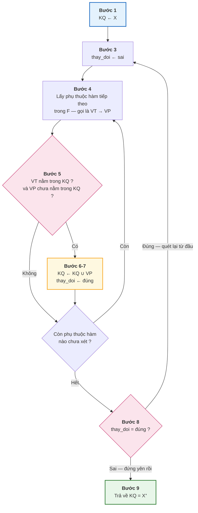
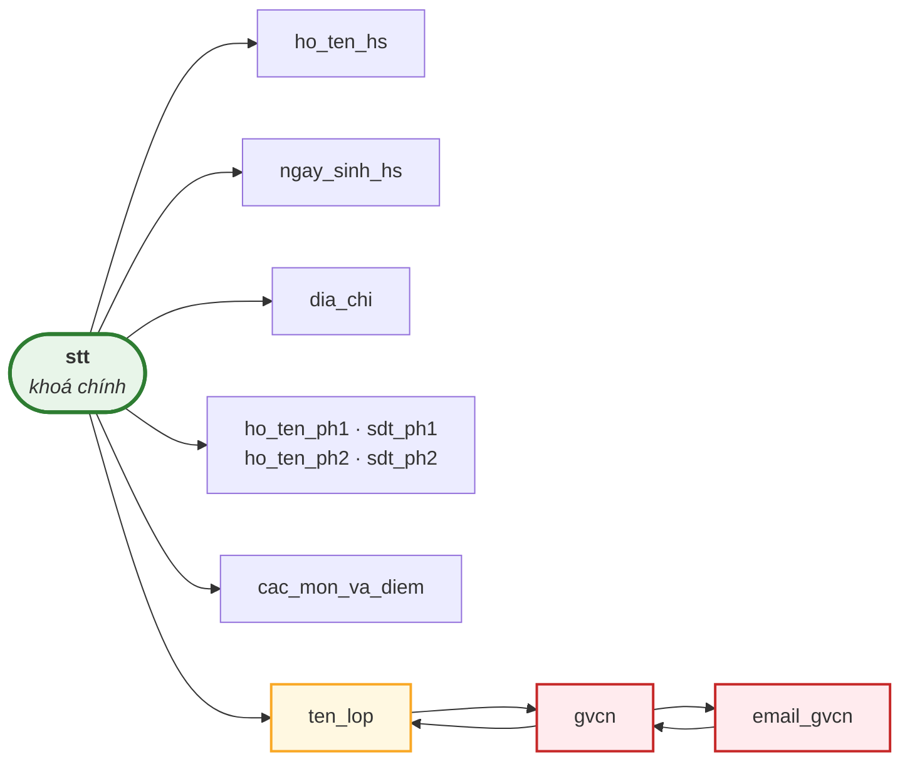

# Bài 16 — Phụ thuộc hàm và bao đóng

!!! abstract "🎯 Học xong bài này, bạn sẽ"
    - Viết được một **phụ thuộc hàm** đúng cú pháp và đọc được nó thành câu tiếng Việt
    - Phân biệt **phụ thuộc đầy đủ**, **phụ thuộc bộ phận** và **phụ thuộc bắc cầu** — ba khái niệm mà Bài 17 và Bài 18 sẽ dùng liên tục
    - Nêu và áp dụng được **ba tiên đề Armstrong**
    - Chạy **thuật toán tính bao đóng X⁺** bằng tay, từng bước, không sót
    - Dùng bao đóng để **tìm mọi khoá dự tuyển** của một lược đồ
    - Rút gọn một tập phụ thuộc hàm về **phủ tối thiểu**

## 🧠 Câu chuyện mở đầu

Lớp 8A1 có hai bạn cùng tên **Nguyễn Văn An** — chuyện này bạn đã gặp ở [Bài 12](../cap-1-mo-hinh-er/12-bay-loai-khoa.md).

Hôm nay cô văn thư nhờ bạn một việc khác. Cô đưa một tờ giấy chỉ ghi đúng một dòng:

```
HS001
```

và hỏi: *"Em tra hộ cô xem bạn này tên gì?"*

Bạn mở sổ, dò tới `HS001`, đọc lên: *"Nguyễn Văn An ạ."* Cô hỏi tiếp: *"Em chắc không? Lỡ có hai dòng `HS001` ghi hai cái tên khác nhau thì sao?"*

Bạn trả lời rất tự tin: *"Không thể ạ. Mã học sinh là duy nhất, một mã chỉ ứng với một bạn."*

Chiều hôm đó cô đưa tờ giấy thứ hai:

```
Nguyễn Văn An
```

*"Thế còn đây, em tra hộ cô mã của bạn này."* Bạn chịu. Có **hai** bạn tên như vậy.

Cùng một quyển sổ, mà chiều này thì tra được chắc chắn, chiều kia thì không. Sự bất đối xứng ấy không phải chuyện vặt — nó chính là viên gạch đầu tiên của toàn bộ lý thuyết chuẩn hoá.

Vậy làm sao viết cái ý *"biết cái này thì biết chắc cái kia"* ra thành một công thức, rồi tính toán được trên nó?

## 📖 Khái niệm & thuật ngữ

### Phụ thuộc hàm

**Phụ thuộc hàm** (*functional dependency*, viết tắt **PTH**) là một luật có dạng:

```text
X → Y
```

Đọc là *"X xác định Y"*, hoặc *"Y phụ thuộc hàm vào X"*. Trong đó `X` và `Y` là hai **tập thuộc tính** của cùng một bảng.

Định nghĩa chính xác:

> `X → Y` đúng trên lược đồ `R` khi và chỉ khi: với **mọi** trạng thái hợp lệ của `R`, nếu hai bộ bất kỳ có giá trị giống nhau trên toàn bộ `X`, thì chúng cũng phải giống nhau trên toàn bộ `Y`.

Câu chuyện mở đầu viết lại thành ký hiệu:

| Câu tiếng Việt | Phụ thuộc hàm | Đúng? |
|---|---|---|
| Biết mã học sinh thì biết chắc họ tên | `ma_hs → ho_ten` | ✅ Đúng |
| Biết họ tên thì biết chắc mã học sinh | `ho_ten → ma_hs` | ❌ Sai — hai bạn trùng tên |

Vế trái `X` có một cái tên riêng: **định thức** (*determinant*). Định thức là *"thứ mà khi biết nó, ta biết được cái còn lại"*. Toàn bộ Bài 18 sẽ xoay quanh một câu hỏi duy nhất về định thức, nên hãy nhớ kỹ từ này.

!!! danger "Phụ thuộc hàm KHÔNG suy ra từ dữ liệu mẫu — đây là cảnh báo quan trọng nhất của cả Cấp 2"
    [Bài 12](../cap-1-mo-hinh-er/12-bay-loai-khoa.md) đã chốt một **Quy tắc vàng**: câu hỏi *"cột này có phải khoá không?"* là **câu hỏi nghiệp vụ**, không phải câu hỏi dữ liệu.

    Phụ thuộc hàm thừa hưởng nguyên vẹn quy tắc đó, vì khoá chẳng qua là một trường hợp riêng của phụ thuộc hàm.

    Chú ý hai chữ **"mọi trạng thái"** trong định nghĩa ở trên. `X → Y` là mệnh đề về *tất cả* dữ liệu có thể có trong tương lai, chứ không phải về 30 dòng đang nằm trong bảng hôm nay.

    Hệ quả rất sắc bén:

    - Dữ liệu **bác bỏ** được một PTH: chỉ cần tìm ra **hai dòng** giống nhau trên `X` mà khác nhau trên `Y` là PTH đó chết ngay, không cãi được.
    - Dữ liệu **không bao giờ chứng minh** được một PTH. Không tìm thấy phản ví dụ hôm nay không có nghĩa là ngày mai không có.

    Nguồn duy nhất sinh ra phụ thuộc hàm là **luật nghiệp vụ**: quy chế nhà trường, quy định của Bộ, thói quen làm việc của cô văn thư. Bạn phải đi hỏi người dùng, không phải đi chạy `count(DISTINCT ...)`.

### Phụ thuộc hàm tầm thường

`X → Y` là **phụ thuộc hàm tầm thường** (*trivial functional dependency*) khi `Y ⊆ X`.

Ví dụ `{ma_hs, ho_ten} → ho_ten`. Nó luôn đúng, đúng với mọi bảng, mọi dữ liệu — và vì thế nó chẳng nói lên điều gì. Khi nói *"bảng này còn phụ thuộc hàm nào không"*, người ta luôn ngầm hiểu là **không tầm thường**.

### Đầy đủ, bộ phận, bắc cầu

Ba tính từ dưới đây mô tả **hình dạng** của một phụ thuộc hàm. Bài 17 và Bài 18 dựa hoàn toàn vào chúng.

**Phụ thuộc đầy đủ** (*full functional dependency*): `X → Y` là đầy đủ nếu **không** bỏ bớt được thuộc tính nào khỏi `X` mà vẫn giữ được luật. Nghĩa là với mọi tập con thật sự `X' ⊂ X`, ta có `X' ↛ Y`.

**Phụ thuộc bộ phận** (*partial functional dependency*): ngược lại — tồn tại một tập con thật sự `X' ⊂ X` mà `X' → Y` vẫn đúng. Nói nôm na: **vế trái thừa cột**.

Ví dụ trên bảng điểm `(ma_hs, ten_mon) → diem_so` và `(ma_hs, ten_mon) → ho_ten_hs`:

| Phụ thuộc hàm | Bỏ bớt vế trái được không? | Loại |
|---|---|---|
| `(ma_hs, ten_mon) → diem_so` | Không. Chỉ biết `ma_hs` thì không biết điểm môn nào; chỉ biết `ten_mon` thì không biết của ai | **Đầy đủ** |
| `(ma_hs, ten_mon) → ho_ten_hs` | Được. `ma_hs → ho_ten_hs` đã đủ, `ten_mon` là thừa | **Bộ phận** |

**Phụ thuộc bắc cầu** (*transitive functional dependency*): `X → Z` là bắc cầu nếu tồn tại một tập `Y` sao cho cả ba điều sau cùng đúng:

1. `X → Y`
2. `Y → Z`
3. `Y ↛ X`, và `Z` không nằm trong `X ∪ Y`

Nói nôm na: `X` không xác định `Z` một cách trực tiếp, mà **đi vòng** qua một trạm trung gian `Y`. Điều kiện 3 là để loại các trường hợp `Y` cũng là khoá — lúc đó chẳng có "trạm trung gian" nào cả.

### Ba tiên đề Armstrong

Năm 1974, William W. Armstrong chứng minh rằng **mọi** phụ thuộc hàm suy ra được đều suy ra được từ đúng ba luật. Ba luật đó gọi là **tiên đề Armstrong** (*Armstrong's axioms*).

| Tên | Ký hiệu | Phát biểu |
|---|---|---|
| **Phản xạ** (*reflexivity*) | `Y ⊆ X ⟹ X → Y` | Tập lớn luôn xác định tập con của chính nó |
| **Tăng trưởng** (*augmentation*) | `X → Y ⟹ XZ → YZ` | Thêm cùng một nhóm thuộc tính vào cả hai vế thì luật vẫn đúng |
| **Bắc cầu** (*transitivity*) | `X → Y` và `Y → Z` `⟹ X → Z` | Nối hai bước suy luận thành một |

Giải thích bằng chuyện đời thường:

!!! example "Phản xạ — 'biết nhiều thì biết ít'"
    Bạn cầm tờ giấy ghi **cả mã lẫn tên**: `{HS001, Nguyễn Văn An}`. Cô hỏi *"tên bạn ấy là gì?"*. Bạn đọc luôn, khỏi tra sổ.

    Đó chính là `{ma_hs, ho_ten} → ho_ten`. Nghe như nói thừa, nhưng đây là viên gạch nền: nó bảo đảm mọi phụ thuộc hàm tầm thường đều nằm trong hệ thống.

!!! example "Tăng trưởng — 'thêm cùng một thứ vào hai bên thì cân vẫn thăng bằng'"
    Đã biết: `ma_hs → ho_ten` (biết mã thì biết tên).

    Bây giờ thêm `ten_lop` vào **cả hai vế**: `{ma_hs, ten_lop} → {ho_ten, ten_lop}`.

    Vẫn đúng, và lý do rất dễ thấy: nếu hai dòng giống nhau ở *cả mã lẫn lớp*, thì riêng phần "giống nhau ở mã" đã kéo theo giống nhau ở tên rồi; còn phần "giống nhau ở lớp" thì chép thẳng từ vế trái sang.

    Lưu ý cái bẫy: tiên đề này **không** cho phép thêm vào một vế thôi. `ma_hs → ho_ten` **không** suy ra `{ma_hs, ten_lop} → dia_chi`.

!!! example "Bắc cầu — 'hỏi vòng hai lần'"
    Trong bảng bẹt `bang_bet`:

    - Biết **tên lớp** thì biết **giáo viên chủ nhiệm**: `ten_lop → gvcn` (mỗi lớp một GVCN).
    - Biết **giáo viên chủ nhiệm** thì biết **email** của thầy cô ấy: `gvcn → email_gvcn`.

    Vậy biết tên lớp là biết email GVCN: `ten_lop → email_gvcn`. Bạn phải tra sổ hai lần, nhưng kết quả vẫn chắc chắn.

    Đây đúng là hình dạng "phụ thuộc bắc cầu" ở mục trên — và [Bài 18](18-dang-chuan-3nf-bcnf.md) sẽ cho thấy nó chính là căn bệnh mà Dạng chuẩn 3 sinh ra để chữa.

Ba tiên đề này **đúng đắn** (*sound* — mọi thứ suy ra được đều thật sự đúng) và **đầy đủ** (*complete* — mọi PTH thật sự đúng đều suy ra được). Nghĩa là bạn không cần luật thứ tư nào nữa.

Tuy vậy, để tính tay cho nhanh, người ta hay dùng thêm ba **luật dẫn xuất** — cả ba đều chứng minh được từ ba tiên đề gốc:

| Tên | Phát biểu |
|---|---|
| **Luật hợp** (*union*) | `X → Y` và `X → Z` `⟹` `X → YZ` |
| **Luật tách** (*decomposition*) | `X → YZ` `⟹` `X → Y` và `X → Z` |
| **Luật giả bắc cầu** (*pseudotransitivity*) | `X → Y` và `WY → Z` `⟹` `WX → Z` |

Luật hợp và luật tách nói rằng **vế phải muốn gộp hay tách tuỳ ý cũng được**. Đây là lý do người ta hay quy ước viết mọi PTH với vế phải chỉ một thuộc tính.

### Bao đóng

Từ một tập PTH `F`, dùng ba tiên đề suy ra mãi, ta được **bao đóng của tập phụ thuộc hàm** (*closure of F*), ký hiệu `F⁺`. Tập này thường khổng lồ và không ai đi liệt kê nó cả.

Thứ thực sự dùng được là khái niệm hẹp hơn:

**Bao đóng thuộc tính** (*attribute closure*) của tập thuộc tính `X` đối với `F`, ký hiệu **`X⁺`**, là **tập tất cả các thuộc tính `A` sao cho `X → A` suy ra được từ `F`**.

Nói nôm na: *"Biết `X` rồi thì tra sổ vòng vo bao nhiêu lần cũng được — cuối cùng biết thêm được những gì?"*

Bao đóng thuộc tính trả lời được hai câu hỏi lớn chỉ bằng một phép tính:

| Câu hỏi | Cách trả lời bằng bao đóng |
|---|---|
| `X → Y` có suy ra được từ `F` không? | Đúng khi và chỉ khi `Y ⊆ X⁺` |
| `X` có phải **siêu khoá** ([Bài 12](../cap-1-mo-hinh-er/12-bay-loai-khoa.md) mục 1) không? | Đúng khi và chỉ khi `X⁺` = toàn bộ thuộc tính của bảng |

### Thuật toán tính bao đóng

Đây là thuật toán bạn sẽ dùng đi dùng lại suốt Cấp 2. Nó chỉ có **9 bước**:

```text
THUẬT TOÁN: BAO-DONG(X, F)
  Vào : X — một tập thuộc tính của lược đồ
        F — tập phụ thuộc hàm
  Ra  : X⁺ — bao đóng của X đối với F

  Bước 1.  KQ ← X
  Bước 2.  Lặp lại:
  Bước 3.      thay_doi ← sai
  Bước 4.      Với mỗi phụ thuộc hàm (VT → VP) trong F:
  Bước 5.          Nếu VT ⊆ KQ và VP ⊄ KQ thì
  Bước 6.              KQ ← KQ ∪ VP
  Bước 7.              thay_doi ← đúng
  Bước 8.  Cho tới khi thay_doi = sai
  Bước 9.  Trả về KQ
```

Đọc từng bước thành lời:

| Bước | Ý nghĩa |
|---|---|
| 1 | Bắt đầu với đúng những gì đã biết: chính `X` |
| **2** và **8** | Một vòng lặp *"lặp lại … cho tới khi"*: quét trọn `F` một **lượt**, rồi hỏi lượt đó có thêm được gì không. Có thì quét lại từ đầu |
| 3 | Đầu mỗi lượt, giả định lượt này sẽ không thêm được gì |
| 4 | Duyệt **mọi** phụ thuộc hàm, không bỏ sót cái nào |
| 5 | Điều kiện kép: vế trái đã biết hết (`VT ⊆ KQ`), **và** vế phải còn có cái mới (`VP ⊄ KQ`) |
| 6–7 | Thu nạp vế phải, và đánh dấu là lượt này có thay đổi |
| 9 | Khi một lượt trọn vẹn không thêm được gì nữa thì `KQ` chính là `X⁺` |

Hai điều bảo đảm thuật toán luôn dừng và luôn đúng:

- **Luôn dừng**: `KQ` chỉ có lớn lên, không bao giờ nhỏ đi, mà nó bị chặn trên bởi tập toàn bộ thuộc tính. Nên số lượt lặp nhiều nhất bằng số thuộc tính.
- **Luôn đúng**: mỗi lần thêm ở Bước 6 chính là một lần dùng **tiên đề bắc cầu**; và khi dừng thì không còn tiên đề nào áp được nữa, nên không sót thuộc tính nào.

### Thuộc tính khoá và không khoá

**Thuộc tính khoá** (*prime attribute*) là thuộc tính nằm trong **ít nhất một** khoá dự tuyển của lược đồ.

**Thuộc tính không khoá** (*non-prime attribute*) là thuộc tính **không nằm trong bất kỳ** khoá dự tuyển nào.

Chú ý chữ *"ít nhất một"*: một lược đồ có thể có nhiều khoá dự tuyển ([Bài 12](../cap-1-mo-hinh-er/12-bay-loai-khoa.md) mục 2), và chỉ cần góp mặt trong một cái là đủ để được gọi là thuộc tính khoá.

Hai từ này nghe khô khan, nhưng chúng là bản lề của mọi định nghĩa dạng chuẩn ở Bài 17 và Bài 18.

### Phủ tối thiểu

Hai tập PTH gọi là **tương đương** nếu chúng có cùng bao đóng — tức là suy ra được y hệt nhau.

**Phủ tối thiểu** (*minimal cover*, còn gọi *canonical cover*) của `F` là một tập `G` tương đương với `F` và thoả cả ba điều:

1. **Vế phải chỉ một thuộc tính** — mọi PTH trong `G` có dạng `X → A`.
2. **Vế trái không thừa** — không bỏ được thuộc tính nào khỏi `X` mà `G` vẫn tương đương.
3. **Không có PTH thừa** — không bỏ được cả một PTH nào mà `G` vẫn tương đương.

Phủ tối thiểu là *bản rút gọn hết cỡ* của luật nghiệp vụ. [Bài 18](18-dang-chuan-3nf-bcnf.md) cần nó để chạy thuật toán tổng hợp lược đồ 3NF.

### Bảng thuật ngữ

| Tiếng Việt | English | Nghĩa dễ hiểu |
|---|---|---|
| Phụ thuộc hàm | *functional dependency* | Luật "biết X thì biết chắc Y", đúng với mọi trạng thái dữ liệu |
| Định thức | *determinant* | Vế trái của một phụ thuộc hàm — thứ mà khi biết nó thì biết được vế phải |
| Phụ thuộc hàm tầm thường | *trivial dependency* | `X → Y` với `Y ⊆ X` — luôn đúng nên vô dụng |
| Phụ thuộc đầy đủ | *full dependency* | `X → Y` mà bỏ bất kỳ thuộc tính nào khỏi X là luật hỏng |
| Phụ thuộc bộ phận | *partial dependency* | `X → Y` mà chỉ cần một phần của X đã đủ xác định Y — vế trái thừa cột |
| Phụ thuộc bắc cầu | *transitive dependency* | `X → Y` và `Y → Z` mà `Y ↛ X`, và `Z` không nằm trong `X ∪ Y` — X phải đi vòng qua trạm trung gian Y |
| Tiên đề Armstrong | *Armstrong's axioms* | Ba luật phản xạ, tăng trưởng, bắc cầu — đủ để suy ra mọi phụ thuộc hàm |
| Phản xạ | *reflexivity* | `Y ⊆ X ⟹ X → Y` |
| Tăng trưởng | *augmentation* | `X → Y ⟹ XZ → YZ` |
| Bắc cầu | *transitivity* | `X → Y` và `Y → Z` thì `X → Z` |
| Bao đóng thuộc tính | *attribute closure* (`X⁺`) | Tập mọi thuộc tính suy ra được khi đã biết X |
| Bao đóng của tập PTH | *closure of F* (`F⁺`) | Tập mọi phụ thuộc hàm suy ra được từ F |
| Phủ tối thiểu | *minimal cover / canonical cover* | Bản rút gọn hết cỡ của tập PTH, vẫn suy ra được y hệt |
| Thuộc tính khoá | *prime attribute* | Thuộc tính nằm trong ít nhất một khoá dự tuyển |
| Thuộc tính không khoá | *non-prime attribute* | Thuộc tính không nằm trong khoá dự tuyển nào |

## 🖼️ Sơ đồ

Chín bước giả mã ở khối 📖 vẽ thành hình thì như sau. Số bước trong hình khớp đúng với số bước trong giả mã; vòng **Bước 2 ↔ Bước 8** chính là cái vòng *"lặp lại … cho tới khi"*:



Còn đây là **đồ thị phụ thuộc hàm** của `bang_bet` — mỗi mũi tên là một luật nghiệp vụ. Nhìn hình này là thấy ngay bệnh: có những mũi tên **không xuất phát từ khoá**.



Ba ô tô màu vàng và đỏ là ba "trạm trung gian": từ `stt` muốn tới `email_gvcn` thì phải đi qua `ten_lop` rồi `gvcn`. Đó là **phụ thuộc bắc cầu**, và nó là nguyên nhân khiến email của cô Lan bị chép lại **6 lần** trong bảng.

!!! warning "Một giả thiết phải nói thẳng ra"
    Mũi tên `gvcn → email_gvcn` chỉ đúng nếu **không có hai giáo viên trùng họ tên**. Cột `gvcn` trong `bang_bet` lưu *họ tên*, chứ không lưu mã giáo viên.

    Cả Cấp 2 sẽ làm việc với giả thiết đã nêu này: *trong phạm vi bảng bẹt, nhà trường quy ước họ tên giáo viên là duy nhất*.

    Và bản thân việc phải nêu một giả thiết yếu như vậy **đã là một lời chẩn đoán**: một thiết kế tử tế không được phép dựa vào họ tên để định danh con người. Đó chính là lý do lược đồ đích trong `dataset/02-chuan-hoa.sql` có cột `giao_vien.ma_gv`. Chuyện này sẽ được giải quyết dứt điểm ở [Bài 18](18-dang-chuan-3nf-bcnf.md).

    Ngược lại, mũi tên `email_gvcn → gvcn` thì **chắc chắn** đúng: lược đồ đích khai `email` là `UNIQUE` (ràng buộc `giao_vien_email_key`), nên email là một khoá dự tuyển của giáo viên.

## 💻 Thực hành

!!! info "Dòng `-- KỲ VỌNG: N dòng` trong các khối SQL là gì?"
    Từ Cấp 2 trở đi, nhiều khối SQL mở đầu bằng một dòng chú thích như `-- KỲ VỌNG: 5 dòng`.

    Nó nói cho bạn biết **truy vấn phải trả về bao nhiêu dòng**. Chạy ra khác là bạn gõ nhầm ở đâu đó — hoặc dữ liệu của bạn đã bị sửa.

    Dòng này cũng được máy chủ kiểm thử của khóa học đọc: mỗi lần bài học được cập nhật, nó chạy lại toàn bộ truy vấn trên một PostgreSQL thật và **báo lỗi nếu số dòng không khớp**. Nhờ vậy những con số bạn đọc trong bài không bao giờ là con số bịa.

### 1. Tập phụ thuộc hàm của `bang_bet`

Trước khi tính gì, phải **viết luật nghiệp vụ ra giấy**. Đây là tập `F_bet` gồm 5 phụ thuộc hàm, kèm nguồn gốc nghiệp vụ của từng cái:

| # | Phụ thuộc hàm | Luật nghiệp vụ sinh ra nó |
|---|---|---|
| f1 | `stt → ho_ten_hs, ngay_sinh_hs, dia_chi, ten_lop, gvcn, email_gvcn, ho_ten_ph1, sdt_ph1, ho_ten_ph2, sdt_ph2, cac_mon_va_diem` | `stt` được khai `PRIMARY KEY` — khoá chính xác định mọi thuộc tính |
| f2 | `ten_lop → gvcn` | Mỗi lớp có tối đa **một** giáo viên chủ nhiệm |
| f3 | `gvcn → ten_lop` | Mỗi giáo viên chủ nhiệm tối đa **một** lớp — luật 1:1, chính là `UNIQUE` trên `lop.ma_gvcn` |
| f4 | `gvcn → email_gvcn` | Mỗi giáo viên có một địa chỉ email nhà trường cấp |
| f5 | `email_gvcn → gvcn` | Email là `UNIQUE` trong `giao_vien` — một email chỉ của một người |

Không có PTH nào khác. Đặc biệt **không** có `ho_ten_hs → ngay_sinh_hs`: hai học sinh trùng tên là chuyện bình thường.

### 2. Dữ liệu chỉ dùng để BÁC BỎ

Ta không chứng minh được PTH bằng SQL, nhưng ta **săn phản ví dụ** được. Mẫu truy vấn: gom nhóm theo vế trái, rồi đếm xem trong một nhóm có mấy giá trị vế phải khác nhau.

```sql
-- KỲ VỌNG: 5 dòng
SELECT 'ten_lop -> gvcn'      AS phu_thuoc_ham,
       count(*)               AS so_nhom_vi_pham
FROM  (SELECT ten_lop FROM bang_bet
       GROUP BY ten_lop HAVING count(DISTINCT gvcn) > 1) t
UNION ALL
SELECT 'gvcn -> ten_lop', count(*)
FROM  (SELECT gvcn FROM bang_bet
       GROUP BY gvcn HAVING count(DISTINCT ten_lop) > 1) t
UNION ALL
SELECT 'gvcn -> email_gvcn', count(*)
FROM  (SELECT gvcn FROM bang_bet
       GROUP BY gvcn HAVING count(DISTINCT email_gvcn) > 1) t
UNION ALL
SELECT 'email_gvcn -> gvcn', count(*)
FROM  (SELECT email_gvcn FROM bang_bet
       GROUP BY email_gvcn HAVING count(DISTINCT gvcn) > 1) t
UNION ALL
SELECT 'ten_lop -> ho_ten_hs', count(*)
FROM  (SELECT ten_lop FROM bang_bet
       GROUP BY ten_lop HAVING count(DISTINCT ho_ten_hs) > 1) t;
```

Bốn dòng đầu ra `0`, dòng cuối ra `5`.

Đọc kết quả cho **thật đúng**:

- Dòng cuối: `ten_lop → ho_ten_hs` **bị bác bỏ**, cả 5 lớp đều là phản ví dụ. Kết luận này **chắc chắn** — một phản ví dụ là đủ giết một PTH.
- Bốn dòng đầu: *"chưa tìm thấy phản ví dụ"*. Chỉ có thế thôi. Nó **không** chứng minh bốn PTH kia đúng. Lý do chúng đúng nằm ở cột "luật nghiệp vụ" của bảng mục 1, không nằm ở con số `0` này.

### 3. Cái giá của phụ thuộc bắc cầu

Vì `email_gvcn` phụ thuộc bắc cầu vào khoá, nó bị chép lại y nguyên rất nhiều lần:

```sql
-- KỲ VỌNG: 5 dòng
SELECT gvcn, email_gvcn, count(*) AS so_dong_bi_chep_lai
FROM bang_bet
GROUP BY gvcn, email_gvcn
ORDER BY so_dong_bi_chep_lai DESC, gvcn;
```

Năm dòng. Cô Lê Thị Mai (8A3) có `8`; ba giáo viên có `6`; cô Hoàng Thị Nhung (9A2) có `4`. Tổng đúng `30` — bằng số dòng của cả bảng.

Nghĩa là: **cùng một mẩu thông tin "email của cô Mai" được cất giữ 8 bản sao**. Sửa email mà quên một bản là dữ liệu mâu thuẫn ngay. [Bài 17](17-dang-chuan-1nf-2nf.md) gọi hiện tượng này bằng tên chính thức của nó — *bất thường khi sửa*.

### 4. Bao đóng tính bằng tay — ví dụ 1: `{ten_lop}⁺`

Áp dụng đúng 9 bước của thuật toán lên tập `F_bet`:

| Bước | Việc làm | `KQ` sau bước đó |
|---|---|---|
| 1 | `KQ ← {ten_lop}` | `{ten_lop}` |
| 4–7 | Xét f1 `stt → ...`: `{stt} ⊄ KQ` → bỏ qua | `{ten_lop}` |
| 4–7 | Xét f2 `ten_lop → gvcn`: vế trái ⊆ KQ, vế phải chưa có → **thêm** | `{ten_lop, gvcn}` |
| 4–7 | Xét f3 `gvcn → ten_lop`: vế phải đã có → bỏ qua | `{ten_lop, gvcn}` |
| 4–7 | Xét f4 `gvcn → email_gvcn`: vế trái ⊆ KQ, vế phải chưa có → **thêm** | `{ten_lop, gvcn, email_gvcn}` |
| 4–7 | Xét f5 `email_gvcn → gvcn`: vế phải đã có → bỏ qua | `{ten_lop, gvcn, email_gvcn}` |
| 8 | Vòng quét vừa rồi có thêm → **quét lại từ đầu** | — |
| 4–7 | Quét lượt hai: không PTH nào thêm được gì | `{ten_lop, gvcn, email_gvcn}` |
| 9 | `thay_doi = sai` → dừng | **`{ten_lop, gvcn, email_gvcn}`** |

Kết luận: `{ten_lop}⁺` chỉ có **3** trong tổng số **12** thuộc tính của `bang_bet`. Vậy `ten_lop` **không phải** siêu khoá.

!!! tip "Đừng bao giờ bỏ vòng quét cuối"
    Lỗi tính tay phổ biến nhất là dừng ngay sau khi quét hết `F` một lượt. Phải quét thêm **một lượt nữa không thêm được gì** thì mới được dừng — vì thuộc tính vừa thêm ở cuối lượt có thể kích hoạt một PTH nằm ở **đầu** danh sách.

### 5. Bao đóng bằng máy

Tính tay dễ sót. Hãy để PostgreSQL kiểm tra hộ. Trước hết, lưu tập PTH thành dữ liệu:

```sql
DROP TABLE IF EXISTS b16_pth CASCADE;
DROP TABLE IF EXISTS b16_ket_qua CASCADE;

CREATE TABLE b16_pth (
    ma       SMALLINT PRIMARY KEY,
    ve_trai  TEXT[]   NOT NULL,
    ve_phai  TEXT[]   NOT NULL
);

CREATE TABLE b16_ket_qua (
    buoc     SMALLINT,
    ap_dung  TEXT,
    kq       TEXT[]
);
```

Nạp tập `F_1nf` — tập phụ thuộc hàm của bảng mà [Bài 17](17-dang-chuan-1nf-2nf.md) sẽ dựng sau khi đưa `bang_bet` về Dạng chuẩn 1. Ta dùng tập này vì nó có khoá gồm **hai** thuộc tính, thú vị hơn:

```sql
INSERT INTO b16_pth (ma, ve_trai, ve_phai) VALUES
(1, ARRAY['ma_hs'],              ARRAY['ho_ten_hs','ngay_sinh_hs','dia_chi','ten_lop']),
(2, ARRAY['ten_lop'],            ARRAY['gvcn']),
(3, ARRAY['gvcn'],               ARRAY['ten_lop']),
(4, ARRAY['gvcn'],               ARRAY['email_gvcn']),
(5, ARRAY['email_gvcn'],         ARRAY['gvcn']),
(6, ARRAY['ma_hs','ten_mon'],    ARRAY['diem_so']);
```

Bây giờ dịch thẳng 9 bước giả mã thành một khối lệnh:

```sql
DO $$
DECLARE
    kq        text[]   := ARRAY['ten_lop'];   -- ← X cần tính bao đóng
    buoc      smallint := 0;
    thay_doi  boolean  := true;
    f         record;
BEGIN
    INSERT INTO b16_ket_qua VALUES (buoc, 'Bước 1 — khởi tạo KQ ← X', kq);
    WHILE thay_doi LOOP                                   -- Bước 2 và 8
        thay_doi := false;                                -- Bước 3
        FOR f IN SELECT * FROM b16_pth ORDER BY ma LOOP   -- Bước 4
            IF f.ve_trai <@ kq AND NOT (f.ve_phai <@ kq) THEN   -- Bước 5
                kq := (SELECT array_agg(DISTINCT x ORDER BY x)  -- Bước 6
                       FROM unnest(kq || f.ve_phai) AS t(x));
                buoc     := buoc + 1;
                thay_doi := true;                         -- Bước 7
                INSERT INTO b16_ket_qua
                VALUES (buoc, 'áp dụng PTH số ' || f.ma, kq);
            END IF;
        END LOOP;
    END LOOP;
END $$;

-- KỲ VỌNG: 3 dòng
SELECT buoc, ap_dung, array_to_string(kq, ', ') AS bao_dong
FROM b16_ket_qua
ORDER BY buoc;
```

Ba dòng, và dòng cuối đúng bằng kết quả tính tay ở mục 4: `email_gvcn, gvcn, ten_lop`.

### 6. Bao đóng tính bằng tay — ví dụ 2: `{ma_hs, ten_mon}⁺`

Lần này chạy trên `F_1nf`, với 9 thuộc tính: `ma_hs`, `ho_ten_hs`, `ngay_sinh_hs`, `dia_chi`, `ten_lop`, `gvcn`, `email_gvcn`, `ten_mon`, `diem_so`.

| Bước | Việc làm | Số thuộc tính trong `KQ` |
|---|---|---|
| 1 | `KQ ← {ma_hs, ten_mon}` | 2 |
| 4–7 | PTH 1 `ma_hs → ho_ten_hs, ngay_sinh_hs, dia_chi, ten_lop` → **thêm 4** | 6 |
| 4–7 | PTH 2 `ten_lop → gvcn` → **thêm 1** | 7 |
| 4–7 | PTH 3 `gvcn → ten_lop` — đã có → bỏ qua | 7 |
| 4–7 | PTH 4 `gvcn → email_gvcn` → **thêm 1** | 8 |
| 4–7 | PTH 5 `email_gvcn → gvcn` — đã có → bỏ qua | 8 |
| 4–7 | PTH 6 `(ma_hs, ten_mon) → diem_so` → **thêm 1** | 9 |
| 8–9 | Quét lượt hai không thêm gì → dừng | **9 = toàn bộ** |

`{ma_hs, ten_mon}⁺` = **toàn bộ 9 thuộc tính** → đây là một **siêu khoá**.

Muốn máy xác nhận, chỉ cần sửa đúng một dòng trong khối lệnh ở mục 5:

```sql
TRUNCATE b16_ket_qua;

DO $$
DECLARE
    kq        text[]   := ARRAY['ma_hs','ten_mon'];   -- ← đổi X ở đây
    buoc      smallint := 0;
    thay_doi  boolean  := true;
    f         record;
BEGIN
    INSERT INTO b16_ket_qua VALUES (buoc, 'Bước 1 — khởi tạo KQ ← X', kq);
    WHILE thay_doi LOOP
        thay_doi := false;
        FOR f IN SELECT * FROM b16_pth ORDER BY ma LOOP
            IF f.ve_trai <@ kq AND NOT (f.ve_phai <@ kq) THEN
                kq := (SELECT array_agg(DISTINCT x ORDER BY x)
                       FROM unnest(kq || f.ve_phai) AS t(x));
                buoc     := buoc + 1;
                thay_doi := true;
                INSERT INTO b16_ket_qua
                VALUES (buoc, 'áp dụng PTH số ' || f.ma, kq);
            END IF;
        END LOOP;
    END LOOP;
END $$;

-- KỲ VỌNG: 5 dòng
SELECT buoc, ap_dung,
       cardinality(kq)                AS so_thuoc_tinh,
       array_to_string(kq, ', ')      AS bao_dong
FROM b16_ket_qua
ORDER BY buoc;
```

Năm dòng, `so_thuoc_tinh` tăng dần `2 → 6 → 7 → 8 → 9`.

### 7. Từ bao đóng ra khoá dự tuyển

Bao đóng mới chỉ cho biết *siêu khoá hay không*. Muốn ra **khoá dự tuyển** (siêu khoá tối giản — [Bài 12](../cap-1-mo-hinh-er/12-bay-loai-khoa.md) mục 2) thì dùng thuật toán này:

```text
THUẬT TOÁN: TIM-KHOA-DU-TUYEN(U, F)
  Vào : U — toàn bộ thuộc tính của lược đồ
        F — tập phụ thuộc hàm

  Bước 1.  L ← các thuộc tính CHỈ xuất hiện ở vế TRÁI,
                hoặc không xuất hiện trong F lần nào
  Bước 2.  R ← các thuộc tính CHỈ xuất hiện ở vế PHẢI
  Bước 3.  Mọi khoá dự tuyển đều PHẢI chứa toàn bộ L
                và KHÔNG chứa thuộc tính nào của R
  Bước 4.  Nếu BAO-DONG(L, F) = U
               thì L là khoá dự tuyển DUY NHẤT → dừng
  Bước 5.  Ngược lại, với mọi tập con S của (U − L − R),
                duyệt theo kích thước tăng dần:
  Bước 6.      Nếu BAO-DONG(L ∪ S, F) = U
                   và L ∪ S không chứa khoá dự tuyển nào đã tìm được
  Bước 7.          thì ghi nhận L ∪ S là một khoá dự tuyển
```

Vì sao Bước 3 đúng? Nếu một thuộc tính `A` **không bao giờ** nằm ở vế phải, thì không PTH nào sinh ra được `A`. Muốn `A` có mặt trong bao đóng, cách duy nhất là cho `A` vào `X` ngay từ đầu. Vậy `A` phải nằm trong mọi khoá.

**Áp dụng cho `F_1nf`:**

- **Bước 1** — thuộc tính chỉ xuất hiện ở vế trái: `ma_hs` (vế trái của PTH 1 và 6, không bao giờ ở vế phải) và `ten_mon` (vế trái của PTH 6). Vậy `L = {ma_hs, ten_mon}`.
- **Bước 4** — mục 6 vừa tính: `{ma_hs, ten_mon}⁺` = toàn bộ 9 thuộc tính.
- → **`{ma_hs, ten_mon}` là khoá dự tuyển duy nhất.** Thuật toán dừng ngay, khỏi phải duyệt tập con nào.

Suy ra luôn:

| | Thuộc tính |
|---|---|
| **Thuộc tính khoá** | `ma_hs`, `ten_mon` |
| **Thuộc tính không khoá** | `ho_ten_hs`, `ngay_sinh_hs`, `dia_chi`, `ten_lop`, `gvcn`, `email_gvcn`, `diem_so` |

**Áp dụng cho `F_bet`** (bảng bẹt gốc, 12 thuộc tính):

- **Bước 1** — `stt` là thuộc tính duy nhất không bao giờ xuất hiện ở vế phải. `L = {stt}`.
- **Bước 4** — `{stt}⁺`: PTH f1 kéo ngay 11 thuộc tính còn lại vào → đủ 12.
- → **`{stt}` là khoá dự tuyển duy nhất** của `bang_bet`. Mọi thuộc tính khác đều là thuộc tính không khoá.

**Áp dụng cho một lược đồ có NHIỀU khoá dự tuyển** — lần này Bước 4 không cứu được, phải dùng tới Bước 5–7.

Bối cảnh: lớp phụ đạo. Mỗi học sinh học một môn với đúng một giáo viên phụ đạo, và mỗi giáo viên phụ đạo chỉ dạy một môn. Lược đồ `R(ma_hs, ten_mon, ten_gv)` với hai PTH:

```text
p1:  (ma_hs, ten_mon) → ten_gv
p2:  ten_gv → ten_mon
```

- **Bước 1** — `ma_hs` xuất hiện ở vế trái (p1) và không bao giờ ở vế phải → `L = {ma_hs}`.
- **Bước 2** — `ten_gv` có mặt cả hai vế (phải ở p1, trái ở p2); `ten_mon` cũng vậy → `R = ∅`.
- **Bước 4** — `{ma_hs}⁺ = {ma_hs}`: không PTH nào có vế trái nằm gọn trong `{ma_hs}`. Chưa phủ hết `U` → **không dừng được**, phải sang Bước 5.
- **Bước 5** — duyệt các tập con của `U − L − R = {ten_mon, ten_gv}`, theo kích thước tăng dần:

| Kích thước | `S` | `(L ∪ S)⁺` | Kết luận |
|---|---|---|---|
| 1 | `{ten_mon}` | `{ma_hs, ten_mon}` rồi p1 thêm `ten_gv` → `U` | ✅ **Khoá dự tuyển** |
| 1 | `{ten_gv}` | `{ma_hs, ten_gv}` rồi p2 thêm `ten_mon` → `U` | ✅ **Khoá dự tuyển** |
| 2 | `{ten_mon, ten_gv}` | `U` — nhưng nó **chứa** hai khoá vừa tìm được | ❌ Bước 6 loại: chỉ là siêu khoá, không tối giản |

Kết quả: `R` có **hai** khoá dự tuyển là `{ma_hs, ten_mon}` và `{ma_hs, ten_gv}`.

Hệ quả rất đáng chú ý: cả ba thuộc tính đều góp mặt trong ít nhất một khoá dự tuyển → **cả ba đều là thuộc tính khoá**, và lược đồ **không có thuộc tính không khoá nào**.

[Bài 18](18-dang-chuan-3nf-bcnf.md) sẽ quay lại đúng lược đồ này: chính vì hai khoá dự tuyển **chồng lấn nhau** ở `ma_hs` mà nó trở thành phản ví dụ kinh điển *"ở 3NF nhưng không ở BCNF"*.

!!! danger "Ghi nhớ: `ho_ten_hs` KHÔNG phải khoá, dù 30 dòng đang có 30 tên khác nhau"
    Câu SQL dưới đây đếm số họ tên khác nhau:

    ```sql
    -- KỲ VỌNG: 1 dòng
SELECT count(*) AS so_dong,
           count(DISTINCT ho_ten_hs) AS so_ho_ten_khac_nhau
    FROM bang_bet;
```

    Kết quả `30` và `30`. Y hệt cái bẫy của [Bài 12](../cap-1-mo-hinh-er/12-bay-loai-khoa.md): con số này **không** biến `ho_ten_hs` thành khoá. Lược đồ `bang_bet` không hề có `UNIQUE (ho_ten_hs)`, và nghiệp vụ thì cho phép hai bạn trùng tên.

### 8. Rút gọn về phủ tối thiểu

Giả sử người phân tích nghiệp vụ viết thêm một luật nghe rất hợp lý vào `F_1nf`:

```text
PTH 7:  ma_hs → gvcn      ("biết học sinh thì biết chủ nhiệm của bạn ấy")
```

Luật này **đúng**, nhưng **thừa**. Chạy Bước 3 của phủ tối thiểu: tạm bỏ PTH 7 rồi tính `{ma_hs}⁺` bằng 6 PTH còn lại.

| Bước | `KQ` |
|---|---|
| Khởi tạo | `{ma_hs}` |
| PTH 1 | `{ma_hs, ho_ten_hs, ngay_sinh_hs, dia_chi, ten_lop}` |
| PTH 2 | `{..., gvcn}` ← **`gvcn` đã có mặt** |

`gvcn ∈ {ma_hs}⁺` ngay cả khi không có PTH 7 → **PTH 7 là thừa, loại bỏ**.

Kiểm lại cả ba điều kiện cho `F_1nf` gốc:

| Điều kiện | Kết quả |
|---|---|
| 1. Vế phải một thuộc tính | Chỉ cần tách PTH 1 thành 4 PTH riêng bằng **luật tách** |
| 2. Vế trái không thừa | PTH 6 là cái duy nhất có vế trái 2 thuộc tính. `{ma_hs}⁺` không chứa `diem_so`, `{ten_mon}⁺ = {ten_mon}` → không bỏ được cột nào |
| 3. Không PTH thừa | Bỏ thử từng cái: bỏ PTH 2 thì `{ten_lop}⁺ = {ten_lop}`; bỏ PTH 3 thì `{gvcn}⁺` mất `ten_lop`; bỏ PTH 5 thì `{email_gvcn}⁺ = {email_gvcn}` → không bỏ được cái nào |

Vậy `F_1nf` sau khi tách vế phải **chính là một phủ tối thiểu**. [Bài 18](18-dang-chuan-3nf-bcnf.md) sẽ đưa đúng tập này vào thuật toán tổng hợp 3NF.

### 9. Dọn dẹp

```sql
DROP TABLE IF EXISTS b16_ket_qua CASCADE;
DROP TABLE IF EXISTS b16_pth CASCADE;
```

## ⚠️ Lỗi thường gặp

!!! warning "Lỗi 1: Suy ra phụ thuộc hàm từ dữ liệu đang có"
    *"Chạy `GROUP BY ho_ten_hs HAVING count(DISTINCT ngay_sinh_hs) > 1` ra 0 dòng, vậy `ho_ten_hs → ngay_sinh_hs`."*

    **Sai.** Đây là lỗi nghiêm trọng nhất của cả Cấp 2, và nó là bản sao y nguyên của cái bẫy Quy tắc vàng ở [Bài 12](../cap-1-mo-hinh-er/12-bay-loai-khoa.md).

    Dữ liệu là **một** trạng thái; phụ thuộc hàm là mệnh đề về **mọi** trạng thái. Chiều suy luận chỉ đi một hướng:

    | Quan sát trên dữ liệu | Kết luận được phép rút ra |
    |---|---|
    | Tìm thấy hai dòng vi phạm | PTH đó **sai**. Chắc chắn, không cãi được. |
    | Không tìm thấy dòng nào vi phạm | **Không kết luận gì cả.** Phải đi hỏi nghiệp vụ. |

    Nguy hiểm gấp đôi khi bảng còn ít dữ liệu: bảng 30 dòng thì gần như cột nào cũng "không thấy vi phạm".

!!! warning "Lỗi 2: Đọc ngược mũi tên"
    `ma_hs → ho_ten` **không** kéo theo `ho_ten → ma_hs`.

    Phụ thuộc hàm là quan hệ **một chiều**, giống hàm số trong toán: `f(x) = x²` cho mỗi `x` đúng một `y`, nhưng `y = 4` thì ứng với cả `x = 2` lẫn `x = −2`.

    Hai chiều cùng đúng vẫn xảy ra được, nhưng đó là **hai** luật riêng biệt phải khai riêng — như `ten_lop → gvcn` và `gvcn → ten_lop` trong `F_bet`, và đúng hai luật đó cộng lại mới là quan hệ **1:1**.

!!! warning "Lỗi 3: Tưởng `X → Y` nghĩa là 'X và Y luôn khác nhau từng dòng'"
    `gvcn → email_gvcn` đúng, mặc dù `gvcn` có tới 8 dòng giống hệt nhau.

    Phụ thuộc hàm **không** cấm lặp lại. Nó chỉ cấm **mâu thuẫn**: hai dòng đã giống nhau ở vế trái thì bắt buộc phải giống nhau ở vế phải.

!!! warning "Lỗi 4: Dừng thuật toán bao đóng quá sớm"
    Quét hết `F` một lượt rồi dừng là sai. Phải quét tới khi **một lượt trọn vẹn không thêm được thuộc tính nào**.

    Ví dụ với `F = {A → B, C → D, B → C}` và `X = {A}`: lượt một theo thứ tự đã cho thêm `B`, bỏ qua `C → D` (vì lúc đó chưa có `C`), rồi thêm `C`. Nếu dừng ở đây thì ra `{A, B, C}` — **thiếu `D`**. Lượt hai mới bắt được `C → D`. Đáp án đúng là `{A, B, C, D}`.

!!! warning "Lỗi 5: Nhầm 'phụ thuộc bộ phận' với 'vế trái nhiều cột'"
    Khoá phức hợp không tự động sinh ra phụ thuộc bộ phận.

    `(ma_hs, ten_mon) → diem_so` có vế trái hai cột nhưng là phụ thuộc **đầy đủ**, vì bỏ cột nào cũng hỏng. Còn `(ma_hs, ten_mon) → dia_chi` mới là **bộ phận**, vì `ma_hs` một mình đã đủ.

    Phép thử: **thử bỏ từng cột ở vế trái**. Còn đúng → bộ phận. Hỏng hết → đầy đủ.

!!! warning "Lỗi 6: Quên điều kiện thứ ba của phụ thuộc bắc cầu"
    Trong `F_bet` ta có `ten_lop → gvcn` và `gvcn → ten_lop`. Có phải `ten_lop → ten_lop` là bắc cầu không?

    **Không.** Định nghĩa đòi `Y ↛ X`, nhưng ở đây `gvcn → ten_lop` đúng. Khi hai vế xác định lẫn nhau thì chúng là **cùng một trạm**, không có trạm trung gian nào cả — và [Bài 18](18-dang-chuan-3nf-bcnf.md) sẽ cho thấy đây chính là chỗ BCNF khác 3NF.

## ✍️ Bài tập

1. Viết ba luật nghiệp vụ sau thành phụ thuộc hàm trên lược đồ `truong_hoc`, rồi nói rõ phụ thuộc nào là **đầy đủ**:
   a) Mỗi môn học có một tên duy nhất và một số tiết/tuần cố định.
   b) Một buổi điểm danh được xác định bởi học sinh nào, ngày nào.
   c) Mỗi giáo viên có đúng một email.

2. Cho `F = {A → B, B → C, CD → E}` trên lược đồ `R(A, B, C, D, E)`. Tính `{A, D}⁺` bằng tay, ghi rõ từng bước.

3. Vẫn `F` ở bài 2. Tìm **mọi** khoá dự tuyển của `R`, dùng thuật toán `TIM-KHOA-DU-TUYEN`. Chỉ ra thuộc tính khoá và thuộc tính không khoá.

4. `A → B` có suy ra được `AC → BC` không? Nếu có, dùng tiên đề nào?

5. Viết một truy vấn SQL **bác bỏ** giả thuyết `ngay_sinh_hs → ten_lop` trên `bang_bet`. Nếu truy vấn trả về 0 dòng, bạn kết luận gì?

6. Trong `F_bet`, `stt → email_gvcn` có phải phụ thuộc bắc cầu không? Chỉ rõ `X`, `Y`, `Z` và kiểm cả ba điều kiện.

??? success "Đáp án"
    **1.**

    a) `ma_mon → ten_mon, so_tiet_tuan` và `ten_mon → ma_mon` (vì `ten_mon` có `UNIQUE`, ràng buộc `mon_hoc_ten_mon_key`). Cả hai đều **đầy đủ** — vế trái chỉ một thuộc tính nên không bỏ bớt được gì.

    b) `(ma_hs, ngay) → trang_thai, ly_do`. **Đầy đủ**: chỉ biết `ma_hs` thì không biết ngày nào; chỉ biết `ngay` thì không biết của ai. Đây chính là ràng buộc `diem_danh_ma_hs_ngay_key`, và [Bài 12](../cap-1-mo-hinh-er/12-bay-loai-khoa.md) đã xếp `(ma_hs, ngay)` là khoá tự nhiên hợp lệ duy nhất trong bốn bảng khảo sát.

    c) `ma_gv → email`, và chiều ngược `email → ma_gv` (ràng buộc `giao_vien_email_key`). Cả hai **đầy đủ**.

    **2.** `{A, D}⁺`:

    | Bước | Việc làm | `KQ` |
    |---|---|---|
    | 1 | Khởi tạo | `{A, D}` |
    | 4–7 | `A → B`: vế trái ⊆ KQ → thêm `B` | `{A, B, D}` |
    | 4–7 | `B → C`: vế trái ⊆ KQ → thêm `C` | `{A, B, C, D}` |
    | 4–7 | `CD → E`: cả `C` lẫn `D` đã có → thêm `E` | `{A, B, C, D, E}` |
    | 8–9 | Quét lượt hai không thêm gì → dừng | `{A, B, C, D, E}` |

    `{A, D}⁺ = R` → `{A, D}` là **siêu khoá**.

    **3.**

    - Bước 1: thuộc tính chỉ ở vế trái → `A` (chỉ ở vế trái của `A → B`) và `D` (chỉ ở vế trái của `CD → E`). Vậy `L = {A, D}`.
    - Bước 2: chỉ ở vế phải → `E`.
    - Bước 4: bài 2 vừa tính `{A, D}⁺ = R`.
    - → `{A, D}` là **khoá dự tuyển duy nhất**.

    Thuộc tính khoá: `A`, `D`. Thuộc tính không khoá: `B`, `C`, `E`.

    **4.** Có. Đúng một bước **tiên đề tăng trưởng** với `Z = C`: từ `A → B` suy ra `AC → BC`.

    **5.**

    ```sql
    -- KỲ VỌNG: 0 dòng
SELECT ngay_sinh_hs, count(DISTINCT ten_lop) AS so_lop
    FROM bang_bet
    GROUP BY ngay_sinh_hs
    HAVING count(DISTINCT ten_lop) > 1;
```

    Truy vấn trả về **0 dòng** — vì 30 học sinh trong `bang_bet` có 30 ngày sinh khác nhau, nên mỗi nhóm chỉ có một dòng.

    Kết luận đúng: **không kết luận được gì cả**. Không tìm thấy phản ví dụ thì chỉ có nghĩa là chưa tìm thấy. Về mặt nghiệp vụ, `ngay_sinh_hs → ten_lop` hiển nhiên **sai**: hai bạn sinh cùng ngày mà học khác lớp là chuyện quá bình thường. Sang năm tuyển sinh thêm là dữ liệu sẽ tự bác bỏ nó.

    **6.** Có.

    - `X = {stt}`, `Y = {ten_lop}`, `Z = {email_gvcn}`.
    - Điều kiện 1: `stt → ten_lop` ✅ (nằm trong f1).
    - Điều kiện 2: `ten_lop → email_gvcn` ✅ (bắc cầu qua f2 rồi f4, đúng như mục 4 đã tính: `email_gvcn ∈ {ten_lop}⁺`).
    - Điều kiện 3: `ten_lop ↛ stt` ✅ (`{ten_lop}⁺` chỉ có 3 thuộc tính, không chứa `stt`); và `email_gvcn ∉ {stt, ten_lop}` ✅.

    Cả ba đều thoả → `stt → email_gvcn` là **phụ thuộc bắc cầu**. Đây đúng là căn bệnh mà [Bài 18](18-dang-chuan-3nf-bcnf.md) sẽ chữa bằng Dạng chuẩn 3.

## 🔑 Tóm tắt

1. **Phụ thuộc hàm** `X → Y` là luật *"hai dòng giống nhau trên X thì bắt buộc giống nhau trên Y"*, đúng với **mọi** trạng thái dữ liệu. Vế trái `X` gọi là **định thức**. Nó đến từ **luật nghiệp vụ**; dữ liệu chỉ **bác bỏ** được nó chứ không bao giờ chứng minh được — đúng Quy tắc vàng của Bài 12.
2. Ba **tiên đề Armstrong** — **phản xạ** (`Y ⊆ X ⟹ X → Y`), **tăng trưởng** (`X → Y ⟹ XZ → YZ`), **bắc cầu** (`X → Y`, `Y → Z ⟹ X → Z`) — vừa đúng đắn vừa đầy đủ: mọi phụ thuộc hàm hợp lệ đều suy ra được từ đúng ba luật này.
3. **Bao đóng thuộc tính** `X⁺` là tập mọi thuộc tính suy ra được khi đã biết `X`. Thuật toán 9 bước chỉ là quét đi quét lại tập PTH cho tới khi **một lượt trọn vẹn không thêm được gì**. `X` là **siêu khoá** khi và chỉ khi `X⁺` bằng toàn bộ thuộc tính.
4. Tìm **khoá dự tuyển**: những thuộc tính không bao giờ xuất hiện ở vế phải **bắt buộc** nằm trong mọi khoá; nếu bao đóng của riêng chúng đã phủ hết lược đồ thì đó là khoá dự tuyển duy nhất. `bang_bet` có đúng một khoá dự tuyển là `{stt}`. Thuộc tính trong khoá gọi là **thuộc tính khoá**, còn lại là **thuộc tính không khoá**.
5. **Phụ thuộc đầy đủ / bộ phận / bắc cầu** là ba hình dạng mà Cấp 2 sẽ truy lùng: bộ phận là bệnh của **2NF** ([Bài 17](17-dang-chuan-1nf-2nf.md)), bắc cầu là bệnh của **3NF** ([Bài 18](18-dang-chuan-3nf-bcnf.md)). **Phủ tối thiểu** là bản rút gọn hết cỡ của tập PTH, và là đầu vào của thuật toán tổng hợp lược đồ 3NF.

---

⬅️ [Bài 15 — Ràng buộc toàn vẹn](../cap-1-mo-hinh-er/15-rang-buoc-toan-ven.md) · ➡️ [Bài 17 — Dạng chuẩn 1 (1NF) và Dạng chuẩn 2 (2NF)](17-dang-chuan-1nf-2nf.md)
