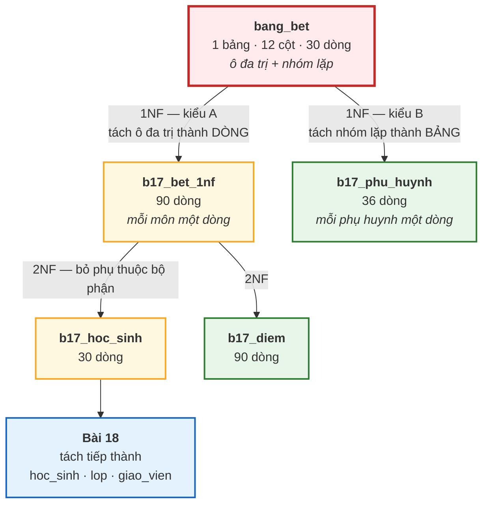
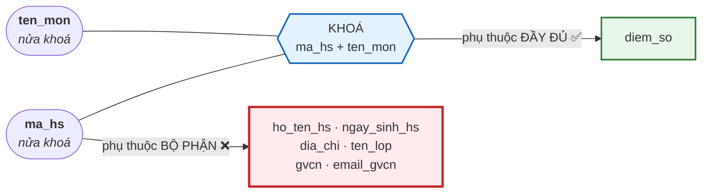

# Bài 17 — Dạng chuẩn 1 (1NF) và Dạng chuẩn 2 (2NF)

!!! abstract "🎯 Học xong bài này, bạn sẽ"
    - Hiểu **dạng chuẩn** là gì và vì sao chúng xếp thành một dãy lồng nhau
    - Nhận ra **hai kiểu vi phạm 1NF khác hẳn nhau**: ô đa trị và nhóm lặp
    - Đưa được bảng bẹt `bang_bet` về **Dạng chuẩn 1** bằng SQL thật
    - Chỉ ra **phụ thuộc bộ phận** và tách bảng để đạt **Dạng chuẩn 2**
    - Gọi đúng tên ba loại **bất thường**: khi thêm, khi sửa, khi xoá
    - Kiểm tra được phép tách của mình có **không mất mát** hay không

## 🧠 Câu chuyện mở đầu

Cô văn thư trường bạn quản lý cả trường bằng **một** file Excel duy nhất, tên là *"DANH SÁCH TỔNG HỢP.xlsx"*.

Mỗi học sinh một dòng. Cột cuối cùng tên là `Các môn và điểm`, và cô gõ vào đó nguyên văn:

```
Toán:8.5, Văn:6.5, Anh:7.0
```

Ở giữa bảng có bốn cột: `Họ tên PH1`, `SĐT PH1`, `Họ tên PH2`, `SĐT PH2`. Vì đa số học sinh chỉ khai một phụ huynh, nên hai cột `PH2` phần lớn để trống.

Rồi ba chuyện xảy ra trong cùng một tuần:

- Thầy hiệu trưởng hỏi: *"Điểm trung bình môn Toán toàn khối 8 là bao nhiêu?"* Cô không cộng nổi — điểm Toán nằm lẫn trong một câu chữ.
- Bạn Nguyễn Hữu Vinh khai thêm **ông nội** là người giám hộ thứ ba. File không có cột `PH3`.
- Cô Lê Thị Mai đổi email. Cô văn thư phải sửa **8 dòng**, và sửa sót một dòng.

Ba chuyện, ba kiểu khổ khác nhau. Nhưng chúng có chung một gốc rễ — và gốc rễ đó có tên, có cách chẩn đoán, có quy trình chữa.

Vậy quy trình đó bắt đầu từ đâu?

## 📖 Khái niệm & thuật ngữ

### Dạng chuẩn là gì

**Dạng chuẩn** (*normal form*, viết tắt **NF**) là **một điều kiện đặt lên lược đồ bảng**. Bảng thoả điều kiện đó thì gọi là "đang ở dạng chuẩn ấy".

**Chuẩn hoá** (*normalization*) là quá trình tách một bảng thành nhiều bảng nhỏ hơn cho tới khi mọi bảng đều đạt dạng chuẩn mong muốn.

Ba điều cần nhớ ngay:

1. **Các dạng chuẩn lồng nhau.** Đạt 2NF thì đương nhiên đã đạt 1NF. Đạt 3NF thì đương nhiên đã đạt 2NF. Không có đường tắt.
2. **Chuẩn hoá không phát minh ra thông tin mới.** Nó chỉ *sắp xếp lại* đúng những gì đã có. Sau khi tách, nối lại phải ra đúng bảng cũ — đó là yêu cầu **phân rã không mất mát** mà [Bài 18](18-dang-chuan-3nf-bcnf.md) sẽ định nghĩa chính xác.
3. **Đầu vào của chuẩn hoá là tập phụ thuộc hàm**, tức là **luật nghiệp vụ** ([Bài 16](16-phu-thuoc-ham.md)), chứ không phải dữ liệu đang có.

### Ba loại bất thường

Chuẩn hoá tồn tại để diệt ba con bệnh sau. Chúng có tên chính thức, và ba chuyện của cô văn thư ứng đúng ba con:

| Tên | English | Triệu chứng | Hậu quả thật trên `bang_bet` |
|---|---|---|---|
| **Bất thường khi thêm** | *insertion anomaly* | Muốn ghi một sự thật mà không ghi được, vì thiếu một sự thật khác chẳng liên quan | Lớp 9A3 vừa mở, đã có chủ nhiệm nhưng **chưa tuyển học sinh nào**. Bảng mỗi dòng một học sinh, nên không có chỗ nào để ghi lớp ấy vào |
| **Bất thường khi sửa** | *update anomaly* | Một sự thật được cất nhiều bản sao; sửa sót một bản là dữ liệu mâu thuẫn | Cô Mai đổi email → phải sửa đúng **8 dòng**; sót một dòng là cô có hai email |
| **Bất thường khi xoá** | *deletion anomaly* | Xoá một sự thật thì mất luôn một sự thật khác chẳng liên quan | Cả **4** học sinh lớp 9A2 chuyển trường → xoá 4 dòng là mất luôn sự thật *"9A2 do cô Nhung chủ nhiệm"* |

Chú ý: hai chuyện đầu của cô văn thư — không cộng nổi điểm Toán, và không có cột `PH3` — **không** thuộc ba loại này. Chúng là vi phạm **1NF**, một căn bệnh khác, và mục ngay dưới đây sẽ chữa chúng trước.

### Dạng chuẩn 1 (1NF)

> Một bảng ở **Dạng chuẩn 1** (*First Normal Form*, **1NF**) khi:
>
> 1. Mọi ô chứa **đúng một giá trị nguyên tử** thuộc miền giá trị của cột — không danh sách, không cấu trúc con.
> 2. Bảng **không có nhóm lặp**.
> 3. Mọi cột có tên riêng và mọi giá trị trong một cột cùng một kiểu.
> 4. Thứ tự dòng và thứ tự cột **không mang ý nghĩa**.
> 5. Bảng **có khoá chính**.

Chữ **nguyên tử** (*atomic*) nghĩa là *"không chia nhỏ hơn được nữa — theo nhu cầu nghiệp vụ"*. Vế sau rất quan trọng và sẽ được bàn ở mục Lỗi thường gặp.

Bảng `bang_bet` vi phạm 1NF theo **hai kiểu khác hẳn nhau**. Phân biệt được hai kiểu này là mục tiêu chính của bài.

#### Vi phạm kiểu A — ô đa trị

**Ô đa trị** (*multi-valued cell*, hay *non-atomic cell*): một ô duy nhất nhồi nhiều giá trị.

```text
cac_mon_va_diem = 'Toán:8.5, Văn:6.5, Anh:7.0'
```

Ô này tệ gấp đôi: nó vừa **đa trị** (ba mẩu ngăn nhau bằng dấu phẩy) vừa **phức hợp** (mỗi mẩu lại gồm hai phần: tên môn và điểm, ngăn nhau bằng dấu hai chấm).

Hậu quả: database nhìn cột này chỉ thấy **một chuỗi ký tự**. Không so sánh được, không tính trung bình được, không ràng buộc `CHECK (diem_so BETWEEN 0 AND 10)` được, không đánh chỉ mục được.

**Cách chữa: tách thành nhiều DÒNG.** Mỗi mẩu giá trị thành một dòng riêng.

#### Vi phạm kiểu B — nhóm lặp

**Nhóm lặp** (*repeating group*): cùng một nhóm thuộc tính được lặp lại thành nhiều cột đánh số.

```text
ho_ten_ph1, sdt_ph1,  ho_ten_ph2, sdt_ph2
```

Chú ý: ở đây **mỗi ô vẫn nguyên tử**. `ho_ten_ph1` chứa đúng một họ tên. Vậy mà vẫn vi phạm 1NF — vì cái bị lặp không nằm *trong* ô, nó nằm *ngang* bảng.

Bản chất hai kiểu là một: cả hai đều cố nhét một quan hệ **một–nhiều** (một học sinh ↔ nhiều điểm; một học sinh ↔ nhiều phụ huynh) vào bên trong **một dòng**. Chỉ khác hướng nén:

| | Vi phạm kiểu A | Vi phạm kiểu B |
|---|---|---|
| Nén theo hướng nào | Vào **trong một ô** | Ra **nhiều cột** |
| Ô có nguyên tử không | **Không** | **Có** |
| Số lượng tối đa | Không giới hạn — nhồi bao nhiêu cũng được | **Bị đóng cứng** ở số cột đã tạo |
| Muốn thêm một giá trị nữa | Sửa chuỗi | Phải `ALTER TABLE` — đổi **lược đồ** |
| Sinh ra ô trống | Không | **Rất nhiều** `NULL` |
| Truy vấn khổ ở đâu | Phải cắt chuỗi | Phải lặp `OR` qua từng cột đánh số |
| Cách chữa | Tách thành nhiều **dòng** | Tách hẳn ra một **bảng** riêng |

!!! danger "Kiểu B nguy hiểm hơn kiểu A, dù nhìn 'sạch' hơn"
    Ô đa trị nhìn là thấy bẩn ngay, ai cũng muốn sửa.

    Nhóm lặp thì nhìn rất ngăn ngắn — bốn cột đàng hoàng, mỗi ô một giá trị. Nhưng nó đóng cứng luật nghiệp vụ *"tối đa 2 phụ huynh"* vào **lược đồ**. Bạn Nguyễn Hữu Vinh khai người giám hộ thứ ba là phải `ALTER TABLE ADD COLUMN ho_ten_ph3`, rồi sửa mọi truy vấn, mọi báo cáo, mọi form nhập liệu đang chạy.

    Một thiết kế tốt phải để luật nghiệp vụ nằm ở **dữ liệu**, không nằm ở **số cột**.

### Dạng chuẩn 2 (2NF)

> Một bảng ở **Dạng chuẩn 2** (*Second Normal Form*, **2NF**) khi:
>
> 1. Nó đã ở **1NF**, và
> 2. Mọi **thuộc tính không khoá** đều **phụ thuộc đầy đủ** vào **mọi** khoá dự tuyển.

Nói cách khác: **không được có phụ thuộc bộ phận** từ một khoá dự tuyển tới một thuộc tính không khoá.

Nhắc lại từ [Bài 16](16-phu-thuoc-ham.md): phụ thuộc bộ phận là khi chỉ cần **một phần** của khoá đã đủ xác định thuộc tính đó — nghĩa là *vế trái thừa cột*.

!!! tip "Hệ quả rất tiện: khoá một cột thì 2NF là miễn phí"
    Nếu **mọi** khoá dự tuyển của bảng chỉ gồm **một** thuộc tính, thì không có "một phần của khoá" nào để mà phụ thuộc bộ phận. Bảng tự động đạt 2NF.

    Vì thế 2NF **chỉ đáng lo ở bảng có khoá dự tuyển phức hợp**. Trong `truong_hoc` có đúng **hai** bảng như vậy, và cả hai đều đạt 2NF — vì hai lý do khác nhau:

    | Bảng | Khoá dự tuyển phức hợp | Thuộc tính không khoá | Vì sao vẫn đạt 2NF |
    |---|---|---|---|
    | `phan_cong_day` | `(ma_gv, ma_mon, ma_lop, hoc_ky)` — khoá chính | **Không có cột nào** | Điều kiện 2NF chỉ nói về thuộc tính không khoá; không có cột nào như vậy thì nó thoả một cách rỗng |
    | `diem_danh` | `(ma_hs, ngay)` — khoá thay thế, ràng buộc `diem_danh_ma_hs_ngay_key` | `trang_thai`, `ly_do` | Cả hai phụ thuộc **đầy đủ**: chỉ biết `ma_hs` thì không biết hôm nào, chỉ biết `ngay` thì không biết của ai |

    Chú ý `diem_danh`: khoá **chính** của nó là `ma_dd` — một cột — nhưng 2NF đòi kiểm trên **mọi** khoá dự tuyển, nên vẫn phải xét `(ma_hs, ngay)`. Đây đúng là chỗ mà hai chữ *"mọi khoá dự tuyển"* trong định nghĩa có sức nặng.

### Bảng thuật ngữ

| Tiếng Việt | English | Nghĩa dễ hiểu |
|---|---|---|
| Dạng chuẩn | *normal form* | Một điều kiện đặt lên lược đồ bảng; các dạng chuẩn lồng nhau |
| Chuẩn hoá | *normalization* | Tách bảng dần cho tới khi mọi bảng đạt dạng chuẩn mong muốn |
| Dạng chuẩn 1 | *1NF* | Mọi ô nguyên tử, không nhóm lặp, có khoá, thứ tự dòng/cột vô nghĩa |
| Dạng chuẩn 2 | *2NF* | 1NF và mọi thuộc tính không khoá phụ thuộc **đầy đủ** vào mọi khoá dự tuyển |
| Giá trị nguyên tử | *atomic value* | Giá trị không cần chia nhỏ hơn nữa theo nhu cầu nghiệp vụ |
| Ô đa trị | *multi-valued cell* | Một ô nhồi nhiều giá trị — vi phạm 1NF kiểu A |
| Nhóm lặp | *repeating group* | Cùng nhóm thuộc tính lặp thành nhiều cột đánh số — vi phạm 1NF kiểu B |
| Bất thường khi thêm | *insertion anomaly* | Không ghi được một sự thật vì thiếu một sự thật khác không liên quan |
| Bất thường khi sửa | *update anomaly* | Một sự thật có nhiều bản sao; sửa sót một bản là mâu thuẫn |
| Bất thường khi xoá | *deletion anomaly* | Xoá một sự thật thì mất luôn một sự thật khác không liên quan |

## 🖼️ Sơ đồ

Toàn bộ hành trình của Cấp 2 nhìn từ trên xuống. Bài này đi hai chặng đầu:



Còn đây là chỗ đau của bước 2NF: khoá gồm hai cột, nhưng phần lớn thuộc tính chỉ bám vào **một nửa** khoá.



Sáu thuộc tính trong ô đỏ chỉ cần `ma_hs` là xác định được. Chúng bị lôi theo `ten_mon` một cách oan uổng, và cái giá phải trả là mỗi thuộc tính bị chép lại đúng **3 lần** cho mỗi học sinh.

## 💻 Thực hành

### 1. Nhìn tận mắt căn bệnh

Bảng **TRƯỚC** — ba dòng đầu của `bang_bet`, đúng như `dataset/01-chua-chuan-hoa.sql` nạp vào:

```sql
-- KỲ VỌNG: 3 dòng
SELECT stt, ho_ten_hs, ten_lop,
       ho_ten_ph1, ho_ten_ph2,
       cac_mon_va_diem
FROM bang_bet
WHERE stt <= 3
ORDER BY stt;
```

| stt | ho_ten_hs | ten_lop | ho_ten_ph1 | ho_ten_ph2 | cac_mon_va_diem |
|---|---|---|---|---|---|
| 1 | Nguyễn Văn An | 8A1 | Nguyễn Văn Thành | Lê Thị Hạnh | `Toán:8.5, Văn:6.5, Anh:7.0` |
| 2 | Trần Thị Bình | 8A1 | Trần Văn Bảy | *(NULL)* | `Toán:8.0, Văn:7.0, Anh:8.5` |
| 3 | Lê Hoàng Cường | 8A1 | Lê Hoàng Sáu | Nguyễn Thị Tám | `Toán:9.0, Văn:5.5, Anh:6.0` |

Hai cột cuối cùng là hai vi phạm 1NF, mỗi cột một kiểu.

Đo mức lãng phí của nhóm lặp:

```sql
-- KỲ VỌNG: 1 dòng
-- KỲ VỌNG: tong_so_dong = 30
-- KỲ VỌNG: co_phu_huynh_1 = 30
-- KỲ VỌNG: co_phu_huynh_2 = 6
-- KỲ VỌNG: o_trong_lang_phi = 24
SELECT count(*)                       AS tong_so_dong,
       count(ho_ten_ph1)              AS co_phu_huynh_1,
       count(ho_ten_ph2)              AS co_phu_huynh_2,
       count(*) - count(ho_ten_ph2)   AS o_trong_lang_phi
FROM bang_bet;
```

Kết quả: `30`, `30`, `6`, `24`. Nghĩa là **24 trong 30 dòng** có hai ô `PH2` bỏ trống — 48 ô `NULL` chỉ để phòng hờ. Và nếu mai có bạn khai ba phụ huynh thì vẫn phải `ALTER TABLE`.

Đo mức khó của ô đa trị — thử tìm bạn nào điểm Toán từ 9 trở lên:

```sql
-- KỲ VỌNG: 5 dòng
SELECT ho_ten_hs, cac_mon_va_diem
FROM bang_bet
WHERE cac_mon_va_diem LIKE 'Toán:9%'
ORDER BY ho_ten_hs;
```

Năm dòng: Hồ Thị Quyên (`Toán:9.2`), Lê Hoàng Cường (`Toán:9.0`), Ngô Quang Huy (`Toán:9.5`), Nguyễn Hữu Vinh (`Toán:9.0`), Vũ Thị Chi (`Toán:9.5`).

Nhưng câu này **sai về nguyên tắc**, và nó chỉ ra đúng kết quả nhờ may mắn:

- Nó dựa vào việc môn Toán luôn được gõ **đầu tiên** trong chuỗi. Đổi thứ tự là hỏng.
- `LIKE 'Toán:9%'` bắt cả `9.0` lẫn `9.5`, nhưng cũng sẽ bắt nhầm `Toán:90` nếu ai đó gõ sai.
- Muốn hỏi *"từ 8.5 trở lên"* thì `LIKE` bó tay hoàn toàn — vì đây là so sánh **số**, mà cột lại là **chuỗi**.

Đó chính là cái giá của việc phá 1NF: **bạn mất quyền dùng toán tử của đúng kiểu dữ liệu**.

### 2. Đưa về 1NF — chữa vi phạm kiểu A

Tách ô đa trị thành nhiều dòng. Đồng thời sinh luôn mã học sinh `ma_hs` — vì [Bài 16](16-phu-thuoc-ham.md) đã chỉ ra `ho_ten_hs` không phải khoá, ta cần một định danh thật sự.

```sql
DROP TABLE IF EXISTS b17_bet_1nf CASCADE;

CREATE TABLE b17_bet_1nf AS
SELECT 'HS' || lpad(b.stt::text, 3, '0')             AS ma_hs,
       b.ho_ten_hs,
       b.ngay_sinh_hs,
       b.dia_chi,
       b.ten_lop,
       b.gvcn,
       b.email_gvcn,
       split_part(trim(md), ':', 1)                  AS ten_mon,
       split_part(trim(md), ':', 2)::numeric(4,2)    AS diem_so
FROM bang_bet AS b,
     unnest(string_to_array(b.cac_mon_va_diem, ',')) AS t(md);

-- KỲ VỌNG: 1 dòng
-- KỲ VỌNG: so_dong = 90
SELECT count(*) AS so_dong FROM b17_bet_1nf;
```

Đúng **90** dòng — 30 học sinh × 3 môn.

Bảng **SAU** — ba dòng đầu của cùng bạn Nguyễn Văn An:

```sql
-- KỲ VỌNG: 3 dòng
SELECT ma_hs, ho_ten_hs, ten_lop, ten_mon, diem_so
FROM b17_bet_1nf
WHERE ma_hs = 'HS001'
ORDER BY ten_mon;
```

| ma_hs | ho_ten_hs | ten_lop | ten_mon | diem_so |
|---|---|---|---|---|
| HS001 | Nguyễn Văn An | 8A1 | Anh | 7.00 |
| HS001 | Nguyễn Văn An | 8A1 | Toán | 8.50 |
| HS001 | Nguyễn Văn An | 8A1 | Văn | 6.50 |

Bây giờ `diem_so` là `numeric` thật. Câu hỏi của thầy hiệu trưởng trở nên tầm thường:

```sql
-- KỲ VỌNG: 3 dòng
SELECT ten_mon,
       round(avg(diem_so), 2) AS diem_trung_binh,
       count(*)               AS so_con_diem
FROM b17_bet_1nf
WHERE ten_lop LIKE '8%'
GROUP BY ten_mon
ORDER BY ten_mon;
```

Ba dòng, mỗi môn `so_con_diem = 20` (20 học sinh khối 8 trong `bang_bet`: 6 + 6 + 8).

!!! success "Đây là toàn bộ giá trị của 1NF"
    Trước: phải viết `LIKE`, phải cầu trời thứ tự không đổi, và không hỏi được *"từ 8.5 trở lên"*.

    Sau: `avg()`, `>=`, `ORDER BY`, `CHECK`, index — mọi công cụ của kiểu số đều dùng được.

### 3. Đưa về 1NF — chữa vi phạm kiểu B

Nhóm lặp không tách thành dòng của chính bảng đó được, vì phụ huynh là một **thực thể khác**. Nó phải ra ở riêng.

```sql
DROP TABLE IF EXISTS b17_phu_huynh CASCADE;

CREATE TABLE b17_phu_huynh AS
SELECT 'HS' || lpad(stt::text, 3, '0') AS ma_hs,
       ho_ten_ph1                      AS ho_ten,
       sdt_ph1                         AS so_dien_thoai
FROM bang_bet
WHERE ho_ten_ph1 IS NOT NULL
UNION ALL
SELECT 'HS' || lpad(stt::text, 3, '0'),
       ho_ten_ph2,
       sdt_ph2
FROM bang_bet
WHERE ho_ten_ph2 IS NOT NULL;

-- KỲ VỌNG: 1 dòng
-- KỲ VỌNG: so_phu_huynh = 36
SELECT count(*) AS so_phu_huynh FROM b17_phu_huynh;
```

Đúng **36** dòng = 30 phụ huynh thứ nhất + 6 phụ huynh thứ hai. Không còn một ô `NULL` lãng phí nào.

Xem học sinh nào có nhiều hơn một phụ huynh:

```sql
-- KỲ VỌNG: 6 dòng
SELECT ma_hs, count(*) AS so_phu_huynh,
       string_agg(ho_ten, ' · ' ORDER BY ho_ten) AS danh_sach
FROM b17_phu_huynh
GROUP BY ma_hs
HAVING count(*) > 1
ORDER BY ma_hs;
```

Sáu dòng: `HS001`, `HS003`, `HS007`, `HS013`, `HS021`, `HS029`.

Và đây là điều quan trọng nhất: bây giờ **học sinh thứ ba, thứ tư, thứ n đều thêm được bằng một câu `INSERT`**, không cần `ALTER TABLE`. Luật *"mỗi học sinh mấy phụ huynh"* đã chuyển từ **lược đồ** xuống **dữ liệu**.

!!! warning "Bảng `b17_phu_huynh` chưa có khoá — đó là việc còn dở"
    1NF đòi bảng phải có khoá chính. `(ma_hs, ho_ten)` thì sao? Không được: hai phụ huynh của cùng một học sinh có thể trùng họ tên (bố và bác trùng tên là chuyện có thật).

    [Bài 12](../cap-1-mo-hinh-er/12-bay-loai-khoa.md) đã khảo sát đúng bảng này và kết luận: `phu_huynh` **không có** khoá tự nhiên hợp lệ. Vì vậy lược đồ đích trong `dataset/02-chuan-hoa.sql` thêm một **khoá nhân tạo** `ma_ph` dạng `PH001`–`PH045`.

    Ghi nhớ: khi chuẩn hoá xong mà một bảng vẫn không tìm ra khoá tự nhiên, đáp án đúng là **thêm khoá nhân tạo**, chứ không phải ghép đại vài cột lại rồi hy vọng.

!!! note "`b17_phu_huynh` khớp tới đâu so với bảng `phu_huynh` của lược đồ đích"
    Brief của Cấp 2 nói kết quả cuối phải trùng `dataset/02-chuan-hoa.sql`. Với bảng phụ huynh thì chỉ trùng **một phần**, và cần nói rõ phần nào:

    | Cột trong `phu_huynh` | Có trong `b17_phu_huynh`? | Vì sao |
    |---|---|---|
    | `ho_ten` | ✅ Có | Chép thẳng từ `ho_ten_ph1` / `ho_ten_ph2` |
    | `so_dien_thoai` | ✅ Có | Chép thẳng từ `sdt_ph1` / `sdt_ph2` |
    | `ma_hs` | ✅ Có | Khoá ngoại, sinh từ `stt` |
    | `ma_ph` | ❌ Không | **Khoá nhân tạo** — chuẩn hoá không sinh ra nó, người thiết kế phải thêm vào ở bước chuyển ER sang bảng ([Bài 14](../cap-1-mo-hinh-er/14-chuyen-er-sang-bang.md)) |
    | `quan_he` | ❌ Không | **`bang_bet` không hề lưu thông tin này.** Cột `ho_ten_ph1` không cho biết đó là bố, mẹ hay ông |

    Hai dòng cuối là cùng một bài học, nói hai cách: **chuẩn hoá chỉ sắp xếp lại thông tin đã có, nó không phát minh ra thông tin mới.** Thiếu `quan_he` thì phải đi hỏi nhà trường; thiếu `ma_ph` thì phải tự đặt ra.

    Ngược lại, ba bảng `giao_vien`, `lop`, `hoc_sinh` thì khớp **đúng tới từng giá trị** — [Bài 18](18-dang-chuan-3nf-bcnf.md) mục 3 có truy vấn đối chiếu chạy thật để chứng minh.

### 4. Chẩn đoán 2NF

Bảng `b17_bet_1nf` đã ở 1NF. Nhưng nó đã ở 2NF chưa?

**Bước 1 — tìm khoá dự tuyển.** [Bài 16](16-phu-thuoc-ham.md) mục 7 đã chạy thuật toán trên đúng tập PTH này và ra kết quả: khoá dự tuyển **duy nhất** là `{ma_hs, ten_mon}`.

**Bước 2 — liệt kê thuộc tính khoá / không khoá.**

| | Thuộc tính |
|---|---|
| Thuộc tính khoá | `ma_hs`, `ten_mon` |
| Thuộc tính không khoá | `ho_ten_hs`, `ngay_sinh_hs`, `dia_chi`, `ten_lop`, `gvcn`, `email_gvcn`, `diem_so` |

**Bước 3 — kiểm từng thuộc tính không khoá xem có phụ thuộc bộ phận không.**

| Thuộc tính không khoá | Chỉ cần phần nào của khoá? | Kết luận |
|---|---|---|
| `diem_so` | Cần **cả hai** — một mình `ma_hs` không nói được điểm môn nào | ✅ Đầy đủ |
| `ho_ten_hs` | Chỉ `ma_hs` | ❌ **Bộ phận** |
| `ngay_sinh_hs` | Chỉ `ma_hs` | ❌ **Bộ phận** |
| `dia_chi` | Chỉ `ma_hs` | ❌ **Bộ phận** |
| `ten_lop` | Chỉ `ma_hs` | ❌ **Bộ phận** |
| `gvcn` | Chỉ `ma_hs` | ❌ **Bộ phận** |
| `email_gvcn` | Chỉ `ma_hs` | ❌ **Bộ phận** |

Sáu phụ thuộc bộ phận → **`b17_bet_1nf` KHÔNG ở 2NF**.

Đo cái giá bằng SQL:

```sql
-- KỲ VỌNG: 5 dòng
SELECT ma_hs, ho_ten_hs, dia_chi, count(*) AS so_ban_sao
FROM b17_bet_1nf
GROUP BY ma_hs, ho_ten_hs, dia_chi
ORDER BY ma_hs
LIMIT 5;
```

Năm dòng đầu, cột `so_ban_sao` đều bằng `3`. Địa chỉ nhà bạn An được cất **3 bản sao** chỉ vì bạn ấy học 3 môn. Bạn nào học 12 môn thì 12 bản.

Ba loại bất thường hiện ra đầy đủ trên bảng này:

| Loại bất thường | Kịch bản cụ thể trên `b17_bet_1nf` |
|---|---|
| **Khi thêm** | Có học sinh mới nhập học giữa kỳ, chưa có điểm môn nào. Không `INSERT` được, vì `ten_mon` là một nửa khoá chính — không được để trống |
| **Khi sửa** | Bạn An chuyển nhà. Phải `UPDATE` đúng 3 dòng. Sót một dòng là bạn An có hai địa chỉ |
| **Khi xoá** | Nhà trường huỷ toàn bộ điểm của một bạn để nhập lại. Xoá 3 dòng là mất luôn ngày sinh, địa chỉ, lớp của bạn ấy |

### 5. Tách để đạt 2NF

Quy tắc tách rất máy móc:

```text
Với mỗi phụ thuộc bộ phận  X' → A  (X' là tập con thật sự của khoá):
  Bước 1.  Tạo bảng mới gồm X' và mọi thuộc tính phụ thuộc bộ phận vào X'
  Bước 2.  X' làm khoá chính của bảng mới
  Bước 3.  Xoá các thuộc tính A đó khỏi bảng gốc, GIỮ NGUYÊN X'
           (X' ở lại bảng gốc với vai trò KHOÁ NGOẠI)
```

Ở đây chỉ có một `X'` duy nhất là `{ma_hs}`, nên ta tách thành hai bảng:

```sql
DROP TABLE IF EXISTS b17_hoc_sinh CASCADE;
DROP TABLE IF EXISTS b17_diem CASCADE;

CREATE TABLE b17_hoc_sinh AS
SELECT DISTINCT ma_hs, ho_ten_hs, ngay_sinh_hs, dia_chi,
       ten_lop, gvcn, email_gvcn
FROM b17_bet_1nf;

CREATE TABLE b17_diem AS
SELECT ma_hs, ten_mon, diem_so
FROM b17_bet_1nf;

-- KỲ VỌNG: 2 dòng
SELECT 'b17_hoc_sinh' AS bang, count(*) AS so_dong FROM b17_hoc_sinh
UNION ALL
SELECT 'b17_diem', count(*) FROM b17_diem;
```

Kết quả: `b17_hoc_sinh` **30** dòng, `b17_diem` **90** dòng.

So sánh trực quan bảng **TRƯỚC** và **SAU** cho riêng bạn HS001:

| | Trước (`b17_bet_1nf`) | Sau (`b17_hoc_sinh` + `b17_diem`) |
|---|---|---|
| Số dòng chứa *"An ở 12 Lê Lợi"* | 3 | **1** |
| Số dòng chứa điểm của An | 3 | 3 |
| Thêm học sinh chưa có điểm | Không được | **Được** — `INSERT` vào `b17_hoc_sinh` |
| Đổi địa chỉ của An | `UPDATE` 3 dòng | **`UPDATE` 1 dòng** |
| Xoá hết điểm của An | Mất luôn hồ sơ | **Hồ sơ vẫn còn** |

Khoá của hai bảng mới:

| Bảng | Khoá dự tuyển | Có khoá phức hợp không | Đã ở 2NF chưa |
|---|---|---|---|
| `b17_hoc_sinh` | `{ma_hs}` | Không — một cột | ✅ Tự động đạt |
| `b17_diem` | `{ma_hs, ten_mon}` | Có | ✅ `diem_so` phụ thuộc đầy đủ |

### 6. Kiểm tra phép tách không làm mất dữ liệu

Tách xong phải chứng minh nối lại ra đúng bảng cũ, không thiếu dòng nào và **không thừa dòng nào**.

```sql
-- KỲ VỌNG: 1 dòng
-- KỲ VỌNG: goc = 90
-- KỲ VỌNG: noi_lai = 90
-- KỲ VỌNG: dong_la_sinh_ra = 0
-- KỲ VỌNG: dong_bi_mat = 0
SELECT (SELECT count(*) FROM b17_bet_1nf)                       AS goc,
       (SELECT count(*) FROM b17_hoc_sinh h
          JOIN b17_diem d ON d.ma_hs = h.ma_hs)                 AS noi_lai,
       (SELECT count(*) FROM (
            SELECT h.ma_hs, h.ho_ten_hs, h.ngay_sinh_hs, h.dia_chi,
                   h.ten_lop, h.gvcn, h.email_gvcn, d.ten_mon, d.diem_so
            FROM b17_hoc_sinh h JOIN b17_diem d ON d.ma_hs = h.ma_hs
            EXCEPT
            SELECT * FROM b17_bet_1nf) x)                       AS dong_la_sinh_ra,
       (SELECT count(*) FROM (
            SELECT * FROM b17_bet_1nf
            EXCEPT
            SELECT h.ma_hs, h.ho_ten_hs, h.ngay_sinh_hs, h.dia_chi,
                   h.ten_lop, h.gvcn, h.email_gvcn, d.ten_mon, d.diem_so
            FROM b17_hoc_sinh h JOIN b17_diem d ON d.ma_hs = h.ma_hs) y)
                                                                AS dong_bi_mat;
```

Một dòng kết quả: `goc = 90`, `noi_lai = 90`, `dong_la_sinh_ra = 0`, `dong_bi_mat = 0`.

Hai số `0` cuối là thứ quan trọng nhất. Chúng nói rằng phép tách này **không mất mát** — [Bài 18](18-dang-chuan-3nf-bcnf.md) sẽ cho biết điều kiện toán học bảo đảm chuyện đó, và sẽ cho xem một phép tách **sai** sinh ra dòng ma như thế nào.

### 7. Còn một căn bệnh nữa chưa chữa

Nhìn lại `b17_hoc_sinh`:

```sql
-- KỲ VỌNG: 5 dòng
SELECT ten_lop, gvcn, email_gvcn, count(*) AS so_hoc_sinh
FROM b17_hoc_sinh
GROUP BY ten_lop, gvcn, email_gvcn
ORDER BY ten_lop;
```

Năm dòng: `8A1` 6 học sinh, `8A2` 6, `8A3` 8, `9A1` 6, `9A2` 4.

Bảng này **đã ở 2NF** — khoá chỉ một cột nên không thể có phụ thuộc bộ phận. Vậy mà email của cô Lê Thị Mai vẫn bị chép **8 lần**.

Vì sao? Vì đây là một căn bệnh **khác**: `ma_hs → ten_lop → gvcn → email_gvcn`. Đó là **phụ thuộc bắc cầu** ([Bài 16](16-phu-thuoc-ham.md)), và nó cần đúng liều thuốc của [Bài 18](18-dang-chuan-3nf-bcnf.md).

Hai bảng `b17_hoc_sinh` và `b17_diem` được giữ lại làm nguyên liệu cho bài sau, nên **không xoá** ở đây. Chỉ dọn bảng trung gian:

```sql
DROP TABLE IF EXISTS b17_bet_1nf CASCADE;
```

## ⚠️ Lỗi thường gặp

!!! warning "Lỗi 1: Tưởng 'nguyên tử' là một khái niệm tuyệt đối"
    Cột `dia_chi` chứa `'12 Lê Lợi, Hà Nội'`. Có vi phạm 1NF không?

    **Còn tuỳ nghiệp vụ.**

    - Nếu trường chỉ in địa chỉ lên giấy mời họp phụ huynh → đó là **một** giá trị, nguyên tử, không sao cả.
    - Nếu trường cần thống kê *"bao nhiêu học sinh ở quận Hoàn Kiếm"* → `dia_chi` đang là giá trị **phức hợp** và phải tách thành `so_nha`, `duong`, `phuong`, `quan`, `tinh`.

    Đây đúng là **thuộc tính phức hợp** mà [Bài 7](../cap-1-mo-hinh-er/07-thuc-the-va-thuoc-tinh.md) đã bàn. Nguyên tắc: *"nguyên tử tới mức nghiệp vụ cần, đừng nguyên tử hơn"*.

    Còn `cac_mon_va_diem` thì **không có chỗ cãi**: không nghiệp vụ nào cần nguyên cả câu `'Toán:8.5, Văn:6.5, Anh:7.0'` như một giá trị duy nhất.

!!! warning "Lỗi 2: Kiểu mảng và JSONB của PostgreSQL có phá 1NF không?"
    PostgreSQL cho khai cột kiểu `TEXT[]` hoặc `JSONB`. Vậy lưu `cac_mon_va_diem` dưới dạng `JSONB` thì có đạt 1NF không?

    Về lý thuyết quan hệ thuần tuý: **không**, vì giá trị vẫn có cấu trúc bên trong.

    Nhưng thực tế thì tinh tế hơn: `JSONB` và mảng là những **kiểu dữ liệu có toán tử riêng, có index riêng** (Bài 32 và Bài 35 sẽ dạy). Chúng khác hẳn việc nhét một chuỗi `TEXT` rồi tự cắt bằng `split_part`.

    Phép thử thực dụng: **bạn có cần truy vấn, ràng buộc, thống kê trên từng phần tử không?** Có → tách thành bảng. Không, chỉ đọc nguyên khối → dùng `JSONB` cũng chấp nhận được. Cấu hình người dùng, log sự kiện là ví dụ hợp lý của vế sau.

!!! warning "Lỗi 3: Chữa nhóm lặp bằng cách thêm cột"
    *"Bạn Vinh có ba phụ huynh à? Thêm `ho_ten_ph3`, `sdt_ph3` là xong."*

    Đây là phản xạ tự nhiên và **sai hoàn toàn**. Nó không chữa bệnh, nó nuôi bệnh:

    - Mỗi lần thêm cột là đổi lược đồ, kéo theo mọi truy vấn, mọi form, mọi báo cáo.
    - Số ô `NULL` tăng vọt: thêm `PH3` là có thêm ~29 dòng bỏ trống hai ô nữa.
    - Câu hỏi *"số điện thoại 0912345001 là của phụ huynh bạn nào"* biến thành `WHERE sdt_ph1 = ... OR sdt_ph2 = ... OR sdt_ph3 = ...` — dài thêm mãi.
    - Không đặt được `UNIQUE` hay `FOREIGN KEY` tử tế lên một nhóm cột đánh số.

    Đáp án duy nhất đúng: **tách ra bảng riêng**, một phụ huynh một dòng.

!!! warning "Lỗi 4: Nghĩ 2NF là 'tách mọi thứ ra cho nhỏ'"
    2NF **chỉ** nói về phụ thuộc bộ phận — tức là chỉ về thuộc tính không khoá phụ thuộc vào **một phần khoá**.

    Nó không đụng gì tới chuyện `ten_lop → gvcn` cả, vì `ten_lop` không phải một phần của khoá. Bảng `b17_hoc_sinh` đạt 2NF đàng hoàng mà vẫn đầy dư thừa.

    Mỗi dạng chuẩn chữa đúng **một** loại bệnh. Đừng đòi 2NF làm việc của 3NF.

!!! warning "Lỗi 5: Tách xong quên giữ lại cột nối"
    Khi tách `b17_bet_1nf`, cột `ma_hs` phải **có mặt ở cả hai bảng**: là khoá chính của `b17_hoc_sinh`, và là khoá ngoại trong `b17_diem`.

    Nếu xoá `ma_hs` khỏi bảng điểm thì không còn cách nào biết con điểm `8.5` ấy của ai. Phép tách trở thành **mất mát** — và [Bài 18](18-dang-chuan-3nf-bcnf.md) sẽ chứng minh bằng một ví dụ sinh ra dòng ma.

!!! warning "Lỗi 6: Nghĩ 'bảng bẹt luôn nhanh hơn vì không phải JOIN'"
    Bảng bẹt mỗi dòng chứa cả hồ sơ học sinh lẫn điểm, nên **mỗi dòng rất to**. Một trang dữ liệu chứa được ít dòng hơn, và mọi truy vấn đều phải đọc nhiều trang hơn — kể cả khi chỉ cần đúng cột `diem_so`.

    Tách bảng thường làm **giảm** tổng dung lượng và **tăng** tốc độ quét. [Bài 20](20-denormalization.md) sẽ nói khi nào điều ngược lại mới đúng, và Bài 33 sẽ giải thích cơ chế trang dữ liệu bên dưới.

## ✍️ Bài tập

1. Cột `cac_mon_va_diem` và bộ bốn cột `ho_ten_ph1 … sdt_ph2` cùng vi phạm 1NF. Nêu **ba** điểm khác nhau giữa hai kiểu vi phạm này.

2. Một trường khác lưu bảng `hoat_dong(ma_hs, ho_ten, cac_clb)` với `cac_clb = 'Bóng rổ, Cờ vua, Tin học'`. Viết câu SQL đưa bảng này về 1NF (giả sử bảng đã tồn tại). Bảng kết quả có khoá là gì?

3. Cho `R(ma_hs, ten_mon, diem_so, ten_gv_day)` với luật: mỗi môn ở trường do đúng một giáo viên dạy. Khoá dự tuyển của `R` là gì? `R` có ở 2NF không? Nếu không, chỉ ra phụ thuộc bộ phận và tách.

4. Vì sao bảng `phan_cong_day` trong `dataset/02-chuan-hoa.sql` — khoá chính gồm **bốn** cột — lại đương nhiên ở 2NF?

5. Viết câu SQL trên `b17_bet_1nf` chứng minh **bất thường khi sửa**: đếm xem đổi địa chỉ của một học sinh thì phải sửa bao nhiêu dòng.

6. Sau khi tách ở mục 5, `b17_hoc_sinh` có 30 dòng và `b17_diem` có 90 dòng, tổng 120 dòng — nhiều hơn 90 dòng của bảng gốc. Vậy chuẩn hoá làm **tốn** chỗ hơn à? Giải thích.

??? success "Đáp án"
    **1.** Ba điểm khác nhau (chọn ba trong số này):

    - **Tính nguyên tử của ô**: `cac_mon_va_diem` có ô **không** nguyên tử; `ho_ten_ph1` thì ô **vẫn** nguyên tử.
    - **Giới hạn số lượng**: ô đa trị nhồi bao nhiêu cũng được; nhóm lặp bị đóng cứng ở số cột — muốn thêm phải `ALTER TABLE`.
    - **Ô trống**: nhóm lặp sinh rất nhiều `NULL` (ở đây 24/30 dòng); ô đa trị không sinh `NULL`.
    - **Cách chữa**: kiểu A tách thành nhiều **dòng** của chính bảng đó; kiểu B tách hẳn ra một **bảng** mới.

    **2.**

    <!-- sql:khong-chay -->
    ```sql
    CREATE TABLE hoat_dong_1nf AS
    SELECT ma_hs, ho_ten, trim(clb) AS ten_clb
    FROM hoat_dong AS h,
         unnest(string_to_array(h.cac_clb, ',')) AS t(clb);
    ```

    Khoá của bảng kết quả là `{ma_hs, ten_clb}` — một học sinh tham gia nhiều câu lạc bộ, một câu lạc bộ có nhiều học sinh, nhưng một cặp chỉ xuất hiện một lần.

    Lưu ý `ho_ten` lúc này phụ thuộc **bộ phận** vào khoá (chỉ cần `ma_hs`), nên bảng mới ở 1NF chứ chưa ở 2NF.

    **3.** Tập PTH: `(ma_hs, ten_mon) → diem_so` và `ten_mon → ten_gv_day`.

    - `ma_hs` và `ten_mon` không bao giờ xuất hiện ở vế phải → cả hai phải nằm trong mọi khoá. `{ma_hs, ten_mon}⁺` = toàn bộ → **khoá dự tuyển duy nhất là `{ma_hs, ten_mon}`**.
    - `ten_gv_day` là thuộc tính không khoá, và chỉ cần `ten_mon` — một **phần** của khoá — là xác định được. Đó là **phụ thuộc bộ phận** → `R` **không** ở 2NF.
    - Tách: `R1(ma_hs, ten_mon, diem_so)` khoá `{ma_hs, ten_mon}`, và `R2(ten_mon, ten_gv_day)` khoá `{ten_mon}`. Cột `ten_mon` ở lại cả hai bảng, làm khoá ngoại ở `R1`.

    **4.** Vì `phan_cong_day` **không có thuộc tính không khoá nào cả** — cả bốn cột `ma_gv`, `ma_mon`, `ma_lop`, `hoc_ky` đều nằm trong khoá chính, nên cả bốn đều là **thuộc tính khoá**.

    Điều kiện 2NF chỉ nói về thuộc tính **không** khoá. Không có thuộc tính nào như vậy thì điều kiện thoả một cách rỗng. Thực ra bảng này đạt luôn tới BCNF, như [Bài 18](18-dang-chuan-3nf-bcnf.md) sẽ kiểm lại.

    **5.**

    <!-- sql:khong-chay -->
    ```sql
    SELECT ma_hs, dia_chi, count(*) AS so_dong_phai_sua
    FROM b17_bet_1nf
    WHERE ma_hs = 'HS001'
    GROUP BY ma_hs, dia_chi;
    ```

    Một dòng, `so_dong_phai_sua = 3`. Nếu `UPDATE` chỉ trúng 2 trong 3 dòng, bảng sẽ khẳng định bạn An vừa ở `12 Lê Lợi` vừa ở địa chỉ mới — đó chính là **bất thường khi sửa**.

    (Khối SQL này được đánh dấu không chạy vì bảng trung gian `b17_bet_1nf` đã bị xoá ở mục 7.)

    **6.** Đếm **dòng** thì nhiều hơn, nhưng đếm **ô dữ liệu** thì ít hơn hẳn:

    | | Bảng gốc | Sau khi tách |
    |---|---|---|
    | `b17_bet_1nf` | 90 dòng × 9 cột = **810 ô** | — |
    | `b17_hoc_sinh` | — | 30 × 7 = 210 ô |
    | `b17_diem` | — | 90 × 3 = 270 ô |
    | **Tổng** | **810 ô** | **480 ô** |

    Giảm khoảng **41%**. Và phần giảm đi toàn là bản sao thừa của cùng một sự thật — thứ vừa tốn chỗ vừa là nguồn gốc của mọi mâu thuẫn dữ liệu.

    Chuẩn hoá đổi *số dòng nhiều hơn* lấy *số bản sao ít hơn*. [Bài 20](20-denormalization.md) sẽ bàn khi nào nên đổi ngược lại.

## 🔑 Tóm tắt

1. **Dạng chuẩn** là điều kiện đặt lên lược đồ, và chúng **lồng nhau**: 2NF bao hàm 1NF, 3NF bao hàm 2NF. Mục tiêu chung là diệt ba loại **bất thường** — khi thêm, khi sửa, khi xoá.
2. **1NF** đòi mọi ô **nguyên tử**, **không có nhóm lặp**, và bảng phải có khoá. `bang_bet` vi phạm theo **hai kiểu**: ô `cac_mon_va_diem` là **ô đa trị** (nén vào trong ô), còn `ho_ten_ph1/ph2` là **nhóm lặp** (nén ra nhiều cột).
3. Hai kiểu vi phạm 1NF có **hai cách chữa khác nhau**: ô đa trị tách thành nhiều **dòng** (30 → 90 dòng); nhóm lặp tách hẳn ra một **bảng** riêng (36 dòng phụ huynh, không còn 48 ô `NULL`). Chữa xong mới dùng lại được toán tử của đúng kiểu dữ liệu.
4. **2NF** đòi mọi **thuộc tính không khoá** phụ thuộc **đầy đủ** vào **mọi** khoá dự tuyển — tức là cấm **phụ thuộc bộ phận**. Bảng có khoá chỉ một cột thì tự động đạt 2NF; 2NF chỉ đáng lo với **khoá phức hợp**.
5. Tách bảng phải **không mất mát**: nối hai bảng con lại phải ra đúng bảng cũ, không thiếu dòng và không sinh dòng ma. Muốn vậy, cột dùng để nối (`ma_hs`) phải **ở lại cả hai bảng**. Bảng `b17_hoc_sinh` đã đạt 2NF nhưng vẫn dư thừa — vì nó còn mắc **phụ thuộc bắc cầu**, việc của bài sau.

---

⬅️ [Bài 16 — Phụ thuộc hàm và bao đóng](16-phu-thuoc-ham.md) · ➡️ [Bài 18 — Dạng chuẩn 3 (3NF) và BCNF](18-dang-chuan-3nf-bcnf.md)
