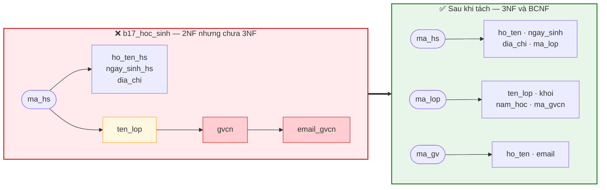
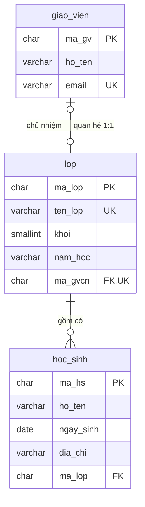

# Bài 18 — Dạng chuẩn 3 (3NF) và BCNF

!!! abstract "🎯 Học xong bài này, bạn sẽ"
    - Nhận ra **phụ thuộc bắc cầu** trong một bảng đã đạt 2NF, và tách nó đi
    - Phát biểu **BCNF** bằng đúng một câu: *"mọi định thức đều phải là siêu khoá"*
    - Dựng được ví dụ kinh điển **3NF nhưng không BCNF**, và hiểu vì sao nó tồn tại
    - Kiểm tra một phép tách có **không mất mát** không, và nhìn tận mắt **dòng ma**
    - Giải thích đánh đổi: **BCNF có thể không bảo toàn phụ thuộc**
    - Biến `bang_bet` thành đúng lược đồ trong `dataset/02-chuan-hoa.sql`

## 🧠 Câu chuyện mở đầu

Cô Lê Thị Mai đổi địa chỉ email. Cô văn thư mở file tổng hợp ra sửa, và phải sửa **8 dòng** — vì lớp 8A3 có 8 học sinh, mỗi dòng đều chép lại email của cô.

Sửa tới dòng thứ bảy thì có người gọi điện. Xong cuộc gọi, cô quên mất dòng cuối.

Từ hôm đó, file khẳng định cô Mai có **hai** email.

Ở [Bài 17](17-dang-chuan-1nf-2nf.md), ta đã tách bảng để đạt 2NF, và bảng `b17_hoc_sinh` mới trông đã rất gọn. Nhưng nếu bạn chạy lại phép đếm, email của cô Mai vẫn nằm đó **8 lần**. 2NF không chữa được ca này.

Lạ ở chỗ: bảng `b17_hoc_sinh` có khoá chỉ **một cột** là `ma_hs`, nên theo [Bài 17](17-dang-chuan-1nf-2nf.md) nó tự động đạt 2NF. Đạt chuẩn rồi mà vẫn bệnh.

Vậy 2NF đã bỏ sót loại dư thừa nào?

## 📖 Khái niệm & thuật ngữ

### Dạng chuẩn 3 (3NF)

Có hai cách phát biểu, hoàn toàn tương đương. Cách thứ nhất dễ hình dung:

> Một bảng ở **Dạng chuẩn 3** (*Third Normal Form*, **3NF**) khi:
>
> 1. Nó đã ở **2NF**, và
> 2. **Không có thuộc tính không khoá nào phụ thuộc bắc cầu vào một khoá dự tuyển.**

Cách thứ hai dễ kiểm hơn khi ngồi làm bài:

> Với **mọi** phụ thuộc hàm không tầm thường `X → A` suy ra được từ `F`, **ít nhất một** trong hai điều sau phải đúng:
>
> - **(a)** `X` là **siêu khoá**, hoặc
> - **(b)** `A` là **thuộc tính khoá**.

Câu khẩu quyết quen thuộc của dân trong nghề:

> *"Mọi thuộc tính không khoá phải phụ thuộc vào khoá, vào toàn bộ khoá, và không vào gì khác ngoài khoá."*

Ba vế của câu này ứng đúng ba dạng chuẩn:

| Vế trong khẩu quyết | Ứng với | Cấm điều gì |
|---|---|---|
| *"phụ thuộc vào khoá"* | 1NF | Bảng không có khoá |
| *"vào **toàn bộ** khoá"* | 2NF | Phụ thuộc **bộ phận** |
| *"không vào gì khác ngoài khoá"* | 3NF | Phụ thuộc **bắc cầu** |

### BCNF — Boyce–Codd Normal Form

Nhìn lại điều kiện 3NF: nó có một **lối thoát**, đó là vế **(b)**. Chỉ cần `A` tình cờ là thuộc tính khoá thì PTH đó được tha, dù `X` chẳng phải siêu khoá gì cả.

**BCNF** (*Boyce–Codd Normal Form*, đôi khi gọi là 3.5NF) chính là 3NF **bỏ hẳn lối thoát đó**:

> Một bảng ở **BCNF** khi: với **mọi** phụ thuộc hàm không tầm thường `X → A`, **`X` phải là siêu khoá**.

Một câu duy nhất cần nhớ:

!!! quote "Định nghĩa BCNF trong một câu"
    **Mọi định thức đều phải là siêu khoá.**

Nhắc lại [Bài 16](16-phu-thuoc-ham.md): định thức là vế trái của một phụ thuộc hàm. BCNF nói rằng bất cứ thứ gì có quyền *"xác định"* một thứ khác thì bản thân nó phải đủ sức phân biệt mọi dòng.

Quan hệ bao hàm:

```text
1NF  ⊃  2NF  ⊃  3NF  ⊃  BCNF
```

Mọi bảng BCNF đều ở 3NF. Chiều ngược lại **không** đúng — và toàn bộ mục 5 phần Thực hành dành cho phản ví dụ đó.

!!! tip "Khi nào 3NF và BCNF là một"
    Nếu bảng chỉ có **một** khoá dự tuyển, và khoá đó gồm **một** thuộc tính, thì 3NF và BCNF trùng nhau.

    Khác biệt chỉ xuất hiện khi bảng có **nhiều khoá dự tuyển chồng lấn nhau** — tức là có chung ít nhất một thuộc tính. Đó là tình huống hiếm, nhưng có thật.

### Phân rã không mất mát

Tách bảng không phải muốn tách sao cũng được. Điều kiện tối thiểu:

> Phép tách `R` thành `R₁` và `R₂` là **phân rã không mất mát** (*lossless-join decomposition*) khi nối lại bằng phép nối tự nhiên thì ra **đúng** `R` — không thiếu dòng nào và **không sinh thêm dòng nào**.

Ký hiệu: `R₁ ⋈ R₂ = R`.

Điều kiện kiểm tra rất gọn:

> Phép tách là không mất mát khi **ít nhất một** trong hai phụ thuộc hàm sau nằm trong `F⁺`:
>
> - `(R₁ ∩ R₂) → R₁`
> - `(R₁ ∩ R₂) → R₂`

Nói nôm na: **phần chung của hai bảng phải là khoá của ít nhất một trong hai bảng.**

Dòng thừa sinh ra khi tách sai gọi là **dòng ma** (*spurious tuple*) — nó trông như dữ liệu thật nhưng chưa bao giờ tồn tại trong bảng gốc. Đây là loại lỗi tệ nhất, vì nó không báo lỗi gì cả, nó chỉ lặng lẽ trả lời sai.

### Bảo toàn phụ thuộc

> Phép tách `R` thành `R₁, …, Rₙ` là **bảo toàn phụ thuộc** (*dependency preservation*) khi: gom mọi phụ thuộc hàm kiểm tra được **trên từng bảng con riêng lẻ** lại, ta suy ra được toàn bộ `F⁺`.

Vì sao điều này quan trọng đến thế? Vì một phụ thuộc hàm *bị mất* thì database **không cưỡng chế nổi nó bằng ràng buộc cột**. Muốn kiểm tra, mỗi lần ghi dữ liệu lại phải `JOIN` hai bảng rồi soi kết quả — chậm, và rất dễ quên.

Hai định lý cần thuộc lòng:

| | Không mất mát | Bảo toàn phụ thuộc |
|---|---|---|
| **3NF** | ✅ **Luôn** đạt được | ✅ **Luôn** đạt được |
| **BCNF** | ✅ **Luôn** đạt được | ❌ **Có thể không** |

Đây chính là lý do thực tế phần lớn hệ thống dừng ở **3NF**, và chỉ lên BCNF khi phép tách tình cờ vẫn bảo toàn được phụ thuộc.

Điều bảo đảm dòng "3NF — luôn đạt được" ở bảng trên là **thuật toán tổng hợp 3NF** (*3NF synthesis*): lấy một **phủ tối thiểu** ([Bài 16](16-phu-thuoc-ham.md)), tạo cho **mỗi** phụ thuộc hàm `X → A` trong đó một bảng gồm `X ∪ A`, gộp các bảng có cùng vế trái, rồi nếu chưa bảng nào chứa trọn một khoá dự tuyển thì thêm một bảng chỉ gồm khoá ấy. Lược đồ thu được **chắc chắn** ở 3NF, **chắc chắn** không mất mát, và **chắc chắn** bảo toàn phụ thuộc — vì mỗi phụ thuộc hàm của phủ tối thiểu đều nằm trọn trong một bảng.

### Bảng thuật ngữ

| Tiếng Việt | English | Nghĩa dễ hiểu |
|---|---|---|
| Dạng chuẩn 3 | *3NF* | 2NF và không thuộc tính không khoá nào phụ thuộc bắc cầu vào khoá |
| BCNF | *Boyce–Codd Normal Form* | Mọi định thức đều phải là siêu khoá — 3NF không có lối thoát |
| Định thức | *determinant* | Vế trái của một phụ thuộc hàm |
| Phân rã không mất mát | *lossless-join decomposition* | Nối hai bảng con lại ra đúng bảng gốc, không thiếu và không thừa dòng |
| Dòng ma | *spurious tuple* | Dòng do phép nối sinh ra nhưng chưa từng có trong bảng gốc |
| Bảo toàn phụ thuộc | *dependency preservation* | Gom các phụ thuộc hàm kiểm được trên từng bảng con lại thì suy ra được toàn bộ `F⁺` |
| Thuật toán tổng hợp 3NF | *3NF synthesis* | Dựng lược đồ 3NF từ phủ tối thiểu, bảo đảm cả hai tính chất trên |

## 🖼️ Sơ đồ

Phụ thuộc bắc cầu nhìn từ bên trong `b17_hoc_sinh` — và cách tách nó thành ba bảng:



Trong ô đỏ, từ `ma_hs` phải đi **ba chặng** mới tới `email_gvcn`. Mỗi chặng trung gian là một chỗ dữ liệu bị chép lại. Sau khi tách, mọi mũi tên đều xuất phát **trực tiếp** từ khoá của bảng chứa nó.

Và đây là lược đồ đích — đúng bằng ba bảng đầu của `dataset/02-chuan-hoa.sql`:



Chú ý `ma_gvcn` mang **cả** `FK` **lẫn** `UK`. Đó không phải trang trí: `UNIQUE` chính là thứ hiện thực luật *"mỗi giáo viên chủ nhiệm tối đa một lớp"*, tức là phụ thuộc hàm `gvcn → ten_lop` trong tập `F_bet` của [Bài 16](16-phu-thuoc-ham.md). Không có nó, quan hệ tụt xuống 1:N.

## 💻 Thực hành

### 1. Chẩn đoán 3NF cho `b17_hoc_sinh`

Bảng này do [Bài 17](17-dang-chuan-1nf-2nf.md) mục 5 dựng ra, gồm 7 cột và 30 dòng. Tập phụ thuộc hàm của nó:

| # | Phụ thuộc hàm | `X` có phải siêu khoá? | `A` có phải thuộc tính khoá? |
|---|---|---|---|
| 1 | `ma_hs → ho_ten_hs, ngay_sinh_hs, dia_chi, ten_lop` | ✅ Có | — |
| 2 | `ten_lop → gvcn` | ❌ Không | ❌ Không |
| 3 | `gvcn → ten_lop` | ❌ Không | ❌ Không |
| 4 | `gvcn → email_gvcn` | ❌ Không | ❌ Không |
| 5 | `email_gvcn → gvcn` | ❌ Không | ❌ Không |

Khoá dự tuyển duy nhất là `{ma_hs}` (mọi thuộc tính khác đều xuất hiện ở vế phải của PTH 1, còn `ma_hs` thì không bao giờ ở vế phải).

Bốn PTH cuối **hỏng cả hai vế (a) và (b)** → bảng **không** ở 3NF.

Đo mức dư thừa:

```sql
-- KỲ VỌNG: 5 dòng
SELECT gvcn, email_gvcn, count(*) AS so_ban_sao
FROM b17_hoc_sinh
GROUP BY gvcn, email_gvcn
ORDER BY so_ban_sao DESC, gvcn;
```

Năm dòng. Cô Lê Thị Mai `8`, ba giáo viên `6`, cô Hoàng Thị Nhung `4`. Đúng con số 8 trong câu chuyện mở đầu.

Ba bất thường vẫn còn nguyên, chỉ đổi hình dạng:

| Loại | Kịch bản |
|---|---|
| **Khi thêm** | Lớp `9A3` vừa mở, chưa tuyển học sinh nào. Không ghi được lớp ấy vào bảng — vì bảng này khoá theo `ma_hs`. Đây đúng là lớp `L06` trong `dataset/02-chuan-hoa.sql`, lớp cố ý để `ma_gvcn IS NULL` |
| **Khi sửa** | Cô Mai đổi email → phải sửa 8 dòng |
| **Khi xoá** | 4 học sinh lớp 9A2 chuyển trường hết → mất luôn thông tin *"9A2 do cô Nhung chủ nhiệm"* |

### 2. Tách để đạt 3NF

Quy tắc tách phụ thuộc bắc cầu:

```text
Với mỗi phụ thuộc hàm  Y → Z  mà Y KHÔNG phải siêu khoá:
  Bước 1.  Tạo bảng mới gồm Y và mọi thuộc tính phụ thuộc hàm vào Y
  Bước 2.  Y làm khoá chính của bảng mới
  Bước 3.  Xoá các thuộc tính Z khỏi bảng gốc, GIỮ NGUYÊN Y làm khoá ngoại
```

Ta tách theo thứ tự từ trong ra ngoài. Trước hết là **giáo viên** — cái lõi trong cùng của chuỗi bắc cầu:

```sql
DROP TABLE IF EXISTS b18_gvcn_tam CASCADE;
DROP TABLE IF EXISTS b18_giao_vien CASCADE;
DROP TABLE IF EXISTS b18_lop CASCADE;
DROP TABLE IF EXISTS b18_hoc_sinh CASCADE;

CREATE TABLE b18_gvcn_tam AS
SELECT DISTINCT ten_lop, gvcn, email_gvcn FROM b17_hoc_sinh;

CREATE TABLE b18_giao_vien AS
SELECT 'GV' || lpad((row_number() OVER (ORDER BY ten_lop))::text, 2, '0') AS ma_gv,
       gvcn       AS ho_ten,
       email_gvcn AS email
FROM b18_gvcn_tam;

-- KỲ VỌNG: 5 dòng
-- KỲ VỌNG: ma_gv = GV01
-- KỲ VỌNG: ho_ten = Nguyễn Thị Lan
-- KỲ VỌNG: email = lan.nt@thcs.edu.vn
SELECT * FROM b18_giao_vien ORDER BY ma_gv;
```

Năm dòng, `GV01`–`GV05`:

| ma_gv | ho_ten | email |
|---|---|---|
| GV01 | Nguyễn Thị Lan | lan.nt@thcs.edu.vn |
| GV02 | Trần Văn Hùng | hung.tv@thcs.edu.vn |
| GV03 | Lê Thị Mai | mai.lt@thcs.edu.vn |
| GV04 | Phạm Quốc Dũng | dung.pq@thcs.edu.vn |
| GV05 | Hoàng Thị Nhung | nhung.ht@thcs.edu.vn |

!!! note "Vì sao phải sinh `ma_gv` chứ không giữ nguyên họ tên"
    [Bài 16](16-phu-thuoc-ham.md) đã phải nêu một giả thiết khó chịu: *"không có hai giáo viên trùng họ tên"*. Giả thiết ấy là chỗ yếu duy nhất của toàn bộ phân tích.

    Bây giờ, khi đã có một bảng riêng cho giáo viên, ta trả giả thiết ấy về đúng chỗ của nó: thêm một **khoá nhân tạo** `ma_gv` ([Bài 12](../cap-1-mo-hinh-er/12-bay-loai-khoa.md)). Từ giờ hai cô cùng tên Lê Thị Mai vẫn phân biệt được.

    Cột `email` vẫn giữ `UNIQUE` vì nó là một **khoá thay thế** thật sự — ràng buộc `giao_vien_email_key` trong lược đồ đích.

Tiếp theo là **lớp**:

```sql
CREATE TABLE b18_lop AS
SELECT 'L' || lpad((row_number() OVER (ORDER BY t.ten_lop))::text, 2, '0') AS ma_lop,
       t.ten_lop,
       CAST(left(t.ten_lop, 1) AS smallint) AS khoi,
       CAST('2025-2026' AS varchar(9))      AS nam_hoc,
       g.ma_gv                              AS ma_gvcn
FROM b18_gvcn_tam t
JOIN b18_giao_vien g ON g.ho_ten = t.gvcn;

-- KỲ VỌNG: 5 dòng
-- KỲ VỌNG: ma_lop = L01
-- KỲ VỌNG: ten_lop = 8A1
-- KỲ VỌNG: khoi = 8
-- KỲ VỌNG: nam_hoc = 2025-2026
-- KỲ VỌNG: ma_gvcn = GV01
SELECT * FROM b18_lop ORDER BY ma_lop;
```

Năm dòng, `L01`–`L05`, `ma_gvcn` lần lượt `GV01`–`GV05`.

!!! warning "Hai cột phải lấy từ bên ngoài, không lấy từ `bang_bet` được"
    - `khoi` suy được từ ký tự đầu của `ten_lop` (`'8A1'` → `8`). Đây là một phụ thuộc hàm có thật: `ten_lop → khoi`. Nó **không** phá 3NF, vì `ten_lop` là một khoá dự tuyển của `b18_lop`.
    - `nam_hoc` thì **không** có trong `bang_bet` chút nào. Ta phải hỏi nhà trường rồi điền `'2025-2026'`.

    Bài học: **chuẩn hoá không sinh ra thông tin**. Nó chỉ sắp xếp lại thông tin đã có. Thiếu thì vẫn phải đi hỏi người dùng.

Cuối cùng là **học sinh**, sau khi đã bỏ hết chuỗi bắc cầu:

```sql
CREATE TABLE b18_hoc_sinh AS
SELECT h.ma_hs,
       h.ho_ten_hs    AS ho_ten,
       h.ngay_sinh_hs AS ngay_sinh,
       h.dia_chi,
       l.ma_lop
FROM b17_hoc_sinh h
JOIN b18_lop l ON l.ten_lop = h.ten_lop;

-- KỲ VỌNG: 3 dòng
SELECT 'b18_giao_vien' AS bang, count(*) AS so_dong FROM b18_giao_vien
UNION ALL SELECT 'b18_lop',       count(*) FROM b18_lop
UNION ALL SELECT 'b18_hoc_sinh',  count(*) FROM b18_hoc_sinh;
```

Kết quả: `5`, `5`, `30`.

**Trước và sau**, nhìn trên đúng một sự thật *"email của cô Lê Thị Mai"*:

| | `b17_hoc_sinh` (2NF) | `b18_giao_vien` (3NF) |
|---|---|---|
| Số bản sao của email cô Mai | **8** | **1** |
| Đổi email cô Mai | `UPDATE` 8 dòng | **`UPDATE` 1 dòng** |
| Ghi lớp 9A3 chưa có học sinh | Không được | **Được** — `INSERT` vào `b18_lop` |
| Lớp 9A2 hết học sinh | Mất thông tin lớp | **Lớp vẫn còn** |

### 3. Kết quả có trùng lược đồ đích không?

Đây là phép thử quyết định: ba bảng ta vừa tự tay dựng ra từ `bang_bet` phải khớp với ba bảng thật trong `dataset/02-chuan-hoa.sql`.

```sql
-- KỲ VỌNG: 1 dòng
-- KỲ VỌNG: giao_vien_khop = 5
-- KỲ VỌNG: lop_khop = 5
-- KỲ VỌNG: hoc_sinh_khop = 30
SELECT (SELECT count(*) FROM b18_giao_vien b JOIN giao_vien r
          ON r.ma_gv = b.ma_gv AND r.ho_ten = b.ho_ten AND r.email = b.email)
           AS giao_vien_khop,
       (SELECT count(*) FROM b18_lop b JOIN lop r
          ON r.ma_lop = b.ma_lop AND r.ten_lop = b.ten_lop
         AND r.khoi = b.khoi AND r.nam_hoc = b.nam_hoc AND r.ma_gvcn = b.ma_gvcn)
           AS lop_khop,
       (SELECT count(*) FROM b18_hoc_sinh b JOIN hoc_sinh r
          ON r.ma_hs = b.ma_hs AND r.ho_ten = b.ho_ten
         AND r.ngay_sinh = b.ngay_sinh AND r.ma_lop = b.ma_lop)
           AS hoc_sinh_khop;
```

Một dòng: `5`, `5`, `30`. Khớp hoàn toàn — cả mã, cả tên, cả liên kết khoá ngoại.

Còn `dia_chi` thì không khớp tuyệt đối:

```sql
-- KỲ VỌNG: 4 dòng
SELECT b.ma_hs,
       b.dia_chi AS trong_bang_bet,
       r.dia_chi AS trong_luoc_do_dich
FROM b18_hoc_sinh b
JOIN hoc_sinh r ON r.ma_hs = b.ma_hs
WHERE r.dia_chi <> b.dia_chi
ORDER BY b.ma_hs;
```

Bốn dòng — `HS017`, `HS022`, `HS024`, `HS025` — đều thiếu đuôi `', Hà Nội'` trong `bang_bet`.

!!! danger "Chuẩn hoá không chữa được lỗi nhập liệu"
    Bốn dòng lệch này **không** phải lỗi của phép tách. Chúng là lỗi gõ sai từ đầu, nằm sẵn trong `bang_bet`.

    Đây là điều cần phân biệt rành mạch:

    | Loại vấn đề | Chuẩn hoá chữa được không |
    |---|---|
    | Dư thừa có cấu trúc — một sự thật nhiều bản sao | ✅ Có, đó đúng là việc của nó |
    | Bất thường khi thêm / sửa / xoá | ✅ Có |
    | Dữ liệu gõ sai, gõ thiếu, gõ không thống nhất | ❌ **Không** |

    Chuẩn hoá làm cho việc *gõ sai về sau* khó xảy ra hơn (vì mỗi sự thật chỉ còn một chỗ để gõ), nhưng nó không dọn được rác đã có sẵn. Dọn rác là việc của **làm sạch dữ liệu** (*data cleansing*), một công việc khác hẳn.

### 4. Ba bảng mới đã ở BCNF chưa?

Áp câu khẩu quyết — *mọi định thức đều phải là siêu khoá* — lên từng bảng:

| Bảng | Phụ thuộc hàm | Định thức có phải siêu khoá? | BCNF |
|---|---|---|---|
| `b18_hoc_sinh` | `ma_hs → ho_ten, ngay_sinh, dia_chi, ma_lop` | ✅ `ma_hs` là khoá chính | ✅ |
| `b18_lop` | `ma_lop → ten_lop, khoi, nam_hoc, ma_gvcn` | ✅ khoá chính | ✅ |
| | `ten_lop → ma_lop, khoi, nam_hoc, ma_gvcn` | ✅ `ten_lop` là khoá dự tuyển (`UNIQUE`) | ✅ |
| | `ma_gvcn → ma_lop, ten_lop, khoi, nam_hoc` | ⚠️ Không — nhưng `ma_gvcn` cũng **không** phải định thức. Xem hộp dưới | ✅ |
| `b18_giao_vien` | `ma_gv → ho_ten, email` | ✅ khoá chính | ✅ |
| | `email → ma_gv, ho_ten` | ✅ `email` là khoá thay thế (`UNIQUE`) | ✅ |

Cả ba bảng đều **đạt BCNF**. Đây là chuyện may mắn thường gặp: khi mọi định thức đều đã được khai `PRIMARY KEY` hoặc `UNIQUE`, thì 3NF và BCNF trùng nhau.

!!! danger "`ma_gvcn` KHÔNG phải khoá dự tuyển — và đó chính là lý do bảng vẫn ở BCNF"
    Nhìn thoáng qua rất dễ nói: *"`ma_gvcn` có `UNIQUE` thì nó là khoá dự tuyển, nên nó là siêu khoá, nên xong."* **Sai** — và [Bài 12](../cap-1-mo-hinh-er/12-bay-loai-khoa.md) đã chốt dứt khoát chuyện này:

    > `lop.ma_gvcn` có `UNIQUE` nhưng **không** phải khoá thay thế, vì nó cho phép `NULL`. Một khoá dự tuyển không bao giờ được phép `NULL`.

    Lập luận đúng phải đi đường khác, và nó thú vị hơn nhiều:

    1. Lược đồ cho phép **nhiều** lớp cùng có `ma_gvcn IS NULL` — vì trong SQL, `NULL` không bằng `NULL` nên `UNIQUE` không chặn. Lớp `9A3` (`L06`) hiện là lớp duy nhất như vậy, nhưng mai mở thêm lớp `9A4` chưa có chủ nhiệm là thành hai.
    2. Khi đó có hai dòng "giống nhau" ở `ma_gvcn` mà khác nhau ở `ma_lop`. Vậy **`ma_gvcn → ma_lop` không phải là một phụ thuộc hàm** trên lược đồ `lop`.
    3. Không phải phụ thuộc hàm thì `ma_gvcn` **không phải định thức**. Mà BCNF chỉ đòi hỏi ở **định thức**.
    4. → `lop` vẫn ở BCNF, nhưng **không phải vì `ma_gvcn` là siêu khoá** — mà vì nó không hề xác định thứ gì cả.

    Hai chú ý đi kèm:

    - Phụ thuộc hàm `gvcn → ten_lop` trong tập `F_bet` của [Bài 16](16-phu-thuoc-ham.md) vẫn đúng như đã viết, vì nó nói về **giáo viên chủ nhiệm có thật**. Nó chỉ im lặng về trường hợp *"chưa có chủ nhiệm"* — mà lý thuyết chuẩn hoá cổ điển vốn giả định không có `NULL`.
    - Bảng nháp `b18_lop` chỉ có 5 dòng và không dòng nào `NULL`, nên trên **dữ liệu ấy** thì `ma_gvcn` trông y hệt một khoá. Đúng cái bẫy **Quy tắc vàng** một lần nữa: kết luận phải đến từ **lược đồ và luật nghiệp vụ**, không đến từ 5 dòng đang có.

### 5. Ví dụ kinh điển: 3NF nhưng KHÔNG BCNF

Bây giờ tới phản ví dụ nổi tiếng nhất của lý thuyết chuẩn hoá. Bối cảnh ở trường:

- Mỗi học sinh học một môn với **đúng một** giáo viên phụ đạo.
- Mỗi giáo viên phụ đạo **chỉ dạy một** môn duy nhất.
- Một môn có **nhiều** giáo viên cùng phụ đạo.

Lược đồ `R(ma_hs, ten_mon, ten_gv)` với hai phụ thuộc hàm:

```text
p1:  (ma_hs, ten_mon) → ten_gv     ← luật thứ nhất
p2:  ten_gv → ten_mon              ← luật thứ hai
```

**Tìm khoá dự tuyển.** `ma_hs` không bao giờ ở vế phải → nằm trong mọi khoá.

| Tập | Bao đóng | Siêu khoá? | Tối giản? |
|---|---|---|---|
| `{ma_hs, ten_mon}` | `{ma_hs, ten_mon, ten_gv}` qua p1 | ✅ | ✅ |
| `{ma_hs, ten_gv}` | `{ma_hs, ten_gv, ten_mon}` qua p2 | ✅ | ✅ |
| `{ma_hs}` | `{ma_hs}` | ❌ | — |

Hai khoá dự tuyển: `{ma_hs, ten_mon}` và `{ma_hs, ten_gv}`. Chúng **chồng lấn** nhau ở `ma_hs` — đúng tình huống mà mục 📖 đã báo trước.

**Kiểm 3NF.** Cả ba thuộc tính đều góp mặt trong ít nhất một khoá dự tuyển → cả ba đều là **thuộc tính khoá** → **không có thuộc tính không khoá nào**. Điều kiện 3NF thoả một cách rỗng. Xét theo cách phát biểu (b): với `p2: ten_gv → ten_mon`, `ten_gv` không phải siêu khoá, nhưng `ten_mon` **là** thuộc tính khoá → lọt qua lối thoát (b).

→ **`R` ở 3NF.**

**Kiểm BCNF.** `p2: ten_gv → ten_mon`. Định thức `ten_gv` có phải siêu khoá không? `{ten_gv}⁺ = {ten_gv, ten_mon}` — thiếu `ma_hs`.

→ **`R` KHÔNG ở BCNF.**

Và hậu quả là thật: mỗi khi thầy Khoa phụ đạo thêm một học sinh, sự thật *"thầy Khoa dạy Tin học"* lại bị chép thêm một bản.

Dựng bảng lên để nhìn:

```sql
DROP TABLE IF EXISTS b18_phu_dao CASCADE;

CREATE TABLE b18_phu_dao (
    ma_hs   CHAR(5)     NOT NULL,
    ten_mon VARCHAR(30) NOT NULL,
    ten_gv  VARCHAR(60) NOT NULL,
    PRIMARY KEY (ma_hs, ten_mon)
);

INSERT INTO b18_phu_dao VALUES
('HS001', 'Toán',     'Nguyễn Thị Lan'),
('HS002', 'Toán',     'Nguyễn Thị Lan'),
('HS003', 'Toán',     'Nguyễn Thị Lan'),
('HS001', 'Tin học',  'Bùi Anh Khoa'),
('HS004', 'Tin học',  'Bùi Anh Khoa'),
('HS005', 'Ngữ văn',  'Trần Văn Hùng');

-- KỲ VỌNG: 3 dòng
SELECT ten_gv, ten_mon, count(*) AS so_ban_sao
FROM b18_phu_dao
GROUP BY ten_gv, ten_mon
ORDER BY so_ban_sao DESC, ten_gv;
```

Ba dòng: `Nguyễn Thị Lan / Toán` = `3`, `Bùi Anh Khoa / Tin học` = `2`, `Trần Văn Hùng / Ngữ văn` = `1`.

Bảng ở 3NF mà vẫn dư thừa. Đó chính xác là lý do BCNF ra đời.

### 6. Tách về BCNF — và cái giá phải trả

Quy tắc tách BCNF: với PTH vi phạm `X → A`, tách `R` thành `R₁ = X ∪ A` và `R₂ = R − A`.

Ở đây `X = {ten_gv}`, `A = {ten_mon}`:

```sql
DROP TABLE IF EXISTS b18_gv_mon CASCADE;
DROP TABLE IF EXISTS b18_hs_gv CASCADE;

CREATE TABLE b18_gv_mon (
    ten_gv  VARCHAR(60) PRIMARY KEY,
    ten_mon VARCHAR(30) NOT NULL
);

CREATE TABLE b18_hs_gv (
    ma_hs  CHAR(5)     NOT NULL,
    ten_gv VARCHAR(60) NOT NULL REFERENCES b18_gv_mon(ten_gv),
    PRIMARY KEY (ma_hs, ten_gv)
);

INSERT INTO b18_gv_mon
SELECT DISTINCT ten_gv, ten_mon FROM b18_phu_dao;

INSERT INTO b18_hs_gv
SELECT DISTINCT ma_hs, ten_gv FROM b18_phu_dao;

-- KỲ VỌNG: 2 dòng
SELECT 'b18_gv_mon' AS bang, count(*) AS so_dong FROM b18_gv_mon
UNION ALL SELECT 'b18_hs_gv', count(*) FROM b18_hs_gv;
```

Ba dòng và sáu dòng. Bây giờ *"thầy Khoa dạy Tin học"* chỉ còn **một** bản sao. Cả hai bảng đều ở BCNF.

**Phép tách này có không mất mát không?** Phần chung là `{ten_gv}`, và `ten_gv → ten_mon` nghĩa là `{ten_gv}` xác định toàn bộ `b18_gv_mon`. Điều kiện thoả → **không mất mát**. Kiểm bằng SQL:

```sql
-- KỲ VỌNG: 1 dòng
-- KỲ VỌNG: goc = 6
-- KỲ VỌNG: dong_ma = 0
-- KỲ VỌNG: dong_mat = 0
SELECT (SELECT count(*) FROM b18_phu_dao) AS goc,
       (SELECT count(*) FROM (
            SELECT g.ma_hs, m.ten_mon, g.ten_gv
            FROM b18_hs_gv g JOIN b18_gv_mon m ON m.ten_gv = g.ten_gv
            EXCEPT
            SELECT ma_hs, ten_mon, ten_gv FROM b18_phu_dao) x) AS dong_ma,
       (SELECT count(*) FROM (
            SELECT ma_hs, ten_mon, ten_gv FROM b18_phu_dao
            EXCEPT
            SELECT g.ma_hs, m.ten_mon, g.ten_gv
            FROM b18_hs_gv g JOIN b18_gv_mon m ON m.ten_gv = g.ten_gv) y) AS dong_mat;
```

`goc = 6`, `dong_ma = 0`, `dong_mat = 0`. Hoàn hảo.

**Nhưng phụ thuộc hàm `p1` đã biến mất.**

- Trên `b18_gv_mon` ta kiểm được `p2: ten_gv → ten_mon` — đó là `PRIMARY KEY (ten_gv)`.
- Trên `b18_hs_gv` không có phụ thuộc hàm không tầm thường nào.
- Gộp lại vẫn **không** suy ra được `p1: (ma_hs, ten_mon) → ten_gv`.

Nghĩa là: **không ràng buộc nào của PostgreSQL ngăn được một học sinh học cùng một môn với hai giáo viên.** Chứng minh:

```sql
INSERT INTO b18_gv_mon VALUES ('Vũ Minh Tuấn', 'Toán');
INSERT INTO b18_hs_gv  VALUES ('HS001', 'Vũ Minh Tuấn');

-- KỲ VỌNG: 1 dòng
-- KỲ VỌNG: ma_hs = HS001
-- KỲ VỌNG: ten_mon = Toán
-- KỲ VỌNG: so_giao_vien = 2
-- KỲ VỌNG: danh_sach = Nguyễn Thị Lan + Vũ Minh Tuấn
SELECT g.ma_hs, m.ten_mon,
       count(*)                                  AS so_giao_vien,
       string_agg(g.ten_gv, ' + ' ORDER BY g.ten_gv) AS danh_sach
FROM b18_hs_gv g
JOIN b18_gv_mon m ON m.ten_gv = g.ten_gv
GROUP BY g.ma_hs, m.ten_mon
HAVING count(*) > 1;
```

Một dòng: `HS001 | Toán | 2 | Nguyễn Thị Lan + Vũ Minh Tuấn`.

Hai câu `INSERT` ở trên **chạy trót lọt**, không lỗi gì cả. Mỗi bảng xét riêng đều hợp lệ hoàn hảo: `b18_gv_mon` vẫn mỗi giáo viên một dòng; `b18_hs_gv` vẫn mỗi cặp một dòng. Chỉ khi **nối hai bảng lại** mới lòi ra mâu thuẫn.

!!! danger "Đây chính là đánh đổi của BCNF"
    | | Giữ nguyên `b18_phu_dao` (3NF) | Tách thành 2 bảng (BCNF) |
    |---|---|---|
    | Dư thừa *"thầy Khoa dạy Tin học"* | 2 bản sao | **1 bản sao** |
    | Luật `p1` được cưỡng chế? | ✅ Có — `PRIMARY KEY (ma_hs, ten_mon)` | ❌ **Không** |
    | Muốn kiểm `p1` phải làm gì | Không phải làm gì | Viết **trigger** có `JOIN`, hoặc chấp nhận rủi ro |
    | Chi phí mỗi lần ghi | Rẻ | Đắt — phải `JOIN` để kiểm |

    Hai tính chất *"BCNF"* và *"bảo toàn phụ thuộc"* ở ví dụ này là **không thể có cùng lúc** — đây là một kết quả đã được chứng minh, không phải do ta tách vụng.

    Vì thế lời khuyên thực dụng là: **mặc định dừng ở 3NF**. Chỉ lên BCNF khi phép tách tình cờ vẫn giữ được mọi phụ thuộc, hoặc khi mức dư thừa lớn tới mức đáng đánh đổi. Ba bảng ở mục 4 rơi vào trường hợp may mắn đó.

    Trigger để cưỡng chế phụ thuộc bị mất sẽ được dạy ở Bài 31.

### 7. Nhìn tận mắt một phép tách MẤT MÁT

Mọi phép tách ở trên đều không mất mát. Bây giờ hãy tách sai một cách cố ý, để thấy **dòng ma**.

Tách `b17_hoc_sinh` thành `(ho_ten_hs, ten_lop)` và `(ten_lop, dia_chi)`. Phần chung là `{ten_lop}` — mà `ten_lop` **không** xác định được bảng nào trong hai bảng con. Điều kiện không mất mát **hỏng**.

```sql
-- KỲ VỌNG: 1 dòng
-- KỲ VỌNG: goc = 30
-- KỲ VỌNG: sau_khi_noi_lai = 188
SELECT (SELECT count(*) FROM b17_hoc_sinh)  AS goc,
       (SELECT count(*)
        FROM (SELECT DISTINCT ho_ten_hs, ten_lop FROM b17_hoc_sinh) a
        JOIN (SELECT DISTINCT ten_lop, dia_chi FROM b17_hoc_sinh) b
          ON b.ten_lop = a.ten_lop)          AS sau_khi_noi_lai;
```

`goc = 30`, `sau_khi_noi_lai = 188`.

Từ 30 dòng thật, phép nối đẻ ra **188** dòng. Xem một dòng ma cụ thể:

```sql
-- KỲ VỌNG: 6 dòng
SELECT a.ho_ten_hs, b.dia_chi
FROM (SELECT DISTINCT ho_ten_hs, ten_lop FROM b17_hoc_sinh) a
JOIN (SELECT DISTINCT ten_lop, dia_chi FROM b17_hoc_sinh) b
  ON b.ten_lop = a.ten_lop
WHERE a.ho_ten_hs = 'Nguyễn Văn An'
ORDER BY b.dia_chi;
```

Sáu dòng — bảng khẳng định bạn Nguyễn Văn An ở **sáu** địa chỉ khác nhau, thực chất là địa chỉ của cả 6 bạn lớp 8A1.

!!! danger "Dòng ma không báo lỗi — nó chỉ trả lời sai"
    Không có `ERROR` nào, không có cảnh báo nào. Truy vấn chạy trơn tru và trả về dữ liệu trông rất hợp lý.

    Đó là lý do phải kiểm **điều kiện không mất mát** ngay lúc thiết kế: *phần chung của hai bảng con phải là khoá của ít nhất một trong hai bảng*. Ở phép tách 2NF của [Bài 17](17-dang-chuan-1nf-2nf.md), phần chung là `{ma_hs}` — đúng là khoá của `b17_hoc_sinh`, nên an toàn.

### 8. Bước cuối để trùng khít `02-chuan-hoa.sql`

Còn một việc nữa: `b17_diem` đang lưu **tên môn** dạng `'Toán'`, `'Văn'`, `'Anh'`, trong khi lược đồ đích dùng **mã môn** `MH01`, `MH02`, `MH03` trỏ vào bảng `mon_hoc`.

```sql
DROP TABLE IF EXISTS b18_diem CASCADE;

CREATE TABLE b18_diem AS
SELECT d.ma_hs,
       CASE d.ten_mon
            WHEN 'Toán' THEN 'MH01'
            WHEN 'Văn'  THEN 'MH02'
            WHEN 'Anh'  THEN 'MH03'
       END        AS ma_mon,
       d.diem_so
FROM b17_diem d;

-- KỲ VỌNG: 3 dòng
SELECT m.ten_mon, count(*) AS so_con_diem
FROM b18_diem b JOIN mon_hoc m ON m.ma_mon = b.ma_mon
GROUP BY m.ten_mon
ORDER BY m.ten_mon;
```

Ba dòng, mỗi dòng `30`: `Ngữ văn`, `Tiếng Anh`, `Toán`.

!!! note "Bước này KHÔNG phải chuẩn hoá"
    Thay tên môn bằng mã môn là quyết định của bước **chuyển ER sang bảng** ([Bài 14](../cap-1-mo-hinh-er/14-chuyen-er-sang-bang.md)): tạo bảng tra cứu cho một thực thể, rồi trỏ vào nó bằng **khoá ngoại**.

    Không phụ thuộc hàm nào trong `F_1nf` bắt ta phải làm vậy. Lợi ích nằm ở chỗ khác: `'Văn'` và `'Ngữ văn'` không còn bị gõ lung tung mỗi nơi một kiểu, và `FOREIGN KEY` chặn được môn không có thật.

    Phân biệt rành mạch **việc nào của chuẩn hoá, việc nào của thiết kế khoá ngoại** là dấu hiệu của người hiểu bài.

Và một chi tiết cuối phải nói thẳng:

!!! warning "`b18_diem` KHÔNG thể là bảng `diem` của lược đồ đích"
    Trong `b18_diem`, cặp `(ma_hs, ma_mon)` là khoá — vì `bang_bet` chỉ ghi **một** con điểm cho mỗi môn.

    Nhưng trường thật thì khác: mỗi học kỳ một học sinh có nhiều bài `'15 phút'`, `'1 tiết'`, rồi `'Học kỳ'`. [Bài 12](../cap-1-mo-hinh-er/12-bay-loai-khoa.md) đã giăng đúng cái bẫy này và chỉ ra rằng ngay cả `(ma_hs, ma_mon, hoc_ky, loai_diem)` cũng **không** phải khoá.

    Vì thế bảng `diem` thật phải có thêm `hoc_ky`, `loai_diem`, `ngay_nhap`, và một **khoá nhân tạo** `ma_diem SERIAL`. Đây lại đúng bài học của Quy tắc vàng: khoá đến từ **luật nghiệp vụ**, không đến từ 90 dòng dữ liệu đang có.

### 9. Bảng so sánh 1NF → BCNF

| Dạng chuẩn | Điều kiện | Cấm điều gì | Bất thường được loại bỏ | Ví dụ trong Cấp 2 |
|---|---|---|---|---|
| **1NF** | Ô nguyên tử, không nhóm lặp, có khoá | Ô đa trị, cột đánh số lặp | Không truy vấn, ràng buộc, thống kê được trên từng giá trị | `cac_mon_va_diem`; `ho_ten_ph1/ph2` |
| **2NF** | 1NF + mọi thuộc tính không khoá phụ thuộc **đầy đủ** vào mọi khoá dự tuyển | **Phụ thuộc bộ phận** | Dư thừa do nửa khoá; không thêm được học sinh chưa có điểm | `ma_hs → dia_chi` trong bảng khoá `(ma_hs, ten_mon)` |
| **3NF** | 2NF + với mọi `X → A`: `X` là siêu khoá **hoặc** `A` là thuộc tính khoá | **Phụ thuộc bắc cầu** | Dư thừa do trạm trung gian; sửa email phải sửa 8 dòng; mất lớp khi hết học sinh | `ten_lop → gvcn → email_gvcn` |
| **BCNF** | Với mọi `X → A`: **`X` phải là siêu khoá** | Định thức không phải siêu khoá — kể cả khi `A` là thuộc tính khoá | Phần dư thừa 3NF còn bỏ sót khi các khoá dự tuyển chồng lấn | `ten_gv → ten_mon` trong `b18_phu_dao` |

Hai cột quan trọng nhất khi chọn dừng ở đâu:

| | 3NF | BCNF |
|---|---|---|
| Không mất mát | ✅ Luôn | ✅ Luôn |
| Bảo toàn phụ thuộc | ✅ Luôn | ❌ Có thể mất |
| Còn sót dư thừa không | Có thể còn một ít | Không còn dư thừa do phụ thuộc hàm |
| Nên dùng khi nào | **Mặc định** | Khi phép tách may mắn vẫn bảo toàn phụ thuộc, hoặc dư thừa quá lớn |

### 10. Dọn dẹp

```sql
DROP TABLE IF EXISTS b18_hs_gv CASCADE;
DROP TABLE IF EXISTS b18_gv_mon CASCADE;
DROP TABLE IF EXISTS b18_phu_dao CASCADE;
DROP TABLE IF EXISTS b18_diem CASCADE;
DROP TABLE IF EXISTS b18_hoc_sinh CASCADE;
DROP TABLE IF EXISTS b18_lop CASCADE;
DROP TABLE IF EXISTS b18_giao_vien CASCADE;
DROP TABLE IF EXISTS b18_gvcn_tam CASCADE;
DROP TABLE IF EXISTS b17_diem CASCADE;
DROP TABLE IF EXISTS b17_hoc_sinh CASCADE;
DROP TABLE IF EXISTS b17_phu_huynh CASCADE;
```

## ⚠️ Lỗi thường gặp

!!! warning "Lỗi 1: Tưởng 3NF chỉ nói về phụ thuộc bắc cầu 'nhìn thấy được'"
    Định nghĩa 3NF nói về **mọi** phụ thuộc hàm suy ra được từ `F`, tức là toàn bộ `F⁺`, chứ không chỉ những cái bạn viết ra giấy.

    Vì thế cách kiểm an toàn là dùng phát biểu **(a) hoặc (b)** cho từng PTH trong một **phủ tối thiểu** ([Bài 16](16-phu-thuoc-ham.md)), chứ không phải đi săn chuỗi `X → Y → Z` bằng mắt.

!!! warning "Lỗi 2: Tưởng BCNF luôn tốt hơn 3NF"
    BCNF loại bỏ dư thừa triệt để hơn, nhưng có thể **đánh mất một luật nghiệp vụ** khỏi tầm cưỡng chế của database — như mục 6 vừa chứng minh bằng hai câu `INSERT` chạy trót lọt.

    Một luật không được database bảo vệ là một luật **sẽ** bị vi phạm. Không phải "có thể", mà là "sẽ" — chỉ là vấn đề thời gian.

    Cân nhắc đúng: *"Dư thừa này có gây hại thật không, hay chỉ tốn vài kilobyte?"* Nếu chỉ tốn chỗ, giữ 3NF và giữ được ràng buộc là lựa chọn tốt hơn.

!!! warning "Lỗi 3: Tách bảng mà quên kiểm điều kiện không mất mát"
    Đây là lỗi âm thầm nhất trong nghề. Mục 7 cho thấy 30 dòng biến thành 188 dòng mà không một thông báo lỗi nào.

    Luôn kiểm: **phần chung của hai bảng con có phải khoá của ít nhất một trong hai bảng không?** Khi tách theo đúng quy tắc *"`X` cùng những gì phụ thuộc vào `X`"* thì điều kiện này tự động thoả — vì phần chung luôn là `X`.

!!! warning "Lỗi 4: Nghĩ 'bảng nào cũng phải lên BCNF mới là thiết kế tốt'"
    Lược đồ `truong_hoc` có 10 bảng, và tất cả đều ở BCNF — nhưng đó là vì bài toán của nó đơn giản, không phải vì có một quy tắc bắt buộc như vậy.

    Trong hệ thống thật, gặp một bảng 3NF không lên BCNF được mà vẫn giữ nguyên là chuyện bình thường và **đúng đắn**. Điều bắt buộc là phải **ghi vào tài liệu thiết kế** lý do dừng lại ở đó — đúng tinh thần mà [Bài 15](../cap-1-mo-hinh-er/15-rang-buoc-toan-ven.md) đã nói về những luật SQL không cưỡng chế nổi.

!!! warning "Lỗi 5: Nhầm 'thuộc tính khoá' với 'thuộc tính của khoá chính'"
    **Thuộc tính khoá** (*prime attribute*) là thuộc tính nằm trong **bất kỳ** khoá dự tuyển nào, không riêng khoá chính.

    Trong ví dụ mục 5, `ten_gv` là thuộc tính khoá vì nó nằm trong khoá dự tuyển `{ma_hs, ten_gv}` — dù khoá chính đã chọn là `{ma_hs, ten_mon}`. Nhầm chỗ này là kết luận sai `R` không ở 3NF.

!!! warning "Lỗi 6: Tưởng `NULL` phá vỡ phụ thuộc hàm"
    Lớp `9A3` có `ma_gvcn IS NULL`. Vậy `ma_gvcn → ma_lop` còn đúng không?

    Còn. Phụ thuộc hàm chỉ ràng buộc hai dòng **có cùng giá trị** trên vế trái, và trong SQL hai `NULL` **không** được coi là cùng giá trị. Ràng buộc `UNIQUE` cũng hành xử đúng như vậy — nên nhiều lớp chưa có chủ nhiệm vẫn hợp lệ.

    Lý thuyết chuẩn hoá cổ điển vốn giả định không có `NULL`. Khi làm việc với SQL thật, luôn hỏi thêm: *"cột này có cho phép `NULL` không, và điều đó đổi gì?"*

## ✍️ Bài tập

1. Phát biểu BCNF bằng đúng một câu, rồi chỉ ra nó khác 3NF ở **đúng một** chỗ nào.

2. Cho `R(ma_lop, ten_lop, gvcn, email_gvcn)` với `ma_lop → ten_lop, gvcn`; `ten_lop → ma_lop`; `gvcn → email_gvcn`; `email_gvcn → gvcn`. Tìm mọi khoá dự tuyển. `R` có ở 3NF không? Có ở BCNF không?

3. Tách `R` ở bài 2 cho đạt BCNF. Phép tách của bạn có bảo toàn phụ thuộc không?

4. Cho `R(A, B, C)` tách thành `R₁(A, B)` và `R₂(B, C)`. Với tập `F = {A → B, B → C}`, phép tách này có không mất mát không? Còn với `F = {A → B, C → B}` thì sao?

5. Vì sao bảng `phan_cong_day` trong `dataset/02-chuan-hoa.sql` đạt BCNF một cách hiển nhiên?

6. Một bạn nói: *"Bảng `b18_lop` có `ten_lop → khoi` — khối suy ra được từ tên lớp. Vậy `khoi` phụ thuộc bắc cầu vào `ma_lop`, bảng này không ở 3NF."* Bạn ấy sai ở đâu?

??? success "Đáp án"
    **1.** *"Mọi định thức đều phải là siêu khoá."*

    Khác 3NF ở đúng **lối thoát (b)**. Điều kiện 3NF cho phép `X → A` tồn tại với `X` không phải siêu khoá, miễn là `A` là **thuộc tính khoá**. BCNF bỏ hẳn ngoại lệ đó.

    **2.** Tính bao đóng cho từng ứng viên:

    | Tập | Bao đóng | Siêu khoá? |
    |---|---|---|
    | `{ma_lop}` | `{ma_lop, ten_lop, gvcn, email_gvcn}` — toàn bộ | ✅ |
    | `{ten_lop}` | qua `ten_lop → ma_lop` rồi như trên — toàn bộ | ✅ |
    | `{gvcn}` | `{gvcn, email_gvcn}` — thiếu `ma_lop`, `ten_lop` | ❌ |
    | `{email_gvcn}` | `{email_gvcn, gvcn}` — thiếu hai cột | ❌ |

    Vậy khoá dự tuyển là `{ma_lop}` và `{ten_lop}`. Thuộc tính khoá: `ma_lop`, `ten_lop`. Thuộc tính không khoá: `gvcn`, `email_gvcn`.

    - **3NF?** Xét `gvcn → email_gvcn`: `gvcn` không phải siêu khoá, và `email_gvcn` không nằm trong khoá dự tuyển nào → hỏng cả (a) lẫn (b) → **không** ở 3NF.
    - **BCNF?** Không ở 3NF thì đương nhiên không ở BCNF.

    (Nếu nghiệp vụ bổ sung luật 1:1 `gvcn → ma_lop` **và** bắt `gvcn` phải `NOT NULL` — tức là mọi lớp đều đã có chủ nhiệm — thì `{gvcn}` và `{email_gvcn}` cũng thành khoá dự tuyển, và `R` đạt luôn BCNF. Lược đồ `truong_hoc` thật **không** làm vậy: `lop.ma_gvcn` cho phép `NULL`, nên nó ở BCNF vì một lý do khác hẳn — xem hộp `!!! danger` ở mục 4.)

    **3.** Tách theo PTH vi phạm `gvcn → email_gvcn`:

    - `R₁(gvcn, email_gvcn)`, khoá `{gvcn}` (và `{email_gvcn}`).
    - `R₂(ma_lop, ten_lop, gvcn)`, khoá `{ma_lop}` và `{ten_lop}`.

    Phần chung là `{gvcn}`, và `gvcn → email_gvcn` nên `{gvcn}` là khoá của `R₁` → **không mất mát**.

    Bảo toàn phụ thuộc: `R₁` giữ `gvcn → email_gvcn` và `email_gvcn → gvcn`; `R₂` giữ `ma_lop → ten_lop, gvcn` và `ten_lop → ma_lop`. Bốn PTH gốc đều còn → **có bảo toàn phụ thuộc**. Đây là trường hợp may mắn: BCNF mà không mất gì.

    **4.**

    - Với `F = {A → B, B → C}`: phần chung `R₁ ∩ R₂ = {B}`, và `B → C` nghĩa là `{B}` xác định toàn bộ `R₂(B, C)` → **không mất mát**.
    - Với `F = {A → B, C → B}`: phần chung vẫn là `{B}`, nhưng `{B}⁺ = {B}` — `B` không xác định được `A`, cũng không xác định được `C` → **mất mát**. Nối lại sẽ sinh dòng ma, đúng như mục 7.

    **5.** `phan_cong_day` có khoá chính gồm cả **bốn** cột `(ma_gv, ma_mon, ma_lop, hoc_ky)`, và **không có cột nào khác**.

    Mọi phụ thuộc hàm không tầm thường trên bảng này đều phải có vế trái là cả bốn cột — tức là chính khoá chính, tức là siêu khoá. Không có định thức nào khác để mà vi phạm → **BCNF** hiển nhiên.

    **6.** Bạn ấy quên **điều kiện thứ ba** của phụ thuộc bắc cầu ([Bài 16](16-phu-thuoc-ham.md)): trạm trung gian `Y` phải thoả `Y ↛ X`.

    Ở đây `X = {ma_lop}`, `Y = {ten_lop}`, `Z = {khoi}`. Nhưng `ten_lop → ma_lop` **đúng** (cột `ten_lop` có `UNIQUE`, ràng buộc `lop_ten_lop_key`). Vậy `ten_lop` không phải trạm trung gian — nó là một **khoá dự tuyển** ngang hàng với `ma_lop`.

    Kiểm theo phát biểu (b) cho gọn: `ten_lop → khoi` có `ten_lop` là **siêu khoá** → thoả vế (a) ngay. Bảng ở 3NF, và như mục 4 đã kiểm, còn đạt cả BCNF.

## 🔑 Tóm tắt

1. **3NF** cấm **phụ thuộc bắc cầu**: với mọi `X → A` không tầm thường, hoặc `X` là **siêu khoá**, hoặc `A` là **thuộc tính khoá**. Khẩu quyết: *"mọi thuộc tính không khoá phải phụ thuộc vào khoá, vào toàn bộ khoá, và không vào gì khác ngoài khoá."*
2. **BCNF** là 3NF bỏ mất lối thoát *"A là thuộc tính khoá"*, gói gọn trong một câu: **mọi định thức đều phải là siêu khoá**. Hai dạng chỉ khác nhau khi bảng có **nhiều khoá dự tuyển chồng lấn**.
3. Tách `bang_bet` tới 3NF cho ra đúng ba bảng `giao_vien`, `lop`, `hoc_sinh` của `dataset/02-chuan-hoa.sql`, trong đó `lop.ma_gvcn` mang **cả `FOREIGN KEY` lẫn `UNIQUE`** — vì có cả `ten_lop → gvcn` lẫn `gvcn → ten_lop`, tức quan hệ **1:1**.
4. Mọi phép tách phải **không mất mát**: phần chung của hai bảng con phải là khoá của ít nhất một trong hai. Tách sai sinh **dòng ma** — 30 dòng thật biến thành 188 dòng, không một thông báo lỗi nào.
5. **Đánh đổi quyết định:** 3NF **luôn** vừa không mất mát vừa **bảo toàn phụ thuộc**; BCNF luôn không mất mát nhưng **có thể đánh mất** một phụ thuộc hàm, khiến database không còn cưỡng chế nổi luật đó. Mặc định nên dừng ở **3NF**, chỉ lên BCNF khi may mắn không mất gì.

---

⬅️ [Bài 17 — Dạng chuẩn 1 (1NF) và Dạng chuẩn 2 (2NF)](17-dang-chuan-1nf-2nf.md) · ➡️ [Bài 19 — 4NF, 5NF và 6NF](19-dang-chuan-4nf-5nf-6nf.md)
