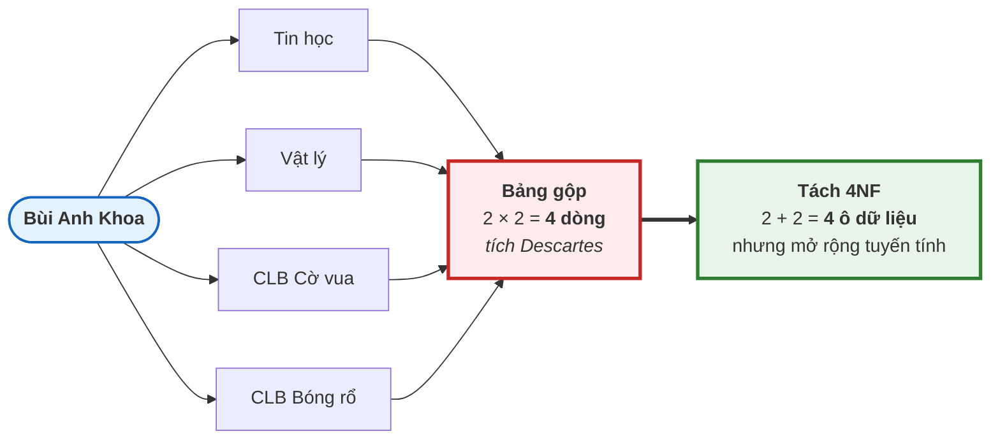
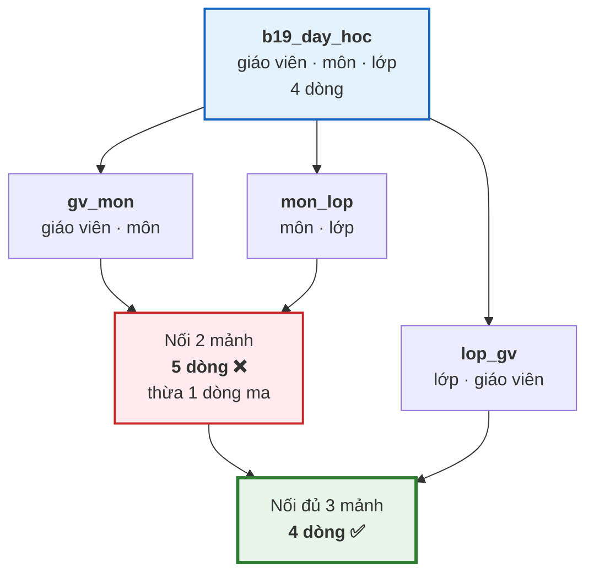

# Bài 19 — 4NF, 5NF và 6NF

!!! abstract "🎯 Học xong bài này, bạn sẽ"
    - Nhận ra **phụ thuộc đa trị** — loại dư thừa mà BCNF **không** nhìn thấy
    - Áp dụng **4NF** để diệt tích Descartes nằm lẫn trong một bảng
    - Hiểu **phụ thuộc kết nối** và vì sao có bảng chỉ tách đúng được thành **ba** mảnh
    - Biết **5NF** đòi hỏi gì, và vì sao nó hiếm gặp tới thế
    - Biết **6NF** là gì và nó phục vụ bài toán nào — dữ liệu theo thời gian
    - Trả lời được câu hỏi thực dụng: **thực tế nên dừng ở đâu**

## 🧠 Câu chuyện mở đầu

Thầy Bùi Anh Khoa là giáo viên Tin học. Năm nay thầy dạy **hai** môn: Tin học và Vật lý. Ngoài giờ, thầy phụ trách **hai** câu lạc bộ: Cờ vua và Bóng rổ.

Cô văn thư lập một bảng *"phân công tổng hợp"* gồm ba cột: giáo viên, môn dạy, câu lạc bộ. Đến lượt thầy Khoa, cô ngồi ngẩn ra một lúc — rồi ghi **bốn** dòng:

```
Bùi Anh Khoa │ Tin học │ CLB Cờ vua
Bùi Anh Khoa │ Tin học │ CLB Bóng rổ
Bùi Anh Khoa │ Vật lý  │ CLB Cờ vua
Bùi Anh Khoa │ Vật lý  │ CLB Bóng rổ
```

Bốn dòng, dù thầy chỉ có **hai** việc dạy và **hai** việc câu lạc bộ. Và môn Vật lý thì chẳng liên quan gì tới CLB Cờ vua cả.

Tuần sau thầy nhận thêm CLB Âm nhạc. Cô văn thư phải ghi thêm **hai** dòng, không phải một. Bảng vọt lên 2 × 3 = 6 dòng.

Điều kỳ lạ là: bảng này **đã ở BCNF**. Khoá chính là cả ba cột, không có phụ thuộc hàm không tầm thường nào, không định thức nào để mà vi phạm.

Vậy BCNF đã bỏ sót loại dư thừa nào?

## 📖 Khái niệm & thuật ngữ

### Phụ thuộc đa trị

**Phụ thuộc đa trị** (*multi-valued dependency*, **MVD**), ký hiệu `X ↠ Y`, phát biểu:

> Với mỗi giá trị của `X`, **tập** giá trị `Y` đi kèm là cố định, và **hoàn toàn độc lập** với các thuộc tính còn lại của bảng.

Nói cách khác, `X ↠ Y` đúng khi: nếu bảng có hai bộ `(x, y₁, z₁)` và `(x, y₂, z₂)`, thì bảng **bắt buộc** cũng phải có `(x, y₁, z₂)` và `(x, y₂, z₁)`.

Dịch sang câu chuyện: thầy Khoa dạy Tin học (`y₁`) và phụ trách Cờ vua (`z₁`); thầy cũng dạy Vật lý (`y₂`) và phụ trách Bóng rổ (`z₂`). Vì hai việc độc lập nhau, bảng **buộc** phải chứa cả *"Vật lý + Cờ vua"* lẫn *"Tin học + Bóng rổ"*. Đó chính là bốn dòng của cô văn thư.

Hai tính chất cần nhớ:

| Tính chất | Nội dung |
|---|---|
| **MVD luôn đi thành cặp** | `X ↠ Y` đúng thì `X ↠ (R − X − Y)` cũng đúng. Ở đây `gv ↠ mon` kéo theo `gv ↠ clb` |
| **PTH là trường hợp riêng của MVD** | Mọi `X → Y` đều kéo theo `X ↠ Y`. Chiều ngược lại không đúng |

`X ↠ Y` là **tầm thường** khi `Y ⊆ X`, hoặc khi `X ∪ Y` là toàn bộ bảng.

!!! tip "Cách nhận ra MVD chỉ bằng mắt"
    Nhìn số dòng. Nếu một thực thể có `m` giá trị ở cột này và `n` giá trị ở cột kia, mà bảng lại chứa đúng **`m × n`** dòng, thì gần như chắc chắn bạn đang nhìn một phụ thuộc đa trị.

    Phép nhân là dấu vết của nó. Bảng đang lưu một **tích Descartes** thay vì lưu hai danh sách rời.

### Dạng chuẩn 4 (4NF)

> Một bảng ở **Dạng chuẩn 4** (*Fourth Normal Form*, **4NF**) khi:
>
> 1. Nó đã ở **BCNF**, và
> 2. Với **mọi** phụ thuộc đa trị không tầm thường `X ↠ Y`, **`X` phải là siêu khoá**.

So sánh cho dễ nhớ:

| Dạng chuẩn | Điều kiện | Áp lên loại phụ thuộc nào |
|---|---|---|
| **BCNF** | Mọi định thức là siêu khoá | Phụ thuộc **hàm** `→` |
| **4NF** | Mọi định thức đa trị là siêu khoá | Phụ thuộc **đa trị** `↠` |

Đúng một câu, chỉ đổi loại mũi tên.

**Định lý Fagin** cho biết cách tách: `R` phân rã **không mất mát** thành `(X ∪ Y)` và `(X ∪ (R − X − Y))` **khi và chỉ khi** `X ↠ Y` đúng trên `R`.

Đây là điều rất đẹp: phụ thuộc đa trị chính là *"điều kiện cần và đủ để tách bảng làm đôi mà không mất mát"*.

### Phụ thuộc kết nối

Có những bảng **không** tách được làm đôi kiểu nào cũng hỏng, nhưng lại tách được thành **ba** mảnh. Khái niệm mô tả chuyện đó:

**Phụ thuộc kết nối** (*join dependency*), ký hiệu `⋈(R₁, R₂, …, Rₙ)`, phát biểu:

> Bảng `R` luôn bằng đúng phép nối tự nhiên của các hình chiếu của nó lên `R₁, R₂, …, Rₙ`.

Quan hệ bao hàm giữa ba khái niệm:

```text
phụ thuộc hàm  ⊂  phụ thuộc đa trị  ⊂  phụ thuộc kết nối
   X → Y            X ↠ Y                ⋈(R₁,…,Rₙ)
                  (kết nối 2 mảnh)      (kết nối n mảnh)
```

Phụ thuộc kết nối là **tầm thường** khi một trong các `Rᵢ` chính là toàn bộ `R`.

### Dạng chuẩn 5 (5NF)

> Một bảng ở **Dạng chuẩn 5** (*Fifth Normal Form*, **5NF**, còn gọi **PJ/NF** — *Project-Join Normal Form*) khi: **mọi phụ thuộc kết nối không tầm thường của nó đều được suy ra từ các khoá dự tuyển**.

Nói nôm na: *bảng không còn tách nhỏ hơn được nữa mà vẫn ghép lại đúng* — trừ những phép tách hiển nhiên theo khoá.

Phụ thuộc kết nối ba chiều xuất hiện khi nghiệp vụ có một **luật vòng** dạng:

> Nếu `A` liên quan `B`, và `B` liên quan `C`, và `A` liên quan `C` — thì cả ba **cùng** liên quan với nhau.

Luật này nghe rất lạ tai, và đó chính là lý do 5NF hiếm gặp: **phần lớn nghiệp vụ ngoài đời không có luật vòng như vậy**.

### Dạng chuẩn 6 (6NF)

> Một bảng ở **Dạng chuẩn 6** (*Sixth Normal Form*, **6NF**) khi **mọi phụ thuộc kết nối của nó đều tầm thường**.

Hệ quả rất trực quan: mỗi bảng chỉ còn **khoá cộng với tối đa một thuộc tính không khoá**. Không tách nhỏ hơn được nữa — đây là mức phân rã tận cùng.

6NF không sinh ra để làm đẹp lý thuyết. Nó phục vụ đúng hai bài toán:

| Bài toán | Vì sao 6NF giúp |
|---|---|
| **Dữ liệu theo thời gian** (*temporal data*) | Mỗi thuộc tính có lịch sử thay đổi **riêng**. Học sinh chuyển lớp tháng 9, đổi địa chỉ tháng 11 — hai sự kiện không cùng lúc. Nhồi chung một bảng là phải chép lại mọi cột mỗi lần một cột đổi |
| **Mô hình neo** (*anchor modeling*) | Kiểu thiết kế kho dữ liệu cho phép **thêm thuộc tính mới mà không đụng bảng cũ** — vì mỗi thuộc tính vốn đã ở một bảng riêng |

Cái giá: số bảng bùng nổ, và mọi truy vấn đều phải `JOIN` rất nhiều. Vì thế 6NF hầu như chỉ thấy trong kho dữ liệu, hệ thống kiểm toán, hoặc các DBMS chuyên về temporal.

### Thực tế dừng ở đâu

!!! success "Câu trả lời ngắn gọn: dừng ở 3NF hoặc BCNF"
    | Dạng chuẩn | Có nên áp dụng mặc định | Khi nào mới cần |
    |---|---|---|
    | **1NF** | ✅ **Bắt buộc** | Luôn luôn — không có 1NF thì không phải bảng quan hệ |
    | **2NF, 3NF** | ✅ **Bắt buộc** | Luôn luôn — đây là mức mà mọi thiết kế nghiêm túc phải đạt |
    | **BCNF** | ✅ Nên, nếu không mất bảo toàn phụ thuộc | Xem [Bài 18](18-dang-chuan-3nf-bcnf.md) — đánh đổi đã bàn kỹ |
    | **4NF** | ⚠️ Chỉ khi gặp | Khi thấy một bảng chứa **tích Descartes** của hai danh sách độc lập |
    | **5NF** | ⚠️ Rất hiếm | Khi nghiệp vụ thật sự có **luật vòng ba chiều** |
    | **6NF** | ⚠️ Chuyên biệt | Kho dữ liệu, dữ liệu theo thời gian, mô hình neo |

    Điểm mấu chốt: 4NF, 5NF, 6NF **không phải là "cao hơn nên tốt hơn"**. Chúng là thuốc đặc trị cho ba căn bệnh rất cụ thể. Không có bệnh mà uống thuốc thì chỉ tổ làm lược đồ rối và truy vấn chậm.

    Thực tế, một lược đồ đã ở 3NF mà không có phụ thuộc đa trị nào thì **tự động** ở 4NF và thường ở luôn 5NF.

### Bảng thuật ngữ

| Tiếng Việt | English | Nghĩa dễ hiểu |
|---|---|---|
| Phụ thuộc đa trị | *multi-valued dependency* (`X ↠ Y`) | Với mỗi X, tập Y đi kèm là cố định và độc lập với phần còn lại |
| Phụ thuộc kết nối | *join dependency* (`⋈(R₁,…,Rₙ)`) | Bảng luôn bằng phép nối các hình chiếu của chính nó |
| Dạng chuẩn 4 | *4NF* | BCNF và mọi định thức đa trị đều là siêu khoá |
| Dạng chuẩn 5 | *5NF / PJ-NF* | Mọi phụ thuộc kết nối không tầm thường đều suy từ khoá dự tuyển |
| Dạng chuẩn 6 | *6NF* | Mọi phụ thuộc kết nối đều tầm thường — bảng chỉ còn khoá + một cột |
| Định lý Fagin | *Fagin's theorem* | `R` tách đôi không mất mát khi và chỉ khi có phụ thuộc đa trị tương ứng |
| Dữ liệu theo thời gian | *temporal data* | Dữ liệu ghi kèm khoảng thời gian giá trị đó có hiệu lực |
| Mô hình neo | *anchor modeling* | Kiểu thiết kế 6NF cho kho dữ liệu, mỗi thuộc tính một bảng |

## 🖼️ Sơ đồ

Phụ thuộc đa trị là một **phép nhân** bị giấu trong bảng:



Thêm một câu lạc bộ nữa thì bảng gộp nhảy từ 4 lên 6 dòng — tăng theo **phép nhân**. Còn hai bảng tách thì chỉ thêm đúng **một** dòng.

Còn đây là hình ảnh của 5NF: một bảng ba cột chỉ tách đúng được thành **ba** mảnh đôi một, tách làm hai kiểu nào cũng sinh dòng ma.



## 💻 Thực hành

### 1. Dựng lại bảng của cô văn thư

```sql
DROP TABLE IF EXISTS b19_phan_cong_bet CASCADE;

CREATE TABLE b19_phan_cong_bet (
    ten_gv  VARCHAR(60) NOT NULL,
    mon_day VARCHAR(30) NOT NULL,
    clb     VARCHAR(30) NOT NULL,
    PRIMARY KEY (ten_gv, mon_day, clb)
);

INSERT INTO b19_phan_cong_bet VALUES
('Bùi Anh Khoa', 'Tin học', 'CLB Cờ vua'),
('Bùi Anh Khoa', 'Tin học', 'CLB Bóng rổ'),
('Bùi Anh Khoa', 'Vật lý',  'CLB Cờ vua'),
('Bùi Anh Khoa', 'Vật lý',  'CLB Bóng rổ'),
('Vũ Minh Tuấn', 'Lịch sử', 'CLB Báo tường');

SELECT ten_gv,
       count(DISTINCT mon_day) AS so_mon,
       count(DISTINCT clb)     AS so_clb,
       count(*)                AS so_dong_thuc_te
FROM b19_phan_cong_bet
GROUP BY ten_gv
ORDER BY ten_gv;
```

Hai dòng:

| ten_gv | so_mon | so_clb | so_dong_thuc_te |
|---|---|---|---|
| Bùi Anh Khoa | 2 | 2 | **4** |
| Vũ Minh Tuấn | 1 | 1 | 1 |

`so_dong_thuc_te` đúng bằng `so_mon × so_clb`. **Phép nhân hiện ra** — dấu vết không thể nhầm của phụ thuộc đa trị.

**Bảng này có ở BCNF không?** Có. Khoá chính gồm cả ba cột, không có thuộc tính không khoá nào, nên không có phụ thuộc hàm không tầm thường nào để mà vi phạm. Giống hệt lý do `phan_cong_day` đạt BCNF ở [Bài 18](18-dang-chuan-3nf-bcnf.md).

**Nhưng nó có ở 4NF không?** Không. Phụ thuộc đa trị `ten_gv ↠ mon_day` là không tầm thường, mà `ten_gv` **không** phải siêu khoá.

Chứng minh MVD đang thật sự chi phối dữ liệu — mọi tổ hợp đều phải có mặt:

```sql
SELECT count(*) AS to_hop_con_thieu
FROM (
    SELECT DISTINCT a.ten_gv, a.mon_day, b.clb
    FROM b19_phan_cong_bet a
    JOIN b19_phan_cong_bet b ON b.ten_gv = a.ten_gv
    EXCEPT
    SELECT ten_gv, mon_day, clb FROM b19_phan_cong_bet
) t;
```

Kết quả `0`: mọi tổ hợp *"môn của thầy X"* × *"câu lạc bộ của thầy X"* đều đã nằm trong bảng. Đó đúng là định nghĩa của `ten_gv ↠ mon_day`.

Và đây là bất thường: thầy Khoa nhận thêm CLB Âm nhạc thì phải ghi **hai** dòng, không phải một. Quên một dòng là bảng tự mâu thuẫn với luật *"hai việc độc lập nhau"*.

### 2. Tách về 4NF

Theo **định lý Fagin**, `ten_gv ↠ mon_day` cho phép tách đôi không mất mát:

```sql
DROP TABLE IF EXISTS b19_gv_mon CASCADE;
DROP TABLE IF EXISTS b19_gv_clb CASCADE;

CREATE TABLE b19_gv_mon AS
SELECT DISTINCT ten_gv, mon_day FROM b19_phan_cong_bet;

CREATE TABLE b19_gv_clb AS
SELECT DISTINCT ten_gv, clb FROM b19_phan_cong_bet;

SELECT 'b19_gv_mon' AS bang, count(*) AS so_dong FROM b19_gv_mon
UNION ALL SELECT 'b19_gv_clb', count(*) FROM b19_gv_clb;
```

Ba dòng và ba dòng — thay vì năm.

Kiểm phép tách không mất mát:

```sql
SELECT (SELECT count(*) FROM b19_phan_cong_bet) AS goc,
       (SELECT count(*) FROM b19_gv_mon m
          JOIN b19_gv_clb c ON c.ten_gv = m.ten_gv) AS noi_lai,
       (SELECT count(*) FROM (
            SELECT m.ten_gv, m.mon_day, c.clb
            FROM b19_gv_mon m JOIN b19_gv_clb c ON c.ten_gv = m.ten_gv
            EXCEPT
            SELECT ten_gv, mon_day, clb FROM b19_phan_cong_bet) x) AS dong_ma;
```

`goc = 5`, `noi_lai = 5`, `dong_ma = 0`. Tách xong nối lại ra **đúng** bảng cũ.

So sánh mức tăng trưởng khi thầy Khoa nhận thêm câu lạc bộ thứ ba:

| | Bảng gộp (BCNF) | Hai bảng tách (4NF) |
|---|---|---|
| Hiện tại | 4 dòng cho thầy Khoa | 2 + 2 = 4 dòng |
| Thêm 1 CLB | **6 dòng** (thêm 2) | **5 dòng** (thêm 1) |
| Thêm 1 môn nữa | **9 dòng** (thêm 3) | **6 dòng** (thêm 1) |
| Quy luật tăng | `m × n` — **phép nhân** | `m + n` — **phép cộng** |

!!! warning "Chỉ tách khi hai danh sách THẬT SỰ độc lập"
    Nếu nghiệp vụ nói *"thầy Khoa chỉ phụ trách CLB Cờ vua trong những buổi thầy dạy Tin học"* thì môn và câu lạc bộ **không** độc lập, phụ thuộc đa trị **không** đúng, và tách đôi sẽ **mất thông tin**.

    Lại đúng bài học của [Bài 16](16-phu-thuoc-ham.md): phụ thuộc đa trị cũng là **luật nghiệp vụ**. Thấy 4 dòng bằng 2 × 2 chỉ là *dấu hiệu gợi ý* để đi hỏi, chứ không phải bằng chứng.

### 3. Phụ thuộc kết nối — bảng chỉ tách được thành ba

Bây giờ tới 5NF. Bối cảnh: bảng phân công **giáo viên – môn – lớp**, với một luật nghiệp vụ rất đặc biệt:

> **Luật vòng:** nếu thầy `G` dạy môn `M`, và môn `M` có được dạy ở lớp `L`, và thầy `G` có dạy ở lớp `L` — thì thầy `G` dạy môn `M` ở lớp `L`.

```sql
DROP TABLE IF EXISTS b19_day_hoc CASCADE;

CREATE TABLE b19_day_hoc (
    ten_gv  VARCHAR(60) NOT NULL,
    ten_mon VARCHAR(30) NOT NULL,
    ten_lop VARCHAR(10) NOT NULL,
    PRIMARY KEY (ten_gv, ten_mon, ten_lop)
);

INSERT INTO b19_day_hoc VALUES
('Nguyễn Thị Lan', 'Toán',    '8A1'),
('Nguyễn Thị Lan', 'Toán',    '8A2'),
('Nguyễn Thị Lan', 'Ngữ văn', '8A1'),
('Trần Văn Hùng',  'Toán',    '8A1');

SELECT * FROM b19_day_hoc ORDER BY ten_gv, ten_mon, ten_lop;
```

Bốn dòng. Chú ý: **cô Lan dạy Toán ở 8A2, nhưng không dạy Ngữ văn ở 8A2** — nên đây **không** phải tích Descartes, và **không** có phụ thuộc đa trị nào. Bảng ở 4NF.

Lấy ba hình chiếu đôi một:

```sql
DROP TABLE IF EXISTS b19_gv_monhoc CASCADE;
DROP TABLE IF EXISTS b19_mon_lop CASCADE;
DROP TABLE IF EXISTS b19_lop_gv CASCADE;

CREATE TABLE b19_gv_monhoc AS SELECT DISTINCT ten_gv, ten_mon  FROM b19_day_hoc;
CREATE TABLE b19_mon_lop   AS SELECT DISTINCT ten_mon, ten_lop FROM b19_day_hoc;
CREATE TABLE b19_lop_gv    AS SELECT DISTINCT ten_lop, ten_gv  FROM b19_day_hoc;

SELECT 'b19_gv_monhoc' AS bang, count(*) AS so_dong FROM b19_gv_monhoc
UNION ALL SELECT 'b19_mon_lop', count(*) FROM b19_mon_lop
UNION ALL SELECT 'b19_lop_gv',  count(*) FROM b19_lop_gv;
```

Ba dòng, mỗi bảng **3** dòng.

**Thử nối chỉ hai mảnh:**

```sql
SELECT gm.ten_gv, gm.ten_mon, ml.ten_lop
FROM b19_gv_monhoc gm
JOIN b19_mon_lop ml ON ml.ten_mon = gm.ten_mon
ORDER BY gm.ten_gv, gm.ten_mon, ml.ten_lop;
```

**Năm** dòng — thừa một dòng so với bảng gốc. Dòng thừa là:

```sql
SELECT gm.ten_gv, gm.ten_mon, ml.ten_lop
FROM b19_gv_monhoc gm
JOIN b19_mon_lop ml ON ml.ten_mon = gm.ten_mon
EXCEPT
SELECT ten_gv, ten_mon, ten_lop FROM b19_day_hoc;
```

Một dòng: `Trần Văn Hùng | Toán | 8A2`. Đây là **dòng ma** — thầy Hùng chưa bao giờ dạy lớp 8A2.

**Bây giờ nối đủ ba mảnh:**

```sql
SELECT count(*) AS so_dong_sau_khi_noi_ba_manh
FROM b19_gv_monhoc gm
JOIN b19_mon_lop ml ON ml.ten_mon = gm.ten_mon
JOIN b19_lop_gv  lg ON lg.ten_lop = ml.ten_lop AND lg.ten_gv = gm.ten_gv;
```

Đúng **4** dòng. Mảnh thứ ba `b19_lop_gv` giết chết dòng ma, vì cặp `(8A2, Trần Văn Hùng)` không có trong đó.

Kiểm cho chắc, không thiếu cũng không thừa:

```sql
SELECT (SELECT count(*) FROM (
            SELECT gm.ten_gv, gm.ten_mon, ml.ten_lop
            FROM b19_gv_monhoc gm
            JOIN b19_mon_lop ml ON ml.ten_mon = gm.ten_mon
            JOIN b19_lop_gv  lg ON lg.ten_lop = ml.ten_lop AND lg.ten_gv = gm.ten_gv
            EXCEPT
            SELECT ten_gv, ten_mon, ten_lop FROM b19_day_hoc) x) AS dong_ma,
       (SELECT count(*) FROM (
            SELECT ten_gv, ten_mon, ten_lop FROM b19_day_hoc
            EXCEPT
            SELECT gm.ten_gv, gm.ten_mon, ml.ten_lop
            FROM b19_gv_monhoc gm
            JOIN b19_mon_lop ml ON ml.ten_mon = gm.ten_mon
            JOIN b19_lop_gv  lg ON lg.ten_lop = ml.ten_lop AND lg.ten_gv = gm.ten_gv) y) AS dong_mat;
```

Cả hai đều `0`.

Đó chính là **phụ thuộc kết nối** `⋈(GV-Môn, Môn-Lớp, Lớp-GV)`: bảng bằng đúng phép nối **ba** hình chiếu, dù không bằng phép nối bất kỳ **hai** hình chiếu nào.

Vì phụ thuộc kết nối này **không** suy ra được từ khoá dự tuyển (khoá là cả ba cột), bảng `b19_day_hoc` **không** ở 5NF. Tách nó thành ba bảng đôi một thì đạt 5NF.

### 4. Khi luật vòng KHÔNG đúng — dòng ma quay lại

Phép tách ba chiều ở trên chỉ hợp lệ vì luật vòng đúng. Đổi nghiệp vụ một chút là hỏng ngay.

Giả sử thầy Hùng nhận dạy thêm Ngữ văn ở lớp 8A2, nhưng vẫn **không** dạy Toán ở lớp đó:

```sql
DROP TABLE IF EXISTS b19_day_hoc_2 CASCADE;

CREATE TABLE b19_day_hoc_2 AS SELECT * FROM b19_day_hoc;

INSERT INTO b19_day_hoc_2 VALUES ('Trần Văn Hùng', 'Ngữ văn', '8A2');

SELECT (SELECT count(*) FROM b19_day_hoc_2) AS goc,
       (SELECT count(*) FROM (
            SELECT DISTINCT a.ten_gv, b.ten_mon, c.ten_lop
            FROM (SELECT DISTINCT ten_gv, ten_mon  FROM b19_day_hoc_2) a
            JOIN (SELECT DISTINCT ten_mon, ten_lop FROM b19_day_hoc_2) b
              ON b.ten_mon = a.ten_mon
            JOIN (SELECT DISTINCT ten_lop, ten_gv  FROM b19_day_hoc_2) c
              ON c.ten_lop = b.ten_lop AND c.ten_gv = a.ten_gv) t) AS sau_khi_tach_ba;
```

`goc = 5`, `sau_khi_tach_ba = 8`. Nối cả **ba** mảnh vẫn đẻ ra **3 dòng ma**:

```sql
SELECT DISTINCT a.ten_gv, b.ten_mon, c.ten_lop
FROM (SELECT DISTINCT ten_gv, ten_mon  FROM b19_day_hoc_2) a
JOIN (SELECT DISTINCT ten_mon, ten_lop FROM b19_day_hoc_2) b
  ON b.ten_mon = a.ten_mon
JOIN (SELECT DISTINCT ten_lop, ten_gv  FROM b19_day_hoc_2) c
  ON c.ten_lop = b.ten_lop AND c.ten_gv = a.ten_gv
EXCEPT
SELECT ten_gv, ten_mon, ten_lop FROM b19_day_hoc_2
ORDER BY 1, 2, 3;
```

Ba dòng: `Nguyễn Thị Lan | Ngữ văn | 8A2`, `Trần Văn Hùng | Ngữ văn | 8A1`, `Trần Văn Hùng | Toán | 8A2`.

Cùng một phép tách, cùng một cấu trúc bảng — chỉ khác **luật nghiệp vụ**. Có luật vòng thì không mất mát; không có luật vòng thì đẻ dòng ma.

!!! danger "Bảng bậc ba MẶC ĐỊNH đã ở 5NF — đừng tách nếu chưa chứng minh được luật vòng"
    Bảng `phan_cong_day` trong `dataset/02-chuan-hoa.sql` cũng là bảng bậc ba `(ma_gv, ma_mon, ma_lop, hoc_ky)`. Có nên tách nó thành ba không?

    **Không.** Nhà trường **không** có luật vòng ấy. Thầy Khoa dạy Tin học; lớp 8A1 có học Tin học; thầy Khoa có dạy lớp 8A1 — nhưng ba điều đó **không** kéo theo *"thầy Khoa dạy Tin học cho lớp 8A1"*.

    Bây giờ là chỗ rất đáng chú ý. Thử phép kiểm trên dữ liệu thật:

    ```sql
    SELECT (SELECT count(*) FROM phan_cong_day WHERE hoc_ky = 1) AS goc,
           (SELECT count(*) FROM (
                SELECT DISTINCT a.ma_gv, b.ma_mon, c.ma_lop
                FROM (SELECT DISTINCT ma_gv, ma_mon FROM phan_cong_day WHERE hoc_ky = 1) a
                JOIN (SELECT DISTINCT ma_mon, ma_lop FROM phan_cong_day WHERE hoc_ky = 1) b
                  ON b.ma_mon = a.ma_mon
                JOIN (SELECT DISTINCT ma_lop, ma_gv FROM phan_cong_day WHERE hoc_ky = 1) c
                  ON c.ma_lop = b.ma_lop AND c.ma_gv = a.ma_gv) t) AS sau_khi_tach_ba;
    ```

    Kết quả: `goc = 32` và `sau_khi_tach_ba = 32`. **Bằng nhau!** Dữ liệu hiện tại tách ba chiều được mà không sinh dòng ma nào.

    Vậy có nên tách không? **Vẫn là không** — và đây đúng là **Quy tắc vàng** của [Bài 12](../cap-1-mo-hinh-er/12-bay-loai-khoa.md) hiện ra lần nữa.

    Lý do hai số bằng nhau là một **sự tình cờ của dữ liệu mẫu**: trong `truong_hoc`, tám giáo viên có tám môn chuyên môn **khác nhau**, nên tình cờ có phụ thuộc hàm `ma_mon → ma_gv`. Chính phụ thuộc hàm tình cờ ấy làm phép nối không mất mát, chứ **không** phải một phụ thuộc kết nối nào cả.

    Ngày nhà trường phân công hai giáo viên cùng dạy Toán, phụ thuộc hàm tình cờ ấy biến mất, và lược đồ đã tách sẽ bắt đầu đẻ dòng ma **y hệt** `b19_day_hoc_2` ở trên.

    Kết luận: `phan_cong_day` **đã ở 5NF**. Dữ liệu chỉ **bác bỏ** được phụ thuộc kết nối, không bao giờ **chứng minh** được nó.

### 5. Nếm thử 6NF — dữ liệu theo thời gian


Học sinh `HS001` chuyển từ lớp 8A1 sang 8A2 vào tháng 1, rồi đổi địa chỉ vào tháng 3. Hai sự kiện xảy ra **khác thời điểm**.

Nếu giữ nguyên một bảng `hoc_sinh` với cột `tu_ngay`, mỗi lần **bất kỳ** cột nào đổi là phải chép lại **toàn bộ** các cột khác. 6NF tách mỗi thuộc tính ra một bảng riêng, mỗi bảng tự quản lý dòng thời gian của mình:

```sql
DROP TABLE IF EXISTS b19_hs_lop CASCADE;
DROP TABLE IF EXISTS b19_hs_diachi CASCADE;

CREATE TABLE b19_hs_lop (
    ma_hs    CHAR(5)     NOT NULL,
    tu_ngay  DATE        NOT NULL,
    den_ngay DATE,
    ten_lop  VARCHAR(10) NOT NULL,
    PRIMARY KEY (ma_hs, tu_ngay)
);

CREATE TABLE b19_hs_diachi (
    ma_hs    CHAR(5)      NOT NULL,
    tu_ngay  DATE         NOT NULL,
    den_ngay DATE,
    dia_chi  VARCHAR(120) NOT NULL,
    PRIMARY KEY (ma_hs, tu_ngay)
);

INSERT INTO b19_hs_lop VALUES
('HS001', '2025-09-05', '2026-01-15', '8A1'),
('HS001', '2026-01-16', NULL,         '8A2');

INSERT INTO b19_hs_diachi VALUES
('HS001', '2025-09-05', '2026-03-10', '12 Lê Lợi, Hà Nội'),
('HS001', '2026-03-11', NULL,         '77 Tạ Hiện, Hà Nội');
```

Bây giờ hỏi được câu mà bảng thường không trả lời nổi: *"ngày 1 tháng 2 năm 2026, bạn HS001 học lớp nào và ở đâu?"*

```sql
SELECT l.ma_hs, l.ten_lop, d.dia_chi
FROM b19_hs_lop l
JOIN b19_hs_diachi d ON d.ma_hs = l.ma_hs
WHERE DATE '2026-02-01' BETWEEN l.tu_ngay AND coalesce(l.den_ngay, DATE '9999-12-31')
  AND DATE '2026-02-01' BETWEEN d.tu_ngay AND coalesce(d.den_ngay, DATE '9999-12-31');
```

Một dòng: `HS001 | 8A2 | 12 Lê Lợi, Hà Nội` — đã chuyển lớp nhưng chưa chuyển nhà.

Mỗi bảng chỉ có **khoá cộng đúng một thuộc tính**, nên không phụ thuộc kết nối không tầm thường nào tồn tại → cả hai bảng ở **6NF**.

| | Một bảng có `tu_ngay` | Tách 6NF |
|---|---|---|
| Đổi lớp | Chép lại cả địa chỉ, tên, ngày sinh | **Chỉ thêm 1 dòng vào 1 bảng** |
| Thêm thuộc tính mới cần lịch sử | `ALTER TABLE` bảng đang chạy | **Tạo bảng mới, không đụng gì cũ** |
| Truy vấn "ngày X ra sao" | Một bảng | Phải `JOIN` mỗi thuộc tính một lần |
| Số bảng | 1 | Nhiều — tăng theo số cột |

Đó là toàn bộ đánh đổi của 6NF: **ghi rất sạch, đọc rất đắt**. Và chính vì vế sau, [Bài 20](20-denormalization.md) sẽ nói về con đường ngược lại.

### 6. Dọn dẹp

```sql
DROP TABLE IF EXISTS b19_hs_diachi CASCADE;
DROP TABLE IF EXISTS b19_hs_lop CASCADE;
DROP TABLE IF EXISTS b19_lop_gv CASCADE;
DROP TABLE IF EXISTS b19_mon_lop CASCADE;
DROP TABLE IF EXISTS b19_gv_monhoc CASCADE;
DROP TABLE IF EXISTS b19_day_hoc_2 CASCADE;
DROP TABLE IF EXISTS b19_day_hoc CASCADE;
DROP TABLE IF EXISTS b19_gv_clb CASCADE;
DROP TABLE IF EXISTS b19_gv_mon CASCADE;
DROP TABLE IF EXISTS b19_phan_cong_bet CASCADE;
```

## ⚠️ Lỗi thường gặp

!!! warning "Lỗi 1: Nhầm phụ thuộc đa trị với phụ thuộc hàm"
    `ten_gv → mon_day` nghĩa là *"mỗi giáo viên dạy **đúng một** môn"*.

    `ten_gv ↠ mon_day` nghĩa là *"mỗi giáo viên có một **tập** môn cố định, và tập ấy độc lập với mọi cột khác"*.

    Hai chuyện khác hẳn nhau. Thầy Khoa dạy hai môn, nên PTH **sai** còn MVD **đúng**. Nhớ số mũi tên: `→` một gạch cho một giá trị, `↠` hai gạch cho một tập giá trị.

!!! warning "Lỗi 2: Tưởng bảng ba cột nào cũng phải tách thành ba"
    Đây là lỗi tốn kém nhất của bài này.

    Bảng bậc ba **mặc định đã ở 5NF**. Chỉ khi nghiệp vụ có **luật vòng** — *"A liên quan B, B liên quan C, A liên quan C thì cả ba cùng liên quan"* — thì phụ thuộc kết nối mới tồn tại.

    Mục 3 đã kiểm trên `phan_cong_day` thật: tách ba chiều sinh thêm dòng ma. Trước khi tách, hãy chạy đúng phép kiểm ấy.

!!! warning "Lỗi 3: Tưởng 'dạng chuẩn cao hơn thì tốt hơn'"
    4NF, 5NF, 6NF không xếp hạng chất lượng thiết kế. Chúng là **thuốc đặc trị**.

    Ép một lược đồ nghiệp vụ bình thường lên 6NF thì bạn được một đống bảng hai cột, mọi truy vấn phải `JOIN` chục lần, và không diệt được dư thừa nào cả — vì vốn chẳng có dư thừa nào để diệt.

    Tiêu chuẩn đúng: **có bệnh mới chữa**. Thấy tích Descartes → nghĩ tới 4NF. Thấy luật vòng → nghĩ tới 5NF. Cần lịch sử từng thuộc tính → nghĩ tới 6NF. Không thấy gì → dừng ở 3NF/BCNF.

!!! warning "Lỗi 4: Quên rằng phụ thuộc đa trị đi thành cặp"
    Nếu `ten_gv ↠ mon_day` thì **tự động** `ten_gv ↠ clb`. Không cần chứng minh riêng.

    Hệ quả thực dụng: khi tách 4NF, luôn tách thành **hai** bảng đối xứng nhau. Tách một nửa rồi để nửa kia nằm chung với cột cũ là chưa xong việc.

!!! warning "Lỗi 5: Dùng số dòng để kết luận có phụ thuộc đa trị"
    Thấy `4 = 2 × 2` chỉ là **dấu hiệu**, không phải bằng chứng — đúng Quy tắc vàng của [Bài 12](../cap-1-mo-hinh-er/12-bay-loai-khoa.md).

    Có thể bảng tình cờ đủ mọi tổ hợp hôm nay, mà nghiệp vụ lại không hề bắt buộc như vậy. Câu hỏi phải hỏi người dùng là: *"Nếu thầy nhận thêm một câu lạc bộ, thầy có đương nhiên phụ trách nó trong mọi môn thầy dạy không?"*

!!! warning "Lỗi 6: Nghĩ 6NF chỉ là 'tách cho vui'"
    6NF giải đúng một bài toán mà các dạng chuẩn thấp hơn bó tay: **mỗi thuộc tính có dòng thời gian riêng**.

    Không có 6NF, muốn ghi lịch sử thì mỗi lần một cột đổi là phải chép lại toàn bộ dòng — vừa tốn chỗ, vừa không biết cột nào mới thật sự thay đổi.

    Đây cũng là nền tảng của **mô hình neo** trong kho dữ liệu, nơi người ta cần thêm thuộc tính mới mà không được phép sửa bảng đang chạy.

## ✍️ Bài tập

1. Viết `ten_gv ↠ mon_day` thành một câu tiếng Việt cho học sinh cấp 2 hiểu.

2. Bảng `b19_phan_cong_bet` ở BCNF nhưng không ở 4NF. Giải thích vì sao BCNF không phát hiện được lỗi này.

3. Một trường lưu bảng `(ma_hs, ngoai_ngu, nhac_cu)` — học sinh học nhiều ngoại ngữ và chơi nhiều nhạc cụ, hai việc độc lập. Bạn Vinh học 3 ngoại ngữ và chơi 2 nhạc cụ. Bảng có bao nhiêu dòng cho bạn Vinh? Sau khi tách 4NF thì còn bao nhiêu?

4. Vì sao bảng `phan_cong_day` trong `dataset/02-chuan-hoa.sql` **không** nên tách thành ba bảng đôi một?

5. Nêu hai tình huống thực tế mà 6NF là lựa chọn hợp lý, và một tình huống mà nó là lựa chọn tồi.

6. Sắp xếp theo thứ tự bao hàm từ hẹp tới rộng: phụ thuộc hàm, phụ thuộc kết nối, phụ thuộc đa trị. Mỗi loại ứng với dạng chuẩn nào?

??? success "Đáp án"
    **1.** *"Mỗi thầy cô có một danh sách môn dạy cố định. Danh sách ấy không thay đổi dù ta đang nhìn thầy cô ấy ở góc độ nào khác — chẳng hạn đang xét câu lạc bộ nào."*

    **2.** Vì BCNF chỉ soi **phụ thuộc hàm** (`→`), tức là luật *"một giá trị xác định một giá trị"*.

    Trong `b19_phan_cong_bet`, khoá chính là cả ba cột và không có thuộc tính không khoá nào, nên **không tồn tại** phụ thuộc hàm không tầm thường nào để mà vi phạm. BCNF tuyên bố bảng sạch.

    Loại dư thừa ở đây thuộc kiểu khác: *"một giá trị xác định một **tập** giá trị"* — phụ thuộc đa trị (`↠`). Cần 4NF mới nhìn thấy.

    **3.** Bảng gộp: `3 × 2 = 6` dòng cho bạn Vinh.

    Sau khi tách thành `(ma_hs, ngoai_ngu)` và `(ma_hs, nhac_cu)`: `3 + 2 = 5` dòng.

    Chênh lệch ở đây còn nhỏ, nhưng quy luật tăng khác hẳn nhau. Nếu bạn Vinh học 5 ngoại ngữ và chơi 4 nhạc cụ: bảng gộp `20` dòng, tách ra `9` dòng. Và quan trọng hơn con số: thêm một nhạc cụ vào bảng gộp là phải thêm **5** dòng cùng lúc, quên một dòng là dữ liệu mâu thuẫn.

    **4.** Vì nhà trường **không** có luật vòng.

    Thầy Khoa dạy Tin học; lớp 8A1 có học Tin học; thầy Khoa có dạy lớp 8A1 (môn Vật lý). Ba điều đó đúng, nhưng **không** kéo theo *"thầy Khoa dạy Tin học cho lớp 8A1"*.

    Không có luật vòng thì không có phụ thuộc kết nối ba chiều, và bảng `phan_cong_day` **đã** ở 5NF.

    Cái bẫy ở đây: chạy phép kiểm trên dữ liệu mẫu lại ra **bằng nhau** (`32 = 32`), vì tám giáo viên tình cờ có tám môn chuyên môn khác nhau. Đó là một **phụ thuộc hàm tình cờ** của dữ liệu, không phải phụ thuộc kết nối của nghiệp vụ — đúng cái bẫy Quy tắc vàng mà mục 4 đã mổ xẻ. Ngày có hai giáo viên cùng dạy Toán là lược đồ đã tách bắt đầu đẻ dòng ma.

    **5.** Hợp lý:

    - **Hồ sơ y tế hoặc hồ sơ học bạ cần truy vết đầy đủ**: phải trả lời được *"ngày 3 tháng 5, hồ sơ ghi gì?"* cho **từng** thuộc tính riêng.
    - **Kho dữ liệu dùng mô hình neo**: nguồn dữ liệu thay đổi liên tục, cần thêm thuộc tính mới mà không được sửa bảng đang chạy.

    Tồi: **một ứng dụng web thông thường** — trang hồ sơ học sinh sẽ phải `JOIN` 8–10 bảng chỉ để hiện một màn hình, đổi lấy một khả năng ghi lịch sử mà không ai dùng tới.

    **6.**

    ```text
    phụ thuộc hàm  ⊂  phụ thuộc đa trị  ⊂  phụ thuộc kết nối
    ```

    | Loại phụ thuộc | Ký hiệu | Dạng chuẩn tương ứng |
    |---|---|---|
    | Phụ thuộc hàm | `X → Y` | 2NF, 3NF, **BCNF** |
    | Phụ thuộc đa trị | `X ↠ Y` | **4NF** |
    | Phụ thuộc kết nối | `⋈(R₁,…,Rₙ)` | **5NF**, và **6NF** khi mọi phụ thuộc kết nối đều tầm thường |

    Mỗi dạng chuẩn áp cùng một câu — *"định thức phải là siêu khoá"* — lên một loại phụ thuộc rộng hơn.

## 🔑 Tóm tắt

1. **Phụ thuộc đa trị** `X ↠ Y` nói rằng với mỗi `X`, **tập** giá trị `Y` là cố định và **độc lập** với phần còn lại của bảng. Dấu vết nhận ra nó: số dòng bằng đúng **tích** của hai danh sách. Phụ thuộc hàm là trường hợp riêng của phụ thuộc đa trị, và MVD luôn **đi thành cặp**.
2. **4NF** lặp lại đúng câu của BCNF nhưng cho mũi tên hai gạch: *mọi định thức đa trị phải là siêu khoá*. **Định lý Fagin** bảo đảm tách đôi theo một MVD là **không mất mát**, và nó đổi quy luật tăng trưởng từ **phép nhân** `m × n` sang **phép cộng** `m + n`.
3. **Phụ thuộc kết nối** rộng hơn nữa: bảng bằng đúng phép nối của `n` hình chiếu, dù không bằng phép nối bất kỳ **hai** hình chiếu nào. **5NF** đòi mọi phụ thuộc kết nối không tầm thường đều suy từ khoá dự tuyển.
4. 5NF chỉ xuất hiện khi nghiệp vụ có **luật vòng**. Bảng bậc ba như `phan_cong_day` **mặc định đã ở 5NF**. Bỏ luật vòng đi là phép nối ba mảnh đẻ ngay dòng ma (5 dòng thật thành 8 dòng) — và việc phép kiểm trên dữ liệu mẫu tình cờ ra kết quả đẹp **không** chứng minh được điều ngược lại.
5. **6NF** đẩy tới tận cùng: mỗi bảng chỉ còn khoá cộng **một** thuộc tính. Nó phục vụ **dữ liệu theo thời gian** và **mô hình neo**, nơi mỗi thuộc tính cần dòng thời gian riêng. Thực tế: **1NF–3NF là bắt buộc**, BCNF nên có, còn 4NF/5NF/6NF chỉ dùng **khi gặp đúng bệnh**.

---

⬅️ [Bài 18 — Dạng chuẩn 3 (3NF) và BCNF](18-dang-chuan-3nf-bcnf.md) · ➡️ [Bài 20 — Phi chuẩn hoá — khi nào nên phá luật](20-denormalization.md)
