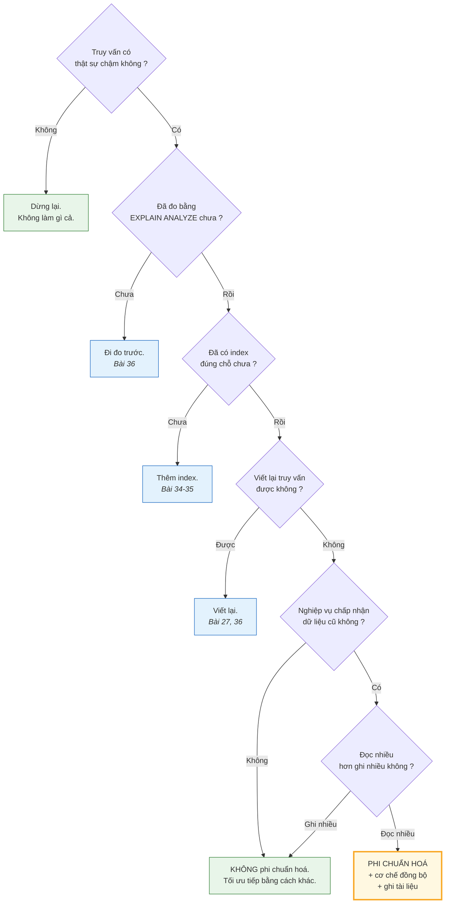
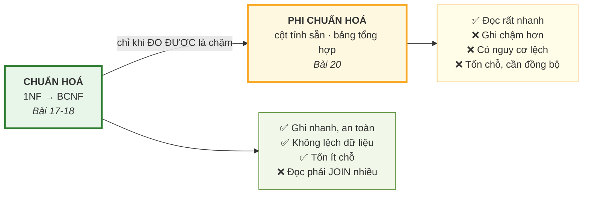

# Bài 20 — Phi chuẩn hoá — khi nào nên phá luật

!!! abstract "🎯 Học xong bài này, bạn sẽ"
    - Phân biệt rành mạch **phi chuẩn hoá** với **chưa chuẩn hoá** — hai thứ hoàn toàn khác nhau
    - Gọi tên được năm kỹ thuật phi chuẩn hoá thông dụng và biết mỗi cái đổi gì lấy gì
    - Nhìn tận mắt một bảng tổng hợp **bị lệch dữ liệu** sau đúng một câu `INSERT`
    - Biết bốn cách giữ dữ liệu phi chuẩn hoá đồng bộ, và giá của từng cách
    - Áp dụng đúng quy trình: **chuẩn hoá trước — đo — rồi mới phi chuẩn hoá**
    - Biết những thứ **phải thử trước** khi nghĩ tới phi chuẩn hoá

## 🧠 Câu chuyện mở đầu

Bốn bài vừa rồi, bạn đã tách bảng bẹt thành 10 bảng gọn gàng. Không còn một mẩu dữ liệu nào bị chép lại hai lần.

Rồi thầy hiệu trưởng nhờ dựng một màn hình: *"Bảng tổng hợp toàn trường"* — mỗi lớp một dòng, có tên lớp, tên giáo viên chủ nhiệm, sĩ số, số con điểm đã nhập, điểm trung bình.

Bạn viết truy vấn. Nó phải nối **bốn** bảng: `lop`, `giao_vien`, `hoc_sinh`, `diem`. Nó chạy được, kết quả đúng.

Nhưng thầy hiệu trưởng mở màn hình ấy **mỗi sáng**, và mở đi mở lại suốt buổi họp. Còn dữ liệu điểm thì cả tuần mới nhập một lần.

Cô văn thư nhìn qua vai bạn và hỏi một câu rất ngây thơ mà cũng rất sắc: *"Sao em không tính sẵn rồi cất vào một bảng, thầy mở cái là có ngay?"*

Câu hỏi ấy đi ngược lại **toàn bộ** những gì bạn vừa học trong bốn bài. Nhưng nó không sai.

Vậy khi nào thì được phép phá luật — và phá thế nào cho an toàn?

## 📖 Khái niệm & thuật ngữ

### Phi chuẩn hoá là gì

**Phi chuẩn hoá** (*denormalization*) là hành động **cố ý đưa dư thừa trở lại** một lược đồ **đã được chuẩn hoá**, để đổi lấy tốc độ đọc.

Ba chữ quan trọng nhất trong định nghĩa là **"đã được chuẩn hoá"**.

!!! danger "Phi chuẩn hoá ≠ chưa chuẩn hoá"
    Đây là hiểu lầm tai hại nhất của cả bài.

    | | **Chưa chuẩn hoá** | **Phi chuẩn hoá** |
    |---|---|---|
    | Bản chất | Chưa bao giờ phân tích | Đã phân tích xong, rồi **cố ý** đi lùi một bước |
    | Người thiết kế có biết dư thừa ở đâu không | **Không** | **Có** — biết chính xác từng chỗ |
    | Có cơ chế giữ đồng bộ không | Không | **Bắt buộc phải có** |
    | Có ghi vào tài liệu không | Không | **Bắt buộc** |
    | Ví dụ | `bang_bet` | Cột `diem_trung_binh` tính sẵn, có trigger cập nhật |

    `bang_bet` **không** phải một ví dụ phi chuẩn hoá. Nó là một ví dụ *chưa chuẩn hoá* — tức là một thiết kế tồi, không phải một quyết định kỹ thuật.

    Muốn phi chuẩn hoá, bạn phải **chuẩn hoá xong trước đã**. Bạn không thể đi lùi một bước nếu bạn chưa từng bước tới.

### Năm kỹ thuật thông dụng

| # | Kỹ thuật | Tiếng Anh | Làm gì |
|---|---|---|---|
| 1 | **Cột tính sẵn** | *derived / computed column* | Lưu sẵn kết quả của một phép tính, ví dụ `diem_trung_binh` trong bảng `hoc_sinh` |
| 2 | **Cột nhân bản** | *redundant column* | Chép một cột từ bảng cha sang bảng con để khỏi `JOIN`, ví dụ chép `ten_lop` vào bảng `diem` |
| 3 | **Bảng tổng hợp** | *summary / pre-aggregated table* | Một bảng thật, chứa sẵn kết quả `GROUP BY`, được tính lại định kỳ |
| 4 | **Materialized view** | *materialized view* | Như bảng tổng hợp nhưng do DBMS quản lý, có lệnh `REFRESH` riêng — Bài 30 sẽ dạy kỹ |
| 5 | **Gộp bảng 1:1** | *table merging* | Hai bảng quan hệ 1:1 luôn được đọc cùng nhau thì nhập làm một |

Hai kỹ thuật họ hàng, hay bị xếp nhầm vào đây:

- **Cột mảng / `JSONB`**: gom một danh sách vào một ô. Đây là phá 1NF, chỉ nên dùng khi **không bao giờ** cần truy vấn từng phần tử. Bài 32 sẽ bàn.
- **Lược đồ hình sao** (*star schema*) trong kho dữ liệu: một dạng phi chuẩn hoá có hệ thống, dành riêng cho hệ thống phân tích chỉ đọc.

### Bảng đánh đổi

| Kỹ thuật | Được gì | Mất gì | Giữ đồng bộ bằng cách nào |
|---|---|---|---|
| **Cột tính sẵn** | Khỏi tính lại mỗi lần đọc | Mọi lần ghi vào bảng nguồn phải cập nhật theo | Trigger, hoặc cột sinh tự động |
| **Cột nhân bản** | Bớt một phép `JOIN` | Sửa ở bảng cha phải lan sang bảng con | Trigger trên bảng cha |
| **Bảng tổng hợp** | Truy vấn báo cáo nhanh gấp nhiều lần | Dữ liệu **cũ** tới lần tính lại kế tiếp | Chạy lại theo lịch |
| **Materialized view** | Như trên, nhưng DBMS lo việc lưu trữ | Như trên | `REFRESH MATERIALIZED VIEW` |
| **Gộp bảng 1:1** | Bớt một `JOIN`, bớt một bảng | Dòng to hơn, nhiều `NULL` hơn | Không cần — dữ liệu vốn đi liền nhau |

Cái giá chung của mọi kỹ thuật, không có ngoại lệ:

> **Ghi chậm hơn, và có nguy cơ lệch dữ liệu.**

Bản sao chưa được cập nhật theo nguồn gọi là **dữ liệu cũ** (*stale data*). Mục 3 phần Thực hành sẽ cho thấy chỉ **một** câu `INSERT` là đủ để sinh ra nó — và không có thông báo nào cả.

### Quy trình đúng

!!! success "Chuẩn hoá trước — ĐO — rồi mới phi chuẩn hoá"
    Thứ tự này không thương lượng được:

    1. **Chuẩn hoá tới 3NF/BCNF.** Luôn luôn. Đây là điểm xuất phát, không phải một lựa chọn.
    2. **Chạy thật, đo thật.** Truy vấn nào chậm? Chậm bao nhiêu mili giây? Công cụ là `EXPLAIN ANALYZE` — Bài 36 sẽ dạy đọc nó.
    3. **Thử những cách rẻ hơn trước** (xem mục dưới).
    4. **Chỉ khi vẫn chậm**, và chỉ với **đúng** truy vấn đã đo được là chậm, mới phi chuẩn hoá.
    5. **Đo lại.** Nếu không nhanh hơn đáng kể, hoàn tác.
    6. **Ghi vào tài liệu**: cột nào dư thừa, nguồn chân lý là bảng nào, cơ chế đồng bộ là gì, cập nhật bao lâu một lần.

    Phi chuẩn hoá **khi chưa đo** không phải là tối ưu — đó là mê tín. Nó chắc chắn làm việc ghi chậm đi và chắc chắn thêm nguy cơ lệch dữ liệu, để đổi lấy một cái lợi mà bạn **chưa biết có tồn tại hay không**.

### Thử gì trước đã

Ba việc dưới đây rẻ hơn phi chuẩn hoá rất nhiều, và thường đã đủ:

| Việc nên thử | Vì sao rẻ hơn | Học ở đâu |
|---|---|---|
| **Thêm index đúng chỗ** | Không đổi lược đồ, không đổi truy vấn, không tạo dư thừa logic | Bài 34, Bài 35 |
| **Viết lại truy vấn** | Nhiều truy vấn chậm chỉ vì subquery lồng thừa hoặc `JOIN` sai thứ tự | Bài 27, Bài 36 |
| **Dùng `VIEW` thường** | `VIEW` **không lưu** dữ liệu, nên **không** có nguy cơ lệch. Nó chỉ đặt tên cho một truy vấn | Bài 30 |

Chú ý điểm cuối: `VIEW` thường **không phải** phi chuẩn hoá. `MATERIALIZED VIEW` thì **là**. Khác nhau đúng ở chỗ có lưu dữ liệu hay không.

### Khi nào phi chuẩn hoá là đúng

Bốn dấu hiệu cùng xuất hiện thì gần như chắc chắn nên làm:

1. **Đọc nhiều, ghi ít.** Báo cáo mở hàng trăm lần một ngày, dữ liệu nguồn cập nhật một tuần một lần.
2. **Nghiệp vụ chấp nhận dữ liệu cũ.** Thầy hiệu trưởng cần con số *"tính tới đêm qua"*, không cần *"tính tới giây này"*.
3. **Đã đo được là chậm**, và chậm ở đúng truy vấn ấy.
4. **Index và viết lại truy vấn đã thử mà không đủ.**

Ngược lại, tuyệt đối **không** phi chuẩn hoá bảng ghi nhiều đọc ít, hoặc dữ liệu đòi chính xác tức thời — ví dụ số dư tài khoản, số sách còn lại trong kho.

### Bảng thuật ngữ

| Tiếng Việt | English | Nghĩa dễ hiểu |
|---|---|---|
| Phi chuẩn hoá | *denormalization* | Cố ý đưa dư thừa trở lại một lược đồ đã chuẩn hoá, để đọc nhanh hơn |
| Cột tính sẵn | *derived / computed column* | Cột lưu sẵn kết quả một phép tính từ dữ liệu khác |
| Cột nhân bản | *redundant column* | Cột chép từ bảng khác sang để khỏi phải `JOIN` |
| Bảng tổng hợp | *summary table* | Bảng chứa sẵn kết quả `GROUP BY`, tính lại theo lịch |
| Materialized view | *materialized view* | View **có lưu** dữ liệu, cần `REFRESH` để cập nhật |
| Dữ liệu cũ | *stale data* | Dữ liệu phi chuẩn hoá chưa được cập nhật theo nguồn |
| Lược đồ hình sao | *star schema* | Kiểu thiết kế phi chuẩn hoá có hệ thống cho kho dữ liệu |

## 🖼️ Sơ đồ

Cây quyết định — đọc từ trên xuống, và chỉ tới ô cuối cùng khi mọi ô trên đều đã thử:



Chú ý: **hai trong ba lối ra là "đừng phi chuẩn hoá"**. Đó không phải tình cờ — đó là tỉ lệ đúng trong thực tế.

Và đây là cán cân của cả Cấp 2:



## 💻 Thực hành

### 1. Truy vấn báo cáo trên lược đồ đã chuẩn hoá

Đây là cái màn hình mà thầy hiệu trưởng muốn. Nó phải nối **bốn** bảng:

```sql
SELECT l.ten_lop,
       g.ho_ten                  AS gvcn,
       count(DISTINCT h.ma_hs)   AS si_so,
       count(d.ma_diem)          AS so_con_diem
FROM lop l
LEFT JOIN giao_vien g ON g.ma_gv  = l.ma_gvcn
LEFT JOIN hoc_sinh  h ON h.ma_lop = l.ma_lop
LEFT JOIN diem      d ON d.ma_hs  = h.ma_hs
GROUP BY l.ten_lop, g.ho_ten
ORDER BY l.ten_lop;
```

Sáu dòng:

| ten_lop | gvcn | si_so | so_con_diem |
|---|---|---|---|
| 8A1 | Nguyễn Thị Lan | 6 | 72 |
| 8A2 | Trần Văn Hùng | 6 | 72 |
| 8A3 | Lê Thị Mai | 8 | 96 |
| 9A1 | Phạm Quốc Dũng | 6 | 72 |
| 9A2 | Hoàng Thị Nhung | 7 | 84 |
| 9A3 | *(NULL)* | 7 | 84 |

Mỗi học sinh có đúng 12 con điểm (9 điểm *Học kỳ* + 3 điểm *1 tiết*), nên `so_con_diem = si_so × 12`. Lớp `9A3` có `gvcn` là `NULL` — đúng như [Bài 15](../cap-1-mo-hinh-er/15-rang-buoc-toan-ven.md) đã nói, và đó là lý do phải dùng `LEFT JOIN`.

Với 40 học sinh và 480 con điểm thì truy vấn này chạy trong nháy mắt. **Đây là điểm mấu chốt**: trên dữ liệu nhỏ, phi chuẩn hoá **không** đem lại gì cả. Nó chỉ bắt đầu có ý nghĩa khi bảng `diem` có vài triệu dòng — và Bài 36 sẽ dùng `diem_lon` (500.000 dòng) để đo chuyện đó cho ra số thật.

### 2. Kỹ thuật 1 — cột tính sẵn

Thay vì tính trung bình mỗi lần đọc, lưu sẵn vào bảng học sinh:

```sql
DROP TABLE IF EXISTS b20_hoc_sinh_pcn CASCADE;

CREATE TABLE b20_hoc_sinh_pcn AS
SELECT h.ma_hs,
       h.ho_ten,
       h.ma_lop,
       (SELECT round(avg(d.diem_so), 2) FROM diem d WHERE d.ma_hs = h.ma_hs)
                                          AS diem_trung_binh,   -- ← cột tính sẵn
       (SELECT count(*)                   FROM diem d WHERE d.ma_hs = h.ma_hs)
                                          AS so_con_diem        -- ← cột tính sẵn
FROM hoc_sinh h;

SELECT count(*)                                        AS tong_hoc_sinh,
       count(*) FILTER (WHERE so_con_diem = 12)        AS du_12_con_diem,
       count(*) FILTER (WHERE diem_trung_binh IS NULL) AS chua_co_diem
FROM b20_hoc_sinh_pcn;
```

Một dòng: `40`, `40`, `0`.

Bây giờ câu hỏi *"ai điểm trung bình cao nhất"* không cần `JOIN` và không cần `GROUP BY` nữa:

```sql
SELECT ho_ten, ma_lop, diem_trung_binh
FROM b20_hoc_sinh_pcn
ORDER BY diem_trung_binh DESC, ma_hs
LIMIT 3;
```

Ba dòng. (Điểm trong `dataset/02-chuan-hoa.sql` được sinh ngẫu nhiên, nên tên cụ thể mỗi lần nạp một khác — đừng học thuộc kết quả này.)

**Cái giá:** từ giây phút này, **mọi** câu `INSERT`, `UPDATE`, `DELETE` trên bảng `diem` đều phải cập nhật lại hai cột kia. Quên một lần là sai vĩnh viễn.

### 3. Kỹ thuật 3 — bảng tổng hợp, và cách nó lệch

```sql
DROP TABLE IF EXISTS b20_diem CASCADE;
DROP TABLE IF EXISTS b20_tong_hop_lop CASCADE;

-- Bản sao của bảng diem, để thí nghiệm mà không đụng dữ liệu thật.
CREATE TABLE b20_diem AS SELECT * FROM diem;

CREATE TABLE b20_tong_hop_lop AS
SELECT l.ma_lop,
       l.ten_lop,
       count(DISTINCT h.ma_hs) AS si_so,
       count(d.ma_diem)        AS so_con_diem,
       now()                   AS tinh_luc
FROM lop l
LEFT JOIN hoc_sinh h  ON h.ma_lop = l.ma_lop
LEFT JOIN b20_diem d  ON d.ma_hs  = h.ma_hs
GROUP BY l.ma_lop, l.ten_lop;

SELECT ma_lop, ten_lop, si_so, so_con_diem
FROM b20_tong_hop_lop
ORDER BY ma_lop;
```

Sáu dòng, `so_con_diem` lần lượt `72, 72, 96, 72, 84, 84`.

Bây giờ cô giáo nhập **một** con điểm mới cho bạn HS001:

```sql
INSERT INTO b20_diem (ma_diem, ma_hs, ma_mon, hoc_ky, loai_diem, diem_so, ngay_nhap)
VALUES (999001, 'HS001', 'MH01', 2, '15 phút', 9.50, DATE '2026-03-01');
```

Và đây là điều đáng sợ:

```sql
SELECT t.ten_lop,
       t.so_con_diem AS bang_tong_hop_noi,
       (SELECT count(*)
        FROM b20_diem d JOIN hoc_sinh h ON h.ma_hs = d.ma_hs
        WHERE h.ma_lop = t.ma_lop) AS su_that,
       (SELECT count(*)
        FROM b20_diem d JOIN hoc_sinh h ON h.ma_hs = d.ma_hs
        WHERE h.ma_lop = t.ma_lop) - t.so_con_diem AS lech
FROM b20_tong_hop_lop t
WHERE t.ten_lop = '8A1';
```

Một dòng: `8A1 | 72 | 73 | 1`.

!!! danger "Bảng tổng hợp vừa nói dối, và không ai được báo cả"
    Không có `ERROR`. Không có cảnh báo. Bảng tổng hợp vẫn khẳng định lớp 8A1 có 72 con điểm, trong khi sự thật là 73.

    Đây chính là **nguy cơ lệch dữ liệu** — cái giá cố hữu của mọi kỹ thuật phi chuẩn hoá. Nó không phải lỗi hiện thực, nó là **bản chất**: đã lưu hai bản sao của cùng một sự thật thì hai bản sao **sẽ** lệch nhau.

    Điều duy nhất bạn kiểm soát được là **lệch trong bao lâu**.

Cách chữa là tính lại:

```sql
TRUNCATE b20_tong_hop_lop;

INSERT INTO b20_tong_hop_lop (ma_lop, ten_lop, si_so, so_con_diem, tinh_luc)
SELECT l.ma_lop, l.ten_lop,
       count(DISTINCT h.ma_hs),
       count(d.ma_diem),
       now()
FROM lop l
LEFT JOIN hoc_sinh h  ON h.ma_lop = l.ma_lop
LEFT JOIN b20_diem d  ON d.ma_hs  = h.ma_hs
GROUP BY l.ma_lop, l.ten_lop;

SELECT ten_lop, so_con_diem FROM b20_tong_hop_lop WHERE ten_lop = '8A1';
```

Một dòng: `8A1 | 73`. Đã đúng trở lại.

### 4. Bốn cách giữ đồng bộ

| Cách | Độ mới của dữ liệu | Chi phí | Học ở đâu |
|---|---|---|---|
| **Trigger** | Tức thì | Mỗi lần ghi đều tốn thêm; dễ gây khoá và làm chậm giao dịch | Bài 31 |
| **`REFRESH MATERIALIZED VIEW`** | Tới lần refresh gần nhất | Rẻ khi chạy ngoài giờ cao điểm; `CONCURRENTLY` thì không khoá đọc | Bài 30 |
| **Chạy lại theo lịch** | Tới lần chạy gần nhất | Rẻ nhất, dễ hiểu nhất | Tự viết, chạy bằng `cron` |
| **Ứng dụng tự cập nhật** | Tức thì — **nếu** không quên | **Nguy hiểm nhất**: mọi đường vào dữ liệu đều phải nhớ làm, kể cả `psql` gõ tay | — |

!!! warning "Cách thứ tư gần như luôn là lựa chọn sai"
    Đây đúng là bài học của [Bài 15](../cap-1-mo-hinh-er/15-rang-buoc-toan-ven.md) về ràng buộc toàn vẹn: luật nào chỉ được bảo vệ ở tầng ứng dụng thì **sẽ** bị phá, vì luôn có một con đường khác đi vào dữ liệu — một script nhập liệu, một lần sửa tay bằng `psql`, một hệ thống thứ hai.

    Nếu phải cập nhật tức thì, hãy để **database** làm việc đó bằng trigger.

### 5. Kỹ thuật 4 — materialized view

`MATERIALIZED VIEW` là bảng tổng hợp do chính DBMS quản lý: bạn khai truy vấn một lần, PostgreSQL lo việc lưu kết quả.

```sql
DROP MATERIALIZED VIEW IF EXISTS b20_mv_thong_ke_lop;

CREATE MATERIALIZED VIEW b20_mv_thong_ke_lop AS
SELECT l.ma_lop,
       l.ten_lop,
       g.ho_ten                AS gvcn,
       count(DISTINCT h.ma_hs) AS si_so,
       count(d.ma_diem)        AS so_con_diem
FROM lop l
LEFT JOIN giao_vien g ON g.ma_gv  = l.ma_gvcn
LEFT JOIN hoc_sinh  h ON h.ma_lop = l.ma_lop
LEFT JOIN diem      d ON d.ma_hs  = h.ma_hs
GROUP BY l.ma_lop, l.ten_lop, g.ho_ten;

SELECT ma_lop, ten_lop, coalesce(gvcn, '(chưa có GVCN)') AS gvcn, si_so, so_con_diem
FROM b20_mv_thong_ke_lop
ORDER BY ma_lop;
```

Sáu dòng, giống hệt kết quả mục 1 — nhưng lần này dữ liệu đã **nằm sẵn trên đĩa**, không phải nối bốn bảng nữa.

Muốn cập nhật thì gọi một lệnh:

```sql
REFRESH MATERIALIZED VIEW b20_mv_thong_ke_lop;
```

So sánh ba thứ rất hay bị lẫn:

| | `VIEW` | `MATERIALIZED VIEW` | Bảng tổng hợp tự làm |
|---|---|---|---|
| Có lưu dữ liệu không | ❌ Không | ✅ Có | ✅ Có |
| Có phải phi chuẩn hoá không | ❌ **Không** | ✅ Có | ✅ Có |
| Độ mới | Luôn mới nhất | Tới lần `REFRESH` | Tới lần chạy lại |
| Tốc độ đọc | Bằng truy vấn gốc | Nhanh | Nhanh |
| Ai lo việc cập nhật | Không cần | Bạn gọi `REFRESH` | Bạn tự viết toàn bộ |

Bài 30 sẽ đào sâu, kể cả `REFRESH MATERIALIZED VIEW CONCURRENTLY` và điều kiện cần một index `UNIQUE`.

### 6. Dọn dẹp

```sql
DROP MATERIALIZED VIEW IF EXISTS b20_mv_thong_ke_lop;
DROP TABLE IF EXISTS b20_tong_hop_lop CASCADE;
DROP TABLE IF EXISTS b20_diem CASCADE;
DROP TABLE IF EXISTS b20_hoc_sinh_pcn CASCADE;
```

Và kiểm lại rằng mười bảng thật **không hề bị đụng tới** trong suốt cả Cấp 2:

```sql
SELECT 'giao_vien' AS bang, count(*) AS so_dong FROM giao_vien
UNION ALL SELECT 'lop',      count(*) FROM lop
UNION ALL SELECT 'hoc_sinh', count(*) FROM hoc_sinh
UNION ALL SELECT 'diem',     count(*) FROM diem
UNION ALL SELECT 'bang_bet', count(*) FROM bang_bet
ORDER BY bang;
```

Năm dòng: `bang_bet 30`, `diem 480`, `giao_vien 8`, `hoc_sinh 40`, `lop 6`. Đúng như lúc nạp.

## ⚠️ Lỗi thường gặp

!!! warning "Lỗi 1: Phi chuẩn hoá khi chưa đo"
    *"Bảng này chắc sẽ chậm, thêm cột tính sẵn cho chắc."*

    Đây không phải tối ưu, đây là mê tín. Bạn **chắc chắn** trả giá — ghi chậm hơn, thêm nguy cơ lệch, thêm mã phải bảo trì — để đổi lấy một cái lợi **chưa biết có tồn tại hay không**.

    Trên `truong_hoc` với 480 dòng điểm, truy vấn ở mục 1 chạy trong vài mili giây. Phi chuẩn hoá nó là thuần tuý gây hại.

    Quy tắc: **không có số đo thì không phi chuẩn hoá.** Bài 36 dạy cách lấy số đo ấy.

!!! warning "Lỗi 2: Gọi thiết kế tồi của mình là 'phi chuẩn hoá vì hiệu năng'"
    `bang_bet` **không** phải phi chuẩn hoá. Nó chưa bao giờ được chuẩn hoá.

    Phép thử rất đơn giản, gồm ba câu hỏi:

    1. Bạn có chỉ ra được **chính xác** cột nào đang dư thừa không?
    2. Bạn có nêu được **cơ chế** giữ nó đồng bộ không?
    3. Bạn có **số đo** chứng minh phương án chuẩn hoá chậm không?

    Trả lời "không" cho bất kỳ câu nào → đó là thiết kế tồi, không phải quyết định kỹ thuật.

!!! warning "Lỗi 3: Thêm dữ liệu dư thừa mà quên cơ chế đồng bộ"
    Mục 3 đã cho thấy: đúng **một** câu `INSERT` là bảng tổng hợp bắt đầu nói dối, và không có tín hiệu nào báo cho bạn.

    Tệ hơn nữa, lỗi này rất khó phát hiện: báo cáo vẫn hiện ra bình thường, con số vẫn trông hợp lý, chỉ là **sai**. Có khi vài tháng sau mới có người đối chiếu và phát hiện.

    Quy tắc: **viết cơ chế đồng bộ TRƯỚC, hoặc cùng lúc** với việc tạo dữ liệu dư thừa. Không bao giờ để sau.

!!! warning "Lỗi 4: Phi chuẩn hoá một bảng ghi nhiều"
    Phi chuẩn hoá đổi **tốc độ ghi** lấy **tốc độ đọc**. Áp nó lên bảng ghi nhiều hơn đọc là đổi ngược, lỗ cả hai đầu.

    Ví dụ rõ nhất là bảng `diem_danh`: mỗi sáng 40 dòng mới, nhưng cả tháng mới có người xem thống kê. Thêm cột tính sẵn vào đây là làm chậm việc điểm danh hàng ngày để tăng tốc một báo cáo hàng tháng.

    Hãy ước lượng **tỉ lệ đọc trên ghi** trước khi quyết định.

!!! warning "Lỗi 5: Tưởng cột tính sẵn là miễn phí vì 'chỉ thêm một cột'"
    Một cột tính sẵn kéo theo:

    - Mỗi lần ghi vào bảng nguồn phải cập nhật theo — tức là thêm một lượt ghi.
    - Trigger giữ khoá lâu hơn, làm giao dịch dễ đụng nhau hơn (Bài 38 sẽ nói về chuyện này).
    - Dòng to hơn, mỗi trang dữ liệu chứa được ít dòng hơn, quét toàn bảng chậm đi (Bài 33).
    - Thêm một đoạn mã phải viết đúng, phải kiểm thử, phải bảo trì mãi mãi.

!!! warning "Lỗi 6: Không ghi tài liệu"
    Sáu tháng sau, một lập trình viên mới nhìn thấy cột `diem_trung_binh` và nghĩ đó là dữ liệu gốc. Bạn ấy `UPDATE` thẳng vào cột đó.

    Từ giây phút ấy, bảng có **hai** nguồn chân lý mâu thuẫn nhau, và không ai biết cái nào đúng.

    Mọi cột phi chuẩn hoá bắt buộc phải có `COMMENT ON COLUMN` nói rõ: *"cột dẫn xuất, nguồn chân lý là bảng `diem`, cập nhật bằng trigger `X`, đừng sửa trực tiếp"*. Lược đồ `dataset/02-chuan-hoa.sql` dùng đúng cách này cho mọi quyết định thiết kế đáng chú ý.

## ✍️ Bài tập

1. Nêu ba điểm khác nhau giữa **chưa chuẩn hoá** và **phi chuẩn hoá**.

2. Một `VIEW` thường có phải phi chuẩn hoá không? Còn `MATERIALIZED VIEW`? Giải thích bằng một tiêu chí duy nhất.

3. Với mỗi tình huống sau, nói **nên** hay **không nên** phi chuẩn hoá, và vì sao:
   a) Bảng xếp hạng điểm trung bình toàn trường, thầy hiệu trưởng mở 200 lần/ngày, điểm nhập một tuần một lần.
   b) Số sách còn lại trong thư viện, hiển thị lúc học sinh bấm nút mượn.
   c) Bảng `diem_danh`, ghi 40 dòng mỗi sáng, báo cáo xem một tháng một lần.

4. Bạn quyết định thêm cột `si_so` vào bảng `lop`. Nêu **ba** đường vào dữ liệu có thể làm cột này lệch, và cơ chế nào chặn được cả ba.

5. Viết một câu SQL phát hiện bảng `b20_tong_hop_lop` đã lệch so với dữ liệu nguồn (giả sử bảng còn tồn tại). Vì sao câu này nên được chạy định kỳ?

6. Sắp xếp bốn việc sau theo thứ tự nên thử: thêm index · phi chuẩn hoá · viết lại truy vấn · đo bằng `EXPLAIN ANALYZE`.

??? success "Đáp án"
    **1.** Ba điểm (chọn ba):

    - **Chưa chuẩn hoá** là chưa từng phân tích; **phi chuẩn hoá** là đã phân tích xong rồi cố ý đi lùi.
    - Người thiết kế **biết chính xác** cột nào dư thừa trong phi chuẩn hoá; ở thiết kế chưa chuẩn hoá thì không.
    - Phi chuẩn hoá **bắt buộc** có cơ chế đồng bộ và tài liệu; chưa chuẩn hoá thì không có gì cả.
    - Phi chuẩn hoá phải có **số đo** biện minh; chưa chuẩn hoá thì không có lý do nào.

    **2.** Tiêu chí duy nhất: **có lưu dữ liệu không.**

    - `VIEW` **không** lưu. Nó chỉ là một cái tên đặt cho truy vấn; mỗi lần đọc là chạy lại truy vấn gốc. Không có bản sao → không có nguy cơ lệch → **không phải** phi chuẩn hoá.
    - `MATERIALIZED VIEW` **có** lưu kết quả trên đĩa. Có bản sao → có nguy cơ lệch → **là** phi chuẩn hoá.

    **3.**

    a) **Nên.** Đủ cả bốn dấu hiệu: đọc 200 lần/ngày so với ghi một lần/tuần, nghiệp vụ chấp nhận dữ liệu *"tính tới đêm qua"*. Dùng `MATERIALIZED VIEW` refresh mỗi đêm.

    b) **Không nên.** Đây là dữ liệu đòi chính xác **tức thì**: hiện *"còn 1 quyển"* trong khi bạn khác vừa mượn mất là hỏng nghiệp vụ. Nên tính thẳng từ `sach` và `muon_sach`, và nếu chậm thì thêm index.

    c) **Không nên.** Tỉ lệ ngược hẳn: ghi 40 dòng mỗi ngày, đọc một lần mỗi tháng. Phi chuẩn hoá ở đây là làm chậm việc hàng ngày để tăng tốc việc hàng tháng.

    **4.** Ba đường vào có thể làm `lop.si_so` lệch:

    1. `INSERT INTO hoc_sinh` — tuyển sinh viên mới.
    2. `DELETE FROM hoc_sinh` — học sinh chuyển trường.
    3. `UPDATE hoc_sinh SET ma_lop = ...` — chuyển lớp, làm **hai** lớp cùng lệch một lúc.

    (Còn một đường nữa dễ quên: `ON DELETE CASCADE` xoá học sinh theo khi xoá lớp.)

    Cơ chế chặn được cả ba: **trigger trên bảng `hoc_sinh`** cho cả `INSERT`, `UPDATE`, `DELETE`. Trigger nằm trong database nên mọi đường vào đều bị chặn — kể cả `psql` gõ tay, kể cả script nhập liệu. Kiểm tra ở tầng ứng dụng thì **không** chặn nổi, đúng như [Bài 15](../cap-1-mo-hinh-er/15-rang-buoc-toan-ven.md) đã chỉ ra. Bài 31 sẽ dạy viết trigger này.

    **5.**

    <!-- sql:khong-chay -->
    ```sql
    SELECT t.ten_lop,
           t.so_con_diem AS trong_bang_tong_hop,
           count(d.ma_diem) AS thuc_te
    FROM b20_tong_hop_lop t
    LEFT JOIN hoc_sinh h ON h.ma_lop = t.ma_lop
    LEFT JOIN b20_diem d ON d.ma_hs  = h.ma_hs
    GROUP BY t.ma_lop, t.ten_lop, t.so_con_diem
    HAVING t.so_con_diem <> count(d.ma_diem);
    ```

    Nên chạy định kỳ vì lệch dữ liệu **không báo lỗi**. Đây là cách duy nhất phát hiện sớm — nếu không, sai sót chỉ lộ ra khi có người tình cờ đối chiếu, có thể là nhiều tháng sau.

    (Khối SQL này được đánh dấu không chạy vì hai bảng `b20_` đã bị xoá ở mục 6.)

    **6.**

    ```text
    1. Đo bằng EXPLAIN ANALYZE   ← luôn luôn đầu tiên
    2. Thêm index
    3. Viết lại truy vấn
    4. Phi chuẩn hoá             ← luôn luôn cuối cùng
    ```

    Ba bước đầu **không** tạo ra bản sao dữ liệu, nên không có nguy cơ lệch. Chỉ bước cuối mới đánh đổi tính đúng đắn lấy tốc độ — vì thế nó là phương án cuối cùng.

## 🔑 Tóm tắt

1. **Phi chuẩn hoá** là **cố ý** đưa dư thừa trở lại một lược đồ **đã chuẩn hoá**, để đổi lấy tốc độ đọc. Nó hoàn toàn khác *chưa chuẩn hoá*: phi chuẩn hoá luôn đi kèm **hiểu biết chính xác về chỗ dư thừa**, **cơ chế đồng bộ**, và **tài liệu**.
2. Năm kỹ thuật thông dụng: **cột tính sẵn**, **cột nhân bản**, **bảng tổng hợp**, **materialized view**, **gộp bảng 1:1**. Tất cả đều trả cùng một cái giá: **ghi chậm hơn và có nguy cơ lệch dữ liệu**.
3. Lệch dữ liệu **không báo lỗi**. Đúng một câu `INSERT` là bảng tổng hợp nói `72` trong khi sự thật là `73`, và không có tín hiệu nào cả. Bốn cách giữ đồng bộ — **trigger**, **`REFRESH MATERIALIZED VIEW`**, **chạy lại theo lịch**, **ứng dụng tự lo** — trong đó cách cuối gần như luôn sai, vì luôn có đường vào dữ liệu khác.
4. Quy trình bắt buộc: **chuẩn hoá tới 3NF/BCNF → đo bằng `EXPLAIN ANALYZE` → thử index và viết lại truy vấn → chỉ khi vẫn chậm mới phi chuẩn hoá → đo lại → ghi tài liệu.** Phi chuẩn hoá khi chưa đo không phải tối ưu, đó là mê tín.
5. Chỉ phi chuẩn hoá khi **đọc nhiều hơn ghi rất nhiều** và **nghiệp vụ chấp nhận dữ liệu cũ**. Tuyệt đối không áp lên dữ liệu đòi chính xác tức thời như số sách còn lại trong kho. Lưu ý `VIEW` thường **không** phải phi chuẩn hoá — chỉ `MATERIALIZED VIEW` mới là, vì nó **lưu** dữ liệu.

---

⬅️ [Bài 19 — 4NF, 5NF và 6NF](19-dang-chuan-4nf-5nf-6nf.md) · ➡️ **Bài 21 — Đại số quan hệ** *(sắp có)*
