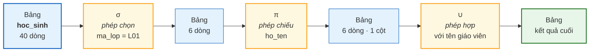
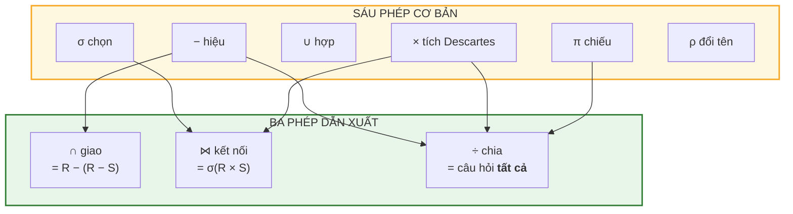

# Bài 21 — Đại số quan hệ: nền toán học phía sau SQL

!!! abstract "🎯 Học xong bài này, bạn sẽ"
    - Biết SQL không phải một bộ cú pháp do ai đó nghĩ ra cho vui, mà là **hiện thực của một hệ toán học** có từ năm 1970
    - Gọi tên và viết được **sáu phép toán cơ bản**: chọn σ, chiếu π, hợp ∪, hiệu −, tích Descartes ×, đổi tên ρ
    - Gọi tên và viết được **ba phép dẫn xuất**: giao ∩, kết nối ⋈ (theta / equi / natural), chia ÷
    - Hiểu **tính khả đóng** — lý do bạn lồng được truy vấn này vào trong truy vấn kia
    - Đọc một câu SQL và chỉ ra nó đang thực hiện phép đại số nào

## 🧠 Câu chuyện mở đầu

Bạn học phép cộng, phép nhân từ lớp 1. Đến lớp 6, thầy giáo viết lên bảng: `3 + 5 × 2`. Cả lớp biết phải nhân trước, cộng sau. Không ai hỏi *"tại sao lại là nhân trước"* — vì đó là **luật của một hệ thống**, và ai cũng đã ngấm luật đó.

Bây giờ nhìn sang câu SQL bạn đã gặp ở Bài 1:

```
SELECT ho_ten, diem_so FROM diem WHERE mon = 'Toán' ORDER BY diem_so DESC LIMIT 1;
```

Với hầu hết người mới, câu này giống một câu **thần chú**: gõ đúng thì chạy, gõ sai thì báo lỗi, và không hiểu vì sao lại phải viết theo thứ tự đó. Người ta học SQL bằng cách học thuộc mẫu câu, rồi thay tên bảng vào.

Học theo lối đó thì làm được việc — nhưng đến lúc truy vấn phức tạp lên, bạn sẽ bí. Bạn sẽ không biết *có thể* viết cái gì, chỉ biết *đã từng thấy* người ta viết cái gì.

Nhưng SQL không phải thần chú. Nó có một hệ toán đứng phía sau, giống hệt như phép nhân đứng sau bài toán `3 + 5 × 2`. Hệ toán đó có tên, có đúng chín phép toán, và mỗi từ khoá SQL bạn sẽ gặp trong mười một bài còn lại của Cấp 3 đều là một phép trong số đó.

Vậy hệ toán ấy là gì, và biết nó thì giúp được gì?

## 📖 Khái niệm & thuật ngữ

### Codd, năm 1970

Năm 1970, Edgar F. Codd — một nhà toán học làm việc tại IBM — công bố bài báo *"A Relational Model of Data for Large Shared Data Banks"*. Ý tưởng trung tâm của ông: **một bảng dữ liệu chính là một tập hợp trong toán học**, nên ta có thể định nghĩa các phép toán trên bảng y như định nghĩa phép hợp, phép giao trên tập hợp.

Hệ phép toán đó gọi là **đại số quan hệ** (*relational algebra*): một tập hợp các phép toán nhận **quan hệ** (*relation* — tức là bảng, theo cách gọi ở [Bài 6](../cap-1-mo-hinh-er/06-mo-hinh-quan-he.md)) làm đầu vào và trả về một **quan hệ mới** làm đầu ra.

!!! info "Vì sao 'đại số'?"
    Trong toán, **đại số** là một tập hợp cộng với các phép toán đóng trên tập hợp đó. Đại số số học có tập số và các phép `+ − × ÷`. Đại số quan hệ có tập các quan hệ và chín phép toán bạn sắp học.

    Nói cách khác: bảng đối với đại số quan hệ giống như số đối với số học.

### Tính khả đóng — điều quan trọng nhất của cả bài

**Tính khả đóng** (*closure property*) là tính chất: **mọi phép toán của đại số quan hệ đều nhận quan hệ làm đầu vào và trả về quan hệ làm đầu ra.**

Nghe thì hiển nhiên, nhưng hệ quả thì rất lớn. Vì đầu ra lại là một quan hệ, nên bạn **đem đầu ra của phép này làm đầu vào của phép kia** được — không giới hạn số tầng.

Đó chính xác là lý do trong SQL bạn viết được:

- `SELECT ... FROM (SELECT ... FROM ...) AS t` — truy vấn lồng trong truy vấn (Bài 27)
- `WITH b AS (SELECT ...) SELECT ... FROM b` — đặt tên cho bước trung gian (Bài 28)
- `CREATE VIEW v AS SELECT ...` rồi `SELECT ... FROM v` — dùng truy vấn như một bảng (Bài 30)

Cả ba kỹ thuật đó, cùng với khả năng nối `JOIN` này vào `JOIN` kia, đều là **cùng một** tính chất toán học được nhìn từ ba phía.

!!! tip "So sánh cho dễ nhớ"
    Phép cộng số nguyên có tính khả đóng: cộng hai số nguyên ra số nguyên, nên viết `1 + 2 + 3 + 4` được.

    Phép chia số nguyên **không** khả đóng: `7 ÷ 2` không còn là số nguyên. Nên trong tập số nguyên, bạn không nối tiếp phép chia thoải mái được.

    SQL nối tiếp được thoải mái vì đại số quan hệ khả đóng.

### Sáu phép toán cơ bản

**Phép toán cơ bản** (*primitive operation*) là phép không định nghĩa được từ các phép khác. Đại số quan hệ có đúng sáu phép như vậy.

| Ký hiệu | Tên tiếng Việt | English | Làm gì |
|---|---|---|---|
| σ | **Phép chọn** | *selection* | Giữ lại **những dòng** thoả điều kiện |
| π | **Phép chiếu** | *projection* | Giữ lại **những cột** được nêu tên |
| ∪ | **Phép hợp** | *union* | Gộp hai bảng, bỏ dòng trùng |
| − | **Phép hiệu** | *difference* | Lấy dòng có ở bảng này mà không có ở bảng kia |
| × | **Tích Descartes** | *Cartesian product* | Ghép **mọi** dòng bảng này với **mọi** dòng bảng kia |
| ρ | **Phép đổi tên** | *rename* | Đặt tên mới cho bảng hoặc cột |

Hai phép đầu dễ nhầm, nên hãy khắc sâu bằng hình ảnh: **σ cắt ngang, π cắt dọc.**

- **Phép chọn** (*selection*, ký hiệu **σ**, đọc là *xích-ma*) lọc theo **dòng**. Viết `σ_{ma_lop = 'L01'}(hoc_sinh)`: giữ những dòng có `ma_lop` bằng `L01`. Số cột không đổi, số dòng giảm.
- **Phép chiếu** (*projection*, ký hiệu **π**, đọc là *pi*) lọc theo **cột**. Viết `π_{ho_ten, ma_lop}(hoc_sinh)`: chỉ giữ hai cột đó. Số dòng **có thể** giảm — vì kết quả là một **tập hợp**, mà tập hợp thì không chứa phần tử trùng nhau.

!!! warning "π tự động bỏ trùng, `SELECT` thì không"
    Đây là chỗ SQL **lệch** khỏi đại số quan hệ, và lệch có chủ đích.

    Trong toán, `π_{ma_lop}(hoc_sinh)` trả về đúng 6 giá trị, vì `{L01, L01, L01, ...}` và `{L01}` là **cùng một tập hợp**.

    Trong SQL, `SELECT ma_lop FROM hoc_sinh` trả về 40 dòng. SQL làm việc trên **đa tập** (*multiset*, còn gọi là *bag*) — tức là tập hợp có cho phép trùng lặp. Muốn đúng nghĩa toán học, phải viết `SELECT DISTINCT ma_lop FROM hoc_sinh`.

    Vì sao SQL chọn như vậy? Vì bỏ trùng là thao tác **đắt** (phải sắp xếp hoặc băm toàn bộ kết quả). Bắt máy làm việc đó ở mọi truy vấn trong khi phần lớn truy vấn không cần thì quá lãng phí. SQL đẩy quyết định đó cho người viết, qua từ khoá `DISTINCT`.

- **Phép hợp** (*union*, ký hiệu **∪**) và **phép hiệu** (*difference*, ký hiệu **−**) chỉ dùng được khi hai quan hệ **khả hợp** (*union-compatible*): cùng số cột, và các cột tương ứng cùng miền giá trị. Không thể hợp bảng `hoc_sinh` với bảng `sach`.
- **Tích Descartes** (*Cartesian product*, ký hiệu **×**) ghép mỗi dòng bên trái với **mọi** dòng bên phải. Bảng `m` dòng nhân bảng `n` dòng ra `m × n` dòng. Đây là phép nguy hiểm nhất — [Bài 25](25-join.md) sẽ cho thấy nó làm nổ tung một truy vấn như thế nào.
- **Phép đổi tên** (*rename*, ký hiệu **ρ**, đọc là *rô*) nghe có vẻ thừa, nhưng nó là phép **bắt buộc phải có**: không có nó thì không viết nổi phép ghép một bảng với chính nó, vì hai bên sẽ trùng hết tên cột.

### Ba phép dẫn xuất

**Phép dẫn xuất** (*derived operation*) là phép viết lại được bằng các phép cơ bản. Giữ chúng lại vì chúng quá hay dùng.

| Ký hiệu | Tên tiếng Việt | English | Định nghĩa qua phép cơ bản |
|---|---|---|---|
| ∩ | **Phép giao** | *intersection* | `R ∩ S = R − (R − S)` |
| ⋈ | **Phép kết nối** | *join* | `R ⋈_θ S = σ_θ(R × S)` |
| ÷ | **Phép chia** | *division* | Viết được bằng π, × và − — xem khai triển ở dưới |

- **Phép giao** (*intersection*, ký hiệu **∩**) lấy những dòng có mặt ở **cả hai** quan hệ.
- **Phép kết nối** (*join*, ký hiệu **⋈**) là tích Descartes rồi lọc ngay. Nó có ba biến thể, và ba tên này sẽ theo bạn suốt đời làm nghề:
    - **Kết nối theta** (*theta join*, viết `R ⋈_θ S`): điều kiện θ là **bất kỳ** phép so sánh nào — `<`, `>`, `<>`, `BETWEEN`...
    - **Kết nối bằng** (*equi join*): trường hợp riêng của theta, khi điều kiện **chỉ gồm các phép so sánh bằng** `=`. Đây là loại chiếm khoảng 95% công việc thực tế.
    - **Kết nối tự nhiên** (*natural join*, viết `R ⋈ S` không ghi điều kiện): là equi join trên **mọi cặp cột trùng tên**, rồi **bỏ bớt** cột trùng để không lặp hai lần.
- **Phép chia** (*division*, ký hiệu **÷**) là phép khó nhất và cũng đẹp nhất. `R ÷ S` trả lời câu hỏi dạng **"tất cả"**: *"những giá trị nào ở R đi kèm với **toàn bộ** giá trị của S?"*

    Ví dụ: *"giáo viên nào dạy ở **tất cả** các lớp khối 8?"* Đó chính là `phan_cong_day ÷ (danh sách lớp khối 8)`.

    Khai triển của nó qua các phép cơ bản cần tới **ba** phép — π, × và − — và đó là lý do nó là phép dài nhất trong cả chín phép. Với `R(x, y)` và `S(y)`:

    ```
    R ÷ S  =  π_x(R)  −  π_x( ( π_x(R) × S )  −  R )
    ```

    Đọc từ trong ra ngoài: `π_x(R) × S` là **mọi** cặp *(giá trị x, giá trị y)* có thể; trừ đi `R` thì còn lại những cặp **đáng lẽ phải có mà không có**; chiếu xuống `x` thì được danh sách những `x` **thiếu ít nhất một** `y`; lấy toàn bộ `x` trừ đi danh sách đó, còn lại đúng những `x` **đủ mọi** `y`.

    Đáng chú ý: SQL **không có** từ khoá cho phép chia. Bạn phải tự dựng nó, bằng `GROUP BY ... HAVING count(...)` ([Bài 26](26-group-by-having.md)) hoặc bằng `NOT EXISTS` lồng hai tầng (**Bài 27**, *sắp có*).

### Bảng thuật ngữ

| Tiếng Việt | English | Nghĩa dễ hiểu |
|---|---|---|
| Đại số quan hệ | *relational algebra* | Hệ phép toán nhận bảng làm đầu vào và trả về bảng làm đầu ra — nền toán học của SQL |
| Tính khả đóng | *closure property* | Đầu ra của mọi phép cũng là một quan hệ, nên lồng phép này vào phép kia được không giới hạn |
| Phép chọn | *selection* (σ) | Giữ lại những **dòng** thoả điều kiện — cắt ngang |
| Phép chiếu | *projection* (π) | Giữ lại những **cột** được nêu tên, và bỏ dòng trùng — cắt dọc |
| Phép hợp | *union* (∪) | Gộp hai quan hệ khả hợp lại, bỏ dòng trùng |
| Phép hiệu | *difference* (−) | Lấy những dòng có ở quan hệ trái mà không có ở quan hệ phải |
| Tích Descartes | *Cartesian product* (×) | Ghép mọi dòng bên trái với mọi dòng bên phải, cho ra `m × n` dòng |
| Phép đổi tên | *rename* (ρ) | Đặt tên mới cho quan hệ hoặc cột, để ghép một bảng với chính nó |
| Phép giao | *intersection* (∩) | Lấy những dòng có mặt ở cả hai quan hệ |
| Phép kết nối | *join* (⋈) | Tích Descartes rồi lọc ngay bằng một điều kiện |
| Kết nối theta | *theta join* | Kết nối với điều kiện so sánh bất kỳ, không chỉ dấu bằng |
| Kết nối bằng | *equi join* | Kết nối mà điều kiện chỉ gồm các phép so sánh bằng |
| Kết nối tự nhiên | *natural join* | Equi join tự động trên mọi cột trùng tên, và bỏ bớt cột lặp |
| Phép chia | *division* (÷) | Trả lời câu hỏi "giá trị nào đi kèm với **toàn bộ** một tập cho trước" |
| Phép toán cơ bản | *primitive operation* | Phép không định nghĩa được từ các phép khác — đại số quan hệ có sáu phép như vậy |
| Phép dẫn xuất | *derived operation* | Phép viết lại được bằng các phép cơ bản, giữ lại vì hay dùng |
| Khả hợp | *union-compatible* | Hai quan hệ cùng số cột và các cột tương ứng cùng miền giá trị |
| Đa tập | *multiset* | Tập hợp có cho phép phần tử trùng nhau — đây là thứ SQL thật sự làm việc trên |

## 🖼️ Sơ đồ

Tính khả đóng nhìn bằng hình: mỗi phép là một cái hộp, vào là bảng, ra cũng là bảng — nên nối hộp nọ vào hộp kia bao nhiêu tầng cũng được.



Sáu phép cơ bản sinh ra ba phép dẫn xuất:



Còn đây là cách nhớ σ và π — hai phép hay bị lẫn nhất. Chỗ này cố ý **không** dùng sơ đồ, vì thứ cần diễn đạt là "hàng và cột", mà một cái bảng thì **chính là** hàng và cột. Ô **in đậm** là phần được giữ lại.

**σ — phép chọn — cắt NGANG.** `σ_{ma_lop = 'L01'}(hoc_sinh)` giữ **cả dòng**, bỏ **cả dòng**:

| ma_hs | ho_ten | ma_lop | |
|---|---|---|---|
| **HS001** | **Nguyễn Văn An** | **L01** | ✅ giữ |
| ~~HS007~~ | ~~Đỗ Văn Hải~~ | ~~L02~~ | ❌ bỏ |
| **HS003** | **Lê Hoàng Cường** | **L01** | ✅ giữ |

Số **cột** không đổi, số **dòng** giảm.

**π — phép chiếu — cắt DỌC.** `π_{ho_ten}(hoc_sinh)` giữ **cả cột**, bỏ **cả cột**:

| ~~ma_hs~~ | **ho_ten** | ~~ma_lop~~ |
|---|---|---|
| ~~HS001~~ | **Nguyễn Văn An** | ~~L01~~ |
| ~~HS007~~ | **Đỗ Văn Hải** | ~~L02~~ |
| ~~HS003~~ | **Lê Hoàng Cường** | ~~L01~~ |
| ❌ bỏ | ✅ giữ | ❌ bỏ |

Số **dòng** có thể giảm (nếu có tên trùng và bạn dùng `DISTINCT`), số **cột** giảm chắc chắn.

Mẹo nhớ bằng hình chữ: **π** có **hai chân dọc** — nó cắt **dọc**. **σ** tròn vo như một nét gạch ngang xoá dòng — nó cắt **ngang**.

## 💻 Thực hành

Mỗi phép dưới đây có ba phần: **ký hiệu toán**, **một câu tiếng Việt**, và **câu SQL chạy thật** trên database `truong_hoc`. Hãy đọc cả ba rồi tự nhủ *"à, hai thứ này là một"*.

### 1. σ — Phép chọn

> **Toán:** `σ_{ma_lop = 'L01'}(hoc_sinh)`
> **Tiếng Việt:** *"Lấy những học sinh thuộc lớp L01."*

```sql
-- KỲ VỌNG: 6 dòng
SELECT *
FROM hoc_sinh
WHERE ma_lop = 'L01'
ORDER BY ma_hs;
```

Từ khoá SQL tương ứng với σ là **`WHERE`**. Số cột giữ nguyên 6, số dòng giảm từ 40 xuống 6.

### 2. π — Phép chiếu

> **Toán:** `π_{ma_lop}(hoc_sinh)`
> **Tiếng Việt:** *"Lấy tập các mã lớp đang có học sinh."*

```sql
-- KỲ VỌNG: 6 dòng
SELECT DISTINCT ma_lop
FROM hoc_sinh
ORDER BY ma_lop;
```

Từ khoá tương ứng với π là **danh sách cột sau `SELECT`**, kèm `DISTINCT` nếu muốn đúng nghĩa toán học. Bỏ `DISTINCT` đi thì SQL trả về 40 dòng — vì SQL làm việc trên đa tập:

```sql
-- KỲ VỌNG: so_dong_khong_distinct = 40
SELECT count(*) AS so_dong_khong_distinct
FROM (SELECT ma_lop FROM hoc_sinh) AS t;
```

### 3. ∪ — Phép hợp

> **Toán:** `π_{ma_hs}(σ_{ma_lop='L01'}(hoc_sinh)) ∪ π_{ma_hs}(σ_{ma_lop IN ('L01','L02')}(hoc_sinh))`
> **Tiếng Việt:** *"Gộp danh sách mã học sinh lớp L01 với danh sách mã học sinh lớp L01 và L02."*

```sql
-- KỲ VỌNG: 12 dòng
SELECT ma_hs FROM hoc_sinh WHERE ma_lop = 'L01'
UNION
SELECT ma_hs FROM hoc_sinh WHERE ma_lop IN ('L01', 'L02')
ORDER BY ma_hs;
```

Kết quả là **12** chứ không phải `6 + 12 = 18`: sáu mã của L01 xuất hiện ở cả hai vế, và `UNION` bỏ trùng đúng như phép ∪ trong toán.

Nếu bạn **không** muốn bỏ trùng, SQL cho thêm `UNION ALL` — đây lại là một chỗ SQL rộng hơn đại số quan hệ:

```sql
-- KỲ VỌNG: so_dong = 18
SELECT count(*) AS so_dong
FROM (
    SELECT ma_hs FROM hoc_sinh WHERE ma_lop = 'L01'
    UNION ALL
    SELECT ma_hs FROM hoc_sinh WHERE ma_lop IN ('L01', 'L02')
) AS t;
```

### 4. − — Phép hiệu

> **Toán:** `π_{ma_gv}(giao_vien) − π_{ma_gvcn}(lop)`
> **Tiếng Việt:** *"Giáo viên nào chưa làm chủ nhiệm lớp nào?"*

```sql
-- KỲ VỌNG: 3 dòng
SELECT ma_gv FROM giao_vien
EXCEPT
SELECT ma_gvcn FROM lop
ORDER BY ma_gv;
```

Ba người đó là `GV06`, `GV07`, `GV08`. Từ khoá tương ứng là **`EXCEPT`** (một số DBMS khác gọi là `MINUS`).

!!! note "Chi tiết đáng nhớ về `NULL` ở đây"
    Lớp `L06` có `ma_gvcn` là `NULL`, nên vế phải của `EXCEPT` gồm `{GV01, GV02, GV03, GV04, GV05, NULL}`.

    `EXCEPT` xử lý `NULL` như một giá trị bình thường: nó chỉ loại đi những mã **trùng khớp**, còn `NULL` không trùng với mã giáo viên nào nên không loại ai cả. Kết quả vẫn đúng 3 dòng.

    Nhưng nếu viết bằng `NOT IN` thì kết quả sẽ là **0 dòng** — một kết quả sai một cách bí ẩn. Đó là cái bẫy của `NULL`, và [Bài 24](24-select-where-order-by.md) rồi **Bài 27** *(sắp có)* sẽ mổ xẻ nó.

### 5. × — Tích Descartes

> **Toán:** `lop × giao_vien`
> **Tiếng Việt:** *"Ghép mọi lớp với mọi giáo viên."*

```sql
-- KỲ VỌNG: so_dong = 48
SELECT count(*) AS so_dong
FROM lop CROSS JOIN giao_vien;
```

6 lớp × 8 giáo viên = **48** dòng. Không có ý nghĩa nghiệp vụ nào, nhưng là **nguyên liệu** để dựng phép kết nối ở bước sau.

Từ khoá tương ứng là **`CROSS JOIN`** — hoặc chỉ cần viết hai bảng cách nhau bằng dấu phẩy trong `FROM` và **quên** điều kiện nối. Chính cái "quên" đó là lỗi kinh điển ở [Bài 25](25-join.md).

### 6. ρ — Phép đổi tên

> **Toán:** `ρ_{g1}(giao_vien) × ρ_{g2}(giao_vien)`
> **Tiếng Việt:** *"Đặt cho bảng giáo viên hai cái tên tạm để ghép nó với chính nó."*

```sql
-- KỲ VỌNG: so_cap = 28
SELECT count(*) AS so_cap
FROM giao_vien AS g1
JOIN giao_vien AS g2 ON g1.luong > g2.luong;
```

Từ khoá tương ứng là **`AS`**. Không có `g1` và `g2`, câu này không viết nổi — bạn sẽ không có cách nào phân biệt `luong` của bên nào với bên nào.

8 giáo viên có 8 mức lương khác nhau, nên số cặp *(người lương cao hơn, người lương thấp hơn)* đúng bằng số cặp không xếp thứ tự của 8 phần tử: `8 × 7 ÷ 2 = 28`.

### 7. ∩ — Phép giao

> **Toán:** `π_{ma_hs}(muon_sach) ∩ π_{ma_hs}(σ_{ma_lop='L01'}(hoc_sinh))`
> **Tiếng Việt:** *"Học sinh lớp L01 nào đã từng mượn sách?"*

```sql
-- KỲ VỌNG: 6 dòng
SELECT ma_hs FROM muon_sach
INTERSECT
SELECT ma_hs FROM hoc_sinh WHERE ma_lop = 'L01'
ORDER BY ma_hs;
```

Cả 6 bạn lớp L01 đều đã mượn sách. Từ khoá tương ứng là **`INTERSECT`**.

### 8. ⋈ — Phép kết nối, ba biến thể

**a) Kết nối bằng** — điều kiện chỉ có dấu `=`:

> **Toán:** `hoc_sinh ⋈_{hoc_sinh.ma_lop = lop.ma_lop} lop`
> **Tiếng Việt:** *"Mỗi học sinh kèm tên lớp của bạn ấy."*

```sql
-- KỲ VỌNG: so_dong = 40
SELECT count(*) AS so_dong
FROM hoc_sinh h
JOIN lop l ON h.ma_lop = l.ma_lop;
```

**b) Kết nối tự nhiên** — tự tìm cột trùng tên:

> **Toán:** `hoc_sinh ⋈ lop`
> **Tiếng Việt:** *"Ghép hai bảng theo mọi cột cùng tên — ở đây chỉ có `ma_lop`."*

```sql
-- KỲ VỌNG: so_dong = 40
SELECT count(*) AS so_dong
FROM hoc_sinh NATURAL JOIN lop;
```

Kết quả giống hệt câu trên, nhưng bảng ra chỉ có **một** cột `ma_lop` chứ không phải hai.

**c) Kết nối theta** — điều kiện là phép so sánh bất kỳ:

> **Toán:** `giao_vien ⋈_{g1.luong > g2.luong} giao_vien`
> **Tiếng Việt:** *"Mọi cặp giáo viên mà người thứ nhất lương cao hơn người thứ hai."*

Chính là câu `28` dòng ở mục ρ phía trên. Điều kiện là `>`, không phải `=`, nên nó là theta join chứ không phải equi join.

### 9. ÷ — Phép chia

> **Toán:** `π_{ma_gv, ma_lop}(phan_cong_day) ÷ π_{ma_lop}(σ_{khoi = 8}(lop))`
> **Tiếng Việt:** *"Giáo viên nào được phân công dạy ở **tất cả** các lớp khối 8?"*

SQL không có toán tử chia. Cách dựng phổ biến nhất là **đếm và so sánh**: gom theo giáo viên, đếm xem người đó chạm tới bao nhiêu lớp khối 8, rồi giữ những người chạm đủ cả 3.

```sql
-- KỲ VỌNG: 8 dòng
SELECT pc.ma_gv
FROM phan_cong_day pc
JOIN lop l ON l.ma_lop = pc.ma_lop
WHERE l.khoi = 8
GROUP BY pc.ma_gv
HAVING count(DISTINCT pc.ma_lop) = (SELECT count(*) FROM lop WHERE khoi = 8)
ORDER BY pc.ma_gv;
```

Cả **8** giáo viên đều dạy đủ ba lớp khối 8 (`L01`, `L02`, `L03`).

Bây giờ đổi mẫu số thành **toàn bộ 6 lớp** của trường:

```sql
-- KỲ VỌNG: 0 dòng
SELECT pc.ma_gv
FROM phan_cong_day pc
GROUP BY pc.ma_gv
HAVING count(DISTINCT pc.ma_lop) = (SELECT count(*) FROM lop)
ORDER BY pc.ma_gv;
```

**Không ai cả.** Bảng `phan_cong_day` chỉ phân công cho `L01`–`L04`; hai lớp `L05` và `L06` chưa có ai dạy. Phép chia rất khắt khe: thiếu **một** phần tử của mẫu số là bị loại.

!!! note "Chưa hiểu `GROUP BY` / `HAVING` cũng không sao"
    Hai từ khoá đó là nội dung chính của [Bài 26](26-group-by-having.md). Ở đây bạn chỉ cần thấy một điều: **phép chia có tồn tại, và nó phải được dựng bằng tay.**

### Bảng đối chiếu: phép đại số ↔ từ khoá SQL

Đây là bảng quan trọng nhất của bài. Hãy quay lại tra nó mỗi khi bạn bí ở một bài sau.

| Phép đại số | Ký hiệu | Từ khoá SQL | Học kỹ ở bài |
|---|---|---|---|
| Phép chọn | σ | `WHERE` | [Bài 24](24-select-where-order-by.md) |
| Phép chiếu | π | Danh sách cột sau `SELECT`, kèm `DISTINCT` | [Bài 24](24-select-where-order-by.md) |
| Phép hợp | ∪ | `UNION` (và `UNION ALL` giữ trùng) | Bài này |
| Phép hiệu | − | `EXCEPT` | Bài này |
| Tích Descartes | × | `CROSS JOIN`, hoặc `FROM a, b` thiếu điều kiện | [Bài 25](25-join.md) |
| Phép đổi tên | ρ | `AS` | [Bài 24](24-select-where-order-by.md) |
| Phép giao | ∩ | `INTERSECT` | Bài này |
| Kết nối theta | ⋈_θ | `JOIN ... ON <điều kiện bất kỳ>` | [Bài 25](25-join.md) |
| Kết nối bằng | ⋈ | `JOIN ... ON a.x = b.x`, hoặc lối viết gọn `USING (x)` khi hai bảng **cùng tên cột** — [Bài 25](25-join.md) dạy kỹ | [Bài 25](25-join.md) |
| Kết nối tự nhiên | ⋈ | `NATURAL JOIN` | [Bài 25](25-join.md) |
| Phép chia | ÷ | *(không có)* — dựng bằng `GROUP BY ... HAVING count(...)` hoặc `NOT EXISTS` lồng đôi | [Bài 26](26-group-by-having.md), **Bài 27** *(sắp có)* |
| *(không có trong đại số)* | — | `ORDER BY` — vì tập hợp không có thứ tự | [Bài 24](24-select-where-order-by.md) |
| *(không có trong đại số)* | — | Hàm tổng hợp `COUNT`, `SUM`, `AVG` | [Bài 26](26-group-by-having.md) |

Ba dòng cuối cho thấy: **SQL không chỉ là đại số quan hệ.** Nó bổ sung thêm thứ tự, hàm tổng hợp, đa tập và `NULL` — bốn thứ mà lý thuyết gốc không có. Chính bốn thứ bổ sung đó là nơi sinh ra gần hết lỗi của người mới.

## ⚠️ Lỗi thường gặp

!!! warning "Lỗi 1: Lẫn σ với π"
    Rất nhiều người nhớ *"selection thì chọn cột"* — vì tiếng Anh *select* nghe giống *"chọn ra cái mình muốn xem"*, mà trong SQL `SELECT` lại đứng trước danh sách **cột**.

    Sự thật ngược lại: **σ (selection) làm việc trên DÒNG**, và trong SQL nó là `WHERE`, không phải `SELECT`. Còn **π (projection) làm việc trên CỘT**, và nó chính là danh sách cột sau `SELECT`.

    Cách nhớ chắc: chữ **π** có **hai chân dọc** — nó cắt **dọc**, tức cắt cột. Chữ **σ** tròn vo, nó gạch **ngang** bỏ bớt dòng.

!!! warning "Lỗi 2: Tưởng `SELECT cot` đã là phép chiếu"
    Phép chiếu π **luôn** bỏ dòng trùng, vì kết quả của nó là một tập hợp.

    `SELECT ma_lop FROM hoc_sinh` cho 40 dòng, trong đó `L01` lặp 6 lần. Đó **không phải** π, đó là phép chiếu của **đa tập**.

    Chỉ `SELECT DISTINCT ma_lop FROM hoc_sinh` mới đúng là π, và nó cho 6 dòng.

    Hệ quả thực tế: khi bạn chiếu bỏ mất cột khoá chính, số dòng có thể **thay đổi** nếu bạn thêm `DISTINCT` — và nhiều lỗi báo cáo sai xuất phát từ chỗ này.

!!! warning "Lỗi 3: `UNION` hai bảng không khả hợp"
    Phép ∪ đòi hai quan hệ **khả hợp**: cùng số cột, các cột tương ứng cùng miền giá trị.

    <!-- sql:co-y-loi -->
    ```sql
    SELECT ma_hs, ho_ten FROM hoc_sinh
    UNION
    SELECT ma_sach FROM sach;
    ```

    PostgreSQL sẽ báo lỗi vì hai vế không cùng số cột. Sửa bằng cách cho hai vế cùng số cột và cùng kiểu:

    ```sql
    -- KỲ VỌNG: so_dong = 60
    SELECT count(*) AS so_dong FROM (
        SELECT ho_ten FROM hoc_sinh
        UNION
        SELECT ten_sach FROM sach
    ) AS t;
    ```

    40 tên học sinh phân biệt cộng 20 tên sách phân biệt, không có tên nào trùng nhau — ra đúng 60.

!!! warning "Lỗi 4: Quên rằng ⋈ là × rồi mới lọc"
    `R ⋈_θ S = σ_θ(R × S)`. Về **mặt ngữ nghĩa**, kết nối luôn là "nhân ra hết rồi vứt bớt".

    Nếu bạn viết `JOIN` mà quên `ON`, hoặc viết `ON 1=1`, bạn được nguyên cái tích Descartes. Với hai bảng 40 và 6 dòng thì 240 dòng chẳng sao; với hai bảng 50.000 và 500.000 dòng ở Cấp 4 thì đó là 25 tỉ dòng và máy chủ đứng hình.

    (Về **mặt thực thi**, PostgreSQL gần như không bao giờ nhân ra hết rồi mới lọc — nó có các thuật toán nối thông minh hơn nhiều. Cấp 4 sẽ đọc `EXPLAIN` để thấy điều đó. Nhưng **kết quả** thì luôn đúng bằng định nghĩa toán học ở trên.)

!!! warning "Lỗi 5: Tìm từ khoá `DIVIDE` trong SQL"
    Không có. Phép chia là phép duy nhất trong chín phép không có từ khoá riêng.

    Dấu hiệu nhận ra một bài toán cần phép chia: đề bài có chữ **"tất cả"**, **"mọi"**, **"đủ"**. *"Học sinh nào có điểm ở tất cả các môn"*, *"giáo viên nào dạy đủ cả hai học kỳ"*, *"sách nào được mọi lớp khối 9 mượn"*.

    Gặp chữ đó thì nghĩ ngay tới hai khuôn: `GROUP BY ... HAVING count(DISTINCT ...) = <tổng số>` hoặc `NOT EXISTS (… NOT EXISTS …)`.

## ✍️ Bài tập

1. Với mỗi câu SQL sau, hãy viết lại bằng ký hiệu đại số quan hệ:

    a. `SELECT ho_ten FROM giao_vien WHERE luong > 15000000;`

    b. `SELECT DISTINCT khoi FROM lop;`

    c. `SELECT * FROM hoc_sinh h JOIN lop l ON h.ma_lop = l.ma_lop;`

2. Ngược lại: viết câu SQL cho biểu thức `π_{ten_sach}(σ_{nam_xuat_ban < 1950}(sach))`, rồi cho biết nó trả về bao nhiêu dòng trên dữ liệu mẫu.

3. Bảng `hoc_sinh` có 40 dòng, bảng `mon_hoc` có 9 dòng. Hỏi:

    a. `hoc_sinh × mon_hoc` có bao nhiêu dòng?

    b. `hoc_sinh × mon_hoc` có bao nhiêu **cột**?

    c. Câu SQL nào tạo ra nó?

4. Giải thích vì sao **không có** phép ρ (đổi tên) thì không viết nổi truy vấn *"tìm mọi cặp học sinh sinh cùng một tháng"*.

5. Đề bài: *"Tìm những học sinh có điểm ở **tất cả** 9 môn học."* Đây là phép nào? Viết câu SQL và cho biết kết quả có bao nhiêu dòng.

??? success "Đáp án"
    **Câu 1.**

    a. `π_{ho_ten}(σ_{luong > 15000000}(giao_vien))`

    Chú ý thứ tự: **chọn trước, chiếu sau**. Viết ngược lại — `σ_{luong > 15000000}(π_{ho_ten}(giao_vien))` — là **sai**, vì sau khi chiếu chỉ còn cột `ho_ten`, không còn cột `luong` để mà lọc nữa.

    b. `π_{khoi}(lop)`

    `DISTINCT` không cần dịch thành gì thêm, vì bản thân π đã bỏ trùng rồi.

    c. `hoc_sinh ⋈_{hoc_sinh.ma_lop = lop.ma_lop} lop` — một **kết nối bằng**.

    **Câu 2.**

    ```sql
    -- KỲ VỌNG: 8 dòng
    SELECT DISTINCT ten_sach
    FROM sach
    WHERE nam_xuat_ban < 1950
    ORDER BY ten_sach;
    ```

    **8 dòng.** Các cuốn thoả điều kiện là `S001` *Dế Mèn phiêu lưu ký* (1941), `S006` *Số đỏ* (1936), `S007` *Chí Phèo* (1941), `S008` *Lão Hạc* (1943), `S009` *Tắt đèn* (1939), `S010` *Vang bóng một thời* (1940), `S016` *Không gia đình* (1878), `S017` *Hoàng tử bé* (1943).

    `DISTINCT` ở đây không bỏ dòng nào, vì 8 tên sách này vốn đã khác nhau. Nhưng vẫn nên viết, vì biểu thức toán có π thì bản dịch SQL trung thành phải có `DISTINCT`.

    **Câu 3.**

    a. `40 × 9 = 360` dòng.

    b. `hoc_sinh` có 6 cột, `mon_hoc` có 3 cột → tích có **9 cột**. Quy tắc: tích Descartes **nhân số dòng** nhưng **cộng số cột**.

    c. Câu lệnh:

    ```sql
    -- KỲ VỌNG: so_dong = 360
    SELECT count(*) AS so_dong
    FROM hoc_sinh CROSS JOIN mon_hoc;
    ```

    **Câu 4.**

    Truy vấn đó phải so sánh bảng `hoc_sinh` với **chính nó** — lấy một học sinh ở "bên trái" và một học sinh ở "bên phải", rồi so tháng sinh của hai bên.

    Nhưng nếu cả hai bên đều tên là `hoc_sinh`, thì viết `hoc_sinh.ngay_sinh` sẽ trỏ vào đâu? Không có cách nào phân biệt. Hệ thống không thể đoán bạn đang nói tới bản sao nào.

    Phép ρ giải quyết đúng chuyện đó: `ρ_{a}(hoc_sinh)` và `ρ_{b}(hoc_sinh)` tạo ra hai cái tên khác nhau cho cùng một bảng, và từ đó `a.ngay_sinh` với `b.ngay_sinh` mới có nghĩa. Trong SQL, ρ chính là `AS a` và `AS b`.

    Đây là lý do ρ được xếp vào **sáu phép cơ bản** dù thoạt nhìn nó chẳng "làm" gì với dữ liệu: bỏ nó đi thì một lớp truy vấn hoàn toàn biến mất. [Bài 25](25-join.md) gọi kỹ thuật này là `SELF JOIN`.

    **Câu 5.**

    Chữ **"tất cả"** là dấu hiệu của **phép chia ÷**. Cụ thể: `π_{ma_hs, ma_mon}(diem) ÷ π_{ma_mon}(mon_hoc)`.

    ```sql
    -- KỲ VỌNG: 40 dòng
    SELECT d.ma_hs
    FROM diem d
    GROUP BY d.ma_hs
    HAVING count(DISTINCT d.ma_mon) = (SELECT count(*) FROM mon_hoc)
    ORDER BY d.ma_hs;
    ```

    Kết quả: **40 dòng** — toàn bộ học sinh của trường. Dữ liệu mẫu cho mỗi học sinh một điểm "Học kỳ" ở cả 9 môn, nên không ai bị thiếu.

    Lưu ý `count(DISTINCT d.ma_mon)` chứ không phải `count(*)`: mỗi học sinh có 12 dòng điểm (9 điểm Học kỳ + 3 điểm 1 tiết), nên `count(*)` sẽ ra 12 và so với 9 là trượt hết. Phép chia quan tâm tới **tập các môn phân biệt**, không quan tâm tới số lần.

## 🔑 Tóm tắt

1. **Đại số quan hệ** là hệ toán do Codd đặt ra năm 1970, gồm các phép nhận **quan hệ** làm đầu vào và trả về **quan hệ** làm đầu ra. SQL là một hiện thực của nó — mỗi từ khoá bạn học ở Cấp 3 đều là một phép trong hệ này.
2. Sáu **phép cơ bản**: **σ** chọn *dòng* (`WHERE`), **π** chiếu *cột* (`SELECT DISTINCT`), **∪** hợp (`UNION`), **−** hiệu (`EXCEPT`), **×** tích Descartes (`CROSS JOIN`), **ρ** đổi tên (`AS`). Nhớ **σ cắt ngang, π cắt dọc**.
3. Ba **phép dẫn xuất** viết lại được từ sáu phép trên: **∩** giao (`INTERSECT`), **⋈** kết nối với ba biến thể theta / equi / natural, và **÷** chia — phép duy nhất **không có** từ khoá SQL, phải dựng bằng `GROUP BY ... HAVING count(...)` hoặc `NOT EXISTS` lồng đôi.
4. **Tính khả đóng** — đầu ra của mọi phép lại là một quan hệ — chính là lý do bạn lồng được truy vấn con, viết được CTE, và dùng được view như một bảng thật.
5. SQL **rộng hơn** đại số quan hệ ở bốn điểm, và đúng bốn điểm đó sinh ra gần hết lỗi của người mới: SQL dùng **đa tập** (có trùng lặp) chứ không phải tập hợp, có **`ORDER BY`** (tập hợp vốn không có thứ tự), có **hàm tổng hợp**, và có **`NULL`** cùng logic ba giá trị.

---

⬅️ [Bài 20 — Phi chuẩn hoá — khi nào nên phá luật](../cap-2-chuan-hoa/20-denormalization.md) · ➡️ [Bài 22 — DDL: CREATE, ALTER, DROP và các kiểu dữ liệu](22-ddl-va-kieu-du-lieu.md)
