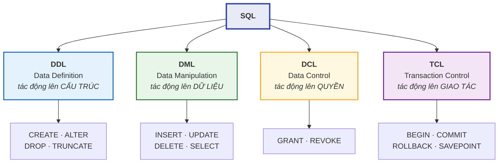
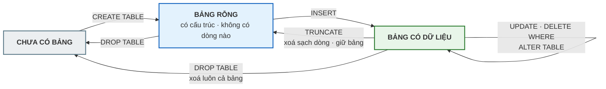

# Bài 22 — DDL: CREATE, ALTER, DROP và các kiểu dữ liệu

!!! abstract "🎯 Học xong bài này, bạn sẽ"
    - Chia được SQL thành bốn nhóm con **DDL / DML / DCL / TCL** và biết câu lệnh nào thuộc nhóm nào
    - Viết được `CREATE TABLE` đầy đủ ràng buộc, `ALTER TABLE` để sửa bảng đang chạy, và phân biệt `DROP TABLE` với `TRUNCATE`
    - Chọn đúng **kiểu dữ liệu** cho từng cột, thay vì cho tất cả vào `TEXT`
    - Tránh được ba cái bẫy kinh điển: `CHAR` đệm khoảng trắng, `REAL` làm hỏng tiền và điểm, và `TIMESTAMP` không neo được vào một thời điểm thật

## 🧠 Câu chuyện mở đầu

Trường bạn sắp làm phần mềm quản lý học sinh. Cô hiệu phó đưa cho bạn tờ giấy ghi các thông tin cần lưu: họ tên, ngày sinh, giới tính, điểm trung bình, còn đang học hay đã chuyển trường, ghi chú của giáo viên chủ nhiệm.

Bạn mở máy, tạo bảng. Và bạn đứng khựng lại ở câu hỏi đầu tiên: **ngày sinh thì lưu kiểu gì?**

Lưu thành chữ, ví dụ `"15/01/2012"`? Nghe tiện. Nhưng rồi hôm sau cô hỏi *"sắp xếp học sinh theo tuổi giúp cô"* — máy sẽ sắp theo thứ tự chữ cái, và `"02/12/2011"` sẽ đứng trước `"15/01/2012"` vì `"0"` bé hơn `"1"`. Sai bét.

Còn điểm trung bình thì sao? `8.25` — lưu kiểu số thực chứ gì. Nhưng nếu máy lưu `8.25` thành `8.2499999999999996` thì lúc so sánh `diem_tb = 8.25` sẽ ra *sai*, dù trên màn hình rõ ràng đang hiện `8.25`.

Hai câu hỏi tưởng vụn vặt đó thực ra là **quyết định thiết kế**. Chúng ta chọn một lần, rồi sống với nó nhiều năm. Vậy có bộ quy tắc nào để chọn cho đúng không?

## 📖 Khái niệm & thuật ngữ

### SQL không phải một ngôn ngữ, nó là bốn

Người ta quen gọi "SQL" như một khối, nhưng chuẩn SQL chia câu lệnh thành bốn nhóm con, theo **việc chúng tác động lên cái gì**:

| Nhóm | Tên đầy đủ | Tác động lên | Câu lệnh tiêu biểu | Học ở bài |
|---|---|---|---|---|
| **DDL** | *Data Definition Language* | **Cấu trúc** — bảng, cột, ràng buộc, index | `CREATE`, `ALTER`, `DROP`, `TRUNCATE` | Bài này |
| **DML** | *Data Manipulation Language* | **Dữ liệu** bên trong bảng | `INSERT`, `UPDATE`, `DELETE`, `SELECT` | [Bài 23](23-dml-insert-update-delete.md), [Bài 24](24-select-where-order-by.md) |
| **DCL** | *Data Control Language* | **Quyền** của người dùng | `GRANT`, `REVOKE` | Cấp 5 |
| **TCL** | *Transaction Control Language* | **Giao tác** — gom nhiều lệnh thành một khối | `BEGIN`, `COMMIT`, `ROLLBACK`, `SAVEPOINT` | Cấp 4 |

- **Ngôn ngữ định nghĩa dữ liệu** (*Data Definition Language*, viết tắt **DDL**) là nhóm câu lệnh dựng và sửa **khung** của database. Nó không quan tâm bên trong bảng có bao nhiêu dòng.
- **Ngôn ngữ thao tác dữ liệu** (*Data Manipulation Language*, viết tắt **DML**) là nhóm câu lệnh làm việc với **nội dung** bảng.
- **Ngôn ngữ điều khiển dữ liệu** (*Data Control Language*, viết tắt **DCL**) cấp và thu hồi quyền: ai được đọc bảng nào, ai được sửa.
- **Ngôn ngữ điều khiển giao tác** (*Transaction Control Language*, viết tắt **TCL**) gom nhiều câu lệnh thành một khối "hoặc xong cả, hoặc không gì cả".

!!! note "`SELECT` thuộc nhóm nào?"
    Chuẩn SQL xếp `SELECT` vào **DML**. Nhiều tài liệu tách riêng nó ra thành **DQL** (*Data Query Language*) cho gọn, vì `SELECT` chỉ đọc chứ không sửa gì. Hai cách gọi đều gặp được; biết cả hai để không bối rối khi đọc tài liệu.

### Ba câu lệnh DDL quan trọng nhất

**`CREATE TABLE`** dựng một bảng mới. Cú pháp tối thiểu là tên bảng và danh sách cột, mỗi cột gồm **tên** và **kiểu dữ liệu**; sau đó mới tới các ràng buộc mà bạn đã học ở [Bài 15](../cap-1-mo-hinh-er/15-rang-buoc-toan-ven.md).

**`ALTER TABLE`** sửa bảng đã có mà **không** làm mất dữ liệu đang nằm trong đó. Bốn thao tác hay dùng nhất:

| Thao tác | Cú pháp | Ghi chú |
|---|---|---|
| Thêm cột | `ALTER TABLE t ADD COLUMN c KIEU;` | Cột mới nhận `NULL` cho mọi dòng cũ, trừ khi có `DEFAULT` |
| Bỏ cột | `ALTER TABLE t DROP COLUMN c;` | **Mất dữ liệu cột đó vĩnh viễn** |
| Đổi kiểu | `ALTER TABLE t ALTER COLUMN c TYPE KIEU;` | Thất bại nếu dữ liệu cũ không chuyển được |
| Đổi tên | `ALTER TABLE t RENAME COLUMN a TO b;` | Mọi truy vấn cũ dùng tên `a` sẽ hỏng |

**`DROP TABLE`** xoá **cả bảng lẫn dữ liệu lẫn ràng buộc**. Còn **`TRUNCATE`** chỉ xoá **dữ liệu**, giữ nguyên cái bảng rỗng.

| | `DROP TABLE` | `TRUNCATE` | `DELETE FROM t` |
|---|---|---|---|
| Nhóm | DDL | DDL | DML |
| Bảng còn lại không? | **Không** | Có, rỗng | Có, rỗng |
| Tốc độ trên bảng lớn | Nhanh | **Rất nhanh** | Chậm — xoá từng dòng |
| Có `WHERE` không? | Không | **Không** | **Có** |
| Kích hoạt trigger dòng? | Không | **Không** | Có |
| Quay lui được bằng `ROLLBACK`? | Có (trong PostgreSQL) | Có (trong PostgreSQL) | Có |
| Đặt lại bộ đếm của `SERIAL`? | Không còn bảng nên không có bộ đếm để nói | **Không** — trừ khi viết `TRUNCATE t RESTART IDENTITY` | **Không** |

!!! danger "`TRUNCATE` không có `WHERE` — và đó là điểm mấu chốt"
    `TRUNCATE hoc_sinh;` xoá sạch 40 dòng, không hỏi lại, không cách nào giới hạn.

    Nó nhanh vì nó không đi qua từng dòng — nó vứt luôn cả tệp dữ liệu rồi tạo tệp mới. Đổi lại, nó **không kích hoạt trigger `FOR EACH ROW`** (**Bài 31** *(sắp có)* sẽ dạy trigger), nên nếu bạn có trigger ghi nhật ký thì nhật ký sẽ trống trơn.

### Kiểu dữ liệu

**Kiểu dữ liệu** (*data type*) là khai báo cho DBMS biết một cột chứa loại giá trị nào. Nó làm bốn việc cùng lúc:

1. **Ràng buộc miền giá trị** — nhét chữ vào cột `INTEGER` là bị từ chối ngay, không cần viết `CHECK`.
2. **Quyết định cách so sánh và sắp xếp** — với `DATE` thì `2011-12-01 < 2012-01-15`; với `TEXT` thì ngược lại.
3. **Quyết định các phép toán dùng được** — cộng hai `DATE` ra khoảng thời gian, cộng hai `TEXT` thì vô nghĩa.
4. **Quyết định dung lượng lưu trữ** — `SMALLINT` tốn 2 byte, `BIGINT` tốn 8 byte. Nhân với 500 triệu dòng ở Cấp 4 thì khác biệt là hàng gigabyte.

#### Kiểu số

| Kiểu | Phạm vi / độ chính xác | Dung lượng | Dùng khi |
|---|---|---|---|
| `SMALLINT` | −32 768 … 32 767 | 2 byte | Số nhỏ chắc chắn không vượt ngưỡng: `khoi`, `so_tiet_tuan`, `nam_xuat_ban` |
| `INTEGER` | ≈ ±2,1 tỉ | 4 byte | Mặc định cho số nguyên |
| `BIGINT` | ≈ ±9,2 × 10¹⁸ | 8 byte | Khoá tự tăng của bảng rất lớn, số tiền tính bằng đồng |
| `NUMERIC(p,s)` | **Chính xác tuyệt đối**, `p` chữ số, `s` chữ số thập phân | Thay đổi | **Tiền, điểm số, mọi thứ phải đúng từng chữ số** |
| `REAL` | ≈ 6 chữ số có nghĩa | 4 byte | Số đo vật lý chấp nhận sai số |
| `DOUBLE PRECISION` | ≈ 15 chữ số có nghĩa | 8 byte | Tính toán khoa học |
| `SERIAL` | `INTEGER` tự tăng | 4 byte | Khoá nhân tạo |
| `BIGSERIAL` | `BIGINT` tự tăng | 8 byte | Khoá nhân tạo của bảng rất lớn |

!!! info "`SERIAL` không phải một kiểu thật"
    `SERIAL` là **lối viết tắt**. Khi bạn viết `ma_diem SERIAL`, PostgreSQL âm thầm làm ba việc: tạo một bộ đếm (*sequence*), khai cột là `INTEGER NOT NULL`, và đặt giá trị mặc định của cột là "lấy số tiếp theo từ bộ đếm đó".

    Từ PostgreSQL 10 trở đi có cách viết chuẩn hơn, được khuyến nghị dùng cho bảng mới: `ma_diem INTEGER GENERATED ALWAYS AS IDENTITY`. Khoá học vẫn dùng `SERIAL` vì bạn sẽ gặp nó ở khắp mọi nơi trong mã nguồn có sẵn.

#### Kiểu chuỗi

| Kiểu | Nghĩa | Dùng khi |
|---|---|---|
| `VARCHAR(n)` | Chuỗi dài **tối đa** `n` ký tự | Mặc định cho mọi chuỗi có giới hạn nghiệp vụ rõ ràng |
| `CHAR(n)` | Chuỗi dài **đúng** `n` ký tự, thiếu thì **đệm khoảng trắng** | Mã có độ dài cố định thật sự: `HS001`, `MH01` |
| `TEXT` | Chuỗi dài **không giới hạn** | Ghi chú, nội dung bài viết, mô tả tự do |

Trong PostgreSQL, ba kiểu này **tốc độ như nhau** — không có chuyện `CHAR(5)` nhanh hơn `TEXT`. Chọn kiểu nào là chuyện **diễn đạt ý định nghiệp vụ**, không phải chuyện hiệu năng.

#### Kiểu ngày giờ

| Kiểu | Chứa gì | Cạm bẫy |
|---|---|---|
| `DATE` | Ngày tháng năm | An toàn, dùng thoải mái |
| `TIME` | Giờ phút giây, **không** có ngày | Không tự biết hôm nay là ngày nào |
| `TIMESTAMP` | Ngày **và** giờ, **không** gắn với múi giờ nào | Hai người ở hai múi giờ đọc ra hai thời điểm khác nhau |
| `TIMESTAMPTZ` | **Một thời điểm tuyệt đối** — nhận vào và hiển thị ra theo múi giờ của phiên, nhưng **không lưu** múi giờ | Gần như luôn là lựa chọn đúng; nhưng đừng mong lấy lại được múi giờ gốc của lúc nhập |

#### Các kiểu còn lại

| Kiểu | Nghĩa | Ví dụ giá trị |
|---|---|---|
| `BOOLEAN` | Đúng / Sai / chưa biết | `TRUE`, `FALSE`, `NULL` |
| `UUID` | Định danh 128 bit, sinh ngẫu nhiên gần như không bao giờ trùng | `a0ee-…-9f3b` |
| `ARRAY` | Mảng nhiều giá trị cùng kiểu trong **một ô** | `ARRAY['Bóng đá', 'Vẽ']` |
| `ENUM` | Tập giá trị cố định do bạn tự định nghĩa, **có thứ tự** | `'Giỏi'`, `'Khá'` |
| `JSONB` | Tài liệu JSON đã phân tích sẵn | Bài 32 *(sắp có)* |

!!! warning "`ARRAY` và chuẩn hoá — hai thứ đối đầu nhau"
    Ở [Bài 17](../cap-2-chuan-hoa/17-dang-chuan-1nf-2nf.md) bạn học rằng 1NF đòi mỗi ô chỉ chứa **một** giá trị nguyên tử. Kiểu `ARRAY` cho phép nhét cả danh sách vào một ô — tức là **phá 1NF một cách có chủ đích**.

    Dùng nó khi nào? Khi danh sách đó **không bao giờ** cần được tìm kiếm, nối bảng hay ràng buộc riêng — ví dụ danh sách thẻ (*tag*) để hiển thị. Nếu bạn thấy mình muốn `JOIN` vào phần tử của mảng, đó là dấu hiệu bạn đang cần một **bảng con** chứ không phải một mảng.

### Giá trị mặc định

**Giá trị mặc định** (*default value*) là giá trị DBMS tự điền khi câu `INSERT` không nhắc tới cột đó. Khai bằng `DEFAULT`.

Điều dễ hiểu nhầm: `DEFAULT` **không** làm cột trở thành `NOT NULL`. Nếu bạn cố tình viết `INSERT ... VALUES (..., NULL, ...)` thì `NULL` vẫn vào được. `DEFAULT` chỉ bù cho trường hợp **im lặng không nhắc tới**.

Hai giá trị mặc định hay dùng nhất là `CURRENT_DATE` (hôm nay) và `now()` (đúng thời điểm này). Bảng `diem` trong database mẫu dùng đúng cách đó: `ngay_nhap DATE NOT NULL DEFAULT CURRENT_DATE`.

### Bảng thuật ngữ

| Tiếng Việt | English | Nghĩa dễ hiểu |
|---|---|---|
| Ngôn ngữ định nghĩa dữ liệu | *Data Definition Language* (DDL) | Nhóm lệnh dựng và sửa **cấu trúc**: `CREATE`, `ALTER`, `DROP`, `TRUNCATE` |
| Ngôn ngữ thao tác dữ liệu | *Data Manipulation Language* (DML) | Nhóm lệnh làm việc với **nội dung** bảng: `INSERT`, `UPDATE`, `DELETE`, `SELECT` |
| Ngôn ngữ điều khiển dữ liệu | *Data Control Language* (DCL) | Nhóm lệnh cấp và thu hồi **quyền**: `GRANT`, `REVOKE` |
| Ngôn ngữ điều khiển giao tác | *Transaction Control Language* (TCL) | Nhóm lệnh gom nhiều câu thành một khối: `BEGIN`, `COMMIT`, `ROLLBACK`, `SAVEPOINT` |
| Kiểu dữ liệu | *data type* | Khai báo loại giá trị một cột được phép chứa — quyết định cả miền giá trị, cách so sánh, phép toán và dung lượng |
| Giá trị mặc định | *default value* | Giá trị DBMS tự điền khi câu `INSERT` không nhắc tới cột đó; nó **không** thay cho `NOT NULL` |
| Bộ đếm | *sequence* | Đối tượng sinh số tăng dần, là thứ nằm sau `SERIAL` |

## 🖼️ Sơ đồ

Bốn nhóm con của SQL, chia theo thứ mà câu lệnh tác động tới:



Vòng đời một cái bảng, và ba lệnh xoá khác nhau ở chỗ nào:



## 💻 Thực hành

!!! danger "Không bao giờ thử DDL trên bảng thật"
    Mười bảng của `truong_hoc` được toàn bộ 51 bài học dùng chung. Một câu `ALTER` hay `DROP` nhầm là mọi bài phía sau sai theo.

    Toàn bộ phần thực hành dưới đây làm trên **bảng nháp** đặt tên bắt đầu bằng `b22_`, và dọn sạch ở cuối bài.

### Tạo bảng

```sql
DROP TABLE IF EXISTS b22_hoc_sinh_nhap CASCADE;

CREATE TABLE b22_hoc_sinh_nhap (
    ma_hs     SERIAL        PRIMARY KEY,
    ho_ten    VARCHAR(60)   NOT NULL,
    ngay_sinh DATE          NOT NULL,
    gioi_tinh VARCHAR(3)    NOT NULL CHECK (gioi_tinh IN ('Nam', 'Nữ')),
    diem_tb   NUMERIC(4,2)  CHECK (diem_tb BETWEEN 0 AND 10),
    dang_hoc  BOOLEAN       NOT NULL DEFAULT TRUE,
    ghi_chu   TEXT,
    tao_luc   TIMESTAMPTZ   NOT NULL DEFAULT now()
);
```

Đọc từng cột một lần nữa và tự hỏi *"vì sao lại là kiểu này"*:

- `ma_hs SERIAL PRIMARY KEY` — khoá nhân tạo, để máy tự đánh số.
- `ho_ten VARCHAR(60)` — tên người có giới hạn nghiệp vụ hợp lý, nên dùng `VARCHAR` chứ không `TEXT`.
- `ngay_sinh DATE` — **không bao giờ** lưu ngày tháng bằng chuỗi.
- `diem_tb NUMERIC(4,2)` — bốn chữ số, hai chữ số sau dấu phẩy, tức là `10.00` vừa khít. Chính xác tuyệt đối.
- `dang_hoc BOOLEAN NOT NULL DEFAULT TRUE` — học sinh mới nhập thì mặc định đang học.
- `ghi_chu TEXT` — độ dài tự do, không đoán trước được.
- `tao_luc TIMESTAMPTZ NOT NULL DEFAULT now()` — thời điểm bản ghi ra đời, ghi như một **thời điểm tuyệt đối**.

Thêm vài dòng, cố tình **không** nhắc tới `dang_hoc` và `tao_luc` để xem `DEFAULT` làm việc:

```sql
INSERT INTO b22_hoc_sinh_nhap (ho_ten, ngay_sinh, gioi_tinh, diem_tb, ghi_chu) VALUES
('Nguyễn Văn Khoa', '2012-02-11', 'Nam', 7.25, 'Chuyển từ trường khác sang'),
('Trần Thị Ly',     '2012-06-04', 'Nữ',  8.50, NULL),
('Lê Minh Quân',    '2011-09-30', 'Nam', 6.75, 'Cần kèm thêm môn Toán');

-- KỲ VỌNG: so_dong = 3
-- KỲ VỌNG: so_dang_hoc = 3
-- KỲ VỌNG: so_co_ghi_chu = 2
SELECT count(*)                          AS so_dong,
       count(*) FILTER (WHERE dang_hoc)  AS so_dang_hoc,
       count(ghi_chu)                    AS so_co_ghi_chu
FROM b22_hoc_sinh_nhap;
```

!!! note "Gặp `FILTER (WHERE ...)` lần đầu — chưa cần hiểu kỹ"
    `count(*) FILTER (WHERE dang_hoc)` đọc là *"đếm số dòng, nhưng **chỉ** những dòng thoả điều kiện trong ngoặc"*. Nó là cách gọn nhất để lấy **nhiều con số với nhiều điều kiện khác nhau trong một câu lệnh**, nên từ đây tới hết Cấp 3 bạn sẽ thấy nó rất nhiều.

    Bây giờ chỉ cần đọc được nó như một câu tiếng Việt là đủ. [Bài 26](26-group-by-having.md) sẽ dạy nó đầy đủ cùng với `GROUP BY` và các hàm tổng hợp khác.

    Không có `FILTER`, ba con số trên phải chạy bằng ba câu lệnh riêng rồi tự ghép kết quả lại.

Ba dòng đều có `dang_hoc = TRUE` dù không ai nhắc tới nó — đó là `DEFAULT`. Còn `ghi_chu` chỉ có 2 giá trị thật, vì dòng thứ hai được ghi `NULL` **một cách tường minh**; `DEFAULT` không can thiệp vào chuyện đó.

### Sửa bảng bằng `ALTER TABLE`

```sql
-- Thêm cột mới: học sinh thuộc lớp nào
ALTER TABLE b22_hoc_sinh_nhap ADD COLUMN ma_lop CHAR(3);

-- Đổi kiểu: ghi chú thật ra không bao giờ dài quá 200 ký tự
ALTER TABLE b22_hoc_sinh_nhap ALTER COLUMN ghi_chu TYPE VARCHAR(200);

-- Đổi giá trị mặc định: từ nay học sinh nhập mới coi như CHƯA xác nhận
ALTER TABLE b22_hoc_sinh_nhap ALTER COLUMN dang_hoc SET DEFAULT FALSE;

-- Đổi tên cột cho rõ nghĩa hơn
ALTER TABLE b22_hoc_sinh_nhap RENAME COLUMN diem_tb TO diem_trung_binh;

-- KỲ VỌNG: so_cot = 9
SELECT count(*) AS so_cot
FROM information_schema.columns
WHERE table_name = 'b22_hoc_sinh_nhap';
```

Cột mới `ma_lop` nhận `NULL` cho cả ba dòng đã có — vì nó không có `DEFAULT`:

```sql
-- KỲ VỌNG: so_dong_thieu_lop = 3
SELECT count(*) AS so_dong_thieu_lop
FROM b22_hoc_sinh_nhap
WHERE ma_lop IS NULL;
```

Bỏ hẳn một cột. Đây là thao tác **không quay lui được** khi đã `COMMIT`:

```sql
ALTER TABLE b22_hoc_sinh_nhap DROP COLUMN ghi_chu;

-- KỲ VỌNG: so_cot = 8
SELECT count(*) AS so_cot
FROM information_schema.columns
WHERE table_name = 'b22_hoc_sinh_nhap';
```

### `TRUNCATE` và `DROP`

```sql
TRUNCATE b22_hoc_sinh_nhap;

-- KỲ VỌNG: so_dong = 0
SELECT count(*) AS so_dong FROM b22_hoc_sinh_nhap;
```

Bảng vẫn còn, chỉ là rỗng — bạn vừa `SELECT` được từ nó đấy thôi. Còn sau `DROP TABLE` thì chính câu `SELECT` đó sẽ báo lỗi *relation does not exist*.

Còn đây là những câu **tuyệt đối không được chạy** trên database của khoá học:

<!-- sql:khong-chay -->
```sql
-- ĐỪNG chạy ba câu này! Chúng phá hỏng database mẫu.
TRUNCATE hoc_sinh CASCADE;              -- xoá sạch 40 học sinh
DROP TABLE diem;                        -- xoá luôn bảng điểm
ALTER TABLE giao_vien DROP COLUMN luong; -- mất cột lương vĩnh viễn
```

### Bẫy 1 — `CHAR(n)` đệm khoảng trắng

`CHAR(10)` luôn giữ đúng 10 ký tự. Chuỗi ngắn hơn bị **đệm thêm khoảng trắng** cho đủ. Hậu quả: quy tắc so sánh của `CHAR` **bỏ qua khoảng trắng ở cuối**, còn `VARCHAR` thì không.

```sql
-- KỲ VỌNG: char_bang_nhau = true
-- KỲ VỌNG: varchar_bang_nhau = false
SELECT 'Toán'::CHAR(10)    = 'Toán  '::CHAR(10)    AS char_bang_nhau,
       'Toán'::VARCHAR(10) = 'Toán  '::VARCHAR(10) AS varchar_bang_nhau;
```

Cùng hai giá trị đầu vào, đổi kiểu một cái là kết quả so sánh **lật ngược**. Và khi nối chuỗi, khoảng trắng đệm của `CHAR` lại **biến mất**:

```sql
-- KỲ VỌNG: noi_char = Toán|
-- KỲ VỌNG: noi_varchar = Toán  |
SELECT (('Toán'::CHAR(10))::TEXT      || '|') AS noi_char,
       (('Toán  '::VARCHAR(10))::TEXT || '|') AS noi_varchar;
```

!!! tip "Khi nào `CHAR` là lựa chọn đúng?"
    Khi độ dài **thật sự** cố định và mọi giá trị đều dùng hết `n` ký tự: `ma_hs CHAR(5)` với `HS001`…`HS040`, `ma_lop CHAR(3)` với `L01`…`L06`. Lúc đó không có khoảng trắng đệm nào cả, nên không có bẫy.

    Còn nếu độ dài thay đổi — tên người, địa chỉ, ghi chú — thì dùng `VARCHAR` hoặc `TEXT`. Nhiều người có kinh nghiệm chọn thẳng `TEXT` cho mọi chuỗi và kiểm độ dài bằng `CHECK`.

### Bẫy 2 — Đừng dùng số thực cho tiền và điểm

`REAL` và `DOUBLE PRECISION` lưu số theo chuẩn dấu chấm động nhị phân. Số `0.1` trong hệ nhị phân là một phân số **vô hạn tuần hoàn**, giống như `1/3` trong hệ thập phân. Máy buộc phải cắt bớt, nên kết quả chỉ **gần đúng**:

```sql
-- KỲ VỌNG: dung_float = false
-- KỲ VỌNG: dung_numeric = true
SELECT (0.1::DOUBLE PRECISION + 0.2::DOUBLE PRECISION = 0.3::DOUBLE PRECISION) AS dung_float,
       (0.1::NUMERIC          + 0.2::NUMERIC          = 0.3::NUMERIC)          AS dung_numeric;
```

Đọc lại kết quả đó cho kỹ: với kiểu dấu chấm động, **`0.1 + 0.2` không bằng `0.3`**. Máy không hỏng — nó chỉ đang làm đúng cái mà chuẩn IEEE 754 quy định.

Bây giờ hình dung hậu quả trong trường học: điểm trung bình của một bạn được tính ra `4.999999999`, phần mềm so `diem_tb >= 5` và trả lời *"trượt"*. Bạn ấy vừa bị đánh trượt bởi một lỗi làm tròn.

Đó chính là lý do bảng `diem` trong database mẫu khai `diem_so NUMERIC(4,2)` chứ không phải `REAL`:

```sql
-- KỲ VỌNG: kieu_cot = numeric
SELECT data_type AS kieu_cot
FROM information_schema.columns
WHERE table_name = 'diem' AND column_name = 'diem_so';
```

!!! tip "Quy tắc chốt"
    **Thứ gì mà con người sẽ đọc, đếm và cãi nhau về từng chữ số — tiền, điểm, số lượng — thì dùng `NUMERIC`.**

    **Thứ gì là số đo vật lý vốn đã có sai số — nhiệt độ, toạ độ, khối lượng cảm biến — thì `REAL` hay `DOUBLE PRECISION` mới hợp.**

### Bẫy 3 — `TIMESTAMP` không có múi giờ

`TIMESTAMP` lưu đúng chuỗi ngày giờ bạn đưa vào, **không kèm thông tin múi giờ**. Nó giống như viết `"8 giờ sáng"` lên giấy: người ở Hà Nội và người ở London đọc ra hai thời điểm cách nhau 7 tiếng.

`TIMESTAMPTZ` thì lưu **một thời điểm tuyệt đối**. Bạn đưa vào giờ nào, múi nào cũng được — nó quy về chuẩn UTC bên trong, rồi hiển thị lại theo múi giờ của người đang xem.

!!! danger "Cái tên `TIMESTAMPTZ` nói dối, và đây là ngộ nhận phổ biến nhất về nó"
    Chữ `TZ` làm ai cũng tưởng cột này **lưu kèm múi giờ**. Nó **không**.

    Bên trong, `timestamptz` chỉ là **một con số** đếm từ một mốc gốc — tức đúng một thời điểm tuyệt đối, không có chỗ nào chứa `+07` hay `Asia/Ho_Chi_Minh`. Múi giờ chỉ được dùng **hai lần**, và cả hai lần đều ở ngoài chỗ lưu trữ: một lần lúc **nhận vào** để quy về mốc gốc, một lần lúc **hiển thị ra** theo thiết lập `TimeZone` của phiên làm việc.

    Hệ quả rất cụ thể: nếu bạn ghi `'2026-09-25 08:00:00+07'` rồi hôm sau muốn biết *"bản ghi này được nhập ở múi giờ nào"* — **không có cách nào**. Thông tin đó đã bị bỏ đi ngay lúc ghi. Muốn giữ được nó thì phải thêm một cột riêng, ví dụ `mui_gio_nhap TEXT`.

    Nói cho gọn: `TIMESTAMP` là *"một con số trên mặt đồng hồ"*, `TIMESTAMPTZ` là *"một khoảnh khắc trong lịch sử"*. Không cái nào lưu múi giờ.

```sql
-- KỲ VỌNG: khac_nhau = true
SELECT (TIMESTAMPTZ '2026-09-25 08:00:00+07' AT TIME ZONE 'UTC')
       <> TIMESTAMP '2026-09-25 08:00:00' AS khac_nhau;
```

8 giờ sáng giờ Việt Nam chính là 1 giờ sáng giờ UTC — hai con số khác nhau, cùng một khoảnh khắc. `TIMESTAMP` không có khả năng diễn đạt điều đó.

!!! tip "Quy tắc chốt"
    Ghi lại **một sự kiện đã xảy ra** (lúc tạo bản ghi, lúc học sinh quẹt thẻ vào trường, lúc đơn hàng được đặt) → **`TIMESTAMPTZ`**.

    Ghi lại **một mốc trên lịch, không gắn với thời điểm thật** (ngày sinh, ngày thi dự kiến, "9 giờ sáng" trong thời khoá biểu) → **`DATE`**, **`TIME`**, hoặc `TIMESTAMP`.

    Khi phân vân, chọn `TIMESTAMPTZ`.

### `UUID`, `ARRAY`, `ENUM`

Ba kiểu này ít gặp hơn nhưng rất đáng biết. `ENUM` phải được **tạo ra như một kiểu riêng** trước khi dùng:

```sql
DROP TABLE IF EXISTS b22_the_thu_vien CASCADE;
DROP TYPE  IF EXISTS b22_xep_loai CASCADE;

CREATE TYPE b22_xep_loai AS ENUM ('Yếu', 'Trung bình', 'Khá', 'Giỏi');

CREATE TABLE b22_the_thu_vien (
    ma_the   UUID          PRIMARY KEY DEFAULT gen_random_uuid(),
    ma_hs    CHAR(5)       NOT NULL,
    xep_loai b22_xep_loai  NOT NULL DEFAULT 'Trung bình',
    so_thich TEXT[]
);

INSERT INTO b22_the_thu_vien (ma_hs, xep_loai, so_thich) VALUES
('HS001', 'Giỏi', ARRAY['Bóng đá', 'Vẽ', 'Đọc sách']),
('HS002', 'Khá',  ARRAY['Cờ vua']),
('HS003', DEFAULT, NULL);

-- KỲ VỌNG: so_the = 3
-- KỲ VỌNG: so_the_co_uuid = 3
-- KỲ VỌNG: so_so_thich_hs001 = 3
SELECT count(*)                                              AS so_the,
       count(ma_the)                                         AS so_the_co_uuid,
       max(array_length(so_thich, 1)) FILTER (WHERE ma_hs = 'HS001') AS so_so_thich_hs001
FROM b22_the_thu_vien;
```

Điểm hay nhất của `ENUM`: các giá trị **có thứ tự**, đúng theo thứ tự bạn liệt kê lúc `CREATE TYPE`. Nên so sánh được, sắp xếp được:

```sql
-- KỲ VỌNG: gioi_hon_kha = true
-- KỲ VỌNG: xep_loai = Giỏi
SELECT ('Giỏi'::b22_xep_loai > 'Khá'::b22_xep_loai) AS gioi_hon_kha,
       (SELECT xep_loai FROM b22_the_thu_vien ORDER BY xep_loai DESC LIMIT 1)::text AS xep_loai;
```

!!! warning "`ENUM` khó sửa — cân nhắc trước khi dùng"
    Thêm giá trị mới vào `ENUM` thì được (`ALTER TYPE ... ADD VALUE`), nhưng **xoá** hoặc **đổi thứ tự** thì gần như không thể mà không dựng lại cả kiểu.

    Nếu danh sách giá trị có khả năng thay đổi theo nghiệp vụ, hãy dùng một **bảng tra cứu** cộng khoá ngoại — linh hoạt hơn nhiều, và đó là cách mà database mẫu làm với `mon_hoc`.

### Dọn dẹp

Luôn dọn bảng nháp, để bài sau không bị nhiễu:

```sql
DROP TABLE IF EXISTS b22_hoc_sinh_nhap CASCADE;
DROP TABLE IF EXISTS b22_the_thu_vien  CASCADE;
DROP TYPE  IF EXISTS b22_xep_loai      CASCADE;

-- KỲ VỌNG: so_bang_con_lai = 0
SELECT count(*) AS so_bang_con_lai
FROM information_schema.tables
WHERE table_name LIKE 'b22\_%';
```

### DCL và TCL — xem qua cho biết

Hai nhóm này được dạy kỹ ở Cấp 4 và Cấp 5, nhưng hãy nhìn qua hình dáng của chúng ngay bây giờ:

<!-- sql:khong-chay -->
```sql
-- DCL: cấp và thu hồi quyền (cần quyền quản trị, không chạy trong khoá học)
GRANT SELECT ON hoc_sinh TO giao_vien_role;
REVOKE UPDATE ON diem FROM giao_vien_role;

-- TCL: gom nhiều lệnh thành một khối "hoặc xong cả, hoặc không gì cả"
BEGIN;
    UPDATE diem SET diem_so = 9.0 WHERE ma_diem = 1;
    SAVEPOINT truoc_khi_xoa;
    DELETE FROM diem WHERE ma_diem = 2;
    ROLLBACK TO SAVEPOINT truoc_khi_xoa;   -- huỷ riêng câu DELETE
COMMIT;                                     -- chỉ câu UPDATE có hiệu lực
```

## ⚠️ Lỗi thường gặp

!!! warning "Lỗi 1: Lưu mọi thứ bằng `TEXT` cho nhanh"
    *"Cứ để `TEXT` hết, sau này muốn gì cũng được."* — nghe thì tiện, nhưng bạn vừa vứt đi cả bốn việc mà kiểu dữ liệu làm hộ bạn.

    Ngày sinh lưu bằng `TEXT` thì `ORDER BY ngay_sinh` sắp theo thứ tự chữ cái. `'02/12/2011'` đứng trước `'15/01/2012'` — sai hoàn toàn về mặt thời gian.

    Điểm lưu bằng `TEXT` thì `WHERE diem_so > 9` báo lỗi so sánh chữ với số, còn `WHERE diem_so > '9'` thì `'10'` bị coi là **nhỏ hơn** `'9'` vì `'1' < '9'`.

    Và cái mất lớn nhất: kiểu sai không báo lỗi lúc nhập. Nó báo lỗi sáu tháng sau, dưới dạng một bảng xếp hạng sai mà không ai để ý.

!!! warning "Lỗi 2: Dùng `REAL` hoặc `FLOAT` cho tiền và điểm"
    Đã chứng minh ở Bẫy 2: với dấu chấm động, `0.1 + 0.2 <> 0.3`.

    Với tiền thì sai số tích luỹ thành thiếu hụt thật. Với điểm thì một bạn có thể bị xếp trượt vì `4.999999999`.

    Sửa: `NUMERIC(p, s)`. Chậm hơn dấu chấm động một chút, nhưng đúng tuyệt đối — và với vài trăm nghìn dòng thì chênh lệch tốc độ đó không ai cảm nhận được.

!!! warning "Lỗi 3: Nhầm `DROP TABLE` với `TRUNCATE`, và nhầm `TRUNCATE` với `DELETE`"
    Ba câu này xoá ba thứ khác nhau:

    - `DELETE FROM t WHERE ...` — xoá **vài dòng**, có `WHERE`, kích hoạt trigger dòng.
    - `TRUNCATE t` — xoá **mọi dòng**, không có `WHERE`, không kích hoạt trigger dòng, rất nhanh.
    - `DROP TABLE t` — xoá **cả cái bảng**, sau đó `SELECT * FROM t` sẽ báo lỗi.

    Bẫy hay gặp nhất: gõ `TRUNCATE hoc_sinh WHERE ma_lop = 'L01';` và ngạc nhiên vì báo lỗi cú pháp. `TRUNCATE` **không có** mệnh đề `WHERE`, và đó là thiết kế có chủ đích.

!!! warning "Lỗi 4: `ALTER TABLE ... TYPE` mà dữ liệu cũ không chuyển được"
    Đổi kiểu chỉ thành công khi **mọi giá trị đang có** đều chuyển được sang kiểu mới.

    <!-- sql:co-y-loi -->
    ```sql
    DROP TABLE IF EXISTS b22_thu_kieu CASCADE;
    CREATE TABLE b22_thu_kieu (ghi_chu TEXT);
    INSERT INTO b22_thu_kieu VALUES ('xin chào');
    ALTER TABLE b22_thu_kieu ALTER COLUMN ghi_chu TYPE INTEGER;
    ```

    PostgreSQL sẽ từ chối, vì không có cách nào biến chuỗi `'xin chào'` thành số nguyên. Cách chữa là dùng `USING` để nói rõ cách chuyển — ví dụ `... TYPE INTEGER USING NULLIF(ghi_chu, '')::INTEGER` — nhưng trước đó bạn phải **tự dọn dữ liệu bẩn** đã.

    Dọn bảng thử nghiệm:

    ```sql
    DROP TABLE IF EXISTS b22_thu_kieu CASCADE;

    -- KỲ VỌNG: con_lai = 0
    SELECT count(*) AS con_lai
    FROM information_schema.tables
    WHERE table_name = 'b22_thu_kieu';
    ```

!!! warning "Lỗi 5: Tưởng `DEFAULT` thay được cho `NOT NULL`"
    `DEFAULT` chỉ nhảy vào khi câu `INSERT` **im lặng** không nhắc tới cột.

    Nếu ứng dụng gửi lên `INSERT INTO t (a, b) VALUES ('x', NULL)` thì `NULL` vào thẳng cột `b`, bất chấp `DEFAULT`. Muốn chắc chắn cột không bao giờ rỗng, phải khai **cả hai**: `b BOOLEAN NOT NULL DEFAULT TRUE`.

## ✍️ Bài tập

1. Xếp mỗi câu lệnh sau vào đúng nhóm DDL / DML / DCL / TCL: `UPDATE`, `CREATE INDEX`, `COMMIT`, `GRANT`, `TRUNCATE`, `SELECT`, `ROLLBACK`, `ALTER TABLE`.

2. Chọn kiểu dữ liệu cho từng cột của một bảng `thu_vien_phat` (ghi tiền phạt trả sách muộn), và giải thích lý do trong một câu:

    a. `ma_phat` — khoá nhân tạo tự tăng

    b. `ma_muon` — trỏ tới `muon_sach.ma_muon`

    c. `so_tien` — tiền phạt, tính bằng đồng, luôn là số nguyên nhưng có thể tới vài triệu

    d. `ngay_lap` — ngày lập biên bản

    e. `da_thu` — đã thu tiền hay chưa

    f. `ly_do` — mô tả tự do

3. Câu lệnh `TRUNCATE hoc_sinh WHERE ma_lop = 'L01';` sai ở đâu? Viết lại cho đúng ý định "xoá mọi học sinh lớp L01".

4. Bạn cần thêm cột `email` vào bảng `giao_vien` đang có 8 dòng, và email **bắt buộc phải có**. Viết `ALTER TABLE` theo cách chạy được ngay, rồi giải thích vì sao câu `ALTER TABLE giao_vien ADD COLUMN email VARCHAR(80) NOT NULL;` một mình lại thất bại.

5. Hai cột dưới đây khai khác nhau. Hãy dự đoán kết quả của hai câu so sánh, rồi giải thích:

    <!-- sql:khong-chay -->
    ```sql
    -- cot_a CHAR(6), cot_b VARCHAR(6), cả hai đều chứa giá trị 'L01'
    SELECT cot_a = 'L01   ' FROM t;   -- ?
    SELECT cot_b = 'L01   ' FROM t;   -- ?
    ```

??? success "Đáp án"
    **Câu 1.**

    | Câu lệnh | Nhóm | Vì sao |
    |---|---|---|
    | `UPDATE` | **DML** | Sửa nội dung dòng |
    | `CREATE INDEX` | **DDL** | Tạo một đối tượng cấu trúc |
    | `COMMIT` | **TCL** | Chốt giao tác |
    | `GRANT` | **DCL** | Cấp quyền |
    | `TRUNCATE` | **DDL** | Dù xoá dữ liệu, nó thao tác ở mức tệp lưu trữ và không có `WHERE` |
    | `SELECT` | **DML** | Chuẩn SQL xếp vào DML; một số tài liệu tách riêng thành DQL |
    | `ROLLBACK` | **TCL** | Huỷ giao tác |
    | `ALTER TABLE` | **DDL** | Đổi cấu trúc |

    **Câu 2.**

    | Cột | Kiểu | Lý do |
    |---|---|---|
    | `ma_phat` | `SERIAL` (hoặc `INTEGER GENERATED ALWAYS AS IDENTITY`) | Khoá nhân tạo tự tăng |
    | `ma_muon` | `INTEGER` | Phải **trùng khít** kiểu của `muon_sach.ma_muon`, vốn là `SERIAL` tức `INTEGER` — khoá ngoại đòi hai bên cùng kiểu |
    | `so_tien` | `NUMERIC(12,0)` hoặc `BIGINT` | Tiền phải chính xác tuyệt đối, tuyệt đối không dùng `REAL` |
    | `ngay_lap` | `DATE` | Một mốc trên lịch, không cần giờ và múi giờ |
    | `da_thu` | `BOOLEAN NOT NULL DEFAULT FALSE` | Chỉ có hai trạng thái; mặc định là chưa thu |
    | `ly_do` | `TEXT` | Mô tả tự do, không đoán được độ dài |

    **Câu 3.**

    Sai vì **`TRUNCATE` không có mệnh đề `WHERE`**. Nó là lệnh DDL, thao tác trên toàn bộ tệp dữ liệu của bảng chứ không đi qua từng dòng, nên không có chỗ nào để nhét điều kiện vào.

    Muốn xoá có điều kiện thì phải dùng `DELETE` — một lệnh DML:

    <!-- sql:khong-chay -->
    ```sql
    DELETE FROM hoc_sinh WHERE ma_lop = 'L01';
    ```

    (Trong database mẫu, câu này sẽ kéo theo việc xoá phụ huynh, điểm, lượt mượn và điểm danh của 6 bạn đó, vì các khoá ngoại được khai `ON DELETE CASCADE` — xem [Bài 15](../cap-1-mo-hinh-er/15-rang-buoc-toan-ven.md). Đừng chạy thật.)

    **Câu 4.**

    Câu `ADD COLUMN email VARCHAR(80) NOT NULL` một mình **thất bại** vì: cột mới được thêm vào sẽ mang giá trị `NULL` cho cả 8 dòng đang có, mà `NOT NULL` lại cấm đúng điều đó. PostgreSQL từ chối ngay, vì nếu nhận thì bảng sẽ vi phạm ràng buộc của chính nó ngay giây đầu tiên.

    Hai cách chữa. Cách một — thêm kèm `DEFAULT`, để 8 dòng cũ có ngay giá trị hợp lệ:

    <!-- sql:khong-chay -->
    ```sql
    ALTER TABLE giao_vien
        ADD COLUMN email VARCHAR(80) NOT NULL DEFAULT 'chua_cap_nhat@thcs.edu.vn';
    ```

    Cách hai — làm ba bước, và đây là cách nên dùng khi mỗi dòng cần một giá trị **khác nhau**:

    <!-- sql:khong-chay -->
    ```sql
    ALTER TABLE giao_vien ADD COLUMN email VARCHAR(80);          -- 1. thêm cột, cho phép NULL
    UPDATE giao_vien SET email = ... ;                            -- 2. điền dữ liệu thật
    ALTER TABLE giao_vien ALTER COLUMN email SET NOT NULL;        -- 3. siết ràng buộc lại
    ```

    **Câu 5.**

    - `cot_a = 'L01   '` → **`true`**. `cot_a` là `CHAR(6)`, nên giá trị `'L01'` được lưu thành `'L01   '` (đệm 3 khoảng trắng), và quy tắc so sánh của `CHAR` còn bỏ qua khoảng trắng cuối nữa. Hai vế bằng nhau.
    - `cot_b = 'L01   '` → **`false`**. `cot_b` là `VARCHAR(6)`, lưu đúng `'L01'` dài 3 ký tự. So với chuỗi dài 6 ký tự thì khác nhau.

    Bài học: **cùng một giá trị, cùng một phép so sánh, kết quả đảo ngược chỉ vì kiểu cột khác nhau.** Đây là lý do nên thống nhất kiểu chuỗi trong toàn bộ lược đồ, và chỉ dùng `CHAR` cho mã có độ dài cố định thật sự.

## 🔑 Tóm tắt

1. SQL chia làm bốn nhóm: **DDL** dựng cấu trúc (`CREATE`, `ALTER`, `DROP`, `TRUNCATE`), **DML** thao tác dữ liệu (`INSERT`, `UPDATE`, `DELETE`, `SELECT`), **DCL** cấp quyền (`GRANT`, `REVOKE`), **TCL** điều khiển giao tác (`BEGIN`, `COMMIT`, `ROLLBACK`, `SAVEPOINT`).
2. `DROP TABLE` xoá **cả bảng**; `TRUNCATE` xoá **mọi dòng** nhưng **không có `WHERE`** và không kích hoạt trigger dòng; `DELETE` xoá **có điều kiện** và là lệnh DML. Ba việc khác nhau, đừng nhầm.
3. **Kiểu dữ liệu** làm bốn việc cùng lúc: chặn giá trị sai, quyết định cách so sánh và sắp xếp, quyết định phép toán dùng được, quyết định dung lượng. Chọn sai kiểu thì lỗi không xuất hiện lúc nhập mà xuất hiện nhiều tháng sau, dưới dạng một kết quả sai không ai để ý.
4. Ba cái bẫy phải thuộc lòng: **`CHAR(n)` đệm khoảng trắng** và so sánh bỏ qua khoảng trắng cuối; **`REAL` / `DOUBLE PRECISION` không chính xác** nên tiền và điểm phải dùng `NUMERIC`; **`TIMESTAMP` không neo vào thời điểm thật** nên sự kiện đã xảy ra phải dùng `TIMESTAMPTZ` — thứ lưu một **thời điểm tuyệt đối**, chứ **không** lưu múi giờ nào.
5. **Giá trị mặc định** (`DEFAULT`) chỉ nhảy vào khi câu `INSERT` không nhắc tới cột — nó **không** thay được cho `NOT NULL`. Muốn chắc chắn thì khai cả hai.

---

⬅️ [Bài 21 — Đại số quan hệ](21-dai-so-quan-he.md) · ➡️ [Bài 23 — DML: INSERT, UPDATE, DELETE](23-dml-insert-update-delete.md)
