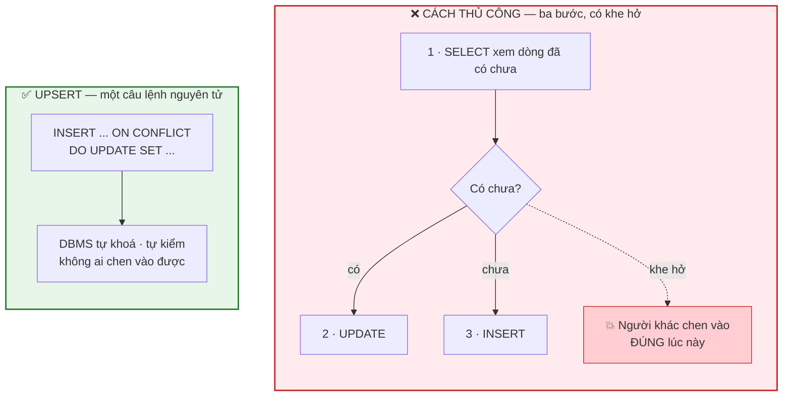
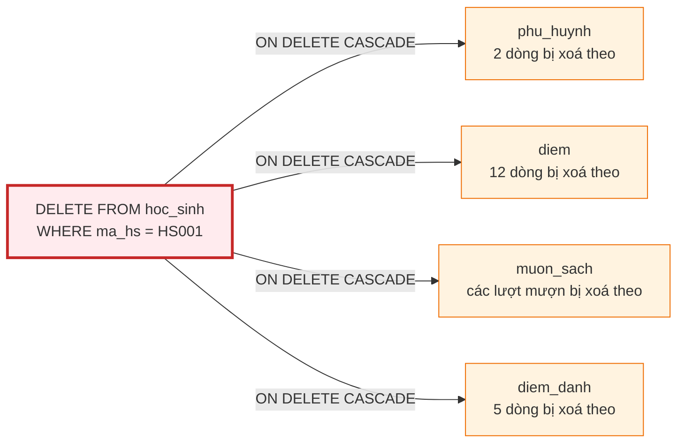

# Bài 23 — DML: INSERT, UPDATE, DELETE

!!! abstract "🎯 Học xong bài này, bạn sẽ"
    - Viết được `INSERT` ở cả bốn dạng: một dòng, nhiều dòng, `INSERT ... SELECT`, và có `RETURNING`
    - Dùng `UPDATE` và `DELETE` an toàn, và hiểu vì sao quên `WHERE` là tai nạn nghề nghiệp phổ biến nhất
    - Viết được `UPSERT` bằng `ON CONFLICT DO UPDATE` — "có thì sửa, chưa có thì thêm"
    - Đọc hiểu lỗi vi phạm khoá ngoại khi `INSERT` và khi `DELETE`, và biết cách xử lý

## 🧠 Câu chuyện mở đầu

Tháng 10, có một bạn chuyển từ trường khác sang lớp 9A3. Cô văn thư mở phần mềm, gõ tên bạn ấy, bấm Lưu. Một dòng mới xuất hiện trong bảng `hoc_sinh`.

Tuần sau, bạn ấy chuyển nhà. Cô sửa lại ô địa chỉ. Một dòng cũ được ghi đè.

Cuối năm, bạn ấy chuyển trường lần nữa. Cô bấm Xoá. Và đây là lúc chuyện trở nên thú vị: **cùng với dòng đó, số điện thoại của bố mẹ bạn ấy, toàn bộ điểm của bạn ấy, và mọi lượt mượn sách của bạn ấy cũng biến mất.** Cô văn thư không hề bấm gì thêm.

Ba hành động đó — thêm, sửa, xoá — là toàn bộ những gì một phần mềm quản lý thật sự làm với dữ liệu. Chúng đơn giản tới mức ai cũng nghĩ mình hiểu rồi. Nhưng chúng cũng là ba hành động **không quay lui được** một khi đã chốt.

Vậy chúng hoạt động thế nào, và làm sao để không xoá nhầm?

## 📖 Khái niệm & thuật ngữ

Ba câu lệnh của bài này thuộc nhóm **DML** mà bạn đã gặp ở [Bài 22](22-ddl-va-kieu-du-lieu.md): chúng đổi **nội dung** bảng, không đụng tới **cấu trúc**.

### `INSERT` — thêm dòng

**`INSERT`** đưa dòng mới vào bảng. Dạng đầy đủ luôn nên ghi rõ **danh sách cột**:

```
INSERT INTO ten_bang (cot1, cot2, ...) VALUES (gia_tri1, gia_tri2, ...);
```

Vì sao nên ghi rõ danh sách cột, dù SQL cho phép bỏ? Vì nếu ai đó thêm một cột mới vào bảng bằng `ALTER TABLE`, mọi câu `INSERT` viết tắt sẽ **âm thầm lệch cột** hoặc gãy. Ghi rõ tên cột là cách tự bảo vệ.

Bốn dạng `INSERT` bạn sẽ dùng:

| Dạng | Khi nào dùng |
|---|---|
| Một dòng | Thêm một bản ghi từ biểu mẫu |
| Nhiều dòng — một `VALUES` nhiều bộ | Nạp dữ liệu hàng loạt; **nhanh hơn nhiều** so với chạy nhiều câu riêng lẻ |
| **`INSERT ... SELECT`** | Chép dữ liệu từ bảng này sang bảng khác, có biến đổi |
| **`RETURNING`** | Lấy lại giá trị vừa được sinh ra — nhất là khoá `SERIAL` |

**`RETURNING`** là một mở rộng rất hữu ích của PostgreSQL (chuẩn SQL không có). Nó biến câu lệnh ghi thành một câu lệnh **vừa ghi vừa trả về kết quả**. Không có nó, sau khi `INSERT` vào bảng có khoá `SERIAL`, bạn sẽ phải chạy thêm một truy vấn nữa chỉ để biết mã vừa được cấp là mấy.

### `UPDATE` — sửa dòng

```
UPDATE ten_bang SET cot1 = gia_tri1, cot2 = gia_tri2 WHERE dieu_kien;
```

Điểm chết người: **`WHERE` là tuỳ chọn về mặt cú pháp.** Bỏ nó đi, câu lệnh vẫn hợp lệ, vẫn chạy — và sửa **toàn bộ** các dòng trong bảng.

### `DELETE` — xoá dòng

```
DELETE FROM ten_bang WHERE dieu_kien;
```

Cũng vậy: `DELETE FROM hoc_sinh;` không có `WHERE` là hợp lệ, và nó xoá sạch 40 dòng.

Khác với `TRUNCATE` ở [Bài 22](22-ddl-va-kieu-du-lieu.md), `DELETE` đi qua **từng dòng**: nó chậm hơn, nhưng nó **kiểm tra khoá ngoại** và **kích hoạt trigger** cho từng dòng. Đó là lý do câu chuyện mở đầu xảy ra: khi cô văn thư xoá một học sinh, các khoá ngoại khai `ON DELETE CASCADE` đã tự động dọn theo phụ huynh, điểm, lượt mượn và điểm danh của bạn ấy.

### `UPSERT` — có thì sửa, chưa có thì thêm

**`UPSERT`** (ghép từ *update* và *insert*) là thao tác: *"thêm dòng này vào; nếu nó đã tồn tại rồi thì cập nhật thay vì báo lỗi."*

Đây là nhu cầu cực kỳ phổ biến — đồng bộ dữ liệu từ hệ thống khác sang, nhập lại một tệp Excel, ghi điểm danh mà không biết hôm nay đã ghi chưa. Nếu không có `UPSERT`, bạn phải tự làm ba bước: `SELECT` xem có chưa → nếu có thì `UPDATE` → nếu chưa thì `INSERT`. Ba bước đó **không an toàn**: giữa bước 1 và bước 3, một người dùng khác hoàn toàn có thể chen vào và thêm đúng dòng đó.

PostgreSQL gộp cả ba bước thành **một** câu lệnh nguyên tử:

```
INSERT INTO t (...) VALUES (...)
ON CONFLICT (cot_khoa) DO UPDATE SET cot = EXCLUDED.cot;
```

- Mệnh đề **`ON CONFLICT (cot_khoa)`** nói: *"nếu đụng ràng buộc duy nhất trên cột này thì..."*. Cột nêu ra phải có `PRIMARY KEY` hoặc `UNIQUE`, vì đó là thứ duy nhất PostgreSQL dùng được để phát hiện đụng độ.
- **`DO UPDATE`** thì sửa dòng đang có; **`DO NOTHING`** thì bỏ qua lặng lẽ, không báo lỗi.
- **`EXCLUDED`** là một bảng ảo chứa **dòng vừa bị từ chối**. Viết `SET dia_chi = EXCLUDED.dia_chi` nghĩa là *"lấy địa chỉ mới mà tôi vừa định thêm vào, ghi đè lên địa chỉ cũ"*.

### Bảng thuật ngữ

| Tiếng Việt | English | Nghĩa dễ hiểu |
|---|---|---|
| Thêm dòng | *insert* | Đưa một hoặc nhiều dòng mới vào bảng |
| Cập nhật | *update* | Sửa giá trị của các dòng **đã có**; không có `WHERE` thì sửa hết bảng |
| Xoá dòng | *delete* | Bỏ các dòng thoả điều kiện; đi qua từng dòng nên kiểm khoá ngoại và chạy trigger |
| Thêm-hoặc-sửa | *upsert* | Thao tác "có thì sửa, chưa có thì thêm", làm gọn trong **một** câu lệnh nguyên tử |
| Bảng ảo dòng bị từ chối | *EXCLUDED* | Bảng ảo trong `ON CONFLICT DO UPDATE`, chứa đúng dòng vừa định thêm nhưng bị đụng độ |
| Trả về sau khi ghi | *RETURNING* | Mệnh đề của PostgreSQL cho `INSERT`/`UPDATE`/`DELETE` trả về các dòng vừa bị tác động |

## 🖼️ Sơ đồ

`UPSERT` gộp ba bước rời rạc thành một bước nguyên tử — và đó là lý do nó an toàn hơn:



Và đây là điều xảy ra khi xoá một học sinh — thứ mà cô văn thư trong câu chuyện không hề thấy:



## 💻 Thực hành

!!! danger "Làm trên BẢN SAO, không làm trên bảng thật"
    `INSERT`, `UPDATE`, `DELETE` đổi dữ liệu thật và **không có nút hoàn tác** sau khi đã chốt.

    Cả phần này thao tác trên bảng `b23_hoc_sinh` — một bản sao nguyên vẹn của `hoc_sinh` — và dọn sạch ở cuối bài. Đây cũng là thói quen nên mang theo khi đi làm: **thử trên bản sao trước.**

### Dựng bản sao để nghịch

```sql
DROP TABLE IF EXISTS b23_hoc_sinh CASCADE;

CREATE TABLE b23_hoc_sinh AS SELECT * FROM hoc_sinh;
ALTER TABLE b23_hoc_sinh ADD PRIMARY KEY (ma_hs);

-- KỲ VỌNG: so_dong = 40
SELECT count(*) AS so_dong FROM b23_hoc_sinh;
```

`CREATE TABLE ... AS SELECT` chép cả cấu trúc cột lẫn dữ liệu, nhưng **không** chép ràng buộc — nên phải tự thêm `PRIMARY KEY` lại. Đó cũng là điều kiện để dùng `ON CONFLICT` ở cuối bài.

### `INSERT` một dòng

```sql
INSERT INTO b23_hoc_sinh (ma_hs, ho_ten, ngay_sinh, gioi_tinh, dia_chi, ma_lop)
VALUES ('HS041', 'Nguyễn Thị Hạnh', '2011-03-08', 'Nữ', '2 Hàng Đào, Hà Nội', 'L06');

-- KỲ VỌNG: so_dong = 41
SELECT count(*) AS so_dong FROM b23_hoc_sinh;
```

### `INSERT` nhiều dòng, kèm `RETURNING`

Một câu lệnh, ba dòng. Cách này nhanh hơn hẳn ba câu riêng lẻ, vì PostgreSQL chỉ phải phân tích câu lệnh và cập nhật chỉ mục một lần.

```sql
INSERT INTO b23_hoc_sinh (ma_hs, ho_ten, ngay_sinh, gioi_tinh, dia_chi, ma_lop) VALUES
('HS042', 'Trần Văn Kiên',  '2011-05-16', 'Nam', '18 Hàng Khay, Hà Nội',  'L05'),
('HS043', 'Lê Thị Mỹ',      '2011-08-02', 'Nữ',  '72 Hàng Bồ, Hà Nội',    'L05'),
('HS044', 'Phạm Minh Tiến', '2011-11-09', 'Nam', '35 Hàng Gà, Hà Nội',    'L06')
RETURNING ma_hs, ho_ten, ma_lop;
```

`RETURNING` in ra đúng ba dòng vừa thêm. Trên bảng có khoá `SERIAL`, đây là cách duy nhất gọn gàng để biết mã vừa được cấp:

```sql
DROP TABLE IF EXISTS b23_nhat_ky CASCADE;

CREATE TABLE b23_nhat_ky (
    ma_nk    SERIAL      PRIMARY KEY,
    noi_dung TEXT        NOT NULL,
    tao_luc  TIMESTAMPTZ NOT NULL DEFAULT now()
);

INSERT INTO b23_nhat_ky (noi_dung)
VALUES ('Nhập 4 học sinh chuyển đến')
RETURNING ma_nk, noi_dung;
```

```sql
-- KỲ VỌNG: ma_nk_dau_tien = 1
SELECT min(ma_nk) AS ma_nk_dau_tien FROM b23_nhat_ky;
```

### `INSERT ... SELECT` — chép từ bảng khác

Giả sử trường mở lớp học thử, và muốn tạo hồ sơ tạm cho toàn bộ học sinh lớp `L01`. Không ai gõ tay sáu dòng cả — ta lấy thẳng từ bảng có sẵn:

```sql
INSERT INTO b23_hoc_sinh (ma_hs, ho_ten, ngay_sinh, gioi_tinh, dia_chi, ma_lop)
SELECT 'HT' || substr(ma_hs, 3, 3),
       ho_ten || ' (học thử)',
       ngay_sinh,
       gioi_tinh,
       dia_chi,
       ma_lop
FROM hoc_sinh
WHERE ma_lop = 'L01';

-- KỲ VỌNG: so_dong = 50
-- KỲ VỌNG: so_dong_hoc_thu = 6
SELECT count(*)                                AS so_dong,
       count(*) FILTER (WHERE ma_hs LIKE 'HT%') AS so_dong_hoc_thu
FROM b23_hoc_sinh;
```

Chú ý: **không có `VALUES`**. Phần sau `INSERT INTO ...` là một câu `SELECT` trọn vẹn, và số cột nó trả về phải khớp đúng danh sách cột ở trên. Đây là chỗ tính khả đóng ở [Bài 21](21-dai-so-quan-he.md) phát huy tác dụng: đầu ra của một truy vấn dùng thẳng làm đầu vào của một câu ghi.

### `UPDATE` có `WHERE`

```sql
UPDATE b23_hoc_sinh
SET dia_chi = '100 Lê Duẩn, Hà Nội'
WHERE ma_hs = 'HS041';

-- KỲ VỌNG: dia_chi = 100 Lê Duẩn, Hà Nội
SELECT dia_chi FROM b23_hoc_sinh WHERE ma_hs = 'HS041';
```

Sửa nhiều cột một lúc, và lấy lại kết quả bằng `RETURNING`:

```sql
UPDATE b23_hoc_sinh
SET ma_lop = 'L04',
    dia_chi = dia_chi || ' — đã chuyển lớp'
WHERE ma_hs IN ('HS042', 'HS043')
RETURNING ma_hs, ho_ten, ma_lop, dia_chi;
```

Để ý `dia_chi = dia_chi || ' — đã chuyển lớp'`: vế phải dùng **giá trị cũ** của chính cột đó. Mọi vế phải trong `SET` đều được tính trên dòng **trước khi** sửa, nên bạn viết `SET a = b, b = a` để hoán đổi hai cột cũng được.

### `UPDATE` quên `WHERE` — xem tận mắt

Lần này ta cố tình gây tai nạn, nhưng gói nó trong một **giao tác** để hoàn tác được. `BEGIN` mở giao tác, `ROLLBACK` huỷ mọi thứ đã làm bên trong:

```sql
BEGIN;

UPDATE b23_hoc_sinh SET ma_lop = 'L01';   -- QUÊN WHERE!

SELECT count(*) AS so_dong_bi_doi
FROM b23_hoc_sinh
WHERE ma_lop = 'L01';                     -- 50: toàn bộ bảng

ROLLBACK;

-- KỲ VỌNG: so_dong_l01 = 12
SELECT count(*) AS so_dong_l01 FROM b23_hoc_sinh WHERE ma_lop = 'L01';
```

Bên trong giao tác, **cả 50 dòng** đều nhảy sang `L01`. Sau `ROLLBACK`, con số trở về 12 — tức 6 học sinh gốc của `L01` cộng 6 bản "học thử". Không mất gì.

!!! tip "Thói quen giữ nghề: viết `WHERE` trước, `SET` sau"
    Nhiều người có kinh nghiệm gõ câu lệnh theo thứ tự này:

    1. Gõ `SELECT * FROM b23_hoc_sinh WHERE ma_hs = 'HS041';` — chạy, **nhìn** xem đúng những dòng mình muốn không.
    2. Chỉ khi đúng rồi mới sửa `SELECT *` thành `UPDATE ... SET ...`.

    Và khi thao tác trên dữ liệu thật, luôn mở `BEGIN;` trước. Nếu số dòng bị tác động khác với dự đoán, gõ `ROLLBACK;`. Chỉ khi đúng mới `COMMIT;`.

### `DELETE`

```sql
DELETE FROM b23_hoc_sinh WHERE ma_hs LIKE 'HT%';

-- KỲ VỌNG: so_dong = 44
SELECT count(*) AS so_dong FROM b23_hoc_sinh;
```

`DELETE` cũng dùng được `RETURNING` — rất hữu ích để **ghi lại** thứ vừa bị xoá:

```sql
DELETE FROM b23_hoc_sinh
WHERE ma_hs = 'HS044'
RETURNING ma_hs, ho_ten, ma_lop;
```

```sql
-- KỲ VỌNG: so_dong = 43
SELECT count(*) AS so_dong FROM b23_hoc_sinh;
```

### `UPSERT` bằng `ON CONFLICT DO UPDATE`

`HS041` đã tồn tại. Câu `INSERT` thường sẽ báo lỗi trùng khoá chính. Với `ON CONFLICT`, nó lặng lẽ chuyển thành `UPDATE`:

```sql
INSERT INTO b23_hoc_sinh (ma_hs, ho_ten, ngay_sinh, gioi_tinh, dia_chi, ma_lop)
VALUES ('HS041', 'Nguyễn Thị Hạnh', '2011-03-08', 'Nữ', '55 Hàng Bạc, Hà Nội', 'L06')
ON CONFLICT (ma_hs) DO UPDATE
SET dia_chi = EXCLUDED.dia_chi;

-- KỲ VỌNG: tong_so_dong = 43
-- KỲ VỌNG: dia_chi_hs041 = 55 Hàng Bạc, Hà Nội
SELECT (SELECT count(*) FROM b23_hoc_sinh)                          AS tong_so_dong,
       (SELECT dia_chi  FROM b23_hoc_sinh WHERE ma_hs = 'HS041')    AS dia_chi_hs041;
```

Số dòng **không đổi** — đúng 43 như trước. Câu lệnh mang chữ `INSERT` nhưng việc nó làm là `UPDATE`.

Đúng câu lệnh ấy, với một mã **chưa tồn tại**, sẽ thêm dòng mới:

```sql
INSERT INTO b23_hoc_sinh (ma_hs, ho_ten, ngay_sinh, gioi_tinh, dia_chi, ma_lop)
VALUES ('HS045', 'Vũ Thị Nga', '2011-02-27', 'Nữ', '8 Hàng Mã, Hà Nội', 'L06')
ON CONFLICT (ma_hs) DO UPDATE
SET dia_chi = EXCLUDED.dia_chi;

-- KỲ VỌNG: tong_so_dong = 44
SELECT count(*) AS tong_so_dong FROM b23_hoc_sinh;
```

**Một câu lệnh, hai hành vi** — đó chính là ý nghĩa của chữ *upsert*.

Biến thể **`DO NOTHING`**: khi trùng thì bỏ qua, im lặng, không báo lỗi và cũng không sửa gì:

```sql
INSERT INTO b23_hoc_sinh (ma_hs, ho_ten, ngay_sinh, gioi_tinh, dia_chi, ma_lop)
VALUES ('HS045', 'TÊN SAI HOÀN TOÀN', '1900-01-01', 'Nam', 'địa chỉ sai', 'L01')
ON CONFLICT (ma_hs) DO NOTHING;

-- KỲ VỌNG: tong_so_dong = 44
-- KỲ VỌNG: ho_ten_hs045 = Vũ Thị Nga
SELECT (SELECT count(*) FROM b23_hoc_sinh)                        AS tong_so_dong,
       (SELECT ho_ten   FROM b23_hoc_sinh WHERE ma_hs = 'HS045')  AS ho_ten_hs045;
```

Dòng rác không vào được, và dữ liệu cũ vẫn nguyên vẹn.

!!! tip "`DO UPDATE` hay `DO NOTHING`?"
    - **`DO UPDATE`** khi dòng mới **mới hơn và đáng tin hơn** dòng cũ — đồng bộ từ hệ thống nguồn về, nhập lại bảng điểm đã sửa.
    - **`DO NOTHING`** khi dòng cũ **đáng tin hơn**, hoặc khi bạn chỉ cần bảo đảm "dòng này phải tồn tại" mà không quan tâm nội dung — ví dụ ghi một sự kiện có thể bị gửi trùng.

### Vi phạm khoá ngoại

Hai lỗi dưới đây bạn sẽ gặp rất nhiều. Chúng **cố ý sai** để bạn nhìn thấy thông báo lỗi.

Lỗi thứ nhất: thêm dòng con mà dòng cha không tồn tại.

<!-- sql:co-y-loi -->
```sql
INSERT INTO hoc_sinh (ma_hs, ho_ten, ngay_sinh, gioi_tinh, dia_chi, ma_lop)
VALUES ('HS099', 'Học Sinh Ma', '2011-01-01', 'Nam', 'không có thật', 'L99');
```

PostgreSQL từ chối với lỗi vi phạm ràng buộc khoá ngoại `hoc_sinh_ma_lop_fkey`: không có lớp nào mang mã `L99`. Đây chính là **toàn vẹn tham chiếu** ở [Bài 15](../cap-1-mo-hinh-er/15-rang-buoc-toan-ven.md) đang làm việc — nó chặn một học sinh "mồ côi lớp".

Lỗi thứ hai: xoá dòng cha khi vẫn còn dòng con.

<!-- sql:co-y-loi -->
```sql
DELETE FROM lop WHERE ma_lop = 'L01';
```

Cũng bị từ chối, vì khoá ngoại `hoc_sinh.ma_lop` được khai `ON DELETE RESTRICT`: còn học sinh trong lớp thì không cho xoá lớp. Muốn xoá thật, bạn phải **chuyển học sinh sang lớp khác trước**, rồi mới xoá lớp.

So sánh với `phu_huynh`, vốn khai `ON DELETE CASCADE`: câu dưới đây **chạy được**, nhưng nó kéo theo cả phụ huynh, điểm, lượt mượn, điểm danh của bạn ấy. Đó chính là câu chuyện mở đầu.

<!-- sql:khong-chay -->
```sql
-- ĐỪNG chạy trên database khoá học — sẽ làm hỏng dữ liệu mẫu của mọi bài sau
DELETE FROM hoc_sinh WHERE ma_hs = 'HS001';
```

!!! warning "`CASCADE` không hỏi lại"
    `RESTRICT` bảo vệ bạn bằng cách **từ chối**. `CASCADE` thì âm thầm **làm nhiều hơn bạn gõ**.

    Vì thế [Bài 15](../cap-1-mo-hinh-er/15-rang-buoc-toan-ven.md) mới chốt: chỉ dùng `CASCADE` cho quan hệ **thực thể yếu** — thứ mà bản thân nó vô nghĩa nếu không có dòng cha. Phụ huynh của một học sinh không còn trong trường thì đúng là không còn ý nghĩa gì; nhưng điểm của bạn ấy thì có thể vẫn cần cho hồ sơ lưu trữ, và đó là một quyết định nghiệp vụ phải cân nhắc.

### Dọn dẹp và kiểm tra dữ liệu thật còn nguyên

```sql
DROP TABLE IF EXISTS b23_hoc_sinh CASCADE;
DROP TABLE IF EXISTS b23_nhat_ky  CASCADE;

-- KỲ VỌNG: so_hoc_sinh = 40
-- KỲ VỌNG: so_lop = 6
-- KỲ VỌNG: so_phu_huynh = 45
-- KỲ VỌNG: so_bang_nhap_con_lai = 0
SELECT (SELECT count(*) FROM hoc_sinh)  AS so_hoc_sinh,
       (SELECT count(*) FROM lop)       AS so_lop,
       (SELECT count(*) FROM phu_huynh) AS so_phu_huynh,
       (SELECT count(*) FROM information_schema.tables
        WHERE table_name LIKE 'b23\_%') AS so_bang_nhap_con_lai;
```

Mười bảng thật vẫn nguyên vẹn — vì chúng ta chưa bao giờ chạm vào chúng.

## ⚠️ Lỗi thường gặp

!!! danger "Lỗi 1: `UPDATE` hoặc `DELETE` quên `WHERE`"
    Đây là tai nạn nghề nghiệp kinh điển, và nó **không báo lỗi gì cả**. Câu lệnh chạy thành công, chỉ là nó sửa 500.000 dòng thay vì 1 dòng.

    Ba lớp phòng vệ, nên dùng cả ba:

    1. **Chạy `SELECT` trước.** Đổi `UPDATE ... SET` thành `SELECT *` với đúng mệnh đề `WHERE` đó, nhìn kết quả, rồi mới sửa lại.
    2. **Luôn `BEGIN;` trước khi ghi trên dữ liệu thật.** Nếu số dòng báo về khác dự đoán thì `ROLLBACK;`.
    3. **Đọc số dòng mà PostgreSQL báo về.** `UPDATE 1` là đúng ý; `UPDATE 40` khi bạn định sửa một bạn học sinh là chuông báo động.

!!! warning "Lỗi 2: `INSERT` không ghi danh sách cột"
    <!-- sql:khong-chay -->
    ```sql
    INSERT INTO hoc_sinh VALUES ('HS099', 'Tên', '2011-01-01', 'Nam', 'đ/c', 'L01');
    ```

    Câu này chạy được **hôm nay**. Nhưng ngày mai có người chạy `ALTER TABLE hoc_sinh ADD COLUMN email VARCHAR(80);`, và câu lệnh trên gãy — hoặc tệ hơn, nếu cột mới được chèn vào giữa thì các giá trị **lệch cột** mà vẫn hợp kiểu, và dữ liệu sai lặng lẽ đi vào.

    Luôn viết `INSERT INTO hoc_sinh (ma_hs, ho_ten, ...) VALUES (...)`.

!!! warning "Lỗi 3: Dùng `ON CONFLICT` trên cột không có ràng buộc duy nhất"
    <!-- sql:khong-chay -->
    ```sql
    INSERT INTO hoc_sinh (...) VALUES (...)
    ON CONFLICT (ho_ten) DO UPDATE SET dia_chi = EXCLUDED.dia_chi;
    ```

    PostgreSQL sẽ báo lỗi đại ý *"không có ràng buộc duy nhất hay index loại trừ nào khớp với đặc tả `ON CONFLICT`"*.

    Lý do rất hợp lý: nếu `ho_ten` có thể trùng, thì khi đụng độ, DBMS biết phải `UPDATE` **dòng nào** trong số các dòng trùng tên? Không có câu trả lời, nên nó từ chối.

    `ON CONFLICT` chỉ làm việc với `PRIMARY KEY`, `UNIQUE`, hoặc index loại trừ.

!!! warning "Lỗi 4: Tưởng `EXCLUDED` là dòng cũ"
    Tên gọi dễ gây hiểu lầm. **`EXCLUDED` là dòng MỚI** — dòng bạn vừa định thêm vào nhưng bị từ chối ("bị loại ra"). Dòng cũ đang nằm trong bảng thì gọi bằng **tên bảng**.

    Nên `SET dia_chi = EXCLUDED.dia_chi` nghĩa là *"lấy giá trị mới ghi đè lên giá trị cũ"*. Còn muốn giữ giá trị cũ khi giá trị mới rỗng, viết:

    <!-- sql:khong-chay -->
    ```sql
    ON CONFLICT (ma_hs) DO UPDATE
    SET dia_chi = COALESCE(EXCLUDED.dia_chi, b23_hoc_sinh.dia_chi);
    ```

!!! warning "Lỗi 5: Xoá dòng cha rồi ngạc nhiên vì mất dữ liệu ở bảng khác"
    `ON DELETE CASCADE` không hỏi lại và không cảnh báo. Một câu `DELETE` trên `hoc_sinh` có thể quét sạch hàng chục dòng ở bốn bảng khác.

    Trước khi xoá dòng cha, hãy đếm xem có bao nhiêu dòng con sẽ đi theo:

    ```sql
    -- KỲ VỌNG: so_phu_huynh = 2
    -- KỲ VỌNG: so_diem = 12
    -- KỲ VỌNG: so_diem_danh = 5
    SELECT (SELECT count(*) FROM phu_huynh WHERE ma_hs = 'HS001') AS so_phu_huynh,
           (SELECT count(*) FROM diem      WHERE ma_hs = 'HS001') AS so_diem,
           (SELECT count(*) FROM diem_danh WHERE ma_hs = 'HS001') AS so_diem_danh;
    ```

    Xoá `HS001` sẽ kéo theo **19 dòng** ở ba bảng này, cộng với các lượt mượn sách. Biết trước con số đó rồi mới quyết định.

## ✍️ Bài tập

1. Viết một câu `INSERT` thêm môn học mới `MH10 — Giáo dục công dân`, 2 tiết mỗi tuần, vào bảng `mon_hoc`. (Chỉ viết, đừng chạy trên database khoá học.)

2. Viết câu lệnh nâng lương thêm 10% cho mọi giáo viên có **chuyên môn** là `Toán` (cột `giao_vien.mon_chuyen_mon`). Giải thích vì sao phải viết `luong * 1.1` chứ không phải một con số cụ thể.

3. Câu lệnh sau có gì nguy hiểm? Viết lại cho an toàn.

    <!-- sql:khong-chay -->
    ```sql
    DELETE FROM diem WHERE hoc_ky = 1;
    ```

4. Cô thủ thư nhận một tệp Excel ghi lại các lượt mượn sách. Tệp này có thể chứa những lượt đã được nhập từ hôm trước. Mỗi lượt có mã `ma_muon` duy nhất. Hãy viết khung câu lệnh để nhập tệp này mà **không** bị lỗi trùng khoá, và giải thích bạn chọn `DO UPDATE` hay `DO NOTHING`.

5. Trên bản sao `b23_hoc_sinh`, hãy viết một câu lệnh chuyển toàn bộ học sinh lớp `L06` sang lớp `L05` và trả về danh sách các bạn vừa chuyển. Nếu chỉ được chạy **một** câu lệnh duy nhất, làm thế nào để vừa chuyển vừa biết ai đã chuyển?

??? success "Đáp án"
    **Câu 1.**

    <!-- sql:khong-chay -->
    ```sql
    INSERT INTO mon_hoc (ma_mon, ten_mon, so_tiet_tuan)
    VALUES ('MH10', 'Giáo dục công dân', 2);
    ```

    Ghi rõ danh sách ba cột, dù bảng chỉ có đúng ba cột — để câu lệnh không gãy khi ai đó thêm cột thứ tư.

    Lưu ý `so_tiet_tuan` có ràng buộc `CHECK (so_tiet_tuan BETWEEN 1 AND 10)`, nên giá trị `2` hợp lệ; thử ghi `0` hoặc `15` sẽ bị từ chối.

    **Câu 2.**

    <!-- sql:khong-chay -->
    ```sql
    UPDATE giao_vien
    SET luong = luong * 1.1
    WHERE mon_chuyen_mon = 'Toán';
    ```

    Phải viết `luong * 1.1` vì **mỗi giáo viên có mức lương khác nhau**. Nếu viết một con số cụ thể, ví dụ `SET luong = 15950000`, thì tất cả giáo viên Toán sẽ bị gán **cùng một** mức lương — vừa sai, vừa xoá mất thông tin về chênh lệch giữa họ.

    Đây là điểm mạnh của `UPDATE`: vế phải của `SET` là một **biểu thức** được tính lại trên từng dòng, không phải một hằng số.

    !!! note "Vì sao đề bài nói *chuyên môn* chứ không nói *dạy môn*?"
        Hai chuyện đó khác nhau trong lược đồ này, và lẫn chúng là một lỗi nghiệp vụ thật.

        `giao_vien.mon_chuyen_mon` là **môn được đào tạo để dạy** — một thuộc tính của bản thân giáo viên. Còn *"ai đang thực sự dạy môn nào cho lớp nào"* nằm ở bảng `phan_cong_day`.

        Nếu đề bài là *"nâng lương cho mọi giáo viên **đang được phân công dạy** môn Toán"* thì câu lệnh phải đi qua bảng phân công, và kết quả có thể khác:

        <!-- sql:khong-chay -->
        ```sql
        UPDATE giao_vien g
        SET luong = luong * 1.1
        WHERE EXISTS (
            SELECT 1 FROM phan_cong_day pc
            JOIN mon_hoc m ON m.ma_mon = pc.ma_mon
            WHERE pc.ma_gv = g.ma_gv AND m.ten_mon = 'Toán'
        );
        ```

        (`EXISTS` là nội dung của **Bài 27**, *sắp có*.) Trong dữ liệu mẫu hai cách cho cùng một người, vì mỗi giáo viên chỉ được phân công đúng môn chuyên môn của mình — nhưng lược đồ **không** ép điều đó, nên đừng dựa vào nó.

    **Câu 3.**

    Nguy hiểm vì **toàn bộ 480 dòng điểm trong database mẫu đều có `hoc_ky = 1`**. Câu lệnh tưởng là "chỉ xoá học kỳ 1" thực ra xoá sạch bảng điểm.

    Bài học tổng quát: `WHERE` chỉ an toàn khi bạn **biết nó lọc ra bao nhiêu dòng**. Cách kiểm tra:

    ```sql
    -- KỲ VỌNG: so_dong_se_bi_xoa = 480
    -- KỲ VỌNG: tong_so_dong = 480
    SELECT (SELECT count(*) FROM diem WHERE hoc_ky = 1) AS so_dong_se_bi_xoa,
           (SELECT count(*) FROM diem)                   AS tong_so_dong;
    ```

    Hai con số bằng nhau — đó là tín hiệu dừng lại. Cách viết an toàn là thu hẹp điều kiện cho tới khi số dòng đúng với ý định, ví dụ `WHERE hoc_ky = 1 AND loai_diem = '15 phút' AND ngay_nhap < DATE '2025-09-01'`, và luôn bọc trong `BEGIN; ... ROLLBACK;` để thử trước.

    **Câu 4.**

    <!-- sql:khong-chay -->
    ```sql
    INSERT INTO muon_sach (ma_muon, ma_hs, ma_sach, ngay_muon, ngay_tra_du_kien, ngay_tra_thuc_te)
    VALUES (...)
    ON CONFLICT (ma_muon) DO UPDATE
    SET ngay_tra_thuc_te = EXCLUDED.ngay_tra_thuc_te;
    ```

    Chọn **`DO UPDATE`**, và chỉ cập nhật đúng cột `ngay_tra_thuc_te`.

    Lý do: tệp Excel mới **có thêm thông tin** mà bản ghi cũ chưa có — một cuốn sách hôm trước còn `NULL` (chưa trả) thì hôm nay có thể đã được trả. Nếu chọn `DO NOTHING`, thông tin trả sách sẽ không bao giờ vào được database.

    Còn vì sao không cập nhật cả `ma_hs`, `ma_sach`, `ngay_muon`? Vì ba cột đó mô tả **sự kiện gốc** — nó đã xảy ra rồi và không thay đổi. Chỉ cập nhật những cột thật sự có thể biến động là một thói quen tốt: nó giới hạn thiệt hại khi tệp nguồn có lỗi.

    **Câu 5.**

    ```sql
    DROP TABLE IF EXISTS b23_hoc_sinh CASCADE;
    CREATE TABLE b23_hoc_sinh AS SELECT * FROM hoc_sinh;

    UPDATE b23_hoc_sinh
    SET ma_lop = 'L05'
    WHERE ma_lop = 'L06'
    RETURNING ma_hs, ho_ten, ma_lop;
    ```

    **`RETURNING` chính là câu trả lời** cho vế sau: nó cho phép một câu lệnh vừa ghi vừa trả kết quả, nên bạn không cần chạy `SELECT` trước đó — mà cũng không nên, vì giữa hai câu lệnh riêng lẻ luôn có khe hở để người khác chen vào sửa dữ liệu.

    Kiểm lại rồi dọn:

    ```sql
    -- KỲ VỌNG: so_l06_con_lai = 0
    -- KỲ VỌNG: so_l05 = 14
    SELECT count(*) FILTER (WHERE ma_lop = 'L06') AS so_l06_con_lai,
           count(*) FILTER (WHERE ma_lop = 'L05') AS so_l05
    FROM b23_hoc_sinh;
    ```

    `L05` có 7 bạn sẵn cộng 7 bạn từ `L06` chuyển sang, thành 14.

    ```sql
    DROP TABLE IF EXISTS b23_hoc_sinh CASCADE;

    -- KỲ VỌNG: so_hoc_sinh_that = 40
    SELECT count(*) AS so_hoc_sinh_that FROM hoc_sinh;
    ```

## 🔑 Tóm tắt

1. **`INSERT`** có bốn dạng: một dòng, nhiều dòng trong một `VALUES` (nhanh hơn hẳn), **`INSERT ... SELECT`** để chép từ bảng khác, và kèm **`RETURNING`** để lấy lại giá trị vừa được sinh. Luôn ghi rõ danh sách cột.
2. **`UPDATE`** và **`DELETE`** không bắt buộc có `WHERE` — và đó là tai nạn nghề nghiệp phổ biến nhất, vì câu lệnh sai vẫn chạy thành công. Ba lớp phòng vệ: chạy `SELECT` trước, bọc trong `BEGIN; ... ROLLBACK;`, và đọc số dòng PostgreSQL báo về.
3. Vế phải của `SET` là một **biểu thức tính trên từng dòng**, nên `SET luong = luong * 1.1` nâng lương theo tỉ lệ cho mỗi người một khác — chứ không gán tất cả về cùng một số.
4. **`UPSERT`** — `INSERT ... ON CONFLICT (cot_khoa) DO UPDATE SET ... = EXCLUDED....` — gộp "kiểm tra, sửa, thêm" thành **một câu lệnh nguyên tử**, không có khe hở cho người khác chen vào. Cột nêu trong `ON CONFLICT` bắt buộc phải có `PRIMARY KEY` hoặc `UNIQUE`; **`EXCLUDED` là dòng MỚI**, không phải dòng cũ.
5. `DELETE` kiểm khoá ngoại theo **từng dòng**: `ON DELETE RESTRICT` chặn bạn lại, còn `ON DELETE CASCADE` âm thầm xoá theo ở các bảng con. Trước khi xoá dòng cha, hãy **đếm trước** số dòng con sẽ đi theo.

---

⬅️ [Bài 22 — DDL: CREATE, ALTER, DROP và các kiểu dữ liệu](22-ddl-va-kieu-du-lieu.md) · ➡️ [Bài 24 — SELECT, WHERE, ORDER BY, LIMIT](24-select-where-order-by.md)
