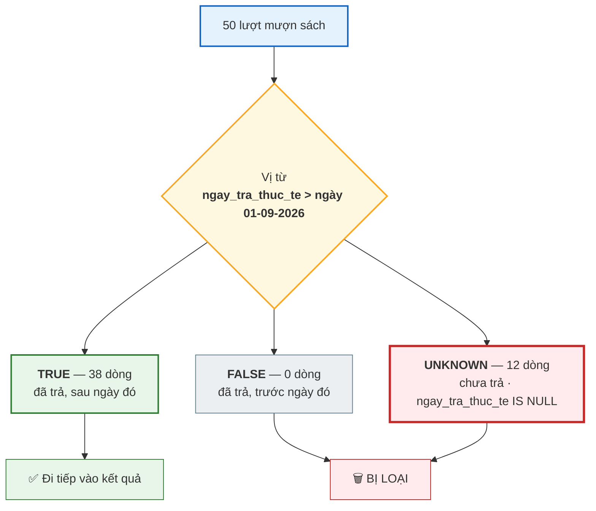
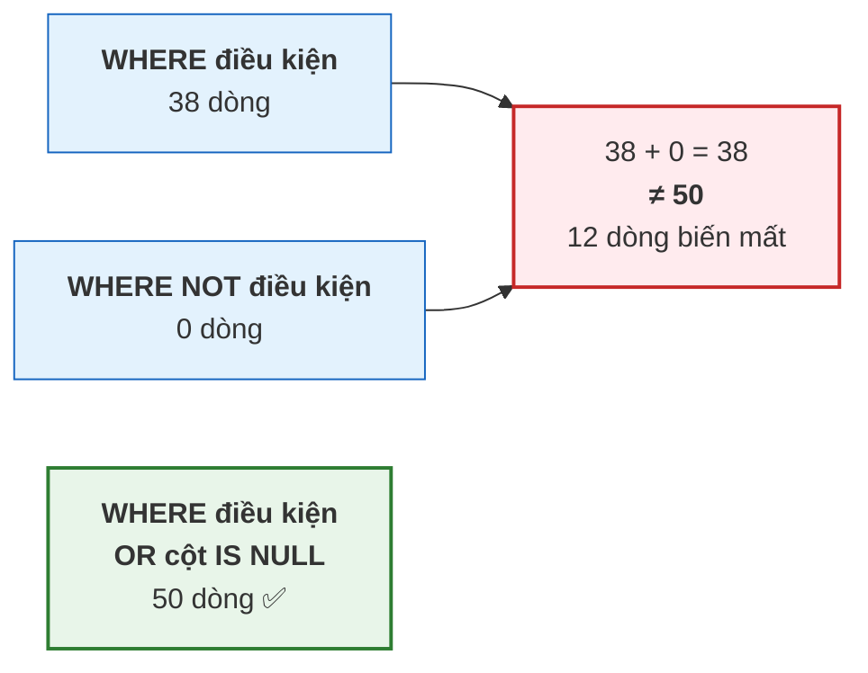

# Bài 24 — SELECT, WHERE, ORDER BY, LIMIT

!!! abstract "🎯 Học xong bài này, bạn sẽ"
    - Viết được một câu `SELECT` đầy đủ: chọn cột, đặt **bí danh**, lọc bằng `WHERE`, sắp xếp, cắt trang
    - Dùng thành thạo bảy loại **vị từ**: so sánh, `BETWEEN`, `IN`, `LIKE`/`ILIKE`, `IS NULL`, và `AND`/`OR`/`NOT`
    - Giải thích được **logic ba giá trị** và giá trị `UNKNOWN` — cái bẫy số một của người mới học SQL
    - Biết vì sao `WHERE diem_so <> 10` lại **làm biến mất** những dòng có `diem_so` là `NULL`
    - Điều khiển được vị trí của `NULL` khi sắp xếp, bằng `NULLS FIRST` / `NULLS LAST`

## 🧠 Câu chuyện mở đầu

Cô thủ thư nhờ bạn kiểm tra sổ mượn sách. Trong sổ có 50 lượt mượn. Cột *"ngày trả thực tế"* của một số lượt đang **để trống** — nghĩa là sách chưa được mang trả.

Cô hỏi: *"Em lọc giúp cô những lượt mà ngày trả **khác** ngày 10 tháng 9 nhé."*

Bạn viết một câu lệnh rất hiển nhiên: lấy mọi dòng có ngày trả khác `10/09`. Máy trả về một danh sách. Bạn đưa cô. Cô đếm và nhíu mày: *"Sao thiếu mất mấy lượt thế em? Cô nhớ là có hơn thế cơ mà."*

Bạn kiểm lại. Đúng là thiếu. Và thứ bị thiếu chính là **những lượt đang để trống ngày trả** — những cuốn sách chưa ai mang trả về.

Nhưng khoan đã. Một ô **để trống** thì rõ ràng là "khác ngày 10 tháng 9" chứ còn gì nữa? Sao máy lại bỏ chúng ra?

Đây không phải lỗi của máy. Đây là chỗ mà SQL hành xử theo một logic **không phải hai giá trị đúng/sai** như bạn học ở môn Toán. Và nếu không biết điều đó, bạn sẽ còn bị nó lừa nhiều lần nữa.

## 📖 Khái niệm & thuật ngữ

### Khung xương của một câu `SELECT`

```
SELECT   [DISTINCT] <danh sách cột>      -- phép chiếu π
FROM     <bảng>
WHERE    <vị từ>                          -- phép chọn σ
ORDER BY <cột> [ASC|DESC] [NULLS FIRST|LAST]
LIMIT    <n> OFFSET <m>
```

Nối lại với [Bài 21](21-dai-so-quan-he.md): `SELECT` là **phép chiếu π**, `WHERE` là **phép chọn σ**. Còn `ORDER BY` và `LIMIT` thì **không** có trong đại số quan hệ — chúng là phần SQL tự thêm vào, vì kết quả trên màn hình thì cần thứ tự, còn tập hợp trong toán thì không.

- **`SELECT`** nêu các cột cần lấy. Dấu `*` nghĩa là "mọi cột".
- **Bí danh** (*alias*) là tên tạm đặt cho một cột hoặc một bảng bằng từ khoá `AS`. Nó chính là phép **ρ** (đổi tên) ở Bài 21. Bí danh cột làm tiêu đề kết quả dễ đọc; bí danh bảng làm câu lệnh ngắn lại và là điều **bắt buộc** khi ghép một bảng với chính nó.
- **`DISTINCT`** bỏ các dòng kết quả trùng nhau. Nhớ lại Bài 21: nó là thứ biến "phép chiếu của đa tập" thành đúng **phép chiếu π** của toán học.
- **`WHERE`** nhận một **vị từ**.
- **`LIMIT n`** giới hạn số dòng trả về; **`OFFSET m`** bỏ qua `m` dòng đầu. Hai cái đi cùng nhau tạo nên **phân trang** (*pagination*) của mọi trang web bạn từng dùng.

### Vị từ

**Vị từ** (*predicate*) là một biểu thức trả về giá trị chân lý: `TRUE`, `FALSE`, hoặc — và đây là chỗ bất ngờ — `UNKNOWN`.

`WHERE` giữ lại **duy nhất** những dòng làm vị từ trả về `TRUE`. Dòng nào cho `FALSE` bị loại. **Dòng nào cho `UNKNOWN` cũng bị loại.**

Bảy loại vị từ bạn sẽ dùng hằng ngày:

| Vị từ | Ví dụ | Nghĩa |
|---|---|---|
| So sánh | `luong > 15000000` | `=`, `<>`, `<`, `>`, `<=`, `>=` |
| **`BETWEEN`** | `khoi BETWEEN 6 AND 9` | Trong khoảng, **tính cả hai đầu mút** |
| **`IN`** | `ma_lop IN ('L01', 'L02')` | Thuộc một danh sách cho trước |
| **`LIKE`** | `ho_ten LIKE 'Nguyễn%'` | Khớp mẫu chuỗi, **phân biệt hoa thường** |
| **`ILIKE`** | `ho_ten ILIKE 'nguyễn%'` | Như `LIKE` nhưng **không** phân biệt hoa thường |
| **`IS NULL`** | `ngay_tra_thuc_te IS NULL` | Ô có rỗng hay không |
| `AND` / `OR` / `NOT` | `gioi_tinh = 'Nữ' AND khoi = 9` | Ghép các vị từ lại |

Trong `LIKE`, hai ký tự đại diện: **`%`** thay cho *không hoặc nhiều* ký tự bất kỳ, **`_`** thay cho *đúng một* ký tự.

### Logic ba giá trị — phần quan trọng nhất của bài

Ở môn Toán, một mệnh đề chỉ có hai khả năng: đúng hoặc sai. SQL thì có **ba**.

**Logic ba giá trị** (*three-valued logic*) là hệ logic mà một biểu thức có thể nhận `TRUE`, `FALSE`, hoặc **chưa biết** (*UNKNOWN*).

Vì sao phải có giá trị thứ ba? Vì `NULL` không phải là một giá trị — nó là **sự vắng mặt của giá trị**. Nó nghĩa là *"chỗ này chưa biết"* hoặc *"chỗ này không áp dụng"*.

Bây giờ hãy nghĩ như một nhà logic học. Ô "ngày trả thực tế" của một lượt mượn đang **chưa biết**. Vậy mệnh đề *"ngày trả khác ngày 10 tháng 9"* đúng hay sai?

**Không trả lời được.** Vì chưa biết ngày trả là ngày nào, nên cũng chưa biết nó có khác 10/9 hay không. Kết quả là `UNKNOWN`.

Và vì `WHERE` chỉ giữ dòng cho `TRUE`, dòng đó **bị loại**. Máy không sai. Máy đang rất trung thực: *"tôi không dám khẳng định dòng này thoả điều kiện, nên tôi không đưa nó cho bạn."*

!!! danger "Quy tắc vàng: mọi phép so sánh với `NULL` đều cho `UNKNOWN`"
    `NULL = 5` → `UNKNOWN`. `NULL <> 5` → `UNKNOWN`. `NULL > 5` → `UNKNOWN`.

    Kể cả `NULL = NULL` cũng là `UNKNOWN` — vì hai thứ đều chưa biết thì làm sao khẳng định chúng bằng nhau?

    Đó là lý do phải có toán tử riêng **`IS NULL`** và **`IS NOT NULL`**. Chỉ hai toán tử này mới trả về `TRUE`/`FALSE` thật sự khi gặp `NULL`.

Ba bảng chân lý của logic ba giá trị:

**Phép `AND`** — chỉ cần một vế `FALSE` là cả biểu thức `FALSE`:

| `AND` | TRUE | FALSE | UNKNOWN |
|---|---|---|---|
| **TRUE** | TRUE | FALSE | **UNKNOWN** |
| **FALSE** | FALSE | FALSE | **FALSE** |
| **UNKNOWN** | UNKNOWN | **FALSE** | UNKNOWN |

**Phép `OR`** — chỉ cần một vế `TRUE` là cả biểu thức `TRUE`:

| `OR` | TRUE | FALSE | UNKNOWN |
|---|---|---|---|
| **TRUE** | TRUE | TRUE | **TRUE** |
| **FALSE** | TRUE | FALSE | **UNKNOWN** |
| **UNKNOWN** | **TRUE** | UNKNOWN | UNKNOWN |

**Phép `NOT`** — và đây là ô đáng nhớ nhất cả bài:

| `NOT` | Kết quả |
|---|---|
| TRUE | FALSE |
| FALSE | TRUE |
| **UNKNOWN** | **UNKNOWN** |

Hãy dừng lại ở dòng cuối. `NOT UNKNOWN` vẫn là `UNKNOWN`. Phủ định một điều chưa biết thì vẫn chưa biết.

Hệ quả rất cụ thể: trong logic hai giá trị, `A` và `NOT A` chia đôi toàn bộ dữ liệu — cộng lại phải ra đủ. Trong SQL **điều đó không còn đúng**. Những dòng cho `UNKNOWN` rơi ra khỏi **cả hai** phía. Bạn sẽ thấy tận mắt ở phần thực hành.

### Sắp xếp và `NULL`

`NULL` không lớn hơn cũng không nhỏ hơn giá trị nào. Nên khi sắp xếp, PostgreSQL phải tự quy ước — và quy ước là: **`NULL` được coi là lớn nhất**.

| Câu lệnh | `NULL` nằm ở đâu |
|---|---|
| `ORDER BY c ASC` | **Cuối** — vì `NULL` lớn nhất |
| `ORDER BY c DESC` | **Đầu** — vì `NULL` lớn nhất |
| `ORDER BY c NULLS FIRST` | Đầu, bất kể `ASC` hay `DESC` |
| `ORDER BY c NULLS LAST` | Cuối, bất kể `ASC` hay `DESC` |

**`NULLS FIRST`** và **`NULLS LAST`** cho bạn quyền quyết định thay vì nhận mặc định. Với danh sách "sách chưa trả", đưa `NULL` lên đầu thường mới là điều cô thủ thư muốn thấy.

### Bảng thuật ngữ

| Tiếng Việt | English | Nghĩa dễ hiểu |
|---|---|---|
| Bí danh | *alias* | Tên tạm đặt cho cột hoặc bảng bằng `AS` — chính là phép ρ của đại số quan hệ |
| Vị từ | *predicate* | Biểu thức trong `WHERE` trả về `TRUE`, `FALSE` hoặc `UNKNOWN` |
| Logic ba giá trị | *three-valued logic* | Hệ logic của SQL, có thêm giá trị thứ ba `UNKNOWN` bên cạnh `TRUE` và `FALSE` |
| Chưa biết | *UNKNOWN* | Giá trị chân lý thứ ba, sinh ra mỗi khi so sánh với `NULL`; `WHERE` **loại bỏ** mọi dòng cho `UNKNOWN` |
| Không phân biệt được | *not distinct* | Quan hệ mà `DISTINCT`, `GROUP BY` và các phép tập hợp dùng **thay cho** `=`: hai `NULL` là không phân biệt được nên bị gộp thành một |
| Phân trang | *pagination* | Cắt kết quả thành từng trang bằng `LIMIT` và `OFFSET` |

## 🖼️ Sơ đồ

`WHERE` chia dữ liệu làm **ba** rổ chứ không phải hai — và chỉ rổ `TRUE` được đi tiếp:



Cùng một dữ liệu, ba câu lệnh, ba kết quả — và tổng của hai câu đầu **không** ra câu thứ ba:



## 💻 Thực hành

### Chọn cột và đặt bí danh

```sql
-- KỲ VỌNG: 6 dòng
SELECT ma_hs     AS ma,
       ho_ten    AS ten_hoc_sinh,
       ngay_sinh AS sinh_ngay
FROM hoc_sinh
WHERE ma_lop = 'L01'
ORDER BY ma_hs;
```

Bí danh cho **bảng** thì dùng nhiều hơn nữa, vì nó rút ngắn mọi thứ phía sau:

```sql
-- KỲ VỌNG: 6 dòng
SELECT h.ma_hs, h.ho_ten
FROM hoc_sinh AS h
WHERE h.ma_lop = 'L01'
ORDER BY h.ma_hs;
```

Từ khoá `AS` có thể bỏ (`FROM hoc_sinh h`), nhưng viết rõ ra thì dễ đọc hơn.

### `DISTINCT`

```sql
-- KỲ VỌNG: 6 dòng
SELECT DISTINCT ma_lop
FROM hoc_sinh
ORDER BY ma_lop;
```

`DISTINCT` xét **toàn bộ danh sách cột** chứ không riêng cột đầu:

```sql
-- KỲ VỌNG: 12 dòng
SELECT DISTINCT ma_lop, gioi_tinh
FROM hoc_sinh
ORDER BY ma_lop, gioi_tinh;
```

Sáu lớp × hai giới tính, và cả 12 tổ hợp đều có thật trong dữ liệu.

!!! danger "Chỗ DUY NHẤT mà `NULL` **không** cư xử như phần còn lại của bài này"
    Cả bài này nói một điều: **`NULL = NULL` cho `UNKNOWN`**, hai giá trị chưa biết không khẳng định được là bằng nhau.

    Nhưng `DISTINCT` thì **coi mọi `NULL` là BẰNG NHAU** và gộp chúng thành **một** dòng duy nhất.

    Nghe như tự mâu thuẫn, nhưng không: `DISTINCT` không dùng phép so sánh `=`. Nó dùng một quan hệ khác — thứ mà SQL gọi là **không phân biệt được** (*not distinct*), chính là toán tử `IS NOT DISTINCT FROM` mà bạn sẽ gặp ở phần sau. Với quan hệ đó, `NULL` và `NULL` là **không phân biệt được**, nên chúng bị gộp.

    Cột `lop.ma_gvcn` có 5 giá trị thật cộng 1 ô rỗng (lớp `9A3`), và `DISTINCT` cho ra **6** dòng chứ không phải 5:

    ```sql
    -- KỲ VỌNG: 6 dòng
    SELECT DISTINCT ma_gvcn
    FROM lop
    ORDER BY ma_gvcn NULLS LAST;
    ```

    Một dòng trong số đó là `NULL`. Nếu `DISTINCT` dùng `=` thì hai `NULL` sẽ không bao giờ khớp nhau và kết quả phải là 5 giá trị thật cộng **mỗi ô rỗng một dòng riêng** — tức 6 ở đây chỉ là tình cờ, vì `lop` chỉ có một ô rỗng. Kiểm bằng một cột có **nhiều** ô rỗng thì thấy rõ:

    ```sql
    -- KỲ VỌNG: so_gia_tri_phan_biet = 27
    -- KỲ VỌNG: so_gia_tri_that = 26
    -- KỲ VỌNG: so_dong_null = 12
    SELECT count(*)                            AS so_gia_tri_phan_biet,
           count(*) FILTER (WHERE d IS NOT NULL) AS so_gia_tri_that,
           (SELECT count(*) FROM muon_sach WHERE ngay_tra_thuc_te IS NULL) AS so_dong_null
    FROM (SELECT DISTINCT ngay_tra_thuc_te AS d FROM muon_sach) AS t;
    ```

    **12 dòng rỗng bị gộp thành đúng 1**: 26 ngày trả phân biệt cộng 1 dòng `NULL` = 27. (Bảng có 38 lượt đã trả nhưng chỉ 26 ngày khác nhau — nhiều cuốn được trả cùng ngày.)

    Quy tắc chung — và `DISTINCT` không phải ngoại lệ duy nhất. Bảng này đáng học thuộc:

    | Chỗ | `NULL` cư xử thế nào |
    |---|---|
    | `WHERE`, `ON`, `CHECK`, `HAVING` — mọi **vị từ** | `NULL = NULL` là `UNKNOWN`, dòng bị loại |
    | `DISTINCT` | Mọi `NULL` **bằng nhau**, gộp thành một |
    | `GROUP BY` ([Bài 26](26-group-by-having.md)) | Mọi `NULL` **bằng nhau**, gộp thành một nhóm |
    | `UNION` / `INTERSECT` / `EXCEPT` ([Bài 21](21-dai-so-quan-he.md)) | Mọi `NULL` **bằng nhau** |
    | `UNIQUE` ([Bài 15](../cap-1-mo-hinh-er/15-rang-buoc-toan-ven.md)) | `NULL` **khác** mọi `NULL` — nên nhiều dòng rỗng cùng lọt qua `UNIQUE` |

    Đọc dòng cuối cho kỹ: `UNIQUE` lại quay về ngữ nghĩa vị từ. Đó là lý do `lop.ma_gvcn` có `UNIQUE` mà vẫn cho **nhiều** lớp chưa có chủ nhiệm — trong dữ liệu mẫu hiện chỉ có một, nhưng ràng buộc không hề cấm lớp thứ hai.

    Cách nhớ gọn nhất: **khi SQL đi *so sánh* thì `NULL` là "chưa biết"; khi SQL đi *gom nhóm* thì `NULL` là "một giá trị như mọi giá trị khác".**

### Các vị từ

**So sánh** và **`BETWEEN`**:

```sql
-- KỲ VỌNG: so_gv_luong_tam_trung = 4
SELECT count(*) AS so_gv_luong_tam_trung
FROM giao_vien
WHERE luong BETWEEN 13000000 AND 16000000;
```

`BETWEEN a AND b` tính **cả hai đầu mút**, tức là tương đương `>= a AND <= b`.

**`IN`** và **`NOT IN`**:

```sql
-- KỲ VỌNG: trong_hai_lop = 12
-- KỲ VỌNG: ngoai_hai_lop = 28
SELECT count(*) FILTER (WHERE ma_lop IN ('L01', 'L02'))     AS trong_hai_lop,
       count(*) FILTER (WHERE ma_lop NOT IN ('L01', 'L02')) AS ngoai_hai_lop
FROM hoc_sinh;
```

Ở đây `12 + 28 = 40`, đủ cả bảng — vì cột `ma_lop` được khai `NOT NULL`. **Nếu cột cho phép `NULL` thì hai con số này sẽ không cộng lại thành tổng nữa**; đó chính là bẫy mà phần sau sẽ mổ xẻ.

**`LIKE`** — phân biệt hoa thường:

```sql
-- KỲ VỌNG: ho_nguyen = 2
-- KỲ VỌNG: co_chu_thi = 20
-- KỲ VỌNG: co_chu_van = 10
SELECT count(*) FILTER (WHERE ho_ten LIKE 'Nguyễn%') AS ho_nguyen,
       count(*) FILTER (WHERE ho_ten LIKE '%Thị%')   AS co_chu_thi,
       count(*) FILTER (WHERE ho_ten LIKE '%Văn%')   AS co_chu_van
FROM hoc_sinh;
```

Bây giờ đổi một chữ hoa thành chữ thường, và xem chuyện gì xảy ra:

```sql
-- KỲ VỌNG: like_chu_thuong = 0
-- KỲ VỌNG: ilike_chu_thuong = 20
SELECT count(*) FILTER (WHERE ho_ten LIKE  '%thị%') AS like_chu_thuong,
       count(*) FILTER (WHERE ho_ten ILIKE '%thị%') AS ilike_chu_thuong
FROM hoc_sinh;
```

`LIKE` tìm được **không dòng nào**, vì trong dữ liệu chữ đó luôn viết hoa là `Thị`. `ILIKE` — chữ `I` là *insensitive*, không phân biệt — tìm ra đủ 20 dòng. Đây là mở rộng riêng của PostgreSQL; nhiều DBMS khác phải viết `WHERE lower(ho_ten) LIKE '%thị%'`.

Ký tự `_` khớp **đúng một** ký tự:

```sql
-- KỲ VỌNG: 9 dòng
SELECT ma_hs, ho_ten
FROM hoc_sinh
WHERE ma_hs LIKE 'HS00_'
ORDER BY ma_hs;
```

Chín mã `HS001`…`HS009` — **không** lấy `HS010`, vì mẫu chỉ chừa đúng một ô trống mà `10` lại chiếm hai ký tự.

### Logic ba giá trị — xem tận mắt

Bảng `muon_sach` có 50 lượt, trong đó 12 lượt **chưa trả** nên `ngay_tra_thuc_te IS NULL`:

```sql
-- KỲ VỌNG: tong_so_luot = 50
-- KỲ VỌNG: da_tra = 38
-- KỲ VỌNG: chua_tra = 12
SELECT count(*)                  AS tong_so_luot,
       count(ngay_tra_thuc_te)   AS da_tra,
       count(*) - count(ngay_tra_thuc_te) AS chua_tra
FROM muon_sach;
```

Bây giờ là màn chính. Ba phép đếm dưới đây dùng **cùng một** điều kiện, và kết quả của chúng phá vỡ mọi trực giác từ môn Toán.

Cả ba được gói vào **một** câu lệnh nhờ `FILTER (WHERE ...)` — cú pháp bạn đã gặp lần đầu ở [Bài 22](22-ddl-va-kieu-du-lieu.md) và sẽ học đầy đủ ở [Bài 26](26-group-by-having.md). Ở đây chỉ cần đọc `count(*) FILTER (WHERE đk)` là *"đếm số dòng thoả điều kiện đk"*. Gói chung một câu là có chủ đích: nó bảo đảm cả bốn con số được đếm trên **đúng cùng một** bảng, cùng một thời điểm — không ai bắt bẻ được.

```sql
-- KỲ VỌNG: dieu_kien_dung = 38
-- KỲ VỌNG: phu_dinh_dieu_kien = 0
-- KỲ VỌNG: tong_hai_cai_tren = 38
-- KỲ VỌNG: so_dong_that_su = 50
SELECT count(*) FILTER (WHERE ngay_tra_thuc_te > DATE '2026-09-01')       AS dieu_kien_dung,
       count(*) FILTER (WHERE NOT (ngay_tra_thuc_te > DATE '2026-09-01')) AS phu_dinh_dieu_kien,
       count(*) FILTER (WHERE ngay_tra_thuc_te > DATE '2026-09-01')
     + count(*) FILTER (WHERE NOT (ngay_tra_thuc_te > DATE '2026-09-01')) AS tong_hai_cai_tren,
       count(*)                                                           AS so_dong_that_su
FROM muon_sach;
```

Đọc kỹ bốn con số: `38 + 0 = 38`, nhưng bảng có **50** dòng. **Mười hai dòng rơi ra khỏi cả điều kiện lẫn phủ định của chính nó.**

Trong logic hai giá trị điều này là bất khả thi. Trong SQL nó là chuyện bình thường, vì 12 dòng đó cho `UNKNOWN`, và `NOT UNKNOWN` vẫn là `UNKNOWN`.

Cách sửa: nói rõ ý định của bạn với `NULL`.

```sql
-- KỲ VỌNG: 50 dòng
SELECT ma_muon, ngay_tra_thuc_te
FROM muon_sach
WHERE ngay_tra_thuc_te > DATE '2026-09-01'
   OR ngay_tra_thuc_te IS NULL
ORDER BY ma_muon;
```

Đủ 50 dòng. Nhờ bảng chân lý của `OR`: khi vế trái là `UNKNOWN` mà vế phải là `TRUE`, cả biểu thức thành `TRUE`.

### Bẫy `<> 10` với điểm số

Đúng tình huống mà câu chuyện mở đầu mô tả, nhưng với bảng điểm. Ta dựng một bảng nháp có `NULL` thật:

```sql
DROP TABLE IF EXISTS b24_diem_nhap CASCADE;

CREATE TABLE b24_diem_nhap (
    ma_hs   CHAR(5) PRIMARY KEY,
    diem_so NUMERIC(4,2)        -- NULL nghĩa là CHƯA CHẤM
);

INSERT INTO b24_diem_nhap (ma_hs, diem_so) VALUES
('HS001', 10.00),
('HS002',  8.50),
('HS003',  NULL),   -- bài này cô chưa chấm
('HS004',  7.00);

-- KỲ VỌNG: 2 dòng
SELECT ma_hs, diem_so
FROM b24_diem_nhap
WHERE diem_so <> 10
ORDER BY ma_hs;
```

Câu hỏi đặt ra là *"những bạn không được 10 điểm"*. Bạn `HS003` chưa được chấm — rõ ràng bạn ấy **chưa** có điểm 10. Nhưng câu lệnh chỉ trả về **2** dòng, và `HS003` biến mất.

Vì sao? `NULL <> 10` cho `UNKNOWN`, không phải `TRUE`. Và `WHERE` loại mọi dòng `UNKNOWN`.

Viết lại cho đúng ý định:

```sql
-- KỲ VỌNG: 3 dòng
SELECT ma_hs, diem_so
FROM b24_diem_nhap
WHERE diem_so IS DISTINCT FROM 10
ORDER BY ma_hs;
```

**`IS DISTINCT FROM`** là phiên bản "biết điều" của `<>`: nó coi `NULL` như một giá trị bình thường và **luôn** trả về `TRUE` hoặc `FALSE`, không bao giờ `UNKNOWN`. Cách viết dài dòng hơn nhưng tương đương là `WHERE diem_so <> 10 OR diem_so IS NULL`.

Và đây là bộ so sánh đầy đủ về `NULL`, đáng học thuộc:

```sql
-- KỲ VỌNG: null_bang_null = NULL
-- KỲ VỌNG: null_khac_null = NULL
-- KỲ VỌNG: dung_is_null = true
-- KỲ VỌNG: is_distinct_from = false
SELECT (NULL = NULL)                       AS null_bang_null,
       (NULL <> NULL)                      AS null_khac_null,
       (NULL IS NULL)                      AS dung_is_null,
       (NULL IS DISTINCT FROM NULL)        AS is_distinct_from;
```

Ba bảng chân lý ở phần lý thuyết, kiểm chứng bằng chính PostgreSQL:

```sql
-- KỲ VỌNG: true_or_unknown = true
-- KỲ VỌNG: false_and_unknown = false
-- KỲ VỌNG: true_and_unknown = NULL
-- KỲ VỌNG: not_unknown = NULL
SELECT (TRUE  OR  NULL) AS true_or_unknown,
       (FALSE AND NULL) AS false_and_unknown,
       (TRUE  AND NULL) AS true_and_unknown,
       (NOT NULL::boolean) AS not_unknown;
```

Dọn bảng nháp:

```sql
DROP TABLE IF EXISTS b24_diem_nhap CASCADE;

-- KỲ VỌNG: con_lai = 0
SELECT count(*) AS con_lai
FROM information_schema.tables
WHERE table_name = 'b24_diem_nhap';
```

### `ORDER BY`, `NULLS FIRST` / `NULLS LAST`

Cô thủ thư muốn xem **những cuốn chưa trả trước tiên**. Mặc định của `ASC` là đẩy `NULL` xuống cuối, nên phải nói rõ:

```sql
-- KỲ VỌNG: 5 dòng
-- KỲ VỌNG: ngay_tra_thuc_te = NULL
SELECT ma_muon, ma_hs, ngay_tra_thuc_te
FROM muon_sach
ORDER BY ngay_tra_thuc_te NULLS FIRST, ma_muon
LIMIT 5;
```

Dòng đầu tiên có `ngay_tra_thuc_te` rỗng — đúng như yêu cầu. Còn `DESC` thì mặc định đã đặt `NULL` lên đầu rồi, vì PostgreSQL coi `NULL` là **lớn nhất**:

```sql
-- KỲ VỌNG: ngay_tra_thuc_te = NULL
SELECT ma_muon, ngay_tra_thuc_te
FROM muon_sach
ORDER BY ngay_tra_thuc_te DESC, ma_muon
LIMIT 1;
```

Muốn ngược lại — đẩy `NULL` xuống dưới cùng dù đang `DESC` — thì viết `ORDER BY ngay_tra_thuc_te DESC NULLS LAST`.

Sắp xếp theo nhiều cột: cột đầu quyết định trước, cột sau chỉ dùng để phân xử khi cột đầu bằng nhau.

```sql
-- KỲ VỌNG: 40 dòng
SELECT ma_lop, ma_hs, ngay_sinh
FROM hoc_sinh
ORDER BY ma_lop ASC, ngay_sinh DESC;
```

### `LIMIT` và `OFFSET` — phân trang

```sql
-- KỲ VỌNG: 5 dòng
-- KỲ VỌNG: ma_hs = HS011
SELECT ma_hs, ho_ten
FROM hoc_sinh
ORDER BY ma_hs
LIMIT 5 OFFSET 10;
```

Đây là "trang 3" nếu mỗi trang 5 dòng: bỏ qua 10 dòng đầu (trang 1 và 2), lấy 5 dòng tiếp theo — bắt đầu từ `HS011`.

!!! danger "`LIMIT` mà không có `ORDER BY` là sai — kể cả khi nó có vẻ chạy đúng"
    Nếu không có `ORDER BY`, PostgreSQL **không hề hứa hẹn** thứ tự nào. Hôm nay nó trả về `HS001…HS005`; ngày mai, sau khi ai đó `UPDATE` một dòng hoặc sau khi bộ tối ưu chọn một đường đi khác, nó có thể trả về năm dòng hoàn toàn khác.

    Với `LIMIT`, hậu quả không chỉ là "thứ tự hơi lạ" mà là **kết quả sai**: bạn nhận về đúng 5 dòng, nhưng không phải 5 dòng bạn muốn. Và nó không báo lỗi gì cả.

    Quy tắc: **có `LIMIT` thì phải có `ORDER BY`**, và `ORDER BY` đó phải đủ chặt để không còn hai dòng nào ngang nhau — thường là thêm cột khoá chính vào cuối.

## ⚠️ Lỗi thường gặp

!!! danger "Lỗi 1: Viết `= NULL` thay vì `IS NULL`"
    <!-- sql:co-y-loi -->
    ```sql
    SELECT * FROM muon_sach WHERE ngay_tra_thuc_te = NULL;
    ```

    Câu này **không báo lỗi**. Nó chạy ngon lành và trả về **0 dòng** — luôn luôn, trên mọi bảng, mọi dữ liệu.

    Vì `bất_kỳ_gì = NULL` cho `UNKNOWN`, và `WHERE` loại hết `UNKNOWN`. Nên nó là một câu lệnh vô nghĩa nhưng im lặng.

    Cách viết đúng:

    ```sql
    -- KỲ VỌNG: 12 dòng
    SELECT ma_muon, ma_hs
    FROM muon_sach
    WHERE ngay_tra_thuc_te IS NULL
    ORDER BY ma_muon;
    ```

!!! warning "Lỗi 2: Tưởng `WHERE đk` và `WHERE NOT đk` chia đôi bảng"
    Đã chứng minh ở phần thực hành: `38 + 0 = 38`, không phải 50.

    Bất cứ khi nào cột trong vị từ **có thể là `NULL`**, hãy tự hỏi: *"tôi muốn những dòng `NULL` đó rơi vào đâu?"* rồi viết ra cho tường minh bằng `OR ... IS NULL` hoặc `IS DISTINCT FROM`.

    Đây không phải chuyện bắt bẻ lý thuyết. Một báo cáo *"số sách đã trả đúng hạn"* cộng với *"số sách trả muộn"* mà không bằng tổng số lượt mượn là một báo cáo sai — và không ai phát hiện ra cho tới khi có người đi đối chiếu.

!!! warning "Lỗi 3: Quên rằng `BETWEEN` tính cả hai đầu mút"
    `WHERE diem_so BETWEEN 5 AND 8` **bao gồm** cả đúng 5.00 và đúng 8.00.

    Hậu quả hay gặp nhất là khi chia khoảng: viết `BETWEEN 0 AND 5` cho loại *"yếu"* rồi `BETWEEN 5 AND 8` cho loại *"trung bình"*, thì học sinh được đúng 5.00 rơi vào **cả hai** nhóm — và tổng số học sinh trong báo cáo lớn hơn sĩ số thật.

    Với ngày giờ thì bẫy còn kín hơn: `ngay_nhap BETWEEN '2026-01-01' AND '2026-01-31'` trên một cột `TIMESTAMP` sẽ **bỏ sót** mọi bản ghi của ngày 31 sau 0 giờ 0 phút, vì `'2026-01-31'` được hiểu là `2026-01-31 00:00:00`. Cách an toàn: `>= '2026-01-01' AND < '2026-02-01'`.

!!! warning "Lỗi 4: Dùng `LIKE` khi cần không phân biệt hoa thường"
    `WHERE ho_ten LIKE '%thị%'` trả về 0 dòng, trong khi dữ liệu có 20 dòng chứa `Thị`.

    Dùng `ILIKE` (PostgreSQL) hoặc `lower(ho_ten) LIKE lower('%thị%')` (chạy ở mọi DBMS).

    Lưu ý về tốc độ: `ILIKE` và `LIKE '%...%'` — mẫu bắt đầu bằng `%` — **không dùng được index thông thường**. Trên bảng nhỏ thì không sao; trên bảng 500.000 dòng ở Cấp 4, đó là lý do một trang tìm kiếm chạy mất mấy giây.

!!! warning "Lỗi 5: `ORDER BY` theo số thứ tự cột"
    SQL cho phép `ORDER BY 2` nghĩa là "sắp theo cột thứ hai trong danh sách `SELECT`". Nó gọn, nhưng rất dễ hỏng: chỉ cần ai đó chèn thêm một cột vào giữa `SELECT`, câu lệnh lặng lẽ sắp theo cột khác.

    Hãy viết tên cột hoặc tên bí danh: `ORDER BY ten_hoc_sinh`.

## ✍️ Bài tập

1. Viết truy vấn liệt kê **mã và họ tên** các học sinh **nữ** thuộc khối 9, sắp theo ngày sinh từ lớn tuổi nhất tới nhỏ tuổi nhất. (Gợi ý: cần ghép với bảng `lop` để biết khối — hoặc lọc theo danh sách mã lớp khối 9.)

2. Ba câu lệnh sau cho kết quả khác nhau trên bảng `muon_sach`. Dự đoán số dòng của từng câu và giải thích:

    a. `WHERE ngay_tra_thuc_te IS NOT NULL`

    b. `WHERE NOT (ngay_tra_thuc_te IS NULL)`

    c. `WHERE ngay_tra_thuc_te <> ngay_tra_du_kien`

3. Cô thủ thư muốn một danh sách: *"mọi lượt mượn mà sách được trả **không** đúng vào ngày hẹn — kể cả những cuốn chưa trả."* Viết truy vấn đúng ý cô, và giải thích vì sao câu `WHERE ngay_tra_thuc_te <> ngay_tra_du_kien` là sai.

4. Viết truy vấn lấy **trang thứ 4** của danh sách giáo viên, mỗi trang 2 người, sắp theo mã giáo viên. Cho biết `LIMIT` và `OFFSET` phải là bao nhiêu, và vì sao.

5. Giải thích vì sao câu dưới đây luôn trả về **0 dòng**, dù bảng `hoc_sinh` có 40 dòng và có bạn tên đệm là `Thị`:

    <!-- sql:khong-chay -->
    ```sql
    SELECT * FROM hoc_sinh WHERE ho_ten LIKE 'Thị';
    ```

??? success "Đáp án"
    **Câu 1.**

    ```sql
    -- KỲ VỌNG: 10 dòng
    SELECT h.ma_hs, h.ho_ten, h.ngay_sinh
    FROM hoc_sinh h
    JOIN lop l ON l.ma_lop = h.ma_lop
    WHERE h.gioi_tinh = 'Nữ'
      AND l.khoi = 9
    ORDER BY h.ngay_sinh ASC, h.ma_hs;
    ```

    Khối 9 gồm `L04`, `L05`, `L06` với tổng 20 học sinh, trong đó 3 + 3 + 4 = **10** bạn nữ.

    Chú ý `ORDER BY h.ngay_sinh ASC`: "lớn tuổi nhất trước" nghĩa là **ngày sinh nhỏ nhất trước**, tức là tăng dần. Rất dễ viết nhầm thành `DESC`. Thêm `h.ma_hs` ở cuối để hai bạn cùng ngày sinh cũng có thứ tự ổn định.

    **Câu 2.**

    a. **38 dòng.** `IS NOT NULL` trả về `TRUE`/`FALSE` thật, không bao giờ `UNKNOWN`, nên nó lọc đúng 38 lượt đã trả.

    b. **38 dòng.** `NOT (x IS NULL)` tương đương hoàn toàn với `x IS NOT NULL`. Khác với `NOT (x = y)`, ở đây `NOT` áp lên một biểu thức **không bao giờ** cho `UNKNOWN`, nên nó an toàn.

    c. **38 dòng** — nhưng vì một lý do khác, và đây là chỗ đáng suy nghĩ. 12 lượt chưa trả cho `UNKNOWN` nên bị loại. Trong 38 lượt còn lại, dữ liệu mẫu không có lượt nào trả đúng vào ngày hẹn, nên cả 38 đều thoả `<>`.

    Ba câu cho cùng một con số, nhưng câu (c) **dễ vỡ**: chỉ cần có một lượt trả đúng hạn là nó khác ngay, trong khi (a) và (b) thì không. Kiểm chứng:

    ```sql
    -- KỲ VỌNG: a_is_not_null = 38
    -- KỲ VỌNG: b_not_is_null = 38
    -- KỲ VỌNG: c_khac_ngay_hen = 38
    SELECT count(*) FILTER (WHERE ngay_tra_thuc_te IS NOT NULL)                 AS a_is_not_null,
           count(*) FILTER (WHERE NOT (ngay_tra_thuc_te IS NULL))               AS b_not_is_null,
           count(*) FILTER (WHERE ngay_tra_thuc_te <> ngay_tra_du_kien)         AS c_khac_ngay_hen
    FROM muon_sach;
    ```

    **Câu 3.**

    ```sql
    -- KỲ VỌNG: 50 dòng
    SELECT ma_muon, ma_hs, ngay_tra_du_kien, ngay_tra_thuc_te
    FROM muon_sach
    WHERE ngay_tra_thuc_te IS DISTINCT FROM ngay_tra_du_kien
    ORDER BY ma_muon;
    ```

    Câu `WHERE ngay_tra_thuc_te <> ngay_tra_du_kien` sai vì nó **bỏ sót 12 lượt chưa trả**. Với những lượt đó, `ngay_tra_thuc_te` là `NULL`, phép `<>` cho `UNKNOWN`, và `WHERE` loại chúng đi.

    Nhưng về mặt nghiệp vụ, một cuốn sách **chưa được trả** thì chắc chắn là "không trả đúng vào ngày hẹn" — cô thủ thư muốn thấy chúng, và chúng còn quan trọng hơn cả 38 lượt kia.

    `IS DISTINCT FROM` xử lý đúng: nó coi `NULL` là một giá trị và trả lời dứt khoát *"khác nhau"*. Cách viết tương đương: `WHERE ngay_tra_thuc_te <> ngay_tra_du_kien OR ngay_tra_thuc_te IS NULL`.

    **Câu 4.**

    ```sql
    -- KỲ VỌNG: 2 dòng
    -- KỲ VỌNG: ma_gv = GV07
    SELECT ma_gv, ho_ten
    FROM giao_vien
    ORDER BY ma_gv
    LIMIT 2 OFFSET 6;
    ```

    Công thức chung: với kích thước trang `n` và số trang `p` đếm từ 1 thì `LIMIT n OFFSET (p - 1) * n`.

    Ở đây `n = 2`, `p = 4` → `OFFSET = 3 × 2 = 6`. Bỏ qua 6 người của ba trang đầu, lấy `GV07` và `GV08`.

    **Câu 5.**

    Vì `LIKE 'Thị'` **không có ký tự đại diện nào**. Không có `%`, không có `_`. Nên nó đòi giá trị của cột phải **bằng đúng** chuỗi `Thị` — cả họ tên chỉ vỏn vẹn ba chữ cái.

    Không bạn nào tên là `Thị`, nên kết quả rỗng. Khi không có ký tự đại diện, `LIKE` hành xử y hệt dấu `=`.

    Muốn tìm tên **chứa** `Thị` thì phải bọc hai dấu `%`: `WHERE ho_ten LIKE '%Thị%'` — và khi đó ra 20 dòng.

## 🔑 Tóm tắt

1. Khung một câu truy vấn: `SELECT` (phép chiếu π) → `FROM` → `WHERE` (phép chọn σ) → `ORDER BY` → `LIMIT`/`OFFSET`. **Bí danh** đặt bằng `AS`, chính là phép ρ của đại số quan hệ; `DISTINCT` là thứ biến `SELECT` thành đúng phép chiếu của toán học.
2. SQL dùng **logic ba giá trị**: `TRUE`, `FALSE` và **`UNKNOWN`**. Mọi phép so sánh với `NULL` — kể cả `NULL = NULL` — đều cho `UNKNOWN`, và `WHERE` **loại bỏ** mọi dòng cho `UNKNOWN`.
3. Hệ quả cụ thể phải thuộc lòng: `NOT UNKNOWN` vẫn là `UNKNOWN`, nên `WHERE đk` và `WHERE NOT đk` **không** chia đôi bảng. Trên `muon_sach`, `38 + 0 = 38` chứ không phải 50 — 12 dòng `NULL` rơi khỏi cả hai phía.
4. Ba công cụ để xử lý `NULL` cho đúng: **`IS NULL` / `IS NOT NULL`** (không bao giờ cho `UNKNOWN`), **`IS DISTINCT FROM`** (phiên bản "biết điều" của `<>`), và viết tường minh **`OR cot IS NULL`**. Tuyệt đối không dùng `= NULL` — nó luôn trả về 0 dòng mà không báo lỗi. Ngoại lệ phải nhớ: **`DISTINCT`, `GROUP BY` và `UNION`/`INTERSECT`/`EXCEPT` coi mọi `NULL` là BẰNG NHAU** và gộp chúng lại — khi SQL đi *so sánh* thì `NULL` là "chưa biết", khi SQL đi *gom nhóm* thì `NULL` là một giá trị như mọi giá trị khác.
5. `ORDER BY` mặc định coi `NULL` là **lớn nhất** (`ASC` đẩy xuống cuối, `DESC` đưa lên đầu); dùng `NULLS FIRST` / `NULLS LAST` để tự quyết định. Và **có `LIMIT` thì bắt buộc phải có `ORDER BY`** đủ chặt, nếu không bạn sẽ nhận đúng số dòng nhưng sai nội dung.

---

⬅️ [Bài 23 — DML: INSERT, UPDATE, DELETE](23-dml-insert-update-delete.md) · ➡️ [Bài 25 — JOIN: sáu cách ghép bảng](25-join.md)
