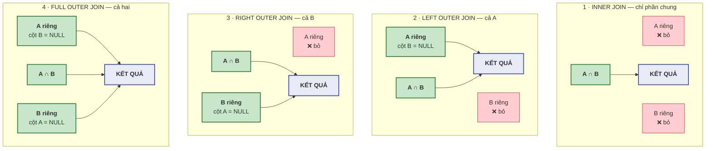
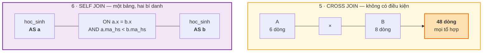
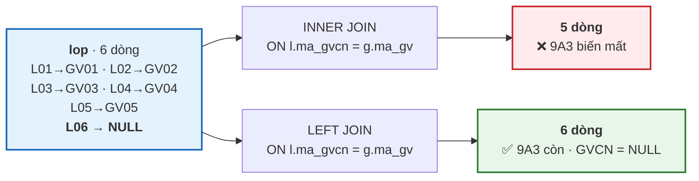

# Bài 25 — JOIN: sáu cách ghép bảng

!!! abstract "🎯 Học xong bài này, bạn sẽ"
    - Ghép được dữ liệu từ nhiều bảng bằng cả sáu loại `JOIN`, và biết chọn loại nào cho tình huống nào
    - Nhìn thấy tận mắt sự khác nhau giữa `INNER JOIN` và `LEFT JOIN` trên lớp `9A3` chưa có chủ nhiệm
    - Tìm được "dòng mồ côi" bằng khuôn `LEFT JOIN ... WHERE ... IS NULL`
    - Ghép một bảng với chính nó bằng `SELF JOIN`
    - Phân biệt `ON` với `USING`, hiểu vì sao `NATURAL JOIN` nguy hiểm, và tránh được **tích Descartes bùng nổ**

## 🧠 Câu chuyện mở đầu

Cô hiệu phó đưa bạn hai tờ giấy.

Tờ thứ nhất là danh sách 40 học sinh, mỗi bạn kèm một **mã lớp**: `HS001 — Nguyễn Văn An — L01`.

Tờ thứ hai là danh sách 6 lớp, mỗi lớp kèm **tên hiển thị** và **mã giáo viên chủ nhiệm**: `L01 — 8A1 — GV01`.

Cô nói: *"Em in cho cô một bảng gồm tên học sinh, tên lớp, và tên cô chủ nhiệm nhé."*

Không tờ giấy nào có đủ cả ba thông tin. Bạn phải **ghép** chúng: lấy mã lớp ở tờ một, tìm nó ở tờ hai để biết tên lớp và mã giáo viên, rồi tìm mã giáo viên đó ở một tờ thứ ba nữa.

Bạn làm xong. Nhưng khi đối chiếu, cô phát hiện bảng của bạn **thiếu lớp 9A3**. Bạn kiểm lại: lớp 9A3 có thật, có 7 học sinh, chỉ là **ô "giáo viên chủ nhiệm" đang để trống** — trường chưa phân công ai.

Bạn đã vô tình làm biến mất cả một lớp học chỉ vì một ô trống. Vậy làm sao để ghép mà **không đánh rơi ai**?

## 📖 Khái niệm & thuật ngữ

### Phép kết nối, nhắc lại từ Bài 21

Ở [Bài 21](21-dai-so-quan-he.md) bạn đã gặp định nghĩa toán học: `R ⋈_θ S = σ_θ(R × S)`. Kết nối là **tích Descartes rồi lọc**.

Tất cả sáu loại `JOIN` của SQL đều dựa trên ý đó, và chúng chỉ khác nhau ở **một câu hỏi duy nhất**:

> *"Khi một dòng bên này không tìm được dòng nào khớp bên kia, thì giữ nó lại hay bỏ nó đi?"*

| Loại | Giữ dòng không khớp của bảng nào | Số dòng trên ví dụ `lop` ⋈ `giao_vien` |
|---|---|---|
| **`INNER JOIN`** | Không giữ của bên nào | 5 |
| **`LEFT OUTER JOIN`** | Giữ của **bảng trái** | 6 |
| **`RIGHT OUTER JOIN`** | Giữ của **bảng phải** | 6 |
| **`FULL OUTER JOIN`** | Giữ của **cả hai** | 9 |
| **`CROSS JOIN`** | Không có điều kiện — ghép tất cả với tất cả | 48 |
| **`SELF JOIN`** | Không phải loại riêng; là *bất kỳ* loại nào, nhưng ghép bảng với chính nó | — |

- **Kết nối trong** (*INNER JOIN*) chỉ giữ những cặp **khớp nhau**. Đây là loại chiếm phần lớn công việc, và cũng là loại làm biến mất lớp `9A3` trong câu chuyện.
- **Kết nối ngoài bên trái** (*LEFT OUTER JOIN*, viết ngắn là `LEFT JOIN`) giữ **mọi** dòng của bảng trái. Dòng nào không có bạn khớp bên phải thì các cột bên phải được điền `NULL`.
- **Kết nối ngoài bên phải** (*RIGHT OUTER JOIN*) làm điều đối xứng: giữ mọi dòng bảng phải. Thực tế rất ít ai dùng, vì đổi chỗ hai bảng là được `LEFT JOIN` — mà `LEFT JOIN` thì dễ đọc hơn.
- **Kết nối ngoài đầy đủ** (*FULL OUTER JOIN*) giữ mọi dòng của cả hai bên. Dùng khi bạn cần **đối chiếu hai danh sách** và muốn thấy cả phần lệch ở hai phía.
- **Kết nối chéo** (*CROSS JOIN*) chính là **tích Descartes** ×: `m` dòng nhân `n` dòng ra `m × n` dòng. Nó có ích khi bạn cần sinh ra mọi tổ hợp — ví dụ lập bảng điểm rỗng cho mọi cặp *(học sinh, môn học)*.
- **Tự kết nối** (*SELF JOIN*) không phải một từ khoá mới. Nó chỉ là tên gọi cho việc ghép một bảng với **chính nó**, và nó bắt buộc phải dùng **bí danh** — tức phép ρ của Bài 21 — để phân biệt hai bản sao.

### `ON` hay `USING`?

Hai cách viết điều kiện ghép:

| | `ON` | `USING` |
|---|---|---|
| Cú pháp | `JOIN lop l ON h.ma_lop = l.ma_lop` | `JOIN lop USING (ma_lop)` |
| Điều kiện | **Bất kỳ** biểu thức nào, kể cả `<`, `>`, nhiều cột, nhiều phép | Chỉ so sánh **bằng**, và hai bên phải **cùng tên cột** |
| Cột trong kết quả | Xuất hiện **hai lần** — `h.ma_lop` và `l.ma_lop` | Xuất hiện **một lần** |

`USING` gọn hơn và tự dọn cột trùng, nhưng nó chỉ dùng được khi hai bảng đặt tên cột giống nhau. `ON` thì luôn dùng được, nên nó là lựa chọn mặc định.

### `NATURAL JOIN` — tiện mà nguy hiểm

**`NATURAL JOIN`** tự động ghép theo **mọi cặp cột trùng tên** giữa hai bảng, không cần bạn viết điều kiện gì.

Nghe thì tuyệt. Nhưng hãy nghĩ tới điều này: nó dựa vào **tên cột**, mà tên cột có thể bị đổi bởi một câu `ALTER TABLE` mà bạn không hay biết. Thêm một cột `ghi_chu` vào cả hai bảng là `NATURAL JOIN` lặng lẽ ghép thêm theo cột đó, và kết quả đổi hoàn toàn — **không có thông báo lỗi nào**.

Vì thế quy tắc trong hầu hết đội phát triển là: **không dùng `NATURAL JOIN` trong mã sản xuất.** Nó chỉ tiện khi bạn gõ nhanh để xem thử.

### Tích Descartes bùng nổ

**Tích Descartes bùng nổ** (*Cartesian explosion*) là hiện tượng: bạn quên viết điều kiện ghép, và số dòng kết quả nhân lên theo tích chứ không theo tổng.

Ghép 40 học sinh với 6 lớp **không có** điều kiện cho ra 240 dòng — vô hại. Nhưng ghép 50.000 dòng `hoc_sinh_lon` với 500.000 dòng `diem_lon` thì cho ra **25 tỉ dòng**: máy chủ ăn hết bộ nhớ, ổ đĩa đầy tệp tạm, và truy vấn không bao giờ kết thúc.

Bẫy chết người là nó **không phải lỗi cú pháp**. Câu lệnh hợp lệ, nó cứ chạy.

### Bảng thuật ngữ

| Tiếng Việt | English | Nghĩa dễ hiểu |
|---|---|---|
| Kết nối trong | *INNER JOIN* | Chỉ giữ những cặp dòng khớp nhau ở cả hai bảng |
| Kết nối ngoài bên trái | *LEFT OUTER JOIN* | Giữ mọi dòng bảng trái; cột bên phải điền `NULL` khi không khớp |
| Kết nối ngoài bên phải | *RIGHT OUTER JOIN* | Đối xứng với `LEFT JOIN`; ít dùng vì đổi chỗ hai bảng là xong |
| Kết nối ngoài đầy đủ | *FULL OUTER JOIN* | Giữ mọi dòng của cả hai bảng — dùng để đối chiếu hai danh sách |
| Kết nối chéo | *CROSS JOIN* | Tích Descartes: ghép mọi dòng bên này với mọi dòng bên kia |
| Tự kết nối | *SELF JOIN* | Ghép một bảng với chính nó, bắt buộc dùng bí danh |
| Kết nối chống | *anti join* | Khuôn `LEFT JOIN ... WHERE cot_phai IS NULL` để tìm những dòng **không** có bạn khớp |
| Tích Descartes bùng nổ | *Cartesian explosion* | Quên điều kiện ghép, số dòng nhân lên theo tích — không báo lỗi, chỉ treo máy |

## 🖼️ Sơ đồ

Sáu loại `JOIN` mô tả bằng tập hợp. Gọi **A** là bảng trái, **B** là bảng phải; vùng giữa là các dòng khớp nhau.



Ba vùng **A riêng**, **A ∩ B**, **B riêng** là ba phần rời nhau của dữ liệu — không có quan hệ nào giữa chúng, nên sơ đồ cố ý không nối chúng với nhau. Mũi tên duy nhất trong mỗi khung có một nghĩa rõ ràng: **vùng nào đi được vào kết quả**. Nói gọn hết bằng một bảng:

| | Dòng **chỉ có ở A** | Dòng **khớp** A ∩ B | Dòng **chỉ có ở B** |
|---|---|---|---|
| `INNER JOIN` | ❌ bỏ | ✅ giữ | ❌ bỏ |
| `LEFT OUTER JOIN` | ✅ giữ, cột B = `NULL` | ✅ giữ | ❌ bỏ |
| `RIGHT OUTER JOIN` | ❌ bỏ | ✅ giữ | ✅ giữ, cột A = `NULL` |
| `FULL OUTER JOIN` | ✅ giữ, cột B = `NULL` | ✅ giữ | ✅ giữ, cột A = `NULL` |

Bốn dòng của bảng này là **toàn bộ** nội dung cần nhớ về bốn loại `JOIN` đầu tiên.

Hai loại còn lại không nói bằng tập hợp được, vì chúng khác về bản chất:



Và đây là điều đã xảy ra với lớp `9A3` trong câu chuyện mở đầu:



## 💻 Thực hành

### `INNER JOIN` — và cái lớp bị đánh rơi

Đây chính là câu lệnh mà "bạn" trong câu chuyện đã viết:

```sql
-- KỲ VỌNG: 5 dòng
SELECT l.ma_lop, l.ten_lop, g.ho_ten AS ten_gvcn
FROM lop l
INNER JOIN giao_vien g ON g.ma_gv = l.ma_gvcn
ORDER BY l.ma_lop;
```

Năm dòng, không phải sáu. Lớp `L06` (`9A3`) **biến mất** vì `ma_gvcn` của nó là `NULL`, và `NULL = 'GV01'` cho `UNKNOWN` — mà `INNER JOIN` chỉ giữ những cặp cho `TRUE`. Đây đúng là logic ba giá trị ở [Bài 24](24-select-where-order-by.md) đang hoạt động, lần này bên trong mệnh đề `ON`.

Từ khoá `INNER` có thể bỏ: viết `JOIN` không kèm gì thì PostgreSQL hiểu là `INNER JOIN`.

### `LEFT OUTER JOIN` — giữ lại mọi lớp

```sql
-- KỲ VỌNG: 6 dòng
-- KỲ VỌNG: ten_gvcn = NULL
SELECT l.ma_lop, l.ten_lop, g.ho_ten AS ten_gvcn
FROM lop l
LEFT JOIN giao_vien g ON g.ma_gv = l.ma_gvcn
ORDER BY l.ma_gvcn NULLS FIRST, l.ma_lop;
```

Sáu dòng, đủ cả trường. Dòng đầu tiên là `L06 — 9A3` với `ten_gvcn` rỗng — **PostgreSQL tự điền `NULL`** vào các cột bên phải khi không tìm được bạn khớp.

Hãy để ý một điều quan trọng: cái `NULL` đó **không có trong bảng nào**. Bảng `giao_vien` không có dòng nào rỗng. `NULL` này do chính phép `LEFT JOIN` sinh ra.

### `RIGHT OUTER JOIN` — chỉ là `LEFT JOIN` soi gương

```sql
-- KỲ VỌNG: 6 dòng
SELECT g.ho_ten AS ten_gvcn, l.ma_lop, l.ten_lop
FROM giao_vien g
RIGHT JOIN lop l ON g.ma_gv = l.ma_gvcn
ORDER BY l.ma_lop;
```

Cùng 6 dòng, cùng nội dung như câu `LEFT JOIN` trên — chỉ khác thứ tự cột. Đó là lý do `RIGHT JOIN` ít được dùng: đổi chỗ hai bảng rồi viết `LEFT JOIN` thì mạch đọc tự nhiên hơn nhiều, vì mắt người đọc từ trái sang phải và "bảng chính" nên đứng trước.

### `FULL OUTER JOIN` — đối chiếu hai danh sách

Câu hỏi: *"Đối chiếu danh sách giáo viên và danh sách lớp. Ai chưa chủ nhiệm lớp nào, và lớp nào chưa có chủ nhiệm?"*

```sql
-- KỲ VỌNG: 9 dòng
SELECT g.ma_gv, g.ho_ten, l.ma_lop, l.ten_lop
FROM giao_vien g
FULL OUTER JOIN lop l ON g.ma_gv = l.ma_gvcn
ORDER BY g.ma_gv NULLS LAST, l.ma_lop NULLS LAST;
```

Chín dòng, phân tích ra thành ba nhóm:

- **5 dòng khớp**: `GV01`–`GV05` ↔ `L01`–`L05`.
- **3 dòng chỉ có bên trái**: `GV06`, `GV07`, `GV08` — chưa chủ nhiệm lớp nào, phần `lop` là `NULL`.
- **1 dòng chỉ có bên phải**: `L06` — chưa có chủ nhiệm, phần `giao_vien` là `NULL`.

`5 + 3 + 1 = 9`. Không có `JOIN` nào khác cho bạn nhìn thấy cả ba nhóm cùng lúc.

Tách riêng từng phần lệch bằng cách lọc trên `NULL`:

```sql
-- KỲ VỌNG: 3 dòng
SELECT g.ma_gv, g.ho_ten
FROM giao_vien g
FULL OUTER JOIN lop l ON g.ma_gv = l.ma_gvcn
WHERE l.ma_lop IS NULL
ORDER BY g.ma_gv;
```

### Khuôn "kết nối chống" — tìm dòng mồ côi

Đây là khuôn câu lệnh bạn sẽ dùng nhiều nhất trong đời làm nghề, nên hãy nhớ nó như một công thức:

> `LEFT JOIN` bảng con, rồi `WHERE <khoá chính bảng con> IS NULL`.

Dịch ra tiếng Việt: *"ghép sao cho không đánh rơi ai, rồi chỉ giữ những dòng mà phép ghép **không tìm được** bạn khớp."* Người ta gọi khuôn này là **kết nối chống** (*anti join*).

Áp dụng: *"Học sinh nào chưa có phụ huynh nào trong hệ thống?"*

```sql
-- KỲ VỌNG: 1 dòng
-- KỲ VỌNG: ma_hs = HS040
SELECT h.ma_hs, h.ho_ten, h.ma_lop
FROM hoc_sinh h
LEFT JOIN phu_huynh p ON p.ma_hs = h.ma_hs
WHERE p.ma_ph IS NULL
ORDER BY h.ma_hs;
```

Đúng một bạn: **`HS040` — Đinh Thị Vân**. Bốn mươi học sinh, 45 phụ huynh, nhưng có một bạn chưa ai đăng ký thông tin liên lạc.

Hãy xem cùng phép `LEFT JOIN` đó cho bao nhiêu dòng khi **không** lọc:

```sql
-- KỲ VỌNG: so_dong = 46
SELECT count(*) AS so_dong
FROM hoc_sinh h
LEFT JOIN phu_huynh p ON p.ma_hs = h.ma_hs;
```

**46** chứ không phải 40. Vì sáu bạn có **hai** phụ huynh, nên mỗi bạn trong số đó sinh ra hai dòng. Cộng thêm `HS040` với một dòng `NULL`: `39 + 6 + 1 = 46`.

!!! warning "`JOIN` làm số dòng **tăng lên**, không chỉ giảm đi"
    Nhiều người mới tưởng `JOIN` luôn thu hẹp kết quả. Sai. Nếu quan hệ là **một-nhiều**, mỗi dòng cha sẽ nhân lên thành nhiều dòng.

    Hậu quả cụ thể và rất hay gặp: bạn ghép `hoc_sinh` với `diem` rồi tính `count(*)` và tưởng mình đang đếm học sinh — trong khi thật ra bạn đang đếm **số con điểm**. [Bài 26](26-group-by-having.md) sẽ dạy `count(DISTINCT ...)` để xử lý đúng chuyện này.

Ngược chiều: *"Giáo viên nào chưa chủ nhiệm lớp nào?"*

```sql
-- KỲ VỌNG: 3 dòng
SELECT g.ma_gv, g.ho_ten, g.mon_chuyen_mon
FROM giao_vien g
LEFT JOIN lop l ON l.ma_gvcn = g.ma_gv
WHERE l.ma_lop IS NULL
ORDER BY g.ma_gv;
```

Ba người: `GV06`, `GV07`, `GV08`. So sánh với câu `EXCEPT` ở [Bài 21](21-dai-so-quan-he.md) — cùng câu trả lời, hai con đường khác nhau.

### `SELF JOIN` — ghép bảng với chính nó

Câu hỏi: *"Có cặp học sinh nào sinh cùng một ngày không?"*

```sql
-- KỲ VỌNG: 0 dòng
SELECT a.ma_hs AS ma_1, a.ho_ten AS ten_1,
       b.ma_hs AS ma_2, b.ho_ten AS ten_2,
       a.ngay_sinh
FROM hoc_sinh a
JOIN hoc_sinh b
  ON a.ngay_sinh = b.ngay_sinh
 AND a.ma_hs < b.ma_hs
ORDER BY a.ma_hs, b.ma_hs;
```

**Không cặp nào.** Bốn mươi học sinh của trường có 40 ngày sinh khác nhau hoàn toàn. Đây là một kết quả rất đáng giá về mặt học tập: truy vấn của bạn **đúng**, dữ liệu chỉ đơn giản là không có trường hợp nào thoả.

!!! tip "Kết quả rỗng: làm sao biết mình viết sai hay dữ liệu không có?"
    Đây là tình huống bạn sẽ gặp hàng tuần khi đi làm, và có một kỹ thuật cụ thể để xử lý — **nới dần từng điều kiện cho tới khi có dòng**.

    Cách làm: bỏ (hoặc làm yếu đi) **một** điều kiện, chạy lại, xem có dòng chưa. Lặp lại cho tới khi kết quả khác rỗng. Điều kiện cuối cùng bạn vừa bỏ chính là chỗ chặn mọi thứ — và lúc đó bạn đọc lại nó để quyết định: *nó sai*, hay *dữ liệu thật sự không có*.

    Áp vào đúng truy vấn trên. Điều kiện gắt nhất là `a.ngay_sinh = b.ngay_sinh`; nới nó thành "cùng **tháng** sinh":

    ```sql
    -- KỲ VỌNG: so_cap_cung_thang = 48
    -- KỲ VỌNG: so_cap_cung_ngay = 0
    SELECT count(*)                                                        AS so_cap_cung_thang,
           count(*) FILTER (WHERE a.ngay_sinh = b.ngay_sinh)                AS so_cap_cung_ngay
    FROM hoc_sinh a
    JOIN hoc_sinh b
      ON EXTRACT(MONTH FROM a.ngay_sinh) = EXTRACT(MONTH FROM b.ngay_sinh)
     AND a.ma_hs < b.ma_hs;
    ```

    Nới một bậc thì có ngay **48** cặp. Vậy phần khung của truy vấn — `JOIN`, bí danh, điều kiện `a.ma_hs < b.ma_hs` — **chạy đúng**. Chỉ điều kiện "cùng đúng ngày" là không có dữ liệu nào thoả, và cột thứ hai khẳng định lại con số **0** đó trên cùng một lượt chạy.

    Kết luận: **truy vấn đúng, dữ liệu không có trường hợp nào.** Nếu ngược lại — nới hết mọi điều kiện mà vẫn rỗng — thì lỗi nằm ở phần khung, thường là sai tên cột trong `ON` hoặc ghép sai cặp bảng.

    Một mẹo nữa dùng được ngay: đếm riêng hai bảng đầu vào trước khi ghép. Nếu một bên đã rỗng thì mọi `INNER JOIN` với nó đều rỗng, và chuyện chẳng liên quan gì tới mệnh đề `ON` của bạn cả.

Hai chi tiết trong mệnh đề `ON` cần giải thích:

- `a.ngay_sinh = b.ngay_sinh` là điều kiện nghiệp vụ.
- `a.ma_hs < b.ma_hs` là **mẹo bắt buộc**. Không có nó, mỗi học sinh sẽ ghép với chính mình (vì hiển nhiên `a.ngay_sinh = a.ngay_sinh`), và mỗi cặp thật sẽ xuất hiện **hai lần** — một lần `(An, Bình)` và một lần `(Bình, An)`. Dấu `<` giải quyết cả hai vấn đề bằng một điều kiện.

Nới lỏng thành **cùng tháng sinh** để thấy `SELF JOIN` hoạt động thật:

```sql
-- KỲ VỌNG: so_cap = 48
SELECT count(*) AS so_cap
FROM hoc_sinh a
JOIN hoc_sinh b
  ON EXTRACT(MONTH FROM a.ngay_sinh) = EXTRACT(MONTH FROM b.ngay_sinh)
 AND a.ma_hs < b.ma_hs;
```

48 cặp. Xem cụ thể các cặp sinh tháng 1:

```sql
-- KỲ VỌNG: 6 dòng
SELECT a.ma_hs AS ma_1, a.ho_ten AS ten_1,
       b.ma_hs AS ma_2, b.ho_ten AS ten_2
FROM hoc_sinh a
JOIN hoc_sinh b
  ON EXTRACT(MONTH FROM a.ngay_sinh) = EXTRACT(MONTH FROM b.ngay_sinh)
 AND a.ma_hs < b.ma_hs
WHERE EXTRACT(MONTH FROM a.ngay_sinh) = 1
ORDER BY a.ma_hs, b.ma_hs;
```

Bốn bạn sinh tháng 1 (`HS001`, `HS013`, `HS021`, `HS027`) tạo ra `4 × 3 ÷ 2 = 6` cặp. Nếu bỏ điều kiện `a.ma_hs < b.ma_hs`, con số sẽ là `4 × 4 = 16` — gồm 4 cặp tự ghép và 12 cặp bị đếm hai lần.

### `CROSS JOIN` và tích Descartes bùng nổ

`CROSS JOIN` có lúc **rất** hữu ích. Ví dụ: sinh một bảng điểm rỗng cho mọi cặp *(học sinh, môn học)* để giáo viên điền vào:

```sql
-- KỲ VỌNG: so_o_can_dien = 360
SELECT count(*) AS so_o_can_dien
FROM hoc_sinh CROSS JOIN mon_hoc;
```

40 × 9 = 360 ô. Đây là dùng `CROSS JOIN` **có ý thức**.

Còn đây là dùng nó **vô tình** — chỉ vì liệt kê hai bảng trong `FROM` mà quên điều kiện ghép:

```sql
-- QUÊN mệnh đề WHERE h.ma_lop = l.ma_lop
-- KỲ VỌNG: so_dong = 240
SELECT count(*) AS so_dong
FROM hoc_sinh, lop;
```

240 dòng thay vì 40 — mỗi học sinh bị gán vào **cả sáu** lớp. Câu lệnh **không báo lỗi**, kết quả chỉ đơn giản là vô nghĩa.

Với hai bảng nhỏ thì chỉ là kết quả sai. Nhưng hãy làm phép nhân với hai bảng lớn của Cấp 4:

<!-- sql:khong-chay -->
```sql
-- ĐỪNG chạy: 50.000 × 500.000 = 25.000.000.000 dòng
SELECT count(*) FROM hoc_sinh_lon, diem_lon;
```

Hai mươi lăm tỉ dòng. Máy chủ sẽ ăn hết bộ nhớ, ghi đầy ổ đĩa bằng tệp tạm, rồi treo. Đó là **tích Descartes bùng nổ**.

!!! tip "Cách tự bảo vệ"
    1. **Luôn viết `JOIN ... ON ...`**, đừng dùng lối cũ `FROM a, b WHERE ...`. Với cú pháp `JOIN`, quên `ON` là **lỗi cú pháp** — PostgreSQL chặn bạn lại ngay. Với dấu phẩy thì không.
    2. Khi thấy số dòng lớn bất thường, hãy **nhân số dòng các bảng với nhau**. Nếu kết quả khớp với tích đó, bạn đã quên một điều kiện ghép.
    3. Khi thử một truy vấn ghép nhiều bảng lớn, gắn `LIMIT 100` trước.

### `ON` và `USING`

```sql
-- KỲ VỌNG: 40 dòng
SELECT h.ma_hs, h.ho_ten, l.ten_lop
FROM hoc_sinh h
JOIN lop l ON h.ma_lop = l.ma_lop
ORDER BY h.ma_hs;
```

Cùng kết quả, viết bằng `USING`:

```sql
-- KỲ VỌNG: 40 dòng
SELECT ma_hs, ho_ten, ten_lop, ma_lop
FROM hoc_sinh
JOIN lop USING (ma_lop)
ORDER BY ma_hs;
```

Chú ý ở câu thứ hai: `ma_lop` viết **không có tiền tố bảng**, và điều đó là bắt buộc — `USING` gộp hai cột `ma_lop` thành **một**, nên không còn `h.ma_lop` và `l.ma_lop` riêng biệt nữa.

### `NATURAL JOIN` — và vì sao đừng dùng

Trên cặp `hoc_sinh` / `lop`, `NATURAL JOIN` làm đúng điều bạn mong: hai bảng chỉ trùng nhau ở cột `ma_lop`.

```sql
-- KỲ VỌNG: so_dong = 40
SELECT count(*) AS so_dong
FROM hoc_sinh NATURAL JOIN lop;
```

Bây giờ thử với cặp `hoc_sinh` / `giao_vien`:

```sql
-- KỲ VỌNG: so_dong = 0
SELECT count(*) AS so_dong
FROM hoc_sinh NATURAL JOIN giao_vien;
```

**Không dòng nào.** Hai bảng này trùng nhau tới **ba** cột: `ho_ten`, `ngay_sinh`, `gioi_tinh`. `NATURAL JOIN` lặng lẽ ghép theo cả ba, tức là nó đang đi tìm *"những người vừa là học sinh vừa là giáo viên, cùng tên, cùng ngày sinh, cùng giới tính"*. Đương nhiên không có ai.

Và đây mới là điều đáng sợ: **không có thông báo lỗi nào.** Bạn nhận về một bảng rỗng và phải tự đoán vì sao.

`NATURAL JOIN` còn có một kiểu hỏng **ngược lại và phá hoại hơn nhiều**: nếu hai bảng **không có cột nào trùng tên**, nó không báo lỗi mà **thoái hoá thành `CROSS JOIN`** — đúng cái tích Descartes bùng nổ ở mục trên.

```sql
-- KỲ VỌNG: natural_khong_cot_trung = 120
-- KỲ VỌNG: cross_join = 120
SELECT (SELECT count(*) FROM lop NATURAL JOIN sach) AS natural_khong_cot_trung,
       (SELECT count(*) FROM lop CROSS JOIN sach)   AS cross_join;
```

`lop` và `sach` không chia sẻ tên cột nào, nên `NATURAL JOIN` không có điều kiện nào để ghép và trả về **120 dòng** — bằng đúng `6 × 20`, y hệt `CROSS JOIN`.

Hãy ghép hai kiểu hỏng lại để thấy `NATURAL JOIN` tệ tới mức nào:

| Số cột trùng tên | `NATURAL JOIN` làm gì | Hậu quả |
|---|---|---|
| **0 cột** | Thoái hoá thành `CROSS JOIN` | **Tích Descartes bùng nổ** — trên bảng lớn là treo máy |
| Đúng cột bạn muốn | Làm đúng ý | Chạy được, nhưng vẫn dễ vỡ khi ai đó đổi tên cột |
| **Nhiều hơn bạn muốn** | Ghép theo cả những cột bạn không nghĩ tới | **Âm thầm 0 dòng**, hoặc tệ hơn là thiếu dòng mà vẫn trông hợp lý |

Cả ba hàng đều **không báo lỗi**. Đó là lý do quy tắc ở đây dứt khoát: **đừng dùng `NATURAL JOIN` trong mã thật.**

Nếu viết bằng `ON`, ý định của bạn hiện rõ trên mặt câu lệnh và không có gì ngầm hiểu:

```sql
-- KỲ VỌNG: so_dong = 40
SELECT count(*) AS so_dong
FROM hoc_sinh h
JOIN lop l       ON l.ma_lop = h.ma_lop
LEFT JOIN giao_vien g ON g.ma_gv = l.ma_gvcn;
```

### Ghép nhiều bảng — lời hứa với cô hiệu phó

Cuối cùng, đây là bảng mà cô hiệu phó đã nhờ từ đầu bài: **tên học sinh, tên lớp, tên giáo viên chủ nhiệm** — và **không đánh rơi lớp `9A3`**:

```sql
-- KỲ VỌNG: 1 dòng
-- KỲ VỌNG: so_dong = 40
-- KỲ VỌNG: so_khong_co_gvcn = 7
SELECT count(*)                                AS so_dong,
       count(*) FILTER (WHERE g.ma_gv IS NULL) AS so_khong_co_gvcn
FROM hoc_sinh h
JOIN lop l            ON l.ma_lop = h.ma_lop
LEFT JOIN giao_vien g ON g.ma_gv  = l.ma_gvcn;
```

Đủ 40 học sinh, trong đó 7 bạn của lớp `9A3` có ô giáo viên chủ nhiệm để rỗng. Chú ý cách chọn loại `JOIN` cho từng bước:

- `hoc_sinh` → `lop` dùng **`JOIN` thường**, vì `hoc_sinh.ma_lop` được khai `NOT NULL`: mọi học sinh chắc chắn có lớp, không thể đánh rơi ai.
- `lop` → `giao_vien` dùng **`LEFT JOIN`**, vì `lop.ma_gvcn` **cho phép `NULL`**.

!!! tip "Quy tắc chọn loại JOIN"
    Nhìn vào khoá ngoại dùng để ghép:

    - Khoá ngoại khai **`NOT NULL`** → `INNER JOIN` là an toàn, không mất dòng nào.
    - Khoá ngoại **cho phép `NULL`** → phải tự hỏi *"tôi có muốn giữ những dòng chưa có bạn khớp không?"*. Câu trả lời thường là **có**, và khi đó dùng `LEFT JOIN`.

    Nói cách khác: thiết kế lược đồ ở Cấp 1 quyết định luôn loại `JOIN` bạn phải viết ở Cấp 3.

## ⚠️ Lỗi thường gặp

!!! danger "Lỗi 1: Dùng `INNER JOIN` khi khoá ngoại cho phép `NULL`"
    Đây là câu chuyện mở đầu, và là lỗi phổ biến nhất của cả bài.

    Triệu chứng: báo cáo thiếu dòng, nhưng thiếu **âm thầm** — không lỗi, không cảnh báo, chỉ là tổng số nhỏ hơn thực tế.

    Cách phát hiện: đếm số dòng của bảng chính **trước** khi ghép, rồi so với số dòng **sau** khi ghép. Nếu giảm mà bạn không cố ý lọc gì, bạn đã mất dòng:

    ```sql
    -- KỲ VỌNG: truoc_khi_ghep = 6
    -- KỲ VỌNG: inner_join = 5
    -- KỲ VỌNG: left_join = 6
    SELECT (SELECT count(*) FROM lop)                                                           AS truoc_khi_ghep,
           (SELECT count(*) FROM lop l JOIN giao_vien g ON g.ma_gv = l.ma_gvcn)                 AS inner_join,
           (SELECT count(*) FROM lop l LEFT JOIN giao_vien g ON g.ma_gv = l.ma_gvcn)            AS left_join;
    ```

!!! danger "Lỗi 2: `LEFT JOIN` rồi lọc bảng phải trong `WHERE`"
    Lỗi này xoá sạch công dụng của `LEFT JOIN`, và cực kỳ khó nhìn ra khi đọc mã.

    ```sql
    -- KỲ VỌNG: loc_trong_where = 3
    -- KỲ VỌNG: loc_trong_on = 6
    SELECT (SELECT count(*) FROM lop l
              LEFT JOIN giao_vien g ON g.ma_gv = l.ma_gvcn
              WHERE g.gioi_tinh = 'Nữ')                          AS loc_trong_where,
           (SELECT count(*) FROM lop l
              LEFT JOIN giao_vien g ON g.ma_gv = l.ma_gvcn
                                   AND g.gioi_tinh = 'Nữ')       AS loc_trong_on;
    ```

    Cùng một điều kiện, đặt ở hai chỗ, ra hai kết quả:

    - Đặt trong **`WHERE`**: `LEFT JOIN` sinh ra dòng `L06` với `g.gioi_tinh = NULL`, rồi `WHERE NULL = 'Nữ'` cho `UNKNOWN` và **loại dòng đó đi**. Kết quả 3 dòng — `LEFT JOIN` vừa bị biến thành `INNER JOIN`.
    - Đặt trong **`ON`**: điều kiện chỉ quyết định *"dòng nào bên phải được coi là khớp"*. Mọi lớp vẫn được giữ. Kết quả 6 dòng.

    **Quy tắc:** điều kiện về **bảng phải** của một `LEFT JOIN` thì đặt trong `ON`. Điều kiện về **bảng trái** thì đặt ở `WHERE`. Ngoại lệ duy nhất là khuôn kết nối chống `WHERE cot_phai IS NULL` — ở đó bạn **cố ý** muốn lọc sau khi ghép.

!!! warning "Lỗi 3: Quên điều kiện ghép — tích Descartes bùng nổ"
    ```sql
    -- KỲ VỌNG: dung_cach = 40
    -- KỲ VỌNG: quen_dieu_kien = 240
    SELECT (SELECT count(*) FROM hoc_sinh h JOIN lop l ON l.ma_lop = h.ma_lop) AS dung_cach,
           (SELECT count(*) FROM hoc_sinh, lop)                                AS quen_dieu_kien;
    ```

    240 = 40 × 6. Số dòng bằng đúng **tích** số dòng hai bảng là dấu hiệu chắc chắn của lỗi này.

    Dùng cú pháp `JOIN ... ON` thay cho `FROM a, b` để PostgreSQL bắt lỗi giúp bạn.

!!! warning "Lỗi 4: Dùng `NATURAL JOIN`"
    Nó dựa vào tên cột, mà tên cột thay đổi được. Một câu `ALTER TABLE ... ADD COLUMN ghi_chu` trên hai bảng là đủ để mọi `NATURAL JOIN` giữa chúng đổi kết quả — im lặng.

    Đã thấy ở phần thực hành: `hoc_sinh NATURAL JOIN giao_vien` trả về 0 dòng vì nó ghép theo cả ba cột `ho_ten`, `ngay_sinh`, `gioi_tinh`.

    Luôn viết `ON` (hoặc `USING` nếu muốn gọn). Ý định phải hiện rõ trên mặt câu lệnh.

!!! warning "Lỗi 5: `SELF JOIN` thiếu điều kiện chống trùng"
    ```sql
    -- KỲ VỌNG: co_dieu_kien_nho_hon = 6
    -- KỲ VỌNG: khong_co_dieu_kien = 16
    SELECT (SELECT count(*) FROM hoc_sinh a JOIN hoc_sinh b
              ON EXTRACT(MONTH FROM a.ngay_sinh) = EXTRACT(MONTH FROM b.ngay_sinh)
             AND a.ma_hs < b.ma_hs
            WHERE EXTRACT(MONTH FROM a.ngay_sinh) = 1)        AS co_dieu_kien_nho_hon,
           (SELECT count(*) FROM hoc_sinh a JOIN hoc_sinh b
              ON EXTRACT(MONTH FROM a.ngay_sinh) = EXTRACT(MONTH FROM b.ngay_sinh)
            WHERE EXTRACT(MONTH FROM a.ngay_sinh) = 1)        AS khong_co_dieu_kien;
    ```

    Bốn học sinh sinh tháng 1: có điều kiện `<` thì ra 6 cặp đúng; không có thì ra 16 — gồm 4 cặp một người ghép với chính mình, và 12 cặp bị đếm hai lần.

    Dùng `a.ma_hs < b.ma_hs` khi muốn **mỗi cặp đúng một lần**; dùng `a.ma_hs <> b.ma_hs` khi bạn thật sự cần cả hai chiều.

## ✍️ Bài tập

1. Liệt kê **mọi cuốn sách** kèm mã học sinh đã mượn nó, sao cho những cuốn **chưa ai mượn** vẫn xuất hiện trong kết quả. Dùng loại `JOIN` nào, và kết quả có bao nhiêu dòng?

2. Viết truy vấn tìm những **môn học chưa từng được phân công cho giáo viên nào** (bảng `phan_cong_day`).

3. Câu lệnh sau sai ở đâu? Sửa lại.

    <!-- sql:khong-chay -->
    ```sql
    SELECT h.ho_ten, p.ho_ten AS ten_phu_huynh
    FROM hoc_sinh h
    LEFT JOIN phu_huynh p ON p.ma_hs = h.ma_hs
    WHERE p.quan_he = 'Mẹ';
    ```

    Ý định: *"liệt kê mọi học sinh, kèm tên mẹ nếu có."*

4. Bảng `hoc_sinh` có 40 dòng, `diem` có 480 dòng. Hỏi `SELECT count(*) FROM hoc_sinh h JOIN diem d ON d.ma_hs = h.ma_hs` cho ra bao nhiêu? Và `SELECT count(*) FROM hoc_sinh, diem` cho ra bao nhiêu? Giải thích chênh lệch.

5. Tìm mọi cặp **giáo viên cùng dạy một lớp trong cùng học kỳ** nhưng khác môn. Đây là `SELF JOIN` trên bảng nào, và cần mấy điều kiện trong `ON`?

??? success "Đáp án"
    **Câu 1.**

    ```sql
    -- KỲ VỌNG: 1 dòng
    -- KỲ VỌNG: so_dong = 50
    -- KỲ VỌNG: so_sach_chua_ai_muon = 0
    SELECT count(*)                                AS so_dong,
           count(*) FILTER (WHERE m.ma_muon IS NULL) AS so_sach_chua_ai_muon
    FROM sach s
    LEFT JOIN muon_sach m ON m.ma_sach = s.ma_sach;
    ```

    Dùng **`LEFT JOIN`** với `sach` ở vế trái, vì ta muốn giữ mọi cuốn sách kể cả cuốn chưa ai mượn.

    Kết quả: **50 dòng**, và `so_sach_chua_ai_muon = 0` — hoá ra cả 20 cuốn đều đã có người mượn ít nhất một lần. Vì có 50 lượt mượn rải trên 20 cuốn, mỗi cuốn được mượn nhiều lần, nên số dòng sau khi ghép là 50 chứ không phải 20.

    Đây lại là bài học *"`JOIN` làm số dòng tăng"*: vế trái có 20 dòng, kết quả có 50.

    **Câu 2.**

    ```sql
    -- KỲ VỌNG: 1 dòng
    -- KỲ VỌNG: ma_mon = MH08
    SELECT m.ma_mon, m.ten_mon
    FROM mon_hoc m
    LEFT JOIN phan_cong_day pc ON pc.ma_mon = m.ma_mon
    WHERE pc.ma_mon IS NULL
    ORDER BY m.ma_mon;
    ```

    Đúng một môn: **`MH08` — Địa lý**. Trường có 8 giáo viên với 8 chuyên môn, nhưng bảng `mon_hoc` có 9 môn — không thầy cô nào chuyên Địa lý, nên môn đó chưa được phân công.

    Đây chính là khuôn **kết nối chống** áp dụng lần thứ ba trong bài.

    **Câu 3.**

    Sai vì điều kiện `p.quan_he = 'Mẹ'` nằm trong **`WHERE`**, tức là được áp **sau khi** ghép. Với những học sinh không có mẹ trong hệ thống, `LEFT JOIN` sinh ra dòng có `p.quan_he = NULL`; rồi `WHERE NULL = 'Mẹ'` cho `UNKNOWN` và dòng đó bị loại.

    Kết quả: truy vấn chỉ trả về những bạn **có mẹ**, tức là `LEFT JOIN` đã bị biến thành `INNER JOIN`. Trái hẳn với ý định "liệt kê **mọi** học sinh".

    Sửa bằng cách chuyển điều kiện vào `ON`:

    ```sql
    -- KỲ VỌNG: so_dong = 40
    -- KỲ VỌNG: so_khong_co_me = 20
    SELECT count(*)                              AS so_dong,
           count(*) FILTER (WHERE p.ma_ph IS NULL) AS so_khong_co_me
    FROM hoc_sinh h
    LEFT JOIN phu_huynh p ON p.ma_hs = h.ma_hs
                         AND p.quan_he = 'Mẹ';
    ```

    Bây giờ đủ **40 dòng** — mỗi học sinh đúng một dòng, vì mỗi bạn có nhiều nhất một mẹ. Bảng `phu_huynh` có 20 dòng `quan_he = 'Mẹ'` thuộc 20 học sinh khác nhau, nên **20 bạn** còn lại không có mẹ đăng ký (chỉ có bố, hoặc ông bà, hoặc — như `HS040` — không có ai).

    **Câu 4.**

    ```sql
    -- KỲ VỌNG: co_dieu_kien = 480
    -- KỲ VỌNG: khong_dieu_kien = 19200
    SELECT (SELECT count(*) FROM hoc_sinh h JOIN diem d ON d.ma_hs = h.ma_hs) AS co_dieu_kien,
           (SELECT count(*) FROM hoc_sinh, diem)                              AS khong_dieu_kien;
    ```

    - **Có điều kiện: 480 dòng.** Mỗi con điểm khớp với đúng một học sinh (vì `diem.ma_hs` là khoá ngoại trỏ tới khoá chính của `hoc_sinh`), nên số dòng bằng số dòng của bảng "nhiều", tức là 480.
    - **Không điều kiện: 19.200 dòng** = 40 × 480. Mỗi học sinh bị ghép với **toàn bộ** 480 con điểm của cả trường.

    Chênh lệch 40 lần. Và nếu bạn tính `AVG(diem_so)` trên bảng 19.200 dòng đó, con số trả về vẫn "trông có vẻ hợp lý" — đó là điều làm lỗi này nguy hiểm.

    **Câu 5.**

    `SELF JOIN` trên bảng **`phan_cong_day`**, cần **bốn** điều kiện trong `ON`:

    ```sql
    -- Bốn điều kiện: cùng lớp · cùng học kỳ · khác môn · mỗi cặp giáo viên đúng một lần
    -- KỲ VỌNG: so_cap = 224
    SELECT count(*) AS so_cap
    FROM phan_cong_day a
    JOIN phan_cong_day b
      ON a.ma_lop  =  b.ma_lop
     AND a.hoc_ky  =  b.hoc_ky
     AND a.ma_mon <>  b.ma_mon
     AND a.ma_gv   <  b.ma_gv;
    ```

    Kiểm lại con số bằng tay: bảng `phan_cong_day` có 64 dòng, phân bố thành 4 lớp × 2 học kỳ = 8 nhóm, mỗi nhóm đúng 8 dòng (8 giáo viên, mỗi người một môn). Trong mỗi nhóm, số cặp giáo viên khác nhau là `8 × 7 ÷ 2 = 28`. Vậy tổng là `8 × 28 = 224`.

    Điều kiện `a.ma_mon <> b.ma_mon` ở đây thực ra **dư thừa** — vì trong dữ liệu mẫu mỗi giáo viên chỉ dạy đúng một môn, nên hai giáo viên khác nhau đã chắc chắn khác môn. Nhưng vẫn nên viết ra, vì nó diễn đạt đúng yêu cầu của đề bài và sẽ cần thiết khi dữ liệu thay đổi.

## 🔑 Tóm tắt

1. Sáu loại `JOIN` chỉ khác nhau ở **một** câu hỏi: *"dòng không tìm được bạn khớp thì giữ hay bỏ?"* — `INNER` bỏ cả hai bên, `LEFT` giữ bên trái, `RIGHT` giữ bên phải, `FULL OUTER` giữ cả hai, `CROSS` không có điều kiện, `SELF` là ghép bảng với chính nó.
2. Khoá ngoại **cho phép `NULL`** thì `INNER JOIN` sẽ **âm thầm đánh rơi dòng** — lớp `9A3` biến mất là ví dụ. Quy tắc chọn: khoá ngoại `NOT NULL` → `INNER JOIN` an toàn; khoá ngoại cho `NULL` → cân nhắc `LEFT JOIN`.
3. Khuôn **kết nối chống** `LEFT JOIN ... WHERE <khoá bảng phải> IS NULL` là công cụ tìm "dòng mồ côi": học sinh chưa có phụ huynh, giáo viên chưa chủ nhiệm lớp, môn chưa được phân công.
4. Đặt điều kiện về **bảng phải** của `LEFT JOIN` vào `WHERE` sẽ **biến nó thành `INNER JOIN`** — vì `NULL = 'giá trị'` cho `UNKNOWN`. Điều kiện bảng phải phải đặt trong `ON`.
5. `JOIN` làm số dòng **tăng lên** khi quan hệ là một-nhiều, và quên điều kiện ghép thì gây **tích Descartes bùng nổ** mà không báo lỗi gì. Luôn viết `JOIN ... ON` thay cho `FROM a, b`; tránh `NATURAL JOIN`; và `SELF JOIN` thì luôn thêm `a.khoa < b.khoa` để mỗi cặp chỉ xuất hiện một lần.

---

⬅️ [Bài 24 — SELECT, WHERE, ORDER BY, LIMIT](24-select-where-order-by.md) · ➡️ [Bài 26 — GROUP BY, HAVING và các hàm tổng hợp](26-group-by-having.md)
