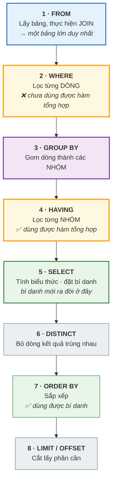
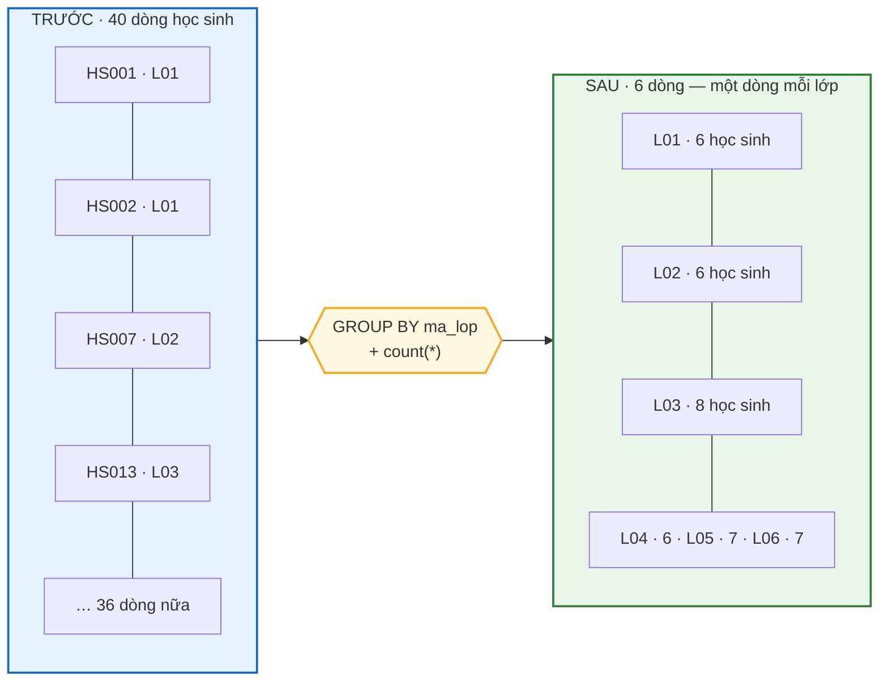

# Bài 26 — GROUP BY, HAVING và các hàm tổng hợp

!!! abstract "🎯 Học xong bài này, bạn sẽ"
    - Dùng được năm **hàm tổng hợp** `COUNT`, `SUM`, `AVG`, `MIN`, `MAX` và biết chúng xử lý `NULL` thế nào
    - Giải thích chính xác khác biệt giữa `COUNT(*)`, `COUNT(cột)` và `COUNT(DISTINCT cột)`
    - Gom dòng theo một hoặc nhiều cột bằng `GROUP BY`, và lọc **nhóm** bằng `HAVING`
    - Trả lời được câu hỏi kinh điển *"khi nào `WHERE`, khi nào `HAVING`"* bằng **thứ tự thực thi logic**
    - Viết được `FILTER (WHERE ...)` để đếm nhiều điều kiện trong một lượt, và dựng báo cáo có dòng tổng bằng `ROLLUP`, `CUBE`, `GROUPING SETS`

## 🧠 Câu chuyện mở đầu

Quay lại quyển sổ điểm ở [Bài 1](../cap-0-nhap-mon/01-du-lieu-va-thong-tin.md). Cô giáo hỏi bạn ba câu, và bạn đã thấy rằng dữ liệu thô không trả lời được ngay.

Bây giờ cô hỏi thêm một câu khó hơn: *"Em cho cô biết điểm trung bình môn Toán của **từng lớp**, và chỉ những lớp nào có trung bình trên 7 thôi."*

Hãy để ý câu hỏi này có **ba tầng** lọc và gom lồng vào nhau:

1. Trước hết, chỉ giữ điểm **môn Toán** — đây là lọc trên **từng dòng điểm**.
2. Rồi **gom** các dòng còn lại thành từng đống theo lớp, và tính trung bình mỗi đống.
3. Cuối cùng, bỏ đi những **đống** có trung bình không quá 7 — đây là lọc trên **cả nhóm**, không phải trên từng dòng.

Bước 1 và bước 3 đều là "lọc", nhưng chúng lọc hai thứ **khác nhau**: một cái lọc dòng, một cái lọc nhóm. Và vì thế SQL phải có **hai** từ khoá riêng cho chúng.

Đó chính là `WHERE` và `HAVING`. Hiểu vì sao cần cả hai là hiểu được điều quan trọng nhất của bài này.

## 📖 Khái niệm & thuật ngữ

### Hàm tổng hợp

**Hàm tổng hợp** (*aggregate function*) là hàm nhận **nhiều dòng** và trả về **một giá trị duy nhất**.

Đây là điểm khác biệt căn bản so với mọi thứ bạn đã học. Các hàm như `upper()` hay `length()` xử lý từng dòng độc lập: vào 40 dòng, ra 40 dòng. Hàm tổng hợp thì vào 40 dòng, ra **1** dòng.

| Hàm | Trả về | Xử lý `NULL` thế nào |
|---|---|---|
| **`COUNT(*)`** | Số **dòng** | Đếm mọi dòng, kể cả dòng toàn `NULL` |
| **`COUNT(cột)`** | Số giá trị **không `NULL`** của cột | **Bỏ qua** `NULL` |
| **`COUNT(DISTINCT cột)`** | Số giá trị **phân biệt, không `NULL`** | Bỏ qua `NULL` và bỏ trùng |
| **`SUM(cột)`** | Tổng | Bỏ qua `NULL`; nếu **mọi** giá trị là `NULL` thì trả về `NULL` |
| **`AVG(cột)`** | Trung bình | Bỏ qua `NULL` — **chia cho số giá trị có thật**, không chia cho số dòng |
| **`MIN(cột)`** / **`MAX(cột)`** | Nhỏ nhất / lớn nhất | Bỏ qua `NULL` |

!!! danger "`COUNT(*)` và `COUNT(cột)` là hai hàm khác nhau"
    `COUNT(*)` đếm **dòng**. `COUNT(ngay_tra_thuc_te)` đếm **giá trị có thật trong cột đó**.

    Trên bảng `muon_sach` với 50 lượt mượn, trong đó 12 lượt chưa trả:

    - `COUNT(*)` = **50** — tổng số lượt mượn
    - `COUNT(ngay_tra_thuc_te)` = **38** — số lượt **đã trả**
    - `COUNT(*) - COUNT(ngay_tra_thuc_te)` = **12** — số lượt chưa trả

    Ba con số, ba ý nghĩa nghiệp vụ hoàn toàn khác. Đây là lý do một báo cáo *"tổng số lượt mượn"* có thể ra 38 thay vì 50 chỉ vì ai đó viết `COUNT(ngay_tra_thuc_te)`.

    Quy tắc: **muốn đếm dòng thì luôn viết `COUNT(*)`.** Chỉ viết `COUNT(cột)` khi bạn **thật sự** muốn đếm số ô có giá trị.

!!! warning "`AVG` cũng bỏ qua `NULL` — và đây là bẫy kín hơn"
    Ba học sinh, hai bạn được chấm 9 và 6, một bạn **chưa chấm** (`NULL`).

    - `AVG(diem_so)` = `(9 + 6) ÷ 2` = **7.5** — coi như bạn thứ ba không tồn tại
    - `SUM(diem_so) / COUNT(*)` = `15 ÷ 3` = **5.0** — coi bạn thứ ba là 0 điểm

    Cả hai đều là phép tính đúng. Câu hỏi là **bạn muốn cái nào**, và bạn phải trả lời câu đó một cách có ý thức. *"Trung bình của những bài đã chấm"* thì dùng `AVG`; *"trung bình của cả lớp, coi bài chưa chấm là 0"* thì phải tự viết phép chia.

### `GROUP BY`

**`GROUP BY`** gom các dòng có cùng giá trị ở một (hoặc nhiều) cột thành **một nhóm**, rồi áp hàm tổng hợp lên **từng nhóm** thay vì lên toàn bảng.

Kết quả có đúng **một dòng cho mỗi nhóm**.

Quy tắc sắt của `GROUP BY`: **mọi cột xuất hiện trong `SELECT` mà không nằm trong hàm tổng hợp thì phải có trong `GROUP BY`.**

Vì sao? Vì một nhóm gồm nhiều dòng. Nếu bạn viết `SELECT ma_lop, ho_ten, count(*) FROM hoc_sinh GROUP BY ma_lop`, thì nhóm `L01` có 6 học sinh với 6 cái `ho_ten` khác nhau — máy phải in cái nào? Không có câu trả lời, nên PostgreSQL từ chối.

### `HAVING`

**`HAVING`** lọc **nhóm**, giống như `WHERE` lọc **dòng**.

| | `WHERE` | `HAVING` |
|---|---|---|
| Lọc cái gì | Từng **dòng** | Từng **nhóm** |
| Chạy khi nào | **Trước** `GROUP BY` | **Sau** `GROUP BY` |
| Dùng được hàm tổng hợp? | **Không** | **Có** |
| Dùng được cột không gom? | Có | Không |

### Thứ tự thực thi logic — chìa khoá của cả bài

**Thứ tự thực thi logic** (*logical query processing order*) là thứ tự mà SQL **quy định về mặt ngữ nghĩa** cho các mệnh đề của một câu truy vấn. Nó **khác** thứ tự bạn viết chúng ra:

| Bạn viết theo thứ tự | SQL thực hiện theo thứ tự |
|---|---|
| 1. `SELECT` | 1. `FROM` — lấy bảng, ghép `JOIN` |
| 2. `FROM` | 2. `WHERE` — lọc **dòng** |
| 3. `WHERE` | 3. `GROUP BY` — gom thành nhóm |
| 4. `GROUP BY` | 4. `HAVING` — lọc **nhóm** |
| 5. `HAVING` | 5. `SELECT` — tính biểu thức, đặt bí danh |
| 6. `ORDER BY` | 6. `DISTINCT` — bỏ dòng trùng |
| 7. `LIMIT` | 7. `ORDER BY` — sắp xếp |
| | 8. `LIMIT` / `OFFSET` — cắt |

Bảng này giải thích **mọi** thắc mắc mà người mới có về `GROUP BY`:

1. **Vì sao `WHERE` không dùng được hàm tổng hợp?** Vì `WHERE` chạy ở bước 2, khi các nhóm **chưa được tạo ra**. Lúc đó `count(*)` chưa có nghĩa gì.
2. **Vì sao `HAVING` dùng được?** Vì nó chạy ở bước 4, sau khi nhóm đã hình thành.
3. **Vì sao không viết được bí danh trong `WHERE` hay `HAVING`?** Vì bí danh được đặt ở bước 5, **sau** cả hai.
4. **Vì sao `ORDER BY` lại viết được bí danh?** Vì nó chạy ở bước 7, sau khi bí danh đã tồn tại.
5. **Vì sao `LIMIT` không lọc trước rồi mới sắp?** Vì `ORDER BY` chạy ở bước 7, `LIMIT` ở bước 8 — sắp xong mới cắt.

!!! note "'Logic' nghĩa là 'về ngữ nghĩa', không phải 'về cách chạy thật'"
    PostgreSQL **không** thực sự làm tám bước theo đúng trình tự đó. Bộ tối ưu của nó sắp xếp lại công việc rất nhiều — đẩy điều kiện lọc xuống sâu, dùng index để bỏ qua hẳn việc sắp xếp, gom nhóm bằng bảng băm.

    Nhưng nó **bắt buộc** phải cho ra **kết quả giống như** nếu đã làm theo đúng tám bước đó. Thứ tự logic là **hợp đồng về kết quả**, còn kế hoạch thực thi thật là chuyện của Cấp 4, khi bạn đọc `EXPLAIN`.

### `FILTER (WHERE ...)`

**`FILTER (WHERE ...)`** là mệnh đề gắn vào **một** hàm tổng hợp, cho hàm đó chỉ nhìn những dòng thoả điều kiện riêng của nó.

Nó cực kỳ hữu ích khi bạn cần **nhiều con số với nhiều điều kiện khác nhau trong cùng một lượt đọc bảng**: số học sinh nam, số học sinh nữ, số bạn sinh năm 2012 — tất cả trong một câu lệnh, một lần quét bảng.

Không có `FILTER`, bạn phải viết `count(*)` lồng với `CASE WHEN`, dài và khó đọc hơn. Hai cách tương đương nhau về kết quả:

```
count(*) FILTER (WHERE gioi_tinh = 'Nữ')
count(CASE WHEN gioi_tinh = 'Nữ' THEN 1 END)
```

### `ROLLUP`, `CUBE`, `GROUPING SETS`

Ba mệnh đề này giải quyết một nhu cầu rất thực tế: **báo cáo cần cả dòng chi tiết lẫn dòng tổng.**

- **`ROLLUP (a, b)`** gom theo thứ bậc, từ chi tiết nhất lên tổng quát nhất: `(a, b)`, rồi `(a)`, rồi `()`. Dùng khi hai cột có quan hệ **cha–con** — ví dụ khối → lớp. Kết quả có dòng tổng cho từng khối, cộng một dòng tổng toàn trường.
- **`CUBE (a, b)`** gom theo **mọi tổ hợp** có thể: `(a, b)`, `(a)`, `(b)`, `()`. Dùng khi hai cột **độc lập** với nhau và bạn muốn xem tổng theo cả hai chiều.
- **`GROUPING SETS ((a), (b), ())`** cho bạn **tự liệt kê** chính xác những tổ hợp mình cần. Đây là dạng tổng quát nhất; `ROLLUP` và `CUBE` chỉ là hai lối viết tắt của nó.

Ở các dòng tổng, những cột không tham gia gom được điền `NULL`. Để phân biệt cái `NULL` "đây là dòng tổng" với cái `NULL` có thật trong dữ liệu, dùng hàm **`GROUPING(cột)`**: nó trả về `1` nếu cột đó **không** tham gia nhóm hiện tại, và `0` nếu có.

### Bảng thuật ngữ

| Tiếng Việt | English | Nghĩa dễ hiểu |
|---|---|---|
| Hàm tổng hợp | *aggregate function* | Hàm nhận nhiều dòng và trả về một giá trị duy nhất |
| Gom nhóm | *GROUP BY* | Gom các dòng cùng giá trị thành nhóm, rồi áp hàm tổng hợp lên từng nhóm |
| Lọc nhóm | *HAVING* | Lọc trên **nhóm** sau khi đã gom, nên dùng được hàm tổng hợp |
| Thứ tự thực thi logic | *logical query processing order* | Trình tự ngữ nghĩa `FROM` → `WHERE` → `GROUP BY` → `HAVING` → `SELECT` → `DISTINCT` → `ORDER BY` → `LIMIT`, khác thứ tự viết |
| Lọc riêng cho một hàm | *FILTER* | Mệnh đề `FILTER (WHERE ...)` cho một hàm tổng hợp chỉ nhìn phần dòng nó cần |
| Gom theo thứ bậc | *ROLLUP* | Sinh thêm dòng tổng theo thứ bậc cha–con, ví dụ lớp → khối → toàn trường |
| Gom theo mọi tổ hợp | *CUBE* | Sinh thêm dòng tổng cho mọi tổ hợp của các cột gom |
| Tập gom tự chọn | *GROUPING SETS* | Tự liệt kê chính xác các tổ hợp gom cần thiết — dạng tổng quát của `ROLLUP` và `CUBE` |

## 🖼️ Sơ đồ

Tám bước của thứ tự thực thi logic. Đây là sơ đồ đáng in ra dán lên tường:



Hai ô viền đậm là `WHERE` và `HAVING`. Chúng nằm ở **hai phía** của `GROUP BY` — và đó là toàn bộ câu trả lời cho câu hỏi "khi nào dùng cái nào".

Còn đây là `GROUP BY` làm gì với dữ liệu:



## 💻 Thực hành

### `COUNT` — ba dạng, ba ý nghĩa

```sql
-- KỲ VỌNG: dem_moi_dong = 50
-- KỲ VỌNG: dem_cot_co_null = 38
-- KỲ VỌNG: dem_phan_biet = 25
-- KỲ VỌNG: dem_hang_so = 50
SELECT count(*)                  AS dem_moi_dong,
       count(ngay_tra_thuc_te)   AS dem_cot_co_null,
       count(DISTINCT ma_hs)     AS dem_phan_biet,
       count(1)                  AS dem_hang_so
FROM muon_sach;
```

Bốn con số trên cùng một bảng:

- **50** — tổng số lượt mượn. `count(*)` đếm dòng.
- **38** — số lượt **đã trả**. `count(ngay_tra_thuc_te)` bỏ qua 12 ô rỗng.
- **25** — số học sinh **khác nhau** đã từng mượn. Có 50 lượt nhưng chỉ 25 người, vì mỗi người mượn hai lần.
- **50** — `count(1)` giống hệt `count(*)`: hằng số `1` không bao giờ `NULL`, nên nó đếm mọi dòng. (Có người tin `count(1)` nhanh hơn `count(*)`; trong PostgreSQL thì không, hai cái y như nhau.)

Cùng chuyện đó trên bảng `diem_danh`, nơi cột `ly_do` chỉ được điền khi học sinh vắng có phép:

```sql
-- KỲ VỌNG: tong_luot_diem_danh = 200
-- KỲ VỌNG: so_luot_co_ly_do = 16
SELECT count(*)       AS tong_luot_diem_danh,
       count(ly_do)   AS so_luot_co_ly_do
FROM diem_danh;
```

### `SUM`, `AVG`, `MIN`, `MAX`

```sql
-- KỲ VỌNG: so_giao_vien = 8
-- KỲ VỌNG: tong_luong = 115600000
-- KỲ VỌNG: luong_thap_nhat = 11900000.00
-- KỲ VỌNG: luong_cao_nhat = 17400000.00
SELECT count(*)            AS so_giao_vien,
       sum(luong)::BIGINT  AS tong_luong,
       min(luong)          AS luong_thap_nhat,
       max(luong)          AS luong_cao_nhat
FROM giao_vien;
```

`MIN` và `MAX` dùng được cho cả ngày tháng và chuỗi, không riêng gì số:

```sql
-- KỲ VỌNG: ban_lon_tuoi_nhat = 2011-01-20
-- KỲ VỌNG: ban_nho_tuoi_nhat = 2012-12-25
SELECT min(ngay_sinh) AS ban_lon_tuoi_nhat,
       max(ngay_sinh) AS ban_nho_tuoi_nhat
FROM hoc_sinh;
```

### `AVG` bỏ qua `NULL` — xem tận mắt

```sql
DROP TABLE IF EXISTS b26_diem_thu CASCADE;

CREATE TABLE b26_diem_thu (
    ma_hs   CHAR(5) PRIMARY KEY,
    diem_so NUMERIC(4,2)        -- NULL = chưa chấm
);

INSERT INTO b26_diem_thu (ma_hs, diem_so) VALUES
('HS001', 9.00),
('HS002', 6.00),
('HS003', NULL);

-- KỲ VỌNG: so_dong = 3
-- KỲ VỌNG: so_bai_da_cham = 2
-- KỲ VỌNG: avg_bo_qua_null = 7.50
-- KỲ VỌNG: chia_cho_moi_dong = 5.00
SELECT count(*)                          AS so_dong,
       count(diem_so)                    AS so_bai_da_cham,
       round(avg(diem_so), 2)            AS avg_bo_qua_null,
       round(sum(diem_so) / count(*), 2) AS chia_cho_moi_dong
FROM b26_diem_thu;
```

Cùng ba con điểm, hai cách tính, **hai kết quả lệch nhau 2.5 điểm**. `AVG` chia cho 2 (số bài đã chấm), phép chia tay chia cho 3 (số học sinh).

Chuyện gì xảy ra khi nhóm **không có dòng nào**? Bảng `diem` của trường chỉ có dữ liệu học kỳ 1:

```sql
-- KỲ VỌNG: dem = 0
-- KỲ VỌNG: tong = NULL
-- KỲ VỌNG: trung_binh = NULL
SELECT count(*)      AS dem,
       sum(diem_so)  AS tong,
       avg(diem_so)  AS trung_binh
FROM diem
WHERE hoc_ky = 2;
```

`COUNT` trả về **`0`** — một con số. Nhưng `SUM` và `AVG` trả về **`NULL`**, không phải `0`. Đúng về mặt logic: tổng của tập rỗng thì không xác định. Trong báo cáo, đừng để `NULL` này hiện ra — bọc bằng `coalesce(sum(diem_so), 0)`.

Còn khi có `GROUP BY` mà không dòng nào thoả `WHERE`, kết quả là **không có nhóm nào cả**:

```sql
-- KỲ VỌNG: 0 dòng
SELECT ma_mon, count(*) AS so_diem
FROM diem
WHERE hoc_ky = 2
GROUP BY ma_mon
ORDER BY ma_mon;
```

Không dòng nào — chứ không phải 9 dòng với số 0. Đây là lý do một báo cáo *"số điểm từng môn"* có thể **thiếu hẳn** những môn chưa có điểm, và bạn phải dùng `LEFT JOIN` từ bảng `mon_hoc` sang để đủ 9 dòng.

### `GROUP BY` một cột

```sql
-- KỲ VỌNG: 6 dòng
-- KỲ VỌNG: ma_lop = L01
-- KỲ VỌNG: so_hoc_sinh = 6
SELECT ma_lop, count(*) AS so_hoc_sinh
FROM hoc_sinh
GROUP BY ma_lop
ORDER BY ma_lop;
```

Sáu nhóm, sáu dòng kết quả: `L01` 6 bạn, `L02` 6, `L03` 8, `L04` 6, `L05` 7, `L06` 7. Cộng lại đúng 40.

### `GROUP BY` nhiều cột

Gom theo **cặp** giá trị: mỗi tổ hợp *(lớp, giới tính)* là một nhóm riêng.

```sql
-- KỲ VỌNG: 12 dòng
SELECT ma_lop, gioi_tinh, count(*) AS so_hoc_sinh
FROM hoc_sinh
GROUP BY ma_lop, gioi_tinh
ORDER BY ma_lop, gioi_tinh;
```

12 nhóm = 6 lớp × 2 giới tính, và cả 12 tổ hợp đều có thật trong dữ liệu. Nếu có lớp nào toàn nam thì sẽ chỉ còn 11 nhóm — `GROUP BY` **không** sinh ra nhóm rỗng.

### `HAVING` — lọc nhóm

Câu hỏi: *"Lớp nào có hơn 6 học sinh?"*

```sql
-- KỲ VỌNG: 3 dòng
SELECT ma_lop, count(*) AS so_hoc_sinh
FROM hoc_sinh
GROUP BY ma_lop
HAVING count(*) > 6
ORDER BY ma_lop;
```

Ba lớp: `L03` (8 bạn), `L05` (7), `L06` (7).

Bây giờ dùng **cả hai** `WHERE` và `HAVING` trong một câu — và chú ý chúng lọc hai thứ khác nhau:

```sql
-- KỲ VỌNG: 2 dòng
SELECT ma_lop, count(*) AS so_hoc_sinh_nu
FROM hoc_sinh
WHERE gioi_tinh = 'Nữ'          -- lọc DÒNG: chỉ giữ học sinh nữ
GROUP BY ma_lop
HAVING count(*) >= 4            -- lọc NHÓM: chỉ giữ lớp có ít nhất 4 bạn nữ
ORDER BY ma_lop;
```

Hai lớp: `L03` và `L06`, mỗi lớp 4 bạn nữ. Các lớp khác chỉ có 3 bạn nữ nên bị `HAVING` loại.

Đọc lại theo thứ tự thực thi logic để thấy vì sao nó đúng:

1. `FROM hoc_sinh` → 40 dòng.
2. `WHERE gioi_tinh = 'Nữ'` → còn 20 dòng.
3. `GROUP BY ma_lop` → gom thành 6 nhóm với số lượng 3, 3, 4, 3, 3, 4.
4. `HAVING count(*) >= 4` → còn 2 nhóm.
5. `SELECT` → tính `count(*)`, đặt bí danh `so_hoc_sinh_nu`.
7. `ORDER BY ma_lop` → sắp xếp.

### Điểm trung bình từng môn từng lớp

Đây là báo cáo mà cô giáo hỏi ở đầu bài, ghép `JOIN` của [Bài 25](25-join.md) với `GROUP BY` của bài này:

```sql
-- KỲ VỌNG: so_nhom = 54
SELECT count(*) AS so_nhom
FROM (
    SELECT h.ma_lop, d.ma_mon
    FROM diem d
    JOIN hoc_sinh h ON h.ma_hs = d.ma_hs
    GROUP BY h.ma_lop, d.ma_mon
) AS t;
```

54 nhóm = 6 lớp × 9 môn. Xem nội dung thật của báo cáo:

```sql
-- KỲ VỌNG: 54 dòng
SELECT h.ma_lop,
       d.ma_mon,
       count(*)                   AS so_con_diem,
       round(avg(d.diem_so), 2)   AS diem_tb,
       min(d.diem_so)             AS thap_nhat,
       max(d.diem_so)             AS cao_nhat
FROM diem d
JOIN hoc_sinh h ON h.ma_hs = d.ma_hs
GROUP BY h.ma_lop, d.ma_mon
ORDER BY h.ma_lop, d.ma_mon;
```

!!! note "Vì sao bài này không ghi sẵn con điểm trung bình?"
    Cột `diem.diem_so` của database mẫu được **sinh ngẫu nhiên** (với hạt giống cố định, nên nó giống nhau mỗi lần nạp lại). Vì vậy khoá học **không** ghi các giá trị điểm cụ thể làm "kết quả mong đợi" — chỉ ghi những con số **tất định** như số dòng, số nhóm, số lượt.

    Đây cũng là một nguyên tắc nghề: khi viết tài liệu hay viết kiểm thử, hãy khẳng định những gì **chắc chắn đúng**, đừng khẳng định những gì chỉ **tình cờ đúng** ở lần chạy này.

### `FILTER (WHERE ...)`

Ba con số với ba điều kiện khác nhau, trong **một** lần quét bảng:

```sql
-- KỲ VỌNG: 6 dòng
-- KỲ VỌNG: ma_lop = L01
-- KỲ VỌNG: tong = 6
-- KỲ VỌNG: so_nu = 3
-- KỲ VỌNG: so_nam = 3
-- KỲ VỌNG: sinh_2012 = 6
SELECT ma_lop,
       count(*)                                          AS tong,
       count(*) FILTER (WHERE gioi_tinh = 'Nữ')          AS so_nu,
       count(*) FILTER (WHERE gioi_tinh = 'Nam')         AS so_nam,
       count(*) FILTER (WHERE ngay_sinh < DATE '2013-01-01'
                          AND ngay_sinh >= DATE '2012-01-01') AS sinh_2012
FROM hoc_sinh
GROUP BY ma_lop
ORDER BY ma_lop;
```

Không có `FILTER`, bạn sẽ phải chạy ba truy vấn rồi tự ghép kết quả — hoặc viết `CASE WHEN` lồng trong `count`, dài hơn và khó đọc hơn.

Trên bảng điểm danh, `FILTER` biến một bảng 200 dòng thành một báo cáo gọn:

```sql
-- KỲ VỌNG: tong_luot = 200
-- KỲ VỌNG: co_mat = 164
-- KỲ VỌNG: di_muon = 20
-- KỲ VỌNG: vang_co_phep = 16
-- KỲ VỌNG: vang_khong_phep = 0
SELECT count(*)                                                  AS tong_luot,
       count(*) FILTER (WHERE trang_thai = 'Có mặt')             AS co_mat,
       count(*) FILTER (WHERE trang_thai = 'Đi muộn')            AS di_muon,
       count(*) FILTER (WHERE trang_thai = 'Vắng có phép')       AS vang_co_phep,
       count(*) FILTER (WHERE trang_thai = 'Vắng không phép')    AS vang_khong_phep
FROM diem_danh;
```

Bốn con số cộng lại đúng 200. Và để ý: `vang_khong_phep = 0` — dữ liệu mẫu không có lượt nào vắng không phép.

Hãy so sánh với cách làm bằng `GROUP BY`:

```sql
-- KỲ VỌNG: 3 dòng
-- KỲ VỌNG: so_luot = 164
SELECT trang_thai, count(*) AS so_luot
FROM diem_danh
GROUP BY trang_thai
ORDER BY so_luot DESC;
```

Chỉ **3 dòng**, không phải 4! `GROUP BY` chỉ sinh nhóm cho những giá trị **có mặt trong dữ liệu** — trạng thái `Vắng không phép` không xuất hiện dòng nào nên nó không có nhóm.

Đây là khác biệt thực chất giữa hai cách: **`FILTER` luôn cho bạn đủ số cột bạn khai, kể cả cột bằng 0; `GROUP BY` thì chỉ cho bạn những gì dữ liệu có.** Với báo cáo cần đủ mọi hạng mục, `FILTER` an toàn hơn.

### `ROLLUP` — thêm dòng tổng theo thứ bậc

Báo cáo sĩ số theo lớp, kèm dòng tổng cho từng khối và một dòng tổng toàn trường:

```sql
-- KỲ VỌNG: 9 dòng
-- KỲ VỌNG: khoi = 8
-- KỲ VỌNG: ma_lop = L01
-- KỲ VỌNG: so_hoc_sinh = 6
SELECT l.khoi, l.ma_lop, count(h.ma_hs) AS so_hoc_sinh
FROM lop l
LEFT JOIN hoc_sinh h ON h.ma_lop = l.ma_lop
GROUP BY ROLLUP (l.khoi, l.ma_lop)
ORDER BY l.khoi NULLS LAST, l.ma_lop NULLS LAST;
```

Chín dòng, gồm ba tầng:

| `khoi` | `ma_lop` | Nghĩa |
|---|---|---|
| 8 | L01, L02, L03 | 3 dòng chi tiết khối 8 |
| 8 | `NULL` | **Tổng khối 8** = 20 |
| 9 | L04, L05, L06 | 3 dòng chi tiết khối 9 |
| 9 | `NULL` | **Tổng khối 9** = 20 |
| `NULL` | `NULL` | **Tổng toàn trường** = 40 |

`6 + 3 = 9` dòng. Không có `ROLLUP`, bạn phải chạy ba truy vấn rồi `UNION ALL` chúng lại.

Dùng `GROUPING()` để dán nhãn cho các dòng tổng, thay vì để `NULL` trơ trọi:

```sql
-- KỲ VỌNG: 9 dòng
-- KỲ VỌNG: cap_do = TOAN TRUONG
SELECT CASE WHEN GROUPING(l.khoi) = 1   THEN 'TOAN TRUONG'
            WHEN GROUPING(l.ma_lop) = 1 THEN 'Khoi ' || l.khoi
            ELSE 'Lop ' || l.ma_lop
       END                              AS cap_do,
       count(h.ma_hs)                   AS so_hoc_sinh
FROM lop l
LEFT JOIN hoc_sinh h ON h.ma_lop = l.ma_lop
GROUP BY ROLLUP (l.khoi, l.ma_lop)
ORDER BY GROUPING(l.khoi) DESC, GROUPING(l.ma_lop) DESC, l.khoi, l.ma_lop;
```

Dòng đầu tiên là `TOAN TRUONG` — vì `ORDER BY GROUPING(...) DESC` đẩy các dòng tổng quát nhất lên trước.

### `CUBE` và `GROUPING SETS`

**`CUBE`** gom theo **mọi** tổ hợp, không theo thứ bậc:

```sql
-- KỲ VỌNG: so_dong = 15
SELECT count(*) AS so_dong
FROM (
    SELECT l.khoi, l.ma_lop, count(h.ma_hs) AS n
    FROM lop l
    LEFT JOIN hoc_sinh h ON h.ma_lop = l.ma_lop
    GROUP BY CUBE (l.khoi, l.ma_lop)
) AS t;
```

15 dòng = 6 tổ hợp *(khoi, ma_lop)* + 2 tổ hợp *(khoi)* + 6 tổ hợp *(ma_lop)* + 1 dòng tổng chung.

So với `ROLLUP` chỉ có 9 dòng: `CUBE` thêm 6 dòng "tổng theo từng lớp mà bỏ qua khối". Ở đây chúng vô nghĩa, vì mỗi lớp thuộc đúng một khối — nên **`ROLLUP` mới là lựa chọn đúng** cho cặp cột có quan hệ cha–con. `CUBE` chỉ hợp khi hai cột thật sự độc lập, kiểu *(giới tính, khối)*.

**`GROUPING SETS`** cho bạn tự liệt kê:

```sql
-- KỲ VỌNG: 9 dòng
SELECT l.khoi, h.gioi_tinh, count(*) AS so_hoc_sinh
FROM hoc_sinh h
JOIN lop l ON l.ma_lop = h.ma_lop
GROUP BY GROUPING SETS ((l.khoi, h.gioi_tinh), (l.khoi), (h.gioi_tinh), ())
ORDER BY l.khoi NULLS LAST, h.gioi_tinh NULLS LAST;
```

9 dòng: 4 tổ hợp *(khối, giới tính)* + 2 dòng theo khối + 2 dòng theo giới tính + 1 dòng tổng. Ở đây khối và giới tính **độc lập** với nhau, nên tập gom này (tương đương `CUBE`) là hợp lý.

### Dọn dẹp

```sql
DROP TABLE IF EXISTS b26_diem_thu CASCADE;

-- KỲ VỌNG: con_lai = 0
SELECT count(*) AS con_lai
FROM information_schema.tables
WHERE table_name LIKE 'b26\_%';
```

## ⚠️ Lỗi thường gặp

!!! danger "Lỗi 1: Dùng hàm tổng hợp trong `WHERE`"
    <!-- sql:co-y-loi -->
    ```sql
    SELECT ma_lop, count(*) AS so_hs
    FROM hoc_sinh
    WHERE count(*) > 6
    GROUP BY ma_lop;
    ```

    PostgreSQL báo lỗi đại ý *"không cho phép hàm tổng hợp trong `WHERE`"*.

    Lý do nằm ở thứ tự thực thi logic: `WHERE` chạy ở **bước 2**, còn nhóm mới hình thành ở **bước 3**. Lúc `WHERE` làm việc, chưa có nhóm nào để mà `count`.

    Sửa: chuyển điều kiện sang `HAVING` — mệnh đề chạy ở bước 4.

    ```sql
    -- KỲ VỌNG: 3 dòng
    SELECT ma_lop, count(*) AS so_hs
    FROM hoc_sinh
    GROUP BY ma_lop
    HAVING count(*) > 6
    ORDER BY ma_lop;
    ```

!!! warning "Lỗi 2: Dùng bí danh trong `HAVING` hoặc `WHERE`"
    <!-- sql:co-y-loi -->
    ```sql
    SELECT ma_lop, count(*) AS so_hs
    FROM hoc_sinh
    GROUP BY ma_lop
    HAVING so_hs > 6;
    ```

    PostgreSQL báo lỗi *cột `so_hs` không tồn tại*. Bí danh được đặt ở **bước 5** (`SELECT`), sau `HAVING` ở bước 4 — nên ở bước 4 nó chưa tồn tại.

    Trong `ORDER BY` (bước 7) thì lại dùng được bình thường, vì bí danh đã có rồi:

    ```sql
    -- KỲ VỌNG: 6 dòng
    -- KỲ VỌNG: so_hs = 8
    SELECT ma_lop, count(*) AS so_hs
    FROM hoc_sinh
    GROUP BY ma_lop
    ORDER BY so_hs DESC, ma_lop;
    ```

    Cùng một cái tên `so_hs`, dùng được ở chỗ này mà không dùng được ở chỗ kia — và bảng thứ tự thực thi logic giải thích chính xác vì sao.

!!! warning "Lỗi 3: Thiếu cột trong `GROUP BY`"
    <!-- sql:co-y-loi -->
    ```sql
    SELECT ma_lop, ho_ten, count(*)
    FROM hoc_sinh
    GROUP BY ma_lop;
    ```

    PostgreSQL báo lỗi vì cột `ho_ten` vừa không nằm trong `GROUP BY`, vừa không nằm trong hàm tổng hợp.

    Nhóm `L01` gồm 6 học sinh với 6 tên khác nhau — máy không có cách nào chọn ra một cái để in. Hai cách sửa, tuỳ ý bạn muốn gì:

    ```sql
    -- Cách 1: gom chi tiết hơn — mỗi học sinh một nhóm
    -- KỲ VỌNG: 40 dòng
    SELECT ma_lop, ho_ten, count(*) AS so_dong
    FROM hoc_sinh
    GROUP BY ma_lop, ho_ten
    ORDER BY ma_lop, ho_ten;
    ```

    ```sql
    -- Cách 2: gộp các tên lại thành một chuỗi
    -- KỲ VỌNG: 6 dòng
    SELECT ma_lop,
           count(*)                            AS so_hoc_sinh,
           string_agg(ma_hs, ', ' ORDER BY ma_hs) AS danh_sach_ma
    FROM hoc_sinh
    GROUP BY ma_lop
    ORDER BY ma_lop;
    ```

!!! warning "Lỗi 4: Dùng `COUNT(cột)` khi muốn đếm dòng"
    ```sql
    -- KỲ VỌNG: dung_count_sao = 50
    -- KỲ VỌNG: sai_count_cot = 38
    SELECT count(*)                AS dung_count_sao,
           count(ngay_tra_thuc_te) AS sai_count_cot
    FROM muon_sach;
    ```

    Một báo cáo *"tổng số lượt mượn sách trong tháng"* ghi **38** thay vì **50** — sai 24%, và không có gì báo lỗi.

    Nguy hiểm gấp đôi khi cột đó **hiện chưa có `NULL` nào**: câu lệnh chạy đúng suốt nhiều tháng, rồi một ngày có người nhập một dòng thiếu dữ liệu, và con số lặng lẽ lệch.

    Quy tắc: **đếm dòng thì luôn `COUNT(*)`.**

!!! warning "Lỗi 5: Đếm sai sau khi `JOIN` một-nhiều"
    ```sql
    -- KỲ VỌNG: dem_sai = 480
    -- KỲ VỌNG: dem_dung = 40
    SELECT count(*)                AS dem_sai,
           count(DISTINCT h.ma_hs) AS dem_dung
    FROM hoc_sinh h
    JOIN diem d ON d.ma_hs = h.ma_hs;
    ```

    Định đếm **học sinh**, nhưng sau khi ghép với `diem`, mỗi học sinh nhân thành 12 dòng (12 con điểm). `count(*)` trả về 480 — số con điểm, không phải số học sinh.

    `count(DISTINCT h.ma_hs)` trả về 40, đúng số học sinh.

    Đây là cái bẫy nối tiếp của bài học *"`JOIN` làm số dòng tăng"* ở [Bài 25](25-join.md). Quy tắc: **sau một `JOIN` một-nhiều, mọi phép đếm và cộng đều phải được xem lại.** Đặc biệt `SUM` — cộng một cột của bảng "một" sau khi nó đã bị nhân bản sẽ cho ra con số lớn hơn thực tế nhiều lần, và không có cách nào nhận ra bằng mắt.

## ✍️ Bài tập

1. Viết truy vấn cho biết mỗi môn học có bao nhiêu con điểm, sắp theo số lượng giảm dần. Có bao nhiêu dòng kết quả, và vì sao ba môn đầu có số điểm gấp đôi các môn còn lại?

2. Cô thủ thư muốn biết: *"mỗi học sinh đã mượn bao nhiêu cuốn, và trong đó bao nhiêu cuốn chưa trả?"* Chỉ liệt kê những bạn **còn nợ ít nhất một cuốn**. Viết truy vấn.

3. Ba câu sau khác nhau ở đâu? Dự đoán kết quả từng câu trên bảng `muon_sach` (50 lượt, 25 học sinh, 12 lượt chưa trả):

    a. `SELECT count(*) FROM muon_sach;`

    b. `SELECT count(ma_hs) FROM muon_sach;`

    c. `SELECT count(DISTINCT ma_hs) FROM muon_sach;`

4. Câu lệnh sau báo lỗi. Chỉ ra lỗi, giải thích bằng **thứ tự thực thi logic**, và viết lại cho đúng:

    <!-- sql:khong-chay -->
    ```sql
    SELECT ma_lop, avg(diem_so) AS diem_tb
    FROM diem d JOIN hoc_sinh h ON h.ma_hs = d.ma_hs
    WHERE diem_tb > 7
    GROUP BY ma_lop;
    ```

5. Giải thích vì sao truy vấn *"số học sinh từng lớp"* dưới đây có thể **thiếu lớp** trong kết quả, và viết lại cho chắc chắn đủ 6 lớp:

    <!-- sql:khong-chay -->
    ```sql
    SELECT ma_lop, count(*) FROM hoc_sinh GROUP BY ma_lop;
    ```

??? success "Đáp án"
    **Câu 1.**

    ```sql
    -- KỲ VỌNG: 9 dòng
    -- KỲ VỌNG: so_con_diem = 80
    SELECT d.ma_mon, count(*) AS so_con_diem
    FROM diem d
    GROUP BY d.ma_mon
    ORDER BY so_con_diem DESC, d.ma_mon;
    ```

    **9 dòng** — đúng bằng số môn học, vì mọi môn đều có điểm.

    Ba môn `MH01` (Toán), `MH02` (Ngữ văn), `MH03` (Tiếng Anh) có **80** con điểm, sáu môn còn lại có **40**. Lý do nằm ở dữ liệu mẫu: mọi học sinh có một điểm *Học kỳ* ở cả 9 môn (40 × 9 = 360 dòng), nhưng chỉ ba môn chính có thêm điểm *1 tiết* (40 × 3 = 120 dòng). Vậy ba môn chính có 40 + 40 = 80, các môn khác có 40. Tổng: `3 × 80 + 6 × 40 = 480`. ✓

    **Câu 2.**

    ```sql
    -- KỲ VỌNG: 12 dòng
    SELECT ms.ma_hs,
           count(*)                                              AS tong_luot_muon,
           count(*) FILTER (WHERE ms.ngay_tra_thuc_te IS NULL)    AS con_no
    FROM muon_sach ms
    GROUP BY ms.ma_hs
    HAVING count(*) FILTER (WHERE ms.ngay_tra_thuc_te IS NULL) >= 1
    ORDER BY ms.ma_hs;
    ```

    **12 dòng** — 12 lượt chưa trả nằm ở 12 học sinh khác nhau.

    Chú ý ba điểm:

    - `count(*)` cho tổng số lượt, `count(*) FILTER (WHERE ... IS NULL)` cho số cuốn còn nợ. Một lần quét bảng, hai con số.
    - Điều kiện *"còn nợ ít nhất một cuốn"* là điều kiện về **nhóm**, nên nó phải ở `HAVING`, không phải `WHERE`.
    - Không viết được `HAVING con_no >= 1` — bí danh chưa tồn tại ở bước 4. Phải nhắc lại cả biểu thức.

    **Câu 3.**

    - a. **50** — `count(*)` đếm dòng.
    - b. **50** — `count(ma_hs)` đếm giá trị không `NULL` của cột `ma_hs`, mà cột này là khoá ngoại `NOT NULL` nên không có `NULL` nào. Trùng với (a) **một cách tình cờ**, và nếu cột cho phép `NULL` thì hai con số sẽ khác nhau.
    - c. **25** — `count(DISTINCT ma_hs)` đếm số học sinh **khác nhau**. Dữ liệu mẫu cho mỗi bạn trong `HS001`…`HS025` mượn đúng hai lần.

    ```sql
    -- KỲ VỌNG: a_count_sao = 50
    -- KỲ VỌNG: b_count_cot = 50
    -- KỲ VỌNG: c_count_distinct = 25
    SELECT count(*)              AS a_count_sao,
           count(ma_hs)          AS b_count_cot,
           count(DISTINCT ma_hs) AS c_count_distinct
    FROM muon_sach;
    ```

    **Câu 4.**

    Hai lỗi cùng lúc:

    1. `WHERE diem_tb > 7` dùng **bí danh** `diem_tb`, mà bí danh chỉ ra đời ở **bước 5** (`SELECT`); `WHERE` chạy ở **bước 2**.
    2. Kể cả viết đầy đủ `WHERE avg(diem_so) > 7` cũng vẫn sai, vì đó là **hàm tổng hợp** trong `WHERE`, mà nhóm chưa hình thành ở bước 2.

    Điều kiện này lọc **nhóm** (lớp nào có trung bình trên 7), nên nó thuộc `HAVING` ở bước 4:

    ```sql
    -- KỲ VỌNG: 6 dòng
    SELECT h.ma_lop, round(avg(d.diem_so), 2) AS diem_tb
    FROM diem d
    JOIN hoc_sinh h ON h.ma_hs = d.ma_hs
    GROUP BY h.ma_lop
    HAVING avg(d.diem_so) > 5
    ORDER BY h.ma_lop;
    ```

    (Ngưỡng ở đây đặt là 5 chứ không phải 7, vì điểm trong database mẫu được sinh ngẫu nhiên — đặt ngưỡng 5 thì chắc chắn cả 6 lớp đều vượt, còn ngưỡng 7 thì kết quả không đoán trước được.)

    **Câu 5.**

    Thiếu lớp khi có một **lớp không có học sinh nào**. `GROUP BY` chỉ sinh nhóm từ những dòng **có thật** trong bảng `hoc_sinh`; một lớp rỗng thì không góp dòng nào, nên không có nhóm, nên không xuất hiện trong kết quả — và nó **không** hiện ra dưới dạng "0 học sinh", nó biến mất hoàn toàn.

    Trong database mẫu hiện tại cả 6 lớp đều có học sinh nên bạn không thấy vấn đề. Nhưng chỉ cần trường mở một lớp mới là báo cáo sai ngay.

    Cách viết chắc chắn: đi từ bảng `lop` — bảng chứa **đủ** danh mục — rồi `LEFT JOIN` sang `hoc_sinh`:

    ```sql
    -- KỲ VỌNG: 6 dòng
    -- KỲ VỌNG: ma_lop = L01
    -- KỲ VỌNG: so_hoc_sinh = 6
    SELECT l.ma_lop, l.ten_lop, count(h.ma_hs) AS so_hoc_sinh
    FROM lop l
    LEFT JOIN hoc_sinh h ON h.ma_lop = l.ma_lop
    GROUP BY l.ma_lop, l.ten_lop
    ORDER BY l.ma_lop;
    ```

    Và chú ý dùng `count(h.ma_hs)` chứ **không** `count(*)`: với một lớp rỗng, `LEFT JOIN` sinh ra đúng một dòng có `h.ma_hs = NULL`, nên `count(*)` sẽ đếm thành **1** trong khi sự thật là **0**. `count(h.ma_hs)` bỏ qua `NULL` và trả về đúng 0.

    Đây là một trong những chỗ mà `COUNT(cột)` **mới** là lựa chọn đúng, còn `COUNT(*)` thì sai — ngược hẳn với Lỗi 4 ở trên. Điều phân biệt hai tình huống: sau `LEFT JOIN`, `NULL` mang nghĩa *"không có gì"*, và bạn muốn đếm nó thành 0.

## 🔑 Tóm tắt

1. **Hàm tổng hợp** nhận nhiều dòng, trả về một giá trị. `COUNT(*)` đếm **dòng**; `COUNT(cột)` đếm **ô không `NULL`**; `COUNT(DISTINCT cột)` đếm **giá trị khác nhau**. `SUM`, `AVG`, `MIN`, `MAX` đều **bỏ qua `NULL`** — nên `AVG` chia cho số giá trị có thật, không chia cho số dòng.
2. **`GROUP BY`** gom dòng thành nhóm, kết quả một dòng mỗi nhóm. Mọi cột trong `SELECT` mà không nằm trong hàm tổng hợp thì **bắt buộc** phải có trong `GROUP BY`. Và `GROUP BY` **không sinh nhóm rỗng** — giá trị không có dòng nào thì biến mất khỏi báo cáo.
3. **Thứ tự thực thi logic** là chìa khoá của mọi thắc mắc: `FROM` → `WHERE` → `GROUP BY` → `HAVING` → `SELECT` → `DISTINCT` → `ORDER BY` → `LIMIT`. `WHERE` lọc **dòng** ở bước 2 nên không dùng được hàm tổng hợp; `HAVING` lọc **nhóm** ở bước 4 nên dùng được; bí danh ra đời ở bước 5 nên chỉ `ORDER BY` mới dùng được nó.
4. **`FILTER (WHERE ...)`** cho phép một câu lệnh trả nhiều con số với nhiều điều kiện khác nhau, trong một lần quét bảng — và khác `GROUP BY`, nó **luôn** cho đủ mọi hạng mục, kể cả hạng mục bằng 0.
5. **`ROLLUP`** thêm dòng tổng theo thứ bậc cha–con (lớp → khối → toàn trường), **`CUBE`** thêm dòng tổng cho mọi tổ hợp, **`GROUPING SETS`** cho bạn tự liệt kê. Hàm `GROUPING(cột)` phân biệt `NULL` của dòng tổng với `NULL` có thật trong dữ liệu.

---

⬅️ [Bài 25 — JOIN: sáu cách ghép bảng](25-join.md) · ➡️ **Bài 27 — Subquery và EXISTS** *(sắp có)*
