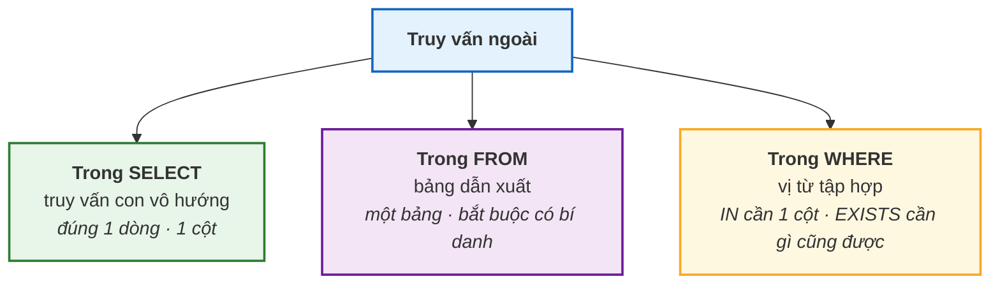
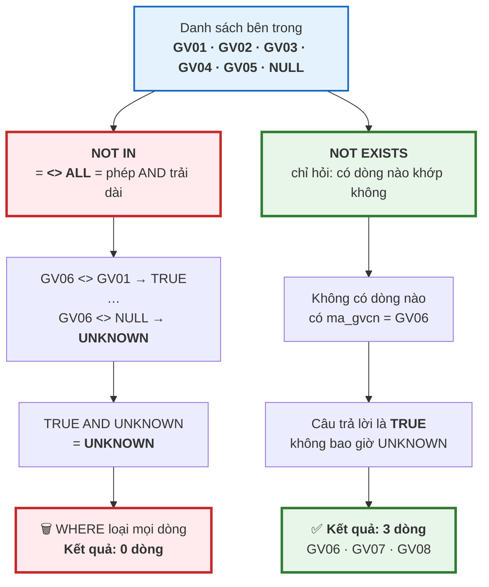

# Bài 27 — Truy vấn con (Subquery) và EXISTS

!!! abstract "🎯 Học xong bài này, bạn sẽ"
    - Viết được **truy vấn con** ở cả ba vị trí: trong `SELECT`, trong `FROM` và trong `WHERE`
    - Phân biệt **truy vấn con vô hướng**, **bảng dẫn xuất**, truy vấn con **tương quan** và **không tương quan**
    - Chọn đúng giữa `IN`, `EXISTS` và `JOIN` cho bài toán "có tồn tại hay không"
    - Giải thích được vì sao `NOT IN` gặp `NULL` lại trả về **rỗng một cách bí ẩn**, và sửa bằng `NOT EXISTS`
    - Dùng `ANY` / `ALL` và biết chúng chính là bộ khung mà `IN` / `NOT IN` viết tắt

## 🧠 Câu chuyện mở đầu

Cô chủ nhiệm giao bạn hai việc trong cùng một buổi chiều.

Việc thứ nhất: *"Em lọc giúp cô danh sách học sinh **chưa có phụ huynh** nào trong hệ thống, để cô gọi điện xác minh."*

Việc thứ hai: *"Và cô cần biết thầy cô nào **chưa chủ nhiệm lớp nào**, để phân công cho lớp 9A3."*

Hai việc nghe giống nhau y hệt. Bạn viết cùng một khuôn câu lệnh cho cả hai: *"lấy những ai mà mã của họ **không nằm trong** danh sách bên kia."*

Việc thứ nhất chạy đúng: máy trả về đúng một bạn — Đinh Thị Vân, `HS040`.

Việc thứ hai trả về… **không dòng nào.** Trống trơn.

Nhưng bạn biết chắc là sai. Trường có 8 giáo viên và chỉ có 5 lớp đã có chủ nhiệm. Vậy phải còn 3 người rảnh. Máy không báo lỗi, không cảnh báo gì — nó chỉ im lặng đưa bạn một tờ giấy trắng.

Cùng một câu lệnh, một lần đúng một lần sai. Khác biệt duy nhất giữa hai bảng là gì, và vì sao nó đủ sức phá huỷ cả kết quả?

## 📖 Khái niệm & thuật ngữ

### Truy vấn con là gì

**Truy vấn con** (*subquery*) là một câu `SELECT` được lồng bên trong một câu lệnh SQL khác.

Câu lệnh bao ngoài gọi là **truy vấn ngoài** (*outer query*). Truy vấn con luôn được đặt trong ngoặc đơn.

Ý tưởng rất tự nhiên: bạn đã biết `SELECT` nhận một bảng và trả về một bảng. Vậy thì chỗ nào SQL cần một bảng, ta đưa cho nó một `SELECT`; chỗ nào SQL cần một giá trị, ta đưa cho nó một `SELECT` trả về một giá trị. Đó là toàn bộ câu chuyện.

Truy vấn con dùng được ở ba vị trí, và mỗi vị trí đòi một **hình dạng** kết quả khác nhau:

| Vị trí | Tên gọi | Kết quả phải có hình dạng | Ví dụ ý nghĩa |
|---|---|---|---|
| Trong `SELECT` | **Truy vấn con vô hướng** | Đúng **1 dòng, 1 cột** | "kèm theo mỗi học sinh là số con điểm của bạn ấy" |
| Trong `FROM` | **Bảng dẫn xuất** | Một **bảng** bất kỳ | "coi kết quả gom nhóm như một bảng, rồi lọc tiếp trên đó" |
| Trong `WHERE` | Vị từ tập hợp | **1 cột, nhiều dòng** (với `IN`) hoặc **bất kỳ** (với `EXISTS`) | "chỉ giữ học sinh có mã nằm trong danh sách người đã mượn sách" |

### Vô hướng và bảng dẫn xuất

**Truy vấn con vô hướng** (*scalar subquery*) là truy vấn con trả về **đúng một dòng và đúng một cột** — tức là một giá trị đơn lẻ. Nó dùng được ở mọi chỗ SQL chờ một giá trị: trong danh sách `SELECT`, trong một phép so sánh của `WHERE`, thậm chí trong `ORDER BY`.

Nếu nó trả về **nhiều hơn một dòng**, PostgreSQL báo lỗi ngay. Nếu nó trả về **không dòng nào**, nó cho giá trị `NULL` — và đây là một cái bẫy im lặng, vì `NULL` sẽ kéo theo mọi hệ quả của [logic ba giá trị ở Bài 24](24-select-where-order-by.md).

**Bảng dẫn xuất** (*derived table*) là truy vấn con đặt trong `FROM`, được dùng như một bảng thật. Trong PostgreSQL nó **bắt buộc phải có bí danh** — viết `) AS t` ở cuối, nếu không sẽ lỗi cú pháp.

Bảng dẫn xuất giải quyết đúng một vấn đề mà [Bài 26](26-group-by-having.md) để lại: bạn không lọc được theo **bí danh** của một biểu thức, vì bí danh sinh ra ở bước 5 của thứ tự thực thi logic. Nhưng nếu gói cả câu lệnh thành một bảng dẫn xuất, thì ở **tầng ngoài** bí danh đó đã là một cột có thật, và `WHERE` dùng được nó bình thường.

### Tương quan và không tương quan — khác biệt quan trọng nhất về hiệu năng

**Truy vấn con không tương quan** (*uncorrelated subquery*) là truy vấn con **không** tham chiếu tới cột nào của truy vấn ngoài. Nó tự đứng một mình được: copy ra chạy riêng vẫn cho kết quả.

Hệ quả: nó chỉ cần chạy **một lần duy nhất**. PostgreSQL tính ra kết quả, giữ lại, rồi dùng cho cả 40 dòng bên ngoài.

**Truy vấn con tương quan** (*correlated subquery*) là truy vấn con **có** tham chiếu tới một cột của truy vấn ngoài. Copy ra chạy riêng thì lỗi, vì thiếu cột đó.

Hệ quả: về mặt ngữ nghĩa, nó phải chạy **lại một lần cho mỗi dòng** của truy vấn ngoài. Truy vấn ngoài có 40 dòng thì truy vấn con chạy 40 lần, mỗi lần với một giá trị khác.

!!! note "'Chạy lặp' là chuyện ngữ nghĩa, không phải lời hứa về cách máy làm thật"
    Giống như thứ tự thực thi logic ở [Bài 26](26-group-by-having.md), "chạy 40 lần" là **hợp đồng về kết quả**, không phải kế hoạch thực thi.

    Bộ tối ưu của PostgreSQL thường viết lại một truy vấn con tương quan thành một phép **kết nối** (*join*) và làm một lượt duy nhất. Nhưng nó **không luôn làm được**, và khi không làm được thì con số "một lần cho mỗi dòng" trở thành sự thật đau đớn: 50.000 dòng ngoài × một lần quét bảng bên trong.

    Cấp 4 sẽ cho bạn đọc `EXPLAIN` để biết chính xác lần này nó chọn cách nào.

### `IN`, `EXISTS`, và hai phép kết nối nửa vời

Hai vị từ này trả lời cùng một câu hỏi — *"bên kia có dòng nào khớp không?"* — nhưng bằng hai lối nghĩ khác nhau.

- **`IN`** so sánh **một giá trị** với một **danh sách giá trị**. Truy vấn con phải trả về đúng **một cột**.
- **`EXISTS`** hỏi truy vấn con *"mày có trả về dòng nào không?"*. Nó **không quan tâm nội dung**, chỉ quan tâm có hay không. Vì thế trong `EXISTS` người ta viết `SELECT 1` — chọn hằng số 1 cho gọn, vì giá trị chẳng bao giờ được đọc.

Hai khuôn này có tên riêng trong lý thuyết cơ sở dữ liệu:

**Bán kết nối** (*semi join*) là phép ghép chỉ để **kiểm tra sự tồn tại**: mỗi dòng của bảng trái xuất hiện **tối đa một lần** trong kết quả, và **không** cột nào của bảng phải được lấy ra. `IN` và `EXISTS` đều là bán kết nối.

**Kết nối chống** (*anti join*) — có tài liệu tiếng Việt gọi là *phản kết nối* — là phép ghép chỉ giữ những dòng bảng trái **không** có bạn khớp. `NOT IN` và `NOT EXISTS` là kết nối chống. [Bài 25](25-join.md) đã giới thiệu khuôn `LEFT JOIN ... WHERE cột_phải IS NULL`; đó là cách thứ ba viết cùng phép này.

Đây là điểm mấu chốt để hiểu vì sao `JOIN` thường **không** thay được `IN`: một `JOIN` thường là phép ghép **đầy đủ**, nên nếu bảng phải có 2 dòng khớp thì dòng bảng trái bị **nhân lên thành 2**. Bán kết nối thì không bao giờ nhân dòng.

### Bẫy `NOT IN` với `NULL` — trả lời câu chuyện mở đầu

Đây là phần quan trọng nhất của bài, và nó là **hệ quả trực tiếp** của logic ba giá trị ở [Bài 24](24-select-where-order-by.md).

Chìa khoá nằm ở chỗ `IN` và `NOT IN` chỉ là cách viết tắt của `ANY` và `ALL`:

| Bạn viết | SQL hiểu là |
|---|---|
| `x IN (danh sách)` | `x = ANY (danh sách)` |
| `x NOT IN (danh sách)` | `x <> ALL (danh sách)` |

- **`= ANY`** nghĩa là *"chỉ cần **một** phép so sánh cho `TRUE`"*. Một cái `NULL` trong danh sách cho `UNKNOWN`, nhưng nếu có một giá trị khác khớp thật thì vẫn `TRUE`. `NULL` **vô hại**.
- **`<> ALL`** nghĩa là *"**mọi** phép so sánh phải cho `TRUE`"*. Chỉ cần **một** phép so sánh cho `UNKNOWN` là cả biểu thức không thể là `TRUE` nữa — nó thành `UNKNOWN`. Và `WHERE` loại mọi dòng `UNKNOWN`.

Vậy nên: **nếu danh sách bên trong `NOT IN` chứa dù chỉ một `NULL`, thì `NOT IN` trả về rỗng cho MỌI dòng.** Không phải "đôi khi sai" — mà là **luôn luôn rỗng**.

Xem bằng bảng chân lý, với `x = 'GV06'` và danh sách `('GV01', NULL)`:

| Phép so sánh | Kết quả |
|---|---|
| `'GV06' <> 'GV01'` | `TRUE` |
| `'GV06' <> NULL` | **`UNKNOWN`** |
| `TRUE AND UNKNOWN` | **`UNKNOWN`** ← xem lại bảng `AND` ở Bài 24 |

Dòng `GV06` cho `UNKNOWN`, nên bị loại. Mọi giáo viên khác cũng vậy. Kết quả: rỗng.

Còn `IN` thì sao? `'GV01' = 'GV01'` cho `TRUE`, và `TRUE OR UNKNOWN` vẫn là `TRUE`. Nên `IN` vẫn hoạt động đúng. **Chỉ `NOT IN` mới nguy hiểm.**

Trong câu chuyện mở đầu: cột `phu_huynh.ma_hs` được khai `NOT NULL`, nên `NOT IN` an toàn. Cột `lop.ma_gvcn` **cho phép `NULL`** và lớp `9A3` đang rỗng — nên `NOT IN` chết.

!!! danger "Quy tắc thực hành: đừng dùng `NOT IN` với truy vấn con"
    Có ba cách viết kết nối chống. Hãy dùng cách thứ nhất, biết cách thứ hai, và tránh cách thứ ba:

    1. **`NOT EXISTS`** — luôn đúng, kể cả khi có `NULL`. Đây là lựa chọn mặc định.
    2. **`LEFT JOIN ... WHERE cột_phải IS NULL`** — cũng luôn đúng, đã học ở [Bài 25](25-join.md).
    3. **`NOT IN`** — chỉ an toàn khi bạn **chứng minh được** cột bên trong là `NOT NULL`. Mà ràng buộc có thể bị đổi sau này, còn câu lệnh của bạn thì không tự biết.

    Vì sao `NOT EXISTS` miễn nhiễm? Vì nó không so sánh giá trị với danh sách. Nó chỉ hỏi *"có dòng nào không"*, và câu trả lời luôn là `TRUE` hoặc `FALSE`, không bao giờ `UNKNOWN`.

### `ANY` và `ALL` dùng độc lập

Ngoài vai trò "bộ khung của `IN`", hai từ khoá này còn dùng trực tiếp với các toán tử so sánh khác:

| Viết | Nghĩa |
|---|---|
| `x > ANY (SELECT c ...)` | `x` lớn hơn **ít nhất một** giá trị → lớn hơn giá trị **nhỏ nhất** |
| `x > ALL (SELECT c ...)` | `x` lớn hơn **mọi** giá trị → lớn hơn giá trị **lớn nhất** |
| `x = ANY (...)` | y hệt `x IN (...)` |
| `x <> ALL (...)` | y hệt `x NOT IN (...)` |

`SOME` là từ đồng nghĩa hoàn toàn của `ANY`; chuẩn SQL cho cả hai, PostgreSQL nhận cả hai.

Cách nhớ: **`ANY` là phép `OR` trải dài, `ALL` là phép `AND` trải dài.** Và vì `ALL` là `AND`, nó thừa hưởng đúng cái bẫy `NULL` nói trên.

### Bảng thuật ngữ

| Tiếng Việt | English | Nghĩa dễ hiểu |
|---|---|---|
| Truy vấn con | *subquery* | Một câu `SELECT` lồng bên trong câu lệnh khác, đặt trong ngoặc đơn |
| Truy vấn con vô hướng | *scalar subquery* | Truy vấn con trả về đúng 1 dòng 1 cột, dùng được ở mọi chỗ chờ một giá trị; trả về 0 dòng thì cho `NULL` |
| Bảng dẫn xuất | *derived table* | Truy vấn con đặt trong `FROM` và dùng như một bảng; PostgreSQL **bắt buộc** phải đặt bí danh cho nó |
| Truy vấn con tương quan | *correlated subquery* | Truy vấn con có tham chiếu cột của truy vấn ngoài, nên về ngữ nghĩa phải chạy lại một lần cho mỗi dòng ngoài |
| Truy vấn con không tương quan | *uncorrelated subquery* | Truy vấn con không tham chiếu truy vấn ngoài, nên chỉ cần chạy một lần duy nhất |
| Truy vấn ngoài | *outer query* | Câu lệnh bao quanh truy vấn con |
| Bán kết nối | *semi join* | Phép ghép chỉ để kiểm tra tồn tại — mỗi dòng bảng trái ra tối đa một lần, không lấy cột nào của bảng phải; `IN` và `EXISTS` đều là bán kết nối |

## 🖼️ Sơ đồ

Ba vị trí của truy vấn con, và hình dạng kết quả mà mỗi vị trí đòi hỏi:



Vì sao `NOT IN` chết mà `NOT EXISTS` sống, khi danh sách có một ô rỗng:



## 💻 Thực hành

### Truy vấn con vô hướng trong `SELECT`

Kèm theo mỗi học sinh là số con điểm của bạn ấy, lấy bằng một truy vấn con **tương quan** — để ý nó dùng `h.ma_hs` của truy vấn ngoài:

```sql
-- KỲ VỌNG: 40 dòng
-- KỲ VỌNG: so_con_diem = 12
-- KỲ VỌNG: so_luot_muon = 2
SELECT h.ma_hs,
       h.ho_ten,
       (SELECT count(*) FROM diem d      WHERE d.ma_hs = h.ma_hs) AS so_con_diem,
       (SELECT count(*) FROM muon_sach m WHERE m.ma_hs = h.ma_hs) AS so_luot_muon
FROM hoc_sinh h
ORDER BY h.ma_hs;
```

Đủ 40 dòng — **truy vấn con trong `SELECT` không làm mất dòng nào**. Bạn `HS001` có 12 con điểm (9 môn điểm Học kỳ cộng 3 môn chính có thêm điểm 1 tiết) và 2 lượt mượn sách.

Đây là lựa chọn thay cho `LEFT JOIN ... GROUP BY`. Ưu điểm: không sợ bẫy nhân dòng của [Bài 26](26-group-by-having.md) khi đếm hai thứ khác nhau trong cùng một câu. Nhược điểm: mỗi cột thêm vào là một lần quét bảng nữa.

Chú ý học sinh `HS040` và các bạn từ `HS026` trở đi: họ chưa mượn cuốn nào, và truy vấn con trả về `0` chứ không phải `NULL`, vì `count(*)` của tập rỗng là `0`.

Nhưng nếu truy vấn con dùng `max` thay cho `count`, tập rỗng lại cho `NULL`:

```sql
-- KỲ VỌNG: 15 dòng
-- KỲ VỌNG: ma_hs = HS026
-- KỲ VỌNG: lan_muon_gan_nhat = NULL
SELECT h.ma_hs,
       (SELECT max(m.ngay_muon) FROM muon_sach m WHERE m.ma_hs = h.ma_hs) AS lan_muon_gan_nhat
FROM hoc_sinh h
WHERE (SELECT max(m.ngay_muon) FROM muon_sach m WHERE m.ma_hs = h.ma_hs) IS NULL
ORDER BY h.ma_hs;
```

**15 bạn** — từ `HS026` tới `HS040` — chưa từng mượn sách. Dữ liệu mẫu chỉ cho `HS001`…`HS025` mượn, mỗi bạn hai lượt.

### Truy vấn con vô hướng **không tương quan** trong `WHERE`

Ở đây truy vấn con đứng một mình được, nên nó chỉ chạy **một lần**:

```sql
-- KỲ VỌNG: 4 dòng
-- KỲ VỌNG: ma_gv = GV01
SELECT ma_gv, ho_ten, luong
FROM giao_vien
WHERE luong > (SELECT avg(luong) FROM giao_vien)
ORDER BY ma_gv;
```

Lương trung bình của 8 giáo viên là **14.450.000**. Bốn người vượt mức đó: `GV01`, `GV02`, `GV04`, `GV06`.

Thử copy `SELECT avg(luong) FROM giao_vien` ra chạy riêng — nó chạy được. Đó chính là dấu hiệu nhận biết "không tương quan".

Và lưu ý: câu này **không** viết được bằng `HAVING`. `WHERE luong > avg(luong)` là hàm tổng hợp trong `WHERE` — lỗi. Còn `HAVING` thì lọc nhóm, trong khi ở đây ta muốn lọc **dòng**. Truy vấn con là công cụ đúng.

### Truy vấn con **tương quan** trong `WHERE`

Bài toán: *"sách nào được mượn nhiều hơn mức trung bình của một cuốn sách?"*

```sql
-- KỲ VỌNG: 10 dòng
-- KỲ VỌNG: ma_sach = S001
-- KỲ VỌNG: so_luot = 3
SELECT s.ma_sach,
       s.ten_sach,
       (SELECT count(*) FROM muon_sach m WHERE m.ma_sach = s.ma_sach) AS so_luot
FROM sach s
WHERE (SELECT count(*) FROM muon_sach m WHERE m.ma_sach = s.ma_sach)
      > (SELECT avg(c) FROM (SELECT count(*) AS c FROM muon_sach GROUP BY ma_sach) AS t)
ORDER BY s.ma_sach;
```

Có 50 lượt mượn chia cho 20 cuốn sách, nên trung bình mỗi cuốn được mượn **2,5** lượt. Đúng **10 cuốn** được mượn 3 lượt, 10 cuốn còn lại 2 lượt.

Câu này có cả hai loại truy vấn con trong một chỗ, và đó là bài học đáng để ý:

- `(SELECT count(*) ... WHERE m.ma_sach = s.ma_sach)` **tương quan** — nó dùng `s.ma_sach`, nên phải chạy lại cho từng cuốn sách.
- `(SELECT avg(c) FROM (...) AS t)` **không tương quan** — nó chỉ chạy một lần cho cả câu lệnh.

Để ý bên trong nó còn có một **bảng dẫn xuất** `(SELECT count(*) AS c FROM muon_sach GROUP BY ma_sach) AS t`: ta cần "trung bình của các số đếm", mà SQL không cho lồng hàm tổng hợp vào nhau kiểu `avg(count(*))`. Bảng dẫn xuất là cách gỡ: gom nhóm ở tầng trong, lấy trung bình ở tầng ngoài.

### Bảng dẫn xuất trong `FROM`

Bài toán: *"lớp nào có từ 7 học sinh trở lên?"* — và lần này lọc bằng `WHERE` trên **bí danh**, điều mà `HAVING` không cho:

```sql
-- KỲ VỌNG: 3 dòng
-- KỲ VỌNG: ma_lop = L03
-- KỲ VỌNG: so_hs = 8
SELECT t.ma_lop, t.so_hs
FROM (
    SELECT ma_lop, count(*) AS so_hs
    FROM hoc_sinh
    GROUP BY ma_lop
) AS t
WHERE t.so_hs >= 7
ORDER BY t.so_hs DESC, t.ma_lop;
```

Ba lớp: `L03` với 8 bạn, `L05` và `L06` mỗi lớp 7 bạn.

Ở tầng ngoài, `so_hs` đã là một **cột thật** của bảng `t`, nên `WHERE` dùng được nó. Nhớ lại [Bài 26](26-group-by-having.md): trong cùng một tầng thì `HAVING so_hs > 6` sẽ lỗi, vì bí danh chưa tồn tại ở bước 4.

!!! tip "Bảng dẫn xuất **bắt buộc** có bí danh"
    Bỏ `AS t` đi là lỗi cú pháp ngay:

    <!-- sql:co-y-loi -->
    ```sql
    SELECT * FROM (SELECT ma_lop, count(*) FROM hoc_sinh GROUP BY ma_lop);
    ```

    PostgreSQL báo lỗi đại ý *"truy vấn con trong `FROM` phải có bí danh"*. Đây là một trong vài chỗ PostgreSQL khắt khe hơn chuẩn SQL, và cũng là lỗi cú pháp mà người mới gặp nhiều nhất khi bắt đầu dùng bảng dẫn xuất.

    Bài 28 sẽ cho bạn một cách viết dễ đọc hơn hẳn cho đúng việc này: **CTE**.

### `IN` vs `EXISTS` vs `JOIN` — bốn cách, hai kết quả

Bài toán bán kết nối kinh điển: *"những học sinh nào đã từng mượn sách?"*

```sql
-- KỲ VỌNG: dung_in = 25
-- KỲ VỌNG: dung_exists = 25
-- KỲ VỌNG: dung_join_co_distinct = 25
-- KỲ VỌNG: dung_join_khong_distinct = 50
SELECT (SELECT count(*) FROM hoc_sinh h
        WHERE h.ma_hs IN (SELECT m.ma_hs FROM muon_sach m))                    AS dung_in,
       (SELECT count(*) FROM hoc_sinh h
        WHERE EXISTS (SELECT 1 FROM muon_sach m WHERE m.ma_hs = h.ma_hs))      AS dung_exists,
       (SELECT count(DISTINCT h.ma_hs) FROM hoc_sinh h
        JOIN muon_sach m ON m.ma_hs = h.ma_hs)                                 AS dung_join_co_distinct,
       (SELECT count(*) FROM hoc_sinh h
        JOIN muon_sach m ON m.ma_hs = h.ma_hs)                                 AS dung_join_khong_distinct;
```

Ba cách đầu cho **25** — đúng số học sinh đã từng mượn. Cách thứ tư cho **50**, tức là sai gấp đôi.

Vì sao? Vì mỗi bạn mượn 2 lượt, nên `JOIN` **nhân mỗi học sinh thành 2 dòng**. `IN` và `EXISTS` là **bán kết nối** nên không bao giờ nhân dòng; `JOIN` là phép ghép đầy đủ nên có nhân, và bạn phải tự nhớ thêm `DISTINCT`.

Bảng đánh đổi — đây là bảng nên thuộc:

| | `IN (SELECT ...)` | `EXISTS (SELECT 1 ...)` | `JOIN` |
|---|---|---|---|
| Có nhân dòng không | **Không** | **Không** | **Có** — phải thêm `DISTINCT` |
| Lấy được cột của bảng kia không | Không | Không | **Có** — đây là lý do duy nhất nên dùng `JOIN` |
| Truy vấn con phải trả bao nhiêu cột | Đúng **1** | Bao nhiêu cũng được | — |
| Chịu bẫy `NULL` không | `IN` an toàn, **`NOT IN` rất nguy hiểm** | **An toàn cả hai chiều** | An toàn |
| Đọc tự nhiên khi nào | Danh sách giá trị ngắn, cố định | Điều kiện khớp phức tạp, nhiều cột | Cần dữ liệu của cả hai bảng |
| Tốc độ trên PostgreSQL 16 | Thường như nhau — bộ tối ưu quy về cùng một kế hoạch | Như trên | Như trên |

!!! tip "Chọn thế nào trong thực tế"
    1. Cần **cột** của bảng kia → `JOIN`. Không có lựa chọn nào khác.
    2. Chỉ cần biết **có tồn tại hay không** → `EXISTS`. Nó diễn đạt đúng ý định, không nhân dòng, và miễn nhiễm với `NULL`.
    3. Danh sách là vài giá trị viết tay → `IN ('L01', 'L02')`. Gọn nhất.
    4. Phủ định "không tồn tại" → **luôn** `NOT EXISTS`.

    Về tốc độ, đừng chọn theo cảm tính. Trên PostgreSQL hiện đại, `IN` và `EXISTS` với truy vấn con gần như luôn được biến thành cùng một nút kế hoạch (`Hash Semi Join`). Cấp 4 sẽ cho bạn nhìn thấy nút đó bằng `EXPLAIN`.

### Kết nối chống — khi `NOT IN` đúng

Việc thứ nhất của cô chủ nhiệm: *"học sinh nào chưa có phụ huynh?"* Cột `phu_huynh.ma_hs` khai `NOT NULL`, nên cả ba cách đều đúng:

```sql
-- KỲ VỌNG: 1 dòng
-- KỲ VỌNG: ma_hs = HS040
SELECT h.ma_hs, h.ho_ten
FROM hoc_sinh h
WHERE h.ma_hs NOT IN (SELECT p.ma_hs FROM phu_huynh p)
ORDER BY h.ma_hs;
```

```sql
-- KỲ VỌNG: 1 dòng
-- KỲ VỌNG: ma_hs = HS040
SELECT h.ma_hs, h.ho_ten
FROM hoc_sinh h
WHERE NOT EXISTS (SELECT 1 FROM phu_huynh p WHERE p.ma_hs = h.ma_hs)
ORDER BY h.ma_hs;
```

```sql
-- KỲ VỌNG: 1 dòng
-- KỲ VỌNG: ma_hs = HS040
SELECT h.ma_hs, h.ho_ten
FROM hoc_sinh h
LEFT JOIN phu_huynh p ON p.ma_hs = h.ma_hs
WHERE p.ma_ph IS NULL
ORDER BY h.ma_hs;
```

Ba câu, một kết quả: `HS040` — Đinh Thị Vân. Cô gọi điện cho nhà bạn ấy được rồi.

### Kết nối chống — khi `NOT IN` chết

Việc thứ hai: *"giáo viên nào chưa chủ nhiệm lớp nào?"* Lần này cột bên trong là `lop.ma_gvcn`, **cho phép `NULL`** — và lớp `9A3` đang rỗng.

```sql
-- KỲ VỌNG: 0 dòng
SELECT g.ma_gv, g.ho_ten
FROM giao_vien g
WHERE g.ma_gv NOT IN (SELECT l.ma_gvcn FROM lop l)
ORDER BY g.ma_gv;
```

**Không một dòng nào.** Câu lệnh chạy hoàn hảo, không cảnh báo, và kết quả sai hoàn toàn.

Xem tận mắt cái `NULL` gây ra chuyện này:

```sql
-- KỲ VỌNG: 6 dòng
-- KỲ VỌNG: ma_gvcn = NULL
SELECT l.ma_lop, l.ten_lop, l.ma_gvcn
FROM lop l
ORDER BY l.ma_gvcn NULLS FIRST;
```

Sáu lớp, và dòng đầu tiên có `ma_gvcn` rỗng — đó là `L06` (`9A3`). Đúng **một** ô rỗng trong danh sách là đủ để phá `NOT IN`.

Ba cách sửa. Cách thứ nhất — vá bằng cách lọc `NULL` ra khỏi truy vấn con:

```sql
-- KỲ VỌNG: 3 dòng
-- KỲ VỌNG: ma_gv = GV06
SELECT g.ma_gv, g.ho_ten
FROM giao_vien g
WHERE g.ma_gv NOT IN (SELECT l.ma_gvcn FROM lop l WHERE l.ma_gvcn IS NOT NULL)
ORDER BY g.ma_gv;
```

Cách thứ hai — dùng `NOT EXISTS`, không cần vá gì cả:

```sql
-- KỲ VỌNG: 3 dòng
-- KỲ VỌNG: ma_gv = GV06
SELECT g.ma_gv, g.ho_ten
FROM giao_vien g
WHERE NOT EXISTS (SELECT 1 FROM lop l WHERE l.ma_gvcn = g.ma_gv)
ORDER BY g.ma_gv;
```

Cách thứ ba — kết nối chống bằng `LEFT JOIN` của [Bài 25](25-join.md):

```sql
-- KỲ VỌNG: 3 dòng
-- KỲ VỌNG: ma_gv = GV06
SELECT g.ma_gv, g.ho_ten
FROM giao_vien g
LEFT JOIN lop l ON l.ma_gvcn = g.ma_gv
WHERE l.ma_lop IS NULL
ORDER BY g.ma_gv;
```

Ba câu sau cùng cho **3 dòng**: `GV06` (Vũ Minh Tuấn), `GV07` (Đỗ Thị Thu Hà), `GV08` (Bùi Anh Khoa). Đây là câu trả lời mà cô cần.

So sánh bốn cách trong một câu lệnh, để không ai nghi ngờ:

```sql
-- KỲ VỌNG: not_in_khong_loc_null = 0
-- KỲ VỌNG: not_in_co_loc_null = 3
-- KỲ VỌNG: not_exists = 3
-- KỲ VỌNG: left_join_is_null = 3
SELECT (SELECT count(*) FROM giao_vien g
        WHERE g.ma_gv NOT IN (SELECT l.ma_gvcn FROM lop l))                            AS not_in_khong_loc_null,
       (SELECT count(*) FROM giao_vien g
        WHERE g.ma_gv NOT IN (SELECT l.ma_gvcn FROM lop l WHERE l.ma_gvcn IS NOT NULL)) AS not_in_co_loc_null,
       (SELECT count(*) FROM giao_vien g
        WHERE NOT EXISTS (SELECT 1 FROM lop l WHERE l.ma_gvcn = g.ma_gv))               AS not_exists,
       (SELECT count(*) FROM giao_vien g
        LEFT JOIN lop l ON l.ma_gvcn = g.ma_gv WHERE l.ma_lop IS NULL)                  AS left_join_is_null;
```

`0` so với `3` — chênh lệch không phải là "làm tròn khác nhau", mà là **mất trắng toàn bộ kết quả**.

### Bẫy này rình ngay cả truy vấn đang đúng

Câu `NOT IN` cho học sinh chưa có phụ huynh ở trên đang chạy đúng, vì `phu_huynh.ma_hs` là `NOT NULL`. Nhưng "đang đúng" không phải "sẽ luôn đúng". Dựng một bản sao có **một** dòng rỗng và xem:

```sql
DROP TABLE IF EXISTS b27_ph_co_null CASCADE;

CREATE TABLE b27_ph_co_null (
    ma_ph CHAR(5) PRIMARY KEY,
    ma_hs CHAR(5)              -- CỐ Ý cho phép NULL
);

INSERT INTO b27_ph_co_null (ma_ph, ma_hs)
SELECT ma_ph, ma_hs FROM phu_huynh;

-- Một dòng "phụ huynh chưa gán con" lọt vào bảng
INSERT INTO b27_ph_co_null (ma_ph, ma_hs) VALUES ('PH999', NULL);

-- KỲ VỌNG: tong_so_dong = 46
-- KỲ VỌNG: so_dong_null = 1
SELECT count(*)                                AS tong_so_dong,
       count(*) - count(ma_hs)                 AS so_dong_null
FROM b27_ph_co_null;
```

45 dòng gốc cộng 1 dòng rỗng. Bây giờ chạy lại đúng hai câu lệnh cũ, không sửa một chữ:

```sql
-- KỲ VỌNG: not_in_gio_sai = 0
-- KỲ VỌNG: not_exists_van_dung = 1
SELECT (SELECT count(*) FROM hoc_sinh h
        WHERE h.ma_hs NOT IN (SELECT p.ma_hs FROM b27_ph_co_null p))                 AS not_in_gio_sai,
       (SELECT count(*) FROM hoc_sinh h
        WHERE NOT EXISTS (SELECT 1 FROM b27_ph_co_null p WHERE p.ma_hs = h.ma_hs))   AS not_exists_van_dung;
```

`NOT IN` **vừa hỏng**, còn `NOT EXISTS` vẫn trả về đúng 1 — vẫn là `HS040`.

Đây là điều đáng sợ nhất về cái bẫy này: nó không xuất hiện lúc bạn viết câu lệnh. Nó xuất hiện nhiều tháng sau, khi có người nhập một dòng thiếu dữ liệu, hoặc khi ai đó `ALTER TABLE ... DROP NOT NULL`. Báo cáo lặng lẽ trở thành rỗng, và không ai đọc báo cáo rỗng.

### `ANY` và `ALL`

`> ALL` nghĩa là "lớn hơn tất cả", tức là lớn hơn giá trị lớn nhất:

```sql
-- KỲ VỌNG: 3 dòng
-- KỲ VỌNG: ma_gv = GV02
SELECT ma_gv, ho_ten, luong
FROM giao_vien
WHERE luong > ALL (SELECT luong FROM giao_vien WHERE gioi_tinh = 'Nữ')
ORDER BY ma_gv;
```

Bốn cô giáo có lương cao nhất là 14.500.000. Ba người vượt mức đó: `GV02`, `GV04`, `GV06` — cả ba đều là nam.

`> ANY` nghĩa là "lớn hơn ít nhất một", tức là lớn hơn giá trị nhỏ nhất:

```sql
-- KỲ VỌNG: 7 dòng
-- KỲ VỌNG: ma_gv = GV01
SELECT ma_gv, ho_ten, luong
FROM giao_vien
WHERE luong > ANY (SELECT luong FROM giao_vien WHERE gioi_tinh = 'Nữ')
ORDER BY ma_gv;
```

Bảy người — tất cả trừ `GV07`, người đang có lương thấp nhất trường (11.900.000) nên không lớn hơn ai cả.

Và `= ANY` chính là `IN`, còn `<> ALL` chính là `NOT IN`. Kiểm chứng cả bốn cách viết cùng lúc:

```sql
-- KỲ VỌNG: dung_in = 12
-- KỲ VỌNG: dung_eq_any = 12
-- KỲ VỌNG: dung_not_in = 28
-- KỲ VỌNG: dung_ne_all = 28
SELECT count(*) FILTER (WHERE ma_lop IN ('L01', 'L02'))              AS dung_in,
       count(*) FILTER (WHERE ma_lop = ANY (ARRAY['L01', 'L02']))    AS dung_eq_any,
       count(*) FILTER (WHERE ma_lop NOT IN ('L01', 'L02'))          AS dung_not_in,
       count(*) FILTER (WHERE ma_lop <> ALL (ARRAY['L01', 'L02']))   AS dung_ne_all
FROM hoc_sinh;
```

`12` và `12`, `28` và `28` — từng cặp giống hệt nhau, vì chúng **là** cùng một thứ. Ở đây `ANY`/`ALL` nhận một mảng thay cho truy vấn con; cả hai dạng đều hợp lệ.

Bây giờ nhét một `NULL` vào mảng và xem cặp thứ hai tan rã:

```sql
-- KỲ VỌNG: in_co_null = 12
-- KỲ VỌNG: not_in_co_null = 0
SELECT count(*) FILTER (WHERE ma_lop = ANY (ARRAY['L01', 'L02', NULL]))   AS in_co_null,
       count(*) FILTER (WHERE ma_lop <> ALL (ARRAY['L01', 'L02', NULL]))  AS not_in_co_null
FROM hoc_sinh;
```

`IN` vẫn cho **12**, `NOT IN` tụt xuống **0**. Cùng một mảng, cùng một bảng — chỉ khác dấu phủ định. Đây là bằng chứng gọn nhất rằng bẫy không nằm ở `NULL` mà nằm ở chỗ **`ALL` là phép `AND`**.

### Học sinh có điểm cao hơn trung bình lớp mình

Đây là bài toán mẫu của truy vấn con tương quan. Vì cột `diem.diem_so` của database mẫu được **sinh ngẫu nhiên**, ta dựng một bảng nháp có điểm cố định để con số kiểm chứng được:

```sql
DROP TABLE IF EXISTS b27_diem_thi CASCADE;

CREATE TABLE b27_diem_thi (
    ma_hs   CHAR(5)      PRIMARY KEY,
    ma_lop  CHAR(3)      NOT NULL,
    diem_so NUMERIC(4,2) NOT NULL
);

INSERT INTO b27_diem_thi (ma_hs, ma_lop, diem_so) VALUES
('HS001', 'L01',  9.00),
('HS002', 'L01',  7.00),
('HS003', 'L01',  5.00),   -- trung bình L01 = 7.00
('HS007', 'L02', 10.00),
('HS008', 'L02',  6.00),
('HS009', 'L02',  2.00);   -- trung bình L02 = 6.00

-- KỲ VỌNG: 2 dòng
-- KỲ VỌNG: ma_hs = HS001
-- KỲ VỌNG: tb_lop = 7.00
SELECT t.ma_hs, t.ma_lop, t.diem_so,
       (SELECT round(avg(k.diem_so), 2)
        FROM b27_diem_thi k
        WHERE k.ma_lop = t.ma_lop) AS tb_lop
FROM b27_diem_thi t
WHERE t.diem_so > (SELECT avg(k.diem_so)
                   FROM b27_diem_thi k
                   WHERE k.ma_lop = t.ma_lop)
ORDER BY t.ma_hs;
```

Hai bạn: `HS001` (9.00 so với trung bình lớp 7.00) và `HS007` (10.00 so với 6.00).

Chú ý cả hai truy vấn con đều **tương quan** qua `k.ma_lop = t.ma_lop`: mỗi học sinh được so với trung bình của **lớp mình**, không phải trung bình toàn trường. Bỏ điều kiện tương quan đó đi là bài toán biến thành chuyện khác hẳn — và đó là lỗi hay gặp nhất khi viết truy vấn tương quan.

Cùng khuôn đó áp lên bảng `diem` thật. Bài **không** ghi số dòng mong đợi, vì điểm là ngẫu nhiên:

```sql
SELECT h.ma_lop, h.ma_hs, h.ho_ten,
       round((SELECT avg(d.diem_so) FROM diem d WHERE d.ma_hs = h.ma_hs), 2) AS tb_ban_ay
FROM hoc_sinh h
WHERE (SELECT avg(d.diem_so) FROM diem d WHERE d.ma_hs = h.ma_hs)
      > (SELECT avg(d2.diem_so)
         FROM diem d2
         JOIN hoc_sinh h2 ON h2.ma_hs = d2.ma_hs
         WHERE h2.ma_lop = h.ma_lop)
ORDER BY h.ma_lop, h.ma_hs;
```

Đây là nguyên tắc mà [Bài 26](26-group-by-having.md) đã nêu và bài này giữ nguyên: chỉ khẳng định những con số **tất định**, không khẳng định những con số chỉ tình cờ đúng ở một lần sinh dữ liệu.

### Dọn dẹp

```sql
DROP TABLE IF EXISTS b27_ph_co_null CASCADE;
DROP TABLE IF EXISTS b27_diem_thi CASCADE;

-- KỲ VỌNG: con_lai = 0
SELECT count(*) AS con_lai
FROM information_schema.tables
WHERE table_name LIKE 'b27\_%';
```

## ⚠️ Lỗi thường gặp

!!! danger "Lỗi 1: `NOT IN` với một truy vấn con có thể sinh `NULL`"
    <!-- sql:co-y-loi -->
    ```sql
    SELECT ma_gv FROM giao_vien
    WHERE ma_gv NOT IN (SELECT ma_gvcn FROM lop);
    ```

    Không báo lỗi. Không cảnh báo. Trả về **0 dòng** trong khi đáp án đúng là 3 dòng.

    Nguyên nhân: `NOT IN` là `<> ALL`, tức phép `AND` trải dài; một phép so sánh cho `UNKNOWN` là cả biểu thức thành `UNKNOWN`, và `WHERE` loại mọi dòng `UNKNOWN` — xem lại bảng chân lý `AND` ở [Bài 24](24-select-where-order-by.md).

    Sửa: **dùng `NOT EXISTS`.** Đừng đi vá bằng `WHERE ... IS NOT NULL` bên trong, vì bản vá đó phụ thuộc vào việc bạn còn nhớ nó ở mọi câu lệnh tương lai.

!!! warning "Lỗi 2: Truy vấn con vô hướng trả về nhiều hơn một dòng"
    <!-- sql:co-y-loi -->
    ```sql
    SELECT l.ten_lop,
           (SELECT h.ho_ten FROM hoc_sinh h WHERE h.ma_lop = l.ma_lop) AS mot_hoc_sinh
    FROM lop l;
    ```

    PostgreSQL báo lỗi *more than one row returned by a subquery used as an expression*.

    Lỗi này đặc biệt khó chịu vì nó **phụ thuộc dữ liệu**: nếu hôm nay mỗi lớp tình cờ chỉ có một học sinh thì câu lệnh chạy ngon lành, rồi lớp đông thêm một người là nó vỡ. Nó chạy trên máy bạn và chết trên máy thật.

    Hai cách sửa, tuỳ ý bạn muốn gì. Muốn **một** đại diện thì nói rõ là đại diện nào:

    ```sql
    -- KỲ VỌNG: 6 dòng
    -- KỲ VỌNG: ten_lop = 8A1
    SELECT l.ten_lop,
           (SELECT h.ho_ten FROM hoc_sinh h
            WHERE h.ma_lop = l.ma_lop
            ORDER BY h.ma_hs
            LIMIT 1) AS hoc_sinh_dau_danh_sach
    FROM lop l
    ORDER BY l.ma_lop;
    ```

    Muốn **tất cả** thì dùng `string_agg` của [Bài 26](26-group-by-having.md), hoặc chuyển sang `JOIN`.

!!! warning "Lỗi 3: Quên rằng truy vấn con rỗng cho `NULL`, không cho 0"
    ```sql
    -- KỲ VỌNG: 40 dòng
    -- KỲ VỌNG: sai_cho_null = NULL
    -- KỲ VỌNG: dung_cho_so = 0
    SELECT h.ma_hs,
           (SELECT sum(1) FROM muon_sach m WHERE m.ma_hs = h.ma_hs)               AS sai_cho_null,
           (SELECT count(*) FROM muon_sach m WHERE m.ma_hs = h.ma_hs)             AS dung_cho_so,
           coalesce((SELECT sum(1) FROM muon_sach m WHERE m.ma_hs = h.ma_hs), 0)  AS da_vao_khuon
    FROM hoc_sinh h
    ORDER BY (SELECT count(*) FROM muon_sach m WHERE m.ma_hs = h.ma_hs), h.ma_hs;
    ```

    Dòng đầu tiên là một bạn chưa mượn sách bao giờ. `count(*)` cho **0**, nhưng `sum(...)` cho **`NULL`** — vì tổng của tập rỗng thì không xác định, đúng như [Bài 26](26-group-by-having.md) đã nêu.

    Hậu quả lan rộng: `NULL * 1000` là `NULL`, `NULL > 0` là `UNKNOWN`. Một cột `NULL` bất ngờ sẽ âm thầm làm rỗng mọi phép lọc phía sau. Hãy bọc `coalesce(..., 0)` ngay tại chỗ sinh ra nó.

!!! warning "Lỗi 4: Dùng `JOIN` cho câu hỏi 'có tồn tại hay không'"
    ```sql
    -- KỲ VỌNG: dem_bi_nhan_doi = 50
    -- KỲ VỌNG: dem_dung = 25
    SELECT (SELECT count(*) FROM hoc_sinh h JOIN muon_sach m ON m.ma_hs = h.ma_hs)  AS dem_bi_nhan_doi,
           (SELECT count(*) FROM hoc_sinh h
            WHERE EXISTS (SELECT 1 FROM muon_sach m WHERE m.ma_hs = h.ma_hs))       AS dem_dung;
    ```

    Câu hỏi là *"bao nhiêu học sinh đã từng mượn sách"*, đáp án là **25**. `JOIN` trả về **50** vì mỗi bạn mượn 2 lượt.

    Cái bẫy: nếu dữ liệu mẫu tình cờ chỉ có mỗi bạn một lượt mượn, hai con số sẽ trùng nhau và bạn không phát hiện gì. Rồi đến ngày có người mượn cuốn thứ hai.

    Quy tắc: **câu hỏi có chữ "có" hay "từng" thì dùng `EXISTS`, không dùng `JOIN`.**

!!! warning "Lỗi 5: Viết truy vấn con tương quan mà thiếu chính điều kiện tương quan"
    ```sql
    -- KỲ VỌNG: 6 dòng
    -- KỲ VỌNG: ma_lop = L01
    -- KỲ VỌNG: dung_tuong_quan = 6
    -- KỲ VỌNG: quen_tuong_quan = 40
    SELECT l.ma_lop,
           (SELECT count(*) FROM hoc_sinh h WHERE h.ma_lop = l.ma_lop) AS dung_tuong_quan,
           (SELECT count(*) FROM hoc_sinh h)                           AS quen_tuong_quan
    FROM lop l
    ORDER BY l.ma_lop;
    ```

    Cột thứ ba quên mất `WHERE h.ma_lop = l.ma_lop`, nên nó trả về **40** cho **mọi** lớp — toàn bộ sĩ số trường, thay vì sĩ số của từng lớp. Câu lệnh vẫn chạy, kết quả vẫn là số, chỉ có ý nghĩa là sai. Cột thứ hai viết đủ điều kiện tương quan nên cho đúng 6 cho lớp `L01`.

    Đây là lỗi khó thấy nhất trong cả bài, vì mắt người đọc một câu lệnh dài rất dễ bỏ qua một dòng `WHERE` thiếu. Mẹo phòng tránh: **luôn đặt bí danh cho cả bảng ngoài lẫn bảng trong** (`l` và `h`), và viết điều kiện tương quan thành dòng riêng. Khi hai bí danh cùng xuất hiện trên một dòng, bạn thấy ngay là đã nối chúng lại.

## ✍️ Bài tập

1. Viết truy vấn liệt kê các **môn học chưa được phân công cho giáo viên nào**. Làm hai cách: `NOT EXISTS` và `LEFT JOIN ... IS NULL`. Có bao nhiêu dòng?

2. Câu lệnh dưới đây trả về 0 dòng. Giải thích chính xác vì sao, bằng ngôn ngữ của logic ba giá trị, rồi sửa lại:

    <!-- sql:khong-chay -->
    ```sql
    SELECT ma_lop, ten_lop FROM lop
    WHERE ma_lop NOT IN (SELECT ma_lop FROM lop WHERE ma_gvcn IS NULL OR ma_gvcn > 'GV00');
    ```

3. Dùng **bảng dẫn xuất** để trả lời: *"những học sinh nào mượn nhiều sách hơn mức trung bình của một người đã từng mượn?"* Dự đoán kết quả trước khi chạy, và giải thích con số nhận được.

4. Viết truy vấn đưa ra, với **mỗi lớp**, sĩ số và số học sinh nữ — nhưng chỉ dùng **truy vấn con vô hướng trong `SELECT`**, không dùng `GROUP BY`. So sánh với cách làm bằng `GROUP BY` của [Bài 26](26-group-by-having.md): cách nào dễ đọc hơn, cách nào quét bảng nhiều lần hơn?

5. Hai câu sau đây có cho cùng kết quả không? Giải thích, và nói rõ trong tình huống nào chúng khác nhau:

    <!-- sql:khong-chay -->
    ```sql
    -- Câu A
    SELECT count(*) FROM hoc_sinh h WHERE h.ma_hs IN (SELECT m.ma_hs FROM muon_sach m);
    -- Câu B
    SELECT count(*) FROM hoc_sinh h JOIN muon_sach m ON m.ma_hs = h.ma_hs;
    ```

??? success "Đáp án"
    **Câu 1.**

    ```sql
    -- KỲ VỌNG: 1 dòng
    -- KỲ VỌNG: ma_mon = MH08
    SELECT m.ma_mon, m.ten_mon
    FROM mon_hoc m
    WHERE NOT EXISTS (SELECT 1 FROM phan_cong_day p WHERE p.ma_mon = m.ma_mon)
    ORDER BY m.ma_mon;
    ```

    ```sql
    -- KỲ VỌNG: 1 dòng
    -- KỲ VỌNG: ma_mon = MH08
    SELECT m.ma_mon, m.ten_mon
    FROM mon_hoc m
    LEFT JOIN phan_cong_day p ON p.ma_mon = m.ma_mon
    WHERE p.ma_mon IS NULL
    ORDER BY m.ma_mon;
    ```

    **1 dòng**: `MH08` — Địa lý. Trường có 9 môn nhưng chỉ 8 giáo viên, và không ai có chuyên môn Địa lý, nên môn này chưa được phân công.

    Ở đây `NOT IN` cũng chạy đúng, vì `phan_cong_day.ma_mon` nằm trong khoá chính nên bắt buộc `NOT NULL`. Nhưng thói quen nên là `NOT EXISTS`.

    **Câu 2.**

    Truy vấn con lấy `ma_lop` của những lớp thoả `ma_gvcn IS NULL OR ma_gvcn > 'GV00'` — điều kiện này đúng với **cả 6 lớp**, nên truy vấn con trả về đủ 6 mã lớp. Vậy `NOT IN` của 6 mã đó trên chính bảng 6 lớp cho 0 dòng.

    Đây là **0 dòng đúng**, không phải 0 dòng do bẫy `NULL`: truy vấn con trả về cột `ma_lop`, mà `ma_lop` là khoá chính nên không bao giờ `NULL`. Điểm đáng học ở bài này là: thấy "0 dòng" thì phải phân biệt được hai nguyên nhân — *"đáp án thật sự là rỗng"* và *"`NULL` đã phá câu lệnh"*.

    Cách phân biệt trong ba giây: chạy riêng truy vấn con rồi đếm số ô rỗng của nó.

    ```sql
    -- KỲ VỌNG: 1 dòng
    -- KỲ VỌNG: so_gia_tri = 6
    -- KỲ VỌNG: so_o_rong = 0
    SELECT count(*)                        AS so_gia_tri,
           count(*) - count(ma_lop)        AS so_o_rong
    FROM (SELECT ma_lop FROM lop WHERE ma_gvcn IS NULL OR ma_gvcn > 'GV00') AS t;
    ```

    `so_o_rong = 0` → `NOT IN` an toàn → kết quả rỗng là kết quả thật.

    **Câu 3.**

    ```sql
    -- KỲ VỌNG: 0 dòng
    SELECT t.ma_hs, t.so_luot
    FROM (SELECT ma_hs, count(*) AS so_luot FROM muon_sach GROUP BY ma_hs) AS t
    WHERE t.so_luot > (SELECT avg(c) FROM (SELECT count(*) AS c FROM muon_sach GROUP BY ma_hs) AS u)
    ORDER BY t.ma_hs;
    ```

    **0 dòng** — và đây là một đáp án đáng suy nghĩ chứ không phải một sự cố.

    Dữ liệu mẫu cho **đúng 25 học sinh** mượn, **mỗi bạn đúng 2 lượt**. Vậy trung bình là đúng 2, và không ai *nhiều hơn* 2. Phân bố hoàn toàn đều thì không có ai trên trung bình.

    Bài học: khi một truy vấn dạng "trên mức trung bình" trả về rỗng, đừng vội nghĩ mình viết sai. Hãy in mức trung bình ra xem trước:

    ```sql
    -- KỲ VỌNG: so_nguoi_muon = 25
    -- KỲ VỌNG: tong_luot = 50
    -- KỲ VỌNG: trung_binh = 2.00
    -- KỲ VỌNG: nhieu_nhat = 2
    SELECT count(*)                 AS so_nguoi_muon,
           sum(c)                   AS tong_luot,
           round(avg(c), 2)         AS trung_binh,
           max(c)                   AS nhieu_nhat
    FROM (SELECT ma_hs, count(*) AS c FROM muon_sach GROUP BY ma_hs) AS t;
    ```

    **Câu 4.**

    ```sql
    -- KỲ VỌNG: 6 dòng
    -- KỲ VỌNG: ten_lop = 8A1
    -- KỲ VỌNG: si_so = 6
    -- KỲ VỌNG: so_nu = 3
    SELECT l.ma_lop,
           l.ten_lop,
           (SELECT count(*) FROM hoc_sinh h WHERE h.ma_lop = l.ma_lop)                          AS si_so,
           (SELECT count(*) FROM hoc_sinh h WHERE h.ma_lop = l.ma_lop AND h.gioi_tinh = 'Nữ')   AS so_nu
    FROM lop l
    ORDER BY l.ma_lop;
    ```

    So sánh với cách của [Bài 26](26-group-by-having.md):

    | | Truy vấn con vô hướng | `LEFT JOIN` + `GROUP BY` + `FILTER` |
    |---|---|---|
    | Số lần quét `hoc_sinh` (về ngữ nghĩa) | **2 lần** — mỗi cột một lần | **1 lần** |
    | Có lớp rỗng thì sao | Vẫn hiện, số là `0` — tự nhiên | Vẫn hiện, nhưng **phải** dùng `count(h.ma_hs)` chứ không `count(*)` |
    | Thêm cột thứ ba | Thêm một truy vấn con nữa — dễ viết, đắt dần | Thêm một `FILTER` — gần như miễn phí |
    | Dễ đọc khi có 2 cột | Rất rõ ràng | Rõ ràng |
    | Dễ đọc khi có 8 cột | Rất dài, khó soát | Vẫn gọn |

    Kết luận thực dụng: **ít cột thống kê thì truy vấn con vô hướng dễ đọc hơn; nhiều cột thì `GROUP BY` + `FILTER` vừa gọn hơn vừa nhanh hơn.** Và hãy chú ý cái bẫy `count(*)` sau `LEFT JOIN` mà Bài 26 đã cảnh báo — truy vấn con vô hướng không có bẫy đó.

    **Câu 5.**

    **Không** cho cùng kết quả. Câu A trả về **25**, câu B trả về **50**.

    Câu A là **bán kết nối**: mỗi học sinh được xét một lần, chỉ để biết "có hay không". Câu B là phép ghép đầy đủ: mỗi học sinh xuất hiện đúng bằng số lượt mượn của mình, và dữ liệu mẫu cho mỗi bạn hai lượt.

    Hai câu **chỉ trùng nhau** khi quan hệ là một-một hoặc một-không: mỗi dòng bảng trái có nhiều nhất một dòng khớp bên phải. Ví dụ ghép `lop` với `giao_vien` qua `ma_gvcn` — vì `ma_gvcn` có `UNIQUE` nên không thể nhân dòng, và ở đó `IN` với `JOIN` cho cùng số.

    ```sql
    -- KỲ VỌNG: a_in = 25
    -- KỲ VỌNG: b_join = 50
    -- KỲ VỌNG: c_join_1_1 = 5
    -- KỲ VỌNG: d_in_1_1 = 5
    SELECT (SELECT count(*) FROM hoc_sinh h WHERE h.ma_hs IN (SELECT m.ma_hs FROM muon_sach m)) AS a_in,
           (SELECT count(*) FROM hoc_sinh h JOIN muon_sach m ON m.ma_hs = h.ma_hs)             AS b_join,
           (SELECT count(*) FROM lop l JOIN giao_vien g ON g.ma_gv = l.ma_gvcn)                AS c_join_1_1,
           (SELECT count(*) FROM lop l WHERE l.ma_gvcn IN (SELECT g.ma_gv FROM giao_vien g))   AS d_in_1_1;
    ```

    Cặp thứ hai cho `5` và `5` — bằng nhau, vì quan hệ GVCN là **1:1** và lớp `9A3` không có chủ nhiệm nên bị loại khỏi cả hai câu.

## 🔑 Tóm tắt

1. **Truy vấn con** dùng được ở ba vị trí, mỗi vị trí đòi một hình dạng: trong `SELECT` phải là **truy vấn con vô hướng** (1 dòng 1 cột, rỗng thì cho `NULL`); trong `FROM` là **bảng dẫn xuất** và **bắt buộc có bí danh**; trong `WHERE` là vị từ tập hợp với `IN` / `EXISTS` / `ANY` / `ALL`.
2. Truy vấn con **không tương quan** không tham chiếu truy vấn ngoài nên chạy **một lần**; truy vấn con **tương quan** có tham chiếu nên về ngữ nghĩa chạy **một lần cho mỗi dòng ngoài**. Dấu hiệu nhận biết: copy ra chạy riêng được hay không.
3. `IN` và `EXISTS` là **bán kết nối** — không bao giờ nhân dòng. `JOIN` là phép ghép đầy đủ nên **có** nhân dòng: trên `muon_sach`, `JOIN` cho 50 trong khi đáp án đúng là 25 học sinh. Chỉ dùng `JOIN` khi bạn cần **cột** của bảng kia.
4. **Bẫy lớn nhất của bài:** `NOT IN` là `<> ALL`, tức phép `AND` trải dài. Một `NULL` trong danh sách làm một phép so sánh thành `UNKNOWN`, `TRUE AND UNKNOWN` là `UNKNOWN`, và `WHERE` loại sạch mọi dòng — `NOT IN` trả về **rỗng cho mọi dòng**, không báo lỗi. Trên `lop.ma_gvcn` nó cho 0 dòng thay vì 3. `IN` (`= ANY`, phép `OR`) thì **không** bị ảnh hưởng.
5. Ba cách viết **kết nối chống**: `NOT EXISTS` (luôn đúng — hãy dùng cái này), `LEFT JOIN ... WHERE cột_phải IS NULL` (luôn đúng), và `NOT IN` (chỉ an toàn khi cột bên trong chắc chắn `NOT NULL`, mà ràng buộc thì có thể bị đổi sau lưng bạn).

---

⬅️ [Bài 26 — GROUP BY, HAVING và các hàm tổng hợp](26-group-by-having.md) · ➡️ [Bài 28 — CTE và CTE đệ quy](28-cte-va-recursive-cte.md)
