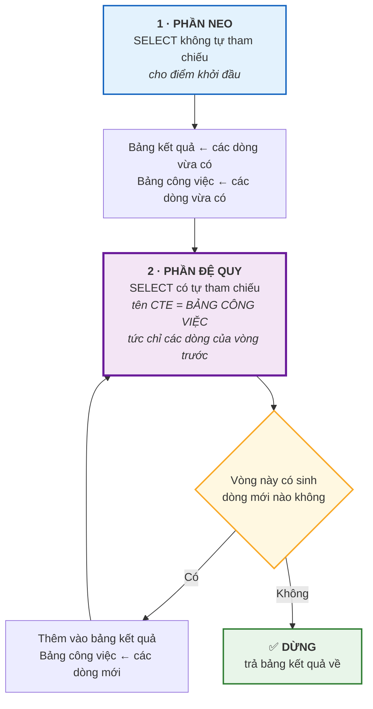
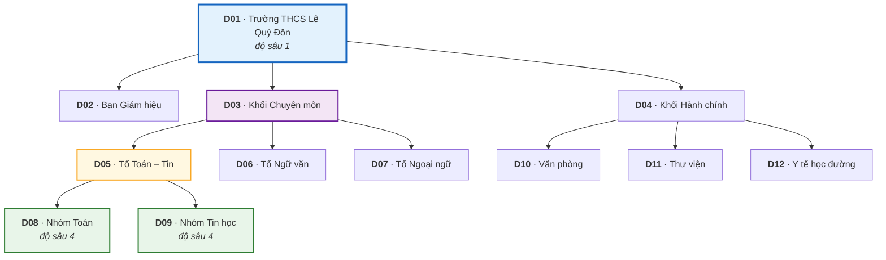

# Bài 28 — CTE và CTE đệ quy

!!! abstract "🎯 Học xong bài này, bạn sẽ"
    - Dùng `WITH` để **đặt tên cho từng bước trung gian**, và nối nhiều **CTE** lại thành một chuỗi đọc từ trên xuống
    - Giải thích được khi nào CTE nhanh hơn, khi nào chậm hơn truy vấn con lồng, qua khái niệm **rào vật chất hoá**
    - Viết được **CTE đệ quy** với đúng ba phần: **phần neo**, `UNION ALL`, và **phần đệ quy**
    - **Duyệt cây** tổ chức nhiều tầng và in ra cây có thụt lề bằng đúng một câu lệnh
    - Nhận ra và chặn được **đệ quy vô hạn** bằng cột độ sâu

## 🧠 Câu chuyện mở đầu

Nhà trường in sơ đồ tổ chức treo ở phòng hội đồng. Trên tờ giấy đó, *Trường THCS* nằm trên cùng. Dưới nó là *Ban Giám hiệu*, *Khối Chuyên môn*, *Khối Hành chính*. Dưới *Khối Chuyên môn* lại là *Tổ Toán – Tin*, *Tổ Ngữ văn*, *Tổ Ngoại ngữ*. Và dưới *Tổ Toán – Tin* còn có *Nhóm Toán*, *Nhóm Tin học*.

Bạn được giao lưu sơ đồ này vào database. Bạn làm rất gọn: một bảng ba cột — mã đơn vị, tên đơn vị, và **mã của đơn vị cha**. Đơn vị trên cùng thì để ô "cha" trống.

Cô hiệu trưởng hỏi: *"Em in cho cô toàn bộ các đơn vị nằm dưới Khối Chuyên môn, ở mọi cấp."*

Bạn viết một câu `JOIN`. Nó ra được cấp con. Bạn thêm một `JOIN` nữa — ra được cấp cháu. Thêm nữa — cấp chắt.

Rồi bạn dừng lại và nhận ra vấn đề: **bạn không biết cây sâu bao nhiêu tầng.** Năm sau trường mở thêm một tầng nữa thì câu lệnh của bạn sai ngay, mà không ai biết.

SQL nào giải được bài này? Nó phải là một câu lệnh **tự gọi lại chính nó** cho tới khi hết đường đi. Và SQL có thật một thứ như vậy.

## 📖 Khái niệm & thuật ngữ

### CTE là gì

**CTE** (*Common Table Expression*) — dịch sát là *biểu thức bảng dùng chung* — là một bảng tạm có tên, khai bằng từ khoá **`WITH`** ở đầu câu lệnh, chỉ tồn tại trong phạm vi câu lệnh đó.

Cú pháp:

```
WITH ten_cte AS (
    <một câu SELECT>
)
SELECT ... FROM ten_cte ...;
```

Nhìn thì nó giống hệt **bảng dẫn xuất** của [Bài 27](27-subquery-va-exists.md), và về kết quả thì đúng là như vậy. Nhưng khác nhau ở ba điểm thực chất:

| | Bảng dẫn xuất `FROM (...) AS t` | CTE `WITH t AS (...)` |
|---|---|---|
| Vị trí khai | Nằm **giữa** câu lệnh, chỗ nó được dùng | Nằm **trên đầu**, trước khi được dùng |
| Dùng lại được mấy lần | **Một** lần — muốn hai chỗ thì phải copy | **Nhiều** lần trong cùng câu lệnh |
| Tham chiếu được CTE khai trước nó | Không có khái niệm đó | **Được** — nên xếp được thành chuỗi các bước |
| Đệ quy được không | **Không** | **Được**, với `WITH RECURSIVE` |

Điểm thứ nhất là lý do người ta yêu CTE: nó cho bạn viết một truy vấn phức tạp theo đúng thứ tự **suy nghĩ** — bước 1, bước 2, bước 3 — thay vì theo thứ tự lồng ngoặc, tức là từ trong ra ngoài.

Nhiều CTE nối tiếp nhau chỉ cần một dấu phẩy, và **`WITH` chỉ viết một lần**:

```
WITH buoc_1 AS ( ... ),
     buoc_2 AS ( ... FROM buoc_1 ... ),
     buoc_3 AS ( ... FROM buoc_2 ... )
SELECT ... FROM buoc_3;
```

### Rào vật chất hoá

Đây là phần lý thuyết dễ bị nói sai nhất về CTE, nên hãy đọc chậm.

**Vật chất hoá** (*materialization*) là việc DBMS tính xong kết quả của một bước rồi **lưu nó lại** thành một bảng tạm, thay vì trộn bước đó vào phần còn lại của truy vấn để tối ưu chung.

**Rào vật chất hoá** (*optimization fence*) là khi việc đó bị **bắt buộc**: bộ tối ưu không được phép đẩy điều kiện lọc từ ngoài vào trong CTE nữa.

Lịch sử rất đáng nhớ:

| Phiên bản PostgreSQL | CTE được xử lý thế nào |
|---|---|
| Từ 8.4 đến **11** | **Luôn** vật chất hoá. CTE là rào cứng — đó là nguồn của vô số lời khuyên cũ trên mạng rằng "CTE làm truy vấn chậm". |
| Từ **12** trở đi | **Tự động chọn**: nếu CTE không đệ quy, được dùng **đúng một lần**, và không chứa hàm gây tác dụng phụ, thì nó được **nội tuyến** (*inline*) — trộn thẳng vào truy vấn ngoài, y như một bảng dẫn xuất. |

Và PostgreSQL 12 cũng cho bạn quyền quyết định bằng tay:

- **`AS MATERIALIZED`** — *"tôi muốn tính bước này một lần rồi giữ lại"*. Hữu ích khi CTE được dùng nhiều lần, hoặc khi phần trong tốn kém mà phần ngoài lại lọc ít.
- **`AS NOT MATERIALIZED`** — *"đừng dựng rào, hãy trộn vào và tối ưu chung"*. Hữu ích khi bạn muốn điều kiện `WHERE` ở ngoài chui được vào trong để dùng index.

!!! warning "Đừng học thuộc lời khuyên 'CTE chậm hơn subquery'"
    Lời khuyên đó **đúng với PostgreSQL 11 và cũ hơn**, và vẫn còn nằm khắp các diễn đàn.

    Trên PostgreSQL 16 — bản mà khóa học này dùng — một CTE dùng một lần được nội tuyến, nên nó **không** chậm hơn bảng dẫn xuất tương ứng. Bạn được phép chọn CTE vì nó dễ đọc, không phải trả giá gì.

    Cấp 4 sẽ cho bạn nhìn thấy sự khác biệt bằng mắt: trong `EXPLAIN`, một CTE bị vật chất hoá hiện ra thành nút `CTE Scan` riêng, còn CTE được nội tuyến thì tan vào kế hoạch chung.

### CTE đệ quy

**CTE đệ quy** (*recursive CTE*) là CTE mà **bên trong định nghĩa của nó có tham chiếu tới chính nó**. Đây là công cụ duy nhất của SQL chuẩn để đi hết một cấu trúc sâu không biết trước bao nhiêu tầng.

Nó luôn gồm đúng ba thành phần, không thêm không bớt:

| Thành phần | Vai trò |
|---|---|
| **Phần neo** (*anchor member*) | Câu `SELECT` **không** tham chiếu chính CTE. Nó cho điểm khởi đầu — dòng đầu tiên, hoặc gốc của cây. |
| **`UNION ALL`** | Dấu nối bắt buộc giữa hai phần. |
| **Phần đệ quy** (*recursive member*) | Câu `SELECT` **có** tham chiếu chính CTE. Nó nói: "từ những gì vừa tìm được, hãy tìm bước tiếp theo". |

Từ khoá là `WITH RECURSIVE`, và nó phải viết **một lần ở đầu** ngay cả khi chỉ một trong nhiều CTE là đệ quy.

Máy chạy nó như sau — hiểu vòng lặp này là hiểu tất cả:

| Bước | Máy làm gì |
|---|---|
| 1 | Chạy **phần neo**. Kết quả đi vào bảng kết quả, và cũng đi vào một "bảng công việc". |
| 2 | Chạy **phần đệ quy**, nhưng tên CTE bên trong nó **chỉ trỏ tới bảng công việc** — tức là chỉ các dòng **vừa mới** tìm được ở vòng trước, không phải toàn bộ kết quả. |
| 3 | Những dòng mới sinh ra được thêm vào bảng kết quả, và trở thành bảng công việc của vòng sau. |
| 4 | Lặp lại bước 2 và 3. **Dừng khi một vòng không sinh ra dòng nào mới.** |

Câu cuối là chỗ then chốt: điều kiện dừng **không** phải một dòng `WHERE` bắt buộc nào cả — máy dừng khi phần đệ quy trả về rỗng. Nếu nó không bao giờ trả về rỗng, câu lệnh chạy mãi.

!!! note "`UNION ALL` hay `UNION`?"
    Cả hai đều hợp lệ trong CTE đệ quy của PostgreSQL.

    - **`UNION ALL`** giữ mọi dòng, kể cả dòng trùng. Nhanh hơn, và là lựa chọn mặc định.
    - **`UNION`** bỏ dòng trùng ở mỗi vòng. Chậm hơn, nhưng nó **tự dừng** trong nhiều trường hợp có chu trình — vì khi đi vòng lại chỗ cũ, dòng sinh ra là dòng đã có, bị loại, nên vòng lặp không sinh gì mới và máy dừng.

    Đừng coi `UNION` là cách chặn vòng lặp cho chắc: nó chỉ cứu được khi dòng lặp lại **giống hệt** nhau về mọi cột. Thêm một cột độ sâu vào là mỗi vòng lại ra một dòng "khác", và `UNION` mất tác dụng. Cách chặn đáng tin nằm ở mục dưới.

### Đệ quy vô hạn

**Đệ quy vô hạn** (*infinite recursion*) là khi phần đệ quy không bao giờ trả về rỗng, nên câu lệnh chạy không dừng.

Hai nguyên nhân, và cả hai đều rất dễ mắc:

1. **Quên điều kiện dừng ở phần đệ quy.** Ví dụ đếm lên mà không có `WHERE n < 10` — nó đếm tới vô cùng.
2. **Dữ liệu có chu trình** (*cycle*). Cây tổ chức đúng ra không được có chu trình, nhưng chỉ cần một lần nhập liệu sai — A là cha của B, B là cha của C, C lại là cha của A — là phép duyệt đi vòng tròn mãi mãi.

Hậu quả không phải "hơi chậm". Bảng kết quả phình ra tới khi hết đĩa tạm, rồi PostgreSQL báo lỗi hết dung lượng; trước đó máy chủ đã treo vì đĩa đầy.

**Cách chặn tin cậy: thêm một cột độ sâu, và đặt `WHERE do_sau < N` trong phần đệ quy.** Cột đó tăng 1 mỗi vòng, nên điều kiện chắc chắn có ngày sai và vòng lặp chắc chắn dừng — bất kể dữ liệu méo mó thế nào.

Từ PostgreSQL 14 còn có mệnh đề `CYCLE` để máy tự phát hiện chu trình; nhưng cột độ sâu vẫn là thói quen nên giữ, vì nó vừa chặn vòng lặp vừa cho bạn con số để in thụt lề.

### Duyệt cây

**Duyệt cây** (*tree traversal*) là đi qua mọi nút của một cấu trúc phân cấp theo một trật tự nhất định.

Bảng lưu cây theo kiểu `(ma, ten, ma_cha)` gọi là mô hình **danh sách kề** (*adjacency list*): mỗi dòng chỉ biết cha trực tiếp của mình. Đây là cách lưu cây phổ biến nhất, và CTE đệ quy là cách đọc nó.

Hai hướng duyệt, và bạn cần cả hai:

- **Đi xuống**: từ một nút, tìm mọi con cháu. Phần neo là nút xuất phát; phần đệ quy nối `con.ma_cha = cha.ma`.
- **Đi lên**: từ một nút, tìm mọi tổ tiên tới gốc. Phần neo là nút xuất phát; phần đệ quy nối `cha.ma = con.ma_cha` — chỉ đổi chiều điều kiện ghép.

Để in cây có thụt lề, ta mang theo hai cột phụ: **độ sâu** (dùng cho `repeat(' ', do_sau)`) và **đường dẫn** (dùng cho `ORDER BY`, để con luôn nằm ngay dưới cha).

### Bảng thuật ngữ

| Tiếng Việt | English | Nghĩa dễ hiểu |
|---|---|---|
| Biểu thức bảng dùng chung | *Common Table Expression* | Bảng tạm có tên, khai bằng `WITH` ở đầu câu lệnh, chỉ sống trong câu lệnh đó |
| CTE đệ quy | *recursive CTE* | CTE tham chiếu chính nó, khai bằng `WITH RECURSIVE`; công cụ duy nhất của SQL chuẩn để đi hết một cấu trúc sâu tuỳ ý |
| Phần neo | *anchor member* | Câu `SELECT` đầu tiên của CTE đệ quy, **không** tham chiếu chính CTE — nó cho điểm khởi đầu |
| Phần đệ quy | *recursive member* | Câu `SELECT` sau `UNION ALL`, **có** tham chiếu chính CTE — nó sinh bước tiếp theo từ những dòng vừa tìm được |
| Vật chất hoá | *materialization* | Tính xong một bước rồi lưu kết quả thành bảng tạm, thay vì trộn vào truy vấn ngoài để tối ưu chung |
| Nội tuyến | *inline* | Trộn định nghĩa CTE thẳng vào truy vấn ngoài, để bộ tối ưu xử lý cả hai như một khối |
| Đệ quy vô hạn | *infinite recursion* | Phần đệ quy không bao giờ trả về rỗng, nên câu lệnh chạy tới khi hết dung lượng đĩa tạm |
| Duyệt cây | *tree traversal* | Đi qua mọi nút của một cấu trúc phân cấp theo một trật tự nhất định |
| Danh sách kề | *adjacency list* | Cách lưu cây bằng một cột "mã cha" trên mỗi dòng — mỗi nút chỉ biết cha trực tiếp của mình |

## 🖼️ Sơ đồ

Vòng lặp của một CTE đệ quy — bốn bước, và điều kiện dừng nằm ở nhánh bên phải:



Cây tổ chức của trường, đúng bảng `b28_don_vi` mà phần thực hành sẽ dựng:



## 💻 Thực hành

### CTE thay cho bảng dẫn xuất

Cùng một bài toán của [Bài 27](27-subquery-va-exists.md) — *"lớp nào có từ 7 học sinh trở lên"* — viết lại bằng `WITH`:

```sql
-- KỲ VỌNG: 3 dòng
-- KỲ VỌNG: ma_lop = L03
-- KỲ VỌNG: so_hs = 8
WITH si_so AS (
    SELECT ma_lop, count(*) AS so_hs
    FROM hoc_sinh
    GROUP BY ma_lop
)
SELECT ma_lop, so_hs
FROM si_so
WHERE so_hs >= 7
ORDER BY so_hs DESC, ma_lop;
```

Kết quả y hệt bảng dẫn xuất. Khác biệt là ở **thứ tự đọc**: ở đây bạn đọc "tính sĩ số từng lớp" trước, rồi mới đọc "lọc lớp đông" — đúng thứ tự bạn nghĩ. Với bảng dẫn xuất, bạn phải đọc từ trong ngoặc ra.

### Nhiều CTE nối tiếp

Bài toán: *"lớp nào có sĩ số trên mức trung bình của các lớp?"* Nó cần hai bước, và hai bước đó thành hai CTE:

```sql
-- KỲ VỌNG: 3 dòng
-- KỲ VỌNG: ma_lop = L03
-- KỲ VỌNG: so_hs = 8
-- KỲ VỌNG: si_so_tb = 6.67
WITH si_so AS (
    SELECT ma_lop, count(*) AS so_hs
    FROM hoc_sinh
    GROUP BY ma_lop
),
muc_trung_binh AS (
    SELECT round(avg(so_hs), 2) AS si_so_tb
    FROM si_so
)
SELECT s.ma_lop, s.so_hs, m.si_so_tb
FROM si_so s
CROSS JOIN muc_trung_binh m
WHERE s.so_hs > m.si_so_tb
ORDER BY s.so_hs DESC, s.ma_lop;
```

40 học sinh chia 6 lớp là **6,67** bạn mỗi lớp. Ba lớp vượt mức đó: `L03` (8), `L05` (7), `L06` (7).

Để ý ba điều:

- CTE thứ hai **đọc từ** CTE thứ nhất. Đây là điều bảng dẫn xuất không làm được mà không copy lại cả khối.
- CTE `si_so` được dùng **hai lần**: một lần trong `muc_trung_binh`, một lần trong `SELECT` cuối. Viết bằng bảng dẫn xuất thì phải viết khối `GROUP BY` ra hai lần, và hai bản đó có nguy cơ lệch nhau khi ai đó sửa một bên.
- `CROSS JOIN` với một CTE trả về đúng một dòng là cách gọn để "mang một con số chung vào mọi dòng". Nó tương đương truy vấn con vô hướng nhưng đọc dễ hơn.

Cùng bài toán viết bằng truy vấn con lồng để so sánh mức dễ đọc:

```sql
-- KỲ VỌNG: 3 dòng
-- KỲ VỌNG: ma_lop = L03
SELECT t.ma_lop, t.so_hs
FROM (SELECT ma_lop, count(*) AS so_hs FROM hoc_sinh GROUP BY ma_lop) AS t
WHERE t.so_hs > (SELECT avg(so_hs)
                 FROM (SELECT ma_lop, count(*) AS so_hs FROM hoc_sinh GROUP BY ma_lop) AS u)
ORDER BY t.so_hs DESC, t.ma_lop;
```

Cùng 3 dòng, nhưng khối `SELECT ma_lop, count(*) ... GROUP BY ma_lop` phải viết **hai lần**. Đây chính là loại trùng lặp mà CTE sinh ra để xoá bỏ.

### Một CTE dùng ba lần

Càng dùng lại nhiều, CTE càng thắng đậm:

```sql
-- KỲ VỌNG: 1 dòng
-- KỲ VỌNG: so_lop = 6
-- KỲ VỌNG: it_nhat = 6
-- KỲ VỌNG: nhieu_nhat = 8
-- KỲ VỌNG: tong_hoc_sinh = 40
WITH si_so AS (
    SELECT ma_lop, count(*) AS so_hs
    FROM hoc_sinh
    GROUP BY ma_lop
)
SELECT (SELECT count(*)   FROM si_so) AS so_lop,
       (SELECT min(so_hs) FROM si_so) AS it_nhat,
       (SELECT max(so_hs) FROM si_so) AS nhieu_nhat,
       (SELECT sum(so_hs) FROM si_so) AS tong_hoc_sinh;
```

Sáu lớp, lớp nhỏ nhất 6 bạn, lớn nhất 8 bạn, tổng 40. Một định nghĩa, ba chỗ dùng.

### `MATERIALIZED` và `NOT MATERIALIZED`

Hai từ khoá này **không** đổi kết quả, chỉ đổi cách máy làm việc:

```sql
-- KỲ VỌNG: 1 dòng
-- KỲ VỌNG: so_hs = 8
WITH si_so AS MATERIALIZED (
    SELECT ma_lop, count(*) AS so_hs
    FROM hoc_sinh
    GROUP BY ma_lop
)
SELECT ma_lop, so_hs
FROM si_so
WHERE ma_lop = 'L03';
```

```sql
-- KỲ VỌNG: 1 dòng
-- KỲ VỌNG: so_hs = 8
WITH si_so AS NOT MATERIALIZED (
    SELECT ma_lop, count(*) AS so_hs
    FROM hoc_sinh
    GROUP BY ma_lop
)
SELECT ma_lop, so_hs
FROM si_so
WHERE ma_lop = 'L03';
```

Cùng một con số `8`. Nhưng bên trong thì khác hẳn: bản `MATERIALIZED` gom nhóm **cả 6 lớp** rồi mới bỏ đi 5 lớp không cần; bản `NOT MATERIALIZED` cho phép bộ tối ưu đẩy điều kiện `ma_lop = 'L03'` **vào trong**, để chỉ gom nhóm những dòng của lớp `L03`.

Trên 40 dòng thì không ai đo được chênh lệch. Trên bảng `diem_lon` 500.000 dòng của Cấp 4 thì đó là khác biệt giữa một phần mười giây và vài giây.

!!! tip "Khi nào tự tay ghi `MATERIALIZED`"
    Mặc định của PostgreSQL 12+ đã hợp lý trong hầu hết trường hợp. Chỉ can thiệp khi:

    - **Ghi `MATERIALIZED`** khi CTE được dùng **nhiều lần** và phần trong tốn kém — bạn muốn trả giá tính toán đúng một lần. (Thực ra PostgreSQL đã tự vật chất hoá CTE dùng nhiều lần, nên ghi ra chủ yếu là để **nói rõ ý định** cho người đọc sau.)
    - **Ghi `NOT MATERIALIZED`** khi CTE dùng một lần nhưng PostgreSQL vẫn dựng rào — trường hợp này xảy ra khi CTE chứa hàm `VOLATILE`, thứ mà [Bài 31](31-trigger-procedure-function.md) sẽ dạy.

    Và đừng đoán. Cấp 4 dạy bạn `EXPLAIN (ANALYZE, BUFFERS)` để đo thật.

### CTE đệ quy — đếm từ 1 đến 10

Ví dụ nhỏ nhất có thể, để nhìn rõ bộ khung ba phần:

```sql
-- KỲ VỌNG: 10 dòng
-- KỲ VỌNG: so = 1
WITH RECURSIVE dem_len(so) AS (
    -- PHẦN NEO: điểm khởi đầu, không tham chiếu dem_len
    SELECT 1
  UNION ALL
    -- PHẦN ĐỆ QUY: tham chiếu dem_len, kèm điều kiện dừng
    SELECT so + 1
    FROM dem_len
    WHERE so < 10
)
SELECT so
FROM dem_len
ORDER BY so;
```

Mười dòng: 1, 2, …, 10. Hãy lần theo vòng lặp:

| Vòng | Bảng công việc đầu vòng | Phần đệ quy sinh ra |
|---|---|---|
| Neo | — | `1` |
| 1 | `1` | `2` |
| 2 | `2` | `3` |
| … | … | … |
| 9 | `9` | `10` |
| 10 | `10` | **rỗng** — vì `10 < 10` là `FALSE` |

Vòng thứ 10 không sinh gì mới, nên máy dừng. Tổng cộng 10 dòng.

Chú ý cú pháp `dem_len(so)`: đặt tên cột ngay sau tên CTE. Không bắt buộc, nhưng với CTE đệ quy thì rất nên, vì tên cột của cả CTE do **phần neo** quyết định — và `SELECT 1` thì không có tên cột nào để mà lấy.

!!! danger "Điều kiện dừng nằm ở PHẦN ĐỆ QUY, không phải ở `SELECT` cuối"
    Người mới hay viết `WHERE n < 10` ở câu `SELECT` ngoài cùng. Câu lệnh sẽ **chạy mãi không dừng**: CTE vẫn đếm tới vô cùng, chỉ có phần in ra là bị lọc.

    Hãy nhớ: `SELECT` ngoài cùng chỉ đọc kết quả. Muốn dừng vòng lặp thì phải chặn ngay trong phần đệ quy.

Một biến thể hữu ích trong thực tế — sinh dãy ngày:

```sql
-- KỲ VỌNG: 7 dòng
-- KỲ VỌNG: ngay = 2026-09-14
WITH RECURSIVE tuan(ngay) AS (
    SELECT DATE '2026-09-14'
  UNION ALL
    SELECT ngay + 1
    FROM tuan
    WHERE ngay < DATE '2026-09-20'
)
SELECT ngay
FROM tuan
ORDER BY ngay;
```

Bảy ngày liên tiếp. (PostgreSQL có `generate_series` làm đúng việc này gọn hơn; ví dụ ở đây là để tập cấu trúc đệ quy.)

### Dựng cây tổ chức

```sql
DROP TABLE IF EXISTS b28_don_vi CASCADE;

CREATE TABLE b28_don_vi (
    ma     CHAR(3)     PRIMARY KEY,
    ten    VARCHAR(40) NOT NULL,
    ma_cha CHAR(3)     REFERENCES b28_don_vi(ma)   -- NULL = đơn vị gốc
);

INSERT INTO b28_don_vi (ma, ten, ma_cha) VALUES
('D01', 'Truong THCS Le Quy Don', NULL),
('D02', 'Ban Giam hieu',          'D01'),
('D03', 'Khoi Chuyen mon',        'D01'),
('D04', 'Khoi Hanh chinh',        'D01'),
('D05', 'To Toan - Tin',          'D03'),
('D06', 'To Ngu van',             'D03'),
('D07', 'To Ngoai ngu',           'D03'),
('D08', 'Nhom Toan',              'D05'),
('D09', 'Nhom Tin hoc',           'D05'),
('D10', 'Van phong',              'D04'),
('D11', 'Thu vien',               'D04'),
('D12', 'Y te hoc duong',         'D04');

-- KỲ VỌNG: so_don_vi = 12
-- KỲ VỌNG: so_goc = 1
SELECT count(*)                            AS so_don_vi,
       count(*) - count(ma_cha)            AS so_goc
FROM b28_don_vi;
```

Mười hai đơn vị, đúng một đơn vị gốc. Tên đơn vị ở đây viết **không dấu** có chủ đích: cột này sẽ được dùng trong `ORDER BY`, và [Bài 24](24-select-where-order-by.md) đã nhắc rằng thứ tự chuỗi có dấu phụ thuộc vào cấu hình đối chiếu của máy chủ.

!!! warning "Khoá ngoại tự trỏ vào chính bảng mình"
    `ma_cha CHAR(3) REFERENCES b28_don_vi(ma)` là một **khoá ngoại tự tham chiếu**, thứ mà [Bài 15](../cap-1-mo-hinh-er/15-rang-buoc-toan-ven.md) đã giới thiệu. Nó chặn được việc gán một mã cha không tồn tại.

    Nhưng hãy chú ý điều nó **không** chặn được: nó **không** ngăn nổi chu trình. Ba dòng "A là con của C, B là con của A, C là con của B" đều thoả khoá ngoại, mà lại là một vòng tròn. Đó chính là lý do phần sau bài này phải dạy cách chặn đệ quy vô hạn.

### Duyệt cây đi xuống, in thụt lề

Đây là câu trả lời cho cô hiệu trưởng:

```sql
-- KỲ VỌNG: 12 dòng
-- KỲ VỌNG: do_sau = 1
-- KỲ VỌNG: duong_dan = D01
WITH RECURSIVE cay AS (
    -- PHẦN NEO: các đơn vị gốc, độ sâu 1
    SELECT d.ma,
           d.ten,
           1                AS do_sau,
           d.ma::TEXT       AS duong_dan
    FROM b28_don_vi d
    WHERE d.ma_cha IS NULL
  UNION ALL
    -- PHẦN ĐỆ QUY: con của những đơn vị vừa tìm được
    SELECT con.ma,
           con.ten,
           cha.do_sau + 1,
           cha.duong_dan || '>' || con.ma
    FROM b28_don_vi con
    JOIN cay cha ON cha.ma = con.ma_cha
    WHERE cha.do_sau < 10           -- LÁ CHẮN chống đệ quy vô hạn
)
SELECT repeat('    ', do_sau - 1) || ten AS so_do_to_chuc,
       do_sau,
       duong_dan
FROM cay
ORDER BY duong_dan;
```

Mười hai dòng, in ra đúng hình cái cây:

```
Truong THCS Le Quy Don
    Ban Giam hieu
    Khoi Chuyen mon
        To Toan - Tin
            Nhom Toan
            Nhom Tin hoc
        To Ngu van
        To Ngoai ngu
    Khoi Hanh chinh
        Van phong
        Thu vien
        Y te hoc duong
```

Ba kỹ thuật làm nên kết quả đó:

- **Cột `do_sau`** tăng 1 mỗi vòng. Nó vừa cho `repeat('    ', do_sau - 1)` để thụt lề, vừa là lá chắn chống vòng lặp.
- **Cột `duong_dan`** nối mã của cả đường đi từ gốc. Sắp theo nó là cách để **con luôn nằm ngay dưới cha** — vì `'D01>D03'` nhỏ hơn `'D01>D03>D05'` mà lại nhỏ hơn `'D01>D04'` theo thứ tự chuỗi.
- **`d.ma::TEXT`** trong phần neo. Kiểu dữ liệu của cả CTE do phần neo quyết định; không ép sang `TEXT` thì cột sẽ mang kiểu `CHAR(3)` và PostgreSQL sẽ báo lỗi không khớp kiểu ở phần đệ quy.

!!! danger "CTE đệ quy **không** hứa hẹn thứ tự dòng — `ORDER BY` ở ngoài mới hứa"
    Đọc mô tả vòng lặp thì rất dễ tin rằng kết quả sẽ ra theo thứ tự "vòng 1 trước, vòng 2 sau". Nhưng đó là **cách máy sinh dòng**, không phải **thứ tự máy trả dòng về** — và SQL chưa bao giờ hứa hai thứ đó trùng nhau.

    Đây đúng là quy tắc mà [Bài 24](24-select-where-order-by.md) đã phát biểu cho `LIMIT` và [Bài 29](29-window-function.md) sẽ phát biểu lại cho `OVER`: **không có `ORDER BY` ở tầng ngoài cùng thì không có thứ tự nào được bảo đảm.** Nó đúng cho mọi truy vấn, và CTE đệ quy không phải ngoại lệ dù nó "có vẻ" tuần tự.

    Hậu quả cụ thể: nếu bạn bỏ `ORDER BY duong_dan` đi, cái cây thụt lề ở trên có thể in ra lộn xộn — hôm nay đúng, sau một lần bộ tối ưu đổi kế hoạch thì sai, mà không có thông báo gì. Cột `duong_dan` **không** tự làm nên thứ tự; nó chỉ cho bạn một cột **để mà** `ORDER BY`.

Trả lời đúng câu hỏi của cô — *chỉ* những đơn vị dưới Khối Chuyên môn — chỉ cần đổi **phần neo**:

```sql
-- KỲ VỌNG: 6 dòng
-- KỲ VỌNG: ma = D03
-- KỲ VỌNG: do_sau = 1
WITH RECURSIVE nhanh AS (
    SELECT d.ma, d.ten, 1 AS do_sau
    FROM b28_don_vi d
    WHERE d.ma = 'D03'
  UNION ALL
    SELECT con.ma, con.ten, cha.do_sau + 1
    FROM b28_don_vi con
    JOIN nhanh cha ON cha.ma = con.ma_cha
    WHERE cha.do_sau < 10
)
SELECT ma, repeat('  ', do_sau - 1) || ten AS don_vi, do_sau
FROM nhanh
ORDER BY do_sau, ma;
```

Sáu đơn vị: chính `D03`, ba tổ con, và hai nhóm cháu. **Phần neo quyết định "bắt đầu từ đâu", phần đệ quy quyết định "đi theo đường nào"** — đổi câu hỏi thì thường chỉ phải đổi phần neo.

### Duyệt cây đi lên

Từ *Nhóm Toán* ngược lên tới gốc — chỉ đổi chiều điều kiện ghép:

```sql
-- KỲ VỌNG: 4 dòng
-- KỲ VỌNG: buoc = 1
-- KỲ VỌNG: ma = D08
WITH RECURSIVE len_tren AS (
    SELECT d.ma, d.ten, d.ma_cha, 1 AS buoc
    FROM b28_don_vi d
    WHERE d.ma = 'D08'
  UNION ALL
    SELECT cha.ma, cha.ten, cha.ma_cha, con.buoc + 1
    FROM b28_don_vi cha
    JOIN len_tren con ON con.ma_cha = cha.ma
    WHERE con.buoc < 10
)
SELECT buoc, ma, ten
FROM len_tren
ORDER BY buoc;
```

Bốn bước: `D08` (Nhóm Toán) → `D05` (Tổ Toán – Tin) → `D03` (Khối Chuyên môn) → `D01` (Trường). Đây là khuôn "tìm mọi tổ tiên", dùng để trả lời *"đơn vị này thuộc khối nào"* ở mọi độ sâu.

So hai câu lệnh: điều kiện ghép đổi từ `cha.ma = con.ma_cha` thành `con.ma_cha = cha.ma`, và vai trò của hai bảng đổi chỗ. Chỉ có thế.

### Tính toán tổng hợp trên cây

CTE đệ quy ghép được với `GROUP BY` của [Bài 26](26-group-by-having.md) như mọi bảng khác:

```sql
-- KỲ VỌNG: 4 dòng
-- KỲ VỌNG: do_sau = 1
-- KỲ VỌNG: so_don_vi = 1
WITH RECURSIVE cay AS (
    SELECT ma, ten, 1 AS do_sau
    FROM b28_don_vi
    WHERE ma_cha IS NULL
  UNION ALL
    SELECT con.ma, con.ten, cha.do_sau + 1
    FROM b28_don_vi con
    JOIN cay cha ON cha.ma = con.ma_cha
    WHERE cha.do_sau < 10
)
SELECT do_sau, count(*) AS so_don_vi
FROM cay
GROUP BY do_sau
ORDER BY do_sau;
```

Bốn tầng: tầng 1 có 1 đơn vị, tầng 2 có 3, tầng 3 có 6, tầng 4 có 2. Cộng lại 12.

### Đệ quy vô hạn — và cách chặn

Dựng một bảng có chu trình. Đây **là** dữ liệu sai, nhưng khoá ngoại không phát hiện được:

```sql
DROP TABLE IF EXISTS b28_vong_tron CASCADE;

CREATE TABLE b28_vong_tron (
    ma     CHAR(1) PRIMARY KEY,
    ma_cha CHAR(1)
);

-- A là con của C, B là con của A, C là con của B → một vòng tròn kín
INSERT INTO b28_vong_tron (ma, ma_cha) VALUES ('A', 'C'), ('B', 'A'), ('C', 'B');

-- KỲ VỌNG: so_dong = 3
-- KỲ VỌNG: so_goc = 0
SELECT count(*)                  AS so_dong,
       count(*) - count(ma_cha)  AS so_goc
FROM b28_vong_tron;
```

Ba dòng và **không có gốc nào** — dấu hiệu đầu tiên của một cây bị hỏng: cây thật luôn có ít nhất một nút không cha.

Câu lệnh dưới đây **tuyệt đối không được chạy**. Nó không có lá chắn, và nó sẽ đi vòng tròn tới khi PostgreSQL hết dung lượng đĩa tạm:

<!-- sql:khong-chay -->
```sql
WITH RECURSIVE di_mai AS (
    SELECT ma, ma_cha, 1 AS do_sau
    FROM b28_vong_tron
    WHERE ma = 'A'
  UNION ALL
    SELECT vt.ma, vt.ma_cha, d.do_sau + 1
    FROM b28_vong_tron vt
    JOIN di_mai d ON vt.ma_cha = d.ma
    -- THIẾU điều kiện dừng → ĐỆ QUY VÔ HẠN
)
SELECT * FROM di_mai;
```

Thêm đúng một dòng `WHERE` là nó trở nên an toàn:

```sql
-- KỲ VỌNG: 5 dòng
-- KỲ VỌNG: do_sau = 1
-- KỲ VỌNG: ma = A
WITH RECURSIVE di_co_gioi_han AS (
    SELECT ma, ma_cha, 1 AS do_sau
    FROM b28_vong_tron
    WHERE ma = 'A'
  UNION ALL
    SELECT vt.ma, vt.ma_cha, d.do_sau + 1
    FROM b28_vong_tron vt
    JOIN di_co_gioi_han d ON vt.ma_cha = d.ma
    WHERE d.do_sau < 5           -- LÁ CHẮN: chắc chắn dừng sau 5 tầng
)
SELECT do_sau, ma
FROM di_co_gioi_han
ORDER BY do_sau;
```

Năm dòng: `A`(1) → `B`(2) → `C`(3) → `A`(4) → `B`(5). Nó vẫn đi vòng tròn — **lá chắn không sửa dữ liệu sai, nó chỉ cứu máy chủ của bạn.** Thấy cùng một mã xuất hiện hai lần trong kết quả là bằng chứng để đi sửa dữ liệu.

!!! danger "Con số N trong `WHERE do_sau < N` phải chọn thế nào"
    Chọn **lớn hơn hẳn** độ sâu thật mà nghiệp vụ cho phép, nhưng vẫn là một con số hữu hạn.

    Cây tổ chức của trường sâu 4 tầng; đặt `< 10` là thoải mái. Đặt `< 4` thì hôm nào trường mở thêm một tầng là báo cáo **âm thầm thiếu dòng** — cũng tai hại như vòng lặp, chỉ khó phát hiện hơn.

    Muốn biết mình có đang đụng trần hay không thì in luôn độ sâu lớn nhất ra và so với N.

Từ PostgreSQL 14, có cách để máy tự phát hiện chu trình bằng mệnh đề `CYCLE`. Cú pháp dưới đây chạy được trên PostgreSQL 16 nhưng **không** có ở các phiên bản cũ, nên khóa học chỉ giới thiệu chứ không dùng làm chuẩn:

<!-- sql:khong-chay -->
```sql
WITH RECURSIVE di(ma, ma_cha) AS (
    SELECT ma, ma_cha FROM b28_vong_tron WHERE ma = 'A'
  UNION ALL
    SELECT vt.ma, vt.ma_cha
    FROM b28_vong_tron vt
    JOIN di d ON vt.ma_cha = d.ma
) CYCLE ma SET la_vong USING duong_di
SELECT ma, la_vong, duong_di FROM di;
```

`CYCLE ma` nói *"theo dõi cột `ma`"*; `SET la_vong` sinh thêm một cột `boolean` bật lên khi gặp lại một mã đã đi qua; `USING duong_di` sinh một cột mảng chứa cả lối đi. Máy dừng ngay khi phát hiện vòng.

Dù có `CYCLE`, cột độ sâu vẫn nên giữ: bạn cần nó để in thụt lề, và nó là lá chắn chạy được trên mọi phiên bản.

### CTE có sửa dữ liệu

PostgreSQL cho phép đặt cả `INSERT`, `UPDATE`, `DELETE` vào trong `WITH`, miễn là chúng có `RETURNING`. Thao tác trên bảng nháp:

```sql
DROP TABLE IF EXISTS b28_cho_xoa CASCADE;
DROP TABLE IF EXISTS b28_luu_tru CASCADE;

CREATE TABLE b28_cho_xoa  (ma INTEGER PRIMARY KEY, ghi_chu TEXT);
CREATE TABLE b28_luu_tru  (ma INTEGER PRIMARY KEY, ghi_chu TEXT);

INSERT INTO b28_cho_xoa (ma, ghi_chu)
SELECT n, 'dong so ' || n FROM generate_series(1, 10) AS n;

-- Xoá 4 dòng khỏi bảng này và chuyển chúng sang bảng kia, trong MỘT câu lệnh
WITH da_xoa AS (
    DELETE FROM b28_cho_xoa
    WHERE ma <= 4
    RETURNING ma, ghi_chu
)
INSERT INTO b28_luu_tru (ma, ghi_chu)
SELECT ma, ghi_chu FROM da_xoa;

-- KỲ VỌNG: con_lai = 6
-- KỲ VỌNG: da_luu_tru = 4
SELECT (SELECT count(*) FROM b28_cho_xoa) AS con_lai,
       (SELECT count(*) FROM b28_luu_tru) AS da_luu_tru;
```

Sáu dòng còn lại, bốn dòng đã chuyển. Đây là cách duy nhất trong SQL để làm "cắt và dán giữa hai bảng" **nguyên tử** — hoặc cả hai việc xong, hoặc không việc nào.

!!! warning "CTE sửa dữ liệu chỉ thấy ảnh chụp trước khi câu lệnh chạy"
    Mọi phần của một câu lệnh có CTE sửa dữ liệu đều đọc **cùng một ảnh chụp** của database — trạng thái *trước* khi câu lệnh bắt đầu.

    Hệ quả cụ thể: nếu bạn viết `WITH da_xoa AS (DELETE ... RETURNING ...) SELECT count(*) FROM b28_cho_xoa`, con số trả về là số dòng **trước** khi xoá, không phải sau. Rất phản trực giác, và là nguồn lỗi kinh điển.

    Ngoài ra, thứ tự chạy của nhiều nhánh sửa dữ liệu trong một câu lệnh là **không xác định**. Đừng bao giờ để hai nhánh cùng sửa một dòng.

### Dọn dẹp một phần

Hai bảng của ví dụ "cắt và dán" không cần nữa, xoá ngay:

```sql
DROP TABLE IF EXISTS b28_cho_xoa CASCADE;
DROP TABLE IF EXISTS b28_luu_tru CASCADE;

-- KỲ VỌNG: con_lai = 2
SELECT count(*) AS con_lai
FROM information_schema.tables
WHERE table_name LIKE 'b28\_%';
```

Còn lại đúng hai bảng — `b28_don_vi` và `b28_vong_tron` — vì phần **Bài tập** phía dưới còn dùng chúng. Chúng được xoá ở cuối bài.

## ⚠️ Lỗi thường gặp

!!! danger "Lỗi 1: Quên điều kiện dừng, hoặc đặt nó sai chỗ"
    <!-- sql:khong-chay -->
    ```sql
    WITH RECURSIVE dem(n) AS (
        SELECT 1
      UNION ALL
        SELECT n + 1 FROM dem          -- KHÔNG có WHERE
    )
    SELECT n FROM dem WHERE n <= 10;   -- lọc ở đây thì đã quá muộn
    ```

    Câu này **chạy mãi không dừng**. `WHERE n <= 10` ở `SELECT` cuối chỉ lọc phần in ra; CTE bên trong vẫn sinh 11, 12, 13… tới vô cùng.

    Sửa: chuyển điều kiện vào **phần đệ quy**, tức `SELECT n + 1 FROM dem WHERE n < 10`.


    Mẹo tự bảo vệ khi thử nghiệm: thêm `LIMIT` vào `SELECT` ngoài cùng **không** cứu được bạn trong mọi trường hợp, nhưng đặt một cột độ sâu với `WHERE do_sau < N` thì luôn cứu được. Hãy tập viết lá chắn đó ngay từ lần đầu, trước cả khi chạy thử.

!!! warning "Lỗi 2: Kiểu dữ liệu của phần neo không khớp phần đệ quy"
    <!-- sql:co-y-loi -->
    ```sql
    WITH RECURSIVE cay AS (
        SELECT ma, ma AS duong_dan FROM b28_don_vi WHERE ma_cha IS NULL
      UNION ALL
        SELECT con.ma, cha.duong_dan || '>' || con.ma
        FROM b28_don_vi con JOIN cay cha ON cha.ma = con.ma_cha
    )
    SELECT * FROM cay;
    ```

    Phần neo cho cột `duong_dan` kiểu `CHAR(3)` — vì `ma` là `CHAR(3)`. Phần đệ quy lại muốn nhồi vào đó một chuỗi dài hơn.

    PostgreSQL **báo lỗi**, và thông báo lỗi của nó đáng đọc kỹ vì nó nói đúng cơ chế:

    ```
    ERROR:  recursive query "cay" column 2 has type character(3)
            in non-recursive term but type text overall
    HINT:  Cast the output of the non-recursive term to the correct type.
    ```

    Dịch ra: *"cột thứ 2 của truy vấn đệ quy `cay` mang kiểu `character(3)` ở **phần không đệ quy**, nhưng trên toàn bộ truy vấn thì nó là `text`"* — và gợi ý đi kèm nói thẳng phải làm gì: **ép kiểu đầu ra của phần không đệ quy**.

    Đây là một trong những thông báo lỗi tử tế nhất của PostgreSQL: nó chỉ đúng chỗ sai, đúng cột, và đúng cách sửa. Tin tốt là nó **không** lặng lẽ cắt chuỗi cho vừa 3 ký tự — hai kiểu không khớp thì nó từ chối chạy, chứ không đoán hộ bạn.

    Sửa: **luôn ép kiểu tường minh ở phần neo** cho những cột sẽ lớn lên qua các vòng: `ma::TEXT AS duong_dan`. Quy tắc chung: kiểu của CTE đệ quy do phần neo quyết định, nên phần neo phải khai kiểu **rộng nhất** mà cột đó có thể cần.

!!! warning "Lỗi 3: Tham chiếu CTE đệ quy hai lần trong phần đệ quy"
    <!-- sql:co-y-loi -->
    ```sql
    WITH RECURSIVE cay AS (
        SELECT ma, ma_cha FROM b28_don_vi WHERE ma_cha IS NULL
      UNION ALL
        SELECT c1.ma, c1.ma_cha
        FROM b28_don_vi c1 JOIN cay a ON a.ma = c1.ma_cha
                           JOIN cay b ON b.ma = c1.ma_cha
    )
    SELECT * FROM cay;
    ```

    PostgreSQL báo lỗi: tên của CTE đệ quy chỉ được xuất hiện **một lần** trong phần đệ quy, và không được nằm bên phải của `LEFT JOIN`, không được trong truy vấn con, không được dưới `NOT EXISTS`.

    Lý do không phải PostgreSQL khó tính, mà là bản chất của vòng lặp: tên CTE bên trong phần đệ quy trỏ tới **bảng công việc** — các dòng của đúng vòng trước. Tham chiếu nó hai lần thì không còn định nghĩa được "vòng trước" là vòng nào nữa.

!!! warning "Lỗi 4: Tưởng CTE là bảng tạm sống qua nhiều câu lệnh"
    <!-- sql:co-y-loi -->
    ```sql
    WITH si_so AS (SELECT ma_lop, count(*) AS n FROM hoc_sinh GROUP BY ma_lop)
    SELECT * FROM si_so;

    SELECT * FROM si_so;   -- câu lệnh KHÁC → si_so không còn tồn tại
    ```

    Câu thứ hai báo lỗi *quan hệ `si_so` không tồn tại*. CTE chỉ sống trong **đúng một câu lệnh**, kết thúc ở dấu `;`.

    Muốn một bảng tạm dùng được cho nhiều câu lệnh thì đó là `CREATE TEMPORARY TABLE` của [Bài 22](22-ddl-va-kieu-du-lieu.md), hoặc một `VIEW` của [Bài 30](30-view-va-materialized-view.md) nếu bạn muốn nó tồn tại lâu dài.

!!! warning "Lỗi 5: Dùng CTE để 'tối ưu' bằng cảm tính"
    ```sql
    -- KỲ VỌNG: 1 dòng
    -- KỲ VỌNG: ma_lop = L03
    -- KỲ VỌNG: so_hs = 8
    WITH moi_hoc_sinh AS MATERIALIZED (
        SELECT * FROM hoc_sinh
    )
    SELECT ma_lop, count(*) AS so_hs
    FROM moi_hoc_sinh
    WHERE ma_lop = 'L03'
    GROUP BY ma_lop;
    ```

    Câu này cho kết quả đúng, nhưng chứa một cái bẫy hiệu năng thật: `AS MATERIALIZED` bắt PostgreSQL **đọc và lưu toàn bộ bảng** trước, rồi mới lọc `ma_lop = 'L03'`. Điều kiện lọc không chui vào trong được, nên index trên `ma_lop` trở nên vô dụng.

    Trên 40 dòng thì không sao. Trên `hoc_sinh_lon` 50.000 dòng thì bạn vừa biến một phép tìm bằng index thành một phép quét toàn bảng — và làm việc đó bằng chính từ khoá mà bạn tưởng là để tăng tốc.

    Quy tắc: **để mặc định làm việc của nó.** Chỉ ghi `MATERIALIZED` / `NOT MATERIALIZED` khi bạn đã đọc `EXPLAIN` và biết mình đang sửa cái gì.

## ✍️ Bài tập

1. Viết CTE đệ quy in ra các số **chẵn** từ 2 đến 20. Cho biết phần neo là gì, phần đệ quy là gì, và điều kiện dừng đặt ở đâu.

2. Với bảng `b28_don_vi`, viết truy vấn cho biết **độ sâu lớn nhất** của cây và **số đơn vị lá** (đơn vị không có con nào). Gợi ý: một CTE cho độ sâu, và `NOT EXISTS` của [Bài 27](27-subquery-va-exists.md) cho lá.

3. Viết lại truy vấn sau bằng CTE, sao cho khối `GROUP BY` chỉ xuất hiện **một lần**, rồi giải thích CTE giúp gì:

    <!-- sql:khong-chay -->
    ```sql
    SELECT t.ma_mon, t.so_diem
    FROM (SELECT ma_mon, count(*) AS so_diem FROM diem GROUP BY ma_mon) AS t
    WHERE t.so_diem = (SELECT max(u.so_diem)
                       FROM (SELECT ma_mon, count(*) AS so_diem FROM diem GROUP BY ma_mon) AS u);
    ```

4. Câu lệnh sau chạy mãi không dừng. Chỉ ra **hai** cách sửa khác nhau, và nói rõ cách nào an toàn hơn khi dữ liệu có thể sai:

    <!-- sql:khong-chay -->
    ```sql
    WITH RECURSIVE cay AS (
        SELECT ma, ma_cha FROM b28_vong_tron WHERE ma = 'A'
      UNION ALL
        SELECT v.ma, v.ma_cha FROM b28_vong_tron v JOIN cay c ON v.ma_cha = c.ma
    )
    SELECT * FROM cay;
    ```

5. Trên `b28_don_vi`, `SELECT` ngoài cùng của truy vấn duyệt cây sắp theo `duong_dan`. Nếu đổi thành `ORDER BY do_sau, ma` thì hình dạng kết quả khác thế nào, và vì sao `duong_dan` mới là thứ cho ra đúng hình cái cây?

??? success "Đáp án"
    **Câu 1.**

    ```sql
    -- KỲ VỌNG: 10 dòng
    -- KỲ VỌNG: so = 2
    WITH RECURSIVE chan(so) AS (
        SELECT 2
      UNION ALL
        SELECT so + 2
        FROM chan
        WHERE so < 20
    )
    SELECT so FROM chan ORDER BY so;
    ```

    - **Phần neo** là `SELECT 2` — nó cho số chẵn đầu tiên và không tham chiếu `chan`.
    - **Phần đệ quy** là `SELECT so + 2 FROM chan` — nó tham chiếu `chan`, nên nó là phần lặp.
    - **Điều kiện dừng** là `WHERE so < 20`, đặt **trong phần đệ quy**. Khi bảng công việc chỉ còn dòng `20`, điều kiện `20 < 20` là `FALSE`, phần đệ quy trả về rỗng, máy dừng.

    Mười dòng: 2, 4, …, 20.

    **Câu 2.**

    ```sql
    -- KỲ VỌNG: do_sau_lon_nhat = 4
    -- KỲ VỌNG: so_don_vi_la = 8
    WITH RECURSIVE cay AS (
        SELECT ma, 1 AS do_sau
        FROM b28_don_vi
        WHERE ma_cha IS NULL
      UNION ALL
        SELECT con.ma, cha.do_sau + 1
        FROM b28_don_vi con
        JOIN cay cha ON cha.ma = con.ma_cha
        WHERE cha.do_sau < 10
    )
    SELECT (SELECT max(do_sau) FROM cay) AS do_sau_lon_nhat,
           (SELECT count(*) FROM b28_don_vi d
            WHERE NOT EXISTS (SELECT 1 FROM b28_don_vi c WHERE c.ma_cha = d.ma)) AS so_don_vi_la;
    ```

    **Độ sâu lớn nhất là 4** — tới `Nhom Toan` và `Nhom Tin hoc`.

    **Tám đơn vị lá**: `D02`, `D06`, `D07`, `D08`, `D09`, `D10`, `D11`, `D12`. Bốn đơn vị có con là `D01`, `D03`, `D04`, `D05`. `8 + 4 = 12` ✓

    Chú ý phần đếm lá **không** cần đệ quy: "không có con nào" là một câu hỏi về **cha trực tiếp**, nên một `NOT EXISTS` trên chính bảng gốc là đủ. Đừng dùng đệ quy khi không cần — đó cũng là một lỗi phổ biến.

    **Câu 3.**

    ```sql
    -- KỲ VỌNG: 3 dòng
    -- KỲ VỌNG: so_diem = 80
    WITH so_diem_moi_mon AS (
        SELECT ma_mon, count(*) AS so_diem
        FROM diem
        GROUP BY ma_mon
    )
    SELECT ma_mon, so_diem
    FROM so_diem_moi_mon
    WHERE so_diem = (SELECT max(so_diem) FROM so_diem_moi_mon)
    ORDER BY ma_mon;
    ```

    **3 dòng**: `MH01`, `MH02`, `MH03`, mỗi môn **80** con điểm — ba môn chính có thêm điểm 1 tiết, như [Bài 26](26-group-by-having.md) đã tính.

    CTE giúp ba việc cùng lúc:

    - **Xoá trùng lặp.** Khối `GROUP BY` chỉ viết một lần. Bản gốc viết hai lần, và hai bản đó có thể lệch nhau khi ai đó sửa một bên — một lỗi sẽ không ai phát hiện, vì câu lệnh vẫn chạy.
    - **Đặt tên cho ý nghĩa.** `so_diem_moi_mon` nói rõ bước đó làm gì; `AS t` và `AS u` thì không nói gì.
    - **Cho phép dùng lại.** PostgreSQL 12+ thấy CTE này được tham chiếu hai lần nên tự vật chất hoá — gom nhóm đúng một lần thay vì hai.

    **Câu 4.**

    **Cách 1 — thêm cột độ sâu và lá chắn:**

    ```sql
    -- KỲ VỌNG: 5 dòng
    -- KỲ VỌNG: do_sau = 1
    WITH RECURSIVE cay AS (
        SELECT ma, ma_cha, 1 AS do_sau
        FROM b28_vong_tron
        WHERE ma = 'A'
      UNION ALL
        SELECT vt.ma, vt.ma_cha, c.do_sau + 1
        FROM b28_vong_tron vt
        JOIN cay c ON vt.ma_cha = c.ma
        WHERE c.do_sau < 5
    )
    SELECT do_sau, ma FROM cay ORDER BY do_sau;
    ```

    **Cách 2 — mang theo đường đi và từ chối đi lại chỗ cũ:**

    ```sql
    -- KỲ VỌNG: 3 dòng
    -- KỲ VỌNG: ma = A
    WITH RECURSIVE cay AS (
        SELECT ma, ma_cha, ARRAY[ma]::TEXT[] AS da_di
        FROM b28_vong_tron
        WHERE ma = 'A'
      UNION ALL
        SELECT vt.ma, vt.ma_cha, c.da_di || vt.ma::TEXT
        FROM b28_vong_tron vt
        JOIN cay c ON vt.ma_cha = c.ma
        WHERE NOT (vt.ma::TEXT = ANY (c.da_di))
    )
    SELECT array_length(da_di, 1) AS buoc, ma FROM cay ORDER BY buoc;
    ```

    Cách 2 cho **3 dòng** — `A`, `B`, `C`, mỗi đơn vị đúng một lần. Nó **đúng hơn về mặt nghiệp vụ**: nó đi hết mọi nút mà không lặp lại, thay vì cắt ngang ở tầng thứ 5.

    Nhưng cách 1 **an toàn hơn về mặt vận hành**, và nên là thứ bạn viết trước: nó đơn giản, không phụ thuộc vào việc bạn chọn đúng cột để theo dõi, và nó chặn được cả những dạng vòng lặp mà bạn chưa nghĩ tới. Cách làm tốt nhất là **dùng cả hai**: mảng đường đi cho đúng, cột độ sâu làm lưới an toàn cuối cùng.

    Chú ý phép `= ANY (mảng)` ở đây — chính là `IN` của [Bài 27](27-subquery-va-exists.md), viết cho mảng.

    **Câu 5.**

    `ORDER BY do_sau, ma` cho ra kết quả xếp theo **tầng**: toàn bộ tầng 1 trước, rồi toàn bộ tầng 2, rồi tầng 3. Đó là **duyệt theo bề rộng** — hữu ích khi bạn muốn đếm theo tầng, nhưng nó **xé các nhánh ra**: `Nhom Toan` (tầng 4) nằm cách cha nó `To Toan - Tin` (tầng 3) rất xa, và ba đơn vị của Khối Hành chính bị trộn lẫn với ba tổ của Khối Chuyên môn.

    `ORDER BY duong_dan` cho ra **duyệt theo chiều sâu**: mỗi nút đi kèm ngay toàn bộ con cháu của nó. Nó ra đúng hình cái cây vì đường dẫn của con **luôn bắt đầu bằng** đường dẫn của cha, nên theo thứ tự chuỗi thì con nằm ngay sau cha và trước mọi nút "chú bác":

    ```
    D01  <  D01>D03  <  D01>D03>D05  <  D01>D03>D05>D08  <  D01>D04
    ```

    Kiểm chứng bằng chính phép so sánh chuỗi:

    ```sql
    -- KỲ VỌNG: con_sau_cha = true
    -- KỲ VỌNG: chau_sau_con = true
    -- KỲ VỌNG: chu_bac_sau_ca_nhanh = true
    SELECT ('D01' < 'D01>D03')                    AS con_sau_cha,
           ('D01>D03' < 'D01>D03>D05')            AS chau_sau_con,
           ('D01>D03>D05>D08' < 'D01>D04')        AS chu_bac_sau_ca_nhanh;
    ```

    Một lưu ý thực tế: cách này chỉ đúng khi mã đơn vị **dài bằng nhau** và ký tự phân cách (`>`) lớn hơn mọi ký tự có thể xuất hiện trong mã. Với mã dài ngắn khác nhau, hãy đệm bằng `lpad(ma, 6, '0')` trước khi nối.

### Dọn dẹp cuối bài

Xoá hai bảng cây mà phần thực hành và bài tập đã dùng:

```sql
DROP TABLE IF EXISTS b28_don_vi CASCADE;
DROP TABLE IF EXISTS b28_vong_tron CASCADE;

-- KỲ VỌNG: con_lai = 0
SELECT count(*) AS con_lai
FROM information_schema.tables
WHERE table_name LIKE 'b28\_%';
```

## 🔑 Tóm tắt

1. **CTE** là bảng tạm có tên, khai bằng `WITH` ở đầu câu lệnh và chỉ sống trong câu lệnh đó. So với bảng dẫn xuất, nó hơn ở ba điểm: khai ở **trên đầu** nên đọc theo thứ tự suy nghĩ, **dùng lại được nhiều lần**, và **tham chiếu được** các CTE khai trước nó — nên nhiều CTE xếp thành một chuỗi các bước.
2. **Rào vật chất hoá**: từ PostgreSQL 12, một CTE không đệ quy, dùng đúng **một lần** và không có tác dụng phụ sẽ được **nội tuyến** — nên lời khuyên cũ "CTE chậm hơn subquery" **không còn đúng**. Hai từ khoá `AS MATERIALIZED` / `AS NOT MATERIALIZED` cho bạn quyền quyết định bằng tay, và chỉ nên dùng sau khi đã đọc `EXPLAIN`.
3. **CTE đệ quy** luôn có đúng ba phần: **phần neo** (không tự tham chiếu, cho điểm khởi đầu), **`UNION ALL`**, và **phần đệ quy** (tự tham chiếu, sinh bước tiếp theo). Bên trong phần đệ quy, tên CTE chỉ trỏ tới các dòng của **vòng ngay trước**, và máy **dừng khi một vòng không sinh dòng mới**.
4. **Duyệt cây** trên mô hình danh sách kề `(ma, ten, ma_cha)`: đi xuống thì ghép `con.ma_cha = cha.ma`, đi lên thì đổi chiều điều kiện đó. Mang thêm cột **độ sâu** để in thụt lề bằng `repeat`, và cột **đường dẫn** để `ORDER BY` cho con nằm ngay dưới cha. Kiểu dữ liệu của CTE do **phần neo** quyết định, nên phải ép `::TEXT` cho cột đường dẫn ngay ở đó.
5. **Đệ quy vô hạn** xảy ra khi thiếu điều kiện dừng hoặc khi dữ liệu có **chu trình** — mà khoá ngoại tự tham chiếu **không** chặn được chu trình. Lá chắn đáng tin là một cột độ sâu cộng `WHERE do_sau < N` **trong phần đệ quy**; đặt điều kiện ở `SELECT` ngoài cùng thì hoàn toàn vô dụng.

---

⬅️ [Bài 27 — Truy vấn con và EXISTS](27-subquery-va-exists.md) · ➡️ [Bài 29 — Window Function: tính toán theo cửa sổ](29-window-function.md)
