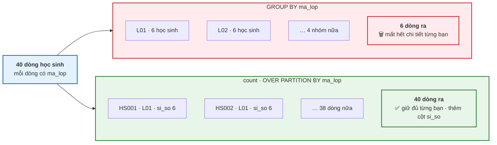
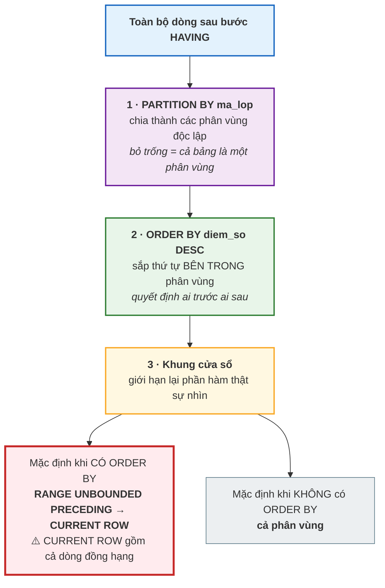

# Bài 29 — Window Function: tính toán theo cửa sổ

!!! abstract "🎯 Học xong bài này, bạn sẽ"
    - Giải thích được khác biệt cốt lõi: `GROUP BY` **gom mất dòng**, còn `OVER` **giữ nguyên từng dòng**
    - Viết được `OVER (PARTITION BY ... ORDER BY ...)` và dùng mệnh đề `WINDOW` để khỏi lặp lại
    - Phân biệt `ROW_NUMBER`, `RANK`, `DENSE_RANK`, `NTILE` khi có giá trị ngang bằng
    - Dùng `LAG`, `LEAD`, `FIRST_VALUE`, `LAST_VALUE` để so một dòng với dòng khác
    - Giải thích được vì sao **khung cửa sổ mặc định** dùng `RANGE` làm **tổng luỹ tiến nhảy bậc**, và sửa bằng `ROWS`

## 🧠 Câu chuyện mở đầu

Cô chủ nhiệm đưa bạn bảng điểm thi cuối kỳ của lớp 8A1 và nói: *"Em xếp hạng cho cô, rồi in ra dán ở bảng tin."*

Bạn nghĩ ngay tới `GROUP BY` của [Bài 26](26-group-by-having.md). Nhưng viết ra thì thấy ngay chuyện không ổn: `GROUP BY` **gom** các dòng lại. Nhóm *"lớp 8A1"* cho bạn đúng **một** dòng — trung bình lớp, điểm cao nhất, sĩ số. Toàn là những con số hay, nhưng tờ giấy dán bảng tin thì cần **sáu dòng**, mỗi bạn một dòng, kèm hạng của bạn ấy.

Bạn thử cách khác: chạy một truy vấn lấy danh sách học sinh, chạy thêm một truy vấn lấy điểm cao nhất lớp, rồi tự ghép hai kết quả bằng tay trên Excel. Được, nhưng nếu cô đòi thêm *"và mỗi bạn kém bạn đứng trên bao nhiêu điểm"* thì bạn lại phải ghép lần nữa.

Vấn đề thật sự nằm ở chỗ: bạn cần **một con số tính từ cả nhóm**, nhưng lại muốn nó **xuất hiện trên từng dòng**. `GROUP BY` không làm được — nó chỉ biết đánh đổi: muốn con số của nhóm thì phải mất dòng.

SQL có một công cụ riêng cho đúng nhu cầu này, và nó không đánh đổi gì cả.

## 📖 Khái niệm & thuật ngữ

### Window function là gì

**Hàm cửa sổ** (*window function*) là hàm tính trên một **tập dòng liên quan tới dòng hiện tại**, nhưng **không gom các dòng đó lại**. Kết quả là: vào 40 dòng, ra 40 dòng — kèm thêm một cột mới chứa con số tính từ cả nhóm.

Tập dòng liên quan đó gọi là **cửa sổ** (*window*) của dòng hiện tại. Cái tên rất đúng: từ mỗi dòng, bạn nhìn qua một cái cửa sổ ra các dòng xung quanh, tính ra một con số, rồi ghi con số đó vào chính dòng mình đang đứng.

Đây là bảng so sánh phải nhớ:

| | `GROUP BY` | Window function |
|---|---|---|
| Số dòng ra | **Một dòng mỗi nhóm** | **Giữ nguyên** số dòng vào |
| Xem được chi tiết từng dòng | Không — đã bị gom | **Có** |
| Truy cập được dòng khác trong nhóm | Không | **Có** — đó là mục đích của nó |
| Chạy ở bước nào | Bước 3–4 của thứ tự thực thi logic | **Sau `HAVING`, trước `DISTINCT`** |
| Dùng được trong `WHERE` | `HAVING` thay thế | **Không bao giờ** — phải bọc bằng bảng dẫn xuất hoặc CTE |

### Cú pháp `OVER`

Mọi window function đều có mệnh đề **`OVER`** đi kèm. Chính `OVER` là thứ biến một hàm thành hàm cửa sổ:

```
<hàm>(<tham số>) OVER (
    PARTITION BY <cột chia nhóm>
    ORDER BY     <cột sắp thứ tự>
    <khung cửa sổ>
)
```

Cả ba phần bên trong `OVER` đều **không bắt buộc**, và mỗi phần có một ý nghĩa rõ ràng:

- **`PARTITION BY`** chia bảng thành các **phân vùng** (*partition*) độc lập. Cửa sổ của một dòng **không bao giờ** vượt ra khỏi phân vùng của nó. Bỏ `PARTITION BY` thì cả bảng là một phân vùng duy nhất.
- **`ORDER BY`** sắp thứ tự **bên trong** mỗi phân vùng. Nó là bắt buộc về mặt ý nghĩa với các hàm xếp hạng và với `LAG`/`LEAD` — không có thứ tự thì "hạng" và "dòng trước" vô nghĩa.
- **Khung cửa sổ** giới hạn cửa sổ lại nhỏ hơn cả phân vùng. Phần này là nội dung khó nhất của bài.

!!! warning "`ORDER BY` trong `OVER` **khác** `ORDER BY` của câu lệnh"
    Hai cái này không liên quan gì tới nhau, dù viết giống nhau:

    - `ORDER BY` **trong `OVER`** quyết định **cách tính** — ai là dòng trước, ai xếp hạng nhất.
    - `ORDER BY` **cuối câu lệnh** quyết định **cách in ra màn hình**.

    Một câu lệnh có thể sắp trong `OVER` theo điểm giảm dần, rồi in ra theo mã học sinh tăng dần. Và nếu bạn **chỉ** có `ORDER BY` trong `OVER`, thứ tự in ra vẫn là **không xác định** — đúng cảnh báo của [Bài 24](24-select-where-order-by.md).

### Mệnh đề `WINDOW`

Khi ba, bốn cột dùng **cùng một** định nghĩa cửa sổ, viết lại `OVER (PARTITION BY ... ORDER BY ...)` từng lần là vừa dài vừa dễ lệch. Mệnh đề **`WINDOW`** cho phép đặt tên cho một cửa sổ và dùng lại:

```
SELECT ..., rank() OVER w, dense_rank() OVER w
FROM   ...
WINDOW w AS (PARTITION BY ma_lop ORDER BY diem_so DESC)
ORDER BY ...
```

`WINDOW` đứng **sau `HAVING`** và **trước `ORDER BY`**. Đây là mệnh đề hay bị lãng quên nhất của SQL, dù nó giải quyết một vấn đề rất thật: khi bốn cột phải dùng chung một cửa sổ, chỉ cần một lần sửa sót là bốn cột không còn nhất quán.

### Bốn hàm xếp hạng

Bốn hàm này khác nhau **chỉ khi có giá trị ngang bằng** — mà dữ liệu thật thì luôn có.

Giả sử điểm trong một lớp, xếp giảm dần: **9, 8, 8, 7, 7, 5**.

| Hàm | Kết quả | Quy tắc |
|---|---|---|
| **`ROW_NUMBER()`** | 1, 2, 3, 4, 5, 6 | Đếm dòng, **không quan tâm** ngang bằng. Luôn liên tục, luôn không trùng. |
| **`RANK()`** | 1, 2, 2, 4, 4, 6 | Ngang bằng thì **cùng hạng**, rồi **nhảy** qua số đã dùng. Đây là cách xếp hạng thể thao. |
| **`DENSE_RANK()`** | 1, 2, 2, 3, 3, 4 | Ngang bằng thì cùng hạng, nhưng **không nhảy số**. Trả lời câu "có bao nhiêu mức điểm khác nhau từ trên xuống". |
| **`NTILE(3)`** | 1, 1, 2, 2, 3, 3 | Chia phân vùng thành 3 phần **xấp xỉ đều nhau**. Dùng để chia tốp — tốp đầu, tốp giữa, tốp cuối. |

Cách nhớ: **`RANK` đếm số người đứng trước bạn; `DENSE_RANK` đếm số mức điểm cao hơn bạn.**

!!! danger "`ROW_NUMBER` là **không tất định** khi có giá trị ngang bằng"
    Với điểm `8, 8`, hai bạn phải nhận số 2 và 3 — nhưng **ai nhận số nào thì SQL không hứa**. Hôm nay bạn `HS002` là số 2; sau một lần `UPDATE` hoặc một lần bộ tối ưu đổi kế hoạch, có thể `HS003` mới là số 2.

    Đây là cùng một loại bẫy với "`LIMIT` không có `ORDER BY`" ở [Bài 24](24-select-where-order-by.md): kết quả nhìn hợp lý nhưng không lặp lại được.

    Cách sửa duy nhất: **thêm một cột phá thế ngang bằng** vào `ORDER BY` của `OVER`, thường là khoá chính — `ORDER BY diem_so DESC, ma_hs`.

    Nhưng chú ý: làm thế thì `RANK` và `DENSE_RANK` cũng hết ngang bằng luôn, vì hai bạn khác mã học sinh là hai dòng khác nhau. Nếu bạn cần cả "hạng có ngang bằng" lẫn "số thứ tự tất định", hai hàm đó phải dùng **hai cửa sổ khác nhau**.

### Bốn hàm nhìn sang dòng khác

| Hàm | Trả về |
|---|---|
| **`LAG(cột, n, mặc_định)`** | Giá trị của dòng **lùi `n` bước** trong phân vùng. Không có thì trả `NULL`, hoặc `mặc_định` nếu bạn cho. |
| **`LEAD(cột, n, mặc_định)`** | Giá trị của dòng **tiến `n` bước**. |
| **`FIRST_VALUE(cột)`** | Giá trị ở dòng **đầu** của **khung cửa sổ**. |
| **`LAST_VALUE(cột)`** | Giá trị ở dòng **cuối** của **khung cửa sổ**. |

`n` mặc định là 1. Hai từ *lag* và *lead* nghĩa là "tụt lại" và "dẫn trước".

Hai hàm đầu bỏ qua khung cửa sổ; hai hàm sau **phụ thuộc hoàn toàn** vào nó — và đó là nguồn của cái bẫy `LAST_VALUE` nổi tiếng ở mục sau.

### Khung cửa sổ — phần khó nhất và bị nói sai nhiều nhất

**Khung cửa sổ** (*window frame*) là phần của phân vùng mà hàm thật sự nhìn thấy, tính từ **dòng hiện tại** (*current row*).

Cú pháp:

```
{ROWS | RANGE | GROUPS} BETWEEN <mốc đầu> AND <mốc cuối>
```

Các mốc thông dụng:

| Mốc | Nghĩa |
|---|---|
| **`UNBOUNDED PRECEDING`** | Từ dòng đầu tiên của phân vùng |
| **`n PRECEDING`** | Lùi `n` bước |
| **`CURRENT ROW`** | Chính dòng hiện tại |
| **`n FOLLOWING`** | Tiến `n` bước |
| **`UNBOUNDED FOLLOWING`** | Tới dòng cuối cùng của phân vùng |

Và đây là điểm mấu chốt của cả bài. **`ROWS` và `RANGE` đếm hai thứ khác nhau:**

- **`ROWS`** đếm **dòng vật lý**. `CURRENT ROW` nghĩa là **đúng một dòng** — dòng đang đứng.
- **`RANGE`** đếm theo **giá trị của cột trong `ORDER BY`**. `CURRENT ROW` nghĩa là **mọi dòng có giá trị ngang bằng** với dòng hiện tại — tập này gọi là các **dòng đồng hạng** (*peer rows*).

### Khung mặc định — và vì sao nó gây bất ngờ

Đây là chỗ "hầu hết tài liệu nói sai", nên hãy đọc thật chậm.

| Trong `OVER` có `ORDER BY`? | Khung mặc định |
|---|---|
| **Không** | `RANGE BETWEEN UNBOUNDED PRECEDING AND UNBOUNDED FOLLOWING` — cả phân vùng |
| **Có** | **`RANGE BETWEEN UNBOUNDED PRECEDING AND CURRENT ROW`** |

Người ta thường đọc dòng thứ hai là *"từ đầu tới dòng này"* và tưởng nó giống `ROWS BETWEEN UNBOUNDED PRECEDING AND CURRENT ROW`. **Không giống.** Vì mặc định là `RANGE`, mà `CURRENT ROW` trong `RANGE` bao gồm **cả các dòng đồng hạng**.

Hệ quả rất cụ thể với **tổng luỹ tiến** (*running total*) — phép cộng dồn từ đầu tới dòng hiện tại. Lấy sáu điểm xếp tăng dần: **5, 7, 7, 8, 8, 9**.

| Dòng | Điểm | `sum` với khung **mặc định** (`RANGE`) | `sum` với `ROWS` |
|---|---|---|---|
| 1 | 5 | 5 | 5 |
| 2 | 7 | **19** ← cộng cả dòng 7 thứ hai | 12 |
| 3 | 7 | **19** ← giống dòng trên | 19 |
| 4 | 8 | **35** ← cộng cả dòng 8 thứ hai | 27 |
| 5 | 8 | **35** | 35 |
| 6 | 9 | 44 | 44 |

Cột `RANGE` **nhảy bậc**: nó đứng yên ở 19 rồi vọt lên 35. Cột `ROWS` tăng từng bước một như bạn mong đợi. Hai cột chỉ gặp nhau ở dòng cuối của mỗi nhóm đồng hạng, và ở tổng cuối cùng.

!!! danger "Quy tắc thực hành: tổng luỹ tiến thì **luôn** viết `ROWS`"
    Nếu bạn muốn *"cộng dồn từng dòng một"* — nghĩa là gần như luôn luôn — hãy viết rõ:

    ```
    sum(x) OVER (ORDER BY c ROWS BETWEEN UNBOUNDED PRECEDING AND CURRENT ROW)
    ```

    hoặc dạng viết tắt tương đương `ROWS UNBOUNDED PRECEDING`.

    Bỏ trắng khung cửa sổ là chấp nhận `RANGE`, và trên dữ liệu **không có giá trị trùng** thì hai cái cho kết quả y hệt — nên lỗi này **ẩn mình suốt quá trình thử nghiệm** rồi lộ ra đúng lúc dữ liệu thật có hai người cùng điểm.

    Còn `RANGE` đúng khi nào? Khi bạn **thật sự** muốn nhóm đồng hạng được coi là một khối: ví dụ *"tổng doanh thu tính tới hết ngày hôm nay"* — mọi giao dịch trong cùng một ngày phải được cộng hết, không phân biệt thứ tự trong ngày.

PostgreSQL còn có **`GROUPS`** — đếm theo **số nhóm đồng hạng** thay vì số dòng hay khoảng giá trị. Nó ít dùng, nhưng biết là nó tồn tại thì khỏi bất ngờ.

### Window function chạy ở bước nào

Bổ sung vào bảng thứ tự thực thi logic của [Bài 26](26-group-by-having.md):

| Bước | Mệnh đề | Window function |
|---|---|---|
| 1 | `FROM` / `JOIN` | — |
| 2 | `WHERE` | **Chưa tồn tại** → không dùng được |
| 3 | `GROUP BY` | — |
| 4 | `HAVING` | **Chưa tồn tại** → không dùng được |
| **4b** | **Window function** | **Được tính ở đây** |
| 5 | `SELECT` | Dùng được |
| 6 | `DISTINCT` | Dùng được |
| 7 | `ORDER BY` | Dùng được |
| 8 | `LIMIT` / `OFFSET` | — |

Ba hệ quả phải nhớ:

- **Không dùng được window function trong `WHERE` hay `HAVING`.** Muốn lọc theo hạng thì phải bọc câu lệnh vào một **bảng dẫn xuất** hoặc **CTE** của [Bài 27](27-subquery-va-exists.md) và [Bài 28](28-cte-va-recursive-cte.md), rồi lọc ở tầng ngoài.
- **Window function nhìn thấy kết quả của `GROUP BY`.** Dùng được cả hai trong một câu lệnh: `GROUP BY` gom trước, window function chạy trên các dòng đã gom.
- **`WHERE` lọc trước, nên nó đổi cả cửa sổ.** Thêm một điều kiện `WHERE` là các con số xếp hạng thay đổi theo — vì những dòng bị lọc không còn nằm trong phân vùng nữa.

### Bảng thuật ngữ

| Tiếng Việt | English | Nghĩa dễ hiểu |
|---|---|---|
| Hàm cửa sổ | *window function* | Hàm tính trên các dòng liên quan tới dòng hiện tại mà **không gom dòng** — vào N dòng, ra N dòng |
| Cửa sổ | *window* | Tập dòng mà hàm nhìn thấy khi đứng ở một dòng nhất định |
| Phân vùng | *partition* | Nhóm dòng do `PARTITION BY` chia ra; cửa sổ không bao giờ vượt ra khỏi phân vùng của mình |
| Khung cửa sổ | *window frame* | Phần của phân vùng mà hàm thật sự nhìn, tính từ dòng hiện tại — khai bằng `ROWS`, `RANGE` hoặc `GROUPS` |
| Dòng hiện tại | *CURRENT ROW* | Dòng đang được tính; trong `ROWS` nó là **một** dòng, trong `RANGE` nó gồm **mọi dòng đồng hạng** |
| Dòng đồng hạng | *peer rows* | Các dòng có cùng giá trị ở mọi cột của `ORDER BY` trong `OVER` |
| Tổng luỹ tiến | *running total* | Tổng cộng dồn từ đầu phân vùng tới dòng hiện tại — phải viết `ROWS` mới cộng từng dòng một |

## 🖼️ Sơ đồ

`GROUP BY` gom mất dòng, `OVER` thì không — cùng một dữ liệu, hai kết quả khác hẳn về hình dạng:



Ba tầng của một `OVER`, và khung mặc định nằm ở tầng thứ ba:



## 💻 Thực hành

### `GROUP BY` so với `OVER` — xem tận mắt

Cách cũ của [Bài 26](26-group-by-having.md), gom mất dòng:

```sql
-- KỲ VỌNG: 6 dòng
-- KỲ VỌNG: ma_lop = L01
-- KỲ VỌNG: si_so = 6
SELECT ma_lop, count(*) AS si_so
FROM hoc_sinh
GROUP BY ma_lop
ORDER BY ma_lop;
```

Cách mới, giữ nguyên từng bạn và dán sĩ số lớp vào từng dòng:

```sql
-- KỲ VỌNG: 40 dòng
-- KỲ VỌNG: ma_hs = HS001
-- KỲ VỌNG: si_so_lop = 6
SELECT ma_hs, ho_ten, ma_lop,
       count(*) OVER (PARTITION BY ma_lop) AS si_so_lop
FROM hoc_sinh
ORDER BY ma_hs;
```

**6 dòng** so với **40 dòng** — cùng dữ liệu, cùng con số `6`, nhưng hình dạng kết quả khác hẳn. Đó là toàn bộ lý do window function tồn tại.

Bỏ luôn `PARTITION BY` thì cả bảng là một phân vùng, và mọi dòng nhận cùng một con số toàn trường:

```sql
-- KỲ VỌNG: 8 dòng
-- KỲ VỌNG: ma_gv = GV01
-- KỲ VỌNG: tong_so_gv = 8
-- KỲ VỌNG: luong_tb_truong = 14450000
SELECT ma_gv, ho_ten, luong,
       count(*) OVER ()            AS tong_so_gv,
       round(avg(luong) OVER ())    AS luong_tb_truong
FROM giao_vien
ORDER BY ma_gv;
```

Tám dòng, mỗi dòng đều mang con số `8` và lương trung bình `14.450.000`. So sánh trực tiếp lương của từng người với mức trung bình chỉ còn là một phép trừ — mà `GROUP BY` thì không cho bạn làm nổi phép trừ đó trong cùng một câu lệnh.

### Dựng bảng điểm thi có giá trị trùng nhau

Vì cột `diem.diem_so` của database mẫu được sinh ngẫu nhiên, ta cần một bảng nháp có điểm **cố định** và **cố ý trùng nhau**, để nhìn rõ khác biệt giữa bốn hàm xếp hạng:

```sql
DROP TABLE IF EXISTS b29_diem_thi CASCADE;

CREATE TABLE b29_diem_thi (
    ma_hs   CHAR(5)      PRIMARY KEY,
    ma_lop  CHAR(3)      NOT NULL,
    diem_so NUMERIC(4,2) NOT NULL
);

INSERT INTO b29_diem_thi (ma_hs, ma_lop, diem_so) VALUES
('HS001', 'L01',  9.00),
('HS002', 'L01',  8.00),
('HS003', 'L01',  8.00),   -- trùng với HS002
('HS004', 'L01',  7.00),
('HS005', 'L01',  7.00),   -- trùng với HS004
('HS006', 'L01',  5.00),
('HS007', 'L02', 10.00),
('HS008', 'L02',  6.00),
('HS009', 'L02',  6.00),
('HS010', 'L02',  6.00),   -- ba bạn cùng 6.00
('HS011', 'L02',  4.00),
('HS012', 'L02',  3.00);

-- KỲ VỌNG: so_dong = 12
-- KỲ VỌNG: so_lop = 2
-- KỲ VỌNG: so_muc_diem_khac_nhau = 8
SELECT count(*)                  AS so_dong,
       count(DISTINCT ma_lop)    AS so_lop,
       count(DISTINCT diem_so)   AS so_muc_diem_khac_nhau
FROM b29_diem_thi;
```

Mười hai học sinh, hai lớp, **tám** mức điểm khác nhau: lớp `L01` dùng 9, 8, 7, 5 và lớp `L02` dùng 10, 6, 4, 3.

Điểm quan trọng của bảng này là **các cặp trùng nhau được cài có chủ đích**: lớp `L01` có một cặp 8.00 và một cặp 7.00; lớp `L02` có **ba** bạn cùng 6.00. Không có giá trị trùng thì cả bài này sẽ không cho thấy được gì — bốn hàm xếp hạng sẽ trả về cùng một dãy số, và `RANGE` với `ROWS` sẽ cho cùng một kết quả.

### Bốn hàm xếp hạng, và mệnh đề `WINDOW`

Xếp hạng **trong từng lớp**, giữ nguyên cả 12 dòng:

```sql
-- KỲ VỌNG: 12 dòng
-- KỲ VỌNG: ma_hs = HS001
-- KỲ VỌNG: stt = 1
-- KỲ VỌNG: hang = 1
-- KỲ VỌNG: hang_dac = 1
-- KỲ VỌNG: nhom_ba = 1
SELECT ma_lop,
       ma_hs,
       diem_so,
       row_number() OVER w AS stt,
       rank()       OVER w AS hang,
       dense_rank() OVER w AS hang_dac,
       ntile(3)     OVER w AS nhom_ba
FROM b29_diem_thi
WINDOW w AS (PARTITION BY ma_lop ORDER BY diem_so DESC)
ORDER BY ma_lop, diem_so DESC, ma_hs;
```

Bốn hàm, **một** định nghĩa cửa sổ viết đúng một lần nhờ `WINDOW w AS (...)`. Sửa cửa sổ thì cả bốn cột đổi theo — không có chuyện sót một chỗ.

Hạng của lớp `L01` xếp theo điểm giảm dần (9, 8, 8, 7, 7, 5):

| `diem_so` | `row_number` | `rank` | `dense_rank` | `ntile(3)` |
|---|---|---|---|---|
| 9.00 | 1 | 1 | 1 | 1 |
| 8.00 | 2 | **2** | **2** | 1 |
| 8.00 | 3 | **2** | **2** | 2 |
| 7.00 | 4 | **4** | **3** | 2 |
| 7.00 | 5 | **4** | **3** | 3 |
| 5.00 | 6 | 6 | 4 | 3 |

Đọc ba cột giữa cho kỹ — đó là cả bài học:

- `rank` nhảy từ 2 sang **4**, bỏ qua số 3, vì đã có hai người đứng trước vị trí đó.
- `dense_rank` đi liền 1, 2, **3**, 4 — nó đếm **mức điểm**, không đếm người.
- `row_number` bất chấp ngang bằng, và **chính vì thế** nó không tất định: hai bạn cùng 8.00 nhận số 2 và 3, nhưng ai nhận số nào thì SQL không hứa.

Bảng trên là một tuyên bố gồm 24 con số, nên khóa học **kiểm cả 24 con số đó** bằng một câu lệnh. Câu lệnh ấy là một **phép đo**, không phải một mẫu để bạn học viết — nó gộp cả sáu dòng thành một chuỗi để CI so sánh được:

??? note "Cách khoá học tự kiểm cả 24 con số — bạn không cần viết được câu lệnh này"
    ```sql
    -- KỲ VỌNG: day_diem = 9.00|8.00|8.00|7.00|7.00|5.00
    -- KỲ VỌNG: day_row_number = 1|2|3|4|5|6
    -- KỲ VỌNG: day_rank = 1|2|2|4|4|6
    -- KỲ VỌNG: day_dense_rank = 1|2|2|3|3|4
    -- KỲ VỌNG: day_ntile = 1|1|2|2|3|3
    SELECT string_agg(diem_so::text,  '|' ORDER BY thu_tu) AS day_diem,
           string_agg(stt::text,      '|' ORDER BY thu_tu) AS day_row_number,
           string_agg(hang::text,     '|' ORDER BY thu_tu) AS day_rank,
           string_agg(hang_dac::text, '|' ORDER BY thu_tu) AS day_dense_rank,
           string_agg(nhom::text,     '|' ORDER BY thu_tu) AS day_ntile
    FROM (
        SELECT diem_so,
               -- thu_tu dùng để SẮP kết quả, stt là con số ĐEM RA so sánh.
               -- Hai cột cùng một biểu thức, tách tên chỉ để đọc rõ vai trò.
               row_number() OVER (ORDER BY diem_so DESC, ma_hs) AS thu_tu,
               row_number() OVER (ORDER BY diem_so DESC, ma_hs) AS stt,
               rank()       OVER (ORDER BY diem_so DESC)        AS hang,
               dense_rank() OVER (ORDER BY diem_so DESC)        AS hang_dac,
               ntile(3)     OVER (ORDER BY diem_so DESC, ma_hs) AS nhom
        FROM b29_diem_thi
        WHERE ma_lop = 'L01'
    ) AS t;
    ```

Chú ý ba cửa sổ **khác nhau** trong cùng một câu lệnh: `row_number` và `ntile` thêm `ma_hs` để tất định, còn `rank` và `dense_rank` **không** được thêm — thêm vào là hết ngang bằng và cả hai biến thành `row_number`.

Với lớp `L02` có **ba** bạn cùng 6.00, `rank` nhảy xa hơn nữa — dãy điểm là 10, 6, 6, 6, 4, 3 và `rank` cho `1 · 2 · 2 · 2 · 5 · 6`, còn `dense_rank` cho `1 · 2 · 2 · 2 · 3 · 4`:

??? note "Cách khoá học tự kiểm ba dãy số này"
    ```sql
    -- KỲ VỌNG: day_diem = 10.00|6.00|6.00|6.00|4.00|3.00
    -- KỲ VỌNG: day_rank = 1|2|2|2|5|6
    -- KỲ VỌNG: day_dense_rank = 1|2|2|2|3|4
    SELECT string_agg(diem_so::text,  '|' ORDER BY thu_tu) AS day_diem,
           string_agg(hang::text,     '|' ORDER BY thu_tu) AS day_rank,
           string_agg(hang_dac::text, '|' ORDER BY thu_tu) AS day_dense_rank
    FROM (
        SELECT diem_so,
               row_number() OVER (ORDER BY diem_so DESC, ma_hs) AS thu_tu,
               rank()       OVER (ORDER BY diem_so DESC)        AS hang,
               dense_rank() OVER (ORDER BY diem_so DESC)        AS hang_dac
        FROM b29_diem_thi
        WHERE ma_lop = 'L02'
    ) AS t;
    ```

`rank` đi 1, 2, 2, 2, **5** — nhảy hẳn hai số. `dense_rank` vẫn 1, 2, **3**, 4. Với câu hỏi *"bạn ấy thuộc mức điểm thứ mấy từ trên xuống"*, chỉ `dense_rank` trả lời đúng.

### Tổng luỹ tiến — `RANGE` mặc định so với `ROWS`

Đây là phần quan trọng nhất của bài. Sáu điểm của lớp `L01` xếp **tăng dần**: 5, 7, 7, 8, 8, 9.

```sql
-- KỲ VỌNG: 6 dòng
-- KỲ VỌNG: ma_hs = HS006
-- KỲ VỌNG: luy_tien_mac_dinh = 5.00
-- KỲ VỌNG: luy_tien_rows = 5.00
SELECT ma_hs,
       diem_so,
       sum(diem_so) OVER (ORDER BY diem_so)                                 AS luy_tien_mac_dinh,
       sum(diem_so) OVER (ORDER BY diem_so, ma_hs ROWS UNBOUNDED PRECEDING) AS luy_tien_rows
FROM b29_diem_thi
WHERE ma_lop = 'L01'
ORDER BY diem_so, ma_hs;
```

Kết quả đầy đủ — và hai cột **không** giống nhau:

| `ma_hs` | `diem_so` | `luy_tien_mac_dinh` (`RANGE`) | `luy_tien_rows` (`ROWS`) |
|---|---|---|---|
| HS006 | 5.00 | 5.00 | 5.00 |
| HS004 | 7.00 | **19.00** | 12.00 |
| HS005 | 7.00 | **19.00** | 19.00 |
| HS002 | 8.00 | **35.00** | 27.00 |
| HS003 | 8.00 | **35.00** | 35.00 |
| HS001 | 9.00 | 44.00 | 44.00 |

Mười hai con số trong bảng trên cũng được CI kiểm hết, lại bằng một phép đo chứ không phải một mẫu để học:

??? note "Cách khoá học tự kiểm hai dãy số này — bạn không cần viết được câu lệnh này"
    ```sql
    -- KỲ VỌNG: day_range = 5.00|19.00|19.00|35.00|35.00|44.00
    -- KỲ VỌNG: day_rows = 5.00|12.00|19.00|27.00|35.00|44.00
    SELECT string_agg(luy_tien_mac_dinh::text, '|' ORDER BY thu_tu) AS day_range,
           string_agg(luy_tien_rows::text,     '|' ORDER BY thu_tu) AS day_rows
    FROM (
        SELECT row_number() OVER (ORDER BY diem_so, ma_hs)                          AS thu_tu,
               sum(diem_so) OVER (ORDER BY diem_so)                                 AS luy_tien_mac_dinh,
               sum(diem_so) OVER (ORDER BY diem_so, ma_hs ROWS UNBOUNDED PRECEDING) AS luy_tien_rows
        FROM b29_diem_thi
        WHERE ma_lop = 'L01'
    ) AS t;
    ```

Vì sao cột `RANGE` nhảy bậc? Vì khung mặc định là `RANGE BETWEEN UNBOUNDED PRECEDING AND CURRENT ROW`, và **`CURRENT ROW` trong `RANGE` gồm cả mọi dòng đồng hạng**.

Khi máy đứng ở dòng `HS004` với điểm 7.00, cửa sổ của nó không dừng ở chính nó — nó gồm **cả `HS005`**, vì `HS005` cũng 7.00. Nên tổng là `5 + 7 + 7 = 19`, không phải 12. Rồi khi đứng ở `HS005`, cửa sổ vẫn y như vậy, nên con số **không đổi**.

Viết `ROWS` thì `CURRENT ROW` chỉ là **một** dòng, và tổng tăng từng bậc đúng như trực giác.

Hai cột **gặp nhau ở dòng cuối của mỗi nhóm đồng hạng** (19 ở dòng 3, 35 ở dòng 5, 44 ở dòng 6). Đây là lý do cái bẫy này rất kín: nếu bạn chỉ xem dòng cuối bảng để kiểm tra "tổng có đúng không", cả hai đều cho 44 và bạn kết luận là ổn.

```sql
-- KỲ VỌNG: 1 dòng
-- KỲ VỌNG: range_cong_ca_dong_dong_hang = 19.00
-- KỲ VỌNG: rows_cong_tung_dong = 12.00
-- KỲ VỌNG: lech = 7.00
SELECT luy_tien_mac_dinh AS range_cong_ca_dong_dong_hang,
       luy_tien_rows     AS rows_cong_tung_dong,
       luy_tien_mac_dinh - luy_tien_rows AS lech
FROM (
    SELECT ma_hs,
           sum(diem_so) OVER (ORDER BY diem_so)                                 AS luy_tien_mac_dinh,
           sum(diem_so) OVER (ORDER BY diem_so, ma_hs ROWS UNBOUNDED PRECEDING) AS luy_tien_rows
    FROM b29_diem_thi
    WHERE ma_lop = 'L01'
) AS t
WHERE ma_hs = 'HS004';
```

Lệch đúng **7.00** — chính là con điểm của `HS005`, bạn đồng hạng bị cộng thêm vào.

!!! note "Khi nào `RANGE` mới là lựa chọn đúng"
    Khi nhóm đồng hạng **phải** được coi là một khối. Ví dụ điển hình là cộng dồn theo ngày:

    ```sql
    -- KỲ VỌNG: 20 dòng
    -- KỲ VỌNG: ngay_muon = 2026-09-01
    -- KỲ VỌNG: luot_trong_ngay = 2
    -- KỲ VỌNG: luy_tien_het_ngay = 2
    SELECT ngay_muon,
           count(*)                                                  AS luot_trong_ngay,
           sum(count(*)) OVER (ORDER BY ngay_muon)                   AS luy_tien_het_ngay
    FROM muon_sach
    GROUP BY ngay_muon
    ORDER BY ngay_muon;
    ```

    Ở đây `GROUP BY` đã gom mỗi ngày thành một dòng, nên **không còn dòng đồng hạng nào** và `RANGE` với `ROWS` cho kết quả y hệt. Đó cũng là một cách phòng bẫy: gom nhóm trước thì khung cửa sổ không còn chỗ gây bất ngờ.

    Chú ý cú pháp `sum(count(*)) OVER (...)`: hàm cửa sổ chạy ở **bước 4b**, sau `GROUP BY` ở bước 3 — nên `count(*)` đã có giá trị khi `sum` cửa sổ nhìn vào nó. Lồng hàm tổng hợp vào hàm cửa sổ là hợp lệ; lồng hàm tổng hợp vào hàm tổng hợp thì không.

### Khung cửa sổ tuỳ ý — trung bình trượt

Khung `ROWS BETWEEN 1 PRECEDING AND 1 FOLLOWING` cho **trung bình trượt** ba dòng — một kỹ thuật làm mượt số liệu:

```sql
-- KỲ VỌNG: 6 dòng
-- KỲ VỌNG: ma_hs = HS006
-- KỲ VỌNG: so_dong_trong_khung = 2
SELECT ma_hs,
       diem_so,
       round(avg(diem_so) OVER (ORDER BY diem_so, ma_hs
                                ROWS BETWEEN 1 PRECEDING AND 1 FOLLOWING), 2) AS tb_truot_3,
       count(*) OVER (ORDER BY diem_so, ma_hs
                      ROWS BETWEEN 1 PRECEDING AND 1 FOLLOWING)               AS so_dong_trong_khung
FROM b29_diem_thi
WHERE ma_lop = 'L01'
ORDER BY diem_so, ma_hs;
```

Dòng đầu tiên chỉ có **2** dòng trong khung — nó không có dòng nào phía trước. Dòng cuối cũng vậy. Các dòng giữa có đủ 3. Window function **không báo lỗi** khi khung bị cắt ở đầu hoặc cuối phân vùng; nó chỉ lặng lẽ tính trên phần có thật, và bạn phải tự biết điều đó khi đọc số.

### `LAG` và `LEAD`

So mỗi giáo viên với người có lương liền kề:

```sql
-- KỲ VỌNG: 8 dòng
-- KỲ VỌNG: ma_gv = GV07
-- KỲ VỌNG: luong_nguoi_truoc = NULL
-- KỲ VỌNG: chenh_lech = NULL
-- KỲ VỌNG: chenh_lech_co_mac_dinh = 11900000.00
SELECT ma_gv,
       ho_ten,
       luong,
       lag(luong)  OVER w                     AS luong_nguoi_truoc,
       lead(luong) OVER w                     AS luong_nguoi_sau,
       luong - lag(luong) OVER w              AS chenh_lech,
       luong - lag(luong, 1, 0::NUMERIC) OVER w AS chenh_lech_co_mac_dinh
FROM giao_vien
WINDOW w AS (ORDER BY luong)
ORDER BY luong;
```

Dòng đầu tiên là `GV07` — người có lương thấp nhất trường (11.900.000). Không có ai đứng trước nên `lag` cho `NULL`, và phép trừ với `NULL` cũng cho `NULL` theo đúng [Bài 24](24-select-where-order-by.md).

Cột cuối dùng tham số thứ ba của `lag` để thay `NULL` bằng `0`, nên phép trừ ra luôn số. **Tham số mặc định của `LAG` là cách gọn nhất để tránh `NULL` lan ra cả báo cáo** — gọn hơn bọc `coalesce` ở ngoài.

`LAG` với `PARTITION BY` thì "người liền trước" được tính **trong từng lớp**, không vượt ra ngoài:

```sql
-- KỲ VỌNG: so_dong_dau_phan_vung = 2
SELECT count(*) AS so_dong_dau_phan_vung
FROM (
    SELECT ma_lop,
           ma_hs,
           lag(diem_so) OVER (PARTITION BY ma_lop ORDER BY diem_so DESC, ma_hs) AS diem_ban_tren
    FROM b29_diem_thi
) AS t
WHERE t.diem_ban_tren IS NULL;
```

Đúng **2** dòng có `NULL` — một dòng cho mỗi lớp, là bạn đứng đầu lớp đó. Nếu `PARTITION BY` không hoạt động, chỉ có **1** dòng `NULL` cho cả bảng. Đây là cách kiểm nhanh xem mình đã chia phân vùng đúng chưa.

### `FIRST_VALUE`, `LAST_VALUE` và cái bẫy nổi tiếng

```sql
-- KỲ VỌNG: 8 dòng
-- KỲ VỌNG: ma_gv = GV07
-- KỲ VỌNG: luong_thap_nhat = 11900000.00
-- KỲ VỌNG: last_value_bi_bay = 11900000.00
-- KỲ VỌNG: luong_cao_nhat = 17400000.00
SELECT ma_gv,
       luong,
       first_value(luong) OVER w                                  AS luong_thap_nhat,
       last_value(luong)  OVER w                                  AS last_value_bi_bay,
       last_value(luong)  OVER (ORDER BY luong
                                ROWS BETWEEN UNBOUNDED PRECEDING
                                         AND UNBOUNDED FOLLOWING) AS luong_cao_nhat
FROM giao_vien
WINDOW w AS (ORDER BY luong)
ORDER BY luong;
```

Đọc dòng đầu tiên: `first_value` cho **11.900.000** — đúng, lương thấp nhất. Còn `last_value` **cũng** cho **11.900.000**, tức là chính dòng đang đứng. Rõ ràng là sai ý định.

Nguyên nhân chính là khung mặc định: `RANGE BETWEEN UNBOUNDED PRECEDING AND CURRENT ROW`. Cửa sổ **kết thúc ở dòng hiện tại**, nên "dòng cuối của khung" ở dòng đầu tiên chính là dòng đầu tiên. `FIRST_VALUE` may mắn đúng vì khung luôn bắt đầu từ đầu phân vùng.

Cột thứ ba mở rộng khung tới `UNBOUNDED FOLLOWING`, và mới cho đúng **17.400.000**.

!!! danger "`LAST_VALUE` gần như luôn cần khung tường minh"
    Cứ mỗi lần bạn viết `last_value(...) OVER (ORDER BY ...)` mà không khai khung, kết quả là **giá trị của chính dòng hiện tại** — vô nghĩa.

    Hai cách sửa:

    1. Mở khung tới hết phân vùng: `ROWS BETWEEN UNBOUNDED PRECEDING AND UNBOUNDED FOLLOWING`.
    2. Hoặc đảo chiều `ORDER BY` và dùng `first_value` — `first_value(luong) OVER (ORDER BY luong DESC)` cũng cho lương cao nhất, và không cần khai khung.

    Cách 2 thường dễ đọc hơn, và là lý do `LAST_VALUE` ít xuất hiện trong mã thật hơn `FIRST_VALUE`.

Cùng khuôn đó áp cho từng lớp — *"bạn ấy kém bạn giỏi nhất lớp bao nhiêu điểm"*:

```sql
-- KỲ VỌNG: 12 dòng
-- KỲ VỌNG: ma_hs = HS001
-- KỲ VỌNG: diem_cao_nhat_lop = 9.00
-- KỲ VỌNG: kem_ban_gioi_nhat = 0.00
SELECT ma_lop,
       ma_hs,
       diem_so,
       first_value(diem_so) OVER w             AS diem_cao_nhat_lop,
       first_value(diem_so) OVER w - diem_so   AS kem_ban_gioi_nhat
FROM b29_diem_thi
WINDOW w AS (PARTITION BY ma_lop ORDER BY diem_so DESC, ma_hs)
ORDER BY ma_lop, diem_so DESC, ma_hs;
```

Bạn đứng đầu lớp `L01` là `HS001` với 9.00, nên bạn ấy kém chính mình `0.00`. Đây là loại báo cáo mà `GROUP BY` **không** làm nổi trong một câu lệnh: nó cần cả con số của nhóm lẫn con số của từng dòng.

### Lấy top N mỗi nhóm

Đây là công dụng thực tế được dùng nhiều nhất của window function. Vì window function **không dùng được trong `WHERE`**, ta phải bọc một tầng:

```sql
-- KỲ VỌNG: 2 dòng
-- KỲ VỌNG: ma_lop = L01
-- KỲ VỌNG: ma_hs = HS001
SELECT ma_lop, ma_hs, diem_so
FROM (
    SELECT ma_lop, ma_hs, diem_so,
           row_number() OVER (PARTITION BY ma_lop ORDER BY diem_so DESC, ma_hs) AS stt
    FROM b29_diem_thi
) AS t
WHERE t.stt = 1
ORDER BY ma_lop;
```

Hai dòng — một bạn đứng đầu mỗi lớp. Viết bằng CTE của [Bài 28](28-cte-va-recursive-cte.md) thì dễ đọc hơn:

```sql
-- KỲ VỌNG: 4 dòng
-- KỲ VỌNG: ma_lop = L01
-- KỲ VỌNG: stt = 1
WITH xep_hang AS (
    SELECT ma_lop, ma_hs, diem_so,
           row_number() OVER (PARTITION BY ma_lop ORDER BY diem_so DESC, ma_hs) AS stt
    FROM b29_diem_thi
)
SELECT ma_lop, stt, ma_hs, diem_so
FROM xep_hang
WHERE stt <= 2
ORDER BY ma_lop, stt;
```

Bốn dòng: hai bạn đầu của mỗi lớp.

!!! tip "`ROW_NUMBER` hay `RANK` cho bài toán top N"
    Câu hỏi quyết định: **nếu hai người ngang bằng ở vị trí thứ N thì bạn muốn lấy mấy người?**

    - Muốn **đúng N dòng**, không hơn → `ROW_NUMBER` (nhớ thêm cột phá thế ngang bằng, nếu không bạn sẽ chọn ngẫu nhiên một trong hai người ngang điểm).
    - Muốn lấy **hết những người ngang bằng**, kể cả thành N+1 dòng → `RANK`.

    Với lớp `L02` có ba bạn cùng 6.00, `RANK() <= 2` cho **bốn** dòng, còn `ROW_NUMBER() <= 2` cho đúng hai dòng:

    ```sql
    -- KỲ VỌNG: dung_row_number = 2
    -- KỲ VỌNG: dung_rank = 4
    SELECT (SELECT count(*) FROM (
                SELECT row_number() OVER (ORDER BY diem_so DESC, ma_hs) AS n
                FROM b29_diem_thi WHERE ma_lop = 'L02') AS a
            WHERE a.n <= 2) AS dung_row_number,
           (SELECT count(*) FROM (
                SELECT rank() OVER (ORDER BY diem_so DESC) AS n
                FROM b29_diem_thi WHERE ma_lop = 'L02') AS b
            WHERE b.n <= 2) AS dung_rank;
    ```

    Chênh lệch `2` so với `4` là một quyết định **nghiệp vụ**, không phải một lỗi. Trao học bổng cho "hai bạn giỏi nhất lớp" mà có ba bạn đồng điểm nhì thì nhà trường phải chọn một trong hai cách, và câu lệnh phải phản ánh đúng lựa chọn đó.

### Xếp hạng trên dữ liệu thật

Xếp thứ tự tuổi trong từng lớp — dùng `ngay_sinh`, cột **tất định** và có 40 giá trị khác nhau hoàn toàn:

```sql
-- KỲ VỌNG: 40 dòng
-- KỲ VỌNG: ma_lop = L01
-- KỲ VỌNG: ma_hs = HS001
-- KỲ VỌNG: thu_tu_tuoi = 1
-- KỲ VỌNG: si_so = 6
SELECT ma_lop,
       ma_hs,
       ho_ten,
       ngay_sinh,
       row_number() OVER (PARTITION BY ma_lop ORDER BY ngay_sinh) AS thu_tu_tuoi,
       count(*)     OVER (PARTITION BY ma_lop)                    AS si_so
FROM hoc_sinh
ORDER BY ma_lop, ngay_sinh;
```

Bạn lớn tuổi nhất lớp `L01` là `HS001` — sinh 15/01/2012. Vì cả 40 học sinh có 40 ngày sinh **khác nhau hoàn toàn**, `row_number` ở đây tất định mà không cần cột phá thế ngang bằng. Nhưng thói quen tốt vẫn là thêm `, ma_hs` vào — vì bạn không bao giờ chắc dữ liệu tương lai cũng không trùng.

Ghép với `GROUP BY` — xếp hạng các **nhóm** sau khi đã gom:

```sql
-- KỲ VỌNG: 6 dòng
-- KỲ VỌNG: hang_si_so = 1
-- KỲ VỌNG: ma_lop = L03
-- KỲ VỌNG: si_so = 8
-- KỲ VỌNG: tong_toan_truong = 40
SELECT rank() OVER (ORDER BY count(*) DESC)  AS hang_si_so,
       ma_lop,
       count(*)                              AS si_so,
       sum(count(*)) OVER ()                 AS tong_toan_truong
FROM hoc_sinh
GROUP BY ma_lop
ORDER BY hang_si_so, ma_lop;
```

Lớp đông nhất là `L03` với 8 bạn, và mọi dòng đều mang tổng toàn trường 40. Câu lệnh này dùng `GROUP BY` **và** window function cùng lúc — hoàn toàn hợp lệ, vì window function chạy ở **bước 4b**, sau khi các nhóm đã hình thành.

Bảng nháp `b29_diem_thi` được giữ lại tới cuối bài, vì phần **Lỗi thường gặp** và **Bài tập** còn dùng nó. Mục dọn dẹp nằm ở cuối.

## ⚠️ Lỗi thường gặp

!!! danger "Lỗi 1: Dùng window function trong `WHERE` hoặc `HAVING`"
    <!-- sql:co-y-loi -->
    ```sql
    SELECT ma_lop, ma_hs, diem_so
    FROM b29_diem_thi
    WHERE row_number() OVER (PARTITION BY ma_lop ORDER BY diem_so DESC) = 1;
    ```

    PostgreSQL báo lỗi: hàm cửa sổ không được phép xuất hiện trong `WHERE`.

    Lý do nằm ở thứ tự thực thi logic: `WHERE` chạy ở **bước 2**, window function ở **bước 4b**. Ở bước 2 cột `row_number` chưa tồn tại.

    Sửa: bọc vào **CTE** hoặc **bảng dẫn xuất** rồi lọc ở tầng ngoài — đúng khuôn "top N mỗi nhóm" ở phần thực hành. Đây là lý do thực tế phổ biến nhất khiến người ta phải học CTE.

!!! danger "Lỗi 2: Quên khung cửa sổ khi tính tổng luỹ tiến"
    ```sql
    -- KỲ VỌNG: sai_vi_range = 19.00
    -- KỲ VỌNG: dung_vi_rows = 12.00
    SELECT sai_vi_range, dung_vi_rows
    FROM (
        SELECT ma_hs,
               sum(diem_so) OVER (ORDER BY diem_so)                                 AS sai_vi_range,
               sum(diem_so) OVER (ORDER BY diem_so, ma_hs ROWS UNBOUNDED PRECEDING) AS dung_vi_rows
        FROM b29_diem_thi
        WHERE ma_lop = 'L01'
    ) AS t
    WHERE ma_hs = 'HS004';
    ```

    `19.00` thay vì `12.00` — sai **7 điểm**, đúng bằng con điểm của bạn đồng hạng bị cộng nhầm vào.

    Nguy hiểm gấp đôi vì nó **tự khỏi** khi dữ liệu không có giá trị trùng. Bạn thử trên 5 dòng điểm khác nhau hết thì hai cách cho cùng kết quả; đưa lên dữ liệu thật có hai người cùng điểm là báo cáo lệch, mà tổng cuối bảng vẫn đúng nên không ai nghi ngờ.

    Sửa: **viết `ROWS` ra một cách tường minh** cho mọi phép cộng dồn. Đây là quy tắc, không phải khuyến nghị.

!!! warning "Lỗi 3: `LAST_VALUE` với khung mặc định"
    ```sql
    -- KỲ VỌNG: 8 dòng
    -- KỲ VỌNG: last_value_mac_dinh = 11900000.00
    -- KỲ VỌNG: dung_cach_1 = 17400000.00
    -- KỲ VỌNG: dung_cach_2 = 17400000.00
    SELECT ma_gv, luong,
           last_value(luong)  OVER (ORDER BY luong)             AS last_value_mac_dinh,
           last_value(luong)  OVER (ORDER BY luong
                                    ROWS BETWEEN UNBOUNDED PRECEDING
                                             AND UNBOUNDED FOLLOWING) AS dung_cach_1,
           first_value(luong) OVER (ORDER BY luong DESC)        AS dung_cach_2
    FROM giao_vien
    ORDER BY luong;
    ```

    Cột đầu cho lương **thấp** nhất trong khi cái tên hứa lương cao nhất. Hai cột sau cùng cho `17.400.000`.

    Cách nhớ: **`FIRST_VALUE` thường đúng với khung mặc định, `LAST_VALUE` thì gần như luôn sai.** Vì khung mặc định luôn bắt đầu từ đầu phân vùng nhưng lại kết thúc ở dòng hiện tại.

!!! warning "Lỗi 4: `ROW_NUMBER` không có cột phá thế ngang bằng"
    ```sql
    -- KỲ VỌNG: so_cap_ngang_diem = 5
    SELECT count(*) AS so_cap_ngang_diem
    FROM b29_diem_thi a
    JOIN b29_diem_thi b
      ON b.ma_lop = a.ma_lop
     AND b.diem_so = a.diem_so
     AND b.ma_hs > a.ma_hs;
    ```

    **Năm cặp** học sinh ngang điểm trong cùng lớp: ở `L01` một cặp 8.00 và một cặp 7.00; ở `L02` ba bạn cùng 6.00 tạo thành ba cặp. Tổng `1 + 1 + 3 = 5`. (Điều kiện `b.ma_hs > a.ma_hs` là khuôn `SELF JOIN` của [Bài 25](25-join.md), để mỗi cặp chỉ đếm một lần.)

    Với mỗi cặp như vậy, `row_number() OVER (ORDER BY diem_so DESC)` phải gán hai số khác nhau cho hai người có cùng dữ liệu xếp hạng — và **không có quy tắc nào** nói ai được số nhỏ hơn. Danh sách khen thưởng của bạn có thể đổi thứ tự sau một lần `VACUUM`.

    Sửa: luôn thêm khoá chính vào cuối: `ORDER BY diem_so DESC, ma_hs`.

!!! warning "Lỗi 5: Tưởng `ORDER BY` trong `OVER` cũng sắp kết quả in ra"
    ```sql
    -- KỲ VỌNG: 6 dòng
    -- KỲ VỌNG: ma_hs = HS001
    -- KỲ VỌNG: hang = 1
    SELECT ma_hs, diem_so,
           rank() OVER (ORDER BY diem_so DESC) AS hang
    FROM b29_diem_thi
    WHERE ma_lop = 'L01'
    ORDER BY ma_hs;
    ```

    Câu này tính hạng theo điểm giảm dần nhưng **in ra theo mã học sinh**. Hoàn toàn hợp lệ và đôi khi đúng ý — nhưng nếu bạn bỏ dòng `ORDER BY ma_hs` ở cuối đi, thứ tự in ra trở thành **không xác định**, dù trong `OVER` đã có `ORDER BY`.

    PostgreSQL thường in ra theo đúng thứ tự cửa sổ vì nó đã phải sắp để tính, nên lỗi này ẩn rất sâu: câu lệnh của bạn "may mắn đúng" trong nhiều tháng, rồi một lần đổi kế hoạch thực thi là thứ tự đảo lộn.

    Quy tắc: **muốn kết quả có thứ tự thì phải có `ORDER BY` ở cuối câu lệnh.** `ORDER BY` trong `OVER` chỉ để tính toán.

## ✍️ Bài tập

1. Viết truy vấn liệt kê mọi học sinh kèm **sĩ số lớp** và **tỉ lệ phần trăm sĩ số lớp mình so với toàn trường**, giữ đủ 40 dòng. Chỉ dùng window function, không dùng `JOIN`.

2. Với bảng `b29_diem_thi`, giải thích vì sao ba câu sau cho ba kết quả khác nhau ở lớp `L02`, rồi dự đoán số dòng của từng câu:

    a. `row_number() OVER (ORDER BY diem_so DESC) <= 3`

    b. `rank() OVER (ORDER BY diem_so DESC) <= 3`

    c. `dense_rank() OVER (ORDER BY diem_so DESC) <= 3`

3. Câu lệnh sau cho tổng luỹ tiến **sai**. Chỉ ra chỗ sai, giải thích bằng khái niệm dòng đồng hạng, rồi sửa:

    <!-- sql:khong-chay -->
    ```sql
    SELECT ma_hs, diem_so, sum(diem_so) OVER (ORDER BY diem_so) AS luy_tien
    FROM b29_diem_thi WHERE ma_lop = 'L01' ORDER BY diem_so;
    ```

4. Dùng `LAG` để tìm những **ngày mượn sách liên tiếp** trong bảng `muon_sach`: với mỗi ngày có lượt mượn, cho biết ngày có lượt mượn liền trước và khoảng cách bao nhiêu ngày.

5. Viết truy vấn trả về, với mỗi lớp, **mã của bạn đứng đầu** và **mã của bạn đứng cuối** — trên cùng một dòng, mỗi lớp một dòng. Cần dùng những hàm nào, và vì sao phải khai khung cửa sổ tường minh?

??? success "Đáp án"
    **Câu 1.**

    ```sql
    -- KỲ VỌNG: 40 dòng
    -- KỲ VỌNG: ma_hs = HS001
    -- KỲ VỌNG: si_so_lop = 6
    -- KỲ VỌNG: tong_truong = 40
    -- KỲ VỌNG: ti_le_phan_tram = 15.00
    SELECT ma_hs,
           ho_ten,
           ma_lop,
           count(*) OVER (PARTITION BY ma_lop)                        AS si_so_lop,
           count(*) OVER ()                                           AS tong_truong,
           round(100.0 * count(*) OVER (PARTITION BY ma_lop)
                       / count(*) OVER (), 2)                         AS ti_le_phan_tram
    FROM hoc_sinh
    ORDER BY ma_hs;
    ```

    Lớp `L01` có 6 trên 40 học sinh, tức **15,00%**. Hai cửa sổ khác nhau trong cùng một câu lệnh: một cửa sổ chia theo lớp, một cửa sổ trống bao cả bảng. Đây là việc mà `GROUP BY` **không** làm được, vì nó chỉ gom được theo một mức duy nhất mỗi lần.

    **Câu 2.**

    Lớp `L02` có điểm 10, 6, 6, 6, 4, 3.

    - a. **3 dòng.** `row_number` là 1, 2, 3, 4, 5, 6 — lấy đúng ba dòng đầu, tức bạn 10 điểm và **hai trong ba** bạn 6 điểm. Ai là hai bạn đó thì **không xác định**.
    - b. **4 dòng.** `rank` là 1, 2, 2, 2, 5, 6 — điều kiện `<= 3` lấy hạng 1 và cả ba hạng 2.
    - c. **5 dòng.** `dense_rank` là 1, 2, 2, 2, 3, 4 — điều kiện `<= 3` lấy thêm cả bạn 4 điểm ở hạng 3.

    ??? note "Cách khoá học tự kiểm ba con số này"
        ```sql
        -- KỲ VỌNG: a_row_number = 3
        -- KỲ VỌNG: b_rank = 4
        -- KỲ VỌNG: c_dense_rank = 5
        SELECT (SELECT count(*) FROM (SELECT row_number() OVER (ORDER BY diem_so DESC, ma_hs) AS n
                                      FROM b29_diem_thi WHERE ma_lop = 'L02') AS x WHERE x.n <= 3) AS a_row_number,
               (SELECT count(*) FROM (SELECT rank()       OVER (ORDER BY diem_so DESC) AS n
                                      FROM b29_diem_thi WHERE ma_lop = 'L02') AS y WHERE y.n <= 3) AS b_rank,
               (SELECT count(*) FROM (SELECT dense_rank() OVER (ORDER BY diem_so DESC) AS n
                                      FROM b29_diem_thi WHERE ma_lop = 'L02') AS z WHERE z.n <= 3) AS c_dense_rank;
        ```

    Bài học: *"lấy top 3"* là một câu **chưa rõ nghĩa**. Ba hàm trả lời ba câu hỏi khác nhau — "ba dòng đầu", "những ai trong ba vị trí đầu", "những ai trong ba mức điểm cao nhất" — và bạn phải hỏi lại người đặt yêu cầu xem họ muốn cái nào.

    **Câu 3.**

    Chỗ sai: `OVER (ORDER BY diem_so)` **không khai khung cửa sổ**, nên nó nhận khung mặc định `RANGE BETWEEN UNBOUNDED PRECEDING AND CURRENT ROW`.

    Trong `RANGE`, `CURRENT ROW` không phải một dòng mà là **mọi dòng đồng hạng** — mọi dòng có cùng `diem_so` với dòng hiện tại. Lớp `L01` có hai bạn 7.00 và hai bạn 8.00, nên khi máy đứng ở bạn 7.00 thứ nhất, nó đã cộng luôn cả bạn 7.00 thứ hai: `5 + 7 + 7 = 19` thay vì `5 + 7 = 12`.

    Sửa bằng cách khai `ROWS` tường minh, và thêm cột phá thế ngang bằng để thứ tự cộng dồn cũng tất định:

    ```sql
    -- KỲ VỌNG: 6 dòng
    -- KỲ VỌNG: ma_hs = HS006
    -- KỲ VỌNG: luy_tien = 5.00
    SELECT ma_hs, diem_so,
           sum(diem_so) OVER (ORDER BY diem_so, ma_hs
                              ROWS BETWEEN UNBOUNDED PRECEDING AND CURRENT ROW) AS luy_tien
    FROM b29_diem_thi
    WHERE ma_lop = 'L01'
    ORDER BY diem_so, ma_hs;
    ```

    Dãy đúng là `5, 12, 19, 27, 35, 44`.

    **Câu 4.**

    ```sql
    -- KỲ VỌNG: 20 dòng
    -- KỲ VỌNG: ngay_muon = 2026-09-01
    -- KỲ VỌNG: ngay_truoc_do = NULL
    -- KỲ VỌNG: cach_bao_nhieu_ngay = NULL
    SELECT ngay_muon,
           count(*)                                        AS so_luot,
           lag(ngay_muon) OVER (ORDER BY ngay_muon)        AS ngay_truoc_do,
           ngay_muon - lag(ngay_muon) OVER (ORDER BY ngay_muon) AS cach_bao_nhieu_ngay
    FROM muon_sach
    GROUP BY ngay_muon
    ORDER BY ngay_muon;
    ```

    **20 dòng** — dữ liệu mẫu trải các lượt mượn trên đúng 20 ngày khác nhau. Ngày đầu tiên là 01/09/2026, không có ngày nào trước nó nên cả hai cột cuối là `NULL`.

    Hai điểm đáng chú ý:

    - `GROUP BY ngay_muon` **phải** chạy trước, vì ta muốn "ngày trước đó có lượt mượn", không phải "dòng trước đó trong bảng". Window function ở bước 4b nhìn thấy các nhóm đã gom.
    - Sau khi gom, mỗi ngày là **một** dòng duy nhất nên không còn dòng đồng hạng nào, và `LAG` cho đúng ngày liền kề.

    **Câu 5.**

    ```sql
    -- KỲ VỌNG: 2 dòng
    -- KỲ VỌNG: ma_lop = L01
    -- KỲ VỌNG: ban_dau_lop = HS001
    -- KỲ VỌNG: ban_cuoi_lop = HS006
    SELECT DISTINCT
           ma_lop,
           first_value(ma_hs) OVER w AS ban_dau_lop,
           last_value(ma_hs)  OVER w AS ban_cuoi_lop
    FROM b29_diem_thi
    WINDOW w AS (PARTITION BY ma_lop
                 ORDER BY diem_so DESC, ma_hs
                 ROWS BETWEEN UNBOUNDED PRECEDING AND UNBOUNDED FOLLOWING)
    ORDER BY ma_lop;
    ```

    Hai dòng: lớp `L01` có `HS001` đứng đầu và `HS006` đứng cuối; lớp `L02` có `HS007` và `HS012`.

    Cần **`FIRST_VALUE`** và **`LAST_VALUE`** — đây là đúng loại bài toán mà chúng sinh ra: lấy giá trị ở **hai đầu** của một phân vùng và dán lên cùng một dòng.

    Khung cửa sổ **phải** khai tường minh `ROWS BETWEEN UNBOUNDED PRECEDING AND UNBOUNDED FOLLOWING`, vì với khung mặc định thì cửa sổ kết thúc ở dòng hiện tại và `LAST_VALUE` sẽ trả về **chính dòng đó** — mỗi dòng một giá trị khác nhau, và `DISTINCT` sẽ cho ra 12 dòng thay vì 2.

    Chú ý `DISTINCT` ở đây chạy ở **bước 6**, sau window function ở bước 4b — nên nó gộp được 12 dòng giống nhau thành 2. Cách viết thay thế, rõ ý hơn, là dùng `GROUP BY` với `min`/`max`:

    ```sql
    -- KỲ VỌNG: 2 dòng
    -- KỲ VỌNG: ma_lop = L01
    -- KỲ VỌNG: diem_cao_nhat = 9.00
    -- KỲ VỌNG: diem_thap_nhat = 5.00
    SELECT ma_lop,
           max(diem_so) AS diem_cao_nhat,
           min(diem_so) AS diem_thap_nhat
    FROM b29_diem_thi
    GROUP BY ma_lop
    ORDER BY ma_lop;
    ```

    Và đó là bài học cuối: **window function không thay thế `GROUP BY`.** Khi bạn chỉ cần con số của nhóm và **không** cần từng dòng, `GROUP BY` ngắn hơn và nhanh hơn. Window function là để khi bạn cần **cả hai**.

### Dọn dẹp cuối bài

```sql
DROP TABLE IF EXISTS b29_diem_thi CASCADE;

-- KỲ VỌNG: con_lai = 0
SELECT count(*) AS con_lai
FROM information_schema.tables
WHERE table_name LIKE 'b29\_%';
```

## 🔑 Tóm tắt

1. **Window function** tính trên các dòng liên quan tới dòng hiện tại mà **không gom dòng**: vào 40 dòng, ra 40 dòng kèm một cột mới. Đó là khác biệt duy nhất nhưng quyết định so với `GROUP BY`, thứ luôn trả về một dòng mỗi nhóm.
2. Trong `OVER (...)`, **`PARTITION BY`** chia thành các phân vùng độc lập mà cửa sổ không vượt ra khỏi, **`ORDER BY`** sắp thứ tự bên trong phân vùng để "hạng" và "dòng trước" có nghĩa, và mệnh đề **`WINDOW`** đặt tên cho một cửa sổ để nhiều cột dùng chung. `ORDER BY` trong `OVER` **không** sắp kết quả in ra.
3. Bốn hàm xếp hạng khác nhau **chỉ khi có giá trị ngang bằng**: `ROW_NUMBER` đếm dòng nên luôn liên tục nhưng **không tất định** nếu thiếu cột phá thế ngang bằng; `RANK` cùng hạng rồi **nhảy số**; `DENSE_RANK` cùng hạng và **không nhảy**; `NTILE(n)` chia thành n tốp. Trên dãy 9, 8, 8, 7, 7, 5 chúng cho 1·2·3·4·5·6 · 1·2·2·4·4·6 · 1·2·2·3·3·4.
4. **Khung cửa sổ mặc định khi có `ORDER BY`** là `RANGE BETWEEN UNBOUNDED PRECEDING AND CURRENT ROW`, và `CURRENT ROW` trong `RANGE` gồm **cả các dòng đồng hạng** — nên **tổng luỹ tiến nhảy bậc**: trên dãy 5, 7, 7, 8, 8, 9 nó cho 5·19·19·35·35·44 thay vì 5·12·19·27·35·44. Luôn viết `ROWS` cho mọi phép cộng dồn; lỗi này tự ẩn mình khi dữ liệu không có giá trị trùng.
5. Window function được tính ở **bước 4b** — sau `HAVING`, trước `DISTINCT` — nên **không dùng được trong `WHERE`**: muốn lọc theo hạng thì phải bọc bằng CTE hoặc bảng dẫn xuất. Cùng lý do đó, `LAST_VALUE` với khung mặc định luôn trả về chính dòng hiện tại, và phải mở khung tới `UNBOUNDED FOLLOWING` hoặc đổi sang `FIRST_VALUE` với `ORDER BY` đảo chiều.

---

⬅️ [Bài 28 — CTE và CTE đệ quy](28-cte-va-recursive-cte.md) · ➡️ [Bài 30 — View và Materialized View](30-view-va-materialized-view.md)
