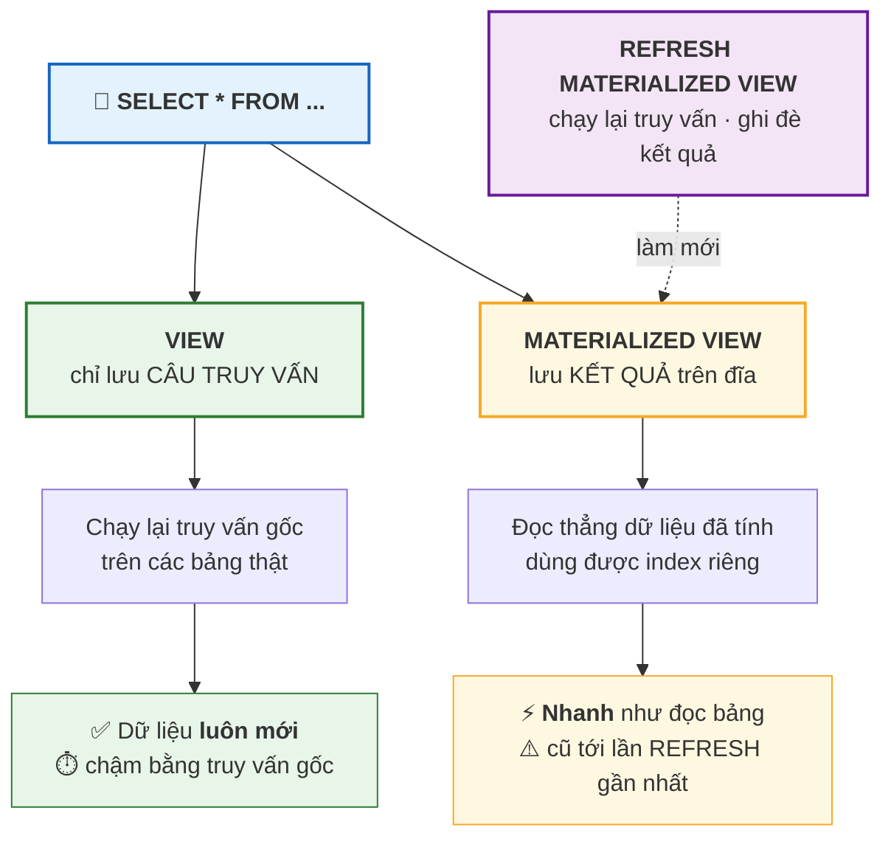
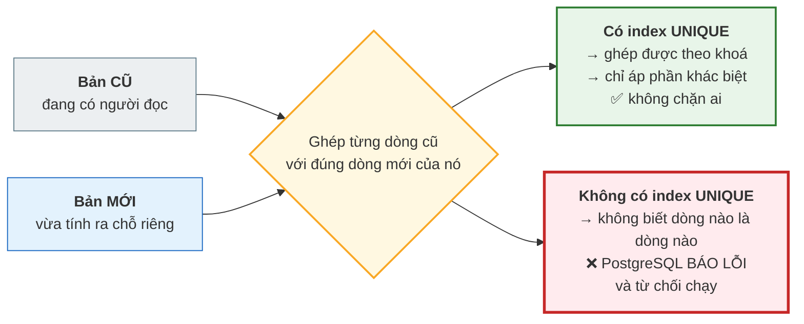

# Bài 30 — View và Materialized View

!!! abstract "🎯 Học xong bài này, bạn sẽ"
    - Tạo được **view** và giải thích vì sao nó **không lưu dữ liệu**, chỉ lưu câu truy vấn
    - Tạo được **materialized view**, làm mới nó bằng `REFRESH`, và biết vì sao `CONCURRENTLY` **đòi** một index `UNIQUE`
    - Chọn đúng giữa hai loại theo bốn tiêu chí: độ mới, tốc độ đọc, dung lượng, và mức chấp nhận dữ liệu cũ
    - Sửa dữ liệu **qua** một **view cập nhật được**, và chặn dòng "lọt ra ngoài view" bằng `WITH CHECK OPTION`
    - Hiểu vì sao `DROP VIEW` cần `CASCADE` khi có view khác dựng trên nó

## 🧠 Câu chuyện mở đầu

Mỗi thứ Hai, cô hiệu phó cần đúng một bảng: *sĩ số từng lớp, số học sinh nữ, và điểm trung bình toàn lớp*. Bạn viết cho cô một câu lệnh dài mười dòng, ghép bốn bảng lại với nhau.

Tuần sau cô lại cần. Bạn gửi lại câu lệnh đó. Tuần sau nữa, cô nhờ thầy dạy Tin chạy hộ, và thầy sửa một chỗ cho "gọn hơn" — từ đó hai người có hai phiên bản khác nhau của cùng một báo cáo.

Bạn nghĩ: *"Sao không đặt tên cho câu lệnh này, để ai cần thì chỉ việc gọi tên?"*

Đúng. SQL cho bạn làm thế, và nó gọi là **view**.

Rồi sang tháng, dữ liệu phình lên. Câu lệnh mười dòng đó bắt đầu chạy mất bốn giây, mà cả phòng hành chính thì mở báo cáo hàng chục lần mỗi buổi. Bạn nghĩ tiếp: *"Sao không tính sẵn một lần vào sáng thứ Hai rồi lưu lại, cả tuần đọc bản đã tính?"*

Cũng đúng. Và SQL cũng có thứ đó — nhưng nó mang theo một cái giá mà [Bài 20](../cap-2-chuan-hoa/20-denormalization.md) đã cảnh báo rất kỹ: **dữ liệu lưu sẵn thì có thể lệch với sự thật.**

Hai ý tưởng, hai công cụ, hai cái giá. Chọn cái nào và dựa vào đâu để chọn?

## 📖 Khái niệm & thuật ngữ

### View

**Khung nhìn** (*view*) là một **truy vấn được đặt tên**, lưu trong lược đồ của database. Nó **không lưu dữ liệu**. Mỗi lần bạn đọc view, PostgreSQL chạy lại câu truy vấn gốc.

```
CREATE VIEW ten_view AS
SELECT ...;
```

Từ lúc đó, `ten_view` dùng được ở mọi chỗ nhận một bảng: trong `FROM`, trong `JOIN`, trong truy vấn con. Người dùng không cần biết phía sau nó là bốn bảng ghép lại hay một bảng đơn.

Bốn lý do dùng view, theo thứ tự quan trọng:

| Lý do | Giải thích |
|---|---|
| **Đặt tên cho ý nghĩa** | `b30_v_bang_diem_day_du` nói rõ nó là gì; mười dòng `JOIN` thì không. |
| **Một nguồn chân lý** | Sửa định nghĩa báo cáo ở **một** chỗ, mọi người dùng đổi theo. Không còn hai phiên bản. |
| **Che phức tạp** | Người dùng cuối viết `SELECT * FROM view` là xong, không cần biết `JOIN` nào. |
| **Kiểm soát truy cập** | Cấp quyền đọc view mà **không** cấp quyền đọc bảng gốc — nên người dùng chỉ thấy đúng phần cột và dòng bạn cho phép. |

!!! note "View **không** làm truy vấn nhanh hơn"
    Đây là ngộ nhận phổ biến nhất về view. Một view chỉ là một cái tên; đọc nó tốn đúng bằng chạy câu truy vấn gốc, không hơn không kém.

    PostgreSQL thực ra **thay thế** tên view bằng định nghĩa của nó rồi mới tối ưu cả cụm — nên `SELECT * FROM view WHERE ma_lop = 'L03'` vẫn dùng được index trên `ma_lop` của bảng gốc. Nhưng nó không tiết kiệm được một phép tính nào.

    Muốn nhanh hơn thì phải **lưu kết quả lại** — và đó là materialized view.

### Materialized view

**Khung nhìn vật chất hoá** (*materialized view*) là một view **có lưu kết quả lên đĩa**. Đọc nó là đọc dữ liệu đã tính sẵn, nhanh như đọc một bảng thường.

```
CREATE MATERIALIZED VIEW ten_mv AS
SELECT ...;
```

Nhưng kết quả đó **đứng im** từ lúc tạo. Bảng gốc đổi thì materialized view **không tự đổi**. Muốn cập nhật thì phải ra lệnh:

```
REFRESH MATERIALIZED VIEW ten_mv;
```

Và đó là toàn bộ đánh đổi. Nối lại [Bài 20](../cap-2-chuan-hoa/20-denormalization.md): materialized view chính là **kỹ thuật phi chuẩn hoá số 4** mà bài đó đã hẹn dạy kỹ ở đây. Nó lưu một bản sao của dữ liệu đã tổng hợp, nên nó mang đúng cái giá của mọi phép phi chuẩn hoá — **nguy cơ lệch dữ liệu** — nhưng nó là cách **an toàn nhất** trong năm kỹ thuật, vì hai lý do:

1. **Bản sao không sửa tay được.** Bạn không `UPDATE` được một materialized view. Nội dung nó chỉ đến từ một nguồn duy nhất: câu truy vấn gốc. Còn một "bảng tổng hợp tự làm" thì ai cũng `UPDATE` được, và một lần `UPDATE` sai là bản sao lệch mãi mãi.
2. **Lệch bao nhiêu thì đo được.** Độ cũ của nó đúng bằng khoảng thời gian từ lần `REFRESH` gần nhất. Còn bảng tổng hợp tự làm thì độ lệch là một hàm của việc ứng dụng có nhớ cập nhật hay không — tức là không đo được.

### `REFRESH` và `CONCURRENTLY`

`REFRESH MATERIALIZED VIEW` thường **khoá** materialized view ở mức `ACCESS EXCLUSIVE`: trong lúc làm mới, **không ai đọc được nó**. Với một báo cáo mất bốn giây để tính, đó là bốn giây cả phòng hành chính nhìn màn hình chờ.

```
REFRESH MATERIALIZED VIEW CONCURRENTLY ten_mv;
```

`CONCURRENTLY` giải quyết đúng chuyện đó: nó tính bản mới ra một chỗ riêng, so sánh với bản cũ, rồi **chỉ áp phần khác biệt**. Người đọc không bị chặn một giây nào.

Nhưng nó có **ba điều kiện**, và điều kiện đầu là thứ hay làm người ta vấp:

| Điều kiện | Vì sao |
|---|---|
| **Phải có một index `UNIQUE`** trên materialized view, phủ các cột định danh một dòng | Để so sánh bản mới với bản cũ, PostgreSQL phải **ghép từng dòng cũ với đúng dòng mới của nó**. Không có khoá duy nhất thì không ghép được — và đây chính là lý do kỹ thuật, không phải một quy định tuỳ tiện. |
| Materialized view **phải đang có dữ liệu** | Không thể "áp phần khác biệt" lên một bản rỗng. |
| **Không** chạy được trong một khối giao dịch tường minh | Vì bên trong nó cần nhiều bước có commit riêng. |

Thiếu index `UNIQUE` thì PostgreSQL từ chối bằng lỗi nói thẳng rằng cần một index duy nhất. Nó **không** âm thầm quay về chế độ khoá — và đó là một thiết kế tốt.

`CONCURRENTLY` chậm hơn `REFRESH` thường về tổng thời gian, vì nó phải làm thêm phép so sánh. Đánh đổi: **tổng thời gian dài hơn, nhưng không ai bị chặn.**

### `WITH NO DATA`

`CREATE MATERIALIZED VIEW ... WITH NO DATA` tạo ra cấu trúc mà **không** tính dữ liệu — hữu ích khi câu truy vấn tốn hàng phút và bạn muốn tạo lược đồ trước, tính sau.

Cái bẫy: một materialized view chưa có dữ liệu thì **không đọc được**. `SELECT` từ nó báo lỗi rằng nó chưa được nạp. Phải `REFRESH` một lần trước đã.

### View cập nhật được

**View cập nhật được** (*updatable view*) là view mà bạn `INSERT`, `UPDATE`, `DELETE` được **trực tiếp trên nó**, và thao tác đó tự chuyển xuống bảng gốc.

PostgreSQL tự động cho phép điều này khi view **đủ đơn giản**. Các điều kiện chính:

| View được tự động cập nhật khi | Và **không** được có |
|---|---|
| Chỉ có **đúng một** bảng hoặc view trong `FROM` | `DISTINCT`, `GROUP BY`, `HAVING` |
| Mọi cột trong `SELECT` là **tham chiếu cột đơn giản** | Hàm tổng hợp, window function |
| | `LIMIT`, `OFFSET` |
| | `UNION`, `INTERSECT`, `EXCEPT` |
| | `WITH` |

Nhìn danh sách đó thì rõ: chỉ những view "lọc dòng và chọn cột" mới cập nhật được. Một view có `JOIN` hay `GROUP BY` thì không — và với những view phức tạp ấy, cách duy nhất là tự viết một **trigger `INSTEAD OF`**, thứ mà [Bài 31](31-trigger-procedure-function.md) sẽ dạy.

### `WITH CHECK OPTION`

Đây là một cái bẫy rất phản trực giác, nên hãy đọc chậm.

Cho một view `chỉ gồm học sinh lớp L01`. Bạn `INSERT` qua view đó một học sinh **lớp L02**. Chuyện gì xảy ra?

Câu lệnh **thành công**. Dòng đó vào bảng gốc bình thường. Nhưng nó **không thoả điều kiện của view**, nên nó **biến mất khỏi chính cái view bạn vừa dùng để chèn nó**. Bạn chèn một dòng rồi không thấy nó đâu nữa.

**`WITH CHECK OPTION`** chặn đúng chuyện đó: nó bắt mọi dòng đi qua view phải thoả điều kiện `WHERE` của view, nếu không thì báo lỗi.

```
CREATE VIEW ... AS SELECT ... WHERE <điều kiện>
WITH CHECK OPTION;
```

Hai biến thể:

- **`WITH LOCAL CHECK OPTION`** — chỉ kiểm điều kiện của **chính view này**.
- **`WITH CASCADED CHECK OPTION`** — kiểm điều kiện của view này **và** của mọi view bên dưới nó. Đây là **mặc định** khi bạn chỉ viết `WITH CHECK OPTION`.

### `DROP VIEW` và `CASCADE`

Một view dựng được trên một view khác. Khi đó view dưới trở thành **phụ thuộc** của view trên, và PostgreSQL không cho bạn xoá nền móng khi còn cái nhà trên đó.

`DROP VIEW ten_view` sẽ **báo lỗi** nếu có view khác tham chiếu nó. Hai cách xử lý:

- **`DROP VIEW ... RESTRICT`** — từ chối nếu còn phụ thuộc. Đây là **mặc định**.
- **`DROP VIEW ... CASCADE`** — xoá luôn mọi thứ phụ thuộc vào nó.

`CASCADE` rất tiện và rất nguy hiểm: nó có thể xoá những view mà bạn không hề biết là đang tồn tại. Hãy luôn chạy `DROP ... RESTRICT` trước để **đọc danh sách phụ thuộc** trong thông báo lỗi, rồi mới quyết định.

### Bảng so sánh — phần đáng in ra dán lên tường

| Tiêu chí | `VIEW` | `MATERIALIZED VIEW` |
|---|---|---|
| **Có lưu dữ liệu?** | **Không** — chỉ lưu câu truy vấn | **Có** — lưu kết quả lên đĩa |
| **Độ mới của dữ liệu** | **Luôn mới tuyệt đối** — đọc là chạy lại truy vấn | Cũ tới lần `REFRESH` gần nhất |
| **Tốc độ đọc** | Bằng tốc độ truy vấn gốc — chậm nếu truy vấn nặng | **Nhanh như đọc bảng thường** |
| **Dung lượng đĩa** | Gần bằng 0 — chỉ vài dòng trong lược đồ | Bằng kích thước kết quả, cộng index |
| **Chi phí khi ghi vào bảng gốc** | Không có | Không có ngay — nhưng nợ một lần `REFRESH` |
| **Có index riêng được không?** | Không | **Được** — và thường là lý do chính để dùng nó |
| **Sửa dữ liệu qua nó được không?** | **Được**, nếu đủ đơn giản | **Không bao giờ** |
| **Có phải phi chuẩn hoá?** | **Không** — không có bản sao | **Có** — xem [Bài 20](../cap-2-chuan-hoa/20-denormalization.md) |
| **Dùng khi nào** | Đặt tên cho truy vấn, che phức tạp, kiểm soát quyền; dữ liệu phải đúng tức thời | Báo cáo tổng hợp nặng, đọc nhiều hơn ghi rất nhiều, nghiệp vụ chấp nhận dữ liệu "tới đêm qua" |
| **Tuyệt đối không dùng khi** | Truy vấn nặng mà bị đọc liên tục | Dữ liệu đòi chính xác tức thời — số sách còn trong kho, số dư tài khoản |

Câu hỏi quyết định chỉ có một: **nghiệp vụ có chấp nhận dữ liệu cũ vài giờ không?** Trả lời "không" thì đừng nghĩ tới materialized view, bất kể nó nhanh tới đâu.

### Bảng thuật ngữ

| Tiếng Việt | English | Nghĩa dễ hiểu |
|---|---|---|
| Khung nhìn | *view* | Truy vấn được đặt tên, lưu trong lược đồ; **không** lưu dữ liệu — đọc là chạy lại truy vấn gốc |
| Khung nhìn vật chất hoá | *materialized view* | View **có lưu** kết quả lên đĩa; nhanh khi đọc nhưng cũ dần, phải `REFRESH` để cập nhật |
| Làm mới đồng thời | *REFRESH CONCURRENTLY* | Làm mới materialized view mà không chặn người đọc; **đòi** một index `UNIQUE` để ghép được dòng cũ với dòng mới |
| View cập nhật được | *updatable view* | View đủ đơn giản để `INSERT`/`UPDATE`/`DELETE` trực tiếp, thao tác tự chuyển xuống bảng gốc |
| Kiểm tra khi ghi qua view | *WITH CHECK OPTION* | Bắt mọi dòng ghi qua view phải thoả điều kiện `WHERE` của view, thay vì lặng lẽ lọt ra ngoài tầm nhìn của nó |
| Xoá lan | *CASCADE* | Xoá luôn mọi đối tượng phụ thuộc; mặc định của `DROP VIEW` là `RESTRICT`, tức từ chối khi còn phụ thuộc |

## 🖼️ Sơ đồ

Đường đi của một lệnh `SELECT` qua hai loại — khác nhau ở đúng một chỗ: có đọc đĩa của riêng mình hay không.



Vì sao `REFRESH ... CONCURRENTLY` **đòi** một index `UNIQUE`:



## 💻 Thực hành

### Tạo view

Báo cáo mà cô hiệu phó cần, đóng gói thành một cái tên:

```sql
DROP VIEW IF EXISTS b30_v_bang_diem_day_du CASCADE;

CREATE VIEW b30_v_bang_diem_day_du AS
SELECT h.ma_hs,
       h.ho_ten     AS ten_hoc_sinh,
       l.ten_lop,
       l.khoi,
       m.ten_mon,
       d.hoc_ky,
       d.loai_diem,
       d.diem_so
FROM diem d
JOIN hoc_sinh h ON h.ma_hs  = d.ma_hs
JOIN lop      l ON l.ma_lop = h.ma_lop
JOIN mon_hoc  m ON m.ma_mon = d.ma_mon;

-- KỲ VỌNG: so_dong = 480
SELECT count(*) AS so_dong FROM b30_v_bang_diem_day_du;
```

**480 dòng** — đúng số dòng của bảng `diem`, vì cả ba phép `JOIN` đều là "nhiều-một" nên không nhân dòng.

Từ giờ mọi người dùng view thay vì mười dòng `JOIN`:

```sql
-- KỲ VỌNG: 9 dòng
-- KỲ VỌNG: so_con_diem = 12
SELECT ten_mon, count(*) AS so_con_diem
FROM b30_v_bang_diem_day_du
WHERE ten_lop = '8A1'
GROUP BY ten_mon
ORDER BY so_con_diem DESC, ten_mon;
```

Chín môn. Ba môn chính — Toán, Ngữ văn, Tiếng Anh — mỗi môn **12** con điểm: lớp `8A1` có 6 học sinh × 2 loại điểm. Sáu môn còn lại mỗi môn 6 con điểm.

Câu lệnh này ngắn hơn hẳn so với viết lại ba phép `JOIN`, và quan trọng hơn: nếu tháng sau định nghĩa "bảng điểm đầy đủ" thay đổi, bạn sửa **một** chỗ.

### View **không** lưu dữ liệu — bằng chứng từ chính lược đồ

Một view không có tệp dữ liệu nào trên đĩa. PostgreSQL ghi điều đó vào cột `relfilenode` của `pg_class`: giá trị `0` nghĩa là *"quan hệ này không có nơi lưu trữ"*.

```sql
DROP MATERIALIZED VIEW IF EXISTS b30_mv_thong_ke_lop CASCADE;

CREATE MATERIALIZED VIEW b30_mv_thong_ke_lop AS
SELECT l.ma_lop,
       l.ten_lop,
       l.khoi,
       count(h.ma_hs)                                    AS si_so,
       count(h.ma_hs) FILTER (WHERE h.gioi_tinh = 'Nữ')  AS so_nu
FROM lop l
LEFT JOIN hoc_sinh h ON h.ma_lop = l.ma_lop
GROUP BY l.ma_lop, l.ten_lop, l.khoi;

-- KỲ VỌNG: view_co_tep_du_lieu = false
-- KỲ VỌNG: mv_co_tep_du_lieu = true
SELECT (SELECT relfilenode <> 0 FROM pg_class WHERE relname = 'b30_v_bang_diem_day_du') AS view_co_tep_du_lieu,
       (SELECT relfilenode <> 0 FROM pg_class WHERE relname = 'b30_mv_thong_ke_lop')    AS mv_co_tep_du_lieu;
```

`false` và `true`. Đây không phải chuyện lý thuyết — nó là sự khác biệt vật lý duy nhất giữa hai loại, và mọi đánh đổi trong bảng so sánh đều chảy ra từ đó.

PostgreSQL cũng phân biệt hai loại bằng cột `relkind`:

```sql
-- KỲ VỌNG: 2 dòng
-- KỲ VỌNG: relkind = m
SELECT relname, relkind
FROM pg_class
WHERE relname IN ('b30_v_bang_diem_day_du', 'b30_mv_thong_ke_lop')
ORDER BY relkind;
```

Hai dòng: `m` cho materialized view, `v` cho view. (Bảng thường là `r`, index là `i` — Cấp 4 sẽ dùng nhiều tới bảng mã này.)

### Đọc materialized view

```sql
-- KỲ VỌNG: 6 dòng
-- KỲ VỌNG: ma_lop = L01
-- KỲ VỌNG: si_so = 6
-- KỲ VỌNG: so_nu = 3
SELECT ma_lop, ten_lop, khoi, si_so, so_nu
FROM b30_mv_thong_ke_lop
ORDER BY ma_lop;
```

Sáu lớp, `L01` có 6 bạn trong đó 3 nữ. Đọc nó không chạy lại phép `LEFT JOIN` và `GROUP BY` nào cả — dữ liệu đã nằm sẵn trên đĩa.

Và vì nó là dữ liệu thật trên đĩa, nó **đánh index được** — điều mà view thường không làm nổi:

```sql
CREATE UNIQUE INDEX b30_mv_thong_ke_lop_pk ON b30_mv_thong_ke_lop (ma_lop);
CREATE INDEX b30_mv_thong_ke_lop_khoi ON b30_mv_thong_ke_lop (khoi);

-- KỲ VỌNG: 2 dòng
-- KỲ VỌNG: indexname = b30_mv_thong_ke_lop_khoi
SELECT indexname
FROM pg_indexes
WHERE tablename = 'b30_mv_thong_ke_lop'
ORDER BY indexname;
```

Hai index. Đây thường là **lý do chính** người ta chọn materialized view: không phải để tiết kiệm phép tính, mà để đánh index lên **kết quả đã tổng hợp** — thứ mà bảng gốc không có.

### Độ mới — bằng chứng bằng một bảng nháp

Để thấy tận mắt view và materialized view lệch nhau, ta cần **thay đổi dữ liệu**. Làm việc đó trên một bảng nháp, không bao giờ trên 10 bảng thật:

```sql
DROP MATERIALIZED VIEW IF EXISTS b30_mv_tong CASCADE;
DROP VIEW IF EXISTS b30_v_tong CASCADE;
DROP TABLE IF EXISTS b30_so_diem CASCADE;

CREATE TABLE b30_so_diem (
    ma      CHAR(4)      PRIMARY KEY,
    diem_so NUMERIC(4,2) NOT NULL
);

INSERT INTO b30_so_diem (ma, diem_so) VALUES ('D001', 8.00), ('D002', 6.00);

CREATE VIEW b30_v_tong AS
SELECT count(*) AS so_dong, sum(diem_so) AS tong FROM b30_so_diem;

CREATE MATERIALIZED VIEW b30_mv_tong AS
SELECT count(*) AS so_dong, sum(diem_so) AS tong FROM b30_so_diem;

-- Lúc này hai bên giống nhau
-- KỲ VỌNG: view_so_dong = 2
-- KỲ VỌNG: mv_so_dong = 2
SELECT (SELECT so_dong FROM b30_v_tong)  AS view_so_dong,
       (SELECT so_dong FROM b30_mv_tong) AS mv_so_dong;
```

Bây giờ thêm một dòng vào bảng gốc — và **không** làm gì với hai view:

```sql
INSERT INTO b30_so_diem (ma, diem_so) VALUES ('D003', 10.00);

-- KỲ VỌNG: view_so_dong = 3
-- KỲ VỌNG: view_tong = 24.00
-- KỲ VỌNG: mv_so_dong = 2
-- KỲ VỌNG: mv_tong = 14.00
SELECT (SELECT so_dong FROM b30_v_tong)  AS view_so_dong,
       (SELECT tong    FROM b30_v_tong)  AS view_tong,
       (SELECT so_dong FROM b30_mv_tong) AS mv_so_dong,
       (SELECT tong    FROM b30_mv_tong) AS mv_tong;
```

Đây là **điểm mấu chốt của cả bài**: view nói `3` và `24.00`, materialized view vẫn nói `2` và `14.00`.

Materialized view **không sai** — nó đang trung thực báo cáo trạng thái lúc nó được tạo ra. Nhưng nếu người đọc không biết điều đó, họ vừa nhận một con số sai mà không có cảnh báo nào. Đúng như [Bài 20](../cap-2-chuan-hoa/20-denormalization.md) đã nói: **lệch dữ liệu không báo lỗi.**

`REFRESH` để hai bên gặp lại nhau:

```sql
REFRESH MATERIALIZED VIEW b30_mv_tong;

-- KỲ VỌNG: view_so_dong = 3
-- KỲ VỌNG: mv_so_dong = 3
-- KỲ VỌNG: bang_nhau = true
SELECT (SELECT so_dong FROM b30_v_tong)                            AS view_so_dong,
       (SELECT so_dong FROM b30_mv_tong)                           AS mv_so_dong,
       ((SELECT so_dong FROM b30_v_tong) = (SELECT so_dong FROM b30_mv_tong)) AS bang_nhau;
```

### `REFRESH ... CONCURRENTLY`

Materialized view `b30_mv_thong_ke_lop` đã có index `UNIQUE` trên `ma_lop` ở phần trên, nên nó đủ điều kiện:

```sql
REFRESH MATERIALIZED VIEW CONCURRENTLY b30_mv_thong_ke_lop;

-- KỲ VỌNG: 6 dòng
-- KỲ VỌNG: ma_lop = L01
-- KỲ VỌNG: si_so = 6
SELECT ma_lop, si_so, so_nu
FROM b30_mv_thong_ke_lop
ORDER BY ma_lop;
```

Chạy trơn. Còn `b30_mv_tong` thì **không** có index `UNIQUE` nào, nên lệnh sau sẽ thất bại:

<!-- sql:co-y-loi -->
```sql
REFRESH MATERIALIZED VIEW CONCURRENTLY b30_mv_tong;
```

PostgreSQL báo lỗi rằng không thể làm mới đồng thời khi materialized view chưa có index duy nhất.

Kiểm tra trước khi viết `CONCURRENTLY` vào một công việc chạy theo lịch — đây là câu truy vấn nên có trong sổ tay:

```sql
-- KỲ VỌNG: 2 dòng
-- KỲ VỌNG: ten_mv = b30_mv_thong_ke_lop
-- KỲ VỌNG: refresh_concurrently_duoc = true
SELECT c.relname                                      AS ten_mv,
       count(i.indexrelid) FILTER (WHERE i.indisunique) > 0 AS refresh_concurrently_duoc
FROM pg_class c
LEFT JOIN pg_index i ON i.indrelid = c.oid
WHERE c.relkind = 'm'
  AND c.relname LIKE 'b30\_%'
GROUP BY c.relname
ORDER BY c.relname;
```

Hai materialized view: `b30_mv_thong_ke_lop` làm mới đồng thời được, `b30_mv_tong` thì không.

### `WITH NO DATA`

```sql
DROP MATERIALIZED VIEW IF EXISTS b30_mv_chua_nap CASCADE;

CREATE MATERIALIZED VIEW b30_mv_chua_nap AS
SELECT ma_lop, count(*) AS si_so FROM hoc_sinh GROUP BY ma_lop
WITH NO DATA;

-- KỲ VỌNG: 1 dòng
-- KỲ VỌNG: da_nap_du_lieu = false
SELECT relname, relispopulated AS da_nap_du_lieu
FROM pg_class
WHERE relname = 'b30_mv_chua_nap';
```

Cột `relispopulated` là `false`. Đọc nó bây giờ là lỗi:

<!-- sql:co-y-loi -->
```sql
SELECT * FROM b30_mv_chua_nap;
```

PostgreSQL báo lỗi rằng materialized view `b30_mv_chua_nap` chưa được nạp dữ liệu.

Một lần `REFRESH` là xong:

```sql
REFRESH MATERIALIZED VIEW b30_mv_chua_nap;

-- KỲ VỌNG: 6 dòng
-- KỲ VỌNG: ma_lop = L01
-- KỲ VỌNG: si_so = 6
SELECT ma_lop, si_so FROM b30_mv_chua_nap ORDER BY ma_lop;
```

### View cập nhật được

Sửa dữ liệu qua view thì phải làm trên bảng nháp — không bao giờ trên 10 bảng thật:

```sql
DROP VIEW IF EXISTS b30_v_lop_l01 CASCADE;
DROP TABLE IF EXISTS b30_hoc_sinh_nhap CASCADE;

CREATE TABLE b30_hoc_sinh_nhap (
    ma_hs  CHAR(5)     PRIMARY KEY,
    ho_ten VARCHAR(60) NOT NULL,
    ma_lop CHAR(3)     NOT NULL
);

INSERT INTO b30_hoc_sinh_nhap (ma_hs, ho_ten, ma_lop)
SELECT ma_hs, ho_ten, ma_lop FROM hoc_sinh;

CREATE VIEW b30_v_lop_l01 AS
SELECT ma_hs, ho_ten, ma_lop
FROM b30_hoc_sinh_nhap
WHERE ma_lop = 'L01';

-- KỲ VỌNG: trong_bang = 40
-- KỲ VỌNG: trong_view = 6
SELECT (SELECT count(*) FROM b30_hoc_sinh_nhap) AS trong_bang,
       (SELECT count(*) FROM b30_v_lop_l01)     AS trong_view;
```

PostgreSQL biết view này đủ đơn giản để cập nhật. Có thể hỏi thẳng nó:

```sql
-- KỲ VỌNG: 1 dòng
-- KỲ VỌNG: sua_duoc = YES
SELECT table_name, is_updatable AS sua_duoc
FROM information_schema.views
WHERE table_name = 'b30_v_lop_l01';
```

Bây giờ `INSERT` **qua view**:

```sql
INSERT INTO b30_v_lop_l01 (ma_hs, ho_ten, ma_lop)
VALUES ('HS900', 'Nguyen Van Thu Nghiem', 'L01');

-- KỲ VỌNG: trong_bang = 41
-- KỲ VỌNG: trong_view = 7
SELECT (SELECT count(*) FROM b30_hoc_sinh_nhap) AS trong_bang,
       (SELECT count(*) FROM b30_v_lop_l01)     AS trong_view;
```

Cả hai tăng 1. Dòng mới vào bảng gốc, và vì nó thuộc `L01` nên nó hiện trong view.

### Dòng "lọt ra ngoài view"

Bây giờ `INSERT` một học sinh **lớp L02** qua cùng cái view đó:

```sql
INSERT INTO b30_v_lop_l01 (ma_hs, ho_ten, ma_lop)
VALUES ('HS901', 'Tran Thi Lot Ngoai', 'L02');

-- KỲ VỌNG: trong_bang = 42
-- KỲ VỌNG: trong_view = 7
SELECT (SELECT count(*) FROM b30_hoc_sinh_nhap) AS trong_bang,
       (SELECT count(*) FROM b30_v_lop_l01)     AS trong_view;
```

Đọc kỹ: bảng gốc tăng lên **42**, nhưng view vẫn **7**. Câu `INSERT` thành công, không cảnh báo gì, và dòng vừa chèn **không nhìn thấy được qua chính cái view đã chèn nó**.

Với một ứng dụng chỉ nói chuyện với view, đây là tình huống tệ nhất có thể: người dùng bấm "Lưu", hệ thống báo thành công, rồi danh sách hiện ra không có bản ghi vừa lưu. Không ai đoán nổi nguyên nhân.

`WITH CHECK OPTION` chặn ngay tại cửa:

```sql
DROP VIEW IF EXISTS b30_v_lop_l01_chat CASCADE;

CREATE VIEW b30_v_lop_l01_chat AS
SELECT ma_hs, ho_ten, ma_lop
FROM b30_hoc_sinh_nhap
WHERE ma_lop = 'L01'
WITH CHECK OPTION;

-- KỲ VỌNG: 1 dòng
-- KỲ VỌNG: muc_kiem_tra = CASCADED
SELECT table_name, check_option AS muc_kiem_tra
FROM information_schema.views
WHERE table_name = 'b30_v_lop_l01_chat';
```

Mức kiểm tra là **`CASCADED`** — đúng như phần lý thuyết đã nói: viết `WITH CHECK OPTION` không kèm từ nào thì mặc định là `CASCADED`.

Chèn một dòng **đúng** điều kiện thì được:

```sql
INSERT INTO b30_v_lop_l01_chat (ma_hs, ho_ten, ma_lop)
VALUES ('HS902', 'Le Van Dung Lop', 'L01');

-- KỲ VỌNG: trong_view_chat = 8
SELECT count(*) AS trong_view_chat FROM b30_v_lop_l01_chat;
```

Chèn một dòng **sai** điều kiện thì bị từ chối:

<!-- sql:co-y-loi -->
```sql
INSERT INTO b30_v_lop_l01_chat (ma_hs, ho_ten, ma_lop)
VALUES ('HS903', 'Pham Thi Sai Lop', 'L02');
```

PostgreSQL báo lỗi rằng dòng mới vi phạm `check option` của view `b30_v_lop_l01_chat`.

`UPDATE` cũng bị kiểm: đổi lớp của một học sinh `L01` sang `L02` là đẩy dòng đó ra khỏi view, nên cũng bị chặn:

<!-- sql:co-y-loi -->
```sql
UPDATE b30_v_lop_l01_chat SET ma_lop = 'L02' WHERE ma_hs = 'HS902';
```

!!! tip "Nguyên tắc: view dùng để ghi thì **luôn** kèm `WITH CHECK OPTION`"
    Nếu một view chỉ để **đọc**, `WITH CHECK OPTION` vô nghĩa — cứ bỏ qua.

    Nhưng nếu ứng dụng ghi qua view, thiếu nó là để ngỏ một lỗi im lặng mà không công cụ nào bắt được: dữ liệu vào đúng bảng nhưng biến khỏi tầm nhìn của ứng dụng.

    Đây cũng là một phần của việc dùng view để **kiểm soát truy cập**: nếu bạn cấp cho một người quyền ghi vào view "chỉ lớp L01" mà không có `WITH CHECK OPTION`, người đó vẫn ghi được dòng của lớp khác — tức là hàng rào phân quyền của bạn có một lỗ.

### View không cập nhật được

View có `GROUP BY` thì PostgreSQL không tự suy ra được phải sửa dòng nào ở bảng gốc:

```sql
-- KỲ VỌNG: 1 dòng
-- KỲ VỌNG: sua_duoc = NO
SELECT table_name, is_updatable AS sua_duoc
FROM information_schema.views
WHERE table_name = 'b30_v_tong';
```

`NO`. Thử sửa là lỗi ngay:

<!-- sql:co-y-loi -->
```sql
UPDATE b30_v_tong SET so_dong = 99;
```

PostgreSQL báo lỗi rằng không thể cập nhật view này, và gợi ý dùng một trigger `INSTEAD OF` hoặc một quy tắc `DO INSTEAD`.

Và materialized view thì **không bao giờ** sửa được, dù đơn giản tới đâu:

<!-- sql:co-y-loi -->
```sql
UPDATE b30_mv_thong_ke_lop SET si_so = 99 WHERE ma_lop = 'L01';
```

Chính hạn chế này lại là **ưu điểm** lớn nhất của materialized view với vai trò công cụ phi chuẩn hoá: bản sao không có đường nào để lệch khỏi nguồn ngoài lệnh `REFRESH`. So với một "bảng tổng hợp tự làm" mà ai cũng `UPDATE` được, đây là khác biệt giữa an toàn và nguy hiểm.

[Bài 31](31-trigger-procedure-function.md) sẽ dạy trigger `INSTEAD OF` — cách để một view có `JOIN` cũng ghi được.

### View dựng trên view, và `DROP ... CASCADE`

```sql
DROP VIEW IF EXISTS b30_v_lop_l01_nu CASCADE;

CREATE VIEW b30_v_lop_l01_nu AS
SELECT v.ma_hs, v.ho_ten
FROM b30_v_lop_l01 v
WHERE v.ma_hs LIKE 'HS0%';

-- KỲ VỌNG: so_dong = 6
SELECT count(*) AS so_dong FROM b30_v_lop_l01_nu;
```

Sáu dòng — `HS001`…`HS006`; hai bạn `HS900` và `HS902` bị lọc vì mã không khớp mẫu `HS0%`.

Bây giờ thử xoá view **nền móng**:

<!-- sql:co-y-loi -->
```sql
DROP VIEW b30_v_lop_l01;
```

PostgreSQL từ chối, và thông báo lỗi nói rõ có view `b30_v_lop_l01_nu` đang phụ thuộc vào nó. Đây là hành vi `RESTRICT` — mặc định, và là mặc định đúng.

Xem danh sách phụ thuộc trước khi quyết định. Câu lệnh dưới đây đọc hai **bảng hệ thống** của PostgreSQL, thứ mà [Bài 3](../cap-0-nhap-mon/03-dbms-la-gi.md) gọi là **từ điển dữ liệu**:

- **`pg_rewrite`** giữ định nghĩa của mọi view — với PostgreSQL, một view thực chất là một **quy tắc viết lại** câu truy vấn.
- **`pg_depend`** giữ mọi quan hệ "cái này phụ thuộc cái kia" trong database, và chính nó là thứ làm `DROP ... RESTRICT` biết phải từ chối.

Bạn **không cần đọc hiểu** bốn phép `JOIN` dưới đây, và Cấp 4 sẽ dạy các bảng hệ thống một cách có hệ thống. Ở đây hãy coi nó là một **công cụ chép vào sổ tay** — thay tên view ở dòng `source.relname` là dùng được cho mọi trường hợp:

```sql
-- KỲ VỌNG: 1 dòng
-- KỲ VỌNG: view_phu_thuoc = b30_v_lop_l01_nu
SELECT DISTINCT dependent.relname AS view_phu_thuoc
FROM pg_depend d
JOIN pg_rewrite r        ON r.oid = d.objid
JOIN pg_class dependent  ON dependent.oid = r.ev_class
JOIN pg_class source     ON source.oid = d.refobjid
WHERE d.classid = 'pg_rewrite'::regclass
  AND source.relname = 'b30_v_lop_l01'
  AND dependent.relname <> 'b30_v_lop_l01'
  AND dependent.relkind IN ('v', 'm')
ORDER BY dependent.relname;
```

Đúng một view phụ thuộc. Biết rồi thì `CASCADE` an tâm:

```sql
DROP VIEW b30_v_lop_l01 CASCADE;

-- KỲ VỌNG: con_lai = 0
SELECT count(*) AS con_lai
FROM information_schema.views
WHERE table_name IN ('b30_v_lop_l01', 'b30_v_lop_l01_nu');
```

Cả hai biến mất. Bảng gốc `b30_hoc_sinh_nhap` thì **không** bị ảnh hưởng — `CASCADE` của `DROP VIEW` chỉ lan tới các đối tượng **phụ thuộc vào view**, không bao giờ xuống bảng nền:

```sql
-- KỲ VỌNG: so_dong = 43
SELECT count(*) AS so_dong FROM b30_hoc_sinh_nhap;
```

Vẫn đủ 43 dòng — 40 học sinh sao chép từ bảng thật, cộng `HS900`, `HS901` và `HS902` đã chèn qua các view ở trên.

!!! danger "`CASCADE` không có lệnh hoàn tác"
    `DROP VIEW ... CASCADE` trên một production database có thể xoá mười view mà bạn không biết là ai đang dùng. Không có `UNDO`, và định nghĩa view thì không nằm trong bản sao lưu dữ liệu nếu bạn chỉ sao lưu dữ liệu.

    Thói quen an toàn: **chạy `DROP` không có `CASCADE` trước**, đọc danh sách trong thông báo lỗi, xuất định nghĩa các view đó ra (`pg_get_viewdef`), rồi mới `CASCADE`.

    Và hãy chú ý: quy tắc này áp cho **mọi** `CASCADE`, kể cả `DROP TABLE ... CASCADE` mà khóa học dùng thoải mái ở các bảng nháp `b2x_*`. Ở bảng nháp thì không sao; ở bảng thật thì đó là một lệnh phải được duyệt.

### Nối lại Bài 20 — materialized view là phi chuẩn hoá an toàn nhất

[Bài 20](../cap-2-chuan-hoa/20-denormalization.md) nêu năm kỹ thuật phi chuẩn hoá và một câu hỏi duy nhất để phân loại: **có lưu một bản sao của dữ liệu hay không?**

| Kỹ thuật | Có bản sao? | Ai có thể làm nó lệch? |
|---|---|---|
| `VIEW` thường | **Không** | Không ai — nên nó **không phải** phi chuẩn hoá |
| Cột tính sẵn | Có | Mọi lệnh `UPDATE` vào cột nguồn mà quên cập nhật cột tính sẵn |
| Cột nhân bản | Có | Mọi lệnh `UPDATE` vào bảng gốc |
| Bảng tổng hợp tự làm | Có | Mọi lệnh `INSERT`/`UPDATE`/`DELETE`, **và** mọi lệnh `UPDATE` ghi trực tiếp vào bảng tổng hợp |
| **`MATERIALIZED VIEW`** | **Có** | **Chỉ có thời gian** — không ai ghi trực tiếp được vào nó |

Dòng cuối là toàn bộ lý do materialized view được gọi là cách phi chuẩn hoá **an toàn nhất**: nguy cơ lệch thu gọn lại thành đúng một biến số mà bạn **điều khiển được** — tần suất `REFRESH`.

!!! warning "PostgreSQL **không** ghi lại thời điểm `REFRESH` gần nhất"
    Nếu bạn định đi tìm một cột hệ thống cho biết materialized view được làm mới lần cuối lúc nào — **không có cột nào như vậy**. `pg_class` có `relispopulated` để nói "đã nạp dữ liệu hay chưa", nhưng không có gì nói "nạp lúc nào". Đây là một thiếu sót thật của PostgreSQL và bạn phải tự bù.

    Cách làm trong thực tế: **tự thêm một cột thời gian vào chính materialized view**.

    ```sql
    -- KỲ VỌNG: 1 dòng
    -- KỲ VỌNG: si_so = 40
    -- KỲ VỌNG: du_lieu_con_moi = true
    SELECT tinh_luc,
           si_so,
           (now() - tinh_luc < INTERVAL '1 hour') AS du_lieu_con_moi
    FROM (
        SELECT now()      AS tinh_luc,
               count(*)   AS si_so
        FROM hoc_sinh
    ) AS mo_phong_mv;
    ```

    Thêm `now() AS tinh_luc` vào câu truy vấn của materialized view là đủ: mỗi lần `REFRESH`, cột đó mang thời điểm của lần refresh ấy. Báo cáo in kèm dòng *"số liệu tính lúc 06:00 hôm nay"*, và người đọc không còn bị lừa.

    Đây là một nguyên tắc nghề rộng hơn cả bài học này: **dữ liệu có thể cũ thì phải mang theo dấu thời gian của chính nó.**

Các đối tượng `b30_*` được giữ lại tới cuối bài, vì phần **Lỗi thường gặp** và **Bài tập** còn dùng chúng. Mục dọn dẹp nằm ở cuối.

## ⚠️ Lỗi thường gặp

!!! danger "Lỗi 1: Tưởng materialized view tự cập nhật"
    Đây là lỗi tốn kém nhất trong cả bài, và nó **không báo lỗi bao giờ**.

    Bảng gốc thêm dòng, materialized view vẫn giữ con số cũ. Báo cáo sĩ số nói 40 trong khi trường đã có 42 học sinh. Không có cảnh báo, không có dòng log nào.

    Ba việc phải làm cùng lúc:

    1. **Đặt `REFRESH` vào một công việc theo lịch** — `cron` của hệ điều hành, `pg_cron`, hoặc bộ điều phối của ứng dụng. Đừng trông vào việc ai đó nhớ chạy tay.
    2. **Thêm `now() AS tinh_luc` vào truy vấn của materialized view** và in thời điểm đó lên báo cáo.
    3. **Ghi rõ vào tên hoặc tài liệu** rằng đây là số liệu tính theo lịch. `mv_thong_ke_lop_hang_dem` nói nhiều hơn `mv_thong_ke_lop`.

!!! danger "Lỗi 2: Dùng `CONCURRENTLY` mà chưa có index `UNIQUE`"
    <!-- sql:co-y-loi -->
    ```sql
    REFRESH MATERIALIZED VIEW CONCURRENTLY b30_mv_tong;
    ```

    PostgreSQL từ chối vì `b30_mv_tong` không có index duy nhất nào.

    Cái bẫy thật nằm ở chỗ khác: lệnh này thường nằm trong một **công việc chạy lúc 3 giờ sáng**. Nó thất bại im lặng trong log, materialized view không được làm mới, và cả tuần sau mới có người phát hiện báo cáo đứng im.

    Sửa: tạo index `UNIQUE` phủ các cột định danh một dòng của materialized view — thường chính là các cột trong `GROUP BY`.

    ```sql
    -- KỲ VỌNG: 1 dòng
    -- KỲ VỌNG: so_index_unique = 1
    SELECT count(*) AS so_index_unique
    FROM pg_index i
    JOIN pg_class c ON c.oid = i.indrelid
    WHERE c.relname = 'b30_mv_thong_ke_lop'
      AND i.indisunique;
    ```

    Và hãy chắc chắn tổ hợp cột đó **thật sự** duy nhất — nếu không, chính lệnh `CREATE UNIQUE INDEX` sẽ thất bại, và thất bại lúc đó thì tốt hơn nhiều so với thất bại lúc 3 giờ sáng.

!!! warning "Lỗi 3: Thiếu `WITH CHECK OPTION` trên view dùng để ghi"
    ```sql
    -- KỲ VỌNG: trong_bang = 43
    -- KỲ VỌNG: trong_view_chat = 8
    SELECT (SELECT count(*) FROM b30_hoc_sinh_nhap)   AS trong_bang,
           (SELECT count(*) FROM b30_v_lop_l01_chat)  AS trong_view_chat;
    ```

    Bảng có **43** dòng nhưng view "lớp L01" chỉ thấy **8**. Trong 43 dòng đó có `HS901` — dòng đã lọt qua view `b30_v_lop_l01` (bản không có `CHECK OPTION`) rồi biến khỏi tầm nhìn.

    Đây là lỗi mà **không công cụ nào bắt được**: không vi phạm ràng buộc, không sai kiểu, không báo lỗi. Chỉ có người dùng ngồi tự hỏi bản ghi mình vừa lưu đi đâu.

    Quy tắc: **view nào ứng dụng ghi qua thì view đó phải có `WITH CHECK OPTION`.** Không có ngoại lệ đáng nhớ.

!!! warning "Lỗi 4: Tưởng view làm truy vấn nhanh hơn"
    ```sql
    -- KỲ VỌNG: qua_view = 480
    -- KỲ VỌNG: viet_truc_tiep = 480
    SELECT (SELECT count(*) FROM b30_v_bang_diem_day_du) AS qua_view,
           (SELECT count(*)
            FROM diem d
            JOIN hoc_sinh h ON h.ma_hs  = d.ma_hs
            JOIN lop      l ON l.ma_lop = h.ma_lop
            JOIN mon_hoc  m ON m.ma_mon = d.ma_mon)      AS viet_truc_tiep;
    ```

    Cùng **480**, và cùng một khối lượng công việc — vì PostgreSQL thay tên view bằng định nghĩa của nó rồi mới tối ưu.

    View cho bạn **sự rõ ràng và một nguồn chân lý**, không cho bạn tốc độ. Muốn tốc độ thì phải lưu kết quả lại, tức là materialized view — và trả giá bằng độ mới. Không có bữa trưa miễn phí ở đây.

    Cấp 4 sẽ cho bạn thấy bằng `EXPLAIN` rằng kế hoạch thực thi của hai câu trên là **giống nhau từng nút**.

!!! warning "Lỗi 5: `DROP VIEW ... CASCADE` mà không xem trước phụ thuộc"
    ```sql
    -- KỲ VỌNG: 1 dòng
    -- KỲ VỌNG: so_view_con_lai = 3
    SELECT count(*) AS so_view_con_lai
    FROM information_schema.views
    WHERE table_name LIKE 'b30\_%';
    ```

    Ba view còn sống ở thời điểm này: `b30_v_bang_diem_day_du`, `b30_v_tong`, `b30_v_lop_l01_chat`. Trước đó `b30_v_lop_l01` và `b30_v_lop_l01_nu` đã bị `CASCADE` xoá cùng nhau — **một** lệnh, **hai** đối tượng mất.

    Trên một database thật, con số đó có thể là mười, và một trong mười có thể là view mà báo cáo tài chính của công ty đang dùng.

    Thói quen: `DROP` không `CASCADE` trước để đọc danh sách, xuất định nghĩa bằng `pg_get_viewdef`, rồi mới xoá. Đây là việc mất ba mươi giây và tránh được một buổi chiều tồi tệ.

## ✍️ Bài tập

1. Tạo một view `b30_v_bai_tap_gvcn` liệt kê **mọi lớp** kèm họ tên giáo viên chủ nhiệm, sao cho lớp `9A3` chưa có chủ nhiệm **vẫn hiện ra**. Cho biết view này có cập nhật được không, và vì sao.

2. Điền vào bảng sau cho bốn tình huống, chọn `VIEW` hay `MATERIALIZED VIEW` và giải thích bằng **một** tiêu chí duy nhất:

    a. Trang "số sách còn lại trong kho" của thư viện.

    b. Trang "top 10 học sinh điểm cao nhất trường", đọc 500 lần mỗi ngày, ban giám hiệu chấp nhận số liệu tính từ đêm qua.

    c. Một truy vấn `JOIN` bốn bảng mà năm người trong phòng đều cần, chạy hết 20 mili giây.

    d. Báo cáo tổng hợp toàn khối mất 30 giây để tính, được mở mỗi sáng thứ Hai.

3. Câu lệnh sau thất bại. Giải thích vì sao và nêu **hai** cách sửa:

    <!-- sql:khong-chay -->
    ```sql
    CREATE MATERIALIZED VIEW b30_mv_thu AS SELECT ma_lop, count(*) AS si_so FROM hoc_sinh GROUP BY ma_lop;
    REFRESH MATERIALIZED VIEW CONCURRENTLY b30_mv_thu;
    ```

4. Một ứng dụng ghi vào view `v_hoc_sinh_khoi_9` được định nghĩa là `SELECT ... WHERE khoi = 9`. Người dùng báo: *"Em lưu học sinh mới xong mà danh sách không thấy."* Chẩn đoán nguyên nhân và nêu cách sửa ở **hai** tầng: tầng database và tầng ứng dụng.

5. Giải thích vì sao `MATERIALIZED VIEW` được coi là cách phi chuẩn hoá **an toàn hơn** một bảng tổng hợp tự làm, dù cả hai đều lưu một bản sao dữ liệu. Nêu **hai** lý do khác nhau.

??? success "Đáp án"
    **Câu 1.**

    ```sql
    DROP VIEW IF EXISTS b30_v_bai_tap_gvcn CASCADE;

    CREATE VIEW b30_v_bai_tap_gvcn AS
    SELECT l.ma_lop,
           l.ten_lop,
           l.khoi,
           g.ma_gv,
           g.ho_ten AS ten_gvcn
    FROM lop l
    LEFT JOIN giao_vien g ON g.ma_gv = l.ma_gvcn;

    -- KỲ VỌNG: 6 dòng
    -- KỲ VỌNG: ten_lop = 9A3
    -- KỲ VỌNG: ten_gvcn = NULL
    SELECT ma_lop, ten_lop, ten_gvcn
    FROM b30_v_bai_tap_gvcn
    ORDER BY ten_gvcn NULLS FIRST, ma_lop;
    ```

    **Sáu dòng**, và dòng đầu là lớp `9A3` với `ten_gvcn` rỗng — nhờ `LEFT JOIN` của [Bài 25](25-join.md). Dùng `JOIN` thường thì mất lớp đó.

    View này **không** cập nhật được, vì nó có **hai** bảng trong `FROM`. Kiểm chứng:

    ```sql
    -- KỲ VỌNG: 1 dòng
    -- KỲ VỌNG: sua_duoc = NO
    SELECT table_name, is_updatable AS sua_duoc
    FROM information_schema.views
    WHERE table_name = 'b30_v_bai_tap_gvcn';
    ```

    Muốn ghi qua nó thì phải viết một trigger `INSTEAD OF` — và bạn sẽ phải tự quyết định một câu khó: `UPDATE ten_gvcn` nghĩa là *đổi tên vị giáo viên đó*, hay *đổi người chủ nhiệm lớp đó*? Chính vì câu hỏi này không có đáp án tự nhiên mà PostgreSQL từ chối tự suy diễn.

    ```sql
    DROP VIEW IF EXISTS b30_v_bai_tap_gvcn CASCADE;

    -- KỲ VỌNG: con_lai = 0
    SELECT count(*) AS con_lai
    FROM information_schema.views
    WHERE table_name = 'b30_v_bai_tap_gvcn';
    ```

    **Câu 2.**

    Tiêu chí duy nhất: **nghiệp vụ có chấp nhận dữ liệu cũ hay không.** Tốc độ chỉ là yếu tố thứ hai, và chỉ được xét sau khi đã trả lời câu đầu.

    | | Chọn | Vì sao |
    |---|---|---|
    | a. Sách còn trong kho | **`VIEW`** | Số liệu phải **đúng tức thời**. Hai học sinh cùng thấy "còn 1 cuốn" từ số liệu cũ là hai lượt mượn cho một cuốn sách. [Bài 20](../cap-2-chuan-hoa/20-denormalization.md) đã nêu đúng ví dụ này như điều tuyệt đối không được phi chuẩn hoá. |
    | b. Top 10 điểm cao | **`MATERIALIZED VIEW`** | Đủ cả hai điều kiện: đọc 500 lần so với ghi một lần mỗi đêm, **và** nghiệp vụ đã nói rõ là chấp nhận số liệu từ đêm qua. |
    | c. `JOIN` bốn bảng, 20 ms | **`VIEW`** | Không có vấn đề tốc độ nào để giải. Lý do dùng view ở đây là **một nguồn chân lý** cho năm người, không phải hiệu năng. Materialized view ở đây chỉ thêm nguy cơ lệch mà không đổi lấy gì. |
    | d. Báo cáo 30 giây, mở mỗi thứ Hai | **`MATERIALIZED VIEW`** | Tính sẵn trước giờ làm việc thứ Hai, kèm `now() AS tinh_luc` để người đọc biết số liệu tính lúc nào. Nếu ai cũng chỉ mở nó **một lần** mỗi tuần thì `VIEW` cũng chấp nhận được — câu trả lời phụ thuộc vào số lượt đọc, và 30 giây cho mỗi lượt là quá lâu với bất kỳ ai. |

    **Câu 3.**

    Lệnh `REFRESH ... CONCURRENTLY` thất bại vì `b30_mv_thu` **không có index `UNIQUE`**. `CONCURRENTLY` phải ghép từng dòng cũ với đúng dòng mới của nó để chỉ áp phần khác biệt, và không có khoá duy nhất thì không ghép được.

    **Cách 1 — tạo index `UNIQUE` rồi refresh:**

    ```sql
    DROP MATERIALIZED VIEW IF EXISTS b30_mv_thu CASCADE;

    CREATE MATERIALIZED VIEW b30_mv_thu AS
    SELECT ma_lop, count(*) AS si_so FROM hoc_sinh GROUP BY ma_lop;

    CREATE UNIQUE INDEX b30_mv_thu_pk ON b30_mv_thu (ma_lop);

    REFRESH MATERIALIZED VIEW CONCURRENTLY b30_mv_thu;

    -- KỲ VỌNG: 6 dòng
    -- KỲ VỌNG: ma_lop = L01
    -- KỲ VỌNG: si_so = 6
    SELECT ma_lop, si_so FROM b30_mv_thu ORDER BY ma_lop;
    ```

    Cột `ma_lop` là khoá của `GROUP BY` nên nó chắc chắn duy nhất — đó là lý do **các cột `GROUP BY` gần như luôn là lựa chọn đúng** cho index `UNIQUE` của một materialized view tổng hợp.

    **Cách 2 — bỏ `CONCURRENTLY`:**

    ```sql
    REFRESH MATERIALIZED VIEW b30_mv_thu;

    -- KỲ VỌNG: so_dong = 6
    SELECT count(*) AS so_dong FROM b30_mv_thu;
    ```

    Chạy được ngay, nhưng nó **khoá** materialized view trong lúc làm mới. Với một báo cáo 30 giây và người dùng đang online thì đó là 30 giây không ai đọc được — nên cách 1 mới là cách dùng trong sản phẩm thật, còn cách 2 dành cho lúc làm mới ngoài giờ.

    ```sql
    DROP MATERIALIZED VIEW IF EXISTS b30_mv_thu CASCADE;

    -- KỲ VỌNG: con_lai = 0
    SELECT count(*) AS con_lai FROM pg_class WHERE relname = 'b30_mv_thu';
    ```

    **Câu 4.**

    **Chẩn đoán:** view thiếu `WITH CHECK OPTION`. Ứng dụng đã chèn một học sinh có `khoi` khác 9 — có thể vì form để trống trường đó và nó nhận giá trị mặc định, hoặc vì người dùng chọn sai. Dòng vào bảng gốc thành công, nhưng nó không thoả `WHERE khoi = 9` nên biến khỏi view.

    Dấu hiệu nhận biết trong ba mươi giây: đếm ở bảng gốc và ở view, hai con số lệch nhau đúng bằng số bản ghi "mất tích".

    **Sửa ở tầng database** — thêm `WITH CHECK OPTION` để lỗi nổ ra ngay tại chỗ sinh ra nó:

    <!-- sql:khong-chay -->
    ```sql
    CREATE OR REPLACE VIEW v_hoc_sinh_khoi_9 AS
    SELECT ... FROM hoc_sinh WHERE khoi = 9
    WITH CHECK OPTION;
    ```

    Từ đó, mọi lệnh ghi sai bị từ chối kèm thông báo rõ ràng, thay vì thành công rồi biến mất.

    **Sửa ở tầng ứng dụng** — đừng để người dùng nhập được một giá trị mà view sẽ lọc bỏ. Ở màn hình "thêm học sinh khối 9", trường `khoi` phải được **điền sẵn và không sửa được**, không phải một ô trống.

    Hai tầng này bổ sung cho nhau chứ không thay thế nhau. Tầng ứng dụng làm giao diện tử tế; tầng database là hàng rào cuối cùng, và nó là hàng rào duy nhất còn đứng khi có người ghi dữ liệu bằng một công cụ khác — một script nhập liệu, một lần sửa tay trong `psql`. [Bài 15](../cap-1-mo-hinh-er/15-rang-buoc-toan-ven.md) đã nói đúng điều này về ràng buộc toàn vẹn, và `WITH CHECK OPTION` là cùng một nguyên tắc áp cho view.

    **Câu 5.**

    **Lý do 1 — không có đường nào để lệch ngoài `REFRESH`.** Một materialized view **không** `UPDATE` được; thử là PostgreSQL báo lỗi. Nội dung của nó chỉ đến từ một nguồn duy nhất: câu truy vấn định nghĩa. Còn một bảng tổng hợp tự làm thì ai có quyền ghi cũng `UPDATE` được nó, và một lần `UPDATE` sai — hoặc một lần trigger đồng bộ có lỗi — là bản sao lệch **mãi mãi**, cho tới khi có người dựng lại bằng tay.

    **Lý do 2 — độ lệch là một biến số duy nhất và đo được.** Với materialized view, "sai bao nhiêu" chỉ phụ thuộc vào "cách lần `REFRESH` gần nhất bao lâu" — một con số bạn đặt ra, kiểm soát được, và in lên báo cáo được. Với bảng tổng hợp tự làm, độ lệch phụ thuộc vào việc **mọi đường ghi dữ liệu** có nhớ cập nhật bảng đó hay không; chỉ cần một script nhập liệu viết năm ngoái không biết tới bảng tổng hợp là bạn có một độ lệch **không đo được và không phát hiện được**.

    Đó cũng là lý do [Bài 20](../cap-2-chuan-hoa/20-denormalization.md) xếp "ứng dụng tự lo việc đồng bộ" là cách gần như luôn sai: luôn có một đường vào dữ liệu khác mà bạn chưa biết.

    Ghi chú quan trọng: an toàn **hơn** không có nghĩa là an toàn. Materialized view vẫn là một bản sao, vẫn cũ, và vẫn tuyệt đối không dùng được cho dữ liệu đòi chính xác tức thời.

### Dọn dẹp cuối bài

Xoá mọi view, materialized view và bảng nháp mà bài này đã tạo. Chú ý thứ tự: view và materialized view **trước**, bảng nền **sau** — hoặc cứ dùng `CASCADE` như dưới đây:

```sql
DROP MATERIALIZED VIEW IF EXISTS b30_mv_thong_ke_lop CASCADE;
DROP MATERIALIZED VIEW IF EXISTS b30_mv_tong CASCADE;
DROP MATERIALIZED VIEW IF EXISTS b30_mv_chua_nap CASCADE;
DROP MATERIALIZED VIEW IF EXISTS b30_mv_thu CASCADE;
DROP VIEW IF EXISTS b30_v_bang_diem_day_du CASCADE;
DROP VIEW IF EXISTS b30_v_tong CASCADE;
DROP VIEW IF EXISTS b30_v_lop_l01_chat CASCADE;
DROP VIEW IF EXISTS b30_v_lop_l01_nu CASCADE;
DROP VIEW IF EXISTS b30_v_lop_l01 CASCADE;
DROP VIEW IF EXISTS b30_v_bai_tap_gvcn CASCADE;
DROP TABLE IF EXISTS b30_hoc_sinh_nhap CASCADE;
DROP TABLE IF EXISTS b30_so_diem CASCADE;

-- KỲ VỌNG: con_lai = 0
SELECT count(*) AS con_lai
FROM pg_class
WHERE relname LIKE 'b30\_%'
  AND relkind IN ('r', 'v', 'm');
```

Câu kiểm tra cuối quét cả ba `relkind` — `r` cho bảng, `v` cho view, `m` cho materialized view — để không sót loại nào.

## 🔑 Tóm tắt

1. **View** là truy vấn được đặt tên và **không lưu dữ liệu** — đọc nó là chạy lại truy vấn gốc, nên dữ liệu **luôn mới** nhưng **không nhanh hơn** một chút nào. Bốn lý do dùng nó: đặt tên cho ý nghĩa, giữ một nguồn chân lý, che phức tạp, và kiểm soát truy cập.
2. **Materialized view** lưu kết quả lên đĩa nên đọc nhanh như bảng thường và **đánh index được** — nhưng nó **đứng im** tới lần `REFRESH` kế tiếp. Câu hỏi quyết định khi chọn giữa hai loại chỉ có một: **nghiệp vụ có chấp nhận dữ liệu cũ hay không.** Trả lời "không" thì loại materialized view ngay, bất kể nó nhanh tới đâu.
3. **`REFRESH MATERIALIZED VIEW CONCURRENTLY`** không chặn người đọc, nhưng nó **đòi một index `UNIQUE`** trên materialized view — vì nó phải ghép từng dòng cũ với đúng dòng mới để chỉ áp phần khác biệt. Thiếu index đó thì lệnh bị từ chối, và thất bại đó rất hay xảy ra âm thầm trong một công việc chạy đêm. Các cột `GROUP BY` gần như luôn là lựa chọn đúng cho index này.
4. **View cập nhật được** khi nó đủ đơn giản: đúng một bảng trong `FROM`, cột là tham chiếu đơn giản, không `DISTINCT` / `GROUP BY` / hàm tổng hợp / `LIMIT` / phép tập hợp. View dùng để **ghi** thì **luôn** phải kèm **`WITH CHECK OPTION`** (mặc định là `CASCADED`) — thiếu nó, một dòng ghi sai điều kiện vẫn vào bảng gốc rồi **biến khỏi tầm nhìn của view**, mà không một công cụ nào bắt được.
5. **`DROP VIEW` mặc định là `RESTRICT`** và từ chối khi có view khác dựng trên nó; **`CASCADE`** xoá luôn mọi phụ thuộc và **không có lệnh hoàn tác**. Luôn `DROP` không `CASCADE` trước để đọc danh sách phụ thuộc. Nối lại [Bài 20](../cap-2-chuan-hoa/20-denormalization.md): materialized view là cách phi chuẩn hoá **an toàn nhất**, vì không ai ghi trực tiếp vào nó được và độ lệch thu về đúng một biến số bạn điều khiển — tần suất `REFRESH`.

---

⬅️ [Bài 29 — Window Function: tính toán theo cửa sổ](29-window-function.md) · ➡️ [Bài 31 — Trigger, Stored Procedure và Function](31-trigger-procedure-function.md)
