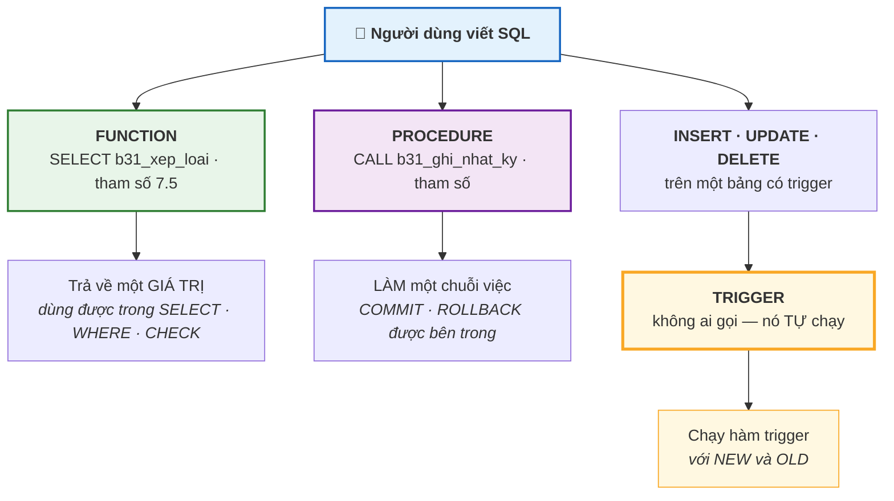
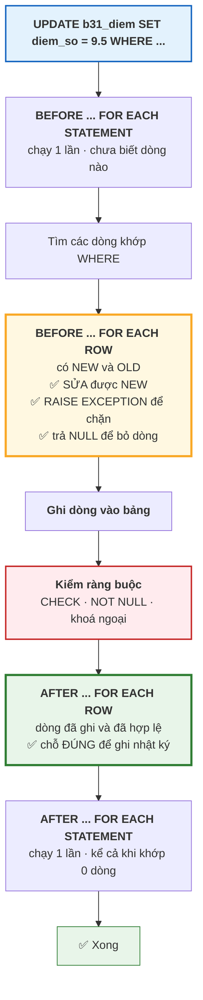

# Bài 31 — Trigger, Stored Procedure và Function

!!! abstract "🎯 Học xong bài này, bạn sẽ"
    - Phân biệt rạch ròi ba thứ: **function** trả giá trị và gọi trong `SELECT`; **procedure** gọi bằng `CALL`; **trigger** tự chạy
    - Viết được `PL/pgSQL`: khai biến, `IF`, `LOOP`, `RAISE NOTICE`, `RAISE EXCEPTION`
    - Gắn được trigger `BEFORE` / `AFTER` / `INSTEAD OF`, và biết khi nào `FOR EACH ROW`, khi nào `FOR EACH STATEMENT`
    - Dùng đúng hai biến `NEW` và `OLD` trong một **hàm trigger**
    - Khai đúng `IMMUTABLE` / `STABLE` / `VOLATILE`, và biết khai sai thì hậu quả gì

## 🧠 Câu chuyện mở đầu

Cuối học kỳ, phòng giáo vụ phát hiện một con điểm bị sửa. Bạn `HS015` môn Toán, trong sổ ghi 4,5 mà trong hệ thống hiện 8,0.

Ai sửa? Sửa lúc nào? Sửa từ bao nhiêu thành bao nhiêu? Không ai biết. Bảng `diem` chỉ lưu **giá trị hiện tại**. Cái giá trị cũ đã biến mất, và cùng với nó là mọi bằng chứng.

Thầy hiệu trưởng nói: *"Từ giờ mỗi lần ai sửa điểm, hệ thống phải tự ghi lại: điểm cũ, điểm mới, ai sửa, lúc mấy giờ."*

Bạn nghĩ tới cách hiển nhiên nhất: sửa phần mềm nhập điểm, thêm một câu lệnh ghi nhật ký sau mỗi lần cập nhật. Hợp lý — trừ một chuyện. Điểm không chỉ vào hệ thống qua phần mềm nhập điểm. Nó còn vào qua file Excel nhập hàng loạt đầu năm, qua một script của thầy dạy Tin, và qua chính bạn khi sửa tay trong `psql` lúc dữ liệu lỗi.

Mỗi đường vào là một chỗ phải nhớ ghi nhật ký. Và chỉ cần **một** đường bị quên là cả cuốn nhật ký mất giá trị làm chứng.

Có cách nào bắt chính **database** ghi nhật ký, bất kể dữ liệu đi vào bằng đường nào không?

## 📖 Khái niệm & thuật ngữ

### Ba thứ, ba vai trò

Ba khái niệm của bài này hay bị gọi lẫn nhau, nên hãy phân biệt ngay từ đầu.

| | **Function** (*hàm*) | **Procedure** (*thủ tục*) | **Trigger** (*bẫy sự kiện*) |
|---|---|---|---|
| Gọi bằng gì | `SELECT ham(...)` | `CALL thu_tuc(...)` | **Không ai gọi** — nó tự chạy |
| Trả về gì | **Bắt buộc** có `RETURNS` | Không trả giá trị | Không áp dụng |
| Dùng được trong `SELECT` / `WHERE` | **Được** | **Không** | Không |
| Quản lý giao dịch được không | **Không** — nó nằm trong giao dịch của câu lệnh gọi nó | **Được** — `COMMIT` / `ROLLBACK` bên trong | Không |
| Chạy khi nào | Khi bạn gọi | Khi bạn gọi | Khi có `INSERT` / `UPDATE` / `DELETE` trên bảng |
| Câu lệnh tạo | `CREATE FUNCTION` | `CREATE PROCEDURE` | `CREATE TRIGGER` + một hàm trigger |

Cách nhớ gọn: **function là một biểu thức, procedure là một việc, trigger là một lời hứa.**

- Function trả lời một câu hỏi: *"điểm 7,5 thì xếp loại gì?"* Nó dùng được ở mọi chỗ nhận một giá trị.
- Procedure làm một chuỗi việc: *"dọn dữ liệu cũ, làm mới báo cáo, ghi nhật ký."* Nó không trả lời gì, nó **làm**.
- Trigger là lời hứa của database: *"mỗi khi ai đó sửa bảng này, tôi sẽ tự làm việc kia."*

!!! note "Trước PostgreSQL 11 chỉ có function"
    `CREATE PROCEDURE` mới xuất hiện từ PostgreSQL 11. Trước đó, người ta viết "thủ tục" bằng `CREATE FUNCTION ... RETURNS void`.

    Khác biệt thật sự không nằm ở giá trị trả về mà ở **giao dịch**: một function luôn chạy **bên trong** giao dịch của câu lệnh gọi nó, nên nó không `COMMIT` được. Một procedure gọi bằng `CALL` — và **không** nằm trong một khối `BEGIN ... COMMIT` tường minh — thì `COMMIT` và `ROLLBACK` được ở giữa công việc.

    Đó là lý do procedure hợp cho những việc dài: xử lý 10 triệu dòng theo từng lô một nghìn dòng, commit sau mỗi lô. Function thì không làm nổi việc đó.

### `PL/pgSQL`

**`PL/pgSQL`** (*Procedural Language / PostgreSQL Structured Query Language*) là ngôn ngữ thủ tục mặc định của PostgreSQL: nó thêm biến, rẽ nhánh và vòng lặp vào SQL.

Khung xương của một khối `PL/pgSQL`:

```
DECLARE
    <khai báo biến>
BEGIN
    <các câu lệnh>
END;
```

`DECLARE` không bắt buộc nếu không có biến nào. Khối `BEGIN ... END` ở đây **không phải** `BEGIN` của giao dịch — nó chỉ là dấu mở và đóng của một khối mã. Đây là chỗ gây nhầm lẫn kinh điển, nên hãy nhớ: trong `PL/pgSQL`, `BEGIN` nghĩa là *"bắt đầu phần thân"*, không phải *"mở giao dịch"*.

Thân hàm được bọc trong **dấu nháy đô la** (*dollar quoting*) — `$$ ... $$` — để bạn khỏi phải nhân đôi mọi dấu nháy đơn bên trong. Có thể đặt nhãn cho nó: `$than_ham$ ... $than_ham$`, hữu ích khi thân hàm lại chứa `$$`.

Bốn thứ bạn cần ngay:

| Cú pháp | Dùng làm gì |
|---|---|
| `bien TYPE := gia_tri;` trong `DECLARE` | Khai biến, có thể kèm giá trị đầu |
| `IF ... THEN ... ELSIF ... ELSE ... END IF;` | Rẽ nhánh. Chú ý viết **`ELSIF`**, không phải `ELSEIF` hay `ELSE IF` |
| `WHILE ... LOOP ... END LOOP;` và `FOR i IN 1..10 LOOP ... END LOOP;` | Vòng lặp |
| `SELECT ... INTO bien FROM ...;` | Đọc một dòng vào biến |

Và hai lệnh báo tin:

- **`RAISE NOTICE 'thông điệp %', giá_trị;`** — in một thông báo ra cho người gọi. **Không** ảnh hưởng gì tới dữ liệu. Dấu `%` là chỗ điền giá trị.
- **`RAISE EXCEPTION 'thông điệp %', giá_trị;`** — **huỷ toàn bộ giao dịch** và báo lỗi. Đây là cách bạn từ chối một dữ liệu sai.

Khác biệt giữa hai lệnh này là khác biệt giữa *"tôi nhắc anh"* và *"tôi không cho phép"*.

### Mức độ bất biến của hàm

Mỗi function phải khai một trong ba mức, và PostgreSQL dùng nó để quyết định được phép tối ưu tới đâu.

| Khai | Nghĩa là bạn cam kết | PostgreSQL được phép làm gì |
|---|---|---|
| **`IMMUTABLE`** | Cùng tham số thì **luôn** cùng kết quả, **mãi mãi**. Không đọc bảng, không đọc cấu hình, không đọc thời gian. | Tính sẵn một lần khi lập kế hoạch; dùng hàm trong **biểu thức index** |
| **`STABLE`** | Cùng tham số thì cùng kết quả **trong một câu lệnh**. Được đọc bảng, nhưng không được sửa. | Gọi một lần cho mỗi giá trị tham số trong câu lệnh |
| **`VOLATILE`** | Có thể trả kết quả khác nhau ở mỗi lần gọi, hoặc có tác dụng phụ. | **Không** được tối ưu gì — phải gọi lại cho từng dòng |

**`VOLATILE` là mặc định** khi bạn không khai gì. Đó là mặc định an toàn: nó chỉ mất hiệu năng, không bao giờ cho kết quả sai.

!!! danger "Khai `IMMUTABLE` cho một hàm đọc bảng là một lời nói dối có hậu quả"
    Nếu hàm của bạn đọc một bảng mà bạn khai `IMMUTABLE`, PostgreSQL **tin bạn**. Nó có thể tính giá trị một lần rồi dùng mãi, hoặc lưu kết quả đó vào một index.

    Hậu quả: bảng đổi mà index không đổi. Truy vấn dùng index cho ra kết quả **sai**, còn truy vấn quét bảng cho ra kết quả **đúng** — cùng một câu hỏi, hai đáp án, tuỳ bộ tối ưu chọn đường nào hôm đó.

    Đây là một trong những lỗi khó gỡ nhất trong PostgreSQL, vì nó không báo lỗi gì và nó **không tái hiện được** một cách đáng tin. Quy tắc: **hàm đọc bảng thì nhiều nhất là `STABLE`.** Hàm sửa dữ liệu thì phải là `VOLATILE`.

### Trigger và hàm trigger

Ở PostgreSQL, một trigger gồm **hai** thứ tách rời:

1. Một **hàm trigger** (*trigger function*) — hàm khai `RETURNS TRIGGER`, không nhận tham số thường.
2. Một **trigger** — lệnh `CREATE TRIGGER` nối hàm đó với một bảng và một sự kiện.

Tách đôi như vậy có lợi: **một** hàm trigger dùng lại được cho **nhiều** bảng.

```
CREATE TRIGGER ten_trigger
{BEFORE | AFTER | INSTEAD OF} {INSERT | UPDATE | DELETE} [OR ...]
ON ten_bang
[FOR EACH {ROW | STATEMENT}]
[WHEN (điều kiện)]
EXECUTE FUNCTION ten_ham_trigger();
```

### `BEFORE`, `AFTER`, `INSTEAD OF`

| Thời điểm | Chạy khi nào | Dùng để | Giá trị trả về có tác dụng gì |
|---|---|---|---|
| **`BEFORE`** | **Trước** khi dòng được ghi, **trước** cả khi kiểm ràng buộc | **Sửa** dữ liệu sắp ghi; **từ chối** dữ liệu sai | Trả `NEW` (có thể đã sửa) để cho ghi; trả **`NULL` để bỏ lặng lẽ** dòng đó |
| **`AFTER`** | **Sau** khi dòng đã ghi và ràng buộc đã kiểm xong | **Ghi nhật ký**; cập nhật bảng tổng hợp; gửi thông báo | **Bị bỏ qua** |
| **`INSTEAD OF`** | **Thay cho** thao tác gốc — chỉ dùng được trên **view**, và chỉ với `FOR EACH ROW` | Làm cho một view phức tạp **ghi được** | Phải trả khác `NULL` để báo là đã xử lý |

Quy tắc chọn rất gọn: **sửa hoặc chặn thì `BEFORE`; ghi nhật ký thì `AFTER`.**

Vì sao nhật ký phải là `AFTER`? Vì `BEFORE` chạy trước khi ràng buộc được kiểm. Nếu dòng đó rồi bị `CHECK` từ chối, `BEFORE` đã ghi một dòng nhật ký cho một thay đổi **chưa bao giờ xảy ra**.

### `FOR EACH ROW` và `FOR EACH STATEMENT`

| | `FOR EACH ROW` | `FOR EACH STATEMENT` |
|---|---|---|
| Chạy bao nhiêu lần | **Một lần cho mỗi dòng** bị ảnh hưởng | **Đúng một lần** cho cả câu lệnh |
| Dùng được `NEW` / `OLD` | **Được** | **Không** — không có "dòng" nào để trỏ tới |
| Khi câu lệnh khớp 0 dòng | **Không chạy lần nào** | **Vẫn chạy một lần** |
| Dùng để | Nhật ký chi tiết, kiểm tra từng dòng | Nhật ký "ai đã chạy lệnh gì", kiểm tra ràng buộc trên toàn bảng |

`FOR EACH STATEMENT` là **mặc định** nếu bạn không viết gì — và đó là một mặc định rất dễ vấp, vì hầu hết trigger người ta muốn viết là `FOR EACH ROW`.

Dòng "khi câu lệnh khớp 0 dòng" cũng đáng nhớ: một `UPDATE ... WHERE` không khớp ai vẫn kích hoạt trigger mức câu lệnh. Nếu trigger đó ghi nhật ký, bạn sẽ có những dòng nhật ký cho các lệnh không đổi gì cả.

### `NEW` và `OLD`

Trong một hàm trigger `FOR EACH ROW`, PostgreSQL cấp hai biến đặc biệt:

| Thao tác | `NEW` | `OLD` |
|---|---|---|
| `INSERT` | Dòng **sắp được** chèn | **`NULL`** |
| `UPDATE` | Dòng **sau khi** sửa | Dòng **trước khi** sửa |
| `DELETE` | **`NULL`** | Dòng **sắp bị** xoá |

Biến `TG_OP` cho biết thao tác nào đang diễn ra — `'INSERT'`, `'UPDATE'` hay `'DELETE'` — nên **một** hàm trigger xử lý được cả ba. Còn `TG_TABLE_NAME` cho biết bảng nào, để một hàm dùng lại cho nhiều bảng.

Chỉ trong trigger `BEFORE` bạn mới **sửa được** `NEW` (`NEW.cot := ...`). Trong `AFTER` thì dòng đã ghi rồi, sửa `NEW` không có tác dụng gì.

### Bảng thuật ngữ

| Tiếng Việt | English | Nghĩa dễ hiểu |
|---|---|---|
| Hàm | *function* | Đoạn mã có tên, **bắt buộc** trả về giá trị, gọi được trong `SELECT` và `WHERE`; không quản lý giao dịch được |
| Thủ tục | *procedure* | Đoạn mã có tên, **không** trả giá trị, gọi bằng `CALL`; `COMMIT` / `ROLLBACK` được bên trong |
| Bẫy sự kiện | *trigger* | Lời hứa của database: tự chạy một hàm mỗi khi có `INSERT` / `UPDATE` / `DELETE` trên một bảng |
| Hàm trigger | *trigger function* | Hàm khai `RETURNS TRIGGER`, không nhận tham số thường, dùng `NEW` / `OLD`; một hàm dùng được cho nhiều bảng |
| Ngôn ngữ thủ tục của PostgreSQL | *PL/pgSQL* | Ngôn ngữ thêm biến, `IF`, `LOOP` vào SQL; `BEGIN ... END` trong nó là khối mã, **không** phải giao dịch |
| Dấu nháy đô la | *dollar quoting* | Cách bọc thân hàm bằng `$$ ... $$` để khỏi phải nhân đôi dấu nháy đơn bên trong |
| Bất biến | *IMMUTABLE* | Cam kết cùng tham số luôn cho cùng kết quả mãi mãi; khai sai cho hàm đọc bảng sẽ sinh kết quả sai không tái hiện được |
| Ổn định trong một câu lệnh | *STABLE* | Cam kết cùng tham số cho cùng kết quả trong một câu lệnh; được đọc bảng nhưng không được sửa |
| Bất định | *VOLATILE* | Có thể cho kết quả khác nhau mỗi lần gọi hoặc có tác dụng phụ; là **mặc định** và không được tối ưu |

## 🖼️ Sơ đồ

Ba thứ, ba cách được kích hoạt:



Đường đi của một lệnh `UPDATE` qua các trigger — và vì sao nhật ký phải là `AFTER`:



Ô đỏ ở giữa giải thích tất cả: nếu ghi nhật ký ở `BEFORE`, bạn đã ghi **trước khi** biết dòng đó có qua được ràng buộc hay không.

## 💻 Thực hành

### Function `b31_xep_loai`

Hàm đầu tiên — trả lời câu hỏi *"điểm này xếp loại gì?"*:

```sql
DROP FUNCTION IF EXISTS b31_xep_loai(NUMERIC) CASCADE;

CREATE FUNCTION b31_xep_loai(p_diem NUMERIC)
RETURNS TEXT
LANGUAGE plpgsql
IMMUTABLE
AS $$
BEGIN
    IF p_diem IS NULL THEN
        RETURN 'Chua cham';
    ELSIF p_diem >= 8.0 THEN
        RETURN 'Gioi';
    ELSIF p_diem >= 6.5 THEN
        RETURN 'Kha';
    ELSIF p_diem >= 5.0 THEN
        RETURN 'Trung binh';
    ELSE
        RETURN 'Yeu';
    END IF;
END;
$$;
```

Năm điều đáng chú ý trong mười lăm dòng đó:

- **`RETURNS TEXT`** là bắt buộc với function. Bỏ nó đi là lỗi cú pháp.
- **`IMMUTABLE`** hợp lệ ở đây vì hàm **không** đọc bảng nào, không đọc thời gian, không đọc cấu hình. Cùng một con điểm thì mãi mãi cùng một xếp loại.
- **`ELSIF`** — một chữ, không phải `ELSE IF`. Đây là lỗi cú pháp mà ai cũng mắc đúng một lần.
- **Nhánh `IS NULL` đặt đầu tiên** là có chủ đích. Nhớ [Bài 24](24-select-where-order-by.md): `NULL >= 8.0` cho `UNKNOWN`, nên nếu không chặn trước, một con điểm chưa chấm sẽ rơi xuống `ELSE` và bị xếp loại **"Yếu"** — sai hoàn toàn về nghiệp vụ.
- Tên tham số có tiền tố **`p_`** để không trùng tên cột nào của bảng. Trong `PL/pgSQL`, một biến trùng tên cột gây lỗi *"column reference is ambiguous"*, và đó là lỗi khó đoán nhất với người mới.

Thử hàm trên năm giá trị, gồm cả `NULL`:

```sql
-- KỲ VỌNG: 5 dòng
-- KỲ VỌNG: xep_loai = Yeu
SELECT d AS diem, b31_xep_loai(d) AS xep_loai
FROM (VALUES (2.0::NUMERIC), (5.0), (7.0), (9.0), (NULL)) AS t(d)
ORDER BY d NULLS LAST;
```

Năm dòng, và dòng đầu là điểm 2.0 → `Yeu`. Điểm 5.0 → `Trung binh`, 7.0 → `Kha`, 9.0 → `Gioi`, và `NULL` → `Chua cham` chứ **không** phải `Yeu`.

Bây giờ dùng nó trên dữ liệu thật — đây là chỗ function toả sáng, vì nó là **một biểu thức**:

```sql
-- KỲ VỌNG: 40 dòng
-- KỲ VỌNG: ma_hs = HS001
-- KỲ VỌNG: so_con_diem = 12
SELECT d.ma_hs,
       count(*)                                          AS so_con_diem,
       round(avg(d.diem_so), 2)                          AS diem_tb,
       b31_xep_loai(round(avg(d.diem_so), 2))            AS xep_loai
FROM diem d
GROUP BY d.ma_hs
ORDER BY d.ma_hs;
```

Bốn mươi dòng, mỗi học sinh một dòng với 12 con điểm. Bài **không** khẳng định xếp loại cụ thể, vì điểm trong database mẫu là ngẫu nhiên — đúng nguyên tắc của [Bài 26](26-group-by-having.md).

Function dùng được ở **mọi** chỗ nhận một giá trị, kể cả trong `WHERE` và `GROUP BY`:

```sql
-- KỲ VỌNG: tong_so_hoc_sinh = 40
SELECT sum(so_hoc_sinh) AS tong_so_hoc_sinh
FROM (
    SELECT xep_loai, count(*) AS so_hoc_sinh
    FROM (
        SELECT d.ma_hs,
               b31_xep_loai(round(avg(d.diem_so), 2)) AS xep_loai
        FROM diem d
        GROUP BY d.ma_hs
    ) AS tb_tung_ban
    GROUP BY xep_loai
) AS t;
```

Cả 40 học sinh được phân vào các mức xếp loại, và tổng luôn là 40 bất kể điểm ngẫu nhiên ra sao — một khẳng định **tất định** trên dữ liệu ngẫu nhiên.

### Function trả về một bảng

`RETURNS TABLE` cho phép một hàm trả về nhiều dòng, và khi đó nó dùng được ngay trong `FROM`:

```sql
DROP FUNCTION IF EXISTS b31_hoc_sinh_cua_lop(CHAR) CASCADE;

CREATE FUNCTION b31_hoc_sinh_cua_lop(p_ma_lop CHAR(3))
RETURNS TABLE (r_ma_hs CHAR(5), r_ho_ten VARCHAR(60))
LANGUAGE plpgsql
STABLE
AS $$
BEGIN
    RETURN QUERY
        SELECT h.ma_hs, h.ho_ten
        FROM hoc_sinh h
        WHERE h.ma_lop = p_ma_lop;
END;
$$;

-- KỲ VỌNG: 6 dòng
-- KỲ VỌNG: r_ma_hs = HS001
SELECT r_ma_hs, r_ho_ten
FROM b31_hoc_sinh_cua_lop('L01')
ORDER BY r_ma_hs;
```

Sáu học sinh lớp `L01`. Hai điểm quan trọng:

- Hàm này khai **`STABLE`**, không phải `IMMUTABLE` — vì nó **đọc bảng** `hoc_sinh`. Bảng đổi thì kết quả đổi, nên `IMMUTABLE` sẽ là một lời nói dối.
- Tên cột trả về có tiền tố `r_`. Nếu đặt là `ma_hs`, nó trở thành một biến `PL/pgSQL` trùng tên với cột `hoc_sinh.ma_hs`, và câu `SELECT` bên trong sẽ lỗi vì không biết `ma_hs` là biến hay là cột.

### Procedure và `CALL`

Procedure không trả giá trị, nó **làm việc**. Ví dụ: ghi `n` dòng vào một bảng nhật ký.

```sql
DROP TABLE IF EXISTS b31_nhat_ky CASCADE;

CREATE TABLE b31_nhat_ky (
    ma_ghi     SERIAL      PRIMARY KEY,
    thong_diep TEXT        NOT NULL,
    luc        TIMESTAMPTZ NOT NULL DEFAULT now()
);

DROP PROCEDURE IF EXISTS b31_ghi_nhat_ky(TEXT, INTEGER);

CREATE PROCEDURE b31_ghi_nhat_ky(p_thong_diep TEXT, p_so_lan INTEGER)
LANGUAGE plpgsql
AS $$
DECLARE
    i INTEGER := 1;
BEGIN
    IF p_so_lan IS NULL OR p_so_lan < 1 THEN
        RAISE EXCEPTION 'So lan phai >= 1, nhan duoc: %', p_so_lan;
    END IF;

    WHILE i <= p_so_lan LOOP
        INSERT INTO b31_nhat_ky (thong_diep)
        VALUES (p_thong_diep || ' #' || i);
        i := i + 1;
    END LOOP;

    RAISE NOTICE 'Da ghi % dong nhat ky', p_so_lan;
END;
$$;

CALL b31_ghi_nhat_ky('Kiem tra thu tuc', 3);

-- KỲ VỌNG: 3 dòng
-- KỲ VỌNG: thong_diep = Kiem tra thu tuc #1
SELECT ma_ghi, thong_diep
FROM b31_nhat_ky
ORDER BY ma_ghi;
```

Ba dòng, và `RAISE NOTICE` in ra một thông báo mà bạn thấy trong `psql` nhưng **không** nằm trong kết quả truy vấn.

Đoạn mã này có đủ bốn thứ của `PL/pgSQL`: `DECLARE` khai biến `i` với giá trị đầu, `IF` kiểm tham số, `WHILE ... LOOP` lặp, và `RAISE` để báo tin.

Vòng lặp `FOR` gọn hơn `WHILE` khi đã biết số lần:

```sql
DROP PROCEDURE IF EXISTS b31_ghi_bang_for(TEXT, INTEGER);

CREATE PROCEDURE b31_ghi_bang_for(p_thong_diep TEXT, p_so_lan INTEGER)
LANGUAGE plpgsql
AS $$
BEGIN
    FOR i IN 1..p_so_lan LOOP
        INSERT INTO b31_nhat_ky (thong_diep) VALUES (p_thong_diep || ' #' || i);
    END LOOP;
END;
$$;

CALL b31_ghi_bang_for('Vong lap FOR', 2);

-- KỲ VỌNG: so_dong = 5
SELECT count(*) AS so_dong FROM b31_nhat_ky;
```

Năm dòng: 3 từ thủ tục đầu, 2 từ thủ tục này. Biến `i` của `FOR` **không** cần khai trong `DECLARE` — `FOR` tự tạo nó.

### `RAISE EXCEPTION` huỷ cả giao dịch

<!-- sql:co-y-loi -->
```sql
CALL b31_ghi_nhat_ky('Sai tham so', 0);
```

Hàm trên báo lỗi *"So lan phai >= 1, nhan duoc: 0"* và **không dòng nào** được ghi. Đó là điểm khác biệt với `RAISE NOTICE`: `EXCEPTION` huỷ mọi thay đổi mà thủ tục đã làm, kể cả những `INSERT` đã chạy xong trước đó.

### Function khác procedure — thử gọi sai cách

Gọi một procedure trong `SELECT`:

<!-- sql:co-y-loi -->
```sql
SELECT b31_ghi_nhat_ky('Goi sai cach', 1);
```

PostgreSQL báo lỗi rằng `b31_ghi_nhat_ky` là một procedure, và gợi ý dùng `CALL`.

Gọi một function bằng `CALL`:

<!-- sql:co-y-loi -->
```sql
CALL b31_xep_loai(7.0);
```

PostgreSQL báo lỗi rằng `b31_xep_loai` **không phải** một procedure.

Hai thông báo lỗi này rất rõ ràng, và chúng là cách nhanh nhất để nhớ ranh giới giữa hai khái niệm.

### Bảng nháp để gắn trigger

**Tuyệt đối không gắn trigger vào 10 bảng thật của khoá học.** Ta dựng một bản sao:

```sql
DROP TABLE IF EXISTS b31_lich_su_diem CASCADE;
DROP TABLE IF EXISTS b31_diem CASCADE;

CREATE TABLE b31_diem (
    ma_diem INTEGER      PRIMARY KEY,
    ma_hs   CHAR(5)      NOT NULL,
    ma_mon  CHAR(4)      NOT NULL,
    diem_so NUMERIC(4,2) NOT NULL CHECK (diem_so BETWEEN 0 AND 10)
);

INSERT INTO b31_diem (ma_diem, ma_hs, ma_mon, diem_so) VALUES
(1, 'HS001', 'MH01', 8.00),
(2, 'HS001', 'MH02', 6.50),
(3, 'HS002', 'MH01', 9.00);

CREATE TABLE b31_lich_su_diem (
    ma_ls     SERIAL       PRIMARY KEY,
    ma_diem   INTEGER      NOT NULL,
    hanh_dong VARCHAR(10)  NOT NULL,
    diem_cu   NUMERIC(4,2),
    diem_moi  NUMERIC(4,2),
    nguoi_sua TEXT         NOT NULL DEFAULT current_user,
    luc       TIMESTAMPTZ  NOT NULL DEFAULT now()
);

-- KỲ VỌNG: so_diem = 3
-- KỲ VỌNG: so_lich_su = 0
SELECT (SELECT count(*) FROM b31_diem)         AS so_diem,
       (SELECT count(*) FROM b31_lich_su_diem) AS so_lich_su;
```

### Hàm trigger ghi lịch sử sửa điểm

Đây là câu trả lời cho thầy hiệu trưởng:

```sql
DROP FUNCTION IF EXISTS b31_ghi_lich_su_diem() CASCADE;

CREATE FUNCTION b31_ghi_lich_su_diem()
RETURNS TRIGGER
LANGUAGE plpgsql
AS $$
BEGIN
    IF TG_OP = 'INSERT' THEN
        INSERT INTO b31_lich_su_diem (ma_diem, hanh_dong, diem_cu, diem_moi)
        VALUES (NEW.ma_diem, 'INSERT', NULL, NEW.diem_so);
        RETURN NEW;

    ELSIF TG_OP = 'UPDATE' THEN
        -- Chỉ ghi khi điểm THẬT SỰ đổi. IS DISTINCT FROM để NULL cũng so được.
        IF NEW.diem_so IS DISTINCT FROM OLD.diem_so THEN
            INSERT INTO b31_lich_su_diem (ma_diem, hanh_dong, diem_cu, diem_moi)
            VALUES (NEW.ma_diem, 'UPDATE', OLD.diem_so, NEW.diem_so);
        END IF;
        RETURN NEW;

    ELSE   -- DELETE
        INSERT INTO b31_lich_su_diem (ma_diem, hanh_dong, diem_cu, diem_moi)
        VALUES (OLD.ma_diem, 'DELETE', OLD.diem_so, NULL);
        RETURN OLD;
    END IF;
END;
$$;

CREATE TRIGGER b31_trg_lich_su_diem
AFTER INSERT OR UPDATE OR DELETE ON b31_diem
FOR EACH ROW
EXECUTE FUNCTION b31_ghi_lich_su_diem();
```

Năm điểm thiết kế trong hàm này:

- **`AFTER`**, không `BEFORE` — vì đây là nhật ký, và nhật ký chỉ được ghi sau khi thay đổi đã chắc chắn hợp lệ.
- **`FOR EACH ROW`** — cần `NEW` và `OLD`, mà trigger mức câu lệnh không có hai biến đó.
- **`TG_OP`** cho **một** hàm xử lý cả ba thao tác. Không cần ba hàm.
- **`IS DISTINCT FROM`** của [Bài 24](24-select-where-order-by.md) thay cho `<>`: nếu cột cho phép `NULL`, `<>` sẽ cho `UNKNOWN` và điều kiện `IF` coi như sai — nghĩa là một lần sửa từ `NULL` thành `8.0` sẽ **không** được ghi nhật ký.
- Với `AFTER` thì **giá trị trả về bị bỏ qua**; viết `RETURN NEW` là theo thói quen tốt, để nếu sau này bạn đổi sang `BEFORE` thì hàm vẫn đúng.

Bây giờ thử bốn thao tác:

```sql
UPDATE b31_diem SET diem_so = 9.50 WHERE ma_diem = 1;   -- 8.00 -> 9.50: CÓ ghi
UPDATE b31_diem SET diem_so = 6.50 WHERE ma_diem = 2;   -- 6.50 -> 6.50: KHÔNG ghi
INSERT INTO b31_diem (ma_diem, ma_hs, ma_mon, diem_so)
VALUES (4, 'HS002', 'MH02', 7.00);                      -- CÓ ghi
DELETE FROM b31_diem WHERE ma_diem = 3;                 -- CÓ ghi

-- KỲ VỌNG: 3 dòng
-- KỲ VỌNG: hanh_dong = UPDATE
-- KỲ VỌNG: ma_diem = 1
-- KỲ VỌNG: diem_cu = 8.00
-- KỲ VỌNG: diem_moi = 9.50
SELECT ma_ls, hanh_dong, ma_diem, diem_cu, diem_moi
FROM b31_lich_su_diem
ORDER BY ma_ls;
```

**Ba** dòng nhật ký cho **bốn** câu lệnh. Câu thứ hai không sinh dòng nào, vì nó đặt điểm 6.50 lên một dòng đã là 6.50 — không có gì đổi thì không có gì để ghi.

Đây chính là thứ mà câu chuyện mở đầu cần: dòng nhật ký đầu tiên nói *"điểm của bản ghi số 1 bị sửa từ 8.00 thành 9.50"*, kèm tên người sửa và thời điểm. Và nó được ghi **bất kể** lệnh `UPDATE` đến từ phần mềm nhập điểm, từ file Excel, hay từ chính bạn trong `psql`. Đó là điều mà mọi cách sửa ở tầng ứng dụng không bao giờ bảo đảm được.

```sql
-- KỲ VỌNG: 1 dòng
-- KỲ VỌNG: co_nguoi_sua = true
-- KỲ VỌNG: co_thoi_diem = true
SELECT (nguoi_sua IS NOT NULL) AS co_nguoi_sua,
       (luc IS NOT NULL)       AS co_thoi_diem
FROM b31_lich_su_diem
WHERE ma_ls = 1;
```

### Trigger `BEFORE` — sửa và chặn dữ liệu

`BEFORE` làm được hai việc mà `AFTER` không làm được: **sửa** dòng sắp ghi, và **từ chối** nó.

```sql
DROP FUNCTION IF EXISTS b31_chuan_hoa_diem() CASCADE;

CREATE FUNCTION b31_chuan_hoa_diem()
RETURNS TRIGGER
LANGUAGE plpgsql
AS $$
BEGIN
    IF NEW.diem_so IS NULL THEN
        RAISE EXCEPTION 'Diem cua ban ghi % khong duoc de trong', NEW.ma_diem;
    END IF;

    IF NEW.diem_so < 0 OR NEW.diem_so > 10 THEN
        RAISE EXCEPTION 'Diem % khong hop le: phai trong khoang 0 den 10', NEW.diem_so;
    END IF;

    -- Làm tròn về một chữ số thập phân, theo quy định của trường
    NEW.diem_so := round(NEW.diem_so, 1);

    RETURN NEW;   -- BẮT BUỘC: trả NEW để cho phép ghi
END;
$$;

CREATE TRIGGER b31_trg_chuan_hoa
BEFORE INSERT OR UPDATE ON b31_diem
FOR EACH ROW
EXECUTE FUNCTION b31_chuan_hoa_diem();
```

Thử chèn một con điểm hai chữ số thập phân:

```sql
INSERT INTO b31_diem (ma_diem, ma_hs, ma_mon, diem_so)
VALUES (5, 'HS002', 'MH03', 7.46);

-- KỲ VỌNG: diem_so = 7.50
SELECT diem_so FROM b31_diem WHERE ma_diem = 5;
```

Bạn ghi `7.46`, bảng lưu `7.50`. Trigger `BEFORE` đã sửa `NEW.diem_so` trước khi dòng được ghi — và cột `NUMERIC(4,2)` hiển thị `7.5` thành `7.50`.

Thử một con điểm không hợp lệ:

<!-- sql:co-y-loi -->
```sql
INSERT INTO b31_diem (ma_diem, ma_hs, ma_mon, diem_so)
VALUES (6, 'HS002', 'MH04', 11.00);
```

Báo lỗi *"Diem 11.00 khong hop le: phai trong khoang 0 den 10"* — **thông điệp của bạn**, không phải thông điệp khô khan của ràng buộc `CHECK`.

Đây là điểm mạnh thật của `BEFORE`: nó chạy **trước** khi ràng buộc `CHECK` được kiểm, nên bạn giành được quyền báo lỗi trước, bằng ngôn ngữ mà người dùng hiểu.

!!! warning "Nhưng đừng thay ràng buộc `CHECK` bằng trigger"
    Nghe hấp dẫn: trigger cho thông báo lỗi đẹp hơn, lại linh hoạt hơn. Nhưng nó **kém** `CHECK` ở ba điểm quan trọng:

    - `CHECK` là **khai báo** — nó nằm trong lược đồ, ai đọc lược đồ cũng thấy luật. Trigger là **mã**, phải mở ra đọc mới biết nó làm gì.
    - `CHECK` được bộ tối ưu dùng để suy luận. Trigger thì không.
    - Trigger có thể bị `ALTER TABLE ... DISABLE TRIGGER` tắt đi, và `COPY` với tuỳ chọn phù hợp có thể bỏ qua nó. `CHECK` thì không tắt được ngoài việc xoá hẳn.

    Cách dùng đúng là **cả hai**: `CHECK` giữ luật, trigger thêm thông báo dễ hiểu và phần chuẩn hoá dữ liệu. Bảng `b31_diem` ở đây có đủ cả hai, và đó là lý do nó vẫn an toàn nếu ai đó tắt trigger đi.

Trigger `BEFORE` trả `NULL` thì dòng bị **bỏ lặng lẽ** — không ghi, không báo lỗi. Đây là một công cụ sắc và rất dễ tự làm mình đau:

```sql
DROP FUNCTION IF EXISTS b31_bo_dong_lang_le() CASCADE;

CREATE FUNCTION b31_bo_dong_lang_le()
RETURNS TRIGGER
LANGUAGE plpgsql
AS $$
BEGIN
    IF NEW.thong_diep LIKE 'BO QUA%' THEN
        RETURN NULL;   -- dòng này biến mất, không báo lỗi gì
    END IF;
    RETURN NEW;
END;
$$;

CREATE TRIGGER b31_trg_bo_dong
BEFORE INSERT ON b31_nhat_ky
FOR EACH ROW
EXECUTE FUNCTION b31_bo_dong_lang_le();

INSERT INTO b31_nhat_ky (thong_diep) VALUES ('BO QUA dong nay');
INSERT INTO b31_nhat_ky (thong_diep) VALUES ('Giu dong nay');

-- KỲ VỌNG: so_dong = 6
SELECT count(*) AS so_dong FROM b31_nhat_ky;
```

Hai lệnh `INSERT`, cả hai **báo thành công**, nhưng bảng chỉ tăng **một** dòng — từ 5 lên 6. Câu lệnh đầu bị trigger âm thầm nuốt.

Hãy nhớ cảm giác này. Đây chính là "phép thuật ngầm" mà mục cuối bài sẽ nói tới: một người khác nhìn vào đoạn mã `INSERT` của bạn và không bao giờ đoán được vì sao dòng đó không có trong bảng.

### `FOR EACH ROW` so với `FOR EACH STATEMENT`

```sql
DROP FUNCTION IF EXISTS b31_dem_cau_lenh() CASCADE;

CREATE FUNCTION b31_dem_cau_lenh()
RETURNS TRIGGER
LANGUAGE plpgsql
AS $$
BEGIN
    -- Ở mức STATEMENT không có NEW/OLD, nên chỉ ghi được thông tin chung
    INSERT INTO b31_nhat_ky (thong_diep)
    VALUES ('Mot lenh ' || TG_OP || ' vua chay tren ' || TG_TABLE_NAME);
    RETURN NULL;   -- giá trị trả về bị bỏ qua ở mức STATEMENT
END;
$$;

CREATE TRIGGER b31_trg_dem_cau_lenh
AFTER UPDATE ON b31_diem
FOR EACH STATEMENT
EXECUTE FUNCTION b31_dem_cau_lenh();
```

Xoá nhật ký cũ cho dễ đếm, rồi chạy **một** lệnh `UPDATE` chạm **hai** dòng:

```sql
DELETE FROM b31_lich_su_diem;
DELETE FROM b31_nhat_ky;

-- Bảng b31_diem đang có: ma_diem 1, 2 (HS001) và 4, 5 (HS002)
UPDATE b31_diem SET diem_so = 5.00 WHERE ma_hs = 'HS002';

-- KỲ VỌNG: muc_dong = 2
-- KỲ VỌNG: muc_cau_lenh = 1
SELECT (SELECT count(*) FROM b31_lich_su_diem) AS muc_dong,
       (SELECT count(*) FROM b31_nhat_ky)      AS muc_cau_lenh;
```

Một câu lệnh, hai dòng bị sửa: trigger **mức dòng** chạy **2** lần, trigger **mức câu lệnh** chạy **1** lần. Đúng như định nghĩa.

Bây giờ là điểm bất ngờ. Chạy một `UPDATE` **không khớp dòng nào**:

```sql
DELETE FROM b31_lich_su_diem;
DELETE FROM b31_nhat_ky;

UPDATE b31_diem SET diem_so = 1.00 WHERE ma_hs = 'HS999';   -- không có bạn nào

-- KỲ VỌNG: muc_dong = 0
-- KỲ VỌNG: muc_cau_lenh = 1
SELECT (SELECT count(*) FROM b31_lich_su_diem) AS muc_dong,
       (SELECT count(*) FROM b31_nhat_ky)      AS muc_cau_lenh;
```

Trigger mức dòng chạy **0** lần — hợp lý, không có dòng nào. Nhưng trigger mức câu lệnh vẫn chạy **1** lần, dù câu lệnh chẳng đổi gì cả.

Hệ quả thực tế: nếu bạn dùng trigger mức câu lệnh để ghi nhật ký, bạn sẽ có những dòng nhật ký cho các lệnh **không hề thay đổi dữ liệu**. Tuỳ mục đích mà đó là tính năng (ghi lại "ai đã chạy lệnh gì") hay là rác (ghi lại "dữ liệu đã đổi").

!!! tip "Mệnh đề `WHEN` — lọc trước khi hàm trigger chạy"
    Trigger mức dòng nhận thêm một mệnh đề `WHEN (điều kiện)` để chỉ chạy khi điều kiện đúng:

    ```
    CREATE TRIGGER ... AFTER UPDATE ON t
    FOR EACH ROW WHEN (NEW.diem_so IS DISTINCT FROM OLD.diem_so)
    EXECUTE FUNCTION ...;
    ```

    So với việc kiểm `IF` **bên trong** hàm — như `b31_ghi_lich_su_diem` đang làm — cách này nhanh hơn, vì PostgreSQL không phải gọi hàm chút nào cho những dòng không thoả.

    Và nó còn rõ ràng hơn: điều kiện nằm ngay trong định nghĩa trigger, nên ai đọc `\d+ ten_bang` cũng thấy, không phải mở mã hàm ra.

    Hạn chế: `WHEN` **không** dùng được với `INSTEAD OF`, và với `INSERT` thì không tham chiếu được `OLD` (vì nó là `NULL`).

### Trigger `INSTEAD OF` — làm cho view ghi được

[Bài 30](30-view-va-materialized-view.md) đã nói: một view có `JOIN` thì **không** tự cập nhật được. `INSTEAD OF` là cách gỡ.

```sql
DROP VIEW IF EXISTS b31_v_diem_day_du CASCADE;

CREATE VIEW b31_v_diem_day_du AS
SELECT d.ma_diem,
       d.ma_hs,
       h.ho_ten,
       d.diem_so
FROM b31_diem d
JOIN hoc_sinh h ON h.ma_hs = d.ma_hs;

-- KỲ VỌNG: 1 dòng
-- KỲ VỌNG: sua_duoc = NO
SELECT table_name, is_updatable AS sua_duoc
FROM information_schema.views
WHERE table_name = 'b31_v_diem_day_du';
```

`NO` — đúng như dự đoán, vì view có hai bảng trong `FROM`. Gắn một trigger `INSTEAD OF` để dạy PostgreSQL cách ghi:

```sql
DROP FUNCTION IF EXISTS b31_sua_qua_view() CASCADE;

CREATE FUNCTION b31_sua_qua_view()
RETURNS TRIGGER
LANGUAGE plpgsql
AS $$
BEGIN
    -- Ta quyết định: sửa qua view này nghĩa là sửa CON ĐIỂM, không phải tên học sinh
    UPDATE b31_diem
    SET diem_so = NEW.diem_so
    WHERE ma_diem = OLD.ma_diem;

    RETURN NEW;   -- BẮT BUỘC khác NULL, để báo là đã xử lý xong
END;
$$;

CREATE TRIGGER b31_trg_sua_qua_view
INSTEAD OF UPDATE ON b31_v_diem_day_du
FOR EACH ROW
EXECUTE FUNCTION b31_sua_qua_view();

DELETE FROM b31_lich_su_diem;
DELETE FROM b31_nhat_ky;

UPDATE b31_v_diem_day_du SET diem_so = 8.20 WHERE ma_diem = 1;

-- KỲ VỌNG: diem_so = 8.20
SELECT diem_so FROM b31_diem WHERE ma_diem = 1;
```

Lệnh `UPDATE` viết trên **view**, nhưng dữ liệu đổi ở **bảng**. `INSTEAD OF` đã thay hoàn toàn thao tác gốc bằng mã của bạn.

Chú ý dòng comment trong hàm — nó ghi lại một **quyết định nghiệp vụ**, và chính vì quyết định này không có đáp án tự nhiên mà PostgreSQL từ chối tự suy diễn. Một lệnh `UPDATE ... SET ho_ten = 'X'` trên view này có thể nghĩa là *"đổi tên học sinh"* hoặc *"gán con điểm này cho một học sinh khác"*. Hàm trigger là chỗ bạn chọn, và chỉ một trong hai.

Để ý cả chuỗi trigger đã chạy trong một lệnh: `INSTEAD OF` trên view → `UPDATE` trên `b31_diem` → `BEFORE` làm tròn → `AFTER` ghi lịch sử → trigger mức câu lệnh ghi nhật ký. **Bốn** trigger cho **một** lệnh người dùng viết.

```sql
-- KỲ VỌNG: muc_dong = 1
-- KỲ VỌNG: muc_cau_lenh = 1
SELECT (SELECT count(*) FROM b31_lich_su_diem) AS muc_dong,
       (SELECT count(*) FROM b31_nhat_ky)      AS muc_cau_lenh;
```

Đúng một dòng lịch sử và một dòng nhật ký, sinh ra từ một lệnh `UPDATE` mà người viết nó chỉ nhắc tên một view. Hãy giữ con số "bốn trigger" này trong đầu khi đọc mục cảnh báo cuối bài.

### `IMMUTABLE` / `STABLE` / `VOLATILE` trong lược đồ

PostgreSQL lưu mức bất biến vào cột `provolatile` của `pg_proc`: `i` cho `IMMUTABLE`, `s` cho `STABLE`, `v` cho `VOLATILE`.

```sql
-- KỲ VỌNG: 7 dòng
-- KỲ VỌNG: ten_ham = b31_bo_dong_lang_le
-- KỲ VỌNG: muc_bat_bien = v
SELECT p.proname AS ten_ham,
       p.provolatile AS muc_bat_bien
FROM pg_proc p
WHERE p.proname LIKE 'b31\_%'
  AND p.prokind = 'f'
ORDER BY p.proname;
```

**Bảy** function: hai hàm thường (`b31_xep_loai`, `b31_hoc_sinh_cua_lop`) và năm hàm trigger (`b31_bo_dong_lang_le`, `b31_chuan_hoa_diem`, `b31_dem_cau_lenh`, `b31_ghi_lich_su_diem`, `b31_sua_qua_view`). Hai **thủ tục** không nằm trong danh sách, vì chúng có `prokind = 'p'` chứ không phải `'f'`.

Xem thẳng ba mức trên ba hàm tiêu biểu:

```sql
-- KỲ VỌNG: 3 dòng
-- KỲ VỌNG: ten_ham = b31_ghi_lich_su_diem
-- KỲ VỌNG: muc_bat_bien = v
SELECT p.proname AS ten_ham, p.provolatile AS muc_bat_bien
FROM pg_proc p
WHERE p.proname IN ('b31_xep_loai', 'b31_hoc_sinh_cua_lop', 'b31_ghi_lich_su_diem')
ORDER BY p.provolatile DESC, p.proname;
```

Ba mức, ba lý do:

| Hàm | Mức | Vì sao |
|---|---|---|
| `b31_xep_loai` | **`i`** — `IMMUTABLE` | Chỉ tính toán trên tham số. Không đọc gì. |
| `b31_hoc_sinh_cua_lop` | **`s`** — `STABLE` | **Đọc** bảng `hoc_sinh`. Bảng đổi thì kết quả đổi. |
| `b31_ghi_lich_su_diem` | **`v`** — `VOLATILE` | **Sửa** dữ liệu. Không khai gì thì mặc định là `VOLATILE`, và đó là mức đúng. |

Phân biệt hai loại đối tượng trong `pg_proc`:

```sql
-- KỲ VỌNG: so_function = 7
-- KỲ VỌNG: so_procedure = 2
SELECT count(*) FILTER (WHERE prokind = 'f') AS so_function,
       count(*) FILTER (WHERE prokind = 'p') AS so_procedure
FROM pg_proc
WHERE proname LIKE 'b31\_%';
```

Bảy function và hai procedure. `prokind` là cách PostgreSQL phân biệt hai khái niệm mà bài này mở đầu bằng cách phân biệt.

### Xem trigger nào đang gắn vào bảng nào

Câu lệnh nên có trong sổ tay — nó trả lời câu hỏi *"bảng này có phép thuật ngầm nào không?"*:

```sql
-- KỲ VỌNG: 5 dòng
-- KỲ VỌNG: ten_trigger = b31_trg_bo_dong
SELECT t.tgname                AS ten_trigger,
       c.relname               AS tren_doi_tuong,
       p.proname               AS goi_ham
FROM pg_trigger t
JOIN pg_class c ON c.oid = t.tgrelid
JOIN pg_proc  p ON p.oid = t.tgfoid
WHERE NOT t.tgisinternal
  AND t.tgname LIKE 'b31\_%'
ORDER BY t.tgname;
```

**Năm trigger**: `b31_trg_bo_dong` trên bảng `b31_nhat_ky`; `b31_trg_chuan_hoa`, `b31_trg_dem_cau_lenh` và `b31_trg_lich_su_diem` trên bảng `b31_diem`; `b31_trg_sua_qua_view` trên view `b31_v_diem_day_du`. Chú ý một lệnh `CREATE TRIGGER` khai nhiều sự kiện (`INSERT OR UPDATE OR DELETE`) vẫn chỉ sinh **một** dòng trong `pg_trigger`.

Điều kiện `NOT t.tgisinternal` loại bỏ các trigger mà PostgreSQL tự tạo để cưỡng chế khoá ngoại — nếu bỏ điều kiện đó, danh sách sẽ đầy những trigger bạn chưa bao giờ viết.

Trong `psql`, lệnh `\d+ b31_diem` in ra danh sách trigger của bảng — và **đó là việc đầu tiên nên làm** khi bạn gặp một bảng lạ mà dữ liệu trong đó cư xử khó hiểu.

### Trigger là "phép thuật ngầm" — dùng tiết chế

!!! danger "Bốn lý do trigger khó gỡ lỗi, và khi nào thì nên dùng"
    Trigger là công cụ mạnh nhất trong bài này, và cũng là công cụ dễ gây hại nhất. Bốn lý do:

    **1. Nó không xuất hiện ở chỗ nào trong mã bạn đọc.** Một người mới vào dự án đọc câu `INSERT INTO b31_nhat_ky ...` và không có cách nào biết rằng dòng đó có thể bị nuốt. Câu lệnh nói một điều, database làm một điều khác.

    **2. Nó dây chuyền.** Phần trên đã cho thấy **một** lệnh `UPDATE` trên view kích hoạt **bốn** trigger. Với trigger trên bảng A ghi vào bảng B, mà bảng B lại có trigger ghi vào bảng C, một lệnh nhỏ có thể chạy hàng chục lần. Tệ hơn, trigger có thể kích hoạt **chính nó** và gây vòng lặp.

    **3. Nó làm mọi lệnh ghi chậm hơn — và không ai đo được.** Thời gian của trigger được cộng vào thời gian câu lệnh. Một `UPDATE` 100.000 dòng với trigger mức dòng là 100.000 lần gọi hàm. Khi có người báo "hệ thống chậm", trigger là chỗ cuối cùng người ta nghĩ tới.

    **4. Nó khó kiểm thử.** Bạn không gọi được một trigger trực tiếp. Muốn kiểm nó, phải dựng đúng tình huống `INSERT`/`UPDATE` rồi kiểm tra tác dụng phụ ở một bảng khác.

    **Nên dùng trigger khi và chỉ khi luật đó phải đúng với MỌI đường ghi dữ liệu, không riêng gì ứng dụng của bạn.** Đúng ba việc thoả tiêu chí đó:

    - **Nhật ký thay đổi** — đúng bài toán của câu chuyện mở đầu. Nhật ký mà có thể bị bỏ qua thì không làm chứng được.
    - **Giữ đồng bộ một bảng tổng hợp** — nếu bạn đã chọn phi chuẩn hoá theo [Bài 20](../cap-2-chuan-hoa/20-denormalization.md) và không dùng được materialized view.
    - **Cho một view phức tạp ghi được** — `INSTEAD OF`, vì không có cách nào khác.

    **Không nên dùng trigger cho:** logic nghiệp vụ mà ứng dụng làm được và nhìn thấy được; những luật mà `CHECK`, `UNIQUE`, khoá ngoại hay `GENERATED` đã cưỡng chế nổi; và tuyệt đối không dùng để "sửa ngầm" dữ liệu người dùng gửi lên theo cách họ không biết.

    Nguyên tắc gọn nhất: **mỗi trigger bạn thêm vào là một điều mà người đọc mã không thể thấy. Hãy chắc rằng bạn đổi lấy được một thứ xứng đáng.**

## ⚠️ Lỗi thường gặp

!!! danger "Lỗi 1: Ghi nhật ký bằng trigger `BEFORE`"
    <!-- sql:khong-chay -->
    ```sql
    CREATE TRIGGER trg_sai
    BEFORE UPDATE ON b31_diem
    FOR EACH ROW EXECUTE FUNCTION b31_ghi_lich_su_diem();
    ```

    Trigger này ghi nhật ký **trước** khi ràng buộc được kiểm. Nếu dòng đó rồi bị `CHECK (diem_so BETWEEN 0 AND 10)` từ chối, bạn đã có một dòng nhật ký cho một thay đổi **chưa bao giờ xảy ra**.

    Thực tế thì cả giao dịch bị huỷ nên dòng nhật ký cũng mất theo — trừ khi câu lệnh nằm trong một giao dịch lớn có `SAVEPOINT`, hoặc trừ khi một trigger khác đã `COMMIT` ở giữa. Lúc đó nhật ký của bạn nói dối, và không có cách nào biết nó nói dối ở dòng nào.

    Quy tắc: **`AFTER` cho nhật ký. `BEFORE` cho sửa và chặn.** Không có ngoại lệ đáng nhớ.

!!! danger "Lỗi 2: Quên `RETURN NEW` trong trigger `BEFORE`"
    <!-- sql:khong-chay -->
    ```sql
    CREATE FUNCTION b31_quen_return() RETURNS TRIGGER LANGUAGE plpgsql AS $$
    BEGIN
        NEW.diem_so := round(NEW.diem_so, 1);
        -- thiếu RETURN NEW;
    END;
    $$;
    ```

    Một hàm `PL/pgSQL` không chạy tới `RETURN` nào thì trả về `NULL`. Và trong trigger `BEFORE ... FOR EACH ROW`, trả `NULL` nghĩa là **"bỏ dòng này"**.

    Hậu quả: mọi lệnh `INSERT` báo thành công mà **không dòng nào** vào bảng. Không lỗi, không cảnh báo, bảng rỗng.

    Đây là một trong những lỗi tốn thời gian nhất của người mới viết trigger, và nó tốn nhiều thời gian chính vì **không có tín hiệu gì**. Bạn chỉ thấy hậu quả, không thấy nguyên nhân.

    Quy tắc: **mọi nhánh của một hàm trigger `BEFORE` đều phải kết thúc bằng `RETURN NEW` hoặc `RETURN OLD`.** Với `AFTER` thì giá trị trả về bị bỏ qua, nhưng vẫn nên viết cho thành thói quen.

!!! warning "Lỗi 3: Khai `IMMUTABLE` cho hàm đọc bảng"
    <!-- sql:khong-chay -->
    ```sql
    CREATE FUNCTION si_so_lop(p_ma_lop CHAR(3)) RETURNS BIGINT
    LANGUAGE sql IMMUTABLE AS $$
        SELECT count(*) FROM hoc_sinh WHERE ma_lop = p_ma_lop;
    $$;
    ```

    Hàm này **đọc bảng**, nên nó phải là `STABLE`. Khai `IMMUTABLE` là nói với PostgreSQL rằng kết quả không bao giờ đổi — và PostgreSQL tin.

    Hậu quả cụ thể nhất: hàm `IMMUTABLE` dùng được trong **biểu thức index**. Nếu bạn tạo một index trên `si_so_lop(ma_lop)`, index đó lưu con số của ngày hôm tạo. Lớp thêm học sinh, index không đổi. Rồi:

    - Truy vấn dùng index cho ra con số **cũ**.
    - Truy vấn quét bảng cho ra con số **đúng**.
    - Cùng một câu hỏi, hai đáp án, tuỳ bộ tối ưu chọn đường nào hôm đó.

    Không có thông báo lỗi nào, và bug **không tái hiện được** một cách đáng tin — loại bug tệ nhất có thể có.

    Quy tắc: **hàm đọc bảng thì nhiều nhất là `STABLE`; hàm sửa dữ liệu thì `VOLATILE`.** Nếu không chắc, đừng khai gì — mặc định `VOLATILE` chỉ làm chậm, không làm sai.

!!! warning "Lỗi 4: Dùng `FOR EACH STATEMENT` khi cần `NEW` / `OLD`"
    <!-- sql:co-y-loi -->
    ```sql
    CREATE FUNCTION b31_sai_muc() RETURNS TRIGGER LANGUAGE plpgsql AS $$
    BEGIN
        INSERT INTO b31_nhat_ky (thong_diep) VALUES ('Diem moi: ' || NEW.diem_so);
        RETURN NULL;
    END;
    $$;
    CREATE TRIGGER b31_trg_sai_muc AFTER UPDATE ON b31_diem
    FOR EACH STATEMENT EXECUTE FUNCTION b31_sai_muc();
    ```

    Câu `CREATE` chạy được, nhưng khi trigger thật sự chạy thì PostgreSQL báo lỗi đại ý *"bản ghi `new` chưa được gán"* — vì ở mức câu lệnh không có "dòng" nào để `NEW` trỏ tới.

    Cái bẫy: lỗi chỉ lộ ra **lúc chạy**, không phải lúc tạo. Trigger của bạn có thể sống yên ổn trong lược đồ tới khi có người `UPDATE` bảng đó.

    Và **`FOR EACH STATEMENT` là mặc định** khi bạn không viết gì — nên chỉ cần quên một dòng là bạn có đúng lỗi này. Quy tắc: **cần `NEW` hoặc `OLD` thì bắt buộc viết `FOR EACH ROW`.**

!!! warning "Lỗi 5: Đặt tên biến trùng tên cột"
    <!-- sql:co-y-loi -->
    ```sql
    CREATE FUNCTION b31_trung_ten(ma_lop CHAR(3)) RETURNS BIGINT
    LANGUAGE plpgsql STABLE AS $$
    DECLARE
        si_so BIGINT;
    BEGIN
        SELECT count(*) INTO si_so FROM hoc_sinh WHERE ma_lop = ma_lop;
        RETURN si_so;
    END;
    $$;
    ```

    Tham số tên `ma_lop` trùng với cột `hoc_sinh.ma_lop`. PostgreSQL báo lỗi *"column reference `ma_lop` is ambiguous"* — nó không biết `ma_lop` trong `WHERE` là tham số hay là cột.

    Và đây là phần đáng sợ: ở một số cách viết, PostgreSQL **không** báo lỗi mà hiểu cả hai bên là **cột**, nên `WHERE ma_lop = ma_lop` trở thành một điều kiện **luôn đúng** — hàm trả về sĩ số của **cả trường** cho mọi tham số bạn truyền vào.

    Hai cách phòng, hãy dùng cách đầu:

    1. **Đặt tiền tố cho tham số và biến:** `p_ma_lop` cho tham số, `v_si_so` cho biến. Mọi hàm trong bài này làm vậy.
    2. Hoặc **luôn viết tên cột kèm bí danh bảng:** `WHERE h.ma_lop = ma_lop` với `FROM hoc_sinh h`.

## ✍️ Bài tập

1. Viết function `b31_bt_tuoi(p_ngay_sinh DATE) RETURNS INTEGER` trả về số tuổi tính tới hôm nay. Nó phải khai mức bất biến nào, và vì sao **không** được là `IMMUTABLE`?

2. Điền vào bảng: với mỗi yêu cầu, chọn `BEFORE` hay `AFTER`, `FOR EACH ROW` hay `FOR EACH STATEMENT`, và giải thích một câu:

    a. Tự viết hoa chữ cái đầu của họ tên mỗi khi thêm học sinh.

    b. Ghi lại mọi lần bảng điểm bị xoá dòng.

    c. Từ chối mọi lệnh `DELETE` trên bảng điểm vào ngày Chủ nhật.

    d. Ghi một dòng "ai đó vừa chạy lệnh cập nhật bảng điểm", kể cả khi lệnh đó không đổi gì.

3. Đoạn mã sau khiến mọi `INSERT` báo thành công nhưng bảng vẫn rỗng. Chỉ ra nguyên nhân và sửa:

    <!-- sql:khong-chay -->
    ```sql
    CREATE FUNCTION f() RETURNS TRIGGER LANGUAGE plpgsql AS $$
    BEGIN
        IF NEW.diem_so > 10 THEN
            RETURN NULL;
        END IF;
    END;
    $$;
    CREATE TRIGGER t BEFORE INSERT ON b31_diem FOR EACH ROW EXECUTE FUNCTION f();
    ```

4. Giải thích vì sao ba thứ sau **không** thay thế được nhau, bằng đúng một tiêu chí cho mỗi cặp: function so với procedure; trigger so với ràng buộc `CHECK`; trigger `AFTER` so với trigger `INSTEAD OF`.

5. Một đồng nghiệp đề nghị: *"Ta gắn trigger vào bảng `diem` để mỗi lần nhập điểm thì tự cập nhật cột `diem_tb` trong bảng `hoc_sinh`, cho báo cáo nhanh."* Nêu **hai** lý do nên cân nhắc lại, và **một** giải pháp thay thế từ [Bài 30](30-view-va-materialized-view.md).

??? success "Đáp án"
    **Câu 1.**

    ```sql
    DROP FUNCTION IF EXISTS b31_bt_tuoi(DATE) CASCADE;

    CREATE FUNCTION b31_bt_tuoi(p_ngay_sinh DATE)
    RETURNS INTEGER
    LANGUAGE plpgsql
    STABLE
    AS $$
    BEGIN
        IF p_ngay_sinh IS NULL THEN
            RETURN NULL;
        END IF;
        RETURN EXTRACT(YEAR FROM age(CURRENT_DATE, p_ngay_sinh))::INTEGER;
    END;
    $$;

    -- KỲ VỌNG: 40 dòng
    -- KỲ VỌNG: ma_hs = HS001
    -- KỲ VỌNG: tuoi_hop_le = true
    SELECT ma_hs, ngay_sinh,
           b31_bt_tuoi(ngay_sinh)                                  AS tuoi,
           (b31_bt_tuoi(ngay_sinh) BETWEEN 10 AND 30)              AS tuoi_hop_le
    FROM hoc_sinh
    ORDER BY ma_hs;
    ```

    Phải khai **`STABLE`**, không được `IMMUTABLE`.

    Lý do: hàm đọc `CURRENT_DATE`. Cùng một ngày sinh, hôm nay cho 14, sang năm cho 15 — kết quả **đổi theo thời gian**, nên cam kết "cùng tham số thì mãi mãi cùng kết quả" là sai.

    `STABLE` thì đúng: trong **một câu lệnh**, `CURRENT_DATE` là hằng số, nên hàm cho kết quả ổn định suốt câu lệnh đó.

    Chú ý bài không khẳng định con số tuổi cụ thể — nó phụ thuộc ngày chạy. Thay vào đó bài khẳng định một **khoảng** hợp lệ, và đó là cách viết kiểm thử đúng cho mọi thứ liên quan tới thời gian hiện tại.

    ```sql
    DROP FUNCTION IF EXISTS b31_bt_tuoi(DATE) CASCADE;

    -- KỲ VỌNG: con_lai = 0
    SELECT count(*) AS con_lai FROM pg_proc WHERE proname = 'b31_bt_tuoi';
    ```

    **Câu 2.**

    | | Thời điểm | Mức | Vì sao |
    |---|---|---|---|
    | a. Viết hoa họ tên | **`BEFORE`** | `FOR EACH ROW` | Phải **sửa** `NEW.ho_ten` trước khi dòng được ghi. `AFTER` thì dòng đã ghi rồi, sửa `NEW` vô tác dụng. |
    | b. Ghi lại mọi lần xoá dòng | **`AFTER`** | `FOR EACH ROW` | Nhật ký — chỉ ghi sau khi việc xoá đã chắc chắn thành công. Cần `OLD` để biết dòng nào bị xoá, nên phải mức dòng. |
    | c. Từ chối `DELETE` ngày Chủ nhật | **`BEFORE`** | `FOR EACH STATEMENT` | Phải **chặn**, mà chỉ `BEFORE` chặn được. Điều kiện "hôm nay là Chủ nhật" không phụ thuộc dòng nào, nên mức câu lệnh là đủ và nhanh hơn — chỉ kiểm một lần thay vì một lần cho mỗi dòng. |
    | d. Ghi "ai đó vừa chạy lệnh cập nhật" | **`AFTER`** | **`FOR EACH STATEMENT`** | Đúng tình huống mà mức câu lệnh sinh ra: ghi **một** dòng cho **một** lệnh, và vẫn ghi kể cả khi lệnh khớp 0 dòng. Mức dòng sẽ ghi 0 dòng trong trường hợp đó. |

    Để ý câu (c) và (d): mức câu lệnh đúng khi việc bạn làm **không cần biết dòng nào**. Đó là tiêu chí duy nhất để chọn giữa hai mức.

    **Câu 3.**

    Nguyên nhân: hàm chỉ có `RETURN NULL` trong nhánh `IF`. Khi điểm **hợp lệ** (`diem_so <= 10`), luồng đi hết `END IF` rồi tới `END` mà **không gặp `RETURN` nào** — và một hàm `PL/pgSQL` không `RETURN` thì trả về `NULL`.

    Trong trigger `BEFORE ... FOR EACH ROW`, trả `NULL` nghĩa là **"bỏ dòng này"**. Nên mọi dòng đều bị bỏ, kể cả dòng hợp lệ, và `INSERT` vẫn báo thành công.

    Sửa: thêm `RETURN NEW` ở cuối.

    ```sql
    DROP FUNCTION IF EXISTS b31_bt_sua_return() CASCADE;

    CREATE FUNCTION b31_bt_sua_return()
    RETURNS TRIGGER
    LANGUAGE plpgsql
    AS $$
    BEGIN
        IF NEW.diem_so > 10 THEN
            RETURN NULL;    -- cố ý bỏ dòng sai
        END IF;
        RETURN NEW;         -- DÒNG BỊ THIẾU: cho dòng hợp lệ đi qua
    END;
    $$;

    -- KỲ VỌNG: 1 dòng
    -- KỲ VỌNG: muc_bat_bien = v
    SELECT proname, provolatile AS muc_bat_bien
    FROM pg_proc WHERE proname = 'b31_bt_sua_return';
    ```

    ```sql
    DROP FUNCTION IF EXISTS b31_bt_sua_return() CASCADE;

    -- KỲ VỌNG: con_lai = 0
    SELECT count(*) AS con_lai FROM pg_proc WHERE proname = 'b31_bt_sua_return';
    ```

    Quy tắc phòng lỗi này: **mỗi nhánh của hàm trigger `BEFORE` phải kết thúc bằng một `RETURN` tường minh.** Đừng bao giờ để một nhánh "rơi" xuống `END`.

    **Câu 4.**

    | Cặp | Tiêu chí phân biệt duy nhất |
    |---|---|
    | **Function** so với **procedure** | **Quyền quản lý giao dịch.** Function luôn chạy bên trong giao dịch của câu lệnh gọi nó, nên không `COMMIT` được; procedure gọi bằng `CALL` ngoài khối giao dịch tường minh thì `COMMIT` / `ROLLBACK` được ở giữa công việc. Đó là lý do việc xử lý 10 triệu dòng theo lô phải là procedure. (Hệ quả kéo theo: function trả giá trị nên dùng được trong `SELECT`, procedure thì không.) |
    | **Trigger** so với ràng buộc **`CHECK`** | **Khai báo hay là mã.** `CHECK` là một luật nằm trong lược đồ — ai đọc lược đồ cũng thấy, bộ tối ưu suy luận được từ nó, và không tắt được. Trigger là mã phải mở ra đọc mới biết, và có thể bị `DISABLE TRIGGER` tắt đi. Nên: luật nào `CHECK` cưỡng chế nổi thì dùng `CHECK`; trigger chỉ dành cho luật `CHECK` không diễn đạt được — ví dụ luật cần nhìn sang bảng khác. |
    | Trigger **`AFTER`** so với **`INSTEAD OF`** | **Có thay thế thao tác gốc hay không.** `AFTER` chạy **thêm** vào việc đã xảy ra; `INSTEAD OF` chạy **thay cho** việc đó, nên nếu hàm không tự làm gì thì không có gì xảy ra cả. Kèm theo đó: `INSTEAD OF` chỉ gắn được vào **view** và chỉ với `FOR EACH ROW`, còn `AFTER` gắn vào bảng. |

    **Câu 5.**

    **Lý do 1 — mỗi lần nhập điểm sẽ chậm hơn, và cái chậm đó lan ra.** Trigger biến một lệnh ghi thành hai: ghi `diem` rồi `UPDATE hoc_sinh`. Với lệnh nhập điểm hàng loạt đầu năm — hàng nghìn dòng trong một `INSERT ... SELECT` — trigger mức dòng chạy hàng nghìn lần, và mỗi lần lại `UPDATE` một dòng của `hoc_sinh`.

    Tệ hơn: nhiều con điểm của **cùng một** học sinh sẽ cùng ghi vào **một** dòng `hoc_sinh`, nên chúng phải xếp hàng chờ nhau lấy khoá dòng. Đây là công thức của **tranh chấp khoá** (*lock contention*), và trong trường hợp xấu là **bế tắc** (*deadlock*) khi hai giao dịch lấy khoá theo hai thứ tự khác nhau.

    **Lý do 2 — cột `diem_tb` là một bản sao, và bản sao thì lệch được.** Đúng như [Bài 20](../cap-2-chuan-hoa/20-denormalization.md) đã cảnh báo: chỉ cần một đường ghi dữ liệu bỏ qua trigger — một lệnh `COPY` nhập liệu, một lần `ALTER TABLE ... DISABLE TRIGGER` để nhập nhanh rồi quên bật lại, một lần `TRUNCATE` (mà [Bài 22](22-ddl-va-kieu-du-lieu.md) đã nêu là **không** kích hoạt trigger mức dòng) — là `diem_tb` lệch khỏi sự thật. Và nó lệch **im lặng**, mãi mãi, cho tới khi có người đi đối chiếu.

    **Giải pháp thay thế: một materialized view.**

    ```sql
    DROP MATERIALIZED VIEW IF EXISTS b31_mv_diem_tb CASCADE;

    CREATE MATERIALIZED VIEW b31_mv_diem_tb AS
    SELECT h.ma_hs,
           h.ho_ten,
           count(d.ma_diem)              AS so_con_diem,
           round(avg(d.diem_so), 2)      AS diem_tb,
           now()                         AS tinh_luc
    FROM hoc_sinh h
    LEFT JOIN diem d ON d.ma_hs = h.ma_hs
    GROUP BY h.ma_hs, h.ho_ten;

    CREATE UNIQUE INDEX b31_mv_diem_tb_pk ON b31_mv_diem_tb (ma_hs);

    REFRESH MATERIALIZED VIEW CONCURRENTLY b31_mv_diem_tb;

    -- KỲ VỌNG: 40 dòng
    -- KỲ VỌNG: ma_hs = HS001
    -- KỲ VỌNG: so_con_diem = 12
    SELECT ma_hs, so_con_diem, diem_tb
    FROM b31_mv_diem_tb
    ORDER BY ma_hs;
    ```

    Nó thắng ở cả hai điểm: lệnh nhập điểm **không** chậm đi một chút nào, và bản sao **không có đường nào để lệch** ngoài lệnh `REFRESH` mà bạn điều khiển. Cột `now() AS tinh_luc` cho người đọc biết số liệu tính lúc nào — đúng khuyến nghị của [Bài 30](30-view-va-materialized-view.md).

    Cái giá: dữ liệu cũ tới lần `REFRESH` gần nhất. Và câu hỏi quyết định vẫn là câu của Bài 30 — *"báo cáo điểm trung bình có cần đúng tới từng giây không?"* Với một trường học thì gần như chắc chắn là không.

    ```sql
    DROP MATERIALIZED VIEW IF EXISTS b31_mv_diem_tb CASCADE;

    -- KỲ VỌNG: con_lai = 0
    SELECT count(*) AS con_lai FROM pg_class WHERE relname = 'b31_mv_diem_tb';
    ```

### Dọn dẹp cuối bài

Xoá mọi trigger, hàm, thủ tục, view và bảng nháp mà bài này đã tạo. Xoá hàm với `CASCADE` thì trigger dùng hàm đó cũng bị xoá theo:

```sql
DROP VIEW IF EXISTS b31_v_diem_day_du CASCADE;
DROP TABLE IF EXISTS b31_lich_su_diem CASCADE;
DROP TABLE IF EXISTS b31_diem CASCADE;
DROP TABLE IF EXISTS b31_nhat_ky CASCADE;

DROP FUNCTION IF EXISTS b31_xep_loai(NUMERIC) CASCADE;
DROP FUNCTION IF EXISTS b31_hoc_sinh_cua_lop(CHAR) CASCADE;
DROP FUNCTION IF EXISTS b31_ghi_lich_su_diem() CASCADE;
DROP FUNCTION IF EXISTS b31_chuan_hoa_diem() CASCADE;
DROP FUNCTION IF EXISTS b31_bo_dong_lang_le() CASCADE;
DROP FUNCTION IF EXISTS b31_dem_cau_lenh() CASCADE;
DROP FUNCTION IF EXISTS b31_sua_qua_view() CASCADE;

DROP PROCEDURE IF EXISTS b31_ghi_nhat_ky(TEXT, INTEGER);
DROP PROCEDURE IF EXISTS b31_ghi_bang_for(TEXT, INTEGER);

-- KỲ VỌNG: ham_va_thu_tuc_con_lai = 0
-- KỲ VỌNG: bang_va_view_con_lai = 0
-- KỲ VỌNG: trigger_con_lai = 0
SELECT (SELECT count(*) FROM pg_proc WHERE proname LIKE 'b31\_%')                          AS ham_va_thu_tuc_con_lai,
       (SELECT count(*) FROM pg_class WHERE relname LIKE 'b31\_%'
          AND relkind IN ('r', 'v', 'm'))                                                   AS bang_va_view_con_lai,
       (SELECT count(*) FROM pg_trigger WHERE tgname LIKE 'b31\_%' AND NOT tgisinternal)   AS trigger_con_lai;
```

Cả ba con số về 0. Chú ý: xoá bảng thì trigger gắn trên bảng đó cũng mất theo — nên trong thực tế bạn ít khi phải `DROP TRIGGER` riêng.

## 🔑 Tóm tắt

1. Ba thứ, ba vai trò: **function** bắt buộc có `RETURNS`, gọi trong `SELECT`, và **không** quản lý giao dịch được; **procedure** không trả giá trị, gọi bằng `CALL`, và `COMMIT`/`ROLLBACK` được bên trong; **trigger** không ai gọi — nó tự chạy mỗi khi có `INSERT`/`UPDATE`/`DELETE`. Cách nhớ: function là một biểu thức, procedure là một việc, trigger là một lời hứa.
2. **`PL/pgSQL`** thêm biến, `IF ... ELSIF`, `WHILE`/`FOR` vào SQL, bọc thân hàm bằng **dấu nháy đô la** `$$`. `BEGIN ... END` trong nó là **khối mã**, không phải giao dịch. **`RAISE NOTICE`** chỉ nhắc, **`RAISE EXCEPTION`** huỷ cả giao dịch. Luôn đặt tiền tố `p_` cho tham số để không trùng tên cột — trùng tên gây lỗi *ambiguous*, hoặc tệ hơn là một điều kiện luôn đúng.
3. **`BEFORE`** chạy trước khi ghi và trước cả khi kiểm ràng buộc, nên nó là chỗ duy nhất **sửa** được `NEW` và **chặn** được dòng sai; **`AFTER`** chạy sau khi dòng đã hợp lệ, nên nó là chỗ **duy nhất đúng** để ghi nhật ký; **`INSTEAD OF`** chỉ gắn vào **view** và làm view phức tạp ghi được. Trigger `BEFORE` trả `NULL` thì dòng bị **bỏ lặng lẽ** — nên quên `RETURN NEW` là làm mọi `INSERT` thành công mà bảng vẫn rỗng.
4. **`FOR EACH ROW`** chạy một lần cho mỗi dòng và có `NEW`/`OLD`; **`FOR EACH STATEMENT`** chạy đúng một lần, **không** có `NEW`/`OLD`, và **vẫn chạy khi câu lệnh khớp 0 dòng**. `FOR EACH STATEMENT` là **mặc định**, nên thiếu một dòng là bạn nhận lỗi "record `new` is not assigned" lúc chạy. Biến `TG_OP` cho một hàm xử lý cả ba thao tác.
5. Khai **`IMMUTABLE`** cho hàm đọc bảng là một lời nói dối có hậu quả: PostgreSQL có thể lưu kết quả vào index, và từ đó cùng một câu hỏi cho hai đáp án tuỳ kế hoạch thực thi — không báo lỗi, không tái hiện được. Hàm đọc bảng nhiều nhất là **`STABLE`**; hàm sửa dữ liệu là **`VOLATILE`** (cũng là mặc định). Và trigger là **"phép thuật ngầm"**: một lệnh `UPDATE` trên view có thể kích hoạt bốn trigger mà mã của bạn không hề nhắc tới. Chỉ dùng nó cho những luật phải đúng với **mọi** đường ghi dữ liệu — nhật ký thay đổi, đồng bộ bảng tổng hợp, và `INSTEAD OF` cho view.

---

⬅️ [Bài 30 — View và Materialized View](30-view-va-materialized-view.md) · ➡️ [Bài 32 — JSONB và Full-Text Search](32-jsonb-va-full-text-search.md)
