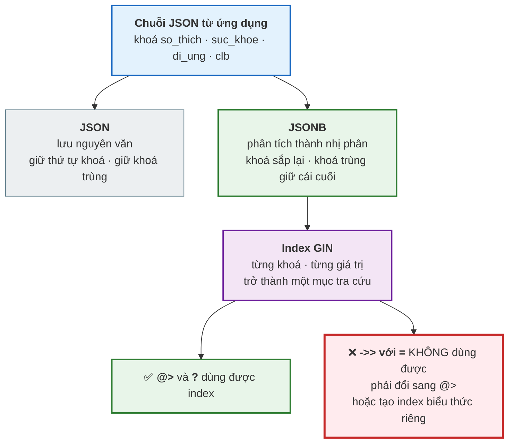
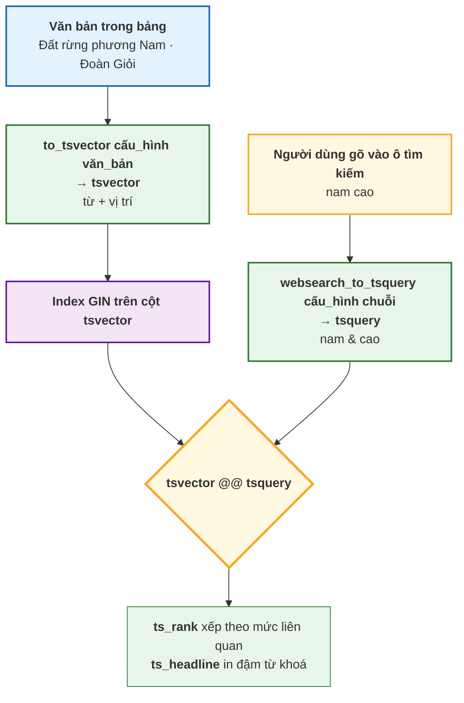

# Bài 32 — JSONB và Full-Text Search

!!! abstract "🎯 Học xong bài này, bạn sẽ"
    - Phân biệt `JSON` và `JSONB`, và dùng thành thạo các toán tử `->`, `->>`, `#>`, `#>>`, `@>`, `?`
    - Sửa **dữ liệu bán cấu trúc** bằng `jsonb_set`, và bung mảng ra dòng bằng `jsonb_array_elements`
    - Đánh index `GIN` cho JSONB và biết toán tử nào dùng được index, toán tử nào không
    - Nhận ra khi nào JSONB là lựa chọn đúng và khi nào nó là **dấu hiệu thiết kế sai**
    - Làm **full-text search** với `tsvector`, `tsquery`, `@@`, `ts_rank`, `ts_headline` — và biết rõ hạn chế với tiếng Việt

## 🧠 Câu chuyện mở đầu

Đầu năm học, cô y tế trường đưa bạn một tập phiếu khai báo sức khoẻ học sinh. Bạn định thêm vài cột vào bảng `hoc_sinh` là xong.

Nhưng đọc kỹ thì mỗi phiếu lại khai một kiểu. Bạn `HS001` ghi chiều cao, cân nặng, dị ứng tôm. Bạn `HS002` không có dị ứng nhưng ghi thêm *"đang niềng răng"*. Bạn `HS003` khai hai loại dị ứng. Và cô nói thêm: *"Sang năm Sở có thể đổi mẫu phiếu, thêm mấy mục nữa."*

Nếu làm mỗi mục một cột, bạn sẽ có một bảng ba mươi cột mà đa số ô để trống — và mỗi lần Sở đổi mẫu là một lần `ALTER TABLE`.

Rồi cô thủ thư sang, với một yêu cầu khác hẳn: *"Em làm cho cô cái ô tìm sách. Cô gõ 'nam cao' thì nó ra sách của Nam Cao, gõ 'dat rung' không dấu thì cũng ra được Đất rừng phương Nam."*

Bạn nghĩ tới `LIKE '%nam cao%'` của [Bài 24](24-select-where-order-by.md). Nhưng nó không xử lý được thứ tự từ, không xếp được kết quả nào liên quan hơn, và [Bài 24](24-select-where-order-by.md) đã cảnh báo rằng `LIKE '%...%'` không dùng được index.

Hai yêu cầu, hai vấn đề mà mọi thứ đã học tới giờ đều không giải nổi. PostgreSQL có hai công cụ riêng cho chúng.

## 📖 Khái niệm & thuật ngữ

### Dữ liệu bán cấu trúc

**Dữ liệu bán cấu trúc** (*semi-structured data*) là dữ liệu có cấu trúc, nhưng cấu trúc đó **không giống nhau giữa các bản ghi** và **không khai trước trong lược đồ**.

Phiếu sức khoẻ ở trên là ví dụ đúng: nó có cấu trúc — mỗi phiếu là một tập cặp *tên mục : giá trị* — nhưng tập các mục thì mỗi phiếu một khác.

Đây là chỗ mô hình quan hệ của [Bài 6](../cap-1-mo-hinh-er/06-mo-hinh-quan-he.md) gặp giới hạn: mô hình quan hệ đòi **mọi dòng cùng một tập cột**. Và JSON là cách PostgreSQL cho bạn nhét một hòn đảo phi quan hệ vào trong một bảng quan hệ.

### `JSON` so với `JSONB`

PostgreSQL có **hai** kiểu dữ liệu JSON, và chúng khác nhau rất sâu.

| | `JSON` | `JSONB` |
|---|---|---|
| Lưu thế nào | **Nguyên văn** chuỗi bạn nhập | **Đã phân tích** thành dạng nhị phân |
| Khi đọc | Phải phân tích lại mỗi lần | Đọc trực tiếp — **nhanh hơn** |
| Khi ghi | Chỉ kiểm cú pháp — **nhanh hơn** | Phải phân tích — chậm hơn một chút |
| Giữ khoảng trắng, thứ tự khoá | **Có** | **Không** — khoá được sắp lại |
| Khoá trùng nhau | **Giữ cả** | Giữ **cái cuối cùng** |
| Đánh index được không | Gần như không | **Được** — `GIN`, và đây là lý do chính |
| Toán tử phong phú | Ít | **Nhiều** — `@>`, `?`, jsonpath… |

**Quy tắc thực hành: dùng `JSONB`, trừ khi bạn có lý do cụ thể để cần giữ nguyên văn.** Lý do đó rất hẹp: lưu lại đúng chuỗi mà một hệ thống bên ngoài gửi tới, để ký số hoặc để đối chiếu byte-by-byte.

Chữ `B` là *binary*. Cái giá của nó — mất thứ tự khoá và mất khoá trùng — gần như luôn là cái giá bạn **muốn** trả, vì một tài liệu có hai khoá trùng tên là một tài liệu sai.

### Bảy toán tử phải thuộc

Đây là bảng tra cứu của cả nửa đầu bài:

| Toán tử | Đọc là | Trả về | Ví dụ |
|---|---|---|---|
| **`->`** | "lấy trường, giữ nguyên JSON" | **`jsonb`** | `du_lieu -> 'clb'` → `"Toán học"` (có ngoặc kép) |
| **`->>`** | "lấy trường, đổi thành chữ" | **`text`** | `du_lieu ->> 'clb'` → `Toán học` (không ngoặc kép) |
| **`#>`** | "đi theo đường dẫn, giữ JSON" | **`jsonb`** | `du_lieu #> '{suc_khoe,chieu_cao}'` |
| **`#>>`** | "đi theo đường dẫn, đổi thành chữ" | **`text`** | `du_lieu #>> '{suc_khoe,chieu_cao}'` |
| **`@>`** | "có chứa" | `boolean` | `du_lieu @> '{"clb": "Toán học"}'` |
| **`?`** | "có khoá này không" | `boolean` | `du_lieu ? 'di_ung'` |
| **`||`** | "gộp hai tài liệu" | `jsonb` | `du_lieu \|\| '{"lop": "8A1"}'` |

Cách nhớ bốn toán tử đầu — **một mũi tên là một tầng, hai mũi tên là ra chữ**:

- Số dấu `>`: **một** dấu (`->`) giữ JSONB, **hai** dấu (`->>`) cho ra `text`.
- Dấu `#`: có `#` thì tham số là một **đường dẫn nhiều tầng**, không có `#` thì chỉ một tầng.

!!! danger "`->` và `->>` khác nhau ở chỗ có ngoặc kép — và điều đó phá mọi phép so sánh"
    `du_lieu -> 'clb'` trả về giá trị **JSONB** `"Toán học"` — bao gồm cả cặp ngoặc kép, vì trong JSON một chuỗi được viết trong ngoặc kép.

    `du_lieu ->> 'clb'` trả về **text** `Toán học` — không ngoặc kép.

    Hệ quả: `WHERE du_lieu -> 'clb' = 'Toán học'` **không so được**, vì bên trái là `jsonb` mà bên phải là chuỗi. Phải viết một trong hai:

    - `WHERE du_lieu ->> 'clb' = 'Toán học'` — so `text` với `text`. Đây là cách bạn sẽ dùng 90% thời gian.
    - `WHERE du_lieu -> 'clb' = '"Toán học"'::jsonb` — so `jsonb` với `jsonb`, chú ý ngoặc kép lồng.

    Còn số thì cũng vậy: `du_lieu ->> 'chieu_cao'` cho `text`, nên `du_lieu ->> 'chieu_cao' > 150` sẽ so **chuỗi** chứ không so số — và `'9' > '150'` là `TRUE` theo thứ tự chuỗi. Phải ép kiểu: `(du_lieu ->> 'chieu_cao')::INTEGER > 150`.

### Ba hàm hay dùng

- **`jsonb_set(tai_lieu, duong_dan, gia_tri_moi, tao_neu_thieu)`** — sửa một giá trị ở sâu trong tài liệu, trả về **tài liệu mới**. Nó **không** sửa tại chỗ, nên phải dùng trong `UPDATE ... SET cot = jsonb_set(cot, ...)`. Tham số cuối là `boolean`: `true` thì tạo khoá nếu chưa có.
- **`jsonb_array_elements(mang)`** — bung một mảng JSON thành **nhiều dòng**, mỗi phần tử một dòng. Đây là một **hàm trả bảng**, nên nó đứng trong `FROM`. Bản `jsonb_array_elements_text` cho ra `text` thay vì `jsonb`.
- **`jsonb_array_length`**, **`jsonb_object_keys`**, **`jsonb_pretty`** — đếm phần tử mảng, liệt kê khoá, và in ra cho người đọc.

### `LATERAL` — cho bảng bên phải đọc được dòng bên trái

Hàm `jsonb_array_elements` đứng trong `FROM`, nhưng nó cần **một mảng cụ thể** làm tham số. Và mảng đó lại nằm trong cột `du_lieu` của **từng dòng** bảng hồ sơ. Đây là chỗ mọi thứ bạn học ở [Bài 25](25-join.md) về `FROM` đều không giúp được.

Quy tắc nền đó là: **các phần tử trong `FROM` không được nhắc tới cột của nhau.** Viết `FROM a, b` thì `b` được tính độc lập hoàn toàn với `a`; nếu bên trong `b` có một cột của `a` thì PostgreSQL báo lỗi đại ý *"tham chiếu không hợp lệ tới phần tử `FROM` của bảng `a`"*.

**Kết nối ngang** (*lateral join*) là cách hợp pháp để phá đúng quy tắc đó. Từ khoá `LATERAL` nói với PostgreSQL: *"với **mỗi** dòng của phần tử bên trái, hãy tính lại phần tử bên phải một lần, và cho phép nó đọc các cột của dòng bên trái đó."*

```
SELECT ...
FROM   bang_trai t
CROSS JOIN LATERAL ham_tra_bang(t.mot_cot) AS b(cot_ra)
```

Bốn điều cần nhớ:

- Nó là **cơ chế duy nhất** để phần bên phải nhận tham số lấy từ bảng đang quét. Nhờ nó mà một mảng JSONB trở lại được **mô hình quan hệ** của [Bài 6](../cap-1-mo-hinh-er/06-mo-hinh-quan-he.md), và `GROUP BY` của [Bài 26](26-group-by-having.md) dùng được.
- Với một **truy vấn con** ở bên phải, `LATERAL` là **bắt buộc** — thiếu nó là lỗi.
- Với một **lời gọi hàm** ở bên phải — đúng trường hợp của `jsonb_array_elements` — PostgreSQL coi `LATERAL` là **từ dư**: biểu thức hàm trong `FROM` vốn đã được phép tham chiếu các phần tử `FROM` đứng trước nó. Nghĩa là `FROM b32_ho_so h, jsonb_array_elements(h.du_lieu -> 'so_thich')` cũng chạy. Bài này vẫn **luôn viết `LATERAL` ra**, vì viết ra thì người đọc thấy ngay là có tham chiếu chéo, và vì bạn khỏi phải nhớ trường hợp nào cần trường hợp nào không.
- Về ngữ nghĩa nó giống một **truy vấn con tương quan** của [Bài 27](27-subquery-va-exists.md) — chạy lại một lần cho mỗi dòng ngoài — chỉ khác là nó trả về **nhiều dòng** thay vì một giá trị.

Và có một hệ quả dễ vấp: `CROSS JOIN LATERAL` với một hàm trả về **0 dòng** thì dòng bên trái **biến mất**. Muốn giữ dòng bên trái thì dùng `LEFT JOIN LATERAL ... ON TRUE`.

### Index `GIN`

**`GIN`** (*Generalized Inverted Index* — chỉ mục đảo tổng quát) là loại index dành cho những cột mà **một giá trị chứa nhiều phần tử**: một tài liệu JSONB có nhiều khoá, một `tsvector` có nhiều từ, một mảng có nhiều phần tử.

Nó hoạt động ngược với index thường: thay vì *"dòng này có giá trị gì"*, nó lưu *"phần tử này nằm ở những dòng nào"* — đúng như mục lục tra cứu ở cuối một quyển sách. Vì thế mới gọi là **đảo**.

Đây là phần dễ sai nhất: **`GIN` chỉ giúp được một số toán tử.**

| Toán tử | `GIN` mặc định (`jsonb_ops`) | `GIN` với `jsonb_path_ops` |
|---|---|---|
| `@>` có chứa | **Dùng được** | **Dùng được** — và index nhỏ hơn |
| `?` `?|` `?&` có khoá | **Dùng được** | **Không** |
| `@?` `@@` jsonpath | **Dùng được** | **Dùng được** |
| **`->>` với `=`** | **KHÔNG dùng được** | **KHÔNG** |

Dòng cuối là cái bẫy. Câu truy vấn tự nhiên nhất — `WHERE du_lieu ->> 'clb' = 'Toán học'` — **không** dùng được index `GIN` nào cả. Hai cách sửa:

1. Viết lại bằng `@>`: `WHERE du_lieu @> '{"clb": "Toán học"}'` — dùng được `GIN`.
2. Hoặc tạo một **index biểu thức** B-tree riêng: `CREATE INDEX ... ON t ((du_lieu ->> 'clb'))`.

Cách 1 gọn hơn khi bạn lọc theo nhiều khoá khác nhau; cách 2 nhanh hơn cho đúng một khoá, và nó còn phục vụ được cả `ORDER BY` lẫn phép so sánh khoảng.

Cấp 4 sẽ dạy đầy đủ về index, kể cả `B-tree`, `GIN`, `GiST`, `BRIN` và cách đọc `EXPLAIN` để biết index có được dùng hay không. Ở đây chỉ cần nhớ: **`GIN` là index của "phần tử bên trong một giá trị".**

### Khi nào JSONB là dấu hiệu thiết kế sai

Đây là phần quan trọng nhất của nửa đầu bài, và nó nối thẳng về Cấp 2.

JSONB rất tiện, và chính sự tiện lợi đó khiến người ta dùng nó để **né** việc thiết kế lược đồ. Khi đó bạn mất hết những gì Cấp 1 và Cấp 2 xây lên:

| Bạn mất gì khi nhét dữ liệu vào JSONB | Vì sao |
|---|---|
| **Khoá ngoại** | Không có cách nào khai `du_lieu->>'ma_lop'` phải tồn tại trong bảng `lop`. [Bài 15](../cap-1-mo-hinh-er/15-rang-buoc-toan-ven.md) mất trắng. |
| **Kiểu dữ liệu** | Hôm nay `"chieu_cao": 152`, mai có người ghi `"chieu_cao": "152cm"`. Không gì chặn được. |
| **`NOT NULL`, `CHECK`** | Cưỡng chế được nhưng rất vụng, qua một `CHECK` trên biểu thức JSON. |
| **Tên cột trong lược đồ** | `\d bang` không cho bạn biết bên trong JSONB có những khoá gì. Tài liệu duy nhất là mã nguồn ứng dụng. |
| **Dạng chuẩn** | Một mảng bên trong JSONB là vi phạm tinh thần **1NF** của [Bài 17](../cap-2-chuan-hoa/17-dang-chuan-1nf-2nf.md): nhiều giá trị trong một ô. |

Ba câu hỏi để quyết định:

1. **Tập khoá có biết trước và ổn định không?** Có → **dùng cột thật**. JSONB là để cho thứ bạn *không* biết trước.
2. **Bạn có cần `JOIN`, khoá ngoại, hoặc ràng buộc trên giá trị đó không?** Có → **dùng cột thật**, hoặc một bảng riêng.
3. **Bạn có thường xuyên lọc, sắp xếp, gom nhóm theo giá trị đó không?** Có → **dùng cột thật**. Mỗi lần lọc qua JSONB là một lần ép kiểu và một lần bỏ mất thống kê của bộ tối ưu.

Ba câu "không" thì JSONB là lựa chọn đúng. Một câu "có" thì nên nghĩ lại.

!!! warning "Dấu hiệu rõ nhất của thiết kế sai: một cột JSONB tên là `data` hoặc `meta`"
    Nếu bảng của bạn có một cột `jsonb` tên `data`, `meta`, `extra` hay `attributes`, và **hầu hết** thông tin nghiệp vụ nằm trong đó, thì bạn đã không thiết kế lược đồ — bạn đã hoãn nó.

    Cái giá đến sau sáu tháng, dưới ba dạng: dữ liệu bẩn không ai chặn được; truy vấn báo cáo chậm và không index nổi; và không ai trong đội biết chắc bên trong cột đó có những khoá gì.

    Cách dùng đúng: **phần lõi ổn định thành cột thật, phần đuôi thay đổi thành một cột JSONB**. Bảng `hoc_sinh` giữ nguyên `ma_hs`, `ho_ten`, `ngay_sinh`, `ma_lop` — và nếu cần, thêm **một** cột `ho_so_suc_khoe JSONB` cho phần mà Sở có thể đổi mẫu mỗi năm.

### Full-text search

**Tìm kiếm toàn văn** (*full-text search*) là tìm kiếm theo **từ** trong một đoạn văn bản, thay vì tìm theo chuỗi con.

Khác biệt với `LIKE '%...%'` của [Bài 24](24-select-where-order-by.md) là căn bản:

| | `LIKE '%tu khoa%'` | Full-text search |
|---|---|---|
| Đơn vị so khớp | **Chuỗi ký tự** | **Từ** |
| Thứ tự từ trong câu hỏi | Phải đúng y nguyên | Không quan trọng, trừ khi bạn đòi cụm |
| Kết hợp `AND` / `OR` / `NOT` | Phải tự viết nhiều điều kiện | Có cú pháp riêng: `&`, `|`, `!` |
| Xếp theo mức liên quan | **Không có** | **Có** — `ts_rank` |
| Dùng index được không | Không, nếu mẫu bắt đầu bằng `%` | **Có** — `GIN` |

Nó hoạt động bằng cách biến cả văn bản và câu hỏi thành hai kiểu dữ liệu riêng:

- **`tsvector`** là văn bản đã được **xử lý sẵn**: tách thành từ, đưa về dạng gốc, kèm vị trí. Nó chính là thứ được đánh index `GIN`.
- **`tsquery`** là câu hỏi đã được xử lý, với các phép `&` (và), `|` (hoặc), `!` (không), `<->` (liền kề).
- **`@@`** là toán tử so khớp: `tsvector @@ tsquery` trả về `boolean`.

Bốn hàm dựng `tsquery`, khác nhau ở **mức tin cậy vào chuỗi người dùng gõ**:

| Hàm | Nhận vào | Dùng khi |
|---|---|---|
| **`to_tsquery`** | Chuỗi **đúng cú pháp** `tsquery`: `'nam & cao'` | Bạn tự dựng câu hỏi trong mã |
| **`plainto_tsquery`** | Chuỗi tự do; mọi từ nối bằng `&` | Ô tìm kiếm đơn giản |
| **`phraseto_tsquery`** | Chuỗi tự do; mọi từ nối bằng `<->` (liền kề) | Tìm đúng một cụm từ |
| **`websearch_to_tsquery`** | Chuỗi kiểu Google: `"cụm từ" -loại_trừ or hoặc` | **Ô tìm kiếm cho người dùng cuối** |

**`to_tsquery` báo lỗi nếu chuỗi sai cú pháp** — nên tuyệt đối đừng đưa trực tiếp chuỗi người dùng gõ vào nó. Người dùng gõ `nam cao` (có dấu cách, không có `&`) là lỗi ngay. Với ô tìm kiếm, hãy dùng `websearch_to_tsquery`: nó không bao giờ báo lỗi cú pháp và nó hiểu cả dấu ngoặc kép lẫn dấu trừ.

Hai hàm trình bày kết quả:

- **`ts_rank(tsvector, tsquery)`** trả về một số thực: càng lớn càng liên quan. Dùng trong `ORDER BY`.
- **`ts_headline(cấu_hình, văn_bản, tsquery)`** trả về đoạn văn bản có từ khoá được bọc thẻ `<b>` — chính là đoạn trích in đậm bạn thấy trên trang kết quả tìm kiếm.

### Cấu hình tìm kiếm, và vấn đề của tiếng Việt

**Cấu hình tìm kiếm** (*text search configuration*) quyết định văn bản được tách và chuẩn hoá thế nào: từ nào là **từ dừng** (*stop word*) bị bỏ, và từ nào được đưa về **dạng gốc** (*stemming*) — `running` → `run`.

PostgreSQL 16 có sẵn khoảng hai mươi cấu hình: `english`, `french`, `german`, `russian`… và **`simple`**.

**PostgreSQL không có cấu hình tiếng Việt.** Không có từ điển, không có danh sách từ dừng tiếng Việt nào được cài sẵn.

Hệ quả và cách sống với nó:

| Vấn đề | Mức nghiêm trọng với tiếng Việt |
|---|---|
| Không có **stemming** | **Nhẹ.** Tiếng Việt không biến đổi hình thái từ — không có `run`/`running`/`ran`. Nên thiếu stemming gần như không mất gì. |
| Không có danh sách **từ dừng** | **Nhẹ.** Những từ như *của*, *và*, *là* sẽ được đánh index; index lớn hơn một chút, nhưng kết quả không sai. |
| **Dấu thanh và dấu phụ** | **Nặng.** Người gõ `dat rung` sẽ **không** tìm ra `Đất rừng`. Đây là vấn đề thật và phải giải. |
| Tách từ ghép | **Nặng về lý thuyết.** Bộ tách của PostgreSQL cắt theo khoảng trắng, nên *"học sinh"* thành hai từ `học` và `sinh`. Trong thực tế, cách này vẫn cho kết quả dùng được — chỉ là không hiểu được ngữ nghĩa cụm từ. |

Cấu hình **`simple`** làm đúng một việc: đổi về chữ thường, không bỏ từ nào, không đưa về dạng gốc. Với tiếng Việt, đó là lựa chọn **đúng** — vì hai việc mà cấu hình `english` làm thêm đều sai với tiếng Việt.

Còn vấn đề dấu thì giải bằng extension **`unaccent`**: nó bỏ dấu, biến `Đất rừng` thành `Dat rung`. Ghép `unaccent` với `simple` thành một cấu hình riêng, và ô tìm kiếm chịu được cả gõ có dấu lẫn không dấu.

!!! info "`unaccent` cần một lần `CREATE EXTENSION` — nhưng **không** cần superuser"
    `unaccent` thuộc nhóm **`contrib`**: nó đi kèm bản PostgreSQL cài đầy đủ nhưng **chưa được bật sẵn** trong từng database. Phải chạy `CREATE EXTENSION unaccent;` một lần cho mỗi database.

    Người ta hay tưởng việc này cần superuser, và điều đó **đúng với PostgreSQL 12 trở về trước**. Từ **PostgreSQL 13**, `unaccent` được đánh dấu là **extension đáng tin** (*trusted extension*), nghĩa là một vai trò thường cũng cài được — chỉ cần nó có quyền `CREATE` trên database đó. Đây là thay đổi đáng biết, vì nó là khác biệt giữa "làm được ngay" và "phải đi xin quyền admin".

    Khóa học **chạy thật** phần này, nên mọi con số dưới đây đã được kiểm trên PostgreSQL 16.

### Bảng thuật ngữ

| Tiếng Việt | English | Nghĩa dễ hiểu |
|---|---|---|
| Dữ liệu bán cấu trúc | *semi-structured data* | Dữ liệu có cấu trúc nhưng cấu trúc khác nhau giữa các bản ghi và không khai trước trong lược đồ |
| Chỉ mục đảo tổng quát | *GIN* | Loại index cho cột mà một giá trị chứa nhiều phần tử — JSONB, `tsvector`, mảng; nó lưu "phần tử này ở những dòng nào" |
| Tìm kiếm toàn văn | *full-text search* | Tìm theo **từ** trong văn bản thay vì theo chuỗi con, có xếp mức liên quan và dùng được index |
| Vectơ văn bản | *tsvector* | Văn bản đã tách thành từ, chuẩn hoá và kèm vị trí; đây là thứ được đánh index `GIN` |
| Câu hỏi tìm kiếm | *tsquery* | Câu hỏi đã chuẩn hoá, ghép bằng `&` và, `\|` hoặc, `!` không, `<->` liền kề |
| Cấu hình tìm kiếm | *text search configuration* | Bộ quy tắc tách từ, bỏ từ dừng và đưa về dạng gốc; PostgreSQL **không có** cấu hình tiếng Việt |
| Từ dừng | *stop word* | Từ quá phổ biến nên bị bỏ khỏi index, ví dụ *the* trong tiếng Anh |
| Đưa về dạng gốc | *stemming* | Quy các biến thể của một từ về một dạng, ví dụ *running* → *run*; tiếng Việt gần như không cần |
| Bỏ dấu | *unaccent* | Extension biến `Đất rừng` thành `Dat rung`, để người gõ không dấu vẫn tìm ra |
| Kết nối ngang | *lateral join* | Phép ghép cho bảng bên phải **đọc được cột của dòng bên trái** đang xét; cơ chế duy nhất để một hàm trả bảng nhận tham số từ bảng đang quét |
| Từ tố | *lexeme* | Một từ đã được chuẩn hoá trong `tsvector` — đơn vị mà full-text search thật sự so khớp |
| Cột sinh sẵn | *generated column* | Cột có giá trị tính từ các cột khác bằng một biểu thức `IMMUTABLE`, tự cập nhật mà không cần trigger |

## 🖼️ Sơ đồ

Đường đi của một truy vấn JSONB, và chỗ mà index `GIN` giúp được:



Hai đường song song của full-text search — văn bản và câu hỏi phải gặp nhau ở cùng một cấu hình:



## 💻 Thực hành

### `JSON` so với `JSONB` — xem tận mắt

```sql
-- KỲ VỌNG: kieu_json = {"b": 1, "a": 2, "a": 3}
-- KỲ VỌNG: kieu_jsonb = {"a": 3, "b": 1}
SELECT '{"b": 1, "a": 2, "a": 3}'::json::text  AS kieu_json,
       '{"b": 1, "a": 2, "a": 3}'::jsonb::text AS kieu_jsonb;
```

Cùng một chuỗi vào, hai kết quả ra:

- `json` trả lại **đúng nguyên văn**: thứ tự `b` trước `a`, và **cả hai** khoá `a` trùng nhau vẫn còn.
- `jsonb` **sắp lại** khoá theo thứ tự chuẩn và **giữ giá trị cuối cùng** của khoá trùng — `"a": 3`, còn `"a": 2` biến mất.

Hai hành vi đó nói lên tất cả: `json` là một **chuỗi có kiểm cú pháp**, `jsonb` là một **cấu trúc dữ liệu thật**.

### Bảng hồ sơ sức khoẻ

Đây là câu trả lời cho cô y tế. Chú ý thiết kế: **`ma_hs` là cột thật với khoá ngoại**, chỉ phần "mẫu phiếu có thể đổi" mới vào JSONB.

```sql
DROP TABLE IF EXISTS b32_ho_so CASCADE;

CREATE TABLE b32_ho_so (
    ma_hs   CHAR(5) PRIMARY KEY REFERENCES hoc_sinh(ma_hs) ON DELETE CASCADE,
    du_lieu JSONB   NOT NULL DEFAULT '{}'::jsonb
);

INSERT INTO b32_ho_so (ma_hs, du_lieu) VALUES
('HS001', '{"so_thich": ["bong ro", "doc sach"],
            "suc_khoe": {"chieu_cao": 152, "can_nang": 42},
            "di_ung": ["tom"],
            "clb": "Toan hoc"}'),
('HS002', '{"so_thich": ["ve"],
            "suc_khoe": {"chieu_cao": 148, "can_nang": 39},
            "ghi_chu": "dang nieng rang",
            "clb": "My thuat"}'),
('HS003', '{"so_thich": ["bong ro", "cau long"],
            "suc_khoe": {"chieu_cao": 155, "can_nang": 45},
            "di_ung": ["hai san", "dau phong"]}'),
('HS004', '{"so_thich": [],
            "suc_khoe": {"chieu_cao": 145, "can_nang": 38},
            "clb": "Toan hoc"}'),
-- Phiếu của HS005 có MỘT ô nhập sai: phụ huynh ghi số vào lẫn ô, nên chiều cao
-- thành 98 trong khi cân nặng là 30. Dữ liệu bẩn kiểu này là chuyện bình thường,
-- và phần sau sẽ cho thấy nó phá báo cáo thế nào.
('HS005', '{"so_thich": [],
            "suc_khoe": {"chieu_cao": 98, "can_nang": 30},
            "ghi_chu": "phu huynh ghi nham o, chieu cao khong the la 98"}');

-- KỲ VỌNG: so_ho_so = 5
-- KỲ VỌNG: so_khoa_khac_nhau = 5
SELECT count(*)                                            AS so_ho_so,
       (SELECT count(DISTINCT k)
        FROM b32_ho_so, jsonb_object_keys(du_lieu) AS k)    AS so_khoa_khac_nhau
FROM b32_ho_so;
```

Năm hồ sơ dùng **năm** khoá khác nhau: `so_thich`, `suc_khoe`, `di_ung`, `clb`, `ghi_chu`. Không hồ sơ nào có đủ cả năm — `HS002` có `ghi_chu` mà không có `di_ung`, `HS003` có `di_ung` mà không có `clb`, `HS005` không có cả `di_ung` lẫn `clb`.

Hãy để ý chính câu truy vấn này: để biết bên trong cột JSONB có những khoá gì, ta phải **đi đếm** bằng `jsonb_object_keys`. Với cột thật thì chỉ cần `\d b32_ho_so`. Đó là cái giá đầu tiên của JSONB, và bạn trả nó ngay từ dòng đầu.

### `->` và `->>`, `#>` và `#>>`

```sql
-- KỲ VỌNG: 5 dòng
-- KỲ VỌNG: ma_hs = HS001
-- KỲ VỌNG: clb_jsonb = "Toan hoc"
-- KỲ VỌNG: clb_text = Toan hoc
-- KỲ VỌNG: chieu_cao_jsonb = 152
-- KỲ VỌNG: chieu_cao_text = 152
SELECT ma_hs,
       du_lieu -> 'clb'                    AS clb_jsonb,
       du_lieu ->> 'clb'                   AS clb_text,
       du_lieu #> '{suc_khoe,chieu_cao}'   AS chieu_cao_jsonb,
       du_lieu #>> '{suc_khoe,chieu_cao}'  AS chieu_cao_text
FROM b32_ho_so
ORDER BY ma_hs;
```

Đọc kỹ hai cột đầu: `clb_jsonb` là `"Toan hoc"` **có ngoặc kép**, còn `clb_text` là `Toan hoc` **không ngoặc kép**. Đây là toàn bộ khác biệt giữa `->` và `->>`, và nó là nguồn của mọi phép so sánh thất bại.

Hai cột sau cho thấy `#>` đi được **nhiều tầng**: `'{suc_khoe,chieu_cao}'` là một mảng text hai phần tử, nghĩa là *"vào trong `suc_khoe`, rồi lấy `chieu_cao`"*. Với `->` bạn phải viết `du_lieu -> 'suc_khoe' -> 'chieu_cao'` — nối chuỗi mũi tên.

Và hãy để ý một điều dễ gây ngộ nhận: hai cột sau in ra **giống nhau** — cùng là `152`. Không phải vì `#>` và `#>>` giống nhau, mà vì trong JSON một **số** không có dấu ngoặc kép, nên bản `jsonb` và bản `text` của nó trông y như nhau trên màn hình. Khác biệt vẫn còn nguyên nhưng nó nằm ở **kiểu dữ liệu**, không nằm ở chỗ nhìn thấy được — và đó chính là lý do mục ngay dưới đây tồn tại.

Khoá **không tồn tại** thì cho `NULL`, không báo lỗi:

```sql
-- KỲ VỌNG: 5 dòng
-- KỲ VỌNG: ma_hs = HS001
-- KỲ VỌNG: khoa_khong_co = NULL
-- KỲ VỌNG: duong_dan_sai = NULL
SELECT ma_hs,
       du_lieu ->> 'so_dien_thoai'            AS khoa_khong_co,
       du_lieu #>> '{suc_khoe,nhom_mau}'      AS duong_dan_sai
FROM b32_ho_so
ORDER BY ma_hs;
```

Cả hai cột đều `NULL`. Đây là hành vi tiện nhưng nguy hiểm: **gõ sai tên khoá không gây lỗi gì** — bạn chỉ nhận một cột toàn `NULL` và tưởng dữ liệu bị thiếu. Một cột thật viết sai tên thì PostgreSQL báo lỗi ngay; một khoá JSONB viết sai tên thì im lặng. Đó là một trong những cái giá của JSONB.

### So sánh cho đúng — và bẫy so chuỗi

Chiều cao trong năm hồ sơ là 152, 148, 155, 145 và **98**. Con số cuối là ô nhập sai của `HS005` — 98 cm là chiều cao của một em bé ba tuổi, rõ ràng có người ghi nhầm ô. Vậy số bạn cao hơn **149** cm là **2**: `HS001` và `HS003`.

Đếm bằng hai cách — một cách để nguyên `text`, một cách ép về số:

```sql
-- KỲ VỌNG: so_chuoi = 3
-- KỲ VỌNG: ep_kieu_dung = 2
SELECT count(*) FILTER (WHERE du_lieu #>> '{suc_khoe,chieu_cao}' > '149')            AS so_chuoi,
       count(*) FILTER (WHERE (du_lieu #>> '{suc_khoe,chieu_cao}')::INTEGER > 149)   AS ep_kieu_dung
FROM b32_ho_so;
```

Cột thứ hai cho **2** — đúng. Cột thứ nhất cho **3** — sai, và nó đếm thêm đúng bạn `HS005` cao 98 cm.

Vì `#>>` trả về `text`, phép `>` ở cột đầu là phép so **chuỗi**: nó so từng ký tự từ trái sang và **dừng ngay** khi hai ký tự khác nhau. Với `'98'` và `'149'`, ký tự đầu là `'9'` và `'1'`; `'9' > '1'` nên nó kết luận `TRUE` mà không cần xem tiếp. Chuỗi `'98'` "lớn hơn" chuỗi `'149'` chỉ vì nó **bắt đầu** bằng một chữ số lớn hơn.

```sql
-- KỲ VỌNG: so_sanh_chuoi_sai = true
-- KỲ VỌNG: so_sanh_so_dung = false
SELECT ('98' > '149') AS so_sanh_chuoi_sai,
       (98 > 149)     AS so_sanh_so_dung;
```

Và đây là phần đáng sợ nhất: **bốn hồ sơ đầu không làm lộ được lỗi này.** Chiều cao của họ đều có **ba** chữ số, mà với các số cùng số chữ số thì thứ tự chuỗi trùng khít thứ tự số — cả hai cách đều tính đúng cho cả bốn. Bỏ `HS005` ra là hai con số bằng nhau ngay:

```sql
-- KỲ VỌNG: so_chuoi = 2
-- KỲ VỌNG: ep_kieu_dung = 2
SELECT count(*) FILTER (WHERE du_lieu #>> '{suc_khoe,chieu_cao}' > '149')            AS so_chuoi,
       count(*) FILTER (WHERE (du_lieu #>> '{suc_khoe,chieu_cao}')::INTEGER > 149)   AS ep_kieu_dung
FROM b32_ho_so
WHERE ma_hs <> 'HS005';
```

Hai con số **bằng nhau**, và đó chính là định nghĩa của một cái bẫy tồi tệ: nó im lặng suốt thời gian dữ liệu còn "đẹp". Bạn viết câu lệnh, thử trên dữ liệu thật, thấy đúng, đưa vào sản phẩm. Rồi **một** ô nhập sai hai chữ số xuất hiện, và báo cáo lệch mà không ai hiểu vì sao.

**Quy tắc: mọi giá trị số lấy ra từ JSONB đều phải ép kiểu trước khi so sánh.** Một cột `INTEGER` thật thì không bao giờ có lỗi này — nó còn **từ chối** nhận giá trị `"152cm"` ngay từ đầu. Đây là điều bạn trả giá khi chọn JSONB.

### `@>` — toán tử "có chứa"

```sql
-- KỲ VỌNG: 2 dòng
-- KỲ VỌNG: ma_hs = HS001
SELECT ma_hs, du_lieu ->> 'clb' AS clb
FROM b32_ho_so
WHERE du_lieu @> '{"clb": "Toan hoc"}'
ORDER BY ma_hs;
```

Hai bạn ở câu lạc bộ Toán học: `HS001` và `HS004`.

`@>` mạnh hơn nó trông: nó kiểm **chứa cả cấu trúc lồng nhau**, kể cả phần tử trong mảng:

```sql
-- KỲ VỌNG: 2 dòng
-- KỲ VỌNG: ma_hs = HS001
SELECT ma_hs, du_lieu -> 'so_thich' AS so_thich
FROM b32_ho_so
WHERE du_lieu @> '{"so_thich": ["bong ro"]}'
ORDER BY ma_hs;
```

Hai bạn thích bóng rổ: `HS001` và `HS003`. Chú ý câu hỏi là `["bong ro"]` — một mảng một phần tử — và nó khớp với cả mảng hai phần tử của hồ sơ. Đó là ngữ nghĩa "chứa": **tập con** khớp với **tập lớn hơn**.

Và nó đi sâu được nhiều tầng:

```sql
-- KỲ VỌNG: 1 dòng
-- KỲ VỌNG: ma_hs = HS003
SELECT ma_hs
FROM b32_ho_so
WHERE du_lieu @> '{"suc_khoe": {"chieu_cao": 155}}'
ORDER BY ma_hs;
```

### `?` — toán tử "có khoá này không"

```sql
-- KỲ VỌNG: 2 dòng
-- KỲ VỌNG: ma_hs = HS001
SELECT ma_hs, du_lieu -> 'di_ung' AS di_ung
FROM b32_ho_so
WHERE du_lieu ? 'di_ung'
ORDER BY ma_hs;
```

Hai bạn **có khai** mục dị ứng: `HS001` và `HS003`.

Để ý điều này quan trọng về mặt nghiệp vụ: `? 'di_ung'` hỏi *"có khai mục này không"*, **khác** với *"có bị dị ứng không"*. Bạn `HS002` không có khoá `di_ung` — nghĩa là phiếu không khai, chứ không phải chắc chắn không dị ứng. Trong JSONB, **thiếu khoá** và **khoá có giá trị rỗng** là hai chuyện khác nhau, và bạn phải quyết định nghiệp vụ hiểu chúng thế nào.

Đây chính là bài toán `NULL` của [Bài 24](24-select-where-order-by.md) quay lại dưới một hình thức mới — nhưng lần này **không có ràng buộc `NOT NULL` nào để giúp bạn**.

### `jsonb_array_length` và `jsonb_array_elements_text`

```sql
-- KỲ VỌNG: 5 dòng
-- KỲ VỌNG: ma_hs = HS001
-- KỲ VỌNG: so_so_thich = 2
SELECT ma_hs,
       jsonb_array_length(du_lieu -> 'so_thich') AS so_so_thich
FROM b32_ho_so
ORDER BY ma_hs;
```

Năm hồ sơ: `HS001` 2 sở thích, `HS002` 1, `HS003` 2, còn `HS004` và `HS005` có mảng rỗng nên 0.

Bung mảng ra thành dòng — đây là cách bạn đưa dữ liệu JSONB trở lại mô hình quan hệ để `GROUP BY`:

```sql
-- KỲ VỌNG: 5 dòng
SELECT h.ma_hs, st.so_thich
FROM b32_ho_so h
CROSS JOIN LATERAL jsonb_array_elements_text(h.du_lieu -> 'so_thich') AS st(so_thich)
ORDER BY h.ma_hs, st.so_thich;
```

**Năm dòng**: `2 + 1 + 2 + 0 + 0`.

Hãy để ý chữ `LATERAL` — nó là thứ làm câu lệnh này chạy được. Hàm `jsonb_array_elements_text` cần một mảng cụ thể, và mảng đó là `h.du_lieu -> 'so_thich'` của **từng** dòng hồ sơ. Không có `LATERAL` thì bên phải của `FROM` không được nhắc tới `h`, và câu lệnh là lỗi cú pháp. Đây **không** phải tích Descartes của [Bài 21](21-dai-so-quan-he.md): tích Descartes ghép mọi dòng với mọi dòng, còn ở đây mỗi dòng bên trái sinh ra **tập dòng riêng của nó**.

Và hai bạn `HS004` với `HS005` **biến mất hoàn toàn** khỏi kết quả, vì mảng `so_thich` của họ rỗng nên hàm trả về 0 dòng — mà `CROSS JOIN` thì cần bên phải có ít nhất một dòng. Muốn giữ họ lại thì đổi thành `LEFT JOIN LATERAL ... ON TRUE`, và họ sẽ hiện ra với cột sở thích là `NULL`.

Kiểm chứng ngay lời hứa "muốn giữ họ lại thì dùng `LEFT JOIN LATERAL ... ON TRUE`":

```sql
-- KỲ VỌNG: 7 dòng
-- KỲ VỌNG: ma_hs = HS001
SELECT h.ma_hs, st.so_thich
FROM b32_ho_so h
LEFT JOIN LATERAL jsonb_array_elements_text(h.du_lieu -> 'so_thich') AS st(so_thich) ON TRUE
ORDER BY h.ma_hs, st.so_thich NULLS FIRST;
```

**Bảy dòng** thay vì năm: `2 + 1 + 2 + 1 + 1`. Hai bạn có mảng rỗng nay hiện ra, mỗi bạn **một** dòng với cột sở thích là `NULL` — đúng ngữ nghĩa `LEFT JOIN` của [Bài 25](25-join.md). Mệnh đề `ON TRUE` chỉ là hình thức: `LEFT JOIN` bắt buộc phải có `ON`, mà ở đây không có điều kiện ghép nào để viết.

Bây giờ đếm sở thích phổ biến — một phép `GROUP BY` bình thường trên dữ liệu vừa bung ra:

```sql
-- KỲ VỌNG: 4 dòng
-- KỲ VỌNG: so_nguoi_thich = 2
SELECT st.so_thich, count(*) AS so_nguoi_thich
FROM b32_ho_so h
CROSS JOIN LATERAL jsonb_array_elements_text(h.du_lieu -> 'so_thich') AS st(so_thich)
GROUP BY st.so_thich
ORDER BY so_nguoi_thich DESC, st.so_thich;
```

Bốn sở thích khác nhau, và `bong ro` dẫn đầu với **2** người. Hãy so sánh công sức: nếu `so_thich` là một bảng riêng `so_thich(ma_hs, ten_so_thich)` thì câu này là một `GROUP BY` ba dòng, không cần `LATERAL`, không cần bung mảng, và còn đánh index được. Đó là cái giá của việc nhét một mảng vào JSONB.

### `jsonb_set` — sửa một giá trị ở sâu

```sql
UPDATE b32_ho_so
SET du_lieu = jsonb_set(du_lieu, '{suc_khoe,can_nang}', '43'::jsonb, true)
WHERE ma_hs = 'HS001';

-- KỲ VỌNG: can_nang = 43
SELECT du_lieu #>> '{suc_khoe,can_nang}' AS can_nang
FROM b32_ho_so
WHERE ma_hs = 'HS001';
```

Cân nặng đổi từ 42 thành 43, và các khoá khác **không bị ảnh hưởng**:

```sql
-- KỲ VỌNG: chieu_cao = 152
-- KỲ VỌNG: clb = Toan hoc
-- KỲ VỌNG: so_so_thich = 2
SELECT du_lieu #>> '{suc_khoe,chieu_cao}'            AS chieu_cao,
       du_lieu ->> 'clb'                             AS clb,
       jsonb_array_length(du_lieu -> 'so_thich')     AS so_so_thich
FROM b32_ho_so
WHERE ma_hs = 'HS001';
```

Tham số thứ tư `true` nghĩa là **tạo khoá nếu chưa có**. Thêm câu lạc bộ cho `HS003`, bạn chưa có khoá `clb`:

```sql
UPDATE b32_ho_so
SET du_lieu = jsonb_set(du_lieu, '{clb}', '"The thao"'::jsonb, true)
WHERE ma_hs = 'HS003';

-- KỲ VỌNG: clb = The thao
SELECT du_lieu ->> 'clb' AS clb FROM b32_ho_so WHERE ma_hs = 'HS003';
```

Chú ý `'"The thao"'::jsonb` — **hai** lớp dấu nháy. Lớp ngoài là chuỗi SQL, lớp trong là dấu ngoặc kép của JSON. Viết `'The thao'::jsonb` là lỗi, vì `The thao` không phải JSON hợp lệ.

Đặt `false` ở tham số cuối thì khoá chưa có sẽ **không** được tạo, và tài liệu giữ nguyên:

```sql
UPDATE b32_ho_so
SET du_lieu = jsonb_set(du_lieu, '{nhom_mau}', '"O"'::jsonb, false)
WHERE ma_hs = 'HS003';

-- KỲ VỌNG: nhom_mau = NULL
SELECT du_lieu ->> 'nhom_mau' AS nhom_mau FROM b32_ho_so WHERE ma_hs = 'HS003';
```

Không lỗi, không cảnh báo, và không có gì thay đổi. Một lệnh `UPDATE` **thành công mà không làm gì** — hãy nhớ hành vi này, vì nó rất khó chẩn đoán khi bạn tưởng dữ liệu đã được ghi.

Toán tử `||` gộp hai tài liệu, và toán tử `-` xoá một khoá:

```sql
-- KỲ VỌNG: co_them_khoa = 8A1
-- KỲ VỌNG: con_clb_khong = NULL
SELECT (du_lieu || '{"lop": "8A1"}'::jsonb) ->> 'lop' AS co_them_khoa,
       (du_lieu - 'clb') ->> 'clb'                    AS con_clb_khong
FROM b32_ho_so
WHERE ma_hs = 'HS001';
```

Cả hai toán tử trả về **tài liệu mới**, không sửa tại chỗ — giống `jsonb_set`.

### Index `GIN`

Đây là bảng **nháp**, nên đánh index thoải mái. (Đánh index lên 10 bảng thật là nội dung của Cấp 4.)

```sql
CREATE INDEX b32_idx_ho_so_gin  ON b32_ho_so USING GIN (du_lieu);
CREATE INDEX b32_idx_ho_so_path ON b32_ho_so USING GIN (du_lieu jsonb_path_ops);
CREATE INDEX b32_idx_ho_so_clb  ON b32_ho_so ((du_lieu ->> 'clb'));

-- KỲ VỌNG: 3 dòng
-- KỲ VỌNG: indexname = b32_idx_ho_so_clb
SELECT indexname
FROM pg_indexes
WHERE tablename = 'b32_ho_so'
  AND indexname LIKE 'b32\_idx%'
ORDER BY indexname;
```

Ba index, ba vai trò khác nhau:

| Index | Loại | Phục vụ |
|---|---|---|
| `b32_idx_ho_so_gin` | `GIN` mặc định (`jsonb_ops`) | `@>`, `?`, `?|`, `?&` — đầy đủ nhất, index lớn nhất |
| `b32_idx_ho_so_path` | `GIN` với `jsonb_path_ops` | **Chỉ** `@>` và jsonpath — nhưng index **nhỏ hơn** và nhanh hơn |
| `b32_idx_ho_so_clb` | B-tree trên **biểu thức** | `du_lieu ->> 'clb' = ...`, và cả `ORDER BY` theo khoá đó |

Index thứ ba tồn tại chính vì cái bẫy đã nói ở phần lý thuyết: **`GIN` không giúp được `->>` với `=`**. Hai câu dưới đây cho **cùng** kết quả nhưng dùng **hai** index khác nhau:

```sql
-- KỲ VỌNG: qua_toan_tu_chua = 2
-- KỲ VỌNG: qua_toan_tu_mui_kep = 2
SELECT (SELECT count(*) FROM b32_ho_so WHERE du_lieu @> '{"clb": "Toan hoc"}')      AS qua_toan_tu_chua,
       (SELECT count(*) FROM b32_ho_so WHERE du_lieu ->> 'clb' = 'Toan hoc')        AS qua_toan_tu_mui_kep;
```

Cả hai cho **2**. Trên năm dòng thì không đo được gì; trên một triệu dòng, câu thứ hai sẽ **quét toàn bảng** nếu bạn chưa tạo index biểu thức. Cấp 4 sẽ cho bạn thấy điều đó bằng `EXPLAIN`.

### Khi nào JSONB là dấu hiệu thiết kế sai — bằng một phép đối chiếu

So sánh hai cách lưu cùng một thông tin "sở thích của học sinh":

```sql
DROP TABLE IF EXISTS b32_so_thich_quan_he CASCADE;

CREATE TABLE b32_so_thich_quan_he (
    ma_hs   CHAR(5)     NOT NULL REFERENCES hoc_sinh(ma_hs) ON DELETE CASCADE,
    ten     VARCHAR(30) NOT NULL,
    PRIMARY KEY (ma_hs, ten)
);

INSERT INTO b32_so_thich_quan_he (ma_hs, ten)
SELECT h.ma_hs, st.ten
FROM b32_ho_so h
CROSS JOIN LATERAL jsonb_array_elements_text(h.du_lieu -> 'so_thich') AS st(ten);

-- KỲ VỌNG: so_dong = 5
-- KỲ VỌNG: so_hoc_sinh = 3
SELECT count(*)                  AS so_dong,
       count(DISTINCT ma_hs)     AS so_hoc_sinh
FROM b32_so_thich_quan_he;
```

Cùng năm bản ghi, và bây giờ so bảng đối chiếu:

| | Mảng trong JSONB | Bảng quan hệ `b32_so_thich_quan_he` |
|---|---|---|
| Đếm sở thích phổ biến nhất | Cần `CROSS JOIN LATERAL` + bung mảng | Một `GROUP BY` bình thường |
| Chặn một người khai trùng sở thích | **Không có cách nào** | `PRIMARY KEY (ma_hs, ten)` |
| Chặn tên sở thích không có trong danh mục | Không | Một khoá ngoại nữa |
| Chặn ai đó ghi số 5 thay cho tên sở thích | Không | `VARCHAR(30)` |
| Ai đọc lược đồ có thấy không | **Không** | **Có** |
| Thêm được thuộc tính cho từng sở thích | Phải đổi từ mảng chuỗi sang mảng đối tượng | Thêm một cột |
| Tài liệu có cấu trúc **khác nhau** mỗi bản ghi | **Làm được** | Không |

Dòng cuối là lý do duy nhất để chọn JSONB — và nó **không** áp dụng cho sở thích, vì mọi sở thích đều chỉ là một cái tên.

Kiểm chứng ngay một điều bảng quan hệ làm được mà JSONB không:

<!-- sql:co-y-loi -->
```sql
INSERT INTO b32_so_thich_quan_he (ma_hs, ten) VALUES ('HS001', 'bong ro');
```

PostgreSQL từ chối vì vi phạm khoá chính — `HS001` đã có `bong ro` rồi. Còn trong JSONB, `'["bong ro", "bong ro"]'` là một mảng hoàn toàn hợp lệ và không gì chặn nổi:

```sql
-- KỲ VỌNG: so_phan_tu = 3
-- KỲ VỌNG: so_phan_tu_phan_biet = 2
SELECT jsonb_array_length('["bong ro", "bong ro", "doc sach"]'::jsonb)   AS so_phan_tu,
       (SELECT count(DISTINCT e)
        FROM jsonb_array_elements_text('["bong ro", "bong ro", "doc sach"]'::jsonb) AS e) AS so_phan_tu_phan_biet;
```

Ba phần tử nhưng chỉ hai giá trị khác nhau. Trong một cột thật, `UNIQUE` đã chặn từ đầu. Nối lại [Bài 17](../cap-2-chuan-hoa/17-dang-chuan-1nf-2nf.md): một ô chứa nhiều giá trị là chính thứ mà **1NF** sinh ra để cấm, và JSONB cho bạn lách qua nó — với đầy đủ hậu quả.

**Kết luận thực dụng:** dùng JSONB cho **phần đuôi thay đổi** của một bản ghi, sau khi đã tách mọi thứ ổn định thành cột thật. Bảng `b32_ho_so` ở trên làm đúng vậy: `ma_hs` là cột thật với khoá ngoại; chỉ mẫu phiếu mỗi năm một khác mới vào JSONB.

### Bảng tìm kiếm sách

Chuyển sang yêu cầu của cô thủ thư. Dựng một bảng nháp từ 20 cuốn sách thật:

```sql
DROP TABLE IF EXISTS b32_sach_tim CASCADE;

CREATE TABLE b32_sach_tim (
    ma_sach  CHAR(4)      PRIMARY KEY,
    ten_sach VARCHAR(100) NOT NULL,
    tac_gia  VARCHAR(60),
    tom_tat  TEXT
);

INSERT INTO b32_sach_tim (ma_sach, ten_sach, tac_gia, tom_tat)
SELECT ma_sach,
       ten_sach,
       tac_gia,
       ten_sach || ' của ' || coalesce(tac_gia, 'tác giả khuyết danh')
FROM sach;

-- KỲ VỌNG: so_sach = 20
SELECT count(*) AS so_sach FROM b32_sach_tim;
```

### `to_tsvector` — biến văn bản thành từ

```sql
-- KỲ VỌNG: so_lexeme = 5
-- KỲ VỌNG: co_chua_nam = true
-- KỲ VỌNG: co_chua_phan = false
SELECT length(to_tsvector('simple', 'Chí Phèo của Nam Cao'))                          AS so_lexeme,
       to_tsvector('simple', 'Chí Phèo của Nam Cao') @@ to_tsquery('simple', 'nam')    AS co_chua_nam,
       to_tsvector('simple', 'Chí Phèo của Nam Cao') @@ to_tsquery('simple', 'phan')   AS co_chua_phan;
```

Năm **từ tố** (*lexeme*): `chí`, `phèo`, `của`, `nam`, `cao`. Cấu hình `simple` **không bỏ từ nào** — kể cả `của` — và chỉ đưa về chữ thường.

Chú ý cột thứ hai: câu hỏi viết `'nam'` chữ thường mà khớp được `Nam` chữ hoa, vì cả hai bên đều được đưa về chữ thường. Đây là điều `LIKE` của [Bài 24](24-select-where-order-by.md) không làm được mà không có `ILIKE`.

So `simple` với `english` trên cùng một câu tiếng Anh, để thấy stemming và từ dừng làm gì:

```sql
-- KỲ VỌNG: simple_giu_het = 5
-- KỲ VỌNG: english_bo_tu_dung = 3
SELECT length(to_tsvector('simple',  'the books are running fast'))  AS simple_giu_het,
       length(to_tsvector('english', 'the books are running fast'))  AS english_bo_tu_dung;
```

`simple` giữ đủ **5** từ tố. `english` chỉ còn **3**, vì nó làm hai việc nữa:

- **Bỏ từ dừng**: `the` và `are` nằm trong danh sách stopword của tiếng Anh nên bị loại — mất 2 từ.
- **Đưa về dạng gốc**: `books` → `book`, `running` → `run`. Không mất từ nào, nhưng dạng lưu đổi.

Hai con số `5` và `3` cho thấy vì sao **không** nên dùng `english` cho tiếng Việt: nó sẽ bỏ đi những từ tiếng Việt tình cờ trùng một từ dừng tiếng Anh, và cắt đuôi những từ tiếng Việt tình cờ trông giống một biến thể tiếng Anh. Cả hai đều là thiệt hại thuần, vì tiếng Việt không có hình thái từ để mà quy về dạng gốc.

### Cột `tsvector` sinh sẵn và index `GIN`

Cách làm đúng trong sản phẩm: một **cột sinh sẵn** (*generated column*) giữ `tsvector`, cộng một index `GIN` trên nó.

```sql
ALTER TABLE b32_sach_tim
ADD COLUMN vec tsvector
GENERATED ALWAYS AS (
    to_tsvector('simple',
        coalesce(ten_sach, '') || ' ' ||
        coalesce(tac_gia,  '') || ' ' ||
        coalesce(tom_tat,  ''))
) STORED;

CREATE INDEX b32_idx_sach_vec ON b32_sach_tim USING GIN (vec);

-- KỲ VỌNG: 20 dòng
-- KỲ VỌNG: ma_sach = S001
-- KỲ VỌNG: co_tu = true
SELECT ma_sach, (length(vec) > 0) AS co_tu
FROM b32_sach_tim
ORDER BY ma_sach;
```

Hai điều quan trọng về cột sinh sẵn:

- Biểu thức của nó **phải `IMMUTABLE`**, đúng khái niệm của [Bài 31](31-trigger-procedure-function.md). `to_tsvector('simple', ...)` với cấu hình ghi rõ **là** `IMMUTABLE`; nhưng `to_tsvector(...)` **một tham số** chỉ là `STABLE`, vì nó đọc tham số cấu hình của phiên làm việc. Bỏ `'simple'` đi là `ALTER TABLE` báo lỗi ngay.
- `coalesce(..., '')` là bắt buộc: `tac_gia` cho phép `NULL`, và `'abc' || NULL` là `NULL` theo đúng [Bài 24](24-select-where-order-by.md). Thiếu `coalesce` là cả `vec` thành `NULL` với mọi cuốn không có tác giả.

Cột này **tự cập nhật** mỗi khi `ten_sach`, `tac_gia` hay `tom_tat` đổi — không cần trigger nào. Trước PostgreSQL 12 thì đây đúng là một việc phải dùng trigger, và đó là một trong những lý do phổ biến nhất khiến người ta viết trigger.

### Tìm kiếm

```sql
-- KỲ VỌNG: 4 dòng
-- KỲ VỌNG: ma_sach = S002
SELECT ma_sach, ten_sach, tac_gia
FROM b32_sach_tim
WHERE vec @@ to_tsquery('simple', 'nam')
ORDER BY ma_sach;
```

**Bốn** cuốn chứa từ `nam`: `S002` *Đất rừng phương Nam*, `S007` *Chí Phèo* và `S008` *Lão Hạc* của **Nam** Cao, và `S014` *Lịch sử Việt Nam bằng tranh*.

Để ý ngay một điều `LIKE` không làm nổi: từ `nam` được tìm thấy **trong tên sách** ở hai cuốn và **trong tên tác giả** ở hai cuốn khác — vì cột `vec` gộp cả ba trường lại.

Phép `AND` bằng dấu `&`:

```sql
-- KỲ VỌNG: 2 dòng
-- KỲ VỌNG: ma_sach = S007
SELECT ma_sach, ten_sach, tac_gia
FROM b32_sach_tim
WHERE vec @@ to_tsquery('simple', 'nam & cao')
ORDER BY ma_sach;
```

Hai cuốn của Nam Cao. Chú ý *Toán nâng cao lớp 8* có từ `cao` nhưng không có `nam`, nên nó bị loại — đúng ngữ nghĩa `AND`.

Phép `OR` bằng dấu `|`, và phủ định bằng `!`:

```sql
-- KỲ VỌNG: hoac = 6
-- KỲ VỌNG: nam_ma_khong_cao = 2
SELECT count(*) FILTER (WHERE vec @@ to_tsquery('simple', 'nam | ánh'))     AS hoac,
       count(*) FILTER (WHERE vec @@ to_tsquery('simple', 'nam & !cao'))    AS nam_ma_khong_cao
FROM b32_sach_tim;
```

`nam | ánh` cho **6** cuốn: 4 cuốn có `nam` cộng 2 cuốn của Nguyễn Nhật **Ánh**. `nam & !cao` cho **2** cuốn: 4 cuốn có `nam` trừ 2 cuốn của Nam **Cao**.

### Bốn hàm dựng `tsquery`

Đây là bảng so sánh quan trọng nhất của nửa sau bài — cùng một chuỗi người dùng gõ, bốn kết quả:

```sql
-- KỲ VỌNG: plainto = 'nam' & 'cao'
-- KỲ VỌNG: phraseto = 'nam' <-> 'cao'
-- KỲ VỌNG: websearch = 'nam' & 'cao'
SELECT plainto_tsquery('simple', 'Nam Cao')::text        AS plainto,
       phraseto_tsquery('simple', 'Nam Cao')::text       AS phraseto,
       websearch_to_tsquery('simple', 'Nam Cao')::text   AS websearch;
```

- **`plainto_tsquery`** nối mọi từ bằng `&` — *"phải có cả `nam` và `cao`, ở đâu cũng được"*.
- **`phraseto_tsquery`** nối bằng `<->` — *"`cao` phải đứng **ngay sau** `nam`"*.
- **`websearch_to_tsquery`** mặc định cũng dùng `&`, nhưng nó hiểu thêm cú pháp của người dùng.

Và đây là lý do bạn nên dùng `websearch_to_tsquery` cho ô tìm kiếm — nó **không bao giờ báo lỗi cú pháp**:

```sql
-- KỲ VỌNG: co_dau_cach = 'nam' & 'cao'
-- KỲ VỌNG: co_ngoac_kep = 'nam' <-> 'cao'
-- KỲ VỌNG: co_dau_tru = 'nam' & !'cao'
-- KỲ VỌNG: co_tu_or = 'nam' | 'cao'
-- KỲ VỌNG: ky_tu_la_khong_gay_loi = true
SELECT websearch_to_tsquery('simple', 'nam cao')::text                  AS co_dau_cach,
       websearch_to_tsquery('simple', '"nam cao"')::text                AS co_ngoac_kep,
       websearch_to_tsquery('simple', 'nam -cao')::text                 AS co_dau_tru,
       websearch_to_tsquery('simple', 'nam or cao')::text               AS co_tu_or,
       (websearch_to_tsquery('simple', 'nam & | ! cao') IS NOT NULL)    AS ky_tu_la_khong_gay_loi;
```

Năm kiểu gõ, năm kết quả hợp lý:

- dấu cách → `AND`;
- **dấu ngoặc kép** → cụm liền kề, đúng như người dùng mong đợi;
- **dấu trừ** → loại trừ, đúng quy ước của Google;
- chữ **`or`** → phép hoặc, cũng đúng quy ước của Google;
- và mấy ký tự đặc biệt lạc vào thì nó **bỏ qua** thay vì báo lỗi — cột cuối chạy được mà không sinh ngoại lệ chính là bằng chứng.

So với `to_tsquery` trên cùng chuỗi đầu tiên:

<!-- sql:co-y-loi -->
```sql
SELECT to_tsquery('simple', 'nam cao');
```

`to_tsquery` báo lỗi cú pháp, vì `nam cao` thiếu toán tử ở giữa. **Đưa chuỗi người dùng gõ trực tiếp vào `to_tsquery` là một lỗi bảo mật và một lỗi trải nghiệm cùng lúc** — nó làm trang web của bạn trả về lỗi 500 mỗi khi ai đó gõ hai từ.

Tìm theo cụm liền kề:

```sql
-- KỲ VỌNG: 2 dòng
-- KỲ VỌNG: ma_sach = S007
SELECT ma_sach, ten_sach, tac_gia
FROM b32_sach_tim
WHERE vec @@ websearch_to_tsquery('simple', '"nam cao"')
ORDER BY ma_sach;
```

Hai cuốn — đúng hai cuốn mà `nam` đứng **ngay trước** `cao`. Nếu có một cuốn tên *"Miền Nam và sách giáo khoa nâng cao"* thì nó khớp `nam & cao` nhưng **không** khớp cụm `"nam cao"`.

### `ts_rank` — xếp theo mức liên quan

```sql
-- KỲ VỌNG: 4 dòng
SELECT ma_sach,
       ten_sach,
       round(ts_rank(vec, to_tsquery('simple', 'nam'))::NUMERIC, 6) AS diem_lien_quan
FROM b32_sach_tim
WHERE vec @@ to_tsquery('simple', 'nam')
ORDER BY diem_lien_quan DESC, ma_sach;
```

Bốn cuốn, xếp từ liên quan nhất xuống. Bài **không** khẳng định các con số điểm cụ thể — chúng là số thực phụ thuộc vào công thức nội bộ của PostgreSQL, và đó chính xác là loại con số mà nguyên tắc của [Bài 26](26-group-by-having.md) nói không nên khẳng định.

Điều bạn cần biết về `ts_rank`: nó tính điểm cao hơn khi từ khoá **xuất hiện nhiều lần** và khi văn bản **ngắn hơn**. Muốn ưu tiên theo trường — tên sách quan trọng hơn phần tóm tắt — thì dùng `setweight` để gắn nhãn `A`, `B`, `C`, `D` cho từng phần:

```sql
-- KỲ VỌNG: 1 dòng
-- KỲ VỌNG: co_trong_so = true
SELECT (setweight(to_tsvector('simple', ten_sach), 'A') ||
        setweight(to_tsvector('simple', coalesce(tac_gia, '')), 'B')) @@
        to_tsquery('simple', 'nam') AS co_trong_so
FROM b32_sach_tim
WHERE ma_sach = 'S002';
```

Nhãn `A` là quan trọng nhất, `D` là ít nhất. `ts_rank` nhận thêm một mảng trọng số để bạn quyết định mỗi nhãn nặng bao nhiêu — đó là cách làm cho *"tìm thấy trong tên sách"* xếp trên *"tìm thấy trong tóm tắt"*.

### `ts_headline` — in đậm từ khoá

```sql
-- KỲ VỌNG: 2 dòng
-- KỲ VỌNG: ma_sach = S007
-- KỲ VỌNG: co_in_dam = true
SELECT ma_sach,
       ts_headline('simple', tom_tat, websearch_to_tsquery('simple', '"nam cao"')) AS doan_trich,
       (ts_headline('simple', tom_tat, websearch_to_tsquery('simple', '"nam cao"'))
        LIKE '%<b>%')                                                              AS co_in_dam
FROM b32_sach_tim
WHERE vec @@ websearch_to_tsquery('simple', '"nam cao"')
ORDER BY ma_sach;
```

Cột `doan_trich` chứa đoạn văn bản với từ khoá bọc trong thẻ `<b>...</b>` — bạn đưa thẳng nó ra trang web là có ngay giao diện tìm kiếm quen thuộc.

Ba lưu ý về `ts_headline`:

- Nó nhận **văn bản gốc**, không nhận `tsvector`. Nên nó **không** dùng được index và phải xử lý lại văn bản mỗi lần.
- Vì thế: **chỉ gọi nó cho những dòng bạn thật sự in ra**. Lọc và phân trang trước bằng `@@` và `LIMIT`, rồi mới `ts_headline` cho 10 dòng của trang đó.
- Thẻ mở và đóng đổi được qua tuỳ chọn `StartSel` / `StopSel`, ví dụ `ts_headline(..., 'StartSel=<mark>, StopSel=</mark>')`.

### Tiếng Việt và `unaccent`

Vấn đề thật, nhìn thấy được:

```sql
-- KỲ VỌNG: go_co_dau = 1
-- KỲ VỌNG: go_khong_dau = 0
SELECT count(*) FILTER (WHERE vec @@ websearch_to_tsquery('simple', 'đất rừng'))  AS go_co_dau,
       count(*) FILTER (WHERE vec @@ websearch_to_tsquery('simple', 'dat rung'))  AS go_khong_dau
FROM b32_sach_tim;
```

Gõ **có dấu** tìm ra `1` cuốn. Gõ **không dấu** tìm ra `0`. Với một ô tìm kiếm thật, nơi phần lớn người dùng gõ không dấu cho nhanh, đây là một lỗi nghiêm trọng.

Cách giải: một **cấu hình tìm kiếm** riêng, ghép `unaccent` vào trước `simple`. Bốn bước, và cả bốn đều chạy thật.

**Bước 1 — bật extension**, một lần cho mỗi database:

```sql
CREATE EXTENSION IF NOT EXISTS unaccent;

-- KỲ VỌNG: bo_dau = Dat rung phuong Nam
SELECT unaccent('Đất rừng phương Nam') AS bo_dau;
```

`Đất rừng phương Nam` thành `Dat rung phuong Nam`. Để ý cả chữ `Đ` cũng thành `D` — bộ quy tắc mặc định của `unaccent` phủ đủ các chữ tiếng Việt, kể cả `đ`, `ơ`, `ư`.

Dùng `IF NOT EXISTS` là có chủ đích: lệnh này **luỹ đẳng** (*idempotent*), chạy lại lần thứ hai không báo lỗi. Với một lệnh chỉ nên chạy một lần cho mỗi database thì đó là cách viết đúng.

**Bước 2 — dựng một cấu hình mới, sao từ `simple`:**

```sql
DROP TEXT SEARCH CONFIGURATION IF EXISTS b32_vi_khong_dau;
CREATE TEXT SEARCH CONFIGURATION b32_vi_khong_dau ( COPY = simple );

-- KỲ VỌNG: 1 dòng
-- KỲ VỌNG: ten_cau_hinh = b32_vi_khong_dau
SELECT cfgname AS ten_cau_hinh
FROM pg_ts_config
WHERE cfgname = 'b32_vi_khong_dau';
```

(Trong dự án thật bạn sẽ đặt tên nó là `vi_khong_dau`; khóa học thêm tiền tố `b32_` chỉ để mọi đối tượng nháp của bài đều dễ tìm và dễ dọn.)

**Bước 3 — chèn `unaccent` vào TRƯỚC `simple`** trong chuỗi xử lý từ:

```sql
ALTER TEXT SEARCH CONFIGURATION b32_vi_khong_dau
    ALTER MAPPING FOR asciiword, word, hword, hword_part, hword_asciipart,
                      asciihword, numword, numhword
    WITH unaccent, simple;

-- KỲ VỌNG: go_khong_dau_van_ra = true
-- KỲ VỌNG: go_co_dau_cung_ra = true
SELECT to_tsvector('b32_vi_khong_dau', 'Đất rừng phương Nam')
       @@ websearch_to_tsquery('b32_vi_khong_dau', 'dat rung')  AS go_khong_dau_van_ra,
       to_tsvector('b32_vi_khong_dau', 'Đất rừng phương Nam')
       @@ websearch_to_tsquery('b32_vi_khong_dau', 'đất rừng')  AS go_co_dau_cung_ra;
```

**Cả hai đều `true`.** Đây là lời giải cho vấn đề mà phép đếm `1` so với `0` ở trên đã phơi ra: gõ có dấu hay không dấu đều tìm được, vì **cả hai bên** — văn bản và câu hỏi — đều đi qua `unaccent` trước khi so khớp.

**Bước 4 — áp lên bảng thật** bằng một cột sinh sẵn thứ hai và một index `GIN` riêng:

```sql
ALTER TABLE b32_sach_tim
ADD COLUMN vec_khong_dau tsvector
GENERATED ALWAYS AS (
    to_tsvector('b32_vi_khong_dau',
        coalesce(ten_sach, '') || ' ' ||
        coalesce(tac_gia,  '') || ' ' ||
        coalesce(tom_tat,  ''))
) STORED;

CREATE INDEX b32_idx_sach_vec_kd ON b32_sach_tim USING GIN (vec_khong_dau);

-- KỲ VỌNG: go_co_dau = 1
-- KỲ VỌNG: go_khong_dau = 1
SELECT count(*) FILTER (WHERE vec_khong_dau @@ websearch_to_tsquery('b32_vi_khong_dau', 'đất rừng'))  AS go_co_dau,
       count(*) FILTER (WHERE vec_khong_dau @@ websearch_to_tsquery('b32_vi_khong_dau', 'dat rung'))  AS go_khong_dau
FROM b32_sach_tim;
```

Hãy so với phép đếm ở đầu mục này: trên cột `vec` dùng cấu hình `simple`, hai con số là **1** và **0**; trên cột `vec_khong_dau` chúng là **1** và **1**. Cùng một dữ liệu, cùng một câu hỏi — khác đúng một cấu hình tìm kiếm.

Và đây là cách làm trong sản phẩm thật: giữ **một** cột `tsvector` dùng cấu hình bỏ dấu, rồi mọi truy vấn tìm kiếm đều dùng đúng cấu hình đó. Đừng giữ hai cột như bài này đang làm — bài giữ hai cột chỉ để bạn so sánh được.

Bốn điều bắt buộc phải làm đúng, nếu không cấu hình sẽ im lặng không hoạt động:

1. **`unaccent` đứng trước `simple`** trong danh sách `WITH`. Chuỗi xử lý đi từ trái sang phải; `unaccent` bỏ dấu rồi chuyển tiếp cho `simple`.
2. **Phải khai đủ các loại từ tố**, không chỉ `word`. Chữ tiếng Việt có dấu được bộ tách xếp vào loại `word`, còn chữ không dấu vào `asciiword` — thiếu một loại là một nửa dữ liệu không được bỏ dấu.
3. **Cả hai bên phải dùng cùng cấu hình.** `to_tsvector('vi_khong_dau', ...)` mà lại `websearch_to_tsquery('simple', ...)` thì không khớp — một bên đã bỏ dấu, một bên chưa.
4. **Cột sinh sẵn phải dựng lại** nếu bạn đổi cấu hình. Một cột `GENERATED ... STORED` giữ kết quả cũ; đổi cấu hình rồi thì phải `DROP COLUMN` và thêm lại.

!!! warning "Đặt cấu hình mặc định thay vì viết tên ở mọi chỗ"
    Viết `'vi_khong_dau'` vào từng câu lệnh là cách dễ sai nhất — chỉ cần một chỗ quên là tìm kiếm ở đó lặng lẽ sai.

    Cách gọn hơn: đặt nó làm mặc định của database, rồi dùng dạng **một tham số** của `to_tsvector`:

    <!-- sql:khong-chay -->
    ```sql
    ALTER DATABASE truong_hoc SET default_text_search_config = 'public.vi_khong_dau';
    ```

    Nhưng chú ý cái giá: `to_tsvector(text)` một tham số chỉ là **`STABLE`**, không `IMMUTABLE` — vì nó đọc tham số cấu hình của phiên. Nên nó **không** dùng được trong cột sinh sẵn hay index biểu thức, đúng như [Bài 31](31-trigger-procedure-function.md) đã giải thích.

    Kết luận: dùng dạng **hai tham số** với tên cấu hình ghi rõ ở những chỗ cần `IMMUTABLE` (cột sinh sẵn, index), và dạng một tham số ở những chỗ khác nếu bạn thích gọn.

## ⚠️ Lỗi thường gặp

!!! danger "Lỗi 1: So sánh giá trị số lấy từ JSONB mà không ép kiểu"
    ```sql
    -- KỲ VỌNG: so_chuoi_sai = 3
    -- KỲ VỌNG: ep_kieu_dung = 2
    SELECT count(*) FILTER (WHERE du_lieu #>> '{suc_khoe,chieu_cao}' > '149')          AS so_chuoi_sai,
           count(*) FILTER (WHERE (du_lieu #>> '{suc_khoe,chieu_cao}')::INTEGER > 149) AS ep_kieu_dung
    FROM b32_ho_so;
    ```

    `#>>` trả về `text`, nên phép `>` so **chuỗi**, không so số. Đáp án đúng là **2** bạn cao trên 149 cm, nhưng phép so chuỗi đếm ra **3** — nó nhận thêm bạn `HS005` cao 98 cm, chỉ vì chuỗi `'98'` bắt đầu bằng `'9'` mà `'149'` bắt đầu bằng `'1'`.

    Đây là lỗi mà một cột `INTEGER` thật **không thể** mắc — kiểu dữ liệu đã chặn từ đầu. Mỗi lần bạn viết `::INTEGER` sau một `->>`, hãy coi đó là một lời nhắc rằng bạn đang tự làm công việc mà lược đồ đáng lẽ phải làm cho bạn.

    Vậy giữ nguyên `jsonb` bằng `#>` thì sao? Câu `du_lieu #> '{suc_khoe,chieu_cao}' > '149'::jsonb` **chạy được** và ở đây nó cho ra đúng **2** — vì thứ tự của kiểu `jsonb` so **hai số JSON theo giá trị số**, y như bạn mong đợi.

    Nhưng nó vỡ theo một cách khác, và cách đó tệ hơn. Thứ tự của kiểu `jsonb` xếp **các kiểu** trước rồi mới xếp giá trị trong cùng kiểu:

    ```
    Object  >  Array  >  Boolean  >  Number  >  String  >  Null
    ```

    Nghĩa là **mọi số đều lớn hơn mọi chuỗi**, bất kể giá trị. Chỉ cần một người ghi `"chieu_cao": "152cm"` — một chuỗi thay vì một số, thứ mà JSONB không hề cấm — là dòng đó rơi xuống dưới `152`, dưới `98`, dưới **tất cả** các số. Kiểm chứng:

    ```sql
    -- KỲ VỌNG: jsonb_cho_dung_ket_qua = 2
    -- KỲ VỌNG: hai_so_so_dung_gia_tri = false
    -- KỲ VỌNG: moi_so_lon_hon_moi_chuoi = true
    SELECT count(*) FILTER (WHERE du_lieu #> '{suc_khoe,chieu_cao}' > '149'::jsonb)
                                                     AS jsonb_cho_dung_ket_qua,
           ('98'::jsonb > '149'::jsonb)              AS hai_so_so_dung_gia_tri,
           ('1'::jsonb  > '"999"'::jsonb)            AS moi_so_lon_hon_moi_chuoi
    FROM b32_ho_so;
    ```

    Số `1` "lớn hơn" chuỗi `"999"`. Đó là lý do câu trả lời đúng **không** phải `#>` mà là `::INTEGER`: phép ép kiểu **báo lỗi** ngay khi gặp `"152cm"`, thay vì lặng lẽ xếp nó sai chỗ. Một cột `INTEGER` thật thì còn tốt hơn nữa — nó không cho `"152cm"` vào bảng ngay từ đầu.

!!! danger "Lỗi 2: Đưa chuỗi người dùng gõ vào `to_tsquery`"
    <!-- sql:co-y-loi -->
    ```sql
    SELECT * FROM b32_sach_tim WHERE vec @@ to_tsquery('simple', 'nam cao');
    ```

    Báo lỗi cú pháp, vì `to_tsquery` đòi chuỗi đúng cú pháp `tsquery` — `nam cao` thiếu toán tử ở giữa.

    Hậu quả thực tế: trang tìm kiếm của bạn trả lỗi 500 mỗi khi ai đó gõ **hai từ**. Tức là gần như mọi lần.

    Sửa: dùng **`websearch_to_tsquery`** cho mọi chuỗi đến từ người dùng. Nó không bao giờ báo lỗi cú pháp, và nó còn hiểu dấu ngoặc kép với dấu trừ theo đúng quy ước mà người dùng đã quen từ Google.

    ```sql
    -- KỲ VỌNG: 2 dòng
    -- KỲ VỌNG: ma_sach = S007
    SELECT ma_sach, ten_sach
    FROM b32_sach_tim
    WHERE vec @@ websearch_to_tsquery('simple', 'nam cao')
    ORDER BY ma_sach;
    ```

!!! warning "Lỗi 3: Hai bên dùng hai cấu hình khác nhau"
    ```sql
    -- KỲ VỌNG: cung_cau_hinh = true
    -- KỲ VỌNG: lech_cau_hinh = false
    SELECT to_tsvector('english', 'the running books')
             @@ to_tsquery('english', 'run')   AS cung_cau_hinh,
           to_tsvector('english', 'the running books')
             @@ to_tsquery('simple',  'running') AS lech_cau_hinh
    FROM (SELECT 1) AS t;
    ```

    Cột đầu `true`: cấu hình `english` đưa `running` về `run` ở **cả hai** bên, nên chúng gặp nhau.

    Cột sau `false`: bên `tsvector` đã biến `running` thành `run`, còn bên `tsquery` dùng `simple` nên giữ nguyên `running`. Hai dạng khác nhau thì không bao giờ khớp.

    **Không có thông báo lỗi nào.** Bạn chỉ nhận về 0 dòng và tưởng dữ liệu không có. Quy tắc: **ghi tên cấu hình ra một chỗ duy nhất trong mã** — một hằng số, một hàm bọc — và tuyệt đối không gõ lại nó ở mỗi câu lệnh.

!!! warning "Lỗi 4: Trông vào `GIN` cho `->>` với `=`"
    ```sql
    -- KỲ VỌNG: co_index_gin = 2
    -- KỲ VỌNG: co_index_bieu_thuc = 1
    SELECT count(*) FILTER (WHERE indexdef LIKE '%gin%')        AS co_index_gin,
           count(*) FILTER (WHERE indexdef LIKE '%->>%')        AS co_index_bieu_thuc
    FROM pg_indexes
    WHERE tablename = 'b32_ho_so'
      AND indexname LIKE 'b32\_idx%';
    ```

    Hai index `GIN` và một index biểu thức. Hai index `GIN` **không** phục vụ được câu `WHERE du_lieu ->> 'clb' = 'Toan hoc'` — chỉ index thứ ba làm được.

    Đây là lỗi đắt vì nó không lộ ra trên dữ liệu nhỏ: bạn tạo index `GIN`, câu lệnh chạy nhanh, và bạn kết luận là index có tác dụng — trong khi thật ra nó nhanh vì bảng chỉ có năm dòng.

    Hai cách sửa: viết lại bằng **`@>`** để dùng được `GIN`, hoặc tạo một **index biểu thức** cho đúng khoá đó. Cấp 4 sẽ dạy bạn dùng `EXPLAIN` để biết chắc index nào đang được dùng, thay vì đoán.

!!! warning "Lỗi 5: Dùng JSONB cho dữ liệu có cấu trúc biết trước"
    ```sql
    -- KỲ VỌNG: so_ho_so_jsonb = 5
    -- KỲ VỌNG: so_dong_quan_he = 5
    -- KỲ VỌNG: mang_jsonb_nhan_ca_ba = 3
    -- KỲ VỌNG: bang_quan_he_chi_nhan = 2
    SELECT (SELECT count(*) FROM b32_ho_so)                                AS so_ho_so_jsonb,
           (SELECT count(*) FROM b32_so_thich_quan_he)                     AS so_dong_quan_he,
           jsonb_array_length('["bong ro", "bong ro", "doc sach"]'::jsonb) AS mang_jsonb_nhan_ca_ba,
           (SELECT count(DISTINCT e)
            FROM jsonb_array_elements_text('["bong ro", "bong ro", "doc sach"]'::jsonb) AS e)
                                                                           AS bang_quan_he_chi_nhan;
    ```

    Cùng một thông tin "sở thích của học sinh", hai cách lưu. Hai con số **đầu** đều là 5 và đó là chuyện tình cờ — chúng chỉ nói rằng hai cách chứa cùng lượng thông tin.

    Điều đáng chú ý là hai con số **sau**. Cùng một danh sách ba phần tử trong đó có hai phần tử trùng nhau: mảng JSONB nhận **cả ba**, còn bảng quan hệ với `PRIMARY KEY (ma_hs, ten)` chỉ nhận được **hai** — phần tử thứ ba bị từ chối ngay khi `INSERT`. Ba so với hai là toàn bộ khác biệt, và nó **không** phải chuyện thẩm mỹ: một học sinh khai trùng sở thích sẽ được đếm hai lần trong mọi báo cáo.

    Với cách quan hệ, bạn còn có khoá ngoại về `hoc_sinh`, có kiểu `VARCHAR(30)`, và ai đọc lược đồ cũng thấy. Với cách JSONB, bạn **không có gì trong số đó**, và mọi phép thống kê phải qua `CROSS JOIN LATERAL`.

    Ba câu hỏi để tự kiểm mỗi lần định thêm một cột JSONB: **tập khoá có ổn định không? có cần ràng buộc không? có thường xuyên lọc theo nó không?** Một câu "có" là đủ để nên chọn cột thật.

    Cách dùng đúng: **lõi ổn định thành cột thật, đuôi thay đổi thành JSONB** — đúng như bảng `b32_ho_so` làm với `ma_hs`.

## ✍️ Bài tập

1. Viết truy vấn liệt kê những học sinh có hồ sơ **cao trên 150 cm**, dùng `#>>` và ép kiểu đúng. Rồi giải thích vì sao câu tương tự không ép kiểu lại cho kết quả khác.

2. Với bảng `b32_ho_so`, dùng `jsonb_array_elements_text` để đếm xem mỗi loại **dị ứng** có bao nhiêu học sinh. Vì sao bạn `HS002` và `HS004` không xuất hiện, và chúng khác nhau ở chỗ nào?

3. Ba câu sau cho ba kết quả khác nhau. Dự đoán số dòng của từng câu trên `b32_sach_tim` và giải thích:

    a. `vec @@ to_tsquery('simple', 'nam')`

    b. `vec @@ to_tsquery('simple', 'nam & cao')`

    c. `vec @@ websearch_to_tsquery('simple', '"nam cao"')`

4. Một ô tìm kiếm dùng `to_tsquery` và bị lỗi 500 khi người dùng gõ hai từ. Nêu cách sửa, và giải thích vì sao `plainto_tsquery` **cũng** là một lựa chọn nhưng kém `websearch_to_tsquery`.

5. Một đồng nghiệp đề nghị: *"Ta thêm một cột `thong_tin JSONB` vào bảng `hoc_sinh` để lưu địa chỉ, số điện thoại phụ huynh, và lớp — cho linh hoạt."* Nêu **ba** thứ sẽ mất, và đề xuất thiết kế đúng.

??? success "Đáp án"
    **Câu 1.**

    ```sql
    -- KỲ VỌNG: 2 dòng
    -- KỲ VỌNG: ma_hs = HS001
    -- KỲ VỌNG: chieu_cao = 152
    SELECT ma_hs,
           (du_lieu #>> '{suc_khoe,chieu_cao}')::INTEGER AS chieu_cao
    FROM b32_ho_so
    WHERE (du_lieu #>> '{suc_khoe,chieu_cao}')::INTEGER > 150
    ORDER BY ma_hs;
    ```

    **Hai bạn**: `HS001` cao 152 và `HS003` cao 155.

    Không ép kiểu thì phép so sánh là so **chuỗi**:

    ```sql
    -- KỲ VỌNG: ep_kieu = 2
    -- KỲ VỌNG: khong_ep_kieu = 3
    SELECT count(*) FILTER (WHERE (du_lieu #>> '{suc_khoe,chieu_cao}')::INTEGER > 150) AS ep_kieu,
           count(*) FILTER (WHERE du_lieu #>> '{suc_khoe,chieu_cao}' > '150')          AS khong_ep_kieu
    FROM b32_ho_so;
    ```

    **2** so với **3**. Phép so chuỗi nhận thêm bạn `HS005` cao 98 cm, vì `'98' > '150'` là `TRUE` theo thứ tự chuỗi — ký tự đầu `'9'` lớn hơn `'1'` là nó dừng luôn.

    ```sql
    -- KỲ VỌNG: so_sanh_chuoi = true
    -- KỲ VỌNG: so_sanh_so = false
    SELECT ('98' > '150')             AS so_sanh_chuoi,
           (98 > 150)                 AS so_sanh_so;
    ```

    Và hãy chú ý: nếu bỏ `HS005` ra thì hai con số **bằng nhau**, vì bốn chiều cao còn lại đều có ba chữ số. Nghĩa là **lỗi này ẩn hoàn toàn khi mọi số cùng số chữ số** — nó chỉ chờ một ô nhập sai để lộ ra.

    **Câu 2.**

    ```sql
    -- KỲ VỌNG: 3 dòng
    -- KỲ VỌNG: so_hoc_sinh = 1
    SELECT du.ten_di_ung, count(*) AS so_hoc_sinh
    FROM b32_ho_so h
    CROSS JOIN LATERAL jsonb_array_elements_text(h.du_lieu -> 'di_ung') AS du(ten_di_ung)
    GROUP BY du.ten_di_ung
    ORDER BY du.ten_di_ung;
    ```

    **Ba loại dị ứng**, mỗi loại đúng **1** học sinh: `tom` của `HS001`, `hai san` và `dau phong` của `HS003`.

    `HS002`, `HS004` và `HS005` không xuất hiện vì cả ba **không có khoá `di_ung`**, nên `du_lieu -> 'di_ung'` cho `NULL`, và `jsonb_array_elements_text(NULL)` trả về **0 dòng** — dòng bên ngoài bị `CROSS JOIN` loại bỏ.

    Nhưng "không có khoá" và "khoá rỗng" **khác nhau** về mặt nghiệp vụ, và JSONB không phân biệt giúp bạn:

    | Bạn | Trạng thái trong JSONB | Nghĩa nghiệp vụ |
    |---|---|---|
    | `HS002`, `HS004`, `HS005` | Không có khoá `di_ung` | Phiếu **không khai** mục này |
    | Một bạn giả định | `"di_ung": []` | Đã khai, và câu trả lời là **không dị ứng gì** |

    ```sql
    -- KỲ VỌNG: co_khai_di_ung = 2
    -- KỲ VỌNG: khong_khai_di_ung = 3
    -- KỲ VỌNG: khai_rong = 0
    SELECT count(*) FILTER (WHERE du_lieu ? 'di_ung')                                   AS co_khai_di_ung,
           count(*) FILTER (WHERE NOT (du_lieu ? 'di_ung'))                             AS khong_khai_di_ung,
           count(*) FILTER (WHERE du_lieu -> 'di_ung' = '[]'::jsonb)                     AS khai_rong
    FROM b32_ho_so;
    ```

    Với một cột thật `co_di_ung BOOLEAN` thì `NULL` nghĩa "chưa khai" và `false` nghĩa "không dị ứng" — hai trạng thái **khác nhau và cưỡng chế được**. Trong JSONB, bạn phải tự đặt quy ước và tự tuân thủ nó ở mọi chỗ trong mã. Đây là [Bài 24](24-select-where-order-by.md) quay lại, nhưng không có `NOT NULL` nào đứng canh.

    **Câu 3.**

    - a. **4 dòng** — `S002`, `S007`, `S008`, `S014`: mọi cuốn có từ `nam` ở bất kỳ đâu trong tên sách, tác giả hay tóm tắt.
    - b. **2 dòng** — `S007`, `S008`: phải có **cả** `nam` **và** `cao`. *Đất rừng phương Nam* và *Lịch sử Việt Nam bằng tranh* bị loại vì thiếu `cao`; *Toán nâng cao lớp 8* bị loại vì thiếu `nam`.
    - c. **2 dòng** — `S007`, `S008`: `cao` phải đứng **ngay sau** `nam`. Ở bộ dữ liệu này nó trùng kết quả (b), nhưng vì một lý do chặt hơn hẳn.

    ```sql
    -- KỲ VỌNG: a_mot_tu = 4
    -- KỲ VỌNG: b_va = 2
    -- KỲ VỌNG: c_cum_lien_ke = 2
    SELECT count(*) FILTER (WHERE vec @@ to_tsquery('simple', 'nam'))                        AS a_mot_tu,
           count(*) FILTER (WHERE vec @@ to_tsquery('simple', 'nam & cao'))                  AS b_va,
           count(*) FILTER (WHERE vec @@ websearch_to_tsquery('simple', '"nam cao"'))        AS c_cum_lien_ke
    FROM b32_sach_tim;
    ```

    (b) và (c) trùng nhau **một cách tình cờ**. Thêm vào kho một cuốn tên *"Miền Nam và sách nâng cao"* là chúng tách ra ngay: cuốn đó có cả `nam` lẫn `cao` nên khớp (b), nhưng hai từ không liền nhau nên không khớp (c).

    Bài học: khi hai cách viết cho cùng con số trên dữ liệu mẫu, đừng kết luận chúng tương đương. Hãy nghĩ ra một dòng dữ liệu tách chúng ra.

    **Câu 4.**

    **Cách sửa:** thay `to_tsquery` bằng `websearch_to_tsquery`.

    ```sql
    -- KỲ VỌNG: 4 dòng
    -- KỲ VỌNG: ma_sach = S002
    SELECT ma_sach, ten_sach
    FROM b32_sach_tim
    WHERE vec @@ websearch_to_tsquery('simple', 'nam')
    ORDER BY ma_sach;
    ```

    **`plainto_tsquery` cũng chữa được lỗi 500** — nó nhận chuỗi tự do và không bao giờ báo lỗi cú pháp. Nhưng nó kém `websearch_to_tsquery` ở ba điểm, và cả ba đều là về **người dùng**:

    | | `plainto_tsquery` | `websearch_to_tsquery` |
    |---|---|---|
    | `"cụm từ"` trong ngoặc kép | Bỏ ngoặc kép, nối bằng `&` | **Hiểu** là cụm liền kề |
    | `-tu_loai_tru` | Bỏ dấu trừ, coi như một từ thường | **Hiểu** là loại trừ |
    | `a or b` | Nối tất cả bằng `&` | **Hiểu** `or` là phép hoặc |

    ```sql
    -- KỲ VỌNG: plainto_bo_ngoac_kep = 'nam' & 'cao'
    -- KỲ VỌNG: websearch_hieu_cum = 'nam' <-> 'cao'
    SELECT plainto_tsquery('simple', '"nam cao"')::text      AS plainto_bo_ngoac_kep,
           websearch_to_tsquery('simple', '"nam cao"')::text AS websearch_hieu_cum;
    ```

    Người dùng đã học ba quy ước đó từ Google và họ **mong đợi** chúng hoạt động. `websearch_to_tsquery` tôn trọng mong đợi đó mà không cần bạn viết thêm một dòng mã nào.

    Còn `plainto_tsquery` thì đúng cho một việc khác: khi chuỗi đến từ **máy** — một nhãn, một tên sản phẩm bạn muốn tìm nguyên cụm — và bạn **không** muốn dấu trừ hay ngoặc kép trong đó được hiểu là toán tử.

    **Câu 5.**

    **Ba thứ sẽ mất:**

    1. **Khoá ngoại về `lop`.** Cột `ma_lop` hiện là `CHAR(3) NOT NULL REFERENCES lop(ma_lop)`. Nhét nó vào JSONB là mất hoàn toàn: không gì chặn được `"lop": "L99"`, một lớp không tồn tại. Cả [Bài 15](../cap-1-mo-hinh-er/15-rang-buoc-toan-ven.md) về toàn vẹn tham chiếu trở thành vô nghĩa, và mọi `JOIN` với bảng `lop` phải ép kiểu qua `->>`.

    2. **Kiểu dữ liệu và mọi ràng buộc trên nó.** Hôm nay ứng dụng ghi `"so_dien_thoai": "0912345678"`, mai một script khác ghi `"so_dien_thoai": 912345678` — một chuỗi và một số, và cả hai đều hợp lệ trong JSONB. Sau đó `->> 'so_dien_thoai'` cho hai dạng khác nhau và mọi phép so sánh lệch.

    3. **Chuẩn hoá.** "Số điện thoại phụ huynh" **không** phải một thuộc tính của học sinh — nó là thuộc tính của **phụ huynh**, và một học sinh có thể có nhiều phụ huynh; dữ liệu mẫu có sáu bạn có hai phụ huynh. Nhét nó vào `hoc_sinh` là quay lại đúng bảng bẹt mà cả Cấp 2 bỏ ra năm bài để tháo ra: [Bài 17](../cap-2-chuan-hoa/17-dang-chuan-1nf-2nf.md) cho 1NF và 2NF, [Bài 18](../cap-2-chuan-hoa/18-dang-chuan-3nf-bcnf.md) cho 3NF.

    ```sql
    -- KỲ VỌNG: so_ban_co_tu_hai_phu_huynh = 6
    SELECT count(*) AS so_ban_co_tu_hai_phu_huynh
    FROM (
        SELECT ma_hs
        FROM phu_huynh
        GROUP BY ma_hs
        HAVING count(*) >= 2
    ) AS t;
    ```

    Sáu bạn có từ hai phụ huynh — nên "số điện thoại phụ huynh" không thể là một ô trong bảng `hoc_sinh`, dù ô đó là cột thật hay là một khoá JSONB.

    **Thiết kế đúng — giữ nguyên lược đồ hiện tại:**

    - `dia_chi` đã là một cột `VARCHAR(120)` của `hoc_sinh`. Nó là thuộc tính đơn trị của học sinh, đúng chỗ.
    - `so_dien_thoai` đã là một cột của `phu_huynh`, và quan hệ một-nhiều đã được hiện thực bằng khoá ngoại `phu_huynh.ma_hs`. Đúng chỗ.
    - `ma_lop` đã là khoá ngoại về `lop`. Đúng chỗ.

    **Không có gì cần đổi.** Ba thứ mà đồng nghiệp muốn "cho linh hoạt" đều đã có chỗ đúng trong lược đồ, và cả ba đều có **tập khoá ổn định** — trả lời "có" cho cả ba câu hỏi kiểm tra ở phần lý thuyết.

    Còn nếu thật sự có một phần **không** ổn định — ví dụ mẫu phiếu khai báo sức khoẻ mà Sở đổi mỗi năm — thì đó mới là chỗ cho JSONB, và cách làm là đúng như bảng `b32_ho_so` của bài này: một bảng riêng, khoá chính là `ma_hs` với khoá ngoại thật, và **một** cột JSONB cho phần đuôi thay đổi.

### Dọn dẹp cuối bài

```sql
DROP TABLE IF EXISTS b32_ho_so CASCADE;
DROP TABLE IF EXISTS b32_so_thich_quan_he CASCADE;
DROP TABLE IF EXISTS b32_sach_tim CASCADE;

-- Cấu hình tìm kiếm phải xoá SAU bảng, vì cột sinh sẵn `vec_khong_dau` phụ thuộc vào nó
DROP TEXT SEARCH CONFIGURATION IF EXISTS b32_vi_khong_dau;

-- KỲ VỌNG: bang_con_lai = 0
-- KỲ VỌNG: index_con_lai = 0
-- KỲ VỌNG: cau_hinh_con_lai = 0
SELECT (SELECT count(*) FROM information_schema.tables WHERE table_name LIKE 'b32\_%') AS bang_con_lai,
       (SELECT count(*) FROM pg_indexes WHERE indexname LIKE 'b32\_%')                AS index_con_lai,
       (SELECT count(*) FROM pg_ts_config WHERE cfgname LIKE 'b32\_%')                AS cau_hinh_con_lai;
```

Xoá bảng thì index trên nó mất theo, nên không cần `DROP INDEX` riêng. Nhưng **thứ tự** giữa bảng và cấu hình tìm kiếm thì quan trọng: cột sinh sẵn `vec_khong_dau` phụ thuộc vào cấu hình `b32_vi_khong_dau`, nên xoá cấu hình trước sẽ bị PostgreSQL từ chối — đúng hành vi `RESTRICT` mà [Bài 30](30-view-va-materialized-view.md) đã dạy.

Extension `unaccent` thì bài **không** xoá: nó không chiếm gì đáng kể, và nếu bạn đang làm một hệ thống tiếng Việt thì bạn sẽ còn cần nó.

## 🔑 Tóm tắt

1. **`JSONB`** lưu tài liệu đã phân tích thành nhị phân: đọc nhanh hơn, **đánh index `GIN` được**, nhưng **sắp lại khoá** và **bỏ khoá trùng** (giữ cái cuối). `JSON` giữ nguyên văn và gần như không index được. Dùng `JSONB`, trừ khi bạn cần giữ đúng chuỗi gốc để đối chiếu byte.
2. Bốn toán tử truy cập theo một quy luật: **một dấu `>` giữ `jsonb`, hai dấu `>>` cho ra `text`; có `#` thì tham số là đường dẫn nhiều tầng.** Vì `->>` cho `text`, **mọi giá trị số phải ép kiểu** trước khi so sánh — `'9' > '150'` là `TRUE` theo thứ tự chuỗi. Khoá không tồn tại cho `NULL` chứ không báo lỗi, nên gõ sai tên khoá là một lỗi im lặng.
3. **`GIN`** là index của "phần tử bên trong một giá trị". Nó phục vụ `@>` và `?`, nhưng **không** phục vụ `->>` với `=` — câu truy vấn tự nhiên nhất lại là câu không dùng được index. Sửa bằng cách viết lại với `@>`, hoặc tạo một index biểu thức B-tree trên `(du_lieu ->> 'khoa')`.
4. JSONB là **dấu hiệu thiết kế sai** khi tập khoá đã biết trước và ổn định, khi bạn cần khoá ngoại hoặc ràng buộc, hoặc khi bạn thường xuyên lọc theo giá trị đó — vì bạn mất khoá ngoại, mất kiểm kiểu, mất `UNIQUE`, mất cả tài liệu lược đồ, và một mảng trong ô là đúng thứ mà **1NF** sinh ra để cấm. Cách dùng đúng: **lõi ổn định thành cột thật, đuôi thay đổi thành một cột JSONB.**
5. Full-text search so khớp theo **từ**: `to_tsvector` dựng **`tsvector`** cho văn bản, một trong bốn hàm `*_tsquery` dựng **`tsquery`** cho câu hỏi, và **`@@`** ghép chúng lại. Dùng **`websearch_to_tsquery`** cho mọi chuỗi người dùng gõ — `to_tsquery` **báo lỗi cú pháp** với hai từ cách nhau bởi dấu cách. Với tiếng Việt, PostgreSQL **không có cấu hình sẵn**: dùng **`simple`** (thiếu stemming và từ dừng gần như không mất gì với tiếng Việt) ghép với extension **`unaccent`** để người gõ không dấu vẫn tìm ra, và nhớ rằng **hai bên phải cùng một cấu hình**, nếu không bạn nhận 0 dòng mà không có lỗi nào.

---

⬅️ [Bài 31 — Trigger, Stored Procedure và Function](31-trigger-procedure-function.md) · ➡️ [Bài 33 — Trang, heap và tuple: PostgreSQL lưu dữ liệu thế nào](../cap-4-ben-trong-dong-co/33-page-heap-tuple.md)
