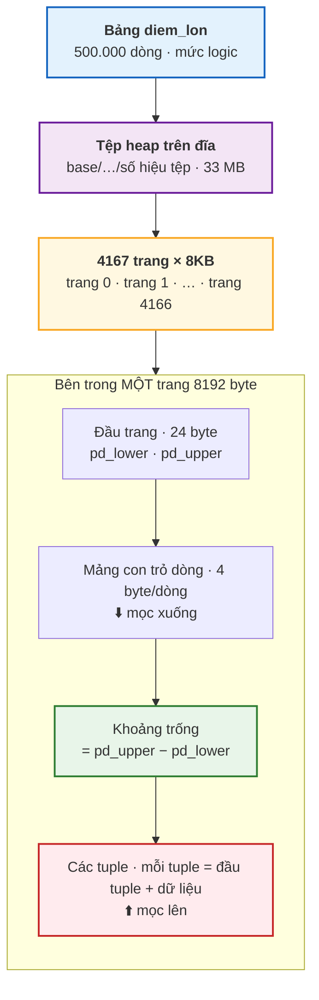
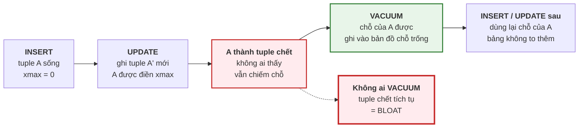

# Bài 33 — Trang, heap và tuple: PostgreSQL lưu dữ liệu thế nào

!!! abstract "🎯 Học xong bài này, bạn sẽ"
    - Mô tả được đường đi từ một **bảng** xuống **tệp trên đĩa**, rồi xuống từng **trang 8KB**, rồi xuống từng **tuple**
    - Đọc được địa chỉ vật lý `ctid` của một dòng, và giải thích vì sao **không bao giờ** được dùng nó làm khoá
    - Giải thích được **TOAST**: vì sao một ô chứa 265.000 byte mà dòng vẫn nằm vừa trong trang 8KB
    - Chứng minh bằng số liệu rằng `UPDATE` **không sửa tại chỗ**, sinh ra **tuple chết**, làm bảng **phình** — và `VACUUM` dọn nó thế nào
    - Chọn được **fill factor** hợp lý cho một bảng, và biết khi nào **không** nên đụng tới nó

## 🧠 Câu chuyện mở đầu

Thư viện trường vừa được cấp một dãy giá sách mới. Thầy thủ thư đặt ra một luật rất lạ: **mọi cuốn sách phải được xếp vào những chiếc khay cùng một cỡ**. Khay nào cũng rộng đúng bằng nhau, đánh số 0, 1, 2, 3… Muốn lấy sách thì không lấy lẻ từng cuốn — thầy bưng **cả khay** ra bàn rồi mới tìm trong khay.

Nghe thì phiền, nhưng nhờ vậy mọi thứ trở nên cực kỳ dễ quản lý. Vị trí của một cuốn sách luôn viết được bằng hai con số: *"khay 3, ô thứ 7"*. Thầy không cần biết sách nặng bao nhiêu, dày bao nhiêu — chỉ cần hai con số đó.

Rồi có ba chuyện xảy ra.

**Chuyện thứ nhất:** một bạn mang tới bộ *Từ điển Bách khoa* dày gấp mười lần cái khay. Không khay nào chứa nổi. Thầy thủ thư không đổi cỡ khay; thầy **tách bộ sách thành nhiều tập mỏng, gửi xuống kho riêng**, và trên khay chỉ để lại một tấm phiếu: *"Bộ Bách khoa — xem kho phụ, các ngăn 1 tới 40"*.

**Chuyện thứ hai:** một cuốn sổ ghi chép cần sửa một trang. Thầy **không tẩy xoá** — thầy chép một cuốn mới đã sửa, đặt vào chỗ trống gần nhất, và dán lên cuốn cũ một mảnh giấy *"hết hiệu lực"*. Lý do: lỡ có bạn đang đọc dở cuốn cũ thì bạn ấy vẫn đọc tiếp được, không bị giật sách khỏi tay.

**Chuyện thứ ba** là hệ quả của chuyện thứ hai: sau một học kỳ, giá sách **đầy ắp những cuốn hết hiệu lực**. Sách còn dùng thì ít, mà khay thì chật. Cuối tuần thầy phải đi một vòng, dọn các cuốn hết hiệu lực ra, để khay có chỗ cho sách mới.

Ba chuyện đó — khay cố định, kho phụ cho sách quá khổ, và dọn sách hết hiệu lực — chính xác là cách PostgreSQL lưu **mọi** bảng bạn đã tạo từ Bài 22 tới giờ. Bài này mở chiếc hộp đen ấy ra.

## 📖 Khái niệm & thuật ngữ

Suốt Cấp 3, bạn nhìn bảng như một tờ giấy kẻ ô: có dòng, có cột, thế thôi. Đó là **mức logic**. Cấp 4 đi xuống **mức trong** mà [Bài 3](../cap-0-nhap-mon/03-dbms-la-gi.md) đã hứa — chỗ dữ liệu thật sự nằm trên đĩa. Hiểu tầng này là điều kiện để hiểu index (Bài 34), `EXPLAIN` (Bài 36) và cả giao dịch (Bài 37).

### Từ bảng tới tệp trên đĩa

Mỗi bảng của PostgreSQL là **một tệp** (hoặc vài tệp, nếu bảng lớn hơn 1GB thì được cắt thành từng đoạn 1GB) nằm trong thư mục dữ liệu của máy chủ. Hàm `pg_relation_filepath` cho bạn biết đường dẫn của tệp đó.

Tệp này chứa **toàn bộ dòng** của bảng, xếp liền nhau mà **không theo bất kỳ thứ tự nào** — không theo khoá chính, không theo thời gian thêm vào (dù ban đầu thường trông giống vậy). Vì dòng được "đổ" vào bất cứ chỗ nào còn trống, PostgreSQL gọi tệp này là **tệp đống** (*heap*). Từ đây bài viết gọi tắt là **heap**.

!!! note "Heap ở đây không phải heap trong môn cấu trúc dữ liệu"
    Nếu bạn đã học lập trình, bạn có thể biết "heap" là một cấu trúc cây dùng cho hàng đợi ưu tiên. **Không liên quan.** Heap trong database chỉ có nghĩa đen: một đống, không sắp xếp.

### Trang — đơn vị đọc ghi nhỏ nhất

PostgreSQL **không bao giờ** đọc một dòng lẻ từ đĩa. Tệp heap được chia thành những miếng đều nhau, mỗi miếng **8KB** (8192 byte), và mọi lần đọc ghi đều đi theo **nguyên một miếng**. Miếng đó gọi là **trang** (*page*); trong mã nguồn và nhiều tài liệu, nó còn được gọi là **khối** (*block*). Hai từ này chỉ cùng một thứ.

Đây chính là "cái khay" của thầy thủ thư. Muốn đọc một dòng 60 byte, PostgreSQL vẫn phải mang **cả trang 8192 byte** vào bộ nhớ. Hệ quả rất quan trọng, và cả Cấp 4 sẽ xoay quanh nó:

!!! tip "Đơn vị chi phí thật của database là **số trang**, không phải số dòng"
    Một truy vấn đọc 10 dòng nằm trên 10 trang khác nhau **tốn gấp 10 lần** một truy vấn đọc 10 dòng nằm chung một trang. Index (Bài 34), `EXPLAIN` (Bài 36) và cả chuyện "vì sao planner không dùng index của tôi" đều quy về việc **đếm trang**.

Cỡ trang được chốt lúc biên dịch PostgreSQL và gần như không ai đổi. Bạn đọc được nó bằng `SHOW block_size`.

### Bên trong một trang

Một trang có bố cục cố định gồm bốn phần, và cách bố trí của nó rất khéo:

| Phần | Nằm ở | Kích thước | Nội dung |
|---|---|---|---|
| **Đầu trang** | Đầu trang | 24 byte | Thông tin quản lý, trong đó có hai con trỏ `pd_lower` và `pd_upper` |
| **Mảng con trỏ dòng** | Ngay sau đầu trang, **mọc xuống dưới** | 4 byte mỗi dòng | Mỗi ô ghi "dòng số *k* nằm ở byte thứ bao nhiêu, dài bao nhiêu" |
| **Khoảng trống** | Ở giữa | Co dần | Chỗ còn lại cho dòng mới |
| **Các tuple** | Cuối trang, **mọc ngược lên trên** | Tuỳ dòng | Dữ liệu thật |

Mỗi ô trong mảng thứ hai gọi là một **con trỏ dòng** (*line pointer*). Mảng con trỏ mọc từ trên xuống, dữ liệu mọc từ dưới lên, hai bên tiến về phía nhau. Khi chúng gặp nhau, trang đầy. `pd_lower` đánh dấu nơi mảng con trỏ kết thúc, `pd_upper` đánh dấu nơi dữ liệu bắt đầu; **khoảng trống còn lại đúng bằng `pd_upper - pd_lower`**.

Vì sao phải có lớp con trỏ trung gian? Vì nhờ nó, PostgreSQL có thể **dời** dữ liệu bên trong trang (ví dụ để dồn chỗ trống sau khi dọn dẹp) mà **không làm đổi số thứ tự** của dòng. Ai đang giữ địa chỉ "dòng số 7 của trang này" vẫn tìm đúng, vì con trỏ số 7 được cập nhật theo.

### Tuple và đầu tuple

Mỗi dòng dữ liệu nằm trên trang được gọi là một **bộ** (*tuple*) — đúng cái tên học thuật mà [Bài 1](../cap-0-nhap-mon/01-du-lieu-va-thong-tin.md) đã giới thiệu. Giới làm PostgreSQL gọi luôn bằng tiếng Anh là *tuple*, và từ đây bài này cũng vậy.

Nhưng tuple trên đĩa **không chỉ** là các giá trị cột. Trước phần dữ liệu luôn có một **đầu tuple** (*tuple header*) dài 23 byte (làm tròn thành 24), chứa các thông tin mà bạn không bao giờ thấy trong `SELECT *`. Ba trường quan trọng nhất:

| Trường | Ý nghĩa |
|---|---|
| `xmin` | Mã số của **giao dịch đã tạo ra** tuple này |
| `xmax` | Mã số của **giao dịch đã xoá hoặc thay thế** tuple này; bằng `0` nếu tuple còn sống |
| `t_ctid` | Địa chỉ của **phiên bản mới hơn** của chính dòng này, nếu có; nếu không thì trỏ về chính nó |

Bài này chỉ cần bạn biết hai trường `xmin`, `xmax` tồn tại và dùng để đánh dấu tuple "hết hiệu lực". Cơ chế dùng chúng để quyết định **ai nhìn thấy phiên bản nào** là nội dung của Bài 39.

Hệ quả thực tế: một dòng `diem_lon` có bảy cột nhỏ xíu, dữ liệu thật chỉ khoảng 36–40 byte, nhưng **cộng đầu tuple và con trỏ dòng** thì mỗi dòng chiếm khoảng 68 byte trên trang. Cái "thuế" gần 32 byte mỗi dòng này là lý do bảng có hàng trăm triệu dòng nhỏ tốn đĩa hơn nhiều so với tính nhẩm.

### `ctid` — địa chỉ vật lý của một dòng

Ghép số trang với số con trỏ dòng, bạn được địa chỉ vật lý của một tuple: cặp **(số trang, số thứ tự trong trang)**. PostgreSQL gọi địa chỉ này là **địa chỉ tuple** (*ctid*) và cho bạn đọc nó như một cột ẩn: `SELECT ctid, * FROM ...`. Địa chỉ `(0,1)` nghĩa là *"trang số 0, con trỏ dòng số 1"* — đúng kiểu *"khay 0, ô 1"* của thư viện.

Trang đếm từ **0**, con trỏ dòng đếm từ **1**.

!!! danger "`ctid` **không phải** khoá — nó đổi sau mỗi lần sửa dòng"
    Vì `UPDATE` ghi ra một tuple **mới** ở chỗ khác (mục kế tiếp), `ctid` của dòng **thay đổi**. `VACUUM FULL` viết lại cả bảng nên đổi `ctid` của **mọi** dòng. Dùng `ctid` để trỏ tới một dòng "lâu dài" là một lỗi — phần **Lỗi thường gặp** sẽ cho bạn thấy tận mắt.

    `ctid` chỉ đáng tin **bên trong một câu lệnh** — ví dụ để xoá những dòng trùng lặp không có khoá, như mẹo bạn sẽ gặp ở phần bài tập.

### `UPDATE` không sửa tại chỗ — tuple chết

Đây là điều bất ngờ nhất của bài. Khi bạn chạy:

```
UPDATE hoc_sinh SET ho_ten = '...' WHERE ma_hs = 'HS001';
```

PostgreSQL **không** ghi đè lên tuple cũ. Nó làm hai việc:

1. Ghi một tuple **mới** chứa giá trị mới, ở bất cứ chỗ trống nào — tốt nhất là cùng trang.
2. Điền vào trường `xmax` của tuple **cũ** mã số giao dịch vừa sửa, nghĩa là *"hết hiệu lực kể từ giao dịch này"*.

Đúng như thầy thủ thư chép cuốn sổ mới rồi dán nhãn lên cuốn cũ. `DELETE` cũng vậy: nó **không xoá** gì cả, chỉ điền `xmax` cho tuple.

Lý do là để người khác **đang đọc** dòng đó vẫn đọc được phiên bản cũ mà không phải chờ — cơ chế ấy có tên riêng và được dành trọn Bài 39. Ở đây chỉ cần hệ quả: sau khi giao dịch sửa đã xong và không còn ai cần tới phiên bản cũ, tuple cũ trở thành rác. Nó vẫn nằm trên trang, vẫn chiếm chỗ, nhưng không ai còn thấy nó. Tuple như vậy gọi là **tuple chết** (*dead tuple*).

### Bloat, `VACUUM` và autovacuum

Nếu cứ sửa mà không dọn, tuple chết tích tụ dần. Bảng có 10.000 dòng "sống" có thể chiếm chỗ của 20.000, 50.000 dòng. Hiện tượng bảng chiếm dung lượng lớn hơn nhiều so với lượng dữ liệu sống bên trong gọi là **phình** (*bloat*). Bảng phình thì quét chậm hơn — vì phải đọc nhiều trang hơn cho cùng một lượng dữ liệu, và bạn đã biết chi phí thật là **số trang**.

Người đi dọn là lệnh **dọn rác** (*VACUUM*). Nó đi qua từng trang và:

- Đánh dấu chỗ của các tuple chết là **trống, dùng lại được**.
- Ghi lượng chỗ trống của mỗi trang vào **bản đồ chỗ trống** (*free space map*), để lần `INSERT`/`UPDATE` sau biết trang nào còn chỗ mà nhét vào.
- Đánh dấu những trang mà **mọi** tuple trên đó đều sống và ai cũng thấy được vào **bản đồ hiển thị** (*visibility map*). Bài 34 sẽ cho bạn thấy tấm bản đồ này là điều kiện để index chạy được kiểu nhanh nhất.

Điểm mấu chốt thường bị hiểu sai: **`VACUUM` thường không trả dung lượng lại cho hệ điều hành.** Tệp vẫn to như cũ; chỉ là chỗ trống bên trong giờ **dùng lại được**. (Ngoại lệ duy nhất: nếu các trang **ở cuối tệp** trống hoàn toàn thì nó cắt bớt phần đuôi ấy.)

Muốn tệp thật sự co lại, phải dùng **`VACUUM FULL`**: nó chép mọi tuple sống sang một tệp mới gọn gàng rồi bỏ tệp cũ. Cái giá rất đắt — trong suốt thời gian chép, bảng bị **khoá hoàn toàn**, không ai đọc cũng không ai ghi được. Trên bảng lớn của hệ thống đang chạy, đó có thể là hàng chục phút ngừng hoạt động.

May là bạn gần như không bao giờ phải tự chạy `VACUUM`. PostgreSQL có một tiến trình nền gọi là **dọn rác tự động** (*autovacuum*), cứ mỗi phút thức dậy một lần, xem bảng nào có số tuple chết vượt ngưỡng thì tự `VACUUM` nó. Ngưỡng mặc định là **50 dòng cộng 20% số dòng của bảng**. Autovacuum cũng tự chạy `ANALYZE` để cập nhật thống kê — chuyện của Bài 36.

!!! warning "Autovacuum là bạn, đừng tắt nó"
    Một "mẹo tối ưu" lan truyền trên mạng là tắt autovacuum để máy đỡ bận. Kết quả luôn giống nhau: vài tuần sau bảng phình gấp mấy lần, truy vấn chậm dần mà không ai hiểu vì sao, và cuối cùng phải `VACUUM FULL` — tức là khoá bảng — để cứu. Autovacuum còn một nhiệm vụ sống còn nữa liên quan tới mã số giao dịch, sẽ gặp ở Bài 39: tắt nó lâu ngày có thể làm database **tự dừng nhận ghi** để bảo vệ dữ liệu.

### TOAST — kho phụ cho ô quá khổ

Một tuple phải nằm trọn trong một trang 8KB. Vậy cột `TEXT` chứa cả một bài văn 265.000 byte thì sao?

PostgreSQL dùng một cơ chế tên là **kỹ thuật lưu thuộc tính quá khổ** (*The Oversized-Attribute Storage Technique*, viết tắt **TOAST**). Khi một tuple sắp vượt khoảng **2KB** (một phần tư trang), PostgreSQL xử lý các ô lớn theo thứ tự:

1. **Nén** ô đó trước. Văn bản lặp nhiều thì có thể nén rất mạnh.
2. Nếu nén rồi mà tuple vẫn quá lớn, **chuyển ô đó ra một bảng phụ** — gọi là bảng TOAST — cắt thành từng mẩu khoảng 2KB. Trên tuple chính chỉ còn lại một **con trỏ** nhỏ chừng 18 byte: *"nội dung thật nằm ở bảng TOAST số X, mẩu 1 tới N"*.

Đó chính là tấm phiếu *"xem kho phụ"* của thầy thủ thư. Mọi bảng có cột kiểu dài được (`TEXT`, `VARCHAR`, `JSONB`, `BYTEA`…) đều có sẵn một bảng TOAST đi kèm, tên dạng `pg_toast.pg_toast_<số>`.

Hai hệ quả thực tế:

- Cột lớn **không làm chậm** những truy vấn không đụng tới nó. `SELECT ma_hs, ho_ten` trên một bảng có cột bài văn khổng lồ vẫn chỉ đọc trang chính, vì trên đó bài văn chỉ là một con trỏ.
- Ngược lại, `SELECT *` sẽ phải **lần theo con trỏ**, đọc thêm các trang TOAST, rồi giải nén. Đây là một lý do nữa — ngoài lý do ở [Bài 24](../cap-3-sql/24-select-where-order-by.md) — để chỉ lấy đúng những cột bạn cần.

### Fill factor

Mặc định, PostgreSQL xếp dòng vào một trang cho tới khi **đầy 100%** mới chuyển sang trang mới. Bạn có thể bảo nó dừng sớm hơn — ví dụ ở 70% — để chừa lại 30% mỗi trang. Tỉ lệ đó gọi là **hệ số lấp đầy** (*fill factor*), khai bằng `WITH (fillfactor = 70)` lúc tạo bảng.

Chừa chỗ để làm gì? Để khi `UPDATE`, tuple mới **nằm được ngay trên cùng trang** với tuple cũ. Khi điều đó xảy ra, và cột bị sửa không có index nào, PostgreSQL dùng được một đường tắt tên là **cập nhật chỉ trên heap** (*Heap-Only Tuple*, viết tắt **HOT**): không phải sửa gì trong index cả, và chỗ của tuple cũ được dọn ngay lúc trang được đọc lần sau, không cần đợi `VACUUM`. Bạn sẽ thấy dấu vết của HOT trong phần thực hành.

Cái giá: bảng cần **nhiều trang hơn** cho cùng số dòng, nên quét toàn bảng chậm hơn. Vì thế:

| Kiểu bảng | Fill factor nên dùng |
|---|---|
| Chỉ thêm, hầu như không sửa — nhật ký, điểm đã chốt, lịch sử | **100** (mặc định) |
| Sửa thường xuyên, mỗi lần sửa vài cột không có index — điểm danh trong ngày, số lượng sách còn | **70–90** |
| Mọi trường hợp bạn chưa đo | **100** — đừng đổi khi chưa có số liệu |

### Bảng thuật ngữ

| Tiếng Việt | English | Nghĩa dễ hiểu |
|---|---|---|
| Tệp đống | *heap* | Tệp chứa các dòng của một bảng, xếp không theo thứ tự nào |
| Trang | *page* | Miếng 8KB — đơn vị nhỏ nhất PostgreSQL đọc ghi; chi phí thật tính bằng số trang |
| Khối | *block* | Tên gọi khác của trang |
| Con trỏ dòng | *line pointer* | Ô 4 byte ở đầu trang ghi vị trí của một tuple; giúp dời tuple trong trang mà không đổi địa chỉ |
| Bộ | *tuple* | Một dòng vật lý nằm trên trang, gồm đầu tuple và dữ liệu |
| Đầu tuple | *tuple header* | Phần 23 byte trước dữ liệu của mỗi tuple, chứa `xmin`, `xmax`, `t_ctid`… |
| Địa chỉ tuple | *ctid* | Cặp (số trang, số con trỏ dòng); đổi sau mỗi `UPDATE` nên không bao giờ dùng làm khoá |
| Tuple chết | *dead tuple* | Phiên bản cũ của một dòng sau `UPDATE`/`DELETE`, không ai còn thấy nhưng vẫn chiếm chỗ |
| Phình | *bloat* | Bảng chiếm nhiều trang hơn hẳn lượng dữ liệu sống bên trong vì tích tụ tuple chết |
| Dọn rác | *VACUUM* | Lệnh đánh dấu chỗ của tuple chết là dùng lại được; không trả dung lượng cho hệ điều hành |
| Dọn rác toàn phần | *VACUUM FULL* | Viết lại cả bảng cho gọn, trả dung lượng lại — nhưng khoá bảng hoàn toàn khi chạy |
| Dọn rác tự động | *autovacuum* | Tiến trình nền tự `VACUUM` và `ANALYZE` các bảng khi số tuple chết vượt ngưỡng |
| Bản đồ chỗ trống | *free space map* | Tệp phụ ghi mỗi trang còn trống bao nhiêu, để lần ghi sau biết chỗ mà nhét |
| Bản đồ hiển thị | *visibility map* | Tệp phụ đánh dấu những trang mà mọi tuple đều sống và ai cũng thấy |
| Kỹ thuật lưu thuộc tính quá khổ | *The Oversized-Attribute Storage Technique* (TOAST) | Nén ô lớn, nếu vẫn lớn thì cắt ra bảng phụ, trên dòng chính chỉ để lại con trỏ |
| Hệ số lấp đầy | *fill factor* | Tỉ lệ phần trăm một trang được lấp khi thêm dòng, chừa phần còn lại cho `UPDATE` |
| Cập nhật chỉ trên heap | *Heap-Only Tuple* (HOT) | `UPDATE` mà tuple mới nằm cùng trang và không cột nào có index bị sửa — khỏi phải sửa index |

## 🖼️ Sơ đồ

Từ bảng xuống tới từng byte — bốn tầng, mỗi tầng nằm gọn trong tầng trên:



Vòng đời của một tuple — từ lúc sinh ra, qua `UPDATE`, tới lúc chỗ của nó được dùng lại:



## 💻 Thực hành

### Tệp và cỡ trang

```sql
-- KỲ VỌNG: co_trang = 8192
SELECT current_setting('block_size') AS co_trang,
       pg_relation_filepath('hoc_sinh') AS tep_cua_hoc_sinh;
```

Cỡ trang là **8192** byte. Cột thứ hai cho đường dẫn tương đối của tệp heap chứa bảng `hoc_sinh`, dạng `base/<số hiệu database>/<số hiệu tệp>` — hai con số này khác nhau trên mỗi máy, nên khoá học không khẳng định chúng.

Bảng lớn `diem_lon` nặng bao nhiêu, và gồm bao nhiêu trang?

```sql
-- KỲ VỌNG: dung_luong = 33 MB
-- KỲ VỌNG: so_trang = 4167
SELECT pg_size_pretty(pg_relation_size('diem_lon')) AS dung_luong,
       pg_relation_size('diem_lon') / 8192           AS so_trang;
```

**4167 trang**, tức 33 MB. Chú ý `pg_relation_size` chỉ đo **tệp heap**. Tệp nạp dữ liệu in ra con số 43 MB vì nó dùng `pg_total_relation_size` — hàm này cộng thêm index khoá chính và bảng TOAST.

### Đọc `ctid`

```sql
-- KỲ VỌNG: 5 dòng
SELECT ctid, ma_hs, ho_ten
FROM hoc_sinh
LIMIT 5;
```

Bạn sẽ thấy `(0,1)`, `(0,2)`, `(0,3)`… — năm dòng đầu tiên của **trang 0**. Chú ý câu lệnh **không có `ORDER BY`**: như [Bài 24](../cap-3-sql/24-select-where-order-by.md) cảnh báo, thứ tự kết quả là không xác định. Hôm nay nó ra theo thứ tự vật lý vì PostgreSQL quét tuần tự từ đầu tệp; đừng bao giờ dựa vào điều đó.

Muốn khẳng định chắc chắn, hỏi thẳng một dòng:

```sql
-- KỲ VỌNG: dia_chi = (0,1)
SELECT ctid::text AS dia_chi
FROM hoc_sinh
WHERE ma_hs = 'HS001';
```

Bốn mươi học sinh chiếm bao nhiêu trang? Mẹo ở đây: ép `ctid` sang chuỗi rồi sang kiểu `point`, phần tử `[0]` chính là số trang.

```sql
-- KỲ VỌNG: so_trang_dung = 1
-- KỲ VỌNG: so_dong = 40
SELECT count(DISTINCT (ctid::text::point)[0]) AS so_trang_dung,
       count(*)                               AS so_dong
FROM hoc_sinh;
```

Cả bảng `hoc_sinh` nằm gọn trong **một** trang. Với `diem_lon` thì sao — mỗi trang chứa bao nhiêu dòng?

```sql
-- KỲ VỌNG: so_trang_day = 4166
-- KỲ VỌNG: dong_moi_trang_day = 120
-- KỲ VỌNG: dong_trang_cuoi = 80
SELECT count(*) FILTER (WHERE so_dong = 120) AS so_trang_day,
       max(so_dong)                          AS dong_moi_trang_day,
       min(so_dong)                          AS dong_trang_cuoi
FROM (
    SELECT (ctid::text::point)[0] AS trang, count(*) AS so_dong
    FROM diem_lon
    GROUP BY 1
) AS t;
```

**4166 trang đầy, mỗi trang 120 dòng**, và trang cuối cùng còn 80 dòng: `4166 × 120 + 80 = 500.000`. Chia `8192 / 120 ≈ 68` byte mỗi dòng — gần gấp đôi 36–40 byte dữ liệu thật, đúng như phần khái niệm nói về "thuế" đầu tuple và con trỏ dòng.

### Nhìn vào bên trong một trang với `pageinspect`

PostgreSQL có sẵn một extension tên `pageinspect` để đọc thẳng các byte của một trang. Extension này **cần quyền superuser** — trong Docker của khóa học bạn đăng nhập bằng `postgres` nên có sẵn quyền đó. Trên máy chủ thật, đừng cài nó cho người dùng thường.

```sql
CREATE EXTENSION IF NOT EXISTS pageinspect;

-- KỲ VỌNG: pd_lower = 184
-- KỲ VỌNG: pd_upper = 4536
-- KỲ VỌNG: khoang_trong = 4352
SELECT lower          AS pd_lower,
       upper          AS pd_upper,
       upper - lower  AS khoang_trong,
       pagesize
FROM page_header(get_raw_page('hoc_sinh', 0));
```

Đọc từng con số:

- `pd_lower = 184` = 24 byte đầu trang + **40 con trỏ dòng × 4 byte**. Đúng 40 học sinh.
- `pd_upper = 4536`: dữ liệu bắt đầu từ byte 4536 và kéo tới cuối trang, tức 40 tuple chiếm `8192 − 4536 = 3656` byte.
- **Khoảng trống còn 4352 byte** — hơn một nửa trang vẫn còn trống, nên nếu trường nhận thêm vài chục học sinh thì bảng vẫn nằm gọn trong một trang.

### Một tuple thay đổi thế nào khi bị `UPDATE`

Dựng một bảng nháp năm dòng. Tuỳ chọn `autovacuum_enabled = off` **tắt autovacuum cho riêng bảng này** — không phải vì đó là thói quen tốt (nó **không** phải), mà để autovacuum không tình cờ dọn rác giữa chừng trong lúc bạn đang quan sát.

```sql
DROP TABLE IF EXISTS b33_hoc_sinh CASCADE;

CREATE TABLE b33_hoc_sinh (
    ma_hs  INTEGER,
    ho_ten TEXT
) WITH (autovacuum_enabled = off);

INSERT INTO b33_hoc_sinh VALUES
(1, 'An'), (2, 'Bình'), (3, 'Cường'), (4, 'Dung'), (5, 'Đức');

-- KỲ VỌNG: dia_chi = (0,1)
SELECT ctid::text AS dia_chi FROM b33_hoc_sinh WHERE ma_hs = 1;
```

Bạn `An` đang ở `(0,1)`. Giờ sửa tên:

```sql
UPDATE b33_hoc_sinh SET ho_ten = 'An (đã sửa)' WHERE ma_hs = 1;

-- KỲ VỌNG: dia_chi = (0,6)
SELECT ctid::text AS dia_chi FROM b33_hoc_sinh WHERE ma_hs = 1;
```

Địa chỉ đổi thành **`(0,6)`** — bảng chỉ có năm dòng, vậy mà dòng này giờ ở vị trí số **6**. Vị trí số 1 đi đâu? Hỏi `pageinspect`:

```sql
-- KỲ VỌNG: 6 dòng
-- KỲ VỌNG: lp = 1
-- KỲ VỌNG: da_bi_thay_the = true
-- KỲ VỌNG: tro_toi = (0,6)
SELECT lp,
       t_xmax <> 0     AS da_bi_thay_the,
       t_ctid::text    AS tro_toi
FROM heap_page_items(get_raw_page('b33_hoc_sinh', 0))
ORDER BY lp;
```

Trang có **sáu** tuple cho năm dòng. Tuple số 1 — bản cũ của `An` — **vẫn còn nguyên**, nhưng `xmax` của nó đã khác 0 (*"đã bị thay thế"*) và `t_ctid` của nó trỏ sang `(0,6)`, nơi phiên bản mới nằm. Đúng như cuốn sổ bị dán nhãn *"hết hiệu lực — xem cuốn mới ở ô 6"*.

Mã giao dịch cụ thể trong `xmin`, `xmax` khác nhau trên mỗi máy, nên truy vấn chỉ so `xmax` với `0`. Bạn cứ bỏ điều kiện đó đi và `SELECT lp, t_xmin, t_xmax, t_ctid` để xem con số thật của mình.

Giờ xoá một dòng:

```sql
DELETE FROM b33_hoc_sinh WHERE ma_hs = 5;

-- KỲ VỌNG: so_tuple_tren_trang = 6
-- KỲ VỌNG: so_tuple_het_hieu_luc = 2
-- KỲ VỌNG: so_dong_nhin_thay = 4
SELECT (SELECT count(*) FROM heap_page_items(get_raw_page('b33_hoc_sinh', 0)))
           AS so_tuple_tren_trang,
       (SELECT count(*) FROM heap_page_items(get_raw_page('b33_hoc_sinh', 0))
        WHERE t_xmax <> 0)
           AS so_tuple_het_hieu_luc,
       (SELECT count(*) FROM b33_hoc_sinh)
           AS so_dong_nhin_thay;
```

`DELETE` **không làm biến mất** tuple nào: trang vẫn có **6** tuple, trong đó **2** đã hết hiệu lực, và `SELECT` chỉ còn thấy **4** dòng. Hai tuple chết kia là rác.

### `VACUUM` dọn rác

```sql
VACUUM b33_hoc_sinh;

-- KỲ VỌNG: 6 dòng
-- KỲ VỌNG: lp = 1
-- KỲ VỌNG: trang_thai = 2
SELECT lp,
       lp_flags   AS trang_thai,
       t_ctid::text AS tro_toi
FROM heap_page_items(get_raw_page('b33_hoc_sinh', 0))
ORDER BY lp;
```

Cột `lp_flags` cho biết trạng thái của từng con trỏ dòng: `0` = **trống**, dùng lại được; `1` = **bình thường**, trỏ tới một tuple sống; `2` = **chuyển hướng**; `3` = **chết**, chờ dọn nốt. Sau `VACUUM`:

| `lp` | `lp_flags` | Chuyện gì đã xảy ra |
|---|---|---|
| 1 | **2** — chuyển hướng | Bản cũ của `An` đã bị dọn, nhưng **con trỏ số 1 được giữ lại** làm biển chỉ đường sang `(0,6)` |
| 2, 3, 4 | 1 — bình thường | Ba dòng không ai đụng tới |
| 5 | **0** — trống | Bản của `Đức` đã bị dọn sạch, con trỏ số 5 dùng lại được |
| 6 | 1 — bình thường | Bản mới của `An` |

Vì sao con trỏ số 1 không được giải phóng như số 5? Vì đây là một **HOT update**: bản mới nằm **cùng trang** với bản cũ. Nếu bảng có index, index vẫn đang trỏ vào địa chỉ cũ `(0,1)` — PostgreSQL không sửa index khi HOT update, đó chính là chỗ nó tiết kiệm. Nên con trỏ số 1 phải ở lại làm biển chỉ đường, để ai tìm tới `(0,1)` cũng được dẫn sang `(0,6)`. Còn `Đức` bị xoá hẳn, không ai cần tìm tới nữa.

```sql
-- KỲ VỌNG: so_tuple_song = 4
-- KỲ VỌNG: so_tuple_het_hieu_luc = 0
SELECT count(*) FILTER (WHERE lp_flags = 1)    AS so_tuple_song,
       count(*) FILTER (WHERE t_xmax <> 0)     AS so_tuple_het_hieu_luc
FROM heap_page_items(get_raw_page('b33_hoc_sinh', 0));
```

Bốn tuple sống, **không còn tuple hết hiệu lực nào** trên trang.

### TOAST — một bài văn 265.000 byte trong trang 8KB

```sql
DROP TABLE IF EXISTS b33_bai_van CASCADE;

CREATE TABLE b33_bai_van (
    ma_bai   INTEGER PRIMARY KEY,
    noi_dung TEXT
);

INSERT INTO b33_bai_van VALUES
(1, 'Bài văn ngắn'),
(2, repeat('Ngày khai trường, sân trường rợp cờ hoa. ', 5000));

-- KỲ VỌNG: 2 dòng
-- KỲ VỌNG: ma_bai = 2
-- KỲ VỌNG: so_byte_that = 265000
-- KỲ VỌNG: so_byte_luu = 3089
SELECT ma_bai,
       octet_length(noi_dung)   AS so_byte_that,
       pg_column_size(noi_dung) AS so_byte_luu
FROM b33_bai_van
ORDER BY ma_bai DESC;
```

Bài văn số 2 dài **265.000 byte** khi đọc ra, nhưng chỉ chiếm **3089 byte** khi lưu. Câu văn lặp lại 5000 lần nên nén cực kỳ tốt. Dù vậy, 3089 byte vẫn vượt ngưỡng khoảng 2KB, nên nó bị chuyển sang bảng TOAST:

```sql
-- KỲ VỌNG: co_bang_toast = true
-- KỲ VỌNG: bang_toast_co_du_lieu = true
-- KỲ VỌNG: so_trang_bang_chinh = 1
SELECT c.reltoastrelid <> 0                         AS co_bang_toast,
       pg_relation_size(c.reltoastrelid) > 0         AS bang_toast_co_du_lieu,
       pg_relation_size('b33_bai_van') / 8192        AS so_trang_bang_chinh
FROM pg_class c
WHERE c.relname = 'b33_bai_van';
```

Bảng chính chỉ có **một** trang cho cả hai bài văn — bài văn dài trên đó chỉ là một con trỏ nhỏ. Nội dung thật nằm ở bảng TOAST. Bạn tự `SELECT reltoastrelid::regclass FROM pg_class WHERE relname = 'b33_bai_van'` để xem tên bảng phụ đó.

### Bloat — đo tận mắt

Dựng 10.000 dòng rồi **sửa tất cả**:

```sql
DROP TABLE IF EXISTS b33_phinh CASCADE;

CREATE TABLE b33_phinh (
    ma_hs   INTEGER,
    diem_so NUMERIC(4,2),
    ghi_chu CHAR(100)
) WITH (autovacuum_enabled = off);

INSERT INTO b33_phinh
SELECT n, 5, 'ghi chú'
FROM generate_series(1, 10000) AS n;

-- KỲ VỌNG: so_trang = 173
SELECT pg_relation_size('b33_phinh') / 8192 AS so_trang;
```

**173 trang** cho 10.000 dòng. Giờ cộng mỗi bạn 1 điểm:

```sql
UPDATE b33_phinh SET diem_so = diem_so + 1;

-- KỲ VỌNG: so_trang = 345
-- KỲ VỌNG: so_dong_nhin_thay = 10000
SELECT pg_relation_size('b33_phinh') / 8192 AS so_trang,
       (SELECT count(*) FROM b33_phinh)      AS so_dong_nhin_thay;
```

Vẫn **10.000 dòng**, nhưng bảng đã phình lên **345 trang** — gần gấp đôi. Mỗi dòng bây giờ có hai tuple: một sống, một chết. Các trang đã đầy 100% nên bản mới không nhét được vào cùng trang, phải đi ra các trang mới ở cuối tệp.

`VACUUM` có làm bảng nhỏ lại không?

```sql
VACUUM b33_phinh;

-- KỲ VỌNG: so_trang = 345
SELECT pg_relation_size('b33_phinh') / 8192 AS so_trang;
```

**Không.** Vẫn 345 trang. Nhưng giờ nửa đầu tệp đầy chỗ trống đã được ghi vào bản đồ chỗ trống. Sửa tất cả thêm một lần nữa:

```sql
UPDATE b33_phinh SET diem_so = diem_so + 1;

-- KỲ VỌNG: so_trang = 345
SELECT pg_relation_size('b33_phinh') / 8192 AS so_trang;
```

**Vẫn 345.** Lần này 10.000 tuple mới **dùng lại** đúng chỗ mà `VACUUM` vừa dọn, nên tệp không to thêm một trang nào. Đó là toàn bộ ý nghĩa của `VACUUM`: nó không làm tệp nhỏ đi, nó **chặn tệp to mãi**. Nếu lần sửa thứ hai xảy ra mà không có `VACUUM` ở giữa, bảng sẽ tiếp tục phình.

Muốn trả dung lượng lại cho hệ điều hành thì phải viết lại cả bảng:

```sql
VACUUM FULL b33_phinh;

-- KỲ VỌNG: so_trang = 173
SELECT pg_relation_size('b33_phinh') / 8192 AS so_trang;
```

Về lại **173 trang**. Trên bảng nháp 10.000 dòng thì việc này mất vài chục mili giây; trên bảng thật đang phục vụ người dùng thì đó là một khoảng thời gian **bảng bị khoá hoàn toàn**.

### Fill factor — chừa chỗ trên mỗi trang

Hai bảng giống hệt nhau, chỉ khác fill factor:

```sql
DROP TABLE IF EXISTS b33_ff100 CASCADE;
DROP TABLE IF EXISTS b33_ff50 CASCADE;

CREATE TABLE b33_ff100 (ma_hs INTEGER, ghi_chu CHAR(100))
    WITH (autovacuum_enabled = off);
CREATE TABLE b33_ff50  (ma_hs INTEGER, ghi_chu CHAR(100))
    WITH (fillfactor = 50, autovacuum_enabled = off);

INSERT INTO b33_ff100 SELECT n, 'x' FROM generate_series(1, 1000) AS n;
INSERT INTO b33_ff50  SELECT n, 'x' FROM generate_series(1, 1000) AS n;

-- KỲ VỌNG: trang_ff100 = 18
-- KỲ VỌNG: trang_ff50 = 35
-- KỲ VỌNG: dong_trang0_ff100 = 58
-- KỲ VỌNG: dong_trang0_ff50 = 29
SELECT pg_relation_size('b33_ff100') / 8192 AS trang_ff100,
       pg_relation_size('b33_ff50')  / 8192 AS trang_ff50,
       (SELECT count(*) FROM b33_ff100 WHERE (ctid::text::point)[0] = 0) AS dong_trang0_ff100,
       (SELECT count(*) FROM b33_ff50  WHERE (ctid::text::point)[0] = 0) AS dong_trang0_ff50;
```

Fill factor 50 xếp **29** dòng mỗi trang thay vì **58**, nên cùng 1000 dòng cần **35** trang thay vì **18**. Quét toàn bảng `b33_ff50` phải đọc gần gấp đôi số trang. Đó là cái giá bạn trả trước cho các lần `UPDATE` về sau.

### Dọn `diem_lon` cho các bài sau

Bảng `diem_lon` vừa được nạp bằng một lệnh `INSERT` lớn, chưa từng được `VACUUM`, nên bản đồ hiển thị của nó còn trống trơn. Bài 34 cần tấm bản đồ đó đầy đủ để minh hoạ một kiểu quét đặc biệt. Chạy `VACUUM` một lần:

```sql
VACUUM diem_lon;

-- KỲ VỌNG: trang_da_danh_dau = 4167
SELECT relallvisible AS trang_da_danh_dau
FROM pg_class
WHERE relname = 'diem_lon';
```

Cả **4167** trang giờ đã được đánh dấu *"mọi tuple ở đây đều sống và ai cũng thấy"* trong bản đồ hiển thị. Không dòng nào bị đổi — `VACUUM` không sửa dữ liệu — nên đây là thao tác an toàn trên bảng thực hành.

(Nếu bạn chờ đủ lâu thì autovacuum cũng sẽ tự làm việc này, vì 500.000 dòng vừa thêm đã vượt ngưỡng của nó. Khoá học chạy tay để kết quả của Bài 34 không phụ thuộc vào việc autovacuum đã kịp chạy hay chưa.)

Cuối cùng, xác nhận autovacuum đang bật cho toàn máy chủ:

```sql
-- KỲ VỌNG: autovacuum = on
SELECT current_setting('autovacuum') AS autovacuum;
```

Các bảng nháp `b33_` được giữ tới cuối bài vì phần **Lỗi thường gặp** và **Bài tập** còn dùng. Mục dọn dẹp nằm ở cuối.

## ⚠️ Lỗi thường gặp

!!! danger "Lỗi 1: Lưu `ctid` để lát nữa tìm lại dòng"
    Một phần mềm đọc danh sách học sinh kèm `ctid`, lưu vào bộ nhớ, rồi vài phút sau dùng `WHERE ctid = '(0,2)'` để cập nhật bạn `Bình`. Chạy đúng trong lúc thử — rồi một hôm cập nhật nhầm người.

    ```sql
    -- KỲ VỌNG: dia_chi = (0,2)
    SELECT ctid::text AS dia_chi FROM b33_hoc_sinh WHERE ma_hs = 2;
    ```

    Phần mềm ghi nhớ: *"bạn Bình ở `(0,2)`"*. Trong lúc đó, có người sửa tên bạn ấy:

    ```sql
    UPDATE b33_hoc_sinh SET ho_ten = 'Bình (đã sửa)' WHERE ma_hs = 2;

    -- KỲ VỌNG: dia_chi = (0,5)
    SELECT ctid::text AS dia_chi FROM b33_hoc_sinh WHERE ma_hs = 2;
    ```

    `Bình` giờ ở **`(0,5)`** — và `(0,5)` chính là địa chỉ cũ của bạn **`Đức`**, người đã bị xoá ở phần thực hành. `VACUUM` đã giải phóng con trỏ số 5, nên lần ghi tiếp theo **dùng lại nó cho một dòng hoàn toàn khác**. Địa chỉ `(0,2)` mà phần mềm đang giữ thì trỏ vào một tuple đã hết hiệu lực, và sau lần `VACUUM` kế tiếp, nó cũng sẽ được giao cho ai đó khác.

    Nói cách khác: một địa chỉ `ctid` cũ không chỉ **sai**, nó có thể trỏ **đúng vào người khác**.

    Sửa: luôn trỏ tới dòng bằng **khoá chính**. `ctid` chỉ dùng bên trong **một** câu lệnh.

!!! danger "Lỗi 2: Tưởng `DELETE` làm bảng nhỏ lại"
    Một thầy giáo xoá hết điểm của năm học cũ — một nửa bảng — rồi ngạc nhiên vì ổ đĩa không trống ra chút nào.

    ```sql
    DELETE FROM b33_phinh WHERE ma_hs <= 5000;

    -- KỲ VỌNG: so_trang = 173
    -- KỲ VỌNG: so_dong_nhin_thay = 5000
    SELECT pg_relation_size('b33_phinh') / 8192 AS so_trang,
           (SELECT count(*) FROM b33_phinh)      AS so_dong_nhin_thay;
    ```

    Còn **5000** dòng mà vẫn **173** trang, y như lúc có 10.000 dòng. `DELETE` chỉ điền `xmax`; `VACUUM` sau đó sẽ biến chỗ ấy thành chỗ trống dùng lại được, nhưng tệp vẫn giữ nguyên kích thước — trừ khi các trang trống nằm đúng ở đuôi tệp.

    Nếu bạn thật sự cần lấy lại đĩa: xoá theo lô rồi để autovacuum dọn là đủ cho hầu hết trường hợp, vì chỗ trống sẽ được dữ liệu mới dùng lại. Chỉ khi bảng sẽ **không bao giờ lớn trở lại** mới cân nhắc `VACUUM FULL`, vào giờ không ai dùng. Còn với dữ liệu "xoá theo năm học", giải pháp gọn nhất là chia bảng theo năm — chuyện của Cấp 5.

!!! warning "Lỗi 3: Tắt autovacuum \"cho máy đỡ bận\""
    Bạn đã thấy ở phần thực hành: không có `VACUUM` thì mỗi lần sửa cả bảng là thêm một lớp tuple chết. Một bảng điểm danh được sửa hàng ngày sẽ phình lên gấp mấy lần chỉ sau vài tuần, và mọi truy vấn quét bảng chậm theo.

    Nếu autovacuum **có vẻ** gây tải, đừng tắt nó — hãy cho nó chạy **thường xuyên hơn và nhẹ hơn**: hạ ngưỡng `autovacuum_vacuum_scale_factor` cho riêng bảng hay bị sửa. Tuỳ chọn `autovacuum_enabled = off` trong bài này chỉ dùng cho bảng nháp, để bạn tự quan sát.

!!! warning "Lỗi 4: Chạy `VACUUM FULL` như một thói quen bảo trì"
    `VACUUM FULL` giữ khoá mạnh nhất có thể trên bảng suốt thời gian chép lại. Mọi `SELECT` của người khác phải xếp hàng chờ. Có những người lên lịch `VACUUM FULL` mỗi đêm cho mọi bảng "cho sạch" — thứ họ thật sự nhận được là một khoảng ngừng phục vụ mỗi đêm, và một bảng lại phình dần trở lại ngay sáng hôm sau vì dữ liệu mới cần chỗ.

    `VACUUM` thường (do autovacuum chạy) **không** khoá người đọc và người ghi. Đó là thứ bảo trì hằng ngày. `VACUUM FULL` là thuốc đặc trị, dùng một lần sau một sự cố phình nặng.

!!! warning "Lỗi 5: `SELECT *` trên bảng có cột lớn"
    Với bảng `b33_bai_van`, hai câu sau trả về cùng số dòng:

    ```sql
    -- KỲ VỌNG: 2 dòng
    SELECT ma_bai FROM b33_bai_van ORDER BY ma_bai;
    ```

    Nhưng `SELECT * FROM b33_bai_van` còn phải lần theo con trỏ TOAST, đọc thêm các trang của bảng phụ và **giải nén 265.000 byte** chỉ để in ra một bài văn mà có khi bạn không cần. Trên một trang web liệt kê 50 bài văn mỗi trang, khác biệt đó là giữa vài mili giây và vài giây.

## ✍️ Bài tập

1. Bảng `hoc_sinh_lon` (50.000 dòng) chiếm bao nhiêu trang, và mỗi trang đầy chứa bao nhiêu dòng? Viết truy vấn trả lời, rồi giải thích vì sao con số dòng mỗi trang **gần bằng** của `diem_lon` dù hai bảng có cột khác nhau.

2. Không chạy truy vấn, hãy dự đoán `ctid` của học sinh `HS040` trong bảng `hoc_sinh`. Rồi chạy truy vấn để kiểm. Vì sao bạn dự đoán được?

3. Trong bảng `b33_phinh` đã bị xoá một nửa ở **Lỗi 2**, nếu bây giờ bạn chạy `VACUUM` rồi `INSERT` thêm 5000 dòng mới giống hệt, bảng sẽ có bao nhiêu trang? Giải thích bằng khái niệm bản đồ chỗ trống, rồi chạy thử.

4. Bảng `diem_danh` mỗi ngày được `UPDATE` cột `trang_thai` rất nhiều lần (điểm danh buổi sáng, sửa lại khi học sinh tới muộn…). Cột `trang_thai` không có index. Bạn sẽ đề xuất fill factor bao nhiêu cho bảng này, và kiểu cập nhật nào giúp nó rẻ? Nếu sau này có người tạo index trên `trang_thai` thì lợi ích đó còn không?

5. Một bảng không có khoá chính lỡ bị nạp trùng: mỗi dòng xuất hiện hai lần. Viết câu lệnh xoá bản trùng, **dùng `ctid`**, và giải thích vì sao ở đây dùng `ctid` lại an toàn trong khi **Lỗi 1** nói không được.

??? success "Đáp án"
    **Câu 1.**

    ```sql
    -- KỲ VỌNG: so_trang = 417
    -- KỲ VỌNG: dong_moi_trang_day = 120
    SELECT pg_relation_size('hoc_sinh_lon') / 8192 AS so_trang,
           (SELECT max(so_dong)
            FROM (SELECT count(*) AS so_dong
                  FROM hoc_sinh_lon
                  GROUP BY (ctid::text::point)[0]) AS t) AS dong_moi_trang_day;
    ```

    **417 trang**, mỗi trang đầy chứa **120** dòng — đúng bằng `diem_lon`. Trùng hợp này có lý do: mỗi dòng `hoc_sinh_lon` có dữ liệu dài hơn (`ho_ten` kiểu `'Học sinh số 123'`), nhưng tổng độ dài sau khi cộng **đầu tuple 24 byte** và **con trỏ dòng 4 byte** vẫn rơi vào cùng khoảng 68 byte. Với dòng nhỏ, phần "thuế" cố định chiếm gần một nửa, nên khác biệt vài byte dữ liệu không đổi được số dòng mỗi trang.

    **Câu 2.**

    Dự đoán: `(0,40)`. Cả bảng nằm trong một trang (phần thực hành đã đếm), bốn mươi dòng được nạp theo thứ tự `HS001` → `HS040` bằng một câu `INSERT`, và từ đó bảng **chưa từng bị sửa hay xoá** — khóa học chỉ `SELECT` trên 10 bảng thật.

    ```sql
    -- KỲ VỌNG: dia_chi = (0,40)
    SELECT ctid::text AS dia_chi FROM hoc_sinh WHERE ma_hs = 'HS040';
    ```

    Bạn dự đoán được **chỉ vì** bảng chưa từng bị sửa. Chỉ cần một lệnh `UPDATE` là quy luật này vỡ — lại là lý do không dùng `ctid` làm khoá.

    **Câu 3.**

    Dự đoán: vẫn **173** trang. `VACUUM` ghi chỗ trống của 5000 dòng đã xoá vào bản đồ chỗ trống; 5000 dòng mới cùng cỡ sẽ được xếp vào đúng chỗ đó thay vì nối thêm trang vào cuối tệp.

    ```sql
    VACUUM b33_phinh;

    INSERT INTO b33_phinh
    SELECT n, 5, 'ghi chú'
    FROM generate_series(1, 5000) AS n;

    -- KỲ VỌNG: so_trang = 173
    -- KỲ VỌNG: so_dong = 10000
    SELECT pg_relation_size('b33_phinh') / 8192 AS so_trang,
           (SELECT count(*) FROM b33_phinh)      AS so_dong;
    ```

    Đủ 10.000 dòng, vẫn 173 trang. Nếu bỏ lệnh `VACUUM` đi, bản đồ chỗ trống không biết có chỗ, và 5000 dòng mới sẽ nối vào cuối tệp.

    **Câu 4.**

    Đề xuất fill factor khoảng **70–90**, ví dụ `ALTER TABLE diem_danh SET (fillfactor = 80)` (lệnh này chỉ áp dụng cho các trang được ghi **từ đây về sau**; khoá học không chạy nó trên bảng thật). Phần trống 20% trên mỗi trang để tuple mới của lần sửa `trang_thai` nằm được **cùng trang** với tuple cũ.

    Khi đủ hai điều kiện — tuple mới cùng trang, và cột bị sửa không có index — PostgreSQL dùng **HOT update**: không phải thêm mục mới vào bất kỳ index nào, và tuple cũ được dọn ngay lúc trang được đọc lần sau, không phải đợi `VACUUM`.

    Nếu ai đó tạo index trên `trang_thai`, điều kiện thứ hai **không còn thoả**: mỗi lần sửa `trang_thai` phải thêm một mục mới vào index đó, và cả vào **mọi index khác** của bảng. Đây là một trong những cái giá ẩn của index mà Bài 34 sẽ bàn: index trên cột hay bị sửa không chỉ tốn chỗ, nó còn tắt HOT.

    **Câu 5.**

    ```sql
    DROP TABLE IF EXISTS b33_trung CASCADE;
    CREATE TABLE b33_trung (ma_hs INTEGER, ho_ten TEXT);
    INSERT INTO b33_trung VALUES (1, 'An'), (2, 'Bình'), (3, 'Cường');
    INSERT INTO b33_trung VALUES (1, 'An'), (2, 'Bình'), (3, 'Cường');   -- nạp trùng

    DELETE FROM b33_trung a
    USING b33_trung b
    WHERE a.ma_hs = b.ma_hs
      AND a.ho_ten = b.ho_ten
      AND a.ctid > b.ctid;

    -- KỲ VỌNG: 3 dòng
    SELECT ma_hs, ho_ten FROM b33_trung ORDER BY ma_hs;
    ```

    Còn đúng **3** dòng. Hai bản trùng giống hệt nhau ở mọi cột, nên cột duy nhất phân biệt được chúng là **địa chỉ vật lý**. Điều kiện `a.ctid > b.ctid` giữ lại bản có địa chỉ nhỏ hơn và xoá bản còn lại.

    An toàn vì `ctid` chỉ được dùng **bên trong một câu lệnh duy nhất**: lúc câu `DELETE` chạy, không ai đổi được địa chỉ của các dòng nó đang xét. **Lỗi 1** thì khác — địa chỉ được lưu lại rồi dùng ở một câu lệnh **sau đó**, khi mọi thứ đã có thể thay đổi. Và bài học lớn hơn: hãy thêm khoá chính để lần sau không phải dùng tới mẹo này.

### Dọn dẹp cuối bài

```sql
DROP TABLE IF EXISTS b33_hoc_sinh CASCADE;
DROP TABLE IF EXISTS b33_bai_van CASCADE;
DROP TABLE IF EXISTS b33_phinh CASCADE;
DROP TABLE IF EXISTS b33_ff100 CASCADE;
DROP TABLE IF EXISTS b33_ff50 CASCADE;
DROP TABLE IF EXISTS b33_trung CASCADE;

-- KỲ VỌNG: bang_con_lai = 0
SELECT count(*) AS bang_con_lai
FROM information_schema.tables
WHERE table_name LIKE 'b33\_%';
```

Extension `pageinspect` được **giữ lại**, vì Bài 34 còn dùng nó để đo độ sâu của cây index. Việc `VACUUM diem_lon` cũng được giữ lại có chủ đích: nó không đổi dữ liệu, chỉ điền bản đồ hiển thị mà các bài sau cần.

## 🔑 Tóm tắt

1. Mỗi bảng là một **tệp heap** chứa các tuple xếp không theo thứ tự nào, chia thành những **trang 8KB**; PostgreSQL luôn đọc ghi **nguyên trang**, nên chi phí thật của một truy vấn là **số trang**, không phải số dòng. `diem_lon` có 4167 trang, mỗi trang 120 dòng.
2. Một trang gồm đầu trang 24 byte, mảng **con trỏ dòng** mọc xuống, khoảng trống ở giữa, và các **tuple** mọc lên; mỗi tuple mang một **đầu tuple** 23 byte chứa `xmin`, `xmax`, `t_ctid`, nên dòng nhỏ tốn gần gấp đôi dữ liệu thật.
3. **`ctid`** = (số trang, số con trỏ dòng) là địa chỉ vật lý của tuple; nó **đổi sau mỗi `UPDATE`** và sau `VACUUM FULL`, nên chỉ dùng được bên trong một câu lệnh, không bao giờ làm khoá.
4. `UPDATE` và `DELETE` **không sửa tại chỗ**: chúng điền `xmax` cho tuple cũ, để lại **tuple chết** làm bảng **phình**. **`VACUUM`** biến chỗ đó thành chỗ trống dùng lại được mà không trả đĩa cho hệ điều hành; **`VACUUM FULL`** trả đĩa nhưng khoá bảng; **autovacuum** tự làm việc này và không bao giờ nên tắt.
5. Ô lớn được **TOAST** — nén, rồi nếu vẫn quá khoảng 2KB thì cắt ra bảng phụ, trên dòng chính chỉ còn con trỏ; còn **fill factor** chừa chỗ trống mỗi trang để `UPDATE` thành **HOT update** cùng trang, đổi lại bảng cần nhiều trang hơn — mặc định 100 là đúng cho mọi bảng bạn chưa đo.

---

⬅️ [Bài 32 — JSONB và Full-Text Search](../cap-3-sql/32-jsonb-va-full-text-search.md) · ➡️ [Bài 34 — Index và B+Tree](34-index-va-b-tree.md)
