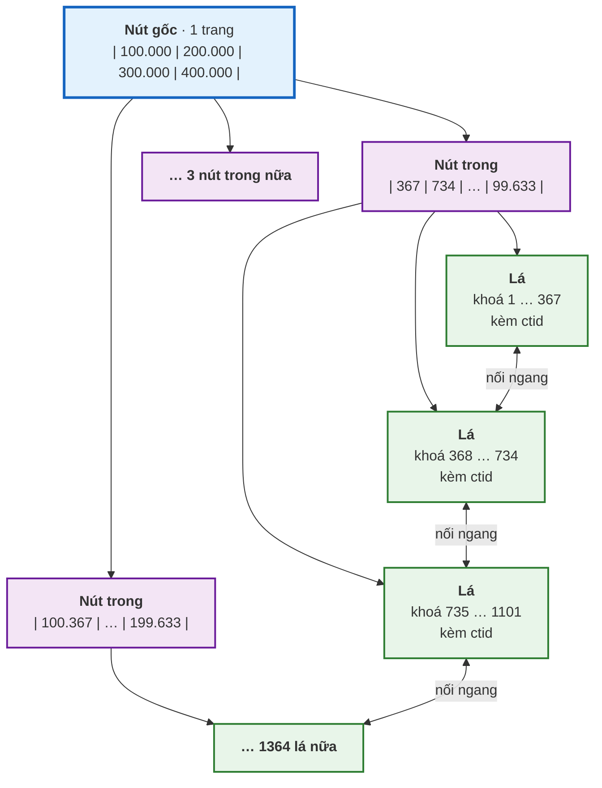
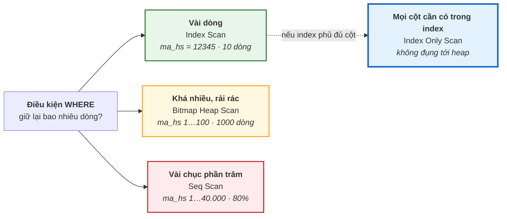

# Bài 34 — Index và B+Tree

!!! abstract "🎯 Học xong bài này, bạn sẽ"
    - Giải thích được vì sao cây **B+Tree** chỉ cần **3 tầng** cho 500.000 dòng — và 4 tầng cho vài tỉ dòng — bằng khái niệm **fan-out**
    - Đo được bằng `EXPLAIN ANALYZE` một truy vấn trước và sau khi tạo index, và đọc được đó là **Seq Scan**, **Index Scan**, **Bitmap Heap Scan** hay **Index Only Scan**
    - Dùng **tính chọn lọc** và **tính tương quan** để giải thích vì sao PostgreSQL đôi khi **cố ý không dùng** index của bạn
    - Thiết kế đúng **index phức hợp** theo **quy tắc cột trái nhất**, và biết lúc nào cần **index bộ phận**, **index biểu thức**, **index phủ**
    - Kể được ít nhất bốn tình huống mà index làm hệ thống **chậm đi** chứ không nhanh lên

## 🧠 Câu chuyện mở đầu

Cô giáo dạy Văn giao bài: *"Tra nghĩa từ **phương trình** trong cuốn *Từ điển tiếng Việt* dày 1000 trang."*

Không ai trong lớp mở trang 1 rồi đọc lần lượt tới khi gặp chữ "phương trình". Mọi người đều làm giống nhau: **mở đại khoảng giữa cuốn sách**. Thấy đang ở vần **M** — chữ **P** còn ở phía sau, vậy bỏ hẳn nửa đầu. Mở tiếp khoảng giữa của nửa sau, thấy vần **S** — lùi lại. Vài lần lật như vậy là tới trang có chữ "phương".

Đếm thử: mỗi lần lật loại được **một nửa** số trang còn lại. 1000 trang → 500 → 250 → 125 → … chỉ khoảng **10 lần lật** là xong. Đọc từ đầu thì trung bình phải qua **500 trang**.

Nhưng một bạn còn nhanh hơn nữa. Cuốn từ điển của bạn ấy có **các nấc chữ cái khoét ở mép sách**: đặt ngón tay vào nấc chữ **P** là mở ngay tới đầu vần P. Rồi đầu mỗi trang lại in sẵn *"phong – phương"*, liếc một cái là biết từ cần tìm có nằm trong trang này không. **Hai, ba bước** là tới nơi. Bí quyết: mỗi bước không chia đôi, mà chia thành **hai mươi mấy nhánh** cùng một lúc.

Rồi cô giao thêm: *"Chép mọi từ bắt đầu bằng **phương**."* Lần này không ai tra lại từ đầu cho từng từ. Tìm từ đầu tiên, rồi **cứ thế đọc tiếp sang trang bên cạnh** cho tới khi hết chữ "phương". Các trang từ điển vốn đã xếp đúng thứ tự và nằm liền nhau.

Ba mánh đó — **loại nhanh một phần lớn**, **chia nhiều nhánh mỗi bước**, và **đọc tiếp sang trang bên cạnh** — chính là toàn bộ bí mật của cấu trúc index mà mọi database quan hệ đều dùng.

## 📖 Khái niệm & thuật ngữ

### Không có index: đọc hết từng trang

[Bài 33](33-page-heap-tuple.md) cho bạn thấy `diem_lon` là một **heap** gồm 4167 trang, dòng xếp không theo thứ tự nào. Muốn tìm mười dòng điểm của học sinh số `12345`, PostgreSQL không có cách nào khác ngoài **đọc từ trang đầu tới trang cuối** và kiểm từng dòng. Kiểu đọc này gọi là **quét toàn bảng** (*sequential scan*) — trong `EXPLAIN` nó hiện ra là `Seq Scan`.

Quét toàn bảng **không phải lúc nào cũng tệ**. Nó đọc các trang **liền nhau**, theo đúng thứ tự trên đĩa, và ổ đĩa rất giỏi kiểu đọc đó. Nếu bạn cần một nửa số dòng của bảng, quét toàn bảng gần như chắc chắn là cách nhanh nhất. Nó chỉ tệ khi bạn cần **vài dòng** trong **hàng trăm nghìn dòng**.

### Index là gì

**Chỉ mục** (*index*) — [Bài 3](../cap-0-nhap-mon/03-dbms-la-gi.md) đã nhắc tên — là một cấu trúc **riêng biệt**, nằm trong tệp **riêng**, bên cạnh heap. Nó lưu các cặp:

```
(giá trị của cột được đánh index, ctid của dòng có giá trị đó)
```

và giữ các cặp này **luôn được sắp xếp** theo giá trị. Tìm được giá trị trong index là có ngay `ctid` — địa chỉ vật lý của Bài 33 — rồi đi thẳng tới đúng trang heap đó.

Hai điều hay bị quên:

- Index là **bản sao** của một phần dữ liệu. Nó **tốn chỗ**, và **mỗi lần** `INSERT`, `UPDATE`, `DELETE` trên bảng, PostgreSQL phải cập nhật **mọi** index của bảng đó.
- Index **không bao giờ đổi kết quả** của một câu truy vấn. Có hay không có index, `SELECT` vẫn trả đúng những dòng đó. Index chỉ đổi **cách** tìm ra chúng. (Ngoại lệ duy nhất là index `UNIQUE`, vốn là một ràng buộc chứ không chỉ để tăng tốc.)

### Từ cây nhị phân tới B-Tree

Mánh "mở giữa cuốn sách" là ý tưởng của **cây tìm kiếm nhị phân**: mỗi bước chia đôi. Với 500.000 khoá, cây nhị phân sâu khoảng **19 tầng**. Nếu mỗi tầng là một lần đọc đĩa thì 19 lần đọc cho một lần tìm — quá chậm.

Mánh "nấc chữ cái ở mép sách" sửa đúng chỗ đó: **mỗi bước chia thành rất nhiều nhánh**. Trong database, một bước chính là **một trang 8KB**, mà một trang chứa được **hàng trăm** khoá. Nên thay vì chia đôi, mỗi trang chia thành hàng trăm nhánh.

Cấu trúc này gọi là **cây B** (*B-Tree*). Ba tính chất định nghĩa nó:

1. **Mỗi nút là một trang**, chứa nhiều khoá đã sắp xếp.
2. **Cây luôn cân bằng**: mọi đường đi từ gốc xuống đáy đều dài **bằng nhau**. Khi một trang đầy, nó **tách đôi** và đẩy một khoá lên tầng trên; khi tầng trên cùng đầy, cây mọc thêm một tầng **ở phía trên**, không bao giờ mọc lệch một bên.
3. Tìm một khoá = đi từ trên xuống, mỗi tầng đọc **đúng một trang**.

### B+Tree — biến thể mà mọi database dùng

Các database thật dùng một biến thể: **cây B+** (*B+Tree*). Khác biệt nằm ở chỗ nào lưu `ctid`:

| | B-Tree cổ điển | **B+Tree** |
|---|---|---|
| Nút ở tầng giữa chứa gì | Khoá **và** `ctid` | **Chỉ khoá**, làm biển chỉ đường |
| `ctid` nằm ở đâu | Rải khắp các tầng | **Chỉ ở tầng dưới cùng** |
| Các nút tầng dưới cùng | Không nối nhau | **Nối nhau thành một chuỗi** theo thứ tự khoá |

Ba loại nút có tên riêng:

- **Nút gốc** (*root node*): trang duy nhất ở trên cùng — nơi mọi lần tìm bắt đầu.
- **Nút trong** (*internal node*): các trang ở giữa, chỉ chứa khoá và con trỏ xuống tầng dưới — đúng vai trò của **nấc chữ cái**.
- **Nút lá** (*leaf node*): các trang ở tầng dưới cùng, chứa **mọi** khoá cùng `ctid` của nó — đúng vai trò của **trang từ điển**.

Vì sao nối các nút lá thành chuỗi? Để **quét khoảng**. Câu `WHERE ma_diem BETWEEN 1000 AND 2000` chỉ cần đi từ gốc xuống **một lần** để tìm lá chứa `1000`, rồi **đi ngang** sang lá bên cạnh, lá bên cạnh nữa… cho tới khi gặp khoá lớn hơn `2000`. Không phải leo lên leo xuống cây cho từng khoá — đúng như việc chép mọi từ bắt đầu bằng "phương" bằng cách lật sang trang kế tiếp.

!!! note "PostgreSQL gọi nó là `btree`, nhưng nó là B+Tree"
    Khi bạn viết `CREATE INDEX`, mặc định PostgreSQL tạo index loại `btree`. Tên gọi là lịch sử; cấu trúc thật là một B+Tree — cụ thể là biến thể do Lehman và Yao đề xuất, trong đó **mỗi trang ở mọi tầng** còn có thêm con trỏ sang trang bên phải cùng tầng, để nhiều người đọc ghi cùng lúc mà không phải khoá cả cây. Tài liệu tiếng Việt và tiếng Anh dùng lẫn lộn "B-Tree" và "B+Tree" cho index của database; khi đọc, hiểu là B+Tree.

### Fan-out và độ sâu cây — vì sao 3 tầng là đủ

Số nhánh con của một nút trong gọi là **hệ số phân nhánh** (*fan-out*). Số tầng từ gốc tới lá gọi là **độ sâu cây** (*tree depth*).

Hai con số này quyết định mọi thứ. Phần thực hành sẽ đo trên index khoá chính của `diem_lon` và cho ra:

| Tầng | Loại nút | Số trang | Trung bình mỗi trang chứa |
|---|---|---|---|
| 1 | Gốc | 1 | 5 con trỏ xuống tầng 2 |
| 2 | Trong | 5 | 274 con trỏ xuống tầng 3 |
| 3 | Lá | 1367 | 367 khoá kèm `ctid` |

Fan-out ở đây là khoảng **274**. Ba tầng với fan-out đó chứa tối đa khoảng `274 × 274 × 367 ≈ 27,5 triệu` khoá. Thêm **một** tầng nữa là `× 274` — khoảng **7,5 tỉ** khoá.

Vậy nên:

!!! tip "Cây B+Tree gần như không bao giờ sâu quá 4 tầng"
    Với khoá nhỏ như số nguyên, **3 tầng** đủ cho vài chục triệu dòng và **4 tầng** đủ cho vài tỉ dòng. Tìm một dòng trong bảng 7 tỉ dòng chỉ tốn **4 lần đọc trang index + 1 lần đọc trang heap**. Và trang gốc cùng các trang tầng trong gần như luôn nằm sẵn trong bộ nhớ vì được dùng liên tục — nên trên thực tế chỉ còn 1–2 lần đọc đĩa thật.

    Đó là lý do index B+Tree là cấu trúc dữ liệu thành công nhất trong lịch sử database, và vẫn là loại index mặc định sau năm mươi năm.

### Bốn cách PostgreSQL đọc một bảng

Có index rồi, PostgreSQL có **bốn** cách để lấy dòng, và mỗi cách hiện ra trong `EXPLAIN` với tên riêng:

| Cách | Tên trong `EXPLAIN` | Làm gì | Thắng khi |
|---|---|---|---|
| **Quét toàn bảng** | `Seq Scan` | Đọc mọi trang heap theo thứ tự | Cần **nhiều** dòng, hoặc bảng nhỏ |
| **Quét theo index** (*index scan*) | `Index Scan` | Đi cây tới khoá, **với mỗi khoá** nhảy sang trang heap tương ứng | Cần **rất ít** dòng, hoặc các dòng nằm **liền nhau** trên heap |
| **Quét heap theo bitmap** (*bitmap heap scan*) | `Bitmap Index Scan` + `Bitmap Heap Scan` | Đi cây, **gom hết** `ctid` vào một tấm bản đồ bit theo số trang, **rồi** đọc mỗi trang heap đúng một lần, theo thứ tự trang | Cần **khá nhiều** dòng rải rác trên nhiều trang |
| **Quét chỉ index** (*index-only scan*) | `Index Only Scan` | Đi cây và lấy **luôn** giá trị từ index, **không đụng tới heap** | Mọi cột cần lấy đều nằm trong index, và trang heap đã được đánh dấu trong bản đồ hiển thị |

`Index Scan` và `Bitmap Heap Scan` khác nhau ở cách nhảy sang heap. `Index Scan` đọc heap **theo thứ tự khoá** — nếu mười khoá liên tiếp nằm ở mười trang khác nhau thì nhảy mười lần, có khi quay lại một trang đã đọc. `Bitmap Heap Scan` thì **gom trước, đọc sau**: nó biết cần những trang nào, sắp xếp chúng theo số trang, và đọc mỗi trang **một lần**, theo thứ tự trên đĩa.

`Index Only Scan` nhanh nhất, nhưng có một điều kiện ít ai biết: index **không** biết một dòng còn sống hay đã chết (thông tin đó nằm ở đầu tuple trên heap — Bài 33). Nên PostgreSQL chỉ dám bỏ qua heap với những trang đã được đánh dấu *"mọi tuple ở đây đều sống"* trong **bản đồ hiển thị**. Trang nào chưa được đánh dấu thì vẫn phải ghé heap — `EXPLAIN ANALYZE` ghi số lần ghé đó ở dòng `Heap Fetches`. Đây là lý do Bài 33 đã `VACUUM diem_lon`.

### Tính chọn lọc

Chọn cách nào là việc của **bộ tối ưu truy vấn** mà [Bài 4](../cap-0-nhap-mon/04-cac-mo-hinh-du-lieu.md) đã giới thiệu — Bài 36 sẽ mổ xẻ nó. Ở đây chỉ cần hai con số nó dùng nhiều nhất.

Con số thứ nhất là **tính chọn lọc** (*selectivity*): **tỉ lệ số dòng** mà điều kiện `WHERE` giữ lại.

- `ma_hs = 12345` giữ **10** dòng trên 500.000 — tỉ lệ **0,002%**. Điều kiện **chọn lọc mạnh**.
- `hoc_ky = 1` giữ **250.000** dòng — tỉ lệ **50%**. Điều kiện **chọn lọc kém**.

Chú ý cách nói: tỉ lệ càng **nhỏ** thì điều kiện càng **chọn lọc mạnh**. Quy tắc thô:

| Tỉ lệ dòng được giữ | Cách đọc thường thắng |
|---|---|
| Vài dòng | `Index Scan` |
| Từ vài phần nghìn tới vài phần trăm | `Bitmap Heap Scan` |
| Vài chục phần trăm trở lên | `Seq Scan` — index **vô dụng** |

Ngưỡng chính xác không cố định; nó phụ thuộc vào con số thứ hai.

### Tính tương quan

Con số thứ hai là **tính tương quan** (*correlation*): thứ tự của giá trị trong cột **khớp tới đâu** với thứ tự vật lý của dòng trên heap. PostgreSQL đo nó từ −1 tới 1 và lưu trong bảng hệ thống `pg_stats`.

- `ma_diem` là khoá tăng dần, dòng được thêm theo đúng thứ tự đó → tương quan **1**. Mười dòng có `ma_diem` liên tiếp nằm **chung một trang**.
- `ma_hs` lặp lại theo chu kỳ 50.000 → tương quan gần **0**. Mười dòng điểm của học sinh `12345` nằm ở **mười trang khác nhau**, cách xa nhau.

Với cùng số dòng cần lấy, cột tương quan cao cần đọc **ít trang heap hơn hẳn**. Vì chi phí thật tính bằng **số trang** (Bài 33), tính tương quan cao làm `Index Scan` rẻ đi rất nhiều — và tương quan thấp đẩy PostgreSQL về phía `Bitmap Heap Scan` hoặc `Seq Scan`.

### Index phức hợp và quy tắc cột trái nhất

Index có thể gồm nhiều cột: `CREATE INDEX ON diem_lon (ma_mon, ma_hs)`. Đó là một **index phức hợp** (*composite index*). Các mục trong nó được sắp **theo cột thứ nhất trước, rồi trong cùng một giá trị cột thứ nhất mới sắp theo cột thứ hai** — y như danh bạ điện thoại sắp theo **họ** trước rồi mới tới **tên**.

Hệ quả, gọi là **quy tắc cột trái nhất** (*leftmost prefix rule*):

> Index phức hợp `(a, b, c)` chỉ tìm nhanh được khi điều kiện có ràng buộc trên **một đoạn đầu liên tục** của danh sách cột: `a`; hoặc `a` và `b`; hoặc cả `a`, `b`, `c`.

Danh bạ sắp theo (họ, tên): tìm *"mọi người họ Nguyễn"* rất nhanh; tìm *"Nguyễn Văn An"* rất nhanh; nhưng tìm *"mọi người tên An"* thì phải **đọc cả cuốn**, vì những người tên An nằm rải rác trong mọi họ.

| Index `(ma_mon, ma_hs)` | Dùng được như một cái cây? |
|---|---|
| `WHERE ma_mon = 3` | **Có** — đoạn đầu là `ma_mon` |
| `WHERE ma_mon = 3 AND ma_hs = 12345` | **Có** — cả hai cột, nhanh nhất |
| `WHERE ma_hs = 12345` | **Không** — thiếu cột đầu `ma_mon` |
| `WHERE ma_hs = 12345 AND ma_mon = 3` | **Có** — thứ tự viết trong `WHERE` không quan trọng, chỉ cần đủ cột |

Quy tắc chọn thứ tự cột: cột **luôn có mặt** trong điều kiện đứng trước; trong số đó, cột dùng với **dấu bằng** đứng trước cột dùng với **khoảng** (`<`, `BETWEEN`).

### Index bộ phận, index biểu thức, index phủ

Ba biến thể giải quyết ba vấn đề khác nhau:

**Index bộ phận** (*partial index*) — index chỉ chứa **một phần** các dòng, khai bằng `WHERE` trong lệnh tạo:

```
CREATE INDEX ... ON diem_lon (ma_hs) WHERE diem_so < 4.5;
```

Dùng khi bạn **chỉ bao giờ tìm** trong một nhóm nhỏ — ví dụ các con điểm kém cần phụ đạo. Index nhỏ hơn nhiều lần, ghi rẻ hơn, và chỉ những dòng thoả điều kiện mới phải cập nhật nó. Đổi lại, PostgreSQL chỉ dùng nó khi **chứng minh được** điều kiện của câu truy vấn nằm gọn trong điều kiện của index.

**Index biểu thức** (*expression index*) — index trên **kết quả của một biểu thức**, không phải trên cột:

```
CREATE INDEX ... ON hoc_sinh_lon (lower(ho_ten));
```

Cần vì index trên `ho_ten` chứa **giá trị gốc** của `ho_ten`; nó **không** giúp gì cho `WHERE lower(ho_ten) = ...`. PostgreSQL chỉ dùng index biểu thức khi câu truy vấn viết **đúng y hệt** biểu thức đó. Biểu thức phải là hàm `IMMUTABLE` — đúng loại hàm [Bài 31](../cap-3-sql/31-trigger-procedure-function.md) đã dạy — vì giá trị trong index phải đứng yên mãi mãi.

**Index phủ** (*covering index*) — index chứa **đủ mọi cột** mà một câu truy vấn cần, để câu đó chạy được bằng `Index Only Scan`. PostgreSQL có cú pháp riêng `INCLUDE` để **đính thêm** cột vào lá mà không đưa nó vào khoá sắp xếp:

```
CREATE INDEX ... ON diem_lon (ma_hs) INCLUDE (diem_so);
```

`ma_hs` là khoá để tìm; `diem_so` chỉ được **chở theo** ở nút lá để khỏi phải ghé heap.

### Khi nào index làm hệ thống chậm đi

Index không miễn phí. Bốn trường hợp nó gây hại nhiều hơn lợi:

| Tình huống | Vì sao |
|---|---|
| **Bảng ghi nhiều, đọc ít** — nhật ký, dữ liệu cảm biến | Mỗi `INSERT` phải chèn vào **mọi** index. Phần thực hành đo được: 5 index làm `INSERT` chậm đi khoảng **6 lần** |
| **Bảng nhỏ** — vài trăm dòng, một hai trang | Quét toàn bảng chỉ đọc 1–2 trang; đi cây index thôi đã tốn chừng đó |
| **Cột chọn lọc kém** — giới tính, học kỳ, trạng thái có 2–3 giá trị | Điều kiện giữ lại hàng chục phần trăm số dòng; đọc qua index rồi nhảy sang gần như mọi trang heap không nhanh hơn quét thẳng |
| **Cột hay bị `UPDATE`** | Làm mất HOT update của Bài 33: mỗi lần sửa cột đó, **mọi** index của bảng đều phải thêm mục mới |

Và một cái giá luôn có: **dung lượng**. Không hiếm gặp bảng có tổng dung lượng index **lớn hơn** chính bảng.

### Bảng thuật ngữ

| Tiếng Việt | English | Nghĩa dễ hiểu |
|---|---|---|
| Quét toàn bảng | *sequential scan* | Đọc mọi trang heap theo thứ tự — `Seq Scan` |
| Cây B | *B-Tree* | Cây cân bằng, mỗi nút là một trang chứa nhiều khoá; mọi đường từ gốc xuống đáy dài bằng nhau |
| Cây B+ | *B+Tree* | Biến thể B-Tree chỉ lưu `ctid` ở tầng lá và nối các lá thành chuỗi; là index mặc định của PostgreSQL |
| Nút gốc | *root node* | Trang duy nhất trên cùng của cây, nơi mọi lần tìm bắt đầu |
| Nút trong | *internal node* | Trang ở tầng giữa, chỉ chứa khoá và con trỏ xuống tầng dưới |
| Nút lá | *leaf node* | Trang ở tầng dưới cùng, chứa mọi khoá kèm `ctid`, nối với lá bên cạnh |
| Hệ số phân nhánh | *fan-out* | Số nhánh con của một nút trong — vài trăm với khoá số nguyên |
| Độ sâu cây | *tree depth* | Số tầng từ gốc tới lá — 3 tầng cho vài chục triệu khoá, 4 tầng cho vài tỉ |
| Quét theo index | *index scan* | Đi cây rồi nhảy sang heap cho từng khoá — `Index Scan` |
| Quét heap theo bitmap | *bitmap heap scan* | Gom mọi `ctid` theo trang trước, rồi đọc mỗi trang heap đúng một lần — `Bitmap Heap Scan` |
| Quét chỉ index | *index-only scan* | Lấy dữ liệu thẳng từ index, không đụng heap — cần trang đã được đánh dấu trong bản đồ hiển thị |
| Tính chọn lọc | *selectivity* | Tỉ lệ dòng mà điều kiện giữ lại; tỉ lệ càng nhỏ, điều kiện càng chọn lọc mạnh |
| Tính tương quan | *correlation* | Thứ tự giá trị trong cột khớp tới đâu với thứ tự vật lý trên heap, từ −1 tới 1 |
| Index phức hợp | *composite index* | Index trên nhiều cột, sắp theo cột đầu trước rồi mới tới cột sau |
| Quy tắc cột trái nhất | *leftmost prefix rule* | Index phức hợp chỉ dùng được khi điều kiện chứa một đoạn đầu liên tục của danh sách cột |
| Index bộ phận | *partial index* | Index chỉ chứa những dòng thoả một điều kiện `WHERE` |
| Index biểu thức | *expression index* | Index trên kết quả của một biểu thức `IMMUTABLE`, dùng khi truy vấn viết đúng biểu thức đó |
| Khử trùng lặp | *deduplication* | Index B-Tree ghi một khoá lặp lại nhiều lần đúng một lần kèm danh sách `ctid`, nên index trên cột nhiều giá trị trùng gọn hơn tỉ lệ |
| Index phủ | *covering index* | Index chứa đủ mọi cột truy vấn cần, thường nhờ `INCLUDE`, để chạy được `Index Only Scan` |

## 🖼️ Sơ đồ

Một cây B+Tree ba tầng. Mỗi ô là **một trang 8KB**; trong thực tế mỗi nút trong có vài trăm nhánh con, ở đây chỉ vẽ vài nhánh:



Các khoá ghi trong sơ đồ là **xấp xỉ**, suy ra từ số đo thật ở phần thực hành — gốc có 5 nhánh, mỗi lá giữ khoảng 367 khoá — chứ không phải ranh giới chính xác của từng trang.

Hai đường đi trên cùng một cây:

- **Tìm một khoá**, ví dụ `ma_diem = 500`: gốc → nút trong đầu tiên → lá thứ hai. **Ba trang**, luôn luôn ba trang, dù khoá nằm ở đâu.
- **Quét khoảng** `ma_diem BETWEEN 300 AND 800`: đi xuống **một lần** tới lá chứa `300`, rồi **đi ngang** theo các mũi tên "nối ngang" sang lá thứ hai, lá thứ ba, và dừng khi gặp khoá lớn hơn `800`. Không phải quay lại gốc. **Chính các mũi tên ngang này** làm cho `BETWEEN`, `<`, `>`, `ORDER BY` và `LIMIT` trên cột có index trở nên rẻ: dữ liệu ở tầng lá vốn đã nằm sẵn theo thứ tự.

PostgreSQL chọn cách đọc theo tỉ lệ dòng mà điều kiện giữ lại:



(Với `ma_hs = 12345`, phần thực hành sẽ cho thấy PostgreSQL chọn `Bitmap Heap Scan` chứ không phải `Index Scan` — vì mười dòng đó nằm ở mười trang khác nhau. Đó là tính tương quan lên tiếng.)

## 💻 Thực hành

### Công cụ: đọc kế hoạch thực thi trong một truy vấn

`EXPLAIN` — lệnh cho biết PostgreSQL **định** chạy câu truy vấn thế nào — là chủ đề của Bài 36. Bài này chỉ cần đọc được **tên cách quét** trong kết quả của nó. Có một khó khăn nhỏ: `EXPLAIN` không dùng được bên trong một truy vấn khác, nên khóa học bọc nó vào một hàm trả về kế hoạch dưới dạng một chuỗi văn bản. Nhờ vậy ta khẳng định được điều kiểu *"kế hoạch này có chứa `Seq Scan`"*.

```sql
DROP FUNCTION IF EXISTS b34_ke_hoach(text);

CREATE FUNCTION b34_ke_hoach(cau_truy_van text) RETURNS text
LANGUAGE plpgsql AS $$
DECLARE
    dong    text;
    ket_qua text := '';
BEGIN
    FOR dong IN EXECUTE 'EXPLAIN ' || cau_truy_van LOOP
        ket_qua := ket_qua || dong || E'\n';
    END LOOP;
    RETURN ket_qua;
END $$;

-- KỲ VỌNG: co_dong_ke_hoach = true
SELECT length(b34_ke_hoach('SELECT * FROM diem_lon')) > 0 AS co_dong_ke_hoach;
```

Bạn không cần tự viết được hàm này. Trong `psql` của mình, cứ gõ thẳng `EXPLAIN SELECT ...` để đọc kế hoạch.

### Đo trước: không có index

Nếu bạn làm bài này mà chưa qua Bài 33, chạy lại lệnh `VACUUM` của bài đó để bản đồ hiển thị của `diem_lon` được điền đủ. Chạy thêm lần nữa cũng vô hại:

```sql
VACUUM diem_lon;
```

Tìm mười con điểm của học sinh số `12345`:

```sql
-- KỲ VỌNG: 10 dòng
SELECT * FROM diem_lon WHERE ma_hs = 12345 ORDER BY ma_diem;
```

Mười dòng. Giờ hỏi PostgreSQL xem nó đã làm cách nào — lần này thêm `ANALYZE` để nó **chạy thật** và đo, và `BUFFERS` để nó đếm số trang đã đọc:

<!-- sql:khong-chay -->
```sql
EXPLAIN (ANALYZE, BUFFERS)
SELECT * FROM diem_lon WHERE ma_hs = 12345;
```

Kết quả đo trên một máy thật (con số **thời gian** trên máy bạn sẽ khác, tuỳ ổ đĩa và CPU; **số trang** thì sẽ giống):

```text
 Gather  (cost=1000.00..7772.17 rows=10 width=35) (actual time=2.420..24.988 rows=10 loops=1)
   Workers Planned: 2
   Workers Launched: 2
   Buffers: shared read=4167
   ->  Parallel Seq Scan on diem_lon  (cost=0.00..6771.17 rows=4 width=35) (actual time=2.200..17.447 rows=3 loops=3)
         Filter: (ma_hs = 12345)
         Rows Removed by Filter: 166663
         Buffers: shared read=4167
 Planning Time: 0.863 ms
 Execution Time: 25.127 ms
```

Khối lệnh trên được đánh dấu **không chạy tự động** vì thời gian đo luôn khác nhau giữa các lần chạy. Ba điều cần đọc được, và Bài 36 sẽ giải thích đầy đủ:

- **`Parallel Seq Scan`**: quét toàn bảng. PostgreSQL chia việc cho 2 tiến trình phụ cộng tiến trình chính — tổng cộng 3, nên dòng `loops=3`.
- **`Buffers: shared read=4167`**: đã đọc **cả 4167 trang** của bảng, đúng con số Bài 33 đếm được — để lấy ra 10 dòng.
- **`Rows Removed by Filter: 166663`**: mỗi tiến trình vứt đi khoảng 166.663 dòng không khớp. Ba tiến trình vứt tổng cộng 499.990 dòng.
- **`Execution Time: 25.127 ms`**: khoảng 25 mili giây.

Khẳng định lại bằng công cụ của khóa học:

```sql
-- KỲ VỌNG: quet_toan_bang = true
SELECT b34_ke_hoach('SELECT * FROM diem_lon WHERE ma_hs = 12345')
       LIKE '%Seq Scan on diem_lon%' AS quet_toan_bang;
```

### Tạo index và đo lại

```sql
DROP INDEX IF EXISTS b34_idx_ma_hs;
CREATE INDEX b34_idx_ma_hs ON diem_lon (ma_hs);

-- KỲ VỌNG: dung_index = true
-- KỲ VỌNG: con_quet_toan_bang = false
SELECT b34_ke_hoach('SELECT * FROM diem_lon WHERE ma_hs = 12345')
       LIKE '%b34_idx_ma_hs%'      AS dung_index,
       b34_ke_hoach('SELECT * FROM diem_lon WHERE ma_hs = 12345')
       LIKE '%Seq Scan%'           AS con_quet_toan_bang;
```

Tạo index trên 500.000 dòng mất chưa tới một phần năm giây trên máy đo. Chạy lại cùng lệnh `EXPLAIN (ANALYZE, BUFFERS)`:

```text
 Bitmap Heap Scan on diem_lon  (cost=4.50..43.16 rows=10 width=35) (actual time=0.014..0.023 rows=10 loops=1)
   Recheck Cond: (ma_hs = 12345)
   Heap Blocks: exact=10
   Buffers: shared hit=13
   ->  Bitmap Index Scan on b34_idx_ma_hs  (cost=0.00..4.50 rows=10 width=0) (actual time=0.009..0.009 rows=10 loops=1)
         Index Cond: (ma_hs = 12345)
         Buffers: shared hit=3
 Planning Time: 0.054 ms
 Execution Time: 0.038 ms
```

| | Không index | Có index |
|---|---|---|
| Cách quét | `Parallel Seq Scan` | `Bitmap Index Scan` → `Bitmap Heap Scan` |
| Số trang đọc | **4167** | **13** = 3 trang index + 10 trang heap |
| Thời gian thực thi (máy đo) | khoảng **25 ms** | khoảng **0,04 ms** |

Nhanh hơn **vài trăm lần**. Thời gian trên máy bạn sẽ khác, nhưng **số trang** thì không: 3 trang index là **ba tầng** của cây — gốc, trong, lá — và 10 trang heap là **mười** trang chứa mười con điểm. Tỉ lệ `4167 / 13` mới là thứ quyết định, và nó không phụ thuộc vào máy.

Dòng `Heap Blocks: exact=10` cho biết mười dòng nằm ở **mười trang khác nhau**. Kiểm lại:

```sql
-- KỲ VỌNG: so_dong = 10
-- KỲ VỌNG: so_trang_heap = 10
SELECT count(*)                                AS so_dong,
       count(DISTINCT (ctid::text::point)[0])   AS so_trang_heap
FROM diem_lon
WHERE ma_hs = 12345;
```

Mười dòng, mười trang. Đây là lý do PostgreSQL chọn `Bitmap Heap Scan` thay vì `Index Scan`: mười lần nhảy tới mười trang rải rác, gom lại rồi đọc theo thứ tự trang thì rẻ hơn một chút.

### Đo độ sâu cây

Extension `pageinspect` của Bài 33 đọc được cả trang index. Hàm `bt_metap` đọc **trang siêu dữ liệu** của một index B-Tree, trong đó trường `level` là **số tầng phía trên tầng lá**:

```sql
CREATE EXTENSION IF NOT EXISTS pageinspect;

-- KỲ VỌNG: tang_tren_la = 2
-- KỲ VỌNG: do_sau = 3
SELECT level     AS tang_tren_la,
       level + 1 AS do_sau
FROM bt_metap('b34_idx_ma_hs');
```

Index vừa tạo trên 500.000 dòng sâu **3 tầng**. Đếm từng loại trang trong index khoá chính:

```sql
-- KỲ VỌNG: 3 dòng
-- KỲ VỌNG: loai_trang = i
-- KỲ VỌNG: so_trang = 5
-- KỲ VỌNG: so_muc_trung_binh = 274
SELECT s.type                   AS loai_trang,
       count(*)                 AS so_trang,
       round(avg(s.live_items)) AS so_muc_trung_binh
FROM generate_series(1, (pg_relation_size('diem_lon_pkey') / 8192 - 1)::int) AS b,
     LATERAL bt_page_stats('diem_lon_pkey', b) AS s
GROUP BY s.type
ORDER BY s.type;
```

Trang số 0 là trang siêu dữ liệu nên được bỏ qua. Kết quả đầy đủ:

| `loai_trang` | Nghĩa | `so_trang` | `so_muc_trung_binh` |
|---|---|---|---|
| `i` | Nút trong | 5 | 274 |
| `l` | Nút lá | 1367 | 367 |
| `r` | Nút gốc | 1 | 5 |

Đúng bảng ở phần khái niệm: **1 gốc** trỏ tới **5 nút trong**, mỗi nút trong trỏ tới khoảng **274** lá, mỗi lá giữ khoảng **367** khoá. Fan-out 274 — chứ không phải 2 như cây nhị phân — là lý do 500.000 khoá chỉ cần ba tầng.

??? note "Cách khoá học tự kiểm hai dòng còn lại của bảng — bạn không cần viết được câu lệnh này"
    ```sql
    -- KỲ VỌNG: day_loai = i|l|r
    -- KỲ VỌNG: day_so_trang = 5|1367|1
    -- KỲ VỌNG: day_so_muc = 274|367|5
    SELECT string_agg(loai_trang, '|' ORDER BY loai_trang)              AS day_loai,
           string_agg(so_trang::text, '|' ORDER BY loai_trang)          AS day_so_trang,
           string_agg(so_muc_trung_binh::text, '|' ORDER BY loai_trang) AS day_so_muc
    FROM (
        SELECT s.type::text AS loai_trang,
               count(*) AS so_trang,
               round(avg(s.live_items)) AS so_muc_trung_binh
        FROM generate_series(1, (pg_relation_size('diem_lon_pkey') / 8192 - 1)::int) AS b,
             LATERAL bt_page_stats('diem_lon_pkey', b) AS s
        GROUP BY s.type
    ) AS t;
    ```

### `Index Scan` — khi các dòng nằm liền nhau

Khoá chính `ma_diem` có tương quan hoàn hảo với thứ tự vật lý:

```sql
-- KỲ VỌNG: 7 dòng
-- KỲ VỌNG: attname = diem_so
SELECT attname, round(correlation::numeric, 2) AS tuong_quan
FROM pg_stats
WHERE tablename = 'diem_lon'
ORDER BY attname;
```

Bảy dòng cho bảy cột. `ma_diem` có tương quan **1.00**; `ma_hs` chỉ khoảng **0,1**; `ngay_nhap` và `diem_so` gần **0**. (Các con số khác 1 được ước lượng từ một **mẫu ngẫu nhiên** các dòng, nên chữ số thập phân cuối có thể lệch chút ít trên máy bạn — Bài 36 sẽ nói về mẫu này.)

```sql
-- KỲ VỌNG: tuong_quan_ma_diem = 1
-- KỲ VỌNG: ma_hs_gan_nhu_ngau_nhien = true
SELECT (SELECT correlation FROM pg_stats
        WHERE tablename = 'diem_lon' AND attname = 'ma_diem')           AS tuong_quan_ma_diem,
       (SELECT abs(correlation) < 0.3 FROM pg_stats
        WHERE tablename = 'diem_lon' AND attname = 'ma_hs')             AS ma_hs_gan_nhu_ngau_nhien;
```

Tìm một khoá chính, và một khoảng khoá chính:

```sql
-- KỲ VỌNG: mot_khoa = true
-- KỲ VỌNG: mot_khoang = true
SELECT b34_ke_hoach('SELECT * FROM diem_lon WHERE ma_diem = 12345')
       LIKE '%Index Scan using diem_lon_pkey%' AS mot_khoa,
       b34_ke_hoach('SELECT * FROM diem_lon WHERE ma_diem BETWEEN 1000 AND 2000')
       LIKE '%Index Scan using diem_lon_pkey%' AS mot_khoang;
```

Cả hai đều là **`Index Scan`** thật sự. Vì sao? Đếm xem một khoảng 1000 khoá chính nằm trên bao nhiêu trang heap:

```sql
-- KỲ VỌNG: so_dong = 1000
-- KỲ VỌNG: so_trang_heap = 9
SELECT count(*)                               AS so_dong,
       count(DISTINCT (ctid::text::point)[0])  AS so_trang_heap
FROM diem_lon
WHERE ma_diem BETWEEN 1 AND 1000;
```

Một nghìn dòng trên **9** trang — 120 dòng một trang, liền nhau. `Index Scan` đi xuống cây một lần, đi ngang theo các lá, và nhảy sang heap nhưng gần như luôn nhảy vào **đúng trang vừa đọc**.

### Tính chọn lọc quyết định cách quét

Cùng một cột `ma_hs`, cùng một index, chỉ đổi độ rộng của khoảng:

```sql
-- KỲ VỌNG: hep_dung_bitmap = true
-- KỲ VỌNG: rong_quet_toan_bang = true
SELECT b34_ke_hoach('SELECT * FROM diem_lon WHERE ma_hs BETWEEN 1 AND 100')
       LIKE '%Bitmap Heap Scan%'   AS hep_dung_bitmap,
       b34_ke_hoach('SELECT * FROM diem_lon WHERE ma_hs BETWEEN 1 AND 40000')
       LIKE '%Seq Scan%'           AS rong_quet_toan_bang;
```

```sql
-- KỲ VỌNG: dong_khoang_hep = 1000
-- KỲ VỌNG: dong_khoang_rong = 400000
SELECT count(*) FILTER (WHERE ma_hs BETWEEN 1 AND 100)   AS dong_khoang_hep,
       count(*) FILTER (WHERE ma_hs BETWEEN 1 AND 40000) AS dong_khoang_rong
FROM diem_lon;
```

- Khoảng hẹp giữ **1000** dòng (0,2%) → `Bitmap Heap Scan`.
- Khoảng rộng giữ **400.000** dòng (80%) → `Seq Scan`, **dù index vẫn nằm đó**.

PostgreSQL không "quên" index. Nó tính ra rằng đọc 400.000 mục index rồi nhảy sang heap sẽ đắt hơn đọc thẳng 4167 trang — và nó đúng.

!!! note "Ở giữa hai cực là vùng \"hoà\""
    Bạn có thể thắc mắc: với khoảng `1…25000` — đúng **50%** số dòng — thì sao? Khi soạn bài, khoá học đã thử và thấy PostgreSQL chọn **lúc thì** `Seq Scan`, **lúc thì** `Bitmap Heap Scan`, tuỳ lần nạp dữ liệu. Lý do: chi phí ước lượng của hai cách chỉ chênh nhau khoảng **1%**, và các con số thống kê mà PostgreSQL dựa vào được tính từ một **mẫu ngẫu nhiên** các dòng — mỗi lần lấy mẫu lệch đi một chút là đủ lật kết quả. Ở vùng hoà này, cách nào cũng nhanh ngang nhau, nên chọn sai cũng không thiệt bao nhiêu. Bài 36 sẽ cho bạn đọc tận mắt hai con số chi phí đó.

    Đây cũng là lý do khoá học **không** khẳng định kế hoạch ở vùng hoà: một khẳng định lúc đúng lúc sai là một khẳng định vô giá trị.

### `Index Only Scan`

Nếu câu truy vấn chỉ cần cột `ma_hs`, mà cột đó đã nằm sẵn trong index:

```sql
-- KỲ VỌNG: chi_doc_index = true
SELECT b34_ke_hoach('SELECT ma_hs FROM diem_lon WHERE ma_hs = 12345')
       LIKE '%Index Only Scan using b34_idx_ma_hs%' AS chi_doc_index;
```

Đo thật trên máy đo:

```text
 Index Only Scan using b34_idx_ma_hs on diem_lon  (cost=0.42..4.60 rows=10 width=4) (actual time=0.030..0.033 rows=10 loops=1)
   Index Cond: (ma_hs = 12345)
   Heap Fetches: 0
   Buffers: shared hit=4
```

`Heap Fetches: 0` — **không ghé heap lần nào**. Chỉ **4** trang, tất cả là trang index. Nếu `diem_lon` chưa được `VACUUM`, bản đồ hiển thị còn trống, và dòng `Heap Fetches` sẽ lớn hơn 0 — tối đa là 10, mỗi dòng một lần ghé heap. Tên nút vẫn là `Index Only Scan`, nhưng thực chất đã phải đọc heap như một `Index Scan`.

### Index phức hợp và quy tắc cột trái nhất

Bỏ index một cột, tạo index hai cột với `ma_mon` đứng trước:

```sql
DROP INDEX IF EXISTS b34_idx_ma_hs;
DROP INDEX IF EXISTS b34_idx_mon_hs;
CREATE INDEX b34_idx_mon_hs ON diem_lon (ma_mon, ma_hs);

-- KỲ VỌNG: du_hai_cot = true
-- KỲ VỌNG: thieu_cot_dau = true
SELECT b34_ke_hoach('SELECT * FROM diem_lon WHERE ma_mon = 3 AND ma_hs = 12345')
       LIKE '%Index Scan using b34_idx_mon_hs%'  AS du_hai_cot,
       b34_ke_hoach('SELECT * FROM diem_lon WHERE ma_hs = 12345')
       LIKE '%Seq Scan%'                          AS thieu_cot_dau;
```

- `ma_mon = 3 AND ma_hs = 12345` → `Index Scan` trên `b34_idx_mon_hs`: có đủ hai cột, đi thẳng tới đúng **một** dòng.
- `ma_hs = 12345` một mình → **quay về `Seq Scan`**. Những dòng có `ma_hs = 12345` nằm rải rác trong **chín** vùng khác nhau của index — một vùng cho mỗi môn — giống người tên An nằm rải rác trong mọi họ.

```sql
-- KỲ VỌNG: so_dong = 1
SELECT count(*) AS so_dong FROM diem_lon WHERE ma_mon = 3 AND ma_hs = 12345;
```

Đảo thứ tự cột thì kết quả đảo theo:

```sql
DROP INDEX IF EXISTS b34_idx_mon_hs;
DROP INDEX IF EXISTS b34_idx_hs_mon;
CREATE INDEX b34_idx_hs_mon ON diem_lon (ma_hs, ma_mon);

-- KỲ VỌNG: chi_co_ma_hs = true
SELECT b34_ke_hoach('SELECT * FROM diem_lon WHERE ma_hs = 12345')
       LIKE '%b34_idx_hs_mon%' AS chi_co_ma_hs;
```

Giờ `ma_hs` đứng đầu, nên điều kiện chỉ có `ma_hs` **dùng được** index. Cùng hai cột, chỉ khác thứ tự, mà một bên dùng được và một bên không.

### Index bộ phận

Thầy chủ nhiệm hay tra *"những con điểm dưới 4,5 của học sinh X"* để xếp lịch phụ đạo. Điểm dưới 4,5 chỉ chiếm chưa tới một phần mười bảng:

```sql
-- KỲ VỌNG: diem_kem = 41596
SELECT count(*) AS diem_kem FROM diem_lon WHERE diem_so < 4.5;
```

Tạo một index **chỉ** cho những dòng đó, và để so sánh, một index đầy đủ:

```sql
DROP INDEX IF EXISTS b34_idx_hs_mon;
DROP INDEX IF EXISTS b34_idx_diem_kem;
DROP INDEX IF EXISTS b34_idx_ma_hs;
CREATE INDEX b34_idx_diem_kem ON diem_lon (ma_hs) WHERE diem_so < 4.5;
CREATE INDEX b34_idx_ma_hs    ON diem_lon (ma_hs);

-- KỲ VỌNG: nho_hon_4_lan = true
SELECT pg_size_pretty(pg_relation_size('b34_idx_diem_kem')) AS index_bo_phan,
       pg_size_pretty(pg_relation_size('b34_idx_ma_hs'))    AS index_day_du,
       pg_relation_size('b34_idx_diem_kem') * 4
           < pg_relation_size('b34_idx_ma_hs')              AS nho_hon_4_lan;
```

Trên máy đo, index bộ phận nặng **928 kB**, index đầy đủ nặng **4640 kB** — gọn hơn **năm lần**. Bỏ index đầy đủ đi và xem khi nào PostgreSQL dùng index bộ phận:

```sql
DROP INDEX IF EXISTS b34_idx_ma_hs;

-- KỲ VỌNG: dung_dieu_kien = true
-- KỲ VỌNG: dieu_kien_rong_hon = false
SELECT b34_ke_hoach('SELECT * FROM diem_lon WHERE ma_hs = 12345 AND diem_so < 4.5')
       LIKE '%b34_idx_diem_kem%' AS dung_dieu_kien,
       b34_ke_hoach('SELECT * FROM diem_lon WHERE ma_hs = 12345 AND diem_so < 5')
       LIKE '%b34_idx_diem_kem%' AS dieu_kien_rong_hon;
```

- `diem_so < 4.5` → **dùng** index bộ phận: điều kiện truy vấn trùng khớp điều kiện index.
- `diem_so < 5` → **không dùng**: một con điểm 4,7 thoả `< 5` nhưng **không** có trong index. PostgreSQL không chứng minh được "mọi dòng cần tìm đều nằm trong index", nên nó không được phép dùng.

### Index phủ với `INCLUDE`

```sql
DROP INDEX IF EXISTS b34_idx_diem_kem;
DROP INDEX IF EXISTS b34_idx_phu;
CREATE INDEX b34_idx_phu ON diem_lon (ma_hs) INCLUDE (diem_so);

-- KỲ VỌNG: phu_du_cot = true
-- KỲ VỌNG: thieu_mot_cot = false
SELECT b34_ke_hoach('SELECT ma_hs, diem_so FROM diem_lon WHERE ma_hs = 12345')
       LIKE '%Index Only Scan%' AS phu_du_cot,
       b34_ke_hoach('SELECT ma_hs, diem_so, ma_mon FROM diem_lon WHERE ma_hs = 12345')
       LIKE '%Index Only Scan%' AS thieu_mot_cot;
```

Hỏi `ma_hs` và `diem_so` → `Index Only Scan`, vì cả hai đều nằm ở lá của `b34_idx_phu`. Hỏi thêm `ma_mon` → mất `Index Only Scan`, vì `ma_mon` chỉ có trên heap. Index phủ được thiết kế **cho một câu truy vấn cụ thể**; thêm một cột vào `SELECT` là nó hết phủ.

### Index biểu thức

Tìm học sinh theo tên, không phân biệt chữ hoa chữ thường. Tạo trước một index thường trên `ho_ten`:

```sql
DROP INDEX IF EXISTS b34_idx_phu;
DROP INDEX IF EXISTS b34_idx_ten;
DROP INDEX IF EXISTS b34_idx_ten_thuong;
CREATE INDEX b34_idx_ten ON hoc_sinh_lon (ho_ten);

-- KỲ VỌNG: dung_index_thuong = false
-- KỲ VỌNG: go_dung_ten = true
SELECT b34_ke_hoach($$SELECT * FROM hoc_sinh_lon WHERE lower(ho_ten) = 'học sinh số 4242'$$)
       LIKE '%b34_idx_ten%' AS dung_index_thuong,
       b34_ke_hoach($$SELECT * FROM hoc_sinh_lon WHERE ho_ten = 'Học sinh số 4242'$$)
       LIKE '%b34_idx_ten%' AS go_dung_ten;
```

(Chuỗi `$$ ... $$` là cách viết chuỗi của PostgreSQL để khỏi phải nhân đôi dấu nháy đơn bên trong — bạn đã gặp nó trong thân hàm ở [Bài 31](../cap-3-sql/31-trigger-procedure-function.md).)

Gõ đúng `'Học sinh số 4242'` thì index được dùng. Bọc cột trong `lower(...)` thì **không**: index lưu `'Học sinh số 4242'`, không lưu `'học sinh số 4242'`. Tạo index biểu thức:

```sql
CREATE INDEX b34_idx_ten_thuong ON hoc_sinh_lon (lower(ho_ten));
ANALYZE hoc_sinh_lon;

-- KỲ VỌNG: dung_index_bieu_thuc = true
SELECT b34_ke_hoach($$SELECT * FROM hoc_sinh_lon WHERE lower(ho_ten) = 'học sinh số 4242'$$)
       LIKE '%b34_idx_ten_thuong%' AS dung_index_bieu_thuc;
```

Lệnh `ANALYZE` ngay sau đó thu thập thống kê cho **chính biểu thức** `lower(ho_ten)` — thứ mà thống kê của cột `ho_ten` không có sẵn. Thiếu nó, PostgreSQL vẫn dùng được index nhưng ước lượng số dòng sai, chuyện của Bài 36.

```sql
-- KỲ VỌNG: ma_hs = 4242
SELECT ma_hs FROM hoc_sinh_lon WHERE lower(ho_ten) = 'học sinh số 4242';
```

### Bảng nhỏ: index bị bỏ qua là đúng

```sql
DROP TABLE IF EXISTS b34_lop CASCADE;
CREATE TABLE b34_lop AS SELECT * FROM lop;
ALTER TABLE b34_lop ADD PRIMARY KEY (ma_lop);
ANALYZE b34_lop;

-- KỲ VỌNG: bo_qua_index = true
SELECT b34_ke_hoach($$SELECT * FROM b34_lop WHERE ma_lop = 'L03'$$)
       LIKE '%Seq Scan on b34_lop%' AS bo_qua_index;
```

Sáu lớp nằm trong **một** trang. Quét toàn bảng đọc đúng một trang; đi qua index phải đọc ít nhất một trang index **rồi** mới tới trang heap đó. PostgreSQL chọn quét toàn bảng, dù có khoá chính — và nó đúng.

### Cái giá khi ghi

Khối lệnh dưới đây chép 200.000 dòng vào hai bảng giống nhau, một bảng không index nào, một bảng có 5 index. Nó **không chạy tự động** vì chỉ có giá trị khi đo thời gian:

<!-- sql:khong-chay -->
```sql
\timing on
CREATE TABLE b34_ghi_0 (LIKE diem_lon);
CREATE TABLE b34_ghi_5 (LIKE diem_lon INCLUDING INDEXES);   -- kéo theo khoá chính
CREATE INDEX ON b34_ghi_5 (ma_hs);
CREATE INDEX ON b34_ghi_5 (ma_mon, hoc_ky);
CREATE INDEX ON b34_ghi_5 (diem_so);
CREATE INDEX ON b34_ghi_5 (ngay_nhap);

INSERT INTO b34_ghi_0 SELECT * FROM diem_lon WHERE ma_diem <= 200000;
INSERT INTO b34_ghi_5 SELECT * FROM diem_lon WHERE ma_diem <= 200000;

SELECT pg_size_pretty(pg_relation_size('b34_ghi_5'))  AS bang,
       pg_size_pretty(pg_indexes_size('b34_ghi_5'))   AS tong_index;
DROP TABLE b34_ghi_0, b34_ghi_5;
```

Số đo trên máy đo (máy bạn sẽ khác):

```text
INSERT 0 200000
Time: 164.907 ms          <- b34_ghi_0, không index
INSERT 0 200000
Time: 1046.954 ms         <- b34_ghi_5, 5 index

 bang  | tong_index
-------+------------
 13 MB | 15 MB
```

Cùng 200.000 dòng, ghi vào bảng có 5 index chậm hơn khoảng **6 lần**, và tổng dung lượng 5 index (15 MB) **lớn hơn** chính bảng (13 MB). Mỗi index là một cam kết: đọc nhanh hơn ở một kiểu truy vấn, đổi lấy ghi chậm hơn ở **mọi** câu `INSERT`, `UPDATE`, `DELETE`.

## ⚠️ Lỗi thường gặp

!!! danger "Lỗi 1: Làm phép tính trên cột có index trong `WHERE`"
    ```sql
    -- KỲ VỌNG: viet_sai = true
    -- KỲ VỌNG: viet_dung = true
    SELECT b34_ke_hoach('SELECT * FROM diem_lon WHERE ma_diem + 1 = 12346')
           LIKE '%Seq Scan%'                         AS viet_sai,
           b34_ke_hoach('SELECT * FROM diem_lon WHERE ma_diem = 12346 - 1')
           LIKE '%Index Scan using diem_lon_pkey%'   AS viet_dung;
    ```

    Hai câu tìm **cùng một dòng**. Câu thứ nhất quét toàn bảng 4167 trang; câu thứ hai đi cây 3 tầng.

    Index lưu giá trị của `ma_diem`, không lưu giá trị của `ma_diem + 1`. Khi cột bị bọc trong một phép tính hay một hàm — `ma_diem + 1`, `lower(ho_ten)`, `extract(year FROM ngay_nhap)`, `ngay_nhap::text` — PostgreSQL không dùng được index trên cột đó nữa.

    Sửa: **chuyển phép tính sang vế bên kia**, để cột đứng một mình. Nếu không chuyển được (như `lower(ho_ten)`), tạo **index biểu thức** cho đúng biểu thức đó. Với ngày tháng, viết khoảng thay vì trích năm: `ngay_nhap >= '2025-01-01' AND ngay_nhap < '2026-01-01'` thay cho `extract(year FROM ngay_nhap) = 2025`.

!!! danger "Lỗi 2: Sai thứ tự cột trong index phức hợp"
    Một bạn tạo `CREATE INDEX ON diem_lon (ma_mon, ma_hs)` vì *"môn học quan trọng hơn"*, trong khi màn hình hay dùng nhất của phần mềm là *"xem mọi điểm của một học sinh"* — chỉ lọc theo `ma_hs`. Phần thực hành đã cho thấy: index đó **không** giúp câu truy vấn này, nó vẫn quét toàn bảng.

    Sửa: thứ tự cột **do câu truy vấn quyết định**, không do tầm quan trọng của cột. Cột có mặt trong **nhiều** câu truy vấn nhất, dùng với **dấu bằng**, đứng đầu. Và trước khi tạo index `(ma_hs, ma_mon)`, kiểm xem đã có index `(ma_hs)` chưa — index phức hợp bắt đầu bằng `ma_hs` đã **bao** luôn mọi việc của index một cột `ma_hs`, nên giữ cả hai là thừa.

!!! warning "Lỗi 3: Đánh index cho mọi cột \"cho chắc\""
    Mỗi index làm **mọi** câu ghi chậm đi và chiếm thêm dung lượng — phần thực hành đo được 5 index làm `INSERT` chậm khoảng 6 lần và nặng hơn cả bảng. Tệ hơn, index trên cột hay bị `UPDATE` làm mất HOT update của Bài 33.

    Sửa: chỉ tạo index cho những câu truy vấn **có thật**, **chạy thường xuyên**, và **đã đo** là chậm. PostgreSQL có sẵn bảng `pg_stat_user_indexes` với cột `idx_scan` đếm số lần mỗi index được dùng; một index có `idx_scan = 0` sau nhiều tuần chạy thật là ứng viên để xoá.

!!! warning "Lỗi 4: Nghĩ rằng PostgreSQL \"quên\" dùng index"
    Bạn tạo index trên `ma_hs`, chạy `WHERE ma_hs BETWEEN 1 AND 40000`, thấy `Seq Scan`, và kết luận index hỏng. Phần thực hành đã cho thấy lý do: điều kiện đó giữ **80%** số dòng. Quét thẳng 4167 trang rẻ hơn đi index rồi nhảy sang heap cho 400.000 dòng.

    Tương tự với bảng nhỏ như `b34_lop`. PostgreSQL không quên — nó **tính** và thấy index không đáng dùng. Muốn biết nó tính thế nào, và làm sao ép nó dùng index để tự kiểm chứng, là nội dung của Bài 36.

!!! warning "Lỗi 5: Tin rằng `Index Only Scan` luôn không đụng heap"
    `Index Only Scan` chỉ bỏ qua được heap với những trang đã được đánh dấu trong **bản đồ hiển thị**. Trên một bảng vừa nạp hoặc vừa bị sửa nhiều mà chưa được `VACUUM`, `EXPLAIN ANALYZE` vẫn in `Index Only Scan` nhưng kèm `Heap Fetches` bằng gần như số dòng — tức là không nhanh hơn `Index Scan` bao nhiêu.

    Sửa: với bảng hay được sửa, bảo đảm autovacuum chạy đủ thường xuyên; đọc dòng `Heap Fetches` chứ đừng chỉ đọc tên nút.

## ✍️ Bài tập

1. Với fan-out 274 ở nút trong và 367 khoá mỗi lá như đã đo, một cây B+Tree **4 tầng** chứa tối đa bao nhiêu khoá? Viết một câu `SELECT` tính con số đó. Nếu bảng `diem_lon` tăng lên 100 triệu dòng thì index khoá chính sâu mấy tầng?

2. Cho index `(ma_hs, ma_mon, hoc_ky)`. Với mỗi điều kiện dưới đây, index có tìm nhanh được không, và dùng được bao nhiêu cột của nó?

    a. `WHERE ma_hs = 100`

    b. `WHERE ma_hs = 100 AND hoc_ky = 2`

    c. `WHERE ma_mon = 3 AND hoc_ky = 2`

    d. `WHERE hoc_ky = 2 AND ma_mon = 3 AND ma_hs = 100`

3. Giáo viên chủ nhiệm thường xuyên tra *"các con điểm **Học kỳ** của học sinh X"* — không bao giờ tra điểm 15 phút hay 1 tiết qua màn hình này. Thiết kế một index **bộ phận** cho câu hỏi đó, chứng minh bằng `b34_ke_hoach` rằng nó được dùng, và so kích thước của nó với một index đầy đủ trên `ma_hs`.

4. Hai câu dưới đây đều lấy khoảng 1000 dòng từ `diem_lon`, nhưng PostgreSQL chọn hai cách quét khác nhau: `WHERE ma_diem BETWEEN 1 AND 1000` và `WHERE ma_hs BETWEEN 1 AND 100`. Dùng khái niệm **tính tương quan** để giải thích, và viết một truy vấn đếm số trang heap mà mỗi câu phải chạm tới.

5. Màn hình bảng điểm của phần mềm chạy câu `SELECT ma_mon, diem_so FROM diem_lon WHERE ma_hs = ?` hàng nghìn lần mỗi phút. Hãy thiết kế **một** index để câu này chạy bằng `Index Only Scan`, chứng minh bằng `b34_ke_hoach`, rồi giải thích vì sao đưa `ma_mon` và `diem_so` vào `INCLUDE` chứ không đưa vào khoá.

??? success "Đáp án"
    **Câu 1.**

    ```sql
    -- KỲ VỌNG: khoa_toi_da_3_tang = 27552892
    -- KỲ VỌNG: khoa_toi_da_4_tang = 7549492408
    SELECT 274::bigint * 274 * 367       AS khoa_toi_da_3_tang,
           274::bigint * 274 * 274 * 367 AS khoa_toi_da_4_tang;
    ```

    Bốn tầng chứa tối đa khoảng **7,5 tỉ** khoá. Ba tầng chỉ chứa khoảng **27,5 triệu** — nên bảng 100 triệu dòng cần **4 tầng**. Từ 500.000 dòng lên 100 triệu dòng, tức gấp 200 lần, cây chỉ sâu thêm **một** tầng: mỗi lần tìm đọc thêm đúng **một** trang. Đó là sức mạnh của hàm logarit với cơ số vài trăm.

    (Con số chính xác còn phụ thuộc cỡ khoá: khoá `TEXT` dài thì mỗi trang chứa ít khoá hơn, fan-out nhỏ hơn, và cây sâu hơn chút ít.)

    **Câu 2.**

    | Điều kiện | Tìm nhanh? | Dùng được cột nào |
    |---|---|---|
    | a. `ma_hs = 100` | **Có** | `ma_hs` |
    | b. `ma_hs = 100 AND hoc_ky = 2` | **Có, một phần** | Chỉ `ma_hs` để đi cây; `hoc_ky` bị **ngắt quãng** vì thiếu `ma_mon` ở giữa, nên chỉ dùng để lọc các mục trong vùng `ma_hs = 100` |
    | c. `ma_mon = 3 AND hoc_ky = 2` | **Không** | Thiếu cột đầu `ma_hs` |
    | d. `hoc_ky = 2 AND ma_mon = 3 AND ma_hs = 100` | **Có** | Cả ba — thứ tự viết trong `WHERE` không quan trọng |

    Câu c là cái bẫy. Kiểm bằng công cụ của bài:

    ```sql
    DROP INDEX IF EXISTS b34_idx_ba_cot;
    CREATE INDEX b34_idx_ba_cot ON diem_lon (ma_hs, ma_mon, hoc_ky);

    -- KỲ VỌNG: cau_a = true
    -- KỲ VỌNG: cau_c = false
    SELECT b34_ke_hoach('SELECT * FROM diem_lon WHERE ma_hs = 100')
           LIKE '%b34_idx_ba_cot%' AS cau_a,
           b34_ke_hoach('SELECT * FROM diem_lon WHERE ma_mon = 3 AND hoc_ky = 2')
           LIKE '%b34_idx_ba_cot%' AS cau_c;
    ```

    **Câu 3.**

    ```sql
    DROP INDEX IF EXISTS b34_idx_ba_cot;
    DROP INDEX IF EXISTS b34_idx_hoc_ky;
    DROP INDEX IF EXISTS b34_idx_ma_hs;
    CREATE INDEX b34_idx_hoc_ky ON diem_lon (ma_hs) WHERE loai_diem = 'Học kỳ';
    CREATE INDEX b34_idx_ma_hs  ON diem_lon (ma_hs);

    -- KỲ VỌNG: nho_hon = true
    -- KỲ VỌNG: nho_hon_mot_phan_ba = false
    SELECT pg_size_pretty(pg_relation_size('b34_idx_hoc_ky')) AS index_bo_phan,
           pg_size_pretty(pg_relation_size('b34_idx_ma_hs'))  AS index_day_du,
           pg_relation_size('b34_idx_hoc_ky')
               < pg_relation_size('b34_idx_ma_hs')            AS nho_hon,
           pg_relation_size('b34_idx_hoc_ky') * 3
               < pg_relation_size('b34_idx_ma_hs')            AS nho_hon_mot_phan_ba;
    ```

    Điểm học kỳ chiếm đúng một phần ba bảng (166.667 dòng), nên bạn sẽ đoán index bộ phận nặng khoảng một phần ba index đầy đủ. **Không phải vậy.** Trên máy đo, index bộ phận nặng **2432 kB**, index đầy đủ **4640 kB** — hơn một nửa. Khoá học cố ý khẳng định cả con số "không nhỏ tới một phần ba" để bạn thấy dự đoán tự nhiên đã sai.

    Lý do: từ PostgreSQL 13, index B-Tree **gộp các khoá trùng nhau** — một khoá `ma_hs` xuất hiện mười lần chỉ được ghi **một lần**, kèm danh sách mười `ctid`. Cơ chế này gọi là **khử trùng lặp** (*deduplication*). Index đầy đủ có mười mục cho mỗi học sinh nên được gộp rất mạnh; index bộ phận chỉ có khoảng ba mục mỗi học sinh nên được lợi ít hơn. Index bộ phận vẫn nhỏ hơn và ghi rẻ hơn, nhưng đừng tính dung lượng bằng phép chia đơn giản — hãy đo.

    Bỏ index đầy đủ đi rồi kiểm:

    ```sql
    DROP INDEX IF EXISTS b34_idx_ma_hs;

    -- KỲ VỌNG: duoc_dung = true
    SELECT b34_ke_hoach($$SELECT * FROM diem_lon
                         WHERE ma_hs = 12345 AND loai_diem = 'Học kỳ'$$)
           LIKE '%b34_idx_hoc_ky%' AS duoc_dung;
    ```

    ```sql
    -- KỲ VỌNG: so_diem_hoc_ky = 4
    SELECT count(*) AS so_diem_hoc_ky
    FROM diem_lon
    WHERE ma_hs = 12345 AND loai_diem = 'Học kỳ';
    ```

    Học sinh `12345` có **4** con điểm học kỳ trong mười con điểm. Điều kiện `loai_diem = 'Học kỳ'` trong câu truy vấn phải viết **đúng y** điều kiện của index — viết `loai_diem LIKE 'Học%'` là PostgreSQL không chứng minh được nữa.

    **Câu 4.**

    ```sql
    -- KỲ VỌNG: trang_ma_diem = 9
    -- KỲ VỌNG: trang_ma_hs = 20
    SELECT (SELECT count(DISTINCT (ctid::text::point)[0])
            FROM diem_lon WHERE ma_diem BETWEEN 1 AND 1000) AS trang_ma_diem,
           (SELECT count(DISTINCT (ctid::text::point)[0])
            FROM diem_lon WHERE ma_hs BETWEEN 1 AND 100)    AS trang_ma_hs;
    ```

    Cùng 1000 dòng, nhưng `ma_diem` nằm trên **9** trang liền nhau còn `ma_hs` rải trên **20** trang thuộc **mười** cụm cách xa nhau (mỗi cụm là một vòng lặp 50.000 dòng của dữ liệu mẫu).

    `ma_diem` có tương quan **1**: thứ tự trong index trùng thứ tự trên heap, nên `Index Scan` đi theo lá cũng chính là đi theo trang heap, gần như mọi lần nhảy đều rơi vào trang vừa đọc. `ma_hs` có tương quan gần **0**: đi theo thứ tự `ma_hs` trong index sẽ nhảy qua lại giữa các cụm. PostgreSQL ước lượng điều này từ con số `correlation` trong `pg_stats` và chọn `Bitmap Heap Scan` để gom trang trước, đọc theo thứ tự trang sau.

    **Câu 5.**

    ```sql
    DROP INDEX IF EXISTS b34_idx_hoc_ky;
    DROP INDEX IF EXISTS b34_idx_bang_diem;
    CREATE INDEX b34_idx_bang_diem ON diem_lon (ma_hs) INCLUDE (ma_mon, diem_so);

    -- KỲ VỌNG: chi_doc_index = true
    SELECT b34_ke_hoach('SELECT ma_mon, diem_so FROM diem_lon WHERE ma_hs = 12345')
           LIKE '%Index Only Scan using b34_idx_bang_diem%' AS chi_doc_index;
    ```

    Vì sao `INCLUDE` mà không phải `(ma_hs, ma_mon, diem_so)`? Câu truy vấn chỉ **tìm** theo `ma_hs`; `ma_mon` và `diem_so` chỉ cần được **chở theo** để khỏi ghé heap. Cột trong `INCLUDE` chỉ nằm ở **lá**, không nằm ở nút gốc và nút trong, nên các nút đó nhỏ hơn và fan-out giữ được cao. Đưa chúng vào khoá thì chúng cũng phải được so sánh và sắp xếp — tốn công mà câu truy vấn không cần. Còn nếu một ngày màn hình khác cần `WHERE ma_hs = ? AND ma_mon = ?`, lúc đó mới cân nhắc đưa `ma_mon` vào khoá.

### Dọn dẹp cuối bài

Index để lại trên `diem_lon` sẽ làm đổi kế hoạch thực thi của các bài sau, nên phải xoá hết:

```sql
DROP INDEX IF EXISTS b34_idx_ma_hs;
DROP INDEX IF EXISTS b34_idx_mon_hs;
DROP INDEX IF EXISTS b34_idx_hs_mon;
DROP INDEX IF EXISTS b34_idx_diem_kem;
DROP INDEX IF EXISTS b34_idx_phu;
DROP INDEX IF EXISTS b34_idx_ten;
DROP INDEX IF EXISTS b34_idx_ten_thuong;
DROP INDEX IF EXISTS b34_idx_ba_cot;
DROP INDEX IF EXISTS b34_idx_hoc_ky;
DROP INDEX IF EXISTS b34_idx_bang_diem;
DROP TABLE IF EXISTS b34_lop CASCADE;
DROP FUNCTION IF EXISTS b34_ke_hoach(text);
DROP EXTENSION IF EXISTS pageinspect;

-- KỲ VỌNG: index_con_lai = 0
-- KỲ VỌNG: bang_con_lai = 0
-- KỲ VỌNG: ham_con_lai = 0
SELECT (SELECT count(*) FROM pg_indexes WHERE indexname LIKE 'b34\_%')                AS index_con_lai,
       (SELECT count(*) FROM information_schema.tables WHERE table_name LIKE 'b34\_%') AS bang_con_lai,
       (SELECT count(*) FROM pg_proc WHERE proname LIKE 'b34\_%')                      AS ham_con_lai;
```

Extension `pageinspect` của Bài 33 được gỡ ở đây vì các bài sau không cần đọc trang thô nữa. Lệnh `ANALYZE hoc_sinh_lon` ở phần index biểu thức được để lại: nó chỉ làm mới thống kê, không đổi dữ liệu.

## 🔑 Tóm tắt

1. **Index** là một cấu trúc riêng lưu cặp (giá trị, `ctid`) luôn được sắp xếp; nó không đổi kết quả truy vấn, chỉ đổi cách tìm — và mọi câu ghi phải cập nhật **mọi** index của bảng. Không có index, PostgreSQL phải **quét toàn bảng**: đọc cả 4167 trang để lấy 10 dòng.
2. Index mặc định của PostgreSQL là **B+Tree**: mỗi nút là một trang, cây luôn cân bằng, `ctid` chỉ nằm ở **nút lá**, và các lá **nối nhau thành chuỗi** nên quét khoảng chỉ cần đi xuống một lần rồi đi ngang. Với **fan-out** khoảng 274, index trên 500.000 dòng chỉ sâu **3 tầng**, và 4 tầng đủ cho khoảng 7,5 tỉ khoá.
3. Có bốn cách đọc: **`Seq Scan`** cho nhiều dòng hoặc bảng nhỏ; **`Index Scan`** cho rất ít dòng hoặc dòng nằm liền nhau; **`Bitmap Heap Scan`** gom `ctid` theo trang rồi đọc mỗi trang một lần; **`Index Only Scan`** không đụng heap nhưng cần trang đã có trong bản đồ hiển thị. Đo thật: 4167 trang, khoảng 25 ms → 13 trang, khoảng 0,04 ms.
4. PostgreSQL chọn cách đọc dựa trên **tính chọn lọc** — tỉ lệ dòng được giữ; từ vài chục phần trăm trở lên thì index vô dụng — và **tính tương quan** giữa thứ tự cột với thứ tự vật lý trên heap. Nó bỏ qua index với khoảng 80% dòng hay bảng 6 dòng là **tính đúng**, không phải quên.
5. **Index phức hợp** tuân theo **quy tắc cột trái nhất** nên thứ tự cột do câu truy vấn quyết định; **index bộ phận** chỉ chứa dòng thoả một điều kiện; **index biểu thức** phục vụ đúng biểu thức như `lower(ho_ten)`; **index phủ** dùng `INCLUDE` để chạy `Index Only Scan`. Index **gây hại** với bảng ghi nhiều, bảng nhỏ, cột chọn lọc kém, cột hay bị sửa — đo được 5 index làm `INSERT` chậm khoảng 6 lần.

---

⬅️ [Bài 33 — Trang, heap và tuple](33-page-heap-tuple.md) · ➡️ [Bài 35 — Các loại index khác: Hash, GiST, GIN, BRIN](35-cac-loai-index-khac.md)
