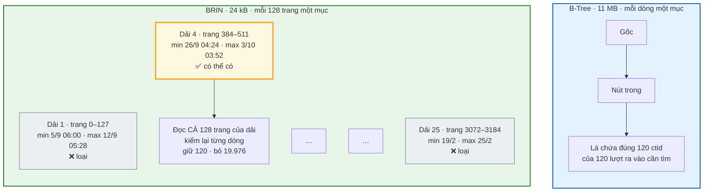
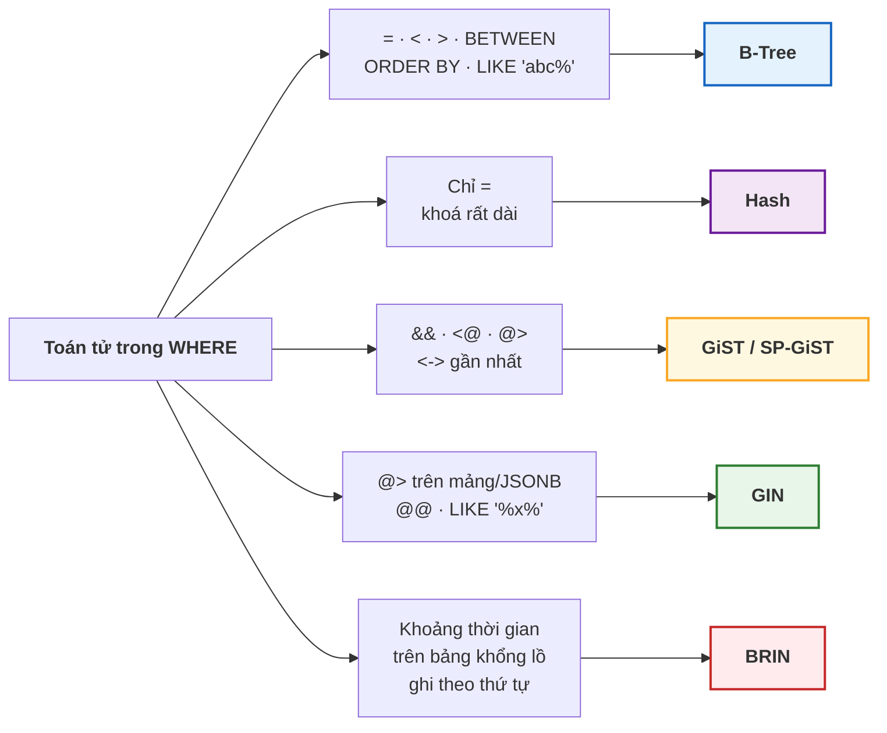

# Bài 35 — Các loại index khác: Hash, GiST, GIN, BRIN

!!! abstract "🎯 Học xong bài này, bạn sẽ"
    - Kể được sáu **phương thức truy cập index** của PostgreSQL và loại câu hỏi mà mỗi loại sinh ra để trả lời
    - Dùng **Hash** cho phép so sánh bằng, và biết vì sao nó hiếm khi thắng B-Tree — trừ khi khoá rất dài
    - Dùng **GiST** và **SP-GiST** cho toạ độ, khoảng thời gian, tìm **điểm gần nhất**, và dựng **ràng buộc loại trừ** chống đặt trùng phòng
    - Dùng **GIN** cho mảng, JSONB, tìm kiếm toàn văn và `LIKE '%...%'`, và tránh cách viết làm GIN vô dụng
    - Dùng **BRIN** cho bảng rất lớn được ghi theo thời gian — index nặng **24 kB** thay cho **11 MB** — và nhận ra khi nào nó vô dụng

## 🧠 Câu chuyện mở đầu

Thư viện trường có một cô thủ thư rất giỏi. Học sinh hỏi đủ kiểu câu hỏi, và cô **không dùng một cuốn sổ cho mọi thứ**.

- *"Cô ơi, có cuốn nào tên bắt đầu bằng chữ **Đ** không ạ?"* — Cô mở **tủ phiếu xếp theo vần**. Tìm một tên, một khoảng tên, xếp theo thứ tự — tủ này làm được hết.
- *"Cô ơi, cuốn mã **S0173** để ở đâu ạ?"* — Cô không cần thứ tự gì cả. Cô lấy **hai số cuối** của mã, `73`, mở đúng ngăn kéo số 73. Chỉ trả lời được câu hỏi *"đúng mã này"*, nhưng trả lời cực nhanh.
- *"Nhà em ở gần trường nào nhất ạ?"*, *"Phòng Tin chiều thứ Hai có trống từ 2 giờ tới 3 giờ không ạ?"* — Cô mở **bản đồ khu vực** và **lịch phòng**. Những câu hỏi này không hỏi *"bằng"*, cũng không hỏi *"lớn hơn"*; chúng hỏi *"gần"*, *"chồng lên nhau"*, *"nằm trong"*.
- *"Những cuốn nào có nhắc tới **Điện Biên Phủ**?"* — Cô mở **mục từ khoá** ở cuối cuốn sổ: mỗi từ khoá kèm danh sách mọi cuốn sách có nhắc tới nó. Ngược hẳn với tủ phiếu: không phải "sách → nội dung" mà là "từ khoá → những cuốn sách".
- *"Sách nhập về hồi **tháng 10 năm ngoái** để ở đâu ạ?"* — Sách được xếp lên kệ **theo đúng thứ tự ngày nhập**. Cô chỉ cần một tờ giấy nhỏ dán ở đầu mỗi dãy kệ: *"Dãy 1: tháng 8 – tháng 9. Dãy 2: tháng 9 – tháng 11…"*. Một tờ giấy cho cả trăm cuốn sách, mà vẫn đủ để biết khỏi phải đi dãy nào.

Năm cuốn sổ, năm kiểu câu hỏi. [Bài 34](34-index-va-b-tree.md) chỉ dạy bạn cuốn thứ nhất. PostgreSQL có đủ cả năm — cộng thêm một cuốn thứ sáu.

## 📖 Khái niệm & thuật ngữ

### Phương thức truy cập index

B+Tree của Bài 34 chỉ là **một** trong nhiều cách tổ chức một index. PostgreSQL gọi mỗi cách tổ chức như vậy là một **phương thức truy cập index** (*index access method*), viết trong lệnh tạo bằng từ khoá `USING`:

```
CREATE INDEX ten_index ON ten_bang USING <phương thức> (cột);
```

Không viết `USING` thì mặc định là `btree`. Bản PostgreSQL chuẩn có sáu phương thức: `btree`, `hash`, `gist`, `spgist`, `gin`, `brin`.

Mỗi phương thức chỉ phục vụ **một nhóm toán tử** nhất định, và đây là điều quan trọng nhất của bài: **index chỉ được dùng khi toán tử trong `WHERE` thuộc nhóm mà index đó hiểu**. Một index `hash` không hiểu dấu `<`; một index `btree` không hiểu toán tử "chồng lên nhau" `&&`. Danh sách toán tử mà một phương thức hỗ trợ cho một kiểu dữ liệu cụ thể gọi là **lớp toán tử** (*operator class*). Phần lớn thời gian bạn không phải khai nó vì mỗi kiểu dữ liệu đã có lớp mặc định; khi cần một lớp khác — như `gin_trgm_ops` ở cuối bài — bạn viết tên lớp ngay sau tên cột.

### Hash — chỉ biết "bằng"

**Index băm** (*hash index*) đưa mỗi giá trị qua một **hàm băm** để ra một con số 32 bit, rồi dùng con số đó chọn **ngăn** (*bucket*) chứa `ctid`. Đúng cách cô thủ thư lấy hai số cuối của mã sách để chọn ngăn kéo.

Hàm băm xáo trộn hoàn toàn thứ tự: `12345` và `12346` rơi vào hai ngăn chẳng liên quan gì tới nhau. Hệ quả:

| Làm được | **Không** làm được |
|---|---|
| `WHERE cot = giá_trị` | `<`, `>`, `BETWEEN`, `LIKE 'abc%'` |
| | `ORDER BY`, `min`, `max` |
| | Index nhiều cột, index `UNIQUE` |

Vậy khi nào dùng? Gần như chỉ một trường hợp: **khoá rất dài, chỉ tra bằng dấu bằng** — đường dẫn ảnh, mã băm tệp, chuỗi URL. Index hash chỉ lưu con số băm 4 byte thay cho cả chuỗi, nên nhỏ hơn B-Tree nhiều lần. Với khoá ngắn như số nguyên, B-Tree thường nhỏ bằng hoặc nhỏ hơn và làm được mọi thứ hash làm được — phần thực hành sẽ đo cả hai trường hợp.

!!! note "Chuyện cũ: \"đừng dùng hash index\""
    Trước **PostgreSQL 10**, index hash không được ghi vào nhật ký phục hồi, nên sau một lần sập máy nó có thể hỏng mà không ai biết. Lời khuyên "đừng bao giờ dùng hash" ra đời từ đó và vẫn còn lan truyền. Từ bản 10 trở đi, hash an toàn như mọi index khác; lý do nên thận trọng bây giờ chỉ còn là **nó làm được quá ít việc**.

### GiST — khung cây cho mọi thứ "chồng lên nhau"

Nhiều kiểu dữ liệu không có thứ tự "trước – sau" tự nhiên: một **điểm** trên bản đồ, một **khoảng thời gian**, một hình chữ nhật. Câu hỏi về chúng là *"có chồng lên nhau không"*, *"có nằm trong không"*, *"gần nhất là cái nào"*. B-Tree bó tay, vì nó cần sắp mọi thứ trên một đường thẳng.

**Cây tìm kiếm tổng quát** (*Generalized Search Tree*, viết tắt **GiST**) giải quyết bằng một ý tưởng khác: mỗi nút trong **không** lưu khoá, mà lưu một **vùng bao** — một hình chữ nhật bao trọn mọi thứ nằm ở nhánh bên dưới nó. Tìm *"điểm nào nằm trong khung này"* = chỉ đi xuống những nhánh có vùng bao **chồng lên** khung cần tìm, bỏ qua mọi nhánh khác.

Chữ "tổng quát" có nghĩa đen: GiST là một **khung**; mỗi kiểu dữ liệu tự định nghĩa "vùng bao" của nó là gì. Nhờ vậy cùng một cơ chế phục vụ được:

| Kiểu dữ liệu | Toán tử được tăng tốc |
|---|---|
| Điểm, hình học (`point`, `box`, `polygon`) | `<@` nằm trong, `&&` chồng lên, **`<->` khoảng cách** |
| Khoảng (`tsrange`, `daterange`, `int4range`) | `&&` chồng lên, `@>` chứa, `<@` nằm trong |
| Văn bản toàn văn (`tsvector`) | `@@` — nhưng GIN thường tốt hơn |

Hai khả năng làm GiST đặc biệt:

**Tìm lân cận gần nhất** (*nearest neighbor search*). Câu `ORDER BY vi_tri <-> point(50, 50) LIMIT 3` — *"ba nhà học sinh gần trường nhất"* — được GiST trả lời **thẳng từ cây**, đi theo các vùng bao gần nhất trước, mà không phải tính khoảng cách tới **mọi** điểm rồi sắp xếp.

**Ràng buộc loại trừ** (*exclusion constraint*). `UNIQUE` cấm hai dòng **bằng nhau**. Ràng buộc loại trừ tổng quát hoá điều đó: cấm hai dòng thoả một toán tử bất kỳ — ví dụ cấm hai lượt đặt phòng mà **cùng phòng** (`=`) **và** thời gian **chồng lên nhau** (`&&`). Nó được cưỡng chế bằng một index GiST, và là cách **duy nhất** chặn đặt trùng lịch một cách tuyệt đối ở tầng database — mọi cách kiểm tra bằng `SELECT` trước khi `INSERT` đều thua khi hai người bấm nút cùng lúc.

### SP-GiST — chia không gian thành các ô không chồng nhau

GiST cho phép vùng bao của các nhánh **chồng lên nhau**, nên đôi khi một lần tìm phải đi xuống nhiều nhánh. **GiST phân hoạch không gian** (*Space-Partitioned GiST*, viết tắt **SP-GiST**) đi theo hướng ngược lại: nó chia không gian thành các phần **không bao giờ chồng nhau** — như chia bản đồ thành bốn góc, rồi mỗi góc lại chia bốn (cây tứ phân), hay chia chuỗi theo từng ký tự đầu (cây tiền tố).

Cây SP-GiST **không cân bằng**: vùng dày đặc được chia sâu hơn, vùng thưa thì nông. Nó hợp với dữ liệu phân bố **rất không đều** — toạ độ tập trung ở thành phố, hay các chuỗi có tiền tố chung dài như số điện thoại, địa chỉ IP. Với dữ liệu phân bố đều, GiST và SP-GiST cho kết quả gần như nhau; phần thực hành sẽ cho thấy cả hai cùng trả lời một câu hỏi.

### GIN — mục từ khoá ở cuối sách

[Bài 32](../cap-3-sql/32-jsonb-va-full-text-search.md) đã dùng **chỉ mục đảo tổng quát** (*Generalized Inverted Index*, viết tắt **GIN**) cho JSONB và tìm kiếm toàn văn. Bây giờ ta nhìn vào bên trong nó.

Mọi index trước đây đều đi theo chiều *"một dòng → một mục index"*. GIN đi ngược lại: nó **tách mỗi giá trị thành nhiều phần tử**, và lưu *"phần tử → danh sách mọi dòng chứa phần tử đó"*. Với cột mảng câu lạc bộ:

| Dòng | `clb` |
|---|---|
| 1 | `{Bóng đá, Văn nghệ}` |
| 2 | `{Cầu lông}` |
| 3 | `{Bóng đá, Robot}` |

GIN lưu:

| Phần tử | Các dòng chứa nó |
|---|---|
| `Bóng đá` | 1, 3 |
| `Cầu lông` | 2 |
| `Robot` | 3 |
| `Văn nghệ` | 1 |

Đúng mục từ khoá ở cuối một cuốn sách. Câu *"ai ở câu lạc bộ Robot"* chỉ cần tra đúng một mục.

GIN phục vụ mọi kiểu dữ liệu "một ô chứa nhiều phần tử":

| Kiểu dữ liệu | Toán tử được tăng tốc |
|---|---|
| Mảng | `@>` chứa, `<@` nằm trong, `&&` có phần tử chung |
| `JSONB` | `@>`, `?`, `?|`, `?&` |
| `tsvector` | `@@` |
| Văn bản thường, với extension `pg_trgm` | `LIKE '%...%'`, `ILIKE` — tách chuỗi thành từng cụm ba ký tự |

Cái giá của GIN nằm ở **ghi**: thêm một dòng có năm phần tử là cập nhật **năm** mục index. Để đỡ chậm, GIN gom các thay đổi mới vào một **danh sách chờ** rồi mới gộp vào cây theo lô — nên ghi nhanh hơn, nhưng lần đọc ngay sau đó có thể chậm hơn một chút vì phải đọc cả danh sách chờ.

### BRIN — một tờ giấy cho cả trăm trang

Bốn loại trên đều có **một mục cho mỗi dòng** (hoặc mỗi phần tử). Với bảng một tỉ dòng, index cũng có một tỉ mục.

**Index khoảng khối** (*Block Range Index*, viết tắt **BRIN**) làm hoàn toàn khác: nó chia heap thành các **dải trang liền nhau** — mặc định mỗi dải 128 trang — và với mỗi dải chỉ lưu **giá trị nhỏ nhất và lớn nhất** của cột trong dải đó. Đúng tờ giấy dán đầu dãy kệ: *"Dãy 1: từ ngày 5/9 tới 12/9"*.

Tìm `WHERE thoi_diem BETWEEN X AND Y` = đọc tờ giấy của mọi dải, loại hết những dải mà khoảng [nhỏ nhất, lớn nhất] không chạm tới [X, Y], rồi **đọc toàn bộ** các dải còn lại và kiểm từng dòng.

Hai hệ quả trái ngược:

- **Cực nhỏ.** Bảng nhật ký 500.000 dòng của phần thực hành chỉ cần **25** mục BRIN — 3185 trang chia thành 25 dải — thay cho 500.000 mục B-Tree. Phần thực hành đo được **24 kB** so với **11 MB**.
- **Chỉ có ích khi dữ liệu nằm theo thứ tự trên đĩa** — tức **tính tương quan** của Bài 34 gần **1**. Nếu các ngày nằm lộn xộn thì mọi dải đều chứa cả ngày nhỏ lẫn ngày lớn, khoảng [nhỏ nhất, lớn nhất] của dải nào cũng phủ gần hết năm, và BRIN không loại được dải nào.

Vì thế BRIN là lựa chọn gần như hoàn hảo cho dữ liệu **chỉ thêm vào theo thời gian**: nhật ký ra vào cổng, lịch sử điểm danh, số liệu cảm biến — những bảng mà dòng mới luôn có thời điểm mới nhất và luôn được ghi vào cuối tệp.

### Index xấp xỉ và bước kiểm tra lại

GiST trên hình học, GIN với `pg_trgm`, và BRIN có chung một đặc điểm: câu trả lời của index **có thể thừa**. GiST lưu vùng bao, không lưu hình thật; BRIN chỉ biết *"dải này có thể có"*. Index như vậy gọi là **index xấp xỉ** (*lossy index*).

PostgreSQL xử lý bằng cách **kiểm tra lại** mọi dòng mà index trả về, trên dữ liệu thật ở heap. Trong `EXPLAIN` bạn sẽ thấy dòng `Recheck Cond`, và với `EXPLAIN ANALYZE` là `Rows Removed by Index Recheck` — số dòng index "đoán nhầm" bị loại ở bước này. Index xấp xỉ **không bao giờ** làm sai kết quả; nó chỉ tốn thêm công kiểm tra.

### Bảng quyết định

| Câu hỏi của bạn | Ví dụ | Dùng |
|---|---|---|
| Bằng, khoảng, sắp xếp, tiền tố | `ma_hs = 5`, `ngay BETWEEN`, `ORDER BY`, `LIKE 'abc%'` | **B-Tree** — mặc định, luôn nghĩ tới nó trước |
| Chỉ bằng, khoá rất dài | `duong_dan_anh = '...'` | **Hash** |
| Toạ độ, hình học, tìm gần nhất | `vi_tri <@ box`, `ORDER BY vi_tri <-> p` | **GiST** (hoặc SP-GiST nếu phân bố rất lệch) |
| Khoảng thời gian chồng nhau, chống đặt trùng | `thoi_gian && ...`, `EXCLUDE` | **GiST** |
| Một ô chứa nhiều phần tử | mảng `@>`, JSONB `@>`, `tsvector @@` | **GIN** |
| Tìm chuỗi con ở giữa | `ho_ten LIKE '%4242%'` | **GIN** với `pg_trgm` |
| Bảng khổng lồ, ghi theo thời gian, hỏi theo khoảng | `thoi_diem BETWEEN ...` trên nhật ký | **BRIN** |

### Bảng thuật ngữ

| Tiếng Việt | English | Nghĩa dễ hiểu |
|---|---|---|
| Phương thức truy cập index | *index access method* | Cách tổ chức một index — `btree`, `hash`, `gist`, `spgist`, `gin`, `brin` — chọn bằng `USING` |
| Lớp toán tử | *operator class* | Danh sách toán tử mà một phương thức index hỗ trợ cho một kiểu dữ liệu |
| Index băm | *hash index* | Index chỉ trả lời phép so sánh bằng, lưu mã băm thay cho giá trị — nhỏ khi khoá rất dài |
| Cây tìm kiếm tổng quát | *Generalized Search Tree* (GiST) | Khung cây lưu vùng bao ở mỗi nút; phục vụ hình học, khoảng, tìm gần nhất, ràng buộc loại trừ |
| Tìm lân cận gần nhất | *nearest neighbor search* | `ORDER BY cot <-> điểm LIMIT n` — trả lời thẳng từ cây GiST mà không tính khoảng cách tới mọi dòng |
| Ràng buộc loại trừ | *exclusion constraint* | Cấm hai dòng cùng thoả một bộ toán tử, ví dụ cùng phòng và giờ chồng nhau; cưỡng chế bằng GiST |
| GiST phân hoạch không gian | *Space-Partitioned GiST* (SP-GiST) | Cây không cân bằng chia không gian thành các phần không chồng nhau; hợp dữ liệu phân bố rất lệch |
| Chỉ mục đảo tổng quát | *Generalized Inverted Index* (GIN) | Lưu "phần tử → mọi dòng chứa nó"; cho mảng, JSONB, toàn văn, `pg_trgm` |
| Index khoảng khối | *Block Range Index* (BRIN) | Lưu giá trị nhỏ nhất và lớn nhất cho mỗi dải trang liền nhau; cực nhỏ, chỉ có ích khi tương quan gần 1 |
| Index xấp xỉ | *lossy index* | Index có thể trả thừa dòng; PostgreSQL kiểm tra lại trên heap nên kết quả vẫn đúng |

## 🖼️ Sơ đồ

Cùng một câu hỏi *"thời điểm ra vào từ 7 giờ tới 8 giờ sáng 1/10"*, B-Tree và BRIN trả lời theo hai cách rất khác nhau:



B-Tree đi thẳng tới đúng 120 dòng nhưng nặng gấp gần 500 lần. BRIN chỉ biết *"nằm đâu đó trong dải này"*, phải đọc cả dải rồi kiểm lại — nhưng vẫn chỉ đọc 133 trang thay vì 3185 trang, với một index bé xíu.

Chọn loại index nào — bắt đầu từ **toán tử** trong câu `WHERE`:



## 💻 Thực hành

### Chuẩn bị: hàm đọc kế hoạch và sáu phương thức

Giống Bài 34, bài này bọc `EXPLAIN` vào một hàm để khẳng định được tên index xuất hiện trong kế hoạch:

```sql
DROP FUNCTION IF EXISTS b35_ke_hoach(text);

CREATE FUNCTION b35_ke_hoach(cau_truy_van text) RETURNS text
LANGUAGE plpgsql AS $$
DECLARE
    dong    text;
    ket_qua text := '';
BEGIN
    FOR dong IN EXECUTE 'EXPLAIN ' || cau_truy_van LOOP
        ket_qua := ket_qua || dong || E'\n';
    END LOOP;
    RETURN ket_qua;
END $$;

-- KỲ VỌNG: 6 dòng
-- KỲ VỌNG: phuong_thuc = brin
SELECT amname AS phuong_thuc
FROM pg_am
WHERE amtype = 'i'
ORDER BY amname;
```

Bảng hệ thống `pg_am` liệt kê mọi phương thức truy cập; `amtype = 'i'` lọc riêng loại dành cho index. Đủ sáu: `brin`, `btree`, `gin`, `gist`, `hash`, `spgist`.

### Hash: dùng được cho `=`, không dùng được cho `<`

```sql
DROP INDEX IF EXISTS b35_hash_ma_hs;
CREATE INDEX b35_hash_ma_hs ON diem_lon USING hash (ma_hs);

-- KỲ VỌNG: bang_dung_hash = true
-- KỲ VỌNG: nho_hon_dung_hash = false
SELECT b35_ke_hoach('SELECT * FROM diem_lon WHERE ma_hs = 12345')
       LIKE '%b35_hash_ma_hs%' AS bang_dung_hash,
       b35_ke_hoach('SELECT * FROM diem_lon WHERE ma_hs < 100')
       LIKE '%b35_hash_ma_hs%' AS nho_hon_dung_hash;
```

Dấu bằng dùng index hash; dấu nhỏ hơn thì không, dù chỉ cần khoảng 1000 dòng — hash không có khái niệm "nhỏ hơn". So kích thước với một B-Tree trên cùng cột:

```sql
DROP INDEX IF EXISTS b35_btree_ma_hs;
CREATE INDEX b35_btree_ma_hs ON diem_lon (ma_hs);

-- KỲ VỌNG: hash_to_hon = true
SELECT pg_size_pretty(pg_relation_size('b35_hash_ma_hs'))  AS index_hash,
       pg_size_pretty(pg_relation_size('b35_btree_ma_hs')) AS index_btree,
       pg_relation_size('b35_hash_ma_hs')
           > pg_relation_size('b35_btree_ma_hs')           AS hash_to_hon;
```

Trên máy đo: hash **16 MB**, B-Tree **4640 kB**. Hash **lớn hơn** — ngược với điều nhiều người tin. Khoá `ma_hs` chỉ 4 byte, bằng đúng mã băm, nên hash không tiết kiệm được gì; còn B-Tree lại được lợi từ **khử trùng lặp** của Bài 34 vì mỗi `ma_hs` lặp mười lần.

Giờ thử với khoá **dài** — đường dẫn ảnh thẻ của học sinh, mỗi chuỗi hơn 100 ký tự:

```sql
DROP TABLE IF EXISTS b35_anh CASCADE;
CREATE TABLE b35_anh (
    ma_hs     INTEGER PRIMARY KEY,
    duong_dan TEXT NOT NULL
);

INSERT INTO b35_anh
SELECT n, 'https://truong-thcs-mau.edu.vn/ho-so/nam-hoc-2025-2026/anh-the/hoc-sinh-so-'
          || n || '/anh-chinh-dien-kich-thuoc-3x4.jpg'
FROM generate_series(1, 50000) AS n;
ANALYZE b35_anh;

CREATE INDEX b35_btree_anh ON b35_anh (duong_dan);
CREATE INDEX b35_hash_anh  ON b35_anh USING hash (duong_dan);

-- KỲ VỌNG: hash_nho_hon = true
SELECT pg_size_pretty(pg_relation_size('b35_hash_anh'))  AS index_hash,
       pg_size_pretty(pg_relation_size('b35_btree_anh')) AS index_btree,
       pg_relation_size('b35_hash_anh') * 3
           < pg_relation_size('b35_btree_anh')           AS hash_nho_hon;
```

Lần này hash **2064 kB**, B-Tree **7472 kB** — hash nhỏ hơn hơn ba lần, vì nó chỉ giữ 4 byte mã băm thay cho cả chuỗi hơn 100 byte. Đây là chỗ đứng thật sự của hash.

```sql
DROP INDEX IF EXISTS b35_btree_anh;

-- KỲ VỌNG: tra_dung_duong_dan = true
-- KỲ VỌNG: tra_tien_to = false
SELECT b35_ke_hoach($$SELECT * FROM b35_anh WHERE duong_dan =
    'https://truong-thcs-mau.edu.vn/ho-so/nam-hoc-2025-2026/anh-the/hoc-sinh-so-4242/anh-chinh-dien-kich-thuoc-3x4.jpg'$$)
       LIKE '%b35_hash_anh%' AS tra_dung_duong_dan,
       b35_ke_hoach($$SELECT * FROM b35_anh WHERE duong_dan LIKE
    'https://truong-thcs-mau.edu.vn/ho-so/nam-hoc-2025-2026/anh-the/hoc-sinh-so-4242/%'$$)
       LIKE '%b35_hash_anh%' AS tra_tien_to;
```

Tra đúng một đường dẫn: dùng hash. Tra mọi ảnh trong thư mục của một học sinh bằng `LIKE 'tiền_tố%'`: hash **bó tay**.

### GiST: nhà học sinh gần trường nhất

Bảng nháp lưu toạ độ nhà của 50.000 học sinh trên một tấm bản đồ 100 × 100. Toạ độ được sinh bằng phép nhân và chia lấy dư với số nguyên tố, nên rải đều khắp bản đồ và **luôn giống nhau** mỗi lần chạy:

```sql
DROP TABLE IF EXISTS b35_nha_hs CASCADE;
CREATE TABLE b35_nha_hs (
    ma_hs  INTEGER PRIMARY KEY,
    vi_tri POINT   NOT NULL
);

INSERT INTO b35_nha_hs
SELECT n, point((n::bigint * 7919   % 10007) / 100.0,
                (n::bigint * 104729 % 10009) / 100.0)
FROM generate_series(1, 50000) AS n;
ANALYZE b35_nha_hs;

-- KỲ VỌNG: phai_sap_xep_ca_bang = true
SELECT b35_ke_hoach('SELECT ma_hs FROM b35_nha_hs ORDER BY vi_tri <-> point(50, 50) LIMIT 3')
       LIKE '%Sort%' AS phai_sap_xep_ca_bang;
```

Chưa có index: muốn biết ba nhà gần điểm `(50, 50)` nhất — vị trí của trường — PostgreSQL phải tính khoảng cách tới **cả 50.000** nhà rồi sắp xếp. Toán tử `<->` trả về khoảng cách giữa hai điểm.

```sql
DROP INDEX IF EXISTS b35_gist_vi_tri;
CREATE INDEX b35_gist_vi_tri ON b35_nha_hs USING gist (vi_tri);

-- KỲ VỌNG: di_thang_tu_cay = true
-- KỲ VỌNG: con_sap_xep = false
SELECT b35_ke_hoach('SELECT ma_hs FROM b35_nha_hs ORDER BY vi_tri <-> point(50, 50) LIMIT 3')
       LIKE '%Index Scan using b35_gist_vi_tri%' AS di_thang_tu_cay,
       b35_ke_hoach('SELECT ma_hs FROM b35_nha_hs ORDER BY vi_tri <-> point(50, 50) LIMIT 3')
       LIKE '%Sort%'                              AS con_sap_xep;
```

Có GiST: kế hoạch thành `Index Scan` kèm dòng `Order By: (vi_tri <-> '(50,50)'::point)`, **không còn** bước sắp xếp. Cây trả các điểm ra **theo thứ tự khoảng cách tăng dần**, và `LIMIT 3` dừng ngay sau điểm thứ ba.

```sql
-- KỲ VỌNG: 3 dòng
-- KỲ VỌNG: ma_hs = 23400
-- KỲ VỌNG: khoang_cach = 0.196
SELECT ma_hs,
       vi_tri,
       round((vi_tri <-> point(50, 50))::numeric, 3) AS khoang_cach
FROM b35_nha_hs
ORDER BY vi_tri <-> point(50, 50)
LIMIT 3;
```

Nhà học sinh `23400` ở `(49.81, 49.95)`, cách trường **0,196** đơn vị. Tìm theo vùng — *"những bạn nhà nằm trong ô vuông từ (10,10) tới (12,12)"*, ví dụ để xếp chung một tuyến xe đưa đón:

```sql
-- KỲ VỌNG: dung_gist = true
SELECT b35_ke_hoach('SELECT count(*) FROM b35_nha_hs WHERE vi_tri <@ box(point(10, 10), point(12, 12))')
       LIKE '%b35_gist_vi_tri%' AS dung_gist;
```

```sql
-- KỲ VỌNG: so_nha = 19
SELECT count(*) AS so_nha
FROM b35_nha_hs
WHERE vi_tri <@ box(point(10, 10), point(12, 12));
```

Mười chín nhà. Toán tử `<@` đọc là *"nằm trong"*.

### SP-GiST: cùng câu hỏi, cách chia khác

```sql
DROP INDEX IF EXISTS b35_gist_vi_tri;
DROP INDEX IF EXISTS b35_spgist_vi_tri;
CREATE INDEX b35_spgist_vi_tri ON b35_nha_hs USING spgist (vi_tri);

-- KỲ VỌNG: tim_vung = true
-- KỲ VỌNG: tim_gan_nhat = true
SELECT b35_ke_hoach('SELECT count(*) FROM b35_nha_hs WHERE vi_tri <@ box(point(10, 10), point(12, 12))')
       LIKE '%b35_spgist_vi_tri%' AS tim_vung,
       b35_ke_hoach('SELECT ma_hs FROM b35_nha_hs ORDER BY vi_tri <-> point(50, 50) LIMIT 3')
       LIKE '%b35_spgist_vi_tri%' AS tim_gan_nhat;
```

SP-GiST (ở đây là một cây tứ phân: mỗi nút chia mặt phẳng thành bốn góc) trả lời được cả hai loại câu hỏi. Với 50.000 điểm rải đều, khác biệt về tốc độ so với GiST không đáng kể; SP-GiST chỉ thật sự thắng khi điểm dồn cục ở vài nơi — như toạ độ nhà học sinh của một trường thật, dày đặc quanh trường và thưa dần ra ngoại thành.

### GiST: chống đặt trùng phòng bằng ràng buộc loại trừ

Phòng Tin học được nhiều lớp đặt. Luật: **cùng một phòng thì không được có hai lượt đặt chồng giờ**. Kiểu `tsrange` là một **khoảng thời gian** có đầu và cuối; toán tử `&&` đọc là *"chồng lên nhau"*.

Ràng buộc cần so `phong` bằng dấu `=` bên trong một index GiST. GiST không tự hiểu dấu `=` trên kiểu `TEXT`, nên cần extension `btree_gist` — nó dạy GiST các toán tử của B-Tree:

```sql
CREATE EXTENSION IF NOT EXISTS btree_gist;

DROP TABLE IF EXISTS b35_dat_phong CASCADE;
CREATE TABLE b35_dat_phong (
    ma_dat    SERIAL  PRIMARY KEY,
    phong     TEXT    NOT NULL,
    lop       TEXT    NOT NULL,
    thoi_gian TSRANGE NOT NULL,
    EXCLUDE USING gist (phong WITH =, thoi_gian WITH &&)
);

INSERT INTO b35_dat_phong (phong, lop, thoi_gian) VALUES
('Phòng Tin 1',      '8A1', tsrange('2025-10-06 07:00', '2025-10-06 08:30')),
('Phòng Tin 1',      '9A2', tsrange('2025-10-06 08:30', '2025-10-06 10:00')),
('Phòng Thí nghiệm', '8A1', tsrange('2025-10-06 07:30', '2025-10-06 09:00'));

-- KỲ VỌNG: so_luot = 3
SELECT count(*) AS so_luot FROM b35_dat_phong;
```

Ba lượt hợp lệ: lượt 1 và 2 cùng phòng nhưng **nối tiếp nhau** — `tsrange` mặc định chứa mốc đầu, **không** chứa mốc cuối, nên 8:30 của lượt 1 không chồng lên 8:30 của lượt 2. Lượt 3 chồng giờ với lượt 1 nhưng **khác phòng**.

Giờ lớp 7A3 đặt Phòng Tin 1 từ 8:00 tới 9:00:

<!-- sql:co-y-loi -->
```sql
INSERT INTO b35_dat_phong (phong, lop, thoi_gian)
VALUES ('Phòng Tin 1', '7A3', tsrange('2025-10-06 08:00', '2025-10-06 09:00'));
```

PostgreSQL từ chối:

```text
ERROR:  conflicting key value violates exclusion constraint "b35_dat_phong_phong_thoi_gian_excl"
DETAIL:  Key (phong, thoi_gian)=(Phòng Tin 1, ["2025-10-06 08:00:00","2025-10-06 09:00:00")) conflicts with existing key (phong, thoi_gian)=(Phòng Tin 1, ["2025-10-06 07:00:00","2025-10-06 08:30:00")).
```

Chú ý cách PostgreSQL in khoảng: `["2025-10-06 08:00:00","2025-10-06 09:00:00")` — ngoặc vuông ở đầu là **có chứa**, ngoặc tròn ở cuối là **không chứa**. Ràng buộc này không có kẽ hở: dù hai giáo viên bấm "đặt phòng" đúng cùng một mili giây, chỉ một người thành công.

Chính ràng buộc đã tạo ra một index GiST:

```sql
-- KỲ VỌNG: phuong_thuc = gist
SELECT am.amname AS phuong_thuc
FROM pg_index i
JOIN pg_class c ON c.oid = i.indexrelid
JOIN pg_am am   ON am.oid = c.relam
WHERE i.indrelid = 'b35_dat_phong'::regclass
  AND NOT i.indisprimary;
```

### GIN: ai ở câu lạc bộ Robot

Mỗi học sinh tham gia một vài câu lạc bộ, lưu bằng một mảng. Câu lạc bộ Robot rất ít người — cứ 500 bạn mới có một:

```sql
DROP TABLE IF EXISTS b35_cau_lac_bo CASCADE;
CREATE TABLE b35_cau_lac_bo (
    ma_hs INTEGER PRIMARY KEY,
    clb   TEXT[]  NOT NULL
);

INSERT INTO b35_cau_lac_bo
SELECT n,
       array_remove(ARRAY[
           CASE n % 3 WHEN 0 THEN 'Bóng đá' WHEN 1 THEN 'Cầu lông' ELSE 'Bóng rổ' END,
           CASE n % 4 WHEN 0 THEN 'Văn nghệ' WHEN 1 THEN 'Mỹ thuật' END,
           CASE WHEN n % 500 = 0 THEN 'Robot' END
       ], NULL)
FROM generate_series(1, 50000) AS n;
ANALYZE b35_cau_lac_bo;

-- KỲ VỌNG: so_ban_robot = 100
SELECT count(*) AS so_ban_robot
FROM b35_cau_lac_bo
WHERE clb @> ARRAY['Robot'];
```

(`array_remove(..., NULL)` bỏ các phần tử `NULL` do nhánh `CASE` không khớp sinh ra, để mảng chỉ chứa câu lạc bộ thật.) Toán tử `@>` đọc là *"chứa"*: mảng `clb` chứa phần tử `'Robot'`.

```sql
DROP INDEX IF EXISTS b35_gin_clb;
CREATE INDEX b35_gin_clb ON b35_cau_lac_bo USING gin (clb);

-- KỲ VỌNG: dung_gin = true
SELECT b35_ke_hoach($$SELECT * FROM b35_cau_lac_bo WHERE clb @> ARRAY['Robot']$$)
       LIKE '%Bitmap Index Scan on b35_gin_clb%' AS dung_gin;
```

GIN tra đúng một mục `'Robot'` trong "mục từ khoá" của nó và lấy ra 100 dòng. Hỏi hai câu lạc bộ cùng lúc — *"các bạn vừa ở Robot vừa ở Mỹ thuật"* — GIN lấy **giao** của hai danh sách:

```sql
-- KỲ VỌNG: so_ban = 0
-- KỲ VỌNG: dung_gin = true
SELECT (SELECT count(*) FROM b35_cau_lac_bo
        WHERE clb @> ARRAY['Robot', 'Mỹ thuật'])                    AS so_ban,
       b35_ke_hoach($$SELECT * FROM b35_cau_lac_bo
                     WHERE clb @> ARRAY['Robot', 'Mỹ thuật']$$)
       LIKE '%b35_gin_clb%'                                          AS dung_gin;
```

**Không** bạn nào. Mọi bạn Robot có mã chia hết cho 500, tức cũng chia hết cho 4, nên đều ở câu lạc bộ Văn nghệ chứ không phải Mỹ thuật. Truy vấn trả về 0 dòng mà vẫn đi qua index — GIN biết ngay giao của hai danh sách là rỗng.

### GIN với `pg_trgm`: tìm chuỗi ở giữa tên

[Bài 24](../cap-3-sql/24-select-where-order-by.md) cảnh báo: `LIKE '%...%'` không dùng được index thông thường. Extension `pg_trgm` phá được giới hạn đó bằng cách cắt mỗi chuỗi thành **các cụm ba ký tự** liên tiếp — `'4242'` thành `'424'`, `'242'` — và đưa các cụm này vào GIN:

```sql
CREATE EXTENSION IF NOT EXISTS pg_trgm;

-- KỲ VỌNG: truoc_khi_co_index = true
SELECT b35_ke_hoach($$SELECT * FROM hoc_sinh_lon WHERE ho_ten LIKE '%4242%'$$)
       LIKE '%Seq Scan%' AS truoc_khi_co_index;
```

```sql
DROP INDEX IF EXISTS b35_trgm_ten;
CREATE INDEX b35_trgm_ten ON hoc_sinh_lon USING gin (ho_ten gin_trgm_ops);

-- KỲ VỌNG: sau_khi_co_index = true
SELECT b35_ke_hoach($$SELECT * FROM hoc_sinh_lon WHERE ho_ten LIKE '%4242%'$$)
       LIKE '%b35_trgm_ten%' AS sau_khi_co_index;
```

`gin_trgm_ops` là tên **lớp toán tử** viết ngay sau tên cột: nó bảo GIN *"hãy tách giá trị thành các cụm ba ký tự"*. Không có nó, GIN không biết phải tách một chuỗi `VARCHAR` ra thành phần tử gì.

```sql
-- KỲ VỌNG: 15 dòng
-- KỲ VỌNG: ma_hs = 4242
SELECT ma_hs, ho_ten
FROM hoc_sinh_lon
WHERE ho_ten LIKE '%4242%'
ORDER BY ma_hs;
```

Mười lăm học sinh có chuỗi `4242` trong tên: `4242`, `14242`, `24242`, `34242`, `44242`, và mười bạn từ `42420` tới `42429`.

### BRIN: nhật ký ra vào cổng trường

Máy quẹt thẻ ở cổng ghi một lượt ra vào mỗi 30 giây, suốt gần sáu tháng. Dòng mới luôn có thời điểm mới nhất và luôn được ghi vào cuối bảng:

```sql
DROP TABLE IF EXISTS b35_ra_vao CASCADE;
CREATE TABLE b35_ra_vao (
    ma_luot   BIGINT    NOT NULL,
    ma_hs     INTEGER   NOT NULL,
    thoi_diem TIMESTAMP NOT NULL
);

INSERT INTO b35_ra_vao
SELECT n, (n % 50000) + 1,
       TIMESTAMP '2025-09-05 06:00' + n * INTERVAL '30 seconds'
FROM generate_series(1, 500000) AS n;
ANALYZE b35_ra_vao;

-- KỲ VỌNG: tuong_quan = 1
-- KỲ VỌNG: so_trang = 3185
SELECT (SELECT correlation FROM pg_stats
        WHERE tablename = 'b35_ra_vao' AND attname = 'thoi_diem') AS tuong_quan,
       pg_relation_size('b35_ra_vao') / 8192                      AS so_trang;
```

Tương quan **1** — thời điểm tăng dần đúng theo thứ tự trên đĩa. Bảng chiếm 3185 trang. Tạo cả hai loại index để so:

```sql
DROP INDEX IF EXISTS b35_brin_thoi_diem;
DROP INDEX IF EXISTS b35_btree_thoi_diem;
CREATE INDEX b35_brin_thoi_diem  ON b35_ra_vao USING brin (thoi_diem);
CREATE INDEX b35_btree_thoi_diem ON b35_ra_vao (thoi_diem);

-- KỲ VỌNG: brin = 24 kB
-- KỲ VỌNG: btree = 11 MB
SELECT pg_size_pretty(pg_relation_size('b35_brin_thoi_diem'))  AS brin,
       pg_size_pretty(pg_relation_size('b35_btree_thoi_diem')) AS btree;
```

**24 kB** so với **11 MB** — B-Tree nặng gấp gần năm trăm lần. Bỏ B-Tree đi và hỏi *"những lượt ra vào từ 7 giờ tới 8 giờ sáng 1/10"*:

```sql
DROP INDEX IF EXISTS b35_btree_thoi_diem;

-- KỲ VỌNG: dung_brin = true
SELECT b35_ke_hoach($$SELECT * FROM b35_ra_vao
                     WHERE thoi_diem >= '2025-10-01 07:00' AND thoi_diem < '2025-10-01 08:00'$$)
       LIKE '%Bitmap Index Scan on b35_brin_thoi_diem%' AS dung_brin;
```

```sql
-- KỲ VỌNG: so_luot = 120
SELECT count(*) AS so_luot
FROM b35_ra_vao
WHERE thoi_diem >= '2025-10-01 07:00' AND thoi_diem < '2025-10-01 08:00';
```

Một giờ, mỗi 30 giây một lượt: đúng **120** lượt. Đo thật trên máy đo (thời gian trên máy bạn sẽ khác, số trang thì không):

```text
 Bitmap Heap Scan on b35_ra_vao  (cost=12.06..3497.06 rows=123 width=20) (actual time=0.617..0.876 rows=120 loops=1)
   Recheck Cond: ((thoi_diem >= '2025-10-01 07:00:00'::timestamp without time zone) AND (thoi_diem < '2025-10-01 08:00:00'::timestamp without time zone))
   Rows Removed by Index Recheck: 19976
   Heap Blocks: lossy=128
   Buffers: shared hit=133
   ->  Bitmap Index Scan on b35_brin_thoi_diem  (cost=0.00..12.03 rows=20000 width=0) (actual time=0.011..0.011 rows=1280 loops=1)
         Index Cond: ((thoi_diem >= '2025-10-01 07:00:00'::timestamp without time zone) AND (thoi_diem < '2025-10-01 08:00:00'::timestamp without time zone))
         Buffers: shared hit=5
 Execution Time: 0.890 ms
```

Đọc từ dưới lên:

- `Bitmap Index Scan on b35_brin_thoi_diem` đọc **5** trang index và trả về một dải: `rows=1280` ở đây không phải số dòng mà là số trang × 10 — BRIN chỉ báo được *"dải trang này có thể có"*.
- `Heap Blocks: lossy=128`: đúng **một dải 128 trang** được đọc. Chữ `lossy` nghĩa là bitmap chỉ biết **trang**, không biết dòng nào — index xấp xỉ.
- `Rows Removed by Index Recheck: 19976`: kiểm lại từng dòng trong 128 trang, bỏ đi 19.976 dòng không thuộc khung giờ, giữ **120**.
- Tổng cộng **133** trang (5 + 128), thay cho **3185** trang nếu quét toàn bảng. Trên máy đo, quét toàn bảng mất khoảng 14 ms, BRIN khoảng 0,9 ms.

### BRIN trên cột lộn xộn: vô dụng

Cột `ngay_nhap` của `diem_lon` được sinh bằng `n % 700` — các ngày lặp lại theo chu kỳ, nằm lộn xộn trên đĩa:

```sql
-- KỲ VỌNG: gan_nhu_ngau_nhien = true
SELECT abs(correlation) < 0.1 AS gan_nhu_ngau_nhien
FROM pg_stats
WHERE tablename = 'diem_lon' AND attname = 'ngay_nhap';
```

```sql
DROP INDEX IF EXISTS b35_brin_ngay_nhap;
CREATE INDEX b35_brin_ngay_nhap ON diem_lon USING brin (ngay_nhap);

-- KỲ VỌNG: dung_brin = false
SELECT b35_ke_hoach($$SELECT * FROM diem_lon WHERE ngay_nhap = DATE '2025-01-01'$$)
       LIKE '%b35_brin_ngay_nhap%' AS dung_brin;
```

PostgreSQL **không thèm dùng** index BRIN này. Mỗi dải 128 trang chứa khoảng 15.000 dòng với đủ mọi ngày, nên khoảng [nhỏ nhất, lớn nhất] của dải nào cũng là gần như cả 700 ngày — không dải nào bị loại. Dùng BRIN ở đây chỉ tốn thêm công đọc index rồi vẫn phải đọc hết bảng.

```sql
-- KỲ VỌNG: so_dong = 715
SELECT count(*) AS so_dong FROM diem_lon WHERE ngay_nhap = DATE '2025-01-01';
```

715 dòng — ít hơn 0,2% bảng. Một B-Tree sẽ trả lời câu này rất tốt; BRIN thì không, vì vấn đề không nằm ở số dòng mà nằm ở **chỗ chúng nằm trên đĩa**.

## ⚠️ Lỗi thường gặp

!!! danger "Lỗi 1: Viết `= ANY(mảng)` thay vì `@>` khi có GIN"
    ```sql
    -- KỲ VỌNG: viet_any = false
    -- KỲ VỌNG: viet_chua = true
    SELECT b35_ke_hoach($$SELECT * FROM b35_cau_lac_bo WHERE 'Robot' = ANY (clb)$$)
           LIKE '%b35_gin_clb%' AS viet_any,
           b35_ke_hoach($$SELECT * FROM b35_cau_lac_bo WHERE clb @> ARRAY['Robot']$$)
           LIKE '%b35_gin_clb%' AS viet_chua;
    ```

    ```sql
    -- KỲ VỌNG: cach_any = 100
    -- KỲ VỌNG: cach_chua = 100
    SELECT (SELECT count(*) FROM b35_cau_lac_bo WHERE 'Robot' = ANY (clb))    AS cach_any,
           (SELECT count(*) FROM b35_cau_lac_bo WHERE clb @> ARRAY['Robot'])  AS cach_chua;
    ```

    Hai câu cho **cùng 100 dòng**, nhưng câu `= ANY` **quét toàn bảng** còn câu `@>` đi qua GIN. Lý do đúng như bài học chính: index chỉ được dùng khi **toán tử** thuộc lớp toán tử của nó. Lớp toán tử GIN cho mảng hiểu `@>`, `<@`, `&&`, `=`; nó **không** hiểu cấu trúc `giá_trị = ANY(mảng)`.

    Sửa: với cột có GIN, viết điều kiện bằng các toán tử mảng — `@>` cho "chứa", `&&` cho "có phần tử chung". Bài học tương tự với JSONB ở [Bài 32](../cap-3-sql/32-jsonb-va-full-text-search.md): `->>` không dùng được GIN, `@>` thì dùng được.

!!! danger "Lỗi 2: Tạo BRIN cho cột không có thứ tự vật lý"
    Phần thực hành vừa cho thấy: BRIN trên `ngay_nhap` của `diem_lon` bị PostgreSQL bỏ qua hoàn toàn. Tệ hơn, nếu dữ liệu từng có thứ tự rồi bị xáo trộn — ví dụ bảng nhật ký bị `UPDATE` hàng loạt làm tuple dời chỗ, hay bị nạp lại từ một bản sao lưu không theo thứ tự — BRIN lặng lẽ trở nên vô dụng mà không báo lỗi gì.

    Sửa: **kiểm `correlation` trong `pg_stats` trước khi tạo BRIN**. Gần 1 (hoặc gần −1) thì BRIN tốt; gần 0 thì dùng B-Tree. Và chỉ dùng BRIN cho bảng **chỉ thêm vào cuối**.

!!! warning "Lỗi 3: Dùng hash vì nghĩ nó \"nhỏ hơn và nhanh hơn B-Tree\""
    Với khoá số nguyên, phần thực hành đo được hash **16 MB** trong khi B-Tree chỉ **4640 kB**. Và hash không làm được `<`, `BETWEEN`, `ORDER BY`, `LIKE 'tiền_tố%'`, `UNIQUE`, hay index nhiều cột — một ngày yêu cầu thay đổi thành *"những học sinh có mã từ 100 tới 200"* là index hash thành vô dụng.

    Sửa: mặc định dùng B-Tree. Chỉ cân nhắc hash khi khoá **dài** — như đường dẫn ảnh hơn 100 ký tự — **và** bạn chắc chắn chỉ bao giờ tra bằng dấu bằng. Và đo trước khi quyết định.

!!! warning "Lỗi 4: Quên `btree_gist` khi dựng ràng buộc loại trừ"
    <!-- sql:co-y-loi -->
    ```sql
    CREATE TABLE b35_quen (
        phong     TEXT,
        thoi_gian TSRANGE,
        EXCLUDE USING gist (phong WITH =, thoi_gian WITH &&)
    );
    ```

    Trên một database chưa cài `btree_gist`, PostgreSQL báo:

    ```text
    ERROR:  data type text has no default operator class for access method "gist"
    HINT:  You must specify an operator class for the index or define a default operator class for the data type.
    ```

    Thông báo nói đúng từ khoá của bài: kiểu `TEXT` **không có lớp toán tử** mặc định cho phương thức `gist`. GiST không tự biết so bằng hai chuỗi; `btree_gist` cung cấp lớp toán tử đó.

    Sửa: `CREATE EXTENSION IF NOT EXISTS btree_gist;` trước khi tạo bảng. Extension này là loại **đáng tin**, nên người dùng có quyền `CREATE` trên database là cài được, không cần superuser.

!!! warning "Lỗi 5: GIN trên cột bị sửa liên tục"
    Mỗi dòng mới hay mỗi lần sửa một cột mảng năm phần tử là năm lần cập nhật index GIN. PostgreSQL giảm bớt bằng danh sách chờ, nhưng trên một bảng nhận hàng nghìn lượt ghi mỗi giây, GIN vẫn là index **đắt nhất** để duy trì.

    Sửa: chỉ đặt GIN lên cột thật sự được **tìm kiếm** theo phần tử. Nếu cột mảng chỉ để hiển thị, đừng đánh index. Và nếu một phần tử được tra cực kỳ thường xuyên — ví dụ "câu lạc bộ đầu tiên" — cân nhắc tách nó ra một cột riêng với B-Tree, hoặc về hẳn một bảng quan hệ như [Bài 17](../cap-2-chuan-hoa/17-dang-chuan-1nf-2nf.md) đã bàn.

## ✍️ Bài tập

1. Với mỗi câu hỏi sau, chọn loại index phù hợp nhất và viết lệnh `CREATE INDEX` (không cần chạy):

    a. Tìm lượt mượn sách theo `ma_hs`, và liệt kê theo `ngay_muon` mới nhất trước.

    b. Tìm học sinh có **mã định danh điện tử** — một chuỗi 64 ký tự — bằng đúng một giá trị.

    c. Tìm những bạn có sở thích chứa `'cờ vua'` trong cột `JSONB` `ho_so`.

    d. Bảng `diem_danh` có 50 triệu dòng, ghi theo ngày, hay bị hỏi *"điểm danh tuần trước"*.

    e. Cấm một giáo viên có hai tiết dạy chồng giờ.

2. Cột `thoi_diem` của `b35_ra_vao` có BRIN chạy rất tốt. Nếu ai đó chạy `UPDATE b35_ra_vao SET ma_hs = ma_hs` cho **toàn bộ** bảng rồi `VACUUM`, BRIN có còn tốt không? Dựa vào Bài 33 để trả lời, rồi kiểm tra bằng cách đếm lại tương quan.

3. Viết truy vấn tìm **năm** nhà học sinh gần điểm `(20, 80)` nhất trong `b35_nha_hs`, và chứng minh bằng `b35_ke_hoach` rằng nó đi qua index không gian (bảng lúc này đang có index SP-GiST).

4. Với bảng `b35_dat_phong`, viết truy vấn tìm mọi lượt đặt **Phòng Tin 1** chồng lên khoảng 8:00–9:00 sáng 6/10. Giải thích vì sao lượt 9A2 (8:30–10:00) có trong kết quả còn một lượt giả định 9:00–10:00 thì không.

5. Tạo index `pg_trgm` rồi mà câu `WHERE ho_ten LIKE '%42%'` vẫn quét toàn bảng. Hãy giải thích bằng hai lý do: số ký tự của mẫu tìm, và **tính chọn lọc** của Bài 34.

??? success "Đáp án"
    **Câu 1.**

    | Câu | Loại | Lệnh |
    |---|---|---|
    | a | **B-Tree** phức hợp — `ma_hs` bằng, rồi sắp theo ngày | `CREATE INDEX ON muon_sach (ma_hs, ngay_muon DESC);` |
    | b | **Hash** — khoá dài, chỉ tra bằng. B-Tree cũng đúng, chỉ nặng hơn | `CREATE INDEX ON hoc_sinh USING hash (ma_dinh_danh);` |
    | c | **GIN** — JSONB, toán tử `@>` | `CREATE INDEX ON ho_so_hs USING gin (ho_so);` |
    | d | **BRIN** — bảng khổng lồ, ghi theo thời gian, hỏi theo khoảng | `CREATE INDEX ON diem_danh USING brin (ngay);` |
    | e | **GiST** qua ràng buộc loại trừ, cần `btree_gist` | `EXCLUDE USING gist (ma_gv WITH =, thoi_gian WITH &&)` |

    Câu a đáng để ý: B-Tree lưu được thứ tự **giảm dần** cho từng cột (`DESC`), nên `WHERE ma_hs = ? ORDER BY ngay_muon DESC` đọc thẳng lá theo thứ tự mà không phải sắp xếp. Thật ra B-Tree đọc được cả hai chiều, nên `DESC` ở đây chỉ bắt buộc khi hai cột cần **hai chiều khác nhau** trong cùng một `ORDER BY`.

    Câu d: mọi dòng điểm danh mới đều có ngày mới nhất và được ghi vào cuối bảng — đúng hoàn cảnh của BRIN. Một B-Tree trên 50 triệu ngày sẽ nặng hàng trăm MB; BRIN chỉ vài chục kB.

    **Câu 2.**

    Ngay sau đó thì **vẫn tốt**, nhưng bảng đã bị gài một quả mìn. Bài 33 cho biết `UPDATE` ghi tuple **mới** vào chỗ trống — với bảng đầy 100% thì đó là các trang mới ở **cuối** tệp. Một `UPDATE` toàn bảng chép cả 500.000 dòng ra cuối tệp **theo đúng thứ tự quét**, nên thứ tự thời gian vẫn được giữ:

    ```sql
    UPDATE b35_ra_vao SET ma_hs = ma_hs;
    VACUUM ANALYZE b35_ra_vao;

    -- KỲ VỌNG: van_con_thu_tu = true
    -- KỲ VỌNG: so_trang = 6370
    SELECT (SELECT correlation > 0.9 FROM pg_stats
            WHERE tablename = 'b35_ra_vao' AND attname = 'thoi_diem') AS van_con_thu_tu,
           pg_relation_size('b35_ra_vao') / 8192                      AS so_trang;
    ```

    Tương quan vẫn trên 0,9 — nhưng bảng giờ có **6370** trang, gấp đôi, và toàn bộ nửa đầu là chỗ trống đã được `VACUUM` ghi vào bản đồ chỗ trống. Quả mìn nổ vào ngày mai: các lượt ra vào mới sẽ được `INSERT` vào **nửa đầu tệp**, nằm cạnh các dòng cũ của tháng 9. Mỗi lần như vậy, BRIN nới khoảng [nhỏ nhất, lớn nhất] của dải trang đó ra để bao cả giá trị mới — và một dải từng là *"5/9 tới 12/9"* sẽ thành *"5/9 tới tháng sau"*, không loại được nữa. Dần dần mọi dải đều bị nới, và BRIN thành vô dụng như trên cột `ngay_nhap`.

    Bài học: BRIN cần bảng **chỉ thêm vào**; `UPDATE` và `DELETE` hàng loạt là kẻ thù của nó. Nếu lỡ xảy ra, cách chữa là viết lại bảng theo thứ tự thời gian (ví dụ bằng lệnh `CLUSTER` với một B-Tree tạm, hoặc chép sang bảng mới với `ORDER BY`) rồi tạo lại BRIN.

    **Câu 3.**

    ```sql
    -- KỲ VỌNG: 5 dòng
    -- KỲ VỌNG: ma_hs = 13150
    -- KỲ VỌNG: khoang_cach = 0.089
    SELECT ma_hs, vi_tri, round((vi_tri <-> point(20, 80))::numeric, 3) AS khoang_cach
    FROM b35_nha_hs
    ORDER BY vi_tri <-> point(20, 80)
    LIMIT 5;
    ```

    ```sql
    -- KỲ VỌNG: dung_index = true
    SELECT b35_ke_hoach('SELECT ma_hs FROM b35_nha_hs ORDER BY vi_tri <-> point(20, 80) LIMIT 5')
           LIKE '%Index Scan using b35_spgist_vi_tri%' AS dung_index;
    ```

    Nhà gần nhất là của học sinh `13150`, ở `(20.08, 80.04)`, cách điểm hỏi **0,089** đơn vị.

    Khuôn `ORDER BY cột <-> điểm LIMIT n` là cách viết duy nhất để index GiST hay SP-GiST trả lời câu "gần nhất". Viết `WHERE vi_tri <-> point(20, 80) < 1` cũng tìm được các nhà gần, nhưng đó là một điều kiện lọc trên **kết quả của phép tính**, và index không dùng được — đúng Lỗi 1 của Bài 34.

    **Câu 4.**

    ```sql
    -- KỲ VỌNG: 2 dòng
    -- KỲ VỌNG: lop = 8A1
    SELECT lop, thoi_gian
    FROM b35_dat_phong
    WHERE phong = 'Phòng Tin 1'
      AND thoi_gian && tsrange('2025-10-06 08:00', '2025-10-06 09:00')
    ORDER BY lower(thoi_gian);
    ```

    Hai lượt: 8A1 (7:00–8:30) và 9A2 (8:30–10:00). Lượt 9A2 bắt đầu lúc 8:30, **trước** 9:00 — mốc cuối của khoảng hỏi — nên hai khoảng có chung đoạn 8:30–9:00. Một lượt giả định 9:00–10:00 thì **không** chồng: khoảng hỏi `[8:00, 9:00)` không chứa 9:00, còn lượt kia bắt đầu đúng 9:00. Quy ước "chứa đầu, không chứa cuối" chính là thứ cho phép các tiết học nối tiếp nhau sát nút mà không bị coi là trùng.

    ```sql
    -- KỲ VỌNG: noi_tiep_khong_chong = false
    SELECT tsrange('2025-10-06 08:00', '2025-10-06 09:00')
           && tsrange('2025-10-06 09:00', '2025-10-06 10:00') AS noi_tiep_khong_chong;
    ```

    **Câu 5.**

    Lý do thứ nhất: `'42'` chỉ có **hai** ký tự, chưa đủ một cụm ba ký tự nào. `pg_trgm` không trích được cụm nào từ mẫu, nên GIN không có gì để tra — index không giúp được.

    Lý do thứ hai: dù có trích được, mẫu `'%42%'` khớp với **rất nhiều** tên — mọi mã học sinh có chứa `42` ở bất kỳ đâu:

    ```sql
    -- KỲ VỌNG: so_dong = 2475
    SELECT count(*) AS so_dong FROM hoc_sinh_lon WHERE ho_ten LIKE '%42%';
    ```

    **2475** dòng, gần **5%** bảng. Ở tỉ lệ đó, **tính chọn lọc** quá kém để index đáng dùng — đúng bảng quy tắc của Bài 34. Bài học: `pg_trgm` hợp với ô tìm kiếm mà người dùng gõ **từ ba ký tự trở lên** và tìm ra ít kết quả; nhiều trang web đặt giới hạn "gõ ít nhất 3 ký tự" chính vì lý do này.

### Dọn dẹp cuối bài

```sql
DROP INDEX IF EXISTS b35_hash_ma_hs;
DROP INDEX IF EXISTS b35_btree_ma_hs;
DROP INDEX IF EXISTS b35_brin_ngay_nhap;
DROP INDEX IF EXISTS b35_trgm_ten;
DROP TABLE IF EXISTS b35_anh CASCADE;
DROP TABLE IF EXISTS b35_nha_hs CASCADE;
DROP TABLE IF EXISTS b35_dat_phong CASCADE;
DROP TABLE IF EXISTS b35_cau_lac_bo CASCADE;
DROP TABLE IF EXISTS b35_ra_vao CASCADE;
DROP FUNCTION IF EXISTS b35_ke_hoach(text);
DROP EXTENSION IF EXISTS btree_gist;
DROP EXTENSION IF EXISTS pg_trgm;

-- KỲ VỌNG: index_con_lai = 0
-- KỲ VỌNG: bang_con_lai = 0
-- KỲ VỌNG: extension_con_lai = 0
SELECT (SELECT count(*) FROM pg_indexes WHERE indexname LIKE 'b35\_%')                AS index_con_lai,
       (SELECT count(*) FROM information_schema.tables WHERE table_name LIKE 'b35\_%') AS bang_con_lai,
       (SELECT count(*) FROM pg_extension WHERE extname IN ('btree_gist', 'pg_trgm'))  AS extension_con_lai;
```

Hai extension `btree_gist` và `pg_trgm` được gỡ vì các bài sau không cần. Nếu hệ thống thật của bạn dùng chúng, cứ giữ lại — chúng không làm chậm gì khi không được dùng.

## 🔑 Tóm tắt

1. PostgreSQL có sáu **phương thức truy cập index** — `btree`, `hash`, `gist`, `spgist`, `gin`, `brin` — chọn bằng `USING`, và mỗi loại chỉ hiểu một nhóm toán tử gọi là **lớp toán tử**; index chỉ được dùng khi **toán tử trong `WHERE`** thuộc nhóm đó, nên chọn index là bắt đầu từ toán tử, không bắt đầu từ cột.
2. **Hash** chỉ trả lời `=`: không khoảng, không sắp xếp, không `UNIQUE`, không nhiều cột. Với khoá số nguyên nó còn **to hơn** B-Tree (16 MB so với 4640 kB); chỗ đứng thật của nó là khoá **dài** chỉ tra bằng — đường dẫn ảnh hơn 100 ký tự cho 2064 kB so với 7472 kB.
3. **GiST** lưu vùng bao ở mỗi nút, phục vụ toạ độ, khoảng thời gian, **tìm gần nhất** bằng `ORDER BY ... <-> ... LIMIT n` mà không sắp cả bảng, và **ràng buộc loại trừ** chặn tuyệt đối việc đặt trùng phòng; **SP-GiST** chia không gian thành các phần không chồng nhau, hợp dữ liệu phân bố rất lệch.
4. **GIN** là mục từ khoá "phần tử → mọi dòng chứa nó" cho mảng, JSONB, `tsvector`, và `LIKE '%...%'` qua `pg_trgm`; nó chỉ được dùng với đúng toán tử như `@>` — viết `= ANY(mảng)` là quét toàn bảng — và là index đắt nhất khi ghi.
5. **BRIN** chỉ lưu nhỏ nhất – lớn nhất cho mỗi dải 128 trang nên cực nhỏ (24 kB so với 11 MB) và đọc 133 trang thay cho 3185; nó chỉ có ích khi **tính tương quan** gần 1 — bảng chỉ thêm vào theo thời gian — còn trên cột lộn xộn như `ngay_nhap` thì PostgreSQL bỏ qua nó. GiST, GIN `pg_trgm` và BRIN là **index xấp xỉ**: có thể trả thừa, và bước **kiểm tra lại** trên heap giữ kết quả luôn đúng.

---

⬅️ [Bài 34 — Index và B+Tree](34-index-va-b-tree.md) · ➡️ [Bài 36 — EXPLAIN và bộ tối ưu truy vấn](36-explain-va-query-planner.md)
