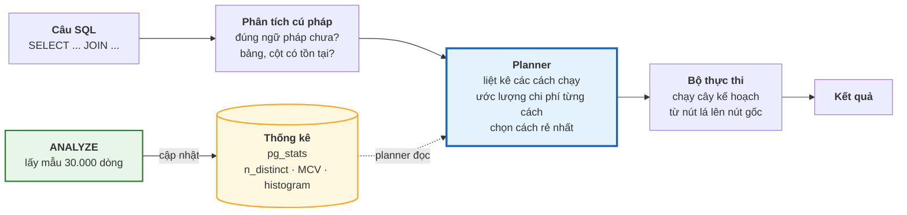
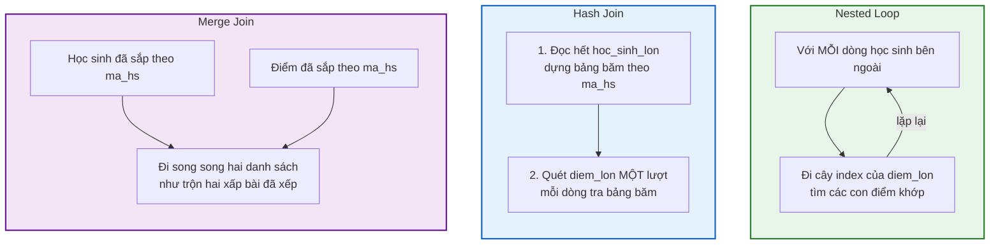

# Bài 36 — EXPLAIN và bộ tối ưu truy vấn

!!! abstract "🎯 Học xong bài này, bạn sẽ"
    - Đọc được một **cây kế hoạch** từ trong ra ngoài, và hiểu từng con số trong `cost=a..b rows=N width=W`, `actual time`, `loops`, `Buffers: shared hit/read`
    - Tự tính tay được chi phí `9167.00` của một `Seq Scan` từ `seq_page_cost`, `cpu_tuple_cost` và số trang của bảng
    - Giải thích được PostgreSQL ước lượng số dòng bằng **thống kê** — `n_distinct`, danh sách giá trị phổ biến, **histogram** — và vì sao thống kê cũ làm nó chọn kế hoạch **chậm gấp 5 lần**
    - Phân biệt ba chiến lược nối **Nested Loop**, **Hash Join**, **Merge Join** và biết khi nào mỗi loại thắng
    - Áp dụng được quy trình 5 bước để tối ưu một truy vấn chậm, và dùng `SET enable_seqscan = off` để kiểm chứng lựa chọn của planner — rồi `RESET` ngay

## 🧠 Câu chuyện mở đầu

Thầy tổng phụ trách chuẩn bị đưa 200 học sinh đi tham quan Văn Miếu. Từ trường tới đó có ba đường: đường vành đai, đường qua trung tâm, và đường nhỏ ven sông.

Thầy không đi thử cả ba đường rồi mới chọn. Thầy mở **ứng dụng bản đồ**. Ứng dụng nhìn vào dữ liệu giao thông nó thu thập được — đường nào hay tắc giờ nào, mỗi đoạn dài bao nhiêu, có bao nhiêu đèn đỏ — rồi **ước lượng** thời gian của từng đường và gợi ý đường **ước lượng nhanh nhất**. Thầy chưa đi mét nào mà đã có kế hoạch.

Hôm đó, đường ven sông mới bị rào lại để sửa cống từ sáng. Dữ liệu của ứng dụng là của hôm qua. Nó vẫn ước lượng đường ven sông mất 25 phút, vẫn gợi ý đường ấy, và đoàn xe kẹt cứng suốt một tiếng rưỡi.

Ứng dụng bản đồ **không sai về cách tính**. Nó tính rất đúng — trên dữ liệu **cũ**.

Sau chuyến đi, thầy rút ra ba bài học mà chính PostgreSQL cũng áp dụng mỗi lần bạn gửi cho nó một câu `SELECT`:

1. **Xem kế hoạch trước khi đi** — ứng dụng cho thầy xem nó định đi đường nào, qua những đoạn nào, mất bao lâu.
2. **Đi thật rồi bấm giờ** — so thời gian thật với ước lượng mới biết ứng dụng đoán sai ở đoạn nào.
3. **Cập nhật dữ liệu giao thông** — một ứng dụng thông minh cỡ nào mà dữ liệu cũ thì cũng chọn sai.

## 📖 Khái niệm & thuật ngữ

### Từ câu SQL tới kết quả

SQL là ngôn ngữ **khai báo**: bạn nói *muốn gì*, không nói *làm thế nào*. [Bài 26](../cap-3-sql/26-group-by-having.md) đã nhấn mạnh rằng thứ tự thực thi logic chỉ là **hợp đồng về kết quả**. Còn chạy thế nào — quét bảng nào trước, dùng index nào, nối hai bảng bằng cách gì — là việc của **bộ tối ưu truy vấn** mà [Bài 4](../cap-0-nhap-mon/04-cac-mo-hinh-du-lieu.md) đã nhắc tên. Trong PostgreSQL, bộ phận này thường được gọi là **bộ lập kế hoạch** (*planner*).

Planner của PostgreSQL thuộc loại **bộ tối ưu dựa trên chi phí** (*cost-based optimizer*): nó liệt kê nhiều cách chạy khả dĩ, **ước lượng chi phí** của từng cách bằng một công thức, rồi chọn cách **rẻ nhất theo ước lượng**. Chữ "theo ước lượng" là then chốt: planner giỏi tới đâu cũng chỉ giỏi bằng dữ liệu nó dựa vào — đúng như ứng dụng bản đồ.

Kết quả của planner là một **kế hoạch thực thi** (*execution plan*). **Lệnh xem kế hoạch** (*EXPLAIN*), viết là `EXPLAIN` đặt trước câu truy vấn, in kế hoạch đó ra mà **không chạy** câu truy vấn.

### Cây kế hoạch — đọc từ trong ra ngoài

Một kế hoạch có hình **cây**, gọi là **cây kế hoạch** (*plan tree*). Mỗi dòng bắt đầu bằng `->` là một **nút kế hoạch** (*plan node*) — một bước xử lý như `Seq Scan`, `Hash Join`, `Sort`. Nút nằm **thụt vào sâu hơn** là **con** của nút phía trên nó.

Luật đọc chỉ có một: **dữ liệu chảy từ dưới lên, từ trong ra ngoài.** Các nút lá — thường là các lần quét bảng — chạy trước và đẩy dòng lên cho cha; cha xử lý rồi đẩy tiếp lên; nút trên cùng trả kết quả cho bạn. Ví dụ:

```
HashAggregate                         <- 4. gom nhóm, trả kết quả
  ->  Hash Join                       <- 3. ghép từng dòng điểm với học sinh
        ->  Seq Scan on b36_diem_he   <- 2. quét bảng điểm
        ->  Hash                      <- 1b. dựng bảng băm từ...
              ->  Seq Scan on hoc_sinh_lon   <- 1a. ...toàn bộ học sinh
```

Với nút có hai con, con **dưới** thường là con được chuẩn bị trước (bảng băm của `Hash Join`, bảng trong của `Nested Loop`), con **trên** là con được duyệt dòng.

### Đọc một dòng `EXPLAIN`

```
Seq Scan on diem_lon  (cost=0.00..9167.00 rows=500000 width=35)
```

| Phần | Nghĩa |
|---|---|
| `cost=0.00..9167.00` | **Chi phí ước lượng** (*estimated cost*) — hai con số |
| `0.00` | **Chi phí khởi động** (*startup cost*): tốn bao nhiêu **trước khi** trả được dòng đầu tiên. `Sort` có chi phí khởi động lớn vì phải sắp xong mới trả được dòng nào |
| `9167.00` | **Tổng chi phí** (*total cost*): tốn bao nhiêu để trả **hết** mọi dòng. Chi phí của nút cha **đã cộng** chi phí của các con |
| `rows=500000` | **Số dòng ước lượng** mà nút này trả lên |
| `width=35` | **Độ rộng ước lượng** của mỗi dòng, tính bằng byte |

Chi phí **không phải mili giây**. Nó đo bằng một đơn vị tuỳ ý mà mốc chuẩn là: *đọc một trang theo thứ tự tốn 1 đơn vị*. Đừng so chi phí giữa hai máy, cũng đừng đổi nó ra giây. Chi phí chỉ có một công dụng: **so hai kế hoạch cho cùng một câu truy vấn trên cùng một máy**.

### Công thức chi phí và năm tham số

Planner tính chi phí từ năm tham số cấu hình, đọc được bằng `SHOW`. Hai tham số quan trọng nhất là **chi phí trang tuần tự** (*seq_page_cost*) và **chi phí trang ngẫu nhiên** (*random_page_cost*):

| Tham số | Mặc định | Nghĩa |
|---|---|---|
| `seq_page_cost` | **1.0** | Đọc một trang **theo thứ tự** — mốc chuẩn của mọi chi phí |
| `random_page_cost` | **4.0** | Đọc một trang **nhảy cóc** — mặc định đắt gấp 4 lần đọc tuần tự |
| `cpu_tuple_cost` | **0.01** | Xử lý một dòng |
| `cpu_index_tuple_cost` | **0.005** | Xử lý một mục index |
| `cpu_operator_cost` | **0.0025** | Tính một toán tử hay hàm, ví dụ một phép so sánh trong `WHERE` |

Chi phí một `Seq Scan` không có `WHERE`:

```
số_trang × seq_page_cost + số_dòng × cpu_tuple_cost
= 4167 × 1.0 + 500000 × 0.01
= 4167 + 5000 = 9167
```

Thêm một điều kiện `WHERE` thì cộng một phép so sánh cho mỗi dòng: `9167 + 500000 × 0.0025 = 10417`. Phần thực hành sẽ cho thấy PostgreSQL in ra **đúng** hai con số này.

!!! note "`random_page_cost = 4` là con số của thời ổ đĩa quay"
    Trên ổ đĩa cơ, đọc nhảy cóc chậm hơn đọc tuần tự rất nhiều vì đầu đọc phải di chuyển. Con số 4 ra đời từ thời đó. Trên ổ SSD, khác biệt nhỏ hơn hẳn, và nhiều hệ thống chỉnh `random_page_cost` xuống khoảng **1.1** để planner mạnh dạn dùng index hơn. Đây là một trong số ít tham số đáng chỉnh — nhưng chỉ chỉnh sau khi đã đo.

### `EXPLAIN ANALYZE` — chạy thật và bấm giờ

`EXPLAIN` chỉ **dự đoán**. `EXPLAIN ANALYZE` **chạy thật** câu truy vấn, rồi in kế hoạch kèm số đo thật bên cạnh mỗi ước lượng:

```
(actual time=0.026..0.038 rows=10 loops=3)
```

| Phần | Nghĩa |
|---|---|
| `actual time=0.026..0.038` | Mili giây thật **tới dòng đầu tiên** .. **tới dòng cuối cùng**, **tính cho một lần chạy** của nút |
| `rows=10` | Số dòng thật mà nút trả về, **trung bình mỗi lần chạy** |
| `loops=3` | Nút này **được chạy mấy lần** |

`loops` là chỗ ai cũng đọc sai lần đầu. Nút bên trong một `Nested Loop` chạy **một lần cho mỗi dòng** của bảng ngoài. `rows=10 loops=3` nghĩa là **tổng cộng 30 dòng**; `actual time=..0.038 loops=3` nghĩa là **tổng cộng khoảng 0,11 ms**. Muốn biết tổng, **luôn nhân với `loops`**.

Và vì `EXPLAIN ANALYZE` **chạy thật**, với `UPDATE` hay `DELETE` nó **sửa thật dữ liệu**. Phần **Lỗi thường gặp** chỉ cách làm an toàn.

### `BUFFERS` — đếm trang, không đếm mili giây

Thêm **tuỳ chọn đếm trang** (*BUFFERS*) — viết `EXPLAIN (ANALYZE, BUFFERS)` — PostgreSQL in thêm số **trang** mỗi nút đã chạm tới:

| Chữ | Nghĩa |
|---|---|
| `shared hit=N` | N trang **đã có sẵn** trong bộ nhớ đệm của PostgreSQL — nhanh |
| `shared read=N` | N trang phải **xin hệ điều hành** — hoặc từ bộ nhớ đệm của hệ điều hành, hoặc từ đĩa thật — chậm hơn |
| `dirtied`, `written` | Trang bị sửa / bị ghi ra trong lúc chạy |

Vùng bộ nhớ đệm đó gọi là **bộ đệm dùng chung** (*shared buffers*), cỡ mặc định 128 MB. Bài 33 đã nói chi phí thật của database là **số trang**; `BUFFERS` là cách **đo** chi phí đó. Nó ổn định hơn thời gian nhiều: chạy lần thứ hai, thời gian có thể giảm một nửa vì trang đã nằm trong bộ nhớ, nhưng tổng `hit + read` thì không đổi.

!!! tip "Khi tối ưu, nhìn `Buffers` trước, nhìn `actual time` sau"
    Thời gian phụ thuộc máy, phụ thuộc lần chạy trước để lại gì trong bộ nhớ. Số trang thì không. Một thay đổi làm tổng số trang giảm từ 4167 xuống 13 là một cải tiến thật trên **mọi** máy — đúng con số Bài 34 đo được khi thêm index.

### Thống kê — dữ liệu giao thông của planner

Để ước lượng `rows=`, planner cần biết dữ liệu trông thế nào. Nó không đọc cả bảng mỗi lần lập kế hoạch — quá đắt. Thay vào đó, nó dùng **thống kê** (*statistics*): một bản tóm tắt nhỏ về từng cột, lưu trong bảng hệ thống và đọc được qua view `pg_stats`.

Thống kê được thu bởi **lệnh thu thống kê** (*ANALYZE*), viết là `ANALYZE ten_bang`. Lệnh này **lấy mẫu ngẫu nhiên** khoảng 30.000 dòng (con số tính từ tham số `default_statistics_target = 100`, nhân 300), rồi với mỗi cột ghi lại:

| Cột trong `pg_stats` | Nghĩa | Ví dụ trên `diem_lon` |
|---|---|---|
| `null_frac` | Tỉ lệ ô `NULL` | `0` với mọi cột |
| `n_distinct` | **Số giá trị phân biệt** (*n_distinct*) — bao nhiêu giá trị khác nhau. Số âm nghĩa là **tỉ lệ** so với số dòng: `-1` = mọi giá trị đều khác nhau | `ma_mon`: 9 · `diem_so`: 601 · `ma_diem`: −1 |
| `most_common_vals`, `most_common_freqs` | Danh sách **giá trị phổ biến nhất** (*most common values*, viết tắt **MCV**) kèm tần suất của từng giá trị | `ma_mon`: 9 giá trị, mỗi giá trị khoảng 11% |
| `histogram_bounds` | **Biểu đồ tần suất** (*histogram*): các mốc chia những giá trị **không** nằm trong MCV thành khoảng 100 khoảng, **mỗi khoảng chứa số dòng xấp xỉ bằng nhau** | `diem_so`: 101 mốc từ 4.00 tới 10.00 |
| `correlation` | Tính tương quan của Bài 34 | `ma_diem`: 1 |

Planner dùng chúng như sau:

- `WHERE ma_mon = 3` → tra MCV, thấy tần suất khoảng 0,11 → ước lượng khoảng `0,11 × 500.000 ≈ 55.000` dòng.
- `WHERE diem_so < 5` → đếm xem mốc `5` rơi vào khoảng thứ mấy của histogram. Nếu nó rơi quanh khoảng thứ 17 trong 100 khoảng, ước lượng khoảng 17% số dòng.
- `WHERE ma_hs = 12345` → giá trị không nằm trong MCV → giả sử các giá trị còn lại chia đều: `1 / n_distinct` số dòng.
- Hai điều kiện nối bằng `AND` → **nhân** hai tỉ lệ với nhau, tức là giả sử hai cột **độc lập** — giả định này sai khi hai cột liên quan tới nhau, như bài tập 3 sẽ cho thấy.

Chữ **`ANALYZE`** xuất hiện ở hai nơi với hai nghĩa khác nhau, đừng lẫn: `EXPLAIN ANALYZE` là **chạy thật và đo**; lệnh `ANALYZE ten_bang` đứng riêng là **thu thập thống kê**. Autovacuum của Bài 33 tự chạy lệnh thứ hai khi một bảng thay đổi đủ nhiều — mặc định khi số dòng thay đổi vượt 50 cộng 10% bảng — nhưng nó chạy **mỗi phút một lần**, nên ngay sau một đợt nạp dữ liệu lớn luôn có một khoảng thời gian thống kê bị cũ.

### Ba cách nối hai bảng

Khi câu truy vấn có `JOIN`, planner chọn một trong ba thuật toán:

**Nối vòng lặp lồng** (*nested loop join*) — `Nested Loop`: với **mỗi** dòng của bảng ngoài, đi tìm các dòng khớp trong bảng trong. Nếu bảng trong có index trên cột nối, mỗi lần tìm chỉ là một lần đi cây B+Tree. Rất rẻ khi bảng ngoài có **vài dòng**; thảm hoạ khi bảng ngoài có **hàng trăm nghìn dòng**.

**Nối băm** (*hash join*) — `Hash Join`: đọc hết bảng **nhỏ hơn**, dựng một **bảng băm** trong bộ nhớ theo cột nối; rồi đọc bảng lớn **một lượt**, với mỗi dòng tra bảng băm. Mỗi bảng chỉ đọc một lần. Thắng khi cả hai bên đều **nhiều dòng**, và phép nối là phép **bằng**.

**Nối trộn** (*merge join*) — `Merge Join`: nếu cả hai bên đã **được sắp xếp** theo cột nối — thường vì có index B+Tree — thì đi song song hai danh sách như trộn hai tập bài kiểm tra đã xếp theo mã học sinh. Thắng khi hai bên **đã có sẵn thứ tự**, hoặc khi câu truy vấn **cũng cần kết quả theo thứ tự đó**.

| | Nested Loop | Hash Join | Merge Join |
|---|---|---|---|
| Thắng khi | Bảng ngoài **rất ít dòng** và bảng trong có **index** | Hai bên đều **nhiều dòng**, không có thứ tự sẵn | Hai bên **đã sắp xếp** theo cột nối, hoặc kết quả cần `ORDER BY` cột đó |
| Loại điều kiện nối | **Mọi loại**, kể cả `<`, `LIKE` | Chỉ **bằng** | Bằng (và vài dạng so sánh sắp xếp được) |
| Khởi động | Tức thì | Phải dựng xong bảng băm | Phải có dữ liệu đã sắp |
| Cần bộ nhớ | Rất ít | Chứa được bảng băm của bên nhỏ | Ít |
| Ví dụ trong bài | Tra một học sinh và 10 con điểm | Điểm trung bình của **mọi** lớp | Mọi cặp học sinh – điểm, **sắp theo mã học sinh** |

Không có thuật toán nào tốt nhất. Chính vì vậy **ước lượng số dòng** quan trọng tới thế: planner tưởng bảng ngoài có **1** dòng thì nó chọn Nested Loop, và nếu thực tế là **100.000** dòng thì Nested Loop chạy 100.000 lần. Phần thực hành sẽ dựng lại đúng tai nạn đó.

### Ép planner đổi ý — để kiểm chứng, không phải để sửa

PostgreSQL có một nhóm tham số `enable_seqscan`, `enable_indexscan`, `enable_bitmapscan`, `enable_hashjoin`, `enable_mergejoin`, `enable_nestloop`… Đặt một tham số về `off` **không cấm hẳn** thuật toán đó — nó chỉ cộng vào chi phí của thuật toán ấy một con số khổng lồ (10 tỉ), để planner chỉ dùng khi không còn cách nào khác.

Công dụng đúng duy nhất của chúng là **kiểm chứng**: *"nếu không quét toàn bảng thì kế hoạch tốt nhất còn lại là gì, và chi phí của nó bao nhiêu?"*. Tham số này đặt bằng `SET` chỉ có hiệu lực **trong phiên làm việc hiện tại**, và phải được trả lại bằng `RESET` ngay khi xem xong — nếu không, mọi câu truy vấn sau đó trong phiên đều bị ép theo.

### Quy trình 5 bước tối ưu một truy vấn chậm

| Bước | Làm gì | Công cụ |
|---|---|---|
| **1. Đo** | Chạy thật, lấy số đo — đừng đoán | `EXPLAIN (ANALYZE, BUFFERS)` |
| **2. Tìm nút đắt nhất** | Đọc từ trong ra ngoài, tìm nút có `actual time × loops` lớn nhất, hoặc nhiều trang nhất | Mắt và phép nhân |
| **3. So ước lượng với thực tế** | `rows` ước lượng lệch `rows` thật gấp 10 lần trở lên? Thống kê có vấn đề | `ANALYZE ten_bang`, `pg_stats` |
| **4. Sửa đúng nguyên nhân** | Thống kê cũ → `ANALYZE`. Quét nhiều mà lấy ít → index (Bài 34, 35). Hàm bọc cột → viết lại điều kiện. Hai cột liên quan → `CREATE STATISTICS` | Mọi thứ của Cấp 4 |
| **5. Đo lại** | Chạy lại bước 1, so số trang và thời gian. Không cải thiện thì hoàn tác thay đổi | `EXPLAIN (ANALYZE, BUFFERS)` |

Bước 5 hay bị bỏ nhất — và là bước duy nhất chứng minh bạn đã sửa được gì. [Bài 20](../cap-2-chuan-hoa/20-denormalization.md) đã hứa trước: *không có số đo thì không phi chuẩn hoá*. Quy trình này là cách lấy số đo ấy.

### Bảng thuật ngữ

| Tiếng Việt | English | Nghĩa dễ hiểu |
|---|---|---|
| Bộ lập kế hoạch | *planner* | Bộ phận của PostgreSQL chọn cách chạy một câu truy vấn |
| Bộ tối ưu dựa trên chi phí | *cost-based optimizer* | Planner liệt kê nhiều cách chạy, ước lượng chi phí từng cách và chọn cách rẻ nhất theo ước lượng |
| Kế hoạch thực thi | *execution plan* | Cách chạy cụ thể mà planner đã chọn cho một câu truy vấn |
| Lệnh xem kế hoạch | *EXPLAIN* | In kế hoạch thực thi mà không chạy; thêm `ANALYZE` để chạy thật và đo |
| Cây kế hoạch | *plan tree* | Hình cây của kế hoạch; dữ liệu chảy từ nút sâu nhất lên nút trên cùng |
| Nút kế hoạch | *plan node* | Một bước trong cây — `Seq Scan`, `Hash Join`, `Sort`… |
| Chi phí ước lượng | *estimated cost* | Con số planner dùng để so các kế hoạch, đo bằng đơn vị tuỳ ý với mốc đọc một trang tuần tự = 1 |
| Chi phí khởi động | *startup cost* | Chi phí trước khi trả được dòng đầu tiên — số thứ nhất trong `cost=a..b` |
| Tổng chi phí | *total cost* | Chi phí để trả hết mọi dòng, đã gồm chi phí các nút con — số thứ hai trong `cost=a..b` |
| Chi phí trang tuần tự | *seq_page_cost* | Chi phí đọc một trang theo thứ tự, mặc định 1 — mốc chuẩn của mọi chi phí |
| Chi phí trang ngẫu nhiên | *random_page_cost* | Chi phí đọc một trang nhảy cóc, mặc định 4; ổ SSD thường chỉnh xuống khoảng 1.1 |
| Tuỳ chọn đếm trang | *BUFFERS* | Tuỳ chọn của `EXPLAIN` in số trang mỗi nút đã chạm tới: `shared hit` từ bộ đệm, `read` phải xin hệ điều hành |
| Bộ đệm dùng chung | *shared buffers* | Vùng nhớ PostgreSQL giữ các trang vừa dùng; `shared hit` là trang lấy được từ đây |
| Thống kê | *statistics* | Bản tóm tắt từng cột — `n_distinct`, MCV, histogram, tương quan — do `ANALYZE` thu từ một mẫu ngẫu nhiên |
| Lệnh thu thống kê | *ANALYZE* | Lấy mẫu khoảng 30.000 dòng để cập nhật thống kê; autovacuum tự chạy nó định kỳ |
| Số giá trị phân biệt | *n_distinct* | Số giá trị khác nhau của một cột trong thống kê; số âm là tỉ lệ so với số dòng, `-1` là mọi giá trị đều khác nhau |
| Giá trị phổ biến nhất | *most common values* (MCV) | Danh sách giá trị hay gặp nhất của một cột kèm tần suất |
| Biểu đồ tần suất | *histogram* | Các mốc chia giá trị của cột thành khoảng 100 khoảng có số dòng xấp xỉ bằng nhau |
| Nối vòng lặp lồng | *nested loop join* | Với mỗi dòng bảng ngoài, tìm dòng khớp ở bảng trong; thắng khi bảng ngoài rất ít dòng |
| Nối băm | *hash join* | Dựng bảng băm từ bảng nhỏ rồi quét bảng lớn một lượt; thắng khi cả hai bên nhiều dòng |
| Nối trộn | *merge join* | Đi song song hai danh sách đã sắp theo cột nối; thắng khi dữ liệu đã có thứ tự |

## 🖼️ Sơ đồ

Một câu truy vấn đi qua những đâu trước khi thành kết quả — và thống kê chen vào ở bước nào:



`EXPLAIN` dừng lại sau ô **Planner** và in ra kế hoạch. `EXPLAIN ANALYZE` đi tiếp qua **Bộ thực thi** và ghi số đo thật lên từng nút.

Ba chiến lược nối, cùng ghép bảng điểm với bảng học sinh:



## 💻 Thực hành

### Công cụ

Như Bài 34 và 35, bài này bọc `EXPLAIN` vào hàm để khẳng định được nội dung kế hoạch. Thêm một hàm thứ hai đọc **số dòng ước lượng** của nút trên cùng — nó dùng `EXPLAIN (FORMAT JSON)`, định dạng máy đọc được, rồi lấy trường `Plan Rows` bằng các toán tử JSON của [Bài 32](../cap-3-sql/32-jsonb-va-full-text-search.md):

```sql
DROP FUNCTION IF EXISTS b36_ke_hoach(text);
DROP FUNCTION IF EXISTS b36_uoc_luong(text);
DROP FUNCTION IF EXISTS b36_chi_phi(text);

CREATE FUNCTION b36_ke_hoach(cau_truy_van text) RETURNS text
LANGUAGE plpgsql AS $$
DECLARE
    dong    text;
    ket_qua text := '';
BEGIN
    FOR dong IN EXECUTE 'EXPLAIN ' || cau_truy_van LOOP
        ket_qua := ket_qua || dong || E'\n';
    END LOOP;
    RETURN ket_qua;
END $$;

-- Số dòng ước lượng của nút trên cùng
CREATE FUNCTION b36_uoc_luong(cau_truy_van text) RETURNS numeric
LANGUAGE plpgsql AS $$
DECLARE ke_hoach json;
BEGIN
    EXECUTE 'EXPLAIN (FORMAT JSON) ' || cau_truy_van INTO ke_hoach;
    RETURN (ke_hoach -> 0 -> 'Plan' ->> 'Plan Rows')::numeric;
END $$;

-- Tổng chi phí ước lượng của nút trên cùng
CREATE FUNCTION b36_chi_phi(cau_truy_van text) RETURNS numeric
LANGUAGE plpgsql AS $$
DECLARE ke_hoach json;
BEGIN
    EXECUTE 'EXPLAIN (FORMAT JSON) ' || cau_truy_van INTO ke_hoach;
    RETURN (ke_hoach -> 0 -> 'Plan' ->> 'Total Cost')::numeric;
END $$;

-- KỲ VỌNG: uoc_luong = 500000
SELECT b36_uoc_luong('SELECT * FROM diem_lon') AS uoc_luong;
```

### Tự tính chi phí `9167.00`

<!-- sql:khong-chay -->
```sql
EXPLAIN SELECT * FROM diem_lon;
```

```text
 Seq Scan on diem_lon  (cost=0.00..9167.00 rows=500000 width=35)
```

Khẳng định con số đó, rồi tính lại nó từ số trang, số dòng mà planner biết (lưu trong `pg_class` — [Bài 3](../cap-0-nhap-mon/03-dbms-la-gi.md) đã cho bạn nhìn qua bảng này) và hai tham số chi phí:

```sql
-- KỲ VỌNG: dung_con_so = true
-- KỲ VỌNG: chi_phi_tu_tinh = 9167.00
SELECT b36_ke_hoach('SELECT * FROM diem_lon') LIKE '%cost=0.00..9167.00%' AS dung_con_so,
       round(relpages  * current_setting('seq_page_cost')::numeric
           + reltuples::numeric * current_setting('cpu_tuple_cost')::numeric, 2)
                                                                        AS chi_phi_tu_tinh
FROM pg_class
WHERE relname = 'diem_lon';
```

`4167 × 1 + 500000 × 0.01 = 9167`. Không có phép màu nào — planner chỉ nhân và cộng. Thêm một phép so sánh cho mỗi dòng:

```sql
-- KỲ VỌNG: co_where = true
SELECT b36_ke_hoach('SELECT * FROM diem_lon WHERE hoc_ky = 1')
       LIKE '%Seq Scan on diem_lon  (cost=0.00..10417.00%' AS co_where;
```

`9167 + 500000 × 0.0025 = 10417`. Chi phí của `Seq Scan` **không phụ thuộc** vào số dòng thoả điều kiện: dù giữ 1 dòng hay 500.000 dòng, nó vẫn phải đọc mọi trang và so mọi dòng.

### Ước lượng số dòng từ thống kê

```sql
-- KỲ VỌNG: n_distinct = 9
-- KỲ VỌNG: so_gia_tri_pho_bien = 9
SELECT n_distinct,
       array_length(most_common_freqs, 1) AS so_gia_tri_pho_bien
FROM pg_stats
WHERE tablename = 'diem_lon' AND attname = 'ma_mon';
```

Cột `ma_mon` có **9** giá trị và cả 9 đều nằm trong danh sách MCV — với cột ít giá trị như vậy, MCV mô tả được **toàn bộ** cột.

```sql
-- KỲ VỌNG: n_distinct = 601
-- KỲ VỌNG: so_moc_histogram = 101
-- KỲ VỌNG: moc_dau = 4.00
SELECT n_distinct,
       array_length(histogram_bounds::text::numeric[], 1) AS so_moc_histogram,
       (histogram_bounds::text::numeric[])[1]             AS moc_dau
FROM pg_stats
WHERE tablename = 'diem_lon' AND attname = 'diem_so';
```

Cột `diem_so` có **601** giá trị (4.00, 4.01, … 10.00) — quá nhiều để liệt kê hết, nên phần lớn được mô tả bằng **101 mốc histogram** chia thành 100 khoảng, mốc đầu là 4.00. (Cột `histogram_bounds` có kiểu đặc biệt dùng chung cho mọi kiểu dữ liệu, nên phải ép qua `text` rồi mới thành mảng số được.)

```sql
-- KỲ VỌNG: 11 dòng
-- KỲ VỌNG: moc = 4.00
SELECT unnest((histogram_bounds::text::numeric[])[1:11]) AS moc
FROM pg_stats
WHERE tablename = 'diem_lon' AND attname = 'diem_so'
ORDER BY moc;
```

Mười một mốc đầu: `4.00, 4.05, 4.11, …` — các mốc cách nhau khoảng 0,06. Vì mỗi khoảng chứa khoảng 1% số dòng, khoảng cách đều như vậy nghĩa là điểm phân bố **đều**. Nếu điểm dồn về 7–8, các mốc quanh 7–8 sẽ **dày đặc** hơn. (Mốc cụ thể phụ thuộc mẫu ngẫu nhiên, nên từ mốc thứ hai trở đi có thể lệch 0,01 trên máy bạn.)

So ước lượng với thực tế:

```sql
-- KỲ VỌNG: sai_so_mon_duoi_5_phan_tram = true
-- KỲ VỌNG: sai_so_diem_duoi_10_phan_tram = true
SELECT abs(b36_uoc_luong('SELECT * FROM diem_lon WHERE ma_mon = 3')
           - (SELECT count(*) FROM diem_lon WHERE ma_mon = 3))
       / (SELECT count(*) FROM diem_lon WHERE ma_mon = 3) < 0.05   AS sai_so_mon_duoi_5_phan_tram,
       abs(b36_uoc_luong('SELECT * FROM diem_lon WHERE diem_so < 5')
           - (SELECT count(*) FROM diem_lon WHERE diem_so < 5))
       / (SELECT count(*) FROM diem_lon WHERE diem_so < 5) < 0.10  AS sai_so_diem_duoi_10_phan_tram;
```

```sql
-- KỲ VỌNG: thuc_te_mon_3 = 55556
-- KỲ VỌNG: thuc_te_duoi_5 = 83194
SELECT (SELECT count(*) FROM diem_lon WHERE ma_mon = 3)    AS thuc_te_mon_3,
       (SELECT count(*) FROM diem_lon WHERE diem_so < 5)   AS thuc_te_duoi_5;
```

Thực tế: **55.556** và **83.194** dòng. Trên máy đo, planner ước lượng **57.100** và **83.745** — chỉ lệch vài phần trăm, dù nó chỉ nhìn một mẫu 30.000 dòng. Con số ước lượng trên máy bạn sẽ hơi khác vì mẫu là ngẫu nhiên; khoá học chỉ khẳng định sai số nhỏ hơn 5% và 10%.

### Đọc `EXPLAIN (ANALYZE, BUFFERS)` với `loops`

Tạo một index để có Nested Loop:

```sql
DROP INDEX IF EXISTS b36_idx_ma_hs;
CREATE INDEX b36_idx_ma_hs ON diem_lon (ma_hs);
```

<!-- sql:khong-chay -->
```sql
EXPLAIN (ANALYZE, BUFFERS)
SELECT h.ho_ten, d.diem_so
FROM hoc_sinh_lon h
JOIN diem_lon d ON d.ma_hs = h.ma_hs
WHERE h.ma_hs BETWEEN 100 AND 102;
```

Kết quả đo trên máy đo (thời gian trên máy bạn sẽ khác):

```text
 Nested Loop  (cost=4.79..138.12 rows=30 width=27) (actual time=0.076..0.145 rows=30 loops=1)
   Buffers: shared hit=41 read=1
   ->  Index Scan using hoc_sinh_lon_pkey on hoc_sinh_lon h  (cost=0.29..8.35 rows=3 width=25) (actual time=0.009..0.012 rows=3 loops=1)
         Index Cond: ((ma_hs >= 100) AND (ma_hs <= 102))
         Buffers: shared hit=3
   ->  Bitmap Heap Scan on diem_lon d  (cost=4.50..43.16 rows=10 width=10) (actual time=0.026..0.038 rows=10 loops=3)
         Recheck Cond: (ma_hs = h.ma_hs)
         Heap Blocks: exact=30
         Buffers: shared hit=38 read=1
         ->  Bitmap Index Scan on b36_idx_ma_hs  (cost=0.00..4.50 rows=10 width=0) (actual time=0.016..0.016 rows=10 loops=3)
               Index Cond: (ma_hs = h.ma_hs)
               Buffers: shared hit=8 read=1
 Planning Time: 0.384 ms
 Execution Time: 0.182 ms
```

Đọc từ trong ra ngoài:

1. **`Index Scan using hoc_sinh_lon_pkey`** (con trên của `Nested Loop`): đi cây khoá chính, tìm ra **3** học sinh 100, 101, 102. `loops=1` — chạy một lần.
2. **`Bitmap Index Scan` → `Bitmap Heap Scan on diem_lon`** (con dưới): `loops=3` — chạy **một lần cho mỗi học sinh**. Mỗi lần trả `rows=10`, nên tổng cộng **30** dòng. Điều kiện `ma_hs = h.ma_hs` lấy giá trị từ dòng học sinh hiện tại của vòng lặp ngoài. `Heap Blocks: exact=30` — ba lần, mỗi lần 10 trang.
3. **`Nested Loop`**: ghép và trả **30** dòng — đúng ước lượng `rows=30`.
4. **`Buffers: shared hit=41 read=1`**: tổng 42 trang, 41 trang đã có sẵn trong bộ nhớ đệm.

Ước lượng (`rows=3`, `rows=10`, `rows=30`) khớp thực tế ở **mọi nút**. Đó là dấu hiệu của một kế hoạch khoẻ mạnh.

### Ba chiến lược nối, ba tình huống

```sql
-- KỲ VỌNG: mot_hoc_sinh = true
-- KỲ VỌNG: moi_lop = true
-- KỲ VỌNG: sap_theo_ma_hs = true
SELECT b36_ke_hoach($$SELECT h.ho_ten, d.diem_so
                     FROM hoc_sinh_lon h JOIN diem_lon d ON d.ma_hs = h.ma_hs
                     WHERE h.ma_hs = 123$$)
       LIKE '%Nested Loop%'  AS mot_hoc_sinh,
       b36_ke_hoach($$SELECT h.ma_lop, avg(d.diem_so)
                     FROM hoc_sinh_lon h JOIN diem_lon d ON d.ma_hs = h.ma_hs
                     GROUP BY h.ma_lop$$)
       LIKE '%Hash Join%'    AS moi_lop,
       b36_ke_hoach($$SELECT h.ma_hs, d.diem_so
                     FROM hoc_sinh_lon h JOIN diem_lon d ON d.ma_hs = h.ma_hs
                     ORDER BY h.ma_hs$$)
       LIKE '%Merge Join%'   AS sap_theo_ma_hs;
```

- **Một học sinh** → `Nested Loop`: bên ngoài chỉ 1 dòng, bên trong đi index 1 lần.
- **Điểm trung bình của mọi lớp** → `Hash Join`: phải ghép cả 500.000 dòng điểm với 50.000 học sinh. Dựng bảng băm 50.000 học sinh rồi quét điểm một lượt. (Trên máy nhiều nhân, bạn sẽ thấy `Parallel Hash Join` — vẫn là Hash Join, chỉ chia cho nhiều tiến trình.)
- **Mọi cặp, sắp theo mã học sinh** → `Merge Join`: khoá chính của `hoc_sinh_lon` và index `b36_idx_ma_hs` đều trả dòng **đã sắp theo `ma_hs`**; trộn song song là xong, và kết quả ra **đúng thứ tự** `ORDER BY` cần mà không phải sắp thêm.

Kế hoạch **Hash Join** đầy đủ, đo thật trên máy đo — đọc từ nút sâu nhất:

```text
 Finalize GroupAggregate  (cost=10409.61..10541.28 rows=500 width=34) (actual time=154.648..161.946 rows=500 loops=1)
   Group Key: h.ma_lop
   ->  Gather Merge  (cost=10409.61..10526.28 rows=1000 width=34) (actual time=154.631..161.459 rows=1500 loops=1)
         Workers Planned: 2
         Workers Launched: 2
         ->  Sort  (cost=9409.58..9410.83 rows=500 width=34) (actual time=128.192..128.211 rows=500 loops=3)
               Sort Key: h.ma_lop
               ->  Partial HashAggregate  (cost=9380.92..9387.17 rows=500 width=34) (actual time=127.976..128.065 rows=500 loops=3)
                     Group Key: h.ma_lop
                     ->  Hash Join  (cost=1542.00..8339.25 rows=208333 width=8) (actual time=26.955..89.268 rows=166667 loops=3)
                           Hash Cond: (d.ma_hs = h.ma_hs)
                           ->  Parallel Seq Scan on diem_lon d  (cost=0.00..6250.33 rows=208333 width=10) (actual time=0.017..15.012 rows=166667 loops=3)
                           ->  Hash  (cost=917.00..917.00 rows=50000 width=6) (actual time=26.522..26.523 rows=50000 loops=3)
                                 ->  Seq Scan on hoc_sinh_lon h  (cost=0.00..917.00 rows=50000 width=6) (actual time=0.024..11.518 rows=50000 loops=3)
 Execution Time: 162.050 ms
```

- Ba tiến trình (`loops=3`), mỗi tiến trình dựng **một bảng băm 50.000 học sinh** rồi quét **một phần ba** bảng điểm: `rows=166667 loops=3` = 500.000 dòng.
- `Partial HashAggregate` — mỗi tiến trình tự gom theo lớp, ra 500 nhóm.
- `Gather Merge` gom kết quả của ba tiến trình: 3 × 500 = **1500** dòng.
- `Finalize GroupAggregate` cộng dồn các nhóm trùng lớp lại: **500** dòng, một dòng mỗi lớp.

Chú ý dòng `Seq Scan on hoc_sinh_lon h (cost=0.00..917.00 ...)`: bài tập 1 sẽ nhờ bạn tự tính con số 917 đó.

### Ép planner đổi ý — `SET` rồi `RESET`

Planner bỏ qua index `b36_idx_ma_hs` cho khoảng rộng `ma_hs BETWEEN 1 AND 40000` (Bài 34). Nó đúng không? Tắt `Seq Scan` để xem phương án tốt nhất còn lại:

```sql
SET enable_seqscan = off;

EXPLAIN SELECT * FROM diem_lon WHERE ma_hs BETWEEN 1 AND 40000;

RESET enable_seqscan;

-- KỲ VỌNG: enable_seqscan = on
SELECT current_setting('enable_seqscan') AS enable_seqscan;
```

Câu `EXPLAIN` ở giữa in ra một `Bitmap Heap Scan` với chi phí **cao hơn** chi phí của `Seq Scan` — nghĩa là planner chọn đúng. Dòng cuối khẳng định tham số đã được trả về `on`. **Luôn đặt `RESET` ngay sau `SET`**, trong cùng một khối lệnh, để không bao giờ quên.

Để khẳng định được hai con số chi phí trong cùng một câu, khoá học dùng một hàm có mệnh đề `SET` riêng. Mệnh đề này chỉ đổi tham số **trong lúc hàm chạy** và tự trả lại khi hàm kết thúc — an toàn hơn `SET` của phiên:

```sql
DROP FUNCTION IF EXISTS b36_chi_phi_khong_seqscan(text);

CREATE FUNCTION b36_chi_phi_khong_seqscan(cau_truy_van text) RETURNS numeric
LANGUAGE plpgsql
SET enable_seqscan = off
AS $$
DECLARE ke_hoach json;
BEGIN
    EXECUTE 'EXPLAIN (FORMAT JSON) ' || cau_truy_van INTO ke_hoach;
    RETURN (ke_hoach -> 0 -> 'Plan' ->> 'Total Cost')::numeric;
END $$;

-- KỲ VỌNG: planner_chon_dung = true
-- KỲ VỌNG: phien_khong_bi_anh_huong = on
SELECT b36_chi_phi_khong_seqscan('SELECT * FROM diem_lon WHERE ma_hs BETWEEN 1 AND 40000')
     > b36_chi_phi('SELECT * FROM diem_lon WHERE ma_hs BETWEEN 1 AND 40000') AS planner_chon_dung,
       current_setting('enable_seqscan')                                     AS phien_khong_bi_anh_huong;
```

Khi soạn bài, hai chi phí đo được là khoảng **16.100** cho kế hoạch bị ép dùng index và **11.667** cho `Seq Scan` mà planner tự chọn. Kế hoạch bị ép đắt hơn gần 40%.

### Thống kê cũ → kế hoạch tồi: dựng lại tai nạn

Một bảng điểm hè: ban đầu có 1000 dòng học kỳ 1 và 2, được `ANALYZE` đầy đủ. Tuỳ chọn `autovacuum_enabled = off` ở đây — như Bài 33 — chỉ để autovacuum không kịp chạy `ANALYZE` giúp ta giữa chừng:

```sql
DROP TABLE IF EXISTS b36_diem_he CASCADE;
CREATE TABLE b36_diem_he (
    ma_diem INTEGER,
    ma_hs   INTEGER,
    hoc_ky  SMALLINT,
    diem_so NUMERIC(4,2)
) WITH (autovacuum_enabled = off);

INSERT INTO b36_diem_he
SELECT n, n % 500 + 1, n % 2 + 1, 5
FROM generate_series(1, 1000) AS n;
ANALYZE b36_diem_he;
```

Rồi kỳ học hè tới: nạp **100.000** dòng với `hoc_ky = 3` — một giá trị **chưa từng xuất hiện** khi `ANALYZE` chạy:

```sql
INSERT INTO b36_diem_he
SELECT n, n % 50000 + 1, 3, 6
FROM generate_series(1001, 101000) AS n;

-- KỲ VỌNG: uoc_luong = 1
-- KỲ VỌNG: thuc_te = 100000
SELECT b36_uoc_luong('SELECT * FROM b36_diem_he WHERE hoc_ky = 3') AS uoc_luong,
       (SELECT count(*) FROM b36_diem_he WHERE hoc_ky = 3)          AS thuc_te;
```

Planner ước lượng **1** dòng; thực tế **100.000**. Theo thống kê cũ, `hoc_ky` chỉ có hai giá trị 1 và 2, mỗi giá trị 50% — không còn chỗ cho giá trị 3, nên planner hạ ước lượng xuống mức tối thiểu là 1 dòng.

Hậu quả khi nối với bảng học sinh:

```sql
-- KỲ VỌNG: chon_nested_loop = true
SELECT b36_ke_hoach($$SELECT h.ma_lop, count(*)
                     FROM b36_diem_he d JOIN hoc_sinh_lon h ON h.ma_hs = d.ma_hs
                     WHERE d.hoc_ky = 3
                     GROUP BY h.ma_lop$$)
       LIKE '%Nested Loop%' AS chon_nested_loop;
```

Planner tưởng bảng ngoài có 1 dòng nên chọn `Nested Loop` — đúng lựa chọn cho 1 dòng. Đo thật trên máy đo:

```text
 GroupAggregate  (cost=1691.82..1691.84 rows=1 width=10) (actual time=123.541..129.358 rows=500 loops=1)
   ->  Sort  (cost=1691.82..1691.82 rows=1 width=2) (actual time=123.517..125.867 rows=100000 loops=1)
         ->  Nested Loop  (cost=0.29..1691.81 rows=1 width=2) (actual time=0.161..114.673 rows=100000 loops=1)
               ->  Seq Scan on b36_diem_he d  (cost=0.00..1683.50 rows=1 width=4) (actual time=0.128..11.097 rows=100000 loops=1)
                     Filter: (hoc_ky = 3)
               ->  Index Scan using hoc_sinh_lon_pkey on hoc_sinh_lon h  (cost=0.29..8.31 rows=1 width=6) (actual time=0.001..0.001 rows=1 loops=100000)
 Execution Time: 129.553 ms
```

Hai con số tố cáo mọi thứ: `rows=1` ước lượng cạnh `rows=100000` thực tế ở nút `Seq Scan`, và **`loops=100000`** ở nút `Index Scan` — đi cây index **một trăm nghìn lần**. Đây chính là bước 3 của quy trình: ước lượng lệch thực tế **100.000 lần**.

Sửa bằng một lệnh:

```sql
ANALYZE b36_diem_he;

-- KỲ VỌNG: uoc_luong_gan_dung = true
-- KỲ VỌNG: chon_hash_join = true
SELECT b36_uoc_luong('SELECT * FROM b36_diem_he WHERE hoc_ky = 3') > 90000 AS uoc_luong_gan_dung,
       b36_ke_hoach($$SELECT h.ma_lop, count(*)
                     FROM b36_diem_he d JOIN hoc_sinh_lon h ON h.ma_hs = d.ma_hs
                     WHERE d.hoc_ky = 3
                     GROUP BY h.ma_lop$$)
       LIKE '%Hash Join%'                                                  AS chon_hash_join;
```

Ước lượng giờ xấp xỉ 100.000, và planner đổi sang `Hash Join`:

```text
 HashAggregate  (cost=4112.82..4117.82 rows=500 width=10) (actual time=24.676..24.705 rows=500 loops=1)
   ->  Hash Join  (cost=1542.00..3612.95 rows=99973 width=2) (actual time=5.738..18.371 rows=100000 loops=1)
         Hash Cond: (d.ma_hs = h.ma_hs)
         ->  Seq Scan on b36_diem_he d  (cost=0.00..1808.50 rows=99973 width=4) (actual time=0.039..4.828 rows=100000 loops=1)
         ->  Hash  (cost=917.00..917.00 rows=50000 width=6) (actual time=5.685..5.686 rows=50000 loops=1)
               ->  Seq Scan on hoc_sinh_lon h  (cost=0.00..917.00 rows=50000 width=6) (actual time=0.002..2.814 rows=50000 loops=1)
 Execution Time: 24.734 ms
```

Từ khoảng **130 ms** xuống khoảng **25 ms** trên máy đo — nhanh hơn **5 lần**, không thêm index nào, không sửa câu truy vấn nào. Chỉ cập nhật dữ liệu giao thông cho planner. Bài học của thầy tổng phụ trách, bằng số.

!!! warning "Sau mỗi đợt nạp dữ liệu lớn, chạy `ANALYZE`"
    Autovacuum sẽ tự làm, nhưng chậm nhất một phút sau — và trong một phút đó, mọi truy vấn trên bảng vừa nạp đều được lập kế hoạch bằng thống kê cũ. Các script nạp dữ liệu nên kết thúc bằng `ANALYZE ten_bang`. Tệp `dataset/03-du-lieu-lon.sql` của khoá học làm đúng như vậy, và có một dòng chú thích giải thích lý do.

### Quy trình 5 bước trên một truy vấn thật

Màn hình *"20 con điểm mới nhập gần đây nhất của môn Toán"* (môn số 7) bị than là chậm:

<!-- sql:khong-chay -->
```sql
SELECT * FROM diem_lon WHERE ma_mon = 7 ORDER BY ngay_nhap DESC LIMIT 20;
```

**Bước 1–2 — Đo và tìm nút đắt nhất:**

```sql
-- KỲ VỌNG: quet_toan_bang = true
-- KỲ VỌNG: phai_sap_xep = true
SELECT b36_ke_hoach('SELECT * FROM diem_lon WHERE ma_mon = 7 ORDER BY ngay_nhap DESC LIMIT 20')
       LIKE '%Seq Scan on diem_lon%' AS quet_toan_bang,
       b36_ke_hoach('SELECT * FROM diem_lon WHERE ma_mon = 7 ORDER BY ngay_nhap DESC LIMIT 20')
       LIKE '%Sort%'                 AS phai_sap_xep;
```

Kế hoạch quét toàn bảng, lọc ra khoảng 55.000 điểm môn 7, **sắp xếp** hết theo ngày, rồi mới lấy 20 dòng đầu. Đọc 4167 trang để trả 20 dòng.

**Bước 3 — So ước lượng:** ước lượng khoảng 55.000 dòng cho `ma_mon = 7` là đúng (thống kê tốt, như đã kiểm ở trên). Vấn đề không nằm ở thống kê.

**Bước 4 — Sửa đúng nguyên nhân:** thiếu một index vừa **lọc** theo `ma_mon` vừa **đã sắp** theo `ngay_nhap`. Theo quy tắc cột trái nhất của Bài 34: cột dùng với dấu bằng đứng trước, cột sắp xếp đứng sau.

```sql
DROP INDEX IF EXISTS b36_idx_mon_ngay;
CREATE INDEX b36_idx_mon_ngay ON diem_lon (ma_mon, ngay_nhap);
```

**Bước 5 — Đo lại:**

```sql
-- KỲ VỌNG: dung_index_moi = true
-- KỲ VỌNG: con_sap_xep = false
SELECT b36_ke_hoach('SELECT * FROM diem_lon WHERE ma_mon = 7 ORDER BY ngay_nhap DESC LIMIT 20')
       LIKE '%b36_idx_mon_ngay%' AS dung_index_moi,
       b36_ke_hoach('SELECT * FROM diem_lon WHERE ma_mon = 7 ORDER BY ngay_nhap DESC LIMIT 20')
       LIKE '%Sort%'             AS con_sap_xep;
```

Bước sắp xếp **biến mất**: index trả các dòng của môn 7 **đã theo thứ tự ngày** — B+Tree đọc được cả chiều ngược lại, nên `DESC` không cần index riêng. PostgreSQL chỉ việc đọc 20 mục cuối cùng của vùng `ma_mon = 7` rồi dừng.

```sql
-- KỲ VỌNG: 20 dòng
-- KỲ VỌNG: ngay_nhap = 2026-08-01
SELECT ma_diem, ngay_nhap
FROM diem_lon
WHERE ma_mon = 7
ORDER BY ngay_nhap DESC, ma_diem
LIMIT 20;
```

Ngày nhập mới nhất của môn 7 là **01/08/2026**. (Câu kiểm tra thêm `ma_diem` vào `ORDER BY` để thứ tự giữa các con điểm cùng ngày là tất định — thói quen của [Bài 29](../cap-3-sql/29-window-function.md).)

## ⚠️ Lỗi thường gặp

!!! danger "Lỗi 1: `EXPLAIN ANALYZE` trên `DELETE` — và dữ liệu mất thật"
    Bạn muốn xem một câu `DELETE` sẽ chạy thế nào, và gõ `EXPLAIN ANALYZE DELETE ...`. Chữ `ANALYZE` nghĩa là **chạy thật** — các dòng bị xoá thật.

    Cách an toàn: bọc trong một giao dịch rồi huỷ nó — cú pháp mà Bài 37 sẽ dạy kỹ:

    ```sql
    BEGIN;
    EXPLAIN ANALYZE DELETE FROM b36_diem_he WHERE hoc_ky = 3;
    ROLLBACK;

    -- KỲ VỌNG: con_nguyen = 100000
    SELECT count(*) AS con_nguyen FROM b36_diem_he WHERE hoc_ky = 3;
    ```

    `EXPLAIN ANALYZE` báo đã xoá 100.000 dòng, nhưng `ROLLBACK` huỷ tất cả: **100.000** dòng vẫn còn nguyên. Nếu chỉ cần xem kế hoạch mà không cần số đo, dùng `EXPLAIN` không có `ANALYZE` — nó không chạy gì cả.

!!! danger "Lỗi 2: Đọc `actual time` mà quên nhân `loops`"
    Trong tai nạn `b36_diem_he` ở phần thực hành, nút `Index Scan` có `actual time=0.001..0.001`. Nhìn qua thì tưởng nó rẻ nhất cây. Nhưng nó có **`loops=100000`**: tổng cộng khoảng `0.001 × 100000 = 100` mili giây — gần hết thời gian của cả câu truy vấn.

    Sửa: với mỗi nút, tính `actual time (số sau) × loops` và `rows × loops`. Nút đắt nhất thường là nút có `loops` lớn, không phải nút có `actual time` lớn.

!!! warning "Lỗi 3: So chi phí như thể nó là thời gian"
    `cost=0.00..9167.00` không có nghĩa là 9 giây, cũng không phải 9167 mili giây. Nó là đơn vị tuỳ ý, và thay đổi hoàn toàn khi ai đó chỉnh `random_page_cost`. Đem chi phí của hai **câu truy vấn khác nhau**, hay của cùng câu trên **hai máy khác nhau**, ra so là vô nghĩa.

    Sửa: chi phí chỉ dùng để so **các kế hoạch của cùng một câu** trên cùng một máy — đúng việc planner làm. Muốn so hiệu năng thật, dùng `actual time` và `Buffers` của `EXPLAIN (ANALYZE, BUFFERS)`.

!!! warning "Lỗi 4: Đặt `enable_seqscan = off` vĩnh viễn để \"ép dùng index\""
    Có người thấy planner "không chịu dùng index", bèn thêm `enable_seqscan = off` vào tệp cấu hình của máy chủ. Mọi câu truy vấn trên mọi bảng từ đó bị ép tránh quét toàn bảng — kể cả những câu mà quét toàn bảng nhanh hơn nhiều lần, như phần thực hành vừa cho thấy với khoảng 80% dòng.

    Sửa: `enable_*` chỉ để **chẩn đoán**, luôn `SET` rồi `RESET` ngay trong một phiên. Nếu planner chọn sai thật, tìm nguyên nhân: thống kê cũ (`ANALYZE`), hai cột liên quan (`CREATE STATISTICS`), `random_page_cost` không hợp với ổ SSD, hay đơn giản là index của bạn không phù hợp với câu truy vấn.

!!! warning "Lỗi 5: Tối ưu trên bảng 40 dòng"
    Mọi truy vấn trên bảng `hoc_sinh` 40 dòng đều chạy trong chưa tới một mili giây và đều dùng `Seq Scan`. Thêm index, đo lại, không thấy khác biệt, và kết luận *"index vô dụng"*. Hoặc ngược lại: viết một truy vấn thử trên dữ liệu nhỏ, thấy nhanh, đưa lên hệ thống thật hàng triệu dòng thì sập.

    Sửa: đo trên dữ liệu **cỡ thật** — đó là lý do khoá học có `diem_lon` 500.000 dòng. Kế hoạch thực thi phụ thuộc vào kích thước bảng; kế hoạch trên bảng nhỏ không nói gì về kế hoạch trên bảng lớn.

## ✍️ Bài tập

1. Không chạy `EXPLAIN`, hãy tính chi phí `Seq Scan` trên `hoc_sinh_lon` (417 trang, 50.000 dòng) khi không có `WHERE`, và khi có một điều kiện `WHERE`. So với con số `917.00` trong kế hoạch Hash Join ở phần thực hành, rồi kiểm bằng `b36_ke_hoach`.

2. Trong kế hoạch dưới đây, hãy đánh số thứ tự các nút theo thứ tự **bắt đầu cho ra dữ liệu**, và cho biết nút nào có thể chạy nhiều lần:

    ```text
    Sort
      ->  Hash Join
            ->  Seq Scan on muon_sach
            ->  Hash
                  ->  Nested Loop
                        ->  Seq Scan on lop
                        ->  Index Scan using hoc_sinh_pkey on hoc_sinh
    ```

3. Trong `hoc_sinh_lon`, cột `gioi_tinh` được sinh từ tính chẵn lẻ của `ma_hs`, còn `ma_lop` là `ma_hs % 500 + 1` — nên **lớp số lẻ toàn học sinh Nam**. Hãy so ước lượng với thực tế cho `WHERE ma_lop = 1 AND gioi_tinh = 'Nam'`, giải thích vì sao lệch bằng giả định **độc lập**, rồi sửa bằng `CREATE STATISTICS`.

4. Vì sao cùng một phép nối `hoc_sinh_lon JOIN diem_lon`, planner chọn `Nested Loop` khi có `WHERE h.ma_hs = 123` nhưng chọn `Hash Join` khi tính điểm trung bình mọi lớp? Trả lời bằng số dòng của bảng ngoài và chi phí của mỗi chiến lược.

5. Một câu truy vấn chạy 3 giây. `EXPLAIN (ANALYZE, BUFFERS)` cho thấy nút `Seq Scan on diem_danh` có `rows=5` ước lượng nhưng `rows=48000` thực tế, và phía trên là một `Nested Loop` với `loops=48000`. Hãy áp dụng quy trình 5 bước: nguyên nhân khả dĩ nhất là gì, bạn sửa thế nào, và làm sao biết đã sửa xong?

??? success "Đáp án"
    **Câu 1.**

    - Không có `WHERE`: `417 × 1 + 50000 × 0.01 = 417 + 500 = 917`.
    - Có một điều kiện: `917 + 50000 × 0.0025 = 917 + 125 = 1042`.

    Con số **917.00** trong nút `Seq Scan on hoc_sinh_lon` của kế hoạch Hash Join chính là trường hợp không có `WHERE` — bảng băm cần **mọi** học sinh.

    ```sql
    -- KỲ VỌNG: khong_where = true
    -- KỲ VỌNG: co_where = true
    SELECT b36_ke_hoach('SELECT * FROM hoc_sinh_lon')
           LIKE '%cost=0.00..917.00%'  AS khong_where,
           b36_ke_hoach('SELECT * FROM hoc_sinh_lon WHERE gioi_tinh = ''Nam''')
           LIKE '%cost=0.00..1042.00%' AS co_where;
    ```

    **Câu 2.**

    Đọc từ trong ra ngoài, nút sâu nhất trước:

    | Thứ tự | Nút | Ghi chú |
    |---|---|---|
    | 1 | `Seq Scan on lop` | Bảng ngoài của Nested Loop |
    | 2 | `Index Scan using hoc_sinh_pkey` | Chạy **một lần cho mỗi lớp** — nút duy nhất có `loops` lớn hơn 1 |
    | 3 | `Nested Loop` | Ghép lớp với học sinh |
    | 4 | `Hash` | Dựng bảng băm từ kết quả của Nested Loop |
    | 5 | `Seq Scan on muon_sach` | Chỉ bắt đầu cho ra dữ liệu khi bảng băm đã dựng xong |
    | 6 | `Hash Join` | Mỗi lượt mượn tra bảng băm |
    | 7 | `Sort` | Phải nhận **hết** dòng rồi mới trả được dòng đầu tiên — chi phí khởi động lớn |

    Với `Hash Join`, con dưới (`Hash`) được làm **xong trước** rồi con trên mới được duyệt. Đó là lý do chi phí khởi động của một `Hash Join` luôn gồm cả chi phí dựng bảng băm.

    **Câu 3.**

    ```sql
    -- KỲ VỌNG: thuc_te = 100
    SELECT count(*) AS thuc_te
    FROM hoc_sinh_lon
    WHERE ma_lop = 1 AND gioi_tinh = 'Nam';
    ```

    Thực tế **100** dòng: lớp 1 có 100 học sinh và **tất cả** đều là Nam. Planner thì tính: `P(ma_lop = 1) × P(gioi_tinh = 'Nam') = 1/500 × 1/2`, nhân 50.000 dòng = **50**. Nó giả định biết lớp không cho biết gì về giới tính — hai cột **độc lập**. Ở đây giả định đó sai: biết lớp là biết luôn giới tính.

    PostgreSQL có **thống kê mở rộng** để ghi lại mối quan hệ giữa các cột. Loại `dependencies` đo mức độ một cột xác định cột kia — đúng khái niệm **phụ thuộc hàm** của [Bài 16](../cap-2-chuan-hoa/16-phu-thuoc-ham.md):

    ```sql
    DROP STATISTICS IF EXISTS b36_tk_lop_gioi;
    DROP TABLE IF EXISTS b36_uoc_truoc;
    CREATE TABLE b36_uoc_truoc AS
    SELECT b36_uoc_luong($$SELECT * FROM hoc_sinh_lon WHERE ma_lop = 1 AND gioi_tinh = 'Nam'$$)
           AS uoc_luong;

    CREATE STATISTICS b36_tk_lop_gioi (dependencies) ON ma_lop, gioi_tinh FROM hoc_sinh_lon;
    ANALYZE hoc_sinh_lon;

    -- KỲ VỌNG: tang_gan_gap_doi = true
    SELECT b36_uoc_luong($$SELECT * FROM hoc_sinh_lon WHERE ma_lop = 1 AND gioi_tinh = 'Nam'$$)
           / uoc_luong BETWEEN 1.6 AND 2.4 AS tang_gan_gap_doi
    FROM b36_uoc_truoc;
    ```

    Ước lượng tăng **gần gấp đôi** — từ khoảng 50 lên khoảng 100, khớp thực tế. Khoá học khẳng định **tỉ lệ** thay vì hai con số tuyệt đối vì cả hai ước lượng đều tính từ mẫu ngẫu nhiên, nhưng tỉ lệ giữa chúng thì ổn định. (Bảng `b36_uoc_truoc` chỉ để giữ lại con số "trước" cho phép so sánh.)

    **Câu 4.**

    - Với `WHERE h.ma_hs = 123`: bảng ngoài có **1** dòng. Nested Loop chạy vòng trong **một** lần — một lần đi cây index, khoảng 13 trang. Hash Join thì phải dựng bảng băm hoặc quét cả một bảng: hàng nghìn trang. Nested Loop rẻ hơn hàng trăm lần.
    - Khi tính mọi lớp: phải ghép **cả 500.000** dòng điểm. Nested Loop sẽ đi cây index 500.000 lần — mỗi lần vài trang, tổng cộng hàng triệu lần đọc trang nhảy cóc với `random_page_cost = 4`. Hash Join đọc mỗi bảng **một lượt** theo thứ tự: 417 + 4167 trang, cộng chi phí băm. Hash Join rẻ hơn nhiều lần.

    Điểm giao nhau giữa hai chiến lược nằm ở **số dòng bảng ngoài** — và đó là lý do một ước lượng sai về số dòng, như tai nạn ở phần thực hành, dẫn thẳng tới sai chiến lược nối.

    **Câu 5.**

    - **Bước 3** chỉ ra ngay: ước lượng 5, thực tế 48.000 — lệch gần **10.000 lần**. Kéo theo `Nested Loop` với `loops=48000`: planner chọn Nested Loop vì tưởng bảng ngoài chỉ có 5 dòng, đúng tai nạn `b36_diem_he`.
    - **Nguyên nhân khả dĩ nhất:** thống kê của `diem_danh` bị cũ — có thể vừa nạp dữ liệu điểm danh của cả tháng mà autovacuum chưa kịp chạy `ANALYZE`, hoặc điều kiện lọc là một ngày **mới hơn mọi ngày** trong histogram lúc `ANALYZE` chạy lần cuối (planner nghĩ ngày đó gần như không có dòng nào).
    - **Bước 4:** `ANALYZE diem_danh;`. Nếu điều kiện gồm hai cột liên quan tới nhau, thêm `CREATE STATISTICS`. Nếu bảng liên tục nhận dữ liệu mới theo ngày, cân nhắc hạ ngưỡng auto-analyze cho riêng bảng này.
    - **Bước 5:** chạy lại `EXPLAIN (ANALYZE, BUFFERS)`. Đã sửa xong khi `rows` ước lượng và thực tế ở nút `Seq Scan on diem_danh` cùng cỡ, planner đổi sang `Hash Join`, tổng số trang và thời gian giảm. Nếu không giảm, hoàn tác và tìm nguyên nhân khác.

### Dọn dẹp cuối bài

```sql
DROP INDEX IF EXISTS b36_idx_ma_hs;
DROP INDEX IF EXISTS b36_idx_mon_ngay;
DROP TABLE IF EXISTS b36_diem_he CASCADE;
DROP TABLE IF EXISTS b36_uoc_truoc CASCADE;
DROP STATISTICS IF EXISTS b36_tk_lop_gioi;
DROP FUNCTION IF EXISTS b36_ke_hoach(text);
DROP FUNCTION IF EXISTS b36_uoc_luong(text);
DROP FUNCTION IF EXISTS b36_chi_phi(text);
DROP FUNCTION IF EXISTS b36_chi_phi_khong_seqscan(text);
ANALYZE hoc_sinh_lon;

-- KỲ VỌNG: index_con_lai = 0
-- KỲ VỌNG: bang_con_lai = 0
-- KỲ VỌNG: ham_con_lai = 0
-- KỲ VỌNG: thong_ke_mo_rong_con_lai = 0
SELECT (SELECT count(*) FROM pg_indexes WHERE indexname LIKE 'b36\_%')                AS index_con_lai,
       (SELECT count(*) FROM information_schema.tables WHERE table_name LIKE 'b36\_%') AS bang_con_lai,
       (SELECT count(*) FROM pg_proc WHERE proname LIKE 'b36\_%')                      AS ham_con_lai,
       (SELECT count(*) FROM pg_statistic_ext WHERE stxname LIKE 'b36\_%')             AS thong_ke_mo_rong_con_lai;
```

Lệnh `ANALYZE hoc_sinh_lon` cuối cùng làm mới thống kê sau khi thống kê mở rộng đã bị xoá, để các bài sau không dùng phải thống kê của một đối tượng không còn tồn tại.

## 🔑 Tóm tắt

1. PostgreSQL dùng một **bộ tối ưu dựa trên chi phí**: planner liệt kê các cách chạy, **ước lượng chi phí** từng cách và chọn cách rẻ nhất **theo ước lượng**; `EXPLAIN` in ra **cây kế hoạch**, đọc **từ trong ra ngoài** vì dữ liệu chảy từ nút sâu nhất lên nút trên cùng.
2. `cost=a..b` là **chi phí khởi động** và **tổng chi phí** tính bằng đơn vị tuỳ ý — không phải mili giây — từ năm tham số như `seq_page_cost = 1`, `random_page_cost = 4`, `cpu_tuple_cost = 0.01`; `Seq Scan` trên `diem_lon` là đúng `4167 × 1 + 500000 × 0.01 = 9167`. Chi phí chỉ dùng để so các kế hoạch của cùng một câu.
3. `EXPLAIN ANALYZE` **chạy thật** — với `DELETE` thì xoá thật, nên bọc trong `BEGIN ... ROLLBACK` — và in `actual time`, `rows`, `loops` cho **một lần chạy** của mỗi nút: luôn **nhân với `loops`**. `BUFFERS` đếm trang `shared hit`/`read`, thước đo ổn định hơn thời gian.
4. Ước lượng số dòng đến từ **thống kê** do `ANALYZE` thu từ mẫu khoảng 30.000 dòng: `n_distinct`, **MCV**, **histogram** 100 khoảng, và giả định các cột **độc lập**. Thống kê cũ làm ước lượng lệch — 1 dòng so với 100.000 — kéo theo Nested Loop chạy 100.000 vòng; một lệnh `ANALYZE` đổi sang Hash Join và nhanh hơn 5 lần.
5. **Nested Loop** thắng khi bảng ngoài rất ít dòng và bảng trong có index; **Hash Join** thắng khi hai bên đều nhiều dòng; **Merge Join** thắng khi hai bên đã sắp theo cột nối. `SET enable_seqscan = off` chỉ để **kiểm chứng** planner — `RESET` ngay — và tối ưu theo 5 bước: **đo, tìm nút đắt nhất, so ước lượng với thực tế, sửa đúng nguyên nhân, đo lại**.

---

⬅️ [Bài 35 — Các loại index khác](35-cac-loai-index-khac.md) · ➡️ [Bài 37 — Transaction và ACID](37-transaction-va-acid.md)
