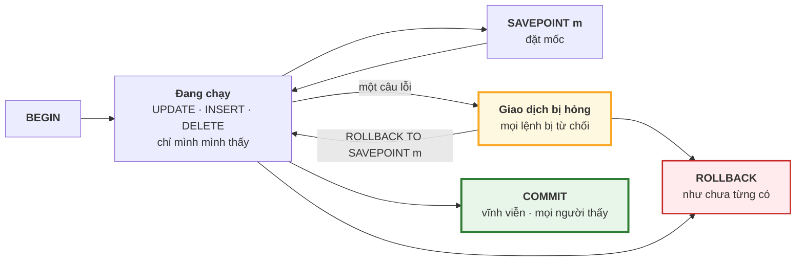
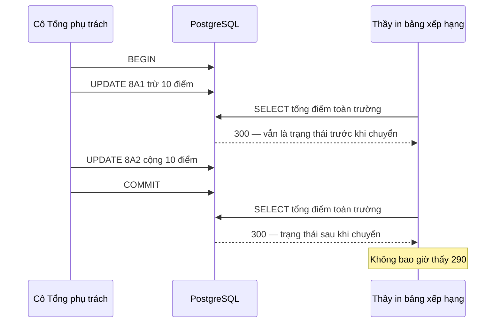

# Bài 37 — Transaction và ACID

!!! abstract "🎯 Học xong bài này, bạn sẽ"
    - Giải thích được vì sao "trừ điểm lớp này, cộng điểm lớp kia" phải là **một** giao dịch, và điều gì xảy ra nếu nó bị cắt đôi
    - Viết đúng `BEGIN`, `COMMIT`, `ROLLBACK`, và dùng `SAVEPOINT` để huỷ **một phần** giao dịch mà giữ phần còn lại
    - Phát biểu được bốn tính chất **ACID**, mỗi tính chất một ví dụ ở trường học và tên cơ chế PostgreSQL dùng để giữ nó
    - Nhận ra trạng thái *"current transaction is aborted"* và biết cách thoát ra
    - Tránh được năm lỗi hay gặp: quên `COMMIT`, giao dịch dài vô tận, tin rằng `SERIAL` không bao giờ nhảy số, kiểm tra rồi mới ghi, và gõ tiếp sau lỗi

## 🧠 Câu chuyện mở đầu

Cuối tuần, cô Tổng phụ trách chốt bảng **điểm thi đua** của các lớp. Lớp 8A1 được Ban giám hiệu đồng ý **chuyển 10 điểm** thi đua sang lớp 8A2 — hai lớp làm chung một công trình măng non, thống nhất để 8A2 đứng tên.

Việc chuyển gồm hai bước:

1. Trừ 10 điểm của 8A1.
2. Cộng 10 điểm cho 8A2.

Bạn trực nhật văn phòng làm bước 1 trên máy tính. Đúng lúc chuẩn bị làm bước 2 thì **mất điện**.

Sáng thứ Hai, bảng thi đua hiện ra: 8A1 đã bị trừ 10 điểm, 8A2 **chưa** được cộng. Mười điểm **biến mất** khỏi toàn trường. Không ai cố ý làm sai; chỉ là một việc lẽ ra phải **trọn vẹn** lại bị **cắt đôi** giữa chừng.

Tệ hơn nữa, cùng lúc đó một thầy khác đang in bảng xếp hạng. Máy in chạy ngay giữa bước 1 và bước 2, nên tờ bảng xếp hạng dán ở bảng tin cũng **thiếu 10 điểm** — dù cuối cùng mọi thứ có được sửa đúng thì tờ giấy đã dán lên rồi.

Hai vấn đề, cùng một gốc: một **việc** trong đầu người (*"chuyển 10 điểm"*) lại là **hai thao tác** trên máy. Cần một cách nói với database: *"hai thao tác này là một khối. Hoặc làm hết, hoặc coi như chưa làm gì. Và trong lúc đang làm, đừng cho ai nhìn thấy trạng thái dở dang."*

Cách nói đó tồn tại từ Bài 2. Bài này mổ xẻ nó.

## 📖 Khái niệm & thuật ngữ

### Giao dịch

**Giao dịch** (*transaction*) — [Bài 2](../cap-0-nhap-mon/02-tu-so-giay-den-excel.md) đã giới thiệu tên — là một nhóm thao tác mà database coi như **một đơn vị không chia cắt**. Ba lệnh điều khiển nó, thuộc nhóm lệnh giao tác (TCL) mà [Bài 22](../cap-3-sql/22-ddl-va-kieu-du-lieu.md) đã liệt kê:

| Lệnh | Ý nghĩa |
|---|---|
| **Mở giao dịch** (*BEGIN*) — `BEGIN` | Từ đây, mọi lệnh thuộc về một giao dịch |
| **Xác nhận** (*COMMIT*) — `COMMIT` | Chốt: mọi thay đổi trong giao dịch trở thành **vĩnh viễn** và **người khác nhìn thấy được** |
| **Huỷ bỏ** (*ROLLBACK*) — `ROLLBACK` | Huỷ: mọi thay đổi trong giao dịch **biến mất như chưa từng có** |

Việc chuyển điểm viết đúng là:

```
BEGIN;
UPDATE b37_thi_dua SET diem_thi_dua = diem_thi_dua - 10 WHERE ma_lop = 'L01';
UPDATE b37_thi_dua SET diem_thi_dua = diem_thi_dua + 10 WHERE ma_lop = 'L02';
COMMIT;
```

Mất điện ở giữa hai câu `UPDATE`? Giao dịch chưa `COMMIT` nên khi máy khởi động lại, PostgreSQL coi như nó **chưa từng xảy ra**: 8A1 vẫn còn nguyên điểm.

### Tự động xác nhận

Suốt Cấp 3 bạn chưa gõ `BEGIN` lần nào, vậy các lệnh `INSERT`, `UPDATE` hồi đó thuộc giao dịch nào? PostgreSQL mặc định chạy ở chế độ **tự động xác nhận** (*autocommit*): mỗi câu lệnh **đứng một mình** tự động được bọc trong một giao dịch riêng — `BEGIN` ngầm trước câu, `COMMIT` ngầm sau câu.

Nhờ vậy, một câu `UPDATE` chạm vào 1000 dòng **luôn** hoặc sửa đủ 1000 dòng, hoặc không sửa dòng nào — kể cả khi dòng thứ 700 vi phạm ràng buộc. Nhưng **hai** câu `UPDATE` liên tiếp là **hai** giao dịch, và điện có thể mất giữa chúng. Muốn nhiều câu thành một khối, phải tự viết `BEGIN`.

### Bốn tính chất ACID

Một giao dịch đáng tin phải có bốn tính chất, gọi chung theo chữ cái đầu của tên tiếng Anh là **bốn tính chất ACID** (*ACID*):

| Chữ | Tính chất | Hứa điều gì | Ví dụ ở trường | Cơ chế PostgreSQL dùng |
|---|---|---|---|---|
| **A** | **Tính nguyên tử** (*atomicity*) | Hoặc **tất cả**, hoặc **không gì cả** | Trừ 8A1 mà chưa cộng 8A2 thì không được phép tồn tại | Huỷ giao dịch + nhật ký ghi trước |
| **C** | **Tính nhất quán** (*consistency*) | Giao dịch đưa database từ một trạng thái **hợp lệ** sang một trạng thái **hợp lệ** khác | Điểm thi đua không bao giờ âm; điểm của học sinh luôn thuộc một học sinh có thật | Ràng buộc toàn vẹn: `CHECK`, khoá ngoại, `UNIQUE`, trigger |
| **I** | **Tính cô lập** (*isolation*) | Các giao dịch chạy **đồng thời** không nhìn thấy trạng thái **dở dang** của nhau | Thầy in bảng xếp hạng không thấy lúc 8A1 đã bị trừ mà 8A2 chưa được cộng | Đa phiên bản dữ liệu (Bài 39) và khoá (Bài 41) |
| **D** | **Tính bền vững** (*durability*) | Đã `COMMIT` thì **không mất**, kể cả mất điện ngay sau đó | Cô Tổng phụ trách bấm "Lưu", màn hình báo xong, rồi điện mới cắt — điểm vẫn còn | Nhật ký ghi trước + `fsync` (Bài 40) |

Lưu ý chữ **A** ở đây **khác** với *atomicity* của [Bài 6](../cap-1-mo-hinh-er/06-mo-hinh-quan-he.md). Ở Bài 6, "nguyên tử" nói về **một ô** chỉ chứa một giá trị đơn. Ở đây, "nguyên tử" nói về **một giao dịch** không chia cắt được. Cùng một từ, hai tầng khác nhau.

### Cơ chế đằng sau từng chữ — nêu tên, đào sâu sau

Bài này chỉ nêu tên cơ chế; Bài 38 tới Bài 41 sẽ mở từng cái ra. Nhưng chữ **A** thì bạn đã đủ kiến thức để hiểu ngay, nhờ Bài 33:

- **A** — Nhớ lại: `UPDATE` **không ghi đè** tuple cũ, mà ghi một tuple **mới** mang `xmin` là mã số của giao dịch đang chạy. Khi giao dịch bị huỷ, PostgreSQL chỉ cần **đánh dấu mã số giao dịch đó là "đã huỷ"** trong một tệp trạng thái giao dịch. Từ đó, mọi tuple mới mang `xmin` ấy bị **mọi người bỏ qua**, còn tuple cũ **chưa từng bị đụng tới** nên vẫn nguyên vẹn. Không phải chép lại gì, không phải "hoàn tác" từng dòng. Đó là lý do `ROLLBACK` một giao dịch sửa một triệu dòng vẫn **tức thì**. Các tuple bị bỏ lại thành tuple chết, chờ `VACUUM` dọn.
- **C** — Là các ràng buộc của [Bài 15](../cap-1-mo-hinh-er/15-rang-buoc-toan-ven.md). Câu lệnh nào làm vi phạm ràng buộc thì báo lỗi, và nhờ chữ **A**, cả giao dịch không thể `COMMIT` với lỗi đó. Nhưng database chỉ giữ được những luật **đã được khai báo**; luật nào chỉ nằm trong đầu người thiết kế thì không ai bảo vệ.
- **I** — PostgreSQL giữ **nhiều phiên bản** của một dòng — chính là tuple cũ và tuple mới của Bài 33 — để người đọc luôn thấy một **bức ảnh chụp** nhất quán, trong khi người ghi tạo phiên bản mới. Cơ chế này có tên riêng và được dành trọn Bài 39. Mức độ cô lập có thể chỉnh được, và Bài 38 cho thấy chỉnh xuống thì những hiện tượng lạ nào xuất hiện.
- **D** — Trước khi báo `COMMIT` thành công, PostgreSQL ghi **mô tả của thay đổi** vào một tệp nhật ký, và bắt hệ điều hành đẩy tệp đó **xuống tận đĩa** bằng lời gọi hệ thống `fsync`. Trang dữ liệu thật có thể được ghi sau. Mất điện? Khởi động lại, đọc nhật ký, làm lại những gì đã `COMMIT`. Cơ chế nhật ký này tên là **WAL** — Bài 40.

### Điểm lưu

Đôi khi bạn chỉ muốn huỷ **một phần** giao dịch. Ví dụ: đã cộng điểm cho 8A3, rồi lỡ tay trừ nhầm lớp 9A1 — muốn huỷ đúng lệnh trừ nhầm mà **giữ** lệnh cộng điểm.

**Điểm lưu** (*SAVEPOINT*) là một cái mốc đặt giữa giao dịch:

| Lệnh | Ý nghĩa |
|---|---|
| `SAVEPOINT ten_moc` | Đặt một mốc tại vị trí hiện tại |
| `ROLLBACK TO SAVEPOINT ten_moc` | Huỷ mọi thứ **từ mốc tới giờ**; giao dịch **vẫn tiếp tục**, phần trước mốc vẫn giữ |
| `RELEASE SAVEPOINT ten_moc` | Xoá mốc đi (không huỷ gì); phần sau mốc nhập vào phần trước |

Chú ý hai điều. Thứ nhất, `ROLLBACK TO SAVEPOINT` **khác hẳn** `ROLLBACK`: cái trước chỉ lùi về mốc, cái sau huỷ cả giao dịch. Thứ hai, điểm lưu **không** làm gì trở nên vĩnh viễn — mọi thứ vẫn phải chờ `COMMIT` cuối cùng; `ROLLBACK` toàn bộ thì cả phần trước mốc cũng mất.

### Giao dịch bị hỏng

Khi một câu lệnh bên trong giao dịch báo lỗi — chia cho 0, vi phạm ràng buộc, gõ sai tên cột — PostgreSQL đưa giao dịch vào trạng thái **giao dịch bị hỏng** (*aborted transaction*). Từ đó, **mọi** lệnh tiếp theo đều bị từ chối với thông báo:

```text
ERROR:  current transaction is aborted, commands ignored until end of transaction block
```

*"Giao dịch hiện tại đã bị huỷ, mọi lệnh bị bỏ qua cho tới hết khối giao dịch."* Chỉ có hai lối ra: `ROLLBACK` (huỷ cả giao dịch), hoặc `ROLLBACK TO SAVEPOINT` về một mốc đặt **trước** câu lỗi. Kể cả gõ `COMMIT` lúc này, PostgreSQL cũng chỉ thực hiện `ROLLBACK` và in chữ `ROLLBACK`.

Đây là chữ **A** đang làm việc: giao dịch đã có một phần hỏng, nên nó **không được phép** kết thúc thành công.

!!! note "Một số hệ quản trị khác xử lý khác"
    MySQL và SQL Server mặc định chỉ huỷ **câu lệnh lỗi** rồi cho giao dịch chạy tiếp. PostgreSQL chặt chẽ hơn: một câu lỗi làm hỏng cả giao dịch, trừ khi bạn chủ động dùng điểm lưu. Nếu bạn chuyển mã từ hệ khác sang, đây là chỗ hay vấp.

### DDL cũng nằm trong giao dịch

[Bài 3](../cap-0-nhap-mon/03-dbms-la-gi.md) đã hé lộ: PostgreSQL cho phép `CREATE TABLE`, `ALTER TABLE`, `DROP TABLE` nằm **trong** một giao dịch, và `ROLLBACK` huỷ được cả chúng. Tính chất này gọi là **DDL trong giao dịch** (*transactional DDL*). Hệ quả thực tế rất lớn: một đợt nâng cấp lược đồ gồm mười lệnh `ALTER TABLE` có thể bọc trong một giao dịch — lệnh thứ bảy lỗi thì cả mười lệnh cùng được huỷ, không bao giờ để lại lược đồ "nửa cũ nửa mới". Không phải hệ quản trị nào cũng làm được điều này; Oracle và MySQL tự `COMMIT` ngầm trước mỗi lệnh DDL.

### Bảng thuật ngữ

| Tiếng Việt | English | Nghĩa dễ hiểu |
|---|---|---|
| Giao dịch | *transaction* | Nhóm thao tác được coi là một đơn vị không chia cắt |
| Mở giao dịch | *BEGIN* | Bắt đầu một giao dịch; mọi lệnh sau đó thuộc về nó cho tới `COMMIT` hoặc `ROLLBACK` |
| Xác nhận | *COMMIT* | Chốt giao dịch: thay đổi thành vĩnh viễn và người khác nhìn thấy |
| Huỷ bỏ | *ROLLBACK* | Huỷ giao dịch: mọi thay đổi biến mất như chưa từng có |
| Điểm lưu | *SAVEPOINT* | Mốc giữa giao dịch; `ROLLBACK TO SAVEPOINT` huỷ phần sau mốc mà giữ phần trước |
| Tự động xác nhận | *autocommit* | Chế độ mặc định: mỗi câu lệnh đứng một mình là một giao dịch riêng |
| Bốn tính chất ACID | *ACID* | Nguyên tử, nhất quán, cô lập, bền vững — bốn lời hứa của một giao dịch đáng tin |
| Tính nguyên tử | *atomicity* | Chữ **A**: hoặc tất cả thao tác của giao dịch có hiệu lực, hoặc không thao tác nào |
| Tính nhất quán | *consistency* | Chữ **C**: giao dịch chỉ đưa database từ trạng thái hợp lệ sang trạng thái hợp lệ, theo các ràng buộc đã khai báo |
| Tính cô lập | *isolation* | Chữ **I**: các giao dịch đồng thời không thấy trạng thái dở dang của nhau |
| Tính bền vững | *durability* | Chữ **D**: đã `COMMIT` thì không mất, kể cả mất điện |
| Giao dịch bị hỏng | *aborted transaction* | Giao dịch có một câu lỗi; mọi lệnh sau bị từ chối cho tới `ROLLBACK` hoặc `ROLLBACK TO SAVEPOINT` |
| DDL trong giao dịch | *transactional DDL* | `CREATE`, `ALTER`, `DROP` nằm được trong giao dịch và bị `ROLLBACK` huỷ được |

## 🖼️ Sơ đồ

Vòng đời của một giao dịch — hai lối ra, và cái bẫy ở giữa:



Tính cô lập trong câu chuyện mở đầu — thầy in bảng xếp hạng **giữa chừng** việc chuyển điểm, nhưng không thấy trạng thái dở dang:



Người đọc chỉ thấy **trước** hoặc **sau**, không bao giờ thấy **giữa**. Cơ chế làm được điều này là chủ đề của Bài 39; thí nghiệm với hai phiên chạy song song là của Bài 38.

## 💻 Thực hành

### Bảng điểm thi đua

Bảng nháp một dòng cho mỗi lớp, mỗi lớp khởi đầu 50 điểm. Ràng buộc `CHECK` là chữ **C** — điểm thi đua không được âm:

```sql
DROP TABLE IF EXISTS b37_thi_dua CASCADE;
CREATE TABLE b37_thi_dua (
    ma_lop       CHAR(3)     PRIMARY KEY,
    ten_lop      VARCHAR(10) NOT NULL,
    diem_thi_dua INTEGER     NOT NULL CHECK (diem_thi_dua >= 0)
);

INSERT INTO b37_thi_dua (ma_lop, ten_lop, diem_thi_dua)
SELECT ma_lop, ten_lop, 50 FROM lop;

-- KỲ VỌNG: 6 dòng
-- KỲ VỌNG: ma_lop = L01
-- KỲ VỌNG: ten_lop = 8A1
-- KỲ VỌNG: diem_thi_dua = 50
SELECT ma_lop, ten_lop, diem_thi_dua FROM b37_thi_dua ORDER BY ma_lop;
```

Sáu lớp, tổng **300** điểm. Con số 300 này sẽ là phép thử cho mọi thí nghiệm: một việc chuyển điểm đúng thì tổng **không đổi**.

### Chuyển điểm trong một giao dịch

```sql
BEGIN;
UPDATE b37_thi_dua SET diem_thi_dua = diem_thi_dua - 10 WHERE ma_lop = 'L01';
UPDATE b37_thi_dua SET diem_thi_dua = diem_thi_dua + 10 WHERE ma_lop = 'L02';
COMMIT;

-- KỲ VỌNG: diem_8a1 = 40
-- KỲ VỌNG: diem_8a2 = 60
-- KỲ VỌNG: tong = 300
SELECT (SELECT diem_thi_dua FROM b37_thi_dua WHERE ma_lop = 'L01') AS diem_8a1,
       (SELECT diem_thi_dua FROM b37_thi_dua WHERE ma_lop = 'L02') AS diem_8a2,
       (SELECT sum(diem_thi_dua) FROM b37_thi_dua)                  AS tong;
```

8A1 còn 40, 8A2 lên 60, tổng vẫn 300.

### `ROLLBACK` — và cách chứng minh nó đã thật sự huỷ một thứ gì đó

Thử trừ tiếp 10 điểm của 8A1, rồi đổi ý:

```sql
DROP SEQUENCE IF EXISTS b37_bang_chung;
CREATE SEQUENCE b37_bang_chung MINVALUE 0;

BEGIN;
UPDATE b37_thi_dua SET diem_thi_dua = diem_thi_dua - 10 WHERE ma_lop = 'L01';

-- Ghi lại điểm của 8A1 NHƯ GIAO DỊCH ĐANG THẤY vào một sequence
SELECT setval('b37_bang_chung', diem_thi_dua)
FROM b37_thi_dua WHERE ma_lop = 'L01';

ROLLBACK;

-- KỲ VỌNG: diem_trong_giao_dich = 30
-- KỲ VỌNG: diem_sau_rollback = 40
SELECT (SELECT last_value FROM b37_bang_chung)                      AS diem_trong_giao_dich,
       (SELECT diem_thi_dua FROM b37_thi_dua WHERE ma_lop = 'L01')  AS diem_sau_rollback;
```

Bên trong giao dịch, 8A1 **đã** xuống **30** — bằng chứng là con số đó được ghi lại. Sau `ROLLBACK`, 8A1 trở về **40**. Lệnh `UPDATE` đã chạy thật, rồi bị xoá sạch.

Bằng chứng được cất trong một **sequence** — bộ đếm tự tăng mà `SERIAL` của [Bài 22](../cap-3-sql/22-ddl-va-kieu-du-lieu.md) dùng ngầm bên dưới — vì một lý do đặc biệt: **thay đổi trên sequence không bị `ROLLBACK` huỷ**. Mọi bảng trong giao dịch đều bị huỷ, nên nếu cất bằng chứng vào một bảng thì bằng chứng cũng mất theo. Tính chất lạ lùng này của sequence sẽ quay lại trong phần **Lỗi thường gặp**.

Trên bảng thật của khoá học, bạn làm đúng thí nghiệm đó trong `psql` của mình để tự thấy dữ liệu không đổi. Khối lệnh dưới đây **không chạy tự động** vì khoá học không bao giờ ghi vào 10 bảng thật, kể cả khi ghi rồi huỷ:

<!-- sql:khong-chay -->
```sql
BEGIN;
UPDATE diem SET diem_so = 10 WHERE ma_hs = 'HS001';
SELECT ma_mon, diem_so FROM diem WHERE ma_hs = 'HS001';   -- toàn điểm 10
ROLLBACK;
SELECT ma_mon, diem_so FROM diem WHERE ma_hs = 'HS001';   -- điểm cũ trở lại
```

### Tính nguyên tử khi có lỗi giữa chừng

Giờ chuyển **60** điểm từ 8A1 (đang có 40) sang 8A2. Lần này làm ngược thứ tự: **cộng trước, trừ sau**:

<!-- sql:co-y-loi -->
```sql
BEGIN;
UPDATE b37_thi_dua SET diem_thi_dua = diem_thi_dua + 60 WHERE ma_lop = 'L02';   -- chạy được
UPDATE b37_thi_dua SET diem_thi_dua = diem_thi_dua - 60 WHERE ma_lop = 'L01';   -- 40 - 60 < 0
```

Câu thứ hai vi phạm `CHECK`:

```text
ERROR:  new row for relation "b37_thi_dua" violates check constraint "b37_thi_dua_diem_thi_dua_check"
DETAIL:  Failing row contains (L01, 8A1, -20).
```

Câu thứ nhất đã chạy xong — 8A2 đã lên 120 điểm **bên trong** giao dịch. Nhưng giao dịch giờ đã hỏng; bạn chỉ còn cách gõ `ROLLBACK`, và cả câu cộng điểm cũng bị huỷ theo.

Khối lệnh trên không chạy tự động được vì nó cố ý gây lỗi. Để khoá học **tự kiểm** điều vừa nói, ta làm lại trong một khối `DO` của PL/pgSQL ([Bài 31](../cap-3-sql/31-trigger-procedure-function.md)). Khối `BEGIN ... EXCEPTION ... END` của PL/pgSQL có một tính chất quan trọng: khi lỗi xảy ra, **mọi thay đổi từ đầu khối** bị huỷ, y như lùi về một điểm lưu đặt ngầm ở đầu khối:

```sql
DO $$
BEGIN
    UPDATE b37_thi_dua SET diem_thi_dua = diem_thi_dua + 60 WHERE ma_lop = 'L02';
    -- bằng chứng: 8A2 đã lên bao nhiêu SAU câu thứ nhất
    PERFORM setval('b37_bang_chung', (SELECT diem_thi_dua FROM b37_thi_dua WHERE ma_lop = 'L02'));
    UPDATE b37_thi_dua SET diem_thi_dua = diem_thi_dua - 60 WHERE ma_lop = 'L01';
EXCEPTION
    WHEN check_violation THEN
        RAISE NOTICE 'Chuyển điểm thất bại, huỷ cả khối: %', SQLERRM;
END $$;

-- KỲ VỌNG: diem_8a2_giua_chung = 120
-- KỲ VỌNG: diem_8a2_bay_gio = 60
-- KỲ VỌNG: diem_8a1_bay_gio = 40
-- KỲ VỌNG: tong = 300
SELECT (SELECT last_value FROM b37_bang_chung)                      AS diem_8a2_giua_chung,
       (SELECT diem_thi_dua FROM b37_thi_dua WHERE ma_lop = 'L02')  AS diem_8a2_bay_gio,
       (SELECT diem_thi_dua FROM b37_thi_dua WHERE ma_lop = 'L01')  AS diem_8a1_bay_gio,
       (SELECT sum(diem_thi_dua) FROM b37_thi_dua)                  AS tong;
```

Giữa chừng, 8A2 **đã** là **120**. Sau khi lỗi xảy ra, 8A2 trở về **60**, 8A1 vẫn **40**, tổng vẫn **300**. Không có trạng thái "đã cộng mà chưa trừ" nào sống sót. Đó là chữ **A** và chữ **C** cùng làm việc: **C** phát hiện trạng thái sai, **A** bảo đảm không mảnh nào của nó còn lại.

### Trạng thái giao dịch bị hỏng

<!-- sql:co-y-loi -->
```sql
BEGIN;
SELECT 1 / 0;                -- lỗi
SELECT count(*) FROM lop;    -- câu hoàn toàn vô hại
```

```text
ERROR:  division by zero
ERROR:  current transaction is aborted, commands ignored until end of transaction block
```

Câu `SELECT count(*) FROM lop` không có gì sai, nhưng vẫn bị từ chối. Gõ `ROLLBACK` để thoát. Nếu bạn gõ `COMMIT`, `psql` sẽ in ra chữ `ROLLBACK` — PostgreSQL không cho một giao dịch hỏng kết thúc thành công.

### `SAVEPOINT` — huỷ một phần

Tuần này có ba quyết định: thưởng 8A3 năm điểm, phạt 9A2 năm điểm. Bạn nhập thưởng cho 8A3, rồi lỡ tay phạt nhầm lớp 9A1 những **20** điểm:

```sql
BEGIN;
UPDATE b37_thi_dua SET diem_thi_dua = diem_thi_dua + 5  WHERE ma_lop = 'L03';   -- thưởng 8A3: đúng

SAVEPOINT truoc_khi_phat;
UPDATE b37_thi_dua SET diem_thi_dua = diem_thi_dua - 20 WHERE ma_lop = 'L04';   -- phạt 9A1: NHẦM

ROLLBACK TO SAVEPOINT truoc_khi_phat;                                            -- huỷ đúng lệnh nhầm
UPDATE b37_thi_dua SET diem_thi_dua = diem_thi_dua - 5  WHERE ma_lop = 'L05';   -- phạt 9A2: đúng
COMMIT;

-- KỲ VỌNG: diem_8a3 = 55
-- KỲ VỌNG: diem_9a1 = 50
-- KỲ VỌNG: diem_9a2 = 45
SELECT (SELECT diem_thi_dua FROM b37_thi_dua WHERE ma_lop = 'L03') AS diem_8a3,
       (SELECT diem_thi_dua FROM b37_thi_dua WHERE ma_lop = 'L04') AS diem_9a1,
       (SELECT diem_thi_dua FROM b37_thi_dua WHERE ma_lop = 'L05') AS diem_9a2;
```

8A3 được thưởng (**55**), 9A1 **không** bị phạt nhầm (**50**), 9A2 bị phạt đúng (**45**). `ROLLBACK TO SAVEPOINT` chỉ huỷ phần từ mốc trở đi; lệnh thưởng đứng trước mốc vẫn còn, và giao dịch vẫn tiếp tục để nhận lệnh phạt đúng.

Điểm lưu cũng là cách **thoát khỏi trạng thái hỏng** mà không mất phần việc trước đó. Khối dưới đây cố ý gây lỗi nên không chạy tự động:

<!-- sql:co-y-loi -->
```sql
BEGIN;
UPDATE b37_thi_dua SET diem_thi_dua = diem_thi_dua + 5 WHERE ma_lop = 'L06';     -- việc đúng
SAVEPOINT thu_phat;
UPDATE b37_thi_dua SET diem_thi_dua = diem_thi_dua - 999 WHERE ma_lop = 'L01';   -- lỗi CHECK
ROLLBACK TO SAVEPOINT thu_phat;   -- giao dịch hết hỏng, việc đúng phía trên vẫn còn
COMMIT;                            -- 9A3 được +5
```

!!! tip "`psql` có sẵn một chế độ tự đặt điểm lưu"
    Gõ `\set ON_ERROR_ROLLBACK interactive` trong `psql`: từ đó, trước **mỗi** câu lệnh bạn gõ tay bên trong một giao dịch, `psql` tự đặt một điểm lưu ngầm. Gõ sai một câu thì chỉ câu đó bị huỷ, giao dịch không bị hỏng. Rất tiện khi thử nghiệm bằng tay — nhưng đừng dựa vào nó trong script, nơi một câu lỗi **nên** làm hỏng cả khối.

### Một giao dịch là một khoảnh khắc

Mỗi câu lệnh đứng một mình là một giao dịch riêng, nên mỗi câu nhận một **mã số giao dịch** khác nhau. Hàm `pg_current_xact_id()` trả về mã số đó:

```sql
DROP TABLE IF EXISTS b37_ma_gd CASCADE;
CREATE TABLE b37_ma_gd (
    lan     INTEGER,
    ma_gd   XID8        DEFAULT pg_current_xact_id(),
    luc     TIMESTAMPTZ DEFAULT now(),
    luc_that TIMESTAMPTZ DEFAULT clock_timestamp()
);

-- Hai câu đứng một mình: hai giao dịch
INSERT INTO b37_ma_gd (lan) VALUES (1);
INSERT INTO b37_ma_gd (lan) VALUES (2);

-- Hai câu trong một khối BEGIN ... COMMIT: một giao dịch
BEGIN;
INSERT INTO b37_ma_gd (lan) VALUES (3);
SELECT pg_sleep(0.05);
INSERT INTO b37_ma_gd (lan) VALUES (4);
COMMIT;

-- KỲ VỌNG: so_giao_dich_lan_1_2 = 2
-- KỲ VỌNG: so_giao_dich_lan_3_4 = 1
-- KỲ VỌNG: so_moc_now_lan_3_4 = 1
-- KỲ VỌNG: so_moc_that_lan_3_4 = 2
SELECT count(DISTINCT ma_gd)    FILTER (WHERE lan IN (1, 2)) AS so_giao_dich_lan_1_2,
       count(DISTINCT ma_gd)    FILTER (WHERE lan IN (3, 4)) AS so_giao_dich_lan_3_4,
       count(DISTINCT luc)      FILTER (WHERE lan IN (3, 4)) AS so_moc_now_lan_3_4,
       count(DISTINCT luc_that) FILTER (WHERE lan IN (3, 4)) AS so_moc_that_lan_3_4
FROM b37_ma_gd;
```

- Lần 1 và 2: **hai** mã giao dịch — chế độ tự động xác nhận.
- Lần 3 và 4: **một** mã giao dịch — chung một khối `BEGIN ... COMMIT`.
- Hàm `now()` trả về **thời điểm bắt đầu giao dịch**, nên lần 3 và 4 có **cùng một** giá trị dù cách nhau 50 mili giây. Hàm `clock_timestamp()` trả về giờ thật lúc gọi, nên ra **hai** giá trị.

Cả giao dịch mang **một** dấu thời gian `now()`. Điều này có chủ đích: mọi dòng một giao dịch ghi ra — ví dụ một lượt chuyển điểm và dòng nhật ký của nó — mang cùng một mốc thời gian, như thể chúng xảy ra trong **cùng một khoảnh khắc**. Đó cũng là cách chữ **A** hiện ra trong dữ liệu.

### DDL trong giao dịch

```sql
BEGIN;
CREATE TABLE b37_tam (x INTEGER);
INSERT INTO b37_tam VALUES (1), (2), (3);
ALTER TABLE b37_thi_dua ADD COLUMN ghi_chu TEXT;
ROLLBACK;

-- KỲ VỌNG: bang_tam_ton_tai = 0
-- KỲ VỌNG: cot_ghi_chu_ton_tai = 0
SELECT (SELECT count(*) FROM information_schema.tables
        WHERE table_name = 'b37_tam')                                AS bang_tam_ton_tai,
       (SELECT count(*) FROM information_schema.columns
        WHERE table_name = 'b37_thi_dua' AND column_name = 'ghi_chu') AS cot_ghi_chu_ton_tai;
```

Bảng `b37_tam` **không tồn tại**, cột `ghi_chu` **không được thêm**. `ROLLBACK` huỷ cả việc tạo bảng lẫn việc sửa cấu trúc bảng — đúng lời hứa của Bài 3.

### Tính bền vững: hai tham số đứng sau

```sql
-- KỲ VỌNG: fsync = on
-- KỲ VỌNG: synchronous_commit = on
SELECT current_setting('fsync')              AS fsync,
       current_setting('synchronous_commit') AS synchronous_commit;
```

- `fsync = on`: PostgreSQL bắt hệ điều hành đẩy nhật ký xuống **tận đĩa**, không để nằm trong bộ nhớ đệm của hệ điều hành.
- `synchronous_commit = on`: `COMMIT` **chờ** việc đẩy xuống đĩa xong mới báo thành công.

Tắt một trong hai thì `COMMIT` nhanh hơn — và chữ **D** không còn được bảo đảm trọn vẹn. Tắt `fsync` trên máy chủ thật là một trong những cách nhanh nhất để **mất dữ liệu vĩnh viễn** sau một lần mất điện. Bài 40 sẽ giải thích vì sao, và khi nào tắt `synchronous_commit` là chấp nhận được.

## ⚠️ Lỗi thường gặp

!!! danger "Lỗi 1: Tin rằng `SERIAL` không bao giờ nhảy số"
    Sequence nằm **ngoài** giao dịch — phần thực hành đã dùng chính tính chất đó để giữ bằng chứng. Hệ quả: một giao dịch lấy số từ sequence rồi bị huỷ thì **con số đó mất luôn**.

    ```sql
    DROP TABLE IF EXISTS b37_phieu_muon CASCADE;
    CREATE TABLE b37_phieu_muon (so_phieu SERIAL PRIMARY KEY, ma_hs CHAR(5));

    INSERT INTO b37_phieu_muon (ma_hs) VALUES ('HS001');   -- phiếu số 1

    BEGIN;
    INSERT INTO b37_phieu_muon (ma_hs) VALUES ('HS002');   -- lấy số 2...
    ROLLBACK;                                              -- ...rồi huỷ

    INSERT INTO b37_phieu_muon (ma_hs) VALUES ('HS003');

    -- KỲ VỌNG: 2 dòng
    -- KỲ VỌNG: so_phieu = 1
    SELECT so_phieu, ma_hs FROM b37_phieu_muon ORDER BY so_phieu;
    ```

    ```sql
    -- KỲ VỌNG: so_phieu_cua_hs003 = 3
    SELECT so_phieu AS so_phieu_cua_hs003 FROM b37_phieu_muon WHERE ma_hs = 'HS003';
    ```

    Phiếu của `HS003` mang số **3**; số **2** không bao giờ xuất hiện. Sequence thiết kế như vậy có chủ đích: nếu nó chờ giao dịch kết thúc mới biết có được dùng số hay không, mọi người thêm dòng sẽ phải **xếp hàng** chờ nhau.

    Sửa: dùng `SERIAL` làm **định danh**, không làm **số thứ tự không đứt quãng**. Nếu luật nghiệp vụ đòi số phiếu liên tục (hoá đơn, sổ văn thư), phải cấp số bằng một cơ chế khác — và chấp nhận việc cấp số phải xếp hàng.

!!! danger "Lỗi 2: Kiểm tra bằng một câu, ghi bằng câu khác"
    Luật mới: sau khi chuyển, lớp nguồn **phải còn ít nhất 10 điểm**. Muốn chuyển 35 điểm "chỉ khi 8A1 còn đủ", bạn viết:

    <!-- sql:khong-chay -->
    ```sql
    SELECT diem_thi_dua FROM b37_thi_dua WHERE ma_lop = 'L01';   -- thấy 50
    -- ... phần mềm kiểm tra: 50 - 35 >= 10, được ...
    UPDATE b37_thi_dua SET diem_thi_dua = diem_thi_dua - 35 WHERE ma_lop = 'L01';
    ```

    Hai giáo viên cùng làm việc này **cùng lúc** khi 8A1 có 50 điểm: cả hai đều thấy 50, cả hai đều quyết định "đủ", cả hai cùng trừ 35. Kể cả khi bọc trong `BEGIN ... COMMIT`, ở mức cô lập mặc định điều này **vẫn có thể xảy ra** — Bài 38 sẽ dựng lại nó bằng hai phiên song song. Lần trừ thứ hai làm điểm âm nên ràng buộc `CHECK (diem_thi_dua >= 0)` sẽ chặn nó. Nhưng luật "phải còn ít nhất 10 điểm" thì **không** có ràng buộc nào ghi lại: nếu hai người cùng chuyển 25 điểm từ 50, cả hai đều thấy 50 và đều qua được bước kiểm tra (50 ≥ 25 + 10), nhưng vì cả hai cùng trừ trên cùng giá trị 50 nên 8A1 còn **0**, không phải 25 như một người tưởng — vi phạm luật mà không ai chặn.

    Sửa: gộp kiểm tra vào **chính câu ghi**, để database làm cả hai việc trong một bước:

    ```sql
    UPDATE b37_thi_dua
    SET diem_thi_dua = diem_thi_dua - 35
    WHERE ma_lop = 'L01' AND diem_thi_dua >= 35 + 10;   -- phải còn ít nhất 10 sau khi trừ

    -- KỲ VỌNG: diem_8a1 = 40
    SELECT diem_thi_dua AS diem_8a1 FROM b37_thi_dua WHERE ma_lop = 'L01';
    ```

    Lúc này 8A1 có 40, không đủ `35 + 10`, nên câu `UPDATE` **không sửa dòng nào** — 8A1 vẫn **40**. Phần mềm biết kết quả nhờ số dòng bị ảnh hưởng (`UPDATE 0`). Và luật nào quan trọng thì khai thành ràng buộc — chữ **C** chỉ bảo vệ những gì được khai báo.

!!! warning "Lỗi 3: Mở giao dịch rồi quên đóng"
    Bạn gõ `BEGIN`, sửa vài dòng, rồi đi ăn trưa với cửa sổ `psql` còn mở. Hoặc một công cụ đồ hoạ tắt chế độ tự động xác nhận, và mọi câu bạn gõ cả buổi sáng đều nằm trong một giao dịch chưa `COMMIT`.

    Hậu quả: người khác **không thấy** thay đổi của bạn; các dòng bạn đã sửa bị **khoá** nên ai sửa chúng phải chờ; và `VACUUM` của Bài 33 **không dọn được** tuple chết nào sinh ra sau khi giao dịch của bạn bắt đầu — vì biết đâu bạn vẫn cần nhìn thấy chúng. Bảng phình dần cả buổi.

    Sửa: giữ giao dịch **ngắn** — mở, làm, đóng. Kiểm tra định kỳ bảng hệ thống `pg_stat_activity`, tìm các phiên có `state = 'idle in transaction'` — phiên đang giữ một giao dịch mở mà không làm gì. PostgreSQL có tham số `idle_in_transaction_session_timeout` để tự ngắt những phiên như vậy.

!!! warning "Lỗi 4: Gõ tiếp sau lỗi và tưởng các lệnh sau đã chạy"
    Trong một script dài, câu thứ 5 lỗi, và câu thứ 6 tới 50 đều bị từ chối với *"current transaction is aborted"*. Nếu công cụ chạy script bỏ qua lỗi và cứ chạy tiếp, cuối cùng nó gặp `COMMIT` — và PostgreSQL âm thầm `ROLLBACK`. Người chạy script thấy chữ `ROLLBACK` lẫn giữa hàng trăm dòng đầu ra, hoặc không thấy gì, và tưởng mọi thứ đã xong.

    Sửa: chạy script bằng `psql -v ON_ERROR_STOP=1` — dừng ngay ở lỗi đầu tiên, và trả mã lỗi để bạn biết. Hệ thống kiểm thử của chính khoá học này chạy mọi câu SQL trong bài theo đúng cách đó.

!!! warning "Lỗi 5: Bọc cả một đợt xử lý khổng lồ trong một giao dịch"
    Làm tròn 500.000 con điểm trong **một** câu `UPDATE` là một giao dịch khổng lồ: nó khoá cả 500.000 dòng tới cuối, sinh 500.000 tuple chết cùng lúc, và nếu lỗi ở dòng cuối cùng thì toàn bộ công sức mất trắng. Đó là lý do [Bài 31](../cap-3-sql/31-trigger-procedure-function.md) viết thủ tục xử lý **theo lô**, `COMMIT` sau mỗi lô.

    Sửa: giao dịch phải bao đúng **một đơn vị nghiệp vụ** — một lượt chuyển điểm, một lượt mượn sách — không hơn không kém. Việc hàng loạt thì chia lô, mỗi lô một giao dịch, và thiết kế để chạy lại được từ lô bị lỗi.

## ✍️ Bài tập

1. Không chạy, hãy dự đoán điểm cuối cùng của 8A1 (`L01`) và 8A2 (`L02`) sau đoạn lệnh sau, biết lúc bắt đầu 8A1 có 40, 8A2 có 60. Rồi chạy để kiểm.

    <!-- sql:khong-chay -->
    ```sql
    BEGIN;
    UPDATE b37_thi_dua SET diem_thi_dua = diem_thi_dua + 1 WHERE ma_lop = 'L01';
    SAVEPOINT a;
    UPDATE b37_thi_dua SET diem_thi_dua = diem_thi_dua + 2 WHERE ma_lop = 'L01';
    SAVEPOINT b;
    UPDATE b37_thi_dua SET diem_thi_dua = diem_thi_dua + 4 WHERE ma_lop = 'L02';
    ROLLBACK TO SAVEPOINT a;
    UPDATE b37_thi_dua SET diem_thi_dua = diem_thi_dua + 8 WHERE ma_lop = 'L02';
    COMMIT;
    ```

2. Luật *"tổng điểm thi đua toàn trường luôn là 300"* có được database bảo vệ không? Chứng minh bằng một câu lệnh **hợp lệ** làm vỡ luật này, và cho biết đó là vấn đề của chữ nào trong ACID.

3. Viết một thủ tục `b37_chuyen_diem(tu_lop, den_lop, so_diem)` thực hiện việc chuyển điểm, **báo lỗi** với thông điệp tiếng Việt khi lớp nguồn không đủ điểm. Chứng minh rằng khi thủ tục báo lỗi, **không** lớp nào bị thay đổi.

4. Mỗi tình huống sau vi phạm chữ nào của ACID?

    a. Mất điện ngay sau khi phần mềm báo "Đã lưu điểm", khởi động lại thì điểm không còn.

    b. Một con điểm 11 lọt được vào bảng dù thang điểm là 0 tới 10.

    c. Phần mềm thư viện ghi phiếu mượn nhưng chưa kịp trừ số lượng sách thì bị tắt; phiếu mượn còn, số sách chưa trừ.

    d. Thầy in bảng xếp hạng thấy tổng điểm 290 vì in đúng lúc đang chuyển điểm.

5. Giải thích bằng kiến thức Bài 33 vì sao `ROLLBACK` một giao dịch vừa `UPDATE` 500.000 dòng gần như **tức thì**, trong khi chính câu `UPDATE` đó tốn vài giây. Sau `ROLLBACK`, bảng có phình ra không?

??? success "Đáp án"
    **Câu 1.**

    Dự đoán: 8A1 = **41**, 8A2 = **68**.

    - `+1` cho 8A1 đứng **trước** mốc `a` nên được giữ.
    - `+2` cho 8A1 và `+4` cho 8A2 đứng **sau** mốc `a`, bị `ROLLBACK TO SAVEPOINT a` huỷ — mốc `b` nằm sau `a` nên cũng biến mất theo.
    - `+8` cho 8A2 chạy sau khi đã lùi về `a`, được giữ.

    ```sql
    BEGIN;
    UPDATE b37_thi_dua SET diem_thi_dua = diem_thi_dua + 1 WHERE ma_lop = 'L01';
    SAVEPOINT a;
    UPDATE b37_thi_dua SET diem_thi_dua = diem_thi_dua + 2 WHERE ma_lop = 'L01';
    SAVEPOINT b;
    UPDATE b37_thi_dua SET diem_thi_dua = diem_thi_dua + 4 WHERE ma_lop = 'L02';
    ROLLBACK TO SAVEPOINT a;
    UPDATE b37_thi_dua SET diem_thi_dua = diem_thi_dua + 8 WHERE ma_lop = 'L02';
    COMMIT;

    -- KỲ VỌNG: diem_8a1 = 41
    -- KỲ VỌNG: diem_8a2 = 68
    SELECT (SELECT diem_thi_dua FROM b37_thi_dua WHERE ma_lop = 'L01') AS diem_8a1,
           (SELECT diem_thi_dua FROM b37_thi_dua WHERE ma_lop = 'L02') AS diem_8a2;
    ```

    **Câu 2.**

    Không. Ràng buộc duy nhất là `CHECK (diem_thi_dua >= 0)` trên **từng dòng**. Câu sau hoàn toàn hợp lệ với nó:

    ```sql
    UPDATE b37_thi_dua SET diem_thi_dua = diem_thi_dua + 1 WHERE ma_lop = 'L06';

    -- KỲ VỌNG: tong = 310
    SELECT sum(diem_thi_dua) AS tong FROM b37_thi_dua;
    ```

    Tổng giờ không còn là 300 — nó là **310**, vì từ đầu bài tới giờ đã có các lượt thưởng, phạt hợp lệ và câu lệnh vừa rồi. Luật "tổng luôn là 300" chỉ là mong muốn trong đầu người, **chưa được khai báo** ở đâu cả.

    Đây là vấn đề của chữ **C**: database chỉ giữ nhất quán theo những ràng buộc **đã khai**. `CHECK` chỉ nhìn được một dòng; luật cộng qua nhiều dòng là loại **ràng buộc giới hạn tổng** mà [Bài 14](../cap-1-mo-hinh-er/14-chuyen-er-sang-bang.md) đã nói là khoá ngoại và `UNIQUE` không cưỡng chế nổi. Muốn bảo vệ nó phải dùng trigger ([Bài 31](../cap-3-sql/31-trigger-procedure-function.md)), hoặc thiết kế lại để mọi thay đổi điểm đều đi qua một thủ tục duy nhất như câu 3.

    **Câu 3.**

    ```sql
    DROP PROCEDURE IF EXISTS b37_chuyen_diem(CHAR, CHAR, INTEGER);

    CREATE PROCEDURE b37_chuyen_diem(p_tu CHAR(3), p_den CHAR(3), p_so_diem INTEGER)
    LANGUAGE plpgsql AS $$
    DECLARE
        v_so_dong INTEGER;
    BEGIN
        UPDATE b37_thi_dua SET diem_thi_dua = diem_thi_dua + p_so_diem WHERE ma_lop = p_den;
        UPDATE b37_thi_dua SET diem_thi_dua = diem_thi_dua - p_so_diem
        WHERE ma_lop = p_tu AND diem_thi_dua >= p_so_diem;
        GET DIAGNOSTICS v_so_dong = ROW_COUNT;
        IF v_so_dong = 0 THEN
            RAISE EXCEPTION 'Lớp % không đủ % điểm để chuyển', p_tu, p_so_diem;
        END IF;
    END $$;

    CALL b37_chuyen_diem('L02', 'L01', 8);

    -- KỲ VỌNG: diem_8a1 = 49
    -- KỲ VỌNG: diem_8a2 = 60
    SELECT (SELECT diem_thi_dua FROM b37_thi_dua WHERE ma_lop = 'L01') AS diem_8a1,
           (SELECT diem_thi_dua FROM b37_thi_dua WHERE ma_lop = 'L02') AS diem_8a2;
    ```

    Chuyển 8 điểm từ 8A2 (68) sang 8A1 (41): được **49** và **60**. `GET DIAGNOSTICS ... ROW_COUNT` lấy số dòng câu lệnh vừa sửa — cách một thủ tục biết câu `UPDATE` có điều kiện đã thành công hay không.

    Giờ thử chuyển 1000 điểm. Một câu `CALL` đứng một mình tự là một giao dịch, nên lỗi sẽ huỷ cả câu cộng điểm đã chạy trước đó. Để khoá học tự kiểm được mà không dừng vì lỗi, ta gọi nó trong một khối có `EXCEPTION`:

    ```sql
    DO $$
    BEGIN
        CALL b37_chuyen_diem('L01', 'L02', 1000);
    EXCEPTION
        WHEN raise_exception THEN
            RAISE NOTICE 'Bị từ chối: %', SQLERRM;
    END $$;

    -- KỲ VỌNG: diem_8a1 = 49
    -- KỲ VỌNG: diem_8a2 = 60
    SELECT (SELECT diem_thi_dua FROM b37_thi_dua WHERE ma_lop = 'L01') AS diem_8a1,
           (SELECT diem_thi_dua FROM b37_thi_dua WHERE ma_lop = 'L02') AS diem_8a2;
    ```

    Thông báo *"Lớp L01 không đủ 1000 điểm để chuyển"*, và cả hai lớp **giữ nguyên** 49 và 60 — kể cả 8A2, lớp đã được cộng 1000 điểm ở câu đầu tiên của thủ tục. Thủ tục cố ý **cộng trước, trừ sau** để chứng minh điều này: dù thứ tự thế nào, tính nguyên tử bảo đảm không có nửa lượt chuyển nào sống sót.

    **Câu 4.**

    | Tình huống | Chữ bị vi phạm | Vì sao |
    |---|---|---|
    | a. Báo "Đã lưu" rồi mất | **D** — bền vững | Đã `COMMIT` thì không được mất |
    | b. Điểm 11 lọt vào | **C** — nhất quán | Trạng thái vi phạm luật lọt vào database. (Với bảng `diem` của khoá học, `CHECK (diem_so BETWEEN 0 AND 10)` chặn được việc này) |
    | c. Phiếu còn, sách chưa trừ | **A** — nguyên tử | Hai thao tác của một việc bị cắt đôi — đúng câu chuyện mở đầu |
    | d. Thấy tổng 290 | **I** — cô lập | Nhìn thấy trạng thái dở dang của một giao dịch khác |

    **Câu 5.**

    Bài 33: `UPDATE` không ghi đè mà ghi **500.000 tuple mới**, mỗi tuple mang `xmin` là mã số giao dịch đang chạy, và điền `xmax` cho 500.000 tuple cũ. Việc ghi này tốn thời gian — vài giây.

    `ROLLBACK` thì chỉ **đánh dấu một mã số giao dịch là "đã huỷ"** — một thao tác cỡ vài byte. Từ đó mọi người đọc tự động:

    - bỏ qua 500.000 tuple mới vì `xmin` của chúng thuộc một giao dịch đã huỷ;
    - coi 500.000 tuple cũ là **còn sống**, vì `xmax` của chúng cũng thuộc giao dịch đã huỷ đó — một lần xoá bị huỷ thì coi như chưa xoá.

    Không phải chép lại dòng nào, nên gần như tức thì.

    Và **có**, bảng vẫn phình: 500.000 tuple mới vẫn nằm trên đĩa, giờ là tuple chết — bảng to gần gấp đôi, như thí nghiệm `b33_phinh` của Bài 33, cho tới khi `VACUUM` dọn chúng đi. Một giao dịch bị huỷ **không miễn phí**: nó để lại rác.

### Dọn dẹp cuối bài

```sql
DROP PROCEDURE IF EXISTS b37_chuyen_diem(CHAR, CHAR, INTEGER);
DROP TABLE IF EXISTS b37_thi_dua CASCADE;
DROP TABLE IF EXISTS b37_ma_gd CASCADE;
DROP TABLE IF EXISTS b37_phieu_muon CASCADE;
DROP TABLE IF EXISTS b37_tam CASCADE;
DROP SEQUENCE IF EXISTS b37_bang_chung;

-- KỲ VỌNG: bang_con_lai = 0
-- KỲ VỌNG: sequence_con_lai = 0
-- KỲ VỌNG: thu_tuc_con_lai = 0
SELECT (SELECT count(*) FROM information_schema.tables WHERE table_name LIKE 'b37\_%')         AS bang_con_lai,
       (SELECT count(*) FROM information_schema.sequences WHERE sequence_name LIKE 'b37\_%')   AS sequence_con_lai,
       (SELECT count(*) FROM pg_proc WHERE proname LIKE 'b37\_%')                              AS thu_tuc_con_lai;
```

## 🔑 Tóm tắt

1. Một **giao dịch** gom nhiều thao tác thành một đơn vị không chia cắt: `BEGIN` mở, `COMMIT` chốt cho vĩnh viễn và cho người khác thấy, `ROLLBACK` huỷ như chưa từng có. Không viết `BEGIN` thì PostgreSQL ở chế độ **tự động xác nhận** — mỗi câu lệnh một giao dịch — nên "trừ lớp này, cộng lớp kia" phải tự bọc trong `BEGIN ... COMMIT`.
2. **ACID** là bốn lời hứa: **nguyên tử** — tất cả hoặc không gì cả, nhờ huỷ giao dịch và nhật ký ghi trước; **nhất quán** — chỉ từ trạng thái hợp lệ sang trạng thái hợp lệ, nhờ ràng buộc **đã khai báo**; **cô lập** — không ai thấy trạng thái dở dang, nhờ đa phiên bản và khoá (Bài 38, 39, 41); **bền vững** — đã `COMMIT` thì không mất, nhờ nhật ký WAL và `fsync` (Bài 40).
3. `ROLLBACK` gần như tức thì vì `UPDATE` không ghi đè (Bài 33): chỉ cần đánh dấu mã giao dịch là "đã huỷ" thì mọi tuple nó tạo ra bị bỏ qua và tuple cũ vẫn nguyên — nhưng các tuple bị bỏ lại vẫn là rác chờ `VACUUM`. Bằng chứng trong bài: 8A2 đã lên 120 giữa chừng, rồi trở về 60, tổng vẫn 300.
4. **`SAVEPOINT`** đặt mốc giữa giao dịch; `ROLLBACK TO SAVEPOINT` huỷ phần sau mốc, giữ phần trước, và giao dịch chạy tiếp. Một câu lỗi đưa giao dịch vào trạng thái **bị hỏng** — *"current transaction is aborted"* — chỉ thoát bằng `ROLLBACK` hoặc `ROLLBACK TO SAVEPOINT`; gõ `COMMIT` lúc đó cũng thành `ROLLBACK`.
5. PostgreSQL có **DDL trong giao dịch**: `CREATE`, `ALTER` bị `ROLLBACK` huỷ được. Sequence thì **nằm ngoài** giao dịch nên `SERIAL` có thể nhảy số. Giữ giao dịch **ngắn** và bao đúng một đơn vị nghiệp vụ, gộp kiểm tra vào chính câu ghi, và chạy script với `ON_ERROR_STOP` để không bao giờ tưởng một giao dịch hỏng đã thành công.

---

⬅️ [Bài 36 — EXPLAIN và bộ tối ưu truy vấn](36-explain-va-query-planner.md) · ➡️ [Bài 38 — Mức cô lập và các hiện tượng bất thường](38-isolation-level-va-anomaly.md)
