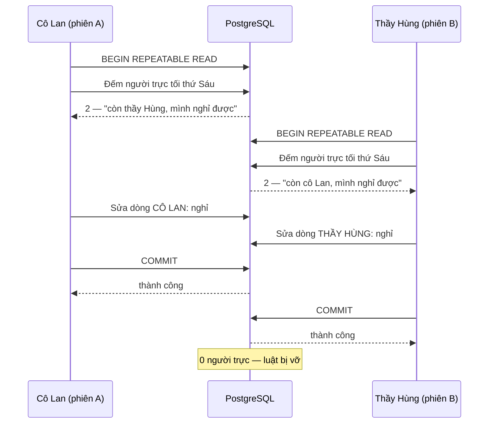
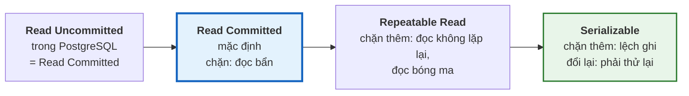

# Bài 38 — Mức cô lập và các hiện tượng bất thường

!!! abstract "🎯 Học xong bài này, bạn sẽ"
    - Gọi đúng tên và nhận ra năm hiện tượng khi nhiều giao dịch chạy cùng lúc: **đọc bẩn**, **đọc không lặp lại**, **đọc bóng ma**, **lệch ghi**, và **mất cập nhật** của Bài 2
    - Đọc được bảng ma trận **4 mức cô lập × 4 hiện tượng**, và biết PostgreSQL chặt hơn chuẩn SQL ở những ô nào
    - Tự dựng lại từng hiện tượng bằng **hai phiên** chạy xen kẽ — bằng tay trong hai cửa sổ `psql`, hoặc để máy tự chạy và tự kiểm
    - Đọc hiểu thông báo *"could not serialize access"* và biết vì sao ứng dụng dùng mức cô lập cao **bắt buộc** phải có vòng thử lại
    - Tránh được năm lỗi hay gặp: đọc rồi ghi đè, quên thử lại, đặt mức cô lập sai chỗ, hiểu sai thời điểm chụp ảnh, và chỉ một phía dùng Serializable

## 🧠 Câu chuyện mở đầu

Mùa ôn thi, trường mở phòng tự học buổi tối. Luật của Ban giám hiệu rất đơn giản: **tối nào cũng phải có ít nhất một giáo viên trực**.

Tối thứ Sáu, hai người được xếp trực: cô Lan và thầy Hùng. Chiều hôm đó cả hai cùng bị cảm.

Lúc 16:00, cô Lan mở phần mềm xếp lịch. Màn hình ghi: *"Tối nay: 2 người trực"*. Cô nghĩ: *"Còn thầy Hùng, mình nghỉ được"*, và bấm **Xin nghỉ**. Phần mềm kiểm tra: còn 2 người, đủ điều kiện — duyệt.

Cũng lúc 16:00, ở phòng bên, thầy Hùng mở đúng màn hình đó. *"Tối nay: 2 người trực"*. Thầy nghĩ: *"Còn cô Lan"*, và bấm **Xin nghỉ**. Phần mềm kiểm tra: còn 2 người — duyệt.

Tối thứ Sáu, phòng tự học **không có ai trực**.

Điều kỳ lạ là không ai làm sai. Mỗi người quyết định đúng theo những gì mình thấy. Phần mềm bọc mỗi lượt xin nghỉ trong một giao dịch, và đúng như lời hứa **I** của Bài 37, không ai nhìn thấy trạng thái **dở dang** của người kia — cô Lan không thấy "thầy Hùng đang xin nghỉ", thầy Hùng cũng không. Vậy mà kết quả cuối cùng vẫn vi phạm luật.

Hoá ra chữ **I** không phải một công tắc bật/tắt. Nó có **nhiều mức**, và ở mức mặc định của hầu hết database, chuyện này **được phép xảy ra**. Bài này đi tìm: có những "chuyện lạ" nào, mức nào chặn được chuyện nào, và cái giá phải trả là gì.

## 📖 Khái niệm & thuật ngữ

### Cô lập hoàn hảo — và cái giá của nó

Cách an toàn tuyệt đối là cho các giao dịch chạy **lần lượt**: xong người này mới tới người kia. Khi đó không chuyện lạ nào xảy ra được — cô Lan xin nghỉ xong, thầy Hùng mở màn hình sẽ thấy *"1 người trực"* và không bấm nữa.

Nhưng một trường có hàng trăm người dùng cùng lúc thì không thể bắt tất cả xếp hàng một. Database vì vậy cho các giao dịch chạy **đồng thời** — khái niệm Bài 2 đã nêu — và **cam kết** rằng kết quả giống như chạy lần lượt ở một mức độ nào đó. Mức độ cam kết ấy gọi là **mức cô lập** (*isolation level*). Mức càng cao thì càng ít chuyện lạ, nhưng giao dịch càng hay phải **chờ nhau** hoặc bị **huỷ để làm lại**.

### Bốn hiện tượng bất thường

Chuẩn SQL định nghĩa các mức cô lập bằng cách liệt kê những hiện tượng nào **bị cấm** ở mỗi mức. Có bốn hiện tượng cần biết, sắp từ "thô" tới "tinh vi":

| Hiện tượng | Chuyện gì xảy ra | Ví dụ ở trường |
|---|---|---|
| **Đọc bẩn** (*dirty read*) | Đọc được dữ liệu mà một giao dịch khác **đã ghi nhưng chưa xác nhận** — và có thể sẽ bị huỷ | Thầy in bảng xếp hạng thấy 8A2 được cộng 10 điểm, rồi cô Tổng phụ trách bấm huỷ. Tờ giấy in ra chứa một con số **chưa bao giờ tồn tại** |
| **Đọc không lặp lại** (*non-repeatable read*) | Trong **một** giao dịch, đọc **cùng một dòng** hai lần mà được hai giá trị khác nhau, vì giữa hai lần có giao dịch khác sửa và xác nhận | Cô chủ nhiệm đầu giờ đọc điểm Toán của An là 7, tính xếp loại xong đọc lại thấy 8 — xếp loại đã tính trên con số cũ |
| **Đọc bóng ma** (*phantom read*) | Trong một giao dịch, chạy **cùng một điều kiện** hai lần mà được **tập dòng** khác nhau, vì có dòng mới được thêm (hoặc bị xoá) và xác nhận ở giữa | Đếm sĩ số 8A1 được 6 để in danh sách, in xong thấy danh sách có 7 người — một học sinh chuyển đến vừa được nhập |
| **Lệch ghi** (*write skew*) | Hai giao dịch **cùng đọc** một tập dữ liệu, mỗi bên **ghi vào một dòng khác nhau** dựa trên cái đã đọc. Từng bên đúng, gộp lại thì sai | Câu chuyện mở đầu: hai người cùng thấy "2 người trực", mỗi người sửa **dòng của mình**, kết quả 0 người trực |

Để ý sự khác nhau giữa đọc không lặp lại và đọc bóng ma: cái trước là **giá trị** của dòng đã đọc bị đổi, cái sau là **tập dòng** thoả điều kiện bị đổi.

Lệch ghi là loại khó chịu nhất, vì **không** giao dịch nào nhìn thấy dữ liệu bẩn hay dở dang. Chuẩn SQL không đặt tên riêng cho nó; tài liệu PostgreSQL gọi chung các trường hợp "chạy song song cho kết quả mà không thứ tự chạy lần lượt nào cho ra được" là **bất thường tuần tự hoá** (*serialization anomaly*), và lệch ghi là đại diện nổi tiếng nhất của nhóm này.

Còn **mất cập nhật** của Bài 2 — hai người cùng đọc một con số, cùng tính giá trị mới, người sau ghi đè người trước — cũng thuộc nhóm này. Phần ⚠️ sẽ dựng lại nó.

### Bốn mức cô lập

Chuẩn SQL định nghĩa bốn mức, từ thấp tới cao:

| Mức | Tên đầy đủ | Lời hứa |
|---|---|---|
| 1 | **Đọc chưa xác nhận** (*Read Uncommitted*) | Gần như không hứa gì: được phép đọc cả dữ liệu chưa xác nhận |
| 2 | **Đọc đã xác nhận** (*Read Committed*) | Chỉ đọc dữ liệu **đã xác nhận** — tính tới lúc **câu lệnh** bắt đầu |
| 3 | **Đọc lặp lại được** (*Repeatable Read*) | Đọc lại dòng nào cũng được đúng giá trị cũ — cả giao dịch nhìn một **bức ảnh chụp** duy nhất |
| 4 | **Tuần tự hoá được** (*Serializable*) | Kết quả **y như** các giao dịch đã chạy lần lượt theo một thứ tự nào đó |

**PostgreSQL mặc định chạy ở Read Committed.** Mỗi **câu lệnh** chụp một bức ảnh mới về những gì đã xác nhận lúc câu lệnh bắt đầu, nên hai câu `SELECT` trong cùng giao dịch có thể thấy hai bức ảnh khác nhau.

Ở Repeatable Read, **cả giao dịch** dùng chung một bức ảnh, chụp lúc câu lệnh **đầu tiên** của giao dịch chạy — không phải lúc gõ `BEGIN`. Bức ảnh này được dựng thế nào từ `xmin`, `xmax` của Bài 33 là nội dung của Bài 39.

### Ma trận: mức nào cho phép hiện tượng nào

Đây là bảng quan trọng nhất của bài. "Có thể" nghĩa là mức đó **cho phép** hiện tượng xảy ra; "Không" nghĩa là bị chặn.

| Mức cô lập | Đọc bẩn | Đọc không lặp lại | Đọc bóng ma | Lệch ghi |
|---|---|---|---|---|
| Read Uncommitted | Chuẩn: có thể · **PostgreSQL: không** | Có thể | Có thể | Có thể |
| Read Committed | Không | Có thể | Có thể | Có thể |
| Repeatable Read | Không | Không | Chuẩn: có thể · **PostgreSQL: không** | Có thể |
| Serializable | Không | Không | Không | Không |

Hai ô in đậm là chỗ PostgreSQL **chặt hơn** chuẩn — chuẩn SQL chỉ quy định mức **tối thiểu** phải chặn, không cấm chặn nhiều hơn:

- **PostgreSQL không có Read Uncommitted thật.** Bạn vẫn gõ được `READ UNCOMMITTED`, nhưng nó hành xử **y hệt Read Committed**: đọc bẩn **không bao giờ** xảy ra trong PostgreSQL, ở bất kỳ mức nào. Lý do nằm ở cách lưu nhiều phiên bản của Bài 33: dòng chưa xác nhận là một tuple mang `xmin` của một giao dịch chưa xong, và người khác chỉ cần **bỏ qua** nó — đọc bản đã xác nhận chẳng tốn gì hơn.
- **Repeatable Read của PostgreSQL chặn luôn đọc bóng ma**, vì cả giao dịch nhìn một bức ảnh: dòng thêm sau khi chụp thì không có trong ảnh.

Cột **lệch ghi** chỉ có Serializable chặn được. Đó chính là lỗ hổng của câu chuyện mở đầu.

### Serializable làm việc thế nào — và cái giá

PostgreSQL không bắt các giao dịch Serializable xếp hàng. Nó cho chúng chạy song song như Repeatable Read, nhưng **ghi lại** ai đã đọc gì và ai đã ghi gì. Khi phát hiện một chuỗi phụ thuộc mà không thứ tự chạy lần lượt nào giải thích được, nó **huỷ một giao dịch** với thông báo:

```text
ERROR:  could not serialize access due to read/write dependencies among transactions
```

Repeatable Read cũng có một kiểu huỷ tương tự, khi hai giao dịch cùng sửa **một dòng**:

```text
ERROR:  could not serialize access due to concurrent update
```

Cả hai được gọi là **lỗi tuần tự hoá** (*serialization failure*), mang mã lỗi SQLSTATE `40001`. Đây **không** phải lỗi của dữ liệu hay lỗi của câu lệnh. Nó có nghĩa: *"lần này không được, hãy làm lại cả giao dịch từ đầu"*. Làm lại thì giao dịch sẽ đọc thấy dữ liệu mới và quyết định lại cho đúng — thầy Hùng làm lại sẽ thấy "1 người trực" và không xin nghỉ nữa.

Đó là cái giá của mức cao: ứng dụng **bắt buộc** phải có vòng thử lại. Không có thì người dùng nhận một thông báo lỗi khó hiểu.

### Cách chọn mức cô lập

| Cách viết | Tác dụng |
|---|---|
| `BEGIN ISOLATION LEVEL REPEATABLE READ;` | Mở giao dịch ở mức chỉ định |
| `SET TRANSACTION ISOLATION LEVEL SERIALIZABLE;` | Đặt mức cho giao dịch **đang mở** — phải là lệnh đầu tiên sau `BEGIN` |
| `SHOW transaction_isolation;` | Xem mức của giao dịch hiện tại |
| Tham số `default_transaction_isolation` | Mức mặc định cho mọi giao dịch mới — đặt được cho cả database hoặc từng người dùng |

!!! note "Các hệ quản trị khác chọn mặc định khác"
    MySQL (InnoDB) mặc định **Repeatable Read**; SQL Server và Oracle mặc định **Read Committed**. Cùng một cái tên cũng có thể mang lời hứa khác nhau: mức `SERIALIZABLE` của Oracle thực chất chỉ làm được như Repeatable Read của PostgreSQL — **vẫn** để lọt lệch ghi. Khi chuyển ứng dụng giữa các hệ, đừng chỉ so tên mức; hãy đọc bảng hiện tượng của từng hệ.

### Bảng thuật ngữ

| Tiếng Việt | English | Nghĩa dễ hiểu |
|---|---|---|
| Mức cô lập | *isolation level* | Mức độ database cam kết các giao dịch đồng thời cư xử như chạy lần lượt; mức càng cao càng ít hiện tượng lạ |
| Đọc chưa xác nhận | *Read Uncommitted* | Mức thấp nhất của chuẩn, cho phép đọc bẩn; trong PostgreSQL hành xử y hệt Read Committed |
| Đọc đã xác nhận | *Read Committed* | Mức mặc định của PostgreSQL: mỗi câu lệnh thấy dữ liệu đã xác nhận tính tới lúc câu lệnh bắt đầu |
| Đọc lặp lại được | *Repeatable Read* | Cả giao dịch nhìn một bức ảnh chụp lúc câu lệnh đầu tiên chạy; trong PostgreSQL chặn cả đọc bóng ma |
| Tuần tự hoá được | *Serializable* | Mức cao nhất: kết quả y như chạy lần lượt; giao dịch nào phá vỡ điều đó bị huỷ để làm lại |
| Đọc bẩn | *dirty read* | Đọc được dữ liệu một giao dịch khác đã ghi mà chưa xác nhận |
| Đọc không lặp lại | *non-repeatable read* | Đọc lại cùng một dòng trong một giao dịch mà được giá trị khác |
| Đọc bóng ma | *phantom read* | Chạy lại cùng một điều kiện trong một giao dịch mà được tập dòng khác |
| Lệch ghi | *write skew* | Hai giao dịch cùng đọc, mỗi bên sửa một dòng khác nhau dựa trên cái đã đọc; từng bên đúng mà gộp lại sai |
| Bất thường tuần tự hoá | *serialization anomaly* | Kết quả chạy song song mà không thứ tự chạy lần lượt nào cho ra được; lệch ghi là một ví dụ |
| Lỗi tuần tự hoá | *serialization failure* | Lỗi `40001` — database huỷ giao dịch để giữ lời hứa của mức cô lập; ứng dụng phải làm lại cả giao dịch |

## 🖼️ Sơ đồ

Câu chuyện mở đầu ở mức Repeatable Read — không ai thấy dữ liệu dở dang, vậy mà vẫn sai:



Hai giao dịch sửa **hai dòng khác nhau**, nên không ai phải chờ ai và Repeatable Read không thấy xung đột nào. Ở mức Serializable, bước `COMMIT` cuối cùng của phiên B sẽ bị từ chối.

Bậc thang mức cô lập — mỗi bậc chặn thêm những gì trong PostgreSQL:



## 💻 Thực hành

### Hai phiên: làm bằng tay, hoặc để máy tự kiểm

Mọi hiện tượng trong bài chỉ xuất hiện khi có **hai giao dịch chạy xen kẽ**. Có hai cách làm thí nghiệm.

**Cách 1 — bằng tay.** Mở **hai** cửa sổ dòng lệnh, mỗi cửa sổ một `psql` (với Docker của [Bài 5](../cap-0-nhap-mon/05-cai-dat-postgresql.md): gõ `docker exec -it pg-khoahoc psql -U postgres -d truong_hoc` ở cả hai). Gọi cửa sổ thứ nhất là **phiên A**, cửa sổ thứ hai là **phiên B**. Mỗi thí nghiệm dưới đây có một bảng ghi đúng **thứ tự** lệnh gõ vào từng phiên. Đây là cách nên làm ít nhất một lần, để tận mắt thấy phiên này "không biết" phiên kia đang làm gì.

**Cách 2 — để máy tự chạy.** Một cửa sổ `psql` chỉ là một phiên, và mỗi lệnh phải chạy xong mới tới lệnh sau, nên một kịch bản bình thường không tạo được hai giao dịch xen kẽ. Extension `dblink` gỡ được nút thắt này: nó cho phiên của bạn **mở thêm một kết nối** tới chính database này, và gửi lệnh qua kết nối đó. Kết nối thứ hai là một phiên thật, với giao dịch riêng của nó. Ta gọi nó là phiên B; cửa sổ `psql` của bạn là phiên A.

Ba hàm `dblink` được dùng trong bài:

| Hàm | Làm gì |
|---|---|
| `dblink_exec('phien_b', 'lệnh')` | Chạy một lệnh không trả dòng (`BEGIN`, `UPDATE`, `COMMIT`…) ở phiên B, trả về chữ trạng thái như `UPDATE 1` |
| `dblink('phien_b', 'SELECT ...') AS t(cột kiểu)` | Chạy một truy vấn ở phiên B, trả dòng về phiên A |
| `dblink_exec('phien_b', 'lệnh', false)` rồi `dblink_error_message('phien_b')` | Nếu lệnh ở phiên B **lỗi**, không làm hỏng phiên A — chỉ trả về chữ `ERROR`, còn thông báo lỗi thì hỏi riêng |

Các khối lệnh "máy tự chạy" dưới đây làm **đúng từng bước** của bảng đi kèm, và được hệ thống kiểm thử của khoá học chạy thật trên PostgreSQL 16 mỗi lần bài được sửa.

### Chuẩn bị

Ba bảng nháp: điểm Toán của lớp 8A1, lịch trực tối thứ Sáu, và một **sổ ghi chép** để phiên A lưu lại những gì nó nhìn thấy **ở giữa** giao dịch — vì kết quả cuối cùng không kể được chuyện giữa chừng.

```sql
DROP TABLE IF EXISTS b38_diem CASCADE;
CREATE TABLE b38_diem (
    ma_hs     CHAR(5)      PRIMARY KEY,
    ho_ten    VARCHAR(60)  NOT NULL,
    ma_lop    CHAR(3)      NOT NULL,
    diem_toan NUMERIC(4,2) NOT NULL
);
INSERT INTO b38_diem (ma_hs, ho_ten, ma_lop, diem_toan)
SELECT ma_hs, ho_ten, ma_lop, 7 FROM hoc_sinh WHERE ma_lop = 'L01';

DROP TABLE IF EXISTS b38_truc CASCADE;
CREATE TABLE b38_truc (
    ma_gv     CHAR(4)     PRIMARY KEY,
    ho_ten    VARCHAR(60) NOT NULL,
    dang_truc BOOLEAN     NOT NULL
);
INSERT INTO b38_truc (ma_gv, ho_ten, dang_truc)
SELECT ma_gv, ho_ten, ma_gv IN ('GV01', 'GV02') FROM giao_vien;

DROP TABLE IF EXISTS b38_nhat_ky CASCADE;
CREATE TABLE b38_nhat_ky (buoc TEXT PRIMARY KEY, gia_tri TEXT);

-- KỲ VỌNG: si_so_8a1 = 6
-- KỲ VỌNG: so_nguoi_truc = 2
SELECT (SELECT count(*) FROM b38_diem)                   AS si_so_8a1,
       (SELECT count(*) FROM b38_truc WHERE dang_truc)   AS so_nguoi_truc;
```

Lớp 8A1 có 6 học sinh, ai cũng đang 7 điểm Toán. Tối thứ Sáu có 2 người trực: `GV01` Nguyễn Thị Lan và `GV02` Trần Văn Hùng.

Mở phiên B cho cách 2:

```sql
CREATE EXTENSION IF NOT EXISTS dblink;

-- Chuỗi kết nối trỏ về CHÍNH database này, qua đúng cổng và thư mục socket của máy chủ
SELECT dblink_connect('phien_b',
       format('host=%s port=%s dbname=%s user=%s',
              split_part(current_setting('unix_socket_directories'), ',', 1),
              current_setting('port'), current_database(), current_user));

-- KỲ VỌNG: hai_phien_khac_nhau = true
SELECT (SELECT pid FROM dblink('phien_b', 'SELECT pg_backend_pid()') AS t(pid integer))
       <> pg_backend_pid() AS hai_phien_khac_nhau;
```

`pg_backend_pid()` trả về mã số tiến trình phục vụ một phiên. Hai mã khác nhau: phiên B là một phiên **thật sự khác**.

!!! tip "Nếu `dblink_connect` báo lỗi"
    Với Docker của Bài 5, lệnh trên chạy nguyên văn. Nếu bạn cài PostgreSQL trên Windows hoặc máy chủ đòi mật khẩu, thêm `password=...` vào chuỗi kết nối, hoặc bỏ qua cách 2 và làm theo bảng bằng hai cửa sổ `psql`. Nếu chạy lại cả bài mà báo trùng tên kết nối, gõ `SELECT dblink_disconnect('phien_b');` trước.

### Thí nghiệm 1 — Đọc bẩn không xảy ra, kể cả ở Read Uncommitted

| Bước | Phiên A | Phiên B |
|---|---|---|
| 1 | | `BEGIN;` |
| 2 | | `UPDATE b38_diem SET diem_toan = 10 WHERE ma_hs = 'HS001';` — chưa xác nhận |
| 3 | `BEGIN ISOLATION LEVEL READ UNCOMMITTED;` | |
| 4 | `SELECT diem_toan FROM b38_diem WHERE ma_hs = 'HS001';` → **7.00** | |
| 5 | `COMMIT;` | `ROLLBACK;` |

Máy tự chạy:

```sql
-- Bước 1–2: phiên B sửa điểm An thành 10 nhưng CHƯA xác nhận
SELECT dblink_exec('phien_b', 'BEGIN');
SELECT dblink_exec('phien_b', $$UPDATE b38_diem SET diem_toan = 10 WHERE ma_hs = 'HS001'$$);
INSERT INTO b38_nhat_ky
SELECT 'tn1_b_thay', x FROM dblink('phien_b',
       $$SELECT diem_toan::text FROM b38_diem WHERE ma_hs = 'HS001'$$) AS t(x text);

-- Bước 3–4: phiên A đọc ở mức thấp nhất
BEGIN ISOLATION LEVEL READ UNCOMMITTED;
INSERT INTO b38_nhat_ky SELECT 'tn1_muc_khai', current_setting('transaction_isolation');
INSERT INTO b38_nhat_ky SELECT 'tn1_a_thay', diem_toan::text FROM b38_diem WHERE ma_hs = 'HS001';
COMMIT;

-- Bước 5: phiên B đổi ý
SELECT dblink_exec('phien_b', 'ROLLBACK');

-- KỲ VỌNG: b_thay = 10.00
-- KỲ VỌNG: muc_khai = read uncommitted
-- KỲ VỌNG: a_thay = 7.00
SELECT (SELECT gia_tri FROM b38_nhat_ky WHERE buoc = 'tn1_b_thay')   AS b_thay,
       (SELECT gia_tri FROM b38_nhat_ky WHERE buoc = 'tn1_muc_khai') AS muc_khai,
       (SELECT gia_tri FROM b38_nhat_ky WHERE buoc = 'tn1_a_thay')   AS a_thay;
```

Bên trong phiên B, điểm của An **đã** là **10.00**. Phiên A khai đúng mức `read uncommitted` — PostgreSQL nhận lời khai đó — nhưng vẫn chỉ thấy **7.00**, bản đã xác nhận. Con số 10 chưa bao giờ lọt ra ngoài, và may là vậy: phiên B đã huỷ nó.

### Thí nghiệm 2 — Đọc không lặp lại: có ở Read Committed, mất ở Repeatable Read

| Bước | Phiên A | Phiên B |
|---|---|---|
| 1 | `BEGIN;` — mặc định Read Committed | |
| 2 | Đọc điểm An → **7.00** | |
| 3 | | `UPDATE b38_diem SET diem_toan = 8 WHERE ma_hs = 'HS001';` — tự xác nhận |
| 4 | Đọc lại điểm An → **8.00** | |
| 5 | `COMMIT;` | |

```sql
BEGIN;   -- không ghi mức: Read Committed
INSERT INTO b38_nhat_ky SELECT 'tn2_rc_lan_1', diem_toan::text FROM b38_diem WHERE ma_hs = 'HS001';
SELECT dblink_exec('phien_b', $$UPDATE b38_diem SET diem_toan = 8 WHERE ma_hs = 'HS001'$$);
INSERT INTO b38_nhat_ky SELECT 'tn2_rc_lan_2', diem_toan::text FROM b38_diem WHERE ma_hs = 'HS001';
COMMIT;

-- KỲ VỌNG: lan_1 = 7.00
-- KỲ VỌNG: lan_2 = 8.00
SELECT (SELECT gia_tri FROM b38_nhat_ky WHERE buoc = 'tn2_rc_lan_1') AS lan_1,
       (SELECT gia_tri FROM b38_nhat_ky WHERE buoc = 'tn2_rc_lan_2') AS lan_2;
```

Cùng một dòng, cùng một giao dịch, hai giá trị: **7.00** rồi **8.00**. Mỗi câu lệnh ở Read Committed chụp một bức ảnh mới, và bức ảnh thứ hai có thay đổi phiên B vừa xác nhận.

Làm lại ở Repeatable Read, lần này phiên B sửa thành 9:

| Bước | Phiên A | Phiên B |
|---|---|---|
| 1 | `BEGIN ISOLATION LEVEL REPEATABLE READ;` | |
| 2 | Đọc điểm An → **8.00** | |
| 3 | | `UPDATE ... SET diem_toan = 9 ...;` — tự xác nhận |
| 4 | Đọc lại điểm An → vẫn **8.00** | |
| 5 | `COMMIT;` rồi đọc lại → **9.00** | |

```sql
BEGIN ISOLATION LEVEL REPEATABLE READ;
INSERT INTO b38_nhat_ky SELECT 'tn2_rr_lan_1', diem_toan::text FROM b38_diem WHERE ma_hs = 'HS001';
SELECT dblink_exec('phien_b', $$UPDATE b38_diem SET diem_toan = 9 WHERE ma_hs = 'HS001'$$);
INSERT INTO b38_nhat_ky SELECT 'tn2_rr_lan_2', diem_toan::text FROM b38_diem WHERE ma_hs = 'HS001';
COMMIT;
INSERT INTO b38_nhat_ky SELECT 'tn2_rr_sau', diem_toan::text FROM b38_diem WHERE ma_hs = 'HS001';

-- KỲ VỌNG: lan_1 = 8.00
-- KỲ VỌNG: lan_2 = 8.00
-- KỲ VỌNG: sau_commit = 9.00
SELECT (SELECT gia_tri FROM b38_nhat_ky WHERE buoc = 'tn2_rr_lan_1') AS lan_1,
       (SELECT gia_tri FROM b38_nhat_ky WHERE buoc = 'tn2_rr_lan_2') AS lan_2,
       (SELECT gia_tri FROM b38_nhat_ky WHERE buoc = 'tn2_rr_sau')   AS sau_commit;
```

Trong giao dịch, phiên A thấy **8.00** cả hai lần — dù phiên B đã xác nhận điểm 9 ở giữa. Chỉ khi giao dịch kết thúc và một giao dịch mới bắt đầu, con số **9.00** mới hiện ra. Phiên B **không bị chặn**: nó ghi và xác nhận bình thường, chỉ là phiên A đang nhìn một bức ảnh cũ.

### Thí nghiệm 3 — Đọc bóng ma: có ở Read Committed, mất ở Repeatable Read

| Bước | Phiên A | Phiên B |
|---|---|---|
| 1 | `BEGIN;` rồi đếm sĩ số 8A1 → **6** | |
| 2 | | `INSERT` một học sinh chuyển đến `HS041` vào 8A1 — tự xác nhận |
| 3 | Đếm lại → **7** | |
| 4 | `COMMIT;` | |

```sql
BEGIN;
INSERT INTO b38_nhat_ky SELECT 'tn3_rc_lan_1', count(*)::text FROM b38_diem WHERE ma_lop = 'L01';
SELECT dblink_exec('phien_b',
       $$INSERT INTO b38_diem VALUES ('HS041', 'Học sinh chuyển đến 1', 'L01', 7)$$);
INSERT INTO b38_nhat_ky SELECT 'tn3_rc_lan_2', count(*)::text FROM b38_diem WHERE ma_lop = 'L01';
COMMIT;

BEGIN ISOLATION LEVEL REPEATABLE READ;
INSERT INTO b38_nhat_ky SELECT 'tn3_rr_lan_1', count(*)::text FROM b38_diem WHERE ma_lop = 'L01';
SELECT dblink_exec('phien_b',
       $$INSERT INTO b38_diem VALUES ('HS042', 'Học sinh chuyển đến 2', 'L01', 7)$$);
INSERT INTO b38_nhat_ky SELECT 'tn3_rr_lan_2', count(*)::text FROM b38_diem WHERE ma_lop = 'L01';
COMMIT;

-- KỲ VỌNG: rc_lan_1 = 6
-- KỲ VỌNG: rc_lan_2 = 7
-- KỲ VỌNG: rr_lan_1 = 7
-- KỲ VỌNG: rr_lan_2 = 7
-- KỲ VỌNG: si_so_that = 8
SELECT (SELECT gia_tri FROM b38_nhat_ky WHERE buoc = 'tn3_rc_lan_1') AS rc_lan_1,
       (SELECT gia_tri FROM b38_nhat_ky WHERE buoc = 'tn3_rc_lan_2') AS rc_lan_2,
       (SELECT gia_tri FROM b38_nhat_ky WHERE buoc = 'tn3_rr_lan_1') AS rr_lan_1,
       (SELECT gia_tri FROM b38_nhat_ky WHERE buoc = 'tn3_rr_lan_2') AS rr_lan_2,
       (SELECT count(*) FROM b38_diem WHERE ma_lop = 'L01')          AS si_so_that;
```

- Read Committed: **6** rồi **7** — một "bóng ma" hiện ra giữa hai lần đếm.
- Repeatable Read: **7** rồi vẫn **7**, dù sĩ số thật lúc đó đã là **8**. Chuẩn SQL cho phép Repeatable Read để lọt bóng ma; PostgreSQL thì không, vì học sinh `HS042` không có trong bức ảnh.

### Thí nghiệm 4 — Lệch ghi: lọt qua Repeatable Read, bị Serializable chặn

Dựng lại câu chuyện mở đầu. Luật "phải còn ít nhất một người trực" nằm trong phần mềm: mỗi phiên đếm, thấy **2**, nên mới sửa dòng của mình.

| Bước | Phiên A — cô Lan | Phiên B — thầy Hùng |
|---|---|---|
| 1 | `BEGIN ISOLATION LEVEL REPEATABLE READ;` · đếm người trực → **2** | |
| 2 | | `BEGIN ISOLATION LEVEL REPEATABLE READ;` · đếm → **2** |
| 3 | `UPDATE b38_truc SET dang_truc = false WHERE ma_gv = 'GV01';` | |
| 4 | | `UPDATE b38_truc SET dang_truc = false WHERE ma_gv = 'GV02';` |
| 5 | `COMMIT;` → thành công | |
| 6 | | `COMMIT;` → thành công |

```sql
BEGIN ISOLATION LEVEL REPEATABLE READ;
INSERT INTO b38_nhat_ky SELECT 'tn4_rr_a_dem', count(*)::text FROM b38_truc WHERE dang_truc;

SELECT dblink_exec('phien_b', 'BEGIN ISOLATION LEVEL REPEATABLE READ');
INSERT INTO b38_nhat_ky
SELECT 'tn4_rr_b_dem', n::text
FROM dblink('phien_b', 'SELECT count(*) FROM b38_truc WHERE dang_truc') AS t(n bigint);

UPDATE b38_truc SET dang_truc = false WHERE ma_gv = 'GV01';                                     -- cô Lan
SELECT dblink_exec('phien_b', $$UPDATE b38_truc SET dang_truc = false WHERE ma_gv = 'GV02'$$);  -- thầy Hùng

COMMIT;                                                                                         -- A
INSERT INTO b38_nhat_ky SELECT 'tn4_rr_b_commit', dblink_exec('phien_b', 'COMMIT');             -- B

-- KỲ VỌNG: a_dem = 2
-- KỲ VỌNG: b_dem = 2
-- KỲ VỌNG: b_commit = COMMIT
-- KỲ VỌNG: con_truc = 0
SELECT (SELECT gia_tri FROM b38_nhat_ky WHERE buoc = 'tn4_rr_a_dem')    AS a_dem,
       (SELECT gia_tri FROM b38_nhat_ky WHERE buoc = 'tn4_rr_b_dem')    AS b_dem,
       (SELECT gia_tri FROM b38_nhat_ky WHERE buoc = 'tn4_rr_b_commit') AS b_commit,
       (SELECT count(*) FROM b38_truc WHERE dang_truc)                  AS con_truc;
```

Cả hai đều đếm được **2**, cả hai `COMMIT` đều thành công, và số người trực còn **0**. Repeatable Read không phát hiện được gì, vì hai phiên sửa **hai dòng khác nhau** — không dòng nào bị hai người cùng sửa.

Xếp lại lịch trực và làm lại **đúng từng bước** đó ở mức Serializable:

| Bước | Phiên A — cô Lan | Phiên B — thầy Hùng |
|---|---|---|
| 1–4 | như trên, với `BEGIN ISOLATION LEVEL SERIALIZABLE;` | như trên, với `BEGIN ISOLATION LEVEL SERIALIZABLE;` |
| 5 | `COMMIT;` → thành công | |
| 6 | | `COMMIT;` → **ERROR: could not serialize access…** |

```sql
UPDATE b38_truc SET dang_truc = ma_gv IN ('GV01', 'GV02');   -- xếp lại lịch trực

BEGIN ISOLATION LEVEL SERIALIZABLE;
INSERT INTO b38_nhat_ky SELECT 'tn4_sr_a_dem', count(*)::text FROM b38_truc WHERE dang_truc;

SELECT dblink_exec('phien_b', 'BEGIN ISOLATION LEVEL SERIALIZABLE');
INSERT INTO b38_nhat_ky
SELECT 'tn4_sr_b_dem', n::text
FROM dblink('phien_b', 'SELECT count(*) FROM b38_truc WHERE dang_truc') AS t(n bigint);

UPDATE b38_truc SET dang_truc = false WHERE ma_gv = 'GV01';
SELECT dblink_exec('phien_b', $$UPDATE b38_truc SET dang_truc = false WHERE ma_gv = 'GV02'$$);

COMMIT;
-- false: nếu phiên B lỗi thì chỉ trả chữ ERROR, không làm dừng phiên A
INSERT INTO b38_nhat_ky SELECT 'tn4_sr_b_commit', dblink_exec('phien_b', 'COMMIT', false);
INSERT INTO b38_nhat_ky SELECT 'tn4_sr_b_loi', dblink_error_message('phien_b');

-- KỲ VỌNG: a_dem = 2
-- KỲ VỌNG: b_dem = 2
-- KỲ VỌNG: b_commit = ERROR
-- KỲ VỌNG: loi_tuan_tu_hoa = true
-- KỲ VỌNG: con_truc = 1
SELECT (SELECT gia_tri FROM b38_nhat_ky WHERE buoc = 'tn4_sr_a_dem')    AS a_dem,
       (SELECT gia_tri FROM b38_nhat_ky WHERE buoc = 'tn4_sr_b_dem')    AS b_dem,
       (SELECT gia_tri FROM b38_nhat_ky WHERE buoc = 'tn4_sr_b_commit') AS b_commit,
       (SELECT gia_tri LIKE '%could not serialize access due to read/write dependencies%'
        FROM b38_nhat_ky WHERE buoc = 'tn4_sr_b_loi')                  AS loi_tuan_tu_hoa,
       (SELECT count(*) FROM b38_truc WHERE dang_truc)                  AS con_truc;
```

Mọi bước trước đó y hệt, cả hai vẫn đếm được **2**. Nhưng lần này `COMMIT` của phiên B bị từ chối, và còn **1** người trực — thầy Hùng. Thông báo đầy đủ mà phiên B nhận được:

```text
ERROR:  could not serialize access due to read/write dependencies among transactions
DETAIL:  Reason code: Canceled on identification as a pivot, during commit attempt.
HINT:  The transaction might succeed if retried.
```

Dòng `HINT` nói đúng điều cần làm: *"giao dịch có thể thành công nếu thử lại"*. Thử lại, thầy Hùng sẽ đếm được **1** và phần mềm sẽ từ chối cho nghỉ. Dòng `DETAIL` là chi tiết nội bộ của thuật toán và có thể khác đi tuỳ thứ tự các bước.

Phiên B sau lỗi đã tự kết thúc giao dịch, nên không cần gõ `ROLLBACK`.

## ⚠️ Lỗi thường gặp

!!! danger "Lỗi 1: Đọc một con số, tính ở ứng dụng, rồi ghi đè — mất cập nhật vẫn xảy ra trong `BEGIN ... COMMIT`"
    Thư viện có 12 cuốn *Dế Mèn phiêu lưu ký*. Hai thủ thư cùng cho mượn một cuốn. Phần mềm của mỗi người đọc số lượng, trừ 1 ở phía ứng dụng, rồi ghi lại con số đã tính:

    | Bước | Phiên A | Phiên B |
    |---|---|---|
    | 1 | `BEGIN;` · đọc số lượng → 12 | |
    | 2 | | đọc → 12 · `UPDATE ... SET so_luong = 11` — tự xác nhận |
    | 3 | `UPDATE ... SET so_luong = 11;` · `COMMIT;` | |

    ```sql
    DROP TABLE IF EXISTS b38_sach CASCADE;
    CREATE TABLE b38_sach AS SELECT ma_sach, ten_sach, so_luong FROM sach WHERE ma_sach = 'S001';

    BEGIN;
    INSERT INTO b38_nhat_ky SELECT 'loi1_a_doc', so_luong::text FROM b38_sach;           -- A thấy 12
    SELECT dblink_exec('phien_b', 'UPDATE b38_sach SET so_luong = 11');                  -- B: 12 - 1
    UPDATE b38_sach SET so_luong = 11;                                                   -- A: 12 - 1
    COMMIT;

    -- KỲ VỌNG: a_doc = 12
    -- KỲ VỌNG: so_luong_con = 11
    SELECT (SELECT gia_tri FROM b38_nhat_ky WHERE buoc = 'loi1_a_doc') AS a_doc,
           (SELECT so_luong FROM b38_sach)                             AS so_luong_con;
    ```

    Hai cuốn đã ra khỏi thư viện mà sổ chỉ trừ **một** — còn **11** thay vì 10. Đây chính là **mất cập nhật** của Bài 2, và `BEGIN ... COMMIT` ở mức mặc định **không** ngăn nó.

    Sửa, cách 1 — để database làm phép trừ **trong chính câu ghi**, như Lỗi 2 của Bài 37 đã khuyên:

    ```sql
    UPDATE b38_sach SET so_luong = 12;   -- trả lại như cũ

    BEGIN;
    SELECT dblink_exec('phien_b', 'UPDATE b38_sach SET so_luong = so_luong - 1');
    UPDATE b38_sach SET so_luong = so_luong - 1;
    COMMIT;

    -- KỲ VỌNG: so_luong_con = 10
    SELECT so_luong AS so_luong_con FROM b38_sach;
    ```

    Còn **10**, đúng. Ở Read Committed, khi câu `UPDATE` gặp một dòng vừa bị người khác sửa, nó **đọc lại phiên bản mới nhất** của dòng đó rồi mới tính `so_luong - 1`.

    Sửa, cách 2 — dùng Repeatable Read: khi hai giao dịch cùng sửa **một dòng**, người đến sau bị từ chối thay vì ghi đè. Ở đây phiên B mở giao dịch và đọc trước, phiên A sửa và xác nhận xong, rồi phiên B mới sửa:

    ```sql
    SELECT dblink_exec('phien_b', 'BEGIN ISOLATION LEVEL REPEATABLE READ');
    SELECT * FROM dblink('phien_b', 'SELECT so_luong FROM b38_sach') AS t(so_luong integer);
    UPDATE b38_sach SET so_luong = so_luong - 1;                                          -- A, tự xác nhận
    INSERT INTO b38_nhat_ky
    SELECT 'loi1_rr_b', dblink_exec('phien_b', 'UPDATE b38_sach SET so_luong = so_luong - 1', false);
    INSERT INTO b38_nhat_ky SELECT 'loi1_rr_loi', dblink_error_message('phien_b');
    SELECT dblink_exec('phien_b', 'ROLLBACK');

    -- KỲ VỌNG: b_sua = ERROR
    -- KỲ VỌNG: dung_loi = true
    -- KỲ VỌNG: so_luong_con = 9
    SELECT (SELECT gia_tri FROM b38_nhat_ky WHERE buoc = 'loi1_rr_b')                   AS b_sua,
           (SELECT gia_tri LIKE '%could not serialize access due to concurrent update%'
            FROM b38_nhat_ky WHERE buoc = 'loi1_rr_loi')                               AS dung_loi,
           (SELECT so_luong FROM b38_sach)                                              AS so_luong_con;
    ```

    Phiên B nhận `ERROR:  could not serialize access due to concurrent update`, và số lượng là **9** — chỉ lượt của phiên A được ghi. Phiên B phải làm lại từ đầu, đọc được 9, và sẽ ghi 8. Không có lượt mượn nào bị nuốt mất. Bài 41 cho cách thứ ba: khoá dòng ngay lúc đọc bằng `SELECT ... FOR UPDATE`.

!!! danger "Lỗi 2: Dùng Repeatable Read hoặc Serializable mà không viết vòng thử lại"
    Nâng mức cô lập không làm chuyện lạ biến mất một cách êm ái. Nó biến chuyện lạ thành **lỗi** `40001`. Nếu ứng dụng chỉ in lỗi ra màn hình, người dùng thấy *"could not serialize access"* và lượt xin nghỉ, lượt mượn sách của họ không được ghi.

    Sửa: bọc **cả giao dịch** trong một vòng lặp — kể cả các câu đọc, vì chính các con số đọc được mới là thứ đã lỗi thời:

    ```text
    lặp tối đa 5 lần:
        BEGIN ISOLATION LEVEL SERIALIZABLE
        đọc dữ liệu, quyết định, ghi
        COMMIT
        thành công          -> thoát vòng lặp
        lỗi SQLSTATE 40001  -> ROLLBACK, chờ một chút, lặp lại
        lỗi khác            -> ROLLBACK, báo lỗi thật cho người dùng
    ```

    Chỉ thử lại lỗi `40001` (và lỗi bế tắc `40P01` của Bài 41). Đừng thử lại mọi lỗi: vi phạm `CHECK` thì làm lại bao nhiêu lần vẫn vi phạm.

!!! warning "Lỗi 3: Đặt mức cô lập sai chỗ"
    `SET TRANSACTION` phải là lệnh **đầu tiên** của giao dịch. Chạy sau một câu truy vấn là quá muộn — bức ảnh có thể đã được chụp:

    <!-- sql:co-y-loi -->
    ```sql
    BEGIN;
    SELECT count(*) FROM b38_truc WHERE dang_truc;
    SET TRANSACTION ISOLATION LEVEL SERIALIZABLE;
    ```

    ```text
    ERROR:  SET TRANSACTION ISOLATION LEVEL must be called before any query
    ```

    Ngược lại, gõ `SET TRANSACTION` **ngoài** giao dịch thì PostgreSQL chỉ cảnh báo và **không có tác dụng gì** — lệnh sau vẫn chạy ở mức mặc định:

    ```text
    WARNING:  SET TRANSACTION can only be used in transaction blocks
    ```

    Sửa: viết mức cô lập ngay trong `BEGIN ISOLATION LEVEL ...`, khỏi lo thứ tự. Muốn cả database mặc định chạy mức cao hơn thì đặt tham số `default_transaction_isolation` cho database — một thay đổi quản trị, nên khoá học không chạy nó:

    <!-- sql:khong-chay -->
    ```sql
    ALTER DATABASE truong_hoc SET default_transaction_isolation = 'serializable';
    ```

!!! warning "Lỗi 4: Tưởng Repeatable Read chụp ảnh lúc gõ `BEGIN`"
    Bức ảnh được chụp lúc câu lệnh **đầu tiên** sau `BEGIN` chạy — không phải lúc `BEGIN`. Thử bằng hai cửa sổ `psql`:

    | Bước | Phiên A | Phiên B |
    |---|---|---|
    | 1 | `BEGIN ISOLATION LEVEL REPEATABLE READ;` | |
    | 2 | | Cho `GV03` trực — tự xác nhận |
    | 3 | Đếm người trực → **thấy** `GV03` | |
    | 4 | | Cho `GV04` trực — tự xác nhận |
    | 5 | Đếm lại → **không** thấy `GV04` | |

    Thay đổi ở bước 2 xảy ra **sau** `BEGIN` mà phiên A vẫn thấy, vì lúc đó ảnh chưa được chụp. Thay đổi ở bước 4 thì không.

    Thí nghiệm này **không** tự chạy bằng `dblink` được, và lý do rất đáng nhớ: muốn ra lệnh cho phiên B, phiên A phải chạy một câu `SELECT dblink_exec(...)` — và chính câu đó đã là câu lệnh đầu tiên, đã chụp ảnh trước khi phiên B kịp làm gì.

    Hệ quả thực tế: nếu cần bức ảnh đúng ở một thời điểm, hãy chạy câu đọc đầu tiên ngay sau `BEGIN`, đừng để giao dịch "treo" giữa `BEGIN` và câu đầu tiên rồi tưởng mình đã có ảnh.

!!! warning "Lỗi 5: Chỉ một phía dùng Serializable"
    Serializable chỉ bảo vệ các giao dịch **cùng chạy Serializable**. Nếu cô Lan dùng phần mềm mới (Serializable) còn thầy Hùng dùng phần mềm cũ (mặc định Read Committed):

    ```sql
    UPDATE b38_truc SET dang_truc = ma_gv IN ('GV01', 'GV02');

    BEGIN ISOLATION LEVEL SERIALIZABLE;                                                     -- A: phần mềm mới
    INSERT INTO b38_nhat_ky SELECT 'loi5_a_dem', count(*)::text FROM b38_truc WHERE dang_truc;
    SELECT dblink_exec('phien_b', 'BEGIN');                                                 -- B: phần mềm cũ
    SELECT * FROM dblink('phien_b', 'SELECT count(*) FROM b38_truc WHERE dang_truc') AS t(n bigint);
    UPDATE b38_truc SET dang_truc = false WHERE ma_gv = 'GV01';
    SELECT dblink_exec('phien_b', $$UPDATE b38_truc SET dang_truc = false WHERE ma_gv = 'GV02'$$);
    COMMIT;
    INSERT INTO b38_nhat_ky SELECT 'loi5_b_commit', dblink_exec('phien_b', 'COMMIT', false);

    -- KỲ VỌNG: b_commit = COMMIT
    -- KỲ VỌNG: con_truc = 0
    SELECT (SELECT gia_tri FROM b38_nhat_ky WHERE buoc = 'loi5_b_commit') AS b_commit,
           (SELECT count(*) FROM b38_truc WHERE dang_truc)                AS con_truc;
    ```

    Cùng thứ tự các bước như thí nghiệm 4, nhưng lần này **không ai bị từ chối** và còn **0** người trực. Phiên B không đăng ký những gì nó đọc, nên PostgreSQL không có dữ kiện để phát hiện xung đột.

    Sửa: mọi giao dịch đụng tới cùng một nhóm dữ liệu phải chạy **cùng** mức Serializable. Cách chắc nhất là đặt `default_transaction_isolation` cho cả database như Lỗi 3, thay vì trông vào từng đoạn mã tự nhớ.

## ✍️ Bài tập

1. Mỗi tình huống sau là hiện tượng nào: đọc bẩn, đọc không lặp lại, đọc bóng ma, lệch ghi, hay mất cập nhật?

    a. Hai giáo viên cùng mở bảng điểm của An lúc 8:00. Người thứ nhất sửa điểm Văn, người thứ hai sửa điểm Sử; phần mềm lưu **cả dòng** của An, nên lưu sau thì đè mất điểm Văn.

    b. Báo cáo tổng kết đọc danh sách học sinh có điểm trung bình dưới 5 lúc đầu giao dịch được 3 em; cuối giao dịch lọc lại được 4 em vì vừa có điểm mới được nhập.

    c. Luật: mỗi lớp tối đa 2 học sinh được đề cử học bổng. Lớp 8A1 đang có 1 em. Hai giáo viên cùng đếm được 1, mỗi người đề cử thêm một em khác nhau. Lớp có 3 em.

    d. Phần mềm hiển thị điểm 9 của Bình mà giáo viên vừa gõ nhưng chưa bấm Lưu; giáo viên bấm Huỷ.

2. Với **PostgreSQL**, điền mức cô lập **thấp nhất** chặn được mỗi hiện tượng: đọc bẩn, đọc không lặp lại, đọc bóng ma, lệch ghi. Ô nào khác với câu trả lời theo chuẩn SQL?

3. Ở Read Committed, cô Lan viết lại phần mềm xin nghỉ thành **một** câu lệnh duy nhất:

    <!-- sql:khong-chay -->
    ```sql
    UPDATE b38_truc SET dang_truc = false
    WHERE ma_gv = 'GV01'
      AND (SELECT count(*) FROM b38_truc WHERE dang_truc) >= 2;
    ```

    Cách này có chặn được lệch ghi khi thầy Hùng chạy câu tương tự **cùng lúc** không? Vì sao?

4. Không dùng Serializable, hãy sửa bài toán trực tối ở mức Read Committed bằng cách **khoá** các dòng đang trực ngay lúc đếm: `SELECT ... FOR UPDATE` (Bài 41 sẽ học kỹ). Dựng thí nghiệm hai phiên để chứng minh phiên thứ hai phải **chờ**, và khi được đi tiếp thì đếm được bao nhiêu.

5. Báo cáo cuối kỳ chạy 10 phút, đọc hàng chục bảng, **không ghi gì**, và mọi con số phải khớp nhau. Nên chạy ở mức nào? Có cần Serializable không?

??? success "Đáp án"
    **Câu 1.**

    | Tình huống | Hiện tượng | Vì sao |
    |---|---|---|
    | a | **Mất cập nhật** | Hai người đọc cùng một bản, người lưu sau ghi đè phần người trước vừa ghi |
    | b | **Đọc bóng ma** | Cùng điều kiện "dưới 5", tập dòng đổi từ 3 thành 4 |
    | c | **Lệch ghi** | Cùng đọc "lớp có 1 em", mỗi người **thêm một dòng khác nhau**, từng bên đúng mà gộp lại sai |
    | d | **Đọc bẩn** | Thấy dữ liệu chưa xác nhận và sau đó bị huỷ |

    Tình huống c cho thấy lệch ghi không nhất thiết là sửa hai dòng có sẵn — **thêm** hai dòng mới dựa trên một phép đếm cũng là lệch ghi.

    **Câu 2.**

    | Hiện tượng | Mức thấp nhất chặn được — PostgreSQL | Theo chuẩn SQL |
    |---|---|---|
    | Đọc bẩn | Mọi mức — kể cả Read Uncommitted | Read Committed |
    | Đọc không lặp lại | Repeatable Read | Repeatable Read |
    | Đọc bóng ma | **Repeatable Read** | **Serializable** |
    | Lệch ghi | Serializable | Serializable |

    Khác chuẩn ở hai ô: đọc bẩn (PostgreSQL không bao giờ có) và đọc bóng ma (Repeatable Read của PostgreSQL đã chặn).

    **Câu 3.**

    **Không** chặn được. Câu truy vấn con `count(*)` đọc từ bức ảnh của **câu lệnh**. Nếu hai câu `UPDATE` bắt đầu gần như cùng lúc, cả hai đều đếm được 2. Sau đó mỗi câu sửa **một dòng khác nhau** — `GV01` và `GV02` — nên không ai phải chờ ai, và cơ chế "đọc lại phiên bản mới nhất" của Read Committed chỉ áp dụng cho **dòng đang được sửa**, không áp dụng cho các dòng mà truy vấn con đã đếm. Gộp mọi thứ vào một câu chỉ thu hẹp khoảng thời gian nguy hiểm, không xoá được nó. Cách này chỉ đúng khi mọi thứ cần kiểm nằm trên **chính dòng** đang sửa, như câu `so_luong - 1` của Lỗi 1.

    **Câu 4.**

    Phiên A khoá cả hai dòng đang trực ngay lúc đếm. Phiên B đếm theo cùng cách nên phải **chờ** phiên A. Để máy tự chạy, phiên B được gửi đi **không đồng bộ** bằng `dblink_send_query` — gửi lệnh rồi không đợi kết quả — và phiên A tự chờ cho tới khi thấy phiên B đang bị chặn:

    ```sql
    UPDATE b38_truc SET dang_truc = ma_gv IN ('GV01', 'GV02');

    DROP TABLE IF EXISTS b38_pid_b;
    CREATE TABLE b38_pid_b AS
    SELECT pid FROM dblink('phien_b', 'SELECT pg_backend_pid()') AS t(pid integer);

    BEGIN;
    INSERT INTO b38_nhat_ky
    SELECT 'bt4_a_dem', count(*)::text
    FROM (SELECT ma_gv FROM b38_truc WHERE dang_truc FOR UPDATE) AS dang_truc;       -- A khoá 2 dòng

    SELECT dblink_exec('phien_b', 'BEGIN');
    SELECT dblink_send_query('phien_b',
           'SELECT count(*) FROM (SELECT ma_gv FROM b38_truc WHERE dang_truc FOR UPDATE) AS x');

    -- Chờ tới khi phiên B thật sự bị phiên A chặn (tối đa 10 giây)
    DO $$
    BEGIN
        FOR i IN 1..200 LOOP
            EXIT WHEN cardinality(pg_blocking_pids((SELECT pid FROM b38_pid_b))) > 0;
            PERFORM pg_sleep(0.05);
        END LOOP;
    END $$;
    INSERT INTO b38_nhat_ky
    SELECT 'bt4_b_bi_a_chan', (pg_blocking_pids(pid) = ARRAY[pg_backend_pid()])::text FROM b38_pid_b;

    UPDATE b38_truc SET dang_truc = false WHERE ma_gv = 'GV01';                        -- A: cô Lan nghỉ
    COMMIT;                                                                            -- A nhả khoá

    INSERT INTO b38_nhat_ky
    SELECT 'bt4_b_dem', n::text FROM dblink_get_result('phien_b') AS t(n bigint);
    SELECT * FROM dblink_get_result('phien_b') AS t(n bigint);                         -- dọn kết quả rỗng cuối
    SELECT dblink_exec('phien_b', 'ROLLBACK');                                         -- B: thấy 1, không xin nghỉ

    -- KỲ VỌNG: a_dem = 2
    -- KỲ VỌNG: b_bi_a_chan = true
    -- KỲ VỌNG: b_dem = 1
    -- KỲ VỌNG: con_truc = 1
    SELECT (SELECT gia_tri FROM b38_nhat_ky WHERE buoc = 'bt4_a_dem')        AS a_dem,
           (SELECT gia_tri FROM b38_nhat_ky WHERE buoc = 'bt4_b_bi_a_chan')  AS b_bi_a_chan,
           (SELECT gia_tri FROM b38_nhat_ky WHERE buoc = 'bt4_b_dem')        AS b_dem,
           (SELECT count(*) FROM b38_truc WHERE dang_truc)                   AS con_truc;
    ```

    Hàm `pg_blocking_pids(pid)` trả về mã các phiên đang chặn phiên `pid` — ở đây đúng là phiên A. Khi phiên A xác nhận và nhả khoá, phiên B được đi tiếp, **đọc lại** các dòng đã chờ: dòng của cô Lan giờ không còn thoả `dang_truc`, nên phiên B chỉ đếm được **1** và phần mềm từ chối cho thầy Hùng nghỉ. Còn **1** người trực.

    Cái giá: phiên B phải **đứng chờ** suốt giao dịch của phiên A. Serializable không bắt ai chờ, nhưng bắt người thua làm lại. Hai cách, hai kiểu trả giá.

    **Câu 5.**

    **Repeatable Read** là đủ cho nhu cầu "mọi con số khớp nhau": cả giao dịch đọc từ **một** bức ảnh, dù báo cáo chạy 10 phút và trong lúc đó người khác vẫn ghi bình thường. Ở Read Committed, mỗi câu lệnh một bức ảnh, nên tổng ở trang 1 có thể không khớp chi tiết ở trang 5.

    Muốn chặt tới mức Serializable mà **không** bao giờ bị huỷ giữa chừng, PostgreSQL có một chế độ riêng cho giao dịch chỉ đọc: `BEGIN ISOLATION LEVEL SERIALIZABLE, READ ONLY, DEFERRABLE;` — giao dịch có thể phải chờ một chút lúc bắt đầu để lấy một bức ảnh "an toàn", sau đó chạy tới cuối không bao giờ gặp lỗi `40001`.

    Dù chọn gì, nhớ rằng giao dịch dài 10 phút giữ một bức ảnh cũ suốt 10 phút — Lỗi 3 của Bài 37 và Bài 39 giải thích vì sao điều đó làm bảng phình.

### Dọn dẹp cuối bài

```sql
SELECT dblink_disconnect('phien_b');
DROP EXTENSION IF EXISTS dblink;
DROP TABLE IF EXISTS b38_diem, b38_truc, b38_nhat_ky, b38_sach, b38_pid_b CASCADE;

-- KỲ VỌNG: bang_con_lai = 0
-- KỲ VỌNG: dblink_con_lai = 0
SELECT (SELECT count(*) FROM information_schema.tables WHERE table_name LIKE 'b38\_%') AS bang_con_lai,
       (SELECT count(*) FROM pg_extension WHERE extname = 'dblink')                    AS dblink_con_lai;
```

## 🔑 Tóm tắt

1. **Mức cô lập** là mức độ database cam kết các giao dịch đồng thời cư xử như chạy lần lượt. Bốn hiện tượng đo mức đó: **đọc bẩn** (thấy dữ liệu chưa xác nhận), **đọc không lặp lại** (một dòng đọc hai lần ra hai giá trị), **đọc bóng ma** (một điều kiện chạy hai lần ra hai tập dòng), **lệch ghi** (cùng đọc, mỗi bên sửa một dòng khác, gộp lại sai) — cộng với **mất cập nhật** của Bài 2.
2. Bốn mức từ thấp tới cao: **Read Uncommitted**, **Read Committed** (mặc định của PostgreSQL, mỗi câu lệnh một bức ảnh), **Repeatable Read** (cả giao dịch một bức ảnh, chụp lúc câu lệnh đầu tiên), **Serializable** (kết quả như chạy lần lượt). Chỉ Serializable chặn được lệch ghi — bài đã dựng lại: Repeatable Read để còn 0 người trực, Serializable giữ lại 1.
3. PostgreSQL chặt hơn chuẩn ở hai ô: **không bao giờ có đọc bẩn** — Read Uncommitted hành xử như Read Committed — và **Repeatable Read chặn luôn đọc bóng ma**.
4. Mức cao không bắt các giao dịch xếp hàng mà **huỷ** giao dịch vi phạm với **lỗi tuần tự hoá** `40001` — *"could not serialize access"*. Ứng dụng **bắt buộc** phải làm lại cả giao dịch, kể cả các câu đọc. Serializable chỉ bảo vệ các giao dịch **cùng** chạy Serializable.
5. Mất cập nhật xảy ra ngay trong `BEGIN ... COMMIT` ở mức mặc định khi ứng dụng đọc, tự tính, rồi ghi đè. Ba cách chữa: tính **trong chính câu ghi** (`so_luong - 1`), nâng lên Repeatable Read để người đến sau bị từ chối, hoặc khoá dòng lúc đọc bằng `FOR UPDATE` (Bài 41). Đặt mức cô lập ngay trong `BEGIN ISOLATION LEVEL ...` để khỏi đặt sai chỗ.

---

⬅️ [Bài 37 — Transaction và ACID](37-transaction-va-acid.md) · ➡️ [Bài 39 — MVCC: nhiều phiên bản cho một dòng](39-mvcc.md)
