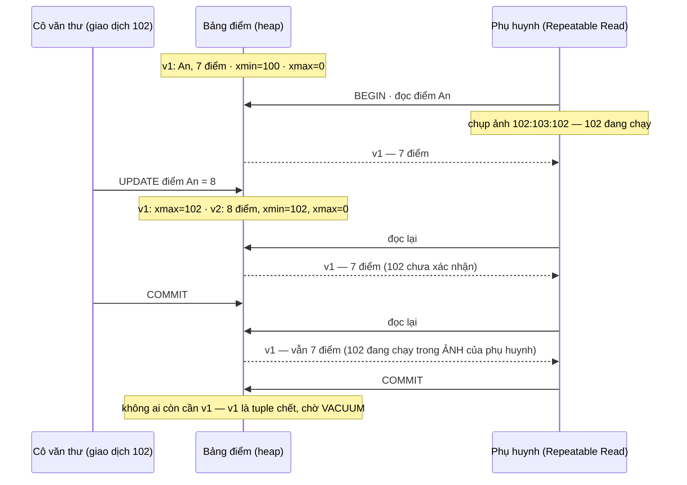
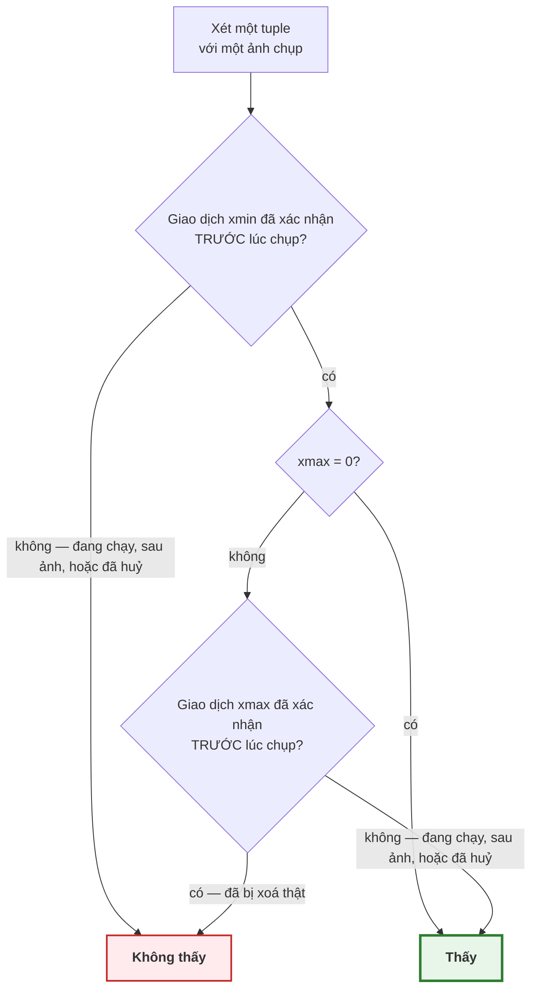

# Bài 39 — MVCC: nhiều phiên bản cho một dòng

!!! abstract "🎯 Học xong bài này, bạn sẽ"
    - Giải thích được **MVCC** bằng một cuốn sổ điểm không bao giờ tẩy xoá, và vì sao nhờ nó mà người đọc không phải chờ người ghi
    - Đọc được `xmin`, `xmax`, `ctid` của từng dòng và dự đoán chúng đổi thế nào sau `INSERT`, `UPDATE`, `DELETE`, `ROLLBACK`
    - Phát biểu được **quy tắc thấy được**: một phiên bản dòng hiện ra với một **ảnh chụp dữ liệu** khi nào — và kiểm nó bằng `pg_current_snapshot()`
    - Đo được bằng `n_dead_tup` rằng `UPDATE` thực chất là "xoá + thêm", rằng `ROLLBACK` cũng để lại rác, và rằng một giao dịch mở lâu làm `VACUUM` bất lực
    - Tránh được năm lỗi hay gặp: `UPDATE` "không đổi gì", giao dịch treo, nhầm hai thứ cùng tên `xmin`, tin `count(*)` là miễn phí, và tắt autovacuum

## 🧠 Câu chuyện mở đầu

Sổ điểm của trường có một luật cứng: **không bao giờ tẩy xoá**.

Muốn sửa điểm Toán của An từ 7 thành 8, cô văn thư không tẩy số 7. Cô làm hai việc:

1. Gạch ngang dòng cũ và ghi bên lề: *"hết hiệu lực — theo phiếu sửa số 102"*.
2. Chép một dòng **mới** ở chỗ trống cuối trang: *"An — Toán — 8 — có hiệu lực theo phiếu sửa số 102"*.

Phiếu số 102 phải được thầy Hiệu trưởng **ký duyệt** mới có giá trị. Khi phiếu chưa ký, cả dòng mới lẫn vết gạch đều "treo" — chưa ai được tính tới.

Giờ một phụ huynh đến xem sổ lúc 9:00. Phòng giáo vụ đưa cho họ kèm một tờ giấy nhỏ: *"danh sách phiếu đã ký tính tới 9:00"*. Phụ huynh đọc sổ theo đúng một luật:

- Dòng nào được tạo bởi một phiếu **có trong danh sách** thì **tin**.
- Nhưng nếu dòng đó đã bị gạch bởi một phiếu **cũng có trong danh sách** thì **bỏ qua**.

Nhờ tờ giấy nhỏ ấy, phụ huynh đọc cả buổi sáng mà luôn thấy **một** bức tranh nhất quán lúc 9:00 — kể cả khi 9:30 cô văn thư sửa thêm mười con điểm và thầy Hiệu trưởng ký hết. Không ai phải chờ ai: phụ huynh không bắt cô văn thư ngừng ghi, cô văn thư không bắt phụ huynh ngừng đọc.

Cái giá: sổ dày lên, đầy những dòng bị gạch. Cuối tuần, cô văn thư rà sổ và **xoá hẳn** những dòng bị gạch mà không còn phụ huynh nào đang cầm tờ giấy cũ đủ để cần tới chúng.

Bài 33 đã cho bạn thấy PostgreSQL giữ tuple cũ và điền `xmax`. Bài này trả lời câu hỏi còn bỏ ngỏ: **ai được thấy phiên bản nào**, và vì sao.

## 📖 Khái niệm & thuật ngữ

### MVCC

Cách làm của cuốn sổ có tên chính thức là **kiểm soát đồng thời đa phiên bản** (*Multi-Version Concurrency Control*, viết tắt **MVCC**): database giữ **nhiều phiên bản** của cùng một dòng, và mỗi giao dịch được cho thấy **đúng một** phiên bản phù hợp với thời điểm của nó.

Lời hứa quan trọng nhất của MVCC:

> **Người đọc không chặn người ghi, người ghi không chặn người đọc.**

Chỉ hai người **cùng ghi một dòng** mới phải chờ nhau — chuyện đó thuộc về khoá, Bài 41.

Đối chiếu với cuốn sổ:

| Cuốn sổ | PostgreSQL |
|---|---|
| Phiếu sửa số 102 | Một giao dịch, mang **mã giao dịch** — con số `pg_current_xact_id()` của Bài 37 |
| Dòng "có hiệu lực theo phiếu 102" | Một tuple có `xmin = 102` |
| Vết gạch "hết hiệu lực theo phiếu 102" | `xmax = 102` trên tuple cũ |
| Hiệu trưởng ký duyệt / xé phiếu | `COMMIT` / `ROLLBACK` — ghi vào tệp trạng thái giao dịch |
| Tờ "danh sách phiếu đã ký tính tới 9:00" | Một **ảnh chụp dữ liệu** |
| Xoá hẳn dòng bị gạch cuối tuần | `VACUUM` dọn **tuple chết** |

### `xmin` và `xmax` — hai con dấu trên mỗi tuple

Bài 33 đã giới thiệu hai trường này trong đầu tuple. Gọi đúng tên:

- **Mã giao dịch tạo** (*xmin*) — mã của giao dịch đã **tạo ra** phiên bản này.
- **Mã giao dịch xoá** (*xmax*) — mã của giao dịch đã **xoá hoặc thay thế** phiên bản này; bằng `0` nếu chưa ai đụng tới.

Hai cột hệ thống này có trên **mọi** bảng, chỉ là `SELECT *` không hiện ra; muốn xem phải gọi đích danh: `SELECT xmin, xmax, * FROM ...`.

Mỗi lệnh ghi đóng dấu như sau:

| Lệnh của giao dịch số 102 | Tuple cũ | Tuple mới |
|---|---|---|
| `INSERT` | — | `xmin = 102`, `xmax = 0` |
| `DELETE` | `xmax = 102` | — |
| `UPDATE` | `xmax = 102` | `xmin = 102`, `xmax = 0` |

Dòng cuối là điểm mấu chốt: **`UPDATE` trong PostgreSQL thực chất là `DELETE` + `INSERT`**. Phiên bản cũ bị đóng dấu xoá, phiên bản mới được thêm vào. Không có gì bị ghi đè.

Còn `ROLLBACK` thì **không đóng dấu gì cả**. Nó chỉ ghi vào tệp trạng thái giao dịch rằng số 102 "đã huỷ". Mọi con dấu mang số 102 — cả `xmin` của tuple mới lẫn `xmax` của tuple cũ — từ đó bị mọi người **coi như không có**. Đó là lý do Bài 37 nói `ROLLBACK` gần như tức thì.

### Ảnh chụp dữ liệu

**Ảnh chụp dữ liệu** (*snapshot*) là tờ giấy nhỏ trong câu chuyện: một bản ghi ngắn gọn cho biết, tại một thời điểm, **những giao dịch nào đã kết thúc**. Nó gồm ba phần, và PostgreSQL in ra dạng `xmin:xmax:danh_sách`:

| Phần | Nghĩa |
|---|---|
| `xmin` của ảnh | Mã giao dịch **nhỏ nhất** còn đang chạy. Mọi mã nhỏ hơn đều đã kết thúc |
| `xmax` của ảnh | Mã giao dịch **tiếp theo** sẽ được cấp. Mọi mã từ đây trở lên coi như chưa bắt đầu |
| Danh sách | Các mã nằm giữa hai mốc trên mà **vẫn đang chạy** lúc chụp |

Ví dụ ảnh `100:105:100,103` nghĩa là: mọi giao dịch dưới 100 đã xong; 100 và 103 đang chạy; 101, 102, 104 đã xong; từ 105 trở đi chưa bắt đầu.

Ảnh chụp chỉ nói giao dịch nào **đã kết thúc** — đã xác nhận hay đã huỷ thì tra tệp trạng thái giao dịch.

Đây chính là "bức ảnh chụp" của Bài 38: **Read Committed** chụp một ảnh mới cho **mỗi câu lệnh**; **Repeatable Read** và **Serializable** chụp **một** ảnh lúc câu lệnh đầu tiên và dùng tới cuối giao dịch.

### Quy tắc thấy được

Với một ảnh chụp trong tay, mỗi tuple được xét theo **quy tắc thấy được** (*visibility rules*) — hai câu hỏi, phải qua **cả hai**:

| Câu hỏi | Qua khi | Không qua khi |
|---|---|---|
| **1. Tuple đã "ra đời" chưa?** — xét `xmin` | Giao dịch `xmin` đã **xác nhận** và đã kết thúc **trước** lúc chụp ảnh | `xmin` đang chạy, hoặc bắt đầu sau lúc chụp, hoặc đã bị huỷ |
| **2. Tuple đã "chết" chưa?** — xét `xmax` | `xmax = 0`; hoặc giao dịch `xmax` **đã bị huỷ**; hoặc nó **đang chạy / bắt đầu sau** lúc chụp | Giao dịch `xmax` đã xác nhận **trước** lúc chụp |

Thêm một điều hiển nhiên: giao dịch **luôn thấy thay đổi của chính mình** — dòng mình vừa thêm thì thấy, dòng mình vừa xoá thì không thấy nữa.

Hệ quả thú vị của câu hỏi 2: một tuple có `xmax` **khác 0** vẫn có thể **thấy được** — khi người xoá nó chưa xác nhận, hoặc đã huỷ. Phần thực hành sẽ bắt tận tay chuyện này.

### Tuple chết và mốc dọn rác

Một phiên bản cũ trở thành **tuple chết** khi giao dịch `xmax` của nó đã xác nhận **và** không còn ảnh chụp nào có thể cần tới nó. Để biết điều thứ hai, PostgreSQL chỉ giữ **một con số** cho mỗi database: `xmin` nhỏ nhất trong mọi ảnh chụp đang được dùng. Con số đó gọi là **mốc dọn rác** (*xmin horizon*). `VACUUM` chỉ dọn những tuple bị xoá bởi giao dịch **nhỏ hơn** mốc này.

Hệ quả: **một** giao dịch mở từ sáng — một báo cáo chạy dài, hay một cửa sổ `psql` bị quên sau `BEGIN` — giữ mốc dọn rác đứng yên ở sáng hôm đó. Mọi tuple chết sinh ra sau đó, trên **mọi bảng** của database, đều không dọn được. Lỗi 3 của Bài 37 đã cảnh báo; bài này đo tận tay.

!!! note "Cuộn vòng mã giao dịch — lý do thứ hai phải `VACUUM`"
    Mã giao dịch trong đầu tuple chỉ dài 32 bit, tức khoảng 4 tỉ số, và được dùng **xoay vòng**. PostgreSQL so sánh mã theo kiểu vòng tròn: với mỗi mã, khoảng 2 tỉ mã "phía trước" là tương lai, 2 tỉ mã "phía sau" là quá khứ. Một tuple rất cũ mà không được xử lý thì tới một ngày `xmin` của nó sẽ trượt sang phía "tương lai" và **biến mất** khỏi mọi ảnh chụp. Hiện tượng này gọi là **cuộn vòng mã giao dịch** (*transaction ID wraparound*).

    Để chặn nó, `VACUUM` định kỳ **đóng băng** (*freeze*) các tuple đủ cũ: đánh dấu chúng là "thấy được với mọi người, mãi mãi", không cần so `xmin` nữa. Autovacuum tự làm việc này. Nếu nó bị cản quá lâu, PostgreSQL sẽ in cảnh báo ngày càng gắt, và cuối cùng **từ chối cấp mã giao dịch mới** để bảo vệ dữ liệu. Đây là một lý do nữa để không bao giờ tắt autovacuum.

!!! note "Các hệ quản trị khác giữ phiên bản cũ ở chỗ khác"
    Oracle và MySQL (InnoDB) cũng dùng MVCC, nhưng sửa dòng **tại chỗ** và chép phiên bản cũ sang một vùng riêng gọi là *undo*. Người đọc cần bản cũ thì dựng lại từ undo. Đổi lại, họ không cần `VACUUM` cho bảng, nhưng `ROLLBACK` phải chép ngược dữ liệu từ undo về — chậm hơn nhiều so với PostgreSQL — và giao dịch đọc quá lâu có thể gặp lỗi *"snapshot too old"* khi undo đã bị ghi đè.

### Bảng thuật ngữ

| Tiếng Việt | English | Nghĩa dễ hiểu |
|---|---|---|
| Kiểm soát đồng thời đa phiên bản | *Multi-Version Concurrency Control* (MVCC) | Giữ nhiều phiên bản của một dòng để mỗi giao dịch thấy đúng một phiên bản; người đọc không chặn người ghi và ngược lại |
| Mã giao dịch tạo | *xmin* | Cột hệ thống: mã giao dịch đã tạo ra phiên bản dòng này |
| Mã giao dịch xoá | *xmax* | Cột hệ thống: mã giao dịch đã xoá hoặc thay thế phiên bản này; `0` nếu chưa ai đụng tới |
| Ảnh chụp dữ liệu | *snapshot* | Bản ghi những giao dịch đã kết thúc tại một thời điểm, dạng `xmin:xmax:danh_sách_đang_chạy` |
| Quy tắc thấy được | *visibility rules* | Tuple thấy được khi `xmin` đã xác nhận trước lúc chụp, và `xmax` bằng 0, đã huỷ, hoặc chưa xác nhận lúc chụp |
| Mốc dọn rác | *xmin horizon* | `xmin` nhỏ nhất trong mọi ảnh chụp đang dùng; `VACUUM` chỉ dọn tuple bị xoá trước mốc này |
| Cuộn vòng mã giao dịch | *transaction ID wraparound* | Mã giao dịch 32 bit dùng xoay vòng; tuple cũ không được đóng băng sẽ có ngày biến mất |
| Đóng băng | *freeze* | `VACUUM` đánh dấu tuple đủ cũ là thấy được với mọi người, để khỏi bị cuộn vòng |

## 🖼️ Sơ đồ

Hai giao dịch cùng đụng vào điểm Toán của An. Cô văn thư sửa; phụ huynh đọc ở mức Repeatable Read:



Nếu phụ huynh dùng Read Committed thì lần đọc cuối — một câu lệnh mới, một ảnh mới — sẽ thấy **v2**, 8 điểm.

Quy tắc thấy được dưới dạng sơ đồ quyết định:



## 💻 Thực hành

### Chuẩn bị

Bảng điểm Toán của lớp 8A1. Autovacuum bị **tắt riêng cho bảng nháp này**, để con số tuple chết không bị tiến trình nền dọn mất giữa chừng thí nghiệm — chỉ để học, xem Lỗi 5.

```sql
DROP TABLE IF EXISTS b39_diem CASCADE;
CREATE TABLE b39_diem (
    ma_hs     CHAR(5)      PRIMARY KEY,
    ho_ten    VARCHAR(60)  NOT NULL,
    diem_toan NUMERIC(4,2) NOT NULL
) WITH (autovacuum_enabled = false);

DROP TABLE IF EXISTS b39_nhat_ky CASCADE;
CREATE TABLE b39_nhat_ky (buoc TEXT PRIMARY KEY, gia_tri TEXT);

BEGIN;
INSERT INTO b39_diem (ma_hs, ho_ten, diem_toan)
SELECT ma_hs, ho_ten, 7 FROM hoc_sinh WHERE ma_lop = 'L01';
-- ghi lại mã của CHÍNH giao dịch này
INSERT INTO b39_nhat_ky SELECT 'gd_insert', pg_current_xact_id()::xid::text;
COMMIT;

-- KỲ VỌNG: so_dong = 6
-- KỲ VỌNG: xmin_la_gd_insert = 6
-- KỲ VỌNG: xmax_bang_0 = 6
SELECT count(*)                                                    AS so_dong,
       count(*) FILTER (WHERE xmin::text = (SELECT gia_tri FROM b39_nhat_ky
                                           WHERE buoc = 'gd_insert')) AS xmin_la_gd_insert,
       count(*) FILTER (WHERE xmax::text = '0')                    AS xmax_bang_0
FROM b39_diem;
```

Cả 6 dòng mang **cùng một** `xmin` — mã của giao dịch vừa `INSERT` — và `xmax = 0`. Hàm `pg_current_xact_id()` trả về mã dạng 64 bit; ép sang kiểu `xid` để so với `xmin` 32 bit.

Tự xem con số thật trên máy mình — chúng sẽ khác mỗi lần chạy:

```sql
SELECT xmin, xmax, ctid, ma_hs, diem_toan FROM b39_diem ORDER BY ma_hs;
```

### `UPDATE` = xoá + thêm

```sql
BEGIN;
UPDATE b39_diem SET diem_toan = 8 WHERE ma_hs = 'HS001';
INSERT INTO b39_nhat_ky SELECT 'gd_update', pg_current_xact_id()::xid::text;
COMMIT;

-- KỲ VỌNG: ctid_moi = (0,7)
-- KỲ VỌNG: xmin_la_gd_update = true
-- KỲ VỌNG: xmax = 0
SELECT ctid::text                                                         AS ctid_moi,
       xmin::text = (SELECT gia_tri FROM b39_nhat_ky WHERE buoc = 'gd_update') AS xmin_la_gd_update,
       xmax::text                                                         AS xmax
FROM b39_diem WHERE ma_hs = 'HS001';
```

Dòng của An giờ nằm ở `(0,7)` — ô thứ **7** của trang, sau 6 tuple ban đầu — với `xmin` là mã của giao dịch `UPDATE`. Tuple cũ ở `(0,1)` vẫn còn đó, mang `xmax` là mã ấy, nhưng không còn ai thấy nó nên `SELECT` không trả ra.

Đếm nó bằng thống kê. Bảng hệ thống `pg_stat_user_tables` có hai cột `n_live_tup` và `n_dead_tup` — số tuple sống và số tuple chết ước tính. Các con số thống kê được mỗi phiên **gom lại rồi mới gửi đi** theo định kỳ; hàm `pg_stat_force_next_flush()` yêu cầu gửi ngay sau câu lệnh hiện tại, để câu sau đọc được con số mới:

```sql
SELECT pg_stat_force_next_flush();

-- KỲ VỌNG: n_live_tup = 6
-- KỲ VỌNG: n_dead_tup = 1
SELECT n_live_tup, n_dead_tup FROM pg_stat_user_tables WHERE relname = 'b39_diem';
```

Sáu tuple sống, **một** tuple chết — phiên bản 7 điểm của An. Giờ sửa **cả lớp**:

```sql
UPDATE b39_diem SET diem_toan = diem_toan + 0.5;
SELECT pg_stat_force_next_flush();

-- KỲ VỌNG: n_live_tup = 6
-- KỲ VỌNG: n_dead_tup = 7
SELECT n_live_tup, n_dead_tup FROM pg_stat_user_tables WHERE relname = 'b39_diem';
```

Vẫn 6 học sinh, nhưng giờ có **7** tuple chết. Trên đĩa, bảng đang chứa **13** tuple cho 6 dòng dữ liệu.

### `ROLLBACK` cũng để lại rác

```sql
BEGIN;
UPDATE b39_diem SET diem_toan = diem_toan + 1;
ROLLBACK;
SELECT pg_stat_force_next_flush();

-- KỲ VỌNG: n_live_tup = 6
-- KỲ VỌNG: n_dead_tup = 13
SELECT n_live_tup, n_dead_tup FROM pg_stat_user_tables WHERE relname = 'b39_diem';
```

**13**. Giao dịch bị huỷ đã kịp ghi 6 tuple mới; sau `ROLLBACK`, `xmin` của chúng thuộc một giao dịch đã huỷ nên không ai thấy — chúng là 6 tuple chết mới. Đúng như câu 5 của Bài 37: huỷ thì nhanh, nhưng **không miễn phí**.

### `VACUUM` dọn

```sql
VACUUM b39_diem;

-- KỲ VỌNG: n_live_tup = 6
-- KỲ VỌNG: n_dead_tup = 0
SELECT n_live_tup, n_dead_tup FROM pg_stat_user_tables WHERE relname = 'b39_diem';
```

Không còn ai giữ ảnh chụp cũ, nên cả 13 tuple chết được dọn.

### Hai phiên: bắt tận tay quy tắc thấy được

Phần này cần hai giao dịch xen kẽ. Như [Bài 38](38-isolation-level-va-anomaly.md), ta dùng `dblink` mở **phiên B** từ chính phiên của mình; bạn cũng có thể làm bằng hai cửa sổ `psql` theo đúng thứ tự các bước.

```sql
CREATE EXTENSION IF NOT EXISTS dblink;
SELECT dblink_connect('phien_b',
       format('host=%s port=%s dbname=%s user=%s',
              split_part(current_setting('unix_socket_directories'), ',', 1),
              current_setting('port'), current_database(), current_user));

DROP TABLE IF EXISTS b39_hai_phien CASCADE;
CREATE TABLE b39_hai_phien AS
SELECT ma_hs, ho_ten, diem_toan FROM b39_diem WHERE ma_hs IN ('HS002', 'HS003', 'HS004');

-- KỲ VỌNG: 3 dòng
SELECT ma_hs, diem_toan FROM b39_hai_phien ORDER BY ma_hs;
```

**Thí nghiệm 1 — `xmax` khác 0 mà vẫn thấy được.**

| Bước | Phiên A | Phiên B |
|---|---|---|
| 1 | | `BEGIN;` · sửa điểm `HS002` thành 10 — chưa xác nhận |
| 2 | Đọc `xmin`, `xmax`, điểm của `HS002` | |
| 3 | | `COMMIT;` |
| 4 | Đọc lại | |

```sql
-- Bước 1
SELECT dblink_exec('phien_b', 'BEGIN');
SELECT dblink_exec('phien_b', $$UPDATE b39_hai_phien SET diem_toan = 10 WHERE ma_hs = 'HS002'$$);
INSERT INTO b39_nhat_ky
SELECT 'tn1_ma_b', x FROM dblink('phien_b', 'SELECT pg_current_xact_id()::text') AS t(x text);

-- Bước 2: tuple phiên A thấy, và ảnh chụp hiện tại có coi B là "đã xong" không
INSERT INTO b39_nhat_ky
SELECT 'tn1_truoc', diem_toan::text || ' | xmax_la_b=' ||
       (xmax::text = (SELECT gia_tri::xid8::xid::text FROM b39_nhat_ky WHERE buoc = 'tn1_ma_b'))::text
FROM b39_hai_phien WHERE ma_hs = 'HS002';
INSERT INTO b39_nhat_ky
SELECT 'tn1_b_trong_anh_truoc',
       pg_visible_in_snapshot((SELECT gia_tri::xid8 FROM b39_nhat_ky WHERE buoc = 'tn1_ma_b'),
                              pg_current_snapshot())::text;

-- Bước 3
SELECT dblink_exec('phien_b', 'COMMIT');

-- Bước 4
INSERT INTO b39_nhat_ky
SELECT 'tn1_sau', diem_toan::text || ' | xmin_la_b=' ||
       (xmin::text = (SELECT gia_tri::xid8::xid::text FROM b39_nhat_ky WHERE buoc = 'tn1_ma_b'))::text
FROM b39_hai_phien WHERE ma_hs = 'HS002';
INSERT INTO b39_nhat_ky
SELECT 'tn1_b_trong_anh_sau',
       pg_visible_in_snapshot((SELECT gia_tri::xid8 FROM b39_nhat_ky WHERE buoc = 'tn1_ma_b'),
                              pg_current_snapshot())::text;

-- KỲ VỌNG: truoc_commit = 7.50 | xmax_la_b=true
-- KỲ VỌNG: b_xong_truoc = false
-- KỲ VỌNG: sau_commit = 10.00 | xmin_la_b=true
-- KỲ VỌNG: b_xong_sau = true
SELECT (SELECT gia_tri FROM b39_nhat_ky WHERE buoc = 'tn1_truoc')             AS truoc_commit,
       (SELECT gia_tri FROM b39_nhat_ky WHERE buoc = 'tn1_b_trong_anh_truoc') AS b_xong_truoc,
       (SELECT gia_tri FROM b39_nhat_ky WHERE buoc = 'tn1_sau')               AS sau_commit,
       (SELECT gia_tri FROM b39_nhat_ky WHERE buoc = 'tn1_b_trong_anh_sau')   AS b_xong_sau;
```

Hàm `pg_visible_in_snapshot(mã, ảnh)` trả lời: *"theo ảnh chụp này, giao dịch mang mã đó đã kết thúc chưa?"*

- **Trước** khi phiên B xác nhận: phiên A thấy tuple **7.50** mà `xmax` của nó **chính là mã của phiên B** — khác 0. Vẫn thấy được, vì trong ảnh chụp của phiên A, phiên B **chưa xong**. Đó là câu hỏi 2 của quy tắc.
- **Sau** khi phiên B xác nhận: câu lệnh mới của phiên A chụp ảnh mới, trong đó B **đã xong**. Tuple cũ bị loại, tuple mới **10.00** với `xmin` là mã của B hiện ra.

**Thí nghiệm 2 — con dấu của giao dịch đã huỷ bị bỏ qua.**

```sql
SELECT dblink_exec('phien_b', 'BEGIN');
SELECT dblink_exec('phien_b', $$UPDATE b39_hai_phien SET diem_toan = 0 WHERE ma_hs = 'HS003'$$);
INSERT INTO b39_nhat_ky
SELECT 'tn2_ma_b', x FROM dblink('phien_b', 'SELECT pg_current_xact_id()::text') AS t(x text);
SELECT dblink_exec('phien_b', 'ROLLBACK');

-- KỲ VỌNG: diem_toan = 7.50
-- KỲ VỌNG: xmax_la_b_da_huy = true
SELECT diem_toan,
       xmax::text = (SELECT gia_tri::xid8::xid::text FROM b39_nhat_ky WHERE buoc = 'tn2_ma_b') AS xmax_la_b_da_huy
FROM b39_hai_phien WHERE ma_hs = 'HS003';
```

Điểm vẫn **7.50**, và `xmax` của tuple **vẫn mang mã của phiên B** — `ROLLBACK` không xoá con dấu. Tuple vẫn thấy được, vì giao dịch đóng dấu xoá đã bị huỷ. Tự gõ `SELECT xmin, xmax, * FROM b39_hai_phien;` để thấy: một bảng mà `xmax` khác 0 **không có nghĩa** là dòng đã bị xoá.

**Thí nghiệm 3 — Repeatable Read nhìn một ảnh chụp tới cuối.**

| Bước | Phiên A | Phiên B |
|---|---|---|
| 1 | `BEGIN ISOLATION LEVEL REPEATABLE READ;` · đọc `HS004` | |
| 2 | | Sửa `HS004` thành 9 — tự xác nhận |
| 3 | Đọc lại · hỏi ảnh chụp: B đã xong chưa? | |
| 4 | `COMMIT;` · đọc lại | |

```sql
BEGIN ISOLATION LEVEL REPEATABLE READ;
INSERT INTO b39_nhat_ky SELECT 'tn3_lan_1', diem_toan::text FROM b39_hai_phien WHERE ma_hs = 'HS004';

INSERT INTO b39_nhat_ky
SELECT 'tn3_ma_b', x
FROM dblink('phien_b', $$UPDATE b39_hai_phien SET diem_toan = 9 WHERE ma_hs = 'HS004'
                         RETURNING pg_current_xact_id()::text$$) AS t(x text);

INSERT INTO b39_nhat_ky SELECT 'tn3_lan_2', diem_toan::text FROM b39_hai_phien WHERE ma_hs = 'HS004';
INSERT INTO b39_nhat_ky
SELECT 'tn3_b_trong_anh',
       pg_visible_in_snapshot((SELECT gia_tri::xid8 FROM b39_nhat_ky WHERE buoc = 'tn3_ma_b'),
                              pg_current_snapshot())::text;
COMMIT;
INSERT INTO b39_nhat_ky SELECT 'tn3_sau', diem_toan::text FROM b39_hai_phien WHERE ma_hs = 'HS004';

-- KỲ VỌNG: lan_1 = 7.50
-- KỲ VỌNG: lan_2 = 7.50
-- KỲ VỌNG: b_xong_theo_anh = false
-- KỲ VỌNG: sau_commit = 9.00
SELECT (SELECT gia_tri FROM b39_nhat_ky WHERE buoc = 'tn3_lan_1')       AS lan_1,
       (SELECT gia_tri FROM b39_nhat_ky WHERE buoc = 'tn3_lan_2')       AS lan_2,
       (SELECT gia_tri FROM b39_nhat_ky WHERE buoc = 'tn3_b_trong_anh') AS b_xong_theo_anh,
       (SELECT gia_tri FROM b39_nhat_ky WHERE buoc = 'tn3_sau')         AS sau_commit;
```

Phiên B đã xác nhận ở bước 2 — nó **thật sự** đã xong. Nhưng ảnh chụp của phiên A được chụp **trước** đó và giữ nguyên tới cuối giao dịch, nên theo ảnh ấy B **chưa xong** (`false`), và phiên A đọc lại vẫn thấy **7.50**. Đây chính là đọc không lặp lại bị chặn ở Bài 38 — giờ bạn thấy cơ chế bên dưới.

### Giao dịch mở lâu làm `VACUUM` bất lực

Phiên B mở một giao dịch Repeatable Read, đọc một câu rồi **để đó** — như một báo cáo đang chạy dở, hay một cửa sổ `psql` bị quên:

```sql
SELECT dblink_exec('phien_b', 'BEGIN ISOLATION LEVEL REPEATABLE READ');
SELECT * FROM dblink('phien_b', 'SELECT sum(diem_toan) FROM b39_diem') AS t(tong numeric);

-- Phiên A sửa cả lớp hai lần, rồi dọn rác
UPDATE b39_diem SET diem_toan = diem_toan + 0.25;
UPDATE b39_diem SET diem_toan = diem_toan + 0.25;
SELECT pg_stat_force_next_flush();
VACUUM b39_diem;

INSERT INTO b39_nhat_ky
SELECT 'vc_b_giu_moc', (backend_xmin IS NOT NULL)::text || ' | ' || state
FROM pg_stat_activity
WHERE pid = (SELECT pid FROM dblink('phien_b', 'SELECT pg_backend_pid()') AS t(pid integer));

-- KỲ VỌNG: n_dead_tup = 12
-- KỲ VỌNG: b_giu_moc = true | idle in transaction
SELECT n_dead_tup,
       (SELECT gia_tri FROM b39_nhat_ky WHERE buoc = 'vc_b_giu_moc') AS b_giu_moc
FROM pg_stat_user_tables WHERE relname = 'b39_diem';
```

`VACUUM` chạy xong mà **12** tuple chết vẫn còn nguyên. Bảng hệ thống `pg_stat_activity` — mỗi dòng một phiên — cho thấy phiên B có cột `backend_xmin` khác `NULL`: nó đang giữ một ảnh chụp, tức đang giữ **mốc dọn rác**. Trạng thái của nó là `idle in transaction` — đang **không làm gì**, nhưng giao dịch vẫn mở.

Cho phiên B kết thúc, rồi dọn lại:

```sql
SELECT dblink_exec('phien_b', 'COMMIT');
VACUUM b39_diem;

-- KỲ VỌNG: n_dead_tup = 0
SELECT n_dead_tup FROM pg_stat_user_tables WHERE relname = 'b39_diem';
```

Về **0**. Không có gì thay đổi trong bảng — chỉ là người cuối cùng cầm ảnh chụp cũ đã rời đi.

## ⚠️ Lỗi thường gặp

!!! danger "Lỗi 1: Tin rằng `UPDATE` \"không đổi gì\" thì không tốn gì"
    Một đoạn mã đồng bộ dữ liệu chạy mỗi đêm: `UPDATE ... SET diem_toan = <giá trị lấy từ hệ thống khác>` cho **mọi** dòng, dù phần lớn giá trị không đổi.

    ```sql
    UPDATE b39_diem SET diem_toan = diem_toan;   -- ghi lại đúng giá trị cũ
    SELECT pg_stat_force_next_flush();

    -- KỲ VỌNG: n_dead_tup = 6
    SELECT n_dead_tup FROM pg_stat_user_tables WHERE relname = 'b39_diem';
    ```

    **6** tuple chết, dù không một con điểm nào thay đổi. PostgreSQL không so giá trị cũ với mới: `UPDATE` là "xoá + thêm", luôn luôn. Mỗi đêm bảng lại sinh ra một bản sao toàn bộ chờ dọn.

    Sửa: chỉ sửa những dòng **thật sự** khác, bằng điều kiện `IS DISTINCT FROM` — phép so sánh "khác nhau" coi hai `NULL` là bằng nhau:

    ```sql
    VACUUM b39_diem;
    UPDATE b39_diem SET diem_toan = 10 WHERE diem_toan IS DISTINCT FROM 10;
    SELECT pg_stat_force_next_flush();

    -- KỲ VỌNG: n_dead_tup = 6
    SELECT n_dead_tup FROM pg_stat_user_tables WHERE relname = 'b39_diem';
    ```

    ```sql
    UPDATE b39_diem SET diem_toan = 10 WHERE diem_toan IS DISTINCT FROM 10;   -- chạy lần hai
    SELECT pg_stat_force_next_flush();

    -- KỲ VỌNG: n_dead_tup = 6
    SELECT n_dead_tup FROM pg_stat_user_tables WHERE relname = 'b39_diem';
    ```

    Lần đầu cả 6 dòng đều khác 10 — An đang 9, các bạn khác đang 8 — nên sinh 6 tuple chết. Lần hai **không** dòng nào khác 10, nên không sinh thêm tuple nào — vẫn **6**.

!!! danger "Lỗi 2: Để giao dịch treo — `idle in transaction`"
    Thí nghiệm cuối phần thực hành cho thấy **một** phiên treo giữ được mọi tuple chết trên cả database. Ngoài đời, thủ phạm thường là ứng dụng mở giao dịch rồi đi gọi một dịch vụ bên ngoài chậm chạp, hoặc công cụ đồ hoạ tắt chế độ tự động xác nhận.

    Tìm các phiên đang giữ mốc dọn rác, cũ nhất trước:

    ```sql
    SELECT pid, usename, state, xact_start, backend_xmin
    FROM pg_stat_activity
    WHERE backend_xmin IS NOT NULL
    ORDER BY age(backend_xmin) DESC;
    ```

    Sửa: giữ giao dịch ngắn; đặt `idle_in_transaction_session_timeout` để PostgreSQL tự ngắt phiên treo quá lâu; và theo dõi truy vấn trên như theo dõi dung lượng đĩa.

!!! warning "Lỗi 3: Nhầm hai thứ cùng tên `xmin`"
    Bài này có **hai** `xmin` khác nhau hoàn toàn:

    | | `xmin` của **tuple** | `xmin` của **ảnh chụp** |
    |---|---|---|
    | Là gì | Mã giao dịch đã **tạo** phiên bản dòng này | Mã giao dịch **nhỏ nhất còn đang chạy** lúc chụp |
    | Xem ở đâu | `SELECT xmin FROM bang` | `pg_current_snapshot()`, cột `backend_xmin` của `pg_stat_activity` |

    "Mốc dọn rác" và cột `backend_xmin` là `xmin` **của ảnh chụp**. Đọc tài liệu hay thông báo lỗi có chữ `xmin`, hãy xác định trước là loại nào.

!!! warning "Lỗi 4: Tin rằng `count(*)` là miễn phí vì \"database biết sẵn số dòng\""
    Với MVCC, **không có** một con số "số dòng của bảng" duy nhất: phiên Read Committed, phiên Repeatable Read mở từ sáng, và phiên đang thêm dòng chưa xác nhận có thể thấy ba con số khác nhau **cùng lúc**. Vì vậy `SELECT count(*) FROM diem_lon` phải đi qua từng tuple và hỏi quy tắc thấy được — hoặc dùng một index kèm bản đồ hiển thị của Bài 33 để bỏ bớt bước hỏi.

    Cột `n_live_tup` phía trên chỉ là con số **ước tính** cho autovacuum, không phải kết quả đúng cho giao dịch của bạn. Nếu chỉ cần con số gần đúng để hiển thị, đọc ước tính của planner (Bài 36): `SELECT reltuples FROM pg_class WHERE relname = 'diem_lon';`. Nếu cần chính xác mà nhanh, tự duy trì một bảng đếm — và chấp nhận chi phí ghi.

!!! warning "Lỗi 5: Tắt autovacuum để số liệu \"ổn định\" — rồi quên bật lại"
    Bài này tắt autovacuum cho `b39_diem` để thí nghiệm ra đúng con số. Làm vậy trên bảng thật là mời Bài 33 quay lại: bảng phình không giới hạn, và tệ hơn là nguy cơ cuộn vòng mã giao dịch. Nếu buộc phải tắt tạm thời, bật lại ngay bằng `ALTER TABLE ... RESET (autovacuum_enabled);` và kiểm tra bằng:

    ```sql
    -- KỲ VỌNG: 1 dòng
    SELECT relname, reloptions FROM pg_class
    WHERE reloptions::text LIKE '%autovacuum_enabled=false%' AND relname LIKE 'b39\_%';
    ```

    Truy vấn trên tìm mọi bảng đang bị tắt autovacuum; lúc này chỉ có `b39_diem`, và nó sẽ bị xoá ở cuối bài.

## ✍️ Bài tập

1. Giao dịch **200** thêm dòng điểm của Bình (7 điểm). Giao dịch **205** sửa thành 8 và xác nhận. Giao dịch **210** sửa thành 9 rồi `ROLLBACK`. Liệt kê mọi tuple của dòng này trên đĩa, mỗi tuple với `xmin`, `xmax` và điểm. Tuple nào còn thấy được với một ảnh chụp mới?

2. Cho ảnh chụp `300:305:300,303`. Theo ảnh này, các giao dịch **299, 300, 301, 303, 304, 305** đã kết thúc hay chưa? Kiểm bằng `pg_visible_in_snapshot`.

3. Trong thí nghiệm "giao dịch mở lâu", phiên B chụp ảnh **trước** cả hai lần `UPDATE`. Phiên bản sinh ra ở lần `UPDATE` thứ nhất rồi bị lần thứ hai thay thế **chưa bao giờ** thấy được với ảnh của phiên B. Vậy vì sao `VACUUM` vẫn giữ lại cả **12** tuple chết, chứ không chỉ 6?

4. `SELECT ... FOR UPDATE` (Bài 41) không sửa dòng. Dự đoán `xmax` của dòng đó **trong** và **sau** giao dịch khoá nó, rồi chạy để kiểm. Dòng có thành tuple chết không?

5. Nêu **một** ưu điểm và **một** nhược điểm của cách PostgreSQL giữ phiên bản cũ ngay trong bảng, so với cách Oracle và MySQL giữ chúng trong vùng undo.

??? success "Đáp án"
    **Câu 1.**

    | Tuple | Điểm | `xmin` | `xmax` | Thấy được với ảnh chụp mới? |
    |---|---|---|---|---|
    | v1 | 7 | 200 | 205 | Không — 205 đã xác nhận xoá nó |
    | v2 | 8 | 205 | 210 | **Có** — 205 đã xác nhận; 210 đã huỷ nên con dấu xoá bị bỏ qua |
    | v3 | 9 | 210 | 0 | Không — 210 đã huỷ nên v3 chưa bao giờ "ra đời" |

    Ba tuple trên đĩa cho một dòng dữ liệu; v1 và v3 là tuple chết. Để ý v2: `xmax` khác 0 mà vẫn là phiên bản sống — đúng thí nghiệm 2.

    **Câu 2.**

    299 nhỏ hơn `xmin` của ảnh nên đã xong. 300 và 303 có trong danh sách đang chạy. 301 và 304 nằm giữa hai mốc mà không có trong danh sách, nên đã xong. 305 bằng `xmax` của ảnh nên coi như chưa bắt đầu.

    ```sql
    -- KỲ VỌNG: 6 dòng
    -- KỲ VỌNG: ma = 299
    -- KỲ VỌNG: da_xong = true
    SELECT ma, pg_visible_in_snapshot(ma::text::xid8, '300:305:300,303'::pg_snapshot) AS da_xong
    FROM unnest(ARRAY[299, 300, 301, 303, 304, 305]) AS ma
    ORDER BY ma;
    ```

    Kết quả: 299 `true`, 300 `false`, 301 `true`, 303 `false`, 304 `true`, 305 `false`. "Đã xong" chưa có nghĩa là "thấy được": 301 có thể đã bị huỷ — điều đó phải tra tệp trạng thái giao dịch.

    **Câu 3.**

    Vì PostgreSQL không xét từng tuple với từng ảnh chụp. Nó chỉ có **một** con số: **mốc dọn rác**, là `xmin` của ảnh cũ nhất. `VACUUM` dọn tuple nào bị xoá bởi giao dịch **nhỏ hơn** mốc đó. Cả hai lần `UPDATE` đều chạy **sau** khi phiên B chụp ảnh, nên mã của chúng đều lớn hơn mốc — mọi tuple chúng xoá, kể cả phiên bản "sinh ra rồi chết" chưa ai từng thấy, đều bị giữ lại. Cách tính thô này rẻ, nhưng làm hậu quả của một giao dịch treo còn tệ hơn trực giác.

    **Câu 4.**

    ```sql
    BEGIN;
    SELECT 1 FROM b39_diem WHERE ma_hs = 'HS005' FOR UPDATE;
    INSERT INTO b39_nhat_ky
    SELECT 'bt4_trong', (xmax::text = pg_current_xact_id()::xid::text)::text
    FROM b39_diem WHERE ma_hs = 'HS005';
    INSERT INTO b39_nhat_ky SELECT 'bt4_ma_gd', pg_current_xact_id()::xid::text;
    COMMIT;
    SELECT pg_stat_force_next_flush();

    -- KỲ VỌNG: xmax_trong_gd_la_minh = true
    -- KỲ VỌNG: xmax_sau_van_la_ma_do = true
    -- KỲ VỌNG: diem_toan = 10.00
    -- KỲ VỌNG: n_dead_tup = 6
    SELECT (SELECT gia_tri FROM b39_nhat_ky WHERE buoc = 'bt4_trong')          AS xmax_trong_gd_la_minh,
           xmax::text = (SELECT gia_tri FROM b39_nhat_ky WHERE buoc = 'bt4_ma_gd') AS xmax_sau_van_la_ma_do,
           diem_toan,
           (SELECT n_dead_tup FROM pg_stat_user_tables WHERE relname = 'b39_diem') AS n_dead_tup
    FROM b39_diem WHERE ma_hs = 'HS005';
    ```

    Trong giao dịch, `xmax` của dòng là **mã của chính giao dịch khoá nó**; sau `COMMIT` vẫn là mã đó. Nhưng dòng vẫn sống với 10 điểm, và số tuple chết **không tăng** (vẫn 6 từ Lỗi 1). PostgreSQL dùng `xmax` cho **hai** việc: đánh dấu xoá, và đánh dấu "đang bị khoá". Một cờ trong đầu tuple cho biết đây là trường hợp nào. Thêm một lý do để không bao giờ đọc `xmax <> 0` là "đã bị xoá".

    **Câu 5.**

    | | PostgreSQL — phiên bản cũ trong bảng | Oracle, MySQL — phiên bản cũ trong undo |
    |---|---|---|
    | Ưu | `ROLLBACK` tức thì: chỉ đánh dấu mã giao dịch là đã huỷ | Bảng không phình vì phiên bản cũ; không cần `VACUUM` cho bảng |
    | Nhược | Bảng phình, cần `VACUUM`; một giao dịch treo chặn dọn rác cả database | `ROLLBACK` phải chép dữ liệu ngược về; giao dịch đọc lâu có thể gặp *"snapshot too old"* |

    Mỗi bên chọn chỗ trả giá khác nhau; không bên nào miễn phí.

### Dọn dẹp cuối bài

```sql
SELECT dblink_disconnect('phien_b');
DROP EXTENSION IF EXISTS dblink;
DROP TABLE IF EXISTS b39_diem, b39_hai_phien, b39_nhat_ky CASCADE;

-- KỲ VỌNG: bang_con_lai = 0
-- KỲ VỌNG: dblink_con_lai = 0
SELECT (SELECT count(*) FROM information_schema.tables WHERE table_name LIKE 'b39\_%') AS bang_con_lai,
       (SELECT count(*) FROM pg_extension WHERE extname = 'dblink')                    AS dblink_con_lai;
```

## 🔑 Tóm tắt

1. **MVCC** giữ nhiều phiên bản của một dòng để mỗi giao dịch thấy đúng một phiên bản: người đọc không chặn người ghi, người ghi không chặn người đọc. Mỗi tuple mang hai con dấu: **`xmin`** — giao dịch tạo ra nó, **`xmax`** — giao dịch xoá hoặc thay thế nó.
2. **`UPDATE` = `DELETE` + `INSERT`**: tuple cũ được điền `xmax`, tuple mới mang `xmin` mới và nằm ở `ctid` khác — bài đo được An chuyển từ `(0,1)` sang `(0,7)`. `ROLLBACK` không đóng dấu gì mà chỉ đánh dấu mã giao dịch là đã huỷ, nên nhanh nhưng vẫn để lại tuple chết: 7 thành 13.
3. **Ảnh chụp dữ liệu** `xmin:xmax:danh_sách` cho biết giao dịch nào đã kết thúc. Tuple **thấy được** khi `xmin` đã xác nhận trước lúc chụp, và `xmax` bằng 0, đã huỷ, hoặc chưa xác nhận lúc chụp — nên `xmax` khác 0 **không** có nghĩa là dòng đã bị xoá. Read Committed chụp ảnh mỗi câu lệnh; Repeatable Read chụp một lần cho cả giao dịch.
4. `VACUUM` chỉ dọn tuple bị xoá trước **mốc dọn rác** — `xmin` của ảnh chụp cũ nhất còn dùng. Một phiên `idle in transaction` giữ mốc đứng yên: bài đo được 12 tuple chết không dọn nổi cho tới khi phiên đó kết thúc. `VACUUM` còn **đóng băng** tuple cũ để chống **cuộn vòng mã giao dịch**, nên không bao giờ tắt autovacuum.
5. Hệ quả thực tế: `UPDATE` ghi lại đúng giá trị cũ vẫn sinh tuple chết — lọc bằng `IS DISTINCT FROM`; `count(*)` phải hỏi quy tắc thấy được cho từng tuple nên không miễn phí; và `xmin` của tuple khác hẳn `xmin` của ảnh chụp.

---

⬅️ [Bài 38 — Mức cô lập và các hiện tượng bất thường](38-isolation-level-va-anomaly.md) · ➡️ [Bài 40 — WAL, checkpoint và phục hồi sau sự cố](40-wal-va-recovery.md)
