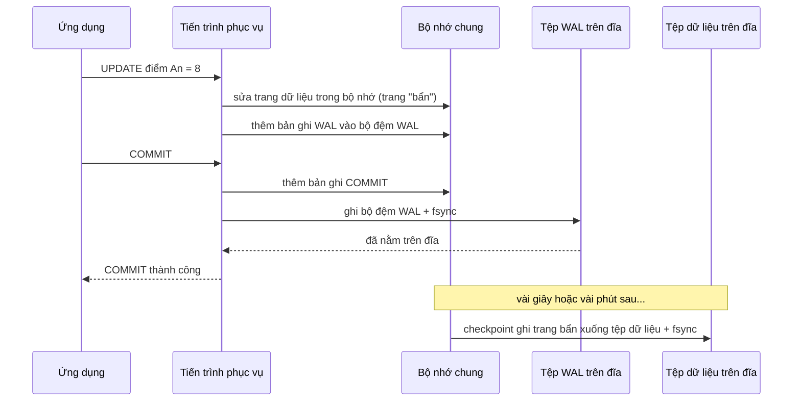
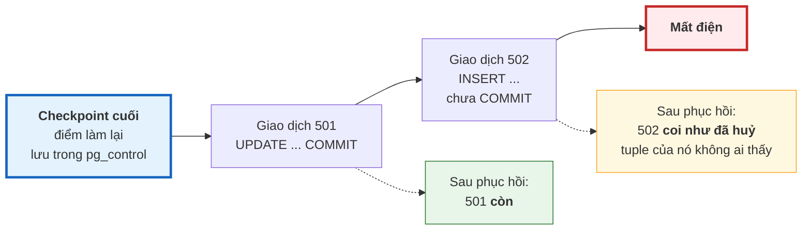

# Bài 40 — WAL, checkpoint và phục hồi sau sự cố

!!! abstract "🎯 Học xong bài này, bạn sẽ"
    - Giải thích được **nhật ký ghi trước** bằng cuốn sổ nháp của thủ thư, và vì sao nhờ nó mà `COMMIT` vừa **bền** vừa **nhanh**
    - Đọc được **LSN**, và đo chính xác một câu lệnh sinh ra bao nhiêu bản ghi WAL bằng `EXPLAIN (ANALYZE, WAL)`
    - Mô tả được **checkpoint** làm gì, và PostgreSQL tự **phục hồi** thế nào sau khi mất điện — kể cả vì sao giao dịch dở dang tự biến mất mà không cần "hoàn tác"
    - Phân biệt được `fsync`, `synchronous_commit`, `full_page_writes` và biết tắt cái nào thì mất gì
    - Mô tả được **PITR**: dựng lại database ở đúng một thời điểm trong quá khứ từ một **bản sao lưu nền** và kho WAL

## 🧠 Câu chuyện mở đầu

Thầy thủ thư giữ một **sổ mượn chính**: mỗi học sinh một trang, sắp theo mã học sinh. Ghi một lượt mượn nghĩa là lật tới đúng trang của học sinh đó, tìm dòng trống, ghi vào. Giờ ra chơi có 30 học sinh xếp hàng — thầy lật sổ không kịp.

Thầy nghĩ ra một mẹo. Cạnh sổ chính, thầy đặt một **sổ nháp** chỉ ghi theo **thứ tự thời gian**:

> 9:01 — HS003 mượn S001
> 9:01 — HS017 trả S004
> 9:02 — HS022 mượn S009

Ghi sổ nháp cực nhanh: luôn viết tiếp vào dòng cuối, không phải lật tìm gì. Thầy chỉ **gật đầu "xong"** với học sinh **sau khi** đã ghi dòng đó vào sổ nháp bằng bút mực. Còn sổ chính thì cuối giờ, lúc vắng người, thầy mới **chép dần** từ sổ nháp sang.

Một buổi, đang chép dở thì **mất điện**. Sổ chính lộn xộn: trang của HS003 đã cập nhật, trang của HS022 chưa, và một trang đang chép dở thì bị nhoè mực. Nhưng thầy không lo. Sáng hôm sau, thầy mở sổ nháp, tìm **vạch kẻ** cuối cùng ghi *"đã chép hết tới đây"*, rồi **làm lại** mọi dòng sau vạch. Sổ chính trở lại đúng như trước lúc mất điện — không sót một lượt mượn nào đã được gật đầu.

Còn học sinh đang đứng trước bàn lúc mất điện, **chưa** được gật đầu? Lượt của em ấy không có trong sổ nháp, nên coi như chưa từng xảy ra. Em ấy làm lại là xong.

Bài 37 nói chữ **D** của ACID được giữ bằng "nhật ký ghi trước + `fsync`". Đây chính là cuốn sổ nháp đó.

## 📖 Khái niệm & thuật ngữ

### Nhật ký ghi trước

**Nhật ký ghi trước** (*write-ahead logging*, viết tắt **WAL**) là một tệp nhật ký chỉ **ghi nối tiếp**, trong đó mỗi bản ghi mô tả một thay đổi: *"trang 17 của bảng `diem`: thêm tuple này vào ô số 5"*. Luật duy nhất của nó nằm ngay trong tên gọi:

> Bản ghi WAL mô tả một thay đổi phải nằm **trên đĩa** trước khi trang dữ liệu chứa thay đổi đó được ghi xuống đĩa. Và `COMMIT` chỉ được báo thành công khi bản ghi `COMMIT` đã nằm **trên đĩa**.

Nhờ luật này, trang dữ liệu thật — các trang 8KB của Bài 33 — **không cần** ghi xuống đĩa lúc `COMMIT`. Chúng được sửa trong bộ nhớ, và được ghi xuống sau, lúc nào tiện. Mất điện thì mọi thứ trong bộ nhớ mất, nhưng WAL trên đĩa đủ để dựng lại.

Vì sao nhanh hơn ghi thẳng trang dữ liệu? Cùng lý do với sổ nháp:

| Ghi thẳng trang dữ liệu lúc `COMMIT` | Ghi WAL lúc `COMMIT` |
|---|---|
| Một giao dịch sửa 10 dòng rải trên 10 trang → ghi 10 chỗ **rải rác** trên đĩa, mỗi chỗ 8KB | Ghi **nối tiếp** vài trăm byte vào cuối một tệp |
| Mỗi giao dịch ghi riêng | Nhiều giao dịch xác nhận cùng lúc được đẩy xuống đĩa **chung một lần** |

WAL được chia thành các tệp 16MB trong thư mục `pg_wal` của thư mục dữ liệu. Tên tệp như `00000001000000000000001A` là một con số tăng dần.

### LSN — địa chỉ trong nhật ký

Mỗi bản ghi WAL có một địa chỉ: vị trí **byte** của nó tính từ đầu dòng nhật ký. Địa chỉ đó gọi là **số thứ tự nhật ký** (*Log Sequence Number*, viết tắt **LSN**), viết dạng hai số thập lục phân như `0/1AB50910`. LSN chỉ tăng, không bao giờ lùi, nên so hai LSN là biết cái nào xảy ra trước.

Đầu mỗi trang dữ liệu — phần 24 byte của Bài 33 — ghi LSN của bản ghi WAL **cuối cùng** đã sửa trang đó. Luật ghi trước được giữ bằng chính con số này: trước khi ghi một trang xuống đĩa, PostgreSQL bảo đảm WAL đã được đẩy xuống ít nhất tới LSN của trang.

### `fsync` — "xuống đĩa" thật sự

Khi một chương trình "ghi tệp", hệ điều hành thường chỉ chép dữ liệu vào **bộ nhớ đệm** của nó rồi báo xong ngay; việc ghi ra đĩa thật để sau. Mất điện lúc đó thì dữ liệu "đã ghi" vẫn mất.

**Đẩy xuống đĩa** (*fsync*) là lời gọi hệ thống bắt hệ điều hành ghi hết dữ liệu của một tệp ra **thiết bị lưu trữ** rồi mới trả về. PostgreSQL gọi nó cho WAL mỗi lần `COMMIT`. Đây là bước chậm nhất của `COMMIT`, và là bước biến lời hứa **D** thành sự thật.

### Checkpoint

Nếu trang dữ liệu không bao giờ phải ghi xuống đĩa, WAL sẽ dài vô tận, và sau khi mất điện phải làm lại từ đầu năm. **Điểm kiểm tra** (*checkpoint*) giải quyết cả hai: đó là lúc PostgreSQL

1. ghi **mọi trang đã bị sửa** trong bộ nhớ xuống tệp dữ liệu, rồi `fsync` chúng;
2. ghi một bản ghi checkpoint vào WAL, và lưu vào tệp điều khiển `pg_control` vị trí **bắt đầu làm lại** — **điểm làm lại** (*redo point*).

Sau checkpoint, mọi WAL **trước** điểm làm lại không còn cần cho việc phục hồi sau mất điện, nên được tái sử dụng hoặc xoá. Đó là vạch *"đã chép hết tới đây"* trong sổ nháp.

Checkpoint tự chạy khi đủ một trong hai điều kiện:

| Tham số | Mặc định | Ý nghĩa |
|---|---|---|
| `checkpoint_timeout` | `5min` | Tối đa bao lâu giữa hai checkpoint |
| `max_wal_size` | `1GB` | WAL sinh ra kể từ checkpoint trước vượt ngưỡng này thì checkpoint sớm |

Ngoài ra, người quản trị có thể gõ lệnh `CHECKPOINT` để ép chạy ngay. Việc ghi trang được dàn đều trong khoảng thời gian giữa hai checkpoint (tham số `checkpoint_completion_target`), để đĩa không bị dội một lúc.

### Phục hồi sau sự cố

Khi PostgreSQL khởi động mà thấy lần trước không tắt đàng hoàng, nó tự chạy **phục hồi sau sự cố** (*crash recovery*):

1. Đọc `pg_control`, lấy điểm làm lại của checkpoint cuối cùng.
2. Đọc WAL từ đó tới hết, **làm lại** (*redo*) từng bản ghi lên các trang dữ liệu. Trang nào đã có LSN mới hơn bản ghi — tức thay đổi đã kịp xuống đĩa — thì bỏ qua.
3. Mở cửa nhận kết nối.

Một câu hỏi tự nhiên: giao dịch **chưa** `COMMIT` lúc mất điện thì sao? Các thay đổi của nó cũng nằm trong WAL và cũng được làm lại. Nhưng không có bản ghi `COMMIT` nào cho mã giao dịch ấy, nên sau phục hồi nó được coi là **đã huỷ** — và theo quy tắc thấy được của Bài 39, mọi tuple nó tạo ra **không ai thấy**. PostgreSQL chỉ cần **làm lại**, không bao giờ cần **hoàn tác**. MVCC và WAL khớp vào nhau như vậy.

Nhật ký máy chủ ghi lại quá trình này. Đây là nhật ký thật khi ngắt điện đột ngột một máy chủ thử nghiệm của khoá học; LSN và thời gian trên máy bạn sẽ khác:

```text
LOG:  database system was not properly shut down; automatic recovery in progress
LOG:  redo starts at 0/5F828788
LOG:  redo done at 0/6140DAA0 system usage: CPU: user: 0.07 s, system: 0.02 s, elapsed: 0.10 s
LOG:  database system is ready to accept connections
```

Khoảng cách giữa hai LSN — khoảng 28MB WAL — quyết định thời gian phục hồi. Checkpoint càng thưa thì đoạn cần làm lại càng dài.

### Ghi trọn trang

Trang của PostgreSQL dài 8KB, nhưng nhiều ổ đĩa chỉ bảo đảm ghi trọn từng khối 4KB hoặc nhỏ hơn. Mất điện đúng lúc đang ghi một trang có thể để lại một trang **rách**: nửa mới, nửa cũ — trang bị nhoè mực trong câu chuyện. Bản ghi WAL chỉ mô tả "thêm tuple vào ô số 5" thì không cứu được một trang đã rách.

Vì vậy, lần **đầu tiên** một trang bị sửa sau mỗi checkpoint, PostgreSQL chép **nguyên cả trang** vào WAL. Cơ chế này gọi là **ghi trọn trang** (*full-page writes*), bật bằng tham số `full_page_writes`. Khi phục hồi, trang rách được thay bằng bản chép nguyên vẹn, rồi mới làm lại các thay đổi sau đó. Cái giá: ngay sau mỗi checkpoint, lượng WAL tăng vọt. Phần thực hành sẽ đo điều này.

### `synchronous_commit` và bảng không ghi nhật ký

Hai cách đánh đổi độ bền lấy tốc độ — một cách an toàn, một cách phải hiểu rõ:

**Xác nhận đồng bộ** (*synchronous commit*) — tham số `synchronous_commit`, mặc định `on`: `COMMIT` chờ WAL được `fsync` rồi mới báo xong. Đặt `off` thì `COMMIT` báo xong **ngay**, WAL được đẩy xuống đĩa sau đó một chút. Mất điện có thể **mất vài giao dịch cuối cùng** đã được báo thành công — nhưng database **không bao giờ hỏng**: những gì còn lại vẫn nhất quán, vì luật ghi trước vẫn được giữ. Tham số này đặt được cho **từng giao dịch**, nên có thể chỉ nới lỏng cho dữ liệu kém quan trọng như nhật ký truy cập.

**Bảng không ghi nhật ký** (*unlogged table*) — tạo bằng `CREATE UNLOGGED TABLE`: thay đổi trên bảng **không ghi WAL** chút nào, nên ghi rất nhanh. Cái giá: sau một lần mất điện, PostgreSQL không có gì để làm lại, nên bảng bị **làm rỗng**. Chỉ hợp với dữ liệu tạm, dựng lại được.

### Sao lưu và PITR

WAL còn một công dụng thứ hai, quan trọng không kém. Nếu **giữ lại mọi tệp WAL** thay vì xoá sau checkpoint, cộng với **một bản chụp thư mục dữ liệu** ở một thời điểm, ta dựng lại được database ở **bất kỳ thời điểm nào** sau bản chụp đó: khôi phục bản chụp, rồi làm lại WAL tới đúng thời điểm muốn dừng.

| Thành phần | Tên gọi | Cách có |
|---|---|---|
| Bản chụp thư mục dữ liệu | **Bản sao lưu nền** (*base backup*) | Công cụ dòng lệnh `pg_basebackup`, chạy khi máy chủ đang hoạt động |
| Kho chứa mọi tệp WAL | **Lưu trữ WAL** (*WAL archiving*) | Tham số `archive_mode = on` và `archive_command` — lệnh chép mỗi tệp WAL 16MB đã đầy sang kho |
| Dựng lại tới một thời điểm | **Khôi phục về một thời điểm** (*Point-In-Time Recovery*, viết tắt **PITR**) | Tham số `restore_command` và `recovery_target_time` lúc khởi động bản khôi phục |

PITR là thứ cứu bạn khỏi lỗi **của con người**: ai đó `DELETE` nhầm lúc 10:15 thì dựng lại database lúc 10:14:59. Không cơ chế nào ở trên — `fsync`, checkpoint, phục hồi sau sự cố — làm được điều này, vì với chúng, câu `DELETE` nhầm là một giao dịch **đã xác nhận hợp lệ**, phải được giữ bền vững.

!!! note "WAL cũng là nền của nhân bản"
    Gửi từng bản ghi WAL sang một máy chủ khác và làm lại liên tục ở đó, ta có một bản sao **luôn bám sát** máy chính. Đó là nhân bản vật lý của PostgreSQL — nội dung Bài 42, Cấp 5. Tham số `wal_level = replica` mặc định ghi đủ thông tin cho cả lưu trữ WAL lẫn nhân bản.

### Bảng thuật ngữ

| Tiếng Việt | English | Nghĩa dễ hiểu |
|---|---|---|
| Nhật ký ghi trước | *write-ahead logging* (WAL) | Nhật ký ghi nối tiếp mô tả mọi thay đổi; phải xuống đĩa trước trang dữ liệu, và `COMMIT` chỉ xong khi bản ghi `COMMIT` đã xuống đĩa |
| Số thứ tự nhật ký | *Log Sequence Number* (LSN) | Vị trí byte của một bản ghi trong WAL, dạng `0/1AB50910`; chỉ tăng |
| Đẩy xuống đĩa | *fsync* | Lời gọi hệ thống bắt hệ điều hành ghi dữ liệu từ bộ nhớ đệm ra thiết bị lưu trữ thật |
| Điểm kiểm tra | *checkpoint* | Lúc ghi mọi trang đã sửa xuống tệp dữ liệu và đánh dấu điểm làm lại; WAL trước đó không còn cần để phục hồi |
| Điểm làm lại | *redo point* | Vị trí trong WAL mà phục hồi sau sự cố bắt đầu đọc, lưu trong `pg_control` |
| Phục hồi sau sự cố | *crash recovery* | Khởi động sau khi tắt đột ngột: làm lại WAL từ điểm làm lại của checkpoint cuối |
| Làm lại | *redo* | Áp lại một bản ghi WAL lên trang dữ liệu; giao dịch không có bản ghi `COMMIT` được coi là đã huỷ |
| Ghi trọn trang | *full-page writes* | Lần sửa đầu tiên của mỗi trang sau checkpoint chép nguyên trang vào WAL, chống trang rách |
| Xác nhận đồng bộ | *synchronous commit* | `COMMIT` chờ WAL xuống đĩa mới báo xong; tắt đi thì có thể mất giao dịch cuối nhưng không hỏng dữ liệu |
| Bảng không ghi nhật ký | *unlogged table* | Bảng không ghi WAL: ghi nhanh, nhưng bị làm rỗng sau mất điện và không được nhân bản |
| Bản sao lưu nền | *base backup* | Bản chụp thư mục dữ liệu lấy khi máy chủ đang chạy, bằng `pg_basebackup` |
| Lưu trữ WAL | *WAL archiving* | Giữ lại mọi tệp WAL ở một kho riêng, thay vì xoá sau checkpoint |
| Khôi phục về một thời điểm | *Point-In-Time Recovery* (PITR) | Khôi phục bản sao lưu nền rồi làm lại WAL từ kho tới đúng thời điểm mong muốn |

## 🖼️ Sơ đồ

Đường đi của một `COMMIT` — và trang dữ liệu được ghi **sau** khi người dùng đã nhận "thành công":



Mất điện ở bất kỳ thời điểm nào **sau** mũi tên "đã nằm trên đĩa" thì thay đổi vẫn được phục hồi. Mất điện **trước** đó thì người dùng chưa bao giờ nhận được "thành công".

Phục hồi sau sự cố nhìn trên dòng WAL:



Mọi thứ **bên trái** checkpoint đã nằm an toàn trong tệp dữ liệu. Mọi thứ **bên phải** được làm lại từ WAL.

## 💻 Thực hành

### LSN hiện tại

```sql
-- KỲ VỌNG: kieu = pg_lsn
SELECT pg_typeof(pg_current_wal_lsn())::text AS kieu;
```

Tự xem vị trí hiện tại và tên tệp WAL đang được ghi — hai con số này khác trên mỗi máy và mỗi lần chạy:

```sql
SELECT pg_current_wal_lsn()                   AS lsn_hien_tai,
       pg_walfile_name(pg_current_wal_lsn())  AS tep_wal_dang_ghi;
```

Ghi dữ liệu thì LSN tăng. Hàm `pg_wal_lsn_diff(a, b)` tính số byte WAL giữa hai LSN:

```sql
DROP TABLE IF EXISTS b40_moc CASCADE;
CREATE TABLE b40_moc (ten TEXT PRIMARY KEY, lsn PG_LSN);

DROP TABLE IF EXISTS b40_muon CASCADE;
CREATE TABLE b40_muon (ma_luot INTEGER, ma_hs CHAR(5), ma_sach CHAR(4));

INSERT INTO b40_moc SELECT 'truoc_ghi', pg_current_wal_lsn();
INSERT INTO b40_muon
SELECT g, 'HS' || lpad((g % 40 + 1)::text, 3, '0'), 'S' || lpad((g % 20 + 1)::text, 3, '0')
FROM generate_series(1, 10000) AS g;
INSERT INTO b40_moc SELECT 'sau_ghi', pg_current_wal_lsn();

-- KỲ VỌNG: lsn_tang = true
SELECT (SELECT lsn FROM b40_moc WHERE ten = 'sau_ghi')
     > (SELECT lsn FROM b40_moc WHERE ten = 'truoc_ghi') AS lsn_tang;
```

Xem số byte trên máy mình:

```sql
SELECT pg_size_pretty(pg_wal_lsn_diff(
           (SELECT lsn FROM b40_moc WHERE ten = 'sau_ghi'),
           (SELECT lsn FROM b40_moc WHERE ten = 'truoc_ghi'))) AS wal_da_sinh;
```

Con số này đo **toàn bộ** WAL của cả máy chủ trong khoảng đó — kể cả việc của các tiến trình nền — nên chỉ là ước lượng cho câu lệnh của bạn.

### Đo chính xác WAL của một câu lệnh

`EXPLAIN (ANALYZE, WAL)` chạy thật câu lệnh và báo lượng WAL **chính câu lệnh đó** sinh ra: số bản ghi, số bản chép trọn trang, và số byte. Như ở Bài 36, `EXPLAIN` không dùng được trực tiếp trong truy vấn con, nên ta bọc nó trong một hàm, lần này đọc kết quả dạng JSON:

```sql
DROP FUNCTION IF EXISTS b40_wal_cua(text);
CREATE FUNCTION b40_wal_cua(cau_lenh text)
RETURNS TABLE (so_ban_ghi bigint, so_trang_tron bigint, so_byte numeric)
LANGUAGE plpgsql AS $$
DECLARE ke_hoach json;
BEGIN
    EXECUTE 'EXPLAIN (ANALYZE, WAL, FORMAT JSON) ' || cau_lenh INTO ke_hoach;
    so_ban_ghi    := (ke_hoach -> 0 -> 'Plan' ->> 'WAL Records')::bigint;
    so_trang_tron := (ke_hoach -> 0 -> 'Plan' ->> 'WAL FPI')::bigint;
    so_byte       := (ke_hoach -> 0 -> 'Plan' ->> 'WAL Bytes')::numeric;
    RETURN NEXT;
END $$;
```

So cùng một lệnh thêm 10.000 lượt mượn vào bảng thường và vào **bảng không ghi nhật ký**:

```sql
DROP TABLE IF EXISTS b40_muon_tam CASCADE;
CREATE UNLOGGED TABLE b40_muon_tam (ma_luot INTEGER, ma_hs CHAR(5), ma_sach CHAR(4));

DROP TABLE IF EXISTS b40_do CASCADE;
CREATE TABLE b40_do AS
SELECT 'bang_thuong' AS bang, * FROM b40_wal_cua(
    $$INSERT INTO b40_muon SELECT g, 'HS001', 'S001' FROM generate_series(1, 10000) AS g$$)
UNION ALL
SELECT 'bang_khong_ghi_nhat_ky', * FROM b40_wal_cua(
    $$INSERT INTO b40_muon_tam SELECT g, 'HS001', 'S001' FROM generate_series(1, 10000) AS g$$);

-- KỲ VỌNG: it_nhat_moi_dong_mot_ban_ghi = true
-- KỲ VỌNG: ban_ghi_khong_log = 0
-- KỲ VỌNG: byte_khong_log = 0
SELECT (SELECT so_ban_ghi >= 10000 FROM b40_do WHERE bang = 'bang_thuong')      AS it_nhat_moi_dong_mot_ban_ghi,
       (SELECT so_ban_ghi FROM b40_do WHERE bang = 'bang_khong_ghi_nhat_ky')   AS ban_ghi_khong_log,
       (SELECT so_byte FROM b40_do WHERE bang = 'bang_khong_ghi_nhat_ky')      AS byte_khong_log;
```

Bảng thường: mỗi dòng thêm vào là **ít nhất một** bản ghi WAL. Bảng không ghi nhật ký: **0** bản ghi, **0** byte. Xem con số byte thật trên máy bạn:

```sql
SELECT bang, so_ban_ghi, so_trang_tron, pg_size_pretty(so_byte) AS dung_luong FROM b40_do ORDER BY bang;
```

### Checkpoint

Bảng hệ thống `pg_stat_bgwriter` đếm số checkpoint đã chạy: `checkpoints_timed` do hết giờ `checkpoint_timeout`, `checkpoints_req` do được yêu cầu — bởi `max_wal_size` hoặc lệnh `CHECKPOINT`. Hàm `pg_control_checkpoint()` đọc tệp `pg_control`, trong đó có `redo_lsn` — điểm làm lại của checkpoint cuối cùng.

```sql
DELETE FROM b40_moc WHERE ten = 'truoc_checkpoint';
INSERT INTO b40_moc SELECT 'truoc_checkpoint', pg_current_wal_lsn();

DROP TABLE IF EXISTS b40_dem_checkpoint CASCADE;
CREATE TABLE b40_dem_checkpoint AS SELECT checkpoints_req AS truoc FROM pg_stat_bgwriter;

CHECKPOINT;

-- KỲ VỌNG: diem_lam_lai_da_tien = true
-- KỲ VỌNG: so_checkpoint_tang = true
SELECT (SELECT redo_lsn FROM pg_control_checkpoint())
         >= (SELECT lsn FROM b40_moc WHERE ten = 'truoc_checkpoint')      AS diem_lam_lai_da_tien,
       (SELECT checkpoints_req FROM pg_stat_bgwriter)
         > (SELECT truoc FROM b40_dem_checkpoint)                          AS so_checkpoint_tang;
```

Điểm làm lại đã tiến lên **sau** vị trí WAL lúc trước checkpoint: nếu mất điện ngay bây giờ, phục hồi sẽ bắt đầu từ đây, không cần đọc lại những gì trước đó. Lệnh `CHECKPOINT` cần quyền quản trị; với Docker của Bài 5 bạn đang là người dùng `postgres` nên chạy được.

!!! note "PostgreSQL 17 trở lên"
    Từ phiên bản 17, các cột đếm checkpoint chuyển sang bảng mới `pg_stat_checkpointer` (cột `num_timed`, `num_requested`). Khoá học dùng PostgreSQL 16 nên vẫn đọc `pg_stat_bgwriter`.

### Ghi trọn trang — thấy tận mắt

Một bảng nhỏ vừa gọn trong **một** trang, còn nhiều chỗ trống — để phiên bản mới của dòng được ghi ngay trên chính trang đó. Ngay sau một checkpoint, sửa **một** dòng hai lần liên tiếp:

```sql
DROP TABLE IF EXISTS b40_mot_trang CASCADE;
CREATE TABLE b40_mot_trang AS
SELECT ma_sach, ten_sach, so_luong FROM sach;

CHECKPOINT;

DROP TABLE IF EXISTS b40_trang CASCADE;
CREATE TABLE b40_trang AS
SELECT 'lan_1_sau_checkpoint' AS lan, * FROM b40_wal_cua(
    $$UPDATE b40_mot_trang SET so_luong = so_luong - 1 WHERE ma_sach = 'S001'$$);
INSERT INTO b40_trang
SELECT 'lan_2_cung_trang', * FROM b40_wal_cua(
    $$UPDATE b40_mot_trang SET so_luong = so_luong - 1 WHERE ma_sach = 'S001'$$);

-- KỲ VỌNG: 2 dòng
-- KỲ VỌNG: lan = lan_1_sau_checkpoint
-- KỲ VỌNG: so_ban_ghi = 1
-- KỲ VỌNG: so_trang_tron = 1
SELECT lan, so_ban_ghi, so_trang_tron FROM b40_trang ORDER BY lan;
```

```sql
-- KỲ VỌNG: so_ban_ghi = 1
-- KỲ VỌNG: so_trang_tron = 0
-- KỲ VỌNG: lan_2_nho_hon_lan_1 = true
SELECT so_ban_ghi, so_trang_tron,
       so_byte < (SELECT so_byte FROM b40_trang WHERE lan = 'lan_1_sau_checkpoint') AS lan_2_nho_hon_lan_1
FROM b40_trang WHERE lan = 'lan_2_cung_trang';
```

Cả hai lần đều chỉ **một** bản ghi WAL. Nhưng lần đầu kèm **một** bản chép trọn trang — trang ấy bị sửa lần đầu kể từ checkpoint — nên nặng cỡ vài KB. Lần hai sửa đúng trang đó, không cần chép lại, chỉ vài chục byte. Tự xem con số:

```sql
SELECT lan, so_ban_ghi, so_trang_tron, so_byte FROM b40_trang ORDER BY lan;
```

Bản chép trọn trang thường nhỏ hơn 8KB, vì PostgreSQL bỏ qua khoảng trống giữa trang (Bài 33) khi chép.

### Các tham số độ bền

```sql
-- KỲ VỌNG: wal_level = replica
-- KỲ VỌNG: full_page_writes = on
-- KỲ VỌNG: checkpoint_timeout = 5min
-- KỲ VỌNG: max_wal_size = 1GB
SELECT current_setting('wal_level')           AS wal_level,
       current_setting('full_page_writes')    AS full_page_writes,
       current_setting('checkpoint_timeout')  AS checkpoint_timeout,
       current_setting('max_wal_size')        AS max_wal_size;
```

Nới `synchronous_commit` cho **riêng một** giao dịch bằng `SET LOCAL` — chỉ có hiệu lực tới hết giao dịch:

```sql
DROP TABLE IF EXISTS b40_nhat_ky CASCADE;
CREATE TABLE b40_nhat_ky (buoc TEXT PRIMARY KEY, gia_tri TEXT);

BEGIN;
SET LOCAL synchronous_commit = off;
INSERT INTO b40_nhat_ky SELECT 'trong_giao_dich', current_setting('synchronous_commit');
COMMIT;
INSERT INTO b40_nhat_ky SELECT 'sau_giao_dich', current_setting('synchronous_commit');

-- KỲ VỌNG: trong_giao_dich = off
-- KỲ VỌNG: sau_giao_dich = on
SELECT (SELECT gia_tri FROM b40_nhat_ky WHERE buoc = 'trong_giao_dich') AS trong_giao_dich,
       (SELECT gia_tri FROM b40_nhat_ky WHERE buoc = 'sau_giao_dich')   AS sau_giao_dich;
```

Giao dịch ghi nhật ký kia báo `COMMIT` xong mà không chờ `fsync`. Mọi giao dịch khác vẫn chờ như thường.

### Sao lưu nền và PITR — mô tả, không chạy

Các bước dưới đây cần quyền trên **hệ thống tệp** của máy chủ và sửa tệp cấu hình, nên khoá học chỉ mô tả, không chạy tự động.

**Bước 1 — bật lưu trữ WAL.** Trong `postgresql.conf`, rồi khởi động lại máy chủ:

```ini
archive_mode = on
archive_command = 'test ! -f /kho_wal/%f && cp %p /kho_wal/%f'
```

`%p` là đường dẫn tệp WAL vừa đầy, `%f` là tên tệp. Lệnh `test ! -f` bảo đảm không bao giờ ghi đè một tệp đã có trong kho.

**Bước 2 — lấy bản sao lưu nền**, ví dụ mỗi Chủ nhật. Với Docker của Bài 5:

```bash
docker exec pg-khoahoc pg_basebackup -U postgres \
    -D /var/lib/postgresql/sao_luu/2026-09-20 -Ft -z -X stream -P
```

`-Ft -z` đóng gói thành tệp tar nén, `-X stream` kèm luôn các tệp WAL sinh ra **trong lúc** đang sao lưu — thiếu chúng thì bản sao lưu không dùng được — `-P` hiện tiến độ.

**Bước 3 — trước một thao tác nguy hiểm**, có thể đánh dấu một mốc có tên trong WAL để sau này dừng đúng chỗ. Lệnh này cần quyền quản trị và chỉ có ý nghĩa khi đã bật lưu trữ WAL, nên không chạy tự động:

<!-- sql:khong-chay -->
```sql
SELECT pg_create_restore_point('truoc_khi_xoa_diem_hoc_ky_1');
```

**Bước 4 — khôi phục.** Thứ Ba 10:15, ai đó xoá nhầm điểm học kỳ 1. Trên một máy khác — **không bao giờ** đè lên máy đang chạy — giải nén bản sao lưu Chủ nhật vào thư mục dữ liệu trống, rồi thêm vào `postgresql.conf`:

```ini
restore_command = 'cp /kho_wal/%f %p'
recovery_target_time = '2026-09-22 10:14:00+07'
recovery_target_action = 'promote'
```

Tạo một tệp rỗng tên `recovery.signal` trong thư mục dữ liệu để báo "đây là một lần khôi phục", rồi khởi động. PostgreSQL làm lại WAL từ Chủ nhật tới đúng 10:14 thứ Ba thì dừng và mở cửa. Chép dữ liệu điểm từ máy này về máy chính.

## ⚠️ Lỗi thường gặp

!!! danger "Lỗi 1: Tắt `fsync` để \"tăng tốc\""
    `fsync = off` làm mọi lệnh ghi nhanh hẳn, và máy chủ chạy ngon lành... cho tới lần mất điện đầu tiên. Khi đó WAL và trang dữ liệu có thể nằm lại trong bộ nhớ đệm của hệ điều hành theo **bất kỳ** thứ tự nào, luật ghi trước bị phá vỡ, và phục hồi sau sự cố **không thể** dựng lại một database nhất quán. Kết quả thường là dữ liệu hỏng mà không ai biết, phát hiện ra sau nhiều tuần.

    | Tắt | Mất điện thì | Dữ liệu còn lại |
    |---|---|---|
    | `synchronous_commit = off` | Mất vài giao dịch **cuối cùng** đã báo thành công | **Nhất quán** — như thể mất điện sớm hơn một chút |
    | `fsync = off` | Có thể mất **bất cứ thứ gì** | Có thể **hỏng** — trang lẫn lộn cũ mới, index lệch bảng |

    Sửa: không bao giờ tắt `fsync` trên dữ liệu thật. Nếu cần nhanh hơn, dùng `synchronous_commit = off` cho những giao dịch chịu được mất mát — nó cho phần lớn lợi ích tốc độ mà không đánh đổi sự nhất quán.

!!! danger "Lỗi 2: Xoá tay tệp trong `pg_wal` khi đĩa đầy"
    Đĩa đầy, thư mục `pg_wal` chiếm hàng chục GB, trông như "tệp nhật ký cũ". Xoá đi là mất những tệp mà phục hồi sau sự cố **cần**: lần khởi động kế tiếp, máy chủ không lên được, hoặc lên với dữ liệu hỏng.

    WAL chồng chất luôn có nguyên nhân, và phải xử lý nguyên nhân:

    - `archive_command` đang **lỗi** — PostgreSQL giữ lại mọi tệp chưa lưu trữ được. Xem cột `failed_count`, `last_failed_wal` trong bảng `pg_stat_archiver`.
    - Một **khe nhân bản** (Bài 42) của một máy bản sao đã chết vẫn giữ WAL chờ nó. Xem bảng `pg_replication_slots`.
    - `max_wal_size` đặt quá lớn so với ổ đĩa.

    Sửa: tìm và gỡ nguyên nhân; PostgreSQL sẽ tự dọn WAL không còn cần ở checkpoint kế tiếp.

!!! warning "Lỗi 3: Checkpoint quá dày"
    Với một đợt nhập liệu lớn mà `max_wal_size` quá nhỏ, WAL chạm ngưỡng liên tục và checkpoint chạy liên tục. Mỗi checkpoint lại kéo theo một đợt **ghi trọn trang** — phần thực hành vừa đo được một lần sửa sau checkpoint nặng gấp hàng chục lần bình thường — nên càng nhiều checkpoint thì càng nhiều WAL, càng nhiều checkpoint. Nhật ký máy chủ sẽ kêu — đây là nhật ký thật từ máy chủ thử nghiệm của khoá học khi cố ý đặt `max_wal_size` rất nhỏ; số giây tuỳ từng lần:

    ```text
    LOG:  checkpoints are occurring too frequently (1 second apart)
    HINT:  Consider increasing the configuration parameter "max_wal_size".
    ```

    Sửa: tăng `max_wal_size` để checkpoint chủ yếu chạy theo `checkpoint_timeout`. Nhưng đừng đẩy sang cực kia: checkpoint càng thưa thì đoạn WAL phải làm lại sau mất điện càng dài, máy chủ khởi động lại càng lâu. Đây là một cán cân, không có con số đúng cho mọi hệ thống.

!!! warning "Lỗi 4: Dùng bảng không ghi nhật ký cho dữ liệu cần giữ"
    Một bảng `UNLOGGED` chứa điểm danh tạm trong ngày chạy nhanh hẳn — rồi máy chủ bị ngắt điện, và bảng **rỗng không**. Không phải lỗi: đó đúng là lời hứa của nó. Khoá học đã thử trên một máy chủ thử nghiệm: bảng không ghi nhật ký có 100 dòng, ngắt điện đột ngột, khởi động lại còn **0** dòng; bảng thường bên cạnh còn nguyên dòng vừa xác nhận.

    Bảng không ghi nhật ký cũng **không** có mặt trên các máy bản sao của Bài 42, và không được phục hồi bằng PITR.

    Sửa: chỉ dùng cho dữ liệu dựng lại được — bảng trung gian của một đợt xử lý, bộ đệm tính toán. Kiểm tra bảng nào đang không ghi nhật ký:

    ```sql
    -- KỲ VỌNG: 1 dòng
    SELECT relname FROM pg_class
    WHERE relpersistence = 'u' AND relkind = 'r' AND relname LIKE 'b40\_%';
    ```

    Lúc này chỉ có `b40_muon_tam` của phần thực hành.

!!! warning "Lỗi 5: Sao lưu bằng cách chép thư mục dữ liệu — và chưa bao giờ thử khôi phục"
    Chép nguyên thư mục dữ liệu khi máy chủ đang chạy cho ra một mớ tệp chụp ở **những thời điểm khác nhau**: tệp này chép lúc 2:00, tệp kia lúc 2:07. Không có WAL của khoảng giữa thì không gì hàn được chúng lại. `pg_basebackup` giải quyết đúng chuyện này bằng cách kèm theo WAL của chính khoảng thời gian sao lưu.

    Nhưng lỗi phổ biến hơn là **có** sao lưu mà chưa bao giờ thử khôi phục: `archive_command` đã lỗi âm thầm từ ba tháng trước, thư mục kho WAL nằm trên cùng ổ đĩa với database, mật khẩu giải nén không ai nhớ.

    Sửa: một bản sao lưu chưa từng được khôi phục thử thì coi như **không có**. Định kỳ dựng lại một máy từ sao lưu, chạy vài truy vấn đối chiếu, và theo dõi `pg_stat_archiver`.

## ✍️ Bài tập

1. Sắp xếp đúng thứ tự các việc xảy ra khi bạn gõ `COMMIT` sau một câu `UPDATE`, ở cấu hình mặc định: (a) trang dữ liệu được ghi xuống tệp dữ liệu; (b) bản ghi `COMMIT` được thêm vào bộ đệm WAL; (c) `psql` in chữ `COMMIT`; (d) WAL được `fsync` xuống đĩa; (e) trang dữ liệu được sửa trong bộ nhớ.

2. Checkpoint cuối cùng có điểm làm lại ở LSN `0/5000000`. Sau đó giao dịch 700 sửa điểm của An và `COMMIT`; giao dịch 701 thêm một học sinh mới nhưng **chưa** `COMMIT` thì mất điện. Trang chứa điểm của An **chưa kịp** ghi xuống tệp dữ liệu. Sau khi khởi động lại, điểm của An và học sinh mới thế nào? PostgreSQL làm những gì để ra kết quả đó?

3. Dùng hàm `b40_wal_cua`, đo xem `UPDATE` **toàn bộ** bảng `b40_muon` sinh ra bao nhiêu bản ghi WAL, so với số dòng của bảng. Giải thích con số bằng kiến thức Bài 39.

4. Một hệ thống ghi **nhật ký truy cập** của học sinh vào website trường — hàng nghìn dòng mỗi phút, mất vài giây dữ liệu cũng không sao — nằm chung database với bảng **điểm thi**. Bạn cấu hình độ bền cho hai loại dữ liệu này thế nào? Vì sao không tắt `fsync` cho nhanh?

5. Nhà trường có bản sao lưu nền mỗi Chủ nhật và lưu trữ WAL liên tục. Thứ Năm 14:32, một câu `DELETE FROM diem WHERE hoc_ky = 1;` chạy nhầm. Liệt kê các bước để lấy lại điểm học kỳ 1 mà **không** làm mất những điểm học kỳ 2 được nhập sau 14:32.

??? success "Đáp án"
    **Câu 1.**

    **e → b → d → c → a.**

    Trang được sửa trong bộ nhớ ngay lúc `UPDATE` (e). Lúc `COMMIT`, bản ghi `COMMIT` vào bộ đệm WAL (b), WAL được `fsync` (d), rồi mới báo thành công (c). Trang dữ liệu chỉ được ghi xuống sau đó — ở checkpoint kế tiếp hoặc khi tiến trình nền rảnh (a). Nếu (a) xảy ra trước (c) thì cũng không sai, nhưng **không bao giờ** được xảy ra trước (d): đó chính là luật ghi trước.

    **Câu 2.**

    Điểm của An **còn**, học sinh mới **không có**.

    - Phục hồi đọc `pg_control`, bắt đầu làm lại từ `0/5000000`.
    - Gặp bản ghi sửa điểm của giao dịch 700: trang chứa điểm An trên đĩa có LSN cũ hơn bản ghi, nên thay đổi được làm lại. Gặp bản ghi `COMMIT` của 700: giao dịch 700 được ghi nhận là đã xác nhận.
    - Gặp bản ghi thêm học sinh của giao dịch 701: cũng được làm lại, tuple nằm trên trang. Nhưng không có bản ghi `COMMIT` nào cho 701, nên kết thúc phục hồi 701 được coi là **đã huỷ**. Theo quy tắc thấy được của Bài 39, tuple có `xmin = 701` không ai thấy — nó là tuple chết chờ `VACUUM`.

    PostgreSQL không cần "hoàn tác" gì, chỉ làm lại rồi để MVCC lo phần còn lại.

    **Câu 3.**

    ```sql
    DROP TABLE IF EXISTS b40_bt3 CASCADE;
    CREATE TABLE b40_bt3 AS
    SELECT (SELECT count(*) FROM b40_muon) AS so_dong, *
    FROM b40_wal_cua($$UPDATE b40_muon SET ma_sach = 'S020'$$);

    -- KỲ VỌNG: so_dong = 20000
    -- KỲ VỌNG: it_nhat_moi_dong_mot_ban_ghi = true
    SELECT so_dong, so_ban_ghi >= so_dong AS it_nhat_moi_dong_mot_ban_ghi FROM b40_bt3;
    ```

    Bảng có **20.000** dòng — 10.000 từ lần ghi đầu, 10.000 từ lần đo WAL. `UPDATE` cả bảng sinh **ít nhất** một bản ghi WAL cho mỗi dòng: theo Bài 39, mỗi `UPDATE` là "xoá + thêm" — đóng dấu `xmax` lên tuple cũ và ghi một tuple mới, và cả hai việc phải được mô tả trong WAL để làm lại được. Tự xem con số chính xác và số bản chép trọn trang bằng `SELECT * FROM b40_bt3;` — khi tuple mới không vừa trang cũ, việc ghi sang trang khác sinh thêm bản ghi, và mỗi trang được đụng lần đầu từ checkpoint lại kèm một bản chép trọn trang.

    **Câu 4.**

    - **Điểm thi**: giữ mặc định — `synchronous_commit = on`. Mất một con điểm đã báo "đã lưu" là không chấp nhận được.
    - **Nhật ký truy cập**: ghi trong các giao dịch có `SET LOCAL synchronous_commit = off`, hoặc đặt riêng cho người dùng mà ứng dụng ghi nhật ký dùng: `ALTER ROLE ... SET synchronous_commit = off`. Mất điện thì mất vài trăm mili giây nhật ký cuối, không hơn. Nếu nhật ký chỉ cần giữ trong ngày và dựng lại được từ tệp log của máy chủ web, còn có thể dùng bảng không ghi nhật ký.

    Không tắt `fsync` vì `fsync` là tham số của **cả máy chủ**, không đặt riêng cho một bảng hay một giao dịch được. Tắt nó là đặt cả bảng điểm thi vào nguy cơ **hỏng dữ liệu**, không chỉ mất vài giây — Lỗi 1.

    **Câu 5.**

    1. **Không** đụng vào máy chủ đang chạy — nó đang nhận điểm học kỳ 2 mới.
    2. Trên một máy khác, giải nén bản sao lưu nền Chủ nhật vào thư mục dữ liệu trống.
    3. Đặt `restore_command` trỏ tới kho WAL, `recovery_target_time = '<thứ Năm> 14:31:00+07'` — trước câu `DELETE` —, `recovery_target_action = 'promote'`; tạo tệp `recovery.signal`; khởi động.
    4. Máy khôi phục làm lại WAL từ Chủ nhật tới 14:31 thứ Năm rồi mở cửa. Trên máy này bảng `diem` còn nguyên điểm học kỳ 1.
    5. Xuất **chỉ** các dòng `hoc_ky = 1` từ máy khôi phục, nạp lại vào máy chính. Điểm học kỳ 2 trên máy chính không bị đụng tới.

    Nếu bước 3 dừng **sau** 14:32 thì câu `DELETE` đã được làm lại — phải dừng trước. Đó là lý do mốc có tên `pg_create_restore_point` rất tiện trước những thao tác nguy hiểm theo kế hoạch.

### Dọn dẹp cuối bài

```sql
DROP FUNCTION IF EXISTS b40_wal_cua(text);
DROP TABLE IF EXISTS b40_moc, b40_muon, b40_muon_tam, b40_do, b40_dem_checkpoint, b40_mot_trang,
                     b40_trang, b40_nhat_ky, b40_bt3 CASCADE;

-- KỲ VỌNG: bang_con_lai = 0
-- KỲ VỌNG: ham_con_lai = 0
SELECT (SELECT count(*) FROM information_schema.tables WHERE table_name LIKE 'b40\_%') AS bang_con_lai,
       (SELECT count(*) FROM pg_proc WHERE proname LIKE 'b40\_%')                     AS ham_con_lai;
```

## 🔑 Tóm tắt

1. **Nhật ký ghi trước** (WAL) là nhật ký ghi nối tiếp mô tả mọi thay đổi. Luật: bản ghi WAL xuống đĩa **trước** trang dữ liệu, và `COMMIT` chỉ báo thành công khi bản ghi `COMMIT` đã được **`fsync`**. Nhờ vậy trang dữ liệu được ghi sau, gom lại — `COMMIT` vừa bền vừa nhanh.
2. **LSN** là địa chỉ byte trong WAL, chỉ tăng. `EXPLAIN (ANALYZE, WAL)` đo đúng WAL của một câu lệnh: bài đo được thêm 10.000 dòng vào bảng thường sinh ít nhất 10.000 bản ghi, vào **bảng không ghi nhật ký** thì **0** — cái giá là bảng đó bị làm rỗng sau mất điện.
3. **Checkpoint** ghi mọi trang đã sửa xuống tệp dữ liệu và dời **điểm làm lại**; mất điện thì **phục hồi sau sự cố** làm lại WAL từ đó. Giao dịch dở dang không có bản ghi `COMMIT` nên tự thành "đã huỷ" nhờ MVCC — không cần hoàn tác. Checkpoint dày thì tốn WAL, thưa thì phục hồi lâu.
4. **Ghi trọn trang** chép nguyên trang vào WAL ở lần sửa đầu sau mỗi checkpoint để chống trang rách — bài đo được lần sửa đầu kèm 1 bản chép trọn trang, lần sau 0. `synchronous_commit = off` chỉ có thể mất vài giao dịch cuối, còn `fsync = off` có thể **hỏng** dữ liệu.
5. **PITR** = **bản sao lưu nền** (`pg_basebackup`) + **lưu trữ WAL** + làm lại tới `recovery_target_time`: cách duy nhất cứu được một câu `DELETE` nhầm đã xác nhận. Không xoá tay `pg_wal`, không chép thư mục dữ liệu đang chạy, và bản sao lưu chưa thử khôi phục thì coi như không có.

---

⬅️ [Bài 39 — MVCC: nhiều phiên bản cho một dòng](39-mvcc.md) · ➡️ [Bài 41 — Khoá và bế tắc](41-lock-va-deadlock.md)
