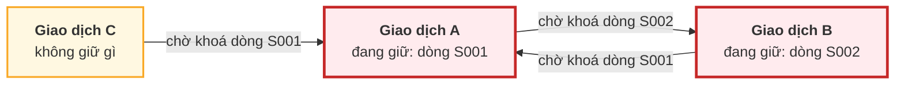
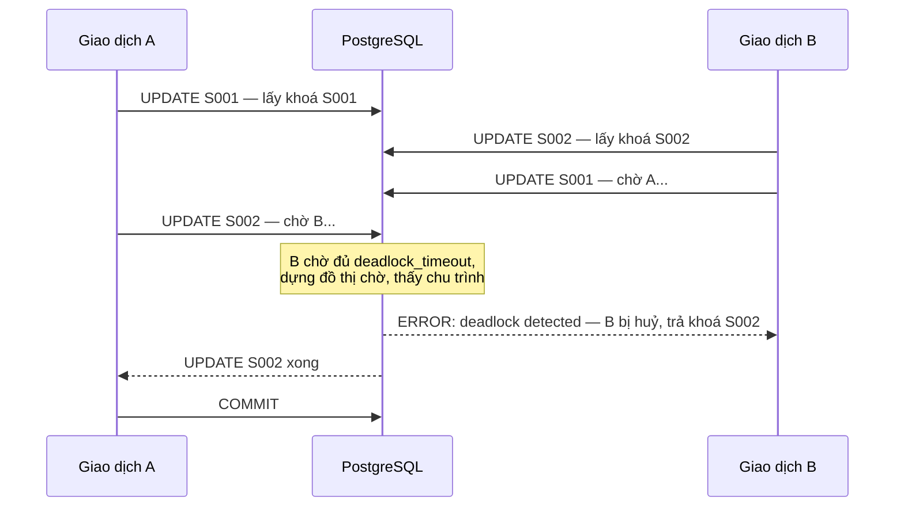

# Bài 41 — Khoá và bế tắc

!!! abstract "🎯 Học xong bài này, bạn sẽ"
    - Phân biệt **khoá chia sẻ** với **khoá độc quyền**, **khoá mức bảng** với **khoá mức dòng**, và biết mỗi lệnh SQL quen thuộc lấy khoá gì
    - Đọc được bảng ma trận tương thích 8 mức khoá bảng của PostgreSQL — và để máy **tự dựng lại** bảng đó để kiểm
    - Dùng đúng `SELECT ... FOR UPDATE`, `FOR NO KEY UPDATE`, `FOR SHARE`, `NOWAIT`, `SKIP LOCKED`
    - Đọc `pg_locks` và `pg_blocking_pids` để trả lời câu hỏi *"ai đang chặn ai"*
    - Giải thích **khoá hai pha**, vẽ **đồ thị chờ**, dựng lại một **bế tắc** thật, đọc hiểu thông báo `deadlock detected`, và áp dụng bốn nguyên tắc phòng tránh

## 🧠 Câu chuyện mở đầu

Phòng thí nghiệm của trường có nhiều tủ, mỗi tủ một chìa, treo ở phòng bảo vệ. Luật mượn chìa:

- Muốn **xem** đồ trong tủ thì mượn **chìa phụ** — bao nhiêu người cùng xem cũng được.
- Muốn **lấy hoặc thay** đồ trong tủ thì phải mượn **chìa chính**, và chỉ khi không ai đang cầm chìa nào của tủ đó. Ai cầm chìa chính thì người khác, kể cả người chỉ muốn xem, phải đứng chờ.
- Mượn chìa nào thì giữ tới khi **xong cả buổi thí nghiệm** mới trả.

Chiều thứ Ba, thầy Hùng chuẩn bị bài thực hành: cần lấy đồ ở **tủ Lý** rồi **tủ Hoá**. Cùng lúc, cô Lan cần lấy đồ ở **tủ Hoá** rồi **tủ Lý**.

Thầy Hùng mượn được chìa chính tủ Lý. Cô Lan mượn được chìa chính tủ Hoá. Thầy Hùng quay lại xin chìa tủ Hoá — cô Lan đang cầm, thầy đứng chờ. Cô Lan quay lại xin chìa tủ Lý — thầy Hùng đang cầm, cô đứng chờ.

Không ai làm sai luật. Nhưng hai người sẽ đứng chờ nhau **mãi mãi**, vì mỗi người đang cầm đúng thứ người kia cần, và luật bảo phải xong buổi mới trả.

Mười phút sau, bác bảo vệ đi tuần, nhìn thấy vòng tròn *"thầy Hùng chờ cô Lan, cô Lan chờ thầy Hùng"*. Bác chọn một người, bắt **trả hết chìa và làm lại từ đầu**. Người kia đi tiếp được.

Bài 37 nói chữ **I** được giữ bằng đa phiên bản **và khoá**. Bài 39 đã mổ xẻ đa phiên bản. Bài này là phần còn lại: chìa khoá, hàng chờ, và bác bảo vệ.

## 📖 Khái niệm & thuật ngữ

### Khoá là gì — và không phải là gì

Trong bài này, **khoá** (*lock*) là **quyền tạm thời** mà một giao dịch giữ trên một đối tượng — một bảng, một dòng — để giao dịch khác không làm điều xung đột với nó. Đừng nhầm với **khoá chính**, **khoá ngoại** của Cấp 1: những thứ đó là *key*, là cột dùng để định danh. Tiếng Việt dùng chung một chữ cho hai khái niệm khác hẳn nhau; tài liệu tiếng Anh thì phân biệt *lock* và *key*.

Nhờ MVCC của Bài 39, trong PostgreSQL:

- **Đọc** bình thường **không bao giờ** phải chờ ai, và không bắt ai chờ mình.
- Chỉ những việc **thật sự xung đột** mới phải chờ nhau: hai người cùng sửa một dòng, hay một người sửa cấu trúc bảng trong khi người khác đang dùng bảng đó.

### Chia sẻ và độc quyền

Mọi hệ thống khoá đều xây trên hai loại cơ bản — chìa phụ và chìa chính trong câu chuyện:

| | Người khác đang giữ **chia sẻ** | Người khác đang giữ **độc quyền** |
|---|---|---|
| Xin **khoá chia sẻ** (*shared lock*) | Được | Phải chờ |
| Xin **khoá độc quyền** (*exclusive lock*) | Phải chờ | Phải chờ |

Hai khoá "tương thích" thì giữ cùng lúc được; "xung đột" thì người đến sau phải chờ người trước **trả**. Và người trước chỉ trả khi giao dịch của họ **kết thúc** — `COMMIT` hoặc `ROLLBACK`.

### Khoá mức bảng — 8 mức

**Khoá mức bảng** (*table-level lock*) đặt lên cả một bảng. PostgreSQL không chỉ có hai mà có **tám** mức, để mỗi lệnh chỉ chặn đúng những gì nó cần chặn. Mọi lệnh SQL tự lấy khoá bảng phù hợp; bạn hiếm khi phải tự gõ.

| Mức | Viết tắt trong bảng dưới | Lệnh nào lấy mức này |
|---|---|---|
| `ACCESS SHARE` | AS | `SELECT` |
| `ROW SHARE` | RS | `SELECT ... FOR UPDATE` / `FOR SHARE` và các biến thể |
| `ROW EXCLUSIVE` | RE | `INSERT`, `UPDATE`, `DELETE`, `MERGE` |
| `SHARE UPDATE EXCLUSIVE` | SUE | `VACUUM` (không `FULL`), `ANALYZE`, `CREATE INDEX CONCURRENTLY`, một số dạng `ALTER TABLE` |
| `SHARE` | S | `CREATE INDEX` (không `CONCURRENTLY`) |
| `SHARE ROW EXCLUSIVE` | SRE | `CREATE TRIGGER`, một số dạng `ALTER TABLE` |
| `EXCLUSIVE` | E | `REFRESH MATERIALIZED VIEW CONCURRENTLY` |
| `ACCESS EXCLUSIVE` | AE | `DROP TABLE`, `TRUNCATE`, `VACUUM FULL`, `REINDEX`, `CLUSTER`, `REFRESH MATERIALIZED VIEW`, phần lớn `ALTER TABLE`; mặc định của lệnh `LOCK TABLE` |

Để ý: tên mức có chữ `ROW` nhưng vẫn là **khoá bảng** — tên gọi là di sản lịch sử.

Ma trận tương thích — hàng là mức **đang xin**, cột là mức **người khác đang giữ**; ✗ là xung đột (phải chờ), · là tương thích:

| Xin \ Đang giữ | AS | RS | RE | SUE | S | SRE | E | AE |
|---|---|---|---|---|---|---|---|---|
| **AS** | · | · | · | · | · | · | · | ✗ |
| **RS** | · | · | · | · | · | · | ✗ | ✗ |
| **RE** | · | · | · | · | ✗ | ✗ | ✗ | ✗ |
| **SUE** | · | · | · | ✗ | ✗ | ✗ | ✗ | ✗ |
| **S** | · | · | ✗ | ✗ | · | ✗ | ✗ | ✗ |
| **SRE** | · | · | ✗ | ✗ | ✗ | ✗ | ✗ | ✗ |
| **E** | · | ✗ | ✗ | ✗ | ✗ | ✗ | ✗ | ✗ |
| **AE** | ✗ | ✗ | ✗ | ✗ | ✗ | ✗ | ✗ | ✗ |

Ba điều đọc ra ngay từ bảng:

- `SELECT` (AS) chỉ xung đột với **AE**. Đọc bảng không bao giờ bị ghi chặn — nhưng **bị** `ALTER TABLE`, `DROP`, `TRUNCATE` chặn.
- Nhiều `INSERT`/`UPDATE`/`DELETE` (RE) cùng lúc trên một bảng là **tương thích** ở mức bảng. Chúng chỉ đụng nhau nếu cùng đụng **một dòng** — việc của khoá mức dòng.
- `CREATE INDEX` thường (S) chặn mọi lệnh ghi (RE), còn `CREATE INDEX CONCURRENTLY` (SUE) thì không — đó là lý do Bài 34 khuyên dùng nó trên bảng đang chạy.

Bảng ma trận này không phải chép tay rồi tin: phần thực hành để máy thử cả 64 ô và so với bảng trên.

### Khoá mức dòng

**Khoá mức dòng** (*row-level lock*) đặt lên từng dòng. Lệnh `UPDATE`, `DELETE` tự lấy nó trên những dòng chúng sửa. Muốn khoá dòng ngay lúc **đọc** — để chắc rằng không ai sửa dòng đó giữa lúc mình đọc và lúc mình ghi — dùng **khoá dòng khi đọc** (*SELECT ... FOR UPDATE*) hoặc các biến thể nhẹ hơn:

| Mức khoá dòng | Ai lấy |
|---|---|
| `FOR UPDATE` | `SELECT ... FOR UPDATE`; `DELETE`; `UPDATE` có sửa cột khoá (cột có index `UNIQUE` mà khoá ngoại có thể trỏ tới) |
| `FOR NO KEY UPDATE` | `UPDATE` **không** sửa cột khoá; `SELECT ... FOR NO KEY UPDATE` |
| `FOR SHARE` | `SELECT ... FOR SHARE` |
| `FOR KEY SHARE` | `SELECT ... FOR KEY SHARE`; **kiểm tra khoá ngoại** — thêm một học sinh vào lớp `L01` thì khoá nhẹ dòng `L01` của bảng cha để nó không bị xoá giữa chừng |

Ma trận tương thích, cũng do máy tự kiểm ở phần thực hành:

| Xin \ Đang giữ | KEY SHARE | SHARE | NO KEY UPDATE | UPDATE |
|---|---|---|---|---|
| **FOR KEY SHARE** | · | · | · | ✗ |
| **FOR SHARE** | · | · | ✗ | ✗ |
| **FOR NO KEY UPDATE** | · | ✗ | ✗ | ✗ |
| **FOR UPDATE** | ✗ | ✗ | ✗ | ✗ |

Khoá dòng không nằm trong bộ nhớ mà được **ghi ngay vào tuple** — chính trường `xmax` của Bài 39 (câu 4 phần bài tập bài đó). Nhờ vậy PostgreSQL khoá được hàng triệu dòng mà không tốn bộ nhớ, nhưng cũng vì vậy mà khoá dòng **không hiện** trong bảng hệ thống `pg_locks` — trừ khi có người đang **chờ** nó.

Hai tuỳ chọn thay đổi cách xử lý khi gặp dòng đã bị khoá:

| Tuỳ chọn | Gặp dòng đang bị người khác khoá thì |
|---|---|
| (mặc định) | Đứng chờ tới khi người kia trả |
| **Không chờ** (*NOWAIT*) | Báo lỗi ngay: `could not obtain lock on row in relation ...` |
| **Bỏ qua dòng đang khoá** (*SKIP LOCKED*) | Lặng lẽ bỏ dòng đó, lấy các dòng còn lại |

`SKIP LOCKED` là cách dựng **hàng đợi công việc** trên một bảng: nhiều người cùng lấy "việc tiếp theo", mỗi người tự động nhận một việc khác nhau, không ai phải chờ ai.

### Tranh chấp khoá

Khi nhiều giao dịch cùng cần khoá **một** dòng — dòng số lượng của cuốn sách được mượn nhiều nhất, dòng tổng điểm thi đua của cả trường — chúng phải xếp hàng lần lượt. Hệ thống có thể có hàng trăm kết nối mà thông lượng ghi chỉ bằng **một** người làm việc. Hiện tượng này gọi là **tranh chấp khoá** (*lock contention*). Nó không làm sai dữ liệu, chỉ làm mọi thứ **chậm**, và thường là nguyên nhân khi "máy chủ còn rảnh mà ứng dụng vẫn ì ạch".

Thêm một chi tiết quan trọng: người chờ khoá xếp thành **hàng đợi khoá** (*lock queue*) theo thứ tự đến. Một người xin khoá **tương thích** với người đang giữ vẫn phải xếp sau một người **đang chờ** mà xung đột với mình. Lỗi 1 cho thấy chi tiết nhỏ này làm treo cả một bảng thế nào.

### Khoá hai pha

Vì sao khoá phải giữ tới hết giao dịch? Hãy tưởng tượng thầy Hùng trả chìa tủ Lý ngay sau khi lấy đồ, trước khi xong việc ở tủ Hoá. Người khác có thể thay đồ trong tủ Lý ngay lúc đó — và nếu thầy Hùng bị huỷ, phải trả đồ lại vào tủ Lý, thì tủ đã không còn như lúc thầy lấy.

Nguyên tắc **khoá hai pha** (*two-phase locking*, viết tắt **2PL**) chia đời một giao dịch thành hai pha:

| Pha | Được làm gì |
|---|---|
| **Pha lấy khoá** | Chỉ được **lấy thêm** khoá, không được trả |
| **Pha trả khoá** | Chỉ được **trả**, không được lấy thêm |

Người ta chứng minh được: nếu mọi giao dịch tuân theo 2PL thì kết quả luôn như chạy lần lượt. Bản chặt hơn, **trả mọi khoá cùng lúc ở `COMMIT`/`ROLLBACK`**, là thứ PostgreSQL làm với mọi khoá dòng và khoá bảng mà lệnh SQL tự lấy.

Nhưng PostgreSQL **không** dùng 2PL cho việc **đọc**: đọc dựa vào ảnh chụp của MVCC, không lấy khoá dòng. Đó là lý do Read Committed và Repeatable Read để lọt các hiện tượng của Bài 38. Serializable của PostgreSQL cũng không khoá khi đọc, mà theo dõi ai đọc gì để huỷ giao dịch vi phạm — cách tiếp cận "lạc quan" thay cho 2PL "bi quan".

### Bế tắc và đồ thị chờ

Câu chuyện mở đầu là một **bế tắc** (*deadlock*): hai hay nhiều giao dịch chờ khoá của nhau theo một vòng tròn, nên không ai đi tiếp được. 2PL không ngăn được bế tắc — chính việc giữ khoá tới cuối làm nó dễ xảy ra hơn.

Để phát hiện, PostgreSQL dựng một **đồ thị chờ** (*wait-for graph*): mỗi giao dịch là một đỉnh, và có mũi tên từ A sang B nếu A đang chờ một khoá mà B đang giữ. Bế tắc xảy ra **khi và chỉ khi** đồ thị có **chu trình**.

Kiểm tra đồ thị tốn công, nên PostgreSQL không kiểm liên tục. Một giao dịch đã chờ khoá quá `deadlock_timeout` — mặc định **1 giây** — thì tự dựng đồ thị. Nếu thấy chu trình, nó **huỷ một giao dịch** trong vòng — thường là chính giao dịch vừa phát hiện — với lỗi SQLSTATE `40P01`. Các giao dịch còn lại đi tiếp. Đó là bác bảo vệ trong câu chuyện.

Bốn nguyên tắc phòng bế tắc:

| Nguyên tắc | Vì sao hiệu quả |
|---|---|
| **1. Khoá theo một thứ tự cố định** — ví dụ luôn theo mã tăng dần | Không thể có vòng tròn nếu mọi người đi cùng một chiều |
| **2. Giữ giao dịch ngắn** | Giữ khoá càng ngắn, khả năng chồng chéo càng nhỏ |
| **3. Dùng `NOWAIT` hoặc `SKIP LOCKED`** khi hợp nghiệp vụ | Không đứng chờ thì không thể nằm trong vòng chờ |
| **4. Giảm mức cô lập hoặc bớt khoá khi đủ đúng** | Không khoá thứ không cần khoá — ví dụ `FOR NO KEY UPDATE` thay cho `FOR UPDATE` |

Và vì bế tắc vẫn có thể xảy ra dù đã cẩn thận, ứng dụng nên **thử lại** giao dịch bị lỗi `40P01`, y như lỗi `40001` của Bài 38.

!!! note "Các hệ quản trị khác"
    SQL Server có **leo thang khoá**: khi một giao dịch giữ quá nhiều khoá dòng (cỡ vài nghìn), nó đổi thành một khoá cả bảng để tiết kiệm bộ nhớ — và bất ngờ chặn mọi người khác. PostgreSQL không bao giờ leo thang, vì khoá dòng nằm trong tuple. MySQL (InnoDB) ở mức Repeatable Read còn khoá cả **khoảng trống** giữa các khoá trong index để chặn đọc bóng ma, nên bế tắc khi `INSERT` đồng thời ở đó phổ biến hơn PostgreSQL.

### Bảng thuật ngữ

| Tiếng Việt | English | Nghĩa dễ hiểu |
|---|---|---|
| Khoá | *lock* | Quyền tạm thời một giao dịch giữ trên bảng hoặc dòng để chặn việc xung đột; khác với khoá chính/khoá ngoại (*key*) |
| Khoá chia sẻ | *shared lock* | Khoá nhiều giao dịch giữ cùng lúc được; chỉ xung đột với khoá độc quyền |
| Khoá độc quyền | *exclusive lock* | Khoá chỉ một giao dịch giữ; xung đột với mọi khoá khác trên cùng đối tượng |
| Khoá mức bảng | *table-level lock* | Khoá trên cả bảng; PostgreSQL có 8 mức, từ `ACCESS SHARE` của `SELECT` tới `ACCESS EXCLUSIVE` của `DROP`/`ALTER` |
| Khoá mức dòng | *row-level lock* | Khoá trên từng dòng, ghi ngay trong tuple; 4 mức từ `FOR KEY SHARE` tới `FOR UPDATE` |
| Khoá dòng khi đọc | *SELECT ... FOR UPDATE* | Đọc và khoá luôn các dòng, để không ai sửa chúng trước khi giao dịch mình kết thúc |
| Không chờ | *NOWAIT* | Gặp khoá xung đột thì báo lỗi ngay thay vì đứng chờ |
| Bỏ qua dòng đang khoá | *SKIP LOCKED* | Gặp dòng đang bị khoá thì bỏ qua, lấy các dòng khác — nền của hàng đợi công việc |
| Tranh chấp khoá | *lock contention* | Nhiều giao dịch xếp hàng chờ khoá cùng một đối tượng, làm thông lượng sụt hẳn |
| Hàng đợi khoá | *lock queue* | Người chờ khoá xếp theo thứ tự đến; xin khoá tương thích vẫn phải chờ sau người đang chờ mà xung đột |
| Khoá hai pha | *two-phase locking* (2PL) | Pha chỉ lấy khoá rồi pha chỉ trả khoá; bảo đảm kết quả như chạy lần lượt |
| Bế tắc | *deadlock* | Các giao dịch chờ khoá của nhau theo vòng tròn nên không ai đi tiếp được |
| Đồ thị chờ | *wait-for graph* | Đồ thị có mũi tên A → B khi A chờ khoá B đang giữ; có chu trình là có bế tắc |

## 🖼️ Sơ đồ

Đồ thị chờ tại khoảnh khắc bế tắc trong phần thực hành. Giao dịch C cũng đang chờ, nhưng **không** nằm trong chu trình — chờ không có nghĩa là bế tắc:



Mũi tên A → B → A khép thành vòng: bế tắc. Huỷ B thì mũi tên B → A biến mất, A lấy được S002 và đi tiếp; khi A xác nhận, C lấy được S001.

Dòng thời gian của cùng bế tắc đó:



## 💻 Thực hành

### Chuẩn bị

Bảng kho sách, và phiên B qua `dblink` như Bài 38. Phần này cần đến **ba** phiên ở một chỗ, nên ta mở sẵn cả phiên C.

```sql
DROP TABLE IF EXISTS b41_sach CASCADE;
CREATE TABLE b41_sach (
    ma_sach  CHAR(4)      PRIMARY KEY,
    ten_sach VARCHAR(100) NOT NULL,
    so_luong SMALLINT     NOT NULL CHECK (so_luong >= 0)
);
INSERT INTO b41_sach SELECT ma_sach, ten_sach, so_luong FROM sach;

DROP TABLE IF EXISTS b41_nhat_ky CASCADE;
CREATE TABLE b41_nhat_ky (buoc TEXT PRIMARY KEY, gia_tri TEXT);

CREATE EXTENSION IF NOT EXISTS dblink;
SELECT dblink_connect('phien_b',
       format('host=%s port=%s dbname=%s user=%s',
              split_part(current_setting('unix_socket_directories'), ',', 1),
              current_setting('port'), current_database(), current_user));
SELECT dblink_connect('phien_c',
       format('host=%s port=%s dbname=%s user=%s',
              split_part(current_setting('unix_socket_directories'), ',', 1),
              current_setting('port'), current_database(), current_user));

-- Mã tiến trình của từng phiên, để lát nữa hỏi "ai chặn ai"
DROP TABLE IF EXISTS b41_phien CASCADE;
CREATE TABLE b41_phien AS
SELECT 'A' AS ten, pg_backend_pid() AS pid
UNION ALL SELECT 'B', pid FROM dblink('phien_b', 'SELECT pg_backend_pid()') AS t(pid integer)
UNION ALL SELECT 'C', pid FROM dblink('phien_c', 'SELECT pg_backend_pid()') AS t(pid integer);

-- KỲ VỌNG: so_sach = 20
-- KỲ VỌNG: so_phien_khac_nhau = 3
SELECT (SELECT count(*) FROM b41_sach)                AS so_sach,
       (SELECT count(DISTINCT pid) FROM b41_phien)     AS so_phien_khac_nhau;
```

Một thủ tục nhỏ để phiên A **đợi** tới khi một phiên khác thật sự bị chặn — cần cho các thí nghiệm mà phiên kia được gửi lệnh rồi đứng chờ. Hàm `pg_blocking_pids(pid)` trả về danh sách mã các phiên đang chặn phiên `pid`:

```sql
DROP PROCEDURE IF EXISTS b41_doi_bi_chan(text);
CREATE PROCEDURE b41_doi_bi_chan(p_ten text) LANGUAGE plpgsql AS $$
BEGIN
    FOR i IN 1..200 LOOP                       -- tối đa 10 giây
        EXIT WHEN cardinality(pg_blocking_pids((SELECT pid FROM b41_phien WHERE ten = p_ten))) > 0;
        PERFORM pg_sleep(0.05);
    END LOOP;
END $$;
```

### Máy tự dựng lại ma trận khoá bảng

Với mỗi cặp (mức phiên A xin, mức phiên B đang giữ): phiên B mở giao dịch và `LOCK TABLE` ở mức của nó; phiên A thử `LOCK TABLE ... NOWAIT` — lấy được thì ghi `.`, bị từ chối thì ghi `X`; rồi phiên B trả khoá.

Phiên A lấy khoá bên trong một khối `BEGIN ... EXCEPTION` của PL/pgSQL. Như Bài 37 đã nói, khối đó giống một điểm lưu ngầm: khi có lỗi, mọi thứ trong khối bị huỷ — **kể cả khoá vừa lấy**. Nên khi lấy được, ta cố ý ném một lỗi để trả khoá ngay, sẵn sàng cho ô tiếp theo.

```sql
DROP TABLE IF EXISTS b41_ma_tran_bang CASCADE;
CREATE TABLE b41_ma_tran_bang (thu_tu INTEGER PRIMARY KEY, muc_xin TEXT, hang TEXT);

DO $$
DECLARE
    cac_muc TEXT[] := ARRAY['ACCESS SHARE', 'ROW SHARE', 'ROW EXCLUSIVE', 'SHARE UPDATE EXCLUSIVE',
                            'SHARE', 'SHARE ROW EXCLUSIVE', 'EXCLUSIVE', 'ACCESS EXCLUSIVE'];
    hang TEXT;
BEGIN
    FOR i IN 1..8 LOOP                                   -- mức phiên A xin
        hang := '';
        FOR j IN 1..8 LOOP                               -- mức phiên B đang giữ
            PERFORM dblink_exec('phien_b', 'BEGIN');
            PERFORM dblink_exec('phien_b', format('LOCK TABLE b41_sach IN %s MODE', cac_muc[j]));
            BEGIN
                EXECUTE format('LOCK TABLE b41_sach IN %s MODE NOWAIT', cac_muc[i]);
                RAISE EXCEPTION 'lay_duoc';              -- lấy được: huỷ khối để trả khoá ngay
            EXCEPTION
                WHEN lock_not_available THEN hang := hang || 'X';
                WHEN raise_exception    THEN hang := hang || '.';
            END;
            PERFORM dblink_exec('phien_b', 'ROLLBACK');
        END LOOP;
        INSERT INTO b41_ma_tran_bang VALUES (i, cac_muc[i], hang);
    END LOOP;
END $$;

-- KỲ VỌNG: so_hang_khop_bang_trong_bai = 8
SELECT count(*) AS so_hang_khop_bang_trong_bai
FROM b41_ma_tran_bang AS do_duoc
JOIN (VALUES (1, '.......X'), (2, '......XX'), (3, '....XXXX'), (4, '...XXXXX'),
             (5, '..XX.XXX'), (6, '..XXXXXX'), (7, '.XXXXXXX'), (8, 'XXXXXXXX'))
     AS trong_bai(thu_tu, hang) USING (thu_tu)
WHERE do_duoc.hang = trong_bai.hang;
```

Cả **8** hàng khớp với bảng ma trận ở phần Khái niệm. Xem kết quả đo:

```sql
SELECT muc_xin, hang FROM b41_ma_tran_bang ORDER BY thu_tu;
```

Làm y hệt cho 4 mức khoá dòng, trên dòng `S001`:

```sql
DROP TABLE IF EXISTS b41_ma_tran_dong CASCADE;
CREATE TABLE b41_ma_tran_dong (thu_tu INTEGER PRIMARY KEY, muc_xin TEXT, hang TEXT);

DO $$
DECLARE
    cac_muc TEXT[] := ARRAY['FOR KEY SHARE', 'FOR SHARE', 'FOR NO KEY UPDATE', 'FOR UPDATE'];
    hang TEXT;
BEGIN
    FOR i IN 1..4 LOOP
        hang := '';
        FOR j IN 1..4 LOOP
            PERFORM dblink_exec('phien_b', 'BEGIN');
            PERFORM * FROM dblink('phien_b',
                format($q$SELECT 1 FROM b41_sach WHERE ma_sach = 'S001' %s$q$, cac_muc[j])) AS t(x integer);
            BEGIN
                EXECUTE format($q$SELECT 1 FROM b41_sach WHERE ma_sach = 'S001' %s NOWAIT$q$, cac_muc[i]);
                RAISE EXCEPTION 'lay_duoc';
            EXCEPTION
                WHEN lock_not_available THEN hang := hang || 'X';
                WHEN raise_exception    THEN hang := hang || '.';
            END;
            PERFORM dblink_exec('phien_b', 'ROLLBACK');
        END LOOP;
        INSERT INTO b41_ma_tran_dong VALUES (i, cac_muc[i], hang);
    END LOOP;
END $$;

-- KỲ VỌNG: so_hang_khop_bang_trong_bai = 4
SELECT count(*) AS so_hang_khop_bang_trong_bai
FROM b41_ma_tran_dong AS do_duoc
JOIN (VALUES (1, '...X'), (2, '..XX'), (3, '.XXX'), (4, 'XXXX')) AS trong_bai(thu_tu, hang) USING (thu_tu)
WHERE do_duoc.hang = trong_bai.hang;
```

### Nhìn vào `pg_locks`

Bảng hệ thống `pg_locks` liệt kê mọi khoá đang được giữ hoặc đang được xin trên máy chủ, mỗi dòng một khoá: loại đối tượng (`locktype`), đối tượng nào (`relation`, `transactionid`...), mức (`mode`), đã được cấp chưa (`granted`), và phiên nào (`pid`).

Sửa một dòng trong giao dịch, rồi xem mình đang giữ những gì:

```sql
BEGIN;
UPDATE b41_sach SET so_luong = so_luong WHERE ma_sach = 'S003';

INSERT INTO b41_nhat_ky
SELECT 'pl_khoa_bang', string_agg(mode, ',')
FROM pg_locks WHERE pid = pg_backend_pid() AND relation = 'b41_sach'::regclass;
INSERT INTO b41_nhat_ky
SELECT 'pl_khoa_ma_gd', count(*)::text
FROM pg_locks WHERE pid = pg_backend_pid() AND locktype = 'transactionid' AND mode = 'ExclusiveLock';
INSERT INTO b41_nhat_ky
SELECT 'pl_khoa_dong', count(*)::text
FROM pg_locks WHERE pid = pg_backend_pid() AND locktype = 'tuple';
COMMIT;

-- KỲ VỌNG: khoa_bang = RowExclusiveLock
-- KỲ VỌNG: khoa_ma_giao_dich = 1
-- KỲ VỌNG: khoa_dong_trong_pg_locks = 0
SELECT (SELECT gia_tri FROM b41_nhat_ky WHERE buoc = 'pl_khoa_bang')  AS khoa_bang,
       (SELECT gia_tri FROM b41_nhat_ky WHERE buoc = 'pl_khoa_ma_gd') AS khoa_ma_giao_dich,
       (SELECT gia_tri FROM b41_nhat_ky WHERE buoc = 'pl_khoa_dong')  AS khoa_dong_trong_pg_locks;
```

- `RowExclusiveLock` trên `b41_sach`: khoá **bảng** mức RE của `UPDATE`.
- Một `ExclusiveLock` trên chính **mã giao dịch** của mình: mọi giao dịch có mã đều tự khoá mã của nó, và chỉ trả khi kết thúc. Ai muốn chờ giao dịch này xong thì xin khoá chia sẻ trên mã đó — xem ngay dưới đây.
- **Không** có dòng nào cho khoá trên dòng `S003`: nó nằm trong tuple, không nằm trong `pg_locks`.

Tự gõ câu sau trong một giao dịch của bạn để xem đầy đủ — sẽ có cả khoá trên index khoá chính và vài loại khoá nội bộ khác:

```sql
SELECT locktype, relation::regclass, transactionid, mode, granted
FROM pg_locks WHERE pid = pg_backend_pid();
```

### Ai đang chặn ai

Phiên A khoá dòng `S003`, phiên B muốn sửa đúng dòng đó:

| Bước | Phiên A | Phiên B |
|---|---|---|
| 1 | `BEGIN;` · `SELECT ... WHERE ma_sach = 'S003' FOR UPDATE;` | |
| 2 | | `UPDATE ... WHERE ma_sach = 'S003';` — **đứng chờ** |
| 3 | Xem `pg_locks`, `pg_blocking_pids` | |
| 4 | `COMMIT;` | `UPDATE` chạy xong |

Phiên B được gửi lệnh **không đồng bộ** bằng `dblink_send_query` — gửi đi rồi không đợi kết quả, như Bài 38 — để phiên A còn làm việc được trong lúc B đứng chờ:

```sql
BEGIN;
SELECT ma_sach FROM b41_sach WHERE ma_sach = 'S003' FOR UPDATE;

SELECT dblink_send_query('phien_b', $$UPDATE b41_sach SET so_luong = so_luong - 1 WHERE ma_sach = 'S003'$$);
CALL b41_doi_bi_chan('B');

INSERT INTO b41_nhat_ky
SELECT 'ai_chan_b', (pg_blocking_pids(pid) = ARRAY[pg_backend_pid()])::text FROM b41_phien WHERE ten = 'B';
INSERT INTO b41_nhat_ky
SELECT 'b_dang_xin', l.locktype || ' ' || l.mode
FROM pg_locks AS l JOIN b41_phien AS p ON p.pid = l.pid
WHERE p.ten = 'B' AND NOT l.granted;
COMMIT;

INSERT INTO b41_nhat_ky
SELECT 'b_xong', x FROM dblink_get_result('phien_b') AS t(x text);
SELECT * FROM dblink_get_result('phien_b') AS t(x text);        -- dọn kết quả rỗng cuối

-- KỲ VỌNG: b_bi_a_chan = true
-- KỲ VỌNG: b_dang_xin = transactionid ShareLock
-- KỲ VỌNG: b_xong = UPDATE 1
SELECT (SELECT gia_tri FROM b41_nhat_ky WHERE buoc = 'ai_chan_b')  AS b_bi_a_chan,
       (SELECT gia_tri FROM b41_nhat_ky WHERE buoc = 'b_dang_xin') AS b_dang_xin,
       (SELECT gia_tri FROM b41_nhat_ky WHERE buoc = 'b_xong')     AS b_xong;
```

Phiên B đang xin `ShareLock` trên **mã giao dịch** của phiên A — đúng cơ chế vừa nói: chờ khoá một dòng thực chất là chờ giao dịch đang giữ dòng đó **kết thúc**. `pg_blocking_pids` chỉ đích danh phiên A. Phiên A `COMMIT`, phiên B chạy xong `UPDATE 1`.

Trong đời thật, truy vấn hữu ích nhất khi hệ thống "đứng hình" là:

```sql
SELECT pid, pg_blocking_pids(pid) AS bi_chan_boi, state, wait_event_type, query
FROM pg_stat_activity
WHERE cardinality(pg_blocking_pids(pid)) > 0;
```

### `NOWAIT` và `SKIP LOCKED`

Phiên B khoá hai cuốn đầu tiên và giữ đó:

```sql
SELECT dblink_exec('phien_b', 'BEGIN');
SELECT * FROM dblink('phien_b',
       $$SELECT ma_sach FROM b41_sach WHERE ma_sach IN ('S001', 'S002') FOR UPDATE$$) AS t(ma_sach text);

-- NOWAIT: báo lỗi ngay thay vì chờ. Bắt lỗi để khoá học chạy tiếp được.
DO $$
BEGIN
    PERFORM 1 FROM b41_sach WHERE ma_sach = 'S001' FOR UPDATE NOWAIT;
EXCEPTION WHEN lock_not_available THEN
    INSERT INTO b41_nhat_ky VALUES ('nowait', SQLERRM);
END $$;

-- SKIP LOCKED: lấy 3 cuốn đầu tiên CHƯA bị ai khoá
INSERT INTO b41_nhat_ky
SELECT 'skip_locked', string_agg(ma_sach, ',' ORDER BY ma_sach)
FROM (SELECT ma_sach FROM b41_sach ORDER BY ma_sach LIMIT 3 FOR UPDATE SKIP LOCKED) AS lay_duoc;

SELECT dblink_exec('phien_b', 'ROLLBACK');

-- KỲ VỌNG: nowait = could not obtain lock on row in relation "b41_sach"
-- KỲ VỌNG: skip_locked = S003,S004,S005
SELECT (SELECT gia_tri FROM b41_nhat_ky WHERE buoc = 'nowait')      AS nowait,
       (SELECT gia_tri FROM b41_nhat_ky WHERE buoc = 'skip_locked') AS skip_locked;
```

- `NOWAIT` gặp `S001` đang bị khoá thì báo lỗi ngay: *could not obtain lock on row in relation "b41_sach"*.
- `SKIP LOCKED` bỏ qua `S001`, `S002` và lấy ba cuốn kế tiếp **chưa bị khoá**: `S003`, `S004`, `S005`. Không ai phải chờ ai.

### Dựng lại một bế tắc thật

Hai thủ thư cùng chuyển sách giữa hai kho. Phiên A trừ `S001` rồi `S002`; phiên B trừ `S002` rồi `S001` — thứ tự **ngược nhau**, như thầy Hùng và cô Lan.

| Bước | Phiên A | Phiên B |
|---|---|---|
| 1 | `BEGIN;` · `UPDATE ... WHERE ma_sach = 'S001';` → khoá `S001` | |
| 2 | | `BEGIN;` · `UPDATE ... WHERE ma_sach = 'S002';` → khoá `S002` |
| 3 | | `UPDATE ... WHERE ma_sach = 'S001';` → **chờ A** |
| 4 | `UPDATE ... WHERE ma_sach = 'S002';` → **chờ B** — vòng tròn | |
| 5 | | Sau 1 giây: **ERROR: deadlock detected** — B bị huỷ |
| 6 | `UPDATE` ở bước 4 chạy xong · `COMMIT;` | `ROLLBACK;` |

Làm bằng hai cửa sổ `psql` thì ai là người bị huỷ tuỳ vào ai chờ đủ 1 giây trước. Để máy tự chạy ra kết quả **đoán trước được**, phiên A đặt `deadlock_timeout` của riêng mình lên 10 giây (cần quyền quản trị — với Docker của Bài 5 bạn có sẵn): phiên B, với 1 giây mặc định, chắc chắn là người phát hiện.

```sql
UPDATE b41_sach AS s SET so_luong = g.so_luong FROM sach AS g WHERE g.ma_sach = s.ma_sach;   -- trả kho về như cũ

SET deadlock_timeout = '10s';

BEGIN;
UPDATE b41_sach SET so_luong = so_luong - 1 WHERE ma_sach = 'S001';                           -- 1. A
SELECT dblink_exec('phien_b', 'BEGIN');                                                       -- 2. B
SELECT dblink_exec('phien_b', $$UPDATE b41_sach SET so_luong = so_luong - 1 WHERE ma_sach = 'S002'$$);
SELECT dblink_send_query('phien_b',                                                           -- 3. B chờ A
       $$UPDATE b41_sach SET so_luong = so_luong - 1 WHERE ma_sach = 'S001'$$);
CALL b41_doi_bi_chan('B');
UPDATE b41_sach SET so_luong = so_luong - 1 WHERE ma_sach = 'S002';                           -- 4. A chờ B
COMMIT;                                                                                       -- 6. A

-- 5. Kết cục của phiên B
INSERT INTO b41_nhat_ky
SELECT 'bt_b_so_dong', count(*)::text FROM dblink_get_result('phien_b', false) AS t(x text);
INSERT INTO b41_nhat_ky SELECT 'bt_b_loi', dblink_error_message('phien_b');
SELECT * FROM dblink_get_result('phien_b', false) AS t(x text);
SELECT dblink_exec('phien_b', 'ROLLBACK');
RESET deadlock_timeout;

-- KỲ VỌNG: b_bi_huy_vi_be_tac = true
-- KỲ VỌNG: co_do_thi_cho = true
-- KỲ VỌNG: s001 = 11
-- KỲ VỌNG: s002 = 7
SELECT (SELECT gia_tri LIKE 'ERROR:  deadlock detected%'
        FROM b41_nhat_ky WHERE buoc = 'bt_b_loi')                              AS b_bi_huy_vi_be_tac,
       (SELECT gia_tri LIKE '%waits for ShareLock on transaction%blocked by process%'
        FROM b41_nhat_ky WHERE buoc = 'bt_b_loi')                              AS co_do_thi_cho,
       (SELECT so_luong FROM b41_sach WHERE ma_sach = 'S001')                   AS s001,
       (SELECT so_luong FROM b41_sach WHERE ma_sach = 'S002')                   AS s002;
```

Phiên B bị huỷ vì bế tắc. Phiên A đi tiếp và xác nhận: `S001` từ 12 xuống **11**, `S002` từ 8 xuống **7** — chỉ lượt của A được ghi, lượt của B biến mất hoàn toàn, kể cả phần B đã làm ở bước 2. Thông báo đầy đủ mà phiên B nhận được — số tiến trình, mã giao dịch và vị trí tuple sẽ khác trên máy bạn:

```text
ERROR:  deadlock detected
DETAIL:  Process 3422999 waits for ShareLock on transaction 1273; blocked by process 3422998.
Process 3422998 waits for ShareLock on transaction 1274; blocked by process 3422999.
HINT:  See server log for query details.
CONTEXT:  while updating tuple (0,1) in relation "b41_sach"
```

Đọc dòng `DETAIL` như đọc đồ thị chờ: tiến trình 3422999 (phiên B) chờ giao dịch 1273 (của phiên A) — bị tiến trình 3422998 chặn; tiến trình 3422998 (phiên A) chờ giao dịch 1274 (của phiên B) — bị tiến trình 3422999 chặn. Hai mũi tên, khép thành vòng. Dòng `HINT` nhắc rằng câu lệnh cụ thể của từng bên được ghi trong nhật ký máy chủ.

## ⚠️ Lỗi thường gặp

!!! danger "Lỗi 1: `ALTER TABLE` lúc giờ cao điểm làm treo cả bảng"
    Một báo cáo đang chạy dài trên `b41_sach` (giữ khoá AS). Bạn chạy `ALTER TABLE b41_sach ADD COLUMN ...` — cần khoá AE, xung đột với AS, nên đứng chờ. Có vẻ vô hại: chỉ mình bạn chờ. Nhưng nhớ **hàng đợi khoá**: mọi câu `SELECT` đến **sau** câu `ALTER` phải xếp **sau** nó, dù chúng hoàn toàn tương thích với cái báo cáo đang chạy. Cả bảng đứng hình.

    | Bước | Phiên A — báo cáo | Phiên B — `ALTER TABLE` | Phiên C — một `SELECT` bình thường |
    |---|---|---|---|
    | 1 | `BEGIN;` · `SELECT count(*) ...` | | |
    | 2 | | `ALTER TABLE ... ADD COLUMN ...` → chờ A | |
    | 3 | | | `SELECT count(*) ...` → **chờ B** |

    ```sql
    BEGIN;
    SELECT count(*) FROM b41_sach;                                                      -- 1. A giữ AS

    SELECT dblink_send_query('phien_b', 'ALTER TABLE b41_sach ADD COLUMN ghi_chu TEXT');  -- 2. B xin AE
    CALL b41_doi_bi_chan('B');
    SELECT dblink_send_query('phien_c', 'SELECT count(*) FROM b41_sach');                -- 3. C xin AS
    CALL b41_doi_bi_chan('C');

    INSERT INTO b41_nhat_ky
    SELECT 'hang_doi_' || p.ten,
           CASE WHEN pg_blocking_pids(p.pid) = ARRAY[(SELECT pid FROM b41_phien WHERE ten = 'A')] THEN 'A'
                WHEN pg_blocking_pids(p.pid) = ARRAY[(SELECT pid FROM b41_phien WHERE ten = 'B')] THEN 'B'
           END || ' | ' || l.mode
    FROM b41_phien AS p JOIN pg_locks AS l ON l.pid = p.pid
    WHERE p.ten IN ('B', 'C') AND NOT l.granted AND l.relation = 'b41_sach'::regclass;
    COMMIT;                                                                             -- A xong: B rồi C đi tiếp

    SELECT * FROM dblink_get_result('phien_b') AS t(x text);
    SELECT * FROM dblink_get_result('phien_b') AS t(x text);
    SELECT * FROM dblink_get_result('phien_c') AS t(n bigint);
    SELECT * FROM dblink_get_result('phien_c') AS t(n bigint);

    -- KỲ VỌNG: b_bi_chan_boi = A | AccessExclusiveLock
    -- KỲ VỌNG: c_bi_chan_boi = B | AccessShareLock
    SELECT (SELECT gia_tri FROM b41_nhat_ky WHERE buoc = 'hang_doi_B') AS b_bi_chan_boi,
           (SELECT gia_tri FROM b41_nhat_ky WHERE buoc = 'hang_doi_C') AS c_bi_chan_boi;
    ```

    Phiên C chỉ xin `AccessShareLock` — thứ tương thích với khoá phiên A đang giữ — nhưng bị **phiên B** chặn, vì B đứng trước nó trong hàng. Nếu báo cáo chạy 20 phút, bảng đứng hình 20 phút.

    Sửa: đặt `lock_timeout` trước mọi lệnh đổi cấu trúc bảng, để nó **bỏ cuộc** thay vì chắn đường, rồi thử lại sau:

    <!-- sql:khong-chay -->
    ```sql
    SET lock_timeout = '2s';
    ALTER TABLE b41_sach ADD COLUMN ghi_chu TEXT;   -- chờ quá 2 giây thì lỗi, không làm treo ai
    RESET lock_timeout;
    ```

!!! danger "Lỗi 2: Khoá theo thứ tự tuỳ hứng"
    Bế tắc trong phần thực hành xảy ra chỉ vì phiên A đi `S001 → S002` còn phiên B đi `S002 → S001`. Trong ứng dụng thật, thứ tự thường do dữ liệu quyết định — "chuyển từ kho X sang kho Y" — nên hai yêu cầu ngược chiều nhau là chuyện bình thường.

    Sửa: trước khi sửa, khoá **mọi** dòng sẽ đụng tới **một lần**, theo một thứ tự cố định — ví dụ mã tăng dần — bất kể nghiệp vụ đi chiều nào. Câu 3 phần bài tập viết điều này thành một hàm và chứng minh nó không bế tắc.

!!! warning "Lỗi 3: Giữ khoá trong lúc làm việc khác"
    Phần mềm thư viện mở giao dịch, `UPDATE` số lượng sách (khoá dòng), rồi **gửi email** xác nhận cho phụ huynh, rồi mới `COMMIT`. Máy chủ email chậm 5 giây, thế là dòng sách đó bị khoá 5 giây — mọi lượt mượn cùng cuốn phải xếp hàng. Với cuốn sách "hot" đầu năm học, đó là **tranh chấp khoá**: hàng chục kết nối cùng chờ một dòng.

    Sửa: không làm gì chậm — gọi mạng, chờ người dùng bấm nút — **bên trong** giao dịch. Ghi dữ liệu, `COMMIT`, rồi mới gửi email. Với những dòng "nóng" như bộ đếm tổng, cân nhắc ghi thêm từng dòng nhỏ rồi cộng lại khi đọc, thay vì mọi người cùng sửa **một** dòng.

!!! warning "Lỗi 4: Dùng `FOR UPDATE` khi `FOR NO KEY UPDATE` là đủ"
    Kiểm tra khoá ngoại lấy khoá `FOR KEY SHARE` trên dòng cha, và nó **chỉ** xung đột với `FOR UPDATE`. Khoá dòng lớp bằng `FOR UPDATE` để sửa tên lớp thì vô tình chặn luôn việc **thêm học sinh** vào lớp đó:

    ```sql
    DROP TABLE IF EXISTS b41_hoc_sinh, b41_lop CASCADE;
    CREATE TABLE b41_lop (ma_lop CHAR(3) PRIMARY KEY, ten_lop VARCHAR(10) NOT NULL);
    INSERT INTO b41_lop SELECT ma_lop, ten_lop FROM lop;
    CREATE TABLE b41_hoc_sinh (ma_hs CHAR(5) PRIMARY KEY, ma_lop CHAR(3) NOT NULL REFERENCES b41_lop);

    -- Phiên B chỉ chịu chờ khoá tối đa 0,3 giây
    SELECT dblink_exec('phien_b', 'SET lock_timeout = ''300ms''');

    BEGIN;
    SELECT ma_lop FROM b41_lop WHERE ma_lop = 'L01' FOR UPDATE;                             -- A
    INSERT INTO b41_nhat_ky
    SELECT 'fk_for_update', dblink_exec('phien_b', $$INSERT INTO b41_hoc_sinh VALUES ('HS041', 'L01')$$, false);
    INSERT INTO b41_nhat_ky SELECT 'fk_for_update_loi', dblink_error_message('phien_b');
    COMMIT;

    BEGIN;
    SELECT ma_lop FROM b41_lop WHERE ma_lop = 'L01' FOR NO KEY UPDATE;                      -- A
    INSERT INTO b41_nhat_ky
    SELECT 'fk_for_no_key', dblink_exec('phien_b', $$INSERT INTO b41_hoc_sinh VALUES ('HS042', 'L01')$$, false);
    COMMIT;

    SELECT dblink_exec('phien_b', 'RESET lock_timeout');

    -- KỲ VỌNG: voi_for_update = ERROR
    -- KỲ VỌNG: loi_la_het_gio_cho_khoa = true
    -- KỲ VỌNG: voi_for_no_key_update = INSERT 0 1
    SELECT (SELECT gia_tri FROM b41_nhat_ky WHERE buoc = 'fk_for_update')         AS voi_for_update,
           (SELECT gia_tri LIKE '%canceling statement due to lock timeout%FOR KEY SHARE%'
            FROM b41_nhat_ky WHERE buoc = 'fk_for_update_loi')                     AS loi_la_het_gio_cho_khoa,
           (SELECT gia_tri FROM b41_nhat_ky WHERE buoc = 'fk_for_no_key')         AS voi_for_no_key_update;
    ```

    Với `FOR UPDATE`, lệnh thêm học sinh của phiên B phải chờ và hết giờ: *canceling statement due to lock timeout*. Thông báo lỗi còn lộ ra câu lệnh nội bộ mà PostgreSQL dùng để kiểm tra khoá ngoại — một câu `SELECT ... FOR KEY SHARE` trên `b41_lop`. Với `FOR NO KEY UPDATE`, lệnh thêm chạy ngay: `INSERT 0 1`.

    Sửa: khoá **nhẹ nhất** đủ dùng. Không sửa cột khoá chính thì dùng `FOR NO KEY UPDATE` — cũng chính là mức mà một câu `UPDATE` bình thường tự lấy.

!!! warning "Lỗi 5: Nhầm `deadlock_timeout` với thời gian chờ khoá tối đa"
    `deadlock_timeout = 1s` **không** có nghĩa "chờ khoá quá 1 giây thì bỏ". Nó chỉ là thời điểm PostgreSQL **bắt đầu kiểm tra** xem có bế tắc không. Nếu không có vòng tròn — chỉ đơn giản là người kia chưa xong — giao dịch cứ thế **chờ mãi**.

    | Tham số | Ý nghĩa |
    |---|---|
    | `deadlock_timeout` | Chờ bao lâu thì dựng đồ thị chờ để tìm bế tắc; không tìm thấy thì chờ tiếp |
    | `lock_timeout` | Chờ **một** khoá quá lâu thì câu lệnh bị huỷ — mặc định `0`, tức không giới hạn |
    | `statement_timeout` | Cả câu lệnh chạy quá lâu, vì bất cứ lý do gì, thì bị huỷ |

    Sửa: nếu ứng dụng không được phép treo, đặt `lock_timeout` hoặc `statement_timeout` cho phiên của nó, và coi lỗi hết giờ cũng như lỗi bế tắc: làm lại giao dịch.

## ✍️ Bài tập

1. Dùng ma trận khoá bảng, trả lời: cặp lệnh nào sau đây **phải chờ nhau** khi chạy cùng lúc trên cùng một bảng?

    a. `VACUUM` và `SELECT`.

    b. `CREATE INDEX` (thường) và `INSERT`.

    c. `CREATE INDEX CONCURRENTLY` và `UPDATE`.

    d. Hai lệnh `CREATE INDEX` (thường) trên hai cột khác nhau.

    e. `TRUNCATE` và `SELECT`.

2. Ba giao dịch: T1 giữ khoá dòng `S001`, đang chờ `S002`. T2 giữ `S002`, đang chờ `S003`. T3 giữ `S003`, đang chờ `S004` — không ai giữ `S004`. Vẽ đồ thị chờ. Có bế tắc không? Nếu T3 chuyển sang chờ `S001` thì sao?

3. Viết hàm `b41_chuyen_sach(p_tu, p_den, p_so)` trừ `p_so` cuốn ở mã `p_tu` và cộng vào mã `p_den`, sao cho hai lời gọi **ngược chiều** chạy đồng thời **không bao giờ** bế tắc. Chứng minh bằng hai phiên.

4. Nhà trường phát sách giáo khoa đầu năm. Bảng `b41_phieu` có 5 phiếu chờ phát. Hai cô văn thư cùng bấm "lấy phiếu tiếp theo". Viết câu lệnh lấy phiếu sao cho hai người **không bao giờ** nhận trùng một phiếu và **không phải chờ** nhau. Kiểm bằng hai phiên.

5. Lịch trình sau có tuân theo khoá hai pha không? *Giao dịch T: khoá A → đọc A → trả A → khoá B → ghi B → trả B → COMMIT.* Nếu không, hãy chỉ ra điều gì có thể sai.

??? success "Đáp án"
    **Câu 1.**

    | Cặp | Mức khoá | Phải chờ? |
    |---|---|---|
    | a. `VACUUM` + `SELECT` | SUE + AS | **Không** — `VACUUM` thường chạy song song với đọc |
    | b. `CREATE INDEX` + `INSERT` | S + RE | **Có** — mọi lệnh ghi đứng chờ cho tới khi dựng xong index |
    | c. `CREATE INDEX CONCURRENTLY` + `UPDATE` | SUE + RE | **Không** — vì vậy mới có `CONCURRENTLY` |
    | d. Hai `CREATE INDEX` thường | S + S | **Không** — S tương thích với chính nó |
    | e. `TRUNCATE` + `SELECT` | AE + AS | **Có** |

    Câu d hay bị đoán sai: hai lệnh dựng index thường **cùng chạy được**, vì cả hai chỉ cần bảng "không bị ai sửa".

    **Câu 2.**

    ```text
    T1 --chờ S002--> T2 --chờ S003--> T3 --chờ S004--> (không ai giữ)
    ```

    Không có chu trình, nên **không** bế tắc: T3 lấy được `S004` ngay, làm xong, trả `S003` cho T2, rồi T2 xong trả `S002` cho T1. Một chuỗi chờ dài làm chậm, nhưng tự gỡ được.

    Nếu T3 chờ `S001` thì có mũi tên T3 → T1, khép vòng **T1 → T2 → T3 → T1**: bế tắc ba bên. Sau `deadlock_timeout`, một trong ba bị huỷ và hai người còn lại đi tiếp.

    **Câu 3.**

    Khoá **cả hai** dòng trong **một** câu, theo mã tăng dần, trước khi sửa:

    ```sql
    DROP FUNCTION IF EXISTS b41_chuyen_sach(CHAR, CHAR, INTEGER);
    CREATE FUNCTION b41_chuyen_sach(p_tu CHAR(4), p_den CHAR(4), p_so INTEGER)
    RETURNS TEXT LANGUAGE plpgsql AS $$
    BEGIN
        -- Luôn khoá theo mã tăng dần, bất kể chiều chuyển
        PERFORM 1 FROM b41_sach WHERE ma_sach IN (p_tu, p_den) ORDER BY ma_sach FOR NO KEY UPDATE;
        UPDATE b41_sach SET so_luong = so_luong - p_so WHERE ma_sach = p_tu;
        UPDATE b41_sach SET so_luong = so_luong + p_so WHERE ma_sach = p_den;
        RETURN 'da chuyen';
    END $$;
    ```

    Phiên A chuyển `S001 → S002`, phiên B **đồng thời** chuyển `S002 → S001` — đúng cặp đã bế tắc ở phần thực hành:

    ```sql
    UPDATE b41_sach AS s SET so_luong = g.so_luong FROM sach AS g WHERE g.ma_sach = s.ma_sach;

    BEGIN;
    SELECT b41_chuyen_sach('S001', 'S002', 2);                                         -- A: khoá S001, S002
    SELECT dblink_send_query('phien_b', $$SELECT b41_chuyen_sach('S002', 'S001', 3)$$); -- B: xin S001 trước → chờ
    CALL b41_doi_bi_chan('B');
    INSERT INTO b41_nhat_ky
    SELECT 'bt3_b_giu_dong', count(*)::text
    FROM pg_locks AS l JOIN b41_phien AS p ON p.pid = l.pid
    WHERE p.ten = 'B' AND l.locktype = 'transactionid' AND l.granted;
    COMMIT;

    INSERT INTO b41_nhat_ky
    SELECT 'bt3_b_ket_qua', x FROM dblink_get_result('phien_b') AS t(x text);
    SELECT * FROM dblink_get_result('phien_b') AS t(x text);

    -- KỲ VỌNG: b_chua_co_ma_gd_khi_cho = 0
    -- KỲ VỌNG: b_ket_qua = da chuyen
    -- KỲ VỌNG: s001 = 13
    -- KỲ VỌNG: s002 = 7
    SELECT (SELECT gia_tri FROM b41_nhat_ky WHERE buoc = 'bt3_b_giu_dong')  AS b_chua_co_ma_gd_khi_cho,
           (SELECT gia_tri FROM b41_nhat_ky WHERE buoc = 'bt3_b_ket_qua')   AS b_ket_qua,
           (SELECT so_luong FROM b41_sach WHERE ma_sach = 'S001')           AS s001,
           (SELECT so_luong FROM b41_sach WHERE ma_sach = 'S002')           AS s002;
    ```

    Phiên B xin `S001` **đầu tiên** — vì `S001 < S002` — nên nó phải chờ **trước khi** kịp giữ bất cứ dòng nào. Bằng chứng: lúc đang chờ, phiên B **chưa có** mã giao dịch nào (`0`) — một giao dịch chỉ nhận mã khi lần đầu ghi hoặc khoá dòng. Không giữ gì thì không ai phải chờ nó, không thể có vòng tròn. Khi A xác nhận, B chạy xong. Kết quả: `S001` = 12 − 2 + 3 = **13**, `S002` = 8 + 2 − 3 = **7**. Cả hai lượt chuyển đều được ghi.

    **Câu 4.**

    ```sql
    DROP TABLE IF EXISTS b41_phieu CASCADE;
    CREATE TABLE b41_phieu (
        ma_phieu   INTEGER PRIMARY KEY,
        ma_hs      CHAR(5) NOT NULL,
        trang_thai TEXT    NOT NULL DEFAULT 'cho_phat'
    );
    INSERT INTO b41_phieu (ma_phieu, ma_hs)
    SELECT g, 'HS' || lpad(g::text, 3, '0') FROM generate_series(1, 5) AS g;

    -- Cô văn thư thứ hai (phiên B) lấy phiếu và đang xử lý, chưa xong
    SELECT dblink_exec('phien_b', 'BEGIN');
    SELECT * FROM dblink('phien_b', $$
        UPDATE b41_phieu SET trang_thai = 'dang_phat'
        WHERE ma_phieu = (SELECT ma_phieu FROM b41_phieu WHERE trang_thai = 'cho_phat'
                          ORDER BY ma_phieu LIMIT 1 FOR UPDATE SKIP LOCKED)
        RETURNING ma_phieu$$) AS t(ma_phieu integer);

    -- Cô văn thư thứ nhất (phiên A) lấy phiếu cùng lúc — CÙNG câu lệnh.
    -- UPDATE ... RETURNING muốn đưa kết quả vào câu khác thì phải bọc trong WITH (Bài 28).
    WITH lay AS (
        UPDATE b41_phieu SET trang_thai = 'dang_phat'
        WHERE ma_phieu = (SELECT ma_phieu FROM b41_phieu WHERE trang_thai = 'cho_phat'
                          ORDER BY ma_phieu LIMIT 1 FOR UPDATE SKIP LOCKED)
        RETURNING ma_phieu
    )
    INSERT INTO b41_nhat_ky SELECT 'bt4_a_lay', ma_phieu::text FROM lay;

    SELECT dblink_exec('phien_b', 'COMMIT');

    -- KỲ VỌNG: a_lay_phieu = 2
    -- KỲ VỌNG: dang_phat = 2
    -- KỲ VỌNG: con_cho = 3
    SELECT (SELECT gia_tri FROM b41_nhat_ky WHERE buoc = 'bt4_a_lay')                   AS a_lay_phieu,
           (SELECT count(*) FROM b41_phieu WHERE trang_thai = 'dang_phat')              AS dang_phat,
           (SELECT count(*) FROM b41_phieu WHERE trang_thai = 'cho_phat')               AS con_cho;
    ```

    Phiên B lấy phiếu **1** và đang giữ khoá. Phiên A chạy **cùng** câu lệnh: `SKIP LOCKED` bỏ qua phiếu 1 đang bị khoá, lấy ngay phiếu **2**, không chờ. Hai phiếu đang phát, ba phiếu còn chờ. Không dùng `SKIP LOCKED` thì phiên A sẽ đứng chờ phiên B xong với phiếu 1, rồi mới đi tìm phiếu khác.

    **Câu 5.**

    **Không**. Sau khi **trả** A, giao dịch lại **lấy** B — vi phạm luật "đã bắt đầu trả thì không được lấy thêm".

    Điều có thể sai: ngay sau khi T trả A, một giao dịch U sửa A và sửa B rồi xác nhận. Sau đó T mới khoá B và ghi B dựa trên giá trị A **cũ** mà nó đã đọc. Kết quả: T "đi trước" U theo A (T đọc A trước khi U sửa), nhưng lại "đi sau" U theo B (T ghi B sau khi U đã ghi). Không có thứ tự chạy lần lượt nào cho ra kết quả đó — chính là một bất thường tuần tự hoá của Bài 38. Giữ mọi khoá tới `COMMIT` là cách chắc chắn nhất để không mắc lỗi này.

### Dọn dẹp cuối bài

```sql
SELECT dblink_disconnect('phien_b');
SELECT dblink_disconnect('phien_c');
DROP EXTENSION IF EXISTS dblink;
DROP FUNCTION IF EXISTS b41_chuyen_sach(CHAR, CHAR, INTEGER);
DROP PROCEDURE IF EXISTS b41_doi_bi_chan(text);
DROP TABLE IF EXISTS b41_sach, b41_nhat_ky, b41_phien, b41_ma_tran_bang, b41_ma_tran_dong,
                     b41_hoc_sinh, b41_lop, b41_phieu CASCADE;

-- KỲ VỌNG: bang_con_lai = 0
-- KỲ VỌNG: ham_con_lai = 0
-- KỲ VỌNG: dblink_con_lai = 0
SELECT (SELECT count(*) FROM information_schema.tables WHERE table_name LIKE 'b41\_%') AS bang_con_lai,
       (SELECT count(*) FROM pg_proc WHERE proname LIKE 'b41\_%')                     AS ham_con_lai,
       (SELECT count(*) FROM pg_extension WHERE extname = 'dblink')                    AS dblink_con_lai;
```

## 🔑 Tóm tắt

1. **Khoá** là quyền tạm thời trên bảng hoặc dòng, giữ tới hết giao dịch — khác hẳn khoá chính, khoá ngoại của Cấp 1. Nhờ MVCC, đọc bình thường không khoá ai; chỉ những việc thật sự xung đột mới chờ nhau. Nền tảng là **chia sẻ** (nhiều người cùng giữ) và **độc quyền** (một người).
2. **Khoá mức bảng** có 8 mức, bài đã để máy thử đủ 64 ô và khớp bảng ma trận: `SELECT` chỉ xung đột với `ACCESS EXCLUSIVE` của `ALTER`/`DROP`/`TRUNCATE`; các lệnh ghi không chặn nhau ở mức bảng; `CREATE INDEX` thường chặn ghi, `CONCURRENTLY` thì không. Người chờ xếp thành **hàng đợi khoá**, nên một `ALTER TABLE` đang chờ làm treo mọi `SELECT` đến sau — luôn đặt `lock_timeout`.
3. **Khoá mức dòng** nằm trong tuple (`xmax`), 4 mức từ `FOR KEY SHARE` (kiểm tra khoá ngoại) tới `FOR UPDATE`. `SELECT ... FOR UPDATE` khoá lúc đọc; `NOWAIT` báo lỗi thay vì chờ; `SKIP LOCKED` bỏ dòng đang khoá — nền của hàng đợi công việc. Dùng mức nhẹ nhất đủ dùng: `FOR UPDATE` chặn cả việc thêm dòng con, `FOR NO KEY UPDATE` thì không.
4. `pg_locks` và `pg_blocking_pids()` trả lời "ai chặn ai"; chờ khoá dòng hiện ra là chờ `ShareLock` trên **mã giao dịch** của người giữ. **Tranh chấp khoá** xảy ra khi nhiều người cùng cần một dòng — giữ giao dịch ngắn, không làm việc chậm bên trong giao dịch. **Khoá hai pha** — chỉ lấy rồi chỉ trả — bảo đảm kết quả như chạy lần lượt; PostgreSQL giữ mọi khoá tới `COMMIT`, nhưng không khoá khi đọc.
5. **Bế tắc** là vòng tròn trong **đồ thị chờ**; sau `deadlock_timeout` PostgreSQL tìm vòng và huỷ một giao dịch với lỗi `40P01` *deadlock detected* — bài đã dựng lại thật. Bốn nguyên tắc phòng: khoá theo **thứ tự cố định**, giao dịch **ngắn**, `NOWAIT`/`SKIP LOCKED`, và khoá **nhẹ nhất** hoặc mức cô lập thấp nhất đủ đúng; ứng dụng vẫn phải **thử lại** khi gặp `40P01`.

---

⬅️ [Bài 40 — WAL, checkpoint và phục hồi sau sự cố](40-wal-va-recovery.md)
