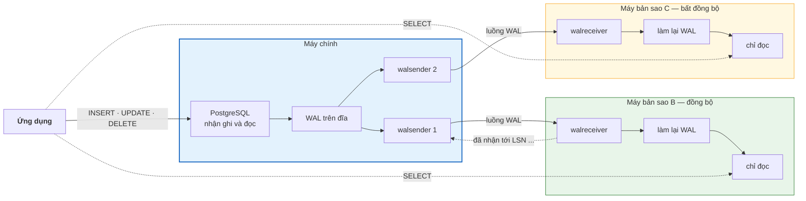
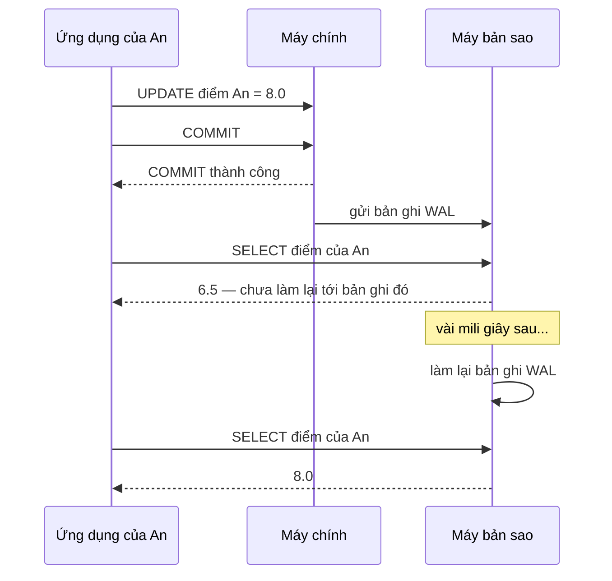

# Bài 42 — Replication: nhân bản dữ liệu ra nhiều máy

!!! abstract "🎯 Học xong bài này, bạn sẽ"
    - Giải thích được **nhân bản** bằng cuốn sổ điểm được photo ra nhiều bản, và vì sao bản photo **luôn** chậm hơn bản gốc một chút
    - Phân biệt **nhân bản vật lý** với **nhân bản logic**, **đồng bộ** với **bất đồng bộ** — và biết mỗi lựa chọn đánh đổi cái gì lấy cái gì
    - Dùng được **bản sao chỉ đọc** để chia tải, và tránh được cái bẫy *"vừa sửa xong mà đọc lại không thấy"* do **độ trễ nhân bản**
    - Mô tả được **chuyển đổi dự phòng** khi máy chính sập, và vì sao làm ẩu thì sinh ra **não chia đôi** — hai máy cùng tưởng mình là máy chính
    - Đọc được trạng thái nhân bản trong `pg_stat_replication`, tạo và xoá một **khe nhân bản**, tạo một **bản phát hành** cho nhân bản logic

## 🧠 Câu chuyện mở đầu

Cô Hạnh chủ nhiệm lớp 9A1 giữ **sổ điểm gốc** của lớp. Ba thầy cô bộ môn — Toán, Văn, Anh — ngày nào cũng cần tra điểm, và cứ phải chạy sang bàn cô Hạnh xin xem sổ. Bàn cô lúc nào cũng có người đứng chờ.

Cô nghĩ ra cách: **photo** sổ điểm thành ba bản, mỗi thầy cô giữ một bản. Từ đó ai cần tra điểm thì mở bản của mình, bàn cô Hạnh hết cảnh xếp hàng.

Nhưng sổ điểm không đứng yên. Mỗi lần cô Hạnh sửa một con điểm ở sổ gốc, cô viết thêm một **phiếu sửa** — *"trang 3, dòng HS001, cột Toán: 6,5 → 8,0"* — rồi nhờ bạn lớp trưởng mang phiếu đi cho ba thầy cô để họ chép vào bản photo của mình. Ngay lập tức có ba câu hỏi khó:

1. **Có chờ không?** Cô Hạnh sửa xong có đợi lớp trưởng đi hết ba bàn, chép xong xuôi rồi mới báo *"đã sửa"* cho học sinh? Nếu chờ thì mỗi lần sửa mất cả phút. Nếu không chờ thì báo nhanh, nhưng...
2. **Đọc lệch.** Bạn An vừa được cô Hạnh báo điểm phúc khảo đã lên 8,0. An chạy ngay sang phòng thầy Toán hỏi lại. Thầy mở **bản photo**: vẫn 6,5 — lớp trưởng chưa tới bàn thầy. An hoang mang: *"Rõ ràng cô vừa sửa mà!"*
3. **Cô Hạnh ốm.** Một tuần cô nghỉ, không ai được sửa điểm. Nhà trường quyết định: thầy Toán cầm bản photo của mình lên làm **sổ gốc tạm**. Hợp lý. Nhưng hôm sau cô Hạnh khỏi ốm, đi làm lại, không ai báo gì — và cô tiếp tục sửa vào cuốn sổ gốc cũ của mình. Giờ trường có **hai cuốn sổ gốc**, mỗi cuốn một kiểu, và không ai biết cuốn nào đúng.

Cả ba câu hỏi đều có tên gọi chính thức, và mọi hệ quản trị cơ sở dữ liệu chạy trên nhiều máy đều phải trả lời chúng. Cái phiếu sửa thì bạn đã biết từ [Bài 40](../cap-4-ben-trong-dong-co/40-wal-va-recovery.md): đó chính là WAL.

## 📖 Khái niệm & thuật ngữ

### Nhân bản là gì, để làm gì

**Nhân bản** (*replication*) là giữ **cùng một dữ liệu** trên nhiều máy chủ, và liên tục chuyển các thay đổi từ máy này sang máy kia để các bản luôn bám sát nhau. Trong cách bố trí phổ biến nhất, chỉ **một** máy nhận lệnh ghi — gọi là **máy chính** (*primary*) — còn các máy khác chỉ nhận thay đổi từ máy chính và làm lại theo — gọi là **máy bản sao** (*replica*). Tài liệu cũ hơn gọi hai vai này là *master* và *slave*; tài liệu PostgreSQL gọi máy bản sao là *standby*.

Người ta nhân bản vì bốn lý do:

| Lý do | Trong câu chuyện | Ý nghĩa với database |
|---|---|---|
| Chịu được máy hỏng | Cô Hạnh ốm, thầy Toán lên thay | Máy chính sập thì đưa một máy bản sao lên thay, dịch vụ không phải dừng lâu |
| Chia tải đọc | Thầy cô tra bản photo, không xếp hàng ở bàn cô Hạnh | Truy vấn đọc được gửi sang máy bản sao, máy chính dành sức cho việc ghi |
| Đặt dữ liệu gần người dùng | Mỗi tổ bộ môn một bản ngay tại phòng mình | Máy bản sao đặt ở một trung tâm dữ liệu khác, gần người dùng ở vùng đó |
| Có thêm một bản dữ liệu | Mất sổ gốc vẫn còn bản photo | Một máy hỏng ổ đĩa không làm mất dữ liệu — nhưng xem Lỗi 1: nhân bản **không** thay được sao lưu |

### Nhân bản vật lý và nhân bản logic

Hai cách chuyển "phiếu sửa" sang máy bản sao:

**Nhân bản vật lý** (*physical replication*) gửi nguyên văn các **bản ghi WAL** — mô tả thay đổi ở mức **trang và byte**: *"trang 17 của tệp dữ liệu bảng `diem`: thêm tuple này vào ô số 5"*. Máy bản sao làm lại y hệt những gì phục hồi sau sự cố của Bài 40 làm, chỉ khác là làm **liên tục, không bao giờ dừng**. Kết quả: máy bản sao là bản chép **từng byte** của máy chính — mọi database, mọi bảng, mọi index.

**Nhân bản logic** (*logical replication*) giải mã WAL thành các **thay đổi ở mức dòng** — *"bảng `diem`: dòng có `ma_diem = 57` đổi `diem_so` từ 6,5 thành 8,0"* — rồi gửi các thay đổi đó đi. Bên nhận áp chúng vào bảng của mình bằng `INSERT`, `UPDATE`, `DELETE` bình thường. Vì là thay đổi ở mức dòng, nên có thể chọn **chỉ một vài bảng**, và bên nhận là một database **độc lập**, có bảng riêng, ghi được.

| | Nhân bản vật lý | Nhân bản logic |
|---|---|---|
| Gửi gì | Bản ghi WAL: thay đổi trên trang, theo byte | Thay đổi trên dòng: bảng nào, dòng nào, giá trị nào |
| Phạm vi | **Cả máy chủ**: mọi database, bảng, index | Chọn **từng bảng** |
| Bên nhận | Bản chép y hệt, **chỉ đọc** | Database độc lập, **ghi được**, có thể có thêm bảng và index riêng |
| Phiên bản PostgreSQL | Hai bên phải **cùng** phiên bản chính (16 với 16) | Được **khác** phiên bản — hay dùng để nâng cấp PostgreSQL gần như không dừng máy |
| Lệnh `CREATE TABLE`, `ALTER TABLE` | Tự sang theo, vì chúng cũng là thay đổi trên trang | **Không** tự sang — phải chạy tay ở bên nhận |
| Cấu hình `wal_level` | `replica` (mặc định) là đủ | Phải là `logical` |

Nhân bản logic của PostgreSQL chia thành hai vế: bên gửi khai báo một **bản phát hành** (*publication*) — danh sách các bảng muốn chia sẻ — còn bên nhận tạo một **đăng ký nhận** (*subscription*) trỏ tới bản phát hành đó. Phần thực hành sẽ tạo một bản phát hành thật.

### Nhân bản theo luồng và khe nhân bản

Cách nhân bản vật lý thông dụng nhất là **nhân bản theo luồng** (*streaming replication*): máy bản sao mở **một kết nối** thường trực tới máy chính. Ở máy chính, một tiến trình tên `walsender` gửi từng bản ghi WAL ngay khi nó vừa được ghi; ở máy bản sao, tiến trình `walreceiver` nhận, ghi xuống đĩa, và tiến trình phục hồi làm lại. Không phải đợi đầy một tệp WAL 16MB như cách chép tệp của lưu trữ WAL ở Bài 40 — độ trễ thường chỉ vài mili giây.

Có một chuyện nhỏ nhưng nguy hiểm: nếu máy bản sao mất kết nối một lúc, lúc quay lại nó cần những bản ghi WAL nó chưa nhận. Nhưng máy chính vẫn tái sử dụng WAL cũ sau mỗi checkpoint! Để máy chính **giữ lại** WAL cho tới khi máy bản sao nhận xong, ta tạo một **khe nhân bản** (*replication slot*) — một cái "ngăn ghi nhớ" ở máy chính, lưu vị trí WAL mà máy bản sao đó đã nhận tới.

Cái giá: máy bản sao **chết hẳn** mà không ai xoá khe, máy chính sẽ **giữ WAL mãi mãi** chờ nó, cho tới khi đầy đĩa. Đây đúng là nguyên nhân thứ hai trong Lỗi 2 của Bài 40.

### Đồng bộ hay bất đồng bộ

Câu hỏi thứ nhất của cô Hạnh: báo *"đã sửa"* trước hay sau khi các bản photo chép xong?

- **Nhân bản bất đồng bộ** (*asynchronous replication*): máy chính `COMMIT` và báo thành công **ngay** khi WAL đã xuống đĩa **của chính nó**, rồi gửi WAL sang máy bản sao sau. Đây là **mặc định** của PostgreSQL.
- **Nhân bản đồng bộ** (*synchronous replication*): máy chính chỉ báo `COMMIT` thành công khi **ít nhất một** máy bản sao xác nhận đã nhận bản ghi `COMMIT`.

| | Bất đồng bộ | Đồng bộ |
|---|---|---|
| `COMMIT` chờ gì | Chỉ chờ đĩa của máy chính | Chờ thêm một vòng qua mạng tới máy bản sao và ngược lại |
| Máy chính sập ngay sau `COMMIT` | Có thể **mất** các giao dịch cuối cùng chưa kịp sang máy bản sao | **Không mất** giao dịch nào đã báo thành công |
| Máy bản sao sập | Máy chính **không hề hấn** gì | `COMMIT` trên máy chính **treo** cho tới khi có máy bản sao đồng bộ khác |
| Hợp với | Hầu hết hệ thống; máy bản sao ở xa | Dữ liệu tuyệt đối không được mất, như sổ điểm thi; máy bản sao ở gần |

Bật nhân bản đồng bộ bằng tham số `synchronous_standby_names` ở máy chính, liệt kê **tên** các máy bản sao được coi là đồng bộ. Mặc định tham số này **rỗng**, tức mọi máy bản sao đều bất đồng bộ. Tham số `synchronous_commit` — đã gặp ở Bài 40 — khi có máy bản sao đồng bộ thì quyết định **chờ tới mức nào**:

| `synchronous_commit` | `COMMIT` báo thành công khi | Máy chính sập thì | Máy bản sao đã **đọc thấy** chưa |
|---|---|---|---|
| `off` | Chưa cần WAL xuống đĩa nào cả | Có thể mất vài giao dịch cuối | Chưa chắc |
| `local` | WAL xuống đĩa máy chính | Có thể mất giao dịch chưa sang máy bản sao | Chưa chắc |
| `remote_write` | Máy bản sao đã **nhận** và giao cho hệ điều hành ghi | Không mất, trừ khi **cả hai** máy cùng mất điện | Chưa chắc |
| `on` (mặc định) | Máy bản sao đã **ghi xuống đĩa** (`fsync`) | Không mất | Chưa chắc — đã lưu nhưng có thể chưa làm lại |
| `remote_apply` | Máy bản sao đã **làm lại** xong | Không mất | **Có** |

Để ý cột cuối: kể cả ở mức `on`, dữ liệu **đã an toàn** trên đĩa máy bản sao nhưng **chưa chắc đã đọc được** ở đó. Chỉ `remote_apply` hứa điều này, và nó chậm nhất.

### Bản sao chỉ đọc và độ trễ nhân bản

Khi tham số `hot_standby` bật — mặc định là bật — máy bản sao nhận truy vấn **đọc** ngay trong lúc đang làm lại WAL. Một máy bản sao dùng để gánh bớt việc đọc như vậy gọi là **bản sao chỉ đọc** (*read replica*). Mọi lệnh ghi ở đó đều bị từ chối: máy bản sao chỉ được thay đổi bằng cách làm lại WAL của máy chính.

Nhưng bản sao **luôn** chậm hơn máy chính một chút. Khoảng chậm đó gọi là **độ trễ nhân bản** (*replication lag*), đo bằng số byte WAL chưa làm lại hoặc bằng thời gian. Bình thường chỉ vài mili giây. Khi máy chính ghi dồn dập, mạng chậm, hoặc máy bản sao bận chạy một truy vấn báo cáo nặng, nó có thể lên tới hàng giây, hàng phút.

Hệ quả là chuyện của bạn An: ghi ở máy chính, đọc ngay ở máy bản sao, **không thấy** cái mình vừa ghi. Bảo đảm ngược lại — người dùng **luôn** thấy những gì chính mình vừa ghi — gọi là **đọc được điều mình vừa ghi** (*read-your-writes*). Nhân bản bất đồng bộ **không** tự cho bảo đảm này. Ba cách thường dùng để có nó:

| Cách | Làm thế nào | Cái giá |
|---|---|---|
| Đọc từ máy chính sau khi ghi | Người dùng vừa ghi thì trong vài giây sau, mọi lần đọc **của người đó** gửi về máy chính | Máy chính gánh thêm một phần việc đọc |
| Chờ theo vị trí WAL | Sau `COMMIT`, ứng dụng nhớ `pg_current_wal_lsn()` của máy chính; trước khi đọc ở máy bản sao thì chờ tới khi `pg_last_wal_replay_lsn()` của nó vượt qua con số đó | Ứng dụng phải tự mang theo một con số, và đôi khi phải chờ |
| `synchronous_commit = remote_apply` | `COMMIT` chỉ xong khi máy bản sao đồng bộ đã làm lại | Mọi `COMMIT` chậm đi; chỉ bảo đảm cho máy bản sao **đồng bộ** |

### Chuyển đổi dự phòng và não chia đôi

Khi máy chính sập, phải đưa một máy bản sao lên thay. Việc này gọi là **chuyển đổi dự phòng** (*failover*), gồm bốn bước:

1. **Phát hiện** máy chính đã chết thật, không phải chỉ mạng chập chờn.
2. **Chọn** máy bản sao bám sát nhất — máy có vị trí WAL lớn nhất — để mất ít dữ liệu nhất.
3. **Nâng lên làm máy chính** (*promote*): máy bản sao ngừng làm lại WAL và bắt đầu nhận lệnh ghi. Trong PostgreSQL là hàm `pg_promote()` hoặc lệnh `pg_ctl promote`.
4. **Chuyển hướng** ứng dụng sang máy chính mới, và cho các máy bản sao còn lại bám theo nó.

PostgreSQL **tự nó không làm** failover tự động: nó cung cấp lệnh nâng cấp, còn việc phát hiện, chọn và chuyển hướng là của các công cụ bên ngoài như Patroni, repmgr hay pg_auto_failover. Với nhân bản bất đồng bộ, failover có thể **mất** những giao dịch cuối cùng máy chính đã báo thành công mà chưa kịp gửi đi.

Cái bẫy lớn nhất là bước 1. Máy chính chỉ **mất liên lạc** chứ không chết — rồi sau đó quay lại, vẫn tưởng mình là máy chính, vẫn nhận lệnh ghi. Giờ có **hai** máy chính, mỗi máy nhận một phần lệnh ghi, dữ liệu hai bên **rẽ nhánh** và không bao giờ tự khớp lại được. Tình trạng này gọi là **não chia đôi** (*split-brain*) — chuyện hai cuốn sổ gốc của cô Hạnh.

Cách phòng là bảo đảm máy chính cũ **không thể** nhận ghi nữa trước khi nâng máy mới lên: tắt nguồn nó qua bộ điều khiển điện, chặn nó ở tầng mạng, hoặc thu hồi quyền ghi vào ổ lưu trữ chung. Biện pháp "cô lập máy cũ" này gọi là **rào chắn** (*fencing*). Cách thứ hai là chỉ cho phép failover khi **quá nửa** số máy đồng ý — ý tưởng mà [Bài 46](46-consensus-va-raft.md) sẽ mổ xẻ; Patroni chính là dựa trên nó.

### Bảng thuật ngữ

| Tiếng Việt | English | Nghĩa dễ hiểu |
|---|---|---|
| Nhân bản | *replication* | Giữ cùng một dữ liệu trên nhiều máy, liên tục chuyển thay đổi từ máy này sang máy kia |
| Máy chính | *primary* | Máy duy nhất nhận lệnh ghi; nguồn của mọi thay đổi |
| Máy bản sao | *replica* | Máy nhận thay đổi từ máy chính và làm lại theo; PostgreSQL gọi là *standby* |
| Nhân bản vật lý | *physical replication* | Gửi nguyên văn bản ghi WAL; bản sao giống máy chính từng byte, cả máy chủ, chỉ đọc |
| Nhân bản logic | *logical replication* | Gửi thay đổi ở mức dòng; chọn từng bảng, bên nhận ghi được, khác phiên bản được |
| Bản phát hành | *publication* | Danh sách bảng mà bên gửi chia sẻ trong nhân bản logic |
| Đăng ký nhận | *subscription* | Khai báo ở bên nhận, trỏ tới một bản phát hành để nhận thay đổi |
| Nhân bản theo luồng | *streaming replication* | Máy bản sao giữ một kết nối thường trực, nhận từng bản ghi WAL ngay khi nó được ghi |
| Khe nhân bản | *replication slot* | Ghi nhớ ở máy chính vị trí WAL một máy bản sao đã nhận, để giữ lại WAL nó chưa nhận |
| Nhân bản bất đồng bộ | *asynchronous replication* | `COMMIT` không chờ máy bản sao; nhanh, nhưng máy chính sập có thể mất giao dịch cuối |
| Nhân bản đồng bộ | *synchronous replication* | `COMMIT` chờ ít nhất một máy bản sao xác nhận; không mất giao dịch, nhưng chậm hơn và treo khi bản sao chết |
| Bản sao chỉ đọc | *read replica* | Máy bản sao nhận truy vấn đọc để chia tải với máy chính |
| Độ trễ nhân bản | *replication lag* | Khoảng máy bản sao chậm hơn máy chính, tính bằng byte WAL hoặc thời gian |
| Đọc được điều mình vừa ghi | *read-your-writes* | Bảo đảm người dùng luôn đọc thấy những gì chính mình vừa ghi |
| Chuyển đổi dự phòng | *failover* | Đưa một máy bản sao lên thay máy chính đã sập |
| Nâng lên làm máy chính | *promote* | Máy bản sao ngừng làm lại WAL và bắt đầu nhận ghi: `pg_promote()` |
| Não chia đôi | *split-brain* | Hai máy cùng tưởng mình là máy chính, cùng nhận ghi, dữ liệu rẽ nhánh |
| Rào chắn | *fencing* | Biện pháp bảo đảm máy chính cũ không thể ghi nữa trước khi nâng máy mới lên |

## 🖼️ Sơ đồ

Một máy chính, hai máy bản sao theo luồng. Ứng dụng ghi vào máy chính, đọc ở cả ba:



Mũi tên nét đứt từ B về máy chính là lời xác nhận mà `COMMIT` phải chờ khi B là máy bản sao đồng bộ. C không có mũi tên đó trên đường đi của `COMMIT`: nó bám theo khi nào kịp thì bám.

Chuyện của bạn An, trên dòng thời gian — nhân bản bất đồng bộ, đọc ở máy bản sao:



Lần đọc thứ nhất rơi đúng vào khoảng **độ trễ nhân bản**.

## 💻 Thực hành

Máy chủ PostgreSQL của khoá học chỉ có **một** máy, nên không có máy bản sao nào để nhân bản thật. Phần này làm hai việc: chạy mọi thứ **chạy được trên một máy** — cấu hình, bảng trạng thái, khe nhân bản, bản phát hành — rồi kể lại một thí nghiệm nhân bản thật mà khoá học đã chạy trên máy thử nghiệm, kèm nhật ký nguyên văn.

### Máy này đang đóng vai gì?

```sql
-- KỲ VỌNG: dang_lam_lai_wal = false
-- KỲ VỌNG: wal_level = replica
-- KỲ VỌNG: max_wal_senders = 10
-- KỲ VỌNG: max_replication_slots = 10
-- KỲ VỌNG: hot_standby = on
-- KỲ VỌNG: khong_co_ban_sao_dong_bo = true
SELECT pg_is_in_recovery()                          AS dang_lam_lai_wal,
       current_setting('wal_level')                 AS wal_level,
       current_setting('max_wal_senders')           AS max_wal_senders,
       current_setting('max_replication_slots')     AS max_replication_slots,
       current_setting('hot_standby')               AS hot_standby,
       current_setting('synchronous_standby_names') = '' AS khong_co_ban_sao_dong_bo;
```

- `pg_is_in_recovery()` trả `false`: máy này **không** đang làm lại WAL của ai, tức nó là một máy chính. Trên máy bản sao hàm này trả `true`.
- `wal_level = replica`: WAL ghi đủ thông tin cho nhân bản vật lý, nhưng **chưa** đủ cho nhân bản logic.
- Máy chính cho tối đa 10 kết nối `walsender` và 10 khe nhân bản.
- `synchronous_standby_names` rỗng: nếu có máy bản sao, chúng đều **bất đồng bộ**.

Hai hàm dưới đây là hai đầu của cách **chờ theo vị trí WAL** ở phần khái niệm. `pg_current_wal_lsn()` hỏi máy chính: *"WAL đã ghi tới đâu?"*. `pg_last_wal_replay_lsn()` hỏi máy bản sao: *"WAL đã làm lại tới đâu?"*.

```sql
-- KỲ VỌNG: vi_tri_da_ghi_co_gia_tri = true
SELECT pg_current_wal_lsn() IS NOT NULL AS vi_tri_da_ghi_co_gia_tri;
```

Trên máy chính, `pg_last_wal_replay_lsn()` không có nhiều ý nghĩa: nó trả `NULL` nếu máy chủ khởi động bình thường, còn nếu lần khởi động gần nhất phải chạy phục hồi sau sự cố thì nó giữ nguyên vị trí cuối cùng đã làm lại lúc đó. Tự xem trên máy mình:

```sql
SELECT pg_last_wal_replay_lsn() AS vi_tri_da_lam_lai;
```

### Bảng trạng thái nhân bản

Mỗi máy bản sao đang kết nối là **một dòng** trong `pg_stat_replication` ở máy chính. Truy vấn dưới đây là thứ người quản trị chạy hằng ngày để xem độ trễ. Máy của khoá học không có máy bản sao nào, nên nó trả **0** dòng:

```sql
-- KỲ VỌNG: 0 dòng
SELECT application_name                         AS may_ban_sao,
       state                                    AS trang_thai,
       sync_state                               AS dong_bo,
       pg_wal_lsn_diff(sent_lsn, replay_lsn)    AS tre_theo_byte,
       replay_lag                               AS tre_theo_thoi_gian
FROM pg_stat_replication
ORDER BY application_name;
```

| Cột | Ý nghĩa |
|---|---|
| `sent_lsn` | Máy chính đã **gửi** tới đâu |
| `write_lsn`, `flush_lsn` | Máy bản sao đã **nhận và ghi**, đã **`fsync`** tới đâu |
| `replay_lsn` | Máy bản sao đã **làm lại** tới đâu — tức đọc thấy tới đâu |
| `write_lag`, `flush_lag`, `replay_lag` | Ba độ trễ tương ứng, tính bằng thời gian |
| `sync_state` | `async`, `sync`, hoặc `potential` (đứng chờ thay khi máy đồng bộ hỏng) |

### Khe nhân bản giữ WAL lại

Tạo một khe nhân bản cho một máy bản sao **tưởng tượng** tên `may_b`. Tham số thứ hai `true` bảo máy chính giữ WAL **ngay từ bây giờ**, chứ không đợi máy bản sao kết nối lần đầu. Hàm này cần quyền quản trị hoặc quyền `REPLICATION`; người dùng `postgres` trong Docker của Bài 5 có đủ.

```sql
SELECT pg_drop_replication_slot(slot_name) FROM pg_replication_slots WHERE slot_name = 'b42_khe_may_b';
SELECT pg_create_physical_replication_slot('b42_khe_may_b', true);

-- KỲ VỌNG: 1 dòng
-- KỲ VỌNG: slot_name = b42_khe_may_b
-- KỲ VỌNG: slot_type = physical
-- KỲ VỌNG: active = false
-- KỲ VỌNG: dang_giu_wal = true
SELECT slot_name, slot_type, active, restart_lsn IS NOT NULL AS dang_giu_wal
FROM pg_replication_slots
WHERE slot_name = 'b42_khe_may_b';
```

`active = false`: không có máy bản sao nào đang dùng khe này — y như một máy bản sao đã chết. `restart_lsn` là vị trí từ đó trở đi máy chính **không được** xoá WAL. Giờ ghi thêm một ít dữ liệu, và đo xem khe đang bắt máy chính giữ bao nhiêu WAL:

```sql
DROP TABLE IF EXISTS b42_ghi_them CASCADE;
CREATE TABLE b42_ghi_them AS
SELECT g AS so, repeat('x', 100) AS noi_dung FROM generate_series(1, 20000) AS g;

-- KỲ VỌNG: wal_bi_giu_lon_hon_1mb = true
SELECT pg_wal_lsn_diff(pg_current_wal_lsn(), restart_lsn) > 1024 * 1024 AS wal_bi_giu_lon_hon_1mb
FROM pg_replication_slots
WHERE slot_name = 'b42_khe_may_b';
```

Con số này chỉ **tăng** chừng nào khe còn đó mà không ai dùng: mỗi byte WAL mới sinh ra đều bị giữ lại. Xem trên máy mình:

```sql
SELECT slot_name, pg_size_pretty(pg_wal_lsn_diff(pg_current_wal_lsn(), restart_lsn)) AS wal_dang_bi_giu
FROM pg_replication_slots;
```

Xoá khe ngay — trên máy thật, khe mồ côi là cách làm đầy đĩa âm thầm nhất:

```sql
SELECT pg_drop_replication_slot('b42_khe_may_b');

-- KỲ VỌNG: khe_con_lai = 0
SELECT count(*) AS khe_con_lai FROM pg_replication_slots WHERE slot_name LIKE 'b42\_%';
```

### Nhân bản logic: tạo một bản phát hành

Bên gửi chỉ chia sẻ bảng điểm tổng kết, không chia sẻ gì khác:

```sql
DROP PUBLICATION IF EXISTS b42_cong_bo_diem;
DROP TABLE IF EXISTS b42_diem_tong_ket CASCADE;
CREATE TABLE b42_diem_tong_ket (
    ma_hs    CHAR(5)      PRIMARY KEY,
    diem_tb  NUMERIC(4,2) NOT NULL
);
INSERT INTO b42_diem_tong_ket
SELECT ma_hs, round(avg(diem_so), 2) FROM diem GROUP BY ma_hs;

CREATE PUBLICATION b42_cong_bo_diem FOR TABLE b42_diem_tong_ket;

-- KỲ VỌNG: 1 dòng
-- KỲ VỌNG: pubname = b42_cong_bo_diem
-- KỲ VỌNG: tablename = b42_diem_tong_ket
SELECT pubname, tablename FROM pg_publication_tables WHERE pubname = 'b42_cong_bo_diem';
```

Lệnh `CREATE PUBLICATION` chạy được, nhưng PostgreSQL kèm một lời cảnh báo — bắt được nguyên văn trên máy thử:

```text
WARNING:  wal_level is insufficient to publish logical changes
HINT:  Set wal_level to "logical" before creating subscriptions.
```

Đúng như bảng so sánh: nhân bản logic cần `wal_level = logical`, còn máy này đang `replica`. Đổi tham số đó phải sửa `postgresql.conf` và khởi động lại máy chủ.

Ở bên nhận — một máy chủ **khác**, đã tự tạo sẵn bảng `b42_diem_tong_ket` cùng cấu trúc, vì nhân bản logic không chuyển lệnh `CREATE TABLE` — người quản trị chạy lệnh dưới đây. Nó cần một máy chủ thứ hai nên khoá học không chạy tự động:

<!-- sql:khong-chay -->
```sql
CREATE SUBSCRIPTION nhan_diem_tong_ket
    CONNECTION 'host=may-chinh.truong.edu.vn dbname=truong_hoc user=nhan_ban password=...'
    PUBLICATION b42_cong_bo_diem;
```

Bên nhận sẽ chép toàn bộ dữ liệu hiện có của bảng một lần, rồi nhận tiếp từng thay đổi.

### Thí nghiệm nhân bản thật — trên máy thử của khoá học

Phần này cần **hai** máy chủ PostgreSQL, nên không chạy tự động được. Khoá học đã làm trên một máy thử: máy chính ở cổng `55438`, máy bản sao dựng bằng `pg_basebackup` và chạy ở cổng `55439`. Nếu bạn muốn làm lại, đây là lệnh dựng máy bản sao; số hiệu LSN và thời gian trên máy bạn sẽ khác mọi con số dưới đây:

```bash
pg_basebackup -h localhost -p 55438 -U postgres -D /du_lieu/may_b -R -X stream -c fast
# sửa port trong /du_lieu/may_b/postgresql.conf thành 55439 rồi
pg_ctl -D /du_lieu/may_b start
```

Tuỳ chọn `-R` tự tạo tệp `standby.signal` — báo cho PostgreSQL "khởi động ở vai máy bản sao" — và ghi thông tin kết nối về máy chính vào `postgresql.auto.conf`. Nhật ký của máy bản sao lúc khởi động:

```text
LOG:  entering standby mode
LOG:  redo starts at 0/11000028
LOG:  consistent recovery state reached at 0/11000100
LOG:  database system is ready to accept read-only connections
LOG:  started streaming WAL from primary at 0/12000000 on timeline 1
```

Nó làm lại WAL y như phục hồi sau sự cố ở Bài 40, nhưng không dừng lại: dòng cuối là luồng WAL bắt đầu chảy. Máy chính giờ có một dòng trong `pg_stat_replication`:

```text
application_name | walreceiver
state            | streaming
sent_lsn         | 0/12000060
write_lsn        | 0/12000060
flush_lsn        | 0/12000060
replay_lsn       | 0/12000060
replay_lag       | 00:00:00.034174
sync_state       | async
```

Bốn LSN bằng nhau: máy bản sao đã bám kịp. Độ trễ khoảng **34 mili giây**, và nó là `async` — mặc định.

**Ghi vào máy bản sao** thì bị từ chối:

```text
ERROR:  cannot execute INSERT in a read-only transaction
```

**Chuyện của bạn An.** Để thấy rõ độ trễ, khoá học **tạm dừng** việc làm lại WAL trên máy bản sao bằng `SELECT pg_wal_replay_pause();`, rồi sửa điểm ở máy chính từ 6,5 lên 8,0:

| Bước | Máy chính | Máy bản sao |
|---|---|---|
| 1 | `UPDATE b42_thu SET diem = 8.0 WHERE ma_hs = 'HS001';` → `UPDATE 1` | |
| 2 | `SELECT diem FROM b42_thu;` → **8.00** | `SELECT diem FROM b42_thu;` → **6.50** |
| 3 | | `SELECT pg_wal_replay_resume();` |
| 4 | | `SELECT diem FROM b42_thu;` → **8.00** |

Ở bước 2, `pg_stat_replication` báo máy bản sao đã **nhận** WAL (`flush_lsn` bằng `sent_lsn`) nhưng **chưa làm lại** (`replay_lsn` nhỏ hơn). Đó đúng là cột cuối của bảng `synchronous_commit`: đã lưu an toàn, nhưng chưa đọc thấy.

**Nhân bản đồng bộ, rồi tắt máy bản sao.** Đặt `synchronous_standby_names = 'may_b'` trên máy chính, `sync_state` chuyển thành `sync`. Rồi tắt máy bản sao và thử ghi ở máy chính: câu `INSERT` **đứng im**. Nhìn từ một phiên khác:

```text
 wait_event_type | wait_event | state  |                    q
-----------------+------------+--------+-----------------------------------------
 IPC             | SyncRep    | active | INSERT INTO b42_thu VALUES ('HS002', 7)
```

`SyncRep`: đang chờ máy bản sao đồng bộ xác nhận — và sẽ chờ mãi. Huỷ câu lệnh đang chờ bằng `pg_cancel_backend`, người dùng nhận được:

```text
WARNING:  canceling wait for synchronous replication due to user request
DETAIL:  The transaction has already committed locally, but might not have been replicated to the standby.
INSERT 0 1
```

Đọc kỹ dòng `DETAIL`: giao dịch **đã được xác nhận ở máy chính** rồi — huỷ chỉ là thôi **chờ**, không phải huỷ giao dịch. Lỗi 3 bàn tiếp chuyện này.

**Failover và não chia đôi.** Trả về bất đồng bộ, bật lại máy bản sao, rồi gọi `SELECT pg_promote();` trên nó. Nhật ký máy bản sao:

```text
LOG:  received promote request
FATAL:  terminating walreceiver process due to administrator command
LOG:  redo done at 0/1203A230
LOG:  selected new timeline ID: 2
LOG:  archive recovery complete
LOG:  database system is ready to accept connections
```

Máy bản sao cũ giờ nhận ghi, và bắt đầu một **dòng thời gian** mới số 2 — PostgreSQL đánh số để phân biệt lịch sử WAL trước và sau lần nâng cấp. Nhưng máy chính cũ **không hề biết** chuyện gì đã xảy ra và vẫn đang chạy. Cùng một câu sửa điểm được gửi tới hai máy:

| | Máy chính cũ (cổng 55438) | Máy mới được nâng lên (cổng 55439) |
|---|---|---|
| Lệnh | `UPDATE b42_thu SET diem = 5 WHERE ma_hs = 'HS001';` | `UPDATE b42_thu SET diem = 10 WHERE ma_hs = 'HS001';` |
| Kết quả | `UPDATE 1` | `UPDATE 1` |
| Điểm HS001 đọc lại | **5.00** | **10.00** |

Cả hai đều báo thành công. Đây là não chia đôi: hai cuốn sổ gốc. Cuối cùng, thử cho máy chính cũ quay lại làm máy bản sao của máy mới, **không** dọn dẹp gì — nó từ chối:

```text
LOG:  new timeline 2 forked off current database system timeline 1 before current recovery point 0/1203A378
```

Lịch sử của nó đã **rẽ nhánh** khỏi máy mới. Muốn nó làm máy bản sao trở lại, phải tua WAL của nó về điểm rẽ nhánh bằng công cụ `pg_rewind` — tức **vứt bỏ** mọi thay đổi nó nhận sau lúc đó, kể cả điểm 5,0 kia — hoặc dựng lại nó từ đầu bằng `pg_basebackup`.

## ⚠️ Lỗi thường gặp

!!! danger "Lỗi 1: Coi máy bản sao là bản sao lưu"
    *"Có hai máy bản sao rồi, cần gì sao lưu nữa."* Một câu `DELETE FROM diem WHERE hoc_ky = 1;` chạy nhầm trên máy chính là một giao dịch **hợp lệ**. Nó được ghi vào WAL, và vài mili giây sau đã được làm lại trên **mọi** máy bản sao. Ba máy, ba bản dữ liệu đã mất điểm học kỳ 1.

    Nhân bản chống được **máy hỏng**, không chống được **người sai**. Sửa: vẫn phải có bản sao lưu nền và lưu trữ WAL để làm PITR, như Bài 40.

!!! danger "Lỗi 2: Ghi ở máy chính rồi đọc ngay ở máy bản sao"
    Trang web của trường cho giáo viên sửa điểm, rồi chuyển ngay sang trang *"Bảng điểm lớp"* — trang này đọc ở bản sao chỉ đọc cho nhẹ máy chính. Giáo viên thấy điểm cũ, tưởng lưu lỗi, sửa lại lần nữa. Lúc máy chính đang bận, chuyện này xảy ra hàng loạt.

    Sửa: chọn một trong ba cách giữ **đọc được điều mình vừa ghi** ở phần khái niệm. Cách thực tế nhất: sau khi một người ghi, gửi mọi lần đọc **của người đó** về máy chính trong vài giây. Các trang chỉ-xem của người khác vẫn đọc ở máy bản sao.

!!! warning "Lỗi 3: Nhân bản đồng bộ với đúng một máy bản sao"
    `synchronous_standby_names = 'may_b'`, và chỉ có mỗi `may_b`. Máy chính giờ **phụ thuộc** vào `may_b`: nó chết là mọi `COMMIT` trên máy chính đứng chờ, như thí nghiệm `SyncRep` ở trên. Hệ thống **kém** sẵn sàng hơn cả khi chỉ có một máy.

    Còn một cái bẫy trong cái bẫy: người dùng hết kiên nhẫn, bấm huỷ. Như dòng `DETAIL` đã nói, giao dịch **đã xác nhận ở máy chính**. Trên máy thử, khi khoá học chỉ ngắt kết nối của người đang chờ rồi bật lại máy bản sao, dòng `HS002` vẫn hiện ra trong bảng — người dùng tưởng đã huỷ mà dữ liệu vẫn vào.

    Sửa: có ít nhất **hai** máy bản sao và chỉ cần **một** trong số đó xác nhận: `synchronous_standby_names = 'ANY 1 (may_b, may_c)'`. Một máy chết, máy kia vẫn xác nhận được.

!!! warning "Lỗi 4: Để lại khe nhân bản của máy đã bỏ"
    Nhà trường tắt hẳn một máy bản sao cũ nhưng quên xoá khe nhân bản của nó. Máy chính ngoan ngoãn giữ WAL chờ — phần thực hành đo được con số này chỉ tăng — cho tới một đêm ổ đĩa đầy và máy chính **dừng hẳn**.

    Sửa: xoá khe cùng lúc với máy bản sao. Định kỳ kiểm các khe `active = false`. Từ PostgreSQL 13 có thể giới hạn lượng WAL một khe được giữ bằng tham số `max_slot_wal_keep_size`: vượt ngưỡng thì khe bị vô hiệu hoá, máy bản sao đó phải dựng lại, nhưng máy chính sống.

!!! warning "Lỗi 5: Failover tự động mà không có rào chắn"
    Một đoạn script đơn giản: *"gọi máy chính 3 lần không trả lời thì `pg_promote()` máy bản sao"*. Một hôm mạng giữa hai máy chập chờn 20 giây. Script nâng máy bản sao lên — trong khi máy chính vẫn sống khoẻ và vẫn nhận ghi từ nửa số ứng dụng. Não chia đôi, như thí nghiệm ở trên, và phải ngồi so từng dòng hai bên.

    Sửa: không tự viết failover. Dùng công cụ đã được kiểm chứng như Patroni, cấu hình **rào chắn** để máy cũ chắc chắn không ghi được nữa, và dựa vào sự đồng thuận của **quá nửa** số máy — Bài 46.

## ✍️ Bài tập

1. Với mỗi yêu cầu sau, chọn **nhân bản vật lý** hay **nhân bản logic**, và giải thích: (a) có một máy dự phòng giống hệt để thay ngay khi máy chính hỏng; (b) chép riêng bảng `diem` sang database của Sở Giáo dục, nơi họ còn có bảng riêng của mình; (c) nâng cấp từ PostgreSQL 15 lên 16 mà chỉ dừng máy vài giây.

2. Nhà trường có một máy chính và **một** máy bản sao ở cùng phòng máy. Hiệu trưởng yêu cầu: *"Điểm thi đã báo lưu thành công thì không bao giờ được mất, kể cả khi máy chính cháy ổ."* Bạn cấu hình thế nào? Cấu hình đó có rủi ro gì, và bạn đề xuất thêm gì để giảm rủi ro ấy?

3. Tại một thời điểm, `pg_stat_replication` trên máy chính cho thấy máy bản sao `may_c` có `sent_lsn = 0/5000A000`, `flush_lsn = 0/5000A000`, `replay_lsn = 0/50001000`. (a) Máy bản sao này đã **lưu an toàn** thay đổi mới nhất chưa? (b) Người đọc ở đó đã **thấy** thay đổi mới nhất chưa? (c) Nó chậm bao nhiêu byte? Tính bằng `pg_wal_lsn_diff`.

4. Máy chính **A** chạy nhân bản bất đồng bộ sang **B**. A mất điện; người quản trị nâng B lên làm máy chính. Hai giờ sau A có điện, khởi động lại. (a) Giao dịch nào có thể đã mất? (b) Nếu A khởi động lên và các ứng dụng cũ vẫn trỏ vào A thì chuyện gì xảy ra? (c) Làm thế nào để A trở thành máy bản sao của B?

5. Viết truy vấn liệt kê các khe nhân bản **không có ai dùng** cùng lượng WAL mỗi khe đang giữ, sắp theo lượng WAL giảm dần. Tạo thử một khe tên `b42_khe_bt5` để kiểm truy vấn của bạn trả đúng một dòng, rồi xoá khe.

??? success "Đáp án"
    **Câu 1.**

    - (a) **Vật lý**: bản sao giống máy chính **từng byte**, gồm mọi database, index, cấu hình người dùng, nên nâng lên là dùng được ngay.
    - (b) **Logic**: chỉ chọn **một** bảng, và bên nhận là database độc lập, ghi được, có bảng riêng. Nhân bản vật lý không làm được cả hai điều này.
    - (c) **Logic**: nhân bản vật lý đòi hai bên **cùng** phiên bản chính. Nhân bản logic cho bên nhận chạy phiên bản 16 trong khi bên gửi chạy 15. Đợi bên nhận bám kịp, rồi chuyển ứng dụng sang — chỉ dừng trong lúc chuyển. Nhớ chạy tay các lệnh `CREATE TABLE` trước, và chỉnh lại các sequence, vì nhân bản logic không chuyển chúng.

    **Câu 2.**

    Nhân bản **đồng bộ**: `synchronous_standby_names = 'may_b'` với `synchronous_commit = on`. `COMMIT` chỉ báo thành công khi máy bản sao đã `fsync` bản ghi `COMMIT`, nên máy chính cháy ổ vẫn còn một bản trên máy bản sao.

    Rủi ro: đây đúng là **Lỗi 3**. Máy bản sao chết hoặc mạng giữa hai máy đứt là mọi `COMMIT` trên máy chính treo. Hai máy ở **cùng phòng** còn thêm một rủi ro chung: cháy phòng, mất điện cả phòng thì mất cả hai.

    Đề xuất: thêm một máy bản sao thứ hai và dùng `ANY 1 (may_b, may_c)`, tốt nhất đặt ở một toà nhà khác. Và vẫn giữ sao lưu nền + lưu trữ WAL, vì nhân bản không chống được **Lỗi 1**.

    **Câu 3.**

    - (a) **Đã**: `flush_lsn` bằng `sent_lsn`, tức máy bản sao đã `fsync` mọi thứ máy chính gửi.
    - (b) **Chưa**: `replay_lsn` nhỏ hơn — những gì nằm giữa hai vị trí đã lưu nhưng chưa được làm lại.
    - (c) Tính trực tiếp:

    ```sql
    -- KỲ VỌNG: tre_theo_byte = 36864
    SELECT pg_wal_lsn_diff('0/5000A000', '0/50001000') AS tre_theo_byte;
    ```

    `0xA000 - 0x1000 = 0x9000` = **36.864** byte, tức 36KB WAL chưa làm lại.

    **Câu 4.**

    - (a) Những giao dịch A đã báo `COMMIT` thành công nhưng **chưa kịp** gửi sang B trước lúc mất điện. Với nhân bản bất đồng bộ, đó thường là vài mili giây cuối — nhưng lúc A đang ghi dồn dập thì có thể nhiều hơn. Chúng vẫn còn trong WAL của A, nhưng B không có.
    - (b) **Não chia đôi**: A không biết mình đã bị thay, vẫn nhận ghi. Hai máy cùng nhận ghi, dữ liệu rẽ nhánh — như thí nghiệm trong phần thực hành. Vì vậy trước khi nâng B phải bảo đảm A **không thể** nhận ghi khi quay lại: rào chắn.
    - (c) Không thể cứ thế tạo `standby.signal` rồi trỏ A sang B: lịch sử WAL của A đã rẽ nhánh khỏi B, và A sẽ báo `new timeline 2 forked off current database system timeline 1 ...`. Phải dùng `pg_rewind` để tua A về điểm rẽ nhánh — vứt bỏ phần WAL A có mà B không có, tức chính các giao dịch ở câu (a) — rồi mới cho A bám theo B. Hoặc xoá A và dựng lại bằng `pg_basebackup` từ B.

    **Câu 5.**

    ```sql
    SELECT pg_drop_replication_slot(slot_name) FROM pg_replication_slots WHERE slot_name = 'b42_khe_bt5';
    SELECT pg_create_physical_replication_slot('b42_khe_bt5', true);

    -- KỲ VỌNG: 1 dòng
    -- KỲ VỌNG: slot_name = b42_khe_bt5
    SELECT slot_name,
           pg_size_pretty(pg_wal_lsn_diff(pg_current_wal_lsn(), restart_lsn)) AS wal_dang_giu
    FROM pg_replication_slots
    WHERE NOT active
    ORDER BY pg_wal_lsn_diff(pg_current_wal_lsn(), restart_lsn) DESC NULLS LAST;
    ```

    `NULLS LAST` vì một khe tạo ra mà chưa giữ WAL có `restart_lsn` rỗng. Trên máy thật, bất kỳ dòng nào ở đầu danh sách mà bạn không nhận ra là một ứng viên để xoá — sau khi đã hỏi người dựng nó.

    ```sql
    SELECT pg_drop_replication_slot('b42_khe_bt5');
    ```

### Dọn dẹp cuối bài

```sql
DROP PUBLICATION IF EXISTS b42_cong_bo_diem;
DROP TABLE IF EXISTS b42_ghi_them, b42_diem_tong_ket CASCADE;
SELECT pg_drop_replication_slot(slot_name) FROM pg_replication_slots WHERE slot_name LIKE 'b42\_%';

-- KỲ VỌNG: bang_con_lai = 0
-- KỲ VỌNG: khe_con_lai = 0
-- KỲ VỌNG: ban_phat_hanh_con_lai = 0
SELECT (SELECT count(*) FROM information_schema.tables WHERE table_name LIKE 'b42\_%') AS bang_con_lai,
       (SELECT count(*) FROM pg_replication_slots WHERE slot_name LIKE 'b42\_%')      AS khe_con_lai,
       (SELECT count(*) FROM pg_publication WHERE pubname LIKE 'b42\_%')              AS ban_phat_hanh_con_lai;
```

## 🔑 Tóm tắt

1. **Nhân bản** giữ cùng dữ liệu trên nhiều máy: một **máy chính** nhận ghi, các **máy bản sao** làm lại thay đổi theo. Nó giúp chịu được máy hỏng, chia tải đọc, đặt dữ liệu gần người dùng — nhưng **không** thay được sao lưu, vì một lệnh xoá nhầm cũng được nhân bản ngay.
2. **Nhân bản vật lý** gửi nguyên văn WAL của Bài 40 qua **nhân bản theo luồng**: bản sao giống từng byte, cả máy chủ, chỉ đọc, cùng phiên bản. **Nhân bản logic** gửi thay đổi ở mức dòng qua **bản phát hành** và **đăng ký nhận**: chọn từng bảng, bên nhận ghi được, cần `wal_level = logical`. **Khe nhân bản** giữ WAL cho bản sao — khe mồ côi làm đầy đĩa.
3. **Bất đồng bộ** (mặc định) nhanh nhưng máy chính sập có thể mất giao dịch cuối; **đồng bộ** không mất nhưng mỗi `COMMIT` chờ thêm một vòng mạng, và treo nếu máy bản sao đồng bộ duy nhất chết — dùng `ANY 1 (...)` với ít nhất hai máy.
4. **Bản sao chỉ đọc** luôn có **độ trễ nhân bản**: máy thử của khoá học đọc ra 6,50 ở bản sao trong khi máy chính đã là 8,00. Muốn **đọc được điều mình vừa ghi** thì đọc từ máy chính sau khi ghi, chờ theo vị trí WAL, hoặc dùng `remote_apply`.
5. **Chuyển đổi dự phòng** = phát hiện, chọn bản sao bám sát nhất, `pg_promote()`, chuyển hướng. Làm thiếu **rào chắn** thì sinh **não chia đôi**: máy thử có hai máy cùng nhận `UPDATE`, một bên 5,00 một bên 10,00, và máy cũ không bám lại được nếu không `pg_rewind`.

---

⬅️ [Bài 41 — Khoá và bế tắc](../cap-4-ben-trong-dong-co/41-lock-va-deadlock.md) · ➡️ [Bài 43 — Partitioning và Sharding](43-partitioning-va-sharding.md)
