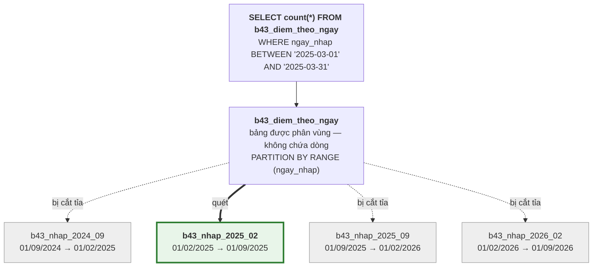
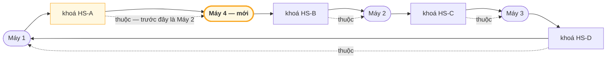

# Bài 43 — Partitioning và Sharding: chia nhỏ một bảng khổng lồ

!!! abstract "🎯 Học xong bài này, bạn sẽ"
    - Phân biệt rõ **phân vùng bảng** — chia trong **một** máy — với **phân mảnh** — chia ra **nhiều** máy
    - Tạo được ba kiểu phân vùng của PostgreSQL: **theo khoảng** (ngày nhập điểm), **theo danh sách** (học kỳ), **theo băm** (mã học sinh), trên bản chép 500.000 dòng của `diem_lon`
    - Chứng minh bằng `EXPLAIN` rằng **cắt tỉa phân vùng** bỏ qua những phân vùng không cần, và biết những cách viết `WHERE` làm nó mất tác dụng
    - Xoá cả một học kỳ dữ liệu cũ **tức thì** bằng cách gỡ phân vùng, thay cho `DELETE` hàng trăm nghìn dòng
    - Chọn được **khoá phân mảnh**, nhận ra **mảnh nóng**, hiểu vì sao `JOIN` xuyên mảnh đắt, và vì sao **băm nhất quán** chỉ phải chuyển khoảng một phần tư dữ liệu khi thêm máy — thay vì ba phần tư

## 🧠 Câu chuyện mở đầu

Phòng giáo vụ có **một** tủ hồ sơ đựng toàn bộ phiếu điểm từ ngày trường thành lập. Mỗi lần cần tìm điểm học kỳ 2 năm ngoái, cô giáo vụ phải lục **từ ngăn trên cùng xuống ngăn dưới cùng**, dù chỉ cần một xấp nhỏ. Cuối năm, muốn huỷ hồ sơ quá hạn lưu trữ, cô lại lục cả tủ, rút từng tờ ra.

Cô đổi cách: dán nhãn cho từng ngăn — **mỗi ngăn một học kỳ**. Phiếu điểm nhập ngày nào thì vào ngăn của học kỳ chứa ngày đó. Từ đây:

- Cần điểm học kỳ 2 năm ngoái? Mở **đúng một ngăn**, ba ngăn còn lại không cần nhìn tới.
- Huỷ hồ sơ quá hạn? **Rút nguyên ngăn** cũ nhất ra, đổ đi. Không phải rút từng tờ.

Đó vẫn là **một** tủ, trong **một** phòng. Việc chia ngăn chỉ làm tìm kiếm và dọn dẹp nhanh hơn.

Vài năm sau, trường sáp nhập với hai trường khác. Hồ sơ nhiều tới mức một tủ, một phòng không chứa nổi, và một cô giáo vụ không làm kịp. Sở chia hồ sơ ra **ba phòng giáo vụ ở ba cơ sở**, mỗi phòng một tủ, một cô giáo vụ riêng: học sinh có mã tận cùng thế này thì hồ sơ ở cơ sở A, thế kia thì cơ sở B...

Bây giờ mọi chuyện khó hơn hẳn. Muốn biết **điểm trung bình toàn trường**? Phải gọi điện cho cả ba cơ sở rồi cộng lại. Cơ sở B nhận quá nhiều học sinh mới, tủ sắp đầy — phải chuyển bớt hồ sơ sang cơ sở khác, mà chuyển cái gì, chuyển bao nhiêu? Và nếu mở thêm cơ sở D, có phải **xếp lại toàn bộ** hồ sơ không?

Chia ngăn trong một tủ là **phân vùng**. Chia ra nhiều phòng là **phân mảnh**. Bài này học cả hai — cái thứ nhất chạy thật trên PostgreSQL của bạn.

## 📖 Khái niệm & thuật ngữ

### Phân vùng bảng

**Phân vùng bảng** (*table partitioning*) là chia **một** bảng lớn thành nhiều bảng nhỏ nằm trên **cùng một** máy chủ, theo một luật dựa trên giá trị của một hoặc vài cột. Với người dùng, nó vẫn là **một** bảng: `SELECT`, `INSERT`, `UPDATE` vào bảng đó như thường, PostgreSQL tự chuyển tới đúng mảnh nhỏ.

- Bảng "vỏ" mà người dùng nhìn thấy gọi là **bảng được phân vùng** (*partitioned table*). Nó **không chứa dòng nào** — chỉ chứa luật chia.
- Mỗi mảnh nhỏ gọi là một **phân vùng** (*partition*): một bảng thật, có tệp dữ liệu riêng, có thể có index riêng. Đừng nhầm với "phân vùng" của `OVER (PARTITION BY ...)` trong [Bài 29](../cap-3-sql/29-window-function.md) — ở đó là nhóm dòng tạm thời trong một truy vấn, ở đây là bảng thật trên đĩa.
- Cột dùng để quyết định dòng thuộc phân vùng nào gọi là **khoá phân vùng** (*partition key*).

PostgreSQL có ba kiểu luật chia:

| Kiểu | Mỗi phân vùng chứa | Ví dụ ở trường | Khai báo |
|---|---|---|---|
| **Phân vùng theo khoảng** (*range partitioning*) | Một **khoảng** giá trị liên tục, `FROM` (tính) `TO` (không tính) | Mỗi học kỳ một phân vùng theo `ngay_nhap` | `PARTITION BY RANGE (ngay_nhap)` |
| **Phân vùng theo danh sách** (*list partitioning*) | Một **danh sách** giá trị rời rạc | Học kỳ 1, học kỳ 2, học kỳ hè | `PARTITION BY LIST (hoc_ky)` |
| **Phân vùng theo băm** (*hash partitioning*) | Các dòng có **hàm băm** của khoá chia cho `MODULUS` dư `REMAINDER` | Chia đều 50.000 học sinh vào 4 phân vùng theo `ma_hs` | `PARTITION BY HASH (ma_hs)` |

Dòng nào không thuộc phân vùng nào thì `INSERT` **báo lỗi** — trừ khi có một **phân vùng mặc định** (*default partition*), khai bằng `DEFAULT`, hứng mọi dòng không khớp phân vùng nào khác. Phân vùng theo băm không cần và không cho phép phân vùng mặc định, vì mọi giá trị đều có số dư.

### Cắt tỉa phân vùng

Lợi ích lớn nhất khi đọc: nếu điều kiện `WHERE` nói gì đó về **khoá phân vùng**, planner so điều kiện đó với luật chia của từng phân vùng, và **bỏ hẳn** những phân vùng chắc chắn không chứa dòng nào khớp — không đọc một trang nào của chúng. Việc này gọi là **cắt tỉa phân vùng** (*partition pruning*), chính là cô giáo vụ chỉ mở đúng một ngăn.

Cắt tỉa chỉ xảy ra khi planner **suy được** từ điều kiện ra luật chia. Nó làm được với `ngay_nhap BETWEEN ... AND ...`, `hoc_ky = 2`, `ma_hs = 123`. Nó **không** làm được khi khoá phân vùng bị bọc trong một hàm — `extract(year FROM ngay_nhap) = 2025` — hay khi điều kiện nằm trên một cột khác. Phần thực hành đo cả hai trường hợp.

Có hai thời điểm cắt tỉa:

| Lúc | Khi điều kiện là | Thấy trong `EXPLAIN` |
|---|---|---|
| Lập kế hoạch | Hằng số: `ngay_nhap >= '2025-12-01'` | Phân vùng bị bỏ **không xuất hiện** trong cây kế hoạch |
| Bắt đầu chạy | Giá trị chỉ biết lúc chạy: `ngay_nhap >= current_date - 30`, tham số của câu lệnh chuẩn bị sẵn | Dòng `Subplans Removed: N` dưới nút `Append` |

### Vì sao phân vùng

| Lợi ích | Vì sao |
|---|---|
| Truy vấn theo khoá phân vùng nhanh hơn | Cắt tỉa: quét một phân vùng 100.000 dòng thay vì cả bảng 500.000 dòng |
| Xoá dữ liệu cũ tức thì | `DETACH PARTITION` rồi `DROP TABLE` một phân vùng: xoá **tệp**, không đánh dấu `xmax` lên từng dòng, không để lại tuple chết cho `VACUUM` như Bài 33 |
| Bảo trì từng phần | `VACUUM`, tạo index, sao lưu từng phân vùng riêng; phân vùng cũ không còn ai sửa thì không cần dọn |
| Index nhỏ hơn | Mỗi phân vùng có index riêng, cây nông hơn, vừa bộ nhớ hơn |

Và cái giá: truy vấn **không** lọc theo khoá phân vùng phải quét **mọi** phân vùng, có khi chậm hơn bảng thường; khoá chính và ràng buộc `UNIQUE` **bắt buộc** chứa khoá phân vùng (Lỗi 3); phải có người **tạo trước** phân vùng cho học kỳ mới. Một bảng vài trăm nghìn dòng như `diem_lon` chưa thật cần phân vùng — khoá học dùng nó để **thấy** cơ chế. Phân vùng thường chỉ đáng giá khi bảng lên tới hàng chục triệu dòng, hoặc khi có nhu cầu xoá dữ liệu theo đợt.

### Phân mảnh — chia ra nhiều máy

Khi một máy không chứa nổi dữ liệu, hoặc không ghi kịp, thì phải chia **ra nhiều máy**. **Phân mảnh** (*sharding*) là chia các dòng của một bảng ra nhiều máy chủ database **độc lập**; mỗi phần, cùng với máy chứa nó, gọi là một **mảnh** (*shard*). Mỗi mảnh là một PostgreSQL riêng, không biết gì về các mảnh khác.

| | Phân vùng | Phân mảnh |
|---|---|---|
| Chia ra | Nhiều bảng trên **một** máy | Nhiều **máy** |
| Ai biết luật chia | PostgreSQL | Ứng dụng, hoặc một tầng định tuyến đứng trước các máy |
| Giải quyết | Bảng quá lớn để quét, để xoá | Một máy không **chứa** nổi hoặc không **ghi** kịp |
| `JOIN`, giao dịch giữa các phần | Bình thường, như mọi bảng | Rất khó: dữ liệu ở máy khác |
| PostgreSQL tự làm | **Có** — phần thực hành | **Không**; cần phần mở rộng như Citus, hoặc ứng dụng tự chia |

Mọi truy vấn phải đi qua một **bộ định tuyến truy vấn** (*query router*) — nằm trong ứng dụng hoặc là một máy riêng — để biết dòng nằm ở mảnh nào. Cột quyết định mảnh gọi là **khoá phân mảnh** (*shard key*). Chọn khoá phân mảnh là quyết định quan trọng nhất và **khó sửa nhất** của cả hệ thống: đổi nó nghĩa là chuyển gần như mọi dòng sang máy khác.

### Chọn khoá phân mảnh

Một khoá phân mảnh tốt:

1. **Rải đều dữ liệu và tải** ra các mảnh.
2. **Đi cùng truy vấn phổ biến nhất**: truy vấn thường gặp chỉ cần hỏi **một** mảnh.
3. **Giữ các dòng hay được `JOIN` với nhau** trên cùng một mảnh.

Xét bảng điểm của cả một thành phố:

| Khoá phân mảnh | Rải đều? | Truy vấn *"bảng điểm của học sinh X"* | Chuyện gì xảy ra |
|---|---|---|---|
| `ma_hs` (băm) | Có | Hỏi **1** mảnh | Tốt cho hầu hết việc hằng ngày |
| `ngay_nhap` (khoảng) | Dữ liệu cũ thì đều, nhưng **mọi lần ghi mới** rơi vào mảnh chứa ngày hôm nay | Hỏi **mọi** mảnh | Một mảnh gánh toàn bộ việc ghi |
| `ma_truong` | Không — trường chuyên 3.000 học sinh, trường làng 300 | Hỏi 1 mảnh nếu biết trường | Mảnh chứa trường lớn quá tải |

Một mảnh phải gánh phần việc **nặng hơn hẳn** các mảnh khác gọi là **mảnh nóng** (*hot shard*). Hai nguyên nhân thường gặp là cả hai dòng dưới của bảng: khoá tăng dần theo thời gian — ai cũng ghi vào mảnh "mới nhất" — và một giá trị khoá quá to, như một trường có quá nhiều học sinh.

### Truy vấn xuyên mảnh

Khi truy vấn **không** chứa khoá phân mảnh — *"điểm trung bình môn Toán toàn thành phố"* — bộ định tuyến phải gửi nó tới **mọi** mảnh, đợi **tất cả** trả lời, rồi gộp kết quả lại. Cách làm này gọi là **rải rồi gom** (*scatter-gather*). Nó chậm bằng mảnh **chậm nhất**, và một mảnh đang bảo trì là cả truy vấn thất bại.

`JOIN` còn khó hơn. Nếu bảng `diem` phân mảnh theo `ma_hs` còn bảng `mon_hoc` ở một máy khác, mỗi dòng điểm cần ghép với tên môn thì dữ liệu phải **chạy qua mạng**. Hai cách tránh:

- **Phân mảnh các bảng hay ghép với nhau theo cùng một khoá**: `diem`, `diem_danh`, `muon_sach` đều theo `ma_hs`, nên mọi thứ của một học sinh nằm trên cùng một mảnh, `JOIN` theo `ma_hs` diễn ra ngay tại chỗ.
- **Chép bảng nhỏ ra mọi mảnh**: `mon_hoc` chỉ 9 dòng, ít khi đổi — mỗi mảnh giữ một bản đầy đủ.

Giao dịch sửa dữ liệu trên **hai** mảnh cùng lúc thì không còn là một giao dịch ACID bình thường nữa — đó là chủ đề của [Bài 45](45-distributed-transaction.md).

### Cân bằng lại và băm nhất quán

Theo thời gian, phải **thêm** mảnh — dữ liệu lớn lên — hoặc chuyển bớt dữ liệu từ mảnh nóng đi. Việc di chuyển dữ liệu giữa các mảnh để chúng đều trở lại gọi là **cân bằng lại** (*rebalancing*). Cân bằng lại là chép dữ liệu qua mạng trong lúc hệ thống vẫn đang chạy — càng phải chuyển ít càng tốt.

Cách chia đơn giản nhất — `mảnh = ma_hs % số_mảnh` — rất tệ ở điểm này. Đổi từ 3 mảnh lên 4 mảnh, `ma_hs % 3` và `ma_hs % 4` khác nhau với **ba phần tư** số học sinh: gần như mọi dòng phải chuyển nhà, kể cả giữa các mảnh cũ với nhau. Phần thực hành đếm chính xác con số này trên 50.000 học sinh.

**Băm nhất quán** (*consistent hashing*) sửa đúng chỗ đó:

1. Tưởng tượng mọi giá trị băm xếp thành một **vòng tròn** — gọi là **vòng băm** (*hash ring*).
2. Mỗi máy được băm ra một vị trí trên vòng.
3. Mỗi khoá được băm ra một vị trí, rồi đi **theo chiều kim đồng hồ** tới máy **đầu tiên** gặp được — đó là máy chứa nó.

Thêm một máy mới: nó chiếm một vị trí trên vòng, và **chỉ** các khoá nằm ngay trước nó — trước đây thuộc về máy kế tiếp — chuyển sang nó. Mọi khoá khác đứng yên. Với 4 máy, trung bình chỉ khoảng **một phần tư** số khoá phải chuyển, và **chỉ chuyển sang máy mới**.

Một điểm cho mỗi máy thì các khoảng trên vòng dài ngắn rất khác nhau, dữ liệu lệch. Vì vậy mỗi máy thật được đặt ở **nhiều** vị trí trên vòng — mỗi vị trí gọi là một **nút ảo** (*virtual node*). Với vài trăm nút ảo mỗi máy, phần dữ liệu của mỗi máy gần đều nhau. Hệ thống Dynamo của Amazon (mô tả trong bài báo năm 2007) và Apache Cassandra dùng đúng ý tưởng này.

### Bảng thuật ngữ

| Tiếng Việt | English | Nghĩa dễ hiểu |
|---|---|---|
| Phân vùng bảng | *table partitioning* | Chia một bảng thành nhiều bảng nhỏ trên cùng một máy, theo luật dựa trên giá trị cột |
| Bảng được phân vùng | *partitioned table* | Bảng "vỏ" người dùng thấy; không chứa dòng, chỉ chứa luật chia |
| Phân vùng | *partition* | Một bảng con thật của bảng được phân vùng — khác "phân vùng" của `OVER (PARTITION BY ...)` ở Bài 29 |
| Khoá phân vùng | *partition key* | Cột quyết định dòng vào phân vùng nào |
| Phân vùng theo khoảng | *range partitioning* | Mỗi phân vùng giữ một khoảng giá trị liên tục, `FROM` tính, `TO` không tính |
| Phân vùng theo danh sách | *list partitioning* | Mỗi phân vùng giữ một danh sách giá trị rời rạc |
| Phân vùng theo băm | *hash partitioning* | Chia theo số dư của hàm băm khoá cho `MODULUS`; rải đều nhưng không cắt tỉa được theo khoảng |
| Phân vùng mặc định | *default partition* | Phân vùng hứng mọi dòng không thuộc phân vùng nào khác |
| Cắt tỉa phân vùng | *partition pruning* | Planner bỏ qua những phân vùng chắc chắn không chứa dòng khớp `WHERE` |
| Phân mảnh | *sharding* | Chia các dòng của bảng ra nhiều máy database độc lập |
| Mảnh | *shard* | Một phần dữ liệu cùng máy chứa nó trong hệ phân mảnh |
| Bộ định tuyến truy vấn | *query router* | Tầng biết luật chia, gửi mỗi truy vấn tới đúng mảnh |
| Khoá phân mảnh | *shard key* | Cột quyết định dòng nằm ở mảnh nào; khó đổi nhất |
| Mảnh nóng | *hot shard* | Mảnh phải gánh phần việc nặng hơn hẳn các mảnh khác |
| Rải rồi gom | *scatter-gather* | Gửi truy vấn tới mọi mảnh, đợi tất cả rồi gộp kết quả |
| Cân bằng lại | *rebalancing* | Chuyển dữ liệu giữa các mảnh để chúng đều trở lại, khi thêm máy hoặc có mảnh nóng |
| Băm nhất quán | *consistent hashing* | Xếp máy và khoá lên một vòng băm; thêm máy chỉ chuyển các khoá ngay trước nó |
| Vòng băm | *hash ring* | Vòng tròn mọi giá trị băm trong băm nhất quán |
| Nút ảo | *virtual node* | Một trong nhiều vị trí của cùng một máy thật trên vòng băm, giúp chia đều hơn |

## 🖼️ Sơ đồ

Bảng được phân vùng theo khoảng `ngay_nhap` của phần thực hành, và đường đi của một truy vấn tháng 3/2025 — ba phân vùng bị cắt tỉa:



Vòng băm với ba máy, rồi thêm máy 4. Mỗi khoá đi theo chiều mũi tên tới máy đầu tiên gặp được. Máy 4 chen vào giữa khoá HS-A và khoá HS-B, nên chỉ HS-A đổi chủ — trước đây nó đi tiếp qua HS-B tới máy 2, giờ gặp máy 4 trước:



HS-B, HS-C, HS-D **không** đổi chủ, và không khoá nào chuyển giữa các máy cũ với nhau. Chia theo `% số_máy` thì khác: đổi từ 3 lên 4 máy làm xáo trộn gần như mọi khoá.

## 💻 Thực hành

### Hai hàm đọc kế hoạch

Như Bài 36, `EXPLAIN` không dùng được trực tiếp trong truy vấn con, nên ta bọc nó trong hàm. Hàm thứ nhất trả nguyên văn kế hoạch để đọc bằng mắt. Hàm thứ hai trả **danh sách tên các phân vùng** mà kế hoạch thực sự quét: nó tìm mọi tên đứng sau chữ ` on ` trong từng dòng kế hoạch, và chỉ giữ những tên là **bảng thật** (`relkind = 'r'`) — để không đếm nhầm tên index.

```sql
DROP FUNCTION IF EXISTS b43_ke_hoach(text);
CREATE FUNCTION b43_ke_hoach(cau_truy_van text) RETURNS text LANGUAGE plpgsql AS $$
DECLARE dong text; ket_qua text := '';
BEGIN
    FOR dong IN EXECUTE 'EXPLAIN ' || cau_truy_van LOOP
        ket_qua := ket_qua || dong || E'\n';
    END LOOP;
    RETURN ket_qua;
END $$;

DROP FUNCTION IF EXISTS b43_phan_vung_quet(text);
CREATE FUNCTION b43_phan_vung_quet(cau_truy_van text) RETURNS text[] LANGUAGE plpgsql AS $$
DECLARE dong text; ten text; ket_qua text[] := '{}';
BEGIN
    FOR dong IN EXECUTE 'EXPLAIN ' || cau_truy_van LOOP
        ten := substring(dong FROM ' on (b43_[a-z0-9_]+)');
        IF ten IS NOT NULL
           AND (SELECT relkind FROM pg_class WHERE oid = to_regclass(ten)) = 'r'
           AND NOT ten = ANY (ket_qua) THEN
            ket_qua := ket_qua || ten;
        END IF;
    END LOOP;
    RETURN (SELECT array_agg(x ORDER BY x COLLATE "C") FROM unnest(ket_qua) AS x);
END $$;
```

### Phân vùng theo khoảng: mỗi nửa năm học một phân vùng

`diem_lon` có `ngay_nhap` từ 01/09/2024 tới 01/08/2026. Chia thành bốn phân vùng, mỗi phân vùng khoảng một học kỳ. Bảng được phân vùng khai báo cột như bảng thường, thêm `PARTITION BY`; từng phân vùng tạo bằng `PARTITION OF ... FOR VALUES FROM ... TO ...` — mốc `FROM` **tính**, mốc `TO` **không tính**, nên mốc cuối của phân vùng này là mốc đầu của phân vùng sau mà không trùng dòng nào:

```sql
DROP TABLE IF EXISTS b43_diem_theo_ngay CASCADE;
CREATE TABLE b43_diem_theo_ngay (
    ma_diem   BIGINT       NOT NULL,
    ma_hs     INTEGER      NOT NULL,
    ma_mon    SMALLINT     NOT NULL,
    hoc_ky    SMALLINT     NOT NULL,
    loai_diem VARCHAR(10)  NOT NULL,
    diem_so   NUMERIC(4,2) NOT NULL,
    ngay_nhap DATE         NOT NULL
) PARTITION BY RANGE (ngay_nhap);

CREATE TABLE b43_nhap_2024_09 PARTITION OF b43_diem_theo_ngay FOR VALUES FROM ('2024-09-01') TO ('2025-02-01');
CREATE TABLE b43_nhap_2025_02 PARTITION OF b43_diem_theo_ngay FOR VALUES FROM ('2025-02-01') TO ('2025-09-01');
CREATE TABLE b43_nhap_2025_09 PARTITION OF b43_diem_theo_ngay FOR VALUES FROM ('2025-09-01') TO ('2026-02-01');
CREATE TABLE b43_nhap_2026_02 PARTITION OF b43_diem_theo_ngay FOR VALUES FROM ('2026-02-01') TO ('2026-09-01');

INSERT INTO b43_diem_theo_ngay SELECT * FROM diem_lon;
ANALYZE b43_diem_theo_ngay;
```

Câu `INSERT` ghi vào **bảng được phân vùng**; PostgreSQL tự đưa từng dòng tới đúng phân vùng. Cột ẩn `tableoid` của mỗi dòng cho biết dòng đó thật sự nằm trong bảng nào:

```sql
-- KỲ VỌNG: 4 dòng
-- KỲ VỌNG: phan_vung = b43_nhap_2024_09
-- KỲ VỌNG: so_dong = 109394
-- KỲ VỌNG: ngay_dau = 2024-09-01
-- KỲ VỌNG: ngay_cuoi = 2025-01-31
SELECT tableoid::regclass::text AS phan_vung, count(*) AS so_dong,
       min(ngay_nhap) AS ngay_dau, max(ngay_nhap) AS ngay_cuoi
FROM b43_diem_theo_ngay
GROUP BY tableoid
ORDER BY min(ngay_nhap);
```

Bốn phân vùng, phân vùng đầu có **109.394** dòng, ngày cuối là 31/01/2025 — đúng mốc `TO ('2025-02-01')` không tính. Tổng vẫn đủ:

```sql
-- KỲ VỌNG: tong_bang_phan_vung = 500000
-- KỲ VỌNG: bang_cha_khong_co_dong = 0
-- KỲ VỌNG: dung_luong_bang_cha = 0
SELECT (SELECT count(*) FROM b43_diem_theo_ngay)        AS tong_bang_phan_vung,
       (SELECT count(*) FROM ONLY b43_diem_theo_ngay)   AS bang_cha_khong_co_dong,
       pg_relation_size('b43_diem_theo_ngay')           AS dung_luong_bang_cha;
```

`FROM ONLY` đọc riêng bảng cha, không đọc phân vùng: **0** dòng, và tệp của nó rộng **0** byte. Bảng được phân vùng đúng là chỉ có luật chia.

### Cắt tỉa phân vùng — tận mắt

Trước hết, xem kế hoạch của một truy vấn tháng 3/2025:

```sql
SELECT b43_ke_hoach($$SELECT count(*) FROM b43_diem_theo_ngay
                      WHERE ngay_nhap BETWEEN '2025-03-01' AND '2025-03-31'$$);
```

Trên máy thử của khoá học, kế hoạch là — chi phí và số dòng ước lượng trên máy bạn có thể khác:

```text
 Aggregate  (cost=3589.31..3589.32 rows=1 width=8)
   ->  Seq Scan on b43_nhap_2025_02 b43_diem_theo_ngay  (cost=0.00..3533.24 rows=22427 width=0)
         Filter: ((ngay_nhap >= '2025-03-01'::date) AND (ngay_nhap <= '2025-03-31'::date))
```

Chỉ **một** dòng `Seq Scan`, trên đúng phân vùng `b43_nhap_2025_02`. Ba phân vùng kia **không có mặt** trong kế hoạch. Để máy tự kiểm, so với cùng truy vấn **không** có `WHERE`:

```sql
-- KỲ VỌNG: khong_loc = {b43_nhap_2024_09,b43_nhap_2025_02,b43_nhap_2025_09,b43_nhap_2026_02}
-- KỲ VỌNG: loc_thang_3_2025 = {b43_nhap_2025_02}
-- KỲ VỌNG: so_phan_vung_khong_loc = 4
-- KỲ VỌNG: so_phan_vung_loc_thang_3 = 1
SELECT b43_phan_vung_quet($$SELECT count(*) FROM b43_diem_theo_ngay$$)::text AS khong_loc,
       b43_phan_vung_quet($$SELECT count(*) FROM b43_diem_theo_ngay
                            WHERE ngay_nhap BETWEEN '2025-03-01' AND '2025-03-31'$$)::text AS loc_thang_3_2025,
       cardinality(b43_phan_vung_quet($$SELECT count(*) FROM b43_diem_theo_ngay$$)) AS so_phan_vung_khong_loc,
       cardinality(b43_phan_vung_quet($$SELECT count(*) FROM b43_diem_theo_ngay
                            WHERE ngay_nhap BETWEEN '2025-03-01' AND '2025-03-31'$$)) AS so_phan_vung_loc_thang_3;
```

Không lọc: quét **4** phân vùng. Lọc tháng 3/2025: quét **1**. Một khoảng vắt qua ranh giới thì quét đúng những phân vùng khoảng đó chạm tới:

```sql
-- KỲ VỌNG: tu_thang_12_2025 = {b43_nhap_2025_09,b43_nhap_2026_02}
-- KỲ VỌNG: dung_mot_ngay = {b43_nhap_2026_02}
SELECT b43_phan_vung_quet($$SELECT * FROM b43_diem_theo_ngay WHERE ngay_nhap >= '2025-12-01'$$)::text AS tu_thang_12_2025,
       b43_phan_vung_quet($$SELECT * FROM b43_diem_theo_ngay WHERE ngay_nhap = '2026-02-01'$$)::text   AS dung_mot_ngay;
```

Ngày 01/02/2026 là mốc `FROM` của `b43_nhap_2026_02` và mốc `TO` — không tính — của `b43_nhap_2025_09`, nên chỉ phân vùng sau được quét.

Cắt tỉa không được phép làm sai kết quả. Đếm tháng 3/2025 trên bảng phân vùng và trên `diem_lon` gốc phải ra cùng một con số:

```sql
-- KỲ VỌNG: bang_phan_vung = 22154
-- KỲ VỌNG: khop_bang_goc = true
SELECT (SELECT count(*) FROM b43_diem_theo_ngay WHERE ngay_nhap BETWEEN '2025-03-01' AND '2025-03-31') AS bang_phan_vung,
       (SELECT count(*) FROM b43_diem_theo_ngay WHERE ngay_nhap BETWEEN '2025-03-01' AND '2025-03-31')
     = (SELECT count(*) FROM diem_lon          WHERE ngay_nhap BETWEEN '2025-03-01' AND '2025-03-31') AS khop_bang_goc;
```

### Khi nào cắt tỉa **không** xảy ra

Ba cách viết đều hỏi về dữ liệu ít hơn cả bảng, nhưng không cách nào được cắt tỉa:

```sql
-- KỲ VỌNG: loc_cot_khac = 4
-- KỲ VỌNG: boc_trong_ham = 4
-- KỲ VỌNG: boc_trong_date_trunc = 4
SELECT cardinality(b43_phan_vung_quet($$SELECT * FROM b43_diem_theo_ngay WHERE ma_hs = 123$$))                     AS loc_cot_khac,
       cardinality(b43_phan_vung_quet($$SELECT * FROM b43_diem_theo_ngay WHERE extract(year FROM ngay_nhap) = 2025$$)) AS boc_trong_ham,
       cardinality(b43_phan_vung_quet($$SELECT * FROM b43_diem_theo_ngay
                                        WHERE date_trunc('month', ngay_nhap) = '2025-03-01'$$))                    AS boc_trong_date_trunc;
```

- `ma_hs = 123`: `ma_hs` không phải khoá phân vùng; học sinh 123 có điểm ở mọi học kỳ, nên phải tìm ở cả bốn.
- `extract(year FROM ngay_nhap) = 2025` và `date_trunc(...)`: planner **không** suy ngược được từ kết quả của hàm ra khoảng `ngay_nhap`. Cùng một ý nhưng viết `ngay_nhap >= '2025-01-01' AND ngay_nhap < '2026-01-01'` thì được cắt tỉa — Lỗi 2.

Cuối cùng, cắt tỉa có một công tắc, `enable_partition_pruning`, mặc định bật. Tắt nó cho **riêng phiên này** để thấy kế hoạch không có cắt tỉa, rồi `RESET` ngay:

```sql
SET enable_partition_pruning = off;

DROP TABLE IF EXISTS b43_do_cong_tac CASCADE;
CREATE TABLE b43_do_cong_tac AS
SELECT cardinality(b43_phan_vung_quet($$SELECT count(*) FROM b43_diem_theo_ngay
                     WHERE ngay_nhap BETWEEN '2025-03-01' AND '2025-03-31'$$)) AS khi_tat;

RESET enable_partition_pruning;

-- KỲ VỌNG: khi_tat = 4
-- KỲ VỌNG: khi_bat = 1
SELECT khi_tat,
       cardinality(b43_phan_vung_quet($$SELECT count(*) FROM b43_diem_theo_ngay
                     WHERE ngay_nhap BETWEEN '2025-03-01' AND '2025-03-31'$$)) AS khi_bat
FROM b43_do_cong_tac;
```

Cùng một câu truy vấn: tắt thì quét **4** phân vùng, bật thì **1**. Ba phân vùng chênh lệch đó chính là công của cắt tỉa.

!!! note "Cắt tỉa lúc bắt đầu chạy"
    Với `WHERE ngay_nhap >= current_date - 30`, planner chưa biết `current_date` lúc lập kế hoạch, nên các phân vùng vẫn có mặt trong cây. Chúng bị bỏ lúc bắt đầu chạy, và `EXPLAIN` ghi lại bằng một dòng `Subplans Removed: 3` dưới nút `Append`. Số phân vùng bị bỏ tuỳ vào ngày bạn chạy, nên khoá học không khẳng định con số này; hãy tự xem trên máy mình bằng `b43_ke_hoach`.

### Index trên bảng được phân vùng

Tạo index trên bảng cha, PostgreSQL tự tạo một index **riêng** cho **từng** phân vùng:

```sql
CREATE INDEX b43_idx_ngay_ma_hs ON b43_diem_theo_ngay (ma_hs);

-- KỲ VỌNG: so_index_con = 4
SELECT count(*) AS so_index_con
FROM pg_inherits i JOIN pg_class c ON c.oid = i.inhrelid
WHERE i.inhparent = 'b43_idx_ngay_ma_hs'::regclass AND c.relkind = 'i';
```

Bốn index con, mỗi cái nhỏ bằng một phần tư. Phân vùng tạo **sau** này cũng tự được tạo index.

### Xoá dữ liệu cũ bằng cách gỡ phân vùng

Bài 33 đã kết luận: với dữ liệu "xoá theo năm học", giải pháp gọn nhất là chia bảng theo năm. Đây là lúc làm việc đó. Gỡ phân vùng cũ nhất khỏi bảng bằng `DETACH PARTITION` — nó thành một bảng độc lập, có thể sao lưu riêng — rồi xoá hẳn:

```sql
ALTER TABLE b43_diem_theo_ngay DETACH PARTITION b43_nhap_2024_09;

-- KỲ VỌNG: con_trong_bang = 390606
-- KỲ VỌNG: bang_da_go_van_con = 109394
SELECT (SELECT count(*) FROM b43_diem_theo_ngay) AS con_trong_bang,
       (SELECT count(*) FROM b43_nhap_2024_09)   AS bang_da_go_van_con;
```

Bảng chính còn **390.606** dòng; 109.394 dòng đã gỡ vẫn nằm nguyên trong bảng `b43_nhap_2024_09`, giờ không còn dính gì tới bảng chính. Xoá nó:

```sql
DROP TABLE b43_nhap_2024_09;

-- KỲ VỌNG: 3 dòng
SELECT tableoid::regclass::text AS phan_vung, count(*) AS so_dong
FROM b43_diem_theo_ngay GROUP BY tableoid ORDER BY 1;
```

`DROP TABLE` xoá **tệp**. Không có dòng nào bị đánh `xmax`, không có tuple chết nào, không có `VACUUM` nào phải chạy. So với `DELETE FROM ... WHERE ngay_nhap < '2025-02-01'` trên 109.394 dòng — ghi WAL cho từng dòng, để lại chừng ấy tuple chết, bảng không nhỏ lại — thì khác hẳn.

Và học kỳ mới? Phải **tạo trước** phân vùng cho nó. Thử nhập một điểm của tháng 10/2026 khi chưa có phân vùng nào chứa ngày đó:

<!-- sql:co-y-loi -->
```sql
INSERT INTO b43_diem_theo_ngay VALUES (900001, 1, 1, 1, '15 phút', 8.00, '2026-10-05');
```

```text
ERROR:  no partition of relation "b43_diem_theo_ngay" found for row
DETAIL:  Partition key of the failing row contains (ngay_nhap) = (2026-10-05).
```

Tạo phân vùng cho học kỳ 1 năm học 2026–2027, rồi nhập lại:

```sql
CREATE TABLE b43_nhap_2026_09 PARTITION OF b43_diem_theo_ngay FOR VALUES FROM ('2026-09-01') TO ('2027-02-01');
INSERT INTO b43_diem_theo_ngay VALUES (900001, 1, 1, 1, '15 phút', 8.00, '2026-10-05');

-- KỲ VỌNG: phan_vung = b43_nhap_2026_09
-- KỲ VỌNG: co_index_rieng = true
SELECT tableoid::regclass::text AS phan_vung,
       EXISTS (SELECT 1 FROM pg_indexes WHERE tablename = 'b43_nhap_2026_09') AS co_index_rieng
FROM b43_diem_theo_ngay WHERE ma_diem = 900001;
```

Phân vùng mới tự có index `ma_hs`, nhờ index đã khai trên bảng cha.

### Phân vùng theo danh sách: theo học kỳ

```sql
DROP TABLE IF EXISTS b43_diem_theo_hk CASCADE;
CREATE TABLE b43_diem_theo_hk (LIKE b43_diem_theo_ngay) PARTITION BY LIST (hoc_ky);
CREATE TABLE b43_hk_1 PARTITION OF b43_diem_theo_hk FOR VALUES IN (1);
CREATE TABLE b43_hk_2 PARTITION OF b43_diem_theo_hk FOR VALUES IN (2);

INSERT INTO b43_diem_theo_hk SELECT * FROM diem_lon;
ANALYZE b43_diem_theo_hk;

-- KỲ VỌNG: hk_1 = 250000
-- KỲ VỌNG: hk_2 = 250000
-- KỲ VỌNG: chi_quet_hk_2 = {b43_hk_2}
SELECT (SELECT count(*) FROM b43_hk_1) AS hk_1,
       (SELECT count(*) FROM b43_hk_2) AS hk_2,
       b43_phan_vung_quet($$SELECT avg(diem_so) FROM b43_diem_theo_hk WHERE hoc_ky = 2$$)::text AS chi_quet_hk_2;
```

`LIKE b43_diem_theo_ngay` chép danh sách cột. Truy vấn điểm trung bình học kỳ 2 chỉ quét `b43_hk_2`.

Nhà trường mở thêm **học kỳ hè** — `hoc_ky = 3`. Chưa có phân vùng nào cho giá trị 3:

<!-- sql:co-y-loi -->
```sql
INSERT INTO b43_diem_theo_hk VALUES (900002, 1, 1, 3, '15 phút', 7.50, '2026-07-10');
```

```text
ERROR:  no partition of relation "b43_diem_theo_hk" found for row
DETAIL:  Partition key of the failing row contains (hoc_ky) = (3).
```

Một **phân vùng mặc định** hứng mọi giá trị chưa có chỗ:

```sql
CREATE TABLE b43_hk_khac PARTITION OF b43_diem_theo_hk DEFAULT;
INSERT INTO b43_diem_theo_hk VALUES (900002, 1, 1, 3, '15 phút', 7.50, '2026-07-10');

-- KỲ VỌNG: phan_vung = b43_hk_khac
SELECT tableoid::regclass::text AS phan_vung FROM b43_diem_theo_hk WHERE ma_diem = 900002;
```

Tiện, nhưng có mặt trái — Lỗi 4.

### Phân vùng theo băm: theo mã học sinh

```sql
DROP TABLE IF EXISTS b43_diem_theo_hs CASCADE;
CREATE TABLE b43_diem_theo_hs (LIKE b43_diem_theo_ngay) PARTITION BY HASH (ma_hs);
CREATE TABLE b43_hs_0 PARTITION OF b43_diem_theo_hs FOR VALUES WITH (MODULUS 4, REMAINDER 0);
CREATE TABLE b43_hs_1 PARTITION OF b43_diem_theo_hs FOR VALUES WITH (MODULUS 4, REMAINDER 1);
CREATE TABLE b43_hs_2 PARTITION OF b43_diem_theo_hs FOR VALUES WITH (MODULUS 4, REMAINDER 2);
CREATE TABLE b43_hs_3 PARTITION OF b43_diem_theo_hs FOR VALUES WITH (MODULUS 4, REMAINDER 3);

INSERT INTO b43_diem_theo_hs SELECT * FROM diem_lon;
ANALYZE b43_diem_theo_hs;

-- KỲ VỌNG: so_phan_vung = 4
-- KỲ VỌNG: moi_phan_vung_tu_20_den_30_phan_tram = true
SELECT count(*) AS so_phan_vung,
       bool_and(so_dong BETWEEN 100000 AND 150000) AS moi_phan_vung_tu_20_den_30_phan_tram
FROM (SELECT tableoid, count(*) AS so_dong FROM b43_diem_theo_hs GROUP BY tableoid) AS t;
```

Xem con số cụ thể trên máy bạn:

```sql
SELECT tableoid::regclass::text AS phan_vung, count(*) AS so_dong
FROM b43_diem_theo_hs GROUP BY tableoid ORDER BY 1;
```

Hàm băm rải 500.000 dòng gần đều ra bốn phân vùng, mỗi phân vùng quanh 125.000 dòng. Và mọi điểm của **một** học sinh luôn nằm trong **một** phân vùng:

```sql
-- KỲ VỌNG: nhieu_nhat_so_phan_vung_moi_hs = 1
SELECT max(so_pv) AS nhieu_nhat_so_phan_vung_moi_hs
FROM (SELECT ma_hs, count(DISTINCT tableoid) AS so_pv FROM b43_diem_theo_hs GROUP BY ma_hs) AS t;
```

Nhưng phân vùng theo băm chỉ cắt tỉa được với phép **bằng**. Hàm băm làm xáo trộn thứ tự — học sinh 1 và học sinh 2 có thể rơi vào hai phân vùng cách xa nhau — nên một **khoảng** mã học sinh có thể rơi vào bất kỳ đâu:

```sql
-- KỲ VỌNG: mot_hoc_sinh = 1
-- KỲ VỌNG: hai_hoc_sinh_toi_da_2 = true
-- KỲ VỌNG: mot_khoang_ma_hs = 4
SELECT cardinality(b43_phan_vung_quet($$SELECT * FROM b43_diem_theo_hs WHERE ma_hs = 123$$))            AS mot_hoc_sinh,
       cardinality(b43_phan_vung_quet($$SELECT * FROM b43_diem_theo_hs WHERE ma_hs IN (1, 2)$$)) <= 2   AS hai_hoc_sinh_toi_da_2,
       cardinality(b43_phan_vung_quet($$SELECT * FROM b43_diem_theo_hs WHERE ma_hs BETWEEN 1 AND 100$$)) AS mot_khoang_ma_hs;
```

So với phân vùng theo khoảng ngày nhập ở trên: khoảng thì cắt tỉa tốt, băm thì không; ngược lại, băm rải đều còn khoảng thì không. Chọn kiểu nào tuỳ vào truy vấn nào quan trọng nhất.

### Phân mảnh — mô phỏng phép chia trên 50.000 học sinh

Phân mảnh thật cần nhiều máy chủ, nên khoá học chỉ **mô phỏng phép tính** "học sinh nào nằm ở máy nào" trên `hoc_sinh_lon`. Trước hết, cách chia `ma_hs % số_máy`: đổi từ 3 máy lên 4 máy, bao nhiêu học sinh phải chuyển nhà?

```sql
-- KỲ VỌNG: phai_chuyen = 37500
-- KỲ VỌNG: phan_tram = 75.0
SELECT count(*) FILTER (WHERE ma_hs % 3 <> ma_hs % 4)                          AS phai_chuyen,
       round(100.0 * count(*) FILTER (WHERE ma_hs % 3 <> ma_hs % 4) / count(*), 1) AS phan_tram
FROM hoc_sinh_lon;
```

**37.500** trên 50.000 — đúng **75%**. `ma_hs % 3` và `ma_hs % 4` chỉ trùng nhau khi `ma_hs % 12` bằng 0, 1 hoặc 2, tức 3 trên 12 trường hợp; 9 trên 12 còn lại phải chuyển.

Giờ băm nhất quán. Dựng vòng băm: mỗi máy 100 **nút ảo**, vị trí là `hashtext('may_1#7')` — hàm băm chuỗi có sẵn của PostgreSQL:

```sql
DROP TABLE IF EXISTS b43_vong_bam CASCADE;
CREATE TABLE b43_vong_bam (may TEXT NOT NULL, vi_tri INTEGER NOT NULL);
INSERT INTO b43_vong_bam
SELECT 'may_' || m, hashtext('may_' || m || '#' || v)
FROM generate_series(1, 3) AS m, generate_series(1, 100) AS v;
CREATE INDEX b43_idx_vong ON b43_vong_bam (vi_tri);
```

Mỗi học sinh được băm ra một vị trí, rồi tìm nút ảo **đầu tiên** có vị trí lớn hơn hoặc bằng — đi theo chiều kim đồng hồ. Nếu đã quá nút cuối cùng thì vòng lại nút nhỏ nhất. Hàm dưới đây làm đúng việc đó, có tham số để bỏ qua một máy — dùng để tính "trước khi có máy 4":

```sql
DROP FUNCTION IF EXISTS b43_may_chua(integer, text);
CREATE FUNCTION b43_may_chua(khoa integer, bo_qua_may text) RETURNS text LANGUAGE sql STABLE AS $$
    SELECT coalesce(
        (SELECT may FROM b43_vong_bam WHERE may <> bo_qua_may AND vi_tri >= hashtext(khoa::text)
         ORDER BY vi_tri LIMIT 1),
        (SELECT may FROM b43_vong_bam WHERE may <> bo_qua_may ORDER BY vi_tri LIMIT 1))
$$;

INSERT INTO b43_vong_bam
SELECT 'may_4', hashtext('may_4#' || v) FROM generate_series(1, 100) AS v;

DROP TABLE IF EXISTS b43_chia_may CASCADE;
CREATE TABLE b43_chia_may AS
SELECT ma_hs,
       b43_may_chua(ma_hs, 'may_4') AS truoc_khi_them,
       b43_may_chua(ma_hs, '')      AS sau_khi_them
FROM hoc_sinh_lon;

-- KỲ VỌNG: chi_chuyen_sang_may_moi = true
-- KỲ VỌNG: it_hon_mot_phan_ba = true
-- KỲ VỌNG: it_hon_cach_chia_du = true
SELECT bool_and(sau_khi_them = 'may_4') FILTER (WHERE truoc_khi_them <> sau_khi_them)        AS chi_chuyen_sang_may_moi,
       count(*) FILTER (WHERE truoc_khi_them <> sau_khi_them) < 50000 / 3                  AS it_hon_mot_phan_ba,
       count(*) FILTER (WHERE truoc_khi_them <> sau_khi_them) < 37500                      AS it_hon_cach_chia_du
FROM b43_chia_may;
```

Ba điều được kiểm: mọi học sinh phải chuyển đều chuyển **sang máy mới** — không có chuyện đổi chỗ giữa các máy cũ với nhau —; số phải chuyển **ít hơn một phần ba**; và ít hơn hẳn con số 37.500 của cách chia dư. Xem con số và phần dữ liệu mỗi máy trên máy bạn:

```sql
SELECT sau_khi_them AS may, count(*) AS so_hoc_sinh,
       count(*) FILTER (WHERE truoc_khi_them <> sau_khi_them) AS vua_chuyen_den
FROM b43_chia_may GROUP BY sau_khi_them ORDER BY 1;
```

Trên máy thử của khoá học, 13.149 học sinh — khoảng **26%** — chuyển sang `may_4`, và bốn máy mỗi máy giữ từ khoảng 10.800 tới 13.800 học sinh. Con số sát với lý thuyết "một phần tư"; nó lệch một chút vì 100 nút ảo mỗi máy vẫn chưa chia tuyệt đối đều.

### Phân mảnh PostgreSQL thật — Citus

Citus là một phần mở rộng biến nhiều máy PostgreSQL thành một hệ phân mảnh. Máy điều phối nhận truy vấn, các máy thợ giữ mảnh. Khai báo phân mảnh bảng `diem` theo `ma_hs`, chép bảng nhỏ `mon_hoc` ra mọi máy — cần một cụm Citus nên khoá học không chạy:

<!-- sql:khong-chay -->
```sql
CREATE EXTENSION citus;
SELECT create_distributed_table('diem', 'ma_hs');
SELECT create_distributed_table('diem_danh', 'ma_hs', colocate_with => 'diem');
SELECT create_reference_table('mon_hoc');
```

`colocate_with` đặt các mảnh của `diem_danh` cạnh các mảnh `diem` có cùng khoảng `ma_hs`, để `JOIN` theo `ma_hs` diễn ra ngay trong một máy thợ.

## ⚠️ Lỗi thường gặp

!!! danger "Lỗi 1: Phân vùng theo cột mà truy vấn không bao giờ lọc"
    Bảng điểm được phân vùng theo `ngay_nhap`, nhưng 90% truy vấn của ứng dụng là *"bảng điểm của học sinh X"* — lọc theo `ma_hs`. Phần thực hành đã đo: lọc theo `ma_hs` thì quét **cả 4** phân vùng. Không được lợi gì từ cắt tỉa, mà còn thêm chi phí lập kế hoạch cho nhiều bảng con.

    Sửa: chọn khoá phân vùng theo **truy vấn phổ biến nhất** và theo cách **xoá dữ liệu**. Dữ liệu theo thời gian, xoá theo đợt, truy vấn theo khoảng ngày → khoảng. Truy vấn theo một mã, cần rải đều → băm.

!!! danger "Lỗi 2: Bọc khoá phân vùng trong hàm"
    `WHERE extract(year FROM ngay_nhap) = 2025` đọc rất tự nhiên — và làm mất cắt tỉa: phần thực hành đo được **4** phân vùng. Đây là cùng một bài học với index trong Bài 34: planner so điều kiện với **chính cột**, không suy ngược qua hàm.

    Sửa: viết điều kiện thẳng trên cột.

    ```sql
    -- KỲ VỌNG: so_phan_vung = 2
    SELECT cardinality(b43_phan_vung_quet($$SELECT * FROM b43_diem_theo_ngay
                                            WHERE ngay_nhap >= '2025-01-01' AND ngay_nhap < '2026-01-01'$$)) AS so_phan_vung;
    ```

    Năm 2025 trải trên phân vùng `b43_nhap_2025_02` và `b43_nhap_2025_09` — tháng 1/2025 nằm ở phân vùng đã bị gỡ — nên quét đúng **2**.

!!! warning "Lỗi 3: Khoá chính không chứa khoá phân vùng"
    Thêm khoá chính `ma_diem` vào bảng phân vùng theo ngày:

    <!-- sql:co-y-loi -->
    ```sql
    ALTER TABLE b43_diem_theo_ngay ADD PRIMARY KEY (ma_diem);
    ```

    ```text
    ERROR:  unique constraint on partitioned table must include all partitioning columns
    DETAIL:  PRIMARY KEY constraint on table "b43_diem_theo_ngay" lacks column "ngay_nhap" which is part of the partition key.
    ```

    Vì sao? Mỗi phân vùng có index riêng, và mỗi index chỉ kiểm được tính duy nhất **bên trong** phân vùng của nó. Nếu khoá chính không chứa `ngay_nhap`, hai dòng cùng `ma_diem` ở hai phân vùng khác nhau sẽ không index nào bắt được. Khi khoá chứa `ngay_nhap`, hai dòng trùng khoá chắc chắn rơi vào **cùng** một phân vùng.

    Sửa: đưa khoá phân vùng vào khoá chính.

    ```sql
    ALTER TABLE b43_diem_theo_ngay ADD PRIMARY KEY (ma_diem, ngay_nhap);

    -- KỲ VỌNG: so_cot_khoa_chinh = 2
    SELECT cardinality(conkey) AS so_cot_khoa_chinh FROM pg_constraint
    WHERE conrelid = 'b43_diem_theo_ngay'::regclass AND contype = 'p';
    ```

    Cái giá: giờ database chỉ bảo đảm **cặp** `(ma_diem, ngay_nhap)` duy nhất. Nếu `ma_diem` thật sự phải duy nhất toàn bảng, phải nhờ một sequence và kỷ luật của ứng dụng.

!!! warning "Lỗi 4: Phân vùng mặc định nuốt dữ liệu"
    Phân vùng mặc định làm `INSERT` không bao giờ lỗi — kể cả khi dữ liệu **sai**: `hoc_ky = 30` gõ nhầm cũng lặng lẽ vào `b43_hk_khac`. Còn một cái bẫy nữa: khi đã có dòng `hoc_ky = 3` nằm trong phân vùng mặc định, tạo phân vùng riêng cho giá trị 3 sẽ **lỗi**, vì dòng đó đã nằm sai chỗ:

    <!-- sql:co-y-loi -->
    ```sql
    CREATE TABLE b43_hk_he PARTITION OF b43_diem_theo_hk FOR VALUES IN (3);
    ```

    ```text
    ERROR:  updated partition constraint for default partition "b43_hk_khac" would be violated by some row
    ```

    Sửa: dùng phân vùng mặc định như **lưới an toàn**, và có việc định kỳ kiểm nó rỗng. Muốn tách giá trị ra phân vùng riêng thì chuyển dòng đi trước, hoặc gỡ phân vùng mặc định, tạo phân vùng mới, rồi chép dữ liệu vào. Kiểu dữ liệu có ràng buộc `CHECK` rõ ràng thì tốt hơn cả: bảng `diem` thật của khoá học có `CHECK (hoc_ky IN (1, 2))`.

!!! warning "Lỗi 5: Chọn khoá phân mảnh tăng dần theo thời gian"
    Một hệ thống lưu điểm danh của cả tỉnh, phân mảnh theo `ngay` thành 12 mảnh, mỗi tháng một mảnh. Dữ liệu cũ rải đều đẹp. Nhưng **mọi** lần điểm danh sáng nay đều rơi vào mảnh của tháng này: một máy gánh 100% việc ghi, mười một máy ngồi chơi — **mảnh nóng**.

    Sửa: phân mảnh theo một khoá rải đều việc **ghi**, như băm `ma_hs`, và nếu vẫn cần xoá theo thời gian thì **trong mỗi mảnh** lại phân vùng theo `ngay` — hai kỹ thuật của bài này dùng chồng lên nhau.

## ✍️ Bài tập

1. Với mỗi bảng sau, chọn kiểu phân vùng — khoảng, danh sách hay băm — và khoá phân vùng, giải thích ngắn: (a) nhật ký truy cập website trường, giữ 6 tháng rồi xoá; (b) điểm danh của 200 trường trong quận, mỗi trường chỉ xem dữ liệu của mình; (c) bảng `muon_sach` của thư viện liên trường, truy vấn chủ yếu là *"sách học sinh X đang mượn"*.

2. Không chạy, đoán số phân vùng được quét trên `b43_diem_theo_ngay` — lúc này còn `b43_nhap_2025_02`, `b43_nhap_2025_09`, `b43_nhap_2026_02`, `b43_nhap_2026_09` — cho từng điều kiện: (a) `ngay_nhap = '2025-09-01'`; (b) `ngay_nhap < '2025-09-01'`; (c) `ngay_nhap + 1 = '2025-09-02'`; (d) `ngay_nhap BETWEEN '2025-06-01' AND '2026-03-01'`. Rồi kiểm lại bằng `b43_phan_vung_quet`.

3. Viết câu lệnh tạo phân vùng cho học kỳ 2 năm học 2026–2027 (từ 01/02/2027 tới 01/09/2027), rồi kiểm tra bảng `b43_diem_theo_ngay` giờ có đúng 5 phân vùng bằng `pg_inherits`.

4. Hệ thống điểm của cả thành phố phân mảnh theo `ma_truong`. Thành phố có 1 trường chuyên 3.000 học sinh và 99 trường khác, mỗi trường khoảng 400 học sinh, chia trên 10 mảnh. (a) Chuyện gì xảy ra với mảnh chứa trường chuyên? (b) Truy vấn *"xếp hạng 100 học sinh điểm Toán cao nhất thành phố"* phải hỏi bao nhiêu mảnh? (c) Đề xuất một khoá phân mảnh tốt hơn, và nói rõ truy vấn nào trở nên **đắt hơn** với khoá mới.

5. Dùng bảng `b43_chia_may` và `hoc_sinh_lon`: nếu phân mảnh theo cách chia dư `ma_hs % 4` thì mỗi máy giữ bao nhiêu học sinh? So với băm nhất quán, cách nào chia đều hơn? Vì sao hệ thống thật vẫn chọn băm nhất quán?

??? success "Đáp án"
    **Câu 1.**

    - (a) **Khoảng** theo thời gian truy cập, mỗi tháng một phân vùng. Xoá dữ liệu quá 6 tháng = gỡ và `DROP` phân vùng cũ nhất mỗi tháng, tức thì. Truy vấn nhật ký luôn theo khoảng thời gian, nên được cắt tỉa.
    - (b) **Danh sách** theo `ma_truong` — mỗi trường một phân vùng, hoặc vài trường nhỏ gộp chung một danh sách. Mọi truy vấn đều có `ma_truong = ...` nên chỉ quét một phân vùng. **Băm** theo `ma_truong` cũng được, nếu số trường thay đổi nhiều và không cần biết trường nào nằm ở đâu.
    - (c) **Băm** theo `ma_hs`: truy vấn luôn là phép bằng trên `ma_hs`, và băm rải đều số lượt mượn. Phân vùng theo khoảng `ngay_muon` sẽ bắt truy vấn *"sách X đang mượn"* quét mọi phân vùng, vì một lượt mượn chưa trả có thể từ bất kỳ tháng nào.

    **Câu 2.**

    - (a) **1** — `b43_nhap_2025_09`: 01/09/2025 là mốc `FROM` của nó, còn là mốc `TO` không tính của `b43_nhap_2025_02`.
    - (b) **1** — `b43_nhap_2025_02`: phân vùng tháng 9/2024 đã bị gỡ.
    - (c) **4** — khoá phân vùng nằm trong một biểu thức `ngay_nhap + 1`, planner không suy ngược được. Cùng loại với Lỗi 2.
    - (d) **3** — khoảng chạm `2025_02`, `2025_09` và `2026_02`.

    ```sql
    -- KỲ VỌNG: a = 1
    -- KỲ VỌNG: b = 1
    -- KỲ VỌNG: c = 4
    -- KỲ VỌNG: d = 3
    SELECT cardinality(b43_phan_vung_quet($$SELECT * FROM b43_diem_theo_ngay WHERE ngay_nhap = '2025-09-01'$$))     AS a,
           cardinality(b43_phan_vung_quet($$SELECT * FROM b43_diem_theo_ngay WHERE ngay_nhap < '2025-09-01'$$))     AS b,
           cardinality(b43_phan_vung_quet($$SELECT * FROM b43_diem_theo_ngay WHERE ngay_nhap + 1 = '2025-09-02'$$)) AS c,
           cardinality(b43_phan_vung_quet($$SELECT * FROM b43_diem_theo_ngay
                                            WHERE ngay_nhap BETWEEN '2025-06-01' AND '2026-03-01'$$))              AS d;
    ```

    **Câu 3.**

    ```sql
    CREATE TABLE b43_nhap_2027_02 PARTITION OF b43_diem_theo_ngay
        FOR VALUES FROM ('2027-02-01') TO ('2027-09-01');

    -- KỲ VỌNG: so_phan_vung = 5
    SELECT count(*) AS so_phan_vung FROM pg_inherits WHERE inhparent = 'b43_diem_theo_ngay'::regclass;
    ```

    Năm phân vùng: ba phân vùng cũ còn lại, `2026_09` tạo trong phần thực hành, và `2027_02` vừa tạo. Mốc `FROM ('2027-02-01')` phải khớp đúng mốc `TO` của `b43_nhap_2026_09`; nếu hai khoảng chồng lên nhau, PostgreSQL báo lỗi ngay lúc tạo.

    **Câu 4.**

    - (a) Mảnh chứa trường chuyên có ít nhất 3.000 học sinh, trong khi mỗi mảnh trung bình chỉ có (3.000 + 99 × 400) / 10 ≈ 4.260. Nếu mảnh đó còn thêm vài trường thường, nó gánh nhiều dữ liệu và việc hơn hẳn — **mảnh nóng**. Tệ hơn, không thể tách trường chuyên ra hai mảnh, vì khoá phân mảnh là `ma_truong`: một giá trị khoá luôn nằm trọn trong một mảnh.
    - (b) **Cả 10 mảnh** — rải rồi gom: truy vấn không có khoá phân mảnh. Mỗi mảnh trả top 100 của nó, bộ định tuyến gộp 1.000 dòng rồi lấy top 100.
    - (c) Băm theo `ma_hs`: dữ liệu rải đều, trường chuyên tự nhiên được chia ra mọi mảnh. Đắt hơn: truy vấn *"bảng điểm cả trường X"* — trước đây hỏi 1 mảnh, giờ phải rải rồi gom trên cả 10 mảnh. Không có khoá nào rẻ cho mọi truy vấn; phải chọn theo truy vấn **phổ biến nhất**.

    **Câu 5.**

    ```sql
    -- KỲ VỌNG: 4 dòng
    -- KỲ VỌNG: so_hoc_sinh = 12500
    SELECT ma_hs % 4 AS may, count(*) AS so_hoc_sinh FROM hoc_sinh_lon GROUP BY ma_hs % 4 ORDER BY 1;
    ```

    Chia dư cho **đúng 12.500** học sinh mỗi máy, vì `ma_hs` là các số liên tiếp 1–50.000 — đều hơn băm nhất quán, nơi mỗi máy lệch vài nghìn. Nhưng chia dư chỉ đều **lúc đứng yên**. Hệ thống thật chọn băm nhất quán vì chi phí **thay đổi**: thêm một máy, chia dư chuyển 75% dữ liệu — chép qua mạng hàng chục nghìn dòng, kể cả giữa các máy cũ — còn băm nhất quán chỉ chuyển khoảng một phần tư, và chỉ sang máy mới. Muốn đều hơn nữa thì tăng số nút ảo.

### Dọn dẹp cuối bài

```sql
DROP TABLE IF EXISTS b43_diem_theo_ngay, b43_diem_theo_hk, b43_diem_theo_hs,
                     b43_vong_bam, b43_chia_may, b43_do_cong_tac CASCADE;
DROP FUNCTION IF EXISTS b43_ke_hoach(text);
DROP FUNCTION IF EXISTS b43_phan_vung_quet(text);
DROP FUNCTION IF EXISTS b43_may_chua(integer, text);

-- KỲ VỌNG: bang_con_lai = 0
-- KỲ VỌNG: ham_con_lai = 0
-- KỲ VỌNG: index_con_lai = 0
SELECT (SELECT count(*) FROM pg_class WHERE relname LIKE 'b43\_%' AND relkind IN ('r', 'p')) AS bang_con_lai,
       (SELECT count(*) FROM pg_proc  WHERE proname LIKE 'b43\_%')                           AS ham_con_lai,
       (SELECT count(*) FROM pg_class WHERE relname LIKE 'b43\_%' AND relkind IN ('i', 'I')) AS index_con_lai;
```

Bài này **không** tạo index nào trên `diem_lon` hay `hoc_sinh_lon` — chỉ đọc hai bảng đó — nên kế hoạch thực thi của các bài sau không bị ảnh hưởng.

## 🔑 Tóm tắt

1. **Phân vùng bảng** chia một bảng thành nhiều **phân vùng** trên **cùng một** máy theo **khoá phân vùng**; bảng được phân vùng chỉ là vỏ — bài đo được bảng cha **0** dòng, **0** byte. **Phân mảnh** chia ra **nhiều** máy độc lập; PostgreSQL tự làm cái thứ nhất, cái thứ hai cần Citus hoặc ứng dụng.
2. Ba kiểu: **khoảng** (hợp với thời gian, cắt tỉa được theo khoảng), **danh sách** (giá trị rời rạc, có **phân vùng mặc định**), **băm** (rải đều — bài đo mỗi phân vùng quanh 125.000 dòng — nhưng chỉ cắt tỉa được phép bằng). Khoá chính phải chứa khoá phân vùng.
3. **Cắt tỉa phân vùng** được chứng minh bằng `EXPLAIN`: lọc tháng 3/2025 quét **1** trên 4 phân vùng, tắt `enable_partition_pruning` thì **4**. Lọc cột khác hoặc bọc khoá trong hàm (`extract`, `date_trunc`) thì mất cắt tỉa.
4. Xoá dữ liệu cũ: `DETACH PARTITION` rồi `DROP TABLE` — bài gỡ 109.394 dòng mà không một tuple chết. Phân vùng cho học kỳ mới phải **tạo trước**, không thì `INSERT` lỗi *no partition ... found for row*.
5. Phân mảnh: **khoá phân mảnh** phải rải đều và đi cùng truy vấn phổ biến; khoá tăng dần sinh **mảnh nóng**; truy vấn không có khoá phải **rải rồi gom**. Thêm máy thì chia dư chuyển **75%** học sinh, **băm nhất quán** với nút ảo chỉ chuyển khoảng **26%** — và chỉ sang máy mới.

---

⬅️ [Bài 42 — Replication: nhân bản dữ liệu ra nhiều máy](42-replication.md) · ➡️ [Bài 44 — CAP và BASE](44-cap-va-base.md)
