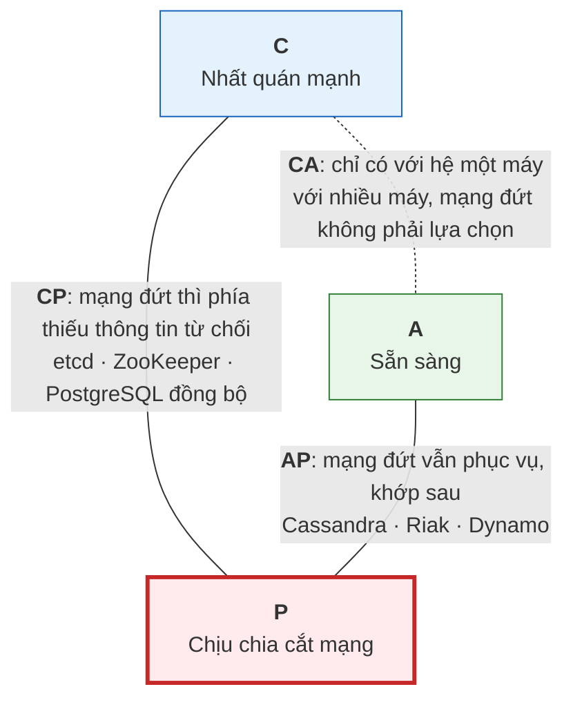
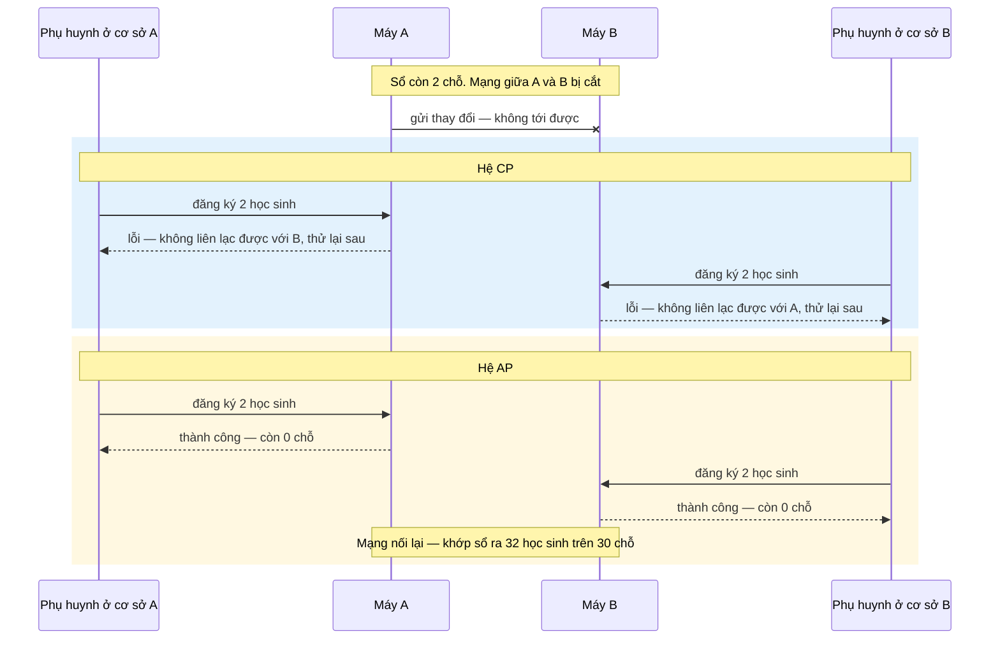

# Bài 44 — CAP và BASE: khi mạng đứt thì chọn gì

!!! abstract "🎯 Học xong bài này, bạn sẽ"
    - Phát biểu đúng **định lý CAP**, và hiểu vì sao câu *"chọn 2 trong 3"* là cách nói **sai**: mạng **sẽ** đứt, nên thật ra chỉ chọn giữa **nhất quán** và **sẵn sàng** — và chỉ **khi** mạng đứt
    - Dùng **PACELC** để nói về lựa chọn thứ hai, lúc mạng **bình thường**: nhanh hay nhất quán
    - Phân biệt **ACID** với **BASE**, và các mức nhất quán từ mạnh tới yếu: **nhất quán mạnh**, **đọc được điều mình vừa ghi**, **đọc đơn điệu**, **nhất quán nhân quả**, **nhất quán cuối cùng**
    - Tận mắt thấy trên PostgreSQL, bằng hai bảng đóng vai hai phòng bị cắt liên lạc: cách khớp **lần ghi sau thắng** làm **mất** một lần sửa đã báo thành công, và vì sao có những luật như "không quá 30 chỗ" **không thể** giữ nếu chọn sẵn sàng
    - Xếp được một số hệ thống có thật vào đúng ô của CAP và PACELC

## 🧠 Câu chuyện mở đầu

Trường có hai cơ sở, A và B, ở hai đầu thị trấn. Mỗi cơ sở có một phòng giáo vụ giữ **cùng một** sổ đăng ký lớp học thêm Toán, lớp nhận tối đa **30** học sinh. Hai phòng giữ sổ khớp nhau bằng cách: phòng nào ghi thêm một tên thì **gọi điện** ngay cho phòng kia để ghi theo.

Sổ đang có 28 tên — còn **2** chỗ. Sáng thứ Hai, đường dây điện thoại giữa hai cơ sở bị **đứt**. Không ai biết bao giờ sửa xong.

Lúc 8 giờ, hai phụ huynh tới phòng A xin đăng ký cho con. Cùng lúc đó, hai phụ huynh khác tới phòng B. Cô giáo vụ ở mỗi phòng đứng trước một lựa chọn:

- **Từ chối**: *"Xin lỗi anh chị, hệ thống đang không liên lạc được với cơ sở kia, tôi không chắc còn chỗ. Mời anh chị quay lại sau."* Sổ hai bên **không bao giờ lệch**, nhưng phụ huynh phải về tay không — phòng giáo vụ coi như **đóng cửa** tới khi có điện thoại.
- **Vẫn ghi**: *"Còn 2 chỗ, tôi ghi cho anh chị luôn."* Phụ huynh vui vẻ ra về. Nhưng phòng bên kia cũng làm y như vậy. Chiều thứ Ba điện thoại sửa xong, hai phòng đọc sổ cho nhau — và phát hiện lớp có **32** học sinh.

Không có lựa chọn thứ ba. Cô giáo vụ **không thể** vừa luôn trả lời ngay, vừa chắc chắn sổ hai bên khớp nhau, khi hai bên không nói chuyện được với nhau.

Còn một chuyện nhỏ hơn. Trong lúc đứt liên lạc, mẹ bạn An gọi tới phòng B báo đổi số điện thoại liên lạc. Mười phút sau chị đổi ý, gọi tới phòng A báo một số khác — số này mới là số chị muốn dùng. Lúc khớp sổ, hai phòng quyết định: *"Ai ghi **sau** thì lấy của người đó."* Nghe công bằng. Nhưng đồng hồ treo tường ở phòng B chạy **nhanh** 15 phút...

## 📖 Khái niệm & thuật ngữ

### Ba chữ C, A, P

Ở Bài 42, dữ liệu được nhân bản ra nhiều máy. Mọi hệ như vậy đều mong ba điều:

- **Nhất quán mạnh** (*strong consistency*) — chữ **C**: mọi lần đọc đều thấy **lần ghi mới nhất** đã hoàn tất, dù đọc ở máy nào. Hệ thống cư xử như thể chỉ có **một** bản dữ liệu duy nhất. Tên gọi chính xác trong lý thuyết là **tuyến tính hoá được** (*linearizability*): mọi thao tác trông như xảy ra tức thì tại một thời điểm, theo đúng một thứ tự khớp với đồng hồ thật.
- **Tính sẵn sàng** (*availability*) — chữ **A**: mọi yêu cầu gửi tới một máy **còn sống** đều nhận được câu trả lời — không phải lỗi, không phải chờ vô hạn.
- **Chịu chia cắt mạng** (*partition tolerance*) — chữ **P**: hệ thống vẫn tiếp tục hoạt động khi mạng giữa các máy bị **đứt**, chia các máy thành những nhóm không liên lạc được với nhau. Tình trạng đứt đó gọi là **chia cắt mạng** (*network partition*) — đừng lẫn với "phân vùng bảng" của Bài 43, dù tiếng Anh cùng là *partition*.

!!! warning "Chữ C này không phải chữ C của ACID"
    Chữ **C** của ACID ở Bài 37 là **tính nhất quán** theo **ràng buộc**: giao dịch chỉ đưa database từ trạng thái hợp lệ sang trạng thái hợp lệ. Chữ **C** của CAP là **nhất quán giữa các bản sao**: đọc ở đâu cũng thấy lần ghi mới nhất. Cùng một chữ, hai nghĩa khác hẳn — như chữ **A** của ACID với "nguyên tử" của Bài 6.

### Định lý CAP

**Định lý CAP** (*CAP theorem*) — do Eric Brewer nêu ra năm 2000 dưới dạng phỏng đoán, được Seth Gilbert và Nancy Lynch chứng minh năm 2002 — nói rằng: một hệ dữ liệu nhân bản **không thể** cùng lúc có cả nhất quán mạnh, tính sẵn sàng, và chịu chia cắt mạng.

Người ta hay tóm tắt là *"chọn 2 trong 3"*, rồi vẽ ba cặp CA, CP, AP. Cách nói này **dễ hiểu sai**. Chia cắt mạng không phải thứ ta **chọn**: dây mạng bị đào đứt, bộ chuyển mạch hỏng, một máy bị treo 30 giây vì hết bộ nhớ — với các máy khác, trông y như mạng đứt. Một hệ chạy trên nhiều máy **chắc chắn** sẽ gặp chia cắt mạng; câu hỏi chỉ là **khi** nó xảy ra thì hệ làm gì. Cách phát biểu đúng hơn:

> **Khi** mạng bị chia cắt, mỗi bên phải chọn: **từ chối** phục vụ để không đọc/ghi sai lệch — giữ **C**, bỏ **A**; hoặc **vẫn** phục vụ và chấp nhận các bên lệch nhau — giữ **A**, bỏ **C**.

| Lựa chọn khi mạng đứt | Làm gì | Trong câu chuyện | Cái giá |
|---|---|---|---|
| **CP** | Bên nào không chắc có dữ liệu mới nhất thì từ chối, thường là bên **ít** máy hơn | Cô giáo vụ mời phụ huynh về | Một phần người dùng nhận lỗi hoặc phải chờ |
| **AP** | Mọi bên vẫn đọc ghi, khớp lại sau khi mạng nối lại | Cô giáo vụ vẫn ghi tên | Đọc có thể thấy dữ liệu cũ; ghi hai bên có thể **mâu thuẫn** |

"CA" — nhất quán và sẵn sàng nhưng không chịu chia cắt — chỉ có nghĩa với hệ **một máy**: PostgreSQL chạy trên một máy chủ, không nhân bản, là "CA" theo nghĩa đó. Máy đó mất mạng thì cả hệ không phục vụ ai, nên đó cũng không hẳn là "sẵn sàng".

Hai điều thường bị bỏ qua:

1. CAP chỉ nói về **lúc mạng đứt**. Phần lớn thời gian mạng không đứt, và khi đó hệ thống có thể vừa nhất quán vừa sẵn sàng.
2. Lựa chọn không nhất thiết phải chung cho cả hệ thống. Cùng một ứng dụng có thể chọn CP cho **số chỗ còn lại** của lớp học thêm, và AP cho **lượt xem** bài giảng.

### PACELC — còn lúc mạng bình thường thì sao?

Lúc mạng bình thường vẫn có một đánh đổi, và nó xảy ra **mỗi ngày**, không phải chỉ khi có sự cố: nhân bản **đồng bộ** của Bài 42 thì mọi bản luôn khớp nhưng mỗi `COMMIT` chờ thêm một vòng mạng; **bất đồng bộ** thì nhanh nhưng bản sao có thể cũ. Khoảng thời gian một yêu cầu phải chờ để có câu trả lời gọi là **độ trễ** (*latency*).

**Định lý PACELC** (*PACELC theorem*) — Daniel Abadi đề xuất năm 2010, trình bày đầy đủ năm 2012 — ghép cả hai đánh đổi vào một câu:

> Nếu có chia cắt mạng (**P**), chọn giữa sẵn sàng (**A**) và nhất quán (**C**); **nếu không** (**E**, *else*), chọn giữa độ trễ thấp (**L**) và nhất quán (**C**).

Mỗi hệ thống được xếp bằng hai chữ: **PA/EL** nghĩa là khi đứt mạng thì chọn sẵn sàng, khi bình thường thì chọn nhanh.

### ACID và BASE

Các hệ chọn **A** trong CAP không thể hứa ACID theo nghĩa cổ điển cho dữ liệu trải trên nhiều máy. Cách thiết kế của chúng thường được gọi chung bằng một chữ viết tắt cố ý chơi chữ với ACID — axit và bazơ:

**BASE** (*Basically Available, Soft state, Eventually consistent*):

| Chữ | Nghĩa |
|---|---|
| **B**asically **A**vailable — về cơ bản luôn sẵn sàng | Ưu tiên luôn trả lời, kể cả khi một phần hệ thống hỏng hoặc bị cắt |
| **S**oft state — trạng thái mềm | Dữ liệu ở một máy có thể **thay đổi mà không cần ai ghi gì**, vì các bản sao đang dần khớp lại với nhau |
| **E**ventually consistent — nhất quán cuối cùng | Nếu **ngừng** ghi đủ lâu, mọi bản sao **cuối cùng** sẽ giống nhau |

**Nhất quán cuối cùng** (*eventual consistency*) là lời hứa **yếu nhất** có ích: nó không nói **khi nào** các bản khớp nhau, và trong lúc chờ thì đọc ở mỗi nơi có thể ra một giá trị khác. Máy bản sao bất đồng bộ của Bài 42 chính là nhất quán cuối cùng: ngừng ghi vào máy chính vài mili giây là máy bản sao bắt kịp.

| | ACID | BASE |
|---|---|---|
| Ưu tiên | Đúng tuyệt đối | Luôn trả lời |
| Đọc ngay sau ghi | Luôn thấy | Có thể chưa thấy |
| Khi mạng đứt giữa các máy | Một phía phải từ chối | Mọi phía vẫn phục vụ, khớp sau |
| Ai lo phần mâu thuẫn | Database | Thường là **người viết ứng dụng** |

### Các mức nhất quán ở giữa

Giữa nhất quán mạnh và nhất quán cuối cùng có nhiều mức, mỗi mức hứa thêm một điều cụ thể. Một số mức hay gặp, từ mạnh tới yếu — ba mức giữa được gọi chung là các bảo đảm **theo phiên**, vì chúng chỉ hứa với **từng người dùng**, không phải với mọi người:

| Mức | Hứa điều gì | Vi phạm trông như thế nào |
|---|---|---|
| Nhất quán mạnh | Mọi người đều thấy lần ghi mới nhất | — |
| **Nhất quán nhân quả** (*causal consistency*) | Nếu thao tác Y **xảy ra vì** đã thấy X, mọi người thấy X trước Y | Thấy câu trả lời *"Được, cô duyệt"* trên diễn đàn lớp mà chưa thấy câu hỏi |
| Đọc được điều mình vừa ghi (Bài 42) | Người ghi luôn thấy thay đổi của **chính mình** | Giáo viên sửa điểm xong, mở lại vẫn thấy điểm cũ |
| **Đọc đơn điệu** (*monotonic reads*) | Một người đã thấy giá trị mới thì lần đọc sau **không** quay về giá trị cũ hơn | Tải lại trang: điểm 8,0 — tải tiếp: 6,5 — tải tiếp: 8,0. Mỗi lần rơi vào một máy bản sao khác nhau, bám chậm khác nhau |
| Nhất quán cuối cùng | Ngừng ghi đủ lâu thì mọi bản giống nhau | — (chỉ vi phạm nếu **mãi mãi** không khớp) |

Các mức theo phiên thường đạt được khá rẻ: gắn mỗi người dùng với **cùng một** máy bản sao, hoặc để người dùng mang theo vị trí WAL mình đã thấy như Bài 42.

### Khớp lại sau khi mạng nối lại

Chọn **AP** thì phải có cách gộp những gì hai bên đã ghi riêng. Khi hai bên sửa **cùng** một dữ liệu theo hai cách khác nhau, ta có một **xung đột ghi** (*write conflict*). Cách gộp đơn giản nhất: mỗi lần ghi mang một dấu thời gian, khi xung đột thì giữ lần ghi có dấu thời gian **lớn hơn** — gọi là **lần ghi sau thắng** (*last-write-wins*, viết tắt **LWW**). Nó đơn giản, và nó **vứt đi** lần ghi còn lại mà không báo ai. Tệ hơn, "sau" được đo bằng đồng hồ của từng máy, mà đồng hồ các máy **không bao giờ** khớp tuyệt đối. Phần thực hành dựng lại đúng chuyện đồng hồ phòng B chạy nhanh.

Các cách khác: giữ **cả hai** phiên bản và để ứng dụng hoặc người dùng chọn; gộp theo **từng cột** thay vì cả dòng; hoặc dùng những kiểu dữ liệu được thiết kế để gộp không bao giờ mâu thuẫn — như một tập hợp chỉ thêm, gộp bằng phép hợp. Nhưng có những luật **không** gộp nổi: *"không quá 30 học sinh"* là luật trên **tổng**, mà mỗi phía chỉ thấy phần của mình. Muốn giữ luật loại này thì phải chọn **CP** cho nó.

### Hệ thống thật nghiêng về đâu

Phân loại dưới đây là cấu hình **mặc định** hoặc thông dụng; nhiều hệ cho chỉnh từng truy vấn. Cột PACELC của năm hệ đầu theo bảng phân loại trong bài báo năm 2012 của Abadi:

| Hệ thống | Khi mạng đứt | PACELC | Ghi chú |
|---|---|---|---|
| Dynamo (Amazon), Cassandra, Riak | AP | PA/EL | Cassandra cho chọn mức nhất quán từng truy vấn: `ONE`, `QUORUM`, `ALL` |
| MongoDB | — | PA/EC | Theo cách Abadi xếp năm 2012; các phiên bản sau cho chỉnh nhiều mức |
| VoltDB/H-Store, Megastore (Google) | CP | PC/EC | Luôn ưu tiên nhất quán |
| PNUTS (Yahoo) | CP | PC/EL | Khi bình thường thì đọc bản sao gần cho nhanh |
| etcd, ZooKeeper, Consul | CP | — | Phía ít máy hơn từ chối ghi. Dùng thuật toán đồng thuận — Bài 46 |
| PostgreSQL: một máy chính, bản sao bất đồng bộ | — | — | Ghi luôn ở máy chính; đọc ở bản sao là nhất quán cuối cùng |
| PostgreSQL: bản sao đồng bộ | CP | PC/EC | Máy chính không liên lạc được với bản sao đồng bộ thì `COMMIT` treo — thí nghiệm `SyncRep` Bài 42 |

### Bảng thuật ngữ

| Tiếng Việt | English | Nghĩa dễ hiểu |
|---|---|---|
| Nhất quán mạnh | *strong consistency* | Mọi lần đọc thấy lần ghi mới nhất, như thể chỉ có một bản dữ liệu — chữ **C** của CAP |
| Tuyến tính hoá được | *linearizability* | Tên chính xác của nhất quán mạnh: mọi thao tác như xảy ra tức thì, theo một thứ tự khớp đồng hồ thật |
| Tính sẵn sàng | *availability* | Mọi yêu cầu tới một máy còn sống đều được trả lời — chữ **A** của CAP |
| Chịu chia cắt mạng | *partition tolerance* | Tiếp tục hoạt động khi mạng giữa các máy bị đứt — chữ **P** của CAP |
| Chia cắt mạng | *network partition* | Mạng đứt, các máy tách thành những nhóm không liên lạc được với nhau |
| Định lý CAP | *CAP theorem* | Khi mạng bị chia cắt, không thể vừa nhất quán mạnh vừa sẵn sàng |
| Độ trễ | *latency* | Thời gian một yêu cầu phải chờ để có câu trả lời |
| Định lý PACELC | *PACELC theorem* | Có chia cắt: chọn A hay C; không có: chọn độ trễ thấp hay C |
| BASE | *Basically Available, Soft state, Eventually consistent* | Kiểu thiết kế ưu tiên luôn trả lời, chấp nhận các bản sao lệch rồi dần khớp |
| Nhất quán cuối cùng | *eventual consistency* | Ngừng ghi đủ lâu thì mọi bản sao sẽ giống nhau |
| Nhất quán nhân quả | *causal consistency* | Thao tác xảy ra vì đã thấy thao tác khác thì luôn được thấy sau nó |
| Đọc đơn điệu | *monotonic reads* | Đã thấy giá trị mới thì không bao giờ đọc lại được giá trị cũ hơn |
| Xung đột ghi | *write conflict* | Hai bên sửa cùng một dữ liệu theo hai cách khác nhau trong lúc không liên lạc được |
| Lần ghi sau thắng | *last-write-wins* (LWW) | Khớp xung đột bằng cách giữ lần ghi có dấu thời gian lớn hơn, bỏ lần kia |

## 🖼️ Sơ đồ

Tam giác CAP — và vì sao cạnh "CA" không có thật với hệ nhiều máy:



Cùng một lần đứt mạng, hai cách xử lý:



Trong thực tế, một hệ CP thường không bắt **cả hai** phía từ chối: phía có **quá nửa** số máy vẫn phục vụ, chỉ phía ít máy hơn từ chối. Bài 46 giải thích vì sao đó là cách an toàn.

## 💻 Thực hành

Không có máy chủ PostgreSQL nào của khoá học bị "đứt mạng" để thử, và CAP là chuyện của nhiều máy. Nhưng cơ chế **khớp lại** sau khi đứt mạng thì mô phỏng được ngay trên một máy: hai bảng đóng vai sổ của hai phòng, mỗi bảng chỉ được ghi bởi "phòng" của nó trong lúc bị cắt.

### Số điện thoại của phụ huynh — lần ghi sau thắng

Trước khi đứt liên lạc, hai phòng có cùng một sổ liên lạc, lấy từ 4 phụ huynh đầu tiên của bảng `phu_huynh`. Cột `luc_ghi` là giờ **theo đồng hồ của phòng ghi**:

```sql
DROP TABLE IF EXISTS b44_so_lien_lac_a, b44_so_lien_lac_b CASCADE;
CREATE TABLE b44_so_lien_lac_a (
    ma_ph         CHAR(5)     PRIMARY KEY,
    so_dien_thoai VARCHAR(15) NOT NULL,
    luc_ghi       TIMESTAMP   NOT NULL,
    noi_ghi       TEXT        NOT NULL
);
CREATE TABLE b44_so_lien_lac_b (LIKE b44_so_lien_lac_a INCLUDING ALL);

INSERT INTO b44_so_lien_lac_a
SELECT ma_ph, so_dien_thoai, TIMESTAMP '2026-09-07 07:00', 'ban dau'
FROM phu_huynh WHERE ma_ph IN ('PH001', 'PH002', 'PH003', 'PH004');
INSERT INTO b44_so_lien_lac_b SELECT * FROM b44_so_lien_lac_a;

-- KỲ VỌNG: so_dong_a = 4
-- KỲ VỌNG: hai_so_khop_nhau = true
SELECT (SELECT count(*) FROM b44_so_lien_lac_a) AS so_dong_a,
       NOT EXISTS (SELECT * FROM b44_so_lien_lac_a EXCEPT SELECT * FROM b44_so_lien_lac_b) AS hai_so_khop_nhau;
```

8 giờ sáng, mạng đứt. Theo **thời gian thật**:

| Giờ thật | Việc | Đồng hồ phòng đó chỉ |
|---|---|---|
| 8:00 | Mẹ bạn An — phụ huynh `PH002` — gọi phòng **B** đổi số thành `0987000111` | **8:15** — đồng hồ phòng B chạy nhanh 15 phút |
| 8:10 | Mẹ bạn An đổi ý, gọi phòng **A** đổi số thành `0987000222` — đây là số **đúng cuối cùng** | 8:10 |
| 8:20 | Phòng B cập nhật số của bố bạn Bình, `PH003` | **8:35** |

Mỗi phòng chỉ ghi vào sổ của mình, và cả ba lần đều được báo *"đã lưu"*:

```sql
UPDATE b44_so_lien_lac_b SET so_dien_thoai = '0987000111', luc_ghi = '2026-09-07 08:15', noi_ghi = 'phong B'
WHERE ma_ph = 'PH002';
UPDATE b44_so_lien_lac_a SET so_dien_thoai = '0987000222', luc_ghi = '2026-09-07 08:10', noi_ghi = 'phong A'
WHERE ma_ph = 'PH002';
UPDATE b44_so_lien_lac_b SET so_dien_thoai = '0987000333', luc_ghi = '2026-09-07 08:35', noi_ghi = 'phong B'
WHERE ma_ph = 'PH003';

-- KỲ VỌNG: a_thay_ph002 = 0987000222
-- KỲ VỌNG: b_thay_ph002 = 0987000111
SELECT (SELECT so_dien_thoai FROM b44_so_lien_lac_a WHERE ma_ph = 'PH002') AS a_thay_ph002,
       (SELECT so_dien_thoai FROM b44_so_lien_lac_b WHERE ma_ph = 'PH002') AS b_thay_ph002;
```

Trong lúc đứt mạng, hỏi hai phòng cùng một câu, nhận **hai** câu trả lời khác nhau — đây là cái giá của **A**. Chiều hôm đó mạng nối lại. Khớp sổ bằng **lần ghi sau thắng**: với mỗi phụ huynh, giữ dòng có `luc_ghi` lớn hơn:

```sql
DROP TABLE IF EXISTS b44_so_sau_khi_khop CASCADE;
CREATE TABLE b44_so_sau_khi_khop AS
SELECT DISTINCT ON (ma_ph) *
FROM (SELECT * FROM b44_so_lien_lac_a UNION ALL SELECT * FROM b44_so_lien_lac_b) AS ca_hai
ORDER BY ma_ph, luc_ghi DESC;

-- KỲ VỌNG: 4 dòng
-- KỲ VỌNG: ma_ph = PH001
SELECT ma_ph, so_dien_thoai, luc_ghi, noi_ghi FROM b44_so_sau_khi_khop ORDER BY ma_ph;
```

Hai sổ đã khớp lại thành một — đó là **nhất quán cuối cùng**. Nhưng khớp **thành cái gì**?

```sql
-- KỲ VỌNG: ph002_sau_khi_khop = 0987000111
-- KỲ VỌNG: so_dung_cuoi_cung = 0987000222
-- KỲ VỌNG: mat_lan_ghi_dung = true
-- KỲ VỌNG: ph003_giu_duoc = 0987000333
SELECT (SELECT so_dien_thoai FROM b44_so_sau_khi_khop WHERE ma_ph = 'PH002')                 AS ph002_sau_khi_khop,
       '0987000222'                                                                         AS so_dung_cuoi_cung,
       (SELECT so_dien_thoai FROM b44_so_sau_khi_khop WHERE ma_ph = 'PH002') <> '0987000222' AS mat_lan_ghi_dung,
       (SELECT so_dien_thoai FROM b44_so_sau_khi_khop WHERE ma_ph = 'PH003')                 AS ph003_giu_duoc;
```

Số của `PH003` — chỉ một phòng sửa, không xung đột — được giữ đúng. Nhưng `PH002` giữ số `0987000111`, số mẹ bạn An đã **bỏ**. Số đúng `0987000222` đã được phòng A báo *"đã lưu"*, rồi **biến mất** không để lại dấu vết. Lý do: đồng hồ phòng B chạy nhanh 15 phút, nên lần ghi thật ra **cũ hơn** lại mang dấu thời gian **lớn hơn**. Không có lỗi nào được báo, không có ai được hỏi.

### Lớp học thêm 30 chỗ — luật không gộp nổi

Giờ đến số chỗ của lớp học thêm. 28 học sinh `HS001`–`HS028` đã đăng ký trước khi mạng đứt, trong **cả hai** sổ. Mỗi phòng tự kiểm *"còn chỗ không"* trên sổ **của mình** trước khi nhận thêm:

```sql
DROP TABLE IF EXISTS b44_dang_ky_a, b44_dang_ky_b CASCADE;
CREATE TABLE b44_dang_ky_a (ma_hs CHAR(5) PRIMARY KEY);
CREATE TABLE b44_dang_ky_b (ma_hs CHAR(5) PRIMARY KEY);
INSERT INTO b44_dang_ky_a SELECT ma_hs FROM hoc_sinh WHERE ma_hs <= 'HS028';
INSERT INTO b44_dang_ky_b SELECT * FROM b44_dang_ky_a;

-- Phòng A nhận 2 em, chỉ khi sổ A còn dưới 30
INSERT INTO b44_dang_ky_a SELECT ma_hs FROM hoc_sinh WHERE ma_hs IN ('HS029', 'HS030')
  AND (SELECT count(*) FROM b44_dang_ky_a) < 30;
-- Phòng B nhận 2 em khác, chỉ khi sổ B còn dưới 30
INSERT INTO b44_dang_ky_b SELECT ma_hs FROM hoc_sinh WHERE ma_hs IN ('HS031', 'HS032')
  AND (SELECT count(*) FROM b44_dang_ky_b) < 30;

-- KỲ VỌNG: so_a = 30
-- KỲ VỌNG: so_b = 30
SELECT (SELECT count(*) FROM b44_dang_ky_a) AS so_a,
       (SELECT count(*) FROM b44_dang_ky_b) AS so_b;
```

Mỗi phòng đều **tuân thủ** luật 30 chỗ trên sổ của mình. Danh sách đăng ký là kiểu dữ liệu dễ gộp nhất có thể: một tập hợp chỉ thêm, gộp bằng `UNION` — không có xung đột nào, không mất tên nào:

```sql
-- KỲ VỌNG: sau_khi_khop = 32
-- KỲ VỌNG: vuot_suc_chua = true
SELECT count(*) AS sau_khi_khop, count(*) > 30 AS vuot_suc_chua
FROM (SELECT ma_hs FROM b44_dang_ky_a UNION SELECT ma_hs FROM b44_dang_ky_b) AS gop;
```

**32** học sinh cho lớp 30 chỗ. Không có cách gộp nào sửa được chuyện này sau khi đã xảy ra: hai phụ huynh đã được hứa chỗ. Luật *"không quá 30"* là luật trên **tổng** của cả hai sổ, trong khi mỗi phòng lúc đứt mạng chỉ nhìn thấy nửa của mình. Muốn giữ luật này thì lúc đứt mạng ít nhất một phòng phải **từ chối** — tức chọn **C** thay vì **A**.

Trên PostgreSQL một máy, chuyện này không bao giờ xảy ra: chỉ có **một** sổ, và câu kiểm `count(*) < 30` chạy trên đúng sổ đó — với mức cô lập hoặc khoá phù hợp như Bài 38 và Bài 41.

## ⚠️ Lỗi thường gặp

!!! danger "Lỗi 1: \"Hệ của tôi chọn CA\""
    Một bản thiết kế ghi: *"Hệ ba máy chủ, chọn CA để vừa nhất quán vừa sẵn sàng."* Với nhiều máy nối qua mạng, chia cắt mạng không phải thứ có thể **không chọn**. Câu *"chọn CA"* thật ra nghĩa là *"chưa nghĩ xem khi mạng đứt thì hệ làm gì"* — và khi mạng đứt thật, hệ sẽ làm một điều không ai thiết kế: thường là cả hai phía cùng nhận ghi, như não chia đôi ở Bài 42.

    Sửa: viết rõ trong thiết kế, **cho từng loại dữ liệu**, khi mạng đứt thì phía nào phục vụ, phía nào từ chối.

!!! danger "Lỗi 2: Tin vào đồng hồ để khớp dữ liệu"
    Phần thực hành vừa cho thấy: lần ghi sau thắng + đồng hồ lệch 15 phút = số điện thoại đúng **biến mất** mà không ai biết. Đồng hồ máy chủ được đồng bộ qua mạng vẫn lệch nhau vài mili giây tới vài giây, có lúc nhảy lùi khi được chỉnh. Hai lần ghi cách nhau ít hơn độ lệch đó thì "sau" không còn nghĩa gì.

    Sửa: chỉ dùng lần ghi sau thắng cho dữ liệu mà mất một lần ghi cũng không sao — như "lần cuối học sinh mở ứng dụng". Với dữ liệu quan trọng: giữ cả hai phiên bản và hỏi người dùng, hoặc đừng cho hai nơi cùng sửa một dữ liệu — mỗi dòng chỉ có **một** nơi được phép ghi.

!!! warning "Lỗi 3: Kiểm luật trên tổng ở một bản sao AP"
    *"Kiểm còn chỗ rồi mới nhận"* chạy hoàn toàn đúng trên từng máy, và vẫn cho ra 32 học sinh — phần thực hành. Những luật dạng *"tổng không vượt quá"*, *"mã không được trùng"*, *"số dư không được âm"* **không** thể giữ khi hai nơi cùng nhận ghi mà không nói chuyện được với nhau.

    Sửa: đặt những dữ liệu có luật loại này vào một hệ **CP**, hoặc cho **mỗi** nơi một phần hạn mức riêng — phòng A được nhận tối đa 1 em, phòng B tối đa 1 em — để mỗi nơi tự kiểm được mà không cần hỏi nơi kia.

!!! warning "Lỗi 4: Nghĩ \"nhất quán cuối cùng\" là \"chậm một chút rồi đúng\""
    *"Nhất quán cuối cùng"* chỉ hứa các bản sao **giống nhau** — không hứa chúng giống nhau ở giá trị **đúng**. Sổ liên lạc trong phần thực hành đã nhất quán cuối cùng một cách hoàn hảo: hai phòng giờ giữ cùng một số điện thoại — số sai. Nó cũng không hứa **bao lâu**: bình thường vài mili giây, lúc mạng đứt thì vài giờ.

    Sửa: khi đọc tài liệu một hệ thống, hỏi hai câu: *"khi hai nơi cùng sửa, nó giữ cái nào?"* và *"người dùng có đọc được điều mình vừa ghi không?"*.

!!! warning "Lỗi 5: Chọn một mức nhất quán cho cả hệ thống"
    Một nhóm quyết định *"hệ của ta là AP"*, rồi áp cho mọi bảng — kể cả số dư học phí. Hoặc ngược lại, *"ta cần nhất quán"*, rồi bắt cả **lượt xem bài giảng** đi qua nhân bản đồng bộ, làm trang web chậm hẳn vì một con số không ai cần chính xác tới từng lượt.

    Sửa: chọn theo **dữ liệu**. Số dư, số chỗ, điểm thi: nhất quán mạnh. Lượt xem, "đang trực tuyến", gợi ý bài học: nhất quán cuối cùng là đủ.

## ✍️ Bài tập

1. Với mỗi dữ liệu sau của hệ thống trường, khi mạng giữa hai trung tâm dữ liệu bị đứt, bạn chọn **CP** hay **AP**? Giải thích bằng một câu. (a) Số dư tài khoản học phí; (b) số lượt thích một bài đăng trên trang của trường; (c) bảng điểm thi học kỳ; (d) trạng thái "đang trực tuyến" của giáo viên trong ứng dụng nhắn tin; (e) số chỗ còn lại của chuyến tham quan.

2. Một bạn phát biểu: *"CAP nói hệ phân tán chỉ được hai trong ba tính chất. Tôi bỏ P, nên hệ tôi có cả C và A."* Chỉ ra chỗ sai và phát biểu lại cho đúng.

3. Xếp PostgreSQL vào PACELC trong hai cấu hình: (a) một máy chính, hai máy bản sao **bất đồng bộ**, ứng dụng đọc ở máy bản sao; (b) một máy chính, `synchronous_standby_names = 'ANY 1 (may_b, may_c)'`, `synchronous_commit = remote_apply`, ứng dụng đọc ở máy bản sao. Mỗi cấu hình đánh đổi gì lúc bình thường?

4. Trong mô phỏng sổ liên lạc, giả sử đồng hồ phòng B **không** chạy nhanh, tức lần ghi của B lúc 8:00 thật mang dấu `08:00`. Khớp sổ bằng lần ghi sau thắng thì `PH002` giữ số nào? Kiểm lại bằng SQL trên hai bảng `b44_so_lien_lac_a`, `b44_so_lien_lac_b` mà **không** sửa chúng. Kết quả đó có chứng minh lần ghi sau thắng là an toàn không?

5. Học sinh xem điểm trên ứng dụng. Ứng dụng gửi mỗi lần tải trang tới một máy bản sao **ngẫu nhiên** trong ba máy bất đồng bộ. Học sinh kể: *"Em thấy điểm Toán 8, tải lại thành 6,5, tải lần nữa lại thành 8."* (a) Bảo đảm nào bị vi phạm? (b) Đề xuất cách sửa rẻ nhất.

??? success "Đáp án"
    **Câu 1.**

    - (a) **CP**: số dư không được âm là luật trên tổng — ghi ở hai nơi có thể trừ quá số tiền có (Lỗi 3).
    - (b) **AP**: lệch vài lượt thích trong vài phút không hại ai, và mỗi lượt thích gộp được bằng phép cộng.
    - (c) **CP**: điểm thi sai hoặc mất một lần sửa (như số điện thoại của mẹ bạn An) là không chấp nhận được. Điểm thi cũng hiếm khi sửa, nên việc từ chối ghi trong lúc đứt mạng ít ảnh hưởng.
    - (d) **AP**: đây là dữ liệu tự sửa sau vài giây, sai một lúc không sao; từ chối cả ứng dụng nhắn tin chỉ vì không chắc ai đang trực tuyến thì tệ hơn nhiều.
    - (e) **CP** — cùng dạng với lớp học thêm 30 chỗ, hoặc chia trước **hạn mức** cho từng nơi.

    **Câu 2.**

    Chỗ sai: **P** không phải thứ có thể bỏ. Với nhiều máy nối qua mạng, mạng **sẽ** đứt; "bỏ P" chỉ có nghĩa là không có kế hoạch cho lúc đó. Phát biểu đúng: **khi** mạng bị chia cắt, hệ phải chọn giữa **nhất quán mạnh** — một phía từ chối — và **sẵn sàng** — mọi phía phục vụ và chấp nhận lệch. Khi mạng không đứt, hệ có thể có cả hai, và lúc đó đánh đổi thật là giữa độ trễ và nhất quán — PACELC.

    **Câu 3.**

    - (a) Khi bình thường: **EL** — `COMMIT` không chờ bản sao, đọc ở bản sao nhanh nhưng có thể thấy dữ liệu cũ (độ trễ nhân bản). Khi đứt mạng giữa máy chính và bản sao: máy chính vẫn nhận ghi, bản sao vẫn phục vụ đọc — dữ liệu cũ — nên nghiêng về **PA** với việc đọc. Tổng thể: **PA/EL**.
    - (b) Khi bình thường: **EC** — `remote_apply` bắt `COMMIT` chờ ít nhất một bản sao **làm lại** xong, nên đọc ở bản sao đồng bộ đó thấy ngay. Cái giá là mỗi `COMMIT` chậm thêm một vòng mạng và thời gian làm lại. Khi máy chính mất liên lạc với **cả hai** bản sao: `COMMIT` treo — **PC**. Tổng thể: **PC/EC**. Lưu ý `ANY 1` chỉ bảo đảm **một** trong hai bản sao đã làm lại; đọc ở bản sao còn lại vẫn có thể cũ.

    **Câu 4.**

    ```sql
    -- KỲ VỌNG: ph002_neu_dong_ho_dung = 0987000222
    SELECT so_dien_thoai AS ph002_neu_dong_ho_dung
    FROM (SELECT so_dien_thoai, luc_ghi FROM b44_so_lien_lac_a WHERE ma_ph = 'PH002'
          UNION ALL
          SELECT so_dien_thoai, TIMESTAMP '2026-09-07 08:00' FROM b44_so_lien_lac_b WHERE ma_ph = 'PH002') AS ca_hai
    ORDER BY luc_ghi DESC
    LIMIT 1;
    ```

    Với đồng hồ đúng, `PH002` giữ `0987000222` — số đúng. Nhưng điều này **không** chứng minh lần ghi sau thắng an toàn: lần ghi của phòng B **vẫn** bị vứt đi không báo ai. Lần này ta may, vì lần bị vứt đúng là lần người dùng muốn bỏ. Nếu hai lần sửa là hai thông tin khác nhau cần giữ cả hai — như bố sửa số điện thoại, mẹ sửa địa chỉ trên cùng một dòng — thì lần ghi sau thắng theo cả dòng vẫn làm mất một thông tin, dù đồng hồ đúng tuyệt đối.

    **Câu 5.**

    - (a) **Đọc đơn điệu**: học sinh đã thấy giá trị mới (8) rồi lại đọc được giá trị cũ hơn (6,5). Lần tải thứ hai rơi vào một bản sao bám chậm hơn bản sao của lần thứ nhất.
    - (b) Gắn mỗi học sinh với **cùng một** máy bản sao — ví dụ chọn bản sao theo `ma_hs % 3`. Một bản sao có thể chậm, nhưng không bao giờ đi lùi, nên học sinh không bao giờ thấy điểm "quay về". Nếu học sinh cũng là người **vừa sửa** thì cần thêm đọc được điều mình vừa ghi như Bài 42.

### Dọn dẹp cuối bài

```sql
DROP TABLE IF EXISTS b44_so_lien_lac_a, b44_so_lien_lac_b, b44_so_sau_khi_khop,
                     b44_dang_ky_a, b44_dang_ky_b CASCADE;

-- KỲ VỌNG: bang_con_lai = 0
SELECT count(*) AS bang_con_lai FROM information_schema.tables WHERE table_name LIKE 'b44\_%';
```

## 🔑 Tóm tắt

1. CAP: **nhất quán mạnh** (đọc đâu cũng thấy lần ghi mới nhất), **tính sẵn sàng** (máy còn sống luôn trả lời), **chịu chia cắt mạng**. Mạng **sẽ** đứt, nên "chọn 2 trong 3" thật ra là: **khi** mạng đứt, chọn **CP** — một phía từ chối — hay **AP** — mọi phía phục vụ rồi khớp sau. "CA" chỉ có nghĩa với hệ một máy.
2. **PACELC** thêm vế thường ngày: không đứt mạng thì chọn **độ trễ** thấp hay nhất quán — chính là nhân bản bất đồng bộ hay đồng bộ của Bài 42. Cassandra, Riak, Dynamo: PA/EL; VoltDB, Megastore: PC/EC; etcd, ZooKeeper: CP.
3. **BASE** — về cơ bản sẵn sàng, trạng thái mềm, **nhất quán cuối cùng** — đối lại ACID. Giữa hai đầu có các mức: **nhất quán nhân quả**, đọc được điều mình vừa ghi, **đọc đơn điệu**; các mức theo phiên thường có được rẻ bằng cách gắn người dùng với một bản sao.
4. **Lần ghi sau thắng** khớp **xung đột ghi** bằng dấu thời gian: mô phỏng cho thấy đồng hồ lệch 15 phút làm số điện thoại **đúng** biến mất không một lỗi — hai sổ khớp nhau hoàn hảo, trên một giá trị sai.
5. Luật trên **tổng** không gộp nổi: mỗi phòng tự kiểm đúng 30 chỗ, gộp bằng `UNION` không mất tên nào, vẫn ra **32**. Chọn CP hay AP theo **từng loại dữ liệu** — số dư, số chỗ, điểm thi cần C; lượt xem, trạng thái trực tuyến chọn A.

---

⬅️ [Bài 43 — Partitioning và Sharding: chia nhỏ một bảng khổng lồ](43-partitioning-va-sharding.md) · ➡️ [Bài 45 — Giao dịch phân tán: 2PC và Saga](45-distributed-transaction.md)
