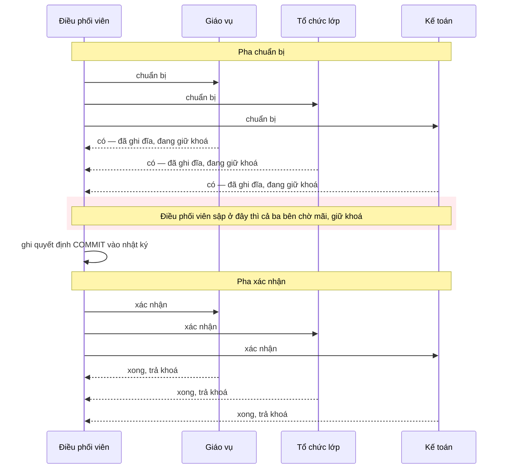
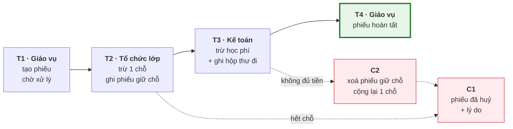

# Bài 45 — Giao dịch phân tán: 2PC và Saga

!!! abstract "🎯 Học xong bài này, bạn sẽ"
    - Giải thích được vì sao `BEGIN ... COMMIT` của Bài 37 **không** dùng được khi một việc chạm tới hai database khác nhau
    - Mô tả **xác nhận hai pha** — pha chuẩn bị, pha xác nhận, vai trò **điều phối viên** — và chỉ ra đúng điểm chết của nó: điều phối viên sập sau khi mọi bên đã chuẩn bị, tất cả **bị chặn**, giữ khoá chờ vô hạn
    - Thấy tận mắt trên PostgreSQL: một **giao dịch đã chuẩn bị** sống sót qua lần tắt máy đột ngột và vẫn chặn người khác
    - Thiết kế một **Saga** "đăng ký lớp học thêm" gồm ba bước, mỗi bước một giao dịch cục bộ thật, kèm **giao dịch bù trừ** chạy ngược khi một bước thất bại — và thấy cái giá: Saga **không có** tính cô lập
    - Dùng **mẫu hộp thư đi** để ghi dữ liệu và gửi sự kiện không lệch nhau, và **khoá luỹ đẳng** để một sự kiện bị gửi hai lần không bị xử lý hai lần

## 🧠 Câu chuyện mở đầu

Bạn Minh muốn đăng ký lớp học thêm Toán nâng cao. Việc này đi qua **ba** phòng của trường, mỗi phòng một cuốn sổ riêng, không ai được viết vào sổ của phòng khác:

1. **Phòng giáo vụ** ghi phiếu đăng ký của Minh.
2. **Phòng tổ chức lớp** giữ cho Minh một chỗ — lớp chỉ còn 2 chỗ.
3. **Phòng kế toán** trừ 500.000 đồng học phí trong tài khoản học phí của Minh.

Ba việc phải **cùng** thành công hoặc **cùng** không xảy ra. Giữ chỗ mà không thu tiền thì trường mất tiền; thu tiền mà không có chỗ thì phụ huynh khiếu nại.

Nếu cả ba cuốn sổ nằm trong **một** database, bạn đã biết cách từ Bài 37: bọc ba câu lệnh trong `BEGIN ... COMMIT`. Nhưng ba phòng là ba database **khác nhau**, trên ba máy khác nhau. Không có `BEGIN` nào trải qua được cả ba.

Thầy hiệu phó nghĩ ra cách thứ nhất: thầy đứng giữa, **gọi điện hỏi từng phòng**: *"Phòng anh chị làm được phần của mình không? Nếu được thì chuẩn bị sẵn, **giữ nguyên** đó, đừng làm gì khác, chờ tôi."* Cả ba phòng đều trả lời *"được, đã chuẩn bị"*. Thầy đang cầm máy định gọi lại *"làm đi"* thì... thầy bị gọi đi họp gấp, điện thoại hết pin. Ba phòng ngồi chờ, sổ mở sẵn, không dám làm, cũng không dám bỏ — vì biết đâu thầy đã bảo phòng khác làm rồi. Cả buổi chiều không ai đăng ký thêm được, vì chỗ cuối cùng đang bị "giữ nguyên đó".

Cô tổng phụ trách đề xuất cách thứ hai: *"Cứ để mỗi phòng làm phần mình **ngay**, xong thì chuyền giấy sang phòng sau. Phòng nào làm không được thì chuyền giấy **ngược** lại, các phòng trước tự **gỡ** phần mình đã làm."* Không ai phải chờ ai. Nhưng trong lúc chờ phòng kế toán, chỗ của Minh đã bị trừ — bạn Lan tới đăng ký thì nghe *"hết chỗ rồi"*. Mười phút sau kế toán báo Minh không đủ tiền, chỗ được trả lại... nhưng Lan đã về.

Hai cách đó là hai lời giải kinh điển cho giao dịch trải trên nhiều database: **2PC** và **Saga**.

## 📖 Khái niệm & thuật ngữ

### Giao dịch phân tán

**Giao dịch phân tán** (*distributed transaction*) là một giao dịch mà các thao tác nằm trên **nhiều** database độc lập — nhiều máy chủ, hoặc nhiều hệ thống khác nhau — nhưng vẫn cần tính **nguyên tử**: tất cả, hoặc không gì cả.

Nó xuất hiện ở hai tình huống đã gặp trong khoá học: bảng bị **phân mảnh** ra nhiều máy ở Bài 43, và hệ thống được chia thành nhiều dịch vụ, mỗi dịch vụ một database riêng — như ba phòng trong câu chuyện.

Khó ở chỗ: mỗi database chỉ biết **giao dịch cục bộ** của nó. Máy A có thể `COMMIT` rồi máy B mới phát hiện vi phạm ràng buộc; máy A không `ROLLBACK` lại được một giao dịch đã `COMMIT`.

### Xác nhận hai pha

**Xác nhận hai pha** (*two-phase commit*, viết tắt **2PC**) thêm một vai trò: **điều phối viên** (*coordinator*) — thầy hiệu phó — điều khiển các **bên tham gia** (*participant*) — ba phòng, mỗi phòng một database. Việc `COMMIT` được tách làm hai pha:

| Pha | Điều phối viên | Mỗi bên tham gia |
|---|---|---|
| **Pha chuẩn bị** (*prepare phase*) | Gửi *"chuẩn bị"* cho mọi bên | Làm hết phần việc, kiểm mọi ràng buộc, **ghi xuống đĩa** đủ để sau này chắc chắn `COMMIT` được — kể cả khi mất điện —, **giữ nguyên các khoá**, rồi trả lời *"có"* hoặc *"không"* |
| **Pha xác nhận** (*commit phase*) | Nếu **mọi** bên trả lời *"có"*: ghi quyết định `COMMIT` vào nhật ký của mình, rồi gửi *"xác nhận"* cho mọi bên. Nếu có **một** bên *"không"* hoặc không trả lời: gửi *"huỷ"* | Làm theo quyết định, trả khoá |

Chìa khoá nằm ở lời hứa của câu *"có"*: một bên đã trả lời *"có"* thì **mất quyền tự quyết**. Nó không được tự `COMMIT` — biết đâu bên khác trả lời *"không"*. Nó cũng không được tự huỷ — biết đâu điều phối viên đã quyết `COMMIT` và bên khác đã làm theo. Nó chỉ được **chờ**.

Trong PostgreSQL, pha chuẩn bị là lệnh `PREPARE TRANSACTION 'tên'`: giao dịch được ghi xuống đĩa ở trạng thái **giao dịch đã chuẩn bị** (*prepared transaction*), tách khỏi phiên đã tạo ra nó, và chờ một trong hai lệnh `COMMIT PREPARED 'tên'` hoặc `ROLLBACK PREPARED 'tên'` — có thể gửi từ bất kỳ phiên nào, kể cả sau khi máy chủ khởi động lại. PostgreSQL chỉ đóng vai **bên tham gia**; điều phối viên là một chương trình khác, ví dụ trình quản lý giao dịch của ứng dụng. Tính năng này **tắt** theo mặc định: tham số `max_prepared_transactions` bằng 0.

### Điểm chết của 2PC

Hãy xem điều phối viên sập vào **lúc tệ nhất**: mọi bên đã trả lời *"có"*, điều phối viên chưa kịp gửi quyết định.

- Mọi bên tham gia đang giữ khoá trên những dòng chúng đã sửa.
- Không bên nào được tự quyết — đó là lời hứa của câu *"có"*.
- Các bên hỏi nhau cũng vô ích: ai cũng chỉ biết *"tôi đã nói có"*, không ai biết điều phối viên đã quyết định gì trước khi sập.

Tất cả **đứng chờ**, giữ khoá, cho tới khi điều phối viên sống lại và đọc nhật ký của nó. Mọi giao dịch khác cần những dòng bị khoá cũng đứng chờ theo. Đây là **vấn đề bị chặn** (*blocking problem*) của 2PC: đúng buổi chiều ba phòng ngồi chờ thầy hiệu phó. Phần thực hành cho thấy một giao dịch đã chuẩn bị trong PostgreSQL chặn người khác kể cả sau khi máy chủ bị tắt đột ngột rồi khởi động lại.

Ngoài ra 2PC còn tốn: mỗi giao dịch cần hai vòng tin nhắn qua mạng tới mọi bên, và khoá bị giữ suốt cả hai vòng. Bên tham gia **chậm nhất** quyết định tốc độ của tất cả.

### Xác nhận ba pha — và vì sao vẫn không đủ

**Xác nhận ba pha** (*three-phase commit*, viết tắt **3PC**) chen thêm một pha *"sắp xác nhận"* vào giữa. Sau pha đó, mọi bên đều **biết** là mọi bên khác đã đồng ý, nên khi điều phối viên sập, các bên có thể hỏi nhau và tự đi tới cùng một quyết định sau một khoảng chờ — không bị chặn.

Nhưng 3PC chỉ đúng khi mạng **không bao giờ** bị chia cắt và tin nhắn luôn tới trong một thời hạn biết trước. Bài 44 đã nói: mạng **sẽ** đứt. Khi đó hai nhóm bên tham gia bị tách rời có thể tự đi tới **hai** quyết định trái ngược — một nhóm `COMMIT`, một nhóm huỷ. 3PC đổi "bị chặn" lấy "có thể sai", lại tốn thêm một vòng mạng, nên hầu như không hệ thống thật nào dùng. Các hệ hiện đại như Google Spanner và CockroachDB vẫn dùng 2PC, nhưng đặt điều phối viên lên một **nhóm máy đồng thuận** — Bài 46 — để điều phối viên không bao giờ "biến mất" chỉ vì một máy sập.

### Saga

**Saga** (*Saga*) — tên gọi từ một bài báo năm 1987 của Hector Garcia-Molina và Kenneth Salem — bỏ hẳn ý định có một giao dịch lớn. Một Saga là **chuỗi giao dịch cục bộ** T1, T2, ..., Tn, mỗi giao dịch chạy và `COMMIT` **ngay** trên database của riêng nó. Với mỗi Ti, người thiết kế viết sẵn một **giao dịch bù trừ** (*compensating transaction*) Ci làm **ngược** lại tác dụng của Ti về mặt nghiệp vụ.

- Mọi Ti thành công: Saga hoàn tất.
- Tk thất bại: chạy Ck-1, ..., C2, C1 — **ngược thứ tự** — để gỡ những gì đã làm.

Với việc đăng ký lớp học thêm:

| Bước | Dịch vụ | Giao dịch Ti | Giao dịch bù trừ Ci |
|---|---|---|---|
| 1 | Giáo vụ | Tạo phiếu đăng ký, trạng thái *chờ xử lý* | Chuyển phiếu sang *đã huỷ*, ghi lý do |
| 2 | Tổ chức lớp | Trừ 1 chỗ trống, ghi phiếu giữ chỗ | Xoá phiếu giữ chỗ, cộng lại 1 chỗ |
| 3 | Kế toán | Trừ học phí — nếu đủ tiền | — (bước cuối; thất bại thì không có gì phải gỡ ở đây) |
| 4 | Giáo vụ | Chuyển phiếu sang *hoàn tất* | — |

Hai điều quan trọng về giao dịch bù trừ:

- Nó **không** phải `ROLLBACK`. T1 đã `COMMIT`, người khác có thể đã **nhìn thấy** kết quả của nó. C1 là một giao dịch **mới**, làm một việc ngược lại về nghiệp vụ, và để lại dấu vết: phiếu đăng ký không biến mất, nó chuyển sang *đã huỷ*.
- Nó **phải** thành công. Không có "bù trừ cho bù trừ". Nếu C2 gặp lỗi mạng, nó phải được **thử lại** cho tới khi xong — nên C2 phải chạy lại nhiều lần mà không hại gì.

Cái giá lớn nhất: Saga **không có chữ I** của ACID. Giữa T2 và T3, chỗ của Minh đã bị trừ và **mọi người** nhìn thấy. Bạn Lan bị từ chối vì *"hết chỗ"* — rồi chỗ đó được trả lại khi Minh thất bại ở bước 3. Phần thực hành dựng lại đúng chuyện này.

### Điều phối tập trung hay phối hợp theo sự kiện

Ai quyết định bước tiếp theo của Saga? Hai cách:

| | **Điều phối tập trung** (*orchestration*) | **Phối hợp theo sự kiện** (*choreography*) |
|---|---|---|
| Cách chạy | Một bộ điều phối gọi từng dịch vụ theo thứ tự, nhận kết quả, quyết định bước sau hoặc bắt đầu bù trừ | Không có ai chỉ huy. Mỗi dịch vụ làm xong thì phát một **sự kiện**; dịch vụ khác nghe sự kiện đó và làm phần của mình |
| Trong câu chuyện | Thầy hiệu phó cầm tờ quy trình, gọi từng phòng | Mỗi phòng làm xong thì chuyền giấy cho phòng sau |
| Dễ theo dõi | **Dễ**: cả quy trình nằm ở một chỗ | **Khó**: quy trình rải trong nhiều dịch vụ |
| Phụ thuộc | Các dịch vụ phụ thuộc bộ điều phối | Các dịch vụ chỉ phụ thuộc sự kiện |
| Hợp với | Saga nhiều bước, nhiều nhánh | Saga ngắn, ít bước |

### Ghi dữ liệu và gửi sự kiện — mẫu hộp thư đi

Cả hai cách đều cần một dịch vụ vừa **ghi vào database của nó** vừa **gửi một thông điệp** đi — qua một **bộ chuyển thông điệp** (*message broker*) như Kafka hay RabbitMQ, chương trình nhận thông điệp và chuyển chúng tới các dịch vụ đang nghe. Làm hai việc đó nối tiếp nhau là một cái bẫy tên là **ghi kép** (*dual write*):

- `COMMIT` rồi mới gửi: máy sập giữa hai việc → dữ liệu đã đổi, không ai được báo. Saga đứng im mãi mãi.
- Gửi rồi mới `COMMIT`: `COMMIT` lỗi → mọi người được báo về một việc **không xảy ra**.

**Mẫu hộp thư đi** (*outbox pattern*) biến hai việc thành một: thông điệp được ghi vào một bảng **hộp thư đi** nằm **trong cùng database**, **trong cùng giao dịch cục bộ** với thay đổi dữ liệu. Nhờ tính nguyên tử của Bài 37, hoặc cả hai cùng có, hoặc cả hai cùng không. Một tiến trình riêng đọc hộp thư đi, gửi từng thông điệp sang bộ chuyển thông điệp, rồi đánh dấu *đã gửi*.

Tiến trình đó có thể gửi xong mà sập **trước khi** kịp đánh dấu. Lần chạy sau, nó gửi lại. Vì vậy thông điệp được bảo đảm **giao ít nhất một lần** (*at-least-once delivery*) — không mất, nhưng có thể **trùng**.

### Khoá luỹ đẳng

Bên nhận phải chịu được thông điệp trùng. Bài 32 đã gặp khái niệm **luỹ đẳng**: làm lại lần thứ hai cho cùng kết quả. Cách phổ biến nhất: mỗi thông điệp mang một mã duy nhất gọi là **khoá luỹ đẳng** (*idempotency key*). Bên nhận ghi mã đó vào một bảng có ràng buộc `UNIQUE` — **trong cùng giao dịch** với việc xử lý. Gặp lại mã đã có thì bỏ qua. Cùng ý tưởng dùng cho giao dịch bù trừ: C2 được thử lại ba lần cũng chỉ cộng lại **một** chỗ.

### 2PC hay Saga

| | 2PC | Saga |
|---|---|---|
| Tính nguyên tử | Có — mọi bên cùng `COMMIT` hoặc cùng huỷ | "Cuối cùng" — lỗi thì bù trừ, nhưng có một khoảng thời gian dở dang |
| Tính cô lập | Có — khoá giữ tới lúc xong | **Không** — người khác thấy trạng thái giữa chừng |
| Khi điều phối viên / bộ điều phối sập | Các bên **bị chặn**, giữ khoá | Không ai bị chặn; bộ điều phối sống lại thì chạy tiếp từ bước đã ghi |
| Độ trễ, khoá | Hai vòng mạng, khoá giữ suốt thời gian đó | Mỗi bước `COMMIT` ngay, khoá ngắn |
| Công sức lập trình | Ít — nếu mọi database hỗ trợ | **Nhiều** — viết bù trừ, luỹ đẳng, xử lý trạng thái giữa chừng |
| Đòi hỏi | Mọi bên đều hỗ trợ `PREPARE` | Mỗi bước có một bù trừ **có nghĩa** về nghiệp vụ |
| Hợp với | Ít bên, cùng một trung tâm dữ liệu, cần đúng tuyệt đối | Nhiều dịch vụ độc lập, quy trình dài, chấp nhận dở dang một lúc |

### Bảng thuật ngữ

| Tiếng Việt | English | Nghĩa dễ hiểu |
|---|---|---|
| Giao dịch phân tán | *distributed transaction* | Giao dịch có thao tác trên nhiều database độc lập mà vẫn cần tất cả hoặc không gì cả |
| Xác nhận hai pha | *two-phase commit* (2PC) | Điều phối viên hỏi mọi bên chuẩn bị, rồi mới ra lệnh xác nhận hoặc huỷ cho tất cả |
| Điều phối viên | *coordinator* | Bên điều khiển 2PC, thu câu trả lời và ra quyết định |
| Bên tham gia | *participant* | Một database làm phần việc của mình trong 2PC |
| Pha chuẩn bị | *prepare phase* | Mỗi bên làm xong, ghi xuống đĩa, giữ khoá, trả lời có hoặc không |
| Pha xác nhận | *commit phase* | Điều phối viên gửi quyết định chung; các bên làm theo và trả khoá |
| Giao dịch đã chuẩn bị | *prepared transaction* | Giao dịch PostgreSQL sau `PREPARE TRANSACTION`: đã ghi đĩa, giữ khoá, chờ `COMMIT PREPARED` hoặc `ROLLBACK PREPARED` |
| Vấn đề bị chặn | *blocking problem* | Điều phối viên sập sau khi mọi bên đã chuẩn bị: tất cả chờ, giữ khoá, không ai được tự quyết |
| Xác nhận ba pha | *three-phase commit* (3PC) | Thêm pha "sắp xác nhận" để khỏi bị chặn, nhưng sai khi mạng bị chia cắt |
| Saga | *Saga* | Chuỗi giao dịch cục bộ, mỗi bước có một giao dịch bù trừ chạy ngược khi bước sau thất bại |
| Giao dịch bù trừ | *compensating transaction* | Giao dịch mới làm ngược lại về nghiệp vụ một bước đã `COMMIT`; phải thử lại được tới khi thành công |
| Điều phối tập trung | *orchestration* | Một bộ điều phối gọi từng bước của Saga và quyết định bù trừ |
| Phối hợp theo sự kiện | *choreography* | Mỗi dịch vụ phát sự kiện khi xong, dịch vụ khác nghe và làm tiếp; không ai chỉ huy |
| Bộ chuyển thông điệp | *message broker* | Chương trình nhận thông điệp và chuyển tới các dịch vụ đang nghe, như Kafka, RabbitMQ |
| Ghi kép | *dual write* | Ghi database và gửi thông điệp thành hai việc riêng — sập giữa chừng thì lệch nhau |
| Mẫu hộp thư đi | *outbox pattern* | Ghi thông điệp vào một bảng trong cùng giao dịch với dữ liệu; tiến trình riêng gửi đi sau |
| Giao ít nhất một lần | *at-least-once delivery* | Thông điệp không mất nhưng có thể tới nhiều lần |
| Khoá luỹ đẳng | *idempotency key* | Mã duy nhất của một thông điệp hay yêu cầu, để bên nhận nhận ra và bỏ qua lần trùng |

## 🖼️ Sơ đồ

2PC khi mọi thứ trơn tru — và điểm chết nếu điều phối viên sập đúng ở vạch đỏ:



Saga đăng ký lớp học thêm: mũi tên liền là đường đi khi mọi bước thành công, mũi tên nét đứt là đường bù trừ — ngược thứ tự:



## 💻 Thực hành

### 2PC trong PostgreSQL

Trên máy chủ của khoá học, giao dịch đã chuẩn bị đang **tắt**:

```sql
-- KỲ VỌNG: max_prepared_transactions = 0
SELECT current_setting('max_prepared_transactions') AS max_prepared_transactions;
```

Thử chuẩn bị một giao dịch thì bị từ chối ngay:

<!-- sql:co-y-loi -->
```sql
BEGIN;
PREPARE TRANSACTION 'thu_2pc';
```

```text
ERROR:  prepared transactions are disabled
HINT:  Set max_prepared_transactions to a nonzero value.
```

Đổi tham số này phải khởi động lại máy chủ. Khoá học đã bật nó lên 10 trên một máy thử và chạy thí nghiệm dưới đây. Kết quả dán nguyên văn; thời gian và mã giao dịch trên máy bạn sẽ khác.

**Bước 1 — chuẩn bị.** Trừ 500.000 đồng học phí của `HS001` (đang có 800.000) rồi chuẩn bị thay vì `COMMIT`:

<!-- sql:khong-chay -->
```sql
BEGIN;
UPDATE b45_vi_hoc_phi SET so_du = so_du - 500000 WHERE ma_hs = 'HS001';
PREPARE TRANSACTION 'dang_ky_hs001';
SELECT gid, prepared, owner, database FROM pg_prepared_xacts;
```

```text
      gid      |           prepared            |  owner   | database
---------------+-------------------------------+----------+----------
 dang_ky_hs001 | 2026-09-25 13:48:33.956604+07 | postgres | thu
```

Sau `PREPARE TRANSACTION`, phiên này **không còn** ở trong giao dịch nào — giao dịch đã tách ra, nằm trong `pg_prepared_xacts`, chờ một quyết định.

**Bước 2 — nó chặn người khác.** Một phiên khác muốn nạp thêm tiền cho `HS001`, chờ khoá tối đa 2 giây:

```text
SET
ERROR:  canceling statement due to lock timeout
CONTEXT:  while updating tuple (0,1) in relation "b45_vi_hoc_phi"
```

Người đọc thì vẫn thấy số dư **cũ**, 800.000 — thay đổi chưa được xác nhận.

**Bước 3 — tắt máy đột ngột.** `pg_ctl stop -m immediate`, rồi khởi động lại. Giao dịch đã chuẩn bị **vẫn còn**, và vẫn giữ khoá:

```text
      gid
---------------
 dang_ky_hs001

 locktype |       mode       | granted | virtualtransaction
----------+------------------+---------+--------------------
 relation | RowExclusiveLock | t       | -1/4312
```

`-1/...` là dấu hiệu khoá không thuộc phiên nào đang kết nối. Thử nạp tiền lần nữa: lại `canceling statement due to lock timeout`. Đây chính là **vấn đề bị chặn**, bằng xương bằng thịt: nếu điều phối viên không bao giờ quay lại, dòng này bị khoá **mãi mãi** — kể cả qua mọi lần khởi động lại, vì pha chuẩn bị đã hứa sẽ giữ được sau mất điện.

**Bước 4 — quyết định.** Bất kỳ phiên nào cũng gửi được quyết định:

```text
COMMIT PREPARED
 so_du
--------
 300000
```

Gửi quyết định lần hai thì báo lỗi `prepared transaction with identifier "dang_ky_hs001" does not exist` — vì vậy điều phối viên thật phải coi lỗi này là "đã xong", để việc gửi lại quyết định **luỹ đẳng**.

### Chuẩn bị ba "dịch vụ" cho Saga

Ba nhóm bảng nháp, mỗi nhóm đóng vai database của một phòng. Trong hệ thật chúng nằm trên ba máy; ở đây chúng nằm chung một database, nhưng ta tự đặt luật: **mỗi giao dịch chỉ chạm bảng của một dịch vụ**.

```sql
DROP TABLE IF EXISTS b45_dang_ky, b45_lop_hoc_them, b45_giu_cho, b45_vi_hoc_phi,
                     b45_hop_thu_di, b45_da_xu_ly, b45_thong_ke CASCADE;

-- Dịch vụ Giáo vụ
CREATE TABLE b45_dang_ky (
    ma_dk       SERIAL      PRIMARY KEY,
    ma_hs       CHAR(5)     NOT NULL,
    ma_lop_them CHAR(4)     NOT NULL,
    trang_thai  VARCHAR(12) NOT NULL CHECK (trang_thai IN ('CHO_XU_LY', 'HOAN_TAT', 'DA_HUY')),
    ly_do       TEXT
);

-- Dịch vụ Tổ chức lớp
CREATE TABLE b45_lop_hoc_them (
    ma_lop_them CHAR(4)     PRIMARY KEY,
    ten_lop     VARCHAR(40) NOT NULL,
    cho_con     INTEGER     NOT NULL CHECK (cho_con >= 0),
    hoc_phi     INTEGER     NOT NULL
);
CREATE TABLE b45_giu_cho (
    ma_dk       INTEGER PRIMARY KEY,
    ma_lop_them CHAR(4) NOT NULL
);
INSERT INTO b45_lop_hoc_them VALUES ('LT01', 'Toán nâng cao lớp 9', 2, 500000);

-- Dịch vụ Kế toán
CREATE TABLE b45_vi_hoc_phi (
    ma_hs CHAR(5) PRIMARY KEY,
    so_du INTEGER NOT NULL CHECK (so_du >= 0)
);
CREATE TABLE b45_hop_thu_di (
    ma_su_kien TEXT        PRIMARY KEY,
    loai       TEXT        NOT NULL,
    noi_dung   JSONB       NOT NULL,
    da_gui     BOOLEAN     NOT NULL DEFAULT false
);
INSERT INTO b45_vi_hoc_phi VALUES
    ('HS001', 800000), ('HS002', 300000), ('HS003', 1000000), ('HS004', 600000), ('HS005', 900000);

-- KỲ VỌNG: cho_con = 2
-- KỲ VỌNG: tong_so_du = 3600000
SELECT (SELECT cho_con FROM b45_lop_hoc_them WHERE ma_lop_them = 'LT01') AS cho_con,
       (SELECT sum(so_du) FROM b45_vi_hoc_phi)                          AS tong_so_du;
```

Lớp `LT01` còn **2** chỗ, học phí 500.000. `HS002` chỉ có 300.000 — không đủ.

### Saga trơn tru: HS001

Mỗi khối `BEGIN ... COMMIT` là một giao dịch cục bộ trên **một** dịch vụ. Bước 3 ghi luôn một sự kiện vào **hộp thư đi** trong **cùng** giao dịch trừ tiền:

```sql
-- T1 · Giáo vụ
BEGIN;
INSERT INTO b45_dang_ky (ma_hs, ma_lop_them, trang_thai) VALUES ('HS001', 'LT01', 'CHO_XU_LY');
COMMIT;

-- T2 · Tổ chức lớp
BEGIN;
UPDATE b45_lop_hoc_them SET cho_con = cho_con - 1 WHERE ma_lop_them = 'LT01' AND cho_con > 0;
INSERT INTO b45_giu_cho SELECT ma_dk, 'LT01' FROM b45_dang_ky WHERE ma_hs = 'HS001';
COMMIT;

-- T3 · Kế toán: trừ tiền và ghi hộp thư đi trong CÙNG một giao dịch
BEGIN;
UPDATE b45_vi_hoc_phi SET so_du = so_du - 500000 WHERE ma_hs = 'HS001' AND so_du >= 500000;
INSERT INTO b45_hop_thu_di (ma_su_kien, loai, noi_dung)
SELECT 'SK-HOC-PHI-' || ma_dk, 'DA_TRU_HOC_PHI', jsonb_build_object('ma_dk', ma_dk, 'ma_hs', ma_hs, 'so_tien', 500000)
FROM b45_dang_ky WHERE ma_hs = 'HS001';
COMMIT;

-- T4 · Giáo vụ
BEGIN;
UPDATE b45_dang_ky SET trang_thai = 'HOAN_TAT' WHERE ma_hs = 'HS001';
COMMIT;

-- KỲ VỌNG: trang_thai = HOAN_TAT
-- KỲ VỌNG: cho_con = 1
-- KỲ VỌNG: so_du = 300000
-- KỲ VỌNG: so_su_kien = 1
SELECT (SELECT trang_thai FROM b45_dang_ky WHERE ma_hs = 'HS001')        AS trang_thai,
       (SELECT cho_con FROM b45_lop_hoc_them WHERE ma_lop_them = 'LT01') AS cho_con,
       (SELECT so_du FROM b45_vi_hoc_phi WHERE ma_hs = 'HS001')          AS so_du,
       (SELECT count(*) FROM b45_hop_thu_di)                            AS so_su_kien;
```

Phiếu hoàn tất, lớp còn **1** chỗ, tài khoản còn **300.000**, hộp thư đi có **1** sự kiện chờ gửi.

### Saga thất bại — và cái giá của việc không có cô lập

Giờ `HS002` (không đủ tiền) và `HS003` (đủ tiền) cùng đăng ký, xen kẽ nhau đúng như ngoài đời. `HS002` đi trước hai bước:

```sql
-- HS002 · T1 và T2 — thành công
BEGIN;
INSERT INTO b45_dang_ky (ma_hs, ma_lop_them, trang_thai) VALUES ('HS002', 'LT01', 'CHO_XU_LY');
COMMIT;
BEGIN;
UPDATE b45_lop_hoc_them SET cho_con = cho_con - 1 WHERE ma_lop_them = 'LT01' AND cho_con > 0;
INSERT INTO b45_giu_cho SELECT ma_dk, 'LT01' FROM b45_dang_ky WHERE ma_hs = 'HS002';
COMMIT;

-- KỲ VỌNG: cho_con_moi_nguoi_thay = 0
SELECT cho_con AS cho_con_moi_nguoi_thay FROM b45_lop_hoc_them WHERE ma_lop_them = 'LT01';
```

Chỗ cuối cùng đã bị `HS002` giữ, và vì T2 đã `COMMIT`, **mọi người** thấy lớp còn **0** chỗ. Đúng lúc này `HS003` tới. Bước T2 của em chỉ trừ chỗ khi `cho_con > 0`, nên nó cập nhật **0** dòng. Bộ điều phối ghi nhận thất bại và chạy bù trừ C1:

```sql
-- HS003 · T1 — thành công
BEGIN;
INSERT INTO b45_dang_ky (ma_hs, ma_lop_them, trang_thai) VALUES ('HS003', 'LT01', 'CHO_XU_LY');
COMMIT;

-- HS003 · T2 — thất bại: UPDATE 0, không có chỗ nào để trừ
BEGIN;
UPDATE b45_lop_hoc_them SET cho_con = cho_con - 1 WHERE ma_lop_them = 'LT01' AND cho_con > 0;
COMMIT;

-- HS003 · C1 — bù trừ bước 1
BEGIN;
UPDATE b45_dang_ky SET trang_thai = 'DA_HUY', ly_do = 'het cho' WHERE ma_hs = 'HS003';
COMMIT;
```

Rồi tới lượt `HS002` làm bước 3 — trừ học phí, chỉ khi đủ tiền. Tài khoản 300.000 không đủ 500.000, nên câu `UPDATE` cũng cập nhật **0** dòng. Bộ điều phối chạy bù trừ **ngược thứ tự**: C2 rồi C1:

```sql
-- HS002 · T3 — thất bại: UPDATE 0
BEGIN;
UPDATE b45_vi_hoc_phi SET so_du = so_du - 500000 WHERE ma_hs = 'HS002' AND so_du >= 500000;
COMMIT;

-- HS002 · C2 — trả chỗ (dịch vụ Tổ chức lớp)
BEGIN;
DELETE FROM b45_giu_cho WHERE ma_dk = (SELECT ma_dk FROM b45_dang_ky WHERE ma_hs = 'HS002');
UPDATE b45_lop_hoc_them SET cho_con = cho_con + 1 WHERE ma_lop_them = 'LT01';
COMMIT;

-- HS002 · C1 — huỷ phiếu (dịch vụ Giáo vụ)
BEGIN;
UPDATE b45_dang_ky SET trang_thai = 'DA_HUY', ly_do = 'khong du hoc phi' WHERE ma_hs = 'HS002';
COMMIT;

-- KỲ VỌNG: 3 dòng
-- KỲ VỌNG: ma_hs = HS001
-- KỲ VỌNG: trang_thai = HOAN_TAT
SELECT ma_hs, trang_thai, ly_do FROM b45_dang_ky ORDER BY ma_hs;
```

Ba phiếu: `HS001` hoàn tất, `HS002` đã huỷ vì *khong du hoc phi*, `HS003` đã huỷ vì *het cho*. Mọi bù trừ đã chạy đúng. Nhưng nhìn tổng thể:

```sql
-- KỲ VỌNG: cho_con_bay_gio = 1
-- KỲ VỌNG: hs003_bi_tu_choi_vi = het cho
-- KỲ VỌNG: hs002_giu_so_du = 300000
-- KỲ VỌNG: phieu_giu_cho_con_lai = 1
SELECT (SELECT cho_con FROM b45_lop_hoc_them WHERE ma_lop_them = 'LT01') AS cho_con_bay_gio,
       (SELECT ly_do FROM b45_dang_ky WHERE ma_hs = 'HS003')             AS hs003_bi_tu_choi_vi,
       (SELECT so_du FROM b45_vi_hoc_phi WHERE ma_hs = 'HS002')          AS hs002_giu_so_du,
       (SELECT count(*) FROM b45_giu_cho)                               AS phieu_giu_cho_con_lai;
```

Lớp **còn 1 chỗ** — vậy mà `HS003`, người đủ tiền, đã bị từ chối vì *"hết chỗ"*. Em ấy đã nhìn thấy một trạng thái **dở dang** của Saga `HS002` — chỗ bị giữ bởi một đăng ký rồi sẽ thất bại. Với một giao dịch ACID, điều đó không bao giờ xảy ra: T2 của `HS002` chưa `COMMIT` thì không ai thấy chỗ bị trừ. Saga không có tính cô lập, và đây là giá phải trả. Mọi thứ khác đều nhất quán: `HS002` không mất đồng nào, chỉ còn **1** phiếu giữ chỗ — của `HS001`.

### Điều phối tập trung: một thủ tục làm bộ điều phối

Viết cả Saga thành **một** thủ tục. Thủ tục PL/pgSQL — Bài 31 — được phép `COMMIT` giữa chừng khi được gọi bằng `CALL` ngoài mọi khối `BEGIN`. Nhờ vậy mỗi bước vẫn là một giao dịch cục bộ riêng, và bộ điều phối xem `GET DIAGNOSTICS ... ROW_COUNT` — số dòng câu lệnh vừa rồi đã đụng tới — để quyết định đi tiếp hay bù trừ:

```sql
DROP PROCEDURE IF EXISTS b45_dieu_phoi_dang_ky(CHAR(5), CHAR(4));
CREATE PROCEDURE b45_dieu_phoi_dang_ky(p_ma_hs CHAR(5), p_ma_lop CHAR(4))
LANGUAGE plpgsql AS $$
DECLARE v_ma_dk INTEGER; v_hoc_phi INTEGER; v_so_dong INTEGER;
BEGIN
    -- T1 · Giáo vụ
    INSERT INTO b45_dang_ky (ma_hs, ma_lop_them, trang_thai)
    VALUES (p_ma_hs, p_ma_lop, 'CHO_XU_LY') RETURNING ma_dk INTO v_ma_dk;
    COMMIT;

    -- T2 · Tổ chức lớp
    UPDATE b45_lop_hoc_them SET cho_con = cho_con - 1
    WHERE ma_lop_them = p_ma_lop AND cho_con > 0 RETURNING hoc_phi INTO v_hoc_phi;
    GET DIAGNOSTICS v_so_dong = ROW_COUNT;
    IF v_so_dong = 0 THEN
        COMMIT;
        UPDATE b45_dang_ky SET trang_thai = 'DA_HUY', ly_do = 'het cho' WHERE ma_dk = v_ma_dk;   -- C1
        COMMIT;
        RETURN;
    END IF;
    INSERT INTO b45_giu_cho VALUES (v_ma_dk, p_ma_lop);
    COMMIT;

    -- T3 · Kế toán + hộp thư đi
    UPDATE b45_vi_hoc_phi SET so_du = so_du - v_hoc_phi
    WHERE ma_hs = p_ma_hs AND so_du >= v_hoc_phi;
    GET DIAGNOSTICS v_so_dong = ROW_COUNT;
    IF v_so_dong = 0 THEN
        COMMIT;
        DELETE FROM b45_giu_cho WHERE ma_dk = v_ma_dk;                                          -- C2
        UPDATE b45_lop_hoc_them SET cho_con = cho_con + 1 WHERE ma_lop_them = p_ma_lop;
        COMMIT;
        UPDATE b45_dang_ky SET trang_thai = 'DA_HUY', ly_do = 'khong du hoc phi' WHERE ma_dk = v_ma_dk;  -- C1
        COMMIT;
        RETURN;
    END IF;
    INSERT INTO b45_hop_thu_di (ma_su_kien, loai, noi_dung)
    VALUES ('SK-HOC-PHI-' || v_ma_dk, 'DA_TRU_HOC_PHI',
            jsonb_build_object('ma_dk', v_ma_dk, 'ma_hs', p_ma_hs, 'so_tien', v_hoc_phi));
    COMMIT;

    -- T4 · Giáo vụ
    UPDATE b45_dang_ky SET trang_thai = 'HOAN_TAT' WHERE ma_dk = v_ma_dk;
    COMMIT;
END $$;

CALL b45_dieu_phoi_dang_ky('HS004', 'LT01');   -- đủ tiền, còn 1 chỗ
CALL b45_dieu_phoi_dang_ky('HS005', 'LT01');   -- đủ tiền, nhưng hết chỗ

-- KỲ VỌNG: hs004 = HOAN_TAT
-- KỲ VỌNG: hs005 = DA_HUY
-- KỲ VỌNG: ly_do_hs005 = het cho
-- KỲ VỌNG: cho_con = 0
-- KỲ VỌNG: so_du_hs004 = 100000
-- KỲ VỌNG: so_du_hs005 = 900000
SELECT (SELECT trang_thai FROM b45_dang_ky WHERE ma_hs = 'HS004')        AS hs004,
       (SELECT trang_thai FROM b45_dang_ky WHERE ma_hs = 'HS005')        AS hs005,
       (SELECT ly_do FROM b45_dang_ky WHERE ma_hs = 'HS005')             AS ly_do_hs005,
       (SELECT cho_con FROM b45_lop_hoc_them WHERE ma_lop_them = 'LT01') AS cho_con,
       (SELECT so_du FROM b45_vi_hoc_phi WHERE ma_hs = 'HS004')          AS so_du_hs004,
       (SELECT so_du FROM b45_vi_hoc_phi WHERE ma_hs = 'HS005')          AS so_du_hs005;
```

Cả quy trình và mọi nhánh bù trừ nằm gọn ở một chỗ — ưu điểm lớn nhất của điều phối tập trung. Một bộ điều phối thật còn phải **ghi lại** bước hiện tại của từng Saga vào bảng riêng, để nếu chính nó sập giữa chừng thì lúc sống lại biết chạy tiếp từ đâu.

### Hộp thư đi và bên nhận luỹ đẳng

Hai Saga thành công — `HS001` và `HS004` — đã để lại hai sự kiện trong hộp thư đi, được ghi **cùng** giao dịch với việc trừ tiền. Hai Saga thất bại ở bước trừ tiền thì không để lại sự kiện nào:

```sql
-- KỲ VỌNG: so_su_kien = 2
-- KỲ VỌNG: chua_gui = 2
-- KỲ VỌNG: khop_so_hoc_sinh_da_tru_tien = true
SELECT count(*)                         AS so_su_kien,
       count(*) FILTER (WHERE NOT da_gui) AS chua_gui,
       array_agg(noi_dung ->> 'ma_hs' ORDER BY noi_dung ->> 'ma_hs') = ARRAY['HS001', 'HS004'] AS khop_so_hoc_sinh_da_tru_tien
FROM b45_hop_thu_di;
```

Tiến trình chuyển tiếp lấy các sự kiện chưa gửi. `FOR UPDATE SKIP LOCKED` — Bài 41 — cho phép chạy nhiều tiến trình như vậy song song mà không lấy trùng sự kiện của nhau:

```sql
-- KỲ VỌNG: 2 dòng
-- KỲ VỌNG: ma_su_kien = SK-HOC-PHI-1
SELECT ma_su_kien, loai, noi_dung FROM b45_hop_thu_di
WHERE NOT da_gui
ORDER BY ma_su_kien
FOR UPDATE SKIP LOCKED;
```

Giả sử tiến trình gửi cả hai sự kiện sang bộ chuyển thông điệp, rồi **sập trước khi** kịp đánh dấu `da_gui`. Lần chạy sau nó gửi lại — dịch vụ nhận sẽ nhận `SK-HOC-PHI-1` **hai lần**. Bên nhận là dịch vụ thống kê, đếm số học sinh đã đóng học phí. Cách viết **không** luỹ đẳng:

```sql
CREATE TABLE b45_thong_ke (ten TEXT PRIMARY KEY, gia_tri INTEGER NOT NULL);
INSERT INTO b45_thong_ke VALUES ('khong_luy_dang', 0), ('luy_dang', 0);

-- Nhận SK-HOC-PHI-1 lần thứ nhất, rồi lần thứ hai do gửi lại
UPDATE b45_thong_ke SET gia_tri = gia_tri + 1 WHERE ten = 'khong_luy_dang';
UPDATE b45_thong_ke SET gia_tri = gia_tri + 1 WHERE ten = 'khong_luy_dang';

-- KỲ VỌNG: gia_tri = 2
SELECT gia_tri FROM b45_thong_ke WHERE ten = 'khong_luy_dang';
```

Một học sinh, đếm thành **2**. Cách viết luỹ đẳng: ghi **khoá luỹ đẳng** — chính là `ma_su_kien` — vào một bảng có khoá chính, và chỉ cộng khi việc ghi đó **thật sự thêm được** một dòng mới. Cả hai nằm trong **một** câu lệnh, tức một giao dịch:

```sql
CREATE TABLE b45_da_xu_ly (ma_su_kien TEXT PRIMARY KEY);

-- Nhận SK-HOC-PHI-1 lần thứ nhất
WITH moi AS (
    INSERT INTO b45_da_xu_ly VALUES ('SK-HOC-PHI-1') ON CONFLICT DO NOTHING RETURNING ma_su_kien
)
UPDATE b45_thong_ke SET gia_tri = gia_tri + 1
WHERE ten = 'luy_dang' AND EXISTS (SELECT 1 FROM moi);

-- Nhận SK-HOC-PHI-1 lần thứ hai: ON CONFLICT DO NOTHING không thêm dòng nào, nên không cộng
WITH moi AS (
    INSERT INTO b45_da_xu_ly VALUES ('SK-HOC-PHI-1') ON CONFLICT DO NOTHING RETURNING ma_su_kien
)
UPDATE b45_thong_ke SET gia_tri = gia_tri + 1
WHERE ten = 'luy_dang' AND EXISTS (SELECT 1 FROM moi);

-- KỲ VỌNG: khong_luy_dang = 2
-- KỲ VỌNG: luy_dang = 1
SELECT (SELECT gia_tri FROM b45_thong_ke WHERE ten = 'khong_luy_dang') AS khong_luy_dang,
       (SELECT gia_tri FROM b45_thong_ke WHERE ten = 'luy_dang')       AS luy_dang;
```

Cùng một thông điệp nhận hai lần: cách thường đếm **2**, cách luỹ đẳng đếm **1**. Xử lý xong thì tiến trình chuyển tiếp đánh dấu đã gửi:

```sql
UPDATE b45_hop_thu_di SET da_gui = true WHERE NOT da_gui;

-- KỲ VỌNG: con_chua_gui = 0
SELECT count(*) AS con_chua_gui FROM b45_hop_thu_di WHERE NOT da_gui;
```

## ⚠️ Lỗi thường gặp

!!! danger "Lỗi 1: Ghi database rồi gửi thông điệp, hai việc riêng"
    ```text
    COMMIT trừ học phí          ← thành công
    gửi "DA_TRU_HOC_PHI"        ← máy sập trước dòng này
    ```
    Tiền đã trừ, không dịch vụ nào được báo, phiếu đăng ký nằm ở *chờ xử lý* mãi mãi. Đảo thứ tự thì ngược lại: dịch vụ khác được báo về một lần trừ tiền **không xảy ra**. Đây là **ghi kép**, và không có thứ tự nào đúng.

    Sửa: mẫu hộp thư đi — thông điệp là một dòng trong bảng, được ghi trong **cùng** giao dịch cục bộ với dữ liệu, như bước T3 của phần thực hành.

!!! danger "Lỗi 2: Giao dịch bù trừ không luỹ đẳng"
    Bù trừ C2 — *"cộng lại 1 chỗ"* — bị lỗi mạng, bộ điều phối thử lại. Thật ra lần đầu đã chạy xong, chỉ có câu trả lời bị mất. Lớp giờ **thừa** một chỗ không có thật.

    Sửa: viết bù trừ dựa trên **trạng thái**, không dựa trên **phép cộng mù**. C2 của phần thực hành xoá phiếu giữ chỗ trước; có thể viết để chỉ cộng lại chỗ khi câu `DELETE` thật sự xoá được một phiếu — chạy lại lần hai thì không còn phiếu để xoá, nên không cộng. Hoặc dùng khoá luỹ đẳng như bên nhận thông điệp.

!!! warning "Lỗi 3: Quên rằng Saga không có tính cô lập"
    Phần thực hành: `HS003` đủ tiền mà bị từ chối vì nhìn thấy một chỗ đang bị giữ bởi một Saga rồi sẽ thất bại. Tệ hơn có thể xảy ra: một báo cáo "số chỗ đã bán" chạy giữa T2 và C2 sẽ đếm cả chỗ ảo.

    Sửa — vài cách thường dùng, không cách nào miễn phí:

    - **Trạng thái trung gian hiện rõ**: phiếu giữ chỗ mang trạng thái *tạm giữ* khác với *đã xác nhận*; báo cáo và người dùng khác biết mà đối xử khác.
    - **Sắp lại thứ tự bước**: đặt bước **dễ thất bại nhất** — kiểm tiền — lên **trước** bước làm người khác bị ảnh hưởng — giữ chỗ. Kiểm tiền trước thì `HS002` đã bị loại trước khi đụng tới chỗ ngồi.
    - **Nếu thật sự cần cô lập**, như chuyển tiền giữa hai tài khoản: đặt hai tài khoản vào **cùng** một database để dùng giao dịch ACID bình thường. Cách chia dữ liệu tốt thường xoá được nhu cầu giao dịch phân tán.

!!! warning "Lỗi 4: Để giao dịch đã chuẩn bị mồ côi"
    Một trình quản lý giao dịch bị gỡ khỏi hệ thống giữa lúc đang chạy 2PC. Trên PostgreSQL còn lại một giao dịch đã chuẩn bị không ai quyết định. Như thí nghiệm ở trên: nó giữ khoá **qua mọi lần khởi động lại**. Nó còn giữ **mốc dọn rác** của Bài 39, nên `VACUUM` không dọn được tuple chết ở **bất kỳ** bảng nào.

    Sửa: chỉ bật `max_prepared_transactions` khi thật sự có trình quản lý giao dịch cần nó. Theo dõi `pg_prepared_xacts`: dòng nào có `prepared` cũ hơn vài phút là dấu hiệu bất thường. Chỉ `ROLLBACK PREPARED` bằng tay khi đã chắc chắn điều phối viên **không** quyết định `COMMIT` — nếu nó đã quyết `COMMIT` và các bên khác đã làm theo, huỷ ở đây là phá tính nguyên tử.

!!! warning "Lỗi 5: Dùng giao dịch phân tán khi không cần"
    Một nhóm tách hệ thống thành mười dịch vụ, mỗi dịch vụ một database, rồi phát hiện gần như mọi thao tác đều chạm ba bốn dịch vụ — và bắt đầu viết Saga cho **mọi thứ**. Mỗi Saga là bù trừ, luỹ đẳng, trạng thái trung gian, và những lỗi chỉ xuất hiện khi hai Saga chạy xen kẽ.

    Sửa: giữ cùng một database cho những dữ liệu **luôn thay đổi cùng nhau**. Giao dịch cục bộ của Bài 37 rẻ hơn, nhanh hơn và đúng hơn mọi thứ trong bài này. Giao dịch phân tán là thuốc đắng, chỉ uống khi dữ liệu **buộc** phải nằm ở nhiều nơi.

## ✍️ Bài tập

1. Trong 2PC, xét từng tình huống và cho biết kết cục: (a) bên Kế toán trả lời *"không"* ở pha chuẩn bị; (b) bên Tổ chức lớp sập **trước khi** trả lời pha chuẩn bị; (c) điều phối viên sập **sau khi** đã ghi quyết định `COMMIT` vào nhật ký nhưng **trước khi** gửi cho ai; (d) điều phối viên sập **trước khi** ghi quyết định, sau khi đã nhận đủ ba câu *"có"*.

2. Viết giao dịch bù trừ cho mỗi bước sau, hoặc giải thích vì sao **không** thể bù trừ: (a) cộng 10 điểm thi đua cho lớp 8A1; (b) gửi tin nhắn SMS báo phụ huynh đã đăng ký thành công; (c) in thẻ thư viện bằng nhựa cho học sinh; (d) trừ 1 cuốn trong số lượng sách của thư viện.

3. Sắp xếp lại ba bước T1, T2, T3 của Saga đăng ký để lỗi ở phần thực hành — `HS003` bị từ chối oan — không xảy ra nữa. Bước nào giờ cần giao dịch bù trừ? Có cách sắp xếp nào làm Saga **hoàn toàn** cô lập không?

4. Bên nhận luỹ đẳng ở phần thực hành lưu mã sự kiện vào `b45_da_xu_ly` mãi mãi. Sau một năm, bảng có hàng chục triệu dòng. Đề xuất cách giữ bảng nhỏ lại, và nêu rõ rủi ro của đề xuất đó.

5. Viết một câu lệnh bù trừ C2 **luỹ đẳng** cho `HS001`: xoá phiếu giữ chỗ của em và chỉ cộng lại 1 chỗ nếu câu xoá **thật sự** xoá được một phiếu. Chạy nó **hai lần** trên dữ liệu phần thực hành và chứng minh lớp chỉ được cộng lại đúng 1 chỗ.

??? success "Đáp án"
    **Câu 1.**

    - (a) Chỉ cần một *"không"*, điều phối viên quyết định **huỷ** và gửi *"huỷ"* cho mọi bên. Các bên đã chuẩn bị chạy `ROLLBACK PREPARED`, trả khoá.
    - (b) Điều phối viên chờ hết thời hạn, coi như *"không"*, quyết định **huỷ**. Chưa ai bị chặn: bên tham gia chưa trả lời *"có"* thì vẫn có quyền tự huỷ; khi Tổ chức lớp sống lại, nó thấy giao dịch dở dang của mình chưa chuẩn bị và tự huỷ.
    - (c) Quyết định đã nằm trong nhật ký của điều phối viên. Ba bên **bị chặn** tới khi điều phối viên sống lại; nó đọc nhật ký, thấy `COMMIT`, và gửi lại cho cả ba. Kết cục đúng — nhưng mọi dòng liên quan bị khoá suốt thời gian điều phối viên nằm.
    - (d) Đây đúng là **vấn đề bị chặn**: ba bên đều đã nói *"có"*, không ai được tự quyết, không ai biết gì. Khi điều phối viên sống lại, nhật ký của nó **không** có quyết định, nên nó được phép quyết định **huỷ** — chưa ai nhận lệnh `COMMIT` nào. Trong lúc chờ, cả ba bên giữ khoá.

    **Câu 2.**

    - (a) Trừ 10 điểm thi đua của lớp 8A1 — và ghi lý do. Nếu có ràng buộc "điểm không âm" mà lớp đã tiêu mất số điểm đó, bù trừ có thể **thất bại** — phải nghĩ trước cách xử lý.
    - (b) **Không** thu hồi được một tin nhắn đã gửi. Bù trừ về nghiệp vụ: gửi thêm một tin *"đăng ký đã bị huỷ, xin lỗi vì tin nhắn trước"*. Tốt hơn: đẩy việc gửi SMS xuống **cuối** Saga, sau bước cuối cùng có thể thất bại.
    - (c) **Không** "bỏ in" được. Bù trừ: đánh dấu thẻ vô hiệu trong database và thu hồi. Như câu (b), nên để việc in thẻ sau khi mọi bước khác đã chắc chắn.
    - (d) Cộng lại 1 cuốn — đúng kiểu C2 của phần thực hành, và cũng phải luỹ đẳng.

    Nguyên tắc chung: những việc **không đảo được** trong thế giới thật phải đặt ở **cuối** Saga.

    **Câu 3.**

    Thứ tự mới: **T1** tạo phiếu → **T3** trừ học phí → **T2** giữ chỗ → T4 hoàn tất. `HS002` giờ thất bại ở bước trừ tiền, **trước khi** đụng vào chỗ ngồi, nên không ai thấy chỗ bị giữ ảo; `HS003` được nhận.

    Giờ bước **trừ học phí** cần bù trừ — hoàn lại học phí — vì bước giữ chỗ phía sau có thể thất bại do hết chỗ. Nghĩa là ta đổi một kiểu dở dang lấy kiểu khác: một học sinh có thể bị trừ tiền rồi được hoàn lại vài giây sau, và ai xem số dư đúng lúc đó sẽ thấy tiền bị trừ.

    Không có thứ tự nào làm Saga **hoàn toàn** cô lập: mỗi bước `COMMIT` ngay, nên luôn có một khoảnh khắc người khác thấy bước đầu mà chưa thấy bước sau. Sắp thứ tự chỉ chọn **ai** phải chịu phần dở dang đó, và đặt bước dễ thất bại nhất lên trước để khoảng dở dang ít xảy ra nhất.

    **Câu 4.**

    Xoá những dòng cũ hơn một khoảng thời gian — ví dụ 30 ngày — vì trên thực tế một thông điệp bị gửi lại thường chỉ trong vài phút hoặc vài giờ. Cần thêm cột `luc_xu_ly`. Với bảng rất lớn, phân vùng theo khoảng `luc_xu_ly`, mỗi ngày một phân vùng, và gỡ phân vùng cũ như Bài 43 — nhanh và không để tuple chết.

    Rủi ro: một thông điệp trùng tới **sau** khi mã của nó đã bị xoá — ví dụ bộ chuyển thông điệp được khôi phục từ một bản sao lưu cũ — sẽ được xử lý **lần hai**. Thời hạn giữ phải dài hơn khoảng thời gian lâu nhất một thông điệp có thể bị gửi lại, và việc đó phải được thống nhất với phía gửi.

    **Câu 5.**

    ```sql
    DROP TABLE IF EXISTS b45_bt5_lan_chay CASCADE;
    CREATE TABLE b45_bt5_lan_chay (lan INTEGER, cho_con INTEGER);
    INSERT INTO b45_bt5_lan_chay SELECT 0, cho_con FROM b45_lop_hoc_them WHERE ma_lop_them = 'LT01';

    -- C2 luỹ đẳng: chỉ cộng chỗ khi DELETE thật sự xoá được phiếu
    WITH da_xoa AS (
        DELETE FROM b45_giu_cho
        WHERE ma_dk = (SELECT ma_dk FROM b45_dang_ky WHERE ma_hs = 'HS001')
        RETURNING ma_lop_them
    )
    UPDATE b45_lop_hoc_them SET cho_con = cho_con + 1
    WHERE ma_lop_them IN (SELECT ma_lop_them FROM da_xoa);
    INSERT INTO b45_bt5_lan_chay SELECT 1, cho_con FROM b45_lop_hoc_them WHERE ma_lop_them = 'LT01';

    -- Chạy lại y hệt lần hai — như khi bộ điều phối thử lại
    WITH da_xoa AS (
        DELETE FROM b45_giu_cho
        WHERE ma_dk = (SELECT ma_dk FROM b45_dang_ky WHERE ma_hs = 'HS001')
        RETURNING ma_lop_them
    )
    UPDATE b45_lop_hoc_them SET cho_con = cho_con + 1
    WHERE ma_lop_them IN (SELECT ma_lop_them FROM da_xoa);
    INSERT INTO b45_bt5_lan_chay SELECT 2, cho_con FROM b45_lop_hoc_them WHERE ma_lop_them = 'LT01';

    -- KỲ VỌNG: truoc = 0
    -- KỲ VỌNG: sau_lan_1 = 1
    -- KỲ VỌNG: sau_lan_2 = 1
    SELECT (SELECT cho_con FROM b45_bt5_lan_chay WHERE lan = 0) AS truoc,
           (SELECT cho_con FROM b45_bt5_lan_chay WHERE lan = 1) AS sau_lan_1,
           (SELECT cho_con FROM b45_bt5_lan_chay WHERE lan = 2) AS sau_lan_2;
    ```

    Trước: **0** chỗ. Lần chạy thứ nhất xoá được phiếu nên cộng lại: **1**. Lần thứ hai không còn phiếu để xoá, `da_xoa` rỗng, không cộng: vẫn **1**. So với C2 của phần thực hành — `DELETE` rồi `UPDATE ... + 1` là hai câu độc lập — chạy hai lần sẽ ra 2.

### Dọn dẹp cuối bài

```sql
DROP PROCEDURE IF EXISTS b45_dieu_phoi_dang_ky(CHAR(5), CHAR(4));
DROP TABLE IF EXISTS b45_dang_ky, b45_lop_hoc_them, b45_giu_cho, b45_vi_hoc_phi,
                     b45_hop_thu_di, b45_da_xu_ly, b45_thong_ke, b45_bt5_lan_chay CASCADE;

-- KỲ VỌNG: bang_con_lai = 0
-- KỲ VỌNG: thu_tuc_con_lai = 0
SELECT (SELECT count(*) FROM information_schema.tables WHERE table_name LIKE 'b45\_%') AS bang_con_lai,
       (SELECT count(*) FROM pg_proc WHERE proname LIKE 'b45\_%')                     AS thu_tuc_con_lai;
```

## 🔑 Tóm tắt

1. **Giao dịch phân tán** chạm nhiều database độc lập; không có `BEGIN` nào trải qua được tất cả, nên cần một giao thức riêng để giữ tính nguyên tử.
2. **2PC**: **điều phối viên** hỏi mọi **bên tham gia** chuẩn bị — làm xong, ghi đĩa, giữ khoá, trả lời có/không — rồi mới gửi quyết định chung. Nói *"có"* là mất quyền tự quyết, nên điều phối viên sập sau khi mọi bên đã chuẩn bị thì tất cả **bị chặn**. Máy thử cho thấy một giao dịch đã chuẩn bị của PostgreSQL vẫn chặn người khác sau khi máy chủ bị tắt đột ngột. **3PC** tránh bị chặn nhưng sai khi mạng bị chia cắt.
3. **Saga**: chuỗi giao dịch cục bộ `COMMIT` ngay, mỗi bước có **giao dịch bù trừ** chạy ngược thứ tự khi bước sau thất bại; bù trừ là giao dịch mới, không phải `ROLLBACK`, và phải thử lại được. **Điều phối tập trung** dễ theo dõi, **phối hợp theo sự kiện** không cần người chỉ huy.
4. Saga **không có tính cô lập**: trong phần thực hành, `HS003` đủ tiền vẫn bị từ chối vì *"hết chỗ"* trong khi lớp cuối cùng còn **1** chỗ. Giảm hại bằng trạng thái trung gian rõ ràng và đặt bước dễ thất bại nhất lên trước.
5. **Mẫu hộp thư đi** ghi thông điệp trong cùng giao dịch với dữ liệu để tránh **ghi kép**; nó cho **giao ít nhất một lần**, nên bên nhận phải luỹ đẳng: cùng một thông điệp nhận hai lần, cách thường đếm **2**, cách dùng **khoá luỹ đẳng** đếm **1**.

---

⬅️ [Bài 44 — CAP và BASE: khi mạng đứt thì chọn gì](44-cap-va-base.md) · ➡️ [Bài 46 — Consensus và Raft](46-consensus-va-raft.md)
