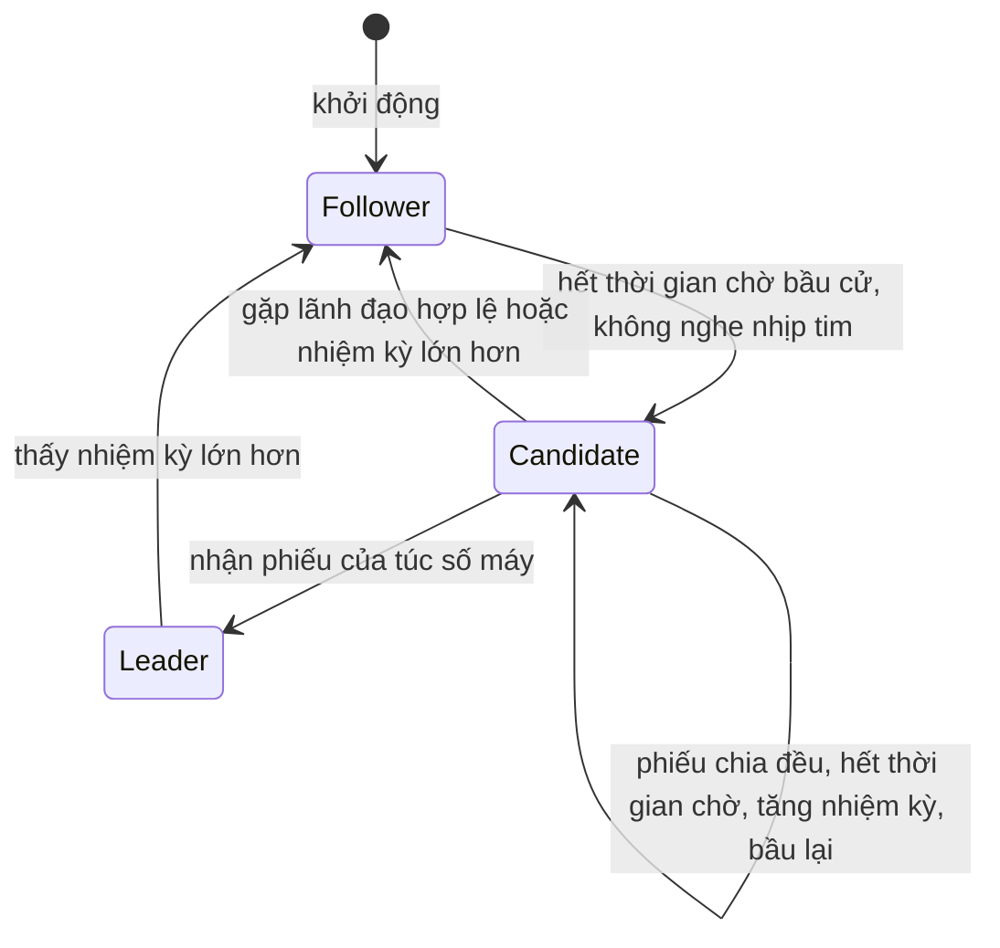
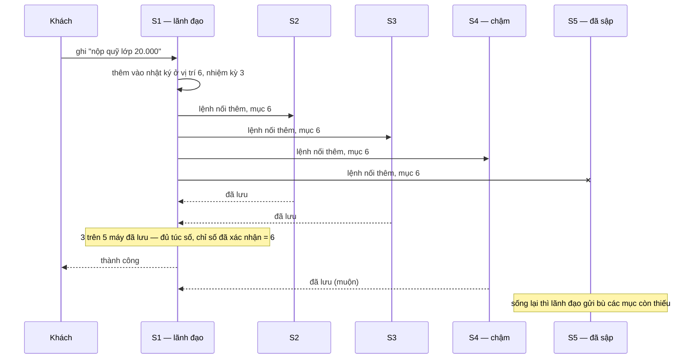

# Bài 46 — Consensus và Raft: nhiều máy cùng đồng ý một điều

!!! abstract "🎯 Học xong bài này, bạn sẽ"
    - Phát biểu được bài toán **đồng thuận**: nhiều máy phải đồng ý **cùng một thứ tự** sự kiện, kể cả khi có máy sập và tin nhắn bị trễ
    - Giải thích **túc số** bằng chuyện bầu lớp trưởng: vì sao **quá bán** thì không bao giờ có hai người cùng thắng — và tự kiểm bằng SQL rằng mọi cặp nhóm quá bán đều **giao nhau**, còn nhóm "đúng một nửa" thì không
    - Mô tả ba phần của **Raft**: **bầu lãnh đạo** (nhiệm kỳ, thời gian chờ ngẫu nhiên, phiếu chia đều), **nhân bản nhật ký** (lệnh nối thêm, chỉ số đã xác nhận), và **tính an toàn**
    - Tính được **chỉ số đã xác nhận** từ nhật ký của năm máy, và chứng minh bằng SQL rằng một ứng viên thiếu mục đã xác nhận **không thể** gom đủ phiếu
    - Biết Raft ra đời để **dễ hiểu hơn** Paxos, và nó đang chạy bên dưới những hệ nào: etcd, Consul, CockroachDB, TiDB

## 🧠 Câu chuyện mở đầu

Lớp 9A1 có một **sổ đầu bài** chung, ghi theo thứ tự mọi việc của lớp: *"1. Đổi chỗ An và Bình. 2. Trực nhật tuần 5: tổ 3. 3. Nộp quỹ lớp 20.000 đồng..."*. Cô chủ nhiệm muốn sổ này **không bao giờ mất**, nên có **năm** bản — mỗi tổ trưởng giữ một bản. Luật đặt ra rất đơn giản: năm bản phải ghi **cùng những việc, theo cùng thứ tự**.

Rắc rối bắt đầu ngay tuần đầu:

- Tổ trưởng tổ 2 ốm nghỉ ba hôm. Việc số 4, 5, 6 ghi lúc bạn ấy vắng — lúc đi học lại, bản của bạn ấy thiếu ba dòng.
- Hai bạn cùng lúc muốn ghi một việc: bạn Hà muốn ghi *"4. Lớp đi tham quan thứ Bảy"*, bạn Tùng muốn ghi *"4. Lớp đi tham quan Chủ nhật"*. Tổ 1, tổ 3 nghe Hà trước; tổ 4, tổ 5 nghe Tùng trước. Giờ dòng số 4 ở các bản không giống nhau.

Lớp quyết định: phải có **một người** được quyền đọc việc cần ghi cho cả năm tổ — gọi là **lớp trưởng**. Và việc chỉ được coi là **đã chốt** khi **ít nhất ba** trong năm tổ trưởng đã chép vào sổ của mình. Ba là **quá bán** của năm.

Nhưng lớp trưởng cũng có thể ốm. Khi đó phải **bầu lại**. Và phải bầu sao cho không bao giờ có **hai** lớp trưởng cùng lúc đọc hai thứ khác nhau — chính là não chia đôi của Bài 42. Làm thế nào? Cô chủ nhiệm nói: *"Mỗi bạn chỉ được bỏ **một** phiếu mỗi lần bầu. Ai được **quá nửa** số phiếu thì làm lớp trưởng."* Với 5 tổ trưởng, muốn thắng phải có 3 phiếu. Hai người khác nhau cùng có 3 phiếu thì cần 6 phiếu — trong khi chỉ có 5 người bỏ phiếu. Không thể xảy ra.

Đó là toàn bộ ý tưởng cốt lõi của bài này. Phần còn lại là làm cho nó đúng khi mọi thứ cùng lúc trục trặc.

## 📖 Khái niệm & thuật ngữ

### Bài toán đồng thuận

**Đồng thuận** (*consensus*) là bài toán làm cho một nhóm máy **cùng đồng ý** một giá trị — hoặc, thực tế hơn, một **dãy** giá trị theo đúng thứ tự — sao cho:

- **Chỉ một** giá trị được chọn cho mỗi vị trí, và mọi máy còn sống đều biết đúng giá trị đó.
- Giá trị được chọn phải là giá trị **có người đề xuất**, không phải thứ tự bịa ra.
- Nếu **đa số** máy còn sống và liên lạc được với nhau, cuối cùng việc chọn sẽ **xong**.

Cách dùng đồng thuận phổ biến nhất gọi là **máy trạng thái nhân bản** (*replicated state machine*): mỗi máy giữ một **nhật ký lệnh**, các máy đồng thuận về thứ tự các lệnh trong nhật ký, rồi mỗi máy tự **thực hiện** các lệnh đó theo đúng thứ tự. Cùng trạng thái ban đầu + cùng dãy lệnh + mỗi lệnh luôn cho cùng kết quả = cùng trạng thái cuối. Bạn đã thấy ý tưởng này: máy bản sao của Bài 42 làm lại WAL của máy chính theo đúng thứ tự. Khác biệt là ở Bài 42, **thứ tự do một máy chính duy nhất quyết định** — và khi máy chính đó sập, không ai chắc ai được lên thay. Đồng thuận giải quyết chính chỗ đó.

Bài toán này **khó**, vì trên mạng không thể phân biệt *"máy kia đã sập"* với *"máy kia chậm"* với *"mạng tới máy kia đứt"* — cả ba đều trông như *"không có trả lời"*. Các thuật toán đồng thuận của bài này giả định máy chỉ có thể **sập** hoặc **chậm**, không **nói dối**. Máy cố ý gửi thông tin sai — **lỗi Byzantine** (*Byzantine fault*) — cần những thuật toán khác, đắt hơn nhiều, thường gặp trong tiền mã hoá hơn là trong database.

### Túc số

**Túc số** (*quorum*) là số máy tối thiểu phải đồng ý thì một quyết định mới có hiệu lực. Raft và hầu hết thuật toán đồng thuận dùng túc số **quá bán**:

> Với `n` máy, túc số = `n / 2 + 1` (phép chia lấy phần nguyên). Cụm chịu được `n − túc số` máy hỏng mà vẫn hoạt động.

Vì sao **quá bán** chứ không phải **một nửa**? Vì hai nhóm quá bán bất kỳ luôn có **ít nhất một máy chung**. Tổng kích thước hai nhóm vượt quá `n`, nên chúng không thể rời nhau. Máy chung đó là "nhân chứng": nó đã bỏ phiếu cho người thứ nhất nên không bỏ cho người thứ hai; nó đã chép mục thứ nhất nên người thứ hai biết mục đó tồn tại. Hai nhóm "đúng một nửa" — 2 trên 4 máy — thì **có thể** rời nhau hoàn toàn, và mỗi nhóm tự bầu một lớp trưởng. Phần thực hành kiểm cả hai điều này bằng cách liệt kê mọi nhóm có thể.

Hệ quả thực tế: cụm **4** máy chịu hỏng được **1** máy — y như cụm 3 máy — vì túc số của 4 là 3. Máy thứ tư chỉ thêm việc. Vì vậy cụm đồng thuận gần như luôn có số máy **lẻ**: 3, 5, đôi khi 7.

### Raft và Paxos

Thuật toán đồng thuận kinh điển là **Paxos** (*Paxos*), do Leslie Lamport công bố — bài báo gốc viết năm 1989, in năm 1998, rồi một bản viết lại cho dễ đọc năm 2001 tên *"Paxos Made Simple"*. Paxos đúng và đã được dùng rộng rãi, ví dụ trong Google Spanner. Nhưng nó nổi tiếng **khó hiểu**, và bản gốc chỉ mô tả việc đồng ý **một** giá trị; biến nó thành một nhật ký lệnh chạy được trong thực tế cần thêm nhiều phần mà bài báo để ngỏ.

**Raft** (*Raft*) do Diego Ongaro và John Ousterhout công bố năm 2014, trong bài báo có tên *"In Search of an Understandable Consensus Algorithm"* — *"Đi tìm một thuật toán đồng thuận dễ hiểu"*. Mục tiêu thiết kế số một của Raft là **dễ hiểu**, và nó đạt được điều đó bằng cách chia bài toán thành ba phần gần như độc lập: bầu lãnh đạo, nhân bản nhật ký, và an toàn. Nó cho cùng mức bảo đảm như Paxos.

### Ba vai và nhiệm kỳ

Mỗi máy trong cụm Raft luôn ở một trong ba vai:

| Vai | Làm gì | Trong lớp |
|---|---|---|
| **Nút lãnh đạo** (*leader*) | Duy nhất nhận yêu cầu ghi, thêm vào nhật ký, gửi cho mọi máy khác | Lớp trưởng |
| **Nút theo sau** (*follower*) | Không tự làm gì; trả lời lãnh đạo và ứng viên | Tổ trưởng bình thường |
| **Ứng viên** (*candidate*) | Đang tự ứng cử, xin phiếu | Tổ trưởng đang vận động |

Thời gian được chia thành các **nhiệm kỳ** (*term*), đánh số 1, 2, 3... tăng dần. Mỗi nhiệm kỳ bắt đầu bằng một cuộc bầu cử; nếu có người thắng, người đó lãnh đạo tới hết nhiệm kỳ. Số nhiệm kỳ là **đồng hồ logic** của Raft: mọi tin nhắn đều mang số nhiệm kỳ của người gửi, và một máy thấy số nhiệm kỳ **lớn hơn** của mình thì lập tức cập nhật theo và lùi về làm nút theo sau — kể cả khi nó đang là lãnh đạo. Nhờ vậy một lãnh đạo cũ vừa tỉnh dậy sau khi bị cắt mạng sẽ tự nhận ra mình đã lỗi thời ngay ở tin nhắn đầu tiên nó nhận.

### Bầu lãnh đạo

**Bầu lãnh đạo** (*leader election*) diễn ra như sau:

1. Lãnh đạo gửi **nhịp tim** (*heartbeat*) đều đặn cho mọi nút theo sau — một tin nhắn rỗng nghĩa là *"tôi còn sống"*.
2. Mỗi nút theo sau có một **thời gian chờ bầu cử** (*election timeout*). Hết thời gian đó mà không nghe thấy lãnh đạo, nó cho rằng lãnh đạo đã chết: nó **tăng** số nhiệm kỳ, chuyển thành ứng viên, **bỏ phiếu cho chính mình**, và gửi **yêu cầu bỏ phiếu** (*RequestVote*) cho mọi máy khác.
3. Mỗi máy chỉ bỏ **một** phiếu trong mỗi nhiệm kỳ, cho ứng viên **hỏi trước** — với một điều kiện ở mục An toàn bên dưới.
4. Ứng viên gom đủ **túc số** phiếu thì thành lãnh đạo, gửi nhịp tim ngay để các máy khác biết. Nhận được nhịp tim của một lãnh đạo có nhiệm kỳ không nhỏ hơn mình thì ứng viên thôi ứng cử.

Nếu hai máy hết thời gian chờ **gần như cùng lúc** và cùng ứng cử, phiếu có thể chia đôi: mỗi người 2 phiếu trong cụm 5 máy, máy thứ năm đã bầu cho một trong hai, không ai đủ 3. Tình huống này gọi là **phiếu chia đều** (*split vote*). Không ai thắng; hết thời gian chờ, cả hai tăng nhiệm kỳ và bầu lại. Để điều này không lặp mãi, thời gian chờ bầu cử của mỗi máy được chọn **ngẫu nhiên** trong một khoảng — bài báo gốc dùng ví dụ 150–300 mili giây. Gần như luôn có một máy hết thời gian chờ **trước hẳn** các máy khác, kịp gom phiếu trước khi ai kịp ứng cử.

### Nhân bản nhật ký

**Nhân bản nhật ký** (*log replication*): mỗi mục trong nhật ký gồm **một lệnh** và **số nhiệm kỳ** lúc lãnh đạo nhận lệnh đó.

1. Khách gửi lệnh ghi cho lãnh đạo. Lãnh đạo thêm lệnh vào cuối nhật ký **của mình**.
2. Lãnh đạo gửi **lệnh nối thêm** (*AppendEntries*) cho mọi nút theo sau — nhịp tim chính là lệnh nối thêm không có mục nào. Tin nhắn kèm vị trí và nhiệm kỳ của mục **ngay trước** các mục mới. Nút theo sau chỉ chấp nhận nếu nhật ký của nó có đúng mục đó ở đúng vị trí; nếu không, nó từ chối, và lãnh đạo lùi dần về trước cho tới khi tìm được điểm hai bên khớp, rồi **ghi đè** phần lệch của nút theo sau bằng nhật ký của mình. Nhờ phép kiểm này, hai nhật ký có cùng một mục ở cùng một vị trí thì **mọi mục trước đó** cũng giống nhau.
3. Khi mục đã được lưu trên **túc số** máy — tính cả lãnh đạo — nó được coi là **đã xác nhận**. Lãnh đạo tăng **chỉ số đã xác nhận** (*commit index*) — vị trí của mục cuối cùng đã xác nhận —, thực hiện lệnh, trả lời khách, và báo chỉ số mới cho các nút theo sau trong lần gửi kế tiếp để chúng cũng thực hiện.

Một mục đã xác nhận thì **không bao giờ** bị mất hay bị ghi đè — đó là lời hứa của Raft. Bạn sẽ thấy nó quen: với cụm 5 máy, xác nhận khi 3 máy đã lưu — lãnh đạo cộng 2 máy khác — giống nhân bản đồng bộ với `synchronous_standby_names = 'ANY 2 (...)'` trên bốn máy bản sao ở Bài 42. Chỉ khác là ở đây, việc **ai làm lãnh đạo** cũng được quyết định bằng túc số.

### Tính an toàn

Bầu cử và nhân bản chưa đủ. Giả sử một máy vắng mặt lâu, nhật ký thiếu mấy mục đã xác nhận, rồi quay lại và **được bầu** làm lãnh đạo — nó sẽ ghi đè mất các mục đã xác nhận trên máy khác. **Tính an toàn** (*safety*) của Raft cấm điều đó bằng một luật khi bỏ phiếu:

> Một máy chỉ bỏ phiếu cho ứng viên có nhật ký **ít nhất mới bằng** nhật ký của mình: nhiệm kỳ của mục cuối **lớn hơn**, hoặc cùng nhiệm kỳ mà nhật ký **dài bằng hoặc dài hơn**.

Vì sao đủ? Một mục đã xác nhận nằm trên một túc số máy. Người thắng cử cần phiếu của một túc số máy. Hai túc số luôn **giao nhau**, nên trong số người bỏ phiếu cho ứng viên có ít nhất một máy **đang giữ** mục đó — và máy đó chỉ bỏ phiếu nếu nhật ký của ứng viên không cũ hơn nhật ký của nó. Phần thực hành tính tận nơi: ứng viên thiếu mục đã xác nhận gom được tối đa 2 phiếu trên 5.

Raft còn một luật tinh tế nữa: lãnh đạo chỉ tính túc số để xác nhận những mục thuộc **nhiệm kỳ của chính mình**. Các mục cũ hơn được xác nhận "ké" khi một mục mới hơn của nhiệm kỳ hiện tại được xác nhận. Bài báo gốc có một ví dụ cụ thể cho thấy thiếu luật này thì một mục đã nằm trên túc số máy vẫn có thể bị ghi đè.

### Ai dùng Raft

| Hệ thống | Dùng Raft để |
|---|---|
| etcd | Giữ dữ liệu cấu hình khoá–giá trị cho cả cụm; Kubernetes lưu trạng thái của cả cụm trong etcd |
| Consul | Giữ danh bạ dịch vụ và dữ liệu cấu hình |
| CockroachDB | Mỗi khoảng dữ liệu nhỏ là một nhóm Raft riêng |
| TiDB | Tầng lưu trữ TiKV nhân bản mỗi vùng dữ liệu bằng một nhóm Raft |

Và với PostgreSQL: công cụ failover Patroni của Bài 42 **không** tự chạy đồng thuận, mà gửi việc "ai là máy chính" cho một kho như etcd hoặc Consul. Máy chính chỉ giữ vai khi nó còn giữ được một **khoá có thời hạn** trong kho đó, và kho đó chỉ cấp khoá khi quá bán số máy của nó đồng ý — cách tránh não chia đôi mà Bài 42 đã hứa.

### Bảng thuật ngữ

| Tiếng Việt | English | Nghĩa dễ hiểu |
|---|---|---|
| Đồng thuận | *consensus* | Nhiều máy cùng đồng ý một giá trị hoặc một thứ tự lệnh, dù có máy sập |
| Máy trạng thái nhân bản | *replicated state machine* | Mỗi máy thực hiện cùng một dãy lệnh theo cùng thứ tự nên có cùng trạng thái |
| Lỗi Byzantine | *Byzantine fault* | Máy gửi thông tin sai hoặc cố ý lừa; Raft và Paxos không chống được |
| Túc số | *quorum* | Số máy tối thiểu phải đồng ý; quá bán là `n / 2 + 1`, hai túc số quá bán luôn giao nhau |
| Thuật toán Paxos | *Paxos* | Thuật toán đồng thuận kinh điển của Leslie Lamport; đúng nhưng nổi tiếng khó hiểu |
| Thuật toán Raft | *Raft* | Thuật toán đồng thuận của Ongaro và Ousterhout (2014), thiết kế để dễ hiểu |
| Nút lãnh đạo | *leader* | Máy duy nhất nhận yêu cầu ghi và gửi nhật ký cho các máy khác |
| Nút theo sau | *follower* | Máy thụ động, trả lời lãnh đạo và ứng viên |
| Ứng viên | *candidate* | Máy đang xin phiếu để làm lãnh đạo |
| Nhiệm kỳ | *term* | Số tăng dần đánh dấu mỗi lần bầu; thấy nhiệm kỳ lớn hơn thì lùi về làm nút theo sau |
| Bầu lãnh đạo | *leader election* | Nút theo sau hết thời gian chờ thì ứng cử, gom túc số phiếu thì làm lãnh đạo |
| Nhịp tim | *heartbeat* | Tin nhắn đều đặn của lãnh đạo báo "tôi còn sống" |
| Thời gian chờ bầu cử | *election timeout* | Không nghe lãnh đạo quá thời gian này thì ứng cử; chọn ngẫu nhiên để tránh phiếu chia đều |
| Yêu cầu bỏ phiếu | *RequestVote* | Tin nhắn ứng viên gửi để xin phiếu, kèm vị trí và nhiệm kỳ mục cuối nhật ký |
| Phiếu chia đều | *split vote* | Nhiều ứng viên cùng lúc, không ai đủ túc số; bầu lại ở nhiệm kỳ sau |
| Nhân bản nhật ký | *log replication* | Lãnh đạo gửi các mục nhật ký mới cho nút theo sau và xác nhận khi túc số đã lưu |
| Lệnh nối thêm | *AppendEntries* | Tin nhắn lãnh đạo gửi mục nhật ký mới, kèm mục ngay trước để kiểm khớp; rỗng thì là nhịp tim |
| Chỉ số đã xác nhận | *commit index* | Vị trí của mục cuối cùng đã được lưu trên túc số máy |
| Tính an toàn | *safety* | Mục đã xác nhận không bao giờ mất; giữ bằng luật chỉ bầu ứng viên có nhật ký không cũ hơn |

## 🖼️ Sơ đồ

Ba vai của một máy Raft và những gì làm nó đổi vai:



Tên trạng thái giữ tiếng Anh vì đó là tên bạn sẽ gặp trong mọi tài liệu: `Follower` là nút theo sau, `Candidate` là ứng viên, `Leader` là nút lãnh đạo.

Một lệnh ghi đi qua cụm 5 máy — xác nhận ngay khi đủ 3 máy, không chờ hai máy chậm:



## 💻 Thực hành

Không có cụm Raft nào để chạy trong PostgreSQL của khoá học. Nhưng mọi quyết định của Raft đều là **đếm**: đếm máy, đếm phiếu, đếm bản sao của một mục nhật ký. Phần này dùng SQL để kiểm tận nơi các con số đó.

### Túc số theo số máy

```sql
DROP TABLE IF EXISTS b46_tuc_so CASCADE;
CREATE TABLE b46_tuc_so AS
SELECT n AS so_may, n / 2 + 1 AS tuc_so, n - (n / 2 + 1) AS chiu_hong_duoc
FROM generate_series(1, 7) AS n;

-- KỲ VỌNG: 7 dòng
-- KỲ VỌNG: so_may = 1
-- KỲ VỌNG: tuc_so = 1
-- KỲ VỌNG: chiu_hong_duoc = 0
SELECT so_may, tuc_so, chiu_hong_duoc FROM b46_tuc_so ORDER BY so_may;
```

```sql
-- KỲ VỌNG: ba_may_chiu = 1
-- KỲ VỌNG: bon_may_chiu = 1
-- KỲ VỌNG: nam_may_tuc_so = 3
-- KỲ VỌNG: nam_may_chiu = 2
SELECT (SELECT chiu_hong_duoc FROM b46_tuc_so WHERE so_may = 3) AS ba_may_chiu,
       (SELECT chiu_hong_duoc FROM b46_tuc_so WHERE so_may = 4) AS bon_may_chiu,
       (SELECT tuc_so         FROM b46_tuc_so WHERE so_may = 5) AS nam_may_tuc_so,
       (SELECT chiu_hong_duoc FROM b46_tuc_so WHERE so_may = 5) AS nam_may_chiu;
```

3 máy và 4 máy **cùng** chịu được đúng 1 máy hỏng. Muốn chịu 2 máy hỏng thì cần 5.

### Hai túc số luôn giao nhau — kiểm bằng cách liệt kê hết

Mỗi nhóm máy trong cụm `n` máy được biểu diễn bằng một số nguyên từ 0 tới `2^n − 1`: bit thứ `i` bằng 1 nghĩa là máy `i` có trong nhóm. Với 5 máy, đó là 32 nhóm. Phép `&` trên hai số cho ra các máy **chung** của hai nhóm; bằng 0 nghĩa là hai nhóm **rời nhau**. Đếm số bit 1 bằng cách đổi sang chuỗi bit rồi đếm chữ `1`:

```sql
DROP TABLE IF EXISTS b46_nhom CASCADE;
CREATE TABLE b46_nhom AS
SELECT n AS so_may, nhom,
       length(replace(nhom::bit(8)::text, '0', '')) AS so_thanh_vien
FROM generate_series(4, 5) AS n, generate_series(0, 31) AS nhom
WHERE nhom < (1 << n);

-- KỲ VỌNG: nam_may_nhom_qua_ban = 16
-- KỲ VỌNG: cap_qua_ban_roi_nhau_5_may = 0
-- KỲ VỌNG: cap_mot_nua_roi_nhau_4_may = 6
SELECT (SELECT count(*) FROM b46_nhom WHERE so_may = 5 AND so_thanh_vien >= 3) AS nam_may_nhom_qua_ban,
       (SELECT count(*) FROM b46_nhom a JOIN b46_nhom b ON a.so_may = b.so_may
        WHERE a.so_may = 5 AND a.so_thanh_vien >= 3 AND b.so_thanh_vien >= 3
          AND a.nhom & b.nhom = 0)                                             AS cap_qua_ban_roi_nhau_5_may,
       (SELECT count(*) FROM b46_nhom a JOIN b46_nhom b ON a.so_may = b.so_may
        WHERE a.so_may = 4 AND a.so_thanh_vien = 2 AND b.so_thanh_vien = 2
          AND a.nhom & b.nhom = 0)                                             AS cap_mot_nua_roi_nhau_4_may;
```

- Cụm 5 máy có **16** nhóm quá bán (từ 3 máy trở lên). Thử **mọi** cặp: **0** cặp rời nhau. Không có cách nào chia 5 máy thành hai nhóm mà nhóm nào cũng đủ túc số — nên không bao giờ có hai lãnh đạo cùng nhiệm kỳ.
- Cụm 4 máy nếu chỉ đòi "đúng một nửa" — 2 máy: có **6** cặp nhóm rời nhau — mỗi cặp được đếm theo cả hai thứ tự, tức 3 cách chia 4 máy thành hai đôi. Mạng đứt đúng giữa hai đôi là có hai lãnh đạo — não chia đôi.

### Chỉ số đã xác nhận từ nhật ký của năm máy

Cụm 5 máy `S1`–`S5`, lãnh đạo là `S1` ở nhiệm kỳ 3. Mỗi dòng là một mục nhật ký: máy nào, ở vị trí nào, nhiệm kỳ nào, lệnh gì. `S4` vắng mặt một thời gian, `S5` mới sống lại:

```sql
DROP TABLE IF EXISTS b46_nhat_ky CASCADE;
CREATE TABLE b46_nhat_ky (
    may      CHAR(2)  NOT NULL,
    vi_tri   INTEGER  NOT NULL,
    nhiem_ky INTEGER  NOT NULL,
    lenh     TEXT     NOT NULL,
    PRIMARY KEY (may, vi_tri)
);

WITH nhat_ky_lanh_dao (vi_tri, nhiem_ky, lenh) AS (
    VALUES (1, 1, 'Đổi chỗ An và Bình'),
           (2, 1, 'Trực nhật tuần 5: tổ 3'),
           (3, 2, 'Nộp quỹ lớp 20.000'),
           (4, 3, 'Tham quan thứ Bảy'),
           (5, 3, 'Họp phụ huynh 19/10'),
           (6, 3, 'Thi vở sạch chữ đẹp')
), do_dai (may, so_muc) AS (
    VALUES ('S1', 6), ('S2', 6), ('S3', 5), ('S4', 3), ('S5', 2)
)
INSERT INTO b46_nhat_ky
SELECT d.may, n.vi_tri, n.nhiem_ky, n.lenh
FROM do_dai AS d JOIN nhat_ky_lanh_dao AS n ON n.vi_tri <= d.so_muc;

-- KỲ VỌNG: 5 dòng
-- KỲ VỌNG: may = S1
-- KỲ VỌNG: so_muc = 6
SELECT may, count(*) AS so_muc, max(vi_tri) AS vi_tri_cuoi FROM b46_nhat_ky GROUP BY may ORDER BY may;
```

Chỉ số đã xác nhận là vị trí **lớn nhất** mà mục ở đó — cùng nhiệm kỳ với nhật ký lãnh đạo — nằm trên **ít nhất túc số** máy, và thuộc **nhiệm kỳ hiện tại** 3 theo luật ở mục An toàn:

```sql
-- KỲ VỌNG: 6 dòng
-- KỲ VỌNG: vi_tri = 1
-- KỲ VỌNG: so_may_da_luu = 5
SELECT l.vi_tri, l.nhiem_ky,
       (SELECT count(*) FROM b46_nhat_ky AS m
        WHERE m.vi_tri = l.vi_tri AND m.nhiem_ky = l.nhiem_ky) AS so_may_da_luu
FROM b46_nhat_ky AS l
WHERE l.may = 'S1'
ORDER BY l.vi_tri;
```

```sql
-- KỲ VỌNG: chi_so_da_xac_nhan = 5
-- KỲ VỌNG: muc_6_da_xac_nhan = false
SELECT max(l.vi_tri) AS chi_so_da_xac_nhan,
       bool_or(l.vi_tri = 6) AS muc_6_da_xac_nhan
FROM b46_nhat_ky AS l
WHERE l.may = 'S1'
  AND l.nhiem_ky = 3
  AND (SELECT count(*) FROM b46_nhat_ky AS m
       WHERE m.vi_tri = l.vi_tri AND m.nhiem_ky = l.nhiem_ky) >= 5 / 2 + 1;
```

Mục 5 nằm trên `S1`, `S2`, `S3` — đủ 3 — nên **đã xác nhận**, kéo theo mọi mục trước nó. Mục 6 mới có trên `S1`, `S2` — thiếu một máy — nên **chưa**: lãnh đạo chưa được báo thành công cho khách.

### Ứng viên thiếu mục đã xác nhận không thể thắng

Giả sử `S1` sập ngay bây giờ. Máy nào có thể thắng cuộc bầu tiếp theo? Mỗi máy chỉ bỏ phiếu cho ứng viên có mục cuối **không cũ hơn** mục cuối của mình — so nhiệm kỳ trước, rồi mới so vị trí. Phép so sánh hai bộ `(nhiem_ky, vi_tri)` của PostgreSQL làm đúng thứ tự đó:

```sql
DROP TABLE IF EXISTS b46_bau_cu CASCADE;
CREATE TABLE b46_bau_cu AS
WITH muc_cuoi AS (
    SELECT DISTINCT ON (may) may, nhiem_ky, vi_tri
    FROM b46_nhat_ky ORDER BY may, vi_tri DESC
), con_song AS (
    SELECT * FROM muc_cuoi WHERE may <> 'S1'
)
SELECT u.may AS ung_vien, u.nhiem_ky, u.vi_tri AS vi_tri_cuoi,
       (SELECT count(*) FROM con_song AS c
        WHERE (u.nhiem_ky, u.vi_tri) >= (c.nhiem_ky, c.vi_tri)) AS so_phieu_toi_da
FROM con_song AS u;

-- KỲ VỌNG: 4 dòng
-- KỲ VỌNG: ung_vien = S2
-- KỲ VỌNG: so_phieu_toi_da = 4
SELECT ung_vien, nhiem_ky, vi_tri_cuoi, so_phieu_toi_da, so_phieu_toi_da >= 3 AS co_the_thang
FROM b46_bau_cu ORDER BY ung_vien;
```

`so_phieu_toi_da` đếm cả phiếu ứng viên tự bỏ cho mình. `S2` có thể nhận phiếu của cả bốn máy còn sống, `S3` được ba, còn `S4` và `S5` không bao giờ đủ ba phiếu. Kiểm điều quan trọng nhất:

```sql
-- KỲ VỌNG: moi_nguoi_co_the_thang_deu_du_muc_da_xac_nhan = true
-- KỲ VỌNG: s4_co_the_thang = false
-- KỲ VỌNG: s3_co_the_thang = true
SELECT bool_and(vi_tri_cuoi >= 5) FILTER (WHERE so_phieu_toi_da >= 3) AS moi_nguoi_co_the_thang_deu_du_muc_da_xac_nhan,
       bool_or(so_phieu_toi_da >= 3) FILTER (WHERE ung_vien = 'S4')    AS s4_co_the_thang,
       bool_or(so_phieu_toi_da >= 3) FILTER (WHERE ung_vien = 'S3')    AS s3_co_the_thang
FROM b46_bau_cu;
```

Mọi ứng viên có thể thắng đều giữ đủ 5 mục đã xác nhận. `S4` — chỉ có 3 mục — **không thể** thắng: `S2` và `S3` từ chối nó vì nhật ký của nó cũ hơn. Mục 6 thì khác: nó chưa xác nhận, và nếu `S3` thắng, `S3` sẽ ghi đè mục 6 trên `S2`. Điều đó **hợp lệ** — chưa ai được báo mục 6 thành công.

## ⚠️ Lỗi thường gặp

!!! danger "Lỗi 1: Cụm đồng thuận với số máy chẵn"
    *"Ba máy chịu 1 máy hỏng, vậy bốn máy cho chắc."* Phần thực hành đã đo: 4 máy vẫn chỉ chịu được **1** máy hỏng, vì túc số của 4 là 3. Máy thứ tư còn làm cụm **kém** hơn: thêm một máy có thể hỏng, và mỗi lần ghi phải chờ 3 máy thay vì 2.

    Sửa: dùng 3 máy — chịu 1 hỏng — hoặc 5 máy — chịu 2 hỏng. Hiếm khi cần hơn 7.

!!! danger "Lỗi 2: Đặt cả cụm đồng thuận ở một nơi — hoặc chia đều ra hai nơi"
    Năm máy etcd nằm cùng một tủ máy: mất điện tủ là mất cả cụm, túc số chẳng giúp gì. Chia ra hai trung tâm dữ liệu, 3 máy bên này 2 máy bên kia: đứt đường nối, bên 3 máy vẫn chạy — tốt. Nhưng **mất hẳn** trung tâm có 3 máy thì bên còn lại chỉ có 2, không đủ túc số, cụm đứng.

    Sửa: đặt máy ở **ba** nơi độc lập, ví dụ 2 + 2 + 1. Mất trọn một nơi bất kỳ vẫn còn ít nhất 3 máy.

!!! warning "Lỗi 3: Thời gian chờ bầu cử ngắn hơn độ trễ mạng"
    Mạng giữa các máy đôi lúc trễ 500 mili giây, còn thời gian chờ bầu cử là 200 mili giây. Nút theo sau liên tục tưởng lãnh đạo đã chết, liên tục ứng cử; mỗi lần bầu, mọi yêu cầu ghi phải chờ. Cụm "chạy" nhưng gần như không làm được gì.

    Sửa: thời gian chờ bầu cử phải lớn hơn **nhiều lần** thời gian đi-về của một tin nhắn, và nhịp tim phải gửi dày hơn thời gian chờ nhiều lần. etcd có sẵn hai tham số cho việc này.

!!! warning "Lỗi 4: Nghĩ đồng thuận làm hệ thống nhanh hơn"
    Mỗi lần ghi phải đi qua lãnh đạo và chờ túc số máy lưu xong — một vòng mạng, cộng thời gian ghi đĩa của máy **chậm thứ ba** trong năm. Đồng thuận mua **đúng** và **sẵn sàng**, trả bằng **độ trễ**. Nó hợp với dữ liệu nhỏ, quan trọng: ai là máy chính, cấu hình, khoá phân tán — không hợp để chứa hàng tỷ dòng điểm thi qua **một** nhóm duy nhất.

    Sửa: dùng đồng thuận cho phần **điều khiển**, như Patroni dùng etcd. Hệ lớn như CockroachDB, TiDB chạy **hàng nghìn** nhóm Raft nhỏ, mỗi nhóm lo một khoảng dữ liệu, để việc ghi không dồn về một lãnh đạo.

!!! warning "Lỗi 5: Đọc từ nút theo sau rồi tin là mới nhất"
    Một ứng dụng đọc cấu hình từ một máy etcd bất kỳ cho nhanh. Máy đó là nút theo sau vừa bị cắt mạng khỏi lãnh đạo mười giây — nó trả lời bằng dữ liệu cũ mười giây. Hoặc tệ hơn: nó là một **lãnh đạo cũ** chưa biết mình đã bị thay.

    Sửa: khi cần nhất quán mạnh, đọc cũng phải qua túc số — lãnh đạo xác nhận với túc số máy rằng nó vẫn còn là lãnh đạo trước khi trả lời. etcd làm việc này mặc định; tuỳ chọn đọc nhanh "không qua túc số" chỉ dùng khi chấp nhận dữ liệu cũ — đúng lựa chọn EL/EC của PACELC ở Bài 44.

## ✍️ Bài tập

1. Một cụm Raft có 7 máy. (a) Túc số là bao nhiêu? (b) Chịu được mấy máy hỏng cùng lúc? (c) Mạng bị chia cắt thành hai nhóm 4 máy và 3 máy, lãnh đạo cũ nằm ở nhóm 3 máy. Mô tả điều xảy ra ở từng nhóm, và điều xảy ra khi mạng nối lại.

2. Cụm 5 máy, nhiệm kỳ hiện tại là 7. `S2` và `S4` cùng hết thời gian chờ bầu cử gần như một lúc. `S1` bầu cho `S2`, `S5` bầu cho `S4`, `S3` đang bị cắt mạng. (a) Ai thắng? (b) Chuyện gì xảy ra tiếp theo? (c) Vì sao nếu thời gian chờ **không** ngẫu nhiên thì tình huống này có thể lặp lại mãi?

3. Dùng bảng `b46_nhat_ky` của phần thực hành. Lãnh đạo `S1` vừa gửi thành công mục 6 cho `S3`. Viết câu lệnh thêm mục đó vào nhật ký của `S3` rồi tính lại chỉ số đã xác nhận. Nó bằng bao nhiêu? Giờ `S4` còn có thể thắng cử không?

4. Giải thích vì sao luật *"chỉ bỏ phiếu cho ứng viên có nhật ký không cũ hơn của mình"* sẽ **vô dụng** nếu túc số chỉ là "một nửa" thay vì "quá bán".

5. Patroni dùng etcd để quyết định máy PostgreSQL nào là máy chính. Cụm etcd có 3 máy, đặt trên chính 3 máy PostgreSQL. Máy PostgreSQL chính bị cắt mạng khỏi hai máy còn lại. (a) Máy etcd nằm cùng máy chính có còn cấp cho nó quyền làm máy chính không? (b) Điều gì ngăn não chia đôi của Bài 42 ở đây? (c) Vì sao PostgreSQL chính phải tự **ngừng nhận ghi** khi không gia hạn được khoá, thay vì chờ ai đó tắt nó?

??? success "Đáp án"
    **Câu 1.**

    - (a) 7 / 2 + 1 = **4**.
    - (b) 7 − 4 = **3** máy.
    - (c) Nhóm **3 máy** có lãnh đạo cũ, nhưng lãnh đạo chỉ gom được 3 bản lưu cho mỗi mục mới — thiếu túc số 4 — nên **không** xác nhận được mục nào; mọi yêu cầu ghi ở đây treo. Nhóm **4 máy** không nghe nhịp tim, hết thời gian chờ, bầu một lãnh đạo mới ở nhiệm kỳ lớn hơn — đủ 4 phiếu — và tiếp tục nhận ghi. Khi mạng nối lại, lãnh đạo cũ nhận tin nhắn mang nhiệm kỳ lớn hơn, lập tức lùi về làm nút theo sau. Các mục chưa xác nhận của nó bị lãnh đạo mới ghi đè — hợp lệ, vì chưa ai được báo thành công cho những mục đó. Đây là một hệ **CP** đúng nghĩa Bài 44: phía thiểu số từ chối.

    **Câu 2.**

    - (a) **Không ai**: `S2` có 2 phiếu — của mình và `S1` —, `S4` có 2 phiếu — của mình và `S5`. `S3` không liên lạc được. Túc số là 3. Phiếu chia đều.
    - (b) Cả hai ứng viên hết thời gian chờ, tăng nhiệm kỳ lên 8 — hoặc cao hơn nếu lặp lại —, và bầu lại. Thời gian chờ ngẫu nhiên nên lần này một bên gần như chắc chắn ứng cử trước và gom được 3 phiếu — kể cả khi `S3` vẫn bị cắt, vì 4 máy còn lại đủ túc số.
    - (c) Nếu mọi máy có **cùng** thời gian chờ, hai ứng viên đã hết giờ cùng lúc sẽ lại hết giờ cùng lúc ở vòng sau, lại chia phiếu — mãi mãi. Ngẫu nhiên phá thế cân bằng đó.

    **Câu 3.**

    ```sql
    INSERT INTO b46_nhat_ky
    SELECT 'S3', vi_tri, nhiem_ky, lenh FROM b46_nhat_ky WHERE may = 'S1' AND vi_tri = 6;

    -- KỲ VỌNG: chi_so_da_xac_nhan = 6
    SELECT max(l.vi_tri) AS chi_so_da_xac_nhan
    FROM b46_nhat_ky AS l
    WHERE l.may = 'S1'
      AND l.nhiem_ky = 3
      AND (SELECT count(*) FROM b46_nhat_ky AS m
           WHERE m.vi_tri = l.vi_tri AND m.nhiem_ky = l.nhiem_ky) >= 5 / 2 + 1;
    ```

    Mục 6 giờ nằm trên `S1`, `S2`, `S3` — đủ 3 —, chỉ số đã xác nhận lên **6**. `S4` vẫn **không** thể thắng: nó chỉ có 3 mục, `S2` và `S3` đều từ chối nó. Kết quả phần thực hành không đổi, chỉ khác là giờ mọi ứng viên có thể thắng phải có đủ **6** mục.

    **Câu 4.**

    Luật bỏ phiếu chỉ an toàn nhờ lập luận *"nhóm bỏ phiếu cho người thắng và nhóm đã lưu mục đã xác nhận luôn có một máy chung"*. Với túc số "một nửa" — 2 trên 4 máy —, phần thực hành đã đếm được các cặp nhóm **rời nhau**. Một mục có thể được "xác nhận" trên `{S1, S2}`, rồi `S3` — thiếu mục đó — ứng cử và nhận đủ phiếu từ `{S3, S4}`, không ai trong đó có mục kia để từ chối. `S3` thắng và ghi đè mất một mục đã xác nhận. Luật so sánh nhật ký vẫn chạy đúng — nhưng không có ai đứng đó để áp dụng nó.

    **Câu 5.**

    - (a) **Không**. Máy etcd nằm cùng máy chính cũng bị cắt khỏi hai máy etcd kia, nên nó chỉ có 1 trên 3 — không đủ túc số 2 — và không thể xác nhận bất kỳ việc ghi nào, kể cả việc gia hạn khoá "tôi là máy chính". Phía bên kia có 2 máy etcd — đủ túc số — nên khoá hết hạn ở đó, và Patroni ở bên đó có thể nâng một máy bản sao lên.
    - (b) Khoá "ai là máy chính" chỉ tồn tại **một** bản đúng — bản được túc số etcd xác nhận. Hai phía không thể cùng giữ khoá, vì hai túc số luôn giao nhau.
    - (c) Vì không ai **tắt** được một máy đã bị cắt mạng — chính vì nó bị cắt mạng. Nếu máy chính cũ cứ tiếp tục nhận ghi từ những ứng dụng vẫn còn nối được với nó, ta quay lại đúng não chia đôi của Bài 42. Patroni trên máy chính cũ tự hạ PostgreSQL xuống chế độ không nhận ghi ngay khi không gia hạn được khoá trước lúc nó hết hạn: đó là một dạng **rào chắn** tự nguyện.

### Dọn dẹp cuối bài

```sql
DROP TABLE IF EXISTS b46_tuc_so, b46_nhom, b46_nhat_ky, b46_bau_cu CASCADE;

-- KỲ VỌNG: bang_con_lai = 0
SELECT count(*) AS bang_con_lai FROM information_schema.tables WHERE table_name LIKE 'b46\_%';
```

## 🔑 Tóm tắt

1. **Đồng thuận** làm nhiều máy đồng ý **một thứ tự** lệnh dù có máy sập hay chậm; dùng nó cho **máy trạng thái nhân bản** — mọi máy thực hiện cùng dãy lệnh nên có cùng trạng thái. Raft và Paxos giả định máy chỉ sập hoặc chậm, không nói dối (**lỗi Byzantine**).
2. **Túc số** quá bán `n / 2 + 1`: hai túc số luôn giao nhau — bài liệt kê hết và đếm được **0** cặp nhóm quá bán rời nhau trong cụm 5 máy, nhưng **6** cặp "một nửa" rời nhau trong cụm 4 máy. 4 máy chịu hỏng bằng 3 máy, nên cụm luôn có số máy lẻ.
3. **Bầu lãnh đạo**: hết **thời gian chờ bầu cử** không nghe **nhịp tim** thì tăng **nhiệm kỳ**, ứng cử, gom túc số phiếu; mỗi máy một phiếu mỗi nhiệm kỳ; thời gian chờ **ngẫu nhiên** để tránh **phiếu chia đều**; thấy nhiệm kỳ lớn hơn thì lùi về nút theo sau.
4. **Nhân bản nhật ký**: lãnh đạo gửi **lệnh nối thêm** kèm mục ngay trước để kiểm khớp; mục lưu trên túc số máy thì **đã xác nhận** — bài tính được **chỉ số đã xác nhận** = 5, mục 6 mới trên 2 máy thì chưa. **Tính an toàn**: chỉ bầu ứng viên có nhật ký không cũ hơn — ứng viên thiếu mục đã xác nhận không bao giờ đủ phiếu.
5. Raft (2014) ra đời để **dễ hiểu** hơn Paxos (Lamport) với cùng bảo đảm; nó chạy trong etcd, Consul, CockroachDB, TiDB, và là cách Patroni tránh não chia đôi cho PostgreSQL. Đồng thuận mua đúng và sẵn sàng bằng **độ trễ** — dùng cho phần điều khiển, đặt máy ở ít nhất ba nơi.

---

⬅️ [Bài 45 — Giao dịch phân tán: 2PC và Saga](45-distributed-transaction.md) · ➡️ [Bài 47 — NoSQL: bốn họ và cách chọn](47-nosql-bon-ho.md)
