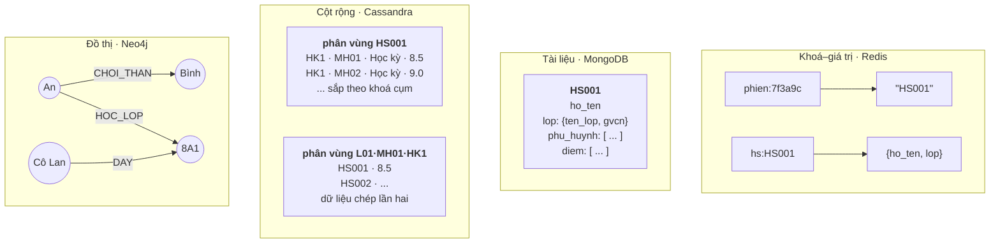
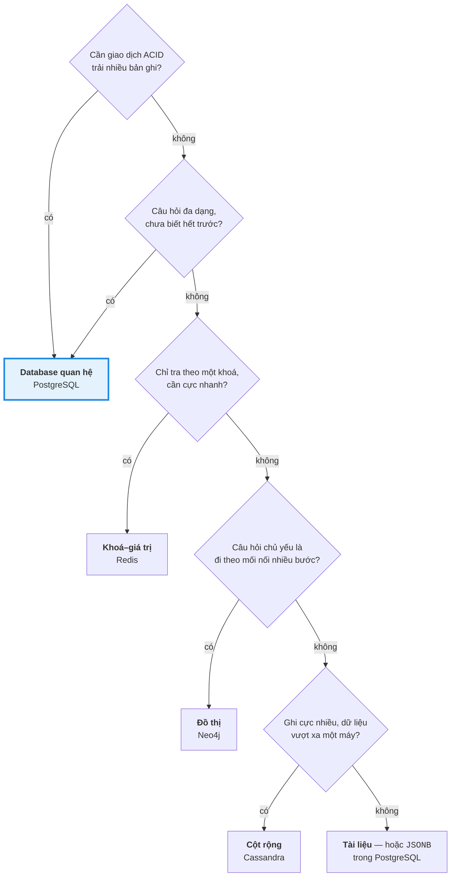

# Bài 47 — NoSQL: bốn họ và cách chọn

!!! abstract "🎯 Học xong bài này, bạn sẽ"
    - Mô tả được mô hình dữ liệu, cách truy vấn tiêu biểu và sản phẩm đại diện của bốn họ NoSQL: **khoá–giá trị** (Redis), **tài liệu** (MongoDB), **cột rộng** (Cassandra, HBase), **đồ thị** (Neo4j)
    - Mô hình lại chính database `truong_hoc` theo từng họ, và chỉ ra điều gì **dễ hơn**, điều gì **khó hơn** so với bản quan hệ
    - Hiểu vì sao NoSQL **cố ý phi chuẩn hoá**: thiết kế bắt đầu từ **câu hỏi sẽ được hỏi**, không bắt đầu từ thực thể
    - Tự dựng một "document store" bằng `JSONB` ngay trong PostgreSQL, và đo tận mắt cái giá của việc chép dữ liệu vào nhiều tài liệu
    - Trả lời được 6 câu hỏi để chọn loại database cho một bài toán — và biết rằng NoSQL là một **đánh đổi khác**, không phải bản "nâng cấp" của SQL

## 🧠 Câu chuyện mở đầu

Phòng giáo vụ đã quen với **sổ bảng**: mỗi cuốn sổ kẻ cột sẵn — sổ học sinh, sổ lớp, sổ điểm — và mỗi thông tin chỉ ghi **ở một chỗ**. Muốn biết điểm Toán của bạn An kèm tên cô chủ nhiệm, cô giáo vụ mở ba cuốn sổ, dò mã học sinh, dò mã lớp. Chậm một chút, nhưng không bao giờ sai: cô chủ nhiệm đổi tên thì chỉ sửa một dòng.

Rồi trường có thêm bốn việc mà sổ bảng làm không thuận tay:

1. **Bảo vệ cổng trường** cần tra thật nhanh: *"thẻ số 1234 là của bạn nào?"*. Bác không cần biết gì thêm. Bác dán một tờ giấy lên tường: số thẻ → tên. Tra một cái là ra.
2. **Cô y tế** muốn mỗi học sinh có **một bìa hồ sơ** nhét đủ mọi thứ: thông tin cá nhân, phụ huynh, tiêm chủng, dị ứng. Bạn thì có ba tờ tiêm chủng, bạn thì có giấy khám mắt, bạn thì không có gì. Mở bìa là đủ, không phải chạy sang phòng khác.
3. **Máy chấm công ở cổng** ghi hàng chục nghìn lượt quẹt thẻ mỗi ngày, của nhiều trường trong quận. Người ta chỉ hỏi đúng một kiểu câu: *"bạn X quẹt thẻ những lúc nào trong tháng này?"*. Họ xếp giấy theo **từng học sinh**, trong mỗi xấp xếp theo **thời gian** — ghi vào cuối xấp là xong, không phải chèn giữa.
4. **Thầy tổng phụ trách** vẽ **sơ đồ bạn bè** lên bảng: mỗi bạn là một chấm, ai chơi thân với ai thì nối một đường. Thầy hỏi: *"bạn của bạn của An, mà chưa phải bạn của An, là những ai?"* — nhìn sơ đồ, lần theo đường nối, thấy ngay.

Cả bốn cách ghi chép đều **tốt hơn sổ bảng** ở đúng việc của nó — và **tệ hơn** ở những việc khác. Tờ giấy của bác bảo vệ không trả lời được *"lớp 8A1 có những ai?"*. Bìa hồ sơ y tế mà ghi cả tên cô chủ nhiệm thì cô đổi lớp, phải sửa bốn mươi bìa. Xấp giấy chấm công không trả lời được *"hôm qua những ai đi muộn?"* nếu không lật từng xấp.

Bốn cách ghi chép đó là bốn họ **NoSQL**.

## 📖 Khái niệm & thuật ngữ

### NoSQL là gì — nhắc lại và nói kỹ hơn

Bài 4 đã giới thiệu **NoSQL** — *"không chỉ có SQL"* — và bốn họ của nó: **khoá–giá trị**, **tài liệu**, **cột rộng**, **đồ thị**. Bài này đi sâu vào từng họ.

Điểm chung thật sự của bốn họ **không** phải là "không dùng SQL" — Cassandra có ngôn ngữ CQL trông rất giống SQL. Điểm chung là chúng **bỏ bớt** một số thứ mà database quan hệ coi là mặc định, để đổi lấy một thứ khác:

| Bỏ bớt | Để đổi lấy |
|---|---|
| Lược đồ cố định khai trước | Mỗi bản ghi có hình dạng riêng, đổi cấu trúc không cần `ALTER TABLE` |
| `JOIN` giữa các bảng | Một lần đọc lấy được đủ dữ liệu, không phải ghép |
| Giao dịch ACID trải nhiều bản ghi (thường là vậy — một số sản phẩm đã thêm lại) | Chia dữ liệu ra hàng trăm máy dễ dàng — **mở rộng ngang** |
| Nhất quán mạnh | **Nhất quán cuối cùng** và tính sẵn sàng khi mạng đứt — định lý CAP ở Bài 44 |
| Truy vấn tuỳ ý | Truy vấn **cực nhanh** — nhưng chỉ cho những câu hỏi đã biết trước |

Dòng cuối là quan trọng nhất. Database quan hệ được thiết kế để trả lời **bất kỳ** câu hỏi nào bạn nghĩ ra sau này. Phần lớn NoSQL được thiết kế để trả lời **thật nhanh một số câu hỏi** bạn đã biết từ lúc thiết kế.

### Thiết kế theo truy vấn — phi chuẩn hoá có chủ đích

Với database quan hệ, bạn bắt đầu từ **thực thể**: có học sinh, có lớp, có điểm — chuẩn hoá tới 3NF, rồi câu hỏi nào cũng trả lời được bằng `JOIN`.

Với phần lớn NoSQL, bạn bắt đầu từ **câu hỏi**: màn hình này cần hiện gì, API kia trả về gì. Rồi bạn sắp dữ liệu sao cho **mỗi câu hỏi đọc đúng một chỗ**. Cách làm này gọi là **thiết kế theo truy vấn** (*query-first design*). Hệ quả tất yếu là **phi chuẩn hoá** — Bài 20: cùng một thông tin được chép vào nhiều nơi, vì mỗi câu hỏi cần nó ở một chỗ khác.

Bài 20 coi phi chuẩn hoá là một **ngoại lệ** có lý do, trên nền một lược đồ đã chuẩn hoá. Trong NoSQL, nó là **mặc định**. Cái giá vẫn y hệt Bài 20: ghi nhiều chỗ hơn, và nguy cơ các bản chép lệch nhau. Chỉ khác là **không có ràng buộc toàn vẹn nào** giữ hộ bạn — ứng dụng phải tự lo.

### Họ 1 — Khoá–giá trị

**Mô hình dữ liệu.** Một cuốn từ điển khổng lồ: mỗi **khoá** là một chuỗi duy nhất, trỏ tới một **giá trị**. Database không hiểu, không cần hiểu bên trong giá trị có gì. Tờ giấy của bác bảo vệ.

**Truy vấn tiêu biểu.** Chỉ có ba việc: đặt giá trị cho một khoá, đọc giá trị của một khoá, xoá một khoá. **Không** có "tìm mọi khoá có giá trị bằng X".

**Sản phẩm đại diện.** **Redis** — giữ toàn bộ dữ liệu trong RAM nên đọc ghi rất nhanh, có tuỳ chọn ghi xuống đĩa định kỳ. Redis không chỉ lưu chuỗi: giá trị có thể là danh sách, tập hợp, bảng băm, hay **tập có thứ tự** (mỗi phần tử kèm một điểm số, luôn được sắp theo điểm). Amazon DynamoDB cũng thường được xếp vào họ này.

Một tính năng đặc trưng: **thời gian sống** (*time to live*, viết tắt **TTL**) — gắn cho một khoá một thời hạn, hết hạn thì khoá tự biến mất. Rất hợp cho phiên đăng nhập, mã OTP, bộ nhớ đệm.

**`truong_hoc` theo kiểu khoá–giá trị.** Không ai đem **cả** database trường học vào Redis. Người ta đặt Redis **cạnh** PostgreSQL, cho những việc nhỏ cần nhanh:

```text
SET phien:7f3a9c "HS001" EX 1800          # phiên đăng nhập, tự hết hạn sau 30 phút
GET phien:7f3a9c                          # → "HS001"

HSET hs:HS001 ho_ten "Nguyễn Văn An" lop "8A1"   # bảng băm: vài trường của một học sinh
HGET hs:HS001 lop                         # → "8A1"

ZADD bxh:toan:8A1 8.5 HS001 9.2 HS002 7.8 HS003   # bảng xếp hạng Toán lớp 8A1
ZRANGE bxh:toan:8A1 0 2 REV WITHSCORES    # → ba bạn điểm cao nhất, đã sắp sẵn
```

So với bản quan hệ: đọc phiên đăng nhập là **một** lần tra khoá trong RAM, không có bộ tối ưu truy vấn, không có đĩa. Nhưng câu *"lớp 8A1 có những ai?"* không có cách nào hỏi — trừ khi bạn **tự** duy trì thêm một khoá `lop:8A1` chứa danh sách mã học sinh, và nhớ sửa nó mỗi khi có bạn chuyển lớp.

**Dùng khi:** bộ nhớ đệm, phiên đăng nhập, đếm lượt truy cập, bảng xếp hạng, hàng đợi đơn giản, giới hạn số lần gọi API.

**Không dùng khi:** dữ liệu có quan hệ với nhau và cần hỏi theo nhiều chiều; dữ liệu là nguồn chân lý duy nhất mà không chịu được mất vài giây cuối khi máy sập (tuỳ cấu hình ghi đĩa).

### Họ 2 — Tài liệu

**Mô hình dữ liệu.** Mỗi bản ghi là một **tài liệu** tự chứa — giống một tệp JSON — gồm các trường, trường có thể chứa đối tượng con hoặc mảng. Các tài liệu cùng loại gom vào một **bộ sưu tập** (*collection*), tương tự một bảng nhưng **không** bắt mọi tài liệu có cùng các trường. Bìa hồ sơ của cô y tế.

Lược đồ vẫn tồn tại — chương trình đọc dữ liệu vẫn phải biết trường nào tên gì — nhưng nó được áp **lúc đọc**, không phải lúc ghi. Người ta gọi đây là **lược đồ khi đọc** (*schema-on-read*), ngược với **lược đồ khi ghi** (*schema-on-write*) của database quan hệ: sai kiểu là bị từ chối ngay từ `INSERT`.

**Sản phẩm đại diện.** **MongoDB**. Nó lưu tài liệu dưới dạng **BSON** (*Binary JSON*) — JSON được mã hoá sang nhị phân, có thêm kiểu ngày giờ, số nguyên 64 bit, dữ liệu nhị phân. Ý tưởng giống hệt `JSONB` của Bài 32: lưu dạng nhị phân đã phân tích sẵn, đọc một trường không phải phân tích lại cả chuỗi. Một tài liệu BSON tối đa 16 MB.

**Nhúng hay tham chiếu.** Câu hỏi thiết kế lớn nhất của họ tài liệu: điểm của học sinh nằm **trong** tài liệu học sinh — **tài liệu lồng** (*embedded document*) — hay nằm ở bộ sưu tập riêng, trỏ về bằng mã — **tham chiếu** (*reference*)?

| | Lồng vào | Tham chiếu |
|---|---|---|
| Đọc cả hồ sơ một học sinh | **Một** lần đọc | Nhiều lần đọc, hoặc `$lookup` — thứ giống `JOIN` nhưng chậm hơn |
| Dữ liệu lớn dần không giới hạn (nhật ký, bình luận) | Nguy hiểm — tài liệu phình tới giới hạn 16 MB | An toàn |
| Dữ liệu dùng chung bởi nhiều tài liệu (tên cô chủ nhiệm) | Chép vào **mỗi** tài liệu — đổi một lần phải sửa nhiều chỗ | Một chỗ duy nhất |

Quy tắc kinh nghiệm: **lồng** những gì luôn được đọc **cùng** tài liệu cha và **thuộc riêng** về nó; **tham chiếu** những gì dùng chung hoặc lớn dần mãi.

**`truong_hoc` theo kiểu tài liệu.** Một tài liệu cho mỗi học sinh:

```javascript
{
  "_id": "HS001",
  "ho_ten": "Nguyễn Văn An",
  "lop": { "ma_lop": "L01", "ten_lop": "8A1", "gvcn": "Nguyễn Thị Lan" },
  "phu_huynh": [
    { "ho_ten": "Nguyễn Văn Thành", "quan_he": "Bố", "sdt": "0912345001" },
    { "ho_ten": "Lê Thị Hạnh",      "quan_he": "Mẹ", "sdt": "0912345002" }
  ],
  "diem": [
    { "mon": "Toán", "loai": "Học kỳ", "hoc_ky": 1, "diem": 8.5 },
    ...
  ]
}
```

```javascript
db.hoc_sinh.find({ "lop.ten_lop": "8A1" })                   // học sinh lớp 8A1
db.hoc_sinh.find({ "_id": "HS001" }, { "phu_huynh": 1 })      // chỉ lấy phụ huynh của HS001
db.hoc_sinh.updateMany({ "lop.ma_lop": "L01" },
                       { $set: { "lop.gvcn": "Vũ Minh Tuấn" } }) // đổi GVCN: sửa NHIỀU tài liệu
```

So với bản quan hệ: 4 bảng (`hoc_sinh`, `lop`, `phu_huynh`, `diem`) gộp thành **một** tài liệu; màn hình "hồ sơ học sinh" đọc đúng một lần. Nhưng tên cô chủ nhiệm giờ nằm trong **mỗi** tài liệu của lớp — phần thực hành sẽ đếm xem là bao nhiêu chỗ.

**Dùng khi:** mỗi bản ghi có cấu trúc riêng và hay đổi — danh mục sản phẩm, hồ sơ người dùng, nội dung bài viết; ứng dụng đọc ghi **nguyên cả** một đối tượng.

**Không dùng khi:** dữ liệu có nhiều quan hệ nhiều–nhiều; cần báo cáo tổng hợp cắt ngang mọi tài liệu thường xuyên; cần ràng buộc toàn vẹn giữa các đối tượng.

### Họ 3 — Cột rộng

**Mô hình dữ liệu.** Tên gọi dễ gây hiểu lầm: đây **không** phải là "lưu theo cột" để phân tích — thứ Bài 48 sẽ gặp. Mô hình của Cassandra là một **bảng được chia mảnh sẵn**: mỗi dòng thuộc về một **phân vùng**, xác định bởi **khoá phân vùng** — đúng khái niệm khoá phân mảnh ở Bài 43, băm ra để chọn máy. Trong một phân vùng, các dòng được **sắp sẵn** trên đĩa theo **khoá sắp xếp cụm** (*clustering key*). Xấp giấy chấm công: mỗi học sinh một xấp — phân vùng — trong xấp xếp theo thời gian — khoá sắp xếp cụm.

**Truy vấn tiêu biểu.** Câu hỏi **phải** chỉ ra khoá phân vùng. *"Mọi lượt quẹt thẻ của HS001 trong tháng 9"* thì cực nhanh: băm `HS001` ra đúng một máy, đọc một đoạn liên tục đã sắp sẵn. *"Mọi lượt quẹt thẻ lúc 7:15 sáng nay, của bất kỳ ai"* thì Cassandra **từ chối**, trừ khi bạn thêm `ALLOW FILTERING` — tức chấp nhận quét mọi máy.

**Sản phẩm đại diện.** **Apache Cassandra** — không có máy chính, mọi máy ngang hàng, nhận ghi ở bất kỳ máy nào, cho chọn mức nhất quán **cho từng câu lệnh** (`ONE`, `QUORUM`, `ALL`) — định lý CAP của Bài 44 thành một nút vặn. **HBase** chạy trên hệ thống tệp phân tán của Hadoop. Cả hai học từ bài báo Bigtable của Google năm 2006.

Họ này ghi rất nhanh vì ghi chỉ là **nối thêm** — vào nhật ký và một bảng trong RAM, định kỳ đổ xuống đĩa thành tệp đã sắp xếp — không bao giờ tìm chỗ để sửa tại chỗ.

**`truong_hoc` theo kiểu cột rộng.** Không có `JOIN`, nên **mỗi câu hỏi một bảng**. Cùng dữ liệu điểm, hai câu hỏi khác nhau, thành hai bảng — dữ liệu được chép hai lần:

```text
-- CQL của Cassandra. Câu hỏi 1: "điểm của một học sinh"
CREATE TABLE diem_theo_hoc_sinh (
    ma_hs   text,
    hoc_ky  int,
    ma_mon  text,
    loai    text,
    diem    decimal,
    PRIMARY KEY ((ma_hs), hoc_ky, ma_mon, loai)    -- (khoá phân vùng), khoá sắp xếp cụm
);

-- Câu hỏi 2: "bảng điểm một môn của một lớp trong một học kỳ"
CREATE TABLE diem_theo_lop_mon (
    ma_lop  text,
    ma_mon  text,
    hoc_ky  int,
    ma_hs   text,
    loai    text,
    diem    decimal,
    PRIMARY KEY ((ma_lop, ma_mon, hoc_ky), ma_hs, loai)
);

SELECT * FROM diem_theo_hoc_sinh WHERE ma_hs = 'HS001';                            -- một phân vùng
SELECT * FROM diem_theo_lop_mon WHERE ma_lop = 'L01' AND ma_mon = 'MH01' AND hoc_ky = 1;
```

Mỗi lần giáo viên nhập một điểm, ứng dụng phải ghi vào **cả hai** bảng. Một câu hỏi thứ ba — *"điểm trung bình Toán của cả trường"* — không có bảng nào phục vụ: phải thêm bảng thứ ba, hoặc chạy một công cụ phân tích riêng quét hết dữ liệu.

**Dùng khi:** ghi cực nhiều, liên tục — nhật ký thiết bị, chấm công, cảm biến, lịch sử tin nhắn; dữ liệu trải trên nhiều trung tâm dữ liệu; câu hỏi ít và biết trước.

**Không dùng khi:** câu hỏi đa dạng, hay thay đổi; cần `JOIN` hoặc tổng hợp tuỳ ý; dữ liệu nhỏ vừa một máy PostgreSQL — khi đó mọi phức tạp của Cassandra chỉ là chi phí.

### Họ 4 — Đồ thị

**Mô hình dữ liệu.** Dữ liệu là các **nút** (*node*) — học sinh, lớp, giáo viên — nối nhau bằng các **cạnh** (*edge*) có tên và có hướng — *HỌC_LỚP*, *CHƠI_THÂN*, *DẠY*. Cả nút và cạnh đều mang thuộc tính. Đây là **đồ thị thuộc tính** (*property graph*) — sơ đồ bạn bè của thầy tổng phụ trách.

Điểm khác biệt cốt lõi: trong database đồ thị, mỗi nút **giữ sẵn** danh sách cạnh của nó. Đi từ một nút sang hàng xóm là **đi theo con trỏ**, không phải tra index như `JOIN`. Một `JOIN` trên bảng lớn tốn chi phí tra B+Tree cỡ log(n); đi một cạnh thì không phụ thuộc bảng lớn bao nhiêu. Khi câu hỏi phải đi **nhiều bước**, khác biệt này cộng dồn.

**Truy vấn tiêu biểu.** Mô tả **hình dạng đường đi** cần tìm. Ngôn ngữ phổ biến nhất là **Cypher** (*Cypher*) của Neo4j — vẽ đường đi bằng ký tự: `(nút)-[:CẠNH]->(nút)`.

**Sản phẩm đại diện.** **Neo4j**. Ngoài ra có Amazon Neptune, JanusGraph; và chuẩn SQL:2023 đã thêm phần truy vấn đồ thị thuộc tính vào chính SQL.

**`truong_hoc` theo kiểu đồ thị.**

```text
// Cypher của Neo4j
// Tạo: học sinh thuộc lớp, giáo viên dạy lớp, học sinh chơi thân với nhau
CREATE (an:HocSinh {ma_hs: 'HS001', ho_ten: 'Nguyễn Văn An'})
CREATE (l:Lop {ma_lop: 'L01', ten_lop: '8A1'})
CREATE (an)-[:HOC_LOP]->(l)
...

// Giáo viên nào dạy lớp của An?
MATCH (:HocSinh {ma_hs: 'HS001'})-[:HOC_LOP]->(:Lop)<-[:DAY]-(g:GiaoVien)
RETURN g.ho_ten;

// Bạn của bạn của An, mà chưa phải bạn của An — gợi ý kết bạn
MATCH (an:HocSinh {ma_hs: 'HS001'})-[:CHOI_THAN]-(ban)-[:CHOI_THAN]-(goi_y)
WHERE goi_y <> an AND NOT (an)-[:CHOI_THAN]-(goi_y)
RETURN DISTINCT goi_y.ho_ten;

// Mọi bạn nối được với An qua tối đa 4 bước
MATCH (:HocSinh {ma_hs: 'HS001'})-[:CHOI_THAN*1..4]-(x) RETURN DISTINCT x.ho_ten;
```

So với bản quan hệ: *"bạn của bạn"* trong SQL là hai lần `JOIN` một bảng `choi_than` với chính nó; *"tối đa 4 bước"* là một CTE đệ quy ở Bài 28 — viết được, nhưng dài và mỗi bước lại tra index. Ngược lại, *"điểm trung bình Toán của từng lớp"* — thứ SQL làm trong một dòng `GROUP BY` — không phải thế mạnh của database đồ thị.

**Dùng khi:** câu hỏi xoay quanh **mối nối** và đi nhiều bước — mạng xã hội, gợi ý, phát hiện gian lận (chuỗi tài khoản chuyển tiền vòng vòng), sơ đồ phụ thuộc, bản đồ đường đi.

**Không dùng khi:** câu hỏi chủ yếu là lọc và tổng hợp trên nhiều bản ghi; dữ liệu cực lớn cần chia mảnh — chia một đồ thị ra nhiều máy mà không cắt ngang quá nhiều cạnh là bài toán rất khó.

### Không phải "thay thế" — mà là dùng đúng chỗ

Một hệ thống thật hiếm khi chọn **một**. Cổng thông tin của một sở giáo dục có thể dùng PostgreSQL làm nguồn chân lý cho học sinh và điểm, Redis cho phiên đăng nhập, Cassandra cho dữ liệu chấm công của hàng trăm trường, và một database đồ thị cho gợi ý. Cách làm này gọi là **dùng nhiều loại database** (*polyglot persistence*). Cái giá: nhiều hệ thống phải vận hành, sao lưu, giám sát; và dữ liệu chảy giữa chúng — chủ đề của Bài 49.

Ranh giới cũng đang mờ đi. PostgreSQL có `JSONB` và index GIN — Bài 32 — nên làm được phần lớn việc của một document store. MongoDB đã có giao dịch nhiều tài liệu. Nhiều database quan hệ phân tán mới chia mảnh tự động như Cassandra mà vẫn giữ SQL và ACID. Câu hỏi đúng không phải là *"SQL hay NoSQL"* mà là: **bài toán này cần bảo đảm gì, và sẵn sàng đánh đổi gì?**

### Sáu câu hỏi để chọn database

Trước khi chọn, trả lời lần lượt sáu câu. Câu nào trả lời "có" ở cột giữa thì nghiêng hẳn về lựa chọn ở cột phải:

| # | Câu hỏi | Nếu "có" thì nghiêng về |
|---|---|---|
| 1 | Có cần giao dịch ACID trải trên **nhiều** bản ghi không — tiền, tồn kho, chỗ ngồi? | Database quan hệ |
| 2 | Câu hỏi có **đa dạng**, hay thay đổi, chưa biết hết lúc thiết kế không — báo cáo, thống kê? | Database quan hệ |
| 3 | Có phải chỉ **tra theo một khoá**, cần trả lời trong phần nghìn giây, dữ liệu mất được hoặc dựng lại được? | Khoá–giá trị |
| 4 | Câu hỏi có xoay quanh **mối nối** và phải đi **nhiều bước** không — bạn của bạn, chuỗi chuyển tiền? | Đồ thị |
| 5 | Có ghi **cực nhiều**, liên tục, vượt xa sức một máy, với vài kiểu câu hỏi cố định không? | Cột rộng |
| 6 | Mỗi bản ghi có **hình dạng riêng**, hay đổi cấu trúc, và thường được đọc ghi nguyên cả khối không? | Tài liệu — hoặc cột `JSONB` trong PostgreSQL |

Không câu nào trả lời "có" rõ ràng, hoặc nhiều câu mâu thuẫn nhau? Bắt đầu bằng database quan hệ. Nó hiếm khi là lựa chọn **tốt nhất** cho một câu hỏi, nhưng rất hiếm khi là lựa chọn **tệ** cho cả hệ thống — và chuyển từ quan hệ sang NoSQL khi đã đo được giới hạn thật dễ hơn nhiều so với chiều ngược lại.

### Bảng thuật ngữ

| Tiếng Việt | English | Nghĩa dễ hiểu |
|---|---|---|
| Thiết kế theo truy vấn | *query-first design* | Sắp dữ liệu theo câu hỏi sẽ được hỏi, mỗi câu đọc một chỗ; hệ quả là phi chuẩn hoá có chủ đích |
| Thời gian sống | *time to live* (TTL) | Thời hạn gắn cho một khoá; hết hạn thì tự biến mất |
| Bộ sưu tập | *collection* | Nhóm tài liệu cùng loại trong MongoDB, tương tự một bảng nhưng không ép cùng các trường |
| Lược đồ khi đọc | *schema-on-read* | Dữ liệu ghi vào không bị kiểm cấu trúc; chương trình đọc tự hiểu cấu trúc |
| Lược đồ khi ghi | *schema-on-write* | Cấu trúc khai trước và bị kiểm ngay lúc ghi — cách của database quan hệ |
| BSON | *Binary JSON* | JSON mã hoá nhị phân kèm thêm kiểu dữ liệu, dạng lưu trữ của MongoDB |
| Tài liệu lồng | *embedded document* | Đối tượng con nằm ngay trong tài liệu cha, đọc cùng một lần |
| Tham chiếu | *reference* | Lưu mã của tài liệu khác thay vì chép nội dung của nó |
| Khoá sắp xếp cụm | *clustering key* | Trong Cassandra: thứ tự các dòng được sắp sẵn trên đĩa bên trong một phân vùng |
| Nút | *node* | Một đối tượng trong database đồ thị — học sinh, lớp — mang thuộc tính |
| Cạnh | *edge* | Mối nối có tên và hướng giữa hai nút, cũng mang thuộc tính |
| Đồ thị thuộc tính | *property graph* | Mô hình đồ thị mà cả nút lẫn cạnh đều có nhãn và thuộc tính |
| Cypher | *Cypher* | Ngôn ngữ truy vấn đồ thị của Neo4j, vẽ đường đi bằng ký tự `()-[]->()` |
| Dùng nhiều loại database | *polyglot persistence* | Một hệ thống dùng nhiều database khác họ, mỗi loại cho đúng việc của nó |

## 🖼️ Sơ đồ

Cùng một học sinh `HS001`, bốn cách sắp dữ liệu:



Cách chọn database — đi từ câu hỏi quan trọng nhất:



Sơ đồ chỉ là điểm xuất phát: khi không chắc, mũi tên đầu tiên đã dẫn về database quan hệ — và đó là cố ý.

## 💻 Thực hành

Không có Redis, MongoDB, Cassandra hay Neo4j trên máy khoá học. Nhưng Bài 32 đã cho thấy PostgreSQL có `JSONB`. Phần này dựng một **document store** thu nhỏ ngay trong PostgreSQL: mỗi học sinh một tài liệu, gồm lớp, phụ huynh và mọi điểm — rồi đo cái được và cái mất.

### Dựng bộ sưu tập hồ sơ học sinh

Mỗi tài liệu được ghép từ bốn bảng quan hệ. `jsonb_agg` gom nhiều dòng thành một mảng JSON; học sinh không có phụ huynh nhận mảng rỗng `[]` thay vì `NULL`:

```sql
DROP TABLE IF EXISTS b47_ho_so CASCADE;
CREATE TABLE b47_ho_so (
    ma_hs    CHAR(5) PRIMARY KEY,
    tai_lieu JSONB   NOT NULL
);

INSERT INTO b47_ho_so (ma_hs, tai_lieu)
SELECT h.ma_hs,
       jsonb_build_object(
           'ma_hs',  h.ma_hs,
           'ho_ten', h.ho_ten,
           'lop',    jsonb_build_object('ma_lop', l.ma_lop, 'ten_lop', l.ten_lop, 'gvcn', g.ho_ten),
           'phu_huynh', COALESCE(
               (SELECT jsonb_agg(jsonb_build_object('ho_ten', p.ho_ten, 'quan_he', p.quan_he,
                                                    'sdt', p.so_dien_thoai) ORDER BY p.ma_ph)
                FROM phu_huynh p WHERE p.ma_hs = h.ma_hs),
               '[]'::jsonb),
           'diem', (SELECT jsonb_agg(jsonb_build_object('mon', m.ten_mon, 'loai', d.loai_diem,
                                                        'hoc_ky', d.hoc_ky, 'diem', d.diem_so)
                                     ORDER BY d.ma_diem)
                    FROM diem d JOIN mon_hoc m ON m.ma_mon = d.ma_mon
                    WHERE d.ma_hs = h.ma_hs)
       )
FROM hoc_sinh h
JOIN lop l            ON l.ma_lop = h.ma_lop
LEFT JOIN giao_vien g ON g.ma_gv  = l.ma_gvcn;

-- KỲ VỌNG: so_tai_lieu = 40
SELECT count(*) AS so_tai_lieu FROM b47_ho_so;
```

**40** tài liệu, mỗi học sinh một. Xem thử tài liệu của `HS001`:

```sql
-- KỲ VỌNG: 1 dòng
SELECT jsonb_pretty(tai_lieu) AS ho_so FROM b47_ho_so WHERE ma_hs = 'HS001';
```

Kết quả dài — đây là phần đầu và phần cuối (điểm được sinh ngẫu nhiên có hạt giống cố định, nên trên máy bạn cũng ra đúng những con số này nếu nạp dataset chuẩn):

```text
{
    "lop": {
        "gvcn": "Nguyễn Thị Lan",
        "ma_lop": "L01",
        "ten_lop": "8A1"
    },
    "diem": [
        {
            "mon": "Toán",
            "diem": 8.50,
            "loai": "Học kỳ",
            "hoc_ky": 1
        },
        ... 11 phần tử nữa ...
    ],
    "ma_hs": "HS001",
    "ho_ten": "Nguyễn Văn An",
    "phu_huynh": [
        { "sdt": "0912345001", "ho_ten": "Nguyễn Văn Thành", "quan_he": "Bố" },
        { "sdt": "0912345002", "ho_ten": "Lê Thị Hạnh", "quan_he": "Mẹ" }
    ]
}
```

Để ý: thứ tự các trường **không** giữ như lúc ghi — `JSONB` sắp lại khoá khi lưu dạng nhị phân, Bài 32 đã nói.

### Cái được: một lần đọc, và mỗi tài liệu một hình dạng

Màn hình "hồ sơ học sinh" của `HS040` — tên, lớp, số phụ huynh, số đầu điểm — là **một** lần đọc theo khoá chính, không có `JOIN` nào:

```sql
-- KỲ VỌNG: ho_ten = Đinh Thị Vân
-- KỲ VỌNG: lop = 9A3
-- KỲ VỌNG: so_phu_huynh = 0
-- KỲ VỌNG: so_diem = 12
SELECT tai_lieu ->> 'ho_ten'                      AS ho_ten,
       tai_lieu -> 'lop' ->> 'ten_lop'             AS lop,
       jsonb_array_length(tai_lieu -> 'phu_huynh') AS so_phu_huynh,
       jsonb_array_length(tai_lieu -> 'diem')      AS so_diem
FROM b47_ho_so WHERE ma_hs = 'HS040';
```

`HS040` — học sinh cố ý không có phụ huynh của dataset — có mảng phụ huynh **rỗng**; các bạn khác có một hoặc hai phần tử. Không cần cột nào `NULL`, không cần bảng nào riêng.

Thêm một trường chỉ **một** học sinh có — giấy khám mắt, như bìa hồ sơ của cô y tế — cũng không cần `ALTER TABLE`:

```sql
UPDATE b47_ho_so
SET tai_lieu = tai_lieu || '{"kham_mat": {"ngay": "2026-09-20", "can_thi": true}}'
WHERE ma_hs = 'HS001';

-- KỲ VỌNG: co_kham_mat = 1
-- KỲ VỌNG: khong_co = 39
SELECT count(*) FILTER (WHERE tai_lieu ? 'kham_mat')     AS co_kham_mat,
       count(*) FILTER (WHERE NOT tai_lieu ? 'kham_mat') AS khong_co
FROM b47_ho_so;
```

Toán tử `?` — Bài 32 — hỏi tài liệu có khoá đó không. Đây chính là **lược đồ khi đọc**: database nhận mọi hình dạng; chương trình đọc phải tự biết rằng `kham_mat` có thể có hoặc không.

### Cái mất 1: dữ liệu dùng chung bị chép nhiều lần

Tên cô chủ nhiệm lớp 8A1 nằm trong bao nhiêu tài liệu? Toán tử `@>` — "chứa" — tìm các tài liệu có đoạn con khớp:

```sql
-- KỲ VỌNG: so_tai_lieu_chua_ten_co = 6
-- KỲ VỌNG: so_dong_quan_he_can_sua = 1
SELECT (SELECT count(*) FROM b47_ho_so
        WHERE tai_lieu @> '{"lop": {"gvcn": "Nguyễn Thị Lan"}}') AS so_tai_lieu_chua_ten_co,
       (SELECT count(*) FROM lop WHERE ma_gvcn = 'GV01')          AS so_dong_quan_he_can_sua;
```

Trong bản quan hệ, tên cô Lan nằm ở **một** dòng của `giao_vien`, và lớp 8A1 trỏ tới cô bằng **một** dòng của `lop`. Trong bản tài liệu, tên cô được chép vào **6** tài liệu — mỗi học sinh 8A1 một bản. Năm sau lớp 8A1 đổi chủ nhiệm thành thầy Tuấn; bản quan hệ sửa 1 dòng, bản tài liệu phải sửa cả 6:

```sql
UPDATE b47_ho_so
SET tai_lieu = jsonb_set(tai_lieu, '{lop,gvcn}', '"Vũ Minh Tuấn"')
WHERE tai_lieu @> '{"lop": {"ma_lop": "L01"}}';

-- KỲ VỌNG: da_doi = 6
-- KỲ VỌNG: con_ten_cu = 0
SELECT count(*) FILTER (WHERE tai_lieu -> 'lop' ->> 'gvcn' = 'Vũ Minh Tuấn')   AS da_doi,
       count(*) FILTER (WHERE tai_lieu -> 'lop' ->> 'gvcn' = 'Nguyễn Thị Lan') AS con_ten_cu
FROM b47_ho_so;
```

Ở đây một câu `UPDATE` sửa được cả 6 vì chúng nằm chung một bảng, trong một giao dịch. Trong một document store thật chia trên nhiều máy, 6 tài liệu đó có thể nằm ở 6 máy khác nhau — và nếu tiến trình sửa sập giữa chừng, 3 bạn thấy thầy Tuấn, 3 bạn vẫn thấy cô Lan. Không có khoá ngoại nào báo lỗi. Đây là **bất thường cập nhật** của Bài 2, quay lại đúng như cũ.

### Cái mất 2: câu hỏi cắt ngang mọi tài liệu

Câu hỏi *"trường có bao nhiêu đầu điểm Toán?"* không nằm gọn trong một tài liệu nào. Phải **mở tung** mảng `diem` của từng tài liệu ra thành dòng — `jsonb_array_elements`, kết nối ngang của Bài 32 — rồi mới lọc và đếm. So với bảng quan hệ:

```sql
-- KỲ VỌNG: tu_tai_lieu = 80
-- KỲ VỌNG: tu_bang_quan_he = 80
SELECT (SELECT count(*)
        FROM b47_ho_so hs
        CROSS JOIN LATERAL jsonb_array_elements(hs.tai_lieu -> 'diem') AS d(phan_tu)
        WHERE d.phan_tu ->> 'mon' = 'Toán')                         AS tu_tai_lieu,
       (SELECT count(*) FROM diem WHERE ma_mon = 'MH01')            AS tu_bang_quan_he;
```

Cùng đáp số **80** — 40 điểm học kỳ và 40 điểm một tiết. PostgreSQL vẫn trả lời được vì nó là database quan hệ, có `LATERAL` và bộ tối ưu truy vấn. Nhưng để ý: câu hỏi trên tài liệu phải **đọc toàn bộ 40 tài liệu**, kể cả phụ huynh, tên lớp — mọi thứ không liên quan tới điểm Toán. Với 40 tài liệu thì không sao; với 40 triệu thì đây là lý do người ta chép dữ liệu sang một hệ thống khác để phân tích — Bài 48.

## ⚠️ Lỗi thường gặp

!!! danger "Lỗi 1: Chọn NoSQL vì \"nó scale tốt hơn\" khi dữ liệu vừa một máy"
    Một ứng dụng quản lý điểm cho một trường — vài chục nghìn dòng — được dựng trên Cassandra vì *"sau này có thể lớn"*. Ba tháng sau, mỗi báo cáo mới đòi một bảng mới, mỗi lần nhập điểm ghi vào bốn bảng, và không ai trả lời được *"lớp nào có điểm trung bình thấp nhất?"* mà không viết chương trình quét toàn bộ.

    Sửa: một máy PostgreSQL xử lý thoải mái hàng trăm triệu dòng, cộng bản sao chỉ đọc ở Bài 42 và phân vùng ở Bài 43. Chỉ chuyển sang NoSQL khi đo được một giới hạn thật sự, hoặc khi mô hình dữ liệu của bài toán **vốn dĩ** là khoá–giá trị, tài liệu hay đồ thị.

!!! danger "Lỗi 2: Thiết kế NoSQL theo thực thể như thiết kế SQL"
    Chuyển từ PostgreSQL sang MongoDB bằng cách biến **mỗi bảng thành một bộ sưu tập**, giữ nguyên các mã tham chiếu. Kết quả: mỗi màn hình phải đọc bốn bộ sưu tập rồi tự ghép trong code ứng dụng — chậm hơn `JOIN` của PostgreSQL, và mất luôn khoá ngoại.

    Sửa: NoSQL bắt đầu từ **câu hỏi**. Liệt kê các màn hình và API trước, rồi quyết định lồng hay tham chiếu cho từng mảnh dữ liệu theo cách nó được đọc.

!!! warning "Lỗi 3: Lồng dữ liệu lớn dần mãi vào một tài liệu"
    Tài liệu học sinh lồng **mọi** lượt điểm danh — mỗi ngày thêm một phần tử. Sau vài năm, tài liệu phình lên, mỗi lần đọc hồ sơ phải kéo theo hàng nghìn lượt điểm danh không ai cần xem, và cuối cùng chạm giới hạn 16 MB của một tài liệu BSON.

    Sửa: chỉ lồng những gì có **giới hạn** và luôn được đọc cùng tài liệu cha. Dữ liệu tăng không giới hạn — điểm danh, nhật ký, bình luận — tách ra bộ sưu tập riêng, tham chiếu về bằng mã.

!!! warning "Lỗi 4: Tin rằng NoSQL \"không có lược đồ\""
    Mỗi lập trình viên ghi tài liệu theo ý mình: người viết `"ho_ten"`, người viết `"hoTen"`, người lưu điểm là chuỗi `"8.5"`, người lưu là số. Database nhận hết. Một năm sau, câu lọc `diem > 8` bỏ sót một nửa số điểm mà không báo lỗi gì.

    Sửa: lược đồ **luôn** tồn tại — nếu không ở database thì ở trong code, và ở trong code thì mỗi người một bản. Dùng tính năng kiểm tra lược đồ mà sản phẩm có (MongoDB có kiểm tra theo JSON Schema; với `JSONB` trong PostgreSQL thì dùng ràng buộc `CHECK` như Bài 32), và ghi tài liệu qua một lớp code dùng chung.

!!! warning "Lỗi 5: Hỏi Cassandra một câu không có khoá phân vùng"
    Bảng `diem_theo_hoc_sinh` phân vùng theo `ma_hs`. Ai đó cần *"mọi điểm dưới 5"*, thêm `ALLOW FILTERING` cho câu lệnh chạy được. Trên máy thử có ít dữ liệu, nó nhanh. Trên cụm thật, nó quét **mọi** phân vùng trên **mọi** máy và làm chậm cả cụm.

    Sửa: câu hỏi mới trong họ cột rộng nghĩa là **bảng mới** được thiết kế cho nó, hoặc chép dữ liệu sang một hệ thống phân tích. `ALLOW FILTERING` trên bảng lớn gần như luôn là dấu hiệu thiết kế sai.

## ✍️ Bài tập

1. Với mỗi nhu cầu sau, chọn họ database phù hợp nhất — hoặc PostgreSQL — và giải thích bằng một câu: (a) lưu mã OTP gửi qua tin nhắn, hết hạn sau 5 phút; (b) lịch sử vị trí GPS của 2.000 xe đưa đón học sinh, mỗi xe gửi một điểm mỗi 5 giây; (c) phát hiện nhóm tài khoản nộp học phí hộ nhau theo vòng tròn; (d) học phí và công nợ của từng học sinh; (e) kho đề thi, mỗi đề có cấu trúc khác nhau — trắc nghiệm, tự luận, ghép cặp, kèm hình ảnh.

2. Thiết kế tài liệu MongoDB cho **sách thư viện** và **lượt mượn**: lồng lượt mượn vào tài liệu sách, lồng vào tài liệu học sinh, hay tách riêng? Cân nhắc hai câu hỏi hay gặp nhất: *"sách này đang ở tay ai?"* và *"em này đang mượn những sách gì?"*.

3. Thiết kế bảng Cassandra (viết `PRIMARY KEY`) cho câu hỏi: *"danh sách học sinh đi muộn của một lớp trong một ngày, sắp theo giờ đến"*. Chỉ ra khoá phân vùng và khoá sắp xếp cụm. Câu hỏi *"học sinh X đi muộn những ngày nào?"* có dùng được bảng đó không?

4. Viết câu SQL trên `b47_ho_so` liệt kê **tên** các học sinh có ít nhất một điểm **dưới 5**, không trùng tên, sắp theo mã học sinh. Rồi viết câu tương đương trên các bảng quan hệ `hoc_sinh` và `diem`, và chứng minh hai câu cho **cùng** tập học sinh.

5. Bạn của bạn lớp trưởng đề xuất: *"Bỏ PostgreSQL, chuyển toàn bộ `truong_hoc` sang MongoDB, vì NoSQL nhanh hơn."* Dùng sáu câu hỏi chọn database ở phần Khái niệm để phản biện: phần nào của `truong_hoc` hợp với tài liệu, phần nào nhất định nên ở lại database quan hệ?

??? success "Đáp án"
    **Câu 1.**

    - (a) **Khoá–giá trị** — Redis với `SET otp:<số điện thoại> <mã> EX 300`. Tra đúng một khoá, tự hết hạn nhờ TTL, không cần giữ lâu.
    - (b) **Cột rộng** — Cassandra, khoá phân vùng là mã xe (kèm ngày để phân vùng không phình mãi), khoá sắp xếp cụm là thời gian. 2.000 xe × 12 điểm mỗi phút là 24.000 lượt ghi mỗi phút, chỉ nối thêm; câu hỏi gần như luôn là *"hành trình của xe X hôm nay"*.
    - (c) **Đồ thị** — tìm chu trình trong đồ thị *"tài khoản A nộp hộ tài khoản B"* là truy vấn đường đi nhiều bước, đúng sở trường của Cypher.
    - (d) **PostgreSQL** — tiền bạc cần giao dịch ACID, ràng buộc, và báo cáo tuỳ ý cho kế toán.
    - (e) **Tài liệu** — mỗi đề một hình dạng. Nhưng `JSONB` trong PostgreSQL cũng làm tốt việc này nếu phần còn lại của hệ thống đã ở PostgreSQL.

    **Câu 2.** Tách lượt mượn thành **bộ sưu tập riêng**, mỗi tài liệu một lượt mượn, tham chiếu `ma_sach` và `ma_hs`. Lý do: lượt mượn **tăng mãi** — lồng vào sách hay vào học sinh đều làm tài liệu phình không giới hạn. Để trả lời hai câu hỏi nhanh, có thể phi chuẩn hoá có kiểm soát: trong tài liệu sách thêm trường `dang_muon_boi: {ma_hs, ho_ten}` — chỉ **lượt đang mượn**, có giới hạn — và trong tài liệu học sinh thêm mảng `dang_muon` chứa các sách chưa trả, thường chỉ vài cuốn. Cái giá: mỗi lần mượn hoặc trả phải sửa **ba** tài liệu, và phải nghĩ tới trường hợp sửa được một nửa thì sập.

    **Câu 3.**

    ```text
    CREATE TABLE di_muon_theo_lop_ngay (
        ma_lop  text,
        ngay    date,
        gio_den time,
        ma_hs   text,
        ho_ten  text,
        PRIMARY KEY ((ma_lop, ngay), gio_den, ma_hs)
    );
    ```

    Khoá phân vùng `(ma_lop, ngay)`: mỗi lớp mỗi ngày một phân vùng nhỏ. Khoá sắp xếp cụm `gio_den, ma_hs`: sắp sẵn theo giờ đến; thêm `ma_hs` để hai bạn đến cùng giây không đè lên nhau — khoá chính trong Cassandra trùng nhau thì bản ghi sau **ghi đè** bản trước, không báo lỗi. Câu hỏi *"học sinh X đi muộn những ngày nào?"* **không** dùng được bảng này: nó không chỉ ra khoá phân vùng. Phải có bảng thứ hai, phân vùng theo `ma_hs`, và ứng dụng ghi vào cả hai.

    **Câu 4.**

    ```sql
    -- KỲ VỌNG: khop = true
    -- KỲ VỌNG: so_hoc_sinh_tu_tai_lieu = 34
    WITH tu_tai_lieu AS (
        SELECT DISTINCT hs.ma_hs, hs.tai_lieu ->> 'ho_ten' AS ho_ten
        FROM b47_ho_so hs
        CROSS JOIN LATERAL jsonb_array_elements(hs.tai_lieu -> 'diem') AS d(phan_tu)
        WHERE (d.phan_tu ->> 'diem')::numeric < 5
    ),
    tu_quan_he AS (
        SELECT DISTINCT h.ma_hs, h.ho_ten
        FROM hoc_sinh h JOIN diem d ON d.ma_hs = h.ma_hs
        WHERE d.diem_so < 5
    )
    SELECT (SELECT count(*) FROM tu_tai_lieu) AS so_hoc_sinh_tu_tai_lieu,
           NOT EXISTS (SELECT * FROM tu_tai_lieu EXCEPT SELECT * FROM tu_quan_he)
           AND NOT EXISTS (SELECT * FROM tu_quan_he EXCEPT SELECT * FROM tu_tai_lieu) AS khop;
    ```

    Hai `EXCEPT` theo hai chiều đều rỗng nghĩa là hai tập **bằng nhau**. Để ý phép ép kiểu `::numeric`: trong tài liệu, `->>` trả về **chuỗi**; so sánh chuỗi `'10.00' < '5'` cho kết quả **đúng** theo thứ tự chữ cái — một lỗi rất dễ mắc khi dữ liệu không có lược đồ ép kiểu. Muốn in danh sách tên thì chạy riêng `SELECT ho_ten FROM tu_tai_lieu ORDER BY ma_hs`.

    **Câu 5.** Đi qua 6 câu hỏi:

    - *Cần giao dịch ACID nhiều bản ghi?* Có — mượn sách trừ `so_luong` và thêm lượt mượn cùng lúc; nhập điểm cả lớp một lần. Nghiêng về PostgreSQL.
    - *Câu hỏi đa dạng, chưa biết trước?* Rất đa dạng — thống kê theo lớp, theo môn, theo học kỳ, theo giáo viên, ai chưa trả sách... Đây là thế mạnh của SQL.
    - *Tra theo một khoá, cần cực nhanh?* Chỉ phiên đăng nhập — đặt Redis bên cạnh.
    - *Đi theo mối nối nhiều bước?* Không có.
    - *Ghi cực nhiều, vượt một máy?* Không — một trường vài trăm học sinh.
    - *Cấu trúc bản ghi khác nhau, hay đổi?* Chỉ vài phần: hồ sơ y tế, kho đề thi — dùng cột `JSONB` ngay trong PostgreSQL.

    Kết luận: giữ PostgreSQL làm nguồn chân lý. "NoSQL nhanh hơn" chỉ đúng với **đúng loại câu hỏi** nó được thiết kế cho — và `truong_hoc` phần lớn không phải loại đó.

### Dọn dẹp cuối bài

```sql
DROP TABLE IF EXISTS b47_ho_so CASCADE;

-- KỲ VỌNG: bang_con_lai = 0
SELECT count(*) AS bang_con_lai FROM information_schema.tables WHERE table_name LIKE 'b47\_%';
```

## 🔑 Tóm tắt

1. **NoSQL** bỏ bớt lược đồ cố định, `JOIN`, giao dịch nhiều bản ghi hoặc nhất quán mạnh để đổi lấy mở rộng ngang và tốc độ cho **những câu hỏi biết trước**; thiết kế đi từ câu hỏi — **thiết kế theo truy vấn** — nên phi chuẩn hoá là mặc định.
2. **Khoá–giá trị** (Redis): tra một khoá cực nhanh, có **TTL** — bộ nhớ đệm, phiên đăng nhập. **Tài liệu** (MongoDB, lưu **BSON**): mỗi bản ghi tự chứa, **lược đồ khi đọc**, cân nhắc **lồng** hay **tham chiếu**.
3. **Cột rộng** (Cassandra, HBase): khoá phân vùng chọn máy, **khoá sắp xếp cụm** sắp sẵn dữ liệu — ghi cực nhiều, mỗi câu hỏi một bảng. **Đồ thị** (Neo4j, **Cypher**): **nút** và **cạnh** giữ sẵn con trỏ — mạnh khi đi nhiều bước.
4. Thực hành với `JSONB`: hồ sơ `HS040` đọc một lần không cần `JOIN`, nhưng tên cô chủ nhiệm 8A1 bị chép vào **6** tài liệu thay vì **1** dòng, và câu hỏi cắt ngang phải mở tung cả 40 tài liệu.
5. Sáu câu hỏi chọn database: cần ACID nhiều bản ghi? câu hỏi đa dạng chưa biết trước? chỉ tra theo khoá? đi theo mối nối? ghi vượt một máy? cấu trúc bản ghi khác nhau? — không chắc thì bắt đầu bằng database quan hệ; NoSQL là **đánh đổi khác**, và hệ thống thật thường **dùng nhiều loại database**.

---

⬅️ [Bài 46 — Consensus và Raft](46-consensus-va-raft.md) · ➡️ **Bài 48** *(sắp có)*
