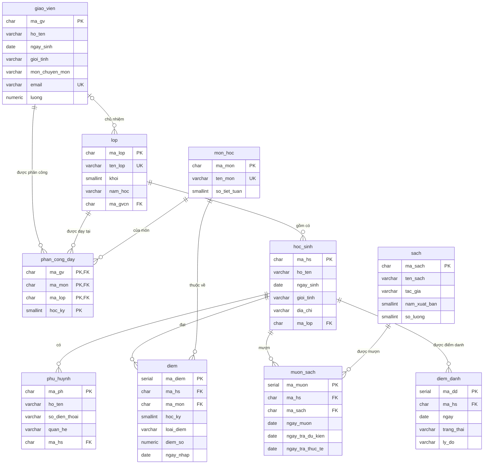

# Database mẫu `truong_hoc`

Toàn bộ 51 bài học đều dùng chung **một** cơ sở dữ liệu duy nhất: `truong_hoc`, mô phỏng hệ thống quản lý của một trường THCS.

!!! question "Vì sao chỉ dùng một database cho cả khóa học?"
    Vì mỗi lần đổi bối cảnh là một lần bạn phải học lại "ai là ai, bảng nào chứa gì". Dùng cố định một bộ dữ liệu, bạn chỉ tốn công làm quen **một lần** ở đây, rồi dành toàn bộ sức chú ý cho khái niệm mới của từng bài.

    Phần thưởng đến ở Cấp 4: chính cái database bạn đã thuộc lòng sẽ được đem ra mổ xẻ — đánh index cho nó, đọc `EXPLAIN` của nó, rồi ở Cấp 5 là chia nhỏ nó ra nhiều máy.

## Ba file dữ liệu

| File | Dùng cho | Nội dung |
|---|---|---|
| `dataset/01-chua-chuan-hoa.sql` | **Cấp 2** (Bài 16–20) | Một bảng bẹt duy nhất, cố ý thiết kế tồi. Đây là "bệnh nhân" để bạn thực hành chuẩn hoá. |
| `dataset/02-chuan-hoa.sql` | **Bài 5 trở đi** | Lược đồ 10 bảng đã chuẩn hoá + dữ liệu mẫu. Đây là bản chính. |
| `dataset/03-du-lieu-lon.sql` | **Cấp 4–5** (Bài 33+) | Sinh 500.000 dòng điểm. Cần dữ liệu lớn thì index và `EXPLAIN` mới có ý nghĩa. |

Tải về tại [thư mục `dataset/` trên GitHub](https://github.com/hungnguyen010518/database-tu-a-z/tree/main/dataset). Hướng dẫn cài đặt và nạp nằm ở **Bài 5**.

## Sơ đồ quan hệ thực thể

Đây là **biểu đồ ER** (*ER diagram*) của toàn bộ database, vẽ theo ký hiệu Crow's Foot. Bây giờ bạn chưa cần hiểu các ký hiệu ở hai đầu đường nối — Bài 11 sẽ dạy kỹ. Cứ quay lại trang này khi cần tra cứu.

## Mười bảng làm gì?

| Bảng | Giải thích đời thường | Số dòng mẫu |
|---|---|---|
| `giao_vien` | Danh sách thầy cô trong trường | 8 |
| `lop` | Các lớp học, kèm giáo viên chủ nhiệm | 6 |
| `hoc_sinh` | Danh sách học sinh, mỗi bạn thuộc một lớp | 40 |
| `phu_huynh` | Bố mẹ / ông bà của học sinh, kèm số điện thoại | 45 |
| `mon_hoc` | Các môn được dạy và số tiết mỗi tuần | 9 |
| `phan_cong_day` | Thầy nào dạy môn nào cho lớp nào, học kỳ mấy | 64 |
| `diem` | Từng con điểm của từng học sinh ở từng môn | 480 |
| `sach` | Kho sách thư viện | 20 |
| `muon_sach` | Từng lượt mượn — ai mượn cuốn nào, đã trả chưa | 50 |
| `diem_danh` | Mỗi ngày mỗi học sinh có mặt hay vắng | 200 |

## Ba chi tiết được cài sẵn có chủ đích

Dữ liệu mẫu không phải sinh ngẫu nhiên hoàn toàn. Ba tình huống sau được **cố ý** đặt vào, vì các bài học cần chúng:

!!! info "1. Lớp `9A3` chưa có giáo viên chủ nhiệm"
    Cột `lop.ma_gvcn` của lớp này là `NULL`. Nhờ vậy ở **Bài 25** bạn sẽ thấy rõ sự khác nhau giữa `INNER JOIN` (lớp này biến mất) và `LEFT JOIN` (lớp này vẫn hiện, phần giáo viên để trống).

!!! info "2. Học sinh `HS040` — Đinh Thị Vân — không có phụ huynh nào trong hệ thống"
    Dùng để dạy `NOT EXISTS` và `LEFT JOIN ... IS NULL` ở **Bài 27**, và để minh hoạ vì sao `NOT IN` gặp `NULL` lại cho kết quả bất ngờ.

!!! info "3. Một phần tư số lượt mượn sách có `ngay_tra_thuc_te` là `NULL`"
    `NULL` ở đây mang nghĩa "chưa trả". Đây là nguyên liệu để **Bài 24** giải thích **logic ba giá trị** — cái bẫy mà gần như người mới nào cũng sập.

## Bảng chi tiết các cột

Bảng dưới đây là **nguồn tra cứu chính thức**. Mọi câu SQL trong khóa học đều dùng đúng các tên này.

=== "giao_vien"

    | Cột | Kiểu | Ràng buộc | Ý nghĩa |
    |---|---|---|---|
    | `ma_gv` | `CHAR(4)` | **PK** | Mã giáo viên, dạng `GV01` |
    | `ho_ten` | `VARCHAR(60)` | `NOT NULL` | Họ và tên đầy đủ |
    | `ngay_sinh` | `DATE` | `NOT NULL` | Ngày sinh |
    | `gioi_tinh` | `VARCHAR(3)` | `CHECK IN ('Nam','Nữ')` | Giới tính |
    | `mon_chuyen_mon` | `VARCHAR(30)` | `NOT NULL` | Môn được đào tạo để dạy |
    | `email` | `VARCHAR(80)` | **UNIQUE** | Khoá dự tuyển — xem Bài 12 |
    | `luong` | `NUMERIC(12,2)` | `CHECK > 0` | Lương tháng, đơn vị đồng |

=== "lop"

    | Cột | Kiểu | Ràng buộc | Ý nghĩa |
    |---|---|---|---|
    | `ma_lop` | `CHAR(3)` | **PK** | Mã lớp, dạng `L01` |
    | `ten_lop` | `VARCHAR(10)` | **UNIQUE** | Tên hiển thị, ví dụ `8A1` |
    | `khoi` | `SMALLINT` | `CHECK 6..9` | Khối lớp |
    | `nam_hoc` | `VARCHAR(9)` | `NOT NULL` | Ví dụ `2025-2026` |
    | `ma_gvcn` | `CHAR(4)` | **FK** → `giao_vien`, cho phép `NULL` | Giáo viên chủ nhiệm |

=== "hoc_sinh"

    | Cột | Kiểu | Ràng buộc | Ý nghĩa |
    |---|---|---|---|
    | `ma_hs` | `CHAR(5)` | **PK** | Mã học sinh, dạng `HS001` |
    | `ho_ten` | `VARCHAR(60)` | `NOT NULL` | Họ và tên |
    | `ngay_sinh` | `DATE` | `NOT NULL` | Ngày sinh |
    | `gioi_tinh` | `VARCHAR(3)` | `CHECK IN ('Nam','Nữ')` | Giới tính |
    | `dia_chi` | `VARCHAR(120)` | cho phép `NULL` | Địa chỉ nhà |
    | `ma_lop` | `CHAR(3)` | **FK** → `lop`, `NOT NULL` | Lớp đang học |

=== "phu_huynh"

    | Cột | Kiểu | Ràng buộc | Ý nghĩa |
    |---|---|---|---|
    | `ma_ph` | `CHAR(5)` | **PK** | Mã phụ huynh, dạng `PH001` |
    | `ho_ten` | `VARCHAR(60)` | `NOT NULL` | Họ và tên |
    | `so_dien_thoai` | `VARCHAR(15)` | cho phép `NULL` | Số liên lạc |
    | `quan_he` | `VARCHAR(10)` | `CHECK IN ('Bố','Mẹ','Ông','Bà','Khác')` | Quan hệ với học sinh |
    | `ma_hs` | `CHAR(5)` | **FK** → `hoc_sinh`, `ON DELETE CASCADE` | Con em |

=== "mon_hoc"

    | Cột | Kiểu | Ràng buộc | Ý nghĩa |
    |---|---|---|---|
    | `ma_mon` | `CHAR(4)` | **PK** | Mã môn, dạng `MH01` |
    | `ten_mon` | `VARCHAR(30)` | **UNIQUE** | Tên môn |
    | `so_tiet_tuan` | `SMALLINT` | `CHECK 1..10` | Số tiết mỗi tuần |

=== "phan_cong_day"

    | Cột | Kiểu | Ràng buộc | Ý nghĩa |
    |---|---|---|---|
    | `ma_gv` | `CHAR(4)` | **PK** + **FK** → `giao_vien` | Giáo viên |
    | `ma_mon` | `CHAR(4)` | **PK** + **FK** → `mon_hoc` | Môn được phân công |
    | `ma_lop` | `CHAR(3)` | **PK** + **FK** → `lop` | Lớp được dạy |
    | `hoc_ky` | `SMALLINT` | **PK**, `CHECK IN (1,2)` | Học kỳ |

    Đây là ví dụ **khoá chính phức hợp** gồm 4 cột, và là hiện thực của một **mối quan hệ bậc ba** — xem Bài 8 và Bài 12.

=== "diem"

    | Cột | Kiểu | Ràng buộc | Ý nghĩa |
    |---|---|---|---|
    | `ma_diem` | `SERIAL` | **PK** | Khoá nhân tạo, tự tăng |
    | `ma_hs` | `CHAR(5)` | **FK** → `hoc_sinh` | Học sinh |
    | `ma_mon` | `CHAR(4)` | **FK** → `mon_hoc` | Môn học |
    | `hoc_ky` | `SMALLINT` | `CHECK IN (1,2)` | Học kỳ |
    | `loai_diem` | `VARCHAR(10)` | `CHECK IN ('15 phút','1 tiết','Học kỳ')` | Loại bài kiểm tra |
    | `diem_so` | `NUMERIC(4,2)` | `CHECK 0..10` | Điểm — dùng `NUMERIC` chứ không `FLOAT`, xem Bài 22 |
    | `ngay_nhap` | `DATE` | mặc định hôm nay | Ngày nhập điểm |

=== "sach"

    | Cột | Kiểu | Ràng buộc | Ý nghĩa |
    |---|---|---|---|
    | `ma_sach` | `CHAR(4)` | **PK** | Mã sách, dạng `S001` |
    | `ten_sach` | `VARCHAR(100)` | `NOT NULL` | Tên sách |
    | `tac_gia` | `VARCHAR(60)` | cho phép `NULL` | Tác giả |
    | `nam_xuat_ban` | `SMALLINT` | `CHECK 1800..2100` | Năm xuất bản |
    | `so_luong` | `SMALLINT` | `CHECK >= 0` | Số bản trong kho |

=== "muon_sach"

    | Cột | Kiểu | Ràng buộc | Ý nghĩa |
    |---|---|---|---|
    | `ma_muon` | `SERIAL` | **PK** | Khoá nhân tạo |
    | `ma_hs` | `CHAR(5)` | **FK** → `hoc_sinh` | Người mượn |
    | `ma_sach` | `CHAR(4)` | **FK** → `sach` | Sách được mượn |
    | `ngay_muon` | `DATE` | `NOT NULL` | Ngày mượn |
    | `ngay_tra_du_kien` | `DATE` | `CHECK >= ngay_muon` | Hạn phải trả |
    | `ngay_tra_thuc_te` | `DATE` | cho phép `NULL` | `NULL` = **chưa trả** |

=== "diem_danh"

    | Cột | Kiểu | Ràng buộc | Ý nghĩa |
    |---|---|---|---|
    | `ma_dd` | `SERIAL` | **PK** | Khoá nhân tạo |
    | `ma_hs` | `CHAR(5)` | **FK** → `hoc_sinh` | Học sinh |
    | `ngay` | `DATE` | `NOT NULL` | Ngày điểm danh |
    | `trang_thai` | `VARCHAR(12)` | `CHECK IN ('Có mặt','Vắng có phép','Vắng không phép','Đi muộn')` | Tình trạng |
    | `ly_do` | `VARCHAR(100)` | cho phép `NULL` | Lý do vắng, nếu có |

    Cặp `(ma_hs, ngay)` là **UNIQUE**: một học sinh chỉ được điểm danh một lần mỗi ngày.

## Dữ liệu này có được kiểm tra không?

Có. Mỗi lần khóa học được cập nhật, GitHub Actions dựng một PostgreSQL 16 mới tinh, nạp cả ba file SQL, kiểm tra số dòng, rồi **chạy lại toàn bộ câu lệnh SQL xuất hiện trong 51 bài học**. Nếu có một câu sai, build đỏ và bài học không được xuất bản.

Nói cách khác: mọi câu SQL bạn đọc trong khóa học này đều đã chạy thật trên PostgreSQL.
