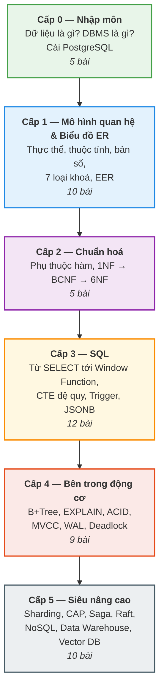

# Database từ A-Z

!!! quote ""
    **Một khóa học cơ sở dữ liệu đi từ con số 0 tới mức siêu nâng cao — và mọi khái niệm đều được giải thích sao cho học sinh cấp 2 cũng hiểu được.**

## Khóa học này dành cho ai?

Cho bất kỳ ai muốn hiểu **cơ sở dữ liệu** (*database*) thật sự, chứ không phải học thuộc vài câu lệnh rồi quên.

- Bạn **chưa biết gì** về database? Bắt đầu từ Bài 1. Không cần biết lập trình trước.
- Bạn **đã biết SQL** nhưng chưa hiểu vì sao truy vấn của mình chậm? Nhảy thẳng vào Cấp 4.
- Bạn đang **ôn thi** môn Cơ sở dữ liệu? Cấp 1 và Cấp 2 có đủ biểu đồ ER, chuẩn hoá, phụ thuộc hàm, đại số quan hệ.
- Bạn đang **phỏng vấn** vị trí backend? Cấp 4 và Cấp 5 là phần người ta hay hỏi mà ít ai trả lời tốt.

## Khóa học được viết theo một nguyên tắc duy nhất

> **Hiểu trước, gọi tên sau.**

Sách giáo khoa thường làm ngược: nêu định nghĩa trước, ví dụ sau. Người mới đọc xong định nghĩa đã thấy nản.

Ở đây, mỗi bài bắt đầu bằng **một chuyện có thật ở trường lớp** mà bạn đã từng trải qua. Bạn hiểu ý tưởng trước. Rồi mình mới nói: *"Cái bạn vừa hiểu đó, trong sách gọi là khoá ngoại (foreign key)."*

Nhờ vậy khóa học vừa dễ vào, vừa **không thiếu một thuật ngữ chuyên ngành nào**. Toàn bộ thuật ngữ được gom lại trong [Bảng thuật ngữ](glossary.md).

## Lộ trình 6 cấp độ

| Cấp | Tên | Số bài | Học xong thì làm được gì |
|---|---|---|---|
| **0** | Nhập môn | 5 | Hiểu database là gì, cài được PostgreSQL và chạy câu lệnh đầu tiên |
| **1** | Mô hình quan hệ & Biểu đồ ER | 10 | Vẽ được biểu đồ ER cho một bài toán thật và chuyển nó thành các bảng |
| **2** | Chuẩn hoá | 5 | Phát hiện và sửa được thiết kế bảng tồi bằng lý thuyết chuẩn hoá |
| **3** | SQL từ 0 tới cao thủ | 12 | Viết được mọi truy vấn thường gặp, kể cả xếp hạng và đệ quy |
| **4** | Bên trong động cơ | 9 | Đọc được `EXPLAIN`, biết tại sao truy vấn chậm và sửa được |
| **5** | Siêu nâng cao | 10 | Hiểu hệ phân tán, chọn được kiểu database đúng cho bài toán |

## Mỗi bài học có gì?

Mọi bài đều có đúng 8 phần, theo thứ tự cố định:

| | Phần | Mục đích |
|---|---|---|
| 🎯 | **Mục tiêu** | Học xong bạn làm được gì — đọc 10 giây là biết bài này có đáng đọc không |
| 🧠 | **Câu chuyện mở đầu** | Một tình huống đời thường để hiểu ý tưởng trước khi gặp thuật ngữ |
| 📖 | **Khái niệm & thuật ngữ** | Định nghĩa chính xác + bảng đối chiếu Việt – Anh |
| 🖼️ | **Sơ đồ** | Hình vẽ, vì có những thứ nhìn một cái là hiểu |
| 💻 | **Thực hành** | Câu lệnh SQL chạy được thật, không phải code giả |
| ⚠️ | **Lỗi thường gặp** | Những cái bẫy mà gần như ai cũng sập lần đầu |
| ✍️ | **Bài tập** | 3–5 câu, đáp án gập lại — tự làm trước rồi hãy mở |
| 🔑 | **Tóm tắt** | Đúng 5 dòng để ôn lại sau này |

## Chuẩn bị môi trường

Khóa học dùng **PostgreSQL 16**. Toàn bộ ví dụ chạy trên một database mẫu tên `truong_hoc` — quản lý học sinh, lớp, giáo viên, điểm, mượn sách của một trường THCS.

Dùng một database duy nhất cho cả 51 bài là cố ý: bạn không phải làm quen bối cảnh mới mỗi bài, và tới Cấp 4 thì chính cái database bạn đã quen được đem ra mổ xẻ, đánh index, rồi chia nhỏ.

Cách cài đặt và nạp dữ liệu nằm ở **Bài 5 — Cài PostgreSQL**.

## Bắt đầu

[Vào Bài 1 — Dữ liệu, thông tin và tại sao phải lưu trữ](cap-0-nhap-mon/01-du-lieu-va-thong-tin.md){ .md-button .md-button--primary }
